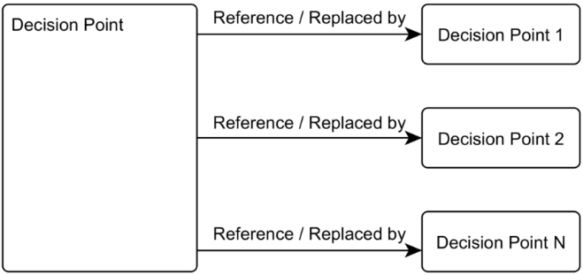

# Vývoj počítačových her

## 1. Programování počítačových her

**Game design** (z pohledu autorů) vs **Gameplay** (z pohledu hráče) vs **Game mechanics** (stavební bloky designu)

### Problematika herních mechanik

**Herní mechaniky** - rozhraní mezi hráčem a hrou; reakce na vstup hráče; dělají hru zábavnou

**Gameplay experience** - zkušenost/zážitek; vyvolává emoce; hráč je součástí hry

**Gameplay programmer** - kód pro interakce, které dělají hru zábavnou; musí rozumět tomu, co dělá hru dobrou/špatnou; ví, co je technicky možné; zajišťuje dobrou playability; systém, který převádí vstup od hráče do herních mechanik

**Playability** - jak snadno/dobře se hra hraje; jak dlouho je možné hru hrát; jak moc je možné hru hrát; podobná pro všechny hráče podobné kategorie, objektivnější
*Sada vlastností popisujících player experience*: satisfaction, learning, efficiency, immersion, motivation, emotion, socialization

**Game feel** - abstraktní, ale hráči ihned poznají, pokud to chybí; zábavné interakce, responzivní

**Juiciness** - abstraktní; dobrý pocit z interakcí; *maximální výstup na minimální vstup hráče*; obvykle to vidíme nebo slyšíme (pohyb, smršťování a protahování, camera shake, zvuky, particles, slow motion); může být to samé jako playability

**Tweening** - juiciness; přecházíme mezi počátečním a cílovým bodem nějakou funkcí; změna pozice, scale, průhlednosti, barvy; parametrická rovnice (parametr čas); $\text{Tween}(A, B, t) = A + P(t) \cdot (B-A)$;
*Manipulace*: Square $x^2$, Flip $1 - x$, Exponentiate $x^N$, Scale(Function, t) $t \cdot \text{Function}(t)$, ReverseScale(Function, t) $(1 - t) \cdot \text{Function}(t)$; lze skládat a zanořovat (neměníme tak vůbec funkci, jen $t$ zvenčí)
*Funkce*: Linear $t$, Quadratic $t^2$, SmoothStartN $t^N$, SmoothStop $1-(1-t)^N$, SmoothStepN $\text{Lerp}(\text{SmoothStart(N-1)}, \text{SmoothStop(N-1), t})$
*Blending*: $\text{Mix}(a, b, \text{weightB}) = (1 - \text{weightB}) \cdot a + \text{weightB} \cdot b$, $\text{Crossfade}(a, b, t) = a + t \cdot (b - a) = (1-t) \cdot a + t \cdot b$ (jako Mix, ale samotné $t$ je váha)

### Herní návrhové vzory

*Základní*:

- **Command** - Příkaz jako objekt třídy `Command` s metodou `Execute()`. Mapování tlačítek, akce pro postavy, undo/redo (metoda `Undo()`).
- **Flyweight** - Oddělíme *intrinsic state* (instance to mají společné) od *extrinsic state* (unikátní pro instanci). Instanced rendering, tile-based mapa, dekorace ve hrách.
- **Observer** - Třída `Observer` s metodou `OnNotify()`. Třída `Subject` se seznamem observerů (veřejné API pro přidání/odebrání). Stačí jen delegát (reference na metodu/funkci). Achievement system, GUI.
- **Prototype** - Prototypová instance, metoda `Clone()`. Spawner, data modelling prototypes.
- **Singleton** - Jen jedna instance, globálně přístupná. Statická metoda pro instanci (lze lazy), privátní konstruktor. Problém s couplingem, více vlákny a lazy inicializací v nepředvídatelný okamžik. File system API, audio player, logger.
- **State** - Změna chování objektu změnou stavu. Stavový automat, stav zapouzdřený ve třídě `State` s virtuálními metodami `Enter()`, `Exit()` a dalšími (např. `Update()`). Stavy postavy (skákání, krčení, chůze), AI, vstup hráče, navigace v menu.
- **Manager-Controller-Script** - Manager (obvykle singleton), controller (herní logika pro konkrétní případ), script (jednotlivé featury, parametrizovatelný).

*Sequencing*:

- **Double buffer** - Dvojice bufferů, do jednoho zapisujeme, druhý se vykresluje. Prohazujeme (změna pointeru nebo kopírování dat). Vypadá jako atomická změna. Rendering, fyzika a AI (update stavu objektů).
- **Game loop** - Hra běží konstantně rychle bez ohledu na rozdílný HW. Zpracuje vstup, updatuje herní stav, vykreslí hru. Implementace: fixed time step, variable time step (nedeterministické, nestabilní), fixed update with variable rendering.
- **Update method** - Objekty s komponentou s `Update()` metodou. Game loop + Update method + Component.

*Decoupling* (změna v jednom nevyžaduje změnu ve druhém):

- **Component** - Objekt je jen kontejner na komponenty. Komponenty jsou znovupoužitelné a mohou spolu komunikovat.
- **Event queue** - Oddělení zaslání události/zprávy od zpracování. Fronta nezpracovaných. Oproti Observer pozorujeme přímo objekt zprávy, ne objekt odesílatele. GUI, tutoriál, audio.

*Optimization*:

- **Data locality** - Využívá se CPU caching. Data ve spojité oblasti paměti v pořadí zpracování. Entity-component-system, particle system, AI (rozdělení na hot data a cold data).
- **Dirty flag** - Odvozená data se počítají z primárních drahým výpočtem. Cachujeme hodnoty. Poznačíme, jestli jsou rozsynchronizované, přepočítáváme, až když je potřebujeme. Scene graph, textový editor, physics engine (pohybující/nepohybující se objekty).
- **Object pool** - Předem vytvořená kolekce znovupoužitelných objektů (v souvislém kusu paměti), nemusíme pokaždé alokovat/uvolňovat paměť. Particles, audio.
- **Spatial partition** - Datová struktura, organizuje objekty dle pozice. Při změně pozice se updatuje. Efektivní vyhledávání. Mřížka, BSP, k-d trees, BVH, quadtree/octree. Jednotky v RTS, detekce kolizí.

### Skriptování her

Programovací jazyk enginu, skriptovací jazyk (interpretovaný, snadný; až při buildu se zkompiluje do nativního kódu), skript.

## 2. Architektura herních engine

**Herní engine** - Sada nástrojů pro usnadnění vývoje hry. Efektivní práce inženýrů, umělců i designerů. Game-agnostic, multiplatformní.

**Moduly** - např. rendering, physics, audio, animation, scripting, asset management, AI, networking, user interface.

**Library**
**Middleware** (jedna doména enginu, žádné IDE; FMOD, PhysX)
**Framework** (integruje více subsystémů, může mít vlastní execution loop; Phaser, MonoGame)
**Engine** (množina předchozích, vizuální editor, scripting, asset management, IDE; Unity, Unreal Engine, Godot)

**Monolithic** (konkrétní hra/žánr; GameMaker) vs **Modular** (snadno rozšiřitelné; Unity, Unreal Engine)

**Herní smyčka** - *single-threaded* (sada systémů, callback-driven, event-driven), *multi-threaded* (fork-join, per-system multithreading (částečně Unity), job model (false sharing; Unreal Engine))

*Windows message pump* - Program dává vědět, že je naživu. Kontroluje zprávy od OS a odpovídá, pak teprve provede iteraci game loop.

### Vrstvy architektur

**Game-specific subsystems** - *Game-specific rendering*, *Player mechanics*, *Game cameras*, *AI*, Weapons, Power-ups, Vehicles

**Game-agnostic layer** - *Gameplay foundations* (game worlds and object models, scripting system, artificial intelligence foundations, event/messaging system), *Rendering engine* (low-level renderer, scene graph, visual effects, front end), *Profiling and debugging*, *Physics system* (collision system, physics system), *Animation*, *Human interface devices*, *Audio*, *Networking/Multiplayer*

**Resources** (3D model, texture, material, font, skeleton, collision) - *Resource manager*

**Core systems** - *Assertions*, *Memory management*, *Math library*, *Data structures and algorithms*, *Asynchronous file I/O*

**Platform independence layer** - Wrapper nad platform-specific funkcemi

**3rd party SDKs** (obalit SDK middlewaru), **OS**, **Drivers** (abstrakce komunikace), **Hardware** (PC, mobilní platformy, herní konzole)

### Výpočetní modely

**Herní model** - Oddělit technické detaily toho, jak je svět updatován, od způsobu, jakým se definuje a vytváří. Obvykle *game-agnostic*. Abstrahovat herní objekty tak, aby se *snadno definovaly* a mohly být *zpracovány více různými systémy* současně.

**Inheritance-based** - Hierarchie tříd pro herní objekty, dědí od společného GameObject, implementují rozhraní pro různé systémy. Snadno vede na diamantovou dědičnost, která nelze.
**Composition-based** - Objekt složíme z chování implementujících rozhraní. Špatně rozšiřitelné, nepodporuje změny (nové rozhraní se musí injectovat, je třeba měnit kód).
**Component-based** - GameObject se skládá z komponent (data, funkcionalita), za runtime, nejsou zadrátované v kódu. Společné rozhraní IComponent, může být dědičnost i kompozice. Komponenty pro integraci do systému i gameplay feature. Způsoby implementace (postupně se rozšiřují): *rigid composition* (datové položky), *seznam komponent* (list/pole, špatně se získává konkrétní), *podtřídy* (potomek GameObject, komponenty se konfigurují v konstruktoru, přidají do seznamu), *instance* (ne třídy, jen instance GameObject (prázdný seznam komponent), manuálně přidáme komponenty, komponenty i GameObject implementují ICloneable)
(**Entity-component system**)

**Scene graph** - Stromová hierarchie objektů, lze seskupovat objekty. Komponenta `Transform`.

### Entity-component system

Navazuje na component-based, je to ale data-oriented design (oproti object-oriented). Dedikovaná pole komponent přímo v systémech. Nemusí se hodit pro všechny typy gameplay kódu.

**Entity** (herní objekt, ID lze přeložit na index komponenty v systému), **komponenty** (obvykle pouze data), **systémy** (manipuluje a řídí kód).

### Správa paměti

"Per-frame" blok paměti (pro poslání dat do dalšího framu)

**Memory manager** - Alokuje větší množství paměti hned ze začátku, pak si ji sám spravuje. Může použít různé strategie.

**Single sided stack-based** - Velký kus paměti, pointer na konec obsažené části. Při alokaci vrátíme pointer a posuneme o velikost požadovaných dat. Nelze libovolně uvolňovat (došlo by k fragmentaci).
**Double sided stack-based** - Dva pointery. Data pro level zleva, data pro frame zprava. Na konci framu resetujeme pravý pointer.
**Double-frame allocator** - Nejprve alokujeme všechna data levelu (pokud jsou fixní), pak z jedné strany paměť framu $n$, z druhé paměť framu $n-1$. Můžeme předávat data mezi framy.
**Pool allocator** - Definujeme memory budget (počet instancí), alokujeme dle toho paměť. Můžeme získávat a vracet instance. Seznam aktivních a nevyužívaných.

### Příklady konkrétních instancí architektur

**CryEngine** - vrstvy popsané výše
**Unity** - *asset management*, *scene management*, *custom scripting*, *rendering*, *UI*, *physics*, *animation*, *user input*, *game loop*, *multi-platform*, *audio and video*, *networking*, *navigation* a spoustu dalšího

##  3. Herní design

**Herní design** - sada hypotéz; rozhodnutí o mechanikách, obtížnosti, narativu, combatu, skóre, GUI; balancing; level design; začít zážitkem, co mají hráči cítit a prožívat

**Běžné požadavky**: *accessibility* (pick up and play), *instant save/load*, *always possible to win*

**Formální aspekty her** (nejen videoher) - *Active participation of players* (interaktivní), *Goal*, *Rules*, *Procedures/agency* (co můžeme dělat a co se pak stane), *Resources*, *Conflict*, *Outcome*, *Magic circle* (jiný svět, rozhodnutí v něm by neměla mít následky ve skutečném světě)

**Definice hry** - neexistuje přesná definice; dobrovolná aktivita, make-believe, založená na pravidlech, série smysluplných rozhodnutí, výzvy v simulovaném prostředí

**Elementy hry** - *Aestetics*, *Story* (posloupnost událostí, větvení), *Mechanics* (pravidla, procedury, cíle, druhy interakcí), *Technology* (možnosti i omezení)

### Kdo je herní designér

**Herní designer** - komunikuje s ostatními, přichází s nápady, má poslední slovo, vše pospojuje do funkčního celku, dokumentuje, uvědomuje si limity, rozumí hráčům

**Dovednosti** - *Playfulness*, *Communication*, *Ability to compromise* (naslouchat ostatním), *Teamwork*, *Pressure resistance*, *Game literacy*, *Creativity*

### Osy herního designu

*Osy pro návrh RPG*:
**Randomness** vs **Determinism** - Hráči by se neměli cítit tak, že prohráli kvůli špatnému hodu kostkou, ale kvůli volbě, kterou udělali. Determinismus můžeme přidat třeba omezeným intervalem náhodnosti (nelze úplně selhat, ani když máme smůlu).
**Mechanics** vs **Content** - Spoustu obsahu, nebo méně obsahu a lepší zážitek z mechanik.
**Story** vs **Freedom** - Lineární hra s příběhem, nebo open world hra s důrazem na svobodu.
**Options** vs **Approachability** - Spoustu možností postavy (statistiky, dovednosti) dělá hru nedostupnou pro nováčky.

**Challenge** - překážky po cestě a obtížnost, obvykle se zvyšuje
**Skills** - rozsah dovedností hráčova avatara (může se rozšiřovat, zužovat, měnit), mohou být power-upy

### Herní žánry

**Convergent evolution** - dvě cesty, které vedly k vytvoření moderních videoher:
*Action simulation ancestry* - války a souboje $\rightarrow$ sport (imitace války) a strategické hry (simulace taktiky války, např. šachy) $\rightarrow$ early competitive action game prototypes $\rightarrow$ arkádové hry a akční hry (konzolové a počítačové)
*Shared narrative ancestry* - fantasy knihy $\rightarrow$ stolní RPG $\rightarrow$ textové hry a online role-playing MUDs $\rightarrow$ grafické MUDs a MMORPGs

**Action** (shooters, fighting games, hack and slash)
**Adventure** (point-and-click, visual novels, interactive movie)
**Sports** (simulation, arcade, management)
**Simulation** (flighting sims, business/city, vehicle driving, life sims)
**Platformer** (2D traditional, puzzle platformer, run and gun)
**RPG** (action RPG, Japanese RPG, open world RPG)
**First-person shooter** (military FPS, hero FPS, immersive sims)
**Action-adventure** (cinematic action-adventure, action RPG, open world action adventure)
**Fighting** (2D fighters, 3D fighters, platform fighters)
**Real-time strategy** (traditional RTS, MOBA, tower defense)
**Racing** (simulation, arcade, futuristic)
**Shooter** (run and gun, bullet hell, third-person shooter, looter shooter)
**Puzzle** (physics puzzle, matching puzzles, logic puzzles)
**Casual** (match 3, hidden objects, hyper casual)
**Strategy game** (4X, real-time tactics, grand strategy)
**MMORPG** (fantasy MMORPG, sandbox MMORPG, action combat)
**Stealth** (tactical espionage, immersive sims, stealth horror)
**Party** (board & card games, trivia games, activity games)
**Action RPG** (looter shooters, soulslike, isometric)
**Tactical role-playing** (Japanese TRPGs, strategy-JRPG hybrids)
**Survival** (survival sandbox, survival horror, survival simulation)
**Battle royale** (hero shooters, military shooters)

### Specifika herních platforem

**Výhody**: Větší šance na dlouhodobější prodeje, šance nalezení zlaté platformy, levný zdroj příjmů, větší credibility.
**Nevýhody**: Není jednoduché pokrýt všechny, stojí to hodně prostředků, může to poškodit značku, musíme dělat kompromisy, údržba je náročná.
**Zaměřit se na**: *Control scheme*, *Form factor/experience*, *Interface*, *Technické schopnosti*

### Game design dokument

**Game design document** (GDD) - definuje vizi, ještě před vývojem, není to magický dokument, pomáhá efektivně komunikovat, iterativně se mění
Různé formy: *Design bible*, *Design wiki*, *One-page design*

**Funkce** - promyšlení, zapamatování, komunikace, zajištění financí.

**Vlastnosti** - krátký, stručný, cílený, ilustrovaný, jasně formulovaný.

**Struktura** - *shrnutí*, *pilíře návrhu*, *herní mechaniky* (core gameplay, game flow/loop, ovládání, postavy, nepřátelé, AI, multiplayer), *uživatelské rozhraní*, *grafika* (styl, nálada), *zvuky a hudba* (styl, formát, zvukové efekty, hudba), *příběh* (backstory, svět, popis postav, text a dialogy), *vývojové nástroje*, *rozvržení práce*, *analýza trhu* ...

### Historie herního trhu a jeho trendy

**Historie RPG** - *Akalabeth: World of Doom* (1979), *Final Fantasy* (1987)

**Historie herní grafiky** - *Mystery House*

**Historie arkádových her** (Atari, SEGA) - *Periscope* (1966), *Pong* (1972), *Space Invaders* (1978), *Pacman* (1980), *Donkey Kong* (1981), klesal zájem, 90. léta renesance (fighting games, multiplayer), *Street Fighter II* (1991), *Mortal Combat* (1992)

**Historie konzolí** (Atari, Nintendo, SEGA) - *Fairchild Channel F* (1976), *Atari 2600* (1977), *Nintendo Family Computer* (1983), *Nintendo Entertainment System* (1985), *SEGA Genesis* (1989)

**Historie eSports** - *Space Invaders turnaj* (1980), *Nintendo Power Fest* (1990), *Rock the Rock* (1994)

**Historie násilí ve hrách** - *Street Fighter II* (1991), *Mortal Combat* (1992), *Night Trap* (1992), *Doom* (1993)

**Ekonomická historie videoher**: Na začátku hodně silné arkády, pak začaly klesat. Konzole také relativně dost, ale 1983 úpadek. PC hry pak začaly růst, postupně až dodnes. Game Boy zahájil růst handheld konzolí, pak ale postupně nahrazené mobilními telefony (hodně velký nárůst až dodnes). 

**Aktuální trendy herního trhu**:
Největší tržby mobilní hry (a stále roste), pak konzolové, pak PC.
Největší tržby v Asii, pak v Severní Americe, pak v Evropě.
V Severní Americe sice málo hráčů, ale platí hodně.
Na evropském trhu hlavně Francie, Německo, Španělsko a Velká Británie. Nejvíc konzole, pak mobilní telefony.
Na mobilním trhu hlavně nákupy v aplikacích, méně placené aplikace.

**Aktuální trendy**: *Mobilní hry* (casual, free-to-play), *Free-to-play* (volitelné transakce), *Virtuální realita*, *Rozšířená realita* (omezení technologie, mobilní telefony), *Cross-platform play*, *Cloud gaming* (streamování her ze serveru), *Indie hry*, *Esports*, *Live services* (living games, nový obsah, battle pass), *Game streaming* (sledování herních streamů), *Game as a service* (měsíční přístup ke sbírce her)

## 4. Vývojový cyklus počítačové hry

### Fáze vývojového cyklu

Příprava, vývoj, stabilizace

**Plánování** - žánr, styl, cílové publikum, mechaniky, postavy, engine, analýza trhu, platformy, koncept/design, rozpočet, technologie, vydavatel, záložní plány
**Pre-produkce** - rozvržení práce, storyboard, prototyp, proof-of-concept, benchmarky
**Produkce** - modely, animace, zvuky, dialogy, mechaniky, grafika, UI, veškerý obsah
**Debug and testing** - rendering and performance issues, exploits, softlocks, difficulty, scripting and acting errors
**Pre-launch** - marketing, trailery, dema, early access, nachystání infrastruktury, otestování zátěže
**Launch** - zbývající bugy, quality of life vylepšení, finální úpravy
**Post-launch/Maintenance** - bug fixes, DLCs, game-balancing patches

### Herní design řízený daty

Data pomáhají pokládat lepší otázky. Dobrá příprava může nakonec ušetřit spoustu práce. Měli bychom to využít, abychom udělali hru lepší pro hráče.

**Marketing events** (*acquisition flow*, *ROI balancing*), **Internal data events** (události ve hře), **External data sets** (hodnocení v obchodě, shlédnutí na YT, trendy, demografická data), **Soft feedback** (recenze, play-testy)

**Příprava a aplikace dat** - *Data gathering* (co nejvíc dat), *Data evaluation* (dashboard, dotazy), *Data application* (value changes, new content, new features)

### Správa dat (resource management)

Nástroje třetích stran pro vytvoření (plugin), import do herního enginu (komprese, převod formátu).

**Resource manager** - Práce s assety, převod assetů do herního enginu i správa za runtime (nahrání/odnahrání). Nahrávání assetů je pomalé, buď vše předem, nebo asynchronně na pozadí připravit.
**Asset Conditioning Pipeline** (pravidla pro řešení závislostí) - DCC tool $\rightarrow$ Resource Exporter $\rightarrow$ Resource compiler $\rightarrow$ Resource Linker
**Resource database** - Přehled o assetech v editoru a závislostmi mezi nimi. Spravuje veškerá metadata. Můžeme pracovat s více typy zdrojů, vytvářet nové, mazat existující, prohlížet a modifikovat, přesouvat, odkazovat se na jiné, vyhledávat.
**Resource registry** - Registr nahraných zdrojů, dictionary s GUID jako klíčem a pointerem na zdroj v paměti jako hodnotou.

### Testování počítačových her

**Unit testy**

**Interní testování** vs **Uzavřené testování** vs **Otevřené testování**

**Play-testing** - *Playcentric paradigm* (hráč je klíčový), testujeme hru na hráčích
**Introspection** - Sledujeme, snažíme se to zhodnotit. Je to ale subjektivní. Musíme se dívat na hru jako jiní hráči.

**QA** (technické, chyby v kódu, stabilita) vs **GUR** (herní zážitek, hratelnost, skutečný zážitek oproti plánovanému; preparation, execution, analysis, reporting)

**Dotazníky** (flow, engagement, presence, agency, usability/playability) - *GameFlow*, *GEQ*, *Gameplay-Scale*, *GUESS*, *PANAS*, *Player Immersion in Computer Game Narrative*

**GUX metody** - *fyziologické*, *psychologické*, *chování*
**GUR metody** - *A/B testing*, *Telemetry analysis*, *Diary/camera study*, *Ethnographic field study*, *Online survey*, *Interview*, *Focus group*, *Heuristic evaluation*, *Review* (experti posuzují na základě svých zkušeností), *Usability test* (pozorujeme, poznamenáváme), *Unmoderated usability test* (automatický test), *RITE test* (pozorujeme, poznamenáváme, vyřešíme, opakujeme), *Initial experience playtest*, *Extended playtest*, *Benchmark playtest* (na konci vývoje, standardizovaný test, self-report), *Market segmentation* (cluster analysis, self-report), *Personas* (fiktivní postava pro typ hráče), *Narrative usability* (prototyp narativu), *Card sort*

### Vývojářské role

**Production** (dává úkoly designu, sbírá výsledky QA) - *Publisher*, *Producer*, *Esports producer*, *Marketing executive*, *Assistant producer*, *Community manager*
**Design** (úkoluje všechny ostatní) - *Lead designer*, *Gameplay designer*, *Script writer*, *Level designer*, *UX/UI designer*
**Art** (vstup od Design, výstup do Animation a Technical art) - *Concept artist*, *3D modelling artist*, *Environment artist*, *Texturing artist*
**Animation** (vstup od Art, výstup do Programming) - *Animator*, *Technical animator*
**Technical art** (vstup od Art, výstup do Programming) - *Technical artist*, *VFX artist*, *Graphics programmer*
**Programming** (vstup od Design, Technical art, Animation, výstup do QA a Audio) - *Engine programmer*, *Gameplay programmer*, *Physics programmer*, *AI programmer*, *Generalist programmer*, *Tools engineer*, *Network programmer*, *VR/AR programmer*
**Audio** (vstup od Programming, výstup do QA) - *Music composer*, *Audio programmer*, *Sound designer*
**QA** (výstup do Production) - *QA tester*, *Build engineer*

### Herní analytiky

**Herní analytiky** - informace o zajímavých událostech, odpovědi na otázky, detekce problémů, porovnání variant

### Vodopádový model a agilní metodiky návrhu her

*Rozlišení*: Jestli je iterace daná časem, nebo obsahem. Jestli můžeme změnit výsledky předchozí iterace, nebo je jen rozšířit. Jestli můžeme znát obsah všech iterací předem.

**Waterfall** - Předem definované kroky. Požadavky, analýza, design, coding, testing, závěr. Špatně se reaguje na měnící se požadavky. Nefunguje dobře ve vývoji her (je třeba provádět rychlé create-run-play-test iterace).

**Agile** - Rychlejší iterace, continuous delivery. Není třeba plánovat roky dopředu, hodí se pro dlouhodobý rozvoj.
*Scrum* - Backlog, To do, In progress, Testing, Done. Sprint (plánování, review, daily scrum meeting).
*Kanban* - Jednodušší, žádné role, v podstatě žádné iterace, jen flow (nemají pevnou délku, obsah se může měnit), maximální počet tasků ve sloupci omezen. Hodí se, když je třeba spoustu změn nebo když se vytváří spoustu věcí stejného druhu (assety - modely, animace, scénář).

### Obchodní modely komercializace her

**Game as a service** - Zaplatíme za měsíční přístup k velké sbírce her.
**Streaming services** - Hry se streamují ze serveru, není třeba drahý HW, stačí rychlé připojení.

**Freemium** - Hra je zdarma, uvnitř jsou placené featury.
**Premium** - Zakoupení fyzické kopie.
**Digital distribution platforms** - Digitální kopie, jen online. Steam, Google Play, Epic Games Launcher, berou si podíl z tržeb.
**Subscription** - Hráči pravidelně platí, aby mohli hrát.
**Microtransactions** - Často free-to-play hry; *in-app purchases*, *DLCs*, *battle/season pass*.
**Advertising**
**Real money competition**

**Publishing deal** - Externí publisher (financování, PR, marketing).
**Distribution deal** - Externí publisher (PR, marketing, lokalizace, ale bez financování).
**Self-publishing** - Vše sami, využijeme třeba Steam, Google Play.

## 5. Narativita a hry

**Dramatické elementy** (dělají zážitek poutavý emocionálně) - *Challenge* (tak akorát obtížná; *Flow*, balanc mezi výzvou a schopnostmi), *Play* (prostor, kde provádíme akce, svoboda, seberealizace), *Premise* (zasazení světa a děje, možnost interpretace, postupně se dozvídáme víc), *Characters*, *Story-telling* (nejistý konec, lineární nebo emergentní, může se větvit, smysluplné volby), *Conflict* (problém, který musíme vyřešit, emocionálně nás pojí k výsledku příběhu, ke hře a k postavě)

### Rozdíl mezi games of emergence a games of progression

Moderní videohry jsou výsledkem evoluce dvou základních struktur. Liší se způsobem, jakým hráči představují výzvu.

**Games of emergence** - Málo jednoduchých pravidel, kombinují se. Více způsobů jak dosáhnout cíle. Nemáme nad tím kontrolu. Existují pro ně *návody*.
**Games of progression** - Předdefinovaná posloupnost výzev, strukturované, hodně prostoru pro storytelling. Máme nad tím velkou kontrolu. Existují pro ně *walkthrough*.

#### Chtěná a nechtěná emergence

**Emergence** jako nepředvídané situace/chování.

**Chtěná emergence** (desirable) - Interakce vedou na zajímavý gameplay.
**Nechtěná emergence** (undesirable) - Zneužití pravidel, narušení struktury.

### Environmentální storytelling

**Environmentální storytelling** - Vyprávění příběhu pomocí prostředí, vizualizuje výsledky nějakých událostí, hráč to nějak interpretuje, přímo se účastní narativu.

### Procedurální rétorika

**Procedurální rétorika** - Hra předává nějakou zprávu nebo myšlenku skrz svůj systém pravidel, interakcí a procesů. Tím se liší od jiných typů médií.

Příklady: *Animal Crossing* (zadlužení), *Bully* (středoškolská politika).

### Ludonarativní disonance

**Ludonarativní disonance** - Gameplay a storytelling spolu dobře nefungují. Mechaniky jsou v rozporu s příběhem. Pak příběh neodpovídá tomu, co děláme. Když si to uvědomíme, naruší to flow.

Příklady: *Uncharted 4* (hodný člověk, zabíjí tisíce), *Spec Ops: The Line* (jsme hrdina, pak si uvědomíme, že ne), deskové hry (budujeme, někteří hráči mohou vychovat novou generaci, někteří ne, nedává to smysl)

----

<div style="page-break-after: always; break-after: page;"></div>

# Počítačová grafika pro hry

## 1. Souřadnice, transformace, kvaterniony

Nejprve projdeme *základní operace* s vektory.

**Skalární součin** (dot product): $p \cdot q = \sum_i p_i q_i$ nebo také $p \cdot q = |p| |q| \cos \alpha$, maticově $p \cdot q = p^Tq$

**Projekce vektoru** (*ortogonální projekce*): $p_{proj} = \frac{p \cdot q}{|q|} \cdot \frac{q}{|q|} = \frac{p \cdot q}{q \cdot q} q$
Maticově pomocí $qq^T$ jako $p_{proj} = \frac{1}{|q|^2} (qq^T) p = \frac{1}{|q|^2} \begin{pmatrix} q_x^2 & q_xq_y & q_xq_z \\ q_xq_y & q_y^2 & q_yq_z \\ q_xq_z & q_yq_z & q_z^2 \end{pmatrix} \begin{pmatrix} p_x \\ p_y \\ p_z \end{pmatrix}$

**Vektorový součin** (cross product): $p \times q = \begin{pmatrix} p_yq_z - p_zq_y, p_zq_x - p_xq_z, p_xq_y - p_yq_x \end{pmatrix}$ a $|p \times q| = |p||q| \sin \alpha$
Maticově $p \times q = \begin{pmatrix} 0 & -p_z & p_y \\ p_z & 0 & -p_x \\ -p_y & p_x & 0 \end{pmatrix} \begin{pmatrix} q_x \\ q_y \\ q_z \end{pmatrix}$

**Násobení matic**: Pro $A \cdot B = C$ je $c_{ij} = \sum_{k = 1}^n a_{ik}b_{kj}$ (skalární součin řádku a sloupce)

### Homogenní souřadnice

**Afinní prostor** - Definován množinou bodů a vektorů, jsou uzavřené na základní operace. Je to podprostor projektivního prostoru.
**Projektivní prostor** - Rozšíření afinního prostoru o body v nekonečnu. Pro reprezentaci bodů používáme homogenní souřadnice (pak lze i projektivní transformace vyjádřit maticí).

**Homogenní souřadnice** - Pro popis bodů v projektivním prostoru. Přidá se složka $w$, tzv. váha bodu. Tím prostor nižší dimenze zasadíme do prostoru vyšší dimenze.
Spojení transformací do jedné matice: $T \cdot R \cdot S \cdot \mathbf{v} = M \cdot \mathbf{v}$ (pořadí je důležité)
Rychlá inverze jen s rotací a translací: $M^{-1}(R, \mathbf{t}) = M(R^T, R^T \cdot -\mathbf{t})$​.

*Z kartézských na homogenní*: $[x, y, z] \rightarrow [x, y, z, 1]$
*Z homogenních na kartézské*: $[x, y, z, w] \rightarrow [\frac{x}{w}, \frac{y}{w}, \frac{z}{w}]$ (pro $w \neq 0$)

**Sčítání**: $(x_1, y_1, w_1) + (x_2, y_2, w_2) = (x_1w_2 + x_2w_1, y_1w_2 + y_2w_1, w_1w_2)$
**Násobení skalárem**: $\alpha \cdot (x, y, w) = (\alpha x, \alpha y, w)$

### Afinní a projektivní transformace v rovině a v prostoru

**Afinní transformace**: Zachovávají dimenze (z bodů na body, z přímek na přímky) a paralelizmus (i poměr délek rovnoběžných úseček zůstane stejný). Nemusí nutně zachovávat úhly a vzdálenosti bodů (poměr vzdáleností bodů na stejné úsečce se však zachová). Např. translace, rotace, škálování, zkosení, zrcadlení.
**Projektivní transformace**: Zobrazují body v souřadnicích nižší dimenze na průmětnu (rovina/přímka). Podle typu projekce se zachovávají různé vlastnosti.

**Transformační matice** reprezentuje transformaci, pak jí násobíme vektor souřadnic.
$\begin{pmatrix} x' \\ y' \\ z' \end{pmatrix} =  \begin{pmatrix} t_{11} & t_{12} & t_{13} \\ t_{21} & t_{22} & t_{23} \\ t_{31} & t_{32} & t_{33} \end{pmatrix} \cdot \begin{pmatrix} x \\ y \\ z \end{pmatrix}$

#### Afinní transformace

V homogenních souřadnicích můžeme každou afinní transformaci reprezentovat maticí, můžeme je i skládat.

**Obecná afinní transformace**: $A \cdot p = \left( \begin{array}{ccc|c} &&& \\ & M & & T \\ &&& \\ \hline 0 & 0 & 0 & 1 \end{array} \right) \cdot \begin{pmatrix} p_x \\ p_y \\ p_z \\ p_w \end{pmatrix}$

**Translace**: Ve 2D $T(t_x, t_y) = \begin{pmatrix} 1 & 0 & t_x \\ 0 & 1 & t_y \\ 0 & 0 & 1 \end{pmatrix}$, ve 3D $T(t_x, t_y, t_z) = \begin{pmatrix} 1 & 0 & 0 & t_x \\ 0 & 1 & 0 & t_y \\ 0 & 0 & 1 & t_z \\ 0 & 0 & 0 & 1 \end{pmatrix}$​.

**Rotace**: Ve 2D kolem počátku o úhel $\alpha$, ve 3D kolem kartézských os.
$R_x(\alpha) = \begin{pmatrix} 1 & 0 & 0 & 0 \\ 0 & \cos\alpha & -\sin\alpha & 0 \\ 0 & \sin\alpha & \cos\alpha & 0 \\ 0 & 0 & 0 & 1 \end{pmatrix}$, $R_y(\alpha) = \begin{pmatrix} \cos\alpha & 0& \sin\alpha & 0 \\ 0 & 1 & 0 & 0 \\ -\sin\alpha & 0 & \cos\alpha & 0 \\ 0 & 0 & 0 & 1 \end{pmatrix}$, $R_z(\alpha) = \begin{pmatrix} \cos\alpha & -\sin\alpha & 0 & 0 \\ \sin\alpha & \cos\alpha & 0 & 0 \\ 0 & 0 & 1 & 0 \\ 0 & 0 &0 & 1 \end{pmatrix}$

**Škálování**: Ve 2D $S(s_x, s_y) = \begin{pmatrix} s_x & 0 & 0 \\ 0 & s_y & 0 \\ 0 & 0 & 1 \end{pmatrix}$, ve 3D $S(s_x, s_y, s_z) = \begin{pmatrix} s_x & 0 & 0 & 0 \\ 0 & s_y & 0 & 0 \\ 0 & 0 & s_z & 0 \\ 0 & 0 & 0 & 1 \end{pmatrix}$

**Zkosení**: Ve 2D $Sh(a, b) = \begin{pmatrix} 1 & a & 0 \\ b & 1 & 0 \\ 0 & 0 & 1 \end{pmatrix}$, ve 3D $Sh(a, b, c, d, e, f) = \begin{pmatrix} 1 & a & b & 0 \\ c & 1 & d & 0 \\ e & f & 1 & 0 \\ 0 & 0 & 0 & 1 \end{pmatrix}$

**Složené transformace**: $T_3 \cdot (T_2 \cdot (T_1 \cdot p)) = (T_3 \cdot T_2 \cdot T_1) \cdot p$
*Inverzní transformace* po krocích: z $M = A \cdot B \cdot C$ máme $M^{-1} = C^{-1} \cdot B^{-1} \cdot A^{-1}$.
Pro *ortonormální matice* (např. rotace) pak $R^{-1} = R^T$.

**Transformace tuhého tělesa** - Mění orientaci a pozici, ale zachovávají tvar (skládají se pouze z translací a rotací). Patří sem i převod mezi souřadnicovými systémy.

**Transformace normálových vektorů** - Speciální matice $N = (M^{-1})^T$.

**Převod mezi souřadnicovými systémy** - $Cs(A, s, t, u) = R_z(\gamma) \cdot R_x(\beta) \cdot R_z(\alpha) \cdot T(-A)$
Pokud je počátek v nule a všechny vektory jsou jednotkové, matice $M_{stu \rightarrow xyz}$ má jednoduše ve sloupcích souřadnice vektorů systému $[s, t, u]$ v systému $[x, y, z]$.

#### Projektivní transformace

**Projekce** - Z vyšší dimenze do nižší dimenze, ale v počítačové grafice pořád nějak zachováváme i souřadnici $z$​.
Různé druhy projekce podle zachovaných vlastností a posílání promítacích paprsků.

**Rovnoběžné projekce** - Promítací paprsky jsou rovnoběžné, zachovává se rovnoběžnost.
   **Kolmé projekce** - Promítací paprsky jsou rovnoběžné a zároveň kolmé na průmětnu.
      **Mongeova projekce** - Průmětna kolmá na jednu ze tří os. Půdorys, nárys, bokorys.
      **Axonometrie** - Obecná kolmá projekce, průmětna určena vzdáleností na osách.
         *Isometrie* ($a$, $a$, $a$), *Dimetrie* ($a$, $a$, $b$), *Trimetrie* ($a$, $b$, $c$)
   **Kosoúhlé projekce** - Ne kolmé, může dojít ke zkrácení měřítek některých os.
      **Kabinetní projekce** - Průmětna $xy$, měřítko $z$ na $1/2$, pod úhlem ($30°$ nebo $45°$)
      **Kavalírní projekce** - Stejné měřítko na všech osách, pod úhlem ($30°$ nebo $45°$​​)
**Perspektivní (středové) projekce** - Promítací paprsky tvoří svazek procházející středem projekce, nezachovávají se rovnoběžky.
   **Jednobodová** - Průmětna rovnoběžná se 2 osami, jeden hlavní úběžník.
   **Dvoubodová** - Průmětna rovnoběžná s 1 osou, dva hlavní úběžníky.
   **Tříbodová** - Průmětná má zcela obecnou polohu, tři hlavní úběžníky.

**Projekční matice**: Používá se k přepočtu souřadnic do projekce, např. ze 3D do 2D pro zobrazení objektu na monitoru.

**Obecná kolmá projekce** (*axonometrie*): Pozice pozorovatele $S$ (tj. bod $[0, 0]$ průmětny), normálový vektor průmětny $N$ (opačný ke směru pohledu, osa $z$), směr nahoru $u$ (osa $y$). Pak je vektor doprava $u \times N$ (osa $x$). Kolmá projekce je pak převedení souřadnic $Cs(S, u \times N, u, N)$.

**Kosoúhlá projekce**: Průmětna $xy$, koeficient zkrácení $K$, úhel průmětu osy $z$ je $\alpha$.
$\begin{pmatrix} 1 & 0 & K \cdot \cos\alpha & 0 \\ 0 & 1 & K \cdot \sin\alpha & 0 \\ 0 & 0 & 1 & 0 \\ 0 & 0 & 0 & 1 \end{pmatrix}$

**Obecná středová projekce**: Máme střed projekce $S$, normálový vektor průmětny $N$, vzdálenost průmětny od středu projekce $d$ a svislý vektor $u$. Pak přesuneme střed projekce do počátku, srovnáme $N$ do osy $z$, tedy $Cs(S, u \times N, u, N)$ a pak provedeme perspektivní projekci. $\begin{pmatrix} 1 & 0 & 0 & 0 \\ 0 & 1 & 0 & 0 \\ 0 & 0 & 1 & 0 \\ 0 & 0 & 1/d & 0 \end{pmatrix} \cdot \begin{pmatrix} x \\ y \\ z \\ 1 \end{pmatrix} = \begin{pmatrix} x \\ y \\ z \\ \frac{z}{d} \end{pmatrix}$ $\Rightarrow$ $\begin{pmatrix} x \frac{d}{z} \\ y \frac{d}{z} \\ d \end{pmatrix}$

### Kvaterniony

**Eulerovy úhly** - $E(h, p, r) = R_y(h) \cdot R_x(p) \cdot R_z(r)$, tj. yaw/head, pitch, roll). Špatně se interpoluje a může nastat gimbal lock.
**Gimbal lock** - Otočí se tak, že se dvě osy ztotožní. Přijdeme o jeden DoF.

**Kvaternion**: $q = (\mathbf{v}, w) = ix + jy + kz + w$, kde $\mathbf{v} = (x, y, z) = ix + jy + kz$ a $w \in \mathbb{R}$
Těleso, zobecnění komplexních čísel ve 4D, pro zápis rotace a orientace v prostoru.
Platí $i^2 = j^2 = k^2 = ijk = -1$, tedy také $jk = -kj = i$, $ki = -ik = j$ a $ij = -ji = k$.

**Sčítání**: $(\mathbf{v_1}, w_1) + (\mathbf{v_2}, w_2) = (\mathbf{v_1 + v_2}, w_1 + w_2)$
**Násobení**: $\mathbf{qr} = (\mathbf{v_q}, w_q)(\mathbf{v_r}, w_r) = (\mathbf{v_q \times v_r} + w_r \mathbf{v_q} + w_q \mathbf{v_r}, w_q w_r - \mathbf{v_q \cdot v_r})$, není komutativní
Kvaterniony reprezentují rotace, vynásobením získáme složenou rotaci.
**Násobení skalárem**: $s\mathbf{q} = (0, s)(\mathbf{v}, w) = (s\mathbf{v}, sw)$
**Sdružený kvaternion**: $(\mathbf{v}, w)^* = (\mathbf{-v}, w)$
**Unit**: $id = (\mathbf{0}, 1)$, reprezentuje identitu (je to také jednotkový kvaternion)
**Norma kvaternionu** (squared absolute value): $|\mathbf{q}|^2 = n(\mathbf{q}) = \mathbf{qq^*} = x^2 + y^2 + z^2 + w^2$
Tedy $|\mathbf{q}| = \sqrt{\mathbf{qq^*}}$.
**Inverzní kvaternion**: $\mathbf{q^{-1}} = \frac{\mathbf{q^*}}{n(\mathbf{q})} = \frac{\mathbf{q^*}}{|\mathbf{q}|^2}$ (dělí se po složkách)

**Jednotkový kvaternion** (*unit quaternion*): $n(q) = 1$, tj. $x^2 + y^2 + z^2 + w^2 = 1$.
**Goniometrická podoba**: $\mathbf{q} = (\mathbf{u_q} \sin\theta, \cos\theta)$, tj. rotace o úhel $\theta$ kolem osy $\mathbf{u_q}$, přičemž $\mathbf{q}$ a $-\mathbf{q}$ jsou ta samá rotace (osa rotace otočená o 180°). Identita je nulová rotace.

**Logaritmus**: $\log \mathbf{q} = \theta \mathbf{u_q}$​, protože $\mathbf{q} = \mathbf{u_q} \sin \theta + \cos\theta = \exp(\theta \mathbf{u_q})$
**Mocnina**: $\mathbf{q^t} = (\mathbf{u_q}\sin\theta + \cos\theta)^t = \exp(t \theta \mathbf{u_q}) = \mathbf{u_q} \sin t \theta + \cos t \theta$

**Rotace**: $\mathbf{p' = q p q^{-1} = q p q^*}$, kde $\mathbf{q} = (\mathbf{u}_q \sin \theta, \cos \theta)$ (jednotkový kvaternion), je otočení vektoru/bodu $\mathbf{p}$ (reprezentujeme ho jako kvaternion s nulovou skalární složkou) kolem osy $\mathbf{u}_q$ o úhel $2\theta$.

**LERP**: $\mathbf{q}_t = \frac{(1-t)\mathbf{q}_0 + t \mathbf{q}_1}{|(1-t)\mathbf{q}_0 + t \mathbf{q}_1|}$ (normalizujeme, protože se nezachovává délka vektoru)
**SLERP** (*spherical linear interpolation*): $slerp(\mathbf{q},\mathbf{r},t) = \mathbf{q}(\mathbf{q}^*\mathbf{r})^t$
Musí platit $\mathbf{q} \cdot \mathbf{r} \geq 0$, jinak vezmeme $\mathbf{-q}$. Interpoluje po povrchu koule. Po rozepsání mocniny a sdruženého kvaternionu $slerp(\mathbf{q},\mathbf{r},t) = \frac{\sin(\theta(1-t))}{\sin\theta} \cdot \mathbf{q} + \frac{\sin (\theta t)}{\sin\theta} \cdot \mathbf{r}$, ale $\theta$ musíme spočítat z $\cos\theta = q_x r_x + q_y r_y + q_z r_z + q_w r_w$.

**Rotace mezi dvěma vektory**: Mapování $\mathbf{s}$ na $\mathbf{t}$. Výsledný kvaternion je  $\mathbf{q} = (\mathbf{u} \cdot \sin\frac{\theta}{2}, \cos\frac{\theta}{2})$, kde $\theta$ je úhel mezi $\mathbf{s}$ a $\mathbf{t}$, ale upravíme. Normalizujeme vektory, pak osa rotace je $\mathbf{u} = \frac{\mathbf{s} \times \mathbf{t}}{|\mathbf{s} \times \mathbf{t}|}$, dále využijeme vztahy  $\sin \frac{\theta}{2} = \sqrt{\frac{1 - \cos \theta}{2}}$, $\cos \frac{\theta}{2} = \sqrt{\frac{1 + \cos \theta}{2}}$ a $\sin\theta = 2 \sin\frac{\theta}{2} \cos\frac{\theta}{2}$, nakonec $\cos \theta = \mathbf{s} \cdot \mathbf{t}$ a $\sin \theta = |\mathbf{s} \times \mathbf{t}|$. Dostaneme $\mathbf{q} = (\mathbf{q_v}, q_w) = (\frac{\mathbf{s} \times \mathbf{t}}{\sqrt{2(1+\mathbf{s} \cdot \mathbf{t})}}, \frac{\sqrt{2(1+\mathbf{s} \cdot \mathbf{t})}}{2})$ (není třeba explicitně počítat úhel). Oproti Slerp máme jen směry, nezajímá nás rotace objektu kolem vlastní osy.

**Nevýhoda**: Transformace bodu/vektoru je neefektivní. Obvykle kvaternionem vyjádříme složité transformace a změny orientace (skládání, interpolace), pak převedeme na matici a s tou počítáme.

### (Prostory souřadnic)

Při vykreslování scény se pomocí transformací přesouváme mezi několika prostory souřadnic.

**Object space** - Lokální souřadnice objektu/modelu.
*Model transform* - Dostaneme souřadnice ve world space (umístění do globálního systému).
**World space** - Pozice a orientace objektu ve scéně, relativní ke globálnímu počátku.
*View transform* - Dostaneme souřadnice relativní k pozici a orientaci kamery.
**Camera space** - Prostor relativní k pozici a orientaci kamery/pozorovatele, dívá se ve směru $-z$.
*Projection* - Matice perspektivní projekce do homogenního prostoru. Definuje viditelné frustum podle optiky kamery.
**Clip space** - Clip volume (původně frustum) je box od $(-w, -w, -w)$ do $(w, w, w)$, kde $w$ je čtvrtá souřadnice vrcholu (máme homogenní souřadnice). Vrcholy uvnitř jsou vykresleny, mimo zahozeny.
*Perspective divide* (perspektivní dělení) - Každou komponentu vydělíme $w$, převedeme na kartézské.
**Normalized device space** (NDS) - Krychle od $(-1, -1, -1)$ do $(1, 1, 1)$, hloubka $z$ normalizovaná z původního rozsahu od near do far. Vertex shader by měl vracet data v tomto prostoru.
*Viewport transform* - Lineární transformace, jen převádí souřadnice pixelů.
**Window space** (také viewport) - 2D souřadnice pixelu na obrazovce (také ve framebufferu), ale navíc $z$.

`out.position = projectionMatrix * viewMatrix * modelMatrix * inputModelSpacePosition`
Transformace ve vertex shaderu, do clip space. Můžeme složit do jedné matice, tzv. **MVP**.

**LookAt transformace kamery** - Pozici kamery $e$, chce se dívat na pak bod $p$. Sestavíme ortonormální bázi $\mathbf{f} = norm(\mathbf{e}-\mathbf{p})$,  $\mathbf{r} = norm((0, 1, 0, 0) \times \mathbf{f})$ a $\mathbf{u} = norm(\mathbf{f} \times \mathbf{r})$. Transformace pro přesun kamery do její pozice a orientace:
$\mathbf{TR} = \begin{pmatrix} 1 & 0 & 0 & e_x \\ 0 & 1 & 0 & e_y \\ 0 & 0 & 1 & e_z \\ 0 & 0 & 0 & 1 \end{pmatrix} \begin{pmatrix} r_x & u_x & f_x & 0 \\ r_y & u_y & f_y & 0 \\ r_z & u_z & f_z & 0 \\ 0 & 0 & 0 & 1 \end{pmatrix}$

**View transformace** - Transformuje svět relativně k pozici kamery:
$(\mathbf{TR})^{-1} = \mathbf{R}^T\mathbf{T}^{-1} = \begin{pmatrix} r_x & r_y & r_z & 0 \\ u_x & u_y & u_z & 0 \\ f_x & f_y & f_z & 0 \\ 0 & 0 & 0 & 1 \end{pmatrix} \begin{pmatrix} 1 & 0 & 0 & -e_x \\ 0 & 1 & 0 & -e_y \\ 0 & 0 & 1 & -e_z \\ 0 & 0 & 0 & 1 \end{pmatrix} = \begin{pmatrix} r_x & r_y & r_z & -(r \cdot e_x) \\ u_x & u_y & u_z & -(u \cdot e_y) \\ f_x & f_y & f_z & -(f \cdot e_z) \\ 0 & 0 & 0 & 1 \end{pmatrix}$

**Perspektivní projekce** (v OpenGL) - Středová projekce, průmětna rovnoběžná s $xy$. Převádí souřadnice mezi systémy (z viewing frustum do kvádru se středem v počátku) a škáluje body do $[-1, 1]$ na všech osách. Mapuje hloubku $z$ do NDS nelineárně. Pro symetrické viewing frustum lze zjednodušit.
$\mathbf{P}_{frustum} = \begin{pmatrix} \frac{2n}{r-l} & 0 & \frac{r+l}{r-l} & 0 \\ 0 & \frac{2n}{t-b} & \frac{t+b}{t-b} & 0 \\ 0 & 0 & -\frac{f+n}{f-n} & -\frac{2nf}{f-n} \\ 0 & 0 & -1 & 0 \end{pmatrix}$, $\mathbf{P}_{frustum} = \begin{pmatrix} \frac{n}{r} & 0 & 0 & 0 \\ 0 & \frac{n}{t} & 0 & 0 \\ 0 & 0 & -\frac{f+n}{f-n} & -\frac{2nf}{f-n} \\ 0 & 0 & -1 & 0 \end{pmatrix}$​

**Pespektivně-korektní interpolace** (hyperbolická) - Na obrazovce nelze lineárně interpolovat texturové souřadnice, ani hloubku. Lze ale $u/z$ a $v/z$ (pak $u$ a $v$ získáme vynásobením $z$) a stejně tak $1/z$​ (reciprocal depth, pak vezmeme převrácenou hodnotu).

## 2. Křivky a spliny

**Aproximace** (např. *B-spline*) - Výsledná křivka body nemusí procházet.
**Interpolace** (např. *Catmull-Rom spline*) - Výsledná křivka body prochází.

**Explicitní zápis** jako graf funkce $y = f(x)$, např. $y = \sin x$, $z = x^2 + y^2$.
**Implicitní rovnice** jako pravidlo, např. $x^2 + y^2 = 25$, $0 = x^2 + y^2 + z^2$.
**Parametrická rovnice** jako vektorová funkce $f(t) = [x(t), y(t)]$, z parametru dostaneme vektor souřadnic křivky. Umožňuje křivky/funkce zanořovat a skládat (neměníme funkci, jen parametr zvenčí).
Např. přímka $P(t) = A + t \cdot (B - A)$, kružnice $P(t) = [\cos t, \sin t]$​.

**Normalized transformace** - Speciální případ, kdy $P(0) = 0$ a $P(1) = 1$. Zajímavé je to uprostřed.

**Interpolace** je pak průměrování.
*Lineární interpolace*: $\mathrm{Lerp}(A, B, t) = (1 - t) \cdot A + t \cdot B$
*Nelineární interpolace*: Jdeme z $A$ do $B$, ale ne přímo. Křivky, spliny, tweening/easing.

**Polynomiální křivky**: $f(t) = a_0 + a_1 t + a_2 t^2 + ... + a_n t^n$, kde $a_i$ je vektor koeficientů. Např. funkci $x(t) = 6t - 9 t^2 + 4 t^3$, $y(t) = 4 t^3 - 3 t^2$ lze zapsat jako $f(t) = \begin{pmatrix} x(t) \\ y(t) \end{pmatrix} = \begin{pmatrix} 6 \\ 0 \end{pmatrix} t + \begin{pmatrix} -9 \\ -3 \end{pmatrix} t^2 + \begin{pmatrix} 4 \\ 4 \end{pmatrix} t^3$.

**Geometrická spojitost** - Vizuální spojitost a spojitost tečen. Zaručuje pouze lineární závislost tečných vektorů, ne i stejnou velikost. $G^0$ je poziční spojitost (napojení křivek ve stejném bodě), $G^1$ je tangenciální spojitost (křivka je $G^0$, tečné vektory jsou lineárně závislé), $G^2$ je křivková spojitost (křivka je $G^1$, druhé derivace jsou stejné).
**Analytická spojitost** (*parametrická*) - Spojitost rychlosti pohybu, totožné tečné vektory. Analytická spojitost je superiorní geometrické. $C^0$ (nemění se skokem poloha), $C^1$ (křivka je $C^0$, nemění se skokem směr), $C^2$ (křivka je $C^1$, nemění se skokem rychlost).

**Free-form křivky**: $P(t) = \sum_{i = 0}^{N -1} w_i(t) B_i$, kde $B_i$ jsou kontrolní body, $w_i$ jsou váhy bodů, $t$ je čas.
**Cauchyova podmínka**: $\sum_{i=0}^{N-1} w_i(t) = 1$. Místo transformace celé křivky stačí transformace bodů a nový výpočet křivky.

### Spline funkce

**Spline funkce** řádu $n$ je po částech polynomiální (max. řádu $n$) funkce, která je v bodech spojení maximálně možně spojitá, tj. $C^{n-1}$​.

**Globální parametr** $u \in [u_0, u_N]$, rozdělíme na $N$ podintervalů, pro každý definujeme polynom $P_i$. Pak $S(u) = P_i(u)$, kde $u_i \leq u \lt u_{i+1}$.
**Lokální parametr** $t \in [0, 1]$ zvlášť pro každý polynom.
**Uniform spline** má podintervaly stejně veliké, pak $t_i = (u - u_i) / (u_{i+1} - u_i)$.

Spíše se ve splinu používají kubické křivky (Bézierovy nebo Hermitovy (místo kontrolních bodů rychlosti)) než kvadratické, lépe se s nimi manipuluje.

### Interpolace kubickými spliny

**Interpolace**: Máme zadaných několik bodů $x_0, x_1, ..., x_n$ a pro ně předepsané hodnoty funkce $y_0, y_1, ..., y_n$. Body proložíme spline.

**Interpolace kubickým splinem**: Spline bude složený z kubických polynomů, budou se napojovat právě v zadaných bodech. Pak $S(x) = P_k(x) = p_{k,0} + p_{k,1}(x - x_k) + p_{k,2} (x - x_k)^2 + p_{k,3} (x - x_k)^3$ pro $x \in [x_k, x_{k+1}]$ a $k = 0, 1, ... n-1$. Pomocí $S(x)$ tedy počítáme hodnotu v bodě $x$.

Klademe několik podmínek, pak lze získat jednoznačné koeficienty $p_{k,i}$. Hodnoty splinu ve spojovacích bodech jsou ty zadané, tj. $S(x_k) = y_k$. Platí $C^0$ spojitost, tj. $P_k(x_{k+1}) = P_{k+1}(x_{k+1})$. Platí $C^1$ spojitost, tj. $P_k'(x_{k+1}) = P_{k+1}'(x_{k+1})$. Stejně tak $C^2$ spojitost, tj. $P_k''(x_{k+1}) = P_{k+1}''(x_{k+1})$.

**Natural cubic spline** má navíc podmínku $P''(x_0) = P''(x_n) = 0$ (druhé derivace v počátečním bodu splinu a v koncovém bodu splinu jsou $0$). 

### (Příprava na další)

Pro kubické polynomy $\mathbf{P}(t) = \mathbf{a}t^3 + \mathbf{b}t^2 + \mathbf{c}t + \mathbf{d}$ řešíme soustavu rovnic.
$\mathbf{P}(t) = \mathbf{T} \mathbf{C} = \begin{pmatrix} t^3 & t^2 & t & 1 \end{pmatrix} \begin{pmatrix} a_x & a_y & a_z \\ b_x & b_y & b_z \\ c_x & c_y & c_z \\ d_x & d_y & d_z \end{pmatrix}$, kde $\mathbf{C}$ je matice koeficientů (konstant).

**Derivaci** spočteme derivací vektoru $\mathbf{T}$, tj. $\mathbf{P}'(t) = \frac{d}{dt}\mathbf{T}(t)\cdot \mathbf{C} = \begin{pmatrix} 3t^2 & 2t & 1 & 0 \end{pmatrix} \cdot \mathbf{C}$.

**Geometrická omezení** - Křivky můžeme definovat jako vážený součet geometrických podmínek (body, tečné vektory), např. $\mathbf{Q}(t) = \sum_{k = 0}^3 B_k(t) \mathbf{g_k}$, kde $B_k$ jsou blending funkce (třeba kubický polynom s $t$). V maticovém vyjádření oddělíme zvlášť, tj. $\mathbf{P}(t) = \mathbf{T}(t) \mathbf{C} = \mathbf{T}(t) \mathbf{M} \mathbf{G}$, např.
$\mathbf{P}(t) = \begin{pmatrix} t^3 & t^2 & t & 1 \end{pmatrix} \cdot \begin{pmatrix} m_{11} & m_{12} & m_{13} & m_{14} \\ m_{21} & m_{22} & m_{23} & m_{24} \\ m_{31} & m_{32} & m_{33} & m_{34} \\ m_{41} & m_{42} & m_{43} & m_{44} \end{pmatrix} \cdot \begin{pmatrix} G_1 \\ G_2 \\ G_3 \\ G_4 \end{pmatrix}$
*Konkrétní případ*: Kdybychom nastavili $m_{41} = 1$, $m_{31} = -1$, $m_{32} = 1$ a zbytek $0$, pak po vynásobení dostaneme $\mathbf{P}(t) = (1-t) G_1 + t G_2$, což je rovnice přímky.

**Fergusonova/Hermitovská křivka**: Nejjednodušší křivka popsaná způsobem výš, popisují se koncové body a tečné vektory (tj. rychlosti v bodech):
$\mathbf{F}(t) = \begin{pmatrix} t^3 & t^2 & t & 1 \end{pmatrix} \cdot \begin{pmatrix} 2 & -2 & 1 & 1 \\ -3 & 3 & -2 & -1 \\ 0 & 0 & 1 & 0 \\ 1 & 0 & 0 & 0 \end{pmatrix} \cdot \begin{pmatrix} P_0 \\ P_1 \\ T_0 \\ T_1 \end{pmatrix}$
Lze je snadno převést na Bézierovy křivky a zpět.

### Bézierovy křivky

**Bézierova křivka** $n$-tého stupně je $\mathbf{f}(t) = \sum_{k=0}^n B_{n, k}(t) \mathbf{P_k}$, kde $B_{n,k}(t) = \begin{pmatrix} n \\ k \end{pmatrix} t^k (1-t)^{n-k}$ je $k$-tý Bernsteinův polynom $n$-tého stupně. Má $n+1$ řídících bodů (krajními prochází) a jako blending funkci pro geometrická omezení používá Bernsteinovy polynomy.
**Bernsteinova báze** pro řád $n$ jsou všechny polynomy $B_{n, k}$ pro $k = 0, 1, ..., n$. Navíc platí $\sum_{k = 0}^n B_{n, k}(t) = 1$ pro $t \in [0, 1]$ a báze je symetrická. Bézierova křivka je pak lineární kombinací Bernsteinových bázových polynomů.

**Lineární Bézierova křivka**: $\mathrm{Lerp}(A, B, t) = (1-t)\cdot A + t \cdot B$.
**Kvadratická Bézierova křivka**: $f(t) = P_0 (1-t)^2 + P_1 2 t (1-t) + P_2 t^2$. Prostřední bod jen ovlivňuje její tvar.
**Kubické Bézierovy křivky**: $\mathbf{f}(t) = \sum_{k = 0}^3 B_{3,k}(t) \mathbf{P_k}$. Často se používají v praxi.
$\mathbf{T} \mathbf{M} \mathbf{G} = \begin{pmatrix} t^3 & t^2 & t & 1 \end{pmatrix} \cdot \begin{pmatrix} -1 & 3 & -3 & 1 \\ 3 & -6 & 3 & 0 \\ -3 & 3 & 0 & 0 \\ 1 & 0 & 0 & 0 \end{pmatrix} \cdot \begin{pmatrix} P_0 \\ P_1 \\ P_2 \\ P_3 \end{pmatrix}$, kde $M$ je bázová matice

**Vlastnosti**:
*Interpolace koncových bodů*: Křivka prochází koncovými body, tedy platí $f(0) = P_0$ a $f(1) = P_n$.
*Tečny v koncových bodech*: První a poslední segment kontrolního mnohoúhelníku je tečnou Bézierovy křivky, tedy $f'(0) = n \cdot (P_1 - P_0)$ a $f'(1) = n \cdot (P_n - P_{n-1})$ (kde $n$ je konstanta).
*Konvexní obal*: Pro $0 \leq t \leq 1$ je křivka celá uvnitř konvexního obalu kontrolního mnohoúhelníku.
*Afinní invariance*: Platí Cauchyho podmínka, Bézierova křivka je tedy invariantní vůči lineární transformaci.
*Globální vliv bodů*: Vliv kontrolního bodu na křivku je globální. Pokud se tedy posune jeden bod, změní se celá křivka. Proto se v praxi nejčastěji používají spliny.
*Bézierovy podkřivky*: Bézierova křivka může být v libovolném bodě rozdělena na dvě (nebo libovolně mnoho) podkřivky, přičemž každá z nich je opět Bézierova křivka.
*Křivky vyšších stupňů*: Každá křivka stupně $n$ je zároveň křivkou stupně $m$ pro libovolné $m > n$​ a křivky vyššího stupně lze převést na libovolný nižší jen posunutím kontrolních bodů.

**Midpoint control** - Jiný způsob kontroly, pro kvadratické Bézierovy křivky určujeme přímo prostřední bod křivky (v čase $t = 0.5$).

### Catmull-Rom spliny

**Kochanek-Bratels křivky**: Vychází z Hermitovských křivek, ale tečné vektory se dopočítají automaticky z parametrů bodů (tension, continuity, bias). Křivka začíná ve druhém a končí v předposledním bodě. Také tzv. TCB křivka.
$L_i = \frac{(1-t)(1-c)(1+b)}{2} \cdot (P_i - P_{i-1}) + \frac{(1-t)(1+c)(1-b)}{2} \cdot (P_{i+1} - P_i)$
$R_i = \frac{(1-t)(1+c)(1+b)}{2} \cdot (P_i - P_{i-1}) + \frac{(1-t)(1-c)(1-b)}{2} \cdot (P_{i+1} - P_i)$

**Catmull-Rom spline** - Speciální případ TCB křivky s $t_i = c_i = b_i = 0$.Rovnice tečného vektoru je pak $T_i = \frac{1}{2} \cdot (P_{i+1} - P_{i-1})$. Také speciální případ kubického Hermitova splinu se speciálními hodnotami zvolenými jako rychlost na začátku a na konci každé části.
$\mathbf{M} \mathbf{G} = \frac{1}{2} \begin{pmatrix} -1 & 3 & -3 & 1 \\ 2 & -5 & 4 & -1 \\ -1 & 0 & 1 & 0 \\ 0 & 2 & 0 & 0 \end{pmatrix} \cdot \begin{pmatrix} P_{i-1} \\ P_i \\ P_{i+1} \\ P_{i+2} \end{pmatrix}$
Také technika/algoritmus pro vytvoření splinu. Máme posloupnost bodů, spočteme tečny. Sestavujeme Hermitův spline. Rychlosti na začátku a na konci jsou $0$, v $N$-tém bodě pak $V_N = \frac{P_{N+1} - P_{N-1}}{2}$.

### B-spline

**B-spline** (basis spline) - Aproximační křivka, kontrolní body určují tvar (pomocí blending funkcí, bází). Dodržuje vlastnost lokálnosti (změna jednoho kontrolního bodu vyvolá jen lokální změnu).

**Coonsův B-spline** - Složen z kubických křivek, sousední křivky vždy sdílí 3 kontrolní body. Změna jednoho bodu vyvolá změnu ve 4 nejbližších segmentech. Je $C^2$ spojitý. Křivka nezačíná v počátečním kontrolním bodu, ale v tzv. antitěžišti (tj. $1/3$ těžnice trojúhelníku $P_0$, $P_1$, $P_2$, která začíná v bodě $P_1$; oproti tomu těžiště je ve $2/3$). Spočítá se $Q(0) = \frac{P_0 + 4 \cdot P_1 + P_2}{6}$. Každý segment je určen 4 body.
$\mathbf{M} \mathbf{G} = \frac{1}{6} \cdot \begin{pmatrix} -1 & 3 & -3 & 1 \\ 3 & -6 & 3 & 0 \\ -3 & 0 & 3 & 0 \\ 1 & 4 & 1 & 0 \end{pmatrix} \cdot \begin{pmatrix} P_{i-1} \\ P_i \\ P_{i+1} \\ P_{i+2} \end{pmatrix}$

### ~~De Casteljau a de Boor algoritmus~~

**Algoritmus de Casteljau** (také *algoritmus de Boor*) - Výpočet bodu Bézierovy křivky v konkrétním čase pomocí opakované lineární interpolace. Nemusí být nutně efektivnější než přímý výpočet ze vzorečku Bézierovy křivky, ale umožňuje přesnější výpočet (bez velkých mocnin malých čísel).
$\beta_i^{(0)} := \beta_i$, pro $i = 0, ..., n$
$\beta_i^{(j)} := \beta_i^{(j-1)}(1 - t_0) + \beta_{i+1}^{(j-1)} t_0$, pro $i = 0, ..., n-j$ a $j = 1, ..., n$

Pomocí toho samého algoritmu můžeme Bézierovu křivku snadno rozdělit na dvě podkřivky stejného stupně v libovolném bodě $t$. Funguje to pro Bézierovy i Hermitovy křivky.

## 3. Obrázky a textury

### ~~2D Fourierova transformace a konvoluce~~

Každý **signál** není reprezentovaný jen jednou frekvencí, ale celým **spektrem frekvencí**, ze kterého se pak *skládá výsledný signál*.

**Fourierova transformace** - Transformace signálu z domény času do domény frekvencí. Pro periodický signál vrátí koeficienty k sin a cos vlnám. Spojitá a diskrétní.
**Diskrétní Fourierova transformace** $X_k = \sum_{n = 0}^{N-1} x_n \cdot e^{-i 2 \pi k n / N}$, kde $k$ je frekvence. Používá se Eulerova formule $e^{i \pi} = -1$ pro vzorkování na kruhu ($e^{ix} = \cos x + i \cdot \sin x$).
**Inverzní transformace** $x_n = \frac{1}{N} \sum_{k = 0}^{N - 1} X_k \cdot e^{i 2 \pi k n / N}$ (rekonstrukce signálu).
**2D Fourierova transformace** $F(x, y) = \frac{1}{MN} \sum_{m=0}^{M-1} \sum_{n=0}^{N-1} f(m, n) \cdot e^{-j 2 \pi (x \frac{m}{M} + y \frac{n}{N})}$
**Inverzní 2D transformace** $f(m, n) = \sum_{x=0}^{M-1} \sum_{y=0}^{N-1} F(x, y) \cdot e^{j 2 \pi (x \frac{m}{M} + y \frac{n}{N})}$

**Fourierova věta**: Pokud je funkce spojitá, dostatečně hladká (derivace vysokých řádů) a periodická, pak může být vyjádřena jako nekonečná řada sinů a kosinů (součet sinů a cosinů, každá komponenta má svou amplitudu a frekvenci).

----

**Konvoluce** je skládání dvou funkcí jako vážený klouzavý průměr. Je komutativní ($f * g = g * f$), *asociativní* ($f * (g * h) = (f * g) * h$), *distributivní* ($f*(g+h) = f*g+f*h$) a asociativní při násobení skalárem ($a(f*g) = (af)*g = f*(ag)$).
**Spojitá konvoluce** $(f * g)(x) := \int_{-\infty}^{\infty} f(t) \cdot g(x-t) \, d t$, kde $g$ je konvoluční jádro (váhová funkce)
**Diskrétní konvoluce** $(f * g)[n] = \sum_{m = -\infty}^{\infty} f[m]g[n-m]$ (vážený klouzavý průměr na posloupnosti)
**2D diskrétní konvoluce** $(f*g)[m, n] = \sum_{i=-\infty}^{^\infty} \sum_{j=-\infty}^{\infty} f[i, j] \cdot g[m-i, n-j]$

### Vzorkování a kvantování obrazu

**Vzorkování** (*sampling*) - Převádíme spojitý definiční obor funkce obrazu na diskrétní. Zaznamenáváme hodnoty v diskrétních krocích (perioda, vzorkovací frekvence).
**Kvantizace** - Převádíme spojitý obor hodnot na diskrétní. Rozsah pokryjeme konečným počtem intervalů, volíme reprezentanty (zaokrouhlíme).

**Obrazová funkce** $f(x, y): R^2 \rightarrow \text{"barva"}$. Spojitá funkce se spojitým oborem hodnot.
**Digitální funkce** mapuje diskrétní prostor na diskrétní.
**Digitalizace obrazu** - Vzorkování a kvantizace (dvojí diskretizace). Přináší artefakty a aliasing.

**Nyquist-Shannon theorem** - Přesná rekonstrukce spojitého, frekvenčně omezeného, analogového signálu z jeho vzorků je možná právě tehdy, pokud byla vzorkovací frekvence alespoň dvojnásobkem maximální frekvence ve vstupním signálu, tedy $F_S \geq 2 F_{MAX}$.
**Nyquistova hodnota** (také *Nyquistův limit*) - Frekvence, kterou potřebujeme pro rekonstrukci celého obrazu (dle Shannonova teorému). Alespoň tak, aby $\Delta x \leq \frac{1}{2F_u}$ a $\Delta y = \frac{1}{2F_v}$.

**Podvzorkování**: Aliasing (ztráta vysoko frekvenční informace), Moiré efekt (falešné nízké frekvence).

### Anti-aliasing

**Aliasing** - Způsobený nedostatečným vzorkováním v diskrétním prostředí. Přicházíme o informace, mohou vznikat falešné informace.
*Prostorový aliasing* (obrázky), *časový aliasing* (video)
**Příklady**: *Jaggies* (zubaté hrany), *crawling* (jaggies se hýbou při pohybu kamery), *pixel popping*, *pixel flickering*, *unconnected lines*, *Moiré efekt* (vzor se rozbíhá)

**Základní prevence**: Zvýšit vzorkovací frekvenci, předzpracovat signál (low-pass), zakrýt artefakty jinými.

**Anti-aliasing** - Intenzita pixelu dle pokrytí jeho plochy.
**Anti-aliasing na GPU** - Rozlišení framebufferu definuje vzorkovací frekvenci, obvykle nižší než vyžadovaná. Řeší se "rozmazáním".

*Zvýšení sample rate*:
**SSAA** (Super-sampling) - Renderujeme ve vyšším rozlišení, downsamplujeme (průměr). Dobré výsledky, ale pomalé, velká spotřeba paměti.
**MSAA** (Multi-sampling) - Depth a stencil s vyšší frekvencí pro určení coverage mask, dle toho barva jednou pro pixel (framebuffer je také větší, ale barva se kopíruje). Multisample buffer. Podpora v HW.
**EQAA/CSAA** - (Enhanced quality, Coverage sample) - Stejný počet color/depth/stencil, ale 4x větší rozlišení coverage sampling (poměrně levný test), nakonec blending dle pokrytí.

*Rozmazat hrany/kontrasty (post-processing)*:
**MLAA** (Morphological) - Pattern matching (Z/U/L) pro nalezení hran/kontrastů, blend barev kolem hran (rozmazání podél gradientu). Rozmazává ale i textury.
**FXAA** (Fast approximate) - Ve screen space detekuje hrany a rozmazává, ale nezmírňuje rozmazání pattern matchingem. Velmi levný, ale hodně rozmazává.
**SMAA** (Enhanced subpixel morphological) - Jako MLAA, ale víc vzorků pro pattern recognition, používá pro detekci i barvy, nejen jas. Dá se kombinovat s MSAA/SSAA. Poměrně levný, tolik nerozmazává.

*Další*:
**TXAA** (Temporal) - Průměruje několik posledních framů, používá downsampling, může pracovat i s hranami. Horší výkon, vše rozmazává, může zavést ghosting.

**Filtrování textur** - Lze také považovat za techniky pro anti-aliasing.

### Textury

**Textury** - 1D, 2D, 3D pole. Modulace veličin na povrchu těles. Jako zdroj nebo render target.
**UV mapping** - Mapování mezi body v textuře a vrcholy objektu (interpolují se do fragmentů).
**Multitexturing** - Více textur pro jeden fragment, kombinujeme.

**Baking** - Drahé a komplexní detaily se renderují do povrchové textury.

**Diffuse map** - Albedo, diffuse barva povrchu.
**Heightmap** - Výška bodů nad "zemí".
**Gloss/specular mapping** (glossy reflection) - Jak moc je povrch lesklý na kterém místě.
**Light mapping** - Předpočítané globální osvětlení, jen pro statické scény.
**Shadow mapping** - Předpočítané lokace stínů, jen pro statické scény.
**Ambient occlusion map** - Jak moc je který bod vystaven ambientnímu světlu.
**Bump mapping** - Pouze heightmap, normálu spočteme z rozdílu výšky.
**Normal mapping** - Normálové vektory v tangent space, pro výpočet osvětlení. Nemění se ale silueta.
**Parallax mapping** - Posunutí souřadnic v textuře dle úhlu pohledu a depth/height map.
*Základní varianta* - Jdeme směrem k pozorovateli o výšku v bodě.
*Steep parallax mapping* - Rozsah hloubky se rozdělí na intervaly, jdeme ve směru pohledu po intervalech, do prvního pod.
*Parallax occlusion mapping* - Ne první vrstva po kolizi, ale lineární interpolace mezi vrstvami.
**Displacement mapping** - Posunutí vrcholů dle displacement map až během renderování.
**Environment mapping** - Okolní prostředí, lze i v několika místech nebo za real-time. Z vektoru odrazu vezmeme texel. Mip-maps pro hrubší povrchy. Latitude-longitude, sphere mapping, cube mapping.
**Decals** - Poloprůhledný obtisk aplikovaný na povrch objektu.

**MIP-mapping** - Texture LOD, uložíme v různých rozlišeních (obvykle poloviční v obou směrech). Při použití volíme level dle derivací souřadnic (změna u/v vzhledem ke změně x/y). HW podpora.
**RIP-mapping** - Anisotropické úrovně, i poloviční rozlišení jen v jedné ose.
**Summary tables** - Předpočítané součty levého horního obdélníku. Čtyři čtení textury pro součet libovolné oblasti, pro průměr.

**Texture filtering** - Jak se spočtou vzorky z hodnot okolních texelů (interpolace). Lze adaptivně.
**Nearest-neighbour** - Zvolí se hodnota nejbližšího texelu. Spoustu artefaktů.
**Bilinear interpolation** - Vážený průměr hodnot 4 nejbližších texelů. Akcelerované HW.
**Linear mipmap interpolation** - Lineární interpolace mezi nejbližšími texely dvou nejbližších mipmap.
**Trilinear interpolation** - Bilineární interpolace v rámci dvou nejbližších mipmap, pak lineární.
**Anisotropic filtering** - Promítnutý pixel je deformovaný čtyřúhelník. Dle kratší strany volba mipmap level, podél delší strany multisampling (zprůměrování vzorků). HW podpora, ale drahé.
**Vlastní filtrování** - Můžeme implementovat vlastní, třeba se summary tables.

**3D textura** - Vlastnosti měnící se napříč objemem, vnitřní struktura materiálu, animované textury. Trilineární interpolace.

**(Sparse) Virtual texture** (megatexture) - Všechny textury v jedné velké, na disku, stránkování (rozdělíme na stránky, pool rezidentních, tabulka mapování UV souřadnic). Mipmaps, různé části pak v různých rozlišeních. Quadtree pro hierarchii právě rezidentních stránek, než se nahraje požadované rozlišení, použijeme nižší. HW podpora. Je třeba chytřejší filtrování (nelze přes okraje stránek). Méně paměti, velký bandwidth.
*Feedback analysis* - Samostatný průchod, ve výrazně nižším rozlišení, renderují se souřadnice virtuálních stránek, mipmap level, ID virtuální textury.

**Texture atlas** - Velká textura obsahující ostatní. Pak se méně mění stav HW.

**Forward texture mapping** - Iterace přes texely textury, umisťují se do pixelů frame bufferu. Efektivní cachování, ale zbytečné procházení mnoha texelů.
**Inverse texture mapping** - Iterace přes pixely frame bufferu, získávají se texely. Standard. Nemusí být lineární přístup, jsou třeba texture caching techniky.

### Změna kontrastu a jasu

**Histogram** - Tabulka četností jednotlivých jasových (barevných) hodnot (kolik pixelů má danou hodnotu).
**Transformační (převodní) funkce** $t: \mathbb{R} \rightarrow \mathbb{R}$, obvykle $[0,1] \rightarrow [0,1]$ - Mezi jasy na vstupu a na výstupu, upraví histogram. Např. gamma-korekce, zvýšení kontrastu, změna jasu.

**Změna jasu** - Bílé a černé barvy zachováme, hodnoty uprostřed snížíme/zvýšíme.
**Změna kontrastu** - S-křivky nebo inverzní s-křivky. Bílé a černé barvy zachováme, střední část také, ale stínům a světlům intenzitu snížíme nebo zvýšíme.
**Ekvalizace histogramu** - Automatické rozprostření grafu pro úpravu distribuce jasu.
*Globální* - Kumulovaný histogram, vydělíme celkovým počtem pixelů, máme převodní funkci v $[0,1]$​.
*Lokální* - Analýza jen na (větším) okolí daného pixelu.

----

**Intenzita** - Fyzikální vlastnosti, přímo hustota fotonů.
**Jas** - Subjektivní vnímání člověka (relativní, zhruba 1% rozdíl).

**Gamma korekce** - Exponenciální vztah mezi intenzitou a jasem. Je třeba logaritmická stupnice.
Pro efektivní využití omezeného rozsahu pixelu, pro zobrazení na zařízeních s jinou charakteristikou.

**CRT monitory** $I = K (V + \epsilon)^\gamma$, kde $V$ je přiváděné napětí, $I$ je intenzita světla, nelineární závislost.
*Kontrast* $K$ - Multiplikativní koeficient, určuje rychlost stoupání.
*Jas* $\epsilon$ - Posunutí vstupního argumentu, kde na křivce začneme.
*Postup*: Kompenzace (umocnění na $\frac{1}{\gamma}$, s $\gamma = 2.22$), tak se to uloží. Nejlépe se využije rozsah uložených hodnot a monitor to nakonec zobrazí správně.

**Rendering** - Veškeré výpočty světla se musí provádět v lineárních hodnotách, gamma korekce až na závěr.

### Kompozice poloprůhledných obrázků

**Alpha kanál** $\alpha$ - Procentuální pokrytí plochy pixelu barvou. Často rovnou $[\text{R}\alpha, \text{G}\alpha, \text{B}\alpha, \alpha]$​.

**Skládání** - Skládáme pixely $[\text{A}, \alpha_\text{A}]$ a $[\text{B}, \alpha_\text{B}]$ do výsledné hodnoty $[\text{C}, \alpha_\text{C}]$.
**Model pro skládání pixelů** - Náhodné pokrytí pixelu neprůhlednou barvou s pravděpodobností $\alpha$. Pak nezáleží na skutečném tvaru. Uvažujeme 4 atomické oblasti s jednou barvou (nemíchají se), plochy dle pravděpodobností.
**Binární alfa operace** - Podle různých možností překryvů: *Clear*, *A*, *B*, *A over B*, *B over A*, *A in B*, *B in A*, *A out B*, *B out A*, *A atop B*, *B atop A*, *A xor B*.
**Sloučení**: $[\text{F}_\text{A}\text{R}_\text{A} + \text{F}_\text{B}\text{R}_\text{B}, \text{F}_\text{A}\text{G}_\text{A} + \text{F}_\text{B}\text{G}_\text{B}, \text{F}_\text{A}\text{B}_\text{A} + \text{F}_\text{B}\text{B}_\text{B}, \text{F}_\text{A}\alpha_\text{A} + \text{F}_\text{B}\alpha_\text{B}]$

**Další unární operace** (operace pixelu a konstanty):
$\text{darken}(\text{A}, \rho) = [\rho \text{R}_\text{A}, \rho \text{G}_\text{A}, \rho \text{B}_\text{A}, \alpha_\text{A}]$
$\text{fade}(\text{A}, \delta) = [\delta \text{R}_\text{A}, \delta \text{G}_\text{A}, \delta \text{B}_\text{A}, \delta\alpha_\text{A}]$
$\text{opaque}(\text{A}, \omega) = [\text{R}_\text{A}, \text{G}_\text{A}, \text{B}_\text{A}, \omega \alpha_\text{A}]$​

Operace lze různě kombinovat, zanořovat.

## 4. Realtime grafika - vykreslení scén, osvětlení, stínování

**Raytracing** - Pro každý pixel se najde trojúhelník, pak se spočte barva. Geometrie se nedá streamovat. Obvykle offline rendering, může dát fotorealistické výsledky, pomalé.
**Rasterization** - Pro každý trojúhelník se najdou pixely, pak se spočte barva. Geometrie se dá streamovat. Realtime rendering, aproximace světelných efektů, rychlé.

### Reprezentace 3D scén

**Povrchová** - Informace o povrchu/plášti těles (hrany, stěny). Snadno se zobrazuje.
**Objemová** - Informace o vnitřních objemech těles (body uvnitř nich). Spíš jako pomocná datová struktura.

**"Drátový model"** - Pouze vrcholy a hrany těles, nelze použít pro výpočet viditelnosti.
**VHS(T)** - Kompletní topologická informace, seznamy vrcholů, hran (dvojice vrcholů), stěn (posloupnost hran) a třeba i těles (stěny v něm). Špatně se zjišťují informace o lokálnosti.
**"Okřídlená hrana"** ("winged-edge") - Jako VHST (tělesa mají seznam hran), ale pro každou hranu pointery na vrcholy, stěny, sousední hrany v každé stěně a informace o pořadí vrcholů. Musíme mít 2-manifold (každá hrana se dotýká max. 2 stěn).
**Trojúhelníková mesh** - Vertex buffer + index buffer.
**Corner table** - Tabulka vrcholů (a atributů) + tabulka rohů (vnitřní rohy trojúhelníku; vrchol u něj a protější roh sousedního trojúhelníku). Snadno se hledají sousední objekty.

**Výčtová** - Výčet obsazeného prostoru pomocí diskrétní reprezentace (voxely). Např. buněčný model, octree. Vykreslujeme odzadu dopředu jen přivrácené stěny krychlí.
**Constructive Solid Geometry** (*CSG*) - Elementární tělesa, geometrické transformace a množinové operace. CSG strom. Silné, přesné, ale špatně se zobrazuje.

**Scene graph** - Hierarchická reprezentace scény stromem. Snadno najdeme, co je vidět. Např. BVH, spatial partitioning (BSP, quadtree/octree, grid). Mohou být i meta-objekty (occluders, collision geometry).

### Výpočet viditelnosti

**Malířův algoritmus** - Odzadu dopředu, postupně překresluje, lze i poloprůhledné objekty, stěny se ale nesmí prosekávat. Seřadíme podle nejvzdálenějšího bodu, vezmeme první, pak řada testů pro kontrolu pořadí s ostatními ve stejném rozmezí (minimax test, P versus rovina Q, Q versus rovina P, úplný test). Pokud je třeba zkusíme prohodit a opakujeme testy, ale detekujeme cykly (lze řešit rozdělením některé stěny).

**Z-buffer** - Pracujeme s jednotlivými pixely. Kromě frame bufferu také z-buffer, překresluje se podle souřadnice $z$. Není třeba třídit, geometrii lze streamovat, lze paralelizovat, zvládá i nestandardní situace. Neřeší ale jednoduše poloprůhledné objekty (nejprve neprůhledné, pak setříděné průhledné), je třeba každý frame vymazat buffer, pixely se zahazují (a zbytečně vyhodnocují), hrozí z-fighting.

**Raycasting** - Paprsek do každého pixelu, pak nejbližší průsečík (hledá se s pomocnou strukturou).

----

**Hierarchical occlusion culling** - Scénu reprezentujeme v hierarchické stromové struktuře, během renderingu procházíme a kontrolujeme, jestli jsou vidět, případně přeskočíme. Také tzv. frustum & occlusion culling.

**Face culling** - Odfiltrujeme strany na základě jejich orientace vzhledem ke směru pohledu (front face, back face).

### Výpočet vržených stínů

**Raytraced shadows** - Pomocí raytracingu, i měkké stíny. Přesné, ale drahé. Spíše se používají aproximace.

**Light/shadow map** - Statické stíny můžeme předpočítat a uložit do textury.

**Shadow-receiving plane** - Stín vrháme jen na jednu rovinu (např. zem). Renderujeme rovinu s nastavením stencil na 1, pak ostatní objekty s vynulováním stencil. V dalším průchodu promítáme objekty z pohledu světla do dané roviny, vykreslíme jako stín (třeba blending), pokud je ve stencil 1. Stíny jen na dané rovině, nelze self-shadowing.

**Shadow volumes** - Pro objekty vrhající stín vytvoříme shadow volume (na CPU, ve vertex shaderu nebo geometry shaderu), cokoliv je uvnitř, je ve stínu. Nejprve depth pre-pass, pak rendering stěn shadow volume se zápisem pouze do stencil bufferu. Nakonec rendering scény se stencil testem, stencil 0 znamená světlo. Přesné, ale výpočetně náročné. Nelze pro komplexní geometrii.
*Depth pass* - Renderuje boční stěny shadow volume. Update stencil bufferu na depth pass. Nejprve front faces a inkrement, pak back faces a dekrement. Počítá shadow faces před objektem. Problém s kamerou uvnitř shadow volume.
*Depth fail* - Renderuje boční stěny i front/back cap. Update stencil bufferu na depth fail. Nejprve front faces a dekrement, pak back faces a inkrement. Počítá shadow faces za objektem.

**Shadow mapping** - Shadow depth-buffer, renderujeme scénu z pozice zdroje světla do textury (perspektivní/ortografická projekce). Ve druhém průchodu renderujeme z pohledu kamery, transformace do prostoru světla, porovnáme $z$, dle toho světlo/stín. Podpora v HW (shadowmap sampler). Nejpoužívanější, ale spoustu problémů (aliasing, omezená přesnost).
*Shadow acne* - Střídá se světlo a stín. Světlo dopadá pod úhlem, ale shadow map se projektuje kolmo ke směru, texely nejsou zarovnané s povrchem. Přidat shadow bias nebo constant slope-scaled bias.
*Peter panning* - Stín nedoléhá k hraně objektu. Světlo proniká skrz tenkou geometrii, nebo moc velký bias. Můžeme pro shadow map renderovat back faces.
*Perspective aliasing* - Jako z-fighting, kvůli omezené přesnosti z-bufferu, bod se sám zastíní.
*Projection aliasing* - Zubaté stíny, kvůli omezenému rozlišení shadow map, vidíme jednotlivé texely.
**Cascaded shadow maps** - Scénu pokryjeme několika shadow maps, pro různé rozsahy, postupně se zvětšují směrem od kamery (viewing frustum rozdělíme na několik částí). Pomáhá to proti perspective aliasingu.
**Sample distribution shadow maps** - Analyzovat hloubku scény (např. v compute shaderu), ať pak můžeme co nejlépe napasovat kaskády na potřebný rozsah pro co nejlepší využití přesnosti shadow map. Při pohybu kamery ale na okrajích dochází k shimmeringu (jednou stín je, pak hned ne), protože se neustále mění rozsah. Také je to nestabilní (najednou se něco pohne těsně před kamerou).

### Měkké stíny

**Víceprůchodové varianty** základních jednoprůchodových metod.
**Post-processing** - Vyhlazovací filtr.

**Percentage closer filtering** - Ve spojení s shadow mapping, potlačuje projection aliasing (zubaté okraje). Vezmeme menší okolí ze shadow map, zkombinujeme výsledky porovnání hloubky, dostaneme poměr stínu (kolik procent vzorků je blíž). Navíc lze využít Poisson sampling pro souřadnice vzorků a náhodně otáčet.

**Receiver plane bias** - Pro zmírnění shadow acne při použití shadow map a percentage closer filtering. Slope-scaled bias nestačí pro kernel pokrývající velké oblasti s velkým sklonem. Maticí Jakobiánu spočteme parciální derivace hloubky v shadow map vzhledem ke změně UV souřadnic v shadow map space, pak aplikujeme odpovídající depth bias pro každý texel.

**Raytracing** - S plošným světlem. Z pixelu pošleme několik paprsků do různých míst na ploše světla. Výsledky kombinujeme. Dostaneme hladký přechod (umbra, penumbra). Je to ale drahé (hodně paprsků).

**Raytraced distance field** - Pro statickou scénu předpočítáme signed distance field (v každém bodě vzdálenost k nejbližší geometrii, mezi nimi interpolujeme lineárně). Na paprsku ke světlu pak můžeme přeskočit prázdný prostor. Když jsme poměrně blízko, provedeme cone tracing, aproximujeme zastíněnou plochu. Ušetří se pár testů.

**Přesné zobrazení** měkkých stínů - Globální zobrazovací metody, např. distribuovaný raytracing, radiozita, fotonové mapy.

### Rozptyl světla pod povrchem

**Subsurface scattering** - Část světla proletí dovnitř mírně průsvitného objektu, rozptýlí se uvnitř materiálu, pak opustí povrch (potenciálně v odlišném bodě). Př. kůže, vosk, mléko.

**Forward scattering** - Paprsky světla zezadu projdou kompletně na druhou stranu.
**Back scattering** - Světlo se vrátí zase ven směrem k pozorovateli. Dává to materiálům měkčí dojem.

**BSSRDF** (Bidirectional scattering-surface reflectance distribution function) $S(x_i, \omega_i ; x_o, \omega_o)$ udává poměr vycházející radiance k přicházejícímu toku $d L_o(x_o, \omega_o) = S(x_i, \omega_i ; x_o, \omega_o) \, d\Phi_i(x_i, \omega_i)$.
**Zobrazovací rovnice**: $L_o(x_o, \omega_o) = \int_A \int_{2\pi} S(x_i, \omega_i; x_o, \omega_o) L_i(x_i, \omega_i) (n \cdot \omega_i) \, d\omega_i \, dA(x_i)$​
Jdeme přes povrch, v každém bodě jdeme přes všechny směry z polokoule.

**Monte Carlo simulace** - Path-tracing, photon mapping. Dost pomalé.

**Pozorování**: Jemnější efekt, color bleeding, větší utlumení a rozptýlení s větším průnikem, posun barvy na hranici světla a stínu. 

**Diffusion profile** - Zjednodušující předpoklad, že funkce rozptylu závisí pouze na distance-to-exit. Pak obyčejný blur/filter kernel ($R(r)$, aplikujeme konvolucí).
$L_o(x_o, \omega_o) = \int_A R(||x_i - x_o||) \int_\Omega L_i(x_i, \omega_i) (n \cdot \omega_i) \, d\omega_i \, dA(x_i)$

**Wrap lighting** - Světlo dosahuje za roh. Upraví se diffuse člen $\cos\alpha$, vliv světla se rozšíří i na sousední neosvětlené části povrchu (lineární transformace). Lze přidat zbarvení přechodu.

**Absorpce simulovaná pomocí depth map** - Depth map z pohledu zdroje světla. S ní pak změříme, jakou vzdálenost urazí světlo skrz materiál, použijeme pro aproximaci útlumu světla (exponenciální závislost $C_{light} \cdot e^{-\sigma \cdot dist}$). Pouze pro konvexní objekty.

**Texture-space diffusion** - Unwrapujeme mesh objektu (UV souřadnice [0,1] přemapujeme do [-1,1]). Pak spočítáme osvětlení (na základě původních souřadnic). Výsledek rozmažeme a aplikujeme znovu na 3D model (jako light map), nakonec se blenduje s color map. Lze různé barevné kanály rozmazat různě.
**Screen-Space Subsurface Scattering** - Místo textur počítáme rovnou ve screen-space, až na základě hotově vyrenderovaného framu. Využijeme další render target pro výpočet irradiance per pixel. Kvůli zakrytí nám mohou někde chybět informace.

**Pre-integrated Subsurface Scaterring** - Efekt je viditelný na nerovném/zaobleném povrchu a na přechodu světlo/stín). Předpočítáme, jak vypadá falloff světla, mapujeme na povrch kruhu. Při renderování v bodě meshe určíme lokální zakřivení, zvolíme poloměr odpovídající koule, pomocí něj a $N \cdot L$​ (jako u wrap lighting) získáme hodnotu z předintegrované falloff textury.

**Subsurface scattering textures** - Speciální textury, říkají, co je pod povrchem. Pak je nějak smícháme s obvyklými texturami.

### Modely osvětlení a stínovací algoritmy

**Osvětlovací model** - Výpočet barvy dle materiálu, světel, pozorovatele a pozice a normály povrchu. Jak povrch odráží dopadající světlo. Fyzikální (např. BRDF) nebo empirické (např. Phong).
**Stínovací algoritmus** - Interpolační techniky, výpočet barvy ve všech pokrytých pixelech v závislosti na směru dopadajícího světla, aplikace osvětlovacího modelu.

----

**Ideálně difuzní** (Lambertův model odrazu) - $B_D = C \cdot I_L \cdot (L \cdot N) = C \cdot I_L \cdot \cos \alpha$, světlo se odráží do všech směrů konstantně, intenzita závisí jen na úhlu dopadu.
**Ideální odraz** (zrcadlový) - Odražené ($r = 2n (n \cdot l) - l$) a zalomené ($\frac{\sin \beta}{\sin \alpha} = \frac{n_1}{n_2} = n_{12}$), poměr dle Fresnelových zákonů.

**Phong** - $E = E_A + (\sum_{i} E_{i_D} + E_{i_S})$, difuzní složka $E_D = I_i \cdot C_D \cdot k_D \cdot \cos \alpha$ (kde $\cos \alpha = \vec{l} \cdot \vec{n}$), lesklá složka $E_S = I_i \cdot C_S \cdot k_S \cdot \cos^h \beta$ (kde $\cos \beta = \vec{r} \cdot \vec{v}$) a okolní světlo $E_A = C_D \cdot k_A$. Často $k_A + k_D + k_S = 1$. Pro blízké zdroje světla je třeba zohlednit vzdálenost, používá se $E = E_A + \sum_{i} \frac{E_{i_D} + E_{i_S}}{c_0 + c_1 d_i + c_2 d_i^2}$.
**Blinn-Phong** - Zjednodušení, v lesklé složce je $\cos ^{4h} \frac{\beta}{2} = (\vec{h_i} \cdot \vec{n})^{4h}$ místo $\cos^h\beta = (\vec{r_i} \cdot \vec{v})^h$. Předpokládají se světla i pozorovatel v nekonečnu. Half-way vektor $\vec{h_i} = (\vec{l_i} + \vec{v}) / |\vec{l_i} + \vec{v}|$ je všude konstantní, stačí ho spočítat jednou pro každé světlo.

**BRDF** - Všechny modely pro výpočet světla lze reprezentovat pomocí BRDF.

**Direct light** - Místo integrálu ze zobrazovací rovnice počítáme jen sumu (přímé odrazy od zdrojů světla).

----

**Flat shading** (konstantní stínování) - Spočte se normála v těžišti, podle ní barva, použije se všude.
**Gouraud shading** (interpolace barvy) - Normály ve vrcholech, pak barvy, bilineární interpolace.
**Phong shading** (interpolace normály) - Normály ve vrcholech, interpolace pomocí barycentrických souřadnic, barva v každém pixelu zvlášť.
**Bump/normal mapping** - Barva v každém pixelu zvlášť dle normály z textury.

### Rekurzivní sledování paprsku (raytracing)

**Raycasting** - Vygenerujeme paprsek z pozorovatele skrz každý pixel výsledného obrazu. Hledáme nejbližší objekt.

**Raytracing** - Modelujeme propagaci světla ve scéně rekurzivně, v místě nárazu další paprsky ke světlům (shadow ray, určíme stíny) a ve směru odrazu a lomu. Ke světlu odraženému přímo (dle modelu odrazivosti) přičteme výsledek z rekurzivního volání pro odraz (na lesklém povrchu) a lom (na povrchu průhledného materiálu). Koeficienty $k_L$, $k_R$ a $k_T$​​ udávají poměr složek pro konkrétní objekt.
*Omezení hloubky rekurze*: staticky (pevný počet odrazů), dynamicky (dle významu/příspěvku paprsku) nebo kombinace.
*Průsečík paprsku se scénou*: Analyticky, nebo numericky. S akcelerační strukturou (BVH).

**Výhody**: Fyzikálně přesný výpočet odrazů a lomů, snadný výpočet stínů (i měkkých v jiné variantě).
**Nevýhody**: Výpočetně drahé, geometrii nelze streamovat, horší podpora dynamických scén (rebuild akcelerační struktury).
**Nedostatky**: Jen s jedním paprskem na pixel vzniká alias (lze řešit stochastickým vzorkováním), pouze bodové zdroje světla (ostré stíny), neumí kaustiky, matné materiály (color bleeding) ani průsvitnost (jen úplnou průhlednost).

**Urychlovací metody**: Stejný počet paprsků, ale urychlení jednotlivého testu paprsek-těleso (bounding volume) nebo méně jednotlivých testů (BVS, octree). Redukce počtu paprsků (dynamické řízení rekurze). Zobecněné paprsky (nesou více informací).

**Distribuovaný raytracing** - Do obrazové funkce se přidá další proměnná (úhel odrazu/lomu, vlnová délka, čas, ...) a pomocí více paprsků (svazek) se integruje přes různé hodnoty. Monte Carlo aproximace integrálu celkové intenzity světla (vážený průměr, nebo importance sampling).
*Glossy reflection* - Více nedokonale odražených paprsků, převáží se dle BRDF.
*Soft refraction* - Více zalomených paprsků.
*Soft shadows* - Vzorkování na ploše zdroje.
*Motion blur* - Přidáme parametr pro čas, vzorkuje se časový interval otevření simulované závěrky.
*Depth of field* - Vzorkujeme na podstavě kužele, vrchol v rovině ostrosti, zprůměrujeme.
*Rozklad světla* - Při lomu sledujeme paprsky různých vlnových délek.

### Fyzikální model šíření světla

**Physically-based rendering** (PBR) - Obecný koncept, používají se realističtější modely simulující fyzikální fenomény. Můžeme dostat fotorealistické výsledky. Raytracing nebo BRDF.

**Hodnota pixelu** je formálně průměrná radiance $L(x, \omega)$ odražená z povrchů viditelných skrz pixel. Simulujeme přenos světla.

**Polární souřadnice** - Popis souřadnic ve 2D pomocí vzdálenosti a úhlu.
**Sférické souřadnice** $(r, \theta, \varphi)$ - Polární úhel $\theta \in [0, \pi]$, azimut $\varphi \in [0, 2\pi]$.
**Radián** - Středový úhel oblouku o délce poloměru kružnice. Velikost úhlu v radiánech $O/r$.
**Steradián** - Prostorový úhel s plochou $r^2$. Velikost úhlu ve steradiánech $\Omega = \frac{A}{r^2}$.
**Prostorový úhel** - Úhel ve 3D, část prostoru vymezená rotační kuželovou plochou.
**Diferenciální prostorový úhel** - Nekonečně malý prostorový úhel kolem daného směru. Obvykle reprezentován jako směr $\omega$, pak $d\omega$ je velikost a $d\omega = dA \frac{\cos \theta}{r^2}$ (prostorový úhel vyměřený diferenciální plochou $dA$).

#### Radiometrie

**Radiometrie** - Popis světla jako toku, přenos vyzářené energie, měří elektromagnetické záření.

**Foton** - Vlnová délka $\lambda \,\mathrm{[m]}$ (barva), frekvence $\nu = \frac{c}{\lambda} \,\mathrm{[Hz]}$, energie $E = h \frac{c}{\lambda} = h \nu \,\mathrm{[J = kg \, m^2 \, s^{-2}]}$.
**Viditelné spektrum**$\lambda \in (380 \,\mathrm{nm}, 780 \,\mathrm{nm})$ (světlo).

**Zářivá/radiantní energie** $Q = \int_{0}^\infty n(l) \cdot e(l) \,dl \,\mathrm{[J]}$ - Energie fotonů v jednom bodě.
**Zářivý tok/výkon** (radiant flux/power) $\Phi = \frac{d Q}{d t} \,[\mathrm{W = J/s = kg \, m^2 \, s^{-3}}]$ - Energie vyslaná do všech směrů za jednotku času.
**Intenzita záření** (irradiance) $E_L = \frac{d\Phi}{dA} \,[\mathrm{W/m^2}]$ - Energie ze všech směrů a všech zdrojů dopadající na jednotku plochy za jednotku času. Vždy vzhledem k nějakému bodu $x$ na ploše.
*Inverse-square law*: Závisí na vzdálenosti s faktorem $1/r^2$.
*Lambert cosine law*: Závisí na úhlu s faktorem $\cos \theta$ (úhel od normály $\theta$), $E' = \frac{\Phi}{A'} = \frac{\Phi}{A} \cdot \cos \theta$.
**Intenzita vyzařování** (radiozita) $M_L(x) = \frac{d \Phi_o(x)}{dA} \,[\mathrm{W/m^2}]$ - Energie vyzářená (odražená/vysílaná) do volného poloprostoru z daného místa na jednotku plochy a jednotku času.
**Zářivost** (radiant intensity) $I(\omega) = \frac{d \Phi(\omega)}{d \omega} \,\mathrm{[W/sr]}$ - Energie v daném směru (do prostorového úhlu) za jednotku času. Světelné zdroje mají různou zářivost do různých směrů.
Oproti intenzitě záření nezávisí na vzdálenosti, platí $E_L(r) = \frac{I}{r^2}$, tedy $I = \frac{d\Phi}{d\omega_L} = E_L(r)r^2$. Pak pro $r=1$ (na jednotkové kouli) $I = E_L$ (zářivost a intenzita záření se rovnají).
**Zář** (radiance) $L(x, \omega, A) = \frac{dI}{dA \cdot \cos \theta} = \frac{dE}{d\omega} = \frac{d^2 \Phi}{d\omega \, dA \cdot \cos \theta } \,\mathrm{[W / m^2 sr]}$ - Energie světla podél paprsku na plochu (tj. na jednotku kolmo promítnuté plochy a jednotku prostorového úhlu). Nezávisí na vzdálenosti ani úhlu.
Úměrná vzhledem k vnímanému jasu, konstantní podél paprsku ve vakuu (co je vyzářeno, je přijato).
Pomocí záře: $E(x) = \int_\Omega L_i(x, \omega) \cos \theta \, d\omega$ a také $\Phi = \int_A E(x) dA_x = \int_A \int_{H(x)} L(x, \omega) \cos \theta \,d\omega dA_x$

**Světelné spektrum** - Zářivý výkon jednotlivých vlnových délek ve světle. Z něj spočteme barvu.
**Spektrální zář** $L(x, \omega, A, \lambda) = \frac{dL(x, \omega, A)}{d\lambda} \,\mathrm{[W \cdot sr^{-1} \cdot m^{-3}]}$ (obdobně z frekvence).

$Q \,\mathrm{[J]} \overset{dt}{\sim} \Phi \,\mathrm{[W]} \overset{dA}{\sim} E_L \,\mathrm{[W/m^2]} \overset{d\omega}{\sim} L(x, \omega, A)  \,\mathrm{[W/m^2 \cdot sr]} \overset{d\lambda}{\sim} L(x, \omega, A, \lambda)  \,\mathrm{[W/m^3 \cdot sr]}$

**Fotometrie** - Zohledňuje lidské vnímání a pouze viditelné spektrum.
**Jas** (luminosity) popisuje citlivost záře, která se dostane k našim očím, tj. vnímání množství fotonů z daného směru. Nelineární vzhledem k luminance (exponenciální vztah).

#### (BRDF)

**Stínování** - Počítáme odcházející zář $L_o$ podél view paprsku $v$ (proti pozorovateli) dle vlastností materiálu a světelných zdrojů. Počítáme tedy odražené světlo z přicházejícího.

**Interakce světla** - Může být vyzářeno (světelný zdroj), odraženo, absorbováno, rozptýleno nebo zalomeno.

**Odrazivost materiálu** - Vztah mezi odraženou září $L_r$ a příchozí září $L_i$, určuje vzhled objektu.
**BRDF** (Bidirectional reflectance distribution function) - Model odrazivosti, poměr vycházející radiance k přicházející irradianci, $f_r(x, \omega_i \rightarrow \omega_o) = \frac{dL_r(\omega_o)}{dE(\omega_i)} = \frac{d L_r(\omega_o)}{L_i(\omega_i) \,\cos\theta_i \,d\omega_i} \,\mathrm{[sr^{-1}]}$ (jako hustota pravděpodobnosti). Nezáporná, symetrická, neporušuje zákon zachování energie.
Světlo dopadající do kamery je pak $L_o(\omega_o) = f_r(x, \omega_i \rightarrow \omega_o) \cdot E(\omega_i) \cdot \cos\theta_i$
$L_o(\omega_o) = L_{o.d}(\omega_o) + L_{o.s}(\omega_o) = f_d(\omega_i, \omega_o) \cdot E_d \cos \omega_i + f_s(\omega_i, \omega_o) \cdot E_s \cos \theta_i$

*Základní kategorie BRDF*: diffuse (nezávisí na $\omega_o$​), glossy, specular, retro-reflective.

**Isotropické povrchy** - BRDF nezávislé na otočení kolem normály povrchu, závislé jen na absolutní hodnotě rozdílu azimutů směrů.
**Anisotropické povrchy** - BRDF závisí na otočení kolem normály, různá hodnota v různých směrech.

**Conductors** (vodiče) - Jen malá část světla je propuštěna dovnitř a rychle pohlcena, zbytek se odráží.
**Dielectrics** (nevodiče) - Část světla se propouští dovnitř (odrazy, pohlcení, odraz zpět), část se odrazí.
**Semiconductors** - Komplexnější interakce.

**Různé BRDF modely**: Phong (porušuje symetrii a zachování energie), Torrance-Sparrow, Cook-Torrance (teoretické), Ward, Lafortune (experimentální), Lambertův.

#### Zobrazovací rovnice

Z definice BRDF: $dL_r(\omega_o) = f_r(\omega_i \rightarrow \omega_o) \cdot L_i(\omega_i) \cos \theta_i \,d\omega_i$
**Lokální odraz světla** $L_r(x, \omega_o) = \int_{\omega_i \in H(x)} L_i(x, \omega_i) \cdot f_r(x, \omega_i \rightarrow \omega_o) \cdot \cos \theta_i \, d\omega_i$ - Pro celkovou odraženou zář integrujeme příspěvky všech příchozích přes polokouli, převážíme BRDF a úhlem.

**Zobrazovací rovnice** $L_o(x, \omega_o) = L_e(x, \omega_o) + L_r(x, \omega_o)$​ - Energetická bilance světla v bodě. Kompletně popisuje šíření světla ve scéně.
Většina renderovacích algoritmů jsou (přibližná) řešení zobrazovací rovnice, např. local illumination, raytracing, distributed raytracing, pathtracing.

**Rekurze**: $L_o(x, \omega_o) = L_e(x, \omega_o) + \int_{\omega_i \in H(x)} L_o(ray(x, \omega_i), -\omega_i) \cdot f_r(x, \omega_i \rightarrow \omega_o) \cdot \cos\theta_i \, d\omega_i$
Několik odrazů, nekonečná rekurze (jako bychom renderovali z $x$).
**Integrál**: Lze použít Monte Carlo odhad $\left<I\right> = \frac{1}{N} \sum_{k = 1}^N \frac{g(\xi_k)}{p(\xi_k)}$, generujeme náhodné směry, pak $\hat{L}_o = \frac{1}{N} \sum_{k = 1}^N \frac{L_i(x, \omega_{i,k}) f_r(x, \omega_{i,k} \rightarrow \omega_o) \cos \theta_{i,k}}{p(x)}$. Jako funkci rozdělení pravděpodobnosti můžeme vzít uniform hemisphere sampling $p(\omega_i) = \frac{1}{2\pi}$ nebo cosine-weighted hemisphere sampling $p(\omega_i) = \frac{\cos \theta_i}{\pi}$​.

**Direct illumination** - Zjednodušení, uvažuje se jen jeden odraz (světlo přímo ze zdrojů).
$L_r(x, \omega_o) = \sum_{l \in L} L_{i_l}(x, \omega_{i_l}) \cdot f(x, \omega_{i_l} \rightarrow \omega_o) \cos \theta_{i_l}$​
**Environment map** - Osvětlení můžeme buď sečíst přes zdroje, nebo vzít z environment map.

----

**Ideal diffuse reflection** (Lambertian) - Dokonale matný povrch, odraz rovnoměrně do všech směrů. BRDF je konstantní, $f_{r, d}(\omega_i \rightarrow \omega_o) = \frac{\rho}{\pi}$, kde $\rho \in [0,1]$ (část, které se odrazí). Odraz je pak $L_r(\omega_o) = \frac{\rho}{\pi} \cdot \int_{\omega_i \in H(x)} L_i(\omega_i) \cos \theta_i d\omega_i = \frac{\rho}{\pi} \cdot E$. Vzhled nezávisí na $\omega_o$.
**Ideal mirror reflection** - Platí $\theta_i = \theta_o$, pak $\omega_o = 2 \mathbf{n} (\mathbf{n} \cdot \omega_i)  - \omega_i$. Rovnice odrazu pak $L_r(x, \omega_i) = L_i(x, \omega_r)$, kde $\theta_i=\theta_r$ a $\varphi_o = (\varphi_i + \pi) \mod 2\pi$.
**Specular reflection** - Odrazí se jen část světla, popisují to Fresnelovy rovnice na základě úhlu. Pak $L_r(x, \omega_i) = R_F(\theta_i) \cdot L_i(x, \omega_r)$, přičemž $R_F(\theta_i)$ je Fresnel reflectance (lze využít Schlickovu aproximaci).
**Ideal refraction** - Dle indexu lomu a Snellova zákona $n_i \sin \theta_i = n_o \sin \theta_o$ spočteme směr zalomeného paprsku, pak $L_o = L_i \frac{n_o^2}{n_i^2}$, z Fresnelových rovnic také $L_t(\theta_i) = (1 - R_F(\theta_i) \cdot L) \cdot \frac{n_1^2}{n_2^2} \cdot L$.
**Glossy reflection** - Světlo se odráží do určitého rozsahu kolem směru ideálního odrazu.
**Microfacet BRDF** - Hrubý povrch složený z různě natočených mikroplošek, světlo se odráží mnoha směry (odraz i lom). Pro jednotlivé plošky se používá specular BRDF, ale dochází k reflection, masking, shadowing. Počítá se statisticky $f = \frac{R_F(\theta_i) G(\omega_i, \omega_r) D(\theta_h)}{4 \cos(\theta_i) \cos(\theta_r)}$, geometrie nějak zahrnutá v $G$, rozdělení pravděpodobností orientace plošek v $D$.

### Algoritmus sledování cest (pathtracing)

**Raytracing** - Paprsky jen ve směru odrazu, nezachytí globální osvětlení z ostatních směrů.

**Pathtracing** - Rekurzivní rozbalování zobrazovací rovnice. Pro $L_i(x, \omega_o)$, musíme spočítat $L_o(ray(x, \omega_i), -\omega_i)$ pro všechny směry $\omega_i$ kolem $x$, rekurzivně v každém bodě po cestě. Raytracing + Monte Carlo odhad integrálu (výsledek poskládáme z několika paprsků náhodným směrem). Zvládá různé efekty globálního osvětlení, ale neefektivní (velké množství paprsků).

**Naivní podoba** - Paprsek skrz pixel (třeba náhodný vzorek na ploše), pak náhodná procházka (importance sampling dle BRDF), vždy jen jeden paprsek dál. Může být omezený počet skoků. Po cestě sčítáme světlo vyzářené ploškami (nebo radianci z mapy prostředí mimo). Musíme ale mít štěstí a trefit se do světelného zdroje.

**Next Event Estimation** - V každém bodě přidáme paprsky ke všem světelným zdrojům (náhodný bod na ploše) nebo jen k jednomu náhodnému (vydělíme pravděpodobností volby).
**Ruská ruleta** - Nestranné ukončení rekurze, jen s určitou pravděpodobností (pomocí BRDF) pokračujeme dál.
**Více paprsků** - Každým směrem vyšleme více paprsků (třeba tisíce), nejen jeden, váženě zprůměrujeme.

**Path tracing** - Od pozorovatele směrem do scény, končí ve světlech. Neefektivní.
**Light tracing** - Od zdrojů světla. Lze spojit s NEE (paprsek do kamery). Jedna náhodná procházka vyplní více pixelů. Neefektivní.
**Bidirectional path tracing** - Paprsky ze světla i z kamery, po určitém počtu odrazů spojíme. Po cestě spojujeme každou dvojici bodů a také NEE. Lepší výsledky, rychleji konverguje.

### Předpočítané globální osvětlení

**Globální osvětlení** (global illumination) = *Direct illumination* (světlo přímo ze zdroje) + *Indirect illumination* (světlo ze všech ploch ve scéně). Počítá přenos světla mezi plochami. Color bleeding, caustics, glossy reflections, refractions.
Např. radiosity, ray-tracing, path-tracing, ambient occlusion, photon mapping, signed distance field, image-based lighting.

**Baked lighting** - Obecný koncept předpočítání informace o osvětlení statických scén a světel a uložení do textur. Např. předpočítaný přenos radiance, ambient occlusion.

**Environment mapping** (image-based lighting) - Do textury uložíme radianci okolního světla (z nekonečna). Pro dokonalé zrcadlo pak stačí jeden vzorek, jinak integrál $L_r(x, \omega_o) = \int_{\omega_i \in H(x)} L_i(x, \omega_i) V(x, \omega_i) f_r(x, \omega_i \rightarrow \omega_o) \cos \theta_i \, d\omega_i$ (Monte Carlo metoda).
**Environment map pre-filtering** - Irradiance indexovaná normálou. Mapu prostředí rozmažeme, pak bereme jen jeden vzorek (aproximace vzorkování více bodů). Různé rozmazání pro různě glossy povrchy.

**Irradiance environment mapping** - Pro matné povrchy $L_r(\omega_o) = f_{r,d} E$. Kdykoliv se EM změní, promítneme ji do SH, získáme koeficienty, přenásobíme $A_l$ (pro převážení $\cos$), získáme koeficienty pro irradiance EM ($E_{l,m} = A_l L_{l,m}$), zabalíme do speciální matice $M$. Z normály spočteme irradianci $E(n) = n^T M n$​.

**Light mapping** - Předpočítání globálního osvětlení do textury, pak se obvykle násobí s diffuse color.
**Radiosity normal mapping** - Spojení light map a normal map. Pro objekty máme radiosity light map (v každém texelu je směrová distribuce přicházejícího světla, v podstatě irradiance EM pro každý texel). Spočteme jen pro pár směrů a pak interpolujeme dle normály z normal map. Pouze difuzní povrchy a statická scéna.
Různé báze pro reprezentaci radiosity light map: *Half-life 2 basis* (předpočítaná light map ve 3 ortogonálních směrech), *Irradiance EM* (předpočítané SH koeficienty), *H-basis* (SH funkce přizpůsobené pro polokouli).

**Photon mapping** - Zvolíme zdroj světla (náhodně dle zářivého toku), bod na ploše, náhodný směr (dle zářivosti), po nárazu uložíme do photon map (pozice, směr, tok), odrazíme (dle BRDF), sledujeme cestu (ruská ruleta na ukončení). Při renderování distribuovaný raytracing, místo rekurze odhad z photon map (z $k$​ nejbližších fotonů, převážíme tok BRDF), pro velmi odrazivé použijeme i rekurzi.
**Irradiance caching** - Urychluje photon mapping. Výpočet provádíme jen na několika vybraných místech, jinde interpolujeme (místo mnoha sekundárních paprsků). Lazy výpočet, udržujeme irradiance cache s již spočítanými hodnotami. Pokud neobsahuje vhodnou, spočítáme a uložíme.
**Radiance caching** - Pro různé pozorovací směry různý BRDF lobe, ukládáme tedy distribuci $L_i(\omega)$​ v závislosti na směru (reprezentujeme jako SH koeficienty, spočteme vzorkováním přes polokouli). Do radiance cache ukládáme vektory koeficientů pro přicházející radianci v bodě, ty pak také interpolujeme. Jen pro BRDF nízké frekvence.

**Ambient occlusion mapping** - Předpočítá se integrál viditelnosti přes polokouli v daném bodě, $A(x) = \frac{1}{\pi} \int_\Omega V(x, \omega) \cdot \cos \omega \, d\omega$. Pomocí Monte Carlo metody (raycasting). Tím převážíme konstantní ambientní složku. Můžeme spočítat i dominantní směr světla a použít pro (rozmazanou) mapu prostředí. Pro urychlení lze využít raytraced distance field.

**Předpočítaný přenos radiance**

### Výpočet globálního osvětlení v reálném čase

**Real-time aproximace** - Pouze přímé osvětlení (+ ambientní člen), pouze bodová světla, vzdálené mapy prostředí.

**Real-time raytracing** - Moderní HW je toho schopen. Např. ray-traced ambient occlusion.

**SSAO** - Aproximace, separátní průchod. Na základě depth map pro každý pixel spočteme occlusion factor (vzorky v polokouli nebo porovnání s okolím). Nakonec rozmažeme. Buď při výpočtu světla, nebo až nakonec.

**Light probes** - Něco jako mapa prostředí (jak světlo prochází prázdným prostorem). Umístíme do několika míst scény, v každém framu updatujeme. Při renderingu najdeme nejbližší nebo interpolujeme. Typicky do interiérů.

**Voxel-based global illumination** (VXGI) - Scénu převedeme do voxelů (v geometry shaderu), sestrojíme octree. Renderujeme z pohledu světel, voxelům přiřadíme barvu přímého osvětlení. Pak filtrujeme na mip-maps. Nakonec samplujeme pomocí cone-tracing (pro každý pixel na obrazovce, sbíráme globální osvětlení, několik paprsků ve směru normály).

**Point-based global illumination** (PBGI) - Renderujeme scénu s přímým osvětlením, současně generujeme point cloud (pozice, normála, poloměr, barva), tj. části přímo osvětlených povrchů (surfely). Sestrojíme octree, surfely s podobnou normálou spojíme do jednoho, s odlišnou reprezentujeme pomocí SH. Renderujeme globální osvětlení, pro každý bod rasterová krychle, vynásobíme BRDF a sečteme. Pro difuzní odrazy vynecháme pixely pod horizontem, pro lesklé vynecháme pixely s BRDF 0.

**Light-propagation volumes** (LPV) - Jen difuzní povrchy. Paprsky od světel, vzorkujeme osvětlené povrchy (generujeme point cloud), seskupíme do 3D mřížky (sečteme a zprůměrujeme radiance), reprezentují VPL (virtual point light, dle normály a odraženého toku). Iterativně propagujeme radiance do sousedních buněk, dokud neprojde celou mřížkou. Při renderingu se díváme do 3D textury.

### Stínování založené na sférických harmonických funkcích

**Sférická funkce** (*funkce na jednotkové kouli*) - Jako parametr má směr ve 3D.

**Aproximace funkce** - Funkci $G(x)$ vyjádříme jako lineární kombinaci bází $G(x) = \sum_{i=1}^n c_iB_i(x)$. Pak stačí uložit jen konečný počet koeficientů $c_i$.
Chceme minimalizovat míru chyby:
$\begin{bmatrix} \left< B_1 | B_1 \right> & \left< B_1 | B_2 \right> & \dots & \left< B_1 | B_n \right> \\ \left< B_2 | B_1 \right> & \left< B_2 | B_2 \right> & \dots & \left< B_2 | B_n \right> \\ \vdots & \vdots &\ddots & \vdots \\ \left< B_n | B_1 \right> & \left< B_n | B_2 \right> & \dots & \left< B_n | B_n \right> \end{bmatrix} \cdot \begin{bmatrix} c_1 \\ c_2 \\ \vdots \\ c_n \end{bmatrix} = \begin{bmatrix} \left< G | B_1 \right> \\ \left< G | B_2 \right> \\ \vdots \\ \left< G | B_n \right> \end{bmatrix}$, kde $\left< F | H \right> = \int_I F(x)H(x) \, dx$
Pro ortonormální bází je $\mathbf{B} = \mathbf{I}$, takže
$\begin{bmatrix} c_1 \\ c_2 \\ \vdots \\ c_n \end{bmatrix} = \begin{bmatrix} \left< G | B_1 \right> \\ \left< G | B_2 \right> \\ \vdots \\ \left< G | B_n \right> \end{bmatrix}$ (projekce funkce $G$ do prostoru báze)

Také $\int f(x) g(x) \, dx = \sum_i f_i \cdot g_i$ (integrál součinu funkcí je skalární součin koeficientů)

**Sférické harmonické funkce** - Ortonormální báze funkcí na jednotkové kouli, $Y_{l,m}(\theta, \varphi)$ (band $l$ má $2l+1$ koeficientů $m$). Funkci pak aproximujeme $G(\theta, \varphi) = \sum_{l = 0}^{n-1} \sum_{m = -l}^{m=l} c_{l,m} Y_{l,m}(\theta, \varphi)$, kde $n$ je řád aproximace (používá $n^2$ harmonických funkcí).
$\begin{equation}y_{l,m}(\theta, \varphi) = \begin{cases} \sqrt{2} K_{l,m} \cos(m \varphi)P_{l,m}(\cos\theta), & m>0 \\ \sqrt{2} K_{l,m} \sin(-m\varphi) P_{l,-m}(\cos \theta), & m < 0 \\ K_{l,0} P_{l,0}(\cos\theta), & m = 0 \end{cases} \end{equation}$
Obecně $Y_{l,m}(\theta, \varphi) = K \cdot \Psi(\varphi) \cdot P_{l,m}(\cos\theta)$, kde $K$ je normalizační konstanta, $P$ je odpovídající Legendre polynomiál.
*Výpočet koeficientů*: $c_{l,m} = \left< G | Y_{l,m} \right> = \int_S G(\omega) Y_{l,m}(\omega) \, d\omega = \int_0^{2\pi} \int_0^\pi G(\theta, \varphi) Y_{l,m}(\theta, \varphi) \sin \theta \, d\theta \, d\varphi$
*Zjednodušené indexování*: $Y_i = Y_{l,m}$ a $i = l(l+1)+m$

**Stínování** - Každé BRDF ve scéně reprezentujeme pomocí SH. Zdiskretizujeme $\omega_o$, pro každé máme sadu SH koeficientů, předpočítáme a uložíme do textury (dle $\omega_o$ vybereme řádek textury, dostaneme koeficienty $f_i$). Podobně reprezentujeme mapu prostředí (čím nižší řád, tím rozmazanější), jen jedna sada koeficientů (přepočítáme, kdykoliv se změní). Při renderingu získáme koeficienty, přeneseme BRDF do global frame (pomocí SH-rotation), spočteme skalární součin koeficientů $L_o(\omega_o) = \sum \lambda_i f_i(\omega_o)$ (místo integrálu $L_r(\omega_o) = \int_{H(x)} L_{em}(\omega_i) \cdot f_r(\omega_i \rightarrow \omega_o) \cdot \cos \theta_i \, d\omega_i$, ale kosinus schované v EM).

### Předpočítaný přenos radiance

**Předpočítaný přenos radiance** (*PRT*) - Předpočítají se efekty přenosu světla ve statické scéně, modelují se pomocí projekce do SH. Využijeme pro rendering s dynamickým osvětlením (ale pouze EM).
Předpočítáváme transfer koeficienty (předem integrovaná visibility and cosine map) zvlášť pro každou funkci SH báze (vzhled při osvětlení pouze danou bázovou funkcí). Odraženou radianci spočteme lineární kombinací transfer koeficientů (škála z EM).

**Neumannova expanze** $L_o(x, \omega_o) = L_0(x, \omega_o) + L_1(x, \omega_o) + ...$
$L_0(x, \omega_o) = \int_\Omega L_{env}(\omega_i) \cdot f_r(x, \omega_i \rightarrow \omega_o) \cdot V(x \rightarrow \omega_i) \cdot \cos \theta_i \, d\omega_i$ (přímé osvětlení)
$L_n(x, \omega_o) = \int_\Omega L_{n-1}(x, \omega_i) \cdot f_r(x, \omega_i \rightarrow \omega_o) \cdot (1 - V(x \rightarrow \omega_i)) \cdot \cos \theta_i \, d\omega_i$​ (odrazy)

**Diffuse PRT** - Odražené světlo nezávisí na pozorovacím směru. Tím se zjednoduší výpočty. První člen je $L_0(x) = \frac{\rho_d}{\pi} \int{L_{env}}(\omega_i) \cdot V(x \rightarrow \omega_i) \cos \theta_i \, d\omega_i$ (BRDF je konstantní $\frac{\rho_d}{\pi}$). EM se může měnit, ale viditelnost a kosinus ne (máme statickou scénu). Zkombinujeme je do transfer function, pak $L_0(x) = \frac{\rho_d}{\pi} \int{L_{env}}(\omega_i) \cdot T(x, \omega_o, \omega_i) \, d\omega_i$. Radianci z prostředí aproximujeme pomocí SH, $L_{env(\omega_i)} \approx \sum_i l_i Y_i(\omega_i)$. Pak $L_0(x) = \frac{\rho_d}{\pi} \int_\Omega \sum_i l_i Y_i(\omega_i) \cdot T(x, \omega_o, \omega_i) \, d\omega_i$, po úpravě $L_0(x) = \frac{\rho_d}{\pi} \sum_i l_i \int_\Omega Y_i(\omega_i) \cdot T(x, \omega_o, \omega_i) \, d\omega_i$ (i zlomek můžeme schovat do $T$).
Integrál není závislý na přicházejícím světle, můžeme ho předpočítat. Je to ale operace projekce do báze $Y_i$, takže $t_{x,i} = \int T(x, \omega_o, \omega_i) Y_i(\omega_i) \, d\omega_i$. Reprezentuje transfer koeficienty (mapuje přímé světlo v bázové funkci na vycházející radianci v bodě). Nakonec tedy máme za runtime jen skalární součin.
Podobně můžeme modelovat i další odrazy, nakonec spočteme finální transfer vektor $t_{x, i}$ (sada transfer koeficientů). Ten mapuje radianci z prostředí na vycházející radianci v bodě.
Nakonec $L(x, \omega_o) = L_0(x, \omega_o) + L_1(x, \omega_o) + ... = \sum_i l_i (t_{x,i}^0 + t_{x,i}^1 + ...) = \sum_i l_i t_{x,i}$.
Za runtime vyhledáme transfer vector bodu, spočítáme skalární součin.

Kdybychom neměli ideálně difuzní povrch, museli bychom mít jednu sadu transfer koeficientů pro každé $\omega_o$.

## 5. Animace postav (rigging, skinning, morphing)

**Animace** - Iluze pohybu přepínáním obrázků/póz v čase, můžeme interpolovat.
**2D animace**: Sprite sheet s framy, určí se rychlost přehrávání.
**3D animace**: *Full vertex animation* (pozice vrcholu pro každý frame, velmi expresivní), *Keyframes* (několik framů s pozicemi vrcholů (pózy), interpolace), *Bone animation* (keyframy s pozicemi kostí, interpolace).

**Komprese animací** - Lze využít kvantizaci, predikci (I-frames pro keyframy, B-frames s rozdíly), entropy coding (např. LZ77, Deflate).

Ve hrách máme různé akce, mezi nimi chceme blendovat, také třeba přizpůsobit animaci terénu.

**Bone animation** - Vytvoří se rig (kostra), vrcholy modelu (kůže) se přiřadí ke kostem, pohybujeme kostrou. Keyframes s pozicemi kostí (matice transformace), mezi nimi se interpoluje dle křivek. Hodí se pro realtime, ale trpí různými vizuálními artefakty (protínání, roztahování, překrucování).
*Rigging* - Vytvoření kostry jako stromu kostí (ve skutečnosti kloubů), matice transformací (translace a rotace oproti předchozí), různá omezení (třeba max. 180°).
*Skinning* - Vážené mapování vrcholů meshe na kosti (pak vážená interpolace).
*Vertex blending* - Vrchol je ovlivněn několika kostmi dle vah, $\mathbf{u}(t) = \sum_{i=0}^{n-1} w_i \mathbf{B}_i(t) \mathbf{M}_i^{-1} \mathbf{p}$, kde $\mathbf{p}$ je vrchol v rest pose, $\mathbf{M}_i^{-1}$ převede vrchol do kosti (z model space), $\mathbf{B}_i(t)$ převede z kosti do model space v čase $t$ (obvykle konkatenace hierarchie matic).
*Skinning matice* $\mathbf{B}_i(t)\mathbf{M}_i^{-1}$ (v praxi se obvykle konkatenují a předávají jako jedna do vertex shaderu).

**Animační graf** - Bezestavový DAG, vstupy z herní logiky (kontext), animace v listech. Projdeme z kořene do listu, akumulujeme matice kostí. *Blend nodes*, *Logical nodes* (přepnutí mezi různými cestami v grafu).

**Forward kinematics** - Přímá manipulace transformací kostí. Těžké dostat konkrétní výsledky.
**Inverze kinematics** - Chceme kost na určité pozici, zbytek se dopočítá. Umožňuje přizpůsobení se terénu. Řeší se obvykle iterativní aproximací pomocí inverze Jakobiánu (jak moc se změní konečná pozice, když změníme jednu ze složek po cestě). Z $\Delta p = J(\theta) \cdot \Delta \theta$ máme $\Delta \theta = J^{-1}(\theta) \cdot \Delta p$ ($J^{-1}$ odhadneme transpozicí, $\Delta p$ je rozdíl cílové a aktuální pozice), to je jeden krok iterace, aplikujeme $\Delta\theta$, spočteme nové $\mathbf{p}$.

----

**Facial animations** - *Bone animations*, *free form deformations*, *blend shapes and morph targets*, *fyziologické modely svalových kontrakcí*.

**Blend shapes and morph targets** - Podobné interpolaci mezi keyframy animací. Používá se v realtime aplikacích. Zachytíme několik výrazů obličeje (morph targets, stejná topologie, mohou být difference vectors od neutrální pózy), mezi nimi blendujeme pomocí vah, vytváříme finální blend shapes $\mathbf{f} = \sum_{k = 0}^n w_k \cdot \mathbf{b}_k$​​.
Velmi expresivní, ale spoustu práce.
**Warping/morphing** - Retargeting animace pro jiné topologie obličeje.

**Fyziologické modely** - Spíše se používají pro vyrobení něčeho, co je použitelné v realtime (např. blend shapes and morph targets).

**Motion Capture** - Získání dat. Lze i pro výrazy obličeje. Obvykle vyžaduje drahý hardware a software a důkladnou kalibraci. Systémy mohou být optické (spoustu kamer, značky), nebo neoptické (gyroskopy, elektromagnety); založené na značkách (speciální oblek s aktivními/pasivními značkami), nebo ne (počítačové vidění, deep learning)

**Physically-based Animation** - Fyzikální simulace, animace se počítají za běhu, např. částice, vlasy, látky, kapaliny. Anatomicky přesné skeletální modely (kontrakce a relaxace svalů).

**LOD** - Blízko ke kameře přesné animace, dál menší počet animovaných kostí, bez interpolace/blendingu nebo třeba jen každý $n$-tý frame.

## 6. Architektura GPU

**Programmable rendering pipeline** - 3D data scény se posílají skrz sérii kroků a převedou do výsledného 2D obrázku. Zpracovává se paralelně.

**Scene description** (reprezentace 3D scény v paměti počítače (vrcholy, hrany, trojúhelníky)), **API** (data se předají řadiči GPU, přenos dat do paměti GPU, nastavení pipeline, draw volání), **VBOs + Primitive processing** (příprava dat pro první fázi shaderu), **Vertex shader** (transformace bodů do NDS (model-view-projection), přibalí atributy), **Tesselation shader** (zjemnění sítě), **Geometry shader** (transformace, generování, zahození primitiv, změna formátu), **Vertex post-processing** (perspektivní dělení, view frustum clipping, clamp hloubky $[0, 1]$, viewport transform), **Primitive assembly** (z vrcholů primitiva pro rasterizér, face culling), **Rasterization** (převedení na množinu fragmentů, interpolace atributů), **Early depth test** (pokud neměníme $z$, nezahazujeme a neděláme alpha-blending), **Fragment shader** (perspektivní korekce (HW), výsledná barva), **Per-fragment operations** (color blending, depth test, stencil test, MSAA), **Framebuffer** (zápis do color/z/stencil bufferu), **Screen** (zobrazení na obrazovku)

----

**Scissor test** - Jednoduchý a rychlý test, obdélníková oblast.
**Alpha test** - Porovnání alpha s referenční hodnotou.
**Depth test** - Porovnání $z$​​ s hodnotou v depth bufferu.
**Stencil test** - Dle pozice a hodnoty ve stencil bufferu, stencil buffer se také updatuje.
**Color blending** - Kombinace barvy fragmentu s barvou pixelu v color bufferu. Průhlednost.
**Dithering** - Přidání šumu pro randomizaci kvantizační chyby.
**Logical operations** - Logické operace pro kombinaci barvy fragmentu a cílového pixelu.

### Architektura grafického akcelerátoru

**Multi-core computing** (max. desítky) - CPU, plná instrukční sada, hodně sekvenčních algoritmů.
**Many-core computing** (i stovky) - GPU, jednodušší instrukční sada, paralelní algoritmy.

**CPU** (Central Processing Unit) - Nízká latence. Hodně cache (každé jádro vlastní L1, L3 sdílená), rychlé přepínání mezi operacemi, paralelismus sekvenčních tasků (explicitní správa vláken).
**GPU** (Graphics Processing Unit) - Vysoká propustnost. Několik SMs, každý vlastní L1 cache na instrukce, L2 sdílená, spoustu FPUs, datový paralelismus (správa vláken v HW).

**SIMD** (Single Instruction Multiple Data) - Jen jedna instrukční paměť, instrukce rozkopírována na každé jádro, ale dedikovaná paměť (paralelismus na úrovni dat).
**SIMT** (Single Instruction Multiple Threads) - Navíc multithreading, vlákna seskupená do warpů (ta samá instrukce, na různých datech).

----

**Grafický akcelerátor (GPU)** - Masivně paralelní zpracování dat (datový paralelismus). Funguje jako stavový automat.

**CUDA Architecture** - GPU je skupina vysoce vláknových Streaming Multiprocessors (SMs), každý má sadu Streaming Processors (SPs, CUDA cores), ty sdílejí řídicí obvody, dekodér instrukcí a instrukční cache.

*Příklad*: 6x **Graphics Processing Cluster** (sdílená L2 cache), každý má 10x **Streaming Multiprocessor** (sdílená paměť a stav pipeline), každý má 2x **warp**, ten každý vlastní instrukční buffer, warp scheduler, DPs, SFUs, LD/ST a 32x **Streaming Processor** (~jádro), každý má pak několik ALUs a FPUs.

**Řadič** - Vezme volání pro GPU a rozdělí práci mezi SMs.

**Problémy**: *Branching kódu* (warp musí vykonávat stejnou instrukci, zdržuje to), *sdílená paměť* (SMs v jednom GPC sdílí paměť a stav pipeline, změna stavu zahazuje všechny).

**Architektury jader**: *CUDA cores* (int/float operace, rendering pipeline), *ray-tracing cores* (BVH průchod, průsečíky), *tensor cores* (maticové výpočty $D = A \cdot B + C$).

### Předávání dat do GPU

**Datové přenosy mezi CPU (RAM) a GPU** - Bottleneck. Scény/objekty, materiály, shadery, textury.

**Předávání dat** do GPU primárně skrz API programovatelné pipeline.

**Vertex Buffer** - Pole atributů vrcholů pro zobrazení (pozice, normálový vektor, texturové souřadnice, barva). Ve vertex shaderu pak navážeme dle indexu (`layout`).
**Index Buffer** - Indexy vrcholů, které tvoří primitiva.

**Texture Mapping Units** (TMUs) - Pro předání textur.

**Uniform Variables** - Pro posílání atributů do shaderů (globální pro celou scénu).
**Uniform Block** - Nastavení sdílených parametrů pro shadery.

### Textury a GPU buffery

**Vertex Array Object** (VAO) - Ukládá stav, tedy informace o ostatních bufferech (VBO) a jejich pointerech a atributech. Umožňuje rychle přepínat mezi kontexty.

**Workflow** - Vygenerujeme `glGenBuffers(n, &p)`, navážeme `glBindBuffer(type, pointer)` (nastavíme v kontextu, specifikujeme cíl, např. `GL_ARRAY_BUFFER`, `GL_ELEMENT_ARRAY_BUFFER` nebo `GL_UNIFORM_BUFFER`), nahrajeme data `glBufferData(target, size, data, usage)`, pro vertex buffer nastavíme atributy (`glVertexAttribPointer` a `glEnableVertexAttribArray`).

**Framebuffer** - Obrazová paměť, bitmapa pro zobrazení na obrazovce.
*Double buffering* - Zatímco zobrazujeme front buffer, kreslíme do back bufferu, pak prohodíme.
*V-Sync* - Renderování synchronizované s refresh rate monitoru.
*Triple buffering* - Double buffering + V-Sync, navíc další back buffer, cyklíme mezi třemi.

**Frame Buffer Object** (FBO) - Vlastní off-screen framebuffer. Lze nastavit rozlišení, attachmenty (je to kolekce attachmentů/bufferů). Využívá se pro post-processing, deferred shading.
**Multiple render targets** - Máme více výstupních bufferů.
**Off-screen rendering** - Renderujeme do jiného než defaultního bufferu, výsledek se tak nezobrazuje.

**Color attachment** (`GL_COLOR_ATTACHMENTi`) - Můžeme jich připojit víc, musí odpovídat výstupu z fragment shaderu. Update pouze pokud fragment projde všemi testy. Sémantika nemusí být jen barva.
**Depth buffer** (`GL_DEPTH_ATTACHMENT`) - Hloubka pro každý pixel ($z$​ z view space se převádí nelineárně), nutný pro depth test. Přesnost závisí na typu elementů a také na projekci.
**Stencil buffer** (`GL_STENCIL_ATTACHMENT`) - 8b číslo pro každý pixel, pro stencil testy.

**Render buffer object** (`glFramebufferRenderbuffer()`) - Pokud chceme zapisovat. Podpora MSAA. Např. depth, stencil nebo zobrazení.
**Textura** (`glFramebufferTexture2D()`) - Pokud chceme třeba později číst (použít v shaderech). Render to texture.

**Vyčištění bufferů** např. `glClear(GL_COLOR_BUFFER_BIT | GL_DEPTH_BUFFER_BIT | GL_STENCIL_BUFFER_BIT)`.

----

**Textury** - Jako buffer. Vytvoříme handle, navážeme (můžeme aktivovat konkrétní TMU), pošleme data (`glTexImage2D()`), nastavíme parametry.
**Parametry**:
*Wrap* (`GL_TEXTURE_WRAP`): Co dělat, když jsou UV souřadnice mimo rozsah [0,1], např. repeat, mirrored repeat, clamp to edge, clamp to border.
*Filtering* (`GL_TEXTURE_MIN_FILTER` a `GL_TEXTURE_MAG_FILTER`): Nastavení samplingu/filteringu, např. nearest, linear.

Různí výrobci GPU využívají různé kompresní algoritmy pro textury.

**Texture Mapping Units** (TMUs) - Hardwarová komponenta pro zpracování texelů jedné bitmapy (adresování, filtrování). Speciální typ paměti se spatial caching.
**Sampler** - GLSL protějšek TMU, odpovídá jedné textuře přiřazené do TMU.
`glActiveTexture()`, `glBindTexture()`

----

**Uniform Buffer Object** (UBO) - Sdílená data dáme do bufferu, programy pak hledají uniform data v konkrétním bufferu. Lze snadno nastavit data naráz pro všechny programy s daným UBO.
**OpenGL kontext** - Má pole uniform buffer binding points, na indexy se vážou UBO.
**Uniform block** v shaderu - Data nejsou v objektu programu, ale v UBO na konkrétním indexu.

**Bindless texture** - Textury se nemusí navázat do kontextu před renderováním, shadery získají texturu pomocí handle (musí být rezidentní; nepřímý přístup do paměti; převede se na sampler).
*Postup*: Z textury vytvoříme handle, uděláme rezidentní, předáme shaderu (jako vstup, atribut vrcholu nebo uniform), převedeme na sampler.

### Programování GPU - shaderů

**Shadery** - Malé programy běžící na GPU.
**Parametry** - in (VS z vertex bufferu, FS z VS), out (z VS do FS, z FS barva vec4), uniform (`glGetUniformLocation(...)`, `glUniform*(...)`).

Shadery zkompilujeme (`glCreateShader()`, `glShaderSource()`, `glCompileShader()`), spojíme do programu (`glCreateProgram()`, `glAttachShader()`, `glLinkProgram()`) a ten pak použijeme (`glUseProgram()`).

----

**Vertex Shader** (``GL_VERTEX_SHADER``) - Transformace vrcholu z model space do NDS (MVP maticí). Jediný povinný.

**Tessellation Shader** - Dělení plochy na detailnější, přidávání vrcholů. Vstupem je patch (pole vrcholů, pevná délka, libovolná sémantika). Např. terén s LOD.
*Tessellation Control Shader* (`GL_TESS_CONTROL_SHADER`) - Běží jednou pro každý vrchol, ale má dostupné všechny vrcholy/atributy patche. Definuje topologii, počítá parametry pro tesselation. Můžeme ho nechat vygenerovat automaticky, pokud je velikost vstupní a výstupní patche stejná a je jen pass-through.
*Tessellation Primitive Generator* - Fixní, generuje primitiva dle parametrů podle předdefinovaných vzorů.
*Tessellation Evaluation Shader* (`GL_TESS_EVALUATION_SHADER`) - Počítá geometrii, běží jednou pro každý nově vytvořený vrchol, má přístup do dat patche. Přidává atributy (pozice, UV souřadnice).

**Geometry Shader** (`GL_GEOMETRY_SHADER`) - Jako vstup primitivum (všechny jeho vrcholy), jako výstup libovolný počet primitiv (transformuje, generuje, zahazuje, mění formát). Jako vstup navíc nová primitiva se sousedností (máme pak víc vrcholů). `EmitVertex()`, `EndPrimitive()`. Obecně mnohem pomalejší než tessellation. Např. particles, shadow volume.

**Fragment Shader** (`GL_FRAGMENT_SHADER`) - Dostane fragment, vrací barvu (osvětlení, textury). Může být poměrně drahý.

**Mesh shader** - Alternativa k vertex + tesselation + geometry. Pracuje s meshlet (trojúhelníková mesh, limit na počet vrcholů), generuje primitiva, poměrně obecný (blízké compute shaderu). Separátní task-mesh pipeline.
*Task shader* - Dynamicky generuje práci (work groups) nebo filtruje pro optimální rozvržení.
*Mesh/task generation* - Fixní krok.
*Mesh shader* - Vytváří trojúhelníky/primitiva pro rasterizér.

**Compute Shader** (`GL_COMPUTE_SHADER`) - Mimo rendering pipeline. Pro rendering i obecné výpočty (simulace, particles, post-processing). Work groups jako až 3D prostor work items (vlákna). Žádné vlastní vstupy a výstupy, vše pomocí textur nebo shader storage blocks. Např. particles, pohyb vody, image post-processing.

**Raytracing shader** - Separátní pipeline, je třeba odpovídající GPU. Definujeme několik shaderů (Ray Generation, Intersection, Any Hit, Closest Hit, Miss). Zařizuje efektivní průchod BVH.

### ~~Pokročilé techniky práce s GPU~~

**GPGPU** (*General purpose GPU*) - Využití GPU pro obecné masivně paralelní výpočty. Např. CUDA, OpenCL, compute shadery.

**Forward rendering** - Rendering do jednoho render targetu, postupně vše přidáváme. Umožňuje průhlednou geometrii. Cena framu se zvyšuje s počtem světel a s komplikovanými materiály, spoustu drahých fragmentů se zahodí.
**Deferred rendering** - Oddělíme zpracování geometrie a světel. Renderujeme geometrii do G-buffer (několik render targets), uložíme data pro výpočet světel (pozice, hloubka, normály, ...). Pak počítáme barvu už jen pro viditelné fragmenty pomocí hodnot z G-bufferu. Nepodporuje průhledné objekty, větší spotřeba paměti, omezené možnosti anti-aliasingu (renderujeme do textur, nelze HW MSAA).

**Instanced rendering** (instancing) - Jedním draw voláním nakreslíme několik instancí stejného modelu (stejná vertex data, různé transformace, textury apod.). Např. `glDrawElementsInstanced()`, pak v shaderu `gl_InstanceID`. Parametry v array uniforms (pro malý počet instancí) nebo přes vertex attributes (`glVertexAttribDivisor(index, 1)`).
**Multi-draw commands** - Zkratka za několik `glDrawElements` volání, specifikujeme víc sad geometrických primitiv.
**Indirect rendering** - Většina parametrů draw příkazu (např. `glDrawArraysIndirect`) se vezme z právě navázaného `GL_DRAW_INDIRECT_BUFFER` (např. počáteční vrchol a počet vrcholů). GPU procesy mohou naplnit hodnoty.

**Decals** - Projekce 2D textury na 3D objekt. Lze kreslit do megatexture (permanentní změny), nebo na speciální geometrii nebo do G-bufferu. Např. efekty interakce s prostředím (díry po kulkách, graffiti).
**Billboards** - Renderování 2D elementů (poloprůhledná textura na obdélníku) ve 3D světě. Otáčí se vždy směrem k pozorovateli. Např. keře, tráva, particles, HUD. Lze použít pro LOD. Pomocí depth map offsetů se mohou i správně zastiňovat při použití shadow maps.
**Impostors** - Textura se předgeneruje pod několika úhly, pak se přepíná dle úhlu pohledu.
**Proxy impostor** - Např. 3 navzájem kolmé roviny, na nich textura.
**3D impostor** - Jen lehce tesselated quad s aplikovanou texturou a displacement mappingem.

**Level of Detail** (LOD) - Různá úroveň detailu (geometrie, počet materiálů, mipmap) dle různých metrik (vzdálenost, důležitost, rychlost pohybu, velikost na obrazovce). Diskrétní (přepnutí, nebo blend) nebo spojitý.

## 7. Technologie

### Základy OpenGL

**OpenGL** (Open Graphics Library) - API pro komunikaci s GPU, abstrahuje funkcionalitu GPU a komunikuje s driverem. Cross-language, cross-platform, asynchronní.

**Gen/Delete paradigm** - Vytvořit handle, zničit handle.
**Bind before usage** - Před použitím svázat handle s konkrétním cílem v kontextu.

*Right-handed* - $x$ doprava, $y$ nahoru, $z$ za pozorovatele.

**Vertex Buffer Objects (VBO)** - Buffery v OpenGL, např. vrcholy a atributy.
`GL_ARRAY_BUFFER` (vertex data), `GL_ELEMENT_ARRAY_BUFFER`,  `GL_UNIFORM_BUFFER` apod.
**Vertex Array Objects (VAO)** - Všechny VBO bindingy.

**Shader program object** - Kód shaderu, zkompilujeme, připojíme k programu.

**Geometrická primitiva**: `GL_POINTS`, `GL_LINES`, `GL_LINE_STRIP`, `GL_LINE_LOOP`, `GL_TRIANGLES`, `GL_TRIANGLE_STRIP`, `GL_TRIANGLE_FAN`, `GL_QUADS`, `GL_QUAD_STRIP`, `GL_POLYGON`.

**Základní volání**:
*Shadery*: `glCreateShader()`, `glDeleteShader()`, `glShaderSource()`, `glCompileShader()`, `glCreateProgram()`, `glAttachShader()`, `glLinkProgram()`, `glGetUniformLocation()`, `glUniform*()`, ...
*Buffer objects*: `glGenBuffers()`, `glBindBuffer()`, `glBufferData()`, `glBindVertexArray()`, `glGenVertexArrays()`, `glVertexAttribPointer()`, `glEnableVertexAttribArray()`, `glDeleteVertexArrays()`
*Textury*: `glGenTextures()`, `glActiveTexture()`, `glBindTexture()`, `glTexImage2D()`, `glTexParameteri()`
*Framebuffer*: `glGenFramebuffers()`, `glBindFramebuffer()`, `glFramebufferTexture2D()`, `glFramebufferRenderbuffer()`,  `glCheckFramebufferStatus()`
*Kreslení*: `glDrawElements()`, `glDrawArrays()`
*Další*: `glViewPort()`, `glClearColor()`, `glClear()`, `glFinish()`

**Extensions** - Rozšíření s dalšími featurami.

### Základy GLSL

**GLSL** (Open GL Shading Language) - Specifikace shaderů, založený na C.

**Datové typy**: *základní* (int, float, double, uint, bool), *vektory* (vecn, bvecn, ivecn, uvecn, dvecn; swizzling), *matice* (matnxm, matn, dmatn), *pole* (`length()`), *struktury*
**Speciální**: `in`, `out`, `uniform`, samplery (pro přístup do textury)

```glsl
#version 430 core

uniform mat4 MVP;

layout (location = 0) in vec3 in_vert;
out vec4 vertexColor;

const vec3 color = vec3(1.0, 0.0, 0.0);

void main() {
    gl_Position = MVP * vec4(in_vert, 1.0);
    vertexColor = vec4(color, 1.0);
}
```

```glsl
#version 430 core
out vec4 FragColor;
  
in vec4 vertexColor;

void main()
{
    FragColor = vertexColor;
} 
```

### Základy CUDA

**CUDA** (Compute Unifier Device Architecture) - Masivně paralelní programování na GPU. Posíláme vlastní vlákna a bloky. Můžeme alokovat paměť.

`__global__ float KernelFunc()` - Běží na GPU, může se volat ze CPU i GPU.
`__device__ float DeviceFunc()` - Běží na GPU, může se volat z GPU.
`__host__ float HostFunc()` - Běží na CPU, může se volat ze CPU.
`__host__ __device__ float HostDeviceFunc()` - Běží na CPU nebo GPU, může se volat ze CPU nebo GPU.

**Grid** - Mřížka bloků (bloky se rozdělují mezi SMs).
**Block** - Matice vláken (1D-3D), sdílejí paměť, provádějí ty samé instrukce.

```c++
// Kernel definition
__global__ void VecAdd(float *A, float *B, float *C) { // kernel
    int i = threadIdx.x;
    C[i] = A[i] + B[i];
}

int main() {
    ...
    VecAdd<<<1, N>>>(A, B, C); // 1 block with N threads
    ...
}
```

**Spuštění kernelu**: `MyKernel<<<gridSize, blockSize, dynamicSharedMemorySize, streamID>>>(arg1, arg2, ...)`
*Grid* - Mřížka bloků (`int` nebo `dim3`), až 3D.
*Block* - Matice vláken (`int` nebo `dim3`), až 3D.

`threadIdx`, `blockIdx`, `blockDim`

**Typy paměti**: *Host memory* (RAM), *Global memory* (DRAM na GPU), *Read-only memory* (pro SM, spatial caching, filtering), *Shared memory* (pro blok), *L1 cache* (pro blok), *L2 cache* (pro grid), *Registry* (pro vlákno).

### Základy OpenCL

**OpenCL** - Open-source verze CUDA (některé části jsou ekvivalentní). Masivně paralelní tasky na GPU i CPU. Podobná filozofie jako OpenGL (syntax, navázání bufferů).
`clBuildProgram()`, `clCreateCommandQueue()`, `clCreateBuffer()`, ...

**NDRange** (grid), **Work group** (block), **Work item** (thread)

**Typy paměti**: *Global memory*, *Constant memory*, *Local memory* (pro blok), *Private memory* (pro vlákno).

`get_global_id(0)` - CUDA: `blockIdx.x * blockDim.x + threadIdx.x`
`get_local_id(0)` - CUDA: `threadIdx.x`
`get_global_size(0)` - CUDA: `gridDim.x * blockDim.x`
`get_local_size(0)` - CUDA: `blockDim.x`

```c++
// Kernel definition
__kernel void VecAdd(
	__global const float *A,
    __global const float *B,
    __global float *C
) {
    int id = get_global_id(0);
    C[id] = A[id] + B[id];
}
```

## 8. Komprese dat

**Komprese dat** - Převádíme proud vstupních dat na proud výstupních dat s menší velikostí.
**Kompresní metody** - *Encoding* (komprese) + *Decoding* (dekomprese).

**Kódování** $f: A^* \rightarrow A_C^*$​ (z posloupnosti znaků abecedy do posloupnosti znaků kódovací abecedy).
**Uniquely decodable kódování** - Pokud je zobrazení prosté.

**Prefixový kód** - Žádné codeword (komprese fráze/podřetězce) není prefixem jiného.

**Hartley's formula** - Pokud je $x$ členem $n$-prvkové množiny, pak $x$ nese $\log_2n$ bitů informace.
**Entropie** diskrétní náhodné veličiny $X$ je $H(X) = - \sum_{i = 1}^n p(x_i) \log p(x_i)$​. Platí $H(X) \geq 0$​​.
**Redundance zprávy** označuje, o kolik bitů víc se na ni použije, než kolik je její informační hodnota.

----

**RLE** (Run-length encoding) - Kopírovací a opakovací paket.

**Statistické metody** - Kratší kódová slova pro častější symboly. Modelování + kódování.
Např. Huffmanovo kódování, aritmetické kódování, kontextové metody (PPM), integer coding, slovníkové metody.

**Slovníkové metody** - Odkazy na opakované fráze.
LZ77 s posuvným okénkem (LZSS, Deflate)
LZ78 s explicitním slovníkem (LZW)

----

**Kvantizace** - Mapujeme prvky z větší množiny do prvků menší množiny. Dochází ke ztrátě informace.
*Uniformní kvantizace* - Intervaly mají stejné délky, reprezentanti jsou prostřední body. Midrise (sudý počet intervalů, 0 je hraniční bod), midtread (lichý počet intervalů, 0 je střed prostředního).
*Adaptivní kvantizace* - Hranice intervalů se přizpůsobují aktuální situaci. Forward (rozdělíme na bloky, spočteme min a max, rozsah rozdělíme), backward (intervaly mají multiplikátor, délku kroku přenásobíme multiplikátorem posledního použitého intervalu).
*Neuniformní kvantizace* - Intervaly různých délek, dle pravděpodobnosti výskytu vzorků.

**Differential encoding** - Kódujeme rozdíly po sobě jdoucích vzorků. Aby se ale neakumulovala kvantizační chyba, kódujeme rozdíl aktuální hodnoty a předchozí hodnoty po rekonstrukci. Např. *Delta-modulation*.

**Transform coding** - Posloupnost vzorků rozdělíme do bloků, každý transformujeme (lineární transformace, lze reprezentovat maticí), chceme koncentrovat informaci do určitých složek, nakonec kvantizace a kódování. Např. *DCT*, *DWHT*.

**Subband coding** - Signál rozložíme do $M$ pásem různých frekvencí pomocí filtrů, pak provedeme downsampling (každý $M$-tý vzorek), nakonec kvantizace a kódování (různý počet bitů pro různé pásmo).

### Principy komprese rastrové 2D grafiky

**Barevné prostory**: *RGB*, *CMY(K)*, *HSV*, *YUV*
**Reprezentace obrázků**: *Monochrome* (1 b), *Shades of gray* (static gray 1 B), *Color* (true color 8-16 b, $\alpha$), *Color palette* (1B pointer)

**Redundance**: Prostorová korelace, spektrální korelace, časová korelace, lidské vnímání.
**Formáty**: Formát uložení barev, komprese (ztrátová/bezeztrátová), prokládání, metadata.

*Bezeztrátová*: **RLE** (TGA, BMP), **LZ\*** (PNG, GIF, TIFF)
*Ztrátová*: **JPEG** (JFIF, TIFF)

----

**Přehled používaných metod**: *RLE* (BMP, TGA), *LZW* (explicitní slovník, GIF), *Deflate* (posuvné okénko, PNG), *delta-modulation* (TGA), *DCT* (JPEG, WebP), *subband coding* (JPEG 2000).

*Pomocné metody*: Predikce, Huffmanovo kódování, aritmetické kódování, kvantizace.

----

**PBM/PGM/PPM** - Zcela nekomprimovaný formát. Hlavička a sekvenčně hodnoty barev pixelů.

----

**GIF** (*Graphics Interchange Format*) - Bezeztrátová komprese (pokud už je omezený počet barev). Barevná paleta (max. 256 barev). Jedna barva může být průhledná. Lze více obrázků v jednom. Pokládací schéma (4 průchody po řádcích).

**LZW komprese** - Statistická slovníková metoda. Založené na LZ78 (s explicitním slovníkem, trie), ale s odloženou inovací. Do slovníku se vloží všechny symboly abecedy. Pak se čte nejdelší prefix vstupu, který je ve slovníku. Na výstup index fráze, do slovníku se přidá $fs$ (s následujícím symbolem). Pokračujeme od $s$. Na začátku má slovník velikost $2^{b+1}$ (kde $b$ je počet bitů na pixel), zdvojnásobuje se až do $2^{12}$​, pak statický. Pokud se zhoršuje compression rate, začne se znovu. Na pointery do slovníku se používá binární kód narůstající délky (pevná délka, ale zvyšuje se s narůstajícím slovníkem). Vstup rozdělen na bloky max. 255 B.

----

**PNG** (*Portable Network Graphics*) - Bezeztrátová komprese. Prokládací schéma (bloky 8x8, v 7 průchodech).

**Předzpracování** - Na základě sousedů se predikuje hodnota pixelu, pak se kóduje rozdíl skutečné od predikované. Různé metody (lze i kombinovat): None, Sub, Up, Average, Paeth (nejblíž $a + b - c$).

**Deflate metoda** - Statistická slovníková metoda. Založená na LZ77 (s posuvným okénkem (search buffer | look-ahead buffer)) a LZSS (výstupem je dvojice (offset, délka), nebo literál, bitem se rozliší; cyklický buffer pro okénko). Hledáme nejdelší prefix look-ahead bufferu, který začíná někde v search bufferu. Pokud najdeme, pak dvojice (offset, délka), jinak znak. Okénko posuneme o délku prefixu + 1. Pomalá komprese, rychlá dekomprese.
Vstup rozdělíme na bloky, každému předchází 3-bit hlavička (jestli je poslední a jaký je typ). Může být bez komprese, LZSS a Huffmanův kód s pevnými tabulkami, nebo Huffmanův kód ze statistik vstupních dat (spočítáme frekvence, sestavíme strom).
Dva Huffmanovy stromy, jeden pro literály a délky matchů (společná abeceda, 0..255 pro znaky, 256 EOB, 257-285 pro délky matchů (kategorie, pak bity navíc)), druhý pro offset (kategorie, bity navíc).
Hashovací tabulky pro zrychlení vyhledávání v search bufferu. Ukládají stringy délky 3 ve spojovém seznamu podle stáří. Z prefixu look-ahead bufferu délky 3 spočteme hash, pak porovnáme po znacích.
*Zlepšení*: Kromě primárního matche ještě sekundární match (okénko o 1 posunuté), zakóduje se ten lepší.

**Huffmanovo kódování** - Tabulka četností, spojujeme dva prvky s nejnižší, tvoříme strom. Kód prvku dle cesty stromem.

----

**BMP** a **TGA** - Používají **RLE** kompresi (bezeztrátová). Kontrolní byte, obsahuje typ paketu a počet $N$. Buď opakovací ($N+1$ krát zopakovat následující) nebo kopírovací paket (zkopírovat $N + 1$ následujících).

**TGA** - Má i další možnosti komprese (žádná/RLE/Huffman/Delta-modulation), údaj v hlavičce.

**Delta-modulation** - Extrémní aplikace differential encoding (kóduje se rozdíl aktuální hodnoty a předchozí po rekonstrukci, $d_n = x_n - \hat{x}_{n-1}$). Dvouúrovňový kvantizér, přičítáme/odčítáme pevné $\Delta$ podle toho, jestli je hodnota větší/menší než předchozí.

----

**WebP** - Transform coding (posloupnost vzorků rozdělíme na bloky a transformujeme pro redistribuci informace, pak kvantizace a kódování), podobné strategie jako JPEG, navíc macroblock prediction. Převod RGB na YC~B~C~R~, chroma subsampling 4:2:0, rozdělení na macroblocks (16x16 Y, 8x8 C~B~, 8x8 C~R~, 4x4 je oblast s vysokými detaily), macroblock prediction (lineární predikce jako PNG, $X_{ij} = L_i + A_j - C$, pro $i,j = 0..3$, kde $L$ je levý sloupec, $A$ je horní řádek, $C$ je průměr $A$ a $L$ (vlevo nahoře od bloku)), pak DCT/DWHT transformace, kvantizace, aritmetické kódování.

**DCT** - Vstup rozdělíme na bloky 8x8, vynásobíme $\Theta = AXA^T$ (transformace maticí $A$ na řádky i sloupce). Matice $A$ obsahuje bázové 2D signály s různými frekvencemi.
**DWHT** (diskrétní Walsh-Hadamardova transformace) - Hadamardovu matici řádu $N$ vynásobíme $1/ \sqrt N$ (tak získáme ortogonální matici), pak uspořádáme řádky podle stoupajícího počtu změn znaménka (první řádek konstantní, pak postupně zvyšující se rozptyl).

**Aritmetické kódování** - Kóduje celý vstup jako celek na jedno desetinné číslo v intervalu $[0,1]$. Máme relativní frekvence symbolů ve zprávě, přiřadíme podintervaly. Čteme znaky, interval zužujeme. Nakonec kód čísla z podintervalu.

----

**JPEG 2000** - Novější verze JPEG standardu, subband coding (dva jednorozměrné filtry)

**Subband coding** - Signál pomocí filtrů (low-pass, high-pass, band-pass) rozložíme do několika pásů frekvencí. Pak provedeme downsampling (každý $N$-tý vzorek, kde $N$ je počet pásem). Nakonec kvantizace a kódování (různý počet bitů pro různé subbands).
Začneme obrázkem $N \times N$. Každý řádek filtrujeme (high-pass, low-pass), pak downsampling, máme 2 obrázky $N \times N/2$ (obrázek průměrů a obrázek detailů). Každý sloupec filtrujeme (high-pass, low-pass), pak downsampling, máme 4 obrázky $N/2 \times N/2$​ (průměr průměrů, detaily průměrů, průměr detailů, detaily detailů). Můžeme pokračovat dál.

**Wavelet transformace**

### Standard JPEG

**JPEG standard** (*Joint Photographic Experts Group*) - Popisuje ztrátovou i bezeztrátovou kompresi (bezeztrátová se ale v praxi nepoužívá), progresivní přenosové schéma. Definuje postupy a standardy, nezabývá se přímo implementací.

**JFIF**, **EXIF** - Implementují podmnožinu JPEG standardu.

**JPEG komprese** - Transform coding. Odstraňuje to, co oči snadno nerozliší.
*Převod barevného prostoru* z RGB do YC~B~C~R~, pak *chroma subsampling* (Y beze změny, 4:4:4, 4:2:2, 4:2:0).
Rozdělíme na *bloky* 8x8, *posuneme* z $0..255$ do $-128..127$​​. Duplikujeme poslední řádek/sloupec, aby byla velikost dělitelná 8.
*DCT* - Tabulka koeficientů 8x8, skládáme 64 bázových obrázků.
*Kvantizace* - Dělení hodnotami z kvantizační tabulky (různá pro různé složky a různé kvality), zaokrouhlení (tím se ztratí informace).
*Zig-zag scan + Huffman coding* - Diferenciální kódování DC koeficientů (rozdíl sousedních bloků), rozdělíme do kategorií, pak Huffmanův kód kategorie $n$ a $n$ bitů navíc pro určení hodnoty. Pro AC koeficienty kategorie, ale Huffmanův kód dvojice (počet přeskočených nulových, kategorie), pak $n$ bitů navíc. Samé nuly na konci nahradíme EOB.

### Komprese videosignálu

**Digitalizované video** - Časová posloupnost obrázků.
**Kontejnery** - Spoustu známých formátů videa jsou ve skutečnosti kontejnery. Spojují dohromady formát komprese videa a formát komprese audia, můžou podporovat různé.

----

**Důležité principy**: Block-based motion compensation (macroblock prediciton), predikce (I-frames, P-frames, B-frames), loop filter, rate control, GOP (vzor), DCT, kvantizace, subsampling, diferenciální kódování.

----

**CCIR 601** - Mezinárodní standard. Používá YC~B~C~R~ barevný prostor. Definuje základní vzorkovací frekvenci, pro každou komponentu zvlášť se pak používá nějaký celočíselný násobek, např. 4:4:4. Vzorky se normalizují ($Y \in \left<0, 1 \right>$, $C_bC_r \in \left< -0.5, 0.5 \right>$​), pak se převedou na 8b řetězce pomocí konkrétních vzorečků.

**Block-based motion compensation** - Frame rozdělíme na bloky, hledáme pak co nejpodobnější v předchozím framu. Pokud nenajdeme, kódujeme původní blok, jinak motion vector společně s rozdílem bloků.

**H.261** - Standard, implementuje ho formát CIF. Pro UV se používá poloviční rozlišení oproti Y. Každý frame rozdělíme na bloky 8x8, použijeme predikci (predikovat každý frame z předchozího) a diferenciální kódování (kóduje se rozdíl skutečných a rekonstruovaných dat). Pokud je předchozí frame moc odlišný (nebo neexistuje), komprimují se původní data. Pak aplikujeme DCT, kvantizaci, nakonec entropy coder s proměnnou délkou codeword (podobné JPEG).
**Macroblock prediction** - Používají se macroblocks (16x16 pro Y, 8x8 pro UV). Hledáme nejlepší match v předchozím framu jen pro Y, motion vector pro UV je poloviční.
**Loop filter** - Ostré hrany vedou k velkému rozptylu rozdílu. Použijeme smoothing filter na blok, který se používá pro predikci.
*DCT* - Na bloky 8x8
*Kvantizace* - Podobné JPEG, ale různé kvantizéry. Pro intra (blok původních hodnot) DC koeficient použijeme uniformní midrise (0 je hranice mezi 2 intervaly), pro ostatní uniformní midtread (0 je uprostřed intervalu). V hlavičce makrobloku uložíme, jaký kvantizér se použil.
*Kódování* - Jako JPEG, kódujeme dvojice (počet přeskočených 0, aktuální koeficient).
**Rate Control** - Transmission buffer drží fixní output rate. Může být prázdný, nebo přetékat, proto může požádat o změnu transmission rate (kodér podle toho zvolí kvantizér s větším/menším krokem pro více/méně nulových koeficientů). V nejhorším se zahazují framy.

### Standard MPEG

**MPEG** (*Moving Picture Experts Group*) - Standard pro kompresi videa a audia. Popisuje formát a dekodér, ale ne enkodér (implementace je na dané aplikaci). Popisuje i spoustu dalších věcí.

**MPEG-1** - YUV barevný prostor. Založený na 4:2:2 CCIR 601 (dvojnásobná vzorkovací frekvence pro Y).
*Filtr a subsampling*: Komponenta Y, zvolíme jen liché řádky, pak subsampling (každý druhý vzorek), navíc horizontální filtr. Komponenty U, V (chrominance), máme poloviční počet sloupců, zvolíme jen liché řádky, aplikujeme horizontální filtr a subsampling (každý druhý sloupec), pak vertikální filtr a subsampling (každý druhý řádek), dostaneme polovinu Y v obou směrech.
*H.261* - Stejný základ, bloky 8x8, rozlišují se inter (blok rozdílů) a intra (blok původních hodnot) bloky, motion-compensated prediction (na úrovni makrobloků), DCT, kvantizace, kódování, rate control.
**Typy framů** - Framy 3 typů, I-frame (intraframe, původní data), P-frame (rozdíl mezi aktuálním a nejbližším předchozím I/P, frame se tak predikuje na základě pohybu), B-frame (rozdíly mezi aktuálním a dvěma nejbližšími I/P před a za, predikce i na základě budoucnosti).
**GOP** (Group of Pictures) - Opakující se sekvence 10-30 framů fixních typů (vzor), umožňuje fast-forward, jump-forward.
*Motion compensation* - Standard nespecifikuje konkrétní metodu.
*Kódování a kvantizace* - Podobné JPEG, různé kvantizační tabulky pro různé framy (v souboru).
*Rate control* - Pokud je třeba, jako první se zahazují B-framy, pak se zvýší krok kvantizéru, nakonec se jště vynechávají koeficienty vyšších frekvencí.

**MPEG-2** - Řada vylepšení, 6 různých profilů.
**Více vrstev** - Základní vrstva kóduje signál nízké kvality, pak několik pomocných vrstev (diferenciální kódování, kvantizují rozdíly s menším krokem), při rekonstrukci sečteme vrstvy.
**Interlacing** - Framy rozdělíme na sudé a liché fieldy, predikce je pak založena na fieldech (v I framu predikujeme hodnoty v sudém fieldu z lichého), musí se ale upravit zig-zag scan.

**MPEG-4** - spoustu nových featur. **AVC/H.264** (Advanced Video Coding):
*Motion compensation* - Framy v určitých rozestupech jako I-frame (keyframe), pro ostatní (obousměrná) predikce (rozdíl a motion). Bloky 16x16 (makrobloky, ale mohou se dále dělit), v I-framech se hledá match.
*Chroma subsampling* a transformace podobná *DCT*
**Kontextově-adaptivní binární aritmetické kódování** - Celé jako jedno desetinné číslo. Pravděpodobnosti ale nejsou pevně dané, mění se během kódování dle předchozího znaku (např. jaký je nejčastější znak po e).

**MPEG-M** - Řada vylepšení. **HEVC/H.265** (High Efficiency Video Coding):
**Block structure** - Frame je místo makrobloků 16x16 rozdělený na tzv. coding tree unit (CTU), ty mohou mít různé velikosti. Je to jeden 2Nx2N luma blok a dva NxN chroma bloky.
**Quadtree partitioning** - Rozdělíme na 4 čtvercové podbloky, pokud nemá dobrou rekonstrukci, tak na další čtyři.
*Zig-zag scan* - Přes podbloky, v každém zase cik cak.

## ~~9. Detekce kolizí~~

**Kolize** - Dvojice těles s neprázdným průnikem. Čas a místo kontaktu, hloubka vnoření, vektor separace.

**Collider** - Aproximace tvaru. Např. sphere/circle, AABB, OBB, k-DOP (discrete oriented polytopes, dvojice rovnoběžných nadrovin), konvexní obal.

**Broad phase** - Najdeme dvojice objektů, které mohou potenciálně kolidovat. Pomocí space partitioning a bounding volumes.
**Narrow phase** - Počítáme detaily (jestli ke kolizi opravdu došlo, body kontaktu, hloubka vnoření).

**Sort and sweep algoritmus** - Projektujeme AABB na jednu osu, vytvoříme setříděný seznam začátků a konců intervalů. Procházíme, udržujeme seznam aktivních. Kolidovat mohou vždy ty, které jsou právě v seznamu aktivních. Pro další krok simulace můžeme jen přetřídit insertion sortem.

**Spatial partitioning** - Rozdělíme svět na části, kontrolujeme kolize jen v rámci skupin.
**Fixed/uniform/regular grid** - Pravidelná mřížka.
**Quadtree/Octree** - Rekurzivní podrozdělení. Adaptivní, rychlý update.
**BSP tree** - Rekurzivně na poloviny (zhruba stejně objektů), nadrovina s libovolnou orientací.
**k-d tree** - Rekurzivně na dvě části (ne přesně poloviny), střídají se osy.
**BVH** (bounding volume hierarchy) - Strom bounding volumes.

**Separating axes theorem** (SAT) - Dva konvexní tvary se neprotínají právě a pouze tehdy, pokud existuje alespoň jedna osa, na které se ortogonální projekce těchto tvarů neprotínají/nepřekrývají.

**Gilbert-Johnson-Keerthi algoritmus** (*GJK*) - Detekce kolize dvou konvexních tvarů, určení vzdálenosti a nejbližších bodů. Implicitní reprezentace (nekonečná množina bodů), tvary se protínají, pokud počátek leží v Minkowského rozdílu. Pomocí support function (pro vektor vrátí nejvzdálenější bod daným směrem) postupně vytváříme simplex, snažíme se obalit počátek (Voronoi regions a vector triple product pro určení). Začneme náhodným směrem, pak od bodu do počátku, pak normálu směrem k počátku (vector triple product), atd.

**Expanding polytope algoritmus** (*EPA*) - Navazuje na GJK algoritmus, umožňuje zjistit normálu a hloubku kolize, vrací tzv. minimum translation vector (*MTV*). Postupně rozšiřujeme simplex na polytope, od hrany nejblíž k počátku ve směru její normály ven (pomocí support function), dokud se délka a směr vektoru moc nemění.

----

**Discrete collision detection** - Detekce kolizí se provádí jen pro statický snapshot simulace.
*Tunneling* - Kolize nastane mezi dvěma kroky, nedetekujeme ji.
**Continuous collision detection** - Dívá se mezi kroky simulace, počítá time of impact. Uděláme konvexní obal dvou snapshotů (nebo jen primitivní tvar), pak detekujeme kolize. Pro time of impact předpokládáme lineární pohyb.
*Conservative advancement algoritmus* - Posouváme tělesa v každé iteraci blíž a blíž, dokud nejsou dost blízko. Tak určíme čas kolize. Hodí se pro komplexnější pohyb, ale může konvergovat pomalu.

----

<div style="page-break-after: always; break-after: page;"></div>

# Umělá inteligence pro počítačové hry

## 1. Architektura autonomního agenta

**(Inteligentní) agent** - Je součástí *prostředí*, senzory jej *vnímá*, ovlivňuje jej *akcemi*, má nějaké *cíle*, které jsou delegované (někdo požádá agenta, aby něco udělal), je schopný pracovat samostatně.

**Objekt** to dělá *zdarma*, voláme *metodu*. **Agent** pro peníze nebo protože *chce*, posíláme *požadavek*.

**Architektura agenta** - Např. *Table-driven*, *Simple-reflex*, *Model-based reflex* (senzorický model, přechodový model), *Simple problem-solving* (plánování), *Knowledge-based* (báze znalostí, odvozovací procedury).

**Software agent** - *Ztělesněný*, *autonomní* (dostává jen hlavní cíl, jedná sám a nezávisle), *inteligentní* (reaktivní (vnímá změny, reaguje na ně), proaktivní (aktivně plní cíle, nečeká, sám je zdrojem událostí), sociální (komunikace pro dosažení společného cíle)).

**Intelligent Virtual Agent** (*IVA*) - Typ SW agenta, další požadavky: *plně a pohyblivě ztělesněný* (animace, pohyb a interakce se světem), *komplexní virtuální prostředí*, *bounded rationality* (omezené prostředky).
Vstup ze *senzorů* zpracuje (vytvoří nová fakta), updatuje *paměť* (stav+fakta), zahájí *action-selection*, tj. *reasoning* (uvažování o světě, odvození faktů) a *decision-making* (produkuje akci, dle znalostí, cíle a předpřipravených plánů).
*Believable branch* (uvěřitelnost, věrohodnost) vs *plausible branch* (přijatelnost).

**Vlastnosti prostředí** - *Plně/částečně pozorovatelné*, *Epizodické/sekvenční*, *Statické/dynamické/semidynamické*, *Single/Multi-agent*, *Deterministické/stochastické/strategické*, *Diskrétní/spojité*, *Známé/neznámé*, *Turn-based/Real-time*, *Noiseless/noisy*

**Agent** $Ag: R_E \rightarrow A$, mapuje běh končící stavem prostředí (kompletní historie) na akci z konečné množiny (deterministicky).
**Prostředí** $Env = (E,e_0,T)$ - Konečný počet diskrétních stavů, přechodová funkce $T: R_A \rightarrow 2^E$ (kompletní historie, nedeterministické prostředí).

**Funkce užitku** $u: E \rightarrow \mathbb{R}$ - kvalita stavu vzhledem k cíli agenta, objektivní míra úspěchu.
**Užitek běhu** $u: R \rightarrow \mathbb{R}$ - agregujeme užitky stavů běhu (zprůměrování, minimum, maximum).
**Optimální agent** $Ag_{opt}= \text{argmax}_{Ag \in A} \sum_{r \in R(Ag,Env)} u(r) \cdot P(r|Ag,Env)$ maximalizuje *očekávaný užitek*.

**Intentional stance** - Pro porozumění systému vytvoříme *metafory*, pak dokážeme predikovat chování. Třeba přiřazujeme vlastnosti jako beliefs, desires a intentions neživým věcem.

**Cognitive architecture** - Nejjednodušší je *sensors-reflexes-effectors*, můžeme přidat *current situation* společně s *reasoning*, případně mnoho dalších podmodulů (*long-term memory*, *emotional reactions*, *language*, *scripts*).

**NPC mind** - V cyklu, *Sensors* $\rightarrow$ *Perception* $\rightarrow$ *Reasoning* $\rightarrow$ *Decision* (cíle, podcíle, akce) $\rightarrow$ *Behavior* (předpřipravená) $\rightarrow$ *Actions* (navigation, locomotion, animation). Pracuje se s *Memory/State*.

**Výpočetní model** - *Stav prostředí* $E$ (množina faktů), *perception* $P$ (z funkce $p: E \rightarrow P$), *memory/state* $S$, *action* $A$ (z action-selection $f: P \times S \rightarrow A \times S$), *action execution* $s: A^n \times E \rightarrow E$ (simulátor provede akce všech agentů).

### Percepce

**Percepce** $see: E \rightarrow P$ (ze stavu prostředí na vjem)

### Mechanismus výběru akcí

**Action selection** $f: P \times S \rightarrow A \times S$ (dle vjemů a aktuálního vnitřního stavu, volí z předdefinovaných akcí). Sestává z *reasoning* a *decision-making*.
**Action-selection context** je $c \in P \times S$​

**Action-selection mechanism** (*ASM*) pracuje s reaktivními plány pro implementaci action-selection funkce.

### Paměť

**Pure reactive agent** $Ag: E \rightarrow A$ - nezohledňuje kompletní historii prostředí, nic si nepamatuje.
**Agent with a state** - má vnitřní stav (paměť, klidně databáze znalostí), $see: E \rightarrow P$, $next: S \times P \rightarrow S$, $action: S \rightarrow A$, kde $S$  je množina všech vnitřních stavů.

**Perceptual Aliasing Problem** - Bez paměti, v různých stavech stejný vjem, nedokážeme rozeznat.

### Psychologické inspirace

**Kognitivní modelování** - simulování lidského myšlení, využívá se *psychologie* (z vnějšku) a *neurověda* (nahlížíme do mozku).

**Zpětnovazební učení** - inspirováno psychologií (behaviorismem).

**Emoce** jsou ohodnocující úsudky, motivují a navádí, mají adaptivní funkci, pomáhají doplnit chybějící informace (intuice). Zvyšují uvěřitelnost agentů (skutečná simulace, mockup). Emoční model ALMA. Detekce emocí (analýza sentimentu, výrazy obličeje).

**Practical reasoning** je inspirován lidskými procesy, např. **BDI architektura** (*intentional stance*).

## 2. Metody pro řízení agentů

**Simple reflex agent** - Rozhodování jen dle aktuálního vjemu/stavu (může mít stav, ale ne celou historii) a pravidel.

**Goal-driven agent** (*model-based*) - Snaží se předvídat stav světa po provedení akce, simuluje ostatní agenty, má vnitřní stav, sleduje cíl.

**Abstraktní architektury** pro návrh agenta - *reaktivní vs plánování*. *Hybridní* je nejúspěšnější.

### Symbolické a konekcionistické reaktivní plánování

**Reaktivní plánování** - Kolekce technik pro volbu akce (jen decision-making, ne reasoning). Jen právě jedna následující akce dle aktuálního kontextu (vjem+paměť), *předdefinované reaktivní plány* (chování), žádné prohledávání. Simple reflex agent.

**Symbolická reprezentace** prostředí a chování (např. logickými formulemi) a manipulace (dedukce, odvozování, dokazování). Plánování založené na *dokazování vět*.

**Theoretical reasoning** - Matematické uvažování, ovlivňuje jen, co si myslíme. Např. deductive reasoning agent.
**Practical reasoning** - Vede k akcím, od striktního plánování (dokazování) víc k reaktivitě (polidštění). Nejprve *deliberation* (výběr cíle), pak *mean-ends reasoning* (plánujeme, jak dosáhnout cíle). Např. BDI.

**Deductive reasoning agent** - Symbolická reprezentace, dokazování vět dedukcí pro volbu akce, databáze znalostí jako vnitřní stav (množina formulí, fakty, nekompletní). *Deliberation* pomocí odvozovacích pravidel (dedukce), chce odvodit $DB \vdash_P Do(a)$, nebo alespoň $DB\,\, !\vdash_P \neg Do(a)$. Nepraktické pro skutečný svět.

**BDI model** - *Beliefs* $B$ (znalosti, vnitřní stav; ne nutně pravdivé), *desires* $D$ (možné cíle, motivace; závislé na $B$), *intentions* $I$ (zvolený cíl). *Deliberation*: aktualizace beliefs $BRF: 2^{Bel} \times Per \rightarrow 2^{Bel}$, vygenerování desires $options: 2^{Bel} \times 2^{Int} \rightarrow 2^{Des}$ (aktuální cíl to ovlivňuje), výběr intentions $filter: 2^{Bel} \times 2^{Des} \times 2^{Int} \rightarrow 2^{Int}$. *Means-end reasoning*: plánování $plan: 2^{Bel} \times 2^{Int} \times 2^{Ac} \rightarrow Plan$ (STRIPS, logický přístup, akce jsou trojice $[P_a,D_a,A_a]$, plánovací problém je $[B_0, O, G]$ (počáteční beliefs, deskriptory akcí, cílový stav), chceme plán ($(a_1, ..., a_n)$, $B_i = (B_{i-1} \setminus D_{a_i}) \cup A_{a_i}$), který je *přípustný* ($B_{i-1} \models P_{a_i}$) a *vedoucí k cíli* ($B_n \models G$)). Můžeme mít *knihovnu plánů*. Lze zahrnout *reconsidering* (změna desires a intentions) a *replanning*.
**Procedural reasoning system** - Praktická implementace BDI. *Interpreter* updatuje beliefs, desires, intentions, využívá *plánovací komponentu* s knihovnou malých plánů (goal (stav po provedení), body (nemusí být jen lineární posloupnost), context). Desires jsou všechny konzistentní plány, intention se volí dle *užitku*. Pracuje se *zásobníkem* intentions.

**Reaktivní přístup** - *Interaction* (s prostředím), *embodiment* (tělo, nejen abstraktní matematický konstrukt), *emergence* (interakce jednoduchých chování).
**Reactive agent** - *Behavioral* (jednoduchá chování, kombinují se, třeba i vyvíjejí), *situated* (embodied v prostředí), *reactive* (reaguje na prostředí, bez komplexní deliberation).
**Subsymbolická reprezentace** - Jednodušší reprezentace, např. if-then, stavové automaty, neuronové sítě.

**Subsumption architektura** - Reaktivní. Množina jednoduchých chování/pravidel, každé je goal-oriented (zodpovědné za nějaký cíl), jednoduchá struktura (condition part, action part). Chování fungují paralelně, soupeří, mohou mít priority (zvolí se aplikovatelné pravidlo s nejvyšší prioritou).

**Agent network architecture** - Reaktivní, ale připomíná přístup neuronové sítě. Graf modulů, každý má akci, preconditions a postconditions (dle toho propojení), activation threshold. Zvolí se akce s nejvyšší aktivací. Moc komplexní, nepraktické.

**Connectionist architecture** - Používá se neuronová síť, na základě vstupu vrátí akci. Může být zafixovaná (feed-forward, forma reaktivního plánování).
**Tyrrell's free-flow architecture** - Hierarchická konekcionistická síť. Vstupní vrstva, paměť, chování (rozdělená na podchování, akce). Aktivace se propaguje skrz vážená spojení. Inhibition (potlačení ostatních chování). Priority pomocí penalizace (temporal, uncertainty). Dělá kompromis mezi chováními.
**Creatures** - Perception vrstva, concept vrstva (naučené situace), decision vrstva (neuron pro každou akci, přiřazený skript). Váhy se trénují zpětnovazebním učením. Žádná paměť.
**Black & White** - Desires, opinions+beliefs. Pro každé chování je perceptron, vstupy jsou nějak aktivované, přenásobí se váhami, sečtou, $\sum w_i x_i$. Pokud je výsledná intenzita nad threshold, z desire se stane intention. Zpětnovazební učení k úpravě vah $w_i \leftarrow w_i + \Delta w_i = w_i + (\eta \cdot (intended\_value - actual\_value)\cdot x_i)$.

### Hybridní přístupy

**Hybridní architektura** - Reaktivní vrstvy (pro okamžité reakce bez složitých výpočtů) a plánovací vrstvy (na symbolické úrovni, vytvářejí plány).
*Horizontální hybridní architektura* - Vrstvy paralelně připojené k senzorům a efektorům, mediator funkce posbírá informace a zvolí akci. Např. Touring Machines.
*Vertikální hybridní architektura* - Vrstvy jsou pod sebou, sériově mezi senzory a efektory. One-pass nebo two-pass. Např. InteRRaP, Stanley.

Dvě soupeřící teorie o tom, co je vědomí a mysl:
**Global Workspace Theory** - Top-down přístup. Vědomí se spustí, když ho potřebujeme. Mysl jako multiagentní systém, procesy mohou tvořit koalice, ty soutěží o naši pozornost. Vědomí je světelný paprsek, svítí na nejaktivnější koalici tasků (na to se soustředíme).
**Integrated Information Theory** - Bottom-up přístup. Vědomí je emergentní vlastnost spolupráce mnoha jednoduchých neuronů. Úroveň vědomí systému závisí na komplexnosti.

**IDA** (Intelligent distribution agent) - Komplikovaná architektura, inspirovaná Global Workspace Theory. Kousky kódu, běží, mohou tvořit koalice. Pak perceptual vrstva (stará se o vstup), conceptual vrstva (předzpracování vjemů do konceptů vyšší úrovně, předprogramované plány), pak goal vrstva (deliberation, spouští koalice). Různé druhy myslí, mechanismus pro *modelování emocí*, *neuronová síť*. Použito v praxi pro přiřazování námořníků v americkém námořnictvu.

### If-then pravidla

**Simple reactive planning** (*SRP*) - If-then pravidla jako ASM, akce na základě precondition. Více firing pravidel - parallel (všechna), prioritized (jen první, nejčastější) nebo floating priority (priority na základě kontextu, pak první).

**Simple hierarchical reactive planning** (*SHRP*) - Hierarchie if-then pravidel (podchování jako efekt pravidla). Chování tak *rozdělujeme hierarchicky* na top-level cíle, podcíle, tasky, atomické akce.

**Etologický pohled** - Čtyři kategorie chování: *appetitive* (příprava), *taxis* (přesun), *consumatory* (naplňování cíle), *clean* (závěrečný úklid). Seřadíme, nejprve cílová podmínka, pak clean, pak appetitive (prerekvizita), taxis, consumatory. Odolné vůči počátečnímu stavu prostředí a náhlým změnám.

Priority *zjednodušují podmínky* (neplatí kontexty nad tím). Také mohou pravidla výš kdykoliv *přerušit* ta níž. $N$ prioritizovaných pravidel modeluje $\frac{N \cdot (N-1)}{2}$ přerušení/přepnutí.

**Perceptual Aliasing Problem** (*PAP*) - Action-selection čistě na vjemech ($f: P \rightarrow A$), nevyužíváme paměť (nebo ne dobře). Pak nerozlišíme různé kontexty, vypadají stejně.
V **SHRP** se manipulace se stavem provádí špatně. ve FSM nebo BT je to implicitně zabudované.

Reaktivní techniky lze **kombinovat**, třeba na jedné úrovni mít SHRP, jako podchování FSM. Všechny architektury reaktivního plánování mohou být **přeloženy** do if-then pravidel (ekvivalentní v expresivitě).

### Sekvenční konečný automat

**Konečný stavový automat** (*FSM*) - ASM, udržování stavu je implicitně zabudované (aktuální stav je část agentovy paměti $S$). Každý stav odpovídá jednomu stavu mysli a je spojen s akcí. Specifikujeme podmínky přechodu.

**Hierarchical FSM** (*hFSM*) - Uvnitř stavu je více podstavů nebo pravidel, hierarchie konečných stavových automatů.

**Sequential FSM** (*sFSM*) - Každý stav má $T$ uspořádaný seznam přechodů (trojice $(c, s, a)$, podmínka přechodu, následující stav, `OnTransition` aktivita) a trojici aktivit (`OnEnter`, `OnInternal`, `OnExit`).

**Hierarchical sequential FSM** (*hsFSM*) - V `OnInternal` aktivitě můžeme třeba řešit zanořený sFSM. Používají se pro IVA. Výpočetně ekvivalentní sFSM.

Snadné popsání **sekvencí** akcí a **alternativ** k akcím (v if-then bychom potřebovali paměť). Také **cyklení** chování.
Musíme ale explicitně specifikovat každý přechod (může být až úplný graf).

### Skriptování

**Skriptování** - Chování/plány přímo v nějakém programovacím jazyce. Nadmnožina SHRP (základní typy, aritmetické výrazy, přiřazení, cykly, rekurze, metody, třídy apod.).

Lze snadno kombinovat **prioritizované** i **paralelní** vyvolávání akcí.
Špatně se reprezentují sekvence a alternativy (blokující akce znemožní reaktivitu, je třeba pamatovat si stav metod v globálních proměnných, ale hodně kódu).

**Behavior oriented design** (*BOD*) - Metodologie návrhu, chování rozložíme top-down způsobem na menší s jasným cílem (funkce senzorů, podchování/akce), ty implementujeme a testujeme separátně, pak kombinujeme.

### Stromy chování

**Stromy chování** (*BT*) - ASM, chování popsané stromem, začíná se v kořeni, pak depth-first, shora dolů, zleva doprava. Vnitřní uzly (*sekvence*, *alternativy*), listy (*kontroly*, *akce*). Každý uzel hlásí rodiči stav (*success*, *failure*, *running*), propaguje se nakonec až do kořene. Nemusíme definovat všechny přechody mezi podstromy. Jsou *modulární*, protože všechny uzly mají stejnou sémantiku.

**Pasivní BT** - Příště se pokračuje, kde se skončilo (perzistentně uložený pointer na aktuální uzel, stav sekvencí a alternativ), podobné FSM. Používá *asynchronous action execution model* (ready nebo running, uzel nelze přerušit).

```pseudocode
function BT.Evaluate()
	return BT.curr.Evaluate() // z aktuálního uzlu, jako FSM
	
function BTNode.Evaluate()
	child-to-run or result = this.Visit() // výsledek nebo potomek ke spuštění
	if (result) // akce nebo kontrola
		if (result is RUNNING) BT.curr = this // akce běží, budeme pokračovat odsud
		else this.Reset() // reset, aby byla akce použitelná příště
		return result
	else // potomek ke spuštění
		result = child-to-run.Evaluate() // rekurzivní sestup
		if (result is SUCCESS or FAILURE)
			note and restart function // interpretujeme dle typu uzlu, pak restart
		return result // propagujeme RUNNING rodiči
```

**Aktivní BT** - Umožňuje aktivní přepínání mezi podstromy (podobně jako SHRP nebo scripting), pokaždé se začne od kořene. Používá *terminable action execution model* (navíc terminate signál). Kromě sekvencí a alternativ lze *switch* (aktivní selektor, hrany do potomků s podmínkami).

```pseudocode
function BT.Evaluate()
	return BT.root.Evaluate() // vždy z kořene
	
function BTNode.Evaluate()
	child-to-run or result = this.Visit() // výsledek nebo potomek ke spuštění
	if (result) // akce nebo kontrola
		if (result is RUNNING) // akce běží, ale neoznačíme jako aktuální
		else this.Reset() // reset, aby byla akce použitelná příště
		return result
	else // potomek ke spuštění
		if (this.running is set and this.running != child-to-run)
			this.running.Terminate() // ukončíme, pokud přepínáme
		result = child-to-run.Evaluate() // rekurzivní sestup
		if (result is RUNNING)
			this.running = child-to-run // poznamenáme, který potomek běží
			return result
		else // potomek uspěl, nebo selhal
			unset this.running
			note and restart function // interpretujeme dle typu uzlu, pak restart
```

Máme posloupnosti úspěchů (sekvence) nebo posloupnosti neúspěchů (alternativy), ale ne uzly, které reagují různě na úspěch a selhání.

**Decorators** - Např. "No Fail", potlačí selhání v celém svém podstromu (pošle dál úspěch).

Lze přidat *parallel node* - paralelně provede všechny své potomky (ve skutečnosti sekvenčně ve stejném framu).

### Prostor rozhodování

**Decision space** (*DS*) - Společná abstrakce všech předchozích technik reaktivního plánování (if-then pravidla, FSM, BT, skriptování). Umožňuje jak přepínání chování a prioritizaci chování od SHRP, tak sekvence a alternativy od FSM. Dokáže realizovat libovolný výpočet deterministického Turingova stroje.

**Decision point** - Sjednocuje seznam if-then a stav sFSM. Podporuje dvě interpretace spojení, výsledkem je buď spuštění jiného (reference, z if-then, předá execution potomkovi) nebo nahrazení jiným (z sFSM). `SELECT` funkce volí potomka pro spuštění (jako u uzlů v BT).



Lze modelovat: *if-then-else*, *switch-case*, *for*, *while*, *sFSM stav*. Vše ze Scriptingu a také FSM. Navíc je můžeme libovolně *kombinovat dohromady*, tak dokážeme modelovat i *paralelismus* (parallel node jako v BT, v sekvenci referencuje všechny potomky) nebo třeba *rekurzi* v rámci jednoho plánu.

**Switchable action execution model** - Kromě terminate signálu také *switch* (asynchronní, umožní cleanup), přepne do Transition stavu (pro transition behavior, klidně přes několik framů).

Máme **zakořeněný graf** decision points, začíná se pokaždé v kořeni. Hledáme terminální list (jako prohledávání, ale řídí ho select funkce).

**Implicit Decision Space** (*IDS*) je pětice $(D, O, Options(d), Outcome(d, o), Cost(d, o))$, množina bodů rozhodnutí (obsahují select funkci), množina všech možností rozhodnutí, $Options(d): D \rightarrow O^*$ (enumeruje možnosti daného bodu), $Outcome(d, o): D \times O \rightarrow D$ (výsledek rozhodnutí), $Cost(d, o): D \times O \rightarrow \mathbb{R}$ (cena reasoningu, zvažování rozhodnutí).

### (Srovnání)

| Decision-making patterns                       | SHRP | hsFSM | Scripting |      BT      |  DS  |
| ---------------------------------------------- | :--: | :---: | :-------: | :----------: | :--: |
| *Priority rules / Switching / Active selector* |  X   |       |     X     |      X       |  X   |
| *Sequences*                                    |      |   X   |           |      X       |  X   |
| *Alternatives / Passive selector*              |      |   X   |           |      x       |  X   |
| *Mixed rules evaluation*                       |      |       |     X     |              |  X   |
| *Parallel actions*                             |      |       |     X     |      x       |  X   |
| *Behavior looping*                             |      |   X   |           |      X       |  X   |
| *Flexible latching (vstupní + výstupní)*       |      |       |           | Can be added |  X   |
| *Transition behaviors*                         |      |       |           |              |  X   |

*Scripting* a *FSM* se navzájem doplňují (co je těžké v jednom, lze ve druhém snadno).
*DS* zobecňuje ostatní, takže dokáže vyjádřit všechny patterny v tabulce.

## 3. Problém hledání cesty

**Navigace**: *Action-Selection* (cíle a lokace), *pathfinding* (seznam bodů), *path following* (steering), *stuck detectors* (přeplánování).

**Path-finding** - Nalezení dobré (nejkratší, nejlevnější, nejbezpečnější, nejuvěřitelnější) cesty (seznam buněk, bodů, křivek) mezi počátečním a cílovým bodem (1:1, 1:N, N:1, N:M) v dané abstrakci (ne/úplná, navgraph, navmesh, tiles) prostředí (statické/dynamické, ne/úplné, ne/známé).

Dvě komponenty: *abstrakce prostředí* a *prohledávací algoritmus*.

**Problémy**: Velká skupina po stejné cestě, lepší jsou alternativy. Vedoucí jde po cestě, ostatní následují, mohou se zaseknout. Jednotky mají collision radius, pathfinding neřeší dynamické prvky. Nemusí jít udržet formace.

**Požadavky**: Časová a prostorová složitost, složitost implementace. Délka předpočítání. Optimalita cesty. First move delay. Udržování skupiny pohromadě. Ne/překrývání jednotek. Řešení dynamických překážek.

**Zjednodušení**: Svět rozdělit do mřížky, v každé max. 1 jednotka (kolize se řeší prohozením). Neřešit udržení skupiny. Při selhání prostě zastavit. Ignorovat collision radius nebo použít jen velmi malý (+ steering).

### Lokální navigační pravidla

**Lokální navigační pravidla** - Řízení low-level pohybu autonomních agentů. Máme množinu chování/pravidel, v každém updatu každé vrátí steering force (vektor), ty zkombinujeme (vybrat jen jednu, nebo průměr) na finální velocity, $v_t = \frac{w_0 \cdot v_{t-1} + \sum_{i \in I} (w_i \cdot s_i)}{w_0 + \sum_{i \in I} w_i}$. Levné, produkují smooth paths, ale někdy je těžké je parametrizovat. Emergentní skupinové chování.

Lze kombinovat s path-planning.

**Výhody**: Jednoduché, předvídatelné, reaktivní, efektivní, hladký pohyb, lze kombinovat.

**Nevýhody**: Skupina se může rozdělit, není globální lookahead, může se zaseknout, je těžké je parametrizovat a debugovat.

#### Reynoldsovy steeringy

**Movement algorithm**:

```pseudocode
force = steering.calculate(args) // sečteme aktivní steering rules
accel = force / mass
accel = clampLen(accel, maxAccel)
velocity = velocity + accel * timeDelta
velocity = clampLen(velocity, maxVelocity)
position += velocity * timeDelta
speed = velocity.length
look-direction = velocity.normalized
```

*Jednotlivci a dvojice*: **Seek** (ke statickému cíli), **Flee** (od statického cíle), **Arrival** (Seek se zpomalovací zónou), **Pursue** (k dynamickému cíli, předpovídá lokaci, pak Seek), **Evade** (od dynamického cíle, předpovídá lokaci, pak Flee), **Wander** (náhodný offset), **Obstacle Avoidance** (od největší hrozby v prostoru před agentem, fixní paprsky), **Containment** (budoucí pozice uvnitř oblasti), **Path Following** (budoucí pozice se promítá na cestu, může se trochu vzdálit), **Wall Following** (ke zdi, pak podél ní v určité vzdálenosti), **Flow Field Following** (dle velocity z budoucí pozice ve flow field)

*Kombinovaná chování a skupiny*: **Flocking** (lokální hejno, Separation + Cohesion + Alignment), **Leader Following** (Arrival kousek za vůdce + Separation, před vůdcem do strany), **Unaligned Collision Avoidance** (vyhnout se místu potenciální kolize s ostatními, lze zrychlit/zpomalit), **Crowd Path Following** (Path Following + Separation), **Queueing** (Seek ke dveřím + Avoid od zdí + Separation + brždění, když je vepředu pomalejší)

#### VO

Pro vyhýbání se dynamickým překážkám (musíme znát pozici, velocity a zhruba tvar), předpokládáme, že se pohybují s konstantní velocity.

**Velocity Obstacle** (*VO*) je množina všech velocities, které v určitém bodě v čase povedou ke kolizi.
$VO_{AB}(\mathbf{v}_B) = \{\mathbf{v}_A | \lambda (\mathbf{p}_A, \mathbf{v}_A - \mathbf{v}_B) \cap B \oplus -A \neq \empty \}$ - Paprsek z $A$ ve směru přibližování, průsečík s Minkowského součtem ($A \oplus B = \{ \mathbf{a} + \mathbf{b} | a \in \mathbf{a}, \mathbf{b} \in B \}$​) neprázdný.
Geometricky lze reprezentovat jako kužel s vrcholem v $\mathbf{p}_A + \mathbf{v}_B$.

V každém plánovacím cyklu se přepočítá $VO_{AB}(\mathbf{v}_B)$ (po všechny pohybující se překážky) a zvolí se $\mathbf{v}_A \notin VO_{AB}(\mathbf{v}_B)$, pokud možno co nejvíc k cílové pozici.

**Symetrie**: $\mathbf{v}_A \in VO_{AB}(\mathbf{v}_B) \Leftrightarrow \mathbf{v}_B \in VO_{BA}(\mathbf{v}_A)$. Pokud agent A vnímá kolizi, vnímá ji i agent B.
**Invariance translace**: $\mathbf{v}_A \in VO_{AB}(\mathbf{v}_B) \Leftrightarrow \mathbf{v}_A + \mathbf{u} \in VO_{BA}(\mathbf{v}_B + \mathbf{u})$​​. Pokud oba agenti změní velocities stejným způsobem, nepomůže to vyřešit kolizi.

Může **oscilovat**, problém řeší RVO.

#### RVO

Předpokládáme podobnou navigační strategii agentů, každý řeší polovinu konfliktu.

**Reciprocal Velocity Obstacle** (*RVO*) je $RVO_{AB}(\mathbf{v}_B, \mathbf{v}_A) = \{ \mathbf{v'}_A | 2 \cdot \mathbf{v'}_A - \mathbf{v}_A \in VO_{AB}(\mathbf{v}_B) \}$. Obsahuje velocities, které jsou průměrem aktuální velocity $\mathbf{v}_A$ a velocity uvnitř velocity obstacle $VO_{AB}(\mathbf{v}_B)$ (máme $\mathbf{v}_A' = \frac{\mathbf{v}_A + \mathbf{v}}{2}$, kde $\mathbf{v} \in VO$, tj. průměr aktuální a z VO, tedy $2 \cdot \mathbf{v}_A' - \mathbf{v}_A = \mathbf{v}$, proto $2 \cdot \mathbf{v}_A' - \mathbf{v}_A \in VO$).
Geometricky lze interpretovat jako $VO_{AB}(\mathbf{v}_B)$ posunutý tak, že jeho vrchol leží ve $\frac{\mathbf{v}_A + \mathbf{v}_B}{2}$.

Jako novou velocity zvolíme tu vedoucí do vrcholu $RVO$ (mimo $RVO$, ale co nejblíž aktuální). Pro více agentů vezmeme sjednocení RVOs.

Máme následující *garance*:
**Collision-free**: Pokud oba agenti zvolí velocities mimo RVOs, pak jsou oba na trase bez kolizí.
$\mathbf{v'}_A \notin RVO_{AB}(\mathbf{v}_B, \mathbf{v}_A) \and \mathbf{v'}_B \notin RVO_{BA}(\mathbf{v}_A, \mathbf{v}_B) \Rightarrow \mathbf{v'}_A \notin VO_{AB}(\mathbf{v'}_A) \and \mathbf{v'}_B \notin VO_{BA}(\mathbf{v'}_A)$
**Same side**: Pokud oba agenti zvolí velocities mimo RVOs, které jsou nejbližší jejich aktuální velocity (tj. zvolí velocity z vrcholu), automaticky zvolí tu samou stranu, na kterou uhnou (např. každý na svou pravou stranu, když jdou proti sobě).
$\mathbf{v}_A + \mathbf{u} \notin RVO_{AB}(\mathbf{v}_B, \mathbf{v}_A) \Leftrightarrow \mathbf{v}_B - \mathbf{u} \notin RVO_{BA}(\mathbf{v}_A, \mathbf{v}_B)$, kde pomocí $\mathbf{v}_A + \mathbf{u}$ značíme nejbližší velocity pro $A$ mimo RVO, podobně pro $B$.
**Oscillation-free**: Pokud agenti zvolí nejbližší velocity mimo RVO, nebude docházet k oscilaci.
$\mathbf{v}_A \in RVO_{AB}(\mathbf{v}_B, \mathbf{v}_A) \Leftrightarrow \mathbf{v}_A \in RVO_{AB}(\mathbf{v}_B - \mathbf{u}, \mathbf{v}_A + \mathbf{u})$. Stará velocity $\mathbf{v}_A$ je v novém RVO, takže se k ní agent $A$ nevrátí.

#### Context steering

**Context steering** - Máme malá bezestavová oddělená chování, která vrací jen kontext, ve kterém by dělala rozhodnutí, ale samotný rozhodovací krok se přeskočí. Kontexty se pak zkombinují ve finální rozhodnutí.

**Context map** - Pole skalárních hodnot, sloty reprezentují směry, hodnoty intenzitu. Každé chování vrací *danger map* a *interest map*. Můžeme zapsat falloff k nule kolem směru.

**Kombinace** - Porovnáme sloty mezi mapami všech chování, vezmeme maximum. Pak v danger map najít minimum, vymaskovat vyšší, aplikovat na interest map, vynulují se vymaskované. Zvolíme slot s nejvyšší hodnotou (směr dle slotu, rychlost dle intenzity) nebo průsečík gradientů z okolních (spojitý rozsah) nebo vážený průměr.

**Vylepšení**: Blur context mapy. Blend poslední context map s aktuální. Level of detail (rozlišení context map, nižší pro entity dál od hráče). Vícevláknově nebo v compute shaderu.

### Hledání cesty

**Náhodná procházka** - Žádné plánování, jen směrem k cíli. Při kolizi zvolíme jiný směr dle nějaké strategie: *random walk* (zcela náhodně), *wall following* (podél zdi, dokud nelze pokračovat k cíli), *robust wall following* (podél zdi, dokud nepřejdeme přes úsečku mezi prvním bodem nárazu a cílem, pak k cíli).

**Prohledávání grafů** - Libovolné grafy. Začneme v počátečním vrcholu, nově objevené přidáváme do open-listu, dle nějaké strategie z něj vybíráme další, prozkoumané vrcholy dáváme do closed-listu. Algoritmy se často liší jen v implementaci open-listu, strategie výběru vrcholu a closed-listu.

```pseudocode
make open-list
push start into open-list
while open-list not empty // search step (= 1 iteration)
	extract node from open-list according to strategy // node extraction/selection
	if node is target // node scanning
		return path to node
	else
		expand node by checking its direct neighbours possibly adding them to open-list // node expansion
		move expanded node to closed-list
return no-path
```

**Prohledávání do šířky** (*BFS*) - Fronta jako open-list, první ve frontě jako strategie. Neuvažuje terén, nepracuje s cenami, prohledává velké množství vrcholů.

**Dijkstrův algoritmus** - Prioritní fronta jako open-list, řazení dle délky cesty z počátku ($f(x, s) = g(s, x)$), první ve frontě jako strategie. Zohledňuje cenu, umí pracovat s různým terénem, prohledává ve všech směrech (nepracuje s cílovým vrcholem) a velké množství vrcholů.

**Best-first search** - Informované prohledávání s heuristikou. Prioritní fronta jako open-list, řazení dle odhadované ceny do cíle ($f(x, t) = h(x, t)$), první ve frontě jako strategie. Pracuje s cílovým vrcholem, vyžaduje heuristickou funkci $h: node \rightarrow \mathbb{R}$ pro odhady. Expanduje agresivně směrem k cíli, negarantuje optimální cestu, neuvažuje terén.

#### A\*

**A\*** - Prioritní fronta jako open-list, řazení dle součtu ceny od počátku a odhadu do cíle ($f(x, s, t) = g(s, x) + h(x, t)$), první vrchol ve frontě jako strategie. Pracuje s cílovým vrcholem, vyžaduje heuristickou funkci $h: node \rightarrow \mathbb{R}$. Kdykoliv se dotkne vrcholu, přepočítá $f(x)$, $g(x)$ a $h(x)$. Expanduje méně vrcholů než Dijkstra, uvažuje terén, s vhodnou heuristikou garantuje optimální cestu.

**Přípustná heuristika** - Pokud $h(x) \leq$ skutečná cena cesty do cíle (nenadhodnocuje). Důležité pro správnost, garantuje optimální cestu.
**Monotónní/konzistentní heuristika** - Pokud $h(a) \leq cost(a \rightarrow b) + h(b)$ pro každou hranu $(a \rightarrow b)$ (trojúhelníková nerovnost). Důležité pro efektivitu, vrcholy v closed-listu se neotevřou znovu (ceny hran ale musí být nezáporné).

Možné heuristické funkce $h(x, t)$ ($t$ je cílový vrchol):
*Manhattanská vzdálenost*: $h(x, t) = |x_x - t_x| + |x_y - t_y|$
*Maximová vzdálenost*: $h(x, t) = max(|x_x - t_x|, |x_y - t_y|)$
*Euklidovská vzdálenost*: $h(x, t) = \sqrt{(x_x - t_x)^2 + (x_y - t_y)^2}$

**Teleporty** vyžadují speciální heuristiku (produkují singularity). Pokud máme teleporty $r_1(a_1 \rightarrow b_1), ..., r_n(a_n \rightarrow b_n)$, upravená heuristika je $h'(x, t) = \min\{ h(x, t), \min_{i = 1..n}(h(x, r_i.a_i) + h(r_i.b_i, t)) \}$.

A\* lze nastavením funkcí $g$ a $h$ snadno převést na BFS, Dijkstru nebo Best-first search.

**Weighted A\*** - Různá váha u heuristické funkce, tj. $f(x, s, t) = g(s, x) + w \cdot h(x, t)$, lze udělat agresivnější, ale za cenu ztráty optimality řešení.

**Výhody**: Rychlejší než Dijkstra, najde optimální cestu, bere v úvahu terén, jednoduchý na implementaci, lze různě nastavovat parametry.

**Nevýhody**: Pokud cesta neexistuje, musí prohledat celý prostor. Velký first move delay. Neporadí si s dynamickým prostředím. Jen pro jednotlivce.

#### JPS+

**Jump Point Search (JPS)** - V pravidelné mřížce, s jednotnou cenou, 8-way pohybem (diagonálně cena $\sqrt 2$). Použije se A\* s lokálními mikroakcemi (lookahead skokem během expanze), ignorují se tak souběžné cesty (vynechávají se symetrické). Vezmeme vrchol z open-listu, z jeho rodiče určíme směr pohybu, pak skáčeme daným směrem co nejdál, zajímavé vrcholy (s forced neighbor nebo cíl) vložíme do open-listu. Pokud máme forced neighbour, expandujeme i tím směrem.

**Horizontální/vertikální lookahead** - Pro příklad jdeme doprava. Ignorujeme buňku za (rodič), buňky diagonálně vzadu, nad a pod (lepší z rodiče), buňky diagonálně vepředu (preferujeme ze sousedů). Dokud je cesta volná, jdeme o krok dopředu a opakujeme.
**Forced neighbor** - Překážka nad/pod blokuje cestu k buňce diagonálně vepředu. V buňce s forced neighbour přestaneme skákat a přidáme ji do open-listu.
**Překážka** - Pokud při skoku jedním směrem narazíme na překážku, zahodíme celý skok.

**Diagonální lookahead** - Pro příklad jdeme nahoru doprava. Ignorujeme buňku za (rodič), buňky vlevo a dole (lepší z rodiče), buňky diagonálně vlevo nahoře a vpravo dole (lepší přes sousedy vlevo a dole). Uvažujeme jen sousedy nahoře, vpravo a diagonálně v původním směru pohybu.
**Forced neighbor** - Překážka nalevo/dole blokuje cestu k buňce diagonálně vlevo-nahoře/vpravo-dole.
**Lookahead** - Začneme sousedy nahoře a vpravo (jen horizontální/vertikální lookahead). Pokud nenajdeme zajímavý vrchol (tj. jen narazíme do překážky), popojdeme krok diagonálně a opakujeme. Pokud narazíme na zajímavý vrchol (s forced neighbor), přidáme aktuální do open-listu.

**JPS+** předpočítává místa skoků předem pro statická prostředí. Pro každou buňku a každý směr uloží číslo ($+N$ jako vzdálenost do dalšího místa skoku, $-N$ jako vzdálenost do překážky). Nemusí se dělat lookahead dynamicky během expanze.

**Primary jump spots** - mají forced neighbor, poznačíme pro jaký směr je místo skoku vytvořeno.
**Straight jump spots** - z nich lze jít do primary jen horizontálně/vertikálně, poznamenáme směr a vzdálenost.
**Diagonal jump spots** - z nich lze diagonálně do primary nebo straight, který pokračuje souvisejícím směrem (dle symetrických cest).
**Target jump spots** - až za runtime, pokud jdeme diagonálně, směr pohybu je směrem k cíli a vzdálenost k cíli v řádcích a sloupcích je menší nebo rovna vzdálenosti diagonálně k překážce nebo místu skoku (je šance skočit rovnou do cíle).

Nakonec převedeme šipky/směry na čísla podle vzdálenosti buněk v daném směru. Pokud není šipka, je tam překážka. Při **prohledávání** uvažujeme pouze směry s přiřazeným kladným číslem nebo target jump spots (zkoušíme diagonálně). Kontrolujeme jen směry dle směru pohybu.

#### Goal bounding

**Goal bounding** - Pro statická prostředí (libovolné abstrakce se známou topologií) předpočítá, kterých oblastí lze dosáhnout optimálně skrz určité hrany. Tím ořezává prohledávaný prostor (neexpandovat hrany, které nemohou ležet na optimální cestě k cíli, tj. neotevírat vrcholy vedoucí mimo cíl).

Pro každou orientovanou hranu uložíme **bounding box** s vrcholy, které jsou optimálně dosažitelné, pokud začneme pohybem přes tuto hranu.

Lze zaintegrovat do obecné šablony prohledávání grafů. V expanzi jen navíc kontrola, zda leží cíl v bounding boxu zkoumané hrany.

**Předvýpočet** se dobře paralelizuje. Postupně pro každý vrchol spustíme Dijkstrův algoritmus ve flood fill módu (bez cíle), expandované vrcholy označujeme hranou ze startu (první hranou cesty). Všechny označené stejnou hranou jsou optimálně dosažitelné skrz danou hranu. Pak pro každou hranu spočteme bounding box množiny vrcholů.

#### Obousměrné prohledávání

**Obousměrné prohledávání** - Dopředné z počátku do cíle, zpětné z cíle do počátku (potřebuje funkci předchůdce). Musíme správně definovat ukončující podmínku, abychom nepřišli o optimalitu. Výslednou cestu sestavíme z částečných. Pokud prohledávání mezi sebou nemusí komunikovat, lze paralelně (ne prokládat sekvenčně).

```pseudocode
F = init forward search
R = init reversed search
while F and R has non-empty open-list
	do search F step
	if F and R met // ukončovací podmínka
		return path
	do search R step
	if F and R met // ukončovací podmínka
		return path
return no-path
```

**Obousměrný Dijkstra** - Nestačí protnutí closed-listů. Jakmile se setkají, začneme do $\mu$ ukládat délku nejlepší nalezené cesty. Ukončovací kritérium je pak $top_f + top_r \geq \mu$ (součet délek cest do vrcholů na vršcích open-listů).

**Bidirectional A\* (BA\*)** - Použijeme pozměněné heuristické funkce (z původních feasible heuristik) $p_f(x) = \frac{1}{2}(h_f(x) - h_r(x)) + \frac{h_r(target)}{2}$ a $p_r(x) = \frac{1}{2}(h_r(x) - h_f(x)) + \frac{h_f(start)}{2}$, aby byla suma $p_f(x) + p_r(x)$ konstantní. Ukončovací podmínka je pak $top_f + top_r \geq \mu + p_r(target)$.
**Pozorování 1**: Ze zadaného ohodnoceného grafu $G$ vytvořme modifikovaný $G'$ tak, že v něm použijeme (redukovanou) cenu hran zadefinovanou $cost'(a \rightarrow b) = cost(a \rightarrow b) - h(a) + h(b)$ (upravíme ceny hran v $G$). Pokud je $h(x)$ přípustná a konzistentní, pak je *A\* nad $G$ roven Dijkstrovu algoritmu nad $G'$* (změnou cen ho donutíme chovat se jako A\*).
**Pozorování 2**: Pro daný ohodnocený graf $G$ a graf $G'$ s redukovanou cenou hran platí $cost'(x_1 \rightarrow x_n) = cost(x_1 \rightarrow x_n) - h(x_1) + h(x_n)$. (Počítáme s cenami celých cest, nejen hran.)
**Pozorování 3**: Pro obousměrné prohledávání potřebujeme dvě heuristické funkce $h_f(x)$, $h_r(x)$. Redukované ceny ekvivalentních Dijkstrových prohledávání jsou $cost_f(x_1 \rightarrow x_2) = cost(x_1 \rightarrow x_2) - h_f(x_1) + h_f(x_2)$ a $cost_r(x_1 \rightarrow x_2) = cost(x_1 \rightarrow x_2) - h_r(x_2) + h_r(x_1)$. Tyto hodnoty musí být konzistentní ($cost_f(x_1 \rightarrow x_2) = cost_r(x_1 \rightarrow x_2)$), z toho plyne $h_f(x_1) + h_r(x_1) = h_f(x_2) + h_r(x_2)$. Jelikož to musí platit pro každou hranu $(x_1 \rightarrow x_2)$, pak musí být $h_f(x) + h_r(x)$ konstantní.
**Pozorování 4**: Dvě libovolné konzistentní heuristické funkce $h_f(x)$ a $h_r(x)$ neprodukují konzistentní redukované ceny hran grafu. Definujeme tedy pro prohledávání následující heuristiky: $p_f(x) = \frac{1}{2}(h_f(x) - h_r(x))$ a $p_r(x) = \frac{1}{2}(h_r(x) - h_f(x)) = -p_f(x)$. Ty už by stačily, ale pro jednodušší důkaz optimality použijeme: $p_f(x) = \frac{1}{2}(h_f(x) - h_r(x)) + \frac{h_r(target)}{2}$ a $p_r(x) = \frac{1}{2}(h_r(x) - h_f(x)) + \frac{h_f(start)}{2}$.
**Věta**: Máme A\* prohledávání s přípustnou a konzistentní heuristickou funkcí $h(x)$. Obousměrné A\* prohledávání používající $p_f(x)$ a $p_r(x)$ jako heuristické funkce a ukončovací kritérium $top_f + top_r \geq \mu + p_r(target)$ vždy najde optimální cestu.
**Nevýhody**: Vyhodnocení $p_f(x)$ a $p_r(x)$ může být drahé. Ukončovací kritérium $top_f + top_r \geq \mu + p_r(target)$ čeká na prozkoumání až $p_r(target)$ délky vrcholů.

**New Bidirectional A\* (NBA\*)** - Řeší oba nedostatky BA\*, je stále optimální. Prohledávání sdílí hodnoty délek cest do doposud expandovaných vrcholů a sdílejí množiny zatím neuzavřených vrcholů. Můžeme tak mít optimálnější ukončovací podmínku s původními heuristickými funkcemi (popsáno více v následující variantě PNBA\*).

**Parallel NBA\* (PNBA\*)** - Umožňuje paralelní spouštění obou prohledávání jen s velmi malou kritickou sekcí. Zpětné prohledávání běží na grafu $G'$ s otočenými hranami. Prohledávání sdílejí pool vrcholů $M$, odebírají z něj během expanze (na začátku jsou tam všechny). Také sdílejí nejlepší doposud nalezené řešení $L$ (na začátku $\infty$). Vidí si navzájem nejnižší hodnotu v open-listu $F_p$ ($F_1$ pro dopředné, $F_2$​ pro zpětné, na začátku hodnota heuristiky pro počáteční vrchol).
**Prořezávací podmínka**: Expandujeme vrchol, pouze pokud je aktuálně odhadnutá cena cesty menší než nejlepší známá a hypotetická nejlepší cesta vedoucí skrz tento vrchol, kterou ještě můžeme najít, může být lepší než aktuálně nejlepší známé řešení.
**Ukončovací podmínka**: Jednoduše dokud jsou nějaké vrcholy v open-listu.

*Algoritmus pro dopředné prohledávání* (pro zpětné jen prohozené dolní indexy):

```pseudocode
while not finished:
	x := open-list_1.pop() // horní vrchol z open listu, selekce dle A* strategie
	if x in M: // neexpandovat zbytečně vrchol, který už byl expandovaný druhým prohledáváním
		if f_1(x) < L and g_1(x) + (F_2 - h_2(x)) < L: // prořezávací/pruning podmínka
			for all edges (x, y): // téměř standardní A* expanze
				if y in M // ignorujeme již expandované sousedy
				   and g_1(y) > g_1(x) + c_1(x, y): // a našli jsme lepší řešení
					g_1(y) := g_1(x) + c_1(x, y) // standardní A* update souseda y
					f_1(y) := g_1(y) + h_1(y) // standardní A* update souseda y
					open-list_1.insert_or_update(y)
					if g_1(y) + g_2(y) < L // lepší cesta
						lock // test-lock-test mechanismus pro kritickou sekci, výkonnější
							if g_1(y) + g_2(y) < L
								L := g_1(y) + g_2(y) // update sdíleného nejlepšího řešení
		M.remove(x) // vrchol x prozkoumán a expandován/zahozen, už nepotřebujeme zpracovat
	if open-list_1 not empty // update odhadované ceny cesty vedoucí skrz horní prvek open-listu
		F_1 := f_1(top of open-list_1)
	else
		finished := true // žádné další vrcholy
```

#### (Hierarchické prohledávání)

**Partial-Refinement A\* (PRA\*)** - Vytvoří se hierarchie abstrakcí prostředí (kontrakce klik a sirotků v grafu), pak se hledá cesta (pomocí A\*) v nejvyšší úrovní a postupně níž (tam se využije goal bounding kontrola). Důležité jsou vhodné datové struktury pro korespondence mezi vrstvami. Můžeme prokládat plánování a provádění pohybu. Je to rychlé, dokáže brát v úvahu terén, snižuje first move delay. Předvýpočet může být náročný.

#### LPA\*

Algoritmy pro dynamické prohledávání, když prostředí neznáme předem, nebo je neúplné nebo příliš abstraktní. Prozkoumáváme ve směru cíle, při nárazu do překážky hledáme novou cestu.

**Dynamic A\* (D\*)** - Neznámé prostředí, nelze garantovat nejkratší cestu (ale lze garantovat nejkratší ze všech známých). Nejprve optimistická mapa prostředí, pak se skenuje a přepočítává.

**Focussed Dynamic A\* (FD\*)** - Rychlejší varianta D\*, zaměřuje se pomocí heuristiky, expanduje méně uzlů.

**Lifelong Planning A\* (LPA\*)** - Inkrementální verze A\*, nezačíná pokaždé znovu, nepřepočítává všechny dříve expandované vrcholy. Heuristická funkce musí být nezáporná a konzistentní. Kromě $g(x)$ (odhad nejlepší cesty do vrcholu) má každý vrchol lookahead hodnotu $rhs(x) = \{\min_{x' \in Pred(x)} (g(x') + c(x', x))\}$ (na základě předchůdců) a dvousložkový klíč $k(x) = \begin{bmatrix} k_1(x) \\ k_2(x) \end{bmatrix} = \begin{bmatrix} \min(g(x), rhs(x)) + h(x, t) \\ \min(g(x), rhs(x)) \end{bmatrix}$ (podle něj se řadí v open-listu, $t$ je cíl). Cestu najdeme sledováním nejprudšího gradientu z cíle $t$ (přes předchůdce $x'$ s nejmenší hodnotou $g(x') + c(x', x)$).
Jakmile pozorujeme změny cen hran, updatujeme a přepočítáme cestu (snažíme se udělat vrcholy lokálně konzistentní, tj. $g(x) = rhs(x)$). Změna $rhs(x)$ může změnit pozici koncového vrcholu hrany v open-listu, nebo ho dokonce přesunout z closed-listu. Další iterace počítá s $g(x)$ a $rhs(x)$ z předchozího běhu.

```pseudocode
procedure Main():
	Initialize(); // g(s)=0; rhs(s)=0; vše ostatní nekonečno; s se vloží do open listu (klíč (0;0))
	forever: // hlavní smyčka robota, nikdy nekončí
		ComputeShortestPath(); // zpracováváme open-list, počítáme g(x), rhs(x), dokud není cesta nalezena
							   // pak zrekonstruujeme od cíle zpět
		Wait for changes in edge costs; // robot se pohybuje, skenuje prostředí, čeká se na nová data ze senzorů
		// máme nová data - změna v grafu
		for all directed edges (u, v) with changed edge costs:
			Update the edge cost c(u, v); // updatujeme cenu hran
			UpdateVertex(v); // první kolo updatů vrcholů - přizpůsobení open-listu
							 // rhs(x) se dívá zpět, proto updatujeme v, potenciálně se vloží zpět do open-listu
```

Takto pak vypadají pomocné metody:

```pseudocode
procedure ComputeShortestPath():
	while (U.TopKey() < CalculateKey(s_goal) || rhs(s_goal) != g(s_goal)):
		u = U.Pop(); // pop z vršku open-listu U
		if (g(u) > rhs(u)): // našli jsme odhad g vyšší než rhs, našla se lepší cesta do u
			g(u) = rhs(u); // updatujeme odhad, to znevaliduje všechny následníky u
			for all s in Succ(u): UpdateVertex(s); // donutíme je přehodnotit jejich rhs
		else: // hlavně pro případ g(u) < rhs(u), tedy že se cesta do u zhoršila
			g(u) = infinity; // změna v grafu zkazila předchozí nejlepší cestu, restartujeme výpočet g
			for all s in (Succ(u) UNION {u}): UpdateVertex(s); // updatujeme u i následníky
			
procedure UpdateVertex(u): // znamená update rhs hodnoty a odebrání/update v open-listu
	if (u != s_start): rhs(u) = min_{s2 in Pred(u)} (g(s2) + c(s2, u));
	if (u in U): U.Remove(u);
	if (g(u) != rhs(u)): U.Insert(u, CalculateKey(u));
```

**D\* Lite** - Založený na LPA\*, ale prohledává z cíle směrem k počátku, udržuje tak v $g$ vzdálenosti do cíle. Pro rekonstrukci cesty se tak pohybuje směrem k cíli, lze explicitně zabudovat akci pro pohyb.

#### MPAA\*

**Repeated A\* (RA\*)** - Najdeme počáteční cestu. Pokud se graf změní, restartujeme celý výpočet (opakovaný A\*, nic se neukládá mezi běhy).

**Adaptive A\* (AA\*)** - Vychází z RA\*, po dokončená běhu A\* pro vrcholy v closed-listu updatuje $h(x)$ skutečnými hodnotami, tj. $h(x) = g(t) + h(t) - g(x)$ (kde $t$ je cíl), tím upřesní heuristiku (a pořád zůstává feasible).

**Multipath Adaptive A\* (MPAA\*)** - Rychlejší než D\* Lite (jen s výjimkou bludišť). Zachovává stav open-listu a closed-listu mezi běhy. Jako AA\* updatuje heuristickou funkci. Při A\* prohledávání ukládá také mapu rodičů (předchůdce na nejlepší cestě z počátku do vrcholu), při výpočtu cesty pak staví mapu následníků (další vrchol na nejlepší cestě do cíle), tu využije v dalších iteracích ke skákání směrem k cíli podél starých cest (v rámci cílové podmínky). Sledují se, dokud jdou $h$ ve stejných krocích jako ceny hran (tj. odhad je pořád přesný, cena cesty se nezměnila).

```pseudocode
function GoalCondition(node):
	while next(n) != null and h(n) == h(next(n)) + c(n, next(n)):
		n := next(n)
	return node == target
	
procedure BuildPath(node): // rekonstruujeme nejlepší nalezenou cestu
	while node != start:
		next(parent(node)) := node // počítáme informaci o rodičích, ukládá se spolu s f, g, h
		node := parent(node)
		
procedure Main():
	observe, initialize f, g, h, initialize next
	while start != target:
		node := A*(start)
		foreach s in closed-list: // předpokládáme feasible heuristiku, upřesníme ji
			h(s) := g(target) + h(target) - g(s)
		BuildPath(node)
		while graph not changed along path[start, node]
			start := path.remove_first()
			move agent to start
```

#### RRT a RRT\*

**Rapidly-exploring random tree (RRT)** - Hledání cesty bez abstrakce prostředí, jen s raycasty. Náhodně vrhá body (v rámci hranic prostředí), najde nejbližší existující bod ve stromě, udělá krok směrem k náhodnému bodu, tak postupně staví strom. Pokud je na cestě překážka, buď zkusí nový bod, nebo může přidat alespoň kus cesty k překážce. Opakuje, dokud není dostatečně blízko cíli. Výsledná cesta není optimální.

**RRT\*** - Vylepšení RRT, vylepšuje a vyhlazuje cestu. Nový bod připojí k existujícímu bodu v okolí s nejkratší cestou od počátku, pak přepojí hrany kolem, pokud tím může vylepšit cenu cesty. Může dávat lepší cesty než RRT, s dostatečným množstvím času by našel nejkratší cestu k cíli.

```pseudocode
G.init(root: Point)
while path to epsilon-area around target not found // dokud nejsme blízko cíle
	point := random // zvolíme náhodný bod v rámci hranic prostředí
	nearest := G.nearest_vertex(point) // nejbližší existující bod ve stromě
	new_vertex = nearest + (point - nearest).normalized * step // krok daným směrem
	if no obstacle nearest->new_vertex // do ničeho jsme nenarazili
		min_cost_vertex = find vertex // bod kolem s minimální cenou cesty od počátku
			| from G.vertices_around(new_vertex)
			| with min path cost from root
			| and no obstacle on vertex->new_vertex
		G.add_edge(min_cost_vertex, new_vertex) // nový vrchol a nová hrana ve stromě
		for vertex in G.vertices_around(new_vertex) // přepojíme hrany kolem, pokud to dá lepší cestu
			if obstacle in vertex->new_vertex
				continue
			if path_cost(root, vertex) > path_cost(root, new_vertex) + |vertex, new_vertex|
				G.remove_edge(parent(vertex), vertex)
				G.add_edge(new_vertex, vertex)
```

### Reprezentace prostoru (spatial awareness)

**Spatial awareness** - Schopnost porozumět, zpracovat a zapamatovat si prostorové vztahy mezi objekty, prostorem nebo námi samými. Např. Jaké předměty jsou viditelné? Jak se dostat k předmětu? Jaké bezpečné cesty vedou do základny soupeře?

Používáme abstrakce pro reprezentaci prostoru, algoritmy pro hledání/sledování cest, anotace objektů, procedurální forward model (jak se objekty chovají), koordinaci s ostatními.

#### Geometrie

**Height map** - Pro velká venkovní prostředí, lze snadno převést na trojúhelníky.
**Constructive Solid Geometry** (CSG)- Primitivní tvary, množinové operace a transformace.
**Pole trojúhelníků** - Seznam vrcholů a indexů. Nemusí být efektivní (např. nalezení nejbližšího).

**Binary space partitioning tree** (BSP tree) - Ukládání prostorových dat (jako trojúhelníků). Rekurzivně dělíme prostor nadrovinami (např. axis-aligned), dokud neplatí nějaká ukončovací podmínka (např. maximálně jeden bod v oblasti). Vznikne strom.

**Raycasting** - Paprsek skrz oblasti (lze z BSP stromu), kontrola kolize s trojúhelníky. Jestli z určitého bodu vidíme na nějaký jiný nebo je daným směrem překážka. Potřebuje informaci o statické geometrii prostředí. Nijak nepomůže s hledáním cesty.
**Spherecasting** - Místo přímky uvažujeme objem.

Pro hledání cesty potřebujeme **abstrakci prostředí** s další informací (propojení, kde se dá pohybovat, jakými akcemi).

**Tile-based** - Obdélníkové buňky. Cestu lze vyhladit (např. funnel algoritmem), nebo to nechat na steeringu.
*Regular tiles* - Pravidelná mřížka, metainformace (např. kde se nedá chodit), pak jako navgraph pro hledání cesty, místo středů můžeme vzít středy hran.
*Quadtree tiles* - Oblast se zdí/překážkou podrozdělíme, rekurzivně až do prázdné oblasti nebo nejmenší buňky. Metainformace (jestli se tam dá chodit).
*Framed Quadtree* - Hranice buněk rozdělíme na velikosti nejmenší buňky (rám vrcholů). Výsledná cesta je blízko ideální, není třeba vyhlazení cesty, ale hodně hran pro prohledávání.

**Weighted graph** - Ohodnocený graf dle ceny pohybu v daném terénu. Cena ve vrcholech (jednodušší), nebo hranách (může se lišit dle směru). V tile-based abstrakci lze snadno.

**Navigation graph** (*navgraph*) - Graf navigačních bodů, na kterých může postava stát. Umístěné ručně, nebo automatizovaně (extrahovat kontury, triangulace, duální graf). Hrany jsou orientované a znamenají, že můžeme přejít. Lze přidat informace navíc (např. že je tam předmět; že se musí skočit). Libovolné grafové algoritmy, rychlá abstrakce, ale řídká a ztrácí se hodně sémantické informace (zdi, díry, viditelnost). Hraně nebo vrcholu můžeme přidat vzdálenost, do které se dá vzdálit.

**Navigation mesh** - Prostředí složené z konvexních polygonů, pokrývají oblasti, kde mohou postavy stát bez kolizí, sdílejí hrany (tím vzniká graf, lze použít libovolný grafový algoritmus (centroidy polygonu nebo středy hran), pak Funnel algoritmus). Lze spočítat z geometrie (např. Recast algoritmus). Přirozenější pohyb, ale pomalejší pathfinding než s navgraph. Méně primitiv než celá geometrie, levnější raycasty.
*Off-mesh links* - Spojují polygony, které nesdílející hranu, ale dá se mezi nimi navigovat. Často nesou nějakou sémantickou informaci navíc (jak spojení přejít).

**Potential fields** - Reprezentace prostředí pomocí funkce potenciálu, mapuje prostor na reálná čísla (jak snadné/těžké je cestovat v určitém bodě prostoru). Překážky nás odpuzují, cíl nás naopak přitahuje. Cestujeme podél gradientu funkce (samplujeme hodnoty v mřížce, uložíme do flow field, lze předpočítat, ušetříme raycasty, užitečné pro spousty agentů). Lokální technika (steering, generování sil), může se zaseknout v lokálním optimu.

#### Viditelnost

**Raycast** - Dokáže zodpovědět jeden dotaz viditelnosti, ale moc pomalé, když jich chceme víc.

**Visibility matrix** - Boolean matice, předpočítaná viditelnost (pomocí raycastů) mezi zajímavými body. Najdeme nejbližší samplované body pomocí BSP, podíváme se do matice. Můžeme snadno provádět komplikovanější dotazy (binární operace nad řádky matice).

## 4. Komunikace a znalosti v multiagentních systémech

**Multiagentní systém** - Agenti v prostředí, komunikují (posíláním zpráv přes síť).
**Komunikace a spolupráce**: společné slovníky (znalosti, ontologie), standardní zprávy, nad nimi komunikační protokol (pro předvídání komunikace).

### Ontologie

**Ontologie** - Explicitní a formální popis části reality, pro ukládání, odvozování a výměnu znalostí. Definice konceptů + vztahy mezi nimi. Popisují, co jsou třídy, instance, properties (has-a) a relations (is-a).
Dictionary (seznam slov), glossary (významy), thesaurus (vztahy), informal hierarchies (podtřídy, např. Wiki), formal is-a hierarchy, classes with properties, value restrictions, arbitrary logical contraints.
Application ontologies, Domain ontologies, Upper ontologies (popis všeho).

**Báze znalostí** - Strukturální část (ontologie) a fakta o konkrétních věcech.

**Frames** - Frame (třída), slot (property), metoda (přístup k datům).
**XML** - Značky jsou pojmy slovníku (lze definovat vlastní), obsahy jsou objekty, lze využít atributy značek.
**RDF** (Resource Definition Framework) - Následník XML (obvykle psáno pomocí XML syntaxe). Trojice subject-predicate-object, např. FatherOf(Karel, Petr). Predikáty definované uživatelem.
**KIF** (Knowledge Interchange Format) - Reprezentace znalostí v logice prvního řádu.
**DAML+OIL** (*DARPA Agent Markup Language* + *Ontology Interchange Language*) - Předchůdce OWL.

**Deskripční logika** - Rozhodnutelná část logiky prvního řádu. K definici dalších tříd nebo pokládání dotazů. Individua (konstanty, objekty), koncepty (unární predikát, třída), role (binární predikát, vztahy, vlastnosti). Např. John, programmer(John), teacher(John, Mary). Axiomy, ABox pro obecné vlastnosti (koncepty a role mezi nimi), TBox pro jedince (jejich třídy, vztahy). Celá rodina logických systémů (dle pravidel/axiomů).
**AL** (Attributive language) - konstanty, negace pro atomy (konstanty), negace pro koncepty (jen na pravé straně u existujících), průnik konceptů $\sqcap$ (konjunkce), kvantifikátory (s omezeními).
**U** (sjednocení konceptů), **E** (plný existenční kvantifikátor), **C** (neomezená negace konceptů), **H** (hierarchie rolí, is-a), **N** (numerická omezení predikátů)

**Modální logika** - Logika prvního prvního řádu, necessity $\square P$ (nutně pravdivé), possibility $\Diamond P$​ (může být pravdivé), navíc axiomy.
**Kripkeho sémantika** - Více modelů, tzv. possible worlds (různé přiřazení hodnot atomickým formulím, různé realizace funkcí a relací). Pro possibility najít jeden svět, ve kterém platí, pro necessity prozkoumat všechny.
**Temporální logika** - Speciální případ, možné světy jsou snapshoty v různých časech. Pro plánování.

**OWL** (Web Ontology Language) - Syntax v XML nebo RDF. Formální, ale praktický přístup. Několik vrstev.
**OWL 1** (verze 1) - Vrstvy *OWL-Lite* (skoro RDF, mnoho omezení axiomů), *OWL-DL* (deskripční logika, SHOIN (S = ALC, H = hierarchie rolí, O = enumerace tříd, I = inverzní vlastnosti, N = numerická omezení)), *OWL-Full* (kompletní logika prvního řádu)
**OWL 2** (verze 2, víc prakticky orientovaná) - Vrstvy *OWL-EL* (část logiky, polynomiální rozhodování), *OWL-QL* (skoro SQL, query language), *OWL-RL* (speciální forma axiomů, pravidla)

**Protégé** (editor pro návrh ontologií) + **SPARQL** (jazyk pro pokládání dotazů nad knowledge base).

### Řečové akty

Agenti musí komunikovat (k výměně informací, ovlivnění ostatních).

**Speech acts** - Jako standardní zprávy, mají povahu akcí (mají jasný efekt, mění stav světa). Mají performative verb (request, inform, promise, query), definuje druh speech actu, a propositional content (obsah zprávy).
Tři kategorie (v lidské komunikaci): *locutionary act* (co bylo skutečně řečeno), *illocutionary acts* (co tím bylo myšleno), *perlocutionary acts* (co se skutečně stalo, efekt).

**Speaker** (vyjadřuje druh speech actu, přidává obsah), **hearer** (posluchač). Oba si musí rozumět, musí platit preconditions (aby to mluvčí řekl, věří tomu, že to posluchač chce/dokáže, ale není jasné, jestli by to udělal jen tak sám), platí honesty (pokud něco požadujeme, opravdu to chceme).

**Kategorie speech acts**: *Assertives* (informace), *directives* (požadavek), *comissives* (slib), *expressives* (vyjádření mentálního stavu, emoce, např. poděkování), *declarations* (přímo změna stavu).

**Planning theory of speech acts** - Plánovací systém nad speech acts, aplikuje se STRIPS (sémantika pomocí operátorů, tj. precondition-delete-add). Řeč se pak dá plánovat a promýšlet.
**Definice speech actu** - Preconditions Cando a Want (co musí platit, abychom to dokázali/chtěli udělat). V definici se používá believe, want, cando.

Př. **Inform(S,H,F)** - speaker, hearer, informace.
Preconditions:
	Cando: (S believe F), tj. $S$ tomu musí sám věřit, aby byl schopen to udělat
	Want: (S believe (H want F)), tj. $S$ věří tomu, že $H$ to chce
Effect: (H believe (S believe F)), tj. $H$ věří, že $S$ věří $F$


### Protokoly, FIPA-ACL

Máme předdefinované speech acty, sémantiku (preconditions, efekty), ontologie pro obsah zprávy (akce/informace). Vše spojíme.

**Komunikační protokoly** - Určují komunikaci agentů. Co, kdy, komu můžou poslat, jaký je obsah, kódování. Specifikuje, jaký perfomative může být použit kdy. FIPA (Foundation for Intelligent Physical Agents) vydává standardy (protokoly i jazyky). Např. Contract net, Blackboard system.

**Zpráva** - Hlavička (sender, receiver, reply-to, metadata o obsahu (language, encoding, ontology (odkaz na ontologii)), performative, id konverzace) a obsah (ve vnitřním jazyce, např. KIF, Prolog, dle ontologie).

**KQML** (Knowledge Query and Manipulation Language) - Jazyk pro vnější komunikaci (obálku). Specifikuje např. performative (ask-one, ask-all, ...), content, receiver, language (např. Prolog), ontology.
**KIF** (Knowledge Interchange Format) - Vnitřní jazyk, pro propositional content zprávy. Formalismus logiky prvního řádu pro reprezentaci znalostí, dotazování (vztahy, kvantifikátory).

**Agent Communication Languages (ACL)** - Z planning theory na speech acts. Pro hlavičku zprávy. Základní performatives např. inform, query, request, subscribe, propose, refuse, confirm, agree, cancel, failure a další.

**FIPA-ACL** - Zjednodušení KQML, praktická implementace v JADE (Java Agent DEvelopment Framework). Specifikuje strukturu zpráv (pole, např. ontology, language, encoding, performative).
**FIPA-SL** - Jazyk pro obsah zprávy, syntaxe výrazů, které mohou agenti odeslat (logické spojky, kvantifikátory, referenční operátory). Jsou i omezenější, SL0 (bez logických spojek), SL1 (výroková logika), SL2 (predikátová a modální logika, omezená na rozhodnutelnou).

**Příklady komunikačních protokolů FIPA**:
*Request protokol* - Výzva k nějaké akci (REQUEST, REFUSE/AGREE, FAILURE/INFORM-DONE/INFORM_RESULT).
*Query protokol* - Žádost o odpověď na dotaz.
*Subscribe protokol* - Přihlášení odběru ke zprávám, když se něco stane (účastník souhlasí/odmítá).
*Protokol contract net* - CFP (s akcí pro provedení), PROPOSE/REFUSE, ACCEPT_PROPOSAL/REJECT_PROPOSAL.
Brokering protokol - Žádost, aby jiný agent našel agenty pro provedení akce.
Protokoly pro různé aukce (anglické, holandské).

## 5. Distribuované řešení problémů

Agenti potřebují sdílet informace a úkoly, na to jsou protokoly.

### Kooperace

Agenti potřebují sdílet informace a úkoly, domlouvat se o cílech a informacích, synchronizovat se.

**PPS** (Parallel Problem Solving) - Paralelní řešení, procesory jsou jednoduché a homogenní.
**MAS** - Agenti jsou autonomní, nesdílí společný cíl, řešíme konflikty, smlouvání.

**CDPS** (Cooperative Distributed Problem Solving) - Žádné soutěžení, žádná autonomie (agenti nemohou odmítnout), benevolence (žádné konflikty, společné cíle jsou důležitější než vlastní), jen distribuce/sdílení úkolu. Tak je snazší definovat protokoly, pokud agenti udělají vše, co řekneme.
*Problem decomposition* (problém hierarchicky rekurzivně dělíme), *sub-problem solution* (přiřazujeme agenty k podproblémům, řeší je, sdílí informace, je třeba synchronizovat akce), *solution synthesis* (složení řešení podproblémů na řešení celého problému).

**Task sharing** - Agent kontroluje, jestli dokáže vyřešit úkol, pokud ano, vyřeší ho.
**Result sharing** - Sdílení výsledků, reaktivní (čeká se na všechny) nebo proaktivní (aktivně se ptá agentů na výsledek). Řešíme confidence (můžeme říct více nezávislým agentům a porovnat), completeness (agent má lokální pohled na problém, potřebujeme jich víc), precision (sdílení může zlepšit přesnost, ensemble), timely manner (distribuovaný přístup redukuje čas potřebný k vyřešení).

**Contract net (CNET)** - CFP od FIPA-ACL, řeší task sharing smlouváním.
*Recognition* (agent zodpovědný za úkol rozpozná, že potřebuje pomoc), *announcement* (broadcast nabídky smlouvy, popis problému, omezení), *bidding* (ostatní vytvoří nabídku s parametry), *awarding/expediting* (zvolíme vítěze, odměníme ho smlouvou, lze přidat aukce).
FIPA-ACL: cfp, Refuse/Proposal/Not-understood, Accept-proposal/Reject-proposal, Inform-done/Inform-ref/Failure.

**Blackboard system (BBS)** - Task sharing, result sharing, klidně i veškerá komunikace (zprávy). Blackboard je sdílená struktura, jsou na ní oznámení úkolů (hierarchie tasků) a sdílí se tam výsledky. Asynchronní. Agenti (experti) sledují tabuli, pokud umí vyřešit task, vyřeší ho a zapíšou řešení. Arbiter (organizátor) řídí přístup k tabuli. Ontologický popis tasků i schopností agentů. Jednoduché, ale agenti musí často sdílet stejnou architekturu a tabule je bottleneck (lze vytvořit hierarchické úrovně).

### Interakce agentů

**Interakce agentů**: Agenti si mohou pomáhat, ale také překážet, vytvářet společenství nebo nepřátele.
**Nejjednodušší případ**: Dva sobečtí (racionální) agenti, kteří soutěží mezi sebou. Maximalizují svůj očekávaný užitek (konflikt mezi společným a vlastním cílem).

**Rozhodovací proces** - Hra 2 agentů $i$ a $j$. V tazích provádějí akce, tím mění prostředí a to na základě toho řekne výsledek (outcome), $e: A_i \times A_j \rightarrow O$, kde $O = \{ o_1, o_2, ... \}$ je množina možných outcomů (utility/payoff). Obvykle reprezentujeme tabulkou.

**Strategie** - Předepisuje agentovi, jak volit akci. *Pure* (deterministická, jen jedna akce) nebo *mixed* (pravděpodobnostní rozdělení).
**Hra v normální formě** - Každý hráč zvolí svou strategii, pak hrají všichni zároveň. Výsledek závisí na zvolených akcích. Můžeme reprezentovat pomocí reálné matice (řádky/sloupce odpovídají akcím, hodnoty jsou payoff/utility).

**Teorie her** - Jakou strategii by měl agent zvolit na základě definice hry (tabulky). Obvykle bereme *worst case scenario* (oponent je racionální). *Best response* je strategie maximalizující utility hráče pro (zafixované) strategie protivníků.

**Dominantní strategie** - Poskytuje stejný nebo lepší výsledek než libovolná jiná strategie proti všem strategiím oponenta (je bezpečná proti všem možným akcím oponenta).

**Social welfare** (sociální blahobyt) - Celkový výkon systému, součet užitků všech agentů, $\sum O_i$.
**Social fairness** (sociální spravedlnost) - Násobek užitků jednotlivých agentů. Je tak maximalizována, pokud mají všichni agenti stejné (nebo podobné) užitky.

**Tragedy of the commons** - Neregulované, nevlastněné společné zdroje využijí racionální agenti až do zničení (nemohou sami dojít k řešení lepšímu pro všechny). Př. společné kusy země s trávou jako pastviny, rybaření v oceánu, znečištění ovzduší. Je třeba stanovit pravidla, mohou vznikat komunity (starají se o zdroje, spolupráce ve využívání), může se zavést daň (např. aukcí).

#### Nashova ekvilibria

**Equilibrium** - Stabilní stav systému, žádný z účastníků nic nezíská, pokud změní jen svou strategii a vše ostatní zůstáne stejné.

**Nash equilibrium (NEQ)** - Dvojice strategií $s_1$ a $s_2$, které jsou ty nejlepší proti sobě navzájem (best response). Jiná strategie by snížila outcome.
**Nash theorem** - Každá konečná normal-form game (s konečným počtem hráčů, konečným počtem akcí pro každého hráče, konečným počtem strategií) má alespoň jedno Nashovo equilibrium v mixed strategies.

#### Paretova efektivita

**Multi-objective optimization** - Hledáme řešení optimální pro všechny agenty společně. Obvykle je jich více.

**Pareto dominantní** - Výsledek hry je Pareto dominován jiným, pokud by všichni preferovali ten jiný. (Liší se od Nash dominance.)
**Pareto front** - Řešení optimální pro všechny (ostatní jsou dominována některým z Pareto front).
**Pareto optimální/efektivní strategie** - Strategie je Pareto optimální, pokud neexistuje žádná jiná strategie, která by zlepšila výsledek agenta, aniž by zhoršila výsledek druhého (tzn. neexistuje žádný jiný výsledek, který by všichni preferovali).

#### (Příklady her)

Pomocí specifikace prostředí hry lze podporovat koordinaci nebo soutěž.

**Vězňovo dilema** - Dva vězni mohou spolupracovat C, nebo se zradit D. Velké nutkání zradit druhého. NEQ je DD. Pareto front je CC, DC, CD. Social welfare je CC. Dilema, protože NEQ s dominantními strategiemi DD Pareto dominuje CC (oba si mohou polepšit, ale racionálně toho nedosáhnout).

| i/j           | Cooperate | Defect |
| ------------- | --------- | ------ |
| **Cooperate** | (3, 3)    | (0, 5) |
| **Defect**    | (5, 0)    | (1, 1) |

**Battle of sexes** (Coordination game) - NEQ v pure strategies, Pareto optimal i Social welfare je BB a FF.

| M/F        | Ballet | Fight  |
| ---------- | ------ | ------ |
| **Ballet** | (1, 2) | (0, 0) |
| **Fight**  | (0, 0) | (2, 1) |

**Kámen, nůžky, papír** - NEQ v pure strategies neexistuje, jen v mixed.

|              | Rock    | Paper   | Scissors |
| ------------ | ------- | ------- | -------- |
| **Rock**     | (0, 0)  | (-1, 1) | (1, -1)  |
| **Paper**    | (1, -1) | (0, 0)  | (-1, 1)  |
| **Scissors** | (-1, 1) | (1, -1) | (0, 0)   |

**Game of chicken** (Anti-coordination game) - NEQ v pure strategie je CD a DC, Social welfare je CC.

|             | Chicken | Dare   |
| ----------- | ------- | ------ |
| **Chicken** | (5, 5)  | (1, 6) |
| **Dare**    | (6, 1)  | (0, 0) |

**Iterované vězňovo dilema** - Šance, že budeme hrát znovu, spolupráce je dlouhodobě úspěšnější. Komunikujeme skrz tresty za zrady, např. Tit-for-tat a varianty.

### (Volby)

CFP lze řešit pomocí hlasování, pak není třeba master, vybere se nejlepší kandidát.

**Volby** - Máme $N$ agentů, $M$​ *kandidátů* (možností volby). Agenti mají preference (**ballot**), ty posbíráme, agregujeme, vznikne **social welfare** (celkové preference). Pak zvolíme **social choice** (vítěz voleb) dle *volebního schéma*.
**Preference ballot** - Kompletní preference, tj. kompletní uspořádání kandidátů.

**Majority scheme** - Každý volič uvede jednu volbu, vyhrává kandidát s většinou hlasů (může selhat).
**Plurality scheme** - Jedna volba, vyhrává kandidát s nejvíc hlasy (nemusí být preferovanou volbou většiny).
**Dvoukolový systém** - Plurality s více kandidáty, pak majority se 2 nejlepšími. Senátoři a prezidenti.
**Plurality with elimination** (instant runoff) - Využívají se preference z prvního kola. Plurality, eliminujeme nejhoršího, jeho hlasy redistribuujeme (dáme hlasy druhým volbám). Iterujeme, dokud není většina. Eliminuje taktické hlasování, ale jsou potřeba kompletní preference.

**Condorcet paradox** - Existují situace (s pluralitou), kdy bez ohledu na to, jaký výsledek zvolíme, většina voličů bude nespokojená s výsledkem. Může vést na tactical voting (neupřímné hlasování).
**Condorcet winner** - Porazí všechny protivníky ve všech porovnáních po dvojicích.
**Condorcet method** - Porovná všechny kandidáty po dvojicích pro skutečně férové volby. Je třeba $o(n^2)$ kol, to není praktické.

**Sequential majority elections** - Varianta plurality, kandidáti po dvojicích jako turnaj, vítěz postupuje. Pořadí turnajů ovlivňuje volby, ale vítěz je ten nejlepší.

**Borda count** - Rodina schémat, jsou potřeba úplné preference, kandidáti mají body podle umístění (např. $N-1$ za první místo, $N - N = 0$​ za poslední, nebo exponenciální). Social welfare sečtením bodů, social choice je kandidát s maximem. Pokud existuje Condorcetův vítěz, pak vyhraje.
Různé varianty (poskytují Condorcetova vítěze, pokud existuje): **Black method** (Condorcetův typ plurality, pokud neexistuje Condorcetův vítěz, pak Borda count), **Baldwin method** (iterativní verze Borda count, vyřadíme nejhoršího, přepočítáme, až do většiny), **Nanson method** (iterativní, eliminujeme všechny pod průměrem).

**Slater system** - Z úplných preferencí vytváříme graf, minimalizujeme počet otočených hran tak, aby byl acyklický. Jen teoretický přístup, NP-úplné.

**Vlastnosti volebních schémat**:
*Pareto property* - Pokud všichni preferují A před B, v social welfare je také A lepší než B. Platí v majority a Borda, neplatí v sequential majority (záleží na pořadí).
*Condorcet winner* - Pokud existuje, měl by být celkovým vítězem. Platí pro Borda a sequential majority.
*Independence of irrelevant alternatives* (IIA) - Uspořádání dvojice v social welfare závisí pouze na relativních uspořádáních dané dvojice v individuálních hlasováních. Neplatí pro majority, sequential majority, ani Borda.
*Universality* - Social welfare závisí na všech hlasech rovnoměrně, výsledek je deterministický.
*Dictatorship* - Jeden z voličů je dictator, jeho hlas je social welfare.
*Non-dictatorship* - Žádný z voličů není diktátor.

**Arrow's theorem** - Pro 3 a více kandidátů neexistuje ideální schéma hlasování, které by splňovalo vlastnosti universality, non-dictatorship, Pareto property a IIA.
**Zjednodušená Arrow's theorem** - Pro volby s víc než 2 kandidáty je dictatorship jediné schéma, které splňuje Pareto property a IIA.

Nelze splnit vše, důležité jsou hlavně Pareto property a IIA (také Condorcet winner).

### Aukce (alokace zdrojů)

**Aukce** - Mechanismus pro férovou alokaci zdrojů mezi agenty. Chceme, aby byli všichni spokojení a zdroj dostal ten, kdo ho nejvíc chce. CFP je druh aukcí, alokuje se práce.
**Auction protocol** - Jak probíhá aukce, jak je vybrán vítěz. Počet kol, způsob sdělení ceny (open-cry, sealed-bid), jaká cena se platí.

**Seller/caller** (prodávající) chce maximalizovat cenu.
**Buyer/bidder** (kupující) chce minimalizovat cenu, nechce jít přes svou utility (zná ji jen on).

**First-price sealed bid** - Obálková metoda, jedno kolo, vyhrává nejvyšší nabídka a přímo ta se platí. Dominantní strategie je nabídnout o trochu míň než utility, ideálně chceme trochu víc než odhadovaná maximální nabídka ostatních. Více soutěživá, nemusí vyhrát ten s nejvyšší utility.
**Vickrey** - Sealed-bid, jedno kolo, vyhrává nejvyšší, platí se druhá nejvyšší. Nutí kupující nabídnout skutečnou utility, to je také dominantní strategie.
**Vickrey-Clarks-Groves** - Obecná verze Vickreyho aukce pro $k$ stejných předmětů, platí se nejvyšší prohrávající nabídka.

**English** - Více kol, open-cry, first-price, postupně se zvyšuje cena (od minimální, o epsilon). Poslední vyhrává, platí nabídnutou cenu. Dominantní strategie je zvyšovat až do utility, pak přestaneme. Odhalí pouze dolní odhad utility. Nepodporuje soutěžení, jeden silný hráč odradí slabší, pak nemá kdo navyšovat cenu.
**Dutch** - Více kol, open-cry, first-price, postupně se snižuje cena. Dominantní strategie je čekat, dokud nebude cena naše utility (nebo trochu míň). Neodhaluje preference ostatních kupujících.
**Quiet** - Verze English, ale na papíře, bez křičení. CFP.
**Amsterdam** - Začneme English aukcí, když už zbývají jen 2 kupující, přejde se na Dutch (třeba s počáteční cenou jako dvojnásobek poslední z English).

**Combinatorial** - Nabídky na víc předmětů současně, chceme optimální volbu podmnožin.

## 6. Metody pro učení agentů

**Unsupervised learning** - Máme data, hledáme strukturu, identifikujeme clustery, vyhodíme reprezentanty.
**Supervised learning** - Učíme se neznámou funkci ze vstupů na výstupy dle training set. Klasifikace, nebo regrese. Např. gradient-based metody, neuronové sítě.
**Reinforcement learning** - Učení z interakcí s prostředím, maximalizace odměny.

### Zpětnovazební učení

**Zpětnovazební učení (RL)** - Agent se nějak chová v prostředí, dostává odměny, na základě nich upraví své chování.

**Markovský rozhodovací proces (MDP)** - Popisuje prostředí a problém, který agent řeší. Je to pětice $(S,A,P,R, \gamma)$, tj. stavy, akce, přechodová funkce (pravděpodobnost $P_a(s, s')$, Markovská podmínka), funkce odměn (okamžitá odměna $R_a(s, s')$) a discount factor.
**Celková odměna** je $\sum_{t = 0}^\infty \gamma^t R_{a_t}(s_t,s_{t+1})$.
**Policy** $\pi: S \times A \rightarrow [0, 1]$, kde $\pi(s, a)$ udává pravděpodobnost provedení akce $a$ ve stavu $s$​ (popisuje chování agenta), je řešením problému.

**Cílem** je najít policy maximalizující celkovou odměnu $E[\sum_{t = 0}^\infty \gamma^t R_{a_t}(s_t,s_{t+1})]$.

**Hodnota stavu** $V^\pi(s) = E[R] = E[\sum_{t=0}^\infty \gamma^t r_{t+1} | s_0 = s]$ (očekávaný užitek stavu, pokud agent následuje policy $\pi$).
**Hodnota akce** $Q^\pi(s,a) = E[\sum_{t=0}^\infty \gamma^t r_{t+1} | s_0 = s, a_0 = a]$ (ve stavu $s$ provede akci $a$, pokračuje dle policy $\pi$).
Platí: $Q^\pi(s_t,a_t) = E_{s_{t+1} \sim P_a} [R_a(s_t, s_{t+1}) + \gamma V^\pi(s_{t+1})]$ a $V^\pi(s) = E_{a \sim \pi(s)} [Q^\pi (s, a)]$.

**Optimální policy** $\pi^*$ maximalizuje očekávanou dlouhodobou odměnu, tj. $V^{\pi^*}(s) = \max_\pi V^\pi(s)$, obdobně $Q^{\pi^*}(s, a) = \max_\pi Q^\pi(s, a)$. Vybírá akci $\pi^*(s) = \arg\max_{a \in A_s} \sum_{s'} P_a(s, s')[R_a(s, s') + \gamma \cdot V(s')]$.
Stačí znát optimální $Q$, pak $\pi^*(s) = \arg\max_a Q(s, a)$.

**Bellmanovy rovnice** - Nutná podmínka optimality $\pi$. Užitky jsou spolu provázané.
$V^\pi(s) = \sum_a \pi(s, a) \sum_{s'} P_a(s, s') [R_a(s, s') + \gamma V^\pi(s')]$
$Q^\pi(s, a) = \sum_{s'} P_a(s, s') [R_a(s, s') + \gamma \sum_{a'} \pi(s', a') Q^\pi(s', a')]$​​
**Bellmanovy rovnice optimality** - Použijí se pro Bellmanův update.
$V^*(s) = \max_{a \in A_s} E[R_a(s, s') + \gamma V^*(s')] = \max_a \sum_{s'} P_a(s, s') \cdot [R_a(s, s') + \gamma V^*(s')]$
$Q^*(s, a) = E_{s' \sim P_a} [R_a(s, s') + \gamma \max_{a'} Q^*(s', a')] = \sum_{s'} P_a(s, s') .[R_a(s, s') + \gamma \max_{a'} Q^*(s', a')]$

**Kompletní informace** - Se znalostí přechodového modelu a funkce odměn jen jednoduchý optimalizační problém (praktické jen pro malé a konečné):
**Value iteration** - Nejprve libovolné užitky stavů, pak iterativní update ze sousedů, dokud se nezafixují, $V_{i+1}(s) \leftarrow \max_{a \in A_s} \sum_{s'} P_a(s, s') \cdot [R_a(s, s') + \gamma V_i(s')]$. Výsledná policy bere nejlepší akci.
**Policy iteration** - Nejprve libovolná strategie, pak střídavě policy evaluation $V_{i+1}(s) = \sum_{a \in A_s} \pi_i(s, a) \sum_{s'} P_a(s, s') [R_a(s, s') + \gamma V_i(s')]$, dokud se neustálí, pak hladový policy improvement $\pi_{i+1}(s) \leftarrow \arg\max_{a \in A_s} \sum_{s'} P_a(s, s') [R_a(s, s') + \gamma V^{\pi_i}(s')]$.

Obvykle přechodový model neznáme, agent se ho může učit. Také se může učit $Q$, pak pro vyhodnocení policy nepotřebuje přechodový model, $\pi(s) = \arg\max_a Q^\pi(s, a)$.

**Pasivní učení** - Agent má pevně danou strategii (podle ní se chová), učí se jen užitky stavů $V^\pi(s)$​. Funkci odměn i přechodovou funkci se učí pozorováním.
**Aktivní učení** - Agent nemá předem danou strategii, kromě užitků stavů se učí i ji (maximalizuje celkový zisk). Musí prozkoumávat prostředí.

----

**Přímý model** - Užitek stavu jako průměr jeho ocenění přes všechny iterace/běhy. Neuvažují se ale závislosti (přes Bellmanovy rovnice), konverguje pomalu.

**Adaptivní dynamické programování** (ADP) - Učí se odměny a přechodovou funkci z pozorování, pak využívá Bellmanovy rovnice, $V^\pi(s) = \sum_{a} \pi(s, a) \sum_{s'} P_a(s, s') [R_a(s, s') + \gamma V^\pi(s')]$. Po každém kroku nastaví odměnu, užitek stavu, přepočítá přechodový model a updatuje všechny užitky (třeba pomocí value iteration).

**Temporal difference** (TD) - Neučí se přechodovou funkci. Po každém kroku upravuje užitek předchozího stavu $V^\pi(s) \leftarrow V^\pi(s) + \alpha [ (R_a(s, s') + \gamma \cdot V^\pi(s')) - V^\pi(s)]$, využívá přímo pozorovaného následníka.

----

**On-policy metody** - Pro pohyb v prostředí se používá ta samá policy, kterou se agent učí.
**Off-policy metody** - Jedna policy pro pohyb (může prozkoumávat), druhá se učí.

**Active ADP** (*greedy agent*) - Provede krok, updatuje přechodový model, funkci odměn, užitek stavu a updatuje všechny užitky Bellmanovými rovnicemi $V_{i+1}(s) \leftarrow \max_a \sum_{s'} P_a(s, s') \cdot [R_a(s, s') + \gamma V_i(s')]$ a vybere nejlepší akci. Nenaučí se optimální strategii (první akce vybral zcela náhodně, pak se snaží dostat na již nalezenou cestu).
**Random exploration** - S pravděpodobností $1/t$ náhodná akce (pravděpodobnost klesá s časem), jinak hladově akci maximalizující užitek. Nakonec konverguje k optimální strategii, ale pomalu.
**Epsilon-greedy policy** - Vyvážení explorace a exploitace. S pravděpodobností $(1-\epsilon)$ vybere nejlepší akci a s pravděpodobností $\epsilon$ vybere náhodnou akci. Postupně se snižuje $\epsilon$.
**Explorační funkce** - V updatu použijeme explorační funkci pro balanc mezi hladovostí a zvědavostí. Jako parametry má očekávaný užitek a $N(s, a)$ (tj. počet vyzkoušení dané akce $a$ ve stavu $s$). Nevyzkoušené akce mají větší váhu. Získáme optimistický odhad užitku (zpočátku více táhne do vzdálenějších neprozkoumaných oblastí).

**Active temporal difference** - TD aktivní přístup. Po každém přechodu z $s$ do $s'$ pomocí $a$ provede update, $V_{i+1}(s) \leftarrow V_i(s) + \alpha [ (R_a(s, s') + \gamma \cdot V_i(s')) - V_i(s)]$ (stejně jako pasivní, mění jeden užitek). Má ale stejný problém jako aktivní ADP (akce vybírá dle odhadů, musí i prozkoumávat).

**Monte Carlo metody** - Jako policy iteration, ale pro vyhodnocení strategie se používá Monte Carlo metoda odhadující hodnoty $Q^\pi(s, a)$. Provedeme ve stavu $s$ akci $a$ a potom začneme provádět strategii $\pi$, dokud se nedostaneme do nějakého cíle, odměnu zaznamenáme. Spočítáme pro všechny možné kombinace stavů a akcí, a to několikrát, abychom udělali průměr. Vylepšení strategie pak hladově, $\pi_{i+1}(s) = \arg\max_a Q_i(s, a)$. Může konvergovat pomalu (po jednom běhu update jen jedné dvojice stav-akce). Jen pro epizodické problémy (pokaždé začíná v náhodném stavu).

**Q-learning** - Jako TD, ale místo $V$ se učí přímo funkci $Q$ (v matici), nemusí tak znát model prostředí. V pasivním učení nemá smysl, protože akce je daná strategií. Na začátku samé nuly, pak po každém kroku update $Q(s_t,a_t) \leftarrow Q(s_t,a_t) + \alpha [(R_{a_t}(s_t, s_{t+1}) + \gamma \cdot \max_{a_{t+1}} Q(s_{t+1},a_{t+1})) - Q(s_t, a_t)]$. Jako akci provede tu s největším $Q(s, a)$ (nebo balanc mezi explorací a exploitací pomocí $f(Q(s, a), N(s, a))$). Učí se optimální strategii. Lze jen pro diskrétní prostory a akce (po diskretizaci spojitých může být matice obrovská a pak se učí pomalu nebo vůbec).

**SARSA** (State-action-reward-state-action) - Jako Q-learning, ale 2 kroky zpět, používá skutečně použitou akci. Update $Q(s_t, a_t) \leftarrow Q(s_t, a_t) + \alpha \cdot [R_{a_t}(s_t, s_{t+1}) + \gamma \cdot Q(s_{t+1}, a_{t+1}) - Q(s_t, a_t)]$ až po provedení $a_{t+1}$. Učí se optimální strategii. Pro hladového agenta totožné s Q-učením, ale při použití explorační funkce odlišné.

----

**MARL** (Multiagent reinforcement learning) - Více agentů, učí se současně. Mohou spolupracovat, nebo soutěžit. Algoritmy často založené na těch pro jednoho agenta, např. Q-learning (můžeme zjednodušit jako $n$​-tici akcí, pak lze skoro přímo, ale výrazně vyšší složitost).

**Self-learning** (self-play) - Agent předpokládá, že ostatní se chovají stejně jako on. Můžeme modelovat ostatní, ale je třeba rozdělit odměnu.

Dva možné přístupy:
**Markov Games approach** - Hledáme optimální strategii pro celý systém (Nashovo equilibrium, Pareto optimalita, social welfare nebo social fairness).
**Deep learning approach** - MADRL, state of art.

**Markov Game** - Zobecnění MDP pro $N$ agentů, každý má svou reward funkci $R_i$ a svůj prostor akcí. Společný prostor akcí je pak součin prostorů jednotlivých agentů. Každý agent má svou policy. Lze formulovat jako hru, reprezentovat tabulkou (odměna pro každého dle kombinace akcí). Value function $V_\pi$ nezávisí jen na policy agenta, ale také na policies ostatních.
**Nashovo equilibrium** - Policies, které jsou nejlepšími odpověďmi na sebe navzájem (žádný agent nemůže zlepšit svůj užitek jednostrannou změnou strategie).
**Pareto optimální** - Všichni agenti se chovají nejlépe (změna strategie jednoho vede na horší celkovou strategii, neexistuje žádná jiná množina strategií, která by dávala větší užitek všem agentům současně).

**Problémy MARL** - Prostředí jsou částečně pozorovatelná. Prostory stavů a akcí mohou být spojité. Agenti updatují policy naráz (prostředí není stacionární z pohledu agenta, odměny pro agenty nejsou nezávislé). Agenti mohou konvergovat k suboptimálnímu řešení, nebo oscilovat mezi více NEQ. Mohou být velké rozdíly v odhadech value funkce.

**Řešení problémů**:
**Value-based** - Základy v teorii her (Nash equilibrium, Pareto optimalita), standardní přístupy (Q-learning).
**Policy-based** - Policy se parametrizuje, hledá se nejlepší sada parametrů pomocí optimalizace (agent modelován pomocí rozhodovací funkce, třeba neuronová síť).

----

**Hluboké zpětnovazební učení** - Využívá neuronové sítě, lze i pro spojité akce a stavy. V policy-based metodách reprezentujeme policy pomocí neuronové sítě (vstupy jsou stavy, výstupy jsou akce, váhy jsou parametry).

**Policy-based learning** - Místo hodnoty $Q(s,a)$ optimalizujeme přímo samotnou policy (mapování stavu na akci). Parametrizujeme ji nějakými parametry $\theta$, tj $\pi(\theta)$, pak hledáme optimální parametry $\theta^*$ (např. gradient descent, sampling kolem $\theta$, vyhodnocení pomocí Monte Carlo simulací) tak, aby policy maximalizovala celkovou odměnu. Můžeme použít neuronové sítě, ale i jiné mechanismy.

**DQN** (Deep Q-learning Network) - Matici $Q$ aproximujeme pomocí hluboké neuronové sítě (na vstupu sítě je stav, výstupů je tolik, kolik je akcí), která pro každý stav vrací ohodnocení všech akcí (jak dobrá je akce v daném stavu, $Q$). Agent provádí akce v prostředí, pamatuje si stavy, akce a získané odměny. Na jejich základě je sestavena trénovací množina a síť je trénována pro minimalizaci rozdílu mezi $Q_{\theta_k}(s,a)$ a $R_a(s,s') + \gamma \cdot \max_{a'} Q_{\theta_k}(s',a')$, kde $\theta$ jsou váhy sítě. Strategie pak bere nejlepší akci dle aktuálního odhadu $Q$.
**Experience replay** - Ukládají se čtveřice $(s, a, r, s')$, při trénování z nich pak síť volí náhodně. Tím se snižuje korelace mezi po sobě jdoucími vstupy sítě, což vylepšuje trénink.
**Network targeting** - Jedna je trénovaná pro odhady, druhá je pevná pro výběr akce (po určitém počtu kroků se nahradí trénovanou).

**Actor-critic** - Actor optimalizuje parametrizovanou policy $\pi(\theta): S \rightarrow A$ (vylepšuje svůj performance). Critic optimalizuje svůj odhad performance actora (učí se prostředí a odhaduje agentův výkon pomocí advantage funkce $A(s, a) = Q(s, a)-V(s)$). Oba se učí současně, dohromady řeší kompletní problém. Použijeme hluboké neuronové sítě (pro $\pi(\theta)$, $Q$ a $V$). Actorů můžeme mít víc.
Advantage můžeme vyjádřit jako $A(s_t, a_t) = R_a(s_t, s_{t+1}) + \gamma V(s_{t+1}) - V(s_t)$, pak nepotřebujeme síť pro $Q$.

**A3C** (Asynchronous Advantage Actor-Critic) - Hraje se více her naráz, kdykoliv je k dispozici nějaká informace, hned se natrénuje do sítě. Nahrazuje použití experience replay, dostává také nekorelované vstupy. Aktualizace vah se potom průměrují přes aktualizace spočítané ve všech nezávislých hrách. Můžeme si to také představit jako více distribuovaných agentů dělajících update.

### Základní formy učení zvířat

**Klasické podmiňování** (Pavlov) - Spojujeme dva podněty, z nichž jeden získává nový význam, reakce zůstává stejná. Z nepodmíněné reakce na nepodmíněný podnět uděláme podmíněnou reakci na jiný podnět.
Nejprve provedeme podmíněný podnět, pak hned nepodmíněný, následuje nepodmíněná reakce (např. světlo, jídlo, slintání). Provádíme vícekrát, pak reakce už při podmíněném podnětu. Nakonec odebereme nepodmíněný.

**Operantní podmiňování** - Spojení určité reakce s jejími důsledky, učení následkům vlastního reagování (metodou pokus-omyl). Dáváme odměnu za konkrétní akci, zvyšujeme šanci, že ji provede znovu. Může následovat i trest.

**Habituation** označuje jev, kdy si na podnět už natolik zvykneme, že na něj přestaneme reagovat.
**Sensitization** je opačný jev, kdy podnět zvyšuje reakci, naučíme se na něj být citlivější.

**Imprinting** - V určitém kritickém období života se mláďata dokáží naučit, jak vypadají jejich rodiče (matka). V tu dobu lze nahradit rodiče někým jiným (i člověkem).

*Trénování zvířat*:
**Capturing** - Odměňujeme spontánní pohyb (nějaká přirozená akce).
**Shaping** - Motivujeme k postupně komplexnějšímu chování (není pro zvíře přirozené), rozdělíme na menší části.

*Příklad*: Učíme psa dát pac. Klasické podmiňování na clicker (umožňuje přesnou signalizaci odměňované akce). Shaping pro dotyk s rukou, postupně výš. Pak ještě výš, signalizujeme konec akce. Nakonec klasické podmiňování na verbální povel.

## 7. Procedurální modelování stavového prostoru

**State space** $(S, A, Action(s): S \rightarrow A^*, Result(s,a): S \times A \rightarrow S, Cost(s,a): S \times A \rightarrow \mathbb{R})$:

**Goal-driven agent** (*model-based*) - Má přechodový model, předvídá stav po provedení akce.

**Model hry** - Může hru simulovat, někdy efektivněji než jen jako druhý běh hry.
*Simplified* - zjednodušený pro komplexní hry, aby se dal prohledávat.
*Forward* - plná simulace.
*Learned* - učíme se ho ze vstupů.

### Forward model

**Forward model** - Říká, jak se svět vyvíjí, pak řešíme jen problém hledání cesty (prohledáváme prostor stavů). Abstrahuje stav hry (dynamická část), oddělí od hry. Základní funkce (je důležitá efektivní implementace): `Clone` (klon stavu nebo celého modelu), `Actions` (enumerace dostupných akcí), `Advance` (další stav dle stavu a akce).

### Prohledávání

**Game tree** (*strom hry*) - Popis hry, v kořeni počáteční stav, potomci dle dostupných akcí.
*Branching factor* a *depth* - odhadneme velikost stromu.

*Základní algoritmy prohledávání prostoru stavů turn-based her*:
**Minimax algoritmus** - Minimalizuje maximální odměnu protihráče. Rekurzivně prohledává, často zastaví předčasně a odhadne výsledek (přijdeme o optimalitu).
**Alfa-beta prořezávání** - Odřízneme větve, které dají nejlépe horší výsledky než jiná nejhůř. $\alpha$ je doposud nejlepší volba pro MAX, $\beta$​ je doposud nejlepší volba pro MIN.
*Killer move* - Vylepšení. Tah, který způsobil cutoff v jiné větvi ve stejné hloubce zkusíme jako první.

*Horizon effect* - Omezuje se maximální hloubka, ale za horizontem může být významná změna.

#### A*

**A\*** - Standardní prohledávací algoritmus. Dostane počáteční stav, cílovou podmínku a forward model (ten využije pro expanzi). Udržuje si ceny navštívených a open-list. Postupně konstruuje graf stavů. Pokud došel čas, vrátí cestu k nejslibnějšímu vrcholu. Příště můžeme pokračovat, kde jsme skončili. Obvykle chceme agresivnější (ne přípustnou) heuristiku pro rychlejší prořezání (obětujeme optimalitu cesty), $cost(s) = pathCost(s) + w \cdot h(s)$

#### (Dopředné a zpětné plánování)

**Plánování** - Prohledávání jako plánování. Akce popíšeme jako trojice $a = (\text{precond}, \text{p.eff}, \text{n.eff})$ podmnožin literálů (z nich se sestavuje stav). Přechodová funkce je $\gamma: S \times A \rightarrow \mathcal{P}(s)$, přičemž $\gamma(s,a) = (s - \text{n.eff}(a)) \cup \text{p.eff}(a)$. Akce je aplikovatelná, když $\text{precond}(a) \subseteq s$. Máme počáteční $s_0$ a cílový stav $g$, hledáme posloupnost akcí $g = \gamma(...\gamma(\gamma(s_0,a_1), a_2)...,a_n)$​.
*Předpoklady a zjednodušení*: Konečné, plně pozorovatelné, deterministické, statické, jen jeden cíl, sekvenční plány, žádné délky trvání akcí, offline plánování (ne real-time).

**Forward planning** - Počáteční stav a prázdný plán. Dokud nesplníme cíl, enumerujeme možné akce, zvolíme jednu nedeterministicky (ve skutečnosti prohledávání, třeba BFS nebo IDA), přidáme do plánu.
**Backward planning** - Cíl a prázdný plán. Dokud počáteční stav nesplňuje aktuální cíl, nedeterministicky zvolíme jednu z akcí relevantních pro cíl (přispívá k cíli a efekty nejsou s cílem v konfliktu), vytvoříme regression set $\gamma^{-1}(g,a) = (g - \text{effects(a)}) \cup \text{precond(a)}$, akci přidáme do plánu. Podobné STRIPS.

#### ABCD

Upravíme minmax (alfa-beta), zohlední *simultaneous uzly* (hráči hrají současně), *durative actions* (akce mají délku trvání) a to, že se hráči *nemusí opravdu střídat*.

**Randomized alpha-beta** (*RAB*) - Hra pouze se simultaneous uzly, serializujeme. Na sudých vrstvách randomizujeme hráče, na lichých přepínáme. Jeden hráč může být dvakrát za sebou.

**Alternate alpha-beta** (*ALT*) - Žádné předpoklady, simultaneous uzly kdekoliv v průběhu prohledávání, když na něj narazíme, střídáme, kdo jde první.

**Alpha-beta considering durations** (*ABCD*) - Řeší simultaneous nodes i durative actions. Iterativní prohlubování (na konci evaluation function) pro any-time výsledky. Posuneme se do bodu, kdy může někdo provést akci, určíme hráče na tahu (v simultaneous uzlu dle nějaké policy). V simultaneous uzlu vyvoláme celé podruhé a předáme akce hráče na tahu, tak se řeší delayed action effect (akce prvního ještě neovlivní stav, pak se aplikují současně). Různé nastavení (RAB nebo ALT), různé metriky ohodnocení stavů.
*Move ordering* - Chceme brát tahy od nejlepších k nejhorším. Pokud jsme v předchozích iteracích iterativního prohlubování viděli daný stav ve větší než aktuální hloubce, máme dostatečně přesný odhad, podle toho setřídíme tahy. Nebo můžeme mít skript pro doporučení tahů.

**State evaluation function** pro RTS:
$e(s) = \sum_{u \in U_1} hp(u) - \sum_{u \in U_2} hp(u)$
$LTD(s) = \sum_{u \in U_1} hp(u) \cdot dpf(u) - \sum_{u \in U_2} hp(u) \cdot dpf(u)$
$LTD2(s) = \sum_{u \in U_1} \sqrt{hp(u)} \cdot dpf(u) - \sum_{u \in U_2} \sqrt{hp(u)} \cdot dpf(u)$
*Playouts* (pokud neexistuje dobrá heuristika, využito v MCTS, skript pro volbu akcí)

#### MCTS a UCB a další varianty

**Monte Carlo Tree Search (MCTS)** - Inkrementálně a asymetricky sestavuje strom, dokud nedojde rozpočet. Odhaduje kvalitu akcí $Q(s, a) = \frac{1}{N(s, a)} \sum_{i = 1}^{N(s, a)} SIM_i(s, a)$ dle výsledků simulací (kde se začlo v $s$ provedením $a$​​), z toho pravděpodobnost zvolení akce. Postupně se zpřesňuje, konverguje k minmaxu.
**Fáze iterace**: *Selection* (tree policy, až do listu), *Expansion* (expand policy, jeden nebo více nových vrcholů, náhodně nebo dle heuristiky pro uspořádání akcí), *Simulation* (default policy, kompletní simulace) a *Backpropagation* (výsledek se propaguje po cestě).
Nakonec se vybírá nejlepší akce z kořene (best policy; nejvyšší odměna, nejnavštívenější, ...).

```pseudocode
function MCTS(state) returns an action
	tree ← Node(state)
	while is_time_remaining() do
		leaf ← select(tree, TreePolicy) // explorace/exploitace
		child ← expand(leaf, ExpandPolicy)
		result ← simulate(child.state, DefaultPolicy)
		back_propagate(result, child)
	return best_child(tree, BestPolicy).a
```

**Vlastnosti**: *aheuristic* (není třeba heuristika pro ohodnocení stavů), *anytime*, *asymmetric* (slibnější vrcholy mají přednost).
**Použití**: single-player hry, multi-player hry (pak ve vrcholu vektor odměn, zohledňujeme vždy odpovídající komponentu), real-time hry, hry s nejistotou nebo simultánními tahy, plánování.

----

**Upper-confidence bounds (UCB)** - Balanc explorace a eploitace (confidence value $c$ řídí poměr). One-sided confidence interval, do kterého s vysokou pravděpodobností spadne skutečná očekávaná odměna. Potřebujeme průměrnou sledovanou odměnu akce $Q(a_i)$, počet vyzkoušení akce $n_i$, celkový počet pokusů $n$. Volíme akci maximalizující UCB.
**UCB1**: $UCB(a_i) = Q(a_i) + c \sqrt{\frac{2 \cdot \ln(n)}{n_i}}$

**Upper Confidence for Trees (UCT)** - MCTS s UCB jako tree selection policy. Zajistí, že každého potomka navštívíme alespoň jednou (pro $n_i = 0$ je UCT rovné $\infty$), to se nemusí hodit pro velký branching factor (pak je lepší třeba $\epsilon$-greedy). Když dojdeme do vrcholu, který není plně expandovaný, pak ho expandujeme. Jako počty pokusů bereme počty navštívení rodiče a potomka. Dokáže konvergovat k minimaxovému stromu.

----

**UCT Considering Durations (UCTCD)** - Řeší simultaneous uzly (oba hráči hrají naráz). Do uzlů se ukládají pouze akce (klony stavů se pouze předávají do rekurzivních volání průchodu a nakonec zahodí). U druhého hráče v simultaneous uzlu se aplikují akce společně s předchozím.
Každý uzel má svůj typ: *SOLO* (jen jeden hráč, tahy se aplikují), *FIRST* (simultaneous node, první hráč, akce se pozdrží), *SECOND* (simultaneous node, druhý hráč, aplikují se akce rodiče i potomka).

----

**Modifikace MCTS** mění jednu nebo více fází MCTS, potýkají se především s následujícími problémy:
*Selection* - Vysoký branching factor, přísné časové limity. Pak záleží na pořadí.
*Expansion* - Vysoký branching factor, přísné limity. Pak záleží na pořadí.
*Simulation* - Trvá dlouho dojít do terminálního stavu, nebo je to těžké s náhodnými akcemi.
*Back-propagation* - Výsledky mohou být různorodější, nejen výhra/prohra.

**Kategorie modifikací** - Většina modifikací může být rozdělena do 4 kategorií:
*Action reduction* - Omezení počtu dostupných akcí.
*Early termination* - Ukončení simulační fáze předčasně.
*Tree reduction* - Optimalizace růstu stromu změnou UCT funkce.
*UCT alternatives* - Jiné přístupy k selection fázi MCTS.

----

*Selection enhancements* - Mění tree policy, tedy způsob prozkoumání stromu. Skóre akcí lze vylepšit využitím znalosti domény.

**UCB1-Tuned Tree Policy** - Selection, expansion fáze. Lepší alternativa k UCB1, zohledňuje skutečný pozorovaný rozptyl odměn za akci. $V_i(n_i)$ přidává confidence interval k rozptylu $\sigma_{a_i}$. Omezené $1/4$, protože to je největší možný rozptyl pro odměny z $[0,1]$. Pro jiný rozsah musíme přizpůsobit.
$UCB1_{tuned}(a_i) = Q(a_i) + c \sqrt{\frac{\ln (n)}{n_i} \cdot \min \{\frac{1}{4}, V_i(n_i)\}}$

**First Play Urgency** - Nenavštíveným vrcholům se jako skóre místo nekonečna nastaví fixní hodnota $x$ (dle problému). Umožňuje brzkou exploitaci (slibných tahů nad $x$). Vhodné pro velké branching faktory, nemusíme každou akci zvolit alespoň jednou.

**Decisive Moves** - Selection, simulation fáze. Decisive move vede okamžitě k výhře. Anti-decisive move zabrání protihráči, aby v dalším tahu udělal decisive move. Při volbě akce děláme look-ahead (o 1 vrstvu pro decisive, 2 vrstvy pro anti-decisive). Pokud vidíme decisive move, zvolíme pro expanzi ten. Umožní ukončit simulaci dříve, může být adaptivní (blízko konci hry lookahead přes víc vrstev).

**Move Groups** - Snižuje branching faktor pro akce složené z podakcí (tahy jsou podobné, mají velmi korelované očekávané odměny). Vytvoří se rozhodovací vrstva navíc, v ní jsou akce uspořádané do skupin, UCB1 nejprve zvolí skupinu, z ní se zvolí akce. Podpoří se tak exploitace korelovaných akcí.

**Progressive Bias** - K UCB přidáme doménově specifickou heuristiku (pro řízení prohledávání, odhaduje hodnotu stavu). Použije se heuristic discount factor $\alpha$ (čím víckrát jsme použili akci, tím má heuristika menší vliv), $a_i.s$ je stav, ve kterém aplikujeme $a_i$.
$PB(a_i) = UCB(a_i) + \alpha (a_i, n_i, n) \cdot h(a_i.s)$

----

**Transposition Tables and DAG** - Vylepšení selection a back-propagation. Místo stromu v podstatě DAG (do podobných stavů se můžeme dostat různými posloupnostmi tahů). Máme dictionary navštívených stavů, klíčem je stav, sdílejí hodnoty. Data ukládáme do hran, hodnota ve vrcholu se spočte váženým průměrem předchůdců.
*Selection* - Místo jediné akce zkontrolujeme podstrom do určité hloubky (můžeme mít jen o kus dál lepší odhady), na základě něj spočteme skóre akce (tzv. "look-ahead" UCB value).
*Back-propagation* - Můžeme propagovat po všech cestách zpět do kořene (reversed BFS), ale tak můžeme přijít o optimální řešení. Nebo propagovat jen po cestě, po které jsme šli.

----

**All Moves As First (AMAF)** - Vylepšení back-propagation. Rychle vybuduje informaci pro první úroveň uzlů. Update statistik pro všechny akce zvolené během selekce a simulace, jako by byly první aplikovaná akce (pokud lze provést v kořeni). AMAF score (odhad získaný tímto způsobem) lze ukládat separátně.
**Permutation AMAF** - Updatuje také vrcholy, kterých lze dosáhnout permutací tahů v simulaci, pokud zachovává dosažený stav. Tj. na cestě do jiných listů stromu.
**$\alpha$-AMAF** - Blend standardního UCT skóre pro každý vrchol s AMAF skórem, $\alpha A + (1-\alpha)U$.
**Some-First AMAF** - Historie, která se používá pro update, se zařízne po prvních $m$ tazích.
**Cutoff AMAF** - AMAF algoritmus se používá pro update statistik jen v prvních $k$ simulacích.
**RAVE** (Rapid Action Value Estimation) - Podobné $\alpha$-AMAF, ale použitá hodnota $\alpha$ se v každém vrcholu zvlášť postupně zmenšuje s každou další návštěvou. Místo fixní hodnoty $\alpha$ použijeme $\max\{0, \frac{V - v(n)}{V}\}$ ($v(n)$ je počet návštěv, $V$ je fixní).

----

Můžeme prořezávat, tím eliminovat zřejmě horší možnosti. Mnoho strategií je nezávislých na doméně. Dva typy prořezávání tahů:
*Soft pruning* - Prořezávání tahů, které mohou být později prohledávány a vybírány.
*Hard pruning* - Prořezávání tahů, které nebudou nikdy prohledávány nebo vybírány.

**Progressive Unpruning/Widening** - Heuristický soft pruning (všechny tahy budou eventuálně zváženy s dostatkem času). Vynucuje dřívější exploitaci (podobně jako First Play Urgency). Když počet iterací překročí nějaký threshold, odřízneme $N$ uzlů dle evaluation function. Po několika simulacích je vrátíme zpět. Lze i bez heuristiky, ale má to jen malý efekt.

**Absolute and Relative Pruning** - Dvě strategie zachovávající korektnost UCB algoritmu:
*Absolute pruning* - Prořezává všechny akce z pozice kromě té nejnavštívenější, jakmile je jasné, že žádná jiná akce se nestane více navštívenou.
*Relative pruning* - Používá upper bound na počet návštěv, které akce dostala, aby se detekovalo, kdy nejnavštěvovanější volba zůstane nejnavštěvovanější.

**Pruning with Domain Knowledge** - Pokud máme znalost domény, můžeme prořezávat akce vedoucí do slabších pozic.

**Score Bounded MCTS** - Obecné vylepšení pro hry, které mají výsledky s různým skóre. Pro každý vrchol si udržujeme optimistickou $opti(n)$ a pesimistickou $pess(n)$ hodnotu pro odměnu (hranici skóre vrcholu z pohledu maximalizačního hráče), také je propagujeme zpět stromem. Pak lze prořezávat. Optimální skóre v uzlu $n$ značíme $real(n)$, platí $pess(n) \leq real(n) \leq opti(n)$, hranice k němu konvergují.

----

*Simulation enhancements* - Zahrne se znalost domény pro modifikaci default policy (aby se nevybíraly tahy náhodně). Znalost lze posbírat offline, nebo online.

**Rule-based** - Ručně zakódujeme doménově specifickou policy.

**History Heuristics** - Předpoklad, že tah, který je dobrý v jedné pozici, může být dobrý i v jiné. Může vylepšit selekci (history bonus) i simulaci. Ukládáme navíc globální statistiky, $Q(a)$ (průměrná odměna za akci) a $N(a)$ (počet návštěv).
*$\epsilon$-greedy* - V simulaci se s pravděpodobností $\epsilon$ zvolí historicky nejlepší akce (nejlepší UCB), jinak náhodná.
*Roulette sampling* na základě $Q(a)$ nebo konkrétní distribuce.

**Last Good Reply** - Lze použít v selection a simulation. Každý tah ve hře se považuje za odpověď na předchozí tah. Odpověď je úspěšná, pokud hráč nakonec zvítězil. Uloží se poslední úspěšná odpověď (pozdější přepíše předchozí), po dalším výskytu tahu se opět použije.
*LGR-1 policy*: Během simulace hrají hráči uloženou poslední dobrou odpověď, pokud je to legální tah.
*LGR-2 policy*: Ukládají se odpovědi na poslední 2 tahy. Pokud není žádný LGR-2 záznam pro poslední 2 tahy, použije se LGR-1.
*LGRF* (Last Good Reply with Forgetting) - Odpověď se odstraní, pokud během poslední simulace vedla k prohře. LGRF-1, LGRF-2.

----

*Backpropagation enhancements* - Speciální update vrcholu.

**Weighting Simulation Results** - Pozdější simulace bývají přesnější, kratší simulace bývají přesnější. Výsledek simulace se propaguje s váhou $w$ (jako by to bylo $w$ simulací).

**Decaying Reward** - Hodnota odměny se násobí nějakou konstantou $0 < \gamma \leq 1$​ mezi každým vrcholem. Dřívější/rychlejší výhry tak mají větší váhu než pozdější/pomalejší.

----

*MCTS Parallelization* - Simulace v MCTS jsou nezávislé, lze je dělat paralelně. Je však třeba správně kombinovat výsledky a synchronizovat.

**Leaf Parallelization** - Paralelně několik nezávislých playouts (simulací) ze stejného vrcholu po expanzi. Výsledky se agregují (součet, průměr) a propagují zpět. Strom neroste rychleji, ale odhady jsou přesnější.

**Root Parallelization** (*Multi-tree MCTS*) - Staví se víc MCTS prohledávacích stromů naráz (paralelizované v kořeni). V určitém synchronizačním kroku (např. těsně před uděláním skutečného rozhodnutí) se statistiky první úrovně stromu zagregují (váženě dle počtu návštěv, majority voting scheme). Lze i sdílet periodicky.

**Tree Parallelization** - Simultánní MCTS simulace na jednom jediném stromě, celé iterace jsou paralelní, strom se sdílí (přístup pomocí zámků). Lze vrcholu přidat dočasnou "virtual loss", ať ostatní vlákna vybírají spíše jiné.
*Tree Parallelization with Global Mutex* - Globální zámek v kořeni, jen jedno vlákno smí vždy přistoupit ke stromu, ostatní mohou dělat simulace z různých listů.
*Tree Parallelization with Local Mutexes* - Lokální zámky na vnitřních vrcholech, kdykoliv vlákno navštíví vrchol.

#### PGS

**Portfolio Greedy Search (PGS)** - Vhodné pro velký branching factor, kombinuje skripty a playouts. Máme portfolio skriptů, hladově hledáme lepší přiřazení skriptů jednotkám.
Přiřadíme defaultní skript všem protihráčovým jednotkám. Pak najdeme skript pro nás jako nejlepší odpověď (všechny jednotky stejný), hladově pomocí playouts. Pro protivníka opět nejlepší odpověď.
Následně vylepšíme naše přiřazení. Postupně pro každou jednotku najdeme nejlepší skript (ohodnotíme pomocí playout nebo state evaluation function). Dokud máme budget, střídavě vylepšujeme přiřazení pro protivníka a nás.

**Convergence problem** - PGS nemusí vždy kovergovat k minmax řešení (což je to ideální), může se zacyklit, tak se vynechají větve obsahující optimální řešení.

#### PGS-II

**Nested Greedy Search (NGS)** - Vylepšuje PGS, ale problém s konvergencí neřeší, pouze odsouvá o vrstvu dál (nemusí najít optimální řešení).
Přiřadíme defaultní skript všem našim i protihráčovým jednotkám. Pak, dokud máme rozpočet, zkoušíme vylepšit naše přiřazení. Pro každou možnou změnu rovnou vylepšujeme i protihráče (zanořený další greedy search).

Nezkoušíme všechna možná přiřazení $|P|^n$, ale děláme to hladově $|P| \cdot n$​ (počet skriptů v portfoliu krát počet jednotek; je to lokální prohledávání, není to perfektní).

#### Prostor skriptů (Kiting, AV, NOK-AV)

**Scripted behaviors** - Místo elementárních akcí používáme skripty (přecházíme z action-space do script-space), tím se omezuje branching factor. Rychlé, ale chybí look-ahead.

*Random* (RND) - Vybírá legální tah s uniformním pravděpodobnostním rozdělením.
*Attack-Closest* (AC) - Zaútočit na nejbližší jednotku (lokální prohledávání pro nalezení nejbližší jednotky), pokud to jde; pokud nabíjí, počkat; pokud není v dosahu, přesunout se na dosah nejbližšímu.
*Attack-Weakest* (AW) - Jako AC, ale útočí na nejslabšího v dosahu.
**Kiting** (Kit) - Zaútočit na nejbližší jednotku (AC), ale pak se vzdálit od nejbližšího během nabíjení místo čekání. Lze kombinovat i s AW.
**Attack-Value** (AV) - Jako AC, ale zaútočit na jednotku s nejvyšším $dpf(u)/hp(u)$​​ (eliminovat velké hrozby s málo zdravím).
*No-OverKill* (NOK) - Zaútočit na jednotku jen, pokud už nedostává smrtelný damage.
*No-OverKill-Closest* (NOK-Closest) - Zaútočit na nejbližší jednotku, pokud už nedostává smrtelný damage.
**No-OverKill-Attack-Value** (NOK-AV) - Zaútočit na jednotku dle AV, pokud už v tomto tahu nedostává smrtelný damage.
*Kiting-AV* (Kit-AV) - Hit and run, cíl se volí dle AV (nejvyšší $dpf(u)/hp(u)$​), ale pak hned utéct pryč.
*Kiting-NOK-AV* - Kiting, ale cíl se zvolí podle NOK-AV.

#### Efektivní implementace

S efektivní implementací forward modelu (tj. jeho funkcí `Clone`, `Actions` a `Advance`) jsme schopni prohledávat více stavů.

## 8. Procedurální generování obsahu

**Procedurální generování obsahu** - Algoritmické vytváření obsahu s omezeným nebo nepřímým vstupem uživatele. Pomocí nějakých pravidel popíšeme, jak má vypadat výsledek. Např. terén, vegetace, silnice, města, textury, efekty, questy, příběhy apod.
**Důvody**: *Komprese dat*, *Ekonomika* (rychlejší, levnější, znovupoužitelné), *Variabilita* (replayability, adaptivity, unpredictability), *Rules enforcement* (generujeme podle podmínek), *Model reality* (simulace), *Fun*.
**Historie**: *Volvelle* (17. století, nová slova), *Musical dice game* (Johann Phillipp Kirnberger (1757), W. A. Mozart (1787)), *Automated Love Letter Generator* (1952, výběr slov do volných bloků ve větách), *Solo Dungeon Adventures* (1975, Gary Gygax, DnD), **Rogue** (1980, dungeon), **Elite** (1984, galaxie, fixní seed), *Civilization* (1991, mapy), *Diablo* (1995, dungeony, loot).
**Moderní příklady**: *Tiger Woods PGA Tour* (2006, SpeedTree pro vegetaci), *Dwarf Fortress* (2006, svět, historie, poezie, ...), *Spore* (2008, svět, animace, hudba), *Minecraft* (2011), *No Man's Sky* (2016, planety, fauna, flora), *Space Engineers* (planety), *Spelunky* (levely), *Borderlands* (zbraně), *Yavalath* a *Pentalath* (deskové hry), *Path of Exile* (hráč vytváří mapy, přidává atributy), *Galactic Arms Race* (dává častěji zbraně podobné oblíbeným), *.kkrieger* (moderní ukázka komprese).
**Těžké problémy**: Puzzles, narratives and other heavily structured content. Mixed-initiative generation. Modelling player experience. Personalized content. Avoiding occasional catastrophic failure. Converting bad content to good content. Measuring quality (emergentní metriky, ne vstupy generátoru).
**Nevýhody**: Omezená kontrola nad výsledkem. Může to být až moc náhodně. Může být moc generické, repetitivní. Parametry nemusí být intuitivní. Top-down přístupům často chybí sémantický kontext.


### Klasifikace metod procedurálního generování

**Dle času**: *Design-time* (generuje se ve studiu, ve hře pak statická verze, úplná kontrola) vs *Runtime* (generuje se na hráčově stroji, riskantní)

*Dle high-level přístupu*:
**Teleological** (bottom-up) - simulace procesů v reálném světě, obvykle design-time
**Ontogenetic** (top-down) - pozorujeme, jak vypadá skutečný svět, snažíme se o podobné výsledky (aproximaci)

*Dle úrovně kontroly*:
**Most direct** - znatelný zásah člověkem, diskrétní, méně variabilní
**Most indirect** - malý zásah, vypadá velmi procedurálně, kontinuální, více různorodé

**Necessary** - Generuje něco potřebného, např. hlavní questy v RPG.
**Optional** - Generuje něco méně potřebného (lze použít více experimentální metody), např. vedlejší questy v RPG.

**Stochastic** - Pokaždé zcela náhodné, např. Rogue.
**Deterministic** - Zafixujeme seed, pokaždé stejné, např. Elite.

*Hlavní přístupy*:
**Simulation-based** - Výchozí stav a množina operátorů pro změnu světa. Běží po danou dobu. Poskytuje historii, může reagovat na hráče, ale žádná kontrola a pomalé. Např. terén.
**Constructionist** - Spojování předpřipravených bloků, specializované na hru. Velká kontrola, ale těžko se získává rozmanitost. Např. rogue-like místnosti, platformery.
**Grammars** - Formální gramatikou se popíše prostor možných obsahů, pak se parsují a zpracovávají pravidla. Oddělení pravidel od sestavení obsahu, ale náchylné k overgeneration nebo undergeneration. Např. platformer, budovy, vizuální obsah.
**Optimization** - Prohledávání pro nalezení optimální kombinace dle vyhodnocovací funkce, např. evoluční algoritmy. Velmi citlivé na použitou reprezentaci a konkrétní implementaci, může být obtížné definovat dobrou vyhodnocovací funkci. Např. bludiště.
**Constraint-driven** - Splňování omezujících podmínek. Deklarujeme podmínky, constraint solver hledá řešení. Oddělení specifikace od prohledávání, ale je třeba specifikovat všechny podmínky a může to být pomalé. Např. interiér, platformer, answer set programming.

### Přístupy pro generování

#### Terén

**Klasifikace druhů generování terénu**:
*Podle použitého přístupu*: teleological (simulace), ontogenetic (něco, co vypadá jako terén)
*Podle časování*: design time, runtime (musíme tomu opravdu věřit)
*Podle reprezentace*: tilemaps (typ terénu v mřížce), heightmap (výška v mřížce), voxels (materiál ve 3D mřížce), meshes, ...

*Jednoduché přístupy s heightmap*:
**Fault formation** - V mřížce samé 0, určíme předěl, na jedné straně trochu zvýšíme (postupně míň), opakujeme. Nakonec filtr pro vyhlazení.
**Hills-adding** - Přidáváme náhodné kopce (paraboly), dokud nejdou od sebe rozeznat.
**Particle deposition** - Náhodně umístíme particle (jednotka výšky), cestuje dolů, pokud může.
**Mid-point displacement** - Heightmap nižšího rozlišení (2x2, třeba náhodně) zjemňujeme. Nejprve průměry dvojic po okrajích, pak doplnění hodnoty uprostřed, navíc náhodný šum.
**Diamond-square** - Vylepšuje předchozí. Střídáme diamond step (zprůměrujeme z rohů do středu + náhodný šum) a square step (doplníme do mřížky + náhodný šum), šum postupně zmenšujeme.

*Noise přístupy s heightmap* (velmi levné): **Value noise** (náhodné hodnoty daleko od sebe, SmoothStep interpolace), **Perlin/Simplex noise** (pro jeskyně třeba průřez šumem), **Oktávy**, **Ridged noise**, **Domain warping**

*Heightmap přístupy bez šumu*:
**Celulární automaty** - Naplníme mřížku náhodnými hodnotami, pak celulární automat po určitý počet kroků (např. majority rule).
**Simulation** - Simulace kapek deště (někam dopadnou, nesou s sebou dolů terén).
**Geological simulation** - Eroze, tektonické desky, ...
**Agent-based simulation** - Miners nebo mountain shapers, nějak se pohybují, něco dělají.
**AI a ML** - Např. GAN, uživatel načrtne, co kde chce, pak se vygeneruje.
**Grammar-based** - Horu přepíšeme na kopce, těm přidáme stromy, ... Hierarchické.

*3D přístupy*:
**Random walk** - Náhodně volíme směr (třeba pomocí Perlin noise), šum mapujeme na úhel. Např. jeskyně.
**Perlin worms** - Dvě noise funkce, průřez z každé, pak průnik.
**3D noise** - Nastavíme threshold pro různé materiály. Můžeme začít s 2D šumem pro heightmap, pak pomocí 3D šumu jeskyně, převisy.
*3D Worley noise* - Použijeme hrany buněk, může to tvořit jeskyně. Lze přidat domain warping.
**Celulární automaty**
**Agent-based** (miners)

*Biomy*: Rozdělit svět do biomů (**Voronoi diagram** nebo **Whittakerův diagram**), pak generovat různě. Nebo generovat terén, pak rozdělit třeba podle výšky (a odlišit vegetací).

**L-systém** (vegetace, řeky, jeskyně), **Wave Function Collapse** (mapy, ostrovy)

#### Vizuální efekty

**Top-down** - Umělec má vizi, vytvoříme nástroj naplňující ji.
**Bottom-up** - Vybereme techniku (celulární automaty, gramatiky, noise), přidáme filtry a úpravy.

**Noise** - Jen noise a nějaké chytré triky. Hodně se používá domain warping. Třeba různým intervalům přiřadíme barvy.
**Random walk** - Můžeme mít specifická pravidla (třeba hodně rovných čar). Můžeme mít několik náhodných procházek s různými barvami.
**Evoluční algoritmy** - Př. generování Mony Lisy z průhledných polygonů.
**Celulární automaty** - Obrázek jako seed, po několika iteracích se na něm vytvoří zajímavý filtr.
**Fraktály** (gramatiky, L-systémy) - Vegetace, stromy.
**Generative Adversial Networks** - Bere hodně obrázků na vstup, generuje obrázky s podobnými rysy.

**Art toys** - Hra bez cíle, žádný outcome. Více experimentální než hry. Menší kontrola nad výsledkem. Možná implementace: vezmeme libovolný vstup, zvolíme pro něj reprezentaci (pixely, tahy, čáry), aplikujeme transformace, nakonec post-processing.

**Procedural effects** - Typicky spojené s živly (oheň, voda, vítr). Často obarvený šum, oktávy pohybující se různě rychle, fraktály. Mohou být i simulace.

**Procedurálně vytvořené sprity** - Třeba celulární automaty, zrcadlíme, dodáme nějaké prvky.

#### Hudba

Určit **tempo**, vybírat jen tóny ze **stupnice** (major, natural minor, major pentatonic).
**Melodie** - Random walk po stupnici, s pravděpodobnějšími malými kroky. Dovolit i nějaké pauzy.
**Tónina** - Končit na prvním tónu.
**Rytmus** - 2/4, 3/4, 4/4. Drum kick na první dobu, snare na další doby.
**Akordy** - Obsahující tóny ze stupnice, major, minor, major 7th. Můžeme použít akord dle tónu z melodie, nebo jen jeden tón o oktávu níž.

**Struktura písně** - Třeba Intro-Verse-Chorus-Verse-Chorus-Bridge-Chorus. Opakovat vzory melodie, třeba jen s malými obměnami.

**Náhodné procházky** (po stupnici, vyhlazené noisem, opakování částí), **Markovské řetězce** (tón závisí na $n$ předchozích), **Celulární automaty** (některé přirozeně formují repetici, vzory), **Neuronové sítě** (GAN), **L-systems**

#### Předměty

**Předměty** - Loot, předměty v obchodě. Pokaždé nové, zajímavé, ale smysluplné, nepřehnat to s množstvím a rozumně škálovat sílu.

**Základní přístup** - Základní předměty + vylepšení, vybíráme náhodnou kombinaci.
**Large-scale variability** - Zakázat některá vylepšení na některých předmětech, přidat themes a omezení. Pak nejsou tak moc stejné.
**Building-blocks** - Předpřipravené části s rozsahy (síla), pak sestavit.

**Reasonably powered items** - Procentuální zlepšení nebo dle levelu hráče.
**Power scaling** - Předmět by neměl být užitečný jen příliš krátkou dobu, ani příliš dlouhou dobu.
**Vzácnost předmětů** - Změřit drop rate v počtu hodin, přizpůsobit délce hry.
**Pity timer** - Alespoň jednou za nějaký čas dát nějaký lepší předmět.

**Player interaction with loot system** - Crafting, modularity (drahokamy do socketů apod.), předměty nebo efekty na postavu, které zvyšují drop chance nebo raritu.

#### Bludiště

Lze reprezentovat jako **graf**.

**Typy bludišť**: *Dimensions* (2D, 3D, 4D, ...), *topology* (obdélník, koule, toroid, teleporty, ...), *tesellation* (orthogonal, hex, triangular).

**Perfect maze** - Jen jedna cesta mezi libovolnými dvěma body, všechny buňky dosažitelné.
**Braid maze** - Žádné slepé uličky, vždy cykly, každá cesta nás někam dovede.

**Run factor** - Kolik je tam dlouhých rovných cest.
**River factor** - Jak dlouhé jsou slepé uličky.
**Elite factor** - Jak velká část bludiště je pokryta nejkratší cestou od startu do cíle.
*Unicursal maze* - Elite faktor 1.0 (jen jedna cesta celým bludištěm)

**Objectives**: *challenge*, *puzzle*, *estetické*, *zábavné k prozkoumání*

**Řešení bludišť**: *Computer methods* (BFS, DFS, heuristické prohledávání), *Human methods* (DFS, wall-following, filling dead-ends, heuristika).

**Metriky**: Počet cest do cíle, délka cesty ze startu do cíle, run factor, vzory.

**Reprezentace bludiště**: *Direct representation* (bitmapa), *positive representation* (přidávají se překážky), *negative representation* (přidávají se chodby).

**Přístupy** pro generování se pak liší podle reprezentace (*Wall-adding*, *Passage-carving*) a podle typu bludiště (na perfektní můžeme aplikovat post-processing).

**Generování perfektního bludiště**:
*Kruskalův algoritmus* - Začneme s úplným grafem (s náhodnými váhami hran), pak hledáme nejmenší kostru (např. Kruskal, hladový, přidává náhodné hrany, pokud netvoří cykly).
*Backtracking* - Backtracking nebo DFS, náhodným směrem. Vytváří delší slepé uličky.
*Wilson's algorithm* - Z náhodného bodu začneme náhodnou procházku, lze chodit i zpět (stáhne oblast). Při dotyku již vytvořené cesty se začne znovu.

**Generování braid maze**:
*Post-processing* - Vygenerujeme perfektní bludiště, odstraníme nějaké zdi (náhodné nebo sousedící se slepou uličkou).
*Wall adding* - Přidáváme náhodně jednotlivé zdi, ale jen pokud negenerují slepé uličky, a to maximální možný počet.

**Search-based přístup** - Za design-time. Prohledáváme možné obsahy. Můžeme použít každý výstup, nebo otestovat a zahodit špatné příklady. Může být třeba evaluační funkce.
**Evoluční algoritmy** - Vybereme reprezentaci, způsob změny a způsob ohodnocení. S pravděpodobností dle ohodnocení vybíráme rodiče, křížíme, náhodně mutujeme.

**Answer Set Programming** - Popíšeme omezení, pak samplujeme bludiště rovnoměrně ze všech možných.

#### Dungeony

**Dungeony** - Místnosti, volitelně chodby, nepřátelé.

Můžeme použít některou z následujících **metod**:

**Evoluční algoritmy** (s různými kódováními)
**Building blocks** - Ručně navrhneme místnosti, z nich se prohledáváním vytváří obsah.
**Hierarchical representation** - Rozděl a panuj. Svět rozdělíme na menší části, každou generujeme zvlášť, třeba i jinou metodou, propojíme.
**Template search** - Kombinace dvou předchozích. Hierarchie šablon (dungeon, rozložení místností, obsah místnosti), různé varianty uvnitř. Něco jako gramatika. High-scale (volba šablony) i low-scale (instanciace) variability. Např. Spelunky.
**Shape/graph grammars** - Lze kombinovat. Graph grammar pro vytvoření dungeonu (reprezentace jako graf), pak shape grammar pro umístění do prostoru.
**Cellular automata** - Dungeon vypadající jako jeskyně.
**Answer set programming**
**Wave function collapse** - Je nutný post-processing (osamocené místnosti, více propojení).

**Metody bludiště**:
*Pouze místnosti* - Jen místnosti v ortogonální 2D mřížce, žádné chodby. Vygenerujeme bludiště, pak post-processing nebo templating pro instanciaci místností.
*Začneme bludištěm* - Vygenerujeme bludiště, odstraníme některé slepé uličky, převedeme na vyšší rozlišení, do volného prostoru dáme místnosti.
*Skončíme bludištěm* - Náhodně umístíme místnosti, prostor mezi vyplníme bludištěm (až k místnostem nebo na hranice buněk a pak spojíme). Můžeme odstranit slepé uličky.

**Binary division** - Rekurzivně dělíme na 2 části, různě střídáme osy. Pak buď celá buňka místnost, nebo někde uvnitř. Propojit sourozence ve stromě.

**Agent-based methods**:
*Simple* - Náhodná procházka, s malou pravděpodobností umístí místnost.
*Look-ahead* - Pokud místnost nelze umístit, backtrackujeme.

### Šumové funkce

Levné, snadno se parametrizují, dají se kombinovat.

**White noise** - Zcela náhodné hodnoty, mohou být velké rozdíly mezi sousedními.
**Value noise** - Méně náhodných hodnot v prostoru dál od sebe, pak interpolace (bilineární, SmoothStep, SmootherStep).
**Gradient noise** - Tabulka náhodných gradientů, ne hodnot. Pak interpolujeme tyto gradienty, podle nich vyplňujeme hodnoty. Např. Perlin noise.

*Triky a vylepšení*:
**Octaves** - Kombinace několika noise funkcí s různými frekvencemi a amplitudami (typicky násobíme frekvenci a dělíme amplitudu).
**Domain warping** - Pozice posuneme o další noise, $f(p) = noise(p + noise(p))$.
**Ridged noise** - Vezmeme absolutní hodnotu, pak překlopíme, nakonec přeškálujeme.
**Billow noise** - Jen absolutní hodnota, nepřeklápíme. Př. kameny, mraky.

#### Perlin

Gradient noise. Máme tabulku pseudo-náhodných gradientů (ukazují ve směru kopců), pak interpolujeme. Pro bod najdeme políčko mřížky, spočteme skalární součiny gradientů a vektorů z rohu do bodu, hodnoty interpolujeme (bilineární, SmoothStep, SmootherStep), dostaneme výšku.
Viditelné artefakty po osách.
*Použití*: heightmap, náhodná procházka, jeskyně.

#### Simplex

Simplex je určen $n$​ body a tvoří ho jejich lineární kombinace.
Vylepšení Perlin noise, simplexy místo mřížky. Pro interpolaci je tak potřeba méně bodů, výkonnější.
Odstraňuje směrové artefakty.

#### Worley

Také cellular noise.
Máme mřížku náhodných bodů (grid jittering), pro každý pixel spočteme vzdálenost k $n$​ nejbližším, nějak zkombinujeme, např. jen nejbližší, jen druhý nejbližší (zvýrazňuje hrany), nejbližší mínus druhý nejbližší.
*Použití*: voda, kámen, biologické buňky, 3D noise pro jeskyně.

### Celulární automaty

**Celulární automaty** - Mřížka buněk (třeba i 3D) v nějakém stavu, pak různá pravidla pro změnu stavu dle počtu sousedů v konkrétním stavu.
Např. *B3/S23* - buňka se narodí, pokud má právě 3 sousední naživu, přežije, pokud má 2-3 sousedy naživu, jinak zemře.
Přepisující se systém (něco jako gramatika/L-systém), může vytvářet opakující se vzory.

**Použití**: Terén, jeskyně, procedurálně vytvořené sprity.

**Elementární celulární automaty** - Nejjednodušší třída, jen 1D. Jen dvě možné hodnoty 0/1, následující stav založen na buňkách vlevo, vpravo a na aktuálním stavu.

### L-systémy

**Gramatika** je čtveřice $(V, T, R, S)$, neterminály, terminály, pravidla a počáteční symbol. Aplikujeme pravidla, dokud nemáme jen terminály.

**L-systémy** (*Lindenmayer system*) - Specifická verze bezkontextové gramatiky. Každý symbol odpovídá nějaké akci a vždy se aplikují všechna pravidla naráz. Běh můžeme zastavit po určitém počtu iterací. Postupně vznikají řetězce délky Fibonacciho čísel.
*Použití*: vegetace (stromy, květiny), sítě řek, jeskyně, hudba.

**Binary tree L-system** - Generuje binární stromy, používá něco jako turtle graphic.

```pseudocode
Variables: 0 1	// finální čára, čára
Constants: [ ]	// push + vlevo, pop + vpravo | 45°
Start: 0
Rules:
	0 --> 1[0]0
	1 --> 11
```

**Fractal plant** - Trochu odlišná interpretace, realističtější vegetace.

```pseudocode
Variables: X F		// nic, čára
Constants: + - [ ]	// vpravo, vlevo, push, pop	| 25°
Start: X
Rules:
	X --> F+[[X]-X]-F[-FX]+X]
	F --> FF
```

**Stochastic L-system** - Přidáme do pravidel trochu náhody (úhly, délky čar), náhodně vybíráme z pravidel, náhodně třeba pravidlo nepoužijeme vůbec.

### Grafové a tvarové gramatiky

**Graph grammar** - Gramatika, která běží na grafu (přirozená hezká reprezentace pro určitý obsah, strukturovaná).
*Příklad pravidla*: Uzel označený A s hranou do uzlu B --> oba se přeoznačí na A a přidá se další uzel B a do něj hrany z obou A.
*Problém*: Převedení grafu na obsah. Můžeme začít grafem, pak se ho pokusit umístit do prostoru. Nebo začít prostorem a pak se snažit gramatikou vytvořit graf zapadající do něj. Nebo to vytvářet současně a navzájem ovlivňovat.
*Použití*: Lock and key puzzles.

**Shape grammar** - Zobecnění L-systému, aplikuje pravidla paralelně, ale pracuje s tvary.
*Příklad pravidla*: Vidíme hranu, vytvoříme malý zářez; vidíme základy, vytáhneme je nahoru a postavíme jedno podlaží budovy.
*Použití*: Architektura (budovy, města; City Engine), dungeony a obecně generování něčeho v mřížce (layout mission grafu, např. pravidlo vidíme vrchol říkající, že chceme propojení, umístíme dveře, nebo cestu na konci opět s propojením, nebo křižovatku se 2 dalšími propojeními).

### Answer set programming

Puzzles, strategy maps, dungeons - spoustu podmínek ke splnění.

**Constraint satisfaction problem** (CSP) - Specifikujeme doménu, se kterou pracujeme, a jaká jsou tam omezení. Pak obecný solver (typicky nějaký heuristický search) najde řešení.

**Answer set programming** (ASP) - Podoblast CSP (specifický přístup), populární a užitečné hlavně pro náročné problémy (NP a těžší). Postavené na teoretické logice, generuje model pro náš problém.

**Program** - Množina pravidel ve tvaru implikací $x_0 \leftarrow x_1 \and x_2 \and ... \and x_n$ (head a body). Běžně ve 3 částech, *generate*, *define* (pomocná pravidla) a *test* (integrity constraint, jestli je validní).
**Fakt** - Pravidlo bez těla, $x_0 \leftarrow \top$.
**Integrity constraint** - Pravidlo bez hlavy, $\bot \leftarrow x_1 \and x_2 \and ... \and x_n$ (vždy nepravdivá).
**FullASP** - V hlavě smí být i disjunkce literálů (prázdná je definovaná jako $\bot$)

**Answer set** - V inkluzi minimální (ne nadmnožina jiné) množina literálů, které splňují daný program (jsou jeho modelem). Je to nejjednodušší vysvětlení programu.

**Klasická negace** ($\neg x$, $\neg x \in M$) - Víme, že literál neplatí.
**Defaultní negace** (${\sim}x$, $x \notin M$) - Nevíme, že literál platí.

**Redukt** programu $P$ množinou literálů $M$ ($P/_M$) - Vezmeme pouze aplikovatelná pravidla (defaultní negace nesmí být v $M$), z nich pouze pozitivní literály (negativní hlavy změníme na $\bot$). Dostaneme znovu program, ale odstraníme všechny defaultní negace podle množiny literálů.
Odhadujeme množinu literálů, které budou pro program dobré.
Množina $M$ je answer set programu $P$, pokud je to answer set pro program $P/_M$.

*Příklad*: Máme program se 2 pravidly: $P = \{ q \leftarrow {\sim}p, \,\, p \}$. Můžeme redukovat podle 4 různých množin, dostaneme $P/_{\{\}} = \{q,p\}$, $P/_{\{p\}} = \{p\}$, $P/_{\{q\}} = \{q,p\}$, $P/_{\{p,q\}} = \{p\}$. Jen $\{p\}$ je answer set (minimální model programu). $\{\}$ není modelem programu $\{q,p\}$, stejně tak $\{q\}$ není modelem programu $\{q,p\}$ a $\{p,q\}$ sice je modelem $\{p\}$, ale ne minimálním.

**AnsProlog** - Konkrétní jazyk pro ASP, predikátová logika.

```pseudocode
vertex(0..2).									// 3 vrcholy
color(r;g;b).									// 3 barvy
edge(0, 1). edge(1, 2). edge(2, 0).				// trojúhelník
{colored(V, C) : color(C)} = 1 :- vertex(V).	// každý vrchol má přiřazenou 1 barvu
:- edge(X, Y), colored(X, C), colored(Y, C).	// 2 sousední vrcholy nesmí mít stejnou barvu
```

**Použití**: *Bludiště* (musí být propojené, žádná propojení navíc, jen kostra grafu), *puzzle games*.

### Algoritmus kolapsu vlnové funkce

**Wave Function Collapse** (WFC) - Máme malý vstupní obrázek, chceme podobné, ale větší (lokálně podobné vstupu). Forma CSP.

**Local similarity** ($N$ se volí při startu, často 3): Každý $N\cdot N$ vzor výstupu musí existovat ve vstupu (žádné nové vzory). Pravděpodobnost výskytu $N \cdot N$​ vzoru ve výstupu musí být blízko k četnosti vzoru na vstupu (těžší k dosažení, snažíme se to optimalizovat).

**Overlap verze** - Máme bitmapu, vybereme všechny $N \cdot N$ vzory (překrývají se), sousedit mohou ty, které mají podobnou hranu. Ve výstupu vybíráme nezaplněné pole (s nejmenší entropií vzorů, které tam můžeme umístit, nejvíc omezené), náhodně vybereme vzor (podle vah vzorů ze vstupu), updatujeme, co je kam možné umístit (od sousedních políček propagujeme do dalších, udržuje se path-consistency).

**Tile verze** - Máme rovnou několik tiles, jejich váhy (místo bitmapy) a informaci, které mohou sousedit. Vybereme prostor s nejnižší entropií (nejméně možnostmi), zvolíme náhodně dlaždici podle váhy, propagujeme constraints napříč obrázkem.

**Nevýhody**: Může narazit na slepou uličku (nejsou už žádné možnosti). Můžeme restartovat, nebo backtracking.
**Použití**: Ostrovy, dungeony (s post-processingem), mapy.

### Metody smíšené iniciativy

**Mixed-initiative programming** - Člověk i počítač ovlivňují, co bude výstupem. Lidé poskytují za runtime nějaká omezení, počítač s tím pak pracuje. Iniciativa se střídá mezi člověkem a počítačem, jakýsi dialog.
*Příklad*: Interactive fitness pro ohodnocení obsahu. Počítač poskytuje algoritmus, člověk evaluaci, dobře spolupracují.

**Computer-main methods** - Vše generuje počítač, člověk to jen řídí směrem k preferencím (třeba vybírá z několika příkladů). Př. interactive evaluation.
**Human-main methods** - Člověk dělá velkou část práce, počítač pracuje na detailech. Př. procedural texturing, procedural vegetation (člověk řekne, kde bude les, počítač umístí).

**Nevýhoda**: Přidání interakce je často obtížné. Ještě to není moc prozkoumané.

**Příklady**:
*Generování neuronové sítě* - Snaží se zvýšit rozlišení toho, co kreslíme. Počítač se snaží odhadnout, co kreslíme, dá několik možností. Iteruje se.
*Tanagra* - Generování levelu platformeru. Beat timeline, člověk může rozdělit beat, přidat ho, s každým beatem se přidá překážka. Ovlivňuje tak pacing hry, ale počítač generuje překážky.
*Ropossum* - Generátor levelů pro Cut the Rope. Přidáváme věci do levelu, můžeme něco zafixovat, počítač doplní zbytek, něco trochu změní.
*Sketch-based methods* - Načrtneme, kde chceme mít co v terénu (např. hory, jezera, řeky, silnice), pak se podle toho terén vygeneruje.