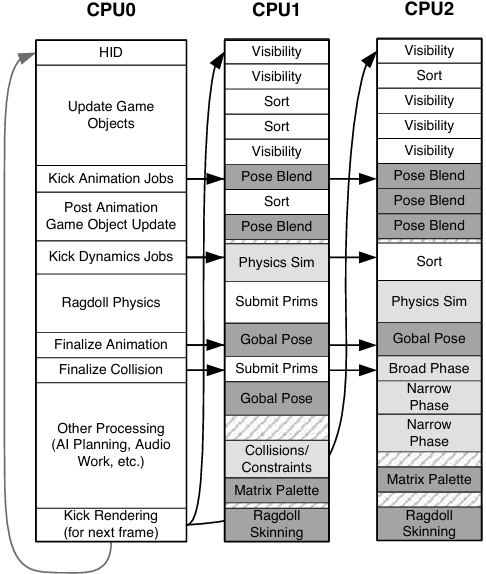
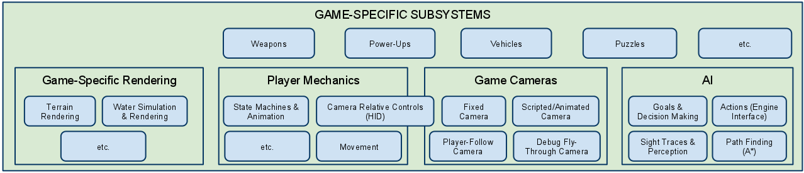
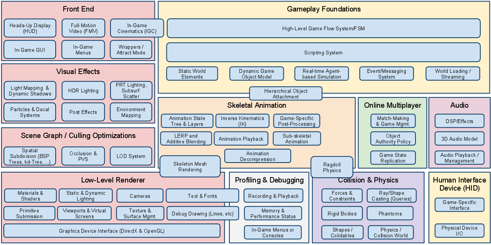
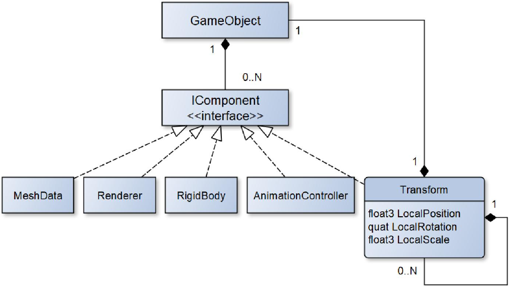

# Vývoj počítačových her

[toc]


## 1. Programování počítačových her

**Herní design** (*game design*) - Jak hra vypadá z pohledu autorů, jaký je jejich záměr.
**Hratelnost** (*gameplay*) - Jak hra vypadá z pohledu hráče.
**Herní mechaniky** (*game mechanics*) - Stavební bloky herního designu.

### Problematika herních mechanik

<u>**Herní mechaniky**</u> jsou něco mezi návrhem, uměním a programováním. Jedná se o **rozhraní mezi hráčem a hrou**, o specifický způsob, jakým hráči interagují s hrou. Hra je jako *systém, který je řízen pravidly* hry a dává hráči/uživateli možnost jej nějak ovládat. Hráč pak **provádí akce**, a tím provádí **změny v systému**. Herní mechaniky zajišťují **reakci na vstup hráče**, provedení jeho akcí. Jedná se o interakce, které **dělají hru zábavnou**.

> Další užitečné informace v sekci [Vývojářské role](#Vývojářské role) v popisu **Gameplay programmer**.

<u>**Gameplay experience**</u> - Hra vytváří pro hráče zkušenost, nějaký **zážitek**. Je to aktivita, které je **hráč součástí** a která v něm **vyvolává emoce**.

Kvalita gameplay je často spojována s **playability** (*hratelností*). Ta popisuje, *jak dobře/snadno se hra hraje*, jak dlouho a jak moc je ji možné hrát. Je univerzálnější než subjektivní zkušenosti hráče a emoce (playability je *podobná pro všechny hráče* podobné kategorie, dá se hodnotit objektivněji).

**Vyhodnocovací metody**:

- *Playability evaluative methods* - Pro zlepšení designu.
- *Player experience evaluative methods* - Pro zlepšení gamingu.

<u>**Gameplay programmer**</u> (*programátor herních mechanik*) píše kód pro **interakce**, které *dělají hru zábavnou*. Musí umět poznat, co je na hře špatné, a spravit to. Abychom byli schopni vytvořit dobrou hru, musíme **rozumět tomu, co dělá hru dobrou**. Spolupracuje s designery. Ví, **co je technicky možné**, jak náročné je něco implementovat, usměrňuje nereálné nebo moc náročné představy. Současně uskutečňuje to, co designeři vymýšlí, přivádí jejich vize k životu. Zajišťuje, že se hra dá dobře hrát, že je **dobrá playability**. Programuje systém, který **převádí vstup od hráče do herních mechanik**. Propojuje dohromady různé systémy (AI, vstup, rendering, UI, síťování, fyzika), aby vytvořil celý svět. Zaměřuje se na strategii hry, implementaci herních mechanik a logiky, na "feel" hry (týká se playability). Největší část práce je zobrazování věcí a jejich manipulace na obrazovce.

<u>**Playability**</u> je popsaná jako **sada vlastností**, které *popisují player experience* z používání daného herního systému, podle nich můžeme ohodnotit hru:

- **Satisfaction** - Jak moc je hráč spokojený, potěšený. Je to *velmi subjektivní*.
- **Learning** - Jak snadné je *porozumět hernímu systému* a zcela jej ovládat. Hráč musí být schopný *naučit se systém*, rozumět mu (nemusí ale nutně dominovat, aby si hru užil).
- **Efficiency** - Kolik času a prostředků je potřeba, aby pro nás hra byla zábavná. Hra po nás *nesmí moc chtít*, abychom si to užili, byla pro nás zajímavá. Musí *rychle získat hráčovu pozornost*.
- **Immersion** - Jak snadné je věřit obsahu hry a *ponořit se do virtuálního světa*. Ovládání je *přirozené*, rozhraní nesmí hráči bránit v prožitku. nesmí ho blokovat od zažití herního světa.
- **Motivation** - Jak moc *podněcuje hráče* k uskutečnění konkrétních akcí, získání velké motivace. Hra by měla *zajišťovat vytrvalost hráče* v prováděných akcích a překonávaných výzvách. Hráč musí být *motivovaný k pokračování*, odehrání ještě dalšího levelu.
- **Emotion** - Samovolný impulz vyvolaný v odpovědi na podnět hry, indukuje *pocity* nebo automatické *reakce*. Je to důležité, *aby byla hra zapamatovatelná* (silné emoce korelují se zapamatovatelnými zážitky).
- **Socialization** - Do jaké míry hra *podněcuje sociální faktor* zažití hry ve skupině. Např. rádi o ní mluvíme s ostatními, hrajeme ji s ostatními.

**Game feel** - Převážně abstraktní, neviditelné umění. Něco, co hráči okamžitě detekují. Je v podstatě skrytý uvnitř hráčovy mysli, ale hra ho spouští. Různé hry mohou *vyvolávat různé pocity* v různých lidech. Můžeme si to představit tak, že ze hry odebereme příběh, grafiku, hudbu a chytrý game design, a zamyslíme se, jestli je pořád *zábavné s hrou interagovat* (čistě pomocí akcí a herních mechanik), jak moc je responzivní na vstup hráče.

**Juiciness** je něco abstraktního, co chceme mít ve hře. Patří sem vše, co dělá hru něčím, co nám dává *dobrý pocit z interakce s ní* (živé, responzivní, spoustu akce). Obvykle je to něco, co *vidíme, nebo slyšíme* (např. pohyb, smršťování a protahování, camera share, zvuky, particles, pohyb kamery, slow motion).

- Juice může být to samé jako *playability* (čím víc kategorií playability zaškrtneme, tím víc juicy).
- Juice také můžeme popsat jako **maximální výstup na minimální vstup hráče**. Hráč provede nějakou akci (např. stiskne klávesu) a hra na to zareaguje spoustou efektů.

<u>**Tweening**</u> (*easing*) je příkladem toho, jak lze přidat **juiciness**. Je to zkratka za **in-be-tween** (*interpolace mezi 2 keyframy* animace, kdy se musí framy spočítat procedurálně). Máme **počáteční a cílový bod**, chceme se tam dostat za tak dlouho a použít takovou funkci. Nejjednodušší je $x \mathrel{{+}{=}} (target - x) \cdot 0.1$ (vždy se posuneme o 10 % zbývající vzdálenosti, ease out, nejprve rychle, pak pomaleji). Lze to použít třeba při z*měně pozice, scale, průhlednosti, barvy* apod. Tweenovat můžeme obecně cokoliv, co lze vyjádřit pomocí jednoho **číselného parametru** $t$, obvykle času.

- Princip je takový, že máme nějakou **parametrickou rovnici** $P(t)$ a pak si hrajeme *pouze s parametrem* $t$ tak, abychom udělali $P(t)$ *zajímavější*, aniž bychom měnili $P(t)$ přímo. Tween pak můžeme zapsat jako $\text{Tween}(A, B, t) = A + P(t) \cdot (B - A)$. Obvykle parametr $t$ **normalizujeme** do intervalu $[0, 1]$, v něm provedeme tweening a pak převedeme zpět do původního intervalu. Pak musíme řešit jen interpolaci mezi $0$ a $1$.
- *Příklad easing křivek*: linear, ease in (smooth start), ease out (smooth stop), ease in out (smooth step), bounce, elastic, back. (Detailněji na: [Easing Functions Cheat Sheet (easings.net)](https://easings.net/))
  - **Linear**: $P(t) = t$
    - $\text{Lerp}(A, B, t) = A + t \cdot (B - A) = (1 - t) \cdot A + t \cdot B$
    - Také QuadraticBezier2(A, (A+C)/2, C) - prostřední kontrolní bod dáme přesně doprostřed
    - Nemá ale derivaci v krajních bodech, což pak vnímáme jako náhlou změnu.
  - **Quadratic**: $P(t) = t \cdot t$
  - **SmoothStartN**: $t^N$ (ease in), např. $\text{SmoothStart2}(t) = t^2$, $\text{SmoothStart3}(t) = t^3$
    - *SmoothStart2* = QuadraticBezier(A, A, C), také QuadraticBezier(0, 0, 1) (pro normalizovaný) - prostřední kontrolní bod dáme do počátečního
    - *SmoothStart3* = CubicBezier3(A, A, A, D), také CubicBezier3(0, 0, 0, 1)
  - **SmoothStopN**: $1-(1-t)^N$ (ease out), např. $\text{SmoothStop3}(t) = 1 - (1-t)^3$
    - Pomocí skládání SmoothStop2: $\text{Flip}(\text{Square}(\text{Flip}(x)))$​.
    - *SmoothStop2* = QuadraticBezier(A, C, C), také QuadraticBezier(0, 1, 1) - prostřední kontrolní bod stejný jako koncový
    - *SmoothStop3* = CubicBezier3(A, D, D, D), také CubicBezier3(0, 1, 1, 1)
  - **SmoothStepN**: $\text{Lerp}(\text{SmoothStart(N-1)}, \text{SmoothStop(N-1), t})$, také $\text{Crossfade}(\text{SmoothStart(N-1)}, \text{SmoothStop(N-1)})$
    - *SmoothStep3* = Lerp(SmoothStart2, SmoothStop2, t), také CubicBezier3(A, A, D, D), také CubicBezier3(0, 0, 1, 1)
    - Neexistuje pro sudé $N$ (lze vidět z převodu Bézierových křivek na SmoothStep, kdy nemůžeme lichý počet kontrolních bodů rozdělit na svě strany).
  - **Hesitate3**: $\text{Lerp}(\text{SmoothStop2}, \text{SmoothStart2}, t)$, také CubicBezier3(A, D, A, D), také CubicBezier3(0, 1, 0, 1) (začne rychle, uprostřed zpomalí až kompletně zastaví, pak zase zrychlí)
  - **Arch2**(t): $\text{Scale}(\text{Flip}(t)) = t \cdot (1-t)$
- *Blending* (function mixing):
  - $\text{Mix}(a, b, \text{weightB}, t) = a + \text{weightB} \cdot (b-a)$ (třeba 50:50 blend, 70:30)
    - $\text{Mix}(a, b, \text{weightB}, t) = (1 - \text{weightB}) \cdot a + \text{weightB} \cdot b$​
    - Lze využít pro rychlý SmoothStart s libovolnou mocninou (`pow` je drahá operace): např. $\text{SmoothStart2.2} = \text{Mix}(\text{SmoothStart2}, \text{SmoothStart3}, 0.2)$
    - Lze využít pro `FakePow` (`pow` je drahá operace): $\text{FakePow}(x, 2.2) = (0.8 \cdot x^2) + (0.2 \cdot x^3)$, $\text{FakePow}(x, 2.6) = (0.4 \cdot x^2) + (0.6 \cdot x^3)$​
  - $\text{Crossfade}(a, b, t) = a + t \cdot (b - a) = (1-t) \cdot a + t \cdot b$ (jako Mix, ale samotné $t$​ je váha)
- *Základní manipulace*:
  - *Square* $x^2$
  - *Flip* $1 - x$
  - *Exponentiate* $x^N$
  - *Scale*(Function, t) $= t \cdot \text{Function}(t)$
  - *ReverseScale*(Function, t) $= (1 - t) \cdot \text{Function}(t)$​
- Parametrický zápis umožňuje křivky/funkce různě *zanořovat a skládat*. Neměníme vůbec samotnou funkci, ale jen parametr $t$ (*měníme jen zvenčí*, co předáváme dovnitř). Nemusíme tak o funkci nic vědět.
  - Př. $Square(Flip(x))$ nebo $Flip(Square(x))$ z $Square(x) = x^2$ a $Flip(x) = 1 - x$.
  - Př. $Scale(Function, t) = t \cdot Function(t)$

> Ve *druhém okruhu* (**Počítačová grafika pro hry**) je sekce **Křivky a spliny** věnovaná související oblasti.

### Herní návrhové vzory

**Návrhové vzory** je vhodné použít proto, abychom znovu nevymýšleli něco, co už *vymyslelo a vyladilo spoustu lidí před námi*. Současně je však dobré si uvědomit, že se *nejedná o instrukce, jak psát kód*. Ne vždy se daný návrhový vzor hodí. Neučíme se je proto, abychom se snažili napasovat náš problém na daný vzor, ale spíše abychom při řešení problému dokázali detekovat, že se to podobá některému vzoru.

<u>**Command**</u> - **Požadavek se zabalí jako objekt**, volání metody uvnitř objektu. Můžeme **parametrizovat** klienta různými příkazy (*dynamicky měnit používané metody* za běhu), frontit je a logovat. Objektově-orientovaná **náhrada callbacků**. Můžeme předat funkci, uložit do proměnné. Můžeme oddálit, kdy se provede volání. Pokud máme v jazyce first-class funkce a closures, můžeme použít ty.

**Příklady použití**:

- *Konfigurace vstupu* - Mapování tlačítek (keybinding). Objekt reprezentuje akci ve hře (třída Command s metodou execute(), různé podtřídy). Input handler má pointery na jednotlivé akce tlačítek, může se snadno prohodit.
- *Ovládání různých actorů ve hře* - Objekty pro jednotlivé akce, např. JumpCommand. InputHandler vrátí command podle vstupu hráče. Pak se spustí command a předá se mu actor, na kterém se provede. Lze snadno spojit s AI - volí akce různými způsoby.
- *Undo a redo* - Strategické hry (single-player, turn-based). Každý tah je zabalen v objektu commandu - svážeme ho s konkrétní jednotkou (one-use-only). Uděláme command undoable - metoda undo. Pamatujeme si provedené commandy, můžeme se snadno vracet zpět nebo opakovat provedené.

<u>**Flyweight**</u> - Pokud chceme mít **menší/lehčí objekty** (často proto, že jich máme hodně), přičemž **sdílejí nějaká data**. Rozdělíme objekt na *2 části*: **intrinsic state** (to, co mají všechny instance společné, uloží se jen jedna kopie) a **extrinsic state** (unikátní pro instanci, pro doplnění zbylého stavu se odkazuje na intrinsic state). Můžeme spojit se vzorem *State* - znovupoužít stejnou instanci stavu v několika různých stavových automatech.

**Příklady použití**:

- *Instanced rendering* - Herní svět se skládá z milionu polygonů, přenáší se spoustu dat ze CPU do GPU (mesh, textures - velká data, ale společná pro všechny instance). Rozdělíme objekty na 2 části, společná data přesuneme do zvláštní třídy, na ně se pak budou odkazovat jednotlivé instance. Nejprve na GPU pošleme společná data, pak seznam instancí s jejich parametry a jediným draw voláním vykreslíme.
- *Tile-based mapa* - Každé pole má jeden druh terénu, ten má několik vlastností (rychlost pohybu, jestli je to voda, textura, ...). Můžeme mít enum typů terénů a pak dvojrozměrné pole, ve všech možných metodách pro získání vlastností pole by ale byly velké switche. Chceme mít data pro jeden typ terénu zapouzdřená u sebe. Třída Terrain, různé instance pro různé typy terénů (veškerý stav je intrinsic), pak dvourozměrné pole pointerů na instance (ty budou na jednom místě přímo ve světě).
- *Dekorace ve hrách*

<u>**Observer**</u> - Jeden kus kódu může *oznámit, že se něco stalo*, aniž by se staral o to, kdo danou notifikaci obdrží. Ostatní se pak mohou *zaregistrovat k odběru notifikací*. Třída **Observer** - má metodu `onNotify`, která se *vyvolá při notifikaci*. Třída **Subject** - má *seznam observerů* (veřejné API pro přidání a odebrání), posílá jim notifikace. Lepší než použít dědičnost je použít *kompozici* - mít různé instance Subjectů pro různé události. Můžeme použít **linked list observerů** (třída Observer má referenci na dalšího) - pak se *vyhneme dynamické alokaci* při roztahování a smršťování pole observerů, ale musíme ještě nějak vyřešit, aby mohl jeden observer pozorovat více subjektů. Součástí linked listu budou *uzly, které mají pointer na observera* a pointer na další uzel, pak může být observer ve víc seznamech (navíc můžeme mít *pool uzlů*). Musí se vhodně vyřešit **smazání subjektu** (před smazáním *upozornit observery*, že končí) **nebo observera** (*odregistrovat* se od subjektu). Dnes je observer jen reference na metodu nebo funkci (delegát v C#).

**Observer vs. event system** - V observer pozorujeme věc, která udělala něco zajímavého, v event pozorujeme objekt přímo reprezentující onu zajímavou věc, která se stala.

**Příklady použití**:

- *Achievement system* - Různé achievementy, vyvolávají se různými událostmi v gameplay. Nechceme svázat kód achievementů s kódem gameplaye. Achievements system se zaregistruje k notifikacím od jiných systémů.
- *GUI* - Kdykoliv se něco stane ve hře, pošle se notifikace, UI to pozoruje a updatuje se.

<u>**Prototype**</u> - Specifikujeme **prototypovou instanci**, nové objekty se pak vytvářejí jejím **kopírováním**. Objekt implementuje metodu, která ho zkopíruje a kopii vrátí. Hodí se třeba, pokud: konstrukce objektu vyžaduje *netriviální práci*; chceme více totožných objektů; se *třídy vytvářejí dynamicky* za runtime; je nutné *duplikovat hierarchii* tříd. Dají se tak vytvářet i instance od třídy, kterou aplikace nezná.

**Příklady použití**:

- *Spawner* - Máme monstra a spawnery, pro každé monstrum zvlášť. Paralelní hierarchie tříd. Raději spawneru předat prototyp, který se pak klonuje - nezáleží, jaké přesně monstrum to je, stačí metoda `clone()`, spawner je univerzální.
- *Prototype-based languages* - JavaScript.
- *Data modelling prototypes* - Reusing dat, ať nemusíme opakovat pořád to samé. Specifikujeme třeba atributy pro monstra (jméno, zdraví, ...) a předměty v nějakém souboru (JSON). Existuje nějaký základní typ, ostatní trochu poupravují hodnoty. Pak se mohou odkazovat na základní typ, z něj se vezmou základní data, zbytek doplní nebo pozmění.

<u>**Singleton**</u> - Zajišťuje (za compile time), že má třída **jen jednu instanci**, a poskytuje k ní **globální přístup**. Třída se *statickou metodou* pro získání instance (lze lazily) a *privátním konstruktorem*. Můžeme vytvářet podtřídy, třeba různé pro různé platformy. Běžná alternativa jsou statické třídy (ale statické položky se inicializují automaticky, nemohou použít třeba konfiguraci načtenou ze souboru).

**Problémy**:

- *Podporuje coupling* - instance je globálně přístupná, někdo může z physics systému spustit zvuk, což je špatně.
- *Více vláken je problém* - je to globální, každé vlákno může přistoupit.
- *Lazy inicializace* je chytrý trik, ale v hrách může způsobit problémy - nemáme kontrolu nad tím, kdy se inicializuje. Může to trvat nějakou dobu, nechceme inicializovat, když se má přehrát zvuk.

**Příklady použití**:

- *File system API* - Třída obaluje file system API, operace mohou nějakou dobu trvat, proto se provádí asynchronně a může běžet více operací současně. Je potřeba operace koordinovat, třeba vytvoření a hned smazání jednoho souboru, wrapper musí vědět o obou. Vytvoříme singleton, navíc je k němu globální přístup, takže jej mohou využívat různé systémy (když si nemohou vytvořit vlastní instanci).
- *AudioPlayer*
- *Logger*

**Příklad implementace**:

```c#
public class Singleton : MonoBehaviour {
    
    private static Singleton _instance;
    public static Singleton Instance {
        get { return _instance; }
    }
    
    private void Awake() {
        if (_instance != null && _instance != this)
            Destroy(this.gameObject);
        else
            _instance = this;
    }
}
```

<u>**State**</u> - Umožňuje objektu *změnit své chování*, pokud se změní jeho *interní stav* (jako by objekt změnil svou třídu; změna stavu se řeší záměnou objektu reprezentujícího stav). Máme **stavový automat**, několik *stavů*, definované *přechody* mezi nimi, můžeme být jen právě v jednom stavu. Můžeme použít enum pro stavy a switch, ale na některé problémy to nestačí (raději chceme **zapouzdřit**, mít všechna *data na jednom místě*). Použijeme **dynamic dispatch** (volání virtuální metody). *Interface pro stav* - veškeré state-dependent chování bude **virtuální metoda** (handleInput(), update()). Pro každý stav definujeme *třídu implementující rozhraní* (definuje chování v daném stavu). Objekt má pak pointer na svůj **aktuální stav**, s ním pracuje (volá na něm metody). **Enter and exit actions** - chceme provádět akce při přechodu do/z stavu, metody enter a exit, voláme *při změně stavu*.

Stavy mohou být *statické* (pokud nemají žádné fieldy, jen metody, nepotřebujeme víc instancí, stačí jedna statická, pak je lze použít pro přechody mezi stavy v implementaci stavů) nebo *instanciované* (mohou mít fieldy, pak nelze sdílet jen jednu instanci (např. pro hru více hráčů), pro přechod do nového stavu vytvoříme novou instanci, můžeme ji vrátit z metody stavu, také můžeme použít object pool, abychom se vyhnuli dynamické alokaci).

Pokud má stav jen jedinou virtuální metodu, můžeme rovnou místo objektů používat *ukazatele na funkce*.

Můžeme mít víc stavových automatů naráz a také automaty různých typů:
- *Hierarchický stavový automat* - chain of superstates (stav může mít nadstav), pokud událost neošetří stav, jdeme v řetězu výš (můžeme použít dědičnost pro implementaci hierarchie).
- *Zásobníkový automat* - máme zásobník stavů, tím zavádíme koncept historie, můžeme se snadno vrátit do předchozího stavu (třeba po vykonání nějaké akce - animace střílení).

**Příklady použití**:

- *Side-scrolling platformer* - V závislosti na vstupu od hráče přechází postava mezi různými stavy - skákání, krčení, chůze, ... Pokud se krčí nějakou minimální dobu, pak speciální útok (máme timer). Chceme přidat možnost nést zbraň, to lze v libovolném stavu, použijeme 2 separátní stavové automaty.
- *AI* - I když dnes se příklání spíše k stromům chování a plánovacím systémům.
- *User input handling*, *navigating menu screens*, *parsing text*, ...

**Příklad implementace** (ve spojení s Command):

```c#
public abstract class State {
    public abstract Command HandleInput(); // returns Command, then Execute() returns new state
    public virtual void Enter(Player player) {}
    public virtual void Exit(Player player) {}
}
```

<u>**Manager-Controller-Script**</u> - Skládá se ze tří částí. **Manager** je obvykle singleton a definuje *logiku na vyšší úrovni*, je sám na vršku hierarchie. **Controller** definuje *herní logiku pro konkrétní případ* (např. `PlayerController` nebo `CarController`). **Script** pak definuje a řídí *jednotlivé featury*, je velmi *parametrizovatelný*.

----

**Sequencing patterns** - Ve hrách je důležitý čas. *Game Loop* je středobod, kolem kterého se točí hodiny. Pomocí *Update Method* objekty slyší tikání hodin. S použitím *Double Buffering* můžeme skrýt sekvenční chování počítače za fasádu snapshotů v časových okamžicích, takže to vypadá, že se svět updatuje naráz.

<u>**Double buffer**</u> - Použijeme **dvojici bufferů** - do jednoho se *zapisují změny*, z druhého se *čte*. Jakmile jsou dokončeny změny, rychle **buffery prohodíme** a začneme zapisovat nové změny do toho, který byl původně pro čtení. Způsobuje, že *série sekvenčních operací působí jako okamžitá* nebo simultánní. Ačkoliv se buffer mění inkrementálně, zvenčí to vypadá jako jediná **atomická změna** (není možné přistupovat uprostřed modifikace). Využíváme tím ale *více paměti*.

Swap můžeme řešit dvěma různými způsoby:

- *Přiřazení pointerů* - rychlé, ale snadno se stane, že se zvenčí používá starý pointer, data v bufferu po swapu jsou 2 framy stará (ale obvykle stejně mažeme obsah bufferu).
- *Kopírování dat* mezi buffery - data dalšího bufferu jsou jen 1 frame stará, může to být pomalé.

**Příklady použití**:

- *Rendering (OpenGL)* - Kreslí se v každém okamžiku vždy jen jedná část světa, ale chceme hladké a rychlé přechody. Zapisujeme změny do framebufferu, hra do něj neustále zapisuje (tearing, flickering). Použijeme 2 framebuffery - jeden pro aktuální frame (z něj GPU čte), druhý pro přípravu následujícího framu (do něj zapisujeme). Swapping buffers - když máme hotový frame, swapneme buffery a začneme vykreslovat nový frame.
- *Physics, AI* - Entity interagují mezi sebou. Když kód provádějící modifikace přistupuje k tomu samému stavu, který modifikuje.
- *AI* - Každý frame se volá metoda update objektů ve scéně, provede se nějaké zpracování. Mělo by to vypadat, že se objekty updatují naráz. Mezi objekty dochází k interakcím, ovlivňují navzájem svůj stav, při sekvenčním provedení změn by záleželo na pořadí. Stav objektů budeme bufferovat - 2 kopie, jedna pro čtení, jedna pro zápis, vždy na konci framu se prohodí.

<u>**Game loop**</u> - Pro *oddělení postupu herního času* od vstupu od uživatele a rychlosti procesoru. Game loop **běží po celou dobu** gameplay. V každé iteraci se **zpracuje vstup** uživatele *bez blokování* (nečeká na něj, hra se posouvá dál), **updatuje herní stav** a **vykreslí** se hra. Měří **uběhnutý čas**, aby mohla řídit *rate of gameplay*. Hlavní úloha - zařizuje, že **hra běží konstantně rychle** bez ohledu na rozdílný HW. Na mobilních zařízeních můžeme nastavit horní limit pro frame rate (pokud má hotovo, spí) - abychom šetřili baterii. Jsou možné *různé implementace*.

*Fixed time step with no synchronization*:

```pseudocode
while (true) {
	processInput();
	update(); // one step of simulation
	render(); // draw game
}
```

- Cyklí se co nejrychleji to jde, framerate závisí na množství práce a na rychlosti HW (chceme se přizpůsobovat různým zařízením).
- Nemáme kontrolu nad tím, jak rychle hra běží.

*Fixed time step with synchronization*:

```pseudocode
while (true) {
    double start = getCurrentTime();
    processInput();
    update();
    render();
    sleep(start + MS_PER_FRAME - getCurrentTime());
}
```

- Zpracujeme frame a pak čekáme po zbytek určené doby.
- Hra nepoběží moc rychle, ale pořád může běžet hodně pomalu, s tím nám to nepomůže.

*Variable time step*:

```pseudocode
double lastTime = getCurrentTime();
while (true) {
    double current = getCurrentTime();
    double elapsed = current - lastTime;
    processInput();
    update(elapsed);
    render();
    lastTime = current;
}
```

- Každý update posouvá hru o nějaký čas, ale také to trvá nějaký reálný čas - pokud je reálný delší než herní, hra zpomaluje. Můžeme posouvat o větší kroky, tím se updatuje méně často a stíhá se. O kolik posouváme hru určujeme podle toho, kolik skutečného času uplynulo. 
- Stejný rate na různém HW, smoother gameplay na rychlejším. Hra je ale nedeterministická a nestabilní - two-player networked game, u každého jiný počet updatů, pro fyziku se používá floating-point, dochází k zaokrouhlovacím chybám, naakumuluje se různě velká chyba u různých hráčů.

*Fixed update time step, variable rendering*:

```pseudocode
double previous = getCurrentTime();
double lag = 0.0;
while (true) {
    double current = getCurrentTime();
    double elapsed = current - previous;
    previous = current;
    lag += elapsed;
    processInput();
    while (lag >= MS_PER_UPDATE) {
        update();
        lag -= MS_PER_UPDATE;
    }
    render();
}
```

- Rendering není ovlivněn proměnnou velikostí kroku. Updatujeme hru po fixních krocích (jednodušší, stabilnější fyzika a AI), ale flexibilita při renderování. Série fixních kroků, abychom dohnali čas. MS_PER_UPDATE musí být dostatečně velké, ale ne moc - alespoň tolik, kolik trvá update().
- Vnitřní smyčka může skončit po nějakém maximálním počtu iterací - hra se zpomalí, ale lepší než úplné zaseknutí. Hra se simuluje konstantním tempem, ale render nastává kdykoliv, i v čase mezi 2 updaty (zobrazuje se starší stav).

*Vylepšení*: Víme přesně, jak daleko mezi update framy jsme, můžeme interpolovat. Při renderování předáme: `render(lag / MS_PER_UPDATE);`. Známe rychlosti objektů v posledním framu, nakreslíme objekty o část framu napřed. Můžeme odhadnout špatně, ale obvykle to není postřehnutelné

**Příklady použití**:

- *Game loop v herních enginech* - Unity

<u>**Update method**</u> - Herní svět sestává z různých objektů. Každý objekt implementuje **update metodu**, která simuluje **jeden frame chování** objektu. Chceme posunout objekt vždy o jeden krok, ale současně nechceme mít kód všech objektů nacpaný v herní smyčce (každá entita by měla *zapouzdřit své chování*). Herní smyčka si udržuje **seznam objektů** (ví, že *mohou být updatovány*), každý frame je *projde a zavolá na nich update*.

Hodí se, pokud máme nějaké objekty/systémy, které musí běžet naráz, chování každého je většinou nezávislé na ostatních a je potřeba je simulovat v čase. Měli bychom také pracovat s **uplynulým časem**.

Musíme explicitně **uložit stav**, abychom mohli příště *pokračovat, kde jsme skončili*, často pomůže vzor *State*. Pokud jsou objekty na sobě **závislé**, *záleží na pořadí updatu* a nechceme sekvenční chování, můžeme použít třeba vzor *Double Buffer*.

Lepší je použít **kompozici** než dědičnost - nedědit od třídy s metodou update, raději přidat *komponentu s update metodou*.

**Příklady použití**:

- *Hra* - Máme scénu, v ní je skeleton, měl by přecházet ze strany na stranu, pak socha, která by měla jednou za čas vystřelit.
- *S game loop* - Dá se použít ve hře společně s game loop, ale nehodí se vždy. Např. šachy - figurky nejsou jako živé, nepohybují se všechny naráz, můžeme ale chtít třeba updatovat jejich animaci každý frame, pak se vzor dá použít.
- *S game loop a component* - Trojice Game Loop, Update Method a Component se používá často jako jádro game enginů.

----

**Decoupling patterns** - Chceme psát kód, který se snadno *přizpůsobuje změnám požadavků*. Důležitý je pro to decoupling, který způsobí, že změna v jedné části kódu nevyžaduje změnu ve druhé. *Components* oddělují různé oblasti hry v rámci jedné entity, *Event Queue* odděluje dva objekty, které spolu komunikují.

<u>**Component**</u> - Umožňuje jedné entitě, aby se rozkládala přes **více domén**, aniž by se mezi sebou domény propojily. Entitu *rozdělíme do jednotlivých částí* dle domén, každou umístíme do **separátní komponenty**. Z entity se tak stane pouze **kontejner** na komponenty. Domény tak o sobě nemusí vědět, *kód je oddělený*. Komponenty jsou **znovupoužitelné**.

Objekt si může *vytvářet své komponenty sám* (zajistí se tak, že má vždy, co potřebuje, ale je těžší objekt rekonfigurovat), nebo je může poskytnout nějaký kód *zvnějšku* (pak je objekt flexibilnější a oddělený od konkrétního typu komponent).

Komponenty mezi sebou mohou **komunikovat**, pokud to potřebují. Mohou buď *měnit stav objektu* (kontejneru), nebo se na sebe navzájem přímo *odkazovat* (pak jsou více propojené), nebo si *zasílat zprávy* (tak jsou komponenty oddělené a kontejner nemusí obsahovat společná data).

**Příklady použití**:

- *GameObject v Unity*
- *Postava ve hře* - Potřebujeme pohyb dle vstupu, fyziku, kolize, animace, rendering, zvuky. Vše bude separátní komponenta (InputComponent, PhysicsComponent, GraphicsComponent), objekt postavy pak bude mít jejich instance (jen je váže dohromady).

<u>**Event queue**</u> - Umožňuje *oddělit* to, kdy se zpráva nebo událost **zasílá**, od toho, kdy se **zpracovává**. Udržujeme **frontu nezpracovaných událostí**. Každá událost se tam přidá. Pak můžeme např. pomocí metody `getNextEvent()` z fronty *událost získat ve chvíli, kdy ji chceme* (ne v okamžik, kdy vznikla). Událost se může řešit přímo, nebo může být přeposlána tomu, koho zajímá. Oddělí se tak odesílatel od přijímajícího.

**Event** (nebo také *notification*) popisuje něco, co se již stalo. Přidáváme to do fronty, aby na to mohly *jiné objekty zareagovat*. **Message** (nebo také *request*) popisuje akci, kterou *chceme provést v budoucnu*.

**Příklady použití**:

- *GUI* - Kdykoliv uživatel interaguje s programem (stiskne tlačítko, otevře menu, stiskne klávesu), operační systém vygeneruje událost a hodí ji aplikaci. Aplikace pak musí událost vzít a na základě ní udělat nějaké chování.
- *Tutoriál* - Chceme vyvolat nějakou část tutoriálu na základě nějaké události (co se hráči povedlo udělat). Vytvoříme centrální frontu událostí. Libovolný herní systém do ní může události zasílat, ale také z ní události přijímat. Část pro tutoriál se zaregistruje u fronty k obdržení konkrétního typu události.
- *Audio* - Když chceme přehrát zvuk, přidáme ho jen do fronty k přehrání. V `Update` metodě pak projdeme frontu a spustíme, co čeká na spuštění.

----

**Optimization patterns** - Výkon je u her pořád důležitý, hráči chtějí pořád bohatší, realističtější zážitek. *Data locality* popisuje, jak využít hierarchii pamětí. *Dirty flag* pomáhá vyhnout se zbytečným výpočtům a *Object pool* zase zbytečným alokacím. *Spatial partitioning* urychluje uspořádání objektů v prostoru virtuálního světa.

<u>**Data locality**</u> - Jak *zrychlit přístup k paměti* tak, že uspořádáme data, abychom využili CPU **caching** (*hierarchii pamětí*), kdy je přístup k paměti sousedící s nedávno použitou mnohem rychlejší. Dokážeme data rychle zpracovat, ale ne získat, často na paměť čekáme. *Zlepšíme lokalitu dat* - udržujeme data ve **spojité oblasti paměti** v pořadí, v jakém je zpracováváme. Do cache se načte celý *kus souvislé paměti* (**cache line**), to můžeme využít, když v dalším kroku *přistupujeme k datům hned vedle*, která už jsou v cache. Organizace dat přímo ovlivňuje výkon. Je potřeba obětovat trochu abstrakce (dědičnost, rozhraní, ...; nechceme mít pointery), abychom *neskákali po paměti* při volání virtuálních metod.

**Příklady použití**:

- *Entity-component-system* - Game loop zpracovává několik entit, ty obsahují různé komponenty (z různých domén - AI, physics, rendering). Updatujeme AI komponenty všech entit, pak physics komponenty všech entit, pak je renderujeme všechny pomocí rendering komponent. Máme pole entit, to je pole pointerů na ně, jdeme přes pointer, to je cache miss, entita má pointer na komponentu, to je další cache miss, přecházíme na další entitu, ... Objekty jsou různě v paměti, alokují se a uvolňují, halda je náhodně uspořádaná. Game loop se stará jen o komponenty, ne entity (ty nemají moc zajímavého stavu nebo užitečných metod), můžeme mít pole zvlášť pro každý typ komponenty (ne pole pointerů, ale opravdu komponent). Entita může mít pořád pointery na své komponenty nebo může být jen ID se kterým se dostaneme ke komponentám.
- *Particle system* - Máme particles ve spojitém poli pevné délky, ale nepotřebujeme pokaždé zpracovat všechny (jen ty aktivní, neaktivní přeskočit). Přeskakování neaktivních ale znamená cache miss, lepší je mít na začátku pole všechny aktivní, až pak neaktivní. Pamatujeme si, kolik particles je aktivních, tolik jich procházíme. Když se particle aktivuje, prohodíme ji s první neaktivní, když se naopak deaktivuje, prohodíme ji s poslední aktivní.
- *AI* - Máme AI komponentu pro entity, obsahuje stav (přehrávaná animace, cílová pozice, množství energie, ...), navíc má stav i pro vzácnější události (jaký předmět spadne po zabití, ...), které se nemění každý frame. Komponenty jsou větší, vejde se jich méně do cache line. Rozdělíme na 2 části - hot/cold splitting, zůstanou "hot" data a přidáme pointer na "cold" uložená bokem. Pak načítáme do cache jen to, co opravdu potřebujeme.

<u>**Dirty flag**</u> - Sada **primárních dat** se v čase mění a sada **odvozených dat** se určuje z primárních pomocí nějakého *drahého výpočtu*. Dirty flag naznačuje, jestli jsou odvozená data **rozsynchronizovaná** s primárními. Nastavuje se, *pokud se primární data změnila*. Pokud je flag nastaven ve chvíli, **kdy jsou potřeba** odvozená data, pak se *přezpracují* a flag se shodí. Jinak se použije předchozí **cachovaná hodnota**. Nepočítá se nic zbytečně, *výpočet se odkládá* až na chvíli, kdy je skutečně potřeba. Může se použít, pokud je *výpočet odvozených dat drahý,* nebo jsou odvozená data někde jinde.

*Primární data by se měla měnit častěji*, než se používají odvozená data. Mělo by být *těžké updatovat inkrementálně* (ne třeba jen akumulovat součet). Počítá se, až *když je výsledek potřeba* - může způsobit viditelnou pauzu. *Vyšší rychlost* za cenu větší spotřeby paměti (kvůli cachování hodnot).

**Příklady použití**:

- *Scene graph* - Transformace, musíme projít větev, abychom spočítali world transform objektu (místo lokální). V každém framu potřebujeme world transform pro každý objekt, ale je zbytečné pokaždé počítat pro každý objekt znovu. Přidáme objektům dirty flag, jestli se transformace změnila. Pak počítáme world transform pro každý dotčený objekt jen jednou. Nenastavíme dirty flag u všech potomků rovnou, ale až při renderování, pokud narazíme po cestě na dirty, přeposíláme to hlouběji v rekurzi a podle toho přepočítáváme i potomky.  Výsledky cachujeme, při renderování použijeme předpočítanou world transform. Nebude hned přepočítávat při změně. Oddělíme změnu lokální transformace od updatu světové, změníme najednou několik lokálních, pak přepočteme jen jednou dotčené světové.
- *Textový editor* - Hvězdička u názvu neuloženého souboru je vizualizovaný dirty flag. Primární data jsou otevřený dokument v paměti, odvozená data jsou data v souboru na disku.
- *Physics engine* - Pro sledování, které objekty se pohybují a které odpočívají. Pohybující se objekty potřebují vyřešit fyziku.

<u>**Object pool**</u> - Definuje třídu pool, která udržuje kolekci (obvykle pevné velikosti) **znovupoužitelných objektů**. Každého objektu se můžeme zeptat, *jestli se právě používá* (je živý, aktivní). Když se pool inicializuje, *vytvoří celou kolekci objektů předem* a inicializuje je do nepoužívaného stavu. Když chceme nový objekt, řekneme o něj poolu. Najde **dostupný objekt**, inicializuje ho na používaný a vrátí ho. Když už *objekt nepotřebujeme*, nastaví se zpět na **nepoužívaný**. Takto můžeme objekty vytvářet a ničit, aniž bychom museli individuálně alokovat/uvolňovat paměť nebo jiné zdroje.

**Omezujeme počet** vytvořených instancí, znovuoživujeme dříve použité instance. Spravujeme několik instancí stejného typu prostředků v poolu. **Vyhneme se fragmentaci** paměti. Jak se *vyhnout nepotřebným alokacím*. Alokujeme jeden velký **souvislý kus paměti** předem. Pro objekty, které jsou *podobně velké*. Pro objekty, které *zapouzdřují nějaký zdroj* (databázové/síťové spojení), který je *drahý pro získání*.

Musíme **volit velikost** *správně*, abychom neplýtvali pamětí na nepotřebné objekty. Jen maximální počet objektů, můžeme úplně *zakázat vytvoření nového*, nebo *zabít některý jiný* (třeba nejtišší zvuk), nebo *zvětšit pool* (případně vytvořit druhý). Pole in-place objektů ideálně stejného typu, jinak můžeme rozdělit na pooly pro různě velké objekty.

Můžeme použít **free list**, abychom neztráceli čas hledáním volného objektu (nevyužitou paměť nepoužívaných objektů můžeme použít pro linked list).

**Příklady použití**:

- *Particles* - Stovky částic, chceme je vytvářet rychle, nechceme fragmentaci paměti.
- *Sounds*

<u>**Spatial partition**</u> - Pro *sadu objektů*, kde má každý nějakou *pozici*. Uložíme je do **spatial data structure**, která *organizuje objekty podle jejich* **pozice ve světe**. Pokud se pozice objektu změní, *updatuje se i struktura*. Umožňuje nám **efektivně vyhledávat** objekty na konkrétní pozici nebo blízko ní. Nemusíme procházet všechny možné dvojice objektů pro nalezení těch, které jsou blízko sebe. *Vyšší rychlost* za cenu vyšší spotřeby paměti. Můžeme mít i další místo, kde máme objekty uložené přímo (plýtváme víc paměti, ale průchod všech objektů je rychlejší).

*Různé možnosti*:

- *Fixed grid* - Jednoduchá, rychle se updatuje při pohybu, hůř spravuje prázdný prostor nebo naopak hustě pokrytý prostor.
- *BSP* a *k-d trees* - Rozdělují svět rekurzivně na poloviny tak, že každá obsahuje zhruba stejný počet objektů. Musíme spočítat objekty na každé straně, když volíme dělicí rovinu.
- *Bounding volume hierarchy* - Adaptuje se podle objektů, rozdělení je vyvážené, hůře se updatuje.
- *Quadtree*, *Octree* - Začneme jedním velkým prostorem. Pokud je v něm víc objektů než určitý limit, pak rozdělíme na 4/8 menších. Takto opakujeme. Fixní, ale adaptivní, má nejlepší vlastnosti (objekty lze přidávat inkrementálně, odebírání je také snadné, update je rychlý, je to vyvážené).

**Příklady použití**:

- *Real-time strategy game* - Chceme najít jednotky, které jsou blízko sebe a mohou na sebe útočit. Rozdělíme na mřížku, jednotky pak neudržujeme v poli, ale vkládáme je přímo do jednotlivých buněk mřížky (buňka může být jen linked list jednotek). Mřížka je pak dvourozměrné pole pointerů na jednotky (jednotka, která je hlava linked listu). Při přechodu jednotky do jiné buňky musíme aktualizovat. Pak řešíme souboj jen v rámci buněk, případně musíme zahrnout i sousední (stačí polovina, abychom nekontrolovali každou dvojici jednotek dvakrát).
- *Physics system* - Detekce kolizí.

> Různé možnosti dělení prostoru jsou popsané také v části *Detekce kolizí* v okruhu 2. Počítačová grafika pro hry.

### Skriptování her

Když vyvíjíme hru, máme obecně *dvě možnosti, jak psát* **herní kód**, a to buď ve formě **skriptů**, nebo přímo v **programovacím jazyce enginu** (tj. herní kód je pak přímo součástí samotného systému).

Obvykle chceme nějaké nástroje pro experimenty s nápady. Ideálně něco, co by mohl použít i herní designer, aniž by musel umět programovat. Používá se na to např. **vizuální skriptování** (blueprints v Unreal Engine) nebo **skriptovací jazyky** (high-level jazyky, které se snadno používají a poskytují uživatelům pohodlný přístup k běžně používaným featurám enginu).

**Herní skriptovací jazyky** jsou obvykle *interpretované*, *snadno použitelné*, podporují *rychlé iterace*. Např. Lua, Python.

Nakonec ale musí být i takové skripty nějak **kompilované** do nativního kódu, který běží na cílové platformě, to zařizuje herní engine. Během vývoje však není třeba hru kompilovat a linkovat s enginem.

## 2. Architektura herních engine

<u>**Herní engine**</u> je velmi **komplexní** kus technologie. Typicky ho chceme použít proto, že chceme **vytvořit nějakou hru**, je třeba *spoustu komplikovaných procesů* (renderování, gameplay, AI), ale *nechceme znovu vynalézat kolo*. Poskytuje nám totiž **sadu nástrojů** pro *usnadnění vývoje hry*. Podporuje **efektivní práci** *inženýrů* (poskytuje API a různé typy pro efektivní vývoj), *umělců* (efektivní vytváření obsahu; most mezi grafickým nástrojem a hrou) i *designerů* (efektivní iterace, může být visual scripting nebo scripting obecně).

Snaží se být **game-agnostic** (*univerzální*, tzn. rozšiřitelný a znovupoužitelný), *feature rich* a *data driven*. Obvykle je také **multiplatformní** (vše se musí *chovat stejně na všech platformách*), takže můžeme vytvářet hry pro různé platformy (některé ale mohou vyžadovat NDA, např. Xbox, Playstation, Nintendo nejsou veřejně dostupné).

Dnes už je snadno dostupná **celá řada enginů**. Dá se s nimi experimentovat, máme *velký výběr*. U některých je k dispozici také *zdrojový kód*, takže vidíme, jak byly vytvořeny, případně je můžeme sami upravit.

Herní engine poskytuje celou **řadu featur**, obecně od něj máme velká očekávání, co vše v něm už funguje jen tak samo od sebe. Poskytuje **nástroje** pro *user input*, *animace*, *modely postav*, velké otevřené světy. Příkladem jsou následující **moduly**:

- **Rendering** - Zodpovědný za vytváření *grafického výstupu*, renderování včetně *textur*, *stínů*, efektů *osvětlení*. Dokáže renderovat ve 2D, 3D i 2.5D.
- **Physics** - Simuluje *fyzikální chování objektů* v herním světě, zahrnuje *kolize* a *interakce* mezi objekty, *gravitaci* a další *síly*.
- **Audio** - Řídí *přehrávání zvuku*, poskytuje různé možnosti pro zvukové efekty, hudbu na pozadí, prostorové audio.
- **Animation** - Řídí *animaci postav a objektů*, umožňuje hladký pohyb a *přechody*.
- **Scripting** - Umožňuje vývojářům definovat *herní logiku a chování* pomocí *skriptovacích jazyků*. Často poskytuje *flexibilitu* pro vytváření komplexních herních mechanik, aniž by se musel měnit kód samotného enginu.
- **Asset management** - Nabízí *nástroje pro import, optimalizaci a správu* digitálního obsahu jako jsou *textury*, *modely* a *animace* použité pro vytvoření herního prostředí a postav.
- **AI** - Implementuje *umělou inteligenci* pro NPCs, umožňuje jim dělat *rozhodnutí*, *navigovat* se ve světě a *interagovat* s hráčem a mezi sebou.
- **Networking** - Podporuje vývoj *hry více hráčů*, spravuje *komunikaci* mezi zařízeními hráčů přes internet nebo lokální síť, zajišťuje *synchronizaci* a real-time gameplay. Implementace je *platform-specific*, ale to řeší engine za nás.
- **User interface** - Nabízí nástroje pro *vytvoření a správu* uživatelských rozhraní jako jsou *menu*, herní *nastavení*, *HUDs*.

Různé hry pak mají **různé požadavky** (např. FPS/RPG, platformer, fighting game, racing game, RTS, MMO). Důležité je promyslet si, *jestli je daný engine vhodný* pro naše potřeby a naše schopnosti a ušetří nám práci. Ideálně by měl game engine také poskytovat **možnost rozšíření**, abychom si ho mohli přizpůsobit, pokud nám v něm něco chybí.

Současně by měl být schopen **integrovat různé nástroje** třetích stran pro konkrétní úkoly, např. pro *3D modeling* nebo *animace*. Můžeme pak pomocí **pluginů** zařídit komunikaci nástroje (Blender apod.) s enginem.

**Výhody** *použití herního enginu*: Poskytují *boilerplate kód*, všechny zásadní *systémy* už jsou implementované. Obsahují *editor*, spravují *assety*. Podporují spoustu *platforem*. Jsou k nim *návody* a *tutoriály*.

**Nevýhody** *použití herního enginu*: Updaty na *novou verzi* mohou rozbít náš kód. Máme jen omezený (nebo žádný) přístup ke *zdrojovým kódům* (jsme závislí jen na API), změny by mohly být nekompatibilní s updaty. *Nemusí se hodit* pro naše potřeby. Dostaneme s ním i případné *bugy*.

----

Pro vývoj her si můžeme pomoci několika různými způsoby (typicky se liší množstvím featur, které poskytují):

- **Library** - Můžeme použít jen *jednoduchou malou knihovnu* a zbytek si udělat sami.
- **Middleware** - Je to něco jako *specializovaná knihovna*, která řeší jeden problém, *jednu doménu enginu*. Engine je třeba složený z renderingu, fyziky apod., middleware je obvykle jen jedna z těchto věcí. Používáme ho pro nějakou část, která je *náročná*. Nemá *žádné IDE*, je určený pro programátory. Nemusí být nutně multiplatformní. Často je *proprietární*. Např. *Wwise* nebo *FMOD* pro audio, *PhysX* pro fyziku. Samotné herní enginy je využívají.
- **Framewok** - Je to něco jako knihovna, která zjednodušuje vývoj, obvykle ale *integruje více subsustémů*. Je poměrně *blízko k enginu*, ale ne tak komplexní. Oproti middleware může mít *vlastní execution loop*. Jen nějaké základní části. Často však nemá *žádné vizuální nástroje / IDE* (nebo jen pro jednu konkrétní věc), vše se dělá *v kódu*. Není nutně data driven, ani nemusí být multiplatformní. Může to být *základ pro náš vlastní game engine*. Př. *XNA*, *Phaser*, *MonoGame* (hojně používané).
- **Engine** je oproti předchozím *komplexnější*. Je to něco jako *množina předchozích* (nástroje, knihovny), které jsou složené dohromady nějakým *stabilním způsobem*. Zařizují vše potřebné, *rendering*, *fyziku*, přehrání *audia* atd. Poskytují *vizuální editor* scény, *scripting*, *asset management*. Jsou spárované s *IDE* (může být i integrované v enginu). Př. Unreal Engine, Unity, GameMaker, CryEngine, Godot.

*Typy architektur*:

- **Monolithic** - např. *GameMaker*
  - Starší. Typicky pro *konkrétní hru nebo žánr*. Špatně se rozšiřují/modifikují nad rámec toho, co podporuje API.
- **Modular** - např. *Unity*, *Unreal Engine*
  - Moderní. Využívá *objektově orientované techniky* pro lepší modularitu. *Jednoduché rozšíření*/nahrazení komponent.
  - Extensible IDE (např. Unity, Unreal Engine) - GUI-oriented, asset management, limited exposure of internals.
  - Open Class Library (např. Unreal Engine) - Code-oriented, maximum modifiability, often open source.

----

Hra je **nekonečná smyčka** odehrávající se *mezi hráčem a počítačem*. Hra poslouchá *vstup* od hráče, *přemýšlí*, pak poskytuje hráči *vjemy* (generuje obraz, zvuk, ...). Hráč přijímá *vjemy*, vnímá změny, dělá *rozhodnutí* a posílá zpět *signály* (mačká tlačítka).

Ve skutečnosti jsou to **dvě separátní smyčky** *listen-think-speak*, které se navzájem informují - **player loop** a **game loop** (počítač nemusí ani získat nový vstup, může to být jen think-speak).

Takto by mohla vypadat základní **single-threaded** *herní smyčka* (ve skutečnosti je to komplexnější, pouští co nejvíc věcí paralelně):

```pseudocode
setupGameWorld(); // defining game objects
while (true) {
	readPlayerInput();
	if (quitRequested()) break;
	updateGameWorld(); // movement, collisions
	renderGameWorld();
	produceAudio();
}
```

Každou sekundu pak proběhne *několik iterací této smyčky* pro vytvoření iluze pohybu.

Hra je **sada několika systémů** - každý tiká sám, někdy i s různou frekvencí (proměnnou, nebo pevnou). Spolupracují, aby vytvořily a aktualizovaly herní svět.

- Příklady systémů: *Input system*, *Animation system* (pohyb jako animace), *Physics system* (kolize), *Rendering system*, *Camera system*, *AI system*, *Audio system*, *Particle system*.

*Upravená herní smyčka* pak vypadá následovně (opět zjednodušená, systémy mohou běžet každý v jiném vlákně, pak je musíme synchronizovat):

```pseudocode
initGame();
while (true) {
	inputSystem.Update();
	if (quitButtonPressed()) break;
	gameObjects.Update();
	physicsSystem.Update();
	animationSystem.Update();
	renderingSystem.Render();
}
```

- Do `Update()` se ještě obvykle předává `deltaTime`, což je *čas uplynulý od posledního framu*. Díky tomu můžeme správně škálovat, jak posouváme nebo updatujeme různé věci.

> Návrhové vzory Game loop a Update method jsou více popsané v sekci [Herní návrhové vzory](#Herní návrhové vzory).

**Windows Message Pump** - Musí se pravidelně dávat Windows vědět, že je *program pořád naživu*. OS posílá zprávu, na ní je třeba *odpovědět*. Nejprve je tedy třeba *zkontrolovat zprávy*, případně na ně odpovědět, teprve poté může udělat *vlastní práci* (jednu iteraci game loop). OS posílá také zprávy např. ohledně *vstupu uživatele*. Hra se může dočasně zaseknout, když třeba měníme velikost nebo pozici okna, protože se musí nejprve zpracovat zprávy, které takto mají *prioritu* před herní smyčkou.

Můžeme mít ale i *další architektury game loop*:

- **Callback-driven** - Může se hodit zachytit určité kroky iterace smyčky, abychom mohli provádět nějaké operace *synchronizovaně* se zbytkem kódu. Máme systémy, které *poslouchají* na `frameStarted` a `frameEnded`. Pak *zavoláme* `frameStarted()` událost všem, kteří poslouchají, *vyrenderujeme* frame a *zavoláme* `frameEnded()`. Na pozadí se používá *messaging*. Např. OGRE rendering framework.

  - ```pseudocode
    while (true) {
    	foreach frameListener
    		frameListener.frameStarted();
    	renderCurrentScene();
    	foreach frameListener
    		frameListener.frameEnded();
    	finalizeSceneAndSwapBuffers();
    }
    ```

- **Event-driven** - Nejpopulárnější, v centru je *event system*. Opačný přístup, místo callbacku máme *seznam událostí ke zpracování* (máme diskrétní simulaci). Vše běží na *Message Bus*, každý systém *posílá zprávy ostatním*, ti se mohou *zaregistrovat* k událostem (např. začátek framu, rendering, audio, input). Aktivně se neptáme na něco (třeba jestli je klávesa stisknuta), ale rozešle se informace, že se něco stalo (klávesa byla stisknuta), ostatní na to čekají (neplýtvá se tak čas zbytečným ptaním se). Máme *periodickou událost* (např. timer ve WinForms), ve které probíhá game loop. Na konci události *naplánujeme novou*, čímž pak spustíme další iteraci. Rozdíl oproti předchozímu callback-driven typu je, že hlavní while cyklus zpracovává události, které mohou být dynamicky přidané do fronty, takže *nemusíme mít pevnou implementaci iterace smyčky* jako v předchozím.

Předchozí příklady jsou již zastaralé, protože *CPU mají více jader*, která bychom chtěli využít. Můžeme tedy mít **multi-threaded** game loop:

- **Fork-join loop** (také *Scatter-Gather*) - První pokus o multi-threaded game engine. Hybridní přístup, kdy *máme jen jednu smyčku, ale občas se rozdělí*. Paralelizují se pouze vhodné části předtím jednovláknové smyčky, které jsou *CPU intensive* (zpracovávají více malých tasků; např. pose blending více postav, simulace nezávislých herních objektů). Obvykle se tak řeší *data parallelism*, kdy nejprve jednotku práce rozdělíme na menší, pak *posbíráme výsledky*. Nemusí se tak předělávat celý codebase enginu.
  - 
- **Per-system multithreading** - Subsystémy jsou *vyvolány z hlavního vlákna* dle potřeby, *běží ve svých vláknech* (zpracovávají svá data *nezávisle na ostatních*). Není úplně ideální, ale dobrý pokus. Můžeme skončit s více vlákny, než kolik máme jader, pak musí *vlákna jádro sdílet*. Každé vlákno může *běžet jinak dlouho*. Vlákna na sebe občas *musí čekat*, pokud vyžadují data od ostatních. Např. *Unity* (víceméně; separátní main, audio, physics, rendering; ale snaží se přesunout víc k job model).
  - 
- **Job model** - Holy grail vícevláknové herní smyčky. Každou *iteraci herní smyčky rozdělíme* do tzv. *jobů*, což jsou poměrně *malé a často nezávislé tasky*, které mohou být distribuovány mezi jednotlivá jádra. Pak máme *job scheduler systém*, kterému přidáváme jednotlivé tasky do *fronty*. Scheduler je pak *plánuje na právě dostupná jádra*. Máme *main scheduler vlákno* a pak *job vlákna*. Neustále vytváříme *orientovaný graf* jobů, hrany definují *závislosti*. Scheduler pak řeší *uspořádání* a vykonání v job vláknu. Kdykoliv hlavní vlákno nemá co dělat, může také zpracovávat job. V praxi je *těžké dosáhnout dobré míry rozdělení* mezi joby (dlouho běžící joby vytváří blank spots, ostatní na ně musí čekat, pokud na nich závisí). Je také problém se sdílením dat, *false sharing* (navzájem si invalidují cache, když modifikují naráz stejnou cache line, pak je třeba flush a reload). Např. Unreal Engine 4.
  - 

### Vrstvy architektur

<u>**Herní engine**</u> je hodně **komplikovaný**, je to něco jako **operační systém pro hru** (vlastní jazyk, správa paměti, vlákna/synchronizace a další). Skládá se z různých **modulů** (např. renderování, simulace, fyzika, síť, audio). Obecně můžeme architekturu rozdělit do **několika vrstev**, kdy horní vrstvy závisí na spodních, ale obvykle ne naopak. Každá z nich pak má několik dalších *podsystémů*. Celkový pohled je pak v sekci [Příklady konkrétních instancí architektur](#Příklady konkrétních instancí architektur).

----

Jednou z vrstev jsou <u>**game-specific subsystems**</u>. To je to, co skutečně ve výsledku **pozorujeme v samotné hře**. Každá hra je má a potřebuje si je **přizpůsobit** dle sebe. Vždy se *vyvíjí pro každou hru zvlášť*. Mohou sem patřit *mechaniky postavy hráče*, *kamerové systémy*, *umělá inteligence* pro NPCs, *systém zbraní*, *dopravní prostředky* apod.



**AI** - Musíme promyslet, jestli ji chceme použít a jaké techniky, např. *pathfinding* (A*) nebo *traces/perception* (např. v stealth hrách).

**Rendering** - Nejen abychom viděli něco na *obrazovce*, ale také pro vytváření *stylizace hry*. Engine musí podporovat to, čeho chceme dosáhnout (např. pokud to má vypadat realisticky).

----

Následně je <u>**game-agnostic layer**</u>. V ní jsou podsystémy, které jsou společné v podstatě **pro všechny typy her** a jsou *nezávislé na konkrétní hře*. Může být ale pořád třeba je trochu **přizpůsobit**, třeba optimalizovat. Předěl mezi hrou a enginem je obvykle někde mezi game-specific subsystémy a gameplay foundation vrstvou. Nelze to ale určit tak jasně, protože se obvykle velmi prolínají a i některé game-specific věci se dostávají až do jádra samotného enginu.



**Gameplay foundations** - Zabývá se *akcemi*, které se odehrávají ve hře, *pravidly*, která řídí virtuální svět, *schopnostmi* postav, *cíly* hráče. Gameplay se typicky implementuje v *nativním jazyce*, ve kterém je napsaný zbytek enginu, nebo v *high-level skriptovacím jazyce*. Vrstva gameplay foundations pak zajišťuje *překonání hranice mezi gameplay kódem a low-level systémy enginu*. Poskytuje *nástroje*, nad kterými se dá vhodně implementovat logika specifická pro hru.

- *Game worlds and object models* - Herní svět obsahuje statické i dynamické prvky. Obsah je typicky modelovaný objektově orientovaným způsobem. Zajišťuje se real-time simulace kolekce objektů ve virtuálním herním světě.
- *Scripting system* - Mnoho enginů umožňuje psát herní logiku pomocí skriptů ve skriptovacím jazyce. Vývoj je tak snazší a rychlejší, není třeba pokaždé překompilovat a přelinkovat, jen se upraví a nahraje kód skriptu. Některé enginy dokonce umožňují změnu skriptu, zatímco hra běží.
- *Artificial intelligence foundations* - Tradičně zapadala AI do game-specific části. Existují však určité vzory, které se objevují téměř v každém AI systému. Je tedy možné určité základy oddělit do game-agnostic vrstvy, např. navmesh, path finding.
- *Event system* - Komunikace mezi systémy a herními objekty pomocí událostí (nemusí pak mít třeba hráč referenci na UI). Odesílatel vytvoří malou datovou strukturu (událost/zprávu), která obsahuje typ zprávy a nějaké argumenty, tu pak předá příjemci zavoláním jeho event handler funkce. Např. hráč vyšle událost, že byl zasažen a kolik má zdraví, kdo pak chce, zareaguje.
- *Messaging system* - Když se něco stane, Game Logic (nebo kterýkoliv jiný systém) dá zprávu do Message Bus, ostatní pak poslouchají a pokud chtějí, mohou si zprávu přečíst a zareagovat. Systémy řeknou, jaké druhy zprávy je zajímají, ty se pak k nim dostanou. Nemusíme pak mít reference mezi vším a všechno tak pevně svazovat, snadno se přidává nový systém (nemusíme propojovat s ostatními).


**Rendering engine** - Jedna z *největších a nejkomplexnějších komponent* libovolného herního enginu. Může být navržen různým způsobem, ale častým a efektivním způsobem je *vrstevnatá architektura*:

- **Low-level renderer** - Zahrnuje všechny *základní renderovací schopnosti* enginu. Návrh se snaží renderovat *sadu geometrických primitiv* co nejrychleji, moc se přitom *neřeší, které části scény jsou viditelné*. Musí podporovat různé *rendering API* (OpenGL, DirectX, Vulkan, ..., také proprietární třeba pro konzole). Různé cílové platformy mohou např. využívat různé komprese textur, to se musí brát v úvahu.
  - *Graphics device interface* - Engine musí podporovat různý backend (DirectX, Vulcan, ...). DirectX používá HLSL, OpenGL používá GLSL. Uživatel enginu by ale neměl psát shader pro každou různou platformu. Engine musí poskytnout nástroj nebo jazyk, který se pak dokáže přeložit do libovolné cílové platformy a dělá to samé. Tzv. *shader code abstraction*. Také za nás řeší nějaký boilerplate kód.
- **Scene graph / Culling optimizations** - Chceme vytvořit scénu, dovnitř vložit objekty tak, že to dává smysl (např. na terén dát dům, terén se pak pohne i s domem). Vytváříme nějakou *hierarchii objektů*. Engine by měl dokázat *iterovat přes celou scénu* a *efektivně najít* to, co by se mělo renderovat (*culling*, omezuje počet primitiv pro rendering), co je součástí fyzikální simulace apod. Ideálně by měl dát game engine možnost toto *přizpůsobit*, protože to velmi závisí na druhu scén, které vytváříme.
- **Visual effects** - Třeba pro fotorealistickou grafiku, particles, decals, light mapping, dynamické stíny, post-processing (HDR, FSAA) apod.
- **Front end** - Nějaké GUI, např. menu, HUD.

**Profiling, debugging** - Potřebujeme nástroje, abychom odhalili, proč třeba hra běží s velmi málo FPS. Engine musí dát možnost debugovat hru nějak rozumně.

**Physics system** - Fyzika ve hře umožňuje: *detekci kolizí*; *simulaci tuhých těles* (rigid bodies), na která působí *síly*; *triggers* (triggering volumes); springs, joints; *ray-casting*, shape-casting; simulaci látky/kapaliny. Typicky se pro to do enginu integrují SDK třetích stran (např. Havoc nebo PhysX).

Fyzikální systém má obecně **2 podsystémy**: *collision system* (detekce kolizí) a *physics (mechanic) system* (jak aplikovat síly ke změně rychlosti, pozice a rotace). Celkově jsou fyzikální výpočty *pomalé*, často *nedeterministické* (výsledky mohou být trochu různé na různých strojích). Obvykle se tedy používá pro efekty, které tolik neovlivňují gameplay, nebo v případě hry po síti potřebujeme jeden zdroj pravdy (např. server počítá fyziku a posílá výsledky klientům, ti dělají také lokální simulace, ale výsledky se upraví dle serveru).

Fyzikální systém má svou **vlastní smyčku**, tiká sám a *obvykle s jinou frekvencí* než zbytek kódu. V každé iteraci posune simulaci o krok vpřed (*typicky je krok fixní*, abychom se vyhnuli nedeterminismu):

```pseudocode
setup physics world // objects, properties, colliders
loop until game/level finished:
	apply forces and impulses -> update velocities // gravity, imposed from the outside (gameplay code)
	update positions and rotations // using velocities and angular velocities
	detect collisions
	solve constraints (resolve collisions)
	notify the game loop (e.g. display results) // update game world counterparts
```

Když vytváříme *herní objekty*, musíme vytvořit i jejich *protějšky ve fyzikálním světě* a propojit je. Když se objekty posunou/otočí, musíme mezi nimi ještě *detekovat kolize* (typicky ve formě zanoření). To pak vytvoří *dočasná omezení* pro změny pozice/rotace. Vyřešíme je pak společně s dalšími omezeními (např. joints; odebírají DOFs (degree of freedom)), abychom dostali finální pozice/rotace/rychlosti.

**Animation** - V podstatě každá hra potřebuje *animační systém*. Existuje 5 základních typů animace, které se využívají ve hrách: *sprite animation*, rigid body hierarchy animation, *skeletal animation* (např. pro lidské modely), vertex animation, morph targets.

**Human Interface Devices** (*HID*) - Každá hra potřebuje zpracovat *vstup od hráče*, který získá z *různých zařízení* (např. klávesnice, myš, joypad, volant). Současně se skrz některá zařízení dá *poskytnout výstup* (např. vibrace, audio). Tato vrstva se obvykle snaží *oddělit low-level detaily* daného ovladače na konkrétní platformě od high-level akcí. Často poskytuje možnost *přizpůsobit mapování*.

**Audio** - Herní engine může poskytovat zcela základní možnosti pro audio, nebo robustní 3D audio rendering engine. Každá hra si ale obvykle musí audio engine nějak přizpůsobit.

**Online Multiplayer / Networking** - Multiplayer je možné provést *různými způsoby*, např. single-screen multiplayer (jen jedna kamera, oba hráči v obraze), split-screen multiplayer (každý má svou kameru, obrazovka je rozdělená na části), *networked multiplayer* (několik zařízení propojených přes síť, každé hostuje jednoho z hráčů), *massively multiplayer online games* (MMOG, stovky nebo tisíce hráčů, centrální servery). Podpora více hráčů může významně ovlivnit návrh jiných komponent herního enginu, je tedy lepší využít engine, který je na to již připraven.

----

Dále se dostáváme k *základům game enginu*. Můžeme je rozdělit na dvě části.

Jednou částí jsou <u>**resources**</u>. Různé *loadery a managery herních dat*, která za runtime vhodně *nahrávají a uvolňují*. Můžeme snadno jen drag-and-dropnout data do enginu (např. 3D modely, textury, materiály, fonty). Pak je tam **resource manager** (na obrázku chybí), který zajišťuje vše potřebné a poskytuje *jednotné rozhraní* pro přístup ke všem typům assetů a dalších dat. Každá hra ho potřebuje, i když třeba nevyužívá všechny uvedené typy dat. V tomto místě se setkávají inženýři, uměli a herní designeři.


Dále máme <u>**core systems**</u>. Obsahuje *zásadní funkcionalitu pro vybudování systémů* ve vyšších úrovních. Všechny hry potřebují všechny tyto podsystémy.


**Assertions** - *Podmínky* v kódu, co musí platit, jinak se vyhodí chyba (pro debugování). Je to součást *development režimu* hry (různé verze buildu, *development* vs *release*). Assertions jsou *pomalé*, z development verze se tedy odeberou, aby nebyly v release.

**Memory management** - V podstatě každý herní engine implementuje *svůj vlastní systém alokace paměti*, aby zajistil co nejrychlejší alokace a dealokace a omezil negativní efekty fragmentace paměti. Alokace je obecně hodně *pomalá*, musí se zavolat OS, a je *závislá na platformě*.

**Math library** - Ve hrách se dělají *matematické výpočty* velmi intenzivně, vždy se tak využívá *alespoň jedna matematická knihovna* poskytující zásadní funkce. Operace se ale mohou *chovat různě na různých CPU*, herní engine je tak dělá pro nás, aby to bylo *konzistentní*, a zakrývá konkrétní detaily. Často optimalizované pro SIMD (single instruction multiple data, např. stejná operace pro všechny prvky pole).

**Custom data structures and algorithms** - Pokud herní engine nezávisí jen čistě na balíčcích třetích stran, pak obvykle poskytuje také *sadu nástrojů* pro správu *základních datových struktur* (linked list, dynamic array, binary tree, hash map) a *algoritmů* (search, sort).

**Asynchronous File I/O** - Načítání souborů z file systému.

---

Nakonec máme *úroveň platformy*. Obsahuje *low-level* rutiny, které jsou *platform-dependent*, a zabaluje je do fasád nebo adaptérů, které se pak *využívají ve vyšších vrstvách*. Jsou zásadní, pokud chceme mít opravdu *multiplatformní engine*. Potřebujeme mít *interface k samotnému OS a HW*.

<u>**Platform independence layer**</u> - Aby mohl herní engine běžet na **různých hardwarových platformách**, potřebuje mít silnou platform independence vrstvu. Tato vrstva *leží nad HW, drivery a OS*. **Obaluje určité funkce rozhraní** do svých vlastních funkcí, aby se zbytek enginu nemusel starat o to, na které konkrétní platformě jsme (*API bude pořád stejné*). Navíc to umožňuje snadno třeba přejít na nějakou jinou knihovnu, aniž by se musel měnit zbytek enginu výš.


<u>**3rd Party SDKs**</u> - Většina herních enginů využívá **řadu softwaru třetích stran** (např. pro *datové struktury a algoritmy*, *grafiku*, *fyziku*, *animace*). Když chceme přidat do hry nějaké SDK middlewaru třetí strany, musíme ho nejprve **obalit do primitiv**, kterým rozumí zbytek enginu. Teprve pak je můžeme použít. Čím složitější rozhraní má SDK, tím složitější je integrace.

<u>**Operační systém**</u> - OS běží neustále, řídí **vykonávání více programů naráz**. Naše hra je jedním z takových programů, takže nemůže předpokládat, že má plnou kontrolu nad HW. OS může hru **kdykoliv přerušit** nebo převzít určité systémové zdroje.

<u>**Device Drivers**</u> - Low-level softwarová komponenta poskytnutá operačním systémem nebo **výrobcem HW**. Drivery spravují hardwarové zdroje a **abstrahují detaily komunikace** pro operační systém a horní vrstvy herního enginu.

<u>**Target Hardware**</u> vrstva reprezentuje počítačový systém, na kterém hra běží. Typickými platformami jsou **PC** založené na Microsoft Windows, Linux nebo MacOS, **mobilní platformy** jako Apple iPhone, Android mobilní telefony a tablety, **herní konzole** jako Xbox, PlayStation, Nintendo.


----

Dříve stačil sekvenční kód, ale CPU se vyvinuly, mají spoustu jader, chceme je využít a všechna co nejvíc zaměstnat. Různé subsystémy pak běží na **různých jádrech**, např. *rendering*, *audio*, *gameplay*. Těžká je ale **synchronizace** mezi nimi, běží v podstatě na separátních počítačích, musí ale *komunikovat mezi sebou* (třeba gameplay říct renderingu, co vykreslit), jádra *nemusí být stejně rychlá*, scheduler rozhoduje, které vlákno poběží na kterém jádru (nemáme už jistotu, že se něco provede před něčím jiným).

Ještě před skutečným **během instrukce** je třeba spoustu práce - *fetch* (získat instrukci), *decode* (dekódovat instrukci), *execute* (provést), *memory* (práce s pamětí), *register write-back* (zápis výsledků do registrů). **Závislosti** mezi daty, **větvení** a **cache misses** to *komplikují a zdržují*.

### Výpočetní modely

**Systémy a herní objekty** (game objects) z kódu herních mechanik se snažíme **abstrahovat** do *společné* **architektury** nebo také **herního modelu**. Chtěli bychom totiž znovu používat některé části mezi hrami (DRY princip), vytvářet **znovupoužitelný a rozšiřitelný kód**. Také bychom chtěli kódovat hru *flexibilně* a umožnit **nekonečné iterace** designu, playtestingu a vývoje. Oddělíme technické detaily toho, jak je svět *updatován*, od způsobu, jakým se *definuje a vytváří*. Tak mohou návrháři a skripteři interagovat se systémy, aniž by museli řešit nízkoúrovňový kód.

Obvykle se snaží být **game-agnostic**, ale často jsou vidět jejich kořeny. Dříve totiž nebyl až takový rozdíl mezi hrou a enginem, *hra byla v podstatě přímo engine* (byl vytvořen pro konkrétní hru). Např. Cry Engine nebo Unreal Engine byly velmi optimalizované pro FPS, ale Unreal Engine se od té doby hodně vyvinul.

Máme celé **spektrum** toho, *jak abstraktní architektury mohou být*. Vlevo jsou ty, které se *mění špatně* (musíme jít přímo do kódu) a které se nedají použít pro více než jednu hru. Vpravo je pak *herní engine pro úplně libovolnou hru* (jakýsi zlatý grál), více abstrahovaný, lépe měnitelný. Takový ideální game engine však *nejspíš není možný* (hry mají různé potřeby, vyžadují různé podsystémy různých kvalit).


Chceme **abstrahovat/modelovat herní objekty** tak, aby:

- se *snadno definovaly*, ideálně použitím deklarací.
- mohly být *zpracovány více různými systémy* současně.

Projdeme si pár základních *přístupů k modelování herních objektů*.

<u>**Inheritance-based**</u> - Máme *jeden společný* **GameObject**, pak různé **systémy** (AnimationSystem, PhysicsSystem apod.). Herní objekty přirozeně tvoří **třídy**, navíc musí implementovat **rozhraní**, která *používají jednotlivé systémy* (IAnimated, IPhysical). Systémy pak mohou pracovat s herními objekty skrz toto *API*.

- **Problém**: Abychom nemuseli implementovat vše pokaždé znovu, můžeme mít pro rozhraní *abstraktní třídy jako základ* (AnimatedObject, PhysicalObject). Herní objekt pak však musí rozšiřovat více tříd (např. míček musí být fyzikální i animovaný). *Diamantová dědičnost* se ve hrách objevuje zcela běžně.

<u>**Composition-based**</u> - "Composition over inheritance" (neplatí to však vždy). Když implementujeme objekt, složíme ho z různých **chování implementujících rozhraní** (máme různé implementace a za runtime je poskytujeme, **sestavujeme tak objekt**). Používáme rozhraní, ne abstraktní třídy. Objekt může implementovat více rozhraní a interně mít více implementací pro ně.

- **Problém**: Model nepodporuje změny, je *špatně rozšiřitelný*, není dobrá znovupoužitelnost. Např. implementujeme kachnu, měla by umět létat a kvákat. Pak přidáváme různé implementace rozhraní IFlyable a IQuackable. Pak ale třeba chceme něco dalšího, aby všechny gumové kachničky uměly střílet a ve hře byly také hendikepované kachničky, které nedokáží plavat. Pro střílení je potřeba další rozhraní, je potřeba přímo měnit kód (injectovat další chování a implementovat).
- Je to dobré pro malé projekty, ale lepší je uvažovat nad objekty abstraktněji, skládat je z komponent za runtime.

<u>**Component-based**</u> - O struktuře herního objektu nepředpokládáme vůbec nic, máme jen **GameObject**, který se **skládá z komponent**. Komponenty poskytují nějaká **data** (popis objektu) nebo nějakou dobře definovanou **funkcionalitu**. Tak *zapouzdřujeme kód do komponent*. Za runtime pak **sestavujeme herní objekty**, jak potřebujeme (utváříme komponenty, přidáváme je k objektu; *komponenty nejsou zadrátované* v kódu). Komponenty mohou být libovolné (MeshData, Renderer, RigidBody, OnCollisionReaction, AnimationController), ale všechny implementují společné **rozhraní** `IComponent`. Může vzniknout *dědičnost nebo kompozice* v rámci komponent, když začnou být moc velké. Můžeme snadno *rekonfigurovat* i objekty, které už jsou součástí scény. Komponenta může být pro integraci herního objektu do systému, i pro gameplay feature.

- Vhodné i pro staticky typované jazyky.
- Existují různé *způsoby implementace*, postupně se rozšiřují:
  - **Rigid composition** - Vytvoříme třídu pro objekt. Komponenty pak budou *datové položky* třídy, přímo vložené v ní. Reusujeme komponenty game enginu. Je to použitelné pro malé projekty a dynamicky typované jazyky. U staticky typovaných je problém s rigiditou kvůli deklaraci jako položky třídy.
  - **Seznam komponent** - Ve třídě máme *list/pole komponent* (`IComponent[]`), za runtime můžeme přidávat/odebírat. Je to lepší i pro staticky typované jazyky, ale problém je získání konkrétní komponenty (musíme takový přístup optimalizovat, lineární průchod je moc pomalý).
  - **Podtřídy** - Vytvoříme konkrétní podtřídu GameObjectu a v jejím *konstruktoru nakonfigurujeme komponenty* (inicializace komponent, sestavíme konkrétní objekt; můžeme pak komponenty přidat do seznamu). Je to flexibilní za runtime, ale pořád určitá rigidita. Problém je, že pokud bychom chtěli mít objekt a rekonfigurovat komponenty vytvořené konstruktorem, vedlo by to na vytvoření několika konstruktorů, což zhoršuje čitelnost třídy. Také může nějaké komponenta chybět (kód se na ně nemůže spoléhat). Chceme mít místo v kódu, které vytváří různé instance.
    - Typické pro *herní frameworky* (ne enginy), např. Phaser.
  - **Instance** - Nevytváříme třídy, ale jen instance GameObjectu, a manuálně přidáváme komponenty. Deklarujeme jen *proměnnou typu GameObject* (ten je prázdný). Nemáme kód schovaný v konstruktoru, ale můžeme ho třeba obalit metodou (něco jako factory metoda). Chceme mít konstrukt, jak zabalit komplexní konfiguraci herního objektu, který chceme používat znovu. Využijeme *klonování* (všechny komponenty a herní objekty musí být snadno kopírovatelné, implementují `ICloneable`; GameObject je jen seznam komponent). Je to podobné prototype-based jazykům (nevytváříme třídy, ale konfigurujeme instance a ty klonujeme).
    - Oblíbená možnost *velkých herních enginů* (např. Unreal engine, Unity s prefaby a instancemi). Komponenty tam přiřazujeme v editoru.


> Další popis je v sekci [Herní návrhové vzory](#Herní návrhové vzory) v části věnované vzoru Component.

Ve scéně můžeme mít tisíce objektů, které se skládají do *komplexní scény*. Můžeme je seskupit a vytvořit z nich *stromovou hierarchii objektů*, tzv. **scene graph**. Nejprve máme *kořen scény* (typicky v počátku souřadného systému), pak různé *objekty, různě zanořené*. Objekty můžeme *seskupovat*, abychom je mohli přesouvat ve scéně společně (zanořené objekty používají matici rodiče).

- Př. složení postavy z kloubů a kostí pro účely animace. Pohyb jedné části vyvolá i pohyb všech zanořených.
- S tímto se dobře pracuje v *component-based* přístupu (např. v Unity). Máme komponentu `Transform`, která udržuje *lokální pozici, rotaci a scale* (relativní vzhledem k rodiči). Každý `GameObject` má *právě jednu* takovou komponentu. Transform komponenty se pak *navzájem na sebe odkazují*, tím vzniká hierarchie scény a tím také *hierarchie herních objektů*. Každá Transform může ukazovat na několik dalších a mít právě jednu jako rodiče. Pro získání globální pozice/rotace/scale *projdeme objekty v celé větvi* až ke kořeni.



> Další popis scene graph je v sekci [Herní návrhové vzory](#Herní návrhové vzory) v části věnované vzoru *Dirty flag*. 

### Entity-component system

<u>**Entity-component-system**</u> je způsob, jak se úplně vyhnout GameObject třídě a **zlepšit výkon**, pokud potřebujeme zvládat **spoustu objektů** za každý snímek. *Navazuje na component-based přístup*. Jedná se o **data-oriented design** (oproti object-oriented design), kdy se díváme na kód jako na *několik systémů operujících nad nějakými daty*.

Na pozadí má game engine svou vlastní **game update loop** (fixní), ve které spouští *update přes všechny systémy*. V component-based přístupu se systémy starají jen o **podmnožinu komponent** přiřazených k objektům. Každý objekt *zapouzdřuje komponenty*, ale ve skutečnosti mohou být *v paměti různě rozházené* (objekty jsou *různě velké*, používají se *fragmenty paměti*, pak *reference mezi různými místy*). Když pak např. renderujeme objekty, přistupujeme k odpovídající komponentě všech objektů, ale ty jsou po celé paměti (častý *cache miss*, CPU čeká na data).

Chtěli bychom mít **související věci sekvenčně v paměti**, třeba všechny komponenty určitého typu ve spojité oblasti paměti. Např. *rendering systém* se stará o rendering komponenty, nějak je uspořádá v paměti. Systém má `Renderer[]`, přičemž Renderer je **struktura**, takže se *alokují v poli za sebou* (nemáme tedy pole pointerů na komponenty, ale přímo **pole komponent**).

Nakonec se **zbavíme GameObjectu** úplně. *Rozložíme ho na jednotlivé komponenty* a ty umístíme do **dedikovaných polí** *přímo v systémech*. GameObject je identifikovaný pomocí **ID** (nebo *sady IDs*), které lze *mapovat na odpovídající komponenty* v polích jednotlivých systémů.

**Entita** může být jen *číslo* nebo *malý objekt* s popisem. Obvykle je objekt někde v paměti, takže můžeme mít *referenci na paměť*, to je číslo.

Pokud jsme dostatečně opatrní a poskytneme **mapování na komponenty**, ideálně by to mělo být zarovnané napříč systémy. Můžeme snadno přistupovat ke všem komponentám, navíc lze snadno najít komponentu v systému. V reálu je to však složitější, je potřeba nějaký *překlad ID na index*.

Všechny systémy zpracovávají svá data, update je rychlejší. Můžeme to do určité míry i paralelizovat.

Rozdělili jsme tak svět herních objektů na **3 části**:

- **Entity** - Herní objekty ve světě. Každý je označen ID, které identifikuje seznam komponent (tvořících entitu) uvnitř systémů.
- **Komponenty** - Obvykle pouze data.
- **Systémy** - To, co skutečně manipuluje a řídí kód.

**Herní objekt** je *reprezentovaný jen jako* **ID**, které můžeme **použít jako parametr** a *předávat všude* (zjednodušuje to např. *networking*, každý objekt má své ID, *snadno se serializuje* přes síť).

Teoreticky je to hezké, ale nemusí se to hodit pro všechny typy gameplay kódu.

> Další popis v sekci [Herní návrhové vzory](#Herní návrhové vzory) v části věnované vzoru Data locality.

### Správa paměti

Máme několik <u>**úrovní paměti**</u>, CPU (+ různé malé cache) a RAM. Data z **RAM** se pak ukládají do **cache**. Přístup do paměti je pomalý. Čím blíž je cache k CPU, tím rychlejší. Nejrychlejší přístup je pak k **registrům**.

<u>**Memory management**</u>, tedy *správa paměti*, je velmi důležitý. To, jakým způsobem program využívá paměť, totiž výrazně **ovlivňuje celkový výkon**:

- **Dynamická alokace** je *velmi pomalá* operace (syscall, context switch), alokuje ji pro nás *operační systém*, aplikace se po tu dobu jakoby *zapauzuje*, žádá OS o paměť a čeká na něj. Obzvlášť u her je přitom často jednoduché dojít k tomu, že *alokujeme novou paměť každý frame*. Kvůli času bychom to však nechtěli dělat během gameplay, např. v metodě `Update`, a také nealokovat zbytečně.
  - Můžeme *předalokovat větší blok* paměti a pak použít ten.
  - Dobré řešení je mít *"per-frame" blok paměti*, který obsahuje data z minulého framu a na konci se smaže. Nealokujeme nic nového, blok je pořád stejný, jen ho používáme jako místo pro *poslání informací do dalšího framu*.
  - I vytváření objektů je alokace paměti.
- Také **vzor přístupu do paměti** a *umístění dat v paměti* může mít vliv. Nejefektivnější je přístup k datům, která jsou v *malém, spojitém bloku* paměti.

I když nemusíme explicitně alokovat a uvolňovat paměť, může docházet k problémům. Je to pak totiž *nepředvídatelné*, nevíme přesně, *kdy k uvolnění paměti dojde*. V náhodných okamžicích tak může běžet *garbage collector* a hru zasekat.

Herní engine obvykle poskytuje vlastní <u>**memory manager**</u> (ale často ho umožňuje nahradit naším), který skrývá obvyklé problémy, aby nebyly znatelné. **Alokuje větší množství paměti** hned ze začátku a pak si ji **sám spravuje**, přičemž může použít **různé strategie** (jiná strategie se hodí pro jinou hru):

- **Single sided stack-based** - Máme alokovaný *velký kus paměti*. Pak udržujeme pointer do paměti, na *konec obsazené části*. Kdykoliv někdo požaduje novou paměť, vrátíme pointer a pak ho *posuneme* dál o velikost požadovaných dat. Uvolňování ale není libovolné, aby nedocházelo k fragmentaci. Nemůžeme tedy dynamicky (de)alokovat on-the-fly, ale to obvykle nevadí, stejně bychom neměli (de)alokovat každý frame, ale v takovém případě použít místo haldy zásobník.
- **Double sided stack-based** - Pokud chceme mít *dynamické alokace per frame*. Udržujeme si dva pointery. Kdykoliv se alokují *data pro level*, posouváme levý pointer (dáváme paměť z levé strany). Když naopak alokujeme *paměť pro frame*, posouváme pravý pointer (alokujeme paměť z pravé strany). Na konci framu jen *resetujeme pravý pointer* zpět na konec oblasti paměti. Musíme ale mít dobře definovaný budget paměti.
  - Někdy ale nestačí mít takový **single-frame allocator** (pro per frame paměť), kdy alokujeme paměť na začátku každého framu a pak zahodíme na konci. Zahodí se tak totiž všechny mezivýsledky, ale můžeme chtít předávat data do dalšího framu. Pak využijeme **double-frame allocator**. Nejprve alokujeme *veškerá data levelu* (pokud jsou fixní), pak využijeme opět *obě strany*, z jedné pro paměť framu $N$ a z druhé pro $N-1$​. Umožňuje to *předávat data v čase*.
- **Pool allocator** - Vytváření komplexních objektů *může trvat dlouho*, pak bychom plýtvali, kdybychom je zahazovali. Nebo můžeme chtít *spoustu instancí* malých objektů. Pak definujeme *memory budget* (počet instancí) a *alokujeme paměť* odpovídající velikosti. Vytvoříme funkce `get()` (získání pointeru na nevyužitou instanci) a `back()` (zahodíme instanci). Musíme sledovat, *které instance se používají* a které ne. Potřebujeme *spojový seznam živých a spojový seznam nevyužitých* (ideálně uložené *přímo v daném bloku paměti*).

Dále bychom měli dávat pozor na to, že *CPU dokáže číst efektivně* jen **zarovnaná data** (nezarovnaná nedokáže buď vůbec, nebo neefektivně, protože potřebuje dvě čtení a zkombinovat je). Stejně tak *OS může alokovat paměť* s **určitou délkou** (po stránkách). Změnou **pořadí položek** ve struktuře tak můžeme *ovlivnit výkon*. Moderní překladače mohou trochu pomoct, ale ne úplně (nemohou přeuspořádat položky ve struktuře kvůli serializaci/deserializaci).

Také je dobré využívat **spojitou paměť** a co nejlépe *využít vlastnosti cache*. Kdykoliv CPU čte z paměti, získá trochu víc dat, než je potřeba. Každý cache miss pak zvyšuje časovou složitost.

Práce se **stringy** také bývá *pomalá* (alokace, porovnání, kopírování) oproti číslům. Jsou *užitečné spíše pro lidi* (human-readable reprezentace čísla, identifikátory), během vývoje bychom je tedy chtěli, ale ve výsledné hře už ne. Často enginy používají *optimalizaci*, kdy alokují string pouze jednou, přiřadí mu **ID** a pak se *pracuje s ID*. Stringy a ID jsou v nějaké *tabulce*. Stringy tak *nejsou součástí kódu*, ale jsou v nějaké tabulce, která je vedle executable. Podobně pro **lokalizaci** máme *databázi textů*, vybíráme databázi podle jazyka a klíče jsou pak *unikátní identifikátory* stringů.

### Příklady konkrétních instancí architektur

Takto například vypadá architektura **CryEngine**:


----

**Unity** je dalším příkladem herního enginu. Poskytuje nám spoustu užitečných funkcí a dělá za nás spoustu práce, např. *asset management*, *scene management*, *custom scripting*, *rendering*, *UI*, *physics*, *animation*, *user input*, *game loop*, *multi-platform*, *audio and video*, *networking*, *navigation* a spoustu dalšího.

##  3. Herní design

<u>**Herní design**</u> je **sada hypotéz**. Doufáme, že *vše bude fungovat tak, jak si myslíme*, dle našich znalostí. Obvykle to ale nikdy není ideálně tak, jak si představujeme. Musíme to *otestovat*, *iterovat*, konzultovat, ... Musíme vidět hru v akci a vylepšit ji.

Herní design obvykle zahrnuje rozhodnutí o **obtížnosti** (hra musí odměňovat horší i lepší hráče), **narativu**, **combatu** (musí se vyvážit, ale čím víc zbraní, tím těžší). Popisuje to, jak hra **ohodnocuje hráčovy akce** a jak na ně reaguje. **Skóre** je důležitým elementem každé hry, ať už je explicitní, nebo implicitní. Úkolem herního designu je také **balancing** hry.

*Co je design*: architecture, GUI, game mechanics, level design, balancing, story a další.

Hra sama není zážitek/experience, ale je to **médium**, které *zážitek poskytuje* (tedy prostředek, jak zážitku dosáhnout). Když vytváříme hru, je dobré **začít zážitkem**. Co chceme, aby *hráči cítili a prožívali*, co chceme *skrz hru sdílet*. Důležité je, že **hru vytváříme pro hráče**, ne sami pro sebe.

**Požadavky** aktuálních her: *accessibility* (pick up and play), *instant save/load* (je možné kdykoliv přestat hrát a pokračovat později ze stejného místa), *always possible to win* (hráč nesmí být nikdy v situaci, kdy hra pokračuje dál, ale výhra už není možná).

Hry se hodně liší, ale **sdílí konkrétní rysy**, které mohou být považovány za <u>**formální aspekty her**</u> (*ne nutně jen videoher*):

- **Active participation of players** - Vytvořeny pro hráče, *interaktivní*, něco děláme, reagujeme.
- **Goal** - Máme ve hře nějaký cíl, třeba *plníme úkoly* a něčeho musíme dosáhnout.
- **Rules** - Víme, *co můžeme dělat*. V hrách je jasně dané, že se musíme *pravidly řídit*, protože je ovládáme skrz nějaký ovladač. Ve skutečném světě je na nás, jestli se budeme pravidly řídit.
- **Procedures/agency** - Co v prostředí můžeme dělat (pohybovat se, interagovat, čeho můžeme dosáhnout, jaké je ovládání). V některých hrách máme procedures, které následujeme (pokud uděláme tohle, stane se tohle).
- **Resources** - Jednotky (např. karty), které nám pomáhají dosáhnout cíle. Mohou nás nutit dělat *ekonomiku* (kdy je použít a kdy ne). Např. čas, peníze, munice, mana, zdraví, stavební materiál, peníze, velikost inventáře.
- **Conflict** - Pravidla, procedury a cíle obvykle vytvářejí konflikt s něčím (napětí/překážky, které *musíme vyřešit*). Pokud konflikt nevyřešíme, nevyhrajeme hru. Např. ostatní hráči, kterých se musíme zbavit, různé skupiny lidí chtějí něco jiného.
- **Outcome** - Co se stane, *pokud uděláme věci správně*. Máme nějaké agency, nějaké dovednosti a nevíme, co bude výsledkem. Pokud to uděláme dobře, měl by být pozitivní outcome. Obvykle ho můžeme *ovlivnit dovednostmi* (oproti hrám v kasinu), není založený jen na štěstí. Hry mají obvykle *jasného vítěze a poraženého*. Ambice dosáhnout outcomu přináší nějaké napětí, drama mezi hráči.
- **Magic circle** (Johan Huizinga) - Hry vytvářejí nějaké *hranice mezi světem ve hře a mimo* hru. Když hrajeme hru, jdeme do *dočasného světa*, který není stejný jako náš obvyklý život. Jsou tam *jiná pravidla* (lze dělat i zakázané), jiné úkoly, *děláme jiné věci*, funguje to jinak. Rozhodnutí ve hře by *neměla ovlivňovat skutečný svět*, neměly by být *žádné následky*.

> Např. *Klondike* (Solitaire) - *Goal* je srovnat všechny karty do balíčku podle čísel a barev. *Conflict* je problém v dosažení cíle, kdy neovládáme karty (nevidíme všechny, musíme je přesouvat, abychom zjistili, kde jsou). Je to pro 1 *hráče*. *Rules* určují, co můžeme dělat (přesouvat karty, pokládat menší hodnotu na větší atd.). *Procedures* jsou např. otočení vrchní neotočené karty, pokud už není žádná na vrcholu balíčku. *Resources* je, kolikrát smíme projít balíčkem, někdy čas. *Outcome* je nejistý, můžeme vyhrát nebo prohrát.

Hra *není přesně definovaná*. Existují různé <u>**definice hry**</u>, ale každá má svá *omezení*, vždy se najde hra, která ji nesplňuje. Uvedeme si pár příkladů:

- *"activity which is...voluntary...uncertain, unproductive, governed by rules, make-believe"* (Roger Caillois)
  - Hry nemusí být voluntary (třeba ve škole), mohou být produktivní (něco se učíme), celý příběh může být předvídatelný.
- *"free activity...outside ‘ordinary’ life..."* (Johan Huizinga)
  - Hodně obecné, může zahrnovat i jiné interaktivní zážitky.
  - Microsoft Flight Simulator - Využívají se pravidla běžné aktivity ze skutečného světa.
- *"A game is a rule-based formal system with a variable and quantifiable outcome, where different outcomes are assigned different values, the player exerts effort in order to influence the outcome, the player feels attached to the outcome, and the consequences of the activity are optional and negotiable."* (Jesper Juul)
  - Simon the Sorcerer - Lineární point-and-click adventura, nezáleží na pořadí kroků, výsledek je vždy stejný.
- *"games are a subset of entertainment limited to conflicts in which players work to foil each other’s goals, just one of many leaves off a tree that includes playthings, toys, challenges, stories, competitions, and a lot more."* (Chris Crawford)
  - Existují i hry, které nejsou jen pro zábavu, také kooperativní hry nebo hry úplně bez soupeřů.
- *"a series of meaningful choices."* (Sid Meier)
  - Obecné, sedí na to mnoho her (a nejen her, třeba jen vaření podle receptu). Hry ale mohou být zcela lineární jen s jedním výsledkem, akce ve hře nemusí být smysluplné.
- *"one or more causally linked series of challenges in a simulated environment."* (Ernest Adams & Andrew Rollings)
  - Magic the Gathering - Žádná série výzev, jen jedna velká a tou je vyhrát hru.
- *"a system in which players engage in an artificial conflict, defined by rules, that results in a quantifiable outcome."* (Katie Selen & Eric Zimmerman)
  - Jsou i hry, ve kterých jsou určitá pravidla, ale žádný konflikt a jen jeden možný výsledek.
- *"A closed, formal system, that engages players in structured conflict and resolves its uncertainty in an unequal outcome."* (Tracy Fullerton)
  - Minecraft (solo creative) - Svět má pravidla, je omezený a uzavřený, ale stavíme jen co chceme. Žádný konflikt a žádná nejistota nebo skutečný outcome.
- *"Playing a game is the act of solving statistically varied challenge situations presented by an opponent who may or may not be algorithmic within a framework that is a defined systemic model."* (Ralph Koster)
  - Minecraft (solo creative) - Žádní nepřátelé. Vytváříme vlastní nápady a jediným soupeřem jsme my sami.

Rozeznáváme celkem 4 <u>**základní elementy hry**</u>. Všechny jsou **stejně důležité**, měly by *fungovat společně*. Pokud jedna z částí chybí, hra působí neúplně.

- **Aestetics** - Jak hra *vypadá*, jak *zní*. O to se starají především umělci. Je *nejviditelnější*.
- **Story** - *Posloupnost událostí*, může se *větvit*.
- **Mechanics** - Zahrnuje v podstatě všechny *formální aspekty her* (rules, procedures, goals, čeho můžeme ve hře dosáhnout, kolik je hráčů, jak interagují, jestli spolupracují nebo soutěží, jestli soutěží s hrou).
- **Technology** - Zahrnuje *médium*, ze kterého hrajeme hru (iPad, balíček karet na stole). Dává nám to *možnosti a limity* toho, co můžeme ve hře dělat. U konzolových her máme ovladač, to je technologie, kterou používáme k hraní hry.

Uvedené elementy musí fungovat společně. Pokud bychom si jako hráč uvědomili, že nefungují, *ovlivní to náš flow*, naše vnoření.

> Konkrétním typem problému, *pokud elementy nefungují dobře spolu*, je [Ludonarativní disonance](#Ludonarativní disonance).

### Kdo je herní designér

> Jednotlivé role, včetně designerských, jsou stručně popsané v sekci [Vývojářské role](#Vývojářské role).

<u>**Herní designer**</u> je ten, kdo **spojuje všechny aspekty vývoje**, *nápady*, *mechaniky*, do jednoho. **Komunikuje** s ostatními, přichází s **nápady** na hru, *vyjadřuje je* (co je daná hra, proč je, pro koho by měla být). *Sestavuje hru z částí*, které vytvořili ostatní členové týmu.

Účastní se vývoje hry **od úplného začátku** až do konce. Je zodpovědný za **gameplay**, definuje *herní zážitek* (cíle, pravidla, systém apod.) a vede hru k jejich *naplnění*. Každý člen týmu určitou měrou přispívá do návrhu hry, ale herní designer by měl mít **poslední slovo**. Rozhoduje, *co by hra měla být*, vše *pospojuje* do funkčního celku.

Nejvíce se soustředí na **design a jeho zdokumentování** (vytváří *game design dokumenty* a dokumenty s koncepty). Také si musí uvědomovat **limity** nastavené *rozpočtem*, dostupnými *technologiemi*, pracovními silami apod.

Musí rozumět tomu, proč lidé hrají hry, *kdo jsou hráči* apod. Dívá se na hru **očima hráčů**.

Často jsou *různé úrovně herních designerů*. Nejvýš je **lead designer**, ostatní jsou pak pod ním. Obvykle vše řeší s *producerem* nebo *development directorem*.

**Dovednosti herního designera**:

- *Playfulness* - Mít rád hravé situace, hry.
- *Communication* - Umět s nadšením přesvědčit ostatní o své vizi a umět si ji bránit. Umět vše dobře popsat (jasná vize, schopnost ji prezentovat). Komunikovat s týmem o game designu, poslouchat kolegy a hráče, předávat vizi i mimo tým.
- *Ability to compromise* - Nesnažit se za každou cenu protlačit jen svou vizi, dělat kompromisy, *naslouchat* ostatním (mohou mít také zajímavé myšlenky).
- *Teamwork* - Různí lidé (bussiness people, umělci, programátoři), nemluví stejným jazykem, je potřeba komunikovat se všemi, rozumět všem, co říkají nazpět. Design document by měl být srozumitelný pro všechny.
- *Pressure resistance* - Práce pod tlakem, vytváření změn na poslední chvíli (bez představení dalších chyb), každá změna ale musí být pořádně promyšlená, playtestovaná (hodně změn, i malých, může výrazně ovlivnit pocit ze hry).
- *Game literacy* - Stát se lepším hráčem, umět analyzovat, proč je nějaká hra dobrá, co se nám na ní líbí, jak asi nějaký systém funguje, znát významné hry.
- *Creativity* - Myslet odlišně, rád experimentovat.

### Osy herního designu

> Zpracováno z externích zdrojů, protože v materiálech z přednášek nebylo nic moc podobného.

Snažíme se najít **standardní osy** (nebo *spektra*), na které se může *umístit libovolná hra*. Osy by měly být *co nejvíc popisné a objektivní*.

Např. <u>**čtyři osy pro návrh RPG**</u>:

- **Randomness** vs **Determinism** - Ve stolní hře se pro náhodnost používají kostky. V digitálních hrách je náhodnost trochu *nahrazena schopnostmi* hráče. Obvykle je dobré *začít při designu se spoustou náhodnosti* a postupně *přidávat determinismus* iteraci po iteraci.
  - Když se hází kostkami, smůlu vnímáme jako naši chybu nebo chybu kostky. V digitální hře ale může být *série smůly frustrující*, vypadá to jako chyba hry. Musíme dát hráčům *více možností*, jak být zodpovědní za své akce (třeba přidat možnost hodit znovu).
  - *Determinismus* lze přidat jako *omezený interval náhodnosti* v síle útoku. Nemůžeme tak úplně selhat, ani když máme smůlu.
  - Měli bychom dát hráčům co nejvíc možností, aby se necítili tak, že prohráli kvůli špatnému hodu kostkou, ale kvůli volbě, kterou udělali.
- **Mechanics** vs **Content** - Můžeme mít *spoustu obsahu* a tím zajistit desítky hodin zábavy. Nebo mít méně obsahu, ale zaměřit se víc na *zážitek z mechanik* (např. procedurální generování v roguelike). Musíme mít dostatečně dobrou základní mechaniku, jinak je to víc grindy a frustrující. Pomáhají třeba *vedlejší cíle*.
- **Story** vs **Freedom** - Můžeme mít poměrně *lineární hru s dobrým příběhem*, nebo *open world hru s důrazem na svobodu* hráče. Nejlepší je nějaký *balanc* mezi tím.
- **Options** vs **Approachability** - Pokud máme spoustu různých statistik, dovedností a dalších možností postavy, není to tak dostupné pro nováčka. Obzvlášť pokud je třeba vybírat hned ze začátku, než ještě hra pořádně začne, snadno to můžeme zkazit.

V každé hře máme **challenge**, ta reprezentuje různé *překážky po cestě a obtížnost*. Můžeme si ji představit jako *osu*. Obvykle se ve hrách obtížnost *postupně zvyšuje*, může se ale pohybovat libovolně dolů a nahoru.

Další může být osa **dovedností**. Ta znázorňuje *rozsah dovedností hráčova avatara*. Může se *rozšiřovat*, *zužovat* nebo jednoduše měnit. Ve hře mohou být třeba *power-upy*, které dočasně přidávají nové dovednosti. Případně se může měnit *rychlost pohybu*. Takovými způsoby se můžeme *po ose pohybovat*. Nemusíme to přitom využít jen pro *změnu obtížnosti* hry, ale také pro přidání *prvků z jiných žánrů* a rozšíření možností gameplay.

### Herní žánry

Ne všechny videohry jsou stejné. Všechny mají svou *estetiku*, své *mechaniky*, ale často se *hodně liší*. Pojem videohra je tak velmi široký. V průběhu času bylo **několik evolučních cest** vedoucích k *definici moderní videohry*. Ačkoliv je tedy výsledek podobný, cesta k jeho vzniku je naprosto odlišná.

> Př. z přírody: Existují či existovala zvířata se spoustou společných charakteristik. Do své formy, např. létajících zvířat, se však každé zvíře vyvinulo úplně jinak, všichni mají odlišné předky. Je to tzv. **convergent evolution**.

<u>**Convergent evolution**</u> - Jedná se o pojem, který pro hry zavedli Kowert a Quandt. Popisují **2 cesty, které vedly k vytvoření moderních videoher** (*z pohledu evoluce žánrů*):

- **Action simulation ancestry** - Pocházejí z tradice *her simulujících válku a souboj*. Vznikla dvě odvětví *kompetitivních* her - *sport* (založené na imitaci války) a *strategie* (simulující taktiku války, např. šachy). Tato cesta pak vedla k vytvoření "early competitive action game prototypes" na počítačích. Nakonec to vedlo také k *arkádám* a akčním konzolovým a počítačovým hrám.
- **Shared narrative ancestry** - Pochází více z *vypravěčských předků*, knih od Tolkiena a *RPG her* (Dungeons and Dragons). Obsahují velké fantasy světy, ve kterých tvoříme postavy, plníme questy, rozvíjíme postavu, odkrýváme tajemství prostředí a samotný příběh. Tyto hry později inspirovaly *textové hry* a *online roleplaying MUDs* (multi-user dungeons, text-heavy, ne grafické) na počítačích. Ty pak vedly k vytvoření *grafických MUDs* a *MMORPGs* (Massive Multiplayer Online RPG).


Ve hrách existuje **velká rozmanitost**, co se týče *stylů* a *gameplay zážitků*. Postupně vznikly odlišné <u>**herní žánry**</u>, z nichž každý nabízí **jiný druh interaktivity**. Každou hru však *nelze zařadit jen do jednoho žánru*, obvykle jich **kombinují více naráz**. Pomáhají nám však ihned porozumět tomu, *jaké druhy výzev a zážitků hra nabízí*.

<u>**Action**</u> - Akční hry testují hráčovy *reflexy*, hand-eye *koordinaci* a čas *reakce*. Za to jej odměňují. Gameplay je *fast-paced*, soustředí se na *souboj*, exploze a *epické momenty*.

- **Podžánry**: *shooters* (z první nebo třetí osoby; Doom), *fighting games* (souboje jeden na jednoho, combo systém; Street Fighter, Mortal Combat), *hack and slash* (melee souboj proti spoustě nepřátel).

<u>**Adventure**</u> - Oproti action kladou důraz na *příběh*, *prozkoumávání*, řešení hlavolamů a správu inventáře. Hráči odkrývají příběh svým *vlastním tempem*.

- **Podžánry**: *point-and-click* (puzzle, story-driven; Monkey Island), *visual novels* (text, narrative-focused adventures, minimal gameplay), *interactive movie* (limited interaction over video playback).

<u>**Sports**</u> - Virtuální zážitek ze sportu, buď přímo *v poli* nebo jako *manažer*. Ovládání a pravidla odpovídají profesionálním sportovním událostem s *různou mírou realističnosti*.

- **Podžánry**: *simulation* (realistická fyzika a ovládání, autentický gameplay; FIFA, NBA 2K), *arcade* (zjednodušené, zaměřené na zábavu), *management* (sestavení týmu, trénink; Football Manager).

<u>**Simulation**</u> - Simulace replikují aktivity ze *skutečného světa*, ať už *řízení vozidla nebo podniku*. Některé se snaží o *co největší realističnost*, jiné o *zábavu a dostupnost*. 

- **Podžánry**: *flighting sims* (pilotování letadla v autentickém modelu; Microsoft Flight Simulator), *business/city* (stavba a správa businessu, měst, parků; SimCity), *vehicle driving* (řízení aut, kamionů a vlaků v realistickém prostředí; Euro Truck Simulator, Forza Horizon), *life sims* (vytváření postavy a správa denního života; The Sims, Animal Crossing).

<u>**Platformer**</u> - 2D, side-scrolling hry. *Běháme*, *skáčeme*, šplháme. Různá nebezpečí a *nepřátelé*, potřebujeme precizní *načasování* a *obratnost*.

- **Podžánry**: *2D traditional* (side-scrolling obstacle courses; Super Mario Bros, Sonic the Hedgehog), *puzzle platformer* (platforming s puzzle mechanikami), *run and gun* (prvky shooteru přidané k platformingu; Metal Slug, Contra).

<u>**RPG**</u> - Hráči si *přizpůsobují postavu* s jedinečnými *schopnostmi*, *předměty* a *dovednostmi*. Bohaté *příběhy* se odkrývají *prozkoumáváním*, *questy* a vedlejšími aktivitami. Souboj, akce.

- **Podžánry**: *action RPG* (real-time souboj, je důležitá dovednost hráče; Diablo, Path of Exile), *Japanese RPG* (turn-based systém ispirovaný klasickými RPG; Final Fantasy, Dragon Quest), *open world RPG* (prozkoumávání velkého 3D světa, svoboda v questech; Skyrim, The Witcher).

<u>**Strategy game**</u> - Důraz na promyšlené *plánování*, správu *zdrojů* a velká *rozhodnutí* namísto obratnosti nebo reflexů. Odměňují *analýzu*, kreativní řešení problémů a dlouhodobou strategickou vizi.

- **Podžánry**: *4X* (eXplore, eXpand, eXploit, eXterminate; Civilization), *real-time tactics* (real-time potyčky s malými skupinami; Company of Heroes), *grand strategy* (správa národů v globálním měřítku; Crusader Kings 3).

<u>**First-person shooter**</u> - Souboj se *zbraní*, z perspektivy protagonisty. Rychlé *reflexy* jsou důležité pro míření, pohyb a *rychlé přepínání* zbraní. Často *multiplayer*.

- **Podžánry**: *military FPS* (souboj na mapách inspirovaných skutečnými válkami; Call of Duty, Battlefield), *hero FPS* (sci-fi nebo fantasy, mocné postavy; Doom, Overwatch), *immersive sims* (interakce s prostředím, emergentní gameplay; BioShock, Dishonored).

<u>**Action-adventure**</u> - Spojení *soubojů*, akčních posloupností a *prozkoumávání* s řešením hlavolamů. Prostředí lákají k prozkoumávání a často skrývají *tajemství* pro zvídavé hráče. Rozmanitý *catch-all* žánr.

- **Podžánry**: *cinematic action-adventure* (silně skriptované, zážitky řízené událostmi; Uncharted, The Last of Us), *action RPG* (role-playing progression a loot s real-time soubojem; Batman: Arkham Series), *open world action adventure* (velký sandbox; Assassin's Creed, Legend of Zelda: Breath of the Wild).

<u>**Fighting**</u> - Hráči jsou proti sobě v *souboji zblízka*. Využívají *combo*, speciální pohyby a psychologii k přemožení soupeře. Odměněny jsou *rychlé reakce* a dobrá *znalost pohybů*.

- **Podžánry**: *2D fighters* (omezené do 2D roviny; Street Fighter, Mortal Kombat), *3D fighters* (volný pohyb ve 3D aréně; Tekken), *platform fighters* (dynamické úrovně s platformingem; Super Smash Bros).

<u>**Real-time strategy**</u> (*RTS*) - Sbírání *zdrojů*, budování *armády*, porážení *nepřátel* v *real-time* (bez střídání tahů). Je třeba vyvážit *ekonomický vývoj se správou jednotek* v bitvách napříč zemí, mořem a vzduchem. Ve skutečnosti spojení ekonomické simulace, tradiční strategie a real-time overhead action.

- **Podžánry**: *traditional RTS* (budování základny, ovládání jednotek; Starcraft), *MOBA* (Multiplayer online battle arena; týmy hráčů, každý ovládá jednoho mocného hrdinu; League of Legends, Dota 2), *tower defense* (staví se obrana pro zničení vln nepřátel; Plants vs Zombies).

<u>**Racing**</u> - *Rychlá jízda* tratěmi a okruhy ve výkonných autech a dalších vozidlech. Může se jednat o *realistické simulace* i off-the-wall *arkádové zážitky*. Silně zastoupený je *multiplayer* a *kompetitivní* hra.

- **Podžánry**: *simulation* (realistická fyzika a řízení; Gran Turismo), *arcade* (vzrušující rychlost a triky místo realismu; Need for Speed, Mario Kart), *futuristic* (budoucí a sci-fi vozidla a prostředí; Wipeout).

<u>**Shooter**</u> - Hry, kde hraje primární roli *střílení ze zbraní*. Oproti precizním FPS hrám sem může patřit *širší množina gameplay* a uměleckých stylů, ve kterých vystupují zbraně.

- **Podžánry**: *run and gun* (2D side-scrolling střílení; Contra, Metal Slug), *bullet hell* (zběsilé vyhýbání se ohromnému množství střel), *third-person shooter* (střílení zezadu zpoza postavy; Uncharted), *looter shooter* (RPG loot a progression systém; Borderlands, Destiny).

<u>**Puzzle**</u> - Vyzývají hráčovu *logiku*, rozpoznání vzorů a dovednosti *řešení problémů*. Vyřešení hlavolamů a odkrývání gameplay záhad dodává pocit *velkého uspokojení*.

- **Podžánry**: *physics puzzle* (mechanické a fyzikální puzzles; Portal, Half-Life 2), *matching puzzles* (propojování dlaždic nebo herních dílů; Candy Crush), *logic puzzles* (deduktivní uvažování a kritické myšlení; Baba Is You, The Witness).

<u>**Casual**</u> - *Jednoduchá pravidla* a gameplay pro co *nejširší trh*. Snadno je pochytí hráči s *různou úrovní dovedností*, dokážou dělat pokroky. Krátká herní sezení především pro *mobilní telefony*.

- **Podžánry**: *match 3* (spojování dlaždic v mřížce bodů; Candy Crush), *hidden objects* (hledání objektů skrytých v zaplněných scénách; Hidden City), *hyper casual* (extrémně jednoduché hry zaměřené na mobilní telefony; Fruit Ninja, Flappy Bird).

<u>**MMORPG**</u> (Massively multiplayer online role-playing game) - *Tisíce hráčů* hrají současně, společně online obývají *rozsáhlé otevřené fantastické světy*. Přizpůsobují si své *postavy*, vytvářejí *týmy* pro plnění *questů*, nájezdy do dungeonů a účast v masivních *PvP bitvách*.

- **Podžánry**: *fantasy MMORPG* (meče a kouzla; World of Warcraft, Final Fantasy XIV), *sandbox MMORPG* (gameplay a mechaniky s otevřeným koncem; EVE Online), *action combat* (real-time bitvy založené na dovednostech; Guild Wars 2).

<u>**Stealth**</u> - Hráči se musí *vyhnout odhalení* a *skrývat se*, aby pronikli na různé lokace a obešli nepřátele. Trpělivě se skrývají ve stínech a *plánují* cesty, vyvolává to pocit predátora sledujícího kořist.

- **Podžánry**: *tactical espionage* (metodické proniknutí do základen; Metal Gear Solid), *immersive sims* (emergent stealth vložený do větších her; Dishonored, Deus Ex), *stealth horror* (unikání nadpřirozeným nepřátelům; Alien Isolation; Amnesia: The Dark Descent).

<u>**Party**</u> - *Ležérní* a *sociální* zábava pro *skupiny*, mohou spolu hrát osobně, v jedné místnosti. *Jednoduché* a intuitivní ovládání a mechaniky, které se každý snadno naučí. Společně se zasmát je tak důležité jako výhra.

- **Podžánry**: *board & card games* (digitální adaptace klasických deskových her; Monopoly, Scrabble), *trivia games* (rychlé hry testující obecné znalosti; You Don't Know Jack, Trivia Murder Party), *activity games* (nekonvenční minihry a výzvy; WarioWare, Jackbox Party Pack).

<u>**Action RPG**</u> - Zapojuje *real-time souboj* vyžadující dovednosti do RPG *levelování* a *loot* systému. Souboje jsou postavené na rozmístění, vyhýbání, načasování a míření místo střídajících se tahů. Diablo popularizovalo tento žánr.

- **Podžánry**: *looter shooters* (FPS a TPS s RPG; Borderlands, Destiny), *soulslike* (extra náročné third-person melee souboje; Dark Souls, Bloodborne), *isometric* (top-down pohled pro taktické rozmisťování; Path of Exile, Grim Dawn).

<u>**Tactical role-playing**</u> - *Tahový* souboj v *mřížce* umožňující přesnou *kontrolu jednotek*. K překonání výzvy je třeba opatrné *rozmisťování* a *strategie*. Možnost přizpůsobení přidává hloubku při budování sil.

- **Podžánry**: *japanese TRPGs* (grafika a příběhy v anime stylu; Final Fantasy Tactics, Fire Emblem), *strategy-JRPG hybrids* (namíchání gameplay systémů; XCOM).

<u>**Survival**</u> - Hráči se musí navigovat *drsným prostředím* a scénáři, zvládnout *hlad*, *žízeň* a další potřeby. Mechaniky přežití vtahují hráče do základů existence.

- **Podžánry**: *survival sandbox* (otevřené světy k prozkoumání; Minecraft, Valheim), *survival horror* (přežívání a unikání nočním můrám; The Forest, The Long Dark), *survival simulation* (realistické mechaniky přežívání; SCUM, This War of Mine).

<u>**Battle Royale**</u> - *Velký počet hráčů* hraje proti sobě v *last-man-standing* deathmatch. Hráči *hledají zbraně* v postupně se *zmenšující bojové zóně* a snaží se být posledním přeživším.

- **Podžánry**: *hero shooters* (Fortnite, Apex Legends), *military shooters* (PUBG, Call of Duty Warzone).

### Specifika herních platforem

Pokud vytvoříme **multiplatformní hru**, dá nám to *více možností, jak vydělat peníze*. To se hodí obzvlášť, pokud jsme malý tým vývojářů. Kromě výhod to má však i určité **nevýhody**. Musíme si dobře promyslet, *jestli jsme opravdu schopni* doručit hru na více platforem. Pokud ano, pak máme mnohem *více možností* a větší šance na *větší výdělky*.

Je dobré sledovat obchody konkrétních platforem, být v kontaktu s ostatními vývojáři, chodit na setkání a konference, abychom zjistili, jak se vše vyvíjí, *která platforma je neslibnější*, apod. S **novou platformou** je *velký risk*, nevíme, jestli bude úspěšná, nebo ne, ale zase je větší šance velkého růstu. Asi se vždy budeme soustředit na některou z **hlavních platforem** (např. *Steam*), přináší to *menší risk*, poskytnou nám *stabilní prodeje* (pokud budeme mít slušnou hru se slušným marketingem).

<u>**Výhody**</u>:

- S jedním herním produktem/designem, který funguje a je úspěšný, máme **větší šanci na dlouhodobější prodeje** (nejen během prvního roku). Např. různé spiky různé roky podle toho, kdy to rozšíříme na další platformu.
- Větší šance k nalezení **zlaté platformy**. Nikdy nevíme, kdo nás bude featurovat, zvýšíme šance, abychom se zviditelnili na nějaké konkrétní platformě.
- Je to poměrně **levný zdroj příjmů**. Někdy pokud uděláme dobře design nebo pokud se design hodí na více platforem, může být levné zprovoznit to také na dalších platformách (např. použitím Unity nebo UE4) - pak je to spíše o UI, ovládání, apod.
- Pokud dokážeme vytvořit hru pro více platforem, získáme si tím větší **credibility** - že jsme schopni portovat na jiné platformy, máme pro to vybavení, umíme navrhnout hry pro více platforem (lepší pozice, když jednáme s publisherem).

<u>**Nevýhody**</u>:

- Trh se vyvíjí a ideálně bychom měli pokryté **všechny platformy**, ale to není jednoduché.
- Může nás to stát **hodně prostředků** (peněz, času).
- Můžeme se na **dlouho zaseknout**, bude trvat dlouho, než to dokončíme.
- Může to **poškodit naši značku**, pokud se to nevydaří a bude nad naše síly to dobře zprovoznit i pro další platformu (nedostatek financí, času, může vést na neúspěšný port). Je pak těžké to napravit.
- Můžeme být donuceni **dělat kompromisy** v našem jedinečném designu, jen abychom to napasovali na platformu.

Je několik věcí, na které bychom se měli zaměřit z *pohledu designu a uživatele*, když se rozhodujeme, jestli se naše hra hodí pro konkrétní platformu. *Herní enginy* řeší spoustu problémů s kompatibilitou, ale některé problémy pořád přetrvávají (různé platformy mají různé user experience). Měli bychom se přizpůsobit např. způsobem zadávání vstupu, vzdálenosti od obrazovky, konkrétním nastavením.

Pokud máme hru, která je velmi silně zaměřena na jednu platformu a nikdy jsme nepřemýšleli nad jinou, bude nás to stát víc, abychom vytvořili *srovnatelnou zkušenost* s hrou také na jiné platformě. Lepší je **přemýšlet nad tím už dopředu**, např. *rozložení tlačítek*, *grafické uživatelské rozhraní*.

<u>**Na co se zaměřit**</u>:

- **Control scheme** - Jak přenést *ovládání* na jinou platformu, jestli to bude fungovat dobře. Např. je náročné hrát hru na *dotykovém telefonu* tak jako na *PC*. Musíme zajistit, že i když je to jiné, je to pořád dobré. Mohou se speciálně kvůli tomu zavést i *nové možnosti* ovládání (např. auto-attack).
- **Form factor/experience** - Není dobré mít *komplexní hry* pro mobilní telefony, ty jsou vhodné spíše pro hraní po *kratší dobu* (5-10 minut jedna hra, very short bursts of fun). Komplexní hry se hůř vysvětlují jen v krátkých úsecích, *tutoriály* by měly být jednoduché a efektivní. Ten samý formát přitom funguje i na PC nebo konzoli (může se jen řetězit víc kratších úseků).
- **Interface** - Příliš komplikovaný interface (spoustu malého textu na jedné obrazovce) se špatně vejde na *menší obrazovku*. Měli bychom si dát pozor na to, *kolik informace* na obrazovce poskytujeme a jestli *využíváme prostor dobře*. Konzoloví hráči obvykle hrají na televizi nebo obecně *větší obrazovce* a sedí *dál od ní*, PC hráči jsou o něco *blíž k monitoru*. Optimalizovat interface, velikost fontu, množství informace na obrazovce pro konzoli - pak to bude dobře fungovat i pro PC. Také velké množství různých *klávesových zkratek* se špatně překládá na konzole a mobilní telefony.
- **Technické schopnosti** zařízení na konkrétní platformě - Obzvlášť důležité, pokud děláme port na Nintendo Switch nebo mobilní telefony. Obecně pokud děláme port pro *méně výkonnou platformu*, měli bychom přemýšlet nad *nepodstatnými efekty*, elementy, prostředími a detaily, které můžeme *omezit*. Zredukovat grafiku, rozlišení, texturu; obětovat vizuální kvalitu pro získání více FPS.

<u>**Na co si dát pozor**</u>:

- **Hard to deliver on all platforms at the same time** - Může být obtížné to udělat rovnou správně, aniž bychom obětovali nějakou vizi. Není to rozumné obzvlášť pro malé herní studio. Můžeme vyvíjet *pro jednu dobrou platformu*, na tu se soustředit a *čas od času jen zkontrolujeme* design rozhodnutí, jestli je pořád možné někdy v budoucnu hru portovat.
- **Multiplatform development may compromise your game design** - Soustředíme se pak na *to nejmenší, co mají všechny platformy společné*, můžeme ztratit jedinečnost hry, když zahodíme mechaniku, která se na určitou platformu nehodí. Neměli bychom snižovat standard návrhu nebo jedinečnost hry jen proto, abychom hru doručili na všechny možné platformy.
- **Maintenance is difficult** - Budeme mít víc SW, je potřeba to *udržovat*, je náročné vše dostat na *všechny obchody*, všechny platformy, musíme všechny zkontaktovat. Např. s každou novou verzí iOS se může objevit nový problém, musíme to opravit, pak trvá schválení obchodem.

### Game design dokument

> Vlastnosti, struktura, UML diagramy pro popis herních mechanismů, herní prostor, postavy, specifikace dialogů.

<u>**Game design document**</u> **(GDD)** - Popisuje, *o čem hra je*, jaká by měla být, **definuje naši vizi**. Vytváříme ho ještě **předtím, než se pustíme skutečně do vývoje** (psaní kódu apod.). Neexistuje **žádná šablona** pro univerzálně použitelný design dokument pro všechny situace a všechny druhy týmů. Záleží hodně na tom, co vyvíjíme, jak přistupujeme k vývoji, a na čem pracujeme. Podle toho bychom se měli rozhodnout, jak budeme hru dokumentovat. *Nejedná se o magický dokument*, podle kterého bude někdo okamžitě schopný vytvořit hru bez otázek. Postupně se **během vývoje mění**, jen pomáhá **efektivně komunikovat**. Utváří se *iterativně* na základě feedbacku a dalších nápadů. Formát by měl být dostatečně *flexibilní*, aby bylo snadné ho editovat. Používají se *různé formy*:

- **Design bible** - Vše *podrobně sepsané*, vytištěné, *svázáné*, jako kniha. Je to *zdroj všech informací*, veškerý design je na jednom místě, vytvoření dokumentu je rovnou návrh hry. Špatně se ale mění a prohledává. Dnes už *zastaralé*.
- **Design wiki** - Podobné design bible, podobná struktura, ale je to *členěné* (trochu jako mind map). Je k tomu dobrý přístup, *snadno se upravuje*, informace jsou rozdělené do rozumně malých částí, *celý tým může přispívat*, zachycuje se *historie změn*. Vyžaduje to ale *neustálou údržbu* a začne to skrývat závislosti návrhu, protože je to rozdělené.
- **One-page design** - Jednostránkový dokument, který (obvykle grafickou) formou zachycuje *klíčové myšlenky designu*. Mělo by to vypadat tak, aby si to lidi rádi pověsili na zeď. Může se jednat např. o *návrh levelu* v platformeru (high-level pohled na level, doplňující informace k jednotlivým částem, detailnější ilustrace), *story board*. Snadno se sdílí v týmu, ostatní mohou zakreslit změny. Vynucuje to *úplné porozumění*, zvýrazňuje to *vztahy v systému*.

<u>**Funkce**</u> - *Game design document* má následující **funkce**:

- **Promyšlení** - Sepisujeme nápady a rozhodnutí, tím si *uvědomíme i ty nejmenší detaily*, kterými se musíme zabývat *ještě před vytvářením prototypu*. Jasněji uvidíme vizi a zážitek, který chceme pro hráče vytvořit. Bude jednodušší si uvědomit, že některé herní mechaniky *nefungují*, nebo jsou *redundantní* (bylo by lepší je odebrat ještě před implementací, abychom ušetřili čas).
- **Zapamatování** (a udržení pohromadě) - Pomáhá *zapamatovat si různá rozhodnutí*, jak jsme vyřešili různé problémy. Hodí se zapisovat i zcela zřejmá řešení, která jsme chtěli implementovat okamžitě (může se to pozdržet a můžeme zapomenout, pak to stojí čas).
- **Komunikace** - Game designer musí *komunikovat s týmem*, sdělit jim design. Nestačí jen poslat dokument, bude následovat feedback, diskuze, otázky. Nějaká forma dokumentace zajistí, že všichni v týmu budou mít *aktuální informace o hře*, i když nejsou součástí všech rozhodnutí o designu. Všichni vidí, jak se hra vyvíjí.
- **Zajištění financí** - Pokud chceme *sdělit náš nápad publisherovi*, pravděpodobně bude chtít vidět game design dokument (bude trochu odlišný, ale pořád game design dokument).

<u>**Vlastnosti**</u>:

- **Krátký, stručný** - Dlouhá dokumentace se hůře čte, strukturuje a modifikuje. Je lepší je udržovat krátké, lépe se pak zanáší změny. V případě velké hry třeba vytvořit *několik krátkých dokumentů*, které se na sebe *navzájem odkazují* (zvlášť pro popis konkrétní mechaniky, popis akcí, zvlášť popis levelu nebo části mapy).
- **Cílený** - Měli bychom vědět, *kdo bude dokument číst*, a podle toho zvolit jazyk. Jiný jazyk pro programátory a jiný pro historiky, se kterými konzultujeme hru.
- **Ilustrovaný** - Je dobré používat *obrázky* a ilustrace. Názorněji to ilustruje to, co chceme říct, je pak snazší si to představit. Např. *flow charts*, *diagramy*.
- **Jasné formulace** - Vše by mělo být dobře formulované. Neměla by tam být *žádná nejistota*, vše by mělo být *jasně rozhodnuté*.

<u>**Struktura**</u> - Měli bychom pokrýt zhruba následující **sekce**: *shrnutí*, *pilíře* návrhu, herní *mechaniky* (core gameplay, game flow/loop, ovládání, postavy, nepřátelé, AI, multiplayer), uživatelské *rozhraní*, *grafika* (styl, nálada), *zvuky a hudba* (styl, formát, zvukové efekty, hudba), *příběh* (backstory, svět, popis postav, text a dialogy), vývojové *nástroje*, *rozvržení* práce, *analýza trhu* ...

V GDD můžeme použít třeba <u>**UML diagramy**</u> k různým účelům, např. pro **popis herních mechanik** (důležité části, *vztahy* mezi nimi; stavový automat). Nebo také **flowchart** pro reprezentaci různých částí (*UI* přechody, *game loop*).

Také bychom měli popsat <u>**herní prostor**</u>. Kde se **hra bude odehrávat**, jak to bude *vypadat*, v jakém *stylu* to bude, jaký má *navozovat pocit*, jaké jsou důležité *lokace/objekty*, co má umožňovat.

Je důležité v GDD definovat zásadní <u>**postavy**</u>, jak *protagonisty*, tak *vedlejší postavy*, *padouchy*, *NPC* a *druhy nepřátel*. Popsat, **jak vypadají**, jaké jsou jejich *osobnostní rysy*, jejich *zájmy*, co *nemají rádi*. Také **cíle** v rámci herního narativu a jejich **vztah** k ostatním postavám.

Pro <u>**specifikaci dialogu**</u> můžeme použít diagram ve formě **grafu**. Reprezentujeme tak, *kde se začíná*, jaké jsou **možnosti**, kam to *pokračuje*. Na následujícím obrázku je kousek dialogu ve hře *Atentát 1945*, kde postupně procházíme hrou a získáváme více informací, ale jsou trochu odlišné podle toho, jakou cestou jdeme.


### Historie herního trhu a jeho trendy

Úplně první hra byl *Bertie the Brain* (piškvorky, 3x3), pro akademické účely.

<u>**Historie RPG**</u>:

- V sekci [Herní žánry](#Herní žánry) jsme již viděli convergent evolution a to, že RPG má původ v Dungeons & Dragons hrách.
- *Akalabeth: World of Doom* (1979) - Richard Garriot (nejslavnější autor prvních D&D). Jeden z prvních příkladů RPG.
- *Final Fantasy* (1987) - Už lepší grafika, větší a komplexnější světy, lepší postavy.
- Pak se začal přidávat také *code of conduct* - pokud jako hrdina něco ukradneme, bude to mít později nějaké následky.

<u>**Historie herní grafiky**</u>:

- *Mystery House* (1980) - První hra obsahující nějakou grafiku. Prohledáváme dům, objevujeme těla, odkrýváme příběh. Kvůli omezené velikosti disket to bylo uložené jen jako souřadnice a instrukce pro program.

<u>**Historie arkádových her**</u> - Ještě *před počítačovými hrami* byly arkády (automaty). Silné postavení na trhu měli **Atari** a **SEGA**.

- *Periscope* (1966) - SEGA. Elektromechanické, mělo velký úspěch, importováno do USA.
- *Pong* (1972) - Atari. Jednoduchá 2D grafika.
- Golden age - Konec 70. a začátek 80. let, začalo být populární i mimo Japonsko, hlavně USA.
- *Space Invaders* (1978) - Taito. Podobně jako následující hry to vyžadovalo nějakou strategii, taktiku. Složitost se postupně zvyšovala.
- *Pacman* (1980) - Namco. Původně z Japonska, původně soustředěno jen na Japonsko, ale velký úspěch i v USA. Nemělo být o zabíjení, lákavější i pro ženy.
- *Donkey Kong* (1981) - Nintendo. Poprvé Mario, pomohlo to Nintendu dostat se na americký trh.
- Vznikaly prostory čistě s těmito hrami. Všechny tyto hry ale byly *deterministické* - dal se vypozorovat vzor (hráči pak byli lepší, hráli jednu hru déle, méně vydělávalo).
- Původně obrovský přístroj schopný hrát jen jednu hru. Pak byla možnost něco připojit a změnit něco ve hře (*mod kit*) - tak vznikla třeba *Miss Pacman*. Pak zajímavější hry, těžší, zase bylo potřeba naučit se nový vzor. Atari podalo žalobu (bylo to neoficiální), nakonec původní autoři spolupracovali.
- V 80. letech hned po golden age (zhruba od 1982) *klesal zájem* (v USA hlavně), už více možností jak hrát hry doma, konzole.

<u>**Historie konzolí**</u>:

- *Fairchild Channel F* (1976) - Do té doby jen určitý počet her předinstalovaných her v konzoli, nebylo možné nahrát další. Tato konzole byla revoluční, dovolila vyměňovat *cartridge* a dodávat obsah. To pak převzali i jiní výrobci (Atari).

- *Atari 2600* (1977) - Jako předchozí funkcionalita vyměnitelných cartridgí, předchozí konzole proto upadla do zapomnění. Očekávalo se, že vydrží tak 6 let (to bylo dobré na tu dobu).

- *Nintendo Family Computer* (1983) - Také nazývaný Famicon.

- Atari vsadilo na 2 hry - *Pacman* a *E.T.* Vyrobili miliony cartridgí hry E.T., ale ty se neprodávaly, byla to špatná hra, vyvinuta jen za 5 týdnů (jen 36 hodin na vymyšlení hry, promyšlení celého návrhu a sepsání design dokumentu), složitá. Neúspěch zastrašil investory, přestali dávat peníze do herního průmyslu.

- Crash trhu (1983) - Čím dál víc vývojářů her, ale *snižovala se kvalita*. Ovlivnilo to hlavně USA, v Japonsku ne tak velký rozdíl.

- *Nintendo Entertainment System* (NES, 1985) - Přizpůsobení Famiconu pro americký trh.

- Console Wars - *Nintendo* mělo dominantní pozici na trhu v 1989, *SEGA* byla konkurence.

  - *SEGA Genesis* (1989) - Levná a současně rychlá 16-bit konzole (Nintendo mělo jen 8-bit, 16-bit vydali až později). Chytrá kampaň, použili *Sonica*.

  - Už podle maskotů je vidět, že cílí na jinou demografickou skupinu (*Mario* je roztomilý, dětinský; *Sonic* je rebel, zábavný). SEGA chtěla zapůsobit na starší teenagery, aby je mladší následovali. Představili také sportovní simulátory se strategií (fotbal).
  - Nakonec Nintendo prodalo víc svých konzolí než SEGA, ale SEGA začala z ničeho, Nintendo v tu dobu jasně vládlo (dostali se na překvapivě malý rozdíl).

<u>**Historie eSports**</u>: Začaly se pořádat události k popularizaci her.

- *Space Invaders turnaj* (1980) - První velká akce vůbec, 10 000 účastníků, hrálo se na Atari. Dobrá marketingová strategie, jak popularizovat hry.
- *Nintendo Power Fest* (1990) - Na trhu tou dobou převažuje Nintendo. Dobré výhry, velké finále, média. Úspěšná akce.
- *Rock the Rock* (1994) - SEGA Tournament, obrovská událost, kvalifikace napříč světem, finále v Alcatrazu. Hráči byli starší než na dřívějších turnajích. 100 000 dolarů jako výhra, o to větší pozornost. MTV jako partner (PR), hodně populární mezi teenagery.

<u>**Historie PC gamingu**</u>:

- *Subscription service* - Každý měsíc dostaneme disketu s nějakou hrou.
- Naráželo se na limity grafické karty, PC mělo horší grafiku než konzole.
- Příchod internetu, ale byly převážně turn-based hry nebo sportovní simulátory jako golf (také turn-based), jen málo real-time action her.

<u>**Historie násilí ve hrách**</u>: V 90. letech začala renesance arkád (nový HW, zaměření na starší publikum). Vznikaly nové žánry, *fighting games* (zahrnovaly násilí) a *multiplayer*. Díky nim měli majitelé arkád pravidelný příjem, nemuseli pořád investovat peníze do dalších jako v době úpadku, kdy hráči vypozorovali vzory.

- *Street Fighter II* (1991) - První blockbuster po úpadku arkád. Čas byl limitován zdravím a protihráčem, takže nebylo možné hrát příliš dlouho. Hráči byli hodně soutěživí. Zahrnovalo to i ženské role (nejen jako princezny na záchranu nebo vedlejší postavy).
- *Mortal Combat* (1992) - Realističtější a brutálnější. Tzv. fatality, brutální způsoby, jak dokončit protivníka.
- *Night Trap* (1992) - FMV hra (full motion video).
- S příchodem her obsahujících násilí se zvedla další vlna morální paniky. V senátu USA se projednávalo, jak k hrám přistoupit. Představil se nezávislý hodnotící systém pro hry (omezení věku).
- *Doom* (1993) - Night Trap byla jen lehkou verzí reprezentace násilí oproti Doom. Experimenty s 3D (ukázalo se, že *PC mohou soutěžit s konzolemi*, co se týče grafiky). Unikátní business model (ohlásili hru dlouho předem, poslali disketu s demem zdarma, bylo možné hru modifikovat). Death match mód v tu dobu jedinečný. Popularizace žánru *FPS*.

<u>**Ekonomická historie videoher**</u>: Na následujícím obrázku je vizualizace toho, jak se vyvíjely tržby z her. Jsou tam zachycené také důležité milníky. Čísla jsou založená na globálním trhu, v konkrétních zemích to vypadá jinak.


- Vidíme, jaké měly různé oblasti tržby.
- Na začátku byly hodně silné arkády, pak začalo klesat (snadno prokouknutelné vzory, monetizace).
- V roce 1983 konzole silně zasáhl úpadek.
- PC hry pak začaly růst, postupně až dodnes.
- Handheld konzole - Game Boy byl dobrý tah, Tetris ho pak hodně zpopularizoval. Dlouho se udrželo, pak nahrazeno mobilními telefony.
- Mobilní telefony - Nejprve byly jen konkrétní hry v konkrétních modelech a nešlo je měnit. Pak začala možnost stahovat další (Java). Na zařízeních se dalo hrát spoustu her, i poměrně pokročilých na dostupný HW (např. na Symbian OS).
- VR a nadcházející Cloud gaming - Jen malý zlomek.

<u>**Aktuální trendy herního trhu**</u>: Herní trh se neustále vyvíjí. Měli bychom se zaměřit na globální rozdělení, popularitu různých platforem a také na demografii.

- Z pohledu jednotlivých **platforem** se můžeme podívat na graf z roku 2020. Je vidět, že *mobilní trh* je obrovský, tvoří skoro polovinu, vypadá výdělečně. Oproti tomu prohlížečové hry upadají. Konzole jsou celosvětově více populární než PC hry.
  - 
- Pokud se podíváme na jednotlivé **regiony**, pak Evropa společně se Severní Amerikou tvoří jen necelou polovinu tržeb. Naopak nejvíc tržeb je v *Asii*, skoro polovina (Čína má trh zaměřený na vývoj mobilních her). Pokud se chceme dostat na čínský trh, je to obvykle hodně náročné. Musíme mít publishera nebo nějakou konkrétní licenci, která se špatně získává, pokud nejsme z Číny. To samé pro Jižní Koreu, je potřeba mít nějakou licenci nebo povolení, že je hra vhodná pro určitý věk hráčů (to stojí nějaké peníze).
  - 
- Dále můžeme porovnat tržby s **počtem hráčů**. Pak je vidět, že v *Severní Americe* je sice poměrně málo hráčů, ale současně jsou tam z her velké příjmy. V *Asii* je sice hodně hráčů, ale trh je tam zaměřený hlavně na mobilní hry, jen zhruba třetina hráčů platí za obsah, ostatní neplatí a hrají hry bez investice peněz. Na trhu mobilních her by mohl být velký potenciál, ale hlavně v Asii, takže nelze dělat hry atraktivní pro západní Evropu nebo Ameriku.
  - 
- Také se můžeme podívat blíž na **Evropský trh**. *Francie*, *Německo*, *Španělsko* a *Velká Británie* mají největší podíl. Nejvíc tržeb v nich pak generují *konzole* (Xbox, Playstation, Nintendo Switch). *Mobilní trh* je o něco menší, ale pořád docela velký.
  - 
- **Mobilní trh** je pak řízen z převážné většiny *nákupy v aplikacích* (free-to-play model nebo model, kde se platí jen za část aplikace). Dnes už je tedy problém získat hodně tržeb s *placenými aplikacemi*. Uživatelé iOS jsou obvykle ochotní platit víc za aplikace, produkují výrazně více tržeb z prodeje aplikací. Obecně je ale mnohem více Android zařízení na trhu než iOS.
  - 

A takto vypadal globální herní trh v letech 2012 až 2021. Obrázek zachycuje **tržby jednotlivých segmentů** (konzole, PC, mobilní hry) a roční nárůst. Vidíme, že *mobilní hry* se hodně rozrostly, zatímco ostatní zůstávají víceméně stejné. Růst především kvůli tomu, že nyní už má skoro každý mobilní telefon, a také kvůli sběru dat a jejich využití (více v sekci [Herní design řízený daty](#Herní design řízený daty)).


<u>**Aktuální trendy herního průmyslu**</u>:

- **Mobilní hry** - Díky všudypřítomnosti mobilních telefonů a tabletů se trh mobilních her velmi rozrostl. Velmi populární jsou *casual hry* (např. Candy Crush), ale technologie umožňují i více *immersive zážitky* (např. Fortnite, PUBG Mobile), které nabízí gameplay *konzolové kvality*. Mobilní hry lákají převážně příležitostné hráče, dominuje *free-to-play*. Tržby generují *nákupy v aplikacích* a *mikrotransakce*. Procesory a sítě se neustále zlepšují, brzy by to mohlo být srovnatelné s PC a konzolemi.
- **Free-to-play** (*F2P*) model se stal *standardem pro casual hry*, ale i velké AAA. Hry generují tržby pomocí *volitelných transakcí* ve hře místo toho, že by se platilo už předem (lze *stáhnout zdarma*). To umožňuje hrám vybudovat si velkou player base. Může to však vést na *pay-to-win* scénáře, kdy utrácení peněz znamená *velkou výhodu*. Ve hře je ale možné nakupovat třeba jen kosmetické předměty (skiny), které neovlivňují gameplay.
- **Virtuální realita** (*VR*) - Může nabízet *immersive zážitek* nebo také velmi *realistické vizuály*. Je to stále *dostupnější a komfortnější*, velký potenciál. Zatím však čelí různým problémům (např. motion sickness).
- **Rozšířená realita** (augmented reality, *AR*) - Přes skutečné prostředí se dává *vrstva s digitálními prvky*, umožňuje to *real-world gameplay*. Zatím se však naráží na *omezení technologie*, nedá se hladce smíchat virtuální a skutečný svět. Spíše na *mobilních telefonech* než pomocí speciálního headsetu. *Široké uplatnění* (výuka, cvičení, sociální interakce).
- **Cross-platform play** - Umožňuje hráčům *hrát společně na různých systémech*. Konektivita mezi PC, konzolí a mobilním telefonem se postupně stává standardní funkcí. Je to však *obtížné* udělat tak, aby na určitém systému nebyly *neférové výhody*.
- **Cloud gaming** - Je možné streamovat *hry* mezi zařízeními bez drahého HW. Vyžaduje však *rychlé internetové připojení*. Nabízí to pohodlí a dostupnost, ale čelí různým technickým výzvám. Např. Google Stadia, GeForce Now, Xbox Cloud Computing.
- **Indie hry** - Nezávislý vývoj her neustále roste. Indie hry nabízejí *nové koncepty*, umělecké styly a mechaniky oproti velkým mainstream značkám. Díky *digitálním platformám* jako Steam nebo Nintendo eShop je pro indie vývojáře *snazší sami hru publikovat*. Např. Stardew Valley, Undertale.
- **Esports** - *Kompetitivní hry* se staly zábavnou podívanou, konají se v nich *turnaje* a *profesionální ligy*, lákají spoustu diváků. Nejlepší hráči se stávají *celebritami*, získávají *sponzory* a oddané fanoušky. Takové hry jsou už od základu navržené pro podporu profesionální hry, např. League of Legends.
- **Live services** - Místo toho, aby se každý rok nebo dva vydal další díl, mnoho úspěšných *multiplayer her* funguje jako *"living games"*. Postupem času se přidává *nový obsah a události*. Tento přístup se pro nepřestávající zábavu a utrácení spoléhá na neustálé updaty, *battle passy*, sezóny a rozšíření. Např. Fortnite, Apex Legends, Destiny 2.
- **Game streaming** - Velmi populárním zábavním médiem se stalo *sledování ostatních lidí*, jak hrají hry. Z nejlepších streamerů se stávají *celebrity*, mají miliony sledujících. Stalo se to diváckým sportem, kdy streameři navíc k záznamu hry poskytují *zábavný komentář*. Streaming pro publishery nabízí *marketing zdarma*, zatímco streameři získávají sponzory a dary.
- A další (např. uvedené v sekci [Obchodní modely komercializace her](#Obchodní modely komercializace her)).

## 4. Vývojový cyklus počítačové hry

### Fáze vývojového cyklu

<u>**High-level rozdělení**</u> herního vývoje má celkem **3 fáze**:

- **Příprava** - plánování, rozpočet (kolik času a peněz je potřeba)
- **Vývoj**
- **Stabilizace** - debug a polish, nemělo by se podcenit

<u>**Podrobnější rozdělení**</u> - Tyto fáze vývojového cyklu však můžeme ještě **podrozdělit**, celkem na **7 fází**. Jednotlivé fáze se *často prolínají*, obzvláště u větších týmů. Všichni v týmu pak nejsou ve stejné chvíli ve stejné fázi. V každé fázi je **alespoň jeden release**, pro každý je pak **několik iterací**. *Iterace* se skládá ze *specifikace, designu, implementace, testování a integrace*. Mezi iteracemi se vyhodnocuje pokrok projektu a upravuje se směřování, pokud je třeba.

**Plánování** - Rozhodujeme se o tom, *co, jak a proč budeme dělat*, např. herní žánr, 2D vs 3D, umělecký styl, herní mechaniky, hrdina a zloduch, *herní engine*. Provádíme *analýzu trhu*, jaké platformy jsou populární a dávají smysl, jaké žánry, kolik podobných her se chystá a jaké jsou jejich silné stránky. Vytváříme *koncept/design* (nápady se mohou neustále měnit), určujeme *rozpočet* (finance, časová náročnost) a vybíráme *klíčové lidi* (investory často zajímá, kdo na tom bude pracovat, jeho portfolio). Volíme *technologie* (vlastní, nebo již existující) a *platformy* (mobilní hry tvoří velkou část trhu, ale nemusí na ně pasovat každý žánr). Sháníme *vydavatele* (investora, který nám dá peníze na vývoj), nebo alespoň vytváříme plán na jejich oslovení. Sestavujeme *záložní plány*.

- Nakonec musíme zodpovědět otázky jako *jakou hru* vytváříme, kdo je *cílovým publikem*, jaké jsou *hlavní featury*, kolik to bude stát, kde získáme peníze, *jak dlouho* to bude trvat, zda máme potřebné dovednosti, jestli najmeme lidi, jak hru *monetizujeme*, na jaké *platformy* hru zveřejníme.

**Pre-produkce** - Další fáze přípravy, kdy se *rozvrhne práce*, vytvoří *storyboard* a *prototyp* (může být i neherní, třeba jen prostředí se správnou atmosférou a osvětlením). Staví se *kostra*, na které bude celý projekt stát. Rozhodne se, které nápady jsou dobré a které se zahodí. Vytvoří se *proof-of-concept* (základní herní mechaniky bez finálních vizuálů), důkaz toho, že jsme schopni projekt udělat (investor nebo vydavatel to může chtít vidět). Nastavuje se laťka, dělají se *benchmarky* (např. pro grafiku, jak nejlépe to může vypadat) a testuje se *struktura a funkcionalita týmu*. V tuto chvíli už by měly fungovat všechny disciplíny, *umělci* se ujišťují, že umělecký styl a barevná paleta odpovídají hernímu tématu a žánru, *vývojáři* ukotvují mechaniky a fyziku, *inženýři* dávají najevo, jaká jsou omezení, co je možné, *spisovatelé* se domlouvají na scénáři, postavách a světě, *project leads* dělají finální rozhodnutí, odstraňují překážky, udržují všechny v obraze.

- *USP* (Unique Selling Point, X faktor) - Čím je to jiné než všechny podobné hry, nějaký revoluční nápad, na kterém se postaví celý marketing. Nemusí to být nutně hratelnost, ale třeba i to, že je hra od někoho, kdo už pracoval na něčem úspěšném.

**Produkce** - *Nejdelší, nejdražší a nejdůležitější* fáze vývoje hry. Programátoři a herní návrháři *vytvářejí herní svět*. Sestavují dynamické prostředí, které doplňuje příběh, umělecký směr a herní mechaniky. *Modelují a animují* se hlavní postavy a NPCs, *nahrávají se repliky* herců. Sound designeři vytváří *soundtracky* a *zvukové efekty*. Spisovatelé očišťují *scénáře* a řeší menší copywriting tasky jako pojmenovávání NPCs a popis objektů. Vytváří se tak *veškerý obsah* (technologie, grafika, mechaniky, dialogy, UI atd.). Původním nápadům se vdechuje život, ale někdy je třeba dělat *těžká rozhodnutí*, např. provést drobné změny, nebo úplně odebrat celé segmenty, mechaniky nebo postavy (ať už, protože to nefunguje dobře, nebo aby se usnadnila práce).

**Debug and testing** - Je potřeba dobře *otestovat všechny aspekty hry* a odhalit všechny bugy, glitches, exploits. Např. je třeba hru otestovat na *solid environments* (nemělo by být možné se trikem dostat do jiné části), *rendering and performance issues* (objekty se objevují kdy a jak mají, framerate neklesá), *exploits* (hráči by neměli být schopni využít herní mechaniku tak, jak nebylo zamýšleno), *softlocks* (hráč by se neměl omylem zaseknout), *difficulty* (hra by neměla být ani moc snadná, ani moc těžká), *scripting and acting errors* (vše správně napsané, bez překlepů, správně ořezané a zvolené hlasové nahrávky).

**Pre-launch** (*předvydání*) - V této fázi už bychom měli mít *stabilní beta verzi* hry, které je připravená ke zveřejnění. Měli bychom tedy zahájit *marketing*. Můžeme vytvořit *trailery*, *dema*, nebo vydat hru v *Early Access*. Také je možné spojit ohlášení projektu s nějakou větší událostí nebo prezentací. Je to však poprvé, kdy ukážeme naši hru *široké veřejnosti*, což může přinést řadu negativních ohlasů. Je důležité na to být připraveni a *na ohlasy zareagovat*, hru vylepšit. V této fázi bychom také měli *nachystat infrastrukturu*, *otestovat zátěž* apod. Zkrátka připravit vše, co je třeba na vydání.

**Launch** - Den vydání se již blíží, takže je třeba vše dostatečně uzavřít. *Vyřešit zbývající bugy*, začít těmi nejdůležitějšími (game-breakers ovlivňující stabilitu a výkon), na později nechat ty méně důležité (kosmetické problémy). Také můžeme implementovat jednoduchá *quality of life vylepšení*. Případně *finální úpravy* modelů a prostředí. Neměli bychom však dělat na poslední chvíli *žádné radikální změny*, abychom neriskovali, že to pokazíme a už nedokážeme spravit.

**Post-launch**/Maintenance - Vydáním hry ještě práce nekončí, je třeba ji *udržovat a opravovat*, co je třeba. V této fázi se tedy *opravují bugy*, ať už takové, o kterých jsme věděli ještě během vývoje, ale neměli čas je opravit, nebo nové, které objevili hráči. Také je možné navázat vytvořením *DLC*, třeba s něčím, co se nakonec do vydané verze nedostalo, nebo s úplně *novým obsahem*. Nebo můžeme vytvářet *updaty obsahu* zdarma. Další částí jsou *game-balancing patches*, abychom hru více vyvážili.

> *Production a Testing* ve skutečnosti probíhají víceméně *současně*, v cyklu. Něco se vytvoří, pak se to testuje, zatímco se vytváří něco dalšího.

----

<u>**Rozdíly jednotlivých fází**</u>:

- **Priority** - V *pre-produkci* je obvykle prioritou *rychlost*, nic ještě nestavíme, plýtváme čas a peníze, lepší je selhat brzy, hlavní je ověřit smysluplnost záměru/plánu. Ve *vývoji* je většinou nejdůležitější *kvalita*, je obrovská konkurence, a tak chceme dosáhnout toho nejlepšího, čeho jsme schopni. Ve *stabilizaci* je důležitý *termín* kvůli marketingu, který se těžko zastavuje nebo prodlužuje a je drahý.
- **Velikost týmu** - *Pre-produkce* obvykle probíhá v menším počtu lidí, na *vývoj* se pak počet lidí navýší, na *stabilizaci* se může tým zmenšit, ale klidně i naopak zvětšit (pokud se přidá spoustu testerů).
- **Struktura týmu**
- **Způsob plánování** - Různé části vývoje dává smysl plánovat různými metodami (agilní, lineární, hybridní).
- **Externí služby** - Hudba, lokalizace, marketing.

### Herní design řízený daty

<u>**Posbíraná data**</u> pomáhají porozumět tomu, **kde je problém** a poučit se z toho. Pak je možné *lépe iterovat*.

Pomáhají nám pokládat **lepší otázky** a dělat **uvědomělá rozhodnutí**, co se týče dalších kroků. Vyhneme se velkým neúspěchům, pokud *včas odhalíme problémy*, a naopak dosáhneme lepšího úspěchu, pokud hned budeme vědět, na co vyhradit víc lidí.

Je důležité **rozumět chování hráčů** - s čím *interagují* a s čím ne, do které části jsou *ponořeni* a do které ne, proč s hrou *končí* apod. Právě to dokážeme vidět z dat.

Obzvlášť významné je to u **F2P** obchodního modelu. Produkt je zdarma, ale *reklama nás něco stojí*. Každý den vzniká spoustu nových aplikací, takže je malá šance na úspěch. Musíme pro to udělat vše, co můžeme.

Využívají se *různé typy datových sad*:

- **Marketing events** - Co se děje *mimo hru* ještě před tím, než se hráči dostanou k naší hře. Standardní *acquisition flow*, kdy někam na web umístíme reklamu (*advertisement*), snažíme se dostat co nejvíc lidí na naši stránku v obchodě (*store*) a odtamtud pak do hry (*game*).
  - Řekneme si, kolik jsme ochotni zaplatit za daný počet uživatelů, kteří uvidí reklamu. Z nich jen někteří kliknou a dostanou se do obchodu (*store*), tam si opět jen zlomek uživatelů nainstaluje aplikaci. Spočítáme *CPI* (cost per install).
  - Když pak hráči hrají, utratí nějaké peníze a takto se to opakuje. Záleží pak, jak dlouho jsou hráči ve hře, kolik průměrně utratí apod.
  - 
  - Celý model je tzv. **ROI balancing** (Return On Investment).
  - 
  - Např. pokud začneme s 1000\$ za 1000 uživatelů, jen 100 se dostane do obchodu a jen 10 si nainstaluje hru, máme 100 CPI. Z daných 10 hráčů pak musíme vydělat víc než počátečních 1000\$, aby to bylo udržitelné.
- **Internal data events** - Sledujeme *události ve hře*. Řekněme, že už jsme si koupili uživatele, nastavili jsme CPI, takže už víme, kolik nás stojí je dostat. Nyní musíme určit, *co uživatelé ve hře dělají*. Protože si uživatel stáhl hru zdarma, není do hry tak investován a hned po počátečním problému může klidně odejít.
  - *Onboarding measurement* - Měříme, kolik lidí začalo hru a kolik přežilo prvních třeba 5 minut (délka tutoriálu třeba). Pokud nějaké ztratíme hned na začátku, musíme ze zbylých dostat víc peněz, jinak náš business model selže.
  - *Economy & gameplay balancing* - Jak motivovat hráče, aby zůstali (prodej nějaké měny, která pomůže s pokrokem nebo získat více síly). Pokud je hra zábavná, naše ekonomika je moc hodná na hráče, hráči nemají motivaci utrácet.
  - *Revenue & technical errors* - Měřit příjmy. Technické chyby jsou klíčové, hráč do hry neinvestuje, je to zdarma, my platíme za uživatele, nesmíme je ztratit.
  - Můžeme v podstatě *monitorovat každý klik zvlášť* - kolik uživatelů spustilo hru, kolik se dostalo přes tutoriál, kolik použilo první schopnost, kolik zadalo jméno, kolik vidělo první vítěznou obrazovku. Díváme se pak na velké skoky v procentech a hledáme problém.
  - Také můžeme měřit *win rate* a *match duration*. Je důležité, aby zápasy netrvaly příliš dlouho (pro mobilní telefony). Máme o délce nějakou představu a statistiky by tomu měly odpovídat. Win rate by se třeba měl postupně snižovat, protože hra by se měla s každým levelem stávat těžší.
- **External data sets** - Data posbíraná *mimo hru*, např. hodnocení v *obchodě*, zhlédnutí na *Twitch/Youtube* nebo celosvětové trendy (co zrovna letí, můžeme rychle udělat něco na to téma; najít nejbližší konkurenci, čí hráče se snažíme přesvědčit, odkud jsou). Další jsou *demografická data* (více hrají mobilní hry ženy, ale muži více utrácejí a jsou více kompetitivní).
- **Soft feedback** - Nejtěžší k přesnému použití (protože je to soft), ale pořád hodně důležité. Softness je problém, každý lže (i když je hodně nahlášených bugů, někdo řekne, že tam žádné nejsou), je nejtěžší je zpracovat (jen málo hráčů si skutečně stěžuje).
  - Můžou být *z různých zdrojů*. Třeba uživatelské *recenze* (agregujeme a díváme se na opakované fráze v nich, z toho odvodíme, co hráči chtějí), interní/externí *play-testy*, feedback týmu a rodiny.

Mnoho dat můžeme použít *ještě před samotným vývojem*, abychom si ujasnili, pro koho má hra být.

<u>**Příprava a aplikace dat**</u> - Měli bychom si **předem promyslet**, že *chceme sbírat data*, ohodnotit je, aplikovat je do hry, to celé opakovaně. Pokud se na vše **připravíme**, ušetří nám to spoustu času, je *těžké zakomponovat datová řešení později*.

- **Data gathering** - Měli bychom posbírat *co nejvíc dat* dokážeme (může to být drahé, jak je získat, jak je uložit, ale musíme to nějak vyřešit). Můžeme třeba uchovávat *jen nejnovější data* (např. za poslední měsíc) a k tomu nějaká starší důležitá data pro srovnání. Je to omezující, ale lepší než nic. Nebo můžeme mít *detailnější novější* data a *méně detailní stará* data.
  - Pak je potřeba data *analyzovat*. Můžeme na to vytvořit vlastní SW, nebo existuje řada third-party řešení.
  - Měli bychom také monitorovat *soft feedback* - číst komentáře, sledovat fóra. Ukáže nám to směr, co je pro hráče důležité.
- **Data evaluation** - Lze to zjednodušit, pokud si to promyslíme předem. Můžeme mít *automatizované systémy*, třeba se vytvoří *dashboard s denními updaty*. Stačí klidně Excel. Je důležité mít *přístup k datům* a možnost *vytvářet různé dotazy*.
  - Měli bychom přemýšlet nad nástroji, jak provádět *A/B testy*. Vydáme třeba 2 verze nebo setupy hry (např. kolik zdrojů by měli uživatelé mít na začátku hry) pro dvě různé skupiny uživatelů a porovnáváme jejich pokrok, výkon, ... Čím víc testů provedeme (iterujeme pořád), tím víc se přiblížíme k ideálnímu setupu hry.
- **Data application** - Kdykoliv něco *přidáme do hry*, ovlivní to chování hráčů, nelze dělat změny naslepo. Děje se to *na začátku hry*, ale i třeba pokud máme *living game*, která se postupně vyvíjí a přidává se *nový obsah*. V průběhu času se budou muset změnit všechny hodnoty a kdykoliv něco změníme, *ovlivní to i další věci* (pokud na to nejsme připravení, bude nás to hodně stát). Lze rozdělit do 3 částí:
  - *Value changes* - např. balancujeme zdraví hrdinů.
  - *New content* - např. vytvoříme novou postavu nebo novou zbraň.
  - *New features* - něco velkého, co ovlivní celou herní smyčku, nějaké nové možnosti ve hře.

<u>**Shrnutí**</u>:

- Měli bychom využívat data k tomu, aby nám *pomohla pokládat lepší otázky*.
- Neměli bychom se stát otrokem dat.
- *Dobrá příprava* a dobré systémy nám nakonec *ušetří spoustu času* (také frustrace a chyb).
- Nezapomenout, že důvod, proč jsme data začali používat, bylo to, abychom *udělali hru lepší pro hráče* (ne třeba proto, abychom vykoukali vzor utrácení a pak to zneužili).

### Správa dat (resource management)

Pro **vytváření assetů** do hry obvykle používáme různé **nástroje třetích stran**, nakonec ale musíme nějak vše dostat do **herního enginu**. Problém je, že různé enginy obvykle používají **jiné vstupy** (jiný datový formát než nástroje). Je tedy třeba zajistit *co nejvíce automatizovanou konverzi*. Současně by to v ideálním případě mělo fungovat tak, že pokud se mimo engine asset změní, asset se reimportuje a změny jsou vidět v enginu.

Moderní **herní enginy** obvykle slouží také pro **správu assetů**, neboli **resources**. Jednoduše vezmeme assety (modely, textury) a pomocí *drag-and-drop* přeneseme do herního enginu. Na pozadí je to přitom **komplikované** a spoustu věcí se tak dělá za nás, např. *komprese*, *převod formátu*. Různé platformy mohou mít **různé požadavky**, je třeba tomu assety přizpůsobit.

Např. pokud vytváříme modely v Blenderu, herní engine pak musí zajistit, že se renderují úplně stejně. Nebo pokud přesuneme texturu do enginu, musí ji dokázat zobrazit na obrazovce v editoru (použít grafické API pro zobrazení textury na obrazovce), pak ale i vytvořit variaci textury pro různé platformy, pro které hru vytváříme (může to být rozdílné API, rozdílná komprese).

Některé nástroje (např. Blender) mají nějaký **plugin** pro přímou *komunikaci s herním enginem*. Herní engine by měl poskytnout takové způsoby integrace s ostatními nástroji a pak zařídit, aby se každý *import/export/update dělal automaticky*, nebo jen na jedno kliknutí.

<u>**Resource manager**</u> zajišťuje v *herním enginu* vše potřebné pro **práci se zdroji**. Skládá se ze *dvou komponent*. Jedna se stará o **offline nástroje** používané pro *vytváření assetů* a převod assetů do vhodné podoby pro herní engine. Druhá komponenta pak spravuje **zdroje za runtime**, zařizuje, že jsou *nahrané do paměti*, když jsou potřeba, a naopak *odnahrané z paměti*, když už třeba nejsou.

*Formáty dat* používané nástroji pro vytváření assetů jsou jen zřídka vhodné pro přímé použití ve hře (moc komplexní, pomalé čtení za runtime). Využívá se tzv. **Asset Conditioning Pipeline** (cesta assetu).

- Když pracujeme v editoru, používáme *"development data"* (neoptimalizovaná), při buildu vezme asset pipeline tyto assety a vytvoří se z nich tzv. *"cooked data"* (optimalizovaná pro cílovou platformu).
- *Digital Content Creation* (DCC) tool (vytvoříme data) $\rightarrow$ *Resource Exporter* (export z DCC) $\rightarrow$ *Resource Compiler* (přizpůsobení hernímu enginu) $\rightarrow$ *Resource Linker* (vytvoří se composite package)
- Assety mohou mít mezi sebou různé *závislosti*, pipeline je tak řízena pravidly. Kdykoliv se změní nějaký asset, může to implikovat rebuild vícero assetů.

**Závislosti mezi assety** je třeba nějak popsat a pak je za life-time *kontrolovat*, aby to umožnilo automatické nahrání/odnahrání assetů. Závislosti mohou být *interní* (v rámci souboru) i *externí* (mezi více soubory).

Pro každý asset, který prochází pipeline, máme nějaká **metadata**, která popisují, jak by měl být zpracován.

<u>**Resource database**</u> - Enginy musí udržovat přehled o tom, **jaké assety máme** v editoru a jaké jsou mezi nimi **závislosti**. Např. máme model, ten používá 5 textur, ty jsou postavené na 3 materiálech (mají třeba variace pro low-specification počítače, medium-specification a high-specification). Engine tomu musí rozumět. Něco jako SQL **databáze** s relacemi tabulek a záznamy. Spravují se tam veškerá **metadata** spojená s assety. Engine nás musí třeba *upozornit, že se snažíme vymazat texturu, kterou používají další* entity.

Ať už má databáze zdrojů libovolnou formu, musí poskytovat alespoň následující *základní funkcionalitu*:

- Možnost pracovat s *více typy zdrojů*, ideálně konzistentně.
- Schopnost *vytvořit nové* zdroje nebo *smazat již existující*.
- Schopnost *prohlédnout* si a *modifikovat* existující zdroje.
- Schopnost *přesunout* zdrojové soubory zdroje z jedné lokace na jinou.
- Schopnost zdroje *odkazovat se na jiné* (to pak řídí jak building process, tak loading process za runtime).
- Podpora *vyhledávání* (např. můžeme zjistit, kde všude se konkrétní zdroj využívá).

Každý asset ve hře musí mít nějaký *globálně unikátní identifikátor*, tzv. **GUID**. Tím může být např. cesta ve file systému, ale obvykle se používá spíše *číselné*, protože s ním se pracuje rychleji. Assety se pak referencují právě pomocí tohoto GUID a využíváme *mapování GUID $\rightarrow$​ Resource*.

<u>**Resource registry**</u> - Engine musí zajistit, že asset se do paměti **nahraje jen jednou** (např. když používáme texturu víckrát). Assety se přitom musí *nahrát, než jsou zobrazené* na obrazovce. Současně musí engine *sledovat, co už není třeba*, a **odnahrát to z paměti** (paměť je omezená, nelze alokovat nová). Aby se zajistilo, že je do paměti nahraná **jen jedna kopie** každého zdroje, resource manager si udržuje **registr nahraných zdrojů**. Obvykle je to jen dictionary, kdy klíčem je **GUID** a hodnotou pak pointer na zdroje v paměti.

**Nahrávání assetů** je typicky *pomalé*, nelze je vyžadovat synchronně (způsobilo by to spike, snížil by se framerate). CPU a GPU mají různé paměti, engine musí *přenést data do paměti GPU*. Scény jsou komplikované, entity jsou propojené, engine musí vědět, která entita potřebuje které assety, a musí je *nahrát před zobrazením*. Je to velmi pomalá operace, *nelze během gameplay*. Buď se musí *nahrát všechno naráz* na začátku levelu, nebo *asynchronně na pozadí* (streaming) připravit další kus světa.

----

**SCM tool** (*Source code management*) - *Game engine* musí podporovat náš SCM nástroj (např. Git). Tj. nejen vidět, co je na disku právě teď, ale *rozumět i historii assetu*, dokázat *stáhnout novou verzi* třeba. Musí umět i "zamknout" assety, abychom řekli, že na něčem pracujeme, jinak by se to nedalo mergovat.

### Testování počítačových her

**Unit testy** - Testování oddělených jednotek na úrovni kódu.

*Druhy testování na Google Play*:

- **Interní testování** - Testování jen v rámci *organizace*, tzn. že ho provádí interní testeři, ne hráči.
- **Uzavřené testování** - Testování s širším okruhem testerů, ale dost omezené jen na *důveryhodné uživatele*.
- **Otevřené testování** - Testování s větší skupinou uživatelů. Zapojit se může *kdokoliv*, pak zasílá soukromou zpětnou vazbu.

----

**Playcentric paradigm** říká, že *hráč je klíčový*, musíme si ho tedy získat co nejdříve. Začít můžeme už během <u>**play-testingu**</u>, kdy **zkoušíme na hráčích**, jak na co *reagují*, jestli to v nich vzbuzuje požadované *pocity*. Získáváme od nich (subjektivní) **feedback**, zjišťujeme, jestli se ubíráme správným směrem, a *iterujeme*. Musíme pečlivě zvážit, co před hráče stavíme (např. prototyp s nedokončenými mechanikami) a *co chceme zjistit*. Pak *správně interpretovat*, co se děje.

<u>**Introspection**</u> - Hrajeme hru (nebo náš kamarád), **sledujeme**, co děláme, **snažíme se to zhodnotit** (*porozumět* zážitkům, pocitům, emocím, myšlenkám). Může to *pomoci s game designem*, dát nápovědu, jak funguje. Je to však velmi **subjektivní** (co může být pravdivé pro nás, nemusí být i pro ostatní). Měli bychom být schopni introspekce a *dívat se na hru jako jiní hráči* (sledovat rozdíly, jak hrajeme my a jak ostatní, dokumentovat to). Záleží také, jak je introspekce provedena (člověk může dělat jiná rozhodnutí, pokud vedle něj přímo stojíme a sledujeme, než kdyby hrál v klidu sám).

----

<u>**QA vs GUR**</u> - Obě disciplíny se zabývají vyhodnocením a zajištěním kvality hry, každá k tomu však přistupuje trochu jinak.

**QA** (*Quality Assurance*) je více *technické*. Jedná se přímo o technické testování hry, kdy hledáme *chyby v herním kódu*, testujeme *stabilitu*.

**GUR** (*Game User Research*) je více o *herním zážitku*, o *hratelnosti* a *použitelnosti* hry jako celku. Musíme rozumět hráčům a jejich potřebám. Sbíráme různé informace o tom, *jak interagují* s hrou, a pak je používáme k vylepšení hry. Vyhodnocujeme game design a jaký je *skutečný herní zážitek oproti plánovanému*.
Typicky má čtyři fáze: *preparation* (požadavky, výzkumné otázky, scénář), *execution* (samotný experiment a sběr dat), *analysis* (zpracování dat, vytváření závěrů), *reporting* (vytvoření zprávy o výsledcích).

Během <u>**experimentů**</u> **s hráči** můžeme různými způsoby **sbírat data** o tom, *jak s hrou interagují*. Využít můžeme *následující metody*:

- **GUX metody**:
  - *Fyziologické metody* (srdeční rytmus, elektrodermální aktivita, signály mozku)
  - *Psychologické metody* (dotazníky, model hráče, rozhovory)
  - *Metody chování* (eye tracking, pozorování, videonahrávky, výrazy obličeje)
- **GUR metody**:
  - Např. A/B testing, Benchmark testing, Diary/camera study, Ethnographic/field study, Focus group, Heuristic evaluation, Online survey, Observation.

Existuje celá řada <u>**standardizovaných dotazníků**</u>, např. k vyhodnocení konceptu **flow** (popsaný trochu v sekci [5. Narativita a hry](#5. Narativita a hry)), **engagement** (jak moc je hráč *ponořený do hry*) a **presence** (jak moc se hráč *cítí být opravdu tam*, ve virtuálním světě), **agency** (smysluplné *akce*, znatelné *následky* hráčových rozhodnutí), **usability/playability** (souvisí s *rozhraním*, *mechanikami* a *gameplay*). Konkrétní *příklady dotazníků*:

- **GameFlow**: *Flow Experience in Computer Game Play* - Concentration, Challenge, Player skills, Control, Clear goals, Feedback, Immersion, Social interaction
- **GEQ**: *Game Engagement Questionnaire* - Immersion, Presence, Flow, ...
- **GEQ**: *Game Experience Questionnaire* - Immersion, Tension, Competence, Flow, Negative affect, Challenge, Positive affect
- **Gameplay-Scale** - Experience, Challenge, Playability, Usability
- **Player Immersion in Computer Game Narrative Questionnaire** - Curiosity, Concentration, Challenge and Skills, Control, Comprehension, Empathy, Familiarity
- **GUESS**: *Game User Experience Satisfaction Scale* - Usability/Playability, Narratives, Play engrossment (Engagement), Enjoyment, Creative freedom, Audio aesthetics, Personal gratification, Social connectivity, Visual aesthetics
- **PANAS**: *Positive and Negative Affect Schedule* - měření efektů jako jsou emoce (pozitivní nebo negativní)

----

Projdeme ještě několik **běžných GUR metod**, některé z nich se dají *použít také společně*. Často se využívá *telemetrie*, kdy měříme, zaznamenáváme a *sbíráme různá data* z hraní, která následně můžeme nějak *interpretovat*. Může se jednat o různé statistiky chování hráče, jak hráči hrají hru nebo jak hra reaguje na chování hráče. Data se přitom sbírají a zasílají *na dálku*, díky tomu můžeme získat informace z různých míst i mimo organizaci. Obvykle však musí hráči se zasíláním a sběrem dat explicitně souhlasit.

<u>**A/B Testing**</u> - Připravíme *dvě nebo více alternativ* designu a náhodně je přiřadíme hráčům. Pak měříme různá data pomocí *telemetrie*, abychom zjistili, kterému designu se daří lépe. Obvykle je *těžké a drahé vše připravit* a výsledky nám neřeknou, proč je nějaká alternativa lepší. Příkladem může být různý layout webové stránky, kdy porovnáváme počet registrací.

<u>**Telemetry Analysis**</u> - Automatický *sběr dat o chování*. Velmi dobře to kvantifikuje data o chování, ale *trvá dlouho vše připravit* a může být těžké data analyzovat. Neříká nám to, proč uživatel provedl konkrétní chování.

<u>**Diary/Camera Study**</u> - Hráči hrají hru *doma*, poznamenávají si *denní události*, úkoly a dojmy kolem hry. Je to poměrně levné, můžeme tak sledovat chování a postoje v čase. Je to ale kvalitativní, ne kvantitativní. Navíc je to *hodně závislé na účastnících*, musí opravdu konzistentně vyplňovat deník.

<u>**Ethnographic Field Study**</u> - Studujeme lidi *v jejich vlastním prostředí*, ne třeba ve škole nebo v laboratoři. Jsme tam s nimi, *pozorujeme* je. Neumožňuje kvantifikaci a zobecnění chování a postojů na ostatní.

<u>**Online Survey**</u> - *Flexibilní* technika průzkumu, umožňuje určit postoje a dojmy uživatelů na širokou škálu témat. Může být kvalitativní i kvantitativní. *Self-report*, data neříkají přesně, proč se účastník cítil tak, jak se cítil.

<u>**Interview**</u> - Rozhovor 1:1, *pokládáme otázky* ohledně dojmů, názorů, postojů. Dobře tak *porozumíme každému jedinci*, proč dělají to, co dělají. Špatně se ale získávají přesná data o chování, jak hráči používají hru. Nekvantifikuje to postoje hráče k hernímu zážitku.

<u>**Focus Group**</u> - Máme *skupinu lidí* (nebo několik skupin), ptáme se jich na jejich dojmy, názory, postoje. V *interaktivním* skupinovém prostředí tak mohou účastníci volně *mezi sebou mluvit*. Je to dobré pro *generování nových nápadů*, ale špatně se získávají přesná data o chováních a postojích (interakce ovlivňují odpovědi).

<u>**Heuristic Evaluation**</u> - Máme *několik lidí* (expertů, ne uživatelů), kteří *vyhodnocují hru* nebo její prototyp na základě *předem rozeznaných principů* (heuristik). Rychle se implementuje, může rychle zachytit problémy, je to dobrý počáteční bod. Nemáme ale žádná data od účastníků a nezachycuje to všechny důležité problémy. Obvykle je to jen tak dobré, jak dobrý je člověk vyhodnocující to.

<u>**Review**</u> - Několik lidí *zkoumá hru*, snaží se posoudit, jestli tam budou nějaké problémy *na základě svých zkušeností* z pozorování jiných uživatelů používajících podobné hry. Rychle se to implementuje, je to dobrý počáteční bod, ale nemáme žádná skutečná data od uživatelů, nemusí to zachytit všechny důležité problémy.

<u>**Usability Test**</u> - Technika *pozorování* 1:1. Účastníci se snaží provést různé úkoly, pozorujeme je a *poznamenáváme*, co každý účastník dělá a říká. Dobře to identifikuje problémy a získává vhled. Není to ale dobré pro porozumění a kvantifikaci postojů (jestli hru mají, nebo nemají rádi).

<u>**Umoderated Usability Test**</u> - Technika *pozorování* 1:1. Účastníci se snaží provést různé úkoly, *automatický systém* poznamenává, co uživatel dělá a říká. Nemůžeme ale položit žádné dodatečné otázky.

<u>**RITE Test**</u> (*Rapid Iterative Test and Evaluation*) - Technika *pozorování* 1:1. Účastníci se snaží provést různé úkoly, pozorujeme je a *poznamenáváme*, co každý účastník dělá a říká. Po každém účastníkovi se může *hra změnit*, abychom zjistili, jestli změny vyřešily předtím pozorované problémy. Špatně to kvantifikuje postoje (jestli hru mají, nebo nemají rádi).

<u>**Initial Experience Playtest**</u> - *První 2 hodiny* hraní, *self-report*.

<u>**Extended Playtest**</u> - Určujeme postoje a dojmy hráčů ze hry. Po *delší dobu*, obvykle 16 hodin testování ve 2 dnech. Dává nám to kvantifikovaný vhled. Dobře to zvýrazní rozdíly mezi "levely" hry. *Self-report*.

<u>**Benchmark Playtest**</u> - Provádí se *na konci vývoje*, nepomáhá tak samotné hře, ale hrám v budoucnu. Chceme *srovnat*, jak moc mají uživatelé rádi náš produkt. Provádíme *standardizovaný test* s více účastníky, *porovnáváme* ho se stejným standardizovaným testem provedeným úplně stejným způsobem, ale na jiných produktech. *Self-report*, takže nevíme, proč přesně se účastníci cítili tak, jak se cítili.

<u>**Market Segmentation**</u> - Průzkumná technika, obvykle spojená s *cluster analysis*. Chceme rozdělit trh produktu do skupin hráčů, kteří mají nějaké *identifikovatelné potřeby a charakteristiky*. Se špatnými otázkami ale může být rozdělení nesmyslné nebo zavádějící. *Self-report*.

<u>**Personas**</u> - Vytvoříme si *fiktivní postavy*, které reprezentují různé typy hráčů. Pak se tým *soustředí na někoho konkrétního* při vývoji produktu. Můžeme to ale až příliš zobecnit nebo nadužít. 

<u>**Narrative Usability**</u> - Technika *pozorování* 1:1. Účastníkům předložíme *prototyp narativu* ještě před implementací, účastníci se mu pak *snaží rozumět*. Pomáhá to identifikovat zmatečná místa již brzy ve vývoji, ale neříká nám to, jak se hráči ohledně toho cítí.

<u>**Card Sort**</u> - Roztřídíme *témata do kategorií*, které dávají smysl, pak je pojmenujeme. Nebo můžeme umisťovat témata do již vytvořených skupin. Umožňuje to vidět, jak uživatelé přemýšlí nad tím, jaké mají informace *vztahy v prostoru*. Dá se to využít pro uspořádání menu nebo jiných hierarchických struktur. Nedává to žádné finální odpovědi, je to dobrý počáteční bod, ale nefinalizuje rozhodnutí.


### Vývojářské role

V <u>**game development týmu**</u> je **spoustu různých rolí**. Čím větší je tým, tím více můžeme jednotlivé **role rozdělit** na *specializovanější*. Naopak v malém týmu může mít jeden člověk **více rolí naráz**.

<u>**Production**</u> - Dává *úkoly designu*, sbírá *výsledky QA*, podle toho úkoluje tým dál (*smyčka*, dokud se hra nepublikuje).

- **Publisher** - Dává vývojářům předem *peníze* k vytvoření hry. Vytváří *dohodu* s herním studiem. Pracuje úzce s Producer, aby se ujistil, že hra se vytváří tak, jak bylo dohodnuto (v rámci rozpočtu a včas). Pomáhá také s *marketingem a QA*. Může být *externí*.
- **Producer** - Získává peníze, talentované lidi, publishera. Zajišťuje, že se *projekt posouvá dál*. Nejprve pracuje s Lead designer, Lead artist a Lead programmer, aby se dohodli, co je třeba udělat. Může testovat nápady na hráčích, definovat cílovou skupinu. Domluví se na jednotlivých cílech/milnících, vypracují rozvrh/pipeline. Když už vývoj běží, zajišťují, že žádný tým nezůstává pozadu.
- **Esports producer** - Pořádá *turnaje*, živě vysílané *události*.
- **Marketing executive** - Vytváří *reklamy* a marketingovou kampaň. Používá *sociální média*, recenze, online komunity, face-to-face události. Řídí *návrh promo videí a reklam*, tiskové zprávy, rozhovory, artwork pro cover, packaging, merchandise.
- **Assistant producer** - Pomáhá s různými denními úkoly. Zakládá a archivuje assety (třeba concept art a fotografie pro marketing a tiskové zprávy). Pomáhá s plánováním, ujišťuje se, že milníky jsou naplněny. Ke konci pomáhá organizovat návštěvy tisku, dema hry.
- **Community manager** - *Stará se o samotné hráče*, o komunitu, která kolem hry roste. Chodí na události, píše novinky, organizuje sociální média, zařizuje live streamy, odpovídá na zpětnou vazbu hráčů.

<u>**Design**</u> - Může být jednotlivec nebo celá skupina. *Úkoluje všechny ostatní* (kromě Production a QA).

- **Lead designer** - Je zodpovědný za to, *jak hra vypadá a jak se hraje*. Řídí tým, který navrhuje postavy a rekvizity a rozhoduje, co se bude dít. Ujišťují se, že se *dodržuje návrh*. Rozhoduje, jestli je potřeba *dělat změny*. Často dává nápady Publisherovi.
- **Gameplay designer** - Je zodpovědný za *herní mechaniky*, jak se hra hraje. Zahrnuje to akce jako jak vysoko může postava skočit, jak dlouho trvá dosáhnout maximální rychlosti, nebo kdy se dají získat body. Navrhuje, jak se *systémy a mechaniky vyvíjí* v průběhu toho, jak hráč postupuje ve hře. 
- **Script writer** - Vytváří pro hru *příběh*. Obvykle dostane volnou posloupnost událostí a lokací a *spojí je* do jednoho příběhu. Dává hře její *význam*.
- **Level designer** - Vytváří situace, které v každém "levelu" dávají hráči *zajímavé problémy* k vyřešení. Používá systémy a mechaniky vymyšlené Gameplay designerem. Zahrnuje to *akce*, *události*, *objekty* a *prostředí*. Může to zahrnovat také to, *jak se chovají postavy* a NPCs (non-playable characters).
- **UX/UI designer** (user experience, user interface) - UX designeři plánují, jak zajistit, že je hra *hezká a snadná k použití*. Zajišťují, že hráči dostávají od hry *jasnou zpětnou vazbu*, takže ví, co dělat. UI designeři jsou zodpovědní za *herní rozhraní*. Vytváří podobu *HUD* (heads-up-display; ukazující skóre, životy, levely), *menu* a *příkazů* tak, aby to bylo pro hráče efektivní a jasné.

<u>**Art**</u> - Bere *vstup od Design*, vytváří věci, předává *výstup Animation a Technical art*.

- **Concept artist** - Je zodpovědný za *celkový styl a vzhled* hry. Používá tradiční a digitální výtvarné dovednosti, aby vizualizoval počáteční herní nápady ve 2D. To pomáhá uměleckému týmu rozumět podobě hry a tvoří to *základ marketingových materiálů*.
- **3D modelling artist** - Vytváří *3D objekty* jako postavy, dopravní prostředky, nábytek a zbraně s využitím digitálního softwaru pro modelování. Převádí umění od Concept artist do 3D modelů. Může se specializovat třeba na *modelování postav nebo prostředí*, nebo naopak modelovat různé typy assetů a *třeba i celé herní levely*.
- **Environment artist** - Vytváří *prostředí*, ve kterém se hra odehrává. Často začne s 2D uměním, které vytvořil Concept artist, přemění ho na uvěřitelné 3D prostředí. Bere v úvahu *požadavky Level designera*. Zajišťuje, že jsou zahrnuty *kritické elementy*.
- **Texturing artist** - Dělá 3D modely uvěřitelné tím, že *mapuje textury na povrch objektů*. Přidává různé nedokonalosti. Snaží se o *realistické povrchy*. Pro vytvoření vlastních textur může využít kombinaci ručního malování, fotek, digitálního a 3D umění.

<u>**Animation**</u> - Bere *vstup od Art*, dává *vstup pro Programming*.

- **Animator** - Vdechuje život bytostem a objektům, které vytvořil 3D modelling artist. Vytváří *iluzi pohybu*, dodává bytostem realismus a *osobnost*. Vytváří velké *knihovny znovupoužitelných pohybů* pro každou postavu.
- **Technical animator** - Je jako *most mezi programátory a animačním týmem*. Vymýšlí, jak se mohou *vyvíjet nástroje a herní engine* tak, aby se překonaly různé technické překážky. Usnadňuje vytváření animací.

<u>**Technical art**</u> - Bere *vstup od Art*, dává *vstup pro Programming*.

- **Technical artist** - Je jako *most mezi umělci a programátory*. Zajišťuje, že artwork funguje efektivně v rámci herní platformy. Řeší *technické problémy* a vyvíjí *nástroje*, které uměleckému týmu usnadňují práci. 
- **VFX artist** (visual effects) - Dodává hrám *akci a realismus* tím, že vytváří věci, které se *pohybují*, např. voda, exploze, superschopnosti. Používá digitální umělecký software společně s tradičním uměním, matematickými a fyzikálními koncepty, aby vytvořil *realistické efekty*, ať už ohromné (např. tornádo), tak nenápadné (např. pohybující se mraky).
- **Graphics programmer** - Zajišťuje, že si hra *udržuje zamýšlenou podobu* v průběhu gameplay a vypadá co nejlépe to jde (oheň jako oheň, kůže jako kůže), aniž by se ovlivnila rychlost nebo playability hry. Úzce spolupracuje s uměleckým týmem. Je to *technická práce* zahrnující matematiku, rendering, optimalizace.

<u>**Programming**</u> - Bere *vstup od Design, Technical art a Animation* a produkuje *výstup pro QA a Audio*. Některé oblasti jsou tak velké, že vyžadují *specializaci*. Obvykle se role ještě dělí např. na Junior, Mid, Senior, Architect, Leader (Manager).

- **Engine programmer** - Vyvíjí *herní engine*, ze kterého hra běží. Vytváří enginu *novou funkcionalitu*, přepisuje existující systémy, aby byly co nejefektivnější. Spravuje *bugy* a řeší různé *technické problémy* po cestě.
- **Gameplay programmer** - Píše kód, který řídí *interakce hráče s hrou*. Pracuje s designery, aby se rozhodlo, jak bude gameplay fungovat. Píše *pravidla*, která řídí, co mohou objekty dělat. Dává pozor na *balancing* a vylaďuje, jak se hra hraje. Někdy se tu přechází ke *scriptingu* nebo *visual scriptingu*. (Další informace v sekci [Problematika herních mechanik](#Problematika herních mechanik).)
- **Physics programmer** - Vytváří software, který je základem *nárazů*, *kolizí* a dalších věcí, které se pohybují. Píše kód na základě *fyzikálních zákonů*, aby byl výsledek podobný tomu, co se děje ve skutečném světě. Musí mít dobré znalosti fyziky, programování a gameplay, aby dobře namíchal realismus a zábavu.
- **AI programmer** (artificial intelligence) - Vytváří mozky hry. *NPCs* (non-playable characters) musí dělat rozhodnutí a chovat se uvěřitelně a zajímavě. Musí to hráči poskytnout různou úroveň *challenge*. AI programmers píší kód, který určuje, jak se tyto postavy chovají. Dává to pocit, že NPCs mají myšlenky a hra tak vypadá *inteligentní*.
- **Generalist programmer** - Hledá *nejstabilnější a nejefektivnější způsoby kódování* hry. Zajišťuje, že skripty jsou čisté a spolehlivé. Používají a adaptují hotové *knihovny* a píší vlastní kód, pokud je třeba. Testují kód, spravují bugy. *Pracují také s QA* testery, aby identifikovali a opravili slabiny systému.
- **Tools engineer** - Dělá design, art a programování snazší tím, že poskytuje ty nejlepší *nástroje* (programy). Některé nástroje mohou být koupené, ale někdy je potřeba software na zakázku. Tools engineer *vytváří a udržuje* takové nástroje. Pracuje *napříč různými týmy*, aby našel nejefektivnější způsoby, jak dostat data a assety do hry.
- **Network programmer** - Umožňuje, aby mohli hrát hráči spolu. Vyvíjí *kód za online multiplayer hrami*, aby mohlo být vše přenášeno naráz z jednoho stroje do jiného. Tak mohou hrát hráči *z různých zařízení* spolu. Je to jedna z nejsložitějších oblastí programování her, vyžaduje dobrou znalost programování, síťových protokolů a klient/server inženýrství.
- **VR/AR programmer** (virtual reality, augmented reality) - Píše složitý kód pro nejmodernější a immersive vývoj her. Ve VR bychom se pomocí headsetu měli cítit jako v jiném světě. V AR se digitální assety položí přes skutečné prostředí. Obojí vyžaduje programátora, kterého baví *výzkum a vývoj*.

<u>**Audio**</u> - Bere *vstup od Programming*, pak předává *výstup QA*. Ve skutečnosti by ale měli být (hlavně Audio programmer) součástí už od začátku, nebýt v pipeline až za Programming.

- **Music composer** - Píše *tématickou melodii* hry. Pomocí hudby přidává *atmosféru*, která může upozorňovat na blížící se nebezpečí, oslavovat konec úrovně nebo indikovat, že se blíží konkrétní postava. Musí být *dobrý hudebník* a současně *rozumět gameplay*. Musí poznat, ve kterých bodech hry hudba posílí prožitek.
- **Audio programmer** - Píše kód, který umožňuje, že hra zní dobře. Umožňuje, aby byly efekty jako výstřel nebo kroky vyvolané akcemi hráče. Vyvíjí software, který umisťuje audio soubory do hry. Je to specialista často se zkušenostmi z audio engineering.
- **Sound designer** - Vytváří *soundtrack* pro hru, včetně hudby a zvukových efektů. Dělají gameplay zajímavější tím, že dodávají *náladu*, tempo a emocionální hloubku. Mohou začít vytvořením *knihovny zvukových efektů*. Spolupracují se skladateli a herci nebo jdou nahrávat zvuky ven. *Upravují, mixují a produkují* soundtrack pro dokončenou hru.

<u>**QA**</u> (Quality Assurance) - Říká *Production*, jak na tom hra je, že ještě není dobrá a tak. Pak se *iteruje*.

- **QA tester** (quality assurance) - *Testuje* konkrétní aspekty hry, píše detailní *zprávy* o každém nalezeném bugu, pak to znovu testuje poté, co to tým vývojářů spravil. Hledají programátorské bugy, překlepy, grafické nebo audio glitches, třeba i problémy s copyrightem. Může být potřeba další výcvik pro pokrok z QA do design nebo development.
- **Build engineer** - Testuje kód a zajišťuje, že je vždy k dispozici *aktuální, up-to-date verze hry*. Zahrnuje to *automatizaci*, optimalizaci procesů, udržování softwarových a hardwarových systémů, *vytváření testů a pomocných nástrojů* a také komunikaci napříč týmy.

### Herní analytiky

<u>**Herní analytiky**</u> se vztahují k **telemetriii** a **telemetrické analýze** popsané v sekci [Testování počítačových her](#Testování počítačových her). Implementujeme je tak, že když ve hře nastane nějaká pro nás **zajímavá událost**, *pošleme o tom informaci*. Můžeme navíc přidat nějaké další **parametry** (např. naměřené hodnoty). Takto můžeme *posbírat různá data* z hraní od *různých uživatelů* a následně je *vykreslovat* v grafech a nějak *interpretovat*.

Pomocí analytik můžeme získávat **odpovědi na různé otázky** jako *Kolik hráčů si nainstalovalo hru?*, *Jak dlouho průměrně hru hráli?*, *Kam až se ve hře dostali?*

Navíc nám to však může pomoci **detekovat problémy** ve hře a na základě toho ji vylepšit. Pokud třeba zjistíme, že spoustu hráčů odinstalovalo hru jen chviličku po nainstalování, je dost možné, že se hned ze začátku setkali s problémem, kvůli kterému nebylo možné hru ani spustit. Nebo pokud zjistíme, že se spoustu hráčů dostalo do nějakého levelu, ale pak počet znatelně klesl v následujícím, mohlo se stát, že je level příliš těžký a mohlo by pomoci levely přeuspořádat nebo je vyplnit dalšími.

Nakonec nám herní analytiky mohou pomoci také **porovnávat varianty**. Pokud bychom třeba chtěli srovnat různé druhy tutoriálu a zjistit, po kterém se hráčům ve hře více daří. Nebo naše hra obsahuje monetizaci a můžeme experimentovat s různým umístěním/zvýrazněním a zjišťovat, která varianta povede na více platících hráčů.

Obecně se dá provést implementace herních analytik tak, že se ze hry *posílají data na server*. Nemusíme však vše dělat sami, dají se využít některé již **připravené nástroje**, např. *Unity Gaming Services Analytics* (nástupce předchozích Unity Analytics), *Google Analytics*, *Firebase Analytics*, *GameAnalytics*. Obvykle je jen třeba *přidat SDK* a na začátku hry *inicializovat*. Automaticky pak máme základní události jako *instalace* hry, *zapnutí* hry, *vypnutí* hry, a také různé *přehledové grafy* (např. počet aktivních uživatelů v zadaném časovém období, průměrná délka sezení). Navíc si můžeme vytvořit *vlastní události* a posílat je i s parametry.

### Vodopádový model a agilní metodiky návrhu her

Existují dvě základní metodiky návrhu, **waterfall** a **agile**.

Rozdíl však není v iteraci, i waterfall může mít několik kroků. <u>**Základní rozdíl**</u> je v tom, jestli

- Je iterace definovaná *časem, nebo obsahem*.
- Můžeme *změnit výsledky předchozí iterace*, nebo je jen rozšířit.
- Můžeme znát *obsah všech iterací předem*.

<u>**Waterfall**</u> - Jedná se o **sekvenční model**. Vývoj postupuje v **předem definovaných krocích**, nejprve *System requirements*, pak *Software requirements*, následně *Analysis*, poté *Program design*, kdy je třeba vše podrobně navrhnout, pak *Coding*, kdy se vše implementuje dle designu, následně *Testing* a nakonec *Operations*. Každá fáze musí být dokončena, než může začít další.

Průběh můžeme zachytit pomocí **Gantt chart** (pod sebou jednotlivé fáze, osa x zachycuje čas, každá fáze pak má svůj interval) nebo **PERT chart** (orientovaný acyklický graf, uzly odpovídají fázím, mají přiřazený časový rozsah).

Ve vodopádovém modelu se **špatně reaguje** na měnící se požadavky, nefunguje tak dobře ve vývoji her. Je třeba provádět rychlé *create-run-play-test* iterace.

<u>**Agile**</u> - Vývoj postupuje v **rychlejších iteracích**, umožňuje to *continuous delivery*, což dodává pocit achievementu. Častěji se **kontroluje**, jestli to, *co se vyvíjí*, je opravdu to, *co má být vyvinuto*. Díky tomu nehrozí, že na něčem pracujeme třeba rok a pak zjistíme, že to není přesně to, co chtěli. Výhodou je, že *není třeba plánovat roky dopředu*, obzvlášť se hodí tam, kde se předpokládá dlouhodobý rozvoj. Na druhou stranu se však bude *práce předělávat a zahazovat* a je třeba přijmout, že nevytvoříme perfektní, univerzální řešení.

Agilní přístup v podstatě *implikuje spoustu meetingů*.

*Dvě běžné agilní metody*:

- **Scrum** - Na *scrumboard* máme několik sloupečků, do kterých tasky přiřazujeme, a to např. *Backlog*, *To do*, *In progress*, *Peer review*, *Ready for test*, *In test*, *Done*. Každý task má přiřazené nějaké číslo (*story points*), které zhruba odhaduje obtížnost (na Fibonacciho škále). Postupuje se ve *sprintech* (obvykle 2-4 týdny), každý obsahuje *plánování* a *review*. Každý den se pak pořádá *daily scrum meeting*. Lidé jsou rozdělení do tří rolí, *project owner*, *scrum master* a *ostatní*. Typicky se používá pro *featury*, tj. něco, co hra dělá a co umožňuje hráči s ní interagovat, protože to vyžaduje vývoj a iterace.
- **Kanban** - Je ještě *jednodušší* než Scrum. Nepředepisuje lidem *žádné role*, iterace *nemají pevnou délku*. Umožňuje *měnit obsah iterace* (v podstatě nemá *žádné iterace, jen flow*). Hodí se pro oblasti, kde je třeba řešit *spoustu změn*. Board vypadá podobně jako Scrum board, ale fáze mají přiřazený *maximální počet tasků* v nich. Typicky se používá pro *assety* (modely, animace, scénář), kdy se vytváří spoustu věcí stejného druhu (jako produkční linka).

<u>**Extrémní programování**</u> - Ve vývoji her k němu dochází především těsně před vydáním hry, kdy se již tolik neřeší udržování design dokumentu a podobné formality nebo administrativní záležitosti, více se soustředí na co nejrychlejší implementaci.

### Obchodní modely komercializace her

> Business and monetization models

Budoucnost monetizace a business modelu pro vývojáře není známá. Aktuálně jsou však **dva trendy**, na které bychom se jako vývojáři měli soustředit:

- <u>**Game as a service**</u> (GaaS) - Novinka zhruba od roku 2019. Zaplatíme určitou částku a získáme *měsíční přístup k velké sbírce her*. Vývojáři mají na takové platformě *stabilní příjem*.
  - Příklady: *Apple Arcade*, *Xbox Game Pass* (na Xbox nebo PC)


- <u>**Streaming services**</u> (cloud gaming) - Umožňuje *streamovat hry ze serveru* na mnoho různých platforem a mnoho různých zařízení. Můžeme pak mít dobrý zážitek ze hry, hrát s maximálními detaily, aniž bychom potřebovali drahý hardware. Dá se třeba i připojit *mobilní telefon* k monitoru a ovladači a hrát tak.
  - Příklady: *Google Stadia*

*Feature na nějaké platformě* (např. na hlavní stránce Steamu) často rozhoduje, jestli bude hra úspěšná (přiláká hodně hráčů).

----

<u>**Freemium**</u> - Hra je zdarma, ale je potřeba zaplatit, aby se odstranila určitá omezení nebo se odemkly některé featury.

<u>**Premium**</u> - Obvyklý způsob zakoupení hry z obchodu nebo od online prodejců. Zákazníci zaplatí za *fyzickou kopii* hry. Dnes už *není tak běžné* s příchodem digitálních distribučních systémů a mobilních her.

<u>**Digital distribution platforms**</u> - Srovnatelné s předchozím, ale funguje to trochu jinak. Prodáváme hru skrz *distribuční platformu* třetí strany (např. Steam, Google Play, Epic Games Launcher), která si pak bere malý *podíl z tržby*. Hráči si kupují hry *online* a pouze jednou jako *digitální kopii*. Pak si jen stáhnou data hry přímo do zařízení. Je to asi *nejpopulárnější monetizační model*.

<u>**Subscription**</u> - Jedná se o business model, ve kterém musí hráči *pravidelně platit* za to, aby mohli hru hrát. Obvykle se prodává přístup v násobcích měsíců. Pokud vyprší členství nebo je zrušené, hráči může být úplně odepřen přístup do hry, nebo může být omezen, dokud ji zase nepředplatí. Často spojené s hrami, které potřebují internetové spojení nebo musí publisher/developer investovat peníze, aby mohla hra běžet (*platit servery*, zaměstnance). Např. World of Warcraft.

<u>**Microtransactions**</u> - Mnoho **free-to-play** her využívá tento model pro generování tržeb (hru lze *stáhnout zdarma*, ale pak jsou tam *volitelné transakce*). Jedná se o business model, ve kterém mohou být některé části hry zakoupené pro vylepšení hráčova zážitku. Lze zakoupit třeba obsah, herní měnu, estetické možnosti nebo jiné nedostupné nebo omezené benefity. Populární v *mobilních hrách*, hráči se snáz smíří s pravidelnější menší platbou než platbou rovnou za celou hru.

- **In-app purchases** (*IAP*, nákupy ve hře) - Ve hře je *obchod*, kde se prodávají různé *herní předměty*. Může se jednat o další zbraně, vozidla nebo jen cosmetics, které nemají vliv na gameplay. Některé hry umožňují loot boxes s náhodnými předměty místo přímého zakoupení.
- **DLCs** / major updates - Časté u *premium* her. Jedná se o *balíček obsahu*, který se stáhne do hry. Může to být jedno velké rozšíření, nebo třeba jen řada menších, která se uvolňují postupně. Mohou obsahovat skiny, mapy, příběhy nebo třeba i nový herní mód. Umožňuje to *udržovat hru pořád novou a živou*.
- **Battle/season pass** - *Season pass* umožňuje uživatelům zakoupit více stahovatelného obsahu naráz, obecně za nižší cenu než každý zvlášť. Mohou být dostupné před plánovaným releasem DLC nebo třeba ročně nebo častěji. Kupující obvykle *přesně ví, kolik a čeho dostanou*. Pozdější release hry může obsahovat vše z předchozích season passů jako součást zlevněného bundle. *Battle pass* je podobná myšlenka, umožňuje hráčům získat přístup k různým cosmetics a dalším věcem, když splní nějaký task nebo dosáhnou určitých zkušeností ve hře.

<u>**Advertising**</u> - *Nepřímá monetizace*, která se často používá ve spojení s více přímými metodami. Nejběžnější je *zahrnutí reklam* ve hře. Může se jednat o banner, komerční pauzy během gameplay nebo třeba volitelné reklamy (za bonusovou odměnu). Existují různí poskytovatelé reklamních služeb, generují tržby různým způsobem. Je třeba používat reklamy ve hrách obezřetně. Pokud je nepoužijeme správně nebo moc často, může to vážně ovlivnit popularitu hry.

<u>**Real money competition**</u> - Hráči soutěží mezi sebou, hrají o *skutečné peníze*. Nejprve si nabijí konto a s ním pak hrají. Můžeme třeba využít monetizační platformy jako např. *skillz*.

----

Pokud chceme <u>**hru zveřejnit**</u>, dostat ji k hráčům, máme *různé možnosti*:

- **Publishing deal** - Získáme externího *publishera*, ten se postará o financování, PR (rozhovory, články, sociální média) a marketing (reklamy), může pomoci zařídit lokalizaci a další věci.
- **Distribution deal** - Získáme externího *publishera*, který pomůže s PR a marketingem, lokalizací, ale vývoj budeme financovat sami.
- **Self-publishing** - Hru financujeme my, o vše se postaráme sami. K vydání pak můžeme využít platformy, které to snadno umožňují (např. Steam, Google Play).

## 5. Narativita a hry

V sekci [3. Herní design](#3. Herní design) jsme mluvili o **formálních aspektech** videoher a jak utvářejí herní zážitek. Nyní se zaměříme na <u>**dramatické elementy**</u>, které dělají zážitek poutavý také **emocionálně**. Pomáhají vytvořit *pevnější pouto mezi hráčem a abstraktním systémem ve hře*. Obvykle se snaží vytvořit pro hráče **lepší herní zážitek**, více poutavý nebo více smysluplný. Díky nim se **ponoříme do příběhu** hry. Často se dramatické elementy *překrývají s formálními aspekty*.

*Dramatické elementy jsou následující* (některé z nich jsou skoro v každé hře, např. challenge, conflict, play):

- **Challenge** - Hra by měla být *tak akorát obtížná*, abychom pořád byli ponořeni ve hře a byli spokojeni, že se nám daří. Je to *individuální*, pro každého jiné. Některé hry se *postupně ztěžují*, to je důležité udělat správně. V některých hrách si můžeme *obtížnost zvolit na začátku*.
  - **Concept of flow** (Mihaly Csikszentmihaly) - Optimální zážitek, kterého chceme dosáhnout. *Balanc mezi výzvou a schopnostmi* hráče. Když jsme ve *stavu flow*, jsme jen ve hře, nestaráme se o čas, o školu, jak při hraní vypadáme, na ničem jiném než na hře nezáleží, jsme *plně ponořeni*. Dá se měřit pomocí *dotazníku* (např. SHORT Flow State Scale (S FSS)).
  - 

- **Play** - Prostor, kde provádíme akce. *Svoboda* nás jako hráče, s jakou se můžeme *pohybovat* v rámci omezených pravidel a procedur hry. Prostor pro *seberealizaci* a *emergentní zážitek*. Může být různého charakteru (kompetitivní, založené na šanci, make-believe). Zážitek může být *velmi individuální*, různí hráči mohou mít různé zážitky v rámci prostoru, který hra poskytuje.
  - Např. obrovský open-world ve hře. Můžeme spíš sbírat všechny předměty, nebo plnit všechny vedlejší úkoly, nebo prozkoumávat svět, nebo vytvářet nové věci. I když to nebyl hlavní cíl hry, máme k tomu nástroje.

- **Premise** - *Zasazení světa a děje*. Dává nám *možnost vyprávět příběh*. Jedná se o *interpretaci*. Každá akce je *metafora* pro něco, bez toho je těžké se na hru emočně navázat. Postupně se ve hře *dozvídáme elementy příběhu* (např. kdo jsme, kdo je nepřítel, kdy a kde se to odehrává, čeho chceme nakonec dosáhnout, jak můžeme zvítězit, ...). Také získáme lepší představu o *zápletce* a o tom, co vlastně můžeme ve hře dělat. Vše musí dávat smysl.
- **Characters** - Agenti skrz které se příběh vypráví (postavy v příběhu). Můžeme rozlišit *hlavní postavy* (řídí celý příběh, typicky jsme to my) a *vedlejší postavy*, všechny mají různý vliv na příběh. Obvykle máme i *antagonisty* (druhá strana konfliktu, může být i jen nějaká abstraktní síla). Postavy mohou být jen *ploché* (bez vlastností, bez vývoje) *nebo komplexnější* (mohou se vyvíjet, reprezentují myšlenky). Mohou *jednat samy za sebe, nebo ne*.
  - Hráč může hrát za svého *avatara* (hráčem vytvořený) nebo za *postavu určenou příběhem* (spojená s příběhem, má svou roli a jasný cíl, vlastnosti).

- **Story-telling** (strukturovaný) - Všechny hry *nemusí mít příběh*. Příběh by měl mít *nejistý outcome*, neměli bychom vědět, kam to vede a jak to dopadne. Můžeme *sami rozhodnout* o jeho konci. Může být chronologický, ale nemusí. Společně *s gameplay vytvářejí zážitek* ze hry. Může být *lineární* (neovlivňujeme ho, jen se postupně víc rozvíjí; je pro každého stejný) nebo *emergentní* (žádná centrální dějová linka, vytváříme ji sami tím, jak hrajeme, pokaždé jiné).
  - Oproti storytellingu v knihách hráč také provádí akce, a tím se posouvá v příběhu. Je třeba ho do příběhu zahrnout.
  - Příběh se také *může větvit*. Každé rozhodnutí může dát unikátní dějovou linku, konec příběhu nebo vývoj příběhu. Může být *více začátků i konců*. Všechny volby by ale měly být *smysluplné*. Jako game designer máme větší kontrolu nad příběhem než v případě emerging storytellingu a více způsobů, jak příběh vyvíjet oproti lineárnímu storytellingu, ale může to vést na *nesnesitelné množství možností*, které musíme vytvořit
- **Conflict** - Konflikt je pro herní systém *zásadní*. Je to jeden z formálních aspektů (udává *problém daný pravidly* hry, který musíme vyřešit), ale jako dramatický element nás emocionálně pojí k výsledku příběhu, ke hře a k postavě. Můžeme použít *klasický dramatický oblouk* (hráč je vystaven problému, roste napětí, pak vyvrcholení děje, pak napětí klesá, protože už víme, jak konflikt vyřešit, nakonec to vyřešíme), ale dá se s tím také experimentovat.
  - 


### Rozdíl mezi games of emergence a games of progression

V sekci [Herní žánry](#Herní žánry) jsme k videohrám jako skupině přistupovali *z pohledu evoluce konkrétních žánrů*. Můžeme k nim však přistupovat také **z pohledu jejich struktury**. Pak jsou moderní videohry *výsledkem evoluce dvou základních struktur* - **games of emergence** a **games of progression**. Liší se způsobem, jakým hráči prezentují výzvu.

<u>**Games of emergence**</u> - Jedná se o hry s poměrně **málo jednoduchými pravidly**. Pravidla jsou **kombinována**, vytvářejí zajímavé *variace*. Vznikají tak *různé situace* pro hráče, konflikty, které musíme vyřešit, abychom dosáhli cíle. Dáváme hráči prostředky, volby, hráč je libovolně kombinuje, **nemáme nad tím kontrolu**.

- Dobrá charakteristika je *"easy to learn and difficult to master."* Obvykle musíme znát víc než jen sadu pravidel, abychom postupovali ve hře. Musíme je umět *kombinovat*, *prozkoumávat* kombinace a *vhodně je používat* v různých situacích. Musíme být schopni vyhrát, překvapit protivníka.
- Obvykle máme **sadu dostupných akcí/interakcí**, které můžeme dělat, např. běžet, skákat, krčit se, hodit granát. Můžeme je *kombinovat*, a tak *generovat zajímavé situace*.
- Akce mohou fungovat na **několika úrovních**. Akce střílení může mít více funkcí - zraňovat, střílet do zdi pro vytvoření zkratky, ... Pak získáváme ještě víc možných kombinací a zajímavých situací.
- Můžeme hráčům poskytnou **více způsobů jak dosáhnout cíle** hry. Tím jsou vedeni k *prozkoumávání dalších akcí*. Je v tom určitý *potenciální risk* - pokud hráč vidí, že jeden způsob je jednodušší, použije vždy ten.
- Pokud dáme ve hře hráčům **více subjektů**, které mohou ovládat, zvyšuje to také počet jejich strategických akcí.
- Pokud akce mají **side-efekty**, může to vést na zajímavé situace.
- Př. DotA, LoL, Dark Souls, Among Us, karetní hry, stolní hry, sportovní simulátory, strategické hry.

<u>**Games of progression**</u> - Musíme provést **předdefinovanou sekvenci akcí**, abychom dokončili hru. Založené na *adventure*, kdy *plníme úkoly postupně*. Jako designer máme nad takovým typem hry **velkou kontrolu**. Víme v každém okamžiku, co hráč udělá. Dokážeme řídit, jaký zážitek hráči mají, co uvidí v jakou chvíli, podle toho, jakou cestou se vydají.

- Jsou *novější*, začaly být populární s představením adventure her.
- Nabízejí **oddělené výzvy**, které jsou předkládány **jedna po druhé**.
- Poskytují game designerům hodně prostoru pro **storytelling**. Příběh je v nich důležitý.
- Obvykle nejsou jen lineární (někde začneme porazíme nepřítele, vyřešíme hlavolam, konec), ale **strukturované**. Máme *různé možnosti*, co dělat, každá cesta je trochu odlišná. To, co uvidíme na konci hry, může *záviset na zvolené cestě*.
- Př. Samorost 3, Mafia, Last of Us, Detroit: Become Human.

*Často nenajdeme jasné příklady* games of emergence nebo games of progression. Ne každá hra může byt kategorizována jako jedna z nich. Mohou se *kombinovat elementy obou* (jedno kolo game of emergence, pak intro a story line).

- Př. *Mafia* - Spoustu akcí, které můžeme dělat. Můžeme hrát v sandboxu ve městě. Abychom se v příběhu dostali dál a vyhráli hru, musíme plnit nějaké úkoly a čelit nějakým výzvám.

*Jednoduchý způsob rozlišení*: Pro *games of emergence* najdeme **návody**, pro *games of progression* ale **walkthrough**.

> Podobně se dají rozlišit **consumable games** (hry, které konzumujeme, jejich *opětovné hraní nemá skoro žádnou hodnotu*) a **unique situation generator games** (zažíváme *pokaždé jinou situaci*, často díky multiplayeru, opětovné hraní má vyšší hodnotu, ale zážitek není pod kontrolou).

#### Chtěná a nechtěná emergence

Když navrhujeme hru, může se však stát, že všemu dostatečně neporozumíme, něco přehlédneme a *vzniknou tak také chování, která jsme během návrhu/vývoje nezvážili*. Je totiž jednodušší přesně vyjmenovat to, co chceme, než identifikovat všechny možné způsoby, jak to může selhat.

Pojem <u>**emergence**</u> se také může použít obecně pro situace nebo chování hráčů, které nebyly herními návrháři předvídány. Můžeme pak rozlišit dva různé druhy:

- **Chtěná emergence** (desirable) je taková, kdy interakce mezi různými prvky hry vedou na *zajímavý gameplay*.
- **Nechtěná emergence** (undesirable) je pak taková, kdy se hráčům podaří najít způsob, jak *zneužít pravidla* (která mohou být dost volná pro větší svobodu hráčů). Může se tím narušit třeba struktura úrovní ve hře.
  - Př. "proximity mine climbing" ve hře *Deus Ex*, kdy je možné šplhat po vertikální stěně tak, že k ní připojíme minu, vylezeme na ni, pak umístíme další minu, zase na ni vyšplháme atd.
  - Př. interakce mezi hráči v competitive multiplayer online hrách, kdy mohou být komunikační kanály zneužity k obtěžování a nadávkám.

### Environmentální storytelling

Je mnoho způsobů, jak do hry přidat příběh. Můžeme tam mít **postavy**, se kterými mluvíme, také **cutscenes** (ty umožňují *větší dramatizaci*) nebo různé *deníky, zápisky, audio záznamy*. V každém z těchto scénářů dostává hráč **příběh napřímo**, obvykle není třeba *žádná interpretace*. Existují ale také *netypické způsoby*.

<u>**Environmentální storytelling**</u> je vyprávění příběhu **pomocí prostředí**. Objekty jsou v něm rozmístěné tak, aby *vizualizovaly výsledky nějakého sledu událostí*. To, jak svět vypadá a zní *dokáže říct hodně o minulosti a přítomnosti*. Hráč **prozkoumává svět**, nějak **interpretuje**, co vidí, a vyvozuje si z toho sám narativ, vymýšlí si **své vlastní příběhy** o okolnostech, které vedly ke konkrétnímu závěru. Pomáhá hráči porozumět tomu, co udělat jako další.

Poskytuje to více *immersive a dynamický zážitek*. Přidává to k narativu **hloubku**, využívá world-building a poskytuje hráči *nezapomenutelný zážitek*. Hráč se přímo **účastní narativu** a cítí každou emoci.

Je možné jej **kombinovat** *s přímějším storytellingem*. Hráči se řekne jasně, co se stalo a proč. Navíc se ale k informaci připojí *emoční dopad* tím, že hráč *prožije efekty* těchto událostí skrz postavu, kterou ovládá. Hráč je pak více ponořen do světa, když si vytváří příběhy, které vysvětlují různé střípky. Dokonce může začít vidět význam v něčem, co tvůrci vůbec nezamýšleli.

Velmi časté je to v hrách v *post-apokalyptickém světě* nebo ve světě vystaveném na ruinách vyhynulých civizilací.

*Příklady*:

- Na posteli leží dvě kostry, drží se za ruce.
- Zarostlá zahrada vyvolává pocit zanedbání.
- Zeď pokrytá dírami po střelách je známkou násilí.

### Procedurální rétorika

Hry používají *různé prostředky vyjadřování* (hlavně vizuální a textovou reprezentaci). Kromě textu, hudby a vizuality lze předávat sdělení také *prostřednictvím logiky*, již herní systém následuje. Koncept <u>**procedurální rétoriky**</u> mluví o tom, že hra nám může **předat nějakou zprávu** nebo myšlenku jen **skrze její systém pravidel**, interakcí a procesů (*toho, jak funguje*). Tím se hry *liší od jiných typů médií*.

Hra nám něco říká *skrze herní mechaniky*. Dává nám konkrétní informace o tom, *jak interpretovat svět*, který reprezentuje. Když něco uděláme, *něco to ovlivní* a to nám *posílá nějakou zprávu* (dění ve skutečném světě). Jedná se o schopnost her *abstrahovat skutečný svět* a modelovat jej do podoby algoritmizované virtuální reality. Vytváříme modely toho, jak něco může fungovat, nebo funguje, nebo nefunguje.

**Příklady**:

- Máme hru, ve které *bojujeme proti terorismu* v určité oblasti. Můžeme dělat různé věci a volit různé přístupy. Třeba se rozhodneme, že *zaútočíme* na jejich základny, pošleme drony, vojenské jednotky. Hra je ale navržena tak, že naše akce způsobí *velké oběti na životech* civilistů (základny byly ve městech plných civilistů). Nakonec náš útok *radikalizuje civilisty* a skupina teroristů ještě zesílí. Logika ve hře nám posílá nějakou zprávu - pokud použijeme *hrubou sílu*, která ovlivní také civilisty, jen posílíme teroristy (tato mechanika pak bude viditelná skrz outcome hry, tak nám pravidla mohou poslat zprávu o konkrétním tématu).
- Budujeme město, nemáme jasný cíl, ale musíme nějak odvodit mechanismy, logiku, závislosti v systému, jak se města vyvíjí. Upravíme dopravní síť a sledujeme, jak tato změna ovlivní zbytek města. Příkladem může být *Nova Alea*, *Post/Capitalism* nebo *Lichenia* (v budoucnosti, kdy došlo k ekologické katastrofě, vyvažujeme jednotlivé prvky systému).
- *Animal Crossing* - Naučíme se o zadlužení v bezpečném prostředí.
- *Bully* - Navigace středoškolskou politikou, jak to funguje, jak ovlivňuje život.

### Ludonarativní disonance

<u>**Ludonarativní disonance**</u> (*ludonarrative dissonance*) označuje problém, který nastane, pokud *gameplay a storytelling nefungují dobře společně*. Gameplay označuje *pravidla a procedury*, co můžeme ve hře dělat. Jsou to tedy v podstatě **mechaniky**. Ty mohou být ale **v rozporu s příběhem**, což vytváří *dissonance*. Měli bychom přemýšlet nad tím, jestli příběh odpovídá tomu, co děláme.

Pokud si jako hráč *uvědomíme*, že to neodpovídá, **naruší to náš flow** (naše vnoření). Chtěli jsme se účastnit příběhu, dodržovat pravidla, dělat procedury a cíle, ale *nedává to smysl ve vztahu k příběhu*. Když si to uvědomíme, je to zneklidňující, může to úplně zničit náš zážitek ze hry, začneme o tom přemýšlet.

*Příklady*:

- **Uncharted 4** - Jsme vlastně *hodný člověk* (sympatický, pozitivní karma), cítíme se tak, ale zabíjíme lidi a naším cílem je *zabít tisíce* lidí/protivníků. Za 1000 zabití je dokonce achievement ludonarrative dissonance.
- **Spec Ops: The Line** - Přímo se na to zaměřuje. Hrajeme za *hrdinu*, pořád si myslíme, že jsme hrdina, ale pak si v určitém okamžiku uvědomíme, že jsme vlastně záporák, protože jsme *zabili spoustu lidí*. Až do poloviny hry tak cítíme, že je tam nějaká ludonarrative dissonance, až od druhé poloviny vidíme, co se stalo a že jeho *mentální stav* ovlivnil outcome.
- *Různé deskové hry* - Něco stavíme, nějak umisťujeme pracovníky, a často nastane situace, kdy někteří hráči mohou vychovat nové pracovníky a někteří nemohou. To ale nedává smysl, protože simulujeme nějaký systém a to, že někteří pracovníci mají nebo založí rodinu, by nemělo být omezováno hrou (pokud ano, pak svět neodpovídá narativu).

> Jedná se o *problém dvou ze čtyř základních herních prvků* popsaných v sekci [3. Herní design](#3. Herní design).

