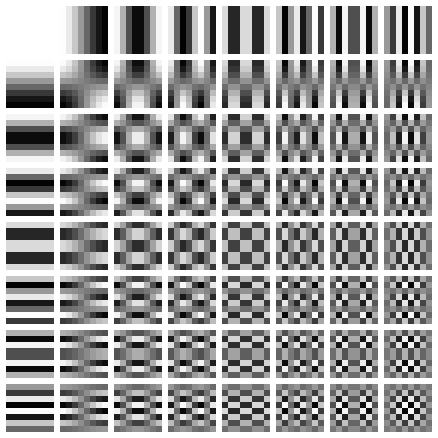
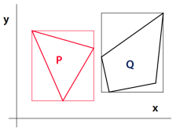
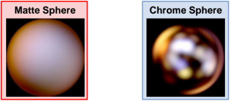
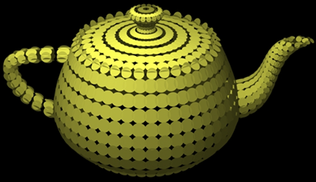

# Počítačová grafika pro hry

[toc]

## 1. Souřadnice, transformace, kvaterniony

Nejprve projdeme *základní operace* s vektory.

**Skalární součin** (dot product): $p \cdot q = \sum_i p_i q_i$ (součet součinů jednotlivých složek) nebo také $p \cdot q = |p| |q| \cos \alpha$ (délky vektorů krát cosinus úhlu mezi nimi). Může se značit také $\left< p, q \right>$. *Maticově* je to $p \cdot q = p^Tq$ (řádkový krát sloupcový).

- Skalární součin *kolmých vektorů* je 0 (kosinus 90° je 0).

**Projekce vektoru** (*ortogonální projekce*): $p_{proj} = \frac{p \cdot q}{|q|} \cdot \frac{q}{|q|} = \frac{p \cdot q}{q \cdot q} q$, pokud *promítáme vektor* $p$ do vektoru $q$. Pomocí něj lze zjistit složku vektoru v určité ose (můžeme vektor rozložit na několik komponent) a hodí se např. při změně báze.

- *Odvození*: $\cos \alpha$ je přilehlá ku přeponě, tedy $\cos \alpha = \frac{|p_{proj}|}{|p|}$. Z toho $|p_{proj}| = |p| \cdot \cos \alpha$. Po dosazení za $\cos \alpha = \frac{p \cdot q}{|p| \cdot |q|}$ a zjednodušení pak dostaneme $|p_{proj}| = |p| \cdot \cos \alpha = |p| \cdot \frac{p \cdot q}{|p| \cdot |q|} = \frac{p \cdot q}{|q|}$. To je tedy délka projekce $p$ na $q$, nakonec vynásobíme normalizovaným $q$, tedy $\frac{q}{|q|}$, abychom dostali výsledný vektor.
- Dá se *vyjádřit maticově* pomocí $qq^T$ jako $p_{proj} = \frac{1}{|q|^2} (qq^T) p = \frac{1}{|q|^2} \begin{pmatrix} q_x^2 & q_xq_y & q_xq_z \\ q_xq_y & q_y^2 & q_yq_z \\ q_xq_z & q_yq_z & q_z^2 \end{pmatrix} \begin{pmatrix} p_x \\ p_y \\ p_z \end{pmatrix}$. To je užitečné pro opakované projekce nebo pokud chceme operaci zabudovat někam do složitějšího maticového výrazu.

**Vektorový součin** (cross product): $p \times q = \begin{pmatrix} p_yq_z - p_zq_y, p_zq_x - p_xq_z, p_xq_y - p_yq_x \end{pmatrix}$. *Záleží na pořadí* vektorů. Výsledkem je *vektor kolmý* na rovinu tvořenou těmito dvěma vektory ($(p \times q) \cdot p = (p \times q) \cdot q = 0$) dle pravidla pravé ruky (ruku nastavíme tak, že prsty směřují od $p$ ke $q$, palec pak určuje výsledný kolmý vektor) a jeho *velikost* je $|p \times q| = |p||q| \sin \alpha$ (obsah paralelogramu definovaného vstupními vektory). Existuje pouze ve 3D a 7D.

- Dá se vyjádřit také jako *determinant matice*: $p \times q = \begin{vmatrix} i & j & k \\ p_x & p_y & p_z \\ q_x & q_y & q_z \end{vmatrix}$, kde vektory $i$, $j$, $k$ jsou jednotkové elementární vektory zarovnané s osami $x$, $y$ a $z$ (pro matici 3x3 lze Sarrusovým pravidlem).
- *Maticový zápis*: $p \times q = \begin{pmatrix} 0 & -p_z & p_y \\ p_z & 0 & -p_x \\ -p_y & p_x & 0 \end{pmatrix} \begin{pmatrix} q_x \\ q_y \\ q_z \end{pmatrix}$ (první vektor je použit pro konstrukci matice, druhý je nezměněn).
- Vektorový součin *rovnoběžných* (lineárně závislých) vektorů je 0 (sinus 0° je 0).
  - Lineárně závislé vektory jsou takové, jejichž lineární kombinace, tj. $k \cdot p + l \cdot q$ pro $k, l \in \mathbb{R}$, je rovna nulovému vektoru.

**Násobení matic**: Násobíme matice $A \cdot B = C$. Pro prvky výsledné matice $C$ pak platí $c_{ij} = a_{i1}b_{1j} + a_{i2}b_{2j} + ... + a_{in}b_{nj} = \sum_{k = 1}^n a_{ik}b_{kj}$ (prvek na pozici $i$, $j$ je *skalární součin* $i$-tého řádku levé matice a $j$-tého sloupce pravé matice). Počet sloupců levé matice musí být rovný počtu řádků pravé matice, tedy např. $K \times N$ a $N \times K$, přičemž výsledná matice má velikost $N \times N$.

### Homogenní souřadnice

**Afinní prostor** - Definován *množinou bodů a vektorů*. Množiny jsou *uzavřené na základní operace*. Součet vektorů je opět vektor. Součet vektoru a bodu je bod (vektor je translace mezi 2 body). Rozdíl dvou bodů je vektor. Jedná se o *podprostor projektivního prostoru*.

**Projektivní prostor** - Rozšíření afinního prostoru přidáním *bodů v nekonečnu*. Díky tomu mají všechny přímky (i rovnoběžné) průsečík. Pro reprezentaci bodů používáme *homogenní souřadnice*. Pak můžeme použít *matice* nejen pro afinní transformace, ale i pro projektivní.

<u>**Homogenní souřadnice**</u> jsou způsob, jak popsat **body v projektivním prostoru** (obdoba kartézských souřadnic z afinního prostoru). Umožňují provádět další operace a transformace za pomoci **násobení matic** (nejen *rotaci* a *škálování*, ale i *translaci*, *perspektivní projekci*; ve 3D pomocí matice 4x4) a celkově jednodušeji pracovat s body a vektory. Transformace pak můžeme spojovat do jedné matice $T \cdot R \cdot S \cdot \mathbf{v} = M \cdot \mathbf{v}$ (translace, rotace a škálování; pořadí je důležité). Také můžeme rychle spočítat *inverzní matici*, pokud obsahuje jen rotaci a translaci, $M^{-1}(R, \mathbf{t}) = M(R^T, R^T \cdot -\mathbf{t})$​.

Přidáváme další složku $w$, která se nazývá *váha bodu*. Bod v kartézských souřadnicích $P = [X, Y]$ má homogenní souřadnice $[x, y, w]$ právě tehdy, když platí $X = \frac{x}{w}$ a $Y = \frac{y}{w}$. Při zvoleném $w$ jsou tedy homogenní souřadnice $P_h = [wX, wY, w]$.

**Převody**:

- *Z kartézských na homogenní*: Přidáme další složku $w$, nastavíme rovnou 1, tedy $[x, y, z] \rightarrow [x, y, z, 1]$.
- *Z homogenních na kartézské*: Složky vydělíme tou poslední, tedy $[x, y, z, w] \rightarrow [\frac{x}{w}, \frac{y}{w}, \frac{z}{w}]$ ($w \neq 0$). Vektor souřadnic $[x, y, z, 0]$ (tedy s $w=0$) je bod v nekonečnu (reprezentuje jen směr, ne bod, protože na něj nefunguje matice translace), takže jej nelze převést do kartézských souřadnic.

**Intuice za tím** (pro jednoduchost z 2D): Prostor nižší dimenze zasadíme *do prostoru vyšší dimenze*. Na původně body se v homogenních souřadnicích díváme jako na přímky, které prochází počátkem souřadnic a protínají *projekční rovinu* ($w = 1$). Např. bod $[-2, -1]$ je popsaný přímkou, která prochází počátkem $[0, 0, 0]$ a bodem $[-2, -1, 1]$ (v něm protíná rovinu $w = 1$). Bod je tedy přímka v projekční geometrii. Podobně se původně přímka popíše jako rovina, která prochází bodem $[0, 0, 0]$​ a protíná projekční rovinu v přímce určené tou původní.

- Dvě trojice homogenních souřadnic $(x_1, y_1, w_1)$ a $(x_2, y_2, w_2)$ reprezentují stejný bod, právě když $(x_1, y_1, w_1) = (\alpha x_2, \alpha y_2, \alpha w_2)$ pro nějaké $\alpha \neq 0$.
- Na $w$ se můžeme dívat jako na něco, co ovlivňuje škálu vzhledem k projekci. Když je $w = 1$, nedochází ke škálování a nemá to tedy žadný vliv na ostatní komponenty ($x$, $y$, $z$). Pokud je $w < 1$, je celý obraz menší. A naopak s $w > 1$​ je větší. GPU používá tuto hodnotu pro renderování obrazu se správnou perspektivou.

**Důvod vzniku**: Bylo třeba zajistit, aby každá dvojice přímek měla jeden průsečík a zároveň aby každými dvěma body procházela nějaká přímka. Řešením je v podstatě *přidat bod v nekonečnu*, který je *průnikem rovnoběžek*. Pak platí axiomy pro projekční geometrii.

- Jediné přímky (body v projekční rovině) neprotínající rovinu (a tedy nezobrazitelné, v nekonečnu) jsou ty, které mají souřadnici $w=0$.
- Průnik dvou původně rovnoběžek je nyní průnik dvou rovin (procházejících bodem $[0, 0, 0]$), což je přímka se souřadnicí $w = 0$​​​.

**Sčítání** bodů zadaných v homogenních souřadnicích: $(x_1, y_1, w_1) + (x_2, y_2, w_2) = (x_1w_2 + x_2w_1, y_1w_2 + y_2w_1, w_1w_2)$.
*Odvození*: Převedeme na kartézské souřadnice, tj. $(\frac{x_1}{w_1}, \frac{y_1}{w_1})$ a $(\frac{x_2}{w_2}, \frac{y_2}{w_2})$. Pak můžeme jednoduše sečíst $(\frac{x_1}{w_1} + \frac{x_2}{w_2}, \frac{y_1}{w_1} + \frac{y_2}{w_2}) = (\frac{x_1 w_2 + x_2 w_1}{w_1 w_2}, \frac{y_1 w_2 + y_2 w_1}{w_1 w_2})$. Nakonec převedeme zpět do homogenních $(\frac{x_1 w_2 + x_2 w_1}{w_1 w_2}, \frac{y_1 w_2 + y_2 w_1}{w_1 w_2}, 1)$ a upravíme $(x_1 w_2 + x_2 w_1, y_1 w_2 + y_2 w_1, w_1 w_2)$ (jen jiný zápis pro ten samý bod).

**Násobení skalárem**: $\alpha (x, y, w) = (\alpha x, \alpha y, w)$ (kdybychom násobili i $w$, dostali bychom jen jiný zápis pro původní bod).

### Afinní a projektivní transformace v rovině a v prostoru

**Transformace** popisují způsob, kterým se pracuje s objekty (např. body) v souřadnicovém prostoru. Rozlišujeme *transformace dvou typů*:

- **Afinní transformace**: Jedná se o transformace, které *zachovávají dimenze* (tedy z bodů na body, z přímek na přímky) *a paralelizmus* (rovnoběžné přímky zůstanou rovnoběžné, poměr délek rovnoběžných úseček zůstane stejný). Už ale *nemusí nutně zachovávat úhly a vzdálenosti* bodů (poměr vzdáleností bodů na stejné úsečce se však zachová). Příklady: *Posunutí*, *otočení* kolem osy souřadnic, *škálování*, *zkosení*, *zrcadlení*.
- **Projektivní transformace**: Jedná se o transformace, které se obvykle snaží zobrazit body v *souřadnicích nižší dimenze* na průmětnu (rovina/přímka, na kterou promítáme). Záleží na konkrétním typu projekce, které vlastnosti při tom zachovávají.

*Vektor souřadnic* násobíme **transformační maticí**. Můžeme násobit řádkový vektor souřadnic maticí zprava, nebo sloupcový vektor (transponovanou) maticí zleva. Např.:
$\begin{pmatrix} x' \\ y' \\ z' \end{pmatrix} =  \begin{pmatrix} t_{11} & t_{12} & t_{13} \\ t_{21} & t_{22} & t_{23} \\ t_{31} & t_{32} & t_{33} \end{pmatrix} \cdot \begin{pmatrix} x \\ y \\ z \end{pmatrix}$ (sloupcový vektor souřadnic násobíme maticí zleva).

#### Afinní transformace

Díky přechodu do **homogenních souřadnic** můžeme *sjednotit popis transformací*. Pak je každá afinní transformace (tedy i včetně translace) jako **maticové násobení** a můžeme je snadno *skládat* (reprezentovat celou transformaci v jediné matici).

**Obecná afinní transformace** pak vypadá následovně: $A \cdot p = \left( \begin{array}{ccc|c} &&& \\ & M & & T \\ &&& \\ \hline 0 & 0 & 0 & 1 \end{array} \right) \cdot \begin{pmatrix} p_x \\ p_y \\ p_z \\ p_w \end{pmatrix}$
Vidíme obecnou matici afinní transformace rozdělenou do *podmatic*. $T$ definuje translaci. $M$ definuje transformace jako rotace, škálování, zkosení a jejich kombinace (v podobě 3x3 pro 3D, tedy pro kartézské souřadnice).

Následující matice jsou tedy <u>**homogenní transformační matice**</u> (tj. předpokládají *homogenní souřadnice*, 3 složky ve 2D, 4 složky ve 3D).

**Posunutí** (*translace*): Ve 2D $T(t_x, t_y) = \begin{pmatrix} 1 & 0 & t_x \\ 0 & 1 & t_y \\ 0 & 0 & 1 \end{pmatrix}$, ve 3D $T(t_x, t_y, t_z) = \begin{pmatrix} 1 & 0 & 0 & t_x \\ 0 & 1 & 0 & t_y \\ 0 & 0 & 1 & t_z \\ 0 & 0 & 0 & 1 \end{pmatrix}$​.

**Otočení** (*rotace*): Ve 2D kolem počátku o úhel $\alpha$, ve 3D kolem kartézských os.

- Ve 2D $R(\alpha) = \begin{pmatrix} \cos\alpha & -\sin\alpha & 0 \\ \sin\alpha & \cos\alpha & 0 \\ 0 & 0 & 1 \end{pmatrix}$
- Ve 3D $R_x(\alpha) = \begin{pmatrix} 1 & 0 & 0 & 0 \\ 0 & \cos\alpha & -\sin\alpha & 0 \\ 0 & \sin\alpha & \cos\alpha & 0 \\ 0 & 0 & 0 & 1 \end{pmatrix}$, $R_y(\alpha) = \begin{pmatrix} \cos\alpha & 0& \sin\alpha & 0 \\ 0 & 1 & 0 & 0 \\ -\sin\alpha & 0 & \cos\alpha & 0 \\ 0 & 0 & 0 & 1 \end{pmatrix}$, $R_z(\alpha) = \begin{pmatrix} \cos\alpha & -\sin\alpha & 0 & 0 \\ \sin\alpha & \cos\alpha & 0 & 0 \\ 0 & 0 & 1 & 0 \\ 0 & 0 &0 & 1 \end{pmatrix}$ (pozor na znaménka u $\sin\alpha$).


- Matice můžeme *transponovat* na základě toho, jestli používáme levotočivý, nebo pravotočivý systém.

**Změna měřítka** (*škálování*): Ve 2D $S(s_x, s_y) = \begin{pmatrix} s_x & 0 & 0 \\ 0 & s_y & 0 \\ 0 & 0 & 1 \end{pmatrix}$, ve 3D $S(s_x, s_y, s_z) = \begin{pmatrix} s_x & 0 & 0 & 0 \\ 0 & s_y & 0 & 0 \\ 0 & 0 & s_z & 0 \\ 0 & 0 & 0 & 1 \end{pmatrix}$. Zachovává se *rovnoběžnost i úhly*.

**Zkosení** (*shear*): Ve 2D $Sh(a, b) = \begin{pmatrix} 1 & a & 0 \\ b & 1 & 0 \\ 0 & 0 & 1 \end{pmatrix}$, ve 3D $Sh(a, b, c, d, e, f) = \begin{pmatrix} 1 & a & b & 0 \\ c & 1 & d & 0 \\ e & f & 1 & 0 \\ 0 & 0 & 0 & 1 \end{pmatrix}$. Zachovává se *rovnoběžnost*, ale ne úhly.

**Složené transformace**: Jednotlivé *transformace lze skládat* tak, že vynásobíme transformační matice mezi sebou, čímž vznikne matice reprezentující celou složenou transformaci. Tou pak násobíme vektory souřadnic. Můžeme tak ušetřit čas, pokud danou posloupnost transformací provádíme často.

- $T_3 \cdot (T_2 \cdot (T_1 \cdot p)) = (T_3 \cdot T_2 \cdot T_1) \cdot p$.
- Např. otočení o úhel $\alpha$ kolem bodu $[x, y]$: $R(x, y, \alpha) = T(x, y) \cdot R(\alpha) \cdot T(-x, -y)$​.
- *Inverzní tranformaci* pak můžeme spočítat jednoduše po krocích: $M = A \cdot B \cdot C$, $M^{-1} = C^{-1} \cdot B^{-1} \cdot A^{-1}$. Pro ortonormální matice (např. rotace) stačí vzít transpozici, $R^{-1} = R^T$.

Speciální skupinou transformací jsou tzv. **transformace tuhého tělesa** (*rigid body transforms*). Tyto transformace *mění orientaci a pozici*, ale *zachovávají přitom tvar* (rigid body se nemůže deformovat). Skládají se tedy pouze z *posunutí a rotací*. Považuje se za ně také převod mezi souřadnicovými systémy.

Běžné transformační matice (používané pro pozice bodů) ovšem *nezachovávají kolmost normálových vektorů* (s výjimkou rigid-body transforms, kdy je matice ortonormální). Pro **transformaci normálových vektorů** se tak musí použít speciální matice $N = (M^{-1})^T$ (původní transformační matici $M$ (*rohová podmatice* homogenní transformační matice) *invertujeme a transponujeme*).

**Převod mezi souřadnicovými systémy**: Chceme *ztotožnit nějaké systémy souřadnic* (např. máme lokální systém spojený s pozorovatelem, převádíme mezi world-space a camera-space), sestavit *matici přechodu* mezi nimi, (oba ale musí mít stejnou orientaci, tzn. pravotočivý/levotočivý). Popíšeme jednu z možných technik:

- Souřadný systém je zadán svým počátkem $A$ a trojicí vektorů $s$, $t$, $u$. Převádíme do systému $x$, $y$, $z$ s počátkem v $0$. Nejprve provedeme translaci, kdy počátek jednoho systému posuneme do počátku druhého, $T(-A)$. Pak otočíme kolem osy $z$ tak, abychom dostali původní $u$ do roviny $yz$, $R_z(\alpha)$. Následně otočíme kolem osy $x$ tak, abychom srovnali $u$ s osou $z$, $R_x(\beta)$. Nakonec otočíme kolem osy $z=u'$, abychom ztotožnili osy $s' \rightarrow x$ a $t' \rightarrow y$. Celá transformace je tak $Cs(A, s, t, u) = R_z(\gamma) \cdot R_x(\beta) \cdot R_z(\alpha) \cdot T(-A)$.
- Pro jednoduchost uvažujeme případ, kdy jeden systém je $[x, y, z]$ a má počátek v nule a všechny vektory určující oba systémy jsou jednotkové (to můžeme neustále udržovat, normalizovat). Pak vytvoříme matici přechodu $M_{stu \rightarrow xyz}$ (ze systému $[s, t, u]$ do $[x, y, z]$) jednoduše. Musí přitom platit $M_{stu \rightarrow xyz} \cdot [1, 0, 0]^T = s$, $ M_{stu \rightarrow xyz} \cdot [0, 1, 0]^T = t$ a $M_{stu \rightarrow xyz} \cdot [0, 0, 1]^T = u$. Triviálně tedy plyne podoba matice $M_{stu \rightarrow xyz} = \begin{pmatrix} s_x & t_x & u_x \\ s_y & t_y & u_y \\ s_z & t_z & u_z \end{pmatrix}$ (ve sloupci jsou vždy jednotlivé složky jednotlivých vektorů systému $[s, t, u]$ v systému $[x, y, z]$, po translaci do počátku). Pro opačný převod pak platí $M_{xyz \rightarrow stu} = M_{stu \rightarrow xyz}^T$ (matice je totiž rotace, tedy ortonormální).

#### Projektivní transformace

**Projekce** - *Z vyšší dimenze do nižší dimenze*. V počítačové grafice se však nedělá striktně matematická projekce, protože pořád nějak *zachováváme i souřadnici* $z$.

Rozlišují se *různé druhy projekcí* podle toho, jaké vlastnosti se při nich zachovávají a jakým způsobem se posílají promítací paprsky:

- **Rovnoběžné projekce** (Parallel) - promítací *paprsky jsou navzájem rovnoběžné*, zachovává se rovnoběžnost, není to realistická projekce
  - **Kolmé projekce** (Orthographic) - promítací paprsky jsou rovnoběžné a zároveň *kolmé na průmětnu*
    - **Mongeova projekce** (Primary) - průmětna *kolmá na jednu ze tří os*
      - *Půdorys* - průmětna v rovině $xy$ (kolmá na $z$)
      - *Nárys* - průmětna v rovině $xz$ (kolmá na $y$)
      - *Bokorys* - průmětna v rovině $yz$ (kolmá na $x$)
    - **Axonometrie** (Auxiliary, obecná kolmá projekce) - průmětna je určena *vzdáleností na jednotlivých osách* (tj. body $a$, $b$, $c$, kterými pak prochází rovina (= průmětna)) a promítá se na ni kolmými rovnoběžnými paprsky
      - *Isometrie* - vzdálenosti bodů na všech osách stejné ($a$, $a$, $a$)
      - *Dimetrie* - vzdálenosti bodů jsou ve dvou osách stejné a ve třetí různá ($a$, $a$, $b$)
      - *Trimetrie* - zcela obecná, různé vzdálenosti na všech osách ($a$, $b$, $c$)
  - **Kosoúhlé projekce** (Oblique) - promítací paprsky jsou rovnoběžné, ale už *ne nutně kolmé* na průmětnu (tím dochází ke zkrácení měřítek některých os, jelikož se promítnou kratší)
    - **Kabinetní projekce** (Cabinet) - průmětna je $xy$, ale nepromítáme kolmě (*zkrátíme měřítko* osy $z$ na $1/2$ a promítáme *pod určitým úhlem* (obvykle $30°$ nebo $45°$))
    - **Kavalírní projekce** (Cavalier) - jako kabinetní, ale *stejné měřítko* na všech osách (opět obvykle $30°$ nebo $45°$)
    - Military
- **Perspektivní (středové) projekce** (Perspective, Central) - promítací *paprsky tvoří svazek* procházející jedním bodem (*středem projekce*), nezachovávají se rovnoběžky, dělí se dle počtu os středu projekce (počtu úběžníků)
  - **Jednobodová** (1-point) - průmětna je *rovnoběžná se dvěma osami*, rovnoběžky se 2 osami se zachovávají, rovnoběžky se třetí osou se protínají v *jednom hlavním úběžníku*, bod projekce je jen jeden
  - **Dvoubodová** (2-point) - průmětna je *rovnoběžná s osou* $z$, takže se rovnoběžky v této ose zachovávají a nepotkají se, rovnoběžky s ostatními osami se protínají ve *dvou hlavních úběžnících*, paprsky se setkávají ve dvou bodech (pro každou nerovnoběžnou osu jeden)
  - **Tříbodová** (3-point) - průmětna *není rovnoběžná ani s jednou osou*, má zcela obecnou polohu, žádné rovnoběžky se nezachovávají, rovnoběžky se souřadnými osami se protínají ve *třech hlavních úběžnících*, body projekce jsou tři (pro každou osu jeden)
  - Curvilinear

**Projekční matice**: Používá se k *přepočtu souřadnic do projekce*, většinou o dimenzi níž. Např. ze 3D do 2D pro zobrazení objektu na monitoru.

**Obecná kolmá projekce** (*axonometrie*): Máme zadanou pozici pozorovatele $S$ (tam se nachází bod $[0, 0]$ průmětny), dále vektor $N$ určující směr pohledu pozorovatele (jeho osa $z$, normálový vektor průmětny), vektor $u$ určující směr nahoru (up, osa $y$ pozorovatele) a z nich můžeme vyjádřit $u \times N$ jako vektor směřující doprava (right, kolmý na $N$ a $u$, osa $x$). *Převedení souřadnic* do základního pohledu je pak $Cs(S, u \times N, u, N)$, kdy provedeme translaci do bodu $[0, 0, 0]$ (tj. posun o $[-S_x, -S_y, -S_z]$) a následně rotacemi převedeme $[x, y, z]$ na $[u \times N, u, N]$. Spočítáme pak $[x, y]$ bodů a získáme tak kolmou projekci.

**Kosoúhlá projekce**: Máme průmětnu $xy$, koeficient zkrácení $K$ a úhel průmětu osy $z$ je $\alpha$. Pak použijeme matici $\begin{pmatrix} 1 & 0 & K \cdot \cos\alpha & 0 \\ 0 & 1 & K \cdot \sin\alpha & 0 \\ 0 & 0 & 1 & 0 \\ 0 & 0 & 0 & 1 \end{pmatrix}$  ($x$ a $y$ necháme být, osu $z$​ zkrátíme podle úhlu).


**Obecná středová projekce**: Máme střed projekce $S$, směr pohledu (normálový vektor průmětny) $N$, vzdálenost průmětny od středu projekce $d$ a svislý vektor $u$. Promítací transformace pak vypadá tak, že to převedeme do základní polohy (střed projekce přesuneme do počátku, směr pohledu do osy $z$, tedy konverze mezi souřadnicovými systémy $[x, y, z]$ a $[u \times N, u, N]$), $Cs(S, u \times N, u, N)$ a pak provedeme *perspektivní projekci* $\begin{pmatrix} 1 & 0 & 0 & 0 \\ 0 & 1 & 0 & 0 \\ 0 & 0 & 1 & 0 \\ 0 & 0 & 1/d & 0 \end{pmatrix} \cdot \begin{pmatrix} x \\ y \\ z \\ 1 \end{pmatrix} = \begin{pmatrix} x \\ y \\ z \\ \frac{z}{d} \end{pmatrix}$, z toho nakonec $\begin{pmatrix} x \frac{d}{z} \\ y \frac{d}{z} \\ d \end{pmatrix}$ (zavedeme perspektivu, využijeme přitom vlastnosti homogenních souřadnic).

- Objekty dál jsou menší, objekty blíž jsou větší. Přímky se zobrazují na přímky (kromě těch v ose zobrazení). Paralelní přímky se střetávají v úběžnících v nekonečnu. Úběžníky přímek na jedné rovině leží na jedné přímce, tzv. horizont, $(x, y, z) \rightarrow (f \frac{x}{z}, f \frac{y}{z})$ (zapomínáme $z$, které by bylo $f$).

> Matice projekce, která se používá např. v OpenGL je pak na konci sekce [Prostory souřadnic](#(Prostory souřadnic)). Nepřevádí se tam jen souřadnice mezi souřadnicovými systémy, ale také se škáluje.

### Kvaterniony

Rotaci můžeme reprezentovat ve formě <u>**Eulerových úhlů**</u>. Rozložíme ji tak na **3 elementární rotace**: yaw/head, pitch, roll. $E(h, p, r) = R_y(h) \cdot R_x(p) \cdot R_z(r)$. Existují různé konvence podle toho, v jakém pořadí se aplikují elementární rotace a jestli se osy otáčejí společně s tělesem. Tento způsob má však dvě nevýhody:

- Mezi dvěma orientacemi se **špatně interpoluje** (pokud bychom interpolovali úhly přímo, *měnila by se rychlost pohybu* a neotáčelo by se po nejkratší cestě).
- Může nastat tzv. **gimbal lock**, kdy se dvě osy otočí tak, že se *ztotožní* a přijdeme tak o jeden DoF (degree of freedom) otáčení.

Místo toho můžeme použít <u>**kvaterniony**</u>. Ty jsou **zobecněním komplexních čísel** *ve 4D prostoru* (komplexní čísla jsou jejich podmnožinou) a používají se především pro zápis **rotace**. V komplexních číslech můžeme reprezentovat vektory v rovině a platí tam $i^2 = -1$. U kvaternionů přidáváme další dvě imaginární části, abychom dokázali **reprezentovat orientaci** v prostoru. Kvaternion je pak *dvojice*: $q = (\mathbf{v}, w) = ix + jy + kz + w = \mathbf{v} + w$, kde $\mathbf{v}$ je vektor imaginárních částí ($\mathbf{v} = (x, y, z) = ix + jy + kz$) a $w$ je reálné číslo. Navíc platí $i^2 = j^2 = k^2 = ijk = -1$.

*Dále platí také následující vztahy* (odvozené z předchozího):

- $i^2 = j^2 = k^2 = -1$,
- $jk = -kj = i$ (násobení není komutativní, neboť $jk = i$ a $kj = -i$),
- $ki = -ik = j$,
- $ij = -ji = k$.

**Základní operace s kvaterniony** (jedná se o *těleso*):

- **Sčítání**: Jednoduše po složkách, $(\mathbf{v_1}, w_1) + (\mathbf{v_2}, w_2) = (\mathbf{v_1 + v_2}, w_1 + w_2)$
- **Násobení**: $\mathbf{qr} = (\mathbf{v_q}, w_q)(\mathbf{v_r}, w_r) = (\mathbf{v_q \times v_r} + w_r \mathbf{v_q} + w_q \mathbf{v_r}, w_q w_r - \mathbf{v_q \cdot v_r})$ (kde $w$ je skalár, $\mathbf{v}$ je vektor)
  - Jednotlivé složky: $i(q_y r_z - q_z r_y + r_w q_x + q_w r_x)$, $j (q_z r_x - q_x r_z + r_w q_y + q_w r_y)$, $k (q_x r_y - q_y r_x + r_w q_z + q_w r_z)$, $q_w r_w - q_x r_x - q_y r_y - q_z r_z$
  - Jiný způsob zápisu: $(qq')_{xyz} = q_{xyz} \times q'_{xyz} + q_wq'_{xyz} + q'_wq_{xyz}$ a $(qq')_w = q_wq'_w - (q_{xyz} \cdot q'_{xyz})$
    - Odvodí se to tak, že si součin rozepíšeme $qq' = (q_w + q_xi + q_yj + q_zk)(q'_w + q'_xi + q'_yj + q'_zk)$, postupně roznásobíme a nakonec uplatníme různé vztahy mezi $i$, $j$ a $k$:
      - $i^2 = j^2 = k^2$
      - $ij = k$, $jk = i$, $ki = j$ (pamatuje se dobře tak, že uspořádáme $i$, $j$, $k$ do kruhu po směru)
      - $ji = -k$, $kj = -i$, $ik = -j$​ (vyčteme z kruhu proti směru)
  - *Není komutativní*
  - Máme dva kvaterniony reprezentující dvě rotace, pak jejich vynásobením získáme složenou rotaci.
- **Násobení skalárem**: $s\mathbf{q} = (0, s)(\mathbf{v}, w) = (s\mathbf{v}, sw)$ (vynásobíme jím reálnou i imaginární složku)
- **Sdružený kvaternion** (conjugation): $(\mathbf{v}, w)^* = (\mathbf{-v}, w)$ (jako u komplexních čísel se jen vymění znaménka)
- **Unit**: $id = (\mathbf{0}, 1)$ (nulový vektor pro imaginární části). Reprezentuje *identitu*, je to také jednotkový kvaternion.
- **Norma kvaternionu** (norm, squared absolute value, délka): $|\mathbf{q}|^2 = n(\mathbf{q}) = \mathbf{qq^*} = x^2 + y^2 + z^2 + w^2$
  - Tedy $|\mathbf{q}| = \sqrt{\mathbf{qq^*}}$.
- **Inverzní kvaternion** (reciprocal): $\mathbf{q^{-1}} = \frac{\mathbf{q^*}}{n(\mathbf{q})} = \frac{\mathbf{q^*}}{|\mathbf{q}|^2}$ (reálným číslem $n(\mathbf{q})$ se dělí po složkách). Součin kvaternionu a inverzního je 1.

Podobně jako komplexní čísla můžeme i kvaterniony vyjádřit v *goniometrické/polární podobě*.

**Jednotkový kvaternion** (*unit quaternion*) je takový, pro který platí, že $n(q) = 1$ (délka), tj. $x^2 + y^2 + z^2 + w^2 = 1$. Dá se zapsat jako $\mathbf{q} = (\mathbf{u_q} \sin\theta, \cos\theta)$. Reprezentuje **rotaci o úhel** $2\theta$ kolem osy $\mathbf{u_q}$ (jednotkový vektor ve 3D). Vektor $(x, y, z)$ tak zapíšeme jako jednotkový vektor $\mathbf{u_q} \sin\theta$ a reálnou část $w$ pak jako $\cos\theta$. Přitom $\mathbf{q}$ a $-\mathbf{q}$ *reprezentují tu samou rotaci* (osu rotace můžeme otočit o 180°, míří opačným směrem).

- **Identita** $(\mathbf{0}, 1)$ je pak *nulová rotace*.

S tímto zápisem můžeme vyjádřit několik **dalších operací** (*logarithm*, *power*):

- **Logarithm**: $\log \mathbf{q} = \theta \mathbf{u_q}$​
  - $\mathbf{q} = \mathbf{u_q} \sin \theta + \cos\theta = \exp(\theta \mathbf{u_q})$

- **Power**: $\mathbf{q^t} = (\mathbf{u_q}\sin\theta + \cos\theta)^t = \exp(t \theta \mathbf{u_q}) = \mathbf{u_q} \sin t \theta + \cos t \theta$ (exponentem se násobí úhel)

**Rotace** - Máme vektor/bod $\mathbf{p} = [p_x, p_y, p_z, 0]$ (ve 3D, reprezentujeme ho jako kvaternion s nulovou skalární složkou) a chceme ho **otočit kolem osy** $\mathbf{u}_q$ **o úhel** $2\theta$. Pak sestavíme *jednotkový kvaternion* $\mathbf{q} = (\mathbf{u}_q \sin \theta, \cos \theta)$ a ten využijeme pro otočení jako $\mathbf{p' = q p q^{-1} = q p q^*}$. Násobíme *dvakrát*, proto celkem o $2\theta$.

Kvaternion lze *převést na matici rotace* a také naopak.

**Spherical linear interpolation** (*slerp*) - Kvaterniony umožňují jednoduše **interpolovat** mezi dvěma rotacemi/orientacemi. Máme kvaterniony $\mathbf{q}$ a $\mathbf{r}$ (reprezentují 2 různé orientace), přičemž $\mathbf{q} \cdot \mathbf{r} \geq 0$ (jinak vezmeme $\mathbf{-q}$, abychom se nepřesouvali delší, doplňkovou cestou), a reálný parametr $0 \leq t \leq 1$ (čas, jak daleko jsme v interpolaci). *Interpolovaný kvaternion* se pak spočítá jako $slerp(\mathbf{q},\mathbf{r},t) = \mathbf{q}(\mathbf{q}^*\mathbf{r})^t$ (vrátí nový kvaternion mezi 2 vstupními orientacemi).

- Po rozepsání mocniny a sdruženého kvaternionu: $slerp(\mathbf{q},\mathbf{r},t) = \frac{\sin(\theta(1-t))}{\sin\theta} \cdot \mathbf{q} + \frac{\sin (\theta t)}{\sin\theta} \cdot \mathbf{r}$, přičemž $\theta$ nemáme, musíme spočítat z $\cos\theta = q_x r_x + q_y r_y + q_z r_z + q_w r_w$.
- Generuje orientaci po *nejkratší sférické cestě* mezi $\mathbf{q}$ a $\mathbf{r}$ (shortest spherical arc). Rychlost je přímo úměrná změně $t$​.
- Libovolnou změnu polohy můžeme provést jen *jednou maticí* (jednou osou otočení a jedním úhlem). Reprezentuje ji translace + kvaternion (pro otočení).

Pomocí kvaternionu můžeme také popsat **rotaci mezi dvěma vektory** (mapování). Máme tedy vektory $\mathbf{s}$ a $\mathbf{t}$. Výsledný kvaternion by byl $\mathbf{q} = (\mathbf{u} \cdot \sin\frac{\theta}{2}, \cos\frac{\theta}{2})$, kde $\theta$ je úhel mezi $\mathbf{s}$ a $\mathbf{t}$. Upravíme ho ale, abychom nemuseli explicitně počítat úhel. Nejprve vektory *normalizujeme*. Pak vyjádříme *jednotkovou osu* rotace $\mathbf{u} = \frac{\mathbf{s} \times \mathbf{t}}{|\mathbf{s} \times \mathbf{t}|}$ (kolmá na oba vektory). Dále využijeme vztahy $\sin \frac{\theta}{2} = \sqrt{\frac{1 - \cos \theta}{2}}$, $\cos \frac{\theta}{2} = \sqrt{\frac{1 + \cos \theta}{2}}$ a $\sin\theta = 2 \sin\frac{\theta}{2} \cos\frac{\theta}{2}$. Následně vyjádříme $\cos \theta = \mathbf{s} \cdot \mathbf{t}$ a $\sin \theta = |\mathbf{s} \times \mathbf{t}|$. Po dosazení všeho a po úpravách dostaneme $\mathbf{q} = (\mathbf{q_v}, q_w) = (\frac{\mathbf{s} \times \mathbf{t}}{\sqrt{2(1+\mathbf{s} \cdot \mathbf{t})}}, \frac{\sqrt{2(1+\mathbf{s} \cdot \mathbf{t})}}{2})$.

- Oproti Slerp máme na začátku a na konci jen směr, nezajímá nás tu rotace objektu kolem vlastní osy.

> Máme dvě polohy objektu dané jednotkovými kvaterniony $\mathbf{q}_0$ a $\mathbf{q}_1$, úhel mezi nimi je $\theta$.
> **LERP** je $\mathbf{q}_t = \frac{(1-t)\mathbf{q}_0 + t \mathbf{q}_1}{|(1-t)\mathbf{q}_0 + t \mathbf{q}_1|}$ (musíme nakonec normalizovat, protože LERP obecně nezachovává délku vektoru)
> **SLERP** pak $\mathbf{q}_t = \frac{\sin(1 - t)\theta}{\sin \theta} \mathbf{q}_0 + \frac{\sin t\theta}{\sin \theta} \mathbf{q}_1$ (oproti LERPu je rovnoměrný, interpoluje nejkratší cestou po povrchu koule)

Kdybychom to samé dělali s maticemi rotace $\mathbf{Q}$ a $\mathbf{R}$, budeme mít $slerp(\mathbf{Q}, \mathbf{R}, t) = \mathbf{Q}(\mathbf{Q}^T\mathbf{R})^t$. Potřebujeme mocninu na maticích, spočítat osu a úhel $Q^TR$, není to efektivní.

**Výhody kvaternionů**:

- Možnost využití pro **interpolaci** (to s rotační maticí nelze dobře).
- Oproti rotaci podle Eulerových úhlů (postupně podle tří os) nedochází ke **gimbal lock** (dvě osy se otočí tak, že se ztotožní a přijdeme tak o jeden DoF (degree of freedom) otáčení).

**Nevýhody kvaternionů**:

- Pro transformaci bodů/vektorů jsou **výpočtově náročné** oproti rotační matici (asi 16 operací násobení, kdežto pro rotační matici je obvykle hardwarová podpora v GPU).

>**Srovnání** různých způsobů *reprezentace rotace*:
>
>- **Eulerovy úhly** - Výhodou je jejich jednoduchost, *menší spotřeba paměti* (3 floaty), intuitivnost. Nevýhodou je ale nesnadná interpolace, možnost gimbal locku a závislost na pořadí.
>- **Rotační matice** - Výhodou je *HW podpora*, efektivní transformace bodu/vektoru. Zabírá ale *hodně paměti* (9 floatů), není úplně intuitivní a ostatní operace (dekompozice, interpolace) nejsou tak efektivní.
>- **Osa rotace a úhel** - Výhodou je *menší spotřeba paměti* (4 floaty), je to podobné kvaternionům, intuitivnost. Nevýhoda je však neefektivní skládání a interpolace.
>- **Kvaternion** - Výhodou je *menší spotřeba paměti* (4 floaty), snadné skládání, *interpolace* a další operace. Nevýhodou je *neefektivní transformace* bodu/vektoru.
>
>Obvykle využijeme *kvaterniony pro vyjádření* nějaké složité transformace a změny orientace. Pak to ale *převedeme na matici* a samotné výpočty na geometrii už provádíme jako maticové výpočty.

### (Prostory souřadnic)

Při vykreslování scény musíme v renderovací pipeline provést *několik transformací*, čímž se **přesouváme mezi různými prostory souřadnic**:

- **Object space** (také *model*, local) - Když konstruujeme scénu, každý objekt má svou vlastní geometrii uloženou v lokálních souřadnicích (relativní vzhledem k počátku objektu). To umožňuje mít jednu geometrii a více instancí stejného objektu ve scéně.
  - *Model transform* - Pomocí ní dostaneme souřadnice ve world space (umístění do globálního systému).
- **World space** - Pozice a orientace objektu ve scéně, relativní ke globálnímu počátku. S tímto prostorem pracuje naše aplikace/hra. V něm se dělají simulace.
  - *View transform* - Chceme renderovat scénu, potřebujeme souřadnice relativní k pozici a orientaci kamery.
- **Camera space** (také eye, *view*) - Souřadnice relativní k pozici a orientaci kamery/pozorovatele (scénu kreslíme z pohledu kamery). Kamera se dívá ve směru $-z$ (nebo někdy $z$).
  - *Projection* - Matice projekce, podle optiky kamery, perspektiva. Definuje viditelné frustum. Projekce do homogenního prostoru.
- **Clip space** - 3D prostor, ve kterém se nachází všechny vrcholy, které budeme renderovat (HW ořezávání). Jsou v něm umístěné pořád jako homogenní souřadnice. Pokud jsou vrcholy mimo daný rozsah, jsou zahozeny. Clip volume (původně frustum) je box od $(-w, -w, -w)$ do $(w, w, w)$, kde $w$ je čtvrtá souřadnice vrcholu (máme homogenní souřadnice).
  - *Perspective divide* (perspektivní dělení) - Každou komponentu vydělíme $w$, převedeme původně homogenní souřadnice na kartézské. Zadrátované v HW.
- **Normalized device space** (NDS, také normalized device coordinates) - Když ořežeme vrcholy, které jsou mimo clip volume, zbylé vrcholy můžeme normalizovat do společného systému. Pak jsme v krychli od $(-1, -1, -1)$ do $(1, 1, 1)$. Pořád uchováváme také hloubku $z$ (normalizovanou z původního rozsahu od near do far) pro depth testing. Vertex shader by měl vracet data v tomto prostoru.
  - *Viewport transform* - Lineární transformace, jen převádí souřadnice pixelů.
- **Window space** (také viewport) - 2D souřadnice pixelu na obrazovce (také ve framebufferu), ale navíc $z$ (hloubka kompatibilní s z-bufferem). V NDC je počátek uprostřed, ale na obrazovce je vlevo nahoře.

Konkrétně ve vertex shaderu, kde chceme přejít do clip space, tak můžeme provést transformaci `out.position = projectionMatrix * viewMatrix * modelMatrix * inputModelSpacePosition`. Transformaci jsme rozložili do 3 matic:

- `inputModelSpacePosition` - je pozice vrcholu (v homogenních souřadnicích) v *model space*.
- `modelMatrix` - transformuje vstupní vrchol z model space do *world space*.
- `viewMatrix` - bere bod ve world space a vrací bod ve *view space* (camera space).
- `projectionMatrix` - jako vstup bere bod ve view space a vrací projektovaný bod v *clip space* (přímo matice projekce).

Tyto tři matice můžeme zkombinovat do jedné, tzv. **MVP**.

**LookAt transformace kamery** - Máme pozici kamery/pozorovatele $e$, pak bod $p$, na který se chceme dívat. Vektor ve směru pohledu (ve skutečnosti směrem za kameru), získáme snadno jako $\mathbf{f} = norm(\mathbf{e}-\mathbf{p})$. Pak můžeme najít vektor $\mathbf{r}$ směrem doprava jako vektor kolmý k $\mathbf{f}$ a současně k vektoru nahoru, stačí nám přitom vzít jen $(0, 1, 0)$, takže $\mathbf{r} = norm((0, 1, 0, 0) \times \mathbf{f})$. Nakonec získáme skutečný vektor směřující nahoru jako vektor kolmý k předchozím dvěma, tedy $\mathbf{u} = norm(\mathbf{f} \times \mathbf{r})$. Zafixujeme směr nahoru jako vektor $u$. Pak sestavíme *transformaci* pro přesun kamery do její pozice a orientace (měníme bázi a přesouváme do pozice kamery)

$\mathbf{TR} = \begin{pmatrix} 1 & 0 & 0 & e_x \\ 0 & 1 & 0 & e_y \\ 0 & 0 & 1 & e_z \\ 0 & 0 & 0 & 1 \end{pmatrix} \begin{pmatrix} r_x & u_x & f_x & 0 \\ r_y & u_y & f_y & 0 \\ r_z & u_z & f_z & 0 \\ 0 & 0 & 0 & 1 \end{pmatrix}$

**View transformace** - Chtěli bychom transformaci, která *transformuje svět relativně k pozici kamery*. Potřebujeme tedy inverzní matici předchozí (ta transformovala kameru vzhledem k světu).

$(\mathbf{TR})^{-1} = \mathbf{R}^{-1}\mathbf{T}^{-1} = \mathbf{R}^T\mathbf{T}^{-1} = \begin{pmatrix} r_x & r_y & r_z & 0 \\ u_x & u_y & u_z & 0 \\ f_x & f_y & f_z & 0 \\ 0 & 0 & 0 & 1 \end{pmatrix} \begin{pmatrix} 1 & 0 & 0 & -e_x \\ 0 & 1 & 0 & -e_y \\ 0 & 0 & 1 & -e_z \\ 0 & 0 & 0 & 1 \end{pmatrix} \\= \begin{pmatrix} r_x & r_y & r_z & -(r \cdot e_x) \\ u_x & u_y & u_z & -(u \cdot e_y) \\ f_x & f_y & f_z & -(f \cdot e_z) \\ 0 & 0 & 0 & 1 \end{pmatrix}$

**Perspektivní projekce** - Ještě bychom chtěli matici pro perspektivní projekci (*středové promítání*, paprsky vycházejí z jednoho bodu). Typicky se perspektivní projekce definuje pomocí tzv. **viewing frustum** (zorný objem; vše, co je uvnitř, bude nakresleno). Díváme se ve směru osy $z$, průmětna je rovnoběžná s rovinou $xy$. Specifikujeme minimální vzdálenost (near), maximální vzdálenost (far) a hranice průmětny. Cílem projekce je nejen **převést souřadnice** mezi souřadnicovými systémy (světový systém souřadnic převedeme do systému pozorovatele), ale také **přeškálovat**, tedy převést všechny body z frustum do rozmezí souřadnic $[-1, 1]$ na všech osách (tj. mezi $[-1, -1, -1]$ a $[1, 1, 1]$). V podstatě se jedná o složení matice perspektivy (převede frustum na kvádr) a matici ortografické projekce (přesune kvádr do počátku a přeškáluje).

$\mathbf{P}_{frustum} = \begin{pmatrix} \frac{2n}{r-l} & 0 & \frac{r+l}{r-l} & 0 \\ 0 & \frac{2n}{t-b} & \frac{t+b}{t-b} & 0 \\ 0 & 0 & -\frac{f+n}{f-n} & -\frac{2nf}{f-n} \\ 0 & 0 & -1 & 0 \end{pmatrix}$

$n$ je near (vzdálenost průmětny od středu projekce, také nejbližší vzdálenost, kterou vykreslujeme), $f$ je far (největší vzdálenost, kterou vykreslujeme), $r$ je right a $l$ je left (vzdálenost od bodu $[0, 0, n]$ ke kraji projekce, polovina šířky frustum), $t$ je top a $b$ je bottom (vzdálenost od bodu $[0, 0, n]$ ke kraji nahoře a dole). Promítací okno má tedy velikost $[r+l, t+b]$​​​​.

> Tato matice se používá v **OpenGL** a dá se *odvodit přes podobnost trojúhelníků* s využitím vzorečků pro projekci bodu $p$, kdy $x = -\frac{n}{p_z}p_x$ a $y = -\frac{n}{p_z}p_y$​.

Pokud je *viewing frustum* **symetrické**, tedy $r = -l$ a $t = -b$​ (osa $z$ prochází prostředkem), můžeme matici zjednodušit:

$\mathbf{P}_{frustum} = \begin{pmatrix} \frac{n}{r} & 0 & 0 & 0 \\ 0 & \frac{n}{t} & 0 & 0 \\ 0 & 0 & -\frac{f+n}{f-n} & -\frac{2nf}{f-n} \\ 0 & 0 & -1 & 0 \end{pmatrix}$​

Členy $\frac{n}{r}$ a $\frac{n}{t}$ řídí projekci dle zvoleného FOV, člen $-\frac{f + n}{f - n}$ dělá kompresi hloubky do požadovaného rozsahu.

Předchozí transformace perspektivní projekce však *mapují hloubku $z$ do NDS nelineárně*. Pro rozsah $[0, 1]$ si můžeme představit místo $F_{depth} = \frac{z - near}{far-near}$ spíše $F_{depth} = \frac{1/z - 1/near}{1/far - 1/near}$ (ale NDS je $[-1,1]$). Máme pak neuniformní přesnost z-bufferu (vzdálenější oblasti jsou méně přesné). Ve view space je tedy hloubka lineární, ale po aplikaci projekční matice už *nelineární v clip space*. Pro co největší přesnost bychom se měli snažit co nejvíce omezit rozsah near-far (minimalizovat poměr $f/n$).

Musíme použít **perspective-correct interpolation** (hyperbolic interpolation), OpenGL ji má zabudovanou. V perspektivní projekci jsou původně stejně dlouhé úsečky různě dlouhé podle toho, jak blízko jsou k pozorovateli. *Nemůžeme na obrazovce interpolovat lineárně* (pouze $x$ a $y$ se mění lineárně). Texturové souřadnice nelze lineárně interpolovat, ale $u/z$ a $v/z$ lze. Můžeme tedy lineárně interpolovat tyto veličiny, pak $u$ a $v$ získáme vynásobením $z$. Stejně tak pro viditelnost musíme lineárně interpolovat $1/z$​ (reciprocal depth) a pak vzít převrácenou hodnotu.

## 2. Křivky a spliny

Spline funkce používáme v momentě, kdy chceme vykreslovat nějakou *spojitou křivku* na základě několika *kontrolních bodů a parametrů* (např. keyframes v animaci). Rozlišujeme *dva typy*:

- **Aproximace** (např. *B-spline*) - Výsledná křivka body *nemusí procházet*.
- **Interpolace** (např. *Catmull-Rom spline*) - Výsledná křivka body *prochází*.

Prvním možným způsobem definice křivky je *explicitní zápis* jako graf funkce $y = f(x)$, např. $y = \sin x$, $z = x^2 + y^2$. Má však několik nevýhod. Nemůžeme zakreslit křivky s více body se stejnou souřadnicí $x$ (např. kruh) a také nedokážeme spočítat tečnu v případě, kdy jde křivka přímo dolů (rovnoběžně s osou $y$​).

Další možností je *implicitní rovnice*. Jedná se o pravidlo - buď ho body splňují, nebo ne. Např. $x^2 + y^2 = 25$ pro kružnici, $0 = x^2 + y^2 + z^2$.

My však použijeme zápis ve formě <u>**parametrické rovnice**</u>, kdy máme nějaké číslo (typicky jedno z intervalu $[0, 1]$), to vložíme do rovnice a něco z ní dostaneme. Obecně křivku definujeme jako **vektorovou funkci** $f(t)$, kdy získáváme vektor souřadnic křivky. Obvykle se jako parametr používá **čas**, získáme tak bod křivky v čase $t$, tj. $f(t) = [x(t), y(t)]$.

- Příklady: $\mathbf{Q}(t) = \begin{bmatrix} \cos t \\ \sin t \end{bmatrix}$ nebo $\mathbf{P}(u, v) = \begin{bmatrix} \cos u (R + r \cdot \cos v) \\ \sin u (R + r \cdot \cos v) \\ r \cdot \sin v \end{bmatrix}$.
- Př. $P_x = 5 \cdot \cos(2\pi \cdot t)$, $P_y = 5 \cdot \sin (2 \pi \cdot t)$ pro kružnici. $t$ je čas, postupně s ním obejdeme celou kružnici (od 0 do 1). Také $P(t) = [\cos t, \sin t]$​.
- Př. $P(t) = (t, t \cdot \cos t, t \cdot \sin t)$ pro spirálu, která se zvětšuje a jde dál podél osy $x$ (rovnoměrně).
- Př. $P(t) = A + t \cdot (B - A)$ pro přímku, nebo také $P(t) = (1-t) \cdot A + t \cdot B$​.
- Tento zápis umožňuje křivky/funkce různě *zanořovat a skládat*. Neměníme vůbec samotnou funkci, ale jen parametr $t$ (*měníme jen zvenčí*, co předáváme dovnitř). Nemusíme tak o funkci nic vědět.
  - Př. $Square(Flip(x))$ nebo $Flip(Square(x))$ z $Square(x) = x^2$ a $Flip(x) = 1 - x$.
  - Př. $Scale(Function, t) = t \cdot Function(t)$​

Pro parametr $t$ se obvykle používá rozsah $[0;1]$ (zlomky, části) nebo $[-1;1]$ (deviace, odchylky). Speciálním případem jsou **normalized transformace**, tedy takové, kdy pokud vložíme $0$, dostaneme $0$, a pokud vložíme $1$, dostaneme $1$​. Mezi tím je to zajímavé.

<u>**Interpolace**</u> je pak *průměrování*. Máme 2 druhy:

- **Lineární interpolace** (Lerp): $Lerp(A, B, t) = (s \cdot A) + (t \cdot B)$, kde $s = 1 - t$ (bereme něco z $A$, něco z $B$​)
  - Také: $((1-t) \cdot A) + (t \cdot B)$ ($B$ má procenta, $A$ dostane, co zbyde)
  - Také: $A + t \cdot (B-A)$ (začneme v $A$, pak se pohneme nějakou část cesty do $B$)
- **Nelineární interpolace**: Chceme jít z $A$ do $B$, ale ne přímým způsobem.
  - Křivky, spliny, tweening/easing funkce.

<u>**Polynomiální křivky**</u> se pak obvykle zapisují: $f(t) = a_0 + a_1 t + a_2 t^2 + ... + a_n t^n$, kde $a_i$ je vektor koeficientů. Např. funkci $x(t) = 6t - 9 t^2 + 4 t^3$, $y(t) = 4 t^3 - 3 t^2$ lze zapsat jako $f(t) = \begin{pmatrix} x(t) \\ y(t) \end{pmatrix} = \begin{pmatrix} 6 \\ 0 \end{pmatrix} t + \begin{pmatrix} -9 \\ -3 \end{pmatrix} t^2 + \begin{pmatrix} 4 \\ 4 \end{pmatrix} t^3$.

U křivek nás při jejich napojování pak zajímají dvě různé **vlastnosti spojitosti**:

- **Geometrická spojitost** - Záleží na tom, jak to geometricky vypadá v prostoru, ne jak se něco po křivce pohybuje. Jedná se jen o tvar. Označuje obecně, zda je křivka *vizuálně spojitá* a jestli jsou její *tečny spojité*. Zaručuje pouze totožnost tečen, ne tečných vektorů. Geometrická spojitost $n$-tého řádu se zapisuje $G^n$. Řád přitom určuje, která spojitost nás zajímá. Stačí nám, že jsou derivace úměrné, nemusí být rovné (tečné vektory jsou lineárně závislé, ale nemají stejnou velikost, $n$-tá derivace $P(x)$ v bodě $x_0$ musí být rovná $n$-té derivaci $Q(x)$ v bodě $x_0$).
  - $G^0$ je jednoduchá *poziční spojitost* (počáteční a koncový bod jsou totožné).
  - $G^1$ je *tangenciální spojitost*, tedy zda je křivka $G^0$ a současně jsou tečné vektory *lineárně závislé*. Pozor, že to není to samé jako rovnost. Musí platit, že mají *stejný směr*, ale už ne stejnou velikost (v bodě spojení se první derivace křivky rovná nějakému $k$ násobku první derivace druhé křivky), pro $x$, $y$ i $z$.
  - $G^2$ je *křivková spojitost*, zda je křivka $G^1$ a současně je *druhá derivace* první křivky rovná $k$ násobku druhé derivace druhé křivky (pro nějaké $k \gt 0$).
- **Analytická spojitost** (*parametrická*) - Zajímá nás, jak by se *po křivce pohyboval bod*, tedy jestli je rychlost (nebo akcelerace) spojitá, tj. skokově se nemění. Požadujeme nejen, aby byla $n$-tá derivace spojitá, ale současně, aby se rovnala (tedy aby *tečné vektory byly totožné*). Analytickou spojitost $n$-tého řádu značíme $C^n$. Analytická spojitost je superiorní geometrické.
  - $C^0$ označuje *spojité napojení* (totožný koncový bod první křivky a počáteční bod druhé křivky). Animovaný objekt *nezmění skokem polohu*.
  - $C^1$ označuje, že je křivka $C^0$ a současně tečné vektory (první derivace) jsou si v bodě spojení rovny. Animovaný objekt *nezmění skokem směr*.
  - $C^2$ pak označuje, že je křivka $C^0$ i $C^1$ a současně druhé derivace v bodě spojení jsou si rovny. Animovaný objekt *nezmění skokem rychlost*.

> Pár poznámek bokem:
>
> - *Směrové vektory* tečen křivky získáme derivováním křivky po souřadnicích. Budou pak tedy pořád parametrizované $t$.
> - Pokud do směrového vektoru tečny *dosadíme* $t$ pro konkrétní bod, získáme tím směrový vektor $u$ tečny v daném bodě.
> - Pomocí bodů a směrového vektoru tečny pak můžeme tečnu zapsat *parametricky* $x = p_x + u_x$, $y = p_y + u_y$ (kde $p = [p_x, p_y]$ je bod dle $t$, $u = [u_x, u_y]$ je směrový vektor tečny v bodě $p$).

**Hlavní myšlenka** tedy je, že máme zadaných *několik kontrolních bodů* a chceme jimi *vykreslit křivku*, která splňuje nějaké parametry. Kromě bodů se obvykle určuje také *tečný vektor* v bodě a navíc chceme i jistou *lokalitu* (změna v kontrolním bodu změní jen jeho bezprostřední okolí).

Obvykle je pak křivka vyjádřena takto: $P(t) = \sum_{i = 0}^{N -1} w_i(t) B_i$, kde $t$ je *čas* (určuje konkrétní bod křivky, $0$ na začátku, $1$ na konci), $B_i$ je *kontrolní bod* a $w_i$ je *váha* kontrolního bodu $B_i$. Jedná se o obecnou definici **free-form křivek**.

Většinou také požadujeme splnění **Cauchyovy podmínky** $\sum_{i=0}^{N-1} w_i(t) = 1$. Ta zaručí, že pokud na křivku aplikujeme nějakou transformaci bod po bodu, získáme stejný výsledek, jako bychom transformovali pouze kontrolní body a křivku z nich spočítali znovu.

### Spline funkce

Spline funkce jsou pojmenované po elastickém pravítku, které se používá při návrhu lodí k zakreslení křivek. Pravítko je ukotveno v několika bodech pomocí tzv. kachniček (ducks, jsou velmi těžké).

<u>**Spline funkce**</u> řádu $n$ je *po částech polynomiální* (řádu $n$) funkce, která je v bodech spojení *maximálně možně spojitá* (maximum-smoothness connection, tedy $C^{n-1}$, tj. spojitost $(n-1)$-té derivace).

- Jednotlivé části splinu jsou tedy různé *polynomy* řádu $n$​, které jsou na sebe *navázané*. Mohou to být třeba *Bézierovy nebo Hermitovy křivky*.
  - $C^0$ - Jednotlivé úseky na sebe navazují (sdílí koncový bod).

  - $C^1$ (spojitá první derivace) - Směry úseků kontrolních bodů na okrajích sousedních křivek na sebe navazují.

  - $C^2$ (spojitá druhá derivace) - Důležitý je nejen směr, ale také vzdálenost kontrolních bodů od hraničních. Pokud jsou body obou křivek stejně daleko, pak navazuje také rychlost.
  
- Vyžadujeme spojitost jen $n-1$, ne $n$, protože pak by byly spojované polynomy stejné.

Spline definujeme na **intervalu** $[u_0, u_N]$ (většinou $[0, 1]$), který rozdělíme na $N$ *podintervalů*. Pro každý podinterval $[u_i, u_{i+1}]$ pak definujeme *polynom* $P_i$, který ho určuje.

- Používáme **globální parametr** $u$ (platí $u_0 \leq u \leq u_N$). Podíváme se, do kterého podintervalu spadá a z odpovídajícího polynomu pak vyčteme hodnotu. $S(u) = P_i(u)$, kde $u_i \leq u \lt u_{i+1}$, rozepsané:
  - $S(u) = P_0(u)$, $u_0 \leq u \lt u_1$,
  - $S(u) = P_1(u)$, $u_1 \leq u \lt u_2$,
  - ...
  - $S(u) = P_{N-1}(u)$, $u_{N-1} \leq u \lt u_N$

Jednotlivé části jsou *často parametrizované rovnoměrně*, pak je to tzv. **uniform spline** (tzn. všechny podintervaly jsou stejně velké). Pak můžeme přejít z *globálního* parametru $u$ na **lokální parametr** $t$ (pro každý polynom zvlášť v intervalu $[0, 1]$), $t_i = (u - u_i) / (u_{i+1} - u_i)$, kde $0 \leq t_i \leq 1$.

**Řád spline funkce** je *největší řád polynomu v něm*, můžeme ale používat i polynomy menšího řádu, pokud dodržíme podmínky spojitosti $n-1$​ derivace.

Spíše se ve splinu používají **kubické Bézierovy křivky** oproti kvadratickým, protože se s nimi *lépe manipuluje*. Jeden hraniční bod ovlivňuje vstup do křivky a druhý výstup z ní. Při změně bodu stačí upravit jen jeden, dál se to nešíří. Pokud ale změníme jeden bod v kvadratické Bézierově křivce, musíme změnit i všechny ostatní pro zachování spojitosti.

Pokud si místo kontrolních bodů představíme *rychlosti*, dostaneme **kubické Hermitovy křivky**. V hraničních bodech jsou technicky 2 rychlosti (jedna dovnitř a jedna ven), ale pro dosažení spojitosti můžeme rovnou počítat jen s jednou.

### Interpolace kubickými spliny

Pomocí splinů pak můžeme řešit úlohu <u>**interpolace**</u>. Máme *zadaných několik bodů* $x_0, x_1, ..., x_n$ a pro ně *předepsané hodnoty funkce* $y_0, y_1, ..., y_n$. Nyní chceme těmito **body proložit spline**.

<u>**Interpolace kubickým splinem**</u>: Spline bude složený z **kubických polynomů** a jednotlivé polynomy se budou *napojovat právě v zadaných bodech*. Interpolační kubický spline pak má následující tvar $S(x) = P_k(x) = p_{k,0} + p_{k,1}(x - x_k) + p_{k,2} (x - x_k)^2 + p_{k,3} (x - x_k)^3$ pro $x \in [x_k, x_{k+1}]$ a $k = 0, 1, ... n-1$. Pomocí $S(x)$ tedy počítáme hodnotu v bodě $x$. $P_k(x)$ je pak **kubický polynom** odhadující část mezi body $x_k$ a $x_{k+1}$. Navíc máme několik **podmínek**, díky kterým můžeme *řešit soustavu rovnic* pro získání jednoznačných koeficientů $p_{k,i}$:

- **Podmínka A**: Určuje *hodnoty funkce ve spojovacích bodech*, $S(x_k) = y_k$, pro $k = 0, 1, ...,n$.
- **Podmínka B**: $C^0$ spojitost, $P_k(x_{k+1}) = P_{k+1}(x_{k+1})$ pro $k = 0, 1, ..., n-2$ (sousední polynomy se *shodují v hodnotě* společného bodu).
- **Podmínka C**: $C^1$ spojitost $P_k'(x_{k+1}) = P_{k+1}'(x_{k+1})$ pro $k = 0, 1, ..., n-2$ (sousední polynomy mají ve společném bodě *stejnou první derivaci*).
- **Podmínka D**: $C^2$ spojitost $P_k''(x_{k+1}) = P_{k+1}''(x_{k+1})$ pro $k = 0, 1, ..., n-2$ (sousední polynomy mají ve společném bodě *stejnou druhou derivaci*).
- **Podmínka E**: $P''(x_0) = P''(x_n) = 0$, doplňující podmínka pro **natural cubic spline** (druhé derivace v počátečním bodu splinu a v koncovém bodu splinu jsou rovné $0$). 

### (Příprava na další)

S polynomy pracujeme především proto, že se *dobře derivují* a dobře se s nimi počítá. V případě **kubických polynomů** ($\mathbf{P}(t) = \mathbf{a}t^3 + \mathbf{b}t^2 + \mathbf{c}t + \mathbf{d}$) vlastně řešíme následující *soustavu rovnic*:

- $P_x(t) = a_x t^3 + b_xt^2 + c_x t + d_x$
- $P_y(t) = a_y t^3 + b_y t^2 + c_y t + d_y$
- $P_z(t) = a_z t^3 + b_z t^2 + c_z t + d_z$

Soustavu pak vyjádříme v **maticovém tvaru** následujícím způsobem:

- $\mathbf{P}(t) = \mathbf{T} \mathbf{C} = \begin{pmatrix} t^3 & t^2 & t & 1 \end{pmatrix} \begin{pmatrix} a_x & a_y & a_z \\ b_x & b_y & b_z \\ c_x & c_y & c_z \\ d_x & d_y & d_z \end{pmatrix}$, kde $\mathbf{C}$ je *matice koeficientů* (konstant).

**Derivaci** pak můžeme spočítat *derivací vektoru* $\mathbf{T}$: $\mathbf{P}'(t) = \frac{d}{dt}\mathbf{T}(t)\cdot \mathbf{C} = \begin{pmatrix} 3t^2 & 2t & 1 & 0 \end{pmatrix} \cdot \mathbf{C}$.

Určité křivky mohou být definovány jako vážený součet **geometrických omezení** (podmínky, body). Zjednodušeně jsme to viděli u free-form křivek, kde bylo geometrickými omezeními několik kontrolních bodů. Můžeme mít např. $\mathbf{Q}(t) = \sum_{k = 0}^3 B_k(t) \mathbf{g_k}$, kde $B_k$ jsou *blending funkce*.
Po rozepsání: $\mathbf{Q}(t) = (a_1t^3 + b_1t^2 + c_1t + d_1)\mathbf{g_1} + (a_2t^3 + b_2t^2 + c_2t + d_2)\mathbf{g_2} +$
                                             $+ (a_3t^3 + b_3t^2 + c_3t + d_3)\mathbf{g_3} + (a_4t^3 + b_4t^2 + c_4t + d_4)\mathbf{g_4}$.

V *maticovém vyjádření* je také oddělíme, tedy $\mathbf{P}(t) = \mathbf{T}(t) \mathbf{C} = \mathbf{T}(t) \mathbf{M} \mathbf{G}$, kde:

- $\mathbf{T}$ je *parametrový vektor*,
- $\mathbf{M}$ je *polynomiální báze* (určuje bázové parametry křivky, tedy konstanty určující, jak se křivka bude chovat) a
- $\mathbf{G}$ popisuje *geometrické kontrolní podmínky*/body (geometrické vlastnosti křivky, např. počáteční/koncové body, tečné vektory)

- Rozepsané pro *kubickou křivku* ($n = 3$, $k = 4$):
  - $\mathbf{P}(t) = \begin{pmatrix} t^3 & t^2 & t & 1 \end{pmatrix} \cdot \begin{pmatrix} m_{11} & m_{12} & m_{13} & m_{14} \\ m_{21} & m_{22} & m_{23} & m_{24} \\ m_{31} & m_{32} & m_{33} & m_{34} \\ m_{41} & m_{42} & m_{43} & m_{44} \end{pmatrix} \cdot \begin{pmatrix} G_1 \\ G_2 \\ G_3 \\ G_4 \end{pmatrix}$
  - *Konkrétní případ*: Kdybychom nastavili $m_{41} = 1$, $m_{31} = -1$, $m_{32} = 1$ a zbytek $0$, pak po vynásobení dostaneme $\mathbf{P}(t) = (1-t) G_1 + t G_2$, což je *rovnice přímky*.

**Fergusonova/Hermitovská křivka**: Nejjednodušší křivka, kterou můžeme popsat způsobem výš. V geometrii popisujeme *koncové body a tečné vektory* ($\sim$ rychlosti v bodech):

- $\mathbf{F}(t) = \begin{pmatrix} t^3 & t^2 & t & 1 \end{pmatrix} \cdot \begin{pmatrix} 2 & -2 & 1 & 1 \\ -3 & 3 & -2 & -1 \\ 0 & 0 & 1 & 0 \\ 1 & 0 & 0 & 0 \end{pmatrix} \cdot \begin{pmatrix} P_0 \\ P_1 \\ T_0 \\ T_1 \end{pmatrix}$, kde $P_0$ je počáteční bod křivky, $P_1$ je koncový bod, $T_0$ je tečný vektor v počátečním bodě a $T_1$ v koncovém.
- Pokud bychom takové křivky chtěli na sebe *navazovat*, např. křivky $Q$ a $R$, pak stačí nastavit $Q_{P_1} = R_{P_0}$ (koncový bod $Q$ je současně počátečním bodem $R$) a také $Q_{T_1} = k \cdot R_{T_0}$ (tečna v daném bodě má stejný směr). Tím zajistíme geometrickou spojitost.


- Fungují stejně jako *Bézierovy* s parametrem $t$​. Lze je snadno mezi sebou *převádět*, jsou izomorfní. V případě kubických máme pořád 4 kontrolní body A, B, C, D, ale body B a C nevidíme, místo nich máme tečny/rychlosti v bodech A a D. Je to intuitivnější a lépe se s nimi pracuje.
  - $\mathbf{P}(t) = s^2(1+2t)A + t^2(1+2s)D + s^2tU - st^2V$ je kubická Hermitova křivka, kde $U$ a $V$ jsou rychlosti v koncových bodech $A$ a $D$, $s = 1 - t$.
  - Převod z Hermita na Béziera: $B = A + (U/3)$, $C = D - (V/3)$
  - Převoz z Béziera (A, B, C, D) na Hermita (A, D, U, V): $U = 3(B-A)$, $V = 3(D-C)$

### Bézierovy křivky

**Motivace**: Nejprve vezmeme *parabolu*, která prochází body $[1, 0]$ a $[0, 1]$ a současně jsou osy $x$, resp. $y$ v těchto bodech její tečnou (na obrázku). Tato parabola má rovnici $f(t) = \begin{pmatrix} 1 \\ 1 \end{pmatrix} t^2 + \begin{pmatrix} -2 \\ 0 \end{pmatrix} t + \begin{pmatrix} 1 \\ 0 \end{pmatrix}$. Můžeme ji ovšem přepsat $f(t) = \begin{pmatrix} 1 \\ 0 \end{pmatrix} (1 - t)^2 + \begin{pmatrix} 0 \\ 0 \end{pmatrix} 2t(1-t) + \begin{pmatrix} 0 \\ 1 \end{pmatrix} t^2$. V tomto vyjádření máme 3 vektory, které jsou přesně *trojice kontrolních bodů*, které jsme při konstrukci paraboly využili (prochází body $[1, 0]$ a $[0, 1]$ a je v nich tečnou mnohoúhelníku $[0, 1]$, $[0, 0]$, $[1, 0]$).


Přesně to samé požadujeme také od <u>**Bézierovy křivky**</u> (která je ve skutečnosti částí paraboly):

- *Prochází krajními kontrolními body*.
- Kontrolní mnohoúhelník tvořený všemi kontrolními body je její *tečnou v krajních bodech*.

<u>**Kvadratická Bézierova křivka**</u> má obecně tvar $f(t) = P_0 (1-t)^2 + P_1 2 t (1-t) + P_2 t^2$, kde $P_0$, $P_1$ a $P_2$ jsou kontrolní body. Prostředního bodu křivka nikdy nedosáhne, jen ovlivňuje její tvar.

Stejně tak můžeme pracovat také s *polynomem vyššího stupně*. Pro **obecný stupeň** $n$ <u>**Bézierovy křivky**</u> pak máme následující tvar $\mathbf{f}(t) = \sum_{k=0}^n B_{n, k}(t) \mathbf{P_k}$, přičemž $\mathbf{P_k}$ je $k$-tý kontrolní bod (vektor) a $B_{n,k}$ je $k$-tý **Bernsteinův polynom** $n$-tého stupně $B_{n,k}(t) = \begin{pmatrix} n \\ k \end{pmatrix} t^k (1-t)^{n-k}$ (binomický koeficient, kombinační číslo $n$ nad $k$). Má tedy $n+1$ řídicích bodů a jako blending funkci pro geometrická omezení používáme Bernsteinovy polynomy.

- $\begin{pmatrix} n \\ k \end{pmatrix} = \frac{n!}{k! (n - k)!}$
- Např. Bézierova křivka stupně 0 je jen bod.
- Např. **lineární Bézierova křivka** je stupně 1, má 2 kontrolní body a je to jen *lineární interpolace* $Lerp(A, B, t) = (1-t)\cdot A + t \cdot B = A + t \cdot (B - A)$​.
- Např. **kvadratická Bézierova křivka** má 3 kontrolní body.
- Např. **kubická Bézierova křivka** je tedy určena 4 kontrolními body.

S **normalizovanými Bézierovými křivkami** můžeme snadno pracovat. Např. pro kubickou předpokládáme, že $A$ je 0 a $D$ je 1, tak mohou z výpočtu úplně zmizet.

```pseudocode
float NormalizedBezier3(float B, float C, float t) {
	float t2 = t * t; float t3 = t2 *t;
	float s = 1f - t; float s2 = s * s;
	return (3f * B * s2 * t) + (3f * C * s * t2) + t3;
}
```

Když interpolujeme pomocí $t$​, křivky nejsou jednotné, někde se provádějí větší kroky, jinde menší. To určuje jakousi **"rychlost"** (za stejný časový interval jiná délka kroku po křivce). Záleží to přitom na vzdálenostech kontrolních bodů.

Bézierovu křivku vyššího stupně lze *převést na libovolný nižší stupeň* jen posouváním kontrolních bodů, např.:

- $LinearBezier = QuadraticBezier(A, \frac{A+C}{2}, C)$ - B dáme doprostřed mezi A a C
  - nebo $LinearBezier = QuadraticBezier(0, 0.5, 1)$ pro normalizovaný
- $LinearBezier = CubicBezier(0, 0.333, 0.667, 1)$ - B do třetiny mezi A a D, C do dvou třetin
- $QuadraticBezier = CubicBezier(A, \frac{1}{3}E + \frac{2}{3}F, \frac{2}{3}F + \frac{1}{3}G, D)$ - B je ve 2/3 mezi E a F, C je v 1/3 mezi F a G (E je lerp A a B, F je lerp B a C, G je lerp C a D)

<u>**Bernsteinova báze**</u> pro řád $n$ jsou všechny polynomy $B_{n,k}$ pro $k = 0, 1, ..., n$. Platí navíc tzv. **rozklad jednotky**, což znamená, že součet všech polynomů z báze se rovná $1$, tedy $\sum_{k = 0}^n B_{n,k}(t) = 1$ (pro $t \in [0, 1]$). To se krásně hodí do **Cauchyho podmínky**. Také je **symetrická**, tedy v bázi existují vždy symetrické polynomy.

- Bézierova křívka je pak *lineární kombinací Bernsteinových bázových polynomů*.
- Když polynomy z báze sčítáme s různými koeficienty, můžeme tak aproximovat různé křivky (podobně jako pomocí sčítání sinusoid).
- Bernsteinovy báze různých stupňů:

<u>**Kubické Bézierovy křivky**</u> se často používají v praxi. Změna polohy jednoho bodu v nich má omezenější vliv na tvar celé křivky. Tuto křivku určují *čtyři kontrolní body* $P_0$, $P_1$, $P_2$ a $P_3$ (body $P_0$ a $P_3$ křivka prochází, bod $P_1$ určuje pouze směr/tečnu z $P_0$ a bod $P_2$ pak určuje směr/tečnu do $P_3$). Rovnici křivky můžeme vyjádřit $\mathbf{f}(t) = \sum_{k = 0}^3 B_{3,k}(t) \mathbf{P_k}$ a také maticově $\mathbf{T} \mathbf{M} \mathbf{G} = \begin{pmatrix} t^3 & t^2 & t & 1 \end{pmatrix} \cdot \begin{pmatrix} -1 & 3 & -3 & 1 \\ 3 & -6 & 3 & 0 \\ -3 & 3 & 0 & 0 \\ 1 & 0 & 0 & 0 \end{pmatrix} \cdot \begin{pmatrix} P_0 \\ P_1 \\ P_2 \\ P_3 \end{pmatrix}$ (uprostřed je bázová matice pro Bernsteinovu bázi řádu $3$​ (obsahuje 4 polynomy), vpravo jsou v matici kontrolní body).

- Při napojování křivek pro $G^1$ spojitost stačí, aby měly poslední tečna předchozí křivky ($P_2 P_3$) a první tečna následující křivky ($P_0 P_1$) *stejný směr*, pro $C^1$ spojitost pak požadujeme také *stejnou délku*.

**Vlastnosti Bézierovy křivky**:

- **Interpolace koncových bodů**: Křivka prochází koncovými body, tedy platí $f(0) = P_0$ a $f(1) = P_n$.
  - Díky Bernsteinovým polynomům, neboť $f(0) = \sum_{i=0}^n \begin{pmatrix} n \\ i \end{pmatrix} 0^i (1-0)^{n-i} P_i = P_0$ (všechny polynomy rovné $0$ kromě $B_{n,0}$) a $f(1) = \sum_{i=0}^n \begin{pmatrix} n \\ i \end{pmatrix} 1^i (1-1)^{n-i} P_i = P_n$ (všechny polynomy rovné $0$ kromě $B_{n,n}$, protože $(1-1)^{n-i} = 0^0 = 1$).
- **Tečny v koncových bodech**: První a poslední segment kontrolního mnohoúhelníku je tečnou Bézierovy křivky, tedy $f'(0) = n \cdot (P_1 - P_0)$ a $f'(1) = n \cdot (P_n - P_{n-1})$ (kde $n$ je konstanta).
- **Konvexní obal**: Pro $0 \leq t \leq 1$ je křivka celá uvnitř konvexního obalu kontrolního mnohoúhelníku.
- **Afinní invariance**: Platí Cauchyho podmínka, Bézierova křivka je tedy invariantní vůči lineární transformaci (translace, rotace, škálování, ne projekce). Pokud aplikujeme transformaci na každý bod křivky zvlášť, dostaneme stejný výsledek, jako bychom transformovali pouze kontrolní body a křivku dle nich znovu zkonstruovali.
- **Lineární přesnost**: Pokud leží všechny kontrolní body na jedné přímce, Bézierova křivka se stane úsečkou na této přímce. To je výhoda oproti interpolaci polynomu.
- **Omezené kolísání**: Bézierova křivka nekolísá víc než kontrolní mnohoúhelník, může kolísat míň. Jedna přímka tedy protíná Bézierovu křivku nanejvýš tolikrát, kolikrát protíná její kontrolní mnohoúhelník.
- **Globální vliv bodů**: Vliv kontrolního bodu na křivku je globální. Pokud se tedy posune jeden bod, změní se celá křivka. Proto se v praxi nejčastěji používají spliny.
- **Bézierovy podkřivky**: Bézierova křivka může být v libovolném bodě rozdělena na dvě (nebo libovolně mnoho) podkřivky, přičemž každá z nich je opět Bézierova křivka.
- **Křivky vyšších stupňů**: Každá křivka stupně $n$ je zároveň křivkou stupně $m$ pro libovolné $m > n$​​.

> **Midpoint control** je jen jiný způsob kontroly, kdy pro kvadratické Bézierovy křivky místo prostředního kontrolního bodu $B$ určujeme přímo prostřední bod křivky $H$ (tedy takový bod, kterým by křivka měla procházet v čase $t = 0.5$).
>
> Bod $B$ pak najdeme jednoduše. Nejprve určíme bod mezi $A$ a $C$. Pak určíme vektor z tohoto bodu do bodu $H$. Nakonec jdeme o takový vektor ještě jednou dál, tam bude $B$.

> Pokud zapíšeme Bézierovy křivky různých stupňů k sobě, můžeme vidět jasný vzor:
>
> - Lineární: $P(t) = (s)A + (t)B = \mathbf{1}(s^\mathbf{1} t^\mathbf{0})A + \mathbf{1}(s^\mathbf{0}t^\mathbf{1})B $
> - Kvadratická: $P(t) = (s^2)A + 2(st)B + (t^2)C = \mathbf{1}(s^\mathbf{2}t^\mathbf{0})A + \mathbf{2}(s^\mathbf{1}t^\mathbf{1})B + \mathbf{1}(s^\mathbf{0}t^\mathbf{2})C$
> - Kubická: $P(t) = (s^3)A + 3(s^2t)B + 3(st^2)C + (t^3)D$ $= \mathbf{1}(s^\mathbf{3}t^\mathbf{0})A + \mathbf{3}(s^\mathbf{2}t^\mathbf{1})B + \mathbf{3}(s^\mathbf{1}t^\mathbf{2})C + \mathbf{1}(s^\mathbf{0}t^\mathbf{3})D$

### Catmull-Rom spliny

**Kochanek-Bratels křivky**: Vychází z Hermitovských křivek (*tečné vektory se ale dopočítají z bodů automaticky*) a často se označují jako **TCB křivky**, protože se u nich definují tři skalární parametry (defaultně 0) pro daný bod - **tension** (napětí, ostrost křivky, absolutní hodnota tečného vektoru), **continuity** (spojitost) a **bias** (šikmost, směr tečny). Křivka je pak zadaná posloupností bodů $P_0, ... P_n$ (začíná ale v bodě $P_1$ a končí v $P_{n-1}$, body $P_0$ a $P_n$ jsou pouze řídicí/kontrolní) a ke každému z nich určuje tři koeficienty ($t_i$, $c_i$ a $b_i$).

- V bodech si pak musíme spočítat levé a pravé tečné vektory ($T_0$ a $T_1$ v lokálním smyslu):
  - $L_i = \frac{(1-t)(1-c)(1+b)}{2} \cdot (P_i - P_{i-1}) + \frac{(1-t)(1+c)(1-b)}{2} \cdot (P_{i+1} - P_i)$
  - $R_i = \frac{(1-t)(1+c)(1+b)}{2} \cdot (P_i - P_{i-1}) + \frac{(1-t)(1-c)(1-b)}{2} \cdot (P_{i+1} - P_i)$ (jen opačné znaménko u $c$)
- Parametry $t_i$, $c_i$ a $b_i$ jsou z intervalu $[-1, 1]$: Vliv jednotlivých parametrů na tvar křivky se nejlépe zkoumá tak, že všechny položíme rovné $0$ (přímo uprostřed intervalu) a měníme hodnotu pouze jednoho zkoumaného (do významných hodnot $-1$, $0$ a $1$) 
- Parametr $t_i$ ovlivňuje *velikost tečny* v bodě $P_i$. Pokud dosadíme $b = c = 0$ do jedné z rovnic pro tečný vektor, dostaneme $T_i = \frac{1-t}{2} \cdot (P_{i+1} - P_{i-1})$. Pro $t = 0$ pak $T_i = \frac{1}{2} \cdot (P_{i+1} - P_{i-1})$. Pokud je $t > 0$, křivka je v bodě rovnější, naopak pro $t < 0$ je v bodě větší zlom.
  - 
- Parametr $b_i$ určuje *šikmost* - směr tečného vektoru. Pro $b_i < 0$ je tečný vektor bližší směru pravé části křivky, naopak pro $b_i > 0$ je bližší levé části křivky a pro $b_i = 0$ je uprostřed (obě strany mají stejný vliv).
  - 
- Parametr $c_i$ určuje *spojitost* v bodě $P_i$.
  - Pokud je $c_i = -1$, levá tečna bude $P_i - P_{i-1}$ a pravá tečna pak $P_{i+1} - P_i$. Křivka tedy není spojitá v $C^1$, protože se v bodě zlomí (tečna je rovná směru křivky).
  - Pokud je $c_i = 1$, nastane podobná situace, jen se prohodí levá a pravá tečna.

**Cardinal spline** je speciálním případem Kochanek-Bratels/TCB křivky, kdy nastavíme $b = c = 0$ a měníme tedy pouze parametr $t$. Dosazením do obecných vzorců pro tečny pak dostaneme $T_i = \frac{1-t}{2} \cdot (P_{i+1} - P_{i-1})$. Pro jednoduchost to ještě vyjádříme pomocí parametru $a = \frac{1-t}{2}$ (závislém na $t$) $T_i = a \cdot (P_{i+1} - P_{i-1})$. Parametr $a$ je pak z intervalu $[0, 1]$.

**Catmull-Rom spline** je vlastně speciálním případem Kochanek-Bratels/TCB křivky, kdy jsou všechny koeficienty $t_i$, $c_i$ a $b_i$ rovné $0$ (případně z Cardinal spline s $a = 1/2$). Rovnice tečného vektoru je pak $T_i = \frac{1}{2} \cdot (P_{i+1} - P_{i-1})$. V maticovém zápisu $\mathbf{M} \mathbf{G} = \frac{1}{2} \begin{pmatrix} -1 & 3 & -3 & 1 \\ 2 & -5 & 4 & -1 \\ -1 & 0 & 1 & 0 \\ 0 & 2 & 0 & 0 \end{pmatrix} \cdot \begin{pmatrix} P_{i-1} \\ P_i \\ P_{i+1} \\ P_{i+2} \end{pmatrix}$​.

- Jedná se o *speciální případ kubického Hermitova splinu* se speciálními hodnotami zvolenými jako rychlosti na začátku a konci každé části. Máme tedy řídicí body $P_1, ..., P_n$ a tečny v bodech $T_i = \frac{1}{2} \cdot (P_{i+1} - P_{i-1})$.
- Spíše než o typ splinu se jedná o *techniku/algoritmus pro vytvoření splinu*, pokud máme sadu uspořádaných bodů a chceme co nejhezčí spline, který jimi prochází.
  - Předpokládáme, že rychlosti U a V jsou 0 na začátku i na konci splinu.
  - Spočteme vektor z bodu 0 do bodu 2, to bude tečna pro bod 1.
  - Nastavíme rychlost z bodu 1 na polovinu tohoto vektoru. Nyní máme pozice 0 a 1 a rychlost v bodech 0 a 1, tj. máme *Hermitovu křivku*.
  - Pokračujeme vektorem z 1 do 3. Rychlost pro bod 2 nastavíme na polovinu tohoto vektoru. Máme pozice a rychlost pro body 0, 1 a 2, tj. máme *Hermitův spline*.
  - Pokračujeme stejně dál.
  - (Rychlost v $N$-tém bodě je tak $V_N = \frac{P_{N+1} - P_{N-1}}{2}$, kde $P_N$ je pozice $N$-tého bodu.)

### B-spline

<u>**B-spline**</u> (nebo také *basis spline*) je další **aproximační křivkou**. Tvar je určen *posloupností řídicích bodů*. Parametrický zápis využívá báze, neboli *blending funkce* (závislost bodu křivky na řídicím polygonu). Dodržuje navíc *vlastnost lokálnosti*, kdy změna jednoho řídicího bodu vyvolá jen lokální změnu.

<u>**Coonsův B-spline**</u> - Je složen z *kubických křivek*. Sousední křivky vždy **sdílí 3 kontrolní body**. Pokud má tedy první body $P_0$, $P_1$, $P_2$ a $P_3$, druhá bude mít body $P_1$, $P_2$, $P_3$ a $P_4$. Změna jednoho bodu vyvolá změnu ve 4 nejbližších segmentech. Je $C^2$ spojitý. Každý segment je určen 4 body a vyjádřen maticí jako $\mathbf{M} \mathbf{G} = \frac{1}{6} \cdot \begin{pmatrix} -1 & 3 & -3 & 1 \\ 3 & -6 & 3 & 0 \\ -3 & 0 & 3 & 0 \\ 1 & 4 & 1 & 0 \end{pmatrix} \cdot \begin{pmatrix} P_{i-1} \\ P_i \\ P_{i+1} \\ P_{i+2} \end{pmatrix}$. Křivka nezačíná v počátečním kontrolním bodu, ale v tzv. **antitěžišti** (tj. $1/3$ těžnice trojúhelníku $P_0$, $P_1$, $P_2$, která začíná v bodě $P_1$; oproti tomu těžiště je ve $2/3$). Spočítá se $Q(0) = \frac{P_0 + 4 \cdot P_1 + P_2}{6}$.

> Nejpoužívanější variantou B-spline je **NURBS** (NeUniformní Racionální B-spline).

### ~~De Casteljau a de Boor algoritmus~~

<u>**Algoritmus de Casteljau**</u> (také *algoritmus de Boor*) popisuje numericky stabilní způsob výpočtu Bernsteinových polynomů (Bézierových křivek) využívající **opakované lineární interpolace**. Dá se použít pro *získání bodu křivky v konkrétním čase* nebo pro *rozdělení křivky* nebo k *přesnějšímu vykreslení* křivky.

- Nemusí být nutně efektivnější než přímý výpočet ze vzorečku Bézierovy křivky, ale umožňuje *přesnější výpočet* (při násobení dostáváme velké mocniny příliš malých čísel a narážíme tak na limity přesnosti floatů a doublů).

Pomocí algoritmu můžeme vypočítat bod křivky v čase $t_0$ **rekurentním vztahem**:

-  $\beta_i^{(0)} := \beta_i$, pro $i = 0, ..., n$
- $\beta_i^{(j)} := \beta_i^{(j-1)}(1 - t_0) + \beta_{i+1}^{(j-1)} t_0$, pro $i = 0, ..., n-j$, $j = 1, ..., n$ (kde $\beta_i^{(j)}$ je $i$-tý kontrolní bod v $j$-té iteraci)

Abychom tedy našli **bod křivky v čase $t$**, v podstatě pospojujeme sousední kontrolní body křivky úsečkami a na každé pak zvolíme bod, který ji rozděluje v poměru $t:(1-t)$ (*lineární interpolace*). Tyto body použijeme v další iteraci jako *nové kontrolní body* a postup *opakujeme*. V každé iteraci vznikne o bod méně a pokračujeme tedy tak dlouho, dokud nezbyde *jeden finální bod* (to je ten hledaný).

- Vizualizace: [De Casteljau's Algorithm and Bézier Curves (malinc.se)](https://www.malinc.se/m/DeCasteljauAndBezier.php)

Pro **kvadratickou Bézierovu křivku**: Má 3 kontrolní body. Je to lineární interpolace mezi dvěma lineárními Bézierovými křivkami.

- $E(t) = (s \cdot A) + (t \cdot B)$, přičemž $s = 1-t$
- $F(t) = (s \cdot B) + (t \cdot C)$
- $P(t) = (s \cdot E(t)) + (t \cdot F(t)) = A s^2 + 2 B st + C t^2$

Pro **kubickou Bézierovu křivku**: Má 4 kontrolní body, označíme je A, B, C, D. Děláme lineární interpolaci kvadratických Bézierových křivek (všude interpolujeme se stejným $t$​).

- Tři lineární Bézierovy křivky (AB, BC, CD): $E(t) = sA + tB$, $F(t) = sB + tC$, $G(t) = sC + tD$
- Dvě kvadratické Bézierovy křivky (ABC, BCD): $Q(t) = sE(t) + tF(t)$, $R(t) = sF(t) + tG(t)$
- Finální kubická Bézierova křivka: $P(t) = sQ(t) + tR(t) = As^3 + 3Bs^2t + 3Cst^2 + Dt^3$

Pomocí toho samého algoritmu můžeme Bézierovu křivku snadno **rozdělit na dvě podkřivky** stejného stupně v libovolném bodě $t$. Funguje to pro *Bézierovy i Hermitovy křivky*.

Pro **kubickou křivku** potřebujeme z původních 4 kontrolních bodů *vytvořit celkem 7* (každá podkřivka má své 4, jeden je ale sdílený).

1. Začneme s body $P_0$, $P_1$, $P_2$ a $P_3$ a provedeme jednu iteraci algoritmu pro $t = 1/2$ (pokud chceme rozdělit křivku napůl, jinak lze i libovolný jiný poměr). Tím rozdělíme spojnice bodů přesně uprostřed a získáme 3 nové body $Q_0$, $Q_1$ a $Q_2$.
2. Provedeme druhou iteraci a získáme další 2 body $R_0$ a $R_1$.
3. Nakonec uděláme ještě třetí iteraci, která už nám vrátí pouze jeden bod $S_0$.
4. Z bodů zvolíme $P_0$, $Q_0$, $R_0$, $S_0$, $R_1$, $Q_2$ a $P_3$ jako těch hledaných 7.
5. Křivku pak rozdělíme na první podkřivku s krajními body $P_0$ a $S_0$ a kontrolními body $Q_0$ a $R_0$ a na druhou podkřivku s krajními body $S_0$ a $P_3$ a kontrolními body $R_1$ a $Q_2$.


Musíme pak přepočítat $t$. Obvykle se určí podle poměru délek (ty změříme tak, že projdeme a podle počtu kroků v jednotlivých částech určíme).

## 3. Obrázky a textury

### ~~2D Fourierova transformace a konvoluce~~

Každý **signál** není reprezentovaný jen jednou frekvencí, ale celým **spektrem frekvencí**, ze kterého se pak *skládá výsledný signál*.

<u>**Fourierova transformace**</u> (také tzv. *dopředná Fourierova transformace*) je **transformace signálu** z domény času do *domény frekvencí*. Máme tedy **periodický signál** a zajímá nás, *ze kterých frekvencí je složený*. Fourierova transformace nám vrátí **koeficienty** k sin a cos vlnám, které *tvoří původní signál*. Rozlišujeme přitom **spojitou** Fourierovu transformaci a **diskrétní** Fourierovu transformaci (ta nás zajímá v grafice).

**Diskrétní Fourierova transformace** je omezená nějakou *vzorkovací frekvencí* (sampling rate) a vypadá následovně: $X_k = \sum_{n = 0}^{N-1} x_n \cdot e^{-i 2 \pi k n / N}$, kde $X_k$ je poměr frekvence $k$ v signálu, který jsme samplovali v bodech $x_0$ až $x_n$.

- **Idea**: Díváme se na všechny možné *frekvence sinusoid* a vydělíme jimi původní signál. Tím získáme graf, který nám určuje, jakou částí se testovaná sinusoida podílí na výsledku. Místo sinusoid ovšem používáme **Eulerovu formuli** $e^{i \pi} = -1$, abychom *samplovali po kruhu*. Říká nám, že pokud posuneme $e^{ix}$ o $\pi$, dostaneme půlkruh, graf $e^{ix}$ je kruh. Můžeme ji také přepsat jako $e^{ix} = \cos x + i \cdot \sin x$. Pro zjištění poměru ($X$) jedné frekvence ($k$) točíme ($i$) signálem po kruhu ($2 \pi$) na dané frekvenci a průměrujeme $n/N$ body po cestě.

Můžeme definovat také **inverzní transformaci** (tzv. *zpětnou Fourierovu transformaci*) $x_n = \frac{1}{N} \sum_{k = 0}^{N - 1} X_k \cdot e^{i 2 \pi k n / N}$, kterou spočítáme $x_n$, což je nasamplovaná hodnota signálu v bodě $n$.

Díky Fourierově transformaci signálu zjistíme, *které frekvence se v něm vyskytují*, takže pak lze dobře **filtrovat šum**.

**2D Fourierova transformace** dělá to samé, přidává ovšem další dimenzi, $F(x, y) = \frac{1}{MN} \sum_{m=0}^{M-1} \sum_{n=0}^{N-1} f(m, n) \cdot e^{-j 2 \pi (x \frac{m}{M} + y \frac{n}{N})}$.

- Máme *obrázek* $M \times N$ a postupně *skládáme vertikální a horizontální sinusoidy*. Nejdříve nabereme po sloupcích několik 1D Fourierových transformací, ke kterým pak přičteme Fourierovy transformace po řádcích. Výsledkem je *matice koeficientů*, která určuje zastoupení jednotlivých kombinací horizontálních a vertikálních frekvencí.
- Inverzní transformací je pak $f(m, n) = \sum_{x=0}^{M-1} \sum_{y=0}^{N-1} F(x, y) \cdot e^{j 2 \pi (x \frac{m}{M} + y \frac{n}{N})}$.

Následující obrázek zachycuje, jak zhruba vypadají *jednotlivé komponenty*, jejichž poměr se snažíme zjistit v obrázku. Používá se např. v **JPEG kompresi** (*diskrétní kosinová transformace*, kdy se oproti Fourierově transformaci používají *pouze reálná čísla*, vynechá se imaginární část).



> **Fourierova věta**: Pokud je funkce spojitá, dostatečně hladká (derivace vysokých řádů) a *periodická*, pak může být vyjádřena jako nekonečná řada sinů a kosinů (součet sinů a cosinů, každá komponenta má svou amplitudu a frekvenci).
>
> - Signál můžeme zopakovat nekonečněkrát, abychom měli periodickou funkci. Pak lze aplikovat Fourierovu větu a funkci vyjádřit jako součet sinů a cosinů.

**Konvoluce** popisuje další způsob, jakým se dají *skládat dohromady dvě funkce*, jedná se v podstatě o *vážený klouzavý průměr*. **Spojitá** varianta má následující vzoreček $(f * g)(x) := \int_{-\infty}^{\infty} f(t) \cdot g(x-t) \, d t$, kde $g$ je *konvoluční jádro* (váhová funkce), **diskrétní** je pak $(f * g)[n] = \sum_{m = -\infty}^{\infty} f[m]g[n-m]$ (vážený klouzavý průměr na posloupnosti).

- **Vizualizace**: Vezmeme vlastně funkci $g$, otočíme ji podle osy $Y$ (tj. bereme ji pozpátku) a pak ji posouváme tak, aby byl původní počátek v bodě $n$ (nebo $t$ pro spojitou variantu), následně ji vynásobíme s funkcí $f$ a spočítáme integrál (tj. plochu pod grafem). Výsledkem je tedy graf, jehož hodnoty odpovídají ploše pod grafem vynásobených dvou funkcí.
- **Příklad**: Funkce $f(t)$ popisuje, kolik ohňostrojů vybuchlo v čase $t$. Funkce $S(t)$ popisuje, kolik kouře zbylo po výbuchu jednoho ohňostroje v čase $t$ (kouř postupně vyprchává, takže je ho hodně v $t_0$ a postupně to klesá. Zajímá nás, kolik je ve vzduchu celkem kouře v čase $T$.
- **Vlastnosti**: Konvoluce je *komutativní* ($f * g = g * f$), *asociativní* ($f * (g * h) = (f * g) * h$), *distributivní* ($f*(g+h) = f*g+f*h$) a asociativní při násobení skalárem ($a(f*g) = (af)*g = f*(ag)$).

**2D konvoluce** je úplně to samé, jen se používá na 2D funkce, **diskrétní** varianta vypadá takto: $(f*g)[m, n] = \sum_{i=-\infty}^{^\infty} \sum_{j=-\infty}^{\infty} f[i, j] \cdot g[m-i, n-j]$. Idea je tu stejná.

- **Použití**: *Filtrování obrázků*. Definujeme si malou mřížku (**kernel**) několika hodnot, to je naše funkce $g[i,j]$ (musíme ji ovšem otočit dle vzorečku). Samotný obrázek je pak funkce $f[i,j]$. Pak spočítáme konvoluci podle vzorečku, postupně vlastně procházíme obrázek a pro každý bod vezmeme několik bodů z okolí a přenásobíme hodnotami v mřížce.
  - S různými kernely (filtračními maticemi) můžeme provádět různé operace, např. blur, detekce hran, ostření apod.
  - Příklad kernelu pro jednoduchý *blur*: $\begin{pmatrix} 1/9 & 1/9 & 1/9 \\ 1/9 & 1/9 & 1/9 \\ 1/9 & 1/9 & 1/9 \end{pmatrix}$.

**Convolution Theorem** spojuje konvoluci a Fourierovu transformaci, $r(x) = \{g * h\}(x) = \mathcal{F}^{-1}\{G \cdot H\}$ (kde $\cdot$ značí násobení po složkách). Říká tedy, že konvoluce $r(x)$ funkcí $g(x)$ a $h(x)$ se rovná inverzní Fourierově transformaci z násobků Fourierových transformací obou funkcí.

- Abychom získali funkci konvoluce, nemusíme to složitě rozpočítávat. Stačí spočítat Fourierovu transformaci funkcí $g$ a $h$ a Fourierova transformace konvoluce se pak rovná součinu Fourierových transformací funkcí $g$ a $h$, tedy $\mathcal{F}\{g * h\} = \mathcal{F}\{g\} \cdot \mathcal{F}\{h\}$.

### Vzorkování a kvantování obrazu

Máme **obrazovou funkci** $f(x, y): R^2 \rightarrow \text{"barva"}$, která nám popisuje, *jakou barvu má obraz v bodě* $[x, y]$. Jedná se o *spojitou funkci* s neomezenou úrovní detailů, obor hodnot je také spojitý a neomezený. Chceme ji převést na **digitální**, tj. takovou, která *mapuje diskrétní prostor na diskrétní*. 

<u>**Vzorkování**</u> (*sampling*) pak popisuje krok, ve kterém *převádíme* **spojitý definiční obor funkce obrazu na diskrétní**. Zaznamenáváme hodnoty obrazové funkce (nebo obecně analogového signálu) v daných intervalech (**diskrétních krocích**), dostaneme konečnou **posloupnost vzorků**. Vzdálenost mezi vzorky je *perioda vzorkovacího signálu* a jejich převrácená hodnota je pak **vzorkovací frekvence**.

<u>**Kvantizace**</u> popisuje krok, při kterém *převádíme spojitý obor hodnot* obrazové funkce (tedy barvy) do **omezeného prostoru barev**, které dokážeme zobrazit. Rozsah vzorků pokryjeme **konečným počtem intervalů** (stejné nebo různé délky), z každého zvolíme **reprezentanta**, pak binárním řetězcem popíšeme interval, do kterého hodnota padla. V podstatě *zaokrouhlíme*. Vždy tak **dochází ke ztrátě**, mohou vznikat *falešné kvantizační hrany*.

- Reprezentace barvy může být pomocí *celočíselných hodnot* (obvykle 3x8 bit nebo 4x8 bit), nebo s *plovoucí desetinnou čárkou* (tzv. HDR). V případě barev máme paletu barev, v případě šedotónových obrázků pak různé hodnoty intenzity.
- Např. potřebujeme neomezené množství barev zobrazit do rozmezí 0-255 v každé barevné složce. Dnes už to není aktuální problém díky HDR, kde máme víc barev, než potřebujeme.

<u>**Digitalizace obrazu**</u> spojuje **vzorkování a kvantizaci** (dochází tedy ke *dvojí diskretizaci*). Jedná se o převedení spojité funkce obrazu do diskrétní funkce (s *omezeným rozlišením* a *omezeným počtem barev*). Tento přechod nám ovšem přináší různé **artefakty a aliasing**.

Kdykoliv pracujeme s diskrétními vzorky spojitého signálu, je důležité, jaké zvolíme *délky codewords* pro kvantizaci a jakou zvolíme *vzorkovací frekvenci*. Cílem je, abychom byli schopni z diskrétních vzorků zpět *zrekonstruovat spojitý signál*.

<u>**Nyquist-Shannon theorem**</u> říká, že **přesná rekonstrukce** spojitého, *frekvenčně omezeného*, analogového signálu z jeho vzorků je možná právě tehdy, pokud byla **vzorkovací frekvence alespoň dvojnásobkem** *maximální frekvence* ve vstupním signálu, tedy $F_S \geq 2 F_{MAX}$.

- Pokud vzorkujeme s alespoň takovou frekvencí, pak se jednotlivá *spektra neslijí* a díky tomu dokážeme zrekonstruovat původní funkci.
- Kdyby se v signálu objevila nějaká frekvence, která je *vyšší než ta samplovací*, pak může dojít k **aliasingu**, kdy ze vzorků *sestavíme signál úplně jiné frekvence*, než byla v původním signálu.
  - 
- Pro obrázky platí to samé, ale řešíme tam, *jak se mění barvy a jas mezi jednotlivými pixely* (2D Fourierova transformace toto v podstatě popisuje). Nejmenší detail v digitálním obraze, který dokážeme zachytit, je tak (velikostně) dvojnásobek vzorkovacího intervalu (abychom se do něj trefili a zachytili ho). Menší nezachytíme.

**Nyquistova hodnota** (také *Nyquistův limit*) je frekvence, kterou potřebujeme pro to, abychom mohli *zrekonstruovat celý obraz* (tedy dle Shannonova teorému). Musíme tedy samplovat alespoň tak, aby $\Delta x \leq \frac{1}{2W_u}$ a $\Delta y = \frac{1}{2W_v}$, kde $\Delta x$ a $\Delta y$ určují vzdálenost mezi samplovanými body a $W_u$ a $W_v$ jsou maximální frekvence v základních směrech.

*Negativní projevy podvzorkování*:

- **Aliasing**: Ztráta vysoko frekvenční informace (hrany, detaily).
- **Moiré efekt**: Falešné nízké frekvence.

### Anti-aliasing

<u>**Aliasing**</u> je *nežádoucí jev* způsobený **nedostatečným vzorkováním** v diskrétním prostředí (tj. pokud zvolíme vzorkovací frekvenci nižší, nedokážeme signál zrekonstruovat). *Přicházíme tak o informace* (hrany, detaily). Často se navíc rozdíl chová jako *nějaký další signál*, který se přidá k datům (nějaká nová informace, distortion). Tomu všemu se říká aliasing.

K aliasingu dochází *v různých oblastech*:

- **Počítačová grafika a zpracování obrazu** - *Prostorový aliasing*. Převážně problémy s *hranami* při rasterizaci obrázku do nějakého rozlišení. Pokud vezmeme jako výslednou barvu přímo *střed pixelu*, hrany mohou být ošklivě zubaté. Střed pixelu je jeden vzorek (jen diskrétní lokace v rámci pixelu). Můžeme také přijít o drobné detaily nebo mohou zmizet (nebo se přerušit) tenké čáry.
  - 
  - Také *Moiré efekt* způsobený interferencí rychlých periodických změn obrázku (např. když dáme přes sebe dvě mřížky).
- **Video** - *Časový aliasing*. Pokud natočíme zrychlující auto, v určitém okamžiku se kola začnou točit příliš rychle na framerate kamery a vypadá to, jako by se točila dozadu.
- **Audio** - Proto se pro CD používá samplovací frekvence 44.1 Hz, protože my slyšíme signály až s 20 Hz.

*U obrázků a videí rozlišujeme několik typů aliasu*:

- **Alias na hranách**
  - **Jaggies** (= stair steps): *Zubaté hrany* (jako na obrázku trojúhelníku výš), za které může špatně zvolená barva pixelu (vybíráme ze středu, což dostatečně nereprezentuje barvy v celé ploše pixelu).
  - **Crawling**: Navazuje na jaggies. Popisuje totiž jev, kdy se při pohybu kamery hýbou i jaggies hrany.
  - **Pixel popping**: Pokud máme objekt, který má zhruba stejnou velikost jako jeden pixel, zobrazuje se při pohybu různě. Může se někdy vykreslit jako jeden pixel, dva nebo dokonce čtyři (podle natočení a toho, do kolika středů pixelů zasahuje). Jindy ovšem nemusí být vidět vůbec.
    - 
  - **(Sub)pixel flickering**: Jedná se o podobnou situaci jako pixel popping, ale v situaci, kdy je jeden z rozměrů moc malý (např. tyč v dálce). Objekt se pak může v jednom snímku animace úplně ztratit, v jiném se najednou vykreslí (a silnější).
    - 
  - **Unconnected lines**: Souvislý objekt se může vykreslit jako přerušený, protože některá tenká část může padnout přesně mimo středy pixelů.
    - 
- **Alias na plochách textur**
  - **Moiré efekt**: Pokud máme nějakou texturu se vzorem, může se začít *rozbíhat*. Týká se to vzoru z rovnoběžných čar.
    - 
  - **Jaggies** (= stair steps): Zubaté okraje stejně jako v případě hran.
  - **Unconnected lines**: Přerušené čáry stejně jako v případě hran.

V **digitální fotografii** nastává stejný problém v souvislosti s *Bayerovým filtrem*. Ten určuje, jaké senzory se používají v mřížce pixelů, přičemž máme 2x víc zelených. Takový Bayerův filtr pak nazýváme BGGR (nebo také RGGB), přičemž se střídají řádky RGRG a GBGB.

- Různé pixely filtru zachytávají intenzity různých barev a pro získání výsledného obrázku se pak *interpoluje mezi nimi*.
- Pokud takovým filtrem chceme zachytit obrázek se svislými černými čarami (na bílém pozadí), které jsou stejně široké jako jeden řádek pixelu, vzniká Moiré. Může se projevovat jako opakující se vzory nebo jako špatné barvy.
  - 
  - 

----

**Prevence aliasingu**:

- *Zvýšit vzorkovací frekvenci* (nad Nyquistův limit). To ale nemusí být vždy možné.
- *Předzpracování signálu* - low-pass filtering pro odstranění komponenty s vysokou frekvencí, tím se sníží Nyquistův limit.
- *Zakrýt artefakty za jinými* - přidat náhodný šum (lidé jsou vůči němu tolerantnější).

Základní myšlenkou <u>**anti-aliasingu**</u> při rasterizaci objektů je rozsvítit každý pixel intenzitou úměrnou *ploše jeho pokryté části*, tím se vlastně použije více odstínů dané barvy. Pixely i kreslené objekty jsou totiž plošné útvary a nestačí tak vzít jen binární informaci, zda je objekt ve středu pixelu, nebo ne.

----

*Rozlišení framebufferu* definuje vzor se samplovací frekvencí, která je obvykle nižší než frekvence vyžadovaná k přesné reprezentaci scény. Proto je *přítomnost aliasingu téměř jistá*.

<u>**Anti-aliasing na GPU**</u> se snaží řešit výše zmíněné problémy tím, že v podstatě *"rozmazává" pixely*, které přesně neodpovídají (je to spojené s color blendingem). Existuje řada různých řešení pro framebuffer, algoritmy můžeme rozdělit do *dvou skupin dle způsobu*:

- **Zvýšit sample rate**: SSAA, MSAA, EQAA, CSAA.
- **Rozmazat hrany/kontrasty**, také tzv. *post-AA* nebo *post-processing*: MLAA, FXAA, SMAA.

*Zvyšování sample rate*:

- <u>**SSAA**</u> (*Super-sampling anti-aliasing*) nebo také **FSAA** (*Full-screen anti-aliasing*) - Nejjednodušší způsob, jak zvýšit sample rate. Jednoduše renderujeme do framebufferu s výrazně **vyšším rozlišením**, než potřebujeme (pixel tak rozložíme na *subpixely*). Máme tak více vzorků a následně spočítáme hodnotu barvy pixelu tak, že **downsamplujeme** (pro každý pixel vezmeme *průměry z několika*, tím blendujeme barvy). Můžeme dělat aritmetický, nebo vážený průměr odstínů subpixelů (např. subpixely ležící ve středu pixelu mají větší váhu). Vyžaduje to *smoothing*, který odstraní vysoké frekvence, které by jinak způsobily artefakty aliasingu.
  - **Výhody**: Asi nejlepší forma anti-aliasingu. Textury jsou ostřejší, aliasing je velmi omezen, obraz je stabilní, obvykle to není rozmazané.
  - **Nevýhody**: Nejhorší výkon, kvůli downsamplování musíme volat fragment shader víckrát (pro každý vzorek, např. 4x víc). Velká spotřeba paměti (větší framebuffer).
- <u>**MSAA**</u> (*Multi-sampling anti-aliasing*) - Jedná se o *vylepšení super-samplingu*, HW akcelerovaný anti-aliasing. Také se zvyšuje samplovací frekvence, generuje se více bodů na jeden fragment a dělá se pro jeden pixel **více depth a stencil testů**, ale používá se to jen k určení velikosti pokrytí pixelu fragmentem (nebereme jen vzorek uprostřed fragmentu). Fragment shader se spouští jen jednou pro každý (alespoň částečně) pokrytý pixel (jen depth/stencil testy se provádí víckrát), je to tedy mnohem levnější. Používají se *větší buffery* (depth/stencil/frame) podle počtu subsamplů na pixel. Rozhodne se o pokrytí subsamplů a podle počtu pokrytých se určí barva. Hodnoty barev jsou také uloženy pro jednotlivé subsamply, abychom vyřešili překrývající se objekty. 
  - Pixel je pokryt *několika samply* (ne v pravidelné mřížce). Rasterizér bere v úvahu, kolik částí pixelu je pokrytých daným trojúhelníkem. Z rasterizace dostaneme *coverage mask*, která říká, do kterých vzorků se má zapsat hloubka a barva v bufferu.
  - V OpenGL musíme použít buď větší buffer, nebo buffer, který je schopen uložit víc než jeden sample pro pixel, tzv. **multisample buffer**. `glfwWindowHint(GLFW_SAMPLES, 4)` řekne GLFW, že chceme použít 4 samply, pak nám bude dávat multisample buffer místo defaultního bufferu. `glEnable(GL_MULTISAMPLE)` zapne multisampling.
  - Multisampling je *implementovaný v rasterizéru*, takže nemusíme dělat nic navíc. Pro off-screen MSAA ve vlastním framebufferu musíme vytvořit multisampled buffery sami.
  - **Výhody**: Nerozmazává. Lepší výkon než SSAA.
  - **Nevýhody**: Některé enginy pro deferred-rendering mají problém s MSAA. Nepotlačuje texture aliasing (na to můžeme použít mip-maps).
- **EQAA** (*Enhanced quality anti-aliasing*) a **CSAA** (*Coverage sample anti-aliasing*) - Pokus o vylepšení MSAA tak, aby se zachoval počet samplů, ale kvalita byla o něco lepší. Oba fungují stejně, ale jedno je od Nvidia a druhé od AMD. Vychází z toho, že coverage sampling (tj. jestli je vykreslovaný trojúhelník na daném místě) je poměrně levný. *Zvyšuje se tedy počet coverage vzorků* (4x větší rozlišení), zatímco počet vzorků color/depth/stencil zůstává stejný. Výsledek se blenduje na základě toho, kolik přesně objekt zabírá místa na daném pixelu.

*Post-processing AA* (v podstatě postprocess filtry, které zlepšují obrázek; nemění úplně celou pipeline tak jako třeba MSAA; byly vyvinuty proto, že původně nebyla hardwarová podpora pro čtení subsamplů textury):

- **MLAA** (*Morphological anti-aliasing*) - Funguje tak, že používá reconstruction filtry k tomu, aby odhadl výsledek SSAA, aniž by bylo potřeba to přímo počítat. Využívá *pattern matching*, kdy hledá *kontrasty/hrany* tak, že se podívá na okolí pixelu a podle "zubů" (několik předdefinovacých tvarů, Z-shapes, U-shapes, L-shapes), které vidí, odhadne, jaký má asi hrana směr, nakonec blenduje barvy kolem těchto hran. Detekuje tedy *vzory na obrysu objektů*, což umožní lépe odhadnout parametry hrany. V podstatě tak rozmazává podél gradientu.
  - **Výhody**: Velmi výrazně redukuje jaggies, funguje to i pro alpha-textury.
  - **Nevýhody**: Rozmazává vše, tedy i textury.
- **FXAA** (*Fast approximate anti-aliasing*) - Je extrémně rychlý. Funguje podobně jako MLAA (ve screen space detekuje hrany a rozmazává je), ale MLAA se snaží rozmazávání trochu zmírnit pattern matchingem.
  - **Výhody**: Velmi výrazně redukuje jaggies, funguje to i pro alpha-textury. Nejlevnější forma anti-aliasingu.
  - **Nevýhody**: Rozmazává vše, tedy i textury, ještě víc než MLAA.
- **SMAA** (*Enhanced subpixel morphological anti-aliasing*) - Funguje v podstatě stejně jako MLAA. "Detekce" aliasingu je ale vylepšená a blíží se víc detekci použité v MSAA než v MLAA a FXAA. Má o něco *víc vzorků pro pattern recognition*. Používá navíc také *barvy a nejen jas* pro detekci hran. Pro ještě lepší výsledky se dá kombinovat s MSAA nebo SSAA (pak je to asi nejlepší forma anti-aliasingu).
  - **Výhody**: Poměrně levný. Dobře potlačuje viditelné jaggies a vyhlazuje alpha-textures. Nerozmazává obrázek tak moc.

Další:

- **TXAA** (*Temporal anti-aliasing*) - Zjednodušeně může temporal anti-aliasing fungovat tak, ze průměruje několik posledních framů. Nepatří mezi post-AA, ačkoliv rozmazává, protože používá downsampling. Z definice slova by to měl být v podstatě Motion blur, protože se váže na pohyb a nemá nic společného s hranami. Nvidia ale vydala TXAA, který s hranami pracuje a funguje v podstatě jako kombinace výše zmíněných. Je velmi komplexní, ale máme o něm jen vágní informace.
  - **Výhody**: Jedno z nejlepších potlačení jaggies ze všech forem anti-aliasingu.
  - **Nevýhody**: Horší výkon než FXAA, MLAA, SMAA. Vše rozmazává (často víc než MLAA a FXAA), není to tak hrozné ve vyšším rozlišení (4K a víc) nebo při kombinaci s SSAA (ale pak ještě horší výkon).

> **SSAA**: Všechny buffery, tj. depth, stencil i frame, jsou ve větším rozlišení. Pak do nich renderujeme obvyklým způsobem (fragment shader běží pro každý subsample), nakonec downsamplujeme (zprůměrujeme pixely).
>
> **MSAA**: Všechny buffery, tj. depth, stencil i frame jsou ve větším rozlišení. Do depth i stencil zapisujeme obvyklým způsobem, ale pro framebuffer spočteme barvu jen jednou pro pixel a rozkopírujeme do subpixelů (dle coverage mask a depth/stencil test).

Jako *techniky pro anti-aliasing* lze považovat také **filtrování textur**, které je však zmíněno v následující sekci věnované texturám.

### Textury

<u>**Textury**</u> jsou *1D*, *2D* (bitmapa) nebo *3D* (volume) **pole**, která se používají pro **vylepšení vzhledu**, ať už pro nastavení *barvy nebo dalších vlastností* objektu. Hodnoty v nich mohou mít **různé interpretace** (barva, průhlednost. odrazivost, normála, lesklost, ...), textury se pak používají pro **modulaci těchto veličin** *na povrchu těles*. Každý pixel má přiřazený nějaký trojúhelník a *barycentrické souřadnice* v něm, to pak využijeme pro určení souřadnic v textuře.

Texturu lze použít jako **zdroj** (přistupujeme k ní ze shaderu), nebo jako **render target** (v shaderu do ní renderujeme).

<u>**Texture mapping**</u> označuje postup *mapování 2D textury na povrch 3D objektu*. Aby to bylo možné, musíme poskytnout **UV mapping**, tj. mapování mezi body v textuře a body na povrchu objektu (unwrapujeme model a přiřadíme souřadnice). V textuře používáme <u>**UV souřadnice**</u> ($[u, v]$, v OpenGL $[s, t]$, nebo 3D jako $[u, v, w]$ nebo $[s, t, r]$), obvykle *normalizované* do rozmezí $[0,0]$ až $[1,1]$​ (tak nezáleží na rozlišení textury). Mají speciální označení pro odlišení od souřadnic v prostoru. Každý vrchol objektu pak má přiřazené texturové souřadnice a GPU je správně **interpoluje** do jednotlivých fragmentů (je třeba dělat *perspektivně korektní interpolaci*, ne afinní).

<u>**Multitexturing**</u> je označení pro použití **více než jedné textury současně** *pro jeden fragment*. Každá textura obvykle určuje *jinou vlastnost* (např. barvu, displacement, ...) a pak je v shaderu **kombinujeme**. Umožňuje to pokročilé renderovací techniky (*bump mapping*, kombinace různých úrovní detailů uložených zvlášť, předpočítané osvětlení (light-map, shadow-map), *environment map* (pro odraz okolí)). V dnešní době je obvyklé až 10 různých textur na objekt.

- Ve fixed pipeline byla množina předdefinovaných operátorů pro kombinaci hodnot textur do výsledné barvy (např. násobení, sečtení, lerp). V programovatelné pipeline však můžeme použít *libovolný výpočet*.
- Herní engine může vzít textury a nějak je zkombinovat do optimální interní reprezentace, která minimalizuje celkový počet textur.

Konkrétní **způsoby použití** textur a multitexturingu:

- **Diffuse map** - Obsahuje *albedo* (barvu diffuse povrchu, pokud je objekt osvětlen diffuse světlem) pro barvení objektu.
- **Heightmap** - Udává *výšku bodů* nad "zemí". Obvykle se vizualizuje jako šedotónový obraz (černá barva je nejníž, bílá nejvýš).
- **Gloss/specular mapping** (glossy reflection) - Modulace specular reflection pomocí textur ($k_D$ a $k_S$). Uložíme, *jak moc je povrch lesklý* na kterém místě.
- **Light mapping** (nebo dark mapping) - Předpočítání *globálního osvětlení* do textury. Obvykle se pak aplikuje jen vynásobením s diffuse color. Je to levné, ale funguje jen pro statické scény/stíny.
- **Shadow mapping** - Předpočítání lokací *stínů*. Obvykle se pak aplikuje jen vynásobením s diffuse color. Je to levné, ale funguje jen pro statické scény/stíny.
- **Ambient occlusion map** - Další efekt předpočítání osvětlení, snaží se získat výsledky bližší metodě global illumination. Do textury můžeme uložit, *jak moc je který bod vystavený ambientnímu světlu* (vnitřní rohy, zářezy, vnitřky apod. jsou typicky tmavší).
- <u>**Bump/normal mapping**</u> (normal-vector modulation) - Umožňuje simulovat *detaily* (prohlubně, vrásky) *na povrchu objektu* (např. na obyčejné rovině), aniž by bylo třeba přidávat polygony. Pomocí RGB hodnot se zachycují **normálové vektory** (kolmé na povrch objektu, směřují ven) přímo v textuře. Pak máme pro každý fragment samostatnou normálu (místo interpolované) a využíváme během výpočtu světla a stínů. Skutečná geometrie se tak nemění. Zásadním nedostatkem je, že se nemění silueta ani stín samotného objektu.
  - **Bump map** je v grayscale a určuje pouze *heightmap*. Podíváme se tedy do heightmap na výšku, dle rozdílu výšky bodu v okolí spočteme normálu. Tu pak zkombinujeme se skutečnou (geometrickou).
  - **Normal map** je v RGB a ukládá se přímo *normálový vektor* v daném bodě. Normály se přitom ukládají v **tangent space**, což je lokální prostor vzhledem k povrchu trojúhelníku (normála roviny $N$ je vždy ve směru $z$, tečna/tangent $T$ (směr, ve kterém se mění souřadnice $u$) je ve směru $x$, bitangent $B$ (směr změny souřadnice $v$) je pak ve směru $y$). Často jsou normal maps modré, protože to je vektor mířící přímo z povrchu ven (ve směru $z$). Pro převedení vektorů z *tangent space do world* (pro výpočet světla) se používá speciální **TBN matice** (k její konstrukci potřebujeme na sebe kolmé vektory $T$, $B$ a $N$​). Shaderu pošleme $T$ jako atribut vrcholu, $N$ získá z textury, $B$ dopočítá ($B = N \times T$), může sestavit TBN matici.
  - 
- <u>**Parallax mapping**</u> (texture coordinates modulation) - Rozšíření bump/normal mappingu (dá se použít společně s ním), počítá se také v *tangent space*. **Posouvají se souřadnice v textuře** podle úhlu/směru pohledu vzhledem k *normále povrchu* a hodnotě **heightmap** v daném bodě (vyčte se z displacement map). Pod ostřejšími úhly se souřadnice posunou víc, vzniká tím *iluze větší hloubky*. Např. u cihlové stěny se mohou při pohledu ze strany jednotlivé cihličky i překrývat.
  - *Základní varianta* - Kdyby byl povrch opravdu hrbolatý, viděli bychom ho v bodě $B$, ale bez toho se počítá s bodem $A$. *Odhadneme tedy offset texturových souřadnic* víc k $B$. Škálujeme vektor $V$ (od fragmentu k pozorovateli) o výšku ve fragmentu $A$ (tedy aby jeho délka byla $H(A)$, což je výška z height/displacement map). Získáme vektor $P$​, z něj pak offset texturových souřadnic. Čím výš je fragment v heightmap, tím víc posuneme souřadnice. Špatně to aproximuje v případech, kdy se výška prudce mění, nebo je nízký pozorovací úhel. Místo heightmap můžeme mít **depthmap**, simulujeme pak hloubku.
    - 
  - **Steep parallax mapping** - Rozšíření, lépe odhaduje offset souřadnic. Místo jednoho vzorku se jich vezme rovnou několik, aby se lépe určil vektor $P$ do bodu $B$​. Celkový rozsah hloubky se rozdělí na *několik stejně velkých intervalů*. Procházíme ve směru pohledu a hledáme průsečík. V každé vrstvě samplujeme depthmap, posouváme texturové souřadnice, dokud nenajdeme *hloubku depthmap, která je menší* než hloubka aktuální vrstvy. Funguje lépe pro prudké změny výšky (přesnost závisí na počtu vzorků), ale mohou být *zřetelné vrstvy* (aliasing; můžeme interpolovat mezi 2 nejbližšími).
  - **Parallax occlusion mapping** - Podobné steep parallax mappingu, ale nevezmeme první vrstvu po kolizi, místo toho *lineárně interpolujeme* mezi vrstvami před a po kolizi. Váhu lineární interpolace založíme na tom, jak daleko je výška povrchu od hloubek obou vrstev (v podstatě průsečík pozorovacího paprsku a přímky mezi známým vnitřním a vnějším bodem).
  - 
- **Displacement mapping** - *Posunutí vrcholů* dle displacement map až během renderování ve vertex shaderu nebo tessellation shaderu. Obvykle *podél lokální normály* povrchu. Mění se tak přímo *geometrie objektu*. Oproti bump mappingu tak umožňuje *self-occlusion*, *self-shadowing* a *siluety*. Můžeme ale také *kombinovat s bump map*.
- <u>**Environment mapping**</u> (environment reflection) - Pomocí předpočítané textury *aproximujeme reflexní povrchy*. Do textury (obvykle menšího rozlišení) **uložíme okolní prostředí** (terén, obloha, orientační body) z pozice pozorovatele. Využívá se většinou low-poly geometrie a low-resolution textura. Při použití se pak spočte *vektor odrazu*, převede na *souřadnice v textuře* a získá se texel mapy prostředí. Lze spojit také s bump mapping (místo modulace normály se modulují $[s, t]$ souřadnice pro environment mapping). Často může být environment *předrenderovaná v několika místech* scény, za runtime pak dle pozice pozorovatele vezmeme nejbližší. Moderní hry ale obvykle nepředpočítávají, ale využívají raytracing pro vytvoření za real-time.
  - *Latitude/longitude mapping* - Máme jednu obdélníkovou texturu.
  - *Sphere mapping* - Používají se sférické souřadnice. To je ale drahé, vyžaduje trigonometrické funkce.
  - *Cube mapping* - Scénu obalíme texturovanou krychlí (máme tedy 6 čtvercových bitmap pro stěny krychle). Z největší komponenty vektoru odrazu a jejího znaménka určíme stěnu krychle, pak jen spočteme 2D souřadnice. Je to rychlé.
  - Můžeme také vygenerovat *mip-maps*, pomocí kterých lze dosáhnout efektu odrazů na hrubším povrchu.
- **Decals** - Poloprůhledný obtisk aplikovaný na povrch objektu.

Pro realistické povrchy s využitím základních technik tak máme obvykle **celou sadu textur**: *diffusion color*, *displacement map* (pro parallax mapping), *bump map*, *ambient occlusion*, *roughness* (lze použít k modulaci množství specular reflections).

<u>**Cube mapping**</u> okolního prostředí. **Scénu obalíme texturovanou krychlí** (máme tedy 6 čtvercových bitmap pro stěny krychle, nízké rozlišení, třeba 128x128 HDR). Z největší komponenty vektoru odrazu a jejího znaménka *určíme stěnu krychle*, pak jen spočteme 2D souřadnice. Používá se to pro **skybox** (obaluje scénu, nakreslíme ho zevnitř na krychli; skybox vykreslíme až po scéně), **environment mapping** (pro odrazy a lomy světla) a *dynamic environment maps* (v každém framu pomocí framebufferu vytvoříme cubemap; neefektivní), uložení libovolných výpočtově náročných funkcí pro shadery.

- V OpenGL nejprve deklarujeme handle `unsigned int textureID;`, pak vytvoříme `glGenTextures(1, &textureID);`, navážeme `glBindTexture(GL_TEXTURE_CUBE_MAP, textureID);` a pak bychom šestkrát zavolali `glTexImage2D` a jako target parametr dali jednotlivé stěny. Ve fragment shaderu pak použijeme sampler typu `samplerCube`.
- Př. máme vektor odrazu (ve světových souřadnicích), který vede na `POSITIVE_Y` stěnu (složka $y$ je největší a je kladná). Pak ho tedy vydělíme $y$ a dostaneme bod na krychli $A = [x/y, y/y, z/y] = [s, 1.0, t]$ (texturové souřadnice $s$ a $t$​ jen dělením).
- Př. máme vektor odrazu, který má největší složku $x$ a je pozitivní. Vede tedy na `POSITIVE_X` stěnu krychle. Bod na krychli (a texturové souřadnice) získáme jako $B = [x/x, y/x, z/x] = [1.0, s, t]$​.

Textura se *nahraje do paměti a sampluje*. <u>**Texture filtering**</u> je způsob, jakým se **vzorky** (např. pixely na obrazovce) spočtou *z hodnot okolních* <u>**texelů**</u> (pixelů textury). Jednotlivé texely totiž neodpovídají pixelům na obrazovce a interpolované souřadnice v textuře netrefí přesně střed texelu (jeden pixel může být menší/větší než texel, ale ani při stejné velikosti to nevychází přesně (rotace, misalignment)). Musíme tedy **interpolovat mezi texely** v *blízkém sousedství*. Problém dělají především nakloněné textury v dálce, dochází tam k *aliasingu* (obzvlášť rušivé v pohybu; sampling rate se mění se vzdálenosti) a je třeba texturu filtrovat.

*Dva různé případy*:

- **Texture minification** - Pokud je pixel na obrazovce větší než texel (textura je daleko, pixel pak pokryje více texelů, v podstatě anti-aliasing).
- **Texture magnification** - Pokud je texel větší než pixel na obrazovce (textura je blízko).

*Existují dvě základní filtrovací metody*:

- **Nearest-neighbour interpolation** - Nejlevnější metoda, v podstatě bez interpolace. Zvolí se hodnota *nejbližšího souseda/texelu*. Výsledkem je velké množství *artefaktů*, je to pixelated. Dá se vylepšit mipmappingem.
- **Bilinear interpolation** - Vezmou se *4 nejbližší texely* ke středu pixelu, jejich hodnoty se kombinují váženým průměrem dle vzdálenosti (nejprve se lineárně interpoluje v jednom směru, pak ve druhém). *Redukuje aliasing*. *Akcelerované hardwarem*. Při velkém oddálení (kdy padne hodně texelů na jeden pixel) se ale bere informace jen *z velmi malé části* (čtverce 2x2, texely mezi nimi se nezohledňují).

*Dále existují různé způsoby, jak provést adaptivní filtrování pomocí pre-processingu*:

- <u>**MIP-mapping**</u> (*isotropic mipmap*) - Optimalizační technika, která šetří práci s filteringem, v podstatě texture LOD (*level of detail*). Někdy totiž může padnout celá textura do jediného pixelu. Museli bychom pak přečíst všechny texely a zkombinovat je. Nejprve si tedy *texturu předfiltrujeme* a uložíme ji v **různých rozlišeních** (*obvykle poloviční* po osou stranách, průměrujeme hodnoty 4 sousedních pixelů, až do jediného pixelu). Různým velikostem mipmap se říká **level**, přičemž Level 0 je ta největší. Dle vzdálenosti od pozorovatele se pak *zvolí vhodná velikost* (když se texturovaný povrch vzdaluje, postupně se přepíná na menší rozlišení textury). Level mipmapy volíme na základě derivací souřadnic (jak rychle se mění UV souřadnice vzhledem ke změně souřadnicím obrazovky, $\frac{\part u}{\part x}$,  $\frac{\part u}{\part y}$,  $\frac{\part v}{\part x}$,  $\frac{\part v}{\part y}$). Můžeme pak vzít jen jeden texel (pokud je důležitá rychlost), nebo víc a interpolovat (třeba mezi různými úrovněmi nebo bilineárně v rámci jedné). Redukuje aliasing, je pro to přímo podpora v HW, ale stojí to *více paměti* (o 33 %).
  - Pokud bychom ukládali RGB barvu po složkách, vyplní nám jednotlivé mipmap úrovně hezky čtverec (vlevo dole B, vlevo nahoře R, vpravo nahoře G, vpravo dole pak rekurzivně menší rozlišení).
  - **Linear mipmap interpolation** - Vezmeme nejbližší body ze *dvou nejbližších mipmap* a lineárně interpolujeme mezi nimi.
  - **Trilinear interpolation** - Vezmou se *dvě nejbližší mipmap* úrovně (jedna vyšší kvality, jedna nižší; na základě aproximací parciálních derivací souřadnic, jak rychle se mění UV mapování na základě souřadnic na obrazovce), v nich se *bilineárně interpoluje* a výsledky se pak *lineárně interpolují* (dle vzdálenosti od mipmap). Ještě blíž než na úrovni 0 se pak jen interpoluje bilineárně v jednom levelu. Díky tomu se *agreguje informace z většího okolí texelu*, nejen ze 4 nejbližších. Také se nemění prudce, když se přibližujeme/oddalujeme. Má však *problém s isometrií* (bereme celé čtvercové okolí, ale promítnutý pixel může pokrývat úplně jiný tvar, třeba úzký pruh našikmo skrz čtvercovou oblast).
  
- <u>**RIP-mapping**</u> (*anisotropic mipmap*) - Vylepšuje isotropic mipmap (kde je čtvercová textura na další úrovni v obou osách poloviční). Využívají se **anisotropické úrovně**, kdy kromě polovičního rozlišení v obou osách naráz přidáváme i další, kdy se *mění rozlišení pouze jedné z os*. Např. z 256x256 budeme mít také 256x128, 128x256, 128x128, 64x64, 256x64, ...
  - 

- <u>**Anisotropic filtering**</u> - Texture sampling rate nemusí být ve všech směrech stejná, místo isotropního filtrování použijeme anisotropní. Cílem je samplovat texturu tak, *jak se na ni promítá pixel* (ne vždy axis-aligned čtvereček, ale **deformovaný čtyřúhelník**). Ve směru protažení pak budeme brát více vzorků. Dle kratší strany zvolíme *mipmap level*, podél delší strany pak **multi-sampling** (zprůměrujeme více vzorků). Nejlepší běžně dostupná metoda, má podporu v HW, ale poměrně *náročné na paměť i výpočet*. Odstraňuje lépe directional artefacts, pokud se díváme na texturu pod šikmým úhlem (např. podlaha, která je mnohem širší než vyšší). Kompromis mezi aliasingem v jedné ose (pokud použijeme vyšší rozlišení) a rozostřením ve druhé (pokud použijeme nižší rozlišení).
- <u>**Summary tables**</u> (*integral images*) - Předpočítáme si (dynamickým programováním) na každou pozici *součet horního levého obdélníku*. Tak můžeme rychle spočítat součet libovolné obdélníkové plochy (potřebný pro průměrování) jen pomocí *4 čtení textury*.

V shaderech si také můžeme implementovat **libovolné vlastní filtrování**. Přitom můžeme využít *summary tables* pro libovolné průměrování, nebo si sami s pomocí více přístupů do textury udělat nějaké *anisotropní filtrování* (pro zahrnutí perspektivy). Také můžeme využít *shader intrinsics* `dFdx()` a `dFdy()`, které počítají *částečné derivace* hodnoty v proměnné jako parametru mezi fragmenty (vrací míru změny mezi sousedními fragmenty), např.:

```glsl
normalize(cross(dFdx(pos), dFdy(pos))); // za běhu spočítaná normála renderovaného povrchu
// vektorový součin dvou vektorů, které dostaneme z derivací aktuální pozice
```

Můžeme mít také <u>**3D textury**</u>, pro které pak máme *trilineární interpolaci* (ve 3 souřadnicích; pro 2D máme bilineární). Používají se pro modelování vlastností, které se **mění napříč objemem** (oproti povrchu ve 2D). Můžeme tak zachytit *vnitřní strukturu* materiálu, třeba dřeva nebo mramoru. Případně tak můžeme uložit *animované textury*, kde směr $z$ interpretujeme jako čas (lze také interpolovat). Také můžeme do 3D textury uložit předpočítané *efekty osvětlení* (normálové souřadnice použít přímo jako texturové). Nebo můžeme uložit *skutečná 3D data* (voxely, vector field). Často se využívají 3D šumové funkce pro napodobení náhodné turbulence/vrásnění. Není třeba mapování, používají se přímo $[x, y, z]$.

- *Aplikace*: Vizualizace lékařských dat. V každém voxelu uložíme skalární hodnotu, pak lze renderovat různými způsoby.

----

<u>**(Sparse) Virtual texture**</u> (také **megatexture**) - Přístup, jak se *vyhnout navazování textur do kontextu* OpenGL mezi draw voláními. Všechny možné textury zabalíme do jediné velké, tzv. **texture atlas**, pak používáme UV souřadnice k indexování do ní. Textura může být větší než GPU paměť, takže ji uložíme na disk a použijeme **obdobu stránkování** pro *virtuální a fyzický adresový prostor*. Virtuální texturu **rozdělíme na malé stránky** (typicky 128x128 texelů), ty jsou pak načteny do *poolu rezidentních fyzických stránek* (typicky 1024 stránek), když jsou potřeba pro rendering (*streamujeme části textur* do paměti, nenahráváme celé). Zatímco se tedy pohybujeme ve scéně, engine určuje, které části jsou potřeba nahrát z disku, ty se pak streamují do VRAM. Simulujeme tak obrovské textury s využitím méně paměti. Pak máme *tabulku pro mapování UV souřadnic mezi virtuálními a fyzickými*. Všechny povrchy pak mohou být vykresleny v jediném batch (využívají různé části stejné virtuální textury).

- Potřebujeme ale dobrý algoritmus pro získávání stránek, a to dostatečně předem, než je třeba je renderovat.

Navíc se využívají **mipmaps** pro LOD, kdy je velký obrázek organizován do *několika úrovňového* systému menších dlaždic. Řetězec mip-maps se rozdělí na *dlaždice/stránky stejné velikosti*. Skrz mapování do textury v paměti se zařídí, že při změně pohledu se některé fyzické textury nahradí jinými. Různé části obrázku pak mohou být v *různých rozlišeních*.

Pomocí **quad-tree** reprezentujeme mip hierarchii *právě rezidentních stránek* textury. V každém uzlu (odpovídá nahrané stránce) jsou uloženy hodnoty, ze kterých lze spočítat fyzickou adresu. Pomocí virtuální adresy procházíme strom a hledáme požadovaný LOD (level od detail). Buď najdeme, nebo skončíme předčasně, protože jemnější mip úroveň není v poolu fyzických stránek. Použijeme adresu posledního uzlu pro získání vyššího rozlišení. Než se nahraje, můžeme použít nižší rozlišení. Místo průchodu quad-tree však lze překlad adres implementovat i jinými způsoby.

**Feedback analysis** - V samostatném průchodu renderujeme ve výrazně nižším rozlišení do *zvláštního bufferu* souřadnice virtuální stránky, požadovaný mip-map level a ID virtuální textury (můžeme jich mít víc). Informaci použijeme pro to, abychom *udělali rezidentní jen ty stránky, které jsou potřeba*.

Protože virtuální textury nejsou celé nahrané, mohou nastat problémy *samplování u hranic stránek*, nelze přes ně filtrovat. Je tedy potřeba **filtrování** dělat chytřeji. Třeba přidávat pixely na okraji navíc.

S pomocí virtuální textury sice můžeme kreslit high-fidelity textury s *méně pamětí*, ale na druhou stranu to má *velký bandwidth*, když bereme část textury z disku a nahráváme do paměti GPU.

Dnes už je pro ně i *hardwarová podpora* (od Direct3D 11 a dál), nemusíme to tedy implementovat celé sami.

----

Několik textur se může současně nakombinovat do **texture atlas** (velká textura obsahující ostatní, hodí se hlavně pro 2D hry) nebo do **array textures**, aby se méně musel měnit stav HW a dosáhlo se tak vyšší efektivity. Jakákoliv změna dat, které je třeba vzít z disku, totiž zpomaluje GPU.

- Více textur spojíme do jedné, tu máme v paměti, správnou vybereme dle offsetu.

**Texture streaming** je použití datových proudů pro textury, kdy je každá dostupná ve dvou a více rozlišeních. Dle vzdálenosti k pozorovateli a množství dostupné paměti se určuje, která textura se načte do paměti. Texture streaming umožňuje použít textury s nízkým rozlišením pro vzdálené objekty a ty pak nahradit detailnějšími texturami, přečtenými ze zdroje dat, čím víc se pozorovatel blíží k objektu.

**Baking** je proces, kdy se nějaké *drahé a komplexní detaily renderují do povrchové textury* (která se pak může použít na modelu s nižším rozlišením). Také tzv. **render mapping**. Často se používá pro light maps, ale lze také normal maps nebo displacement maps.

**Hardwarová implementace**:

- Moderní GPU poskytují specializované **texture mapping units** pro provádění *mapování textur* (obvykle s trilinear/anisotropic *filteringem*). Je jich velké množství a každá zvládá jednu texturu.
- 2 různé způsoby:
  - **Forward texture mapping** - Iteruje se přes každý texel textury, pak se rozhoduje, kam na obrazovce se umístí. Jakmile se primitivum umístí na obrazovce, iteruje se přes texely v textuře a každý se umístí do pixelu ve frame bufferu.
    - *Výhoda*: Textura se sampluje lineárně, to umožňuje velmi efektivní cachování.
    - *Nevýhoda*: I pro velmi malé primitivum musíme procházet každý texel, spoustu pixelů se pak zbytečně překresluje.
  - **Inverse texture mapping** - Iteruje se přes pixely obrazovky, pro ně se rozhoduje, který texel se použije. Tato metoda je dnes *standardem v moderním HW*. Každý vrchol primitiva se zobrazí na bod na obrazovce, ten se pak převede na UV souřadnice na textuře. Rasterizér interpoluje mezi body pro vyplnění každého pixelu pokrytého primitivem.
    - *Výhody*: Každý pixel pokrytý primitivem se projde jen jednou.
    - *Nevýhody*: Do prostoru textury nepřistupujeme lineárně, pokud je textura na obrazovce pod úhlem. Vylepšují to texture caching techniky.

### Změna kontrastu a jasu

Může se jednat o *dvě různé věci*:

- Nastavení jasu a kontrastu **obrázku** pomocí *histogramu*.
- Nastavení jasu a kontrastu **monitoru**. V tom případě můžeme řešit *gammu* a vnímání jasu z výstupních zařízení.

----

<u>**Histogram**</u> je **tabulka četností** *jednotlivých jasových (barevných) hodnot* a využívá se ve fotografii. Ve *spojitém případě* by to byla vlastně hustota pravděpodobnosti. Jedná se tedy o graf, který ukazuje, kolik pixelů má kterou hodnotu jasu. V ideálním případě chceme co nejvíce *rozprostřený graf*, kdy je plně využita celá škála (odstíny ve všech částech škály; detaily čitelné ve stínech i jasných partiích), a *bez skoků*, protože ty znamenají špatný kontrast.

Histogram můžeme opravit tak, že aplikujeme **transformační (převodní) funkci** na hodnoty pixelů, tedy funkci *mezi jasy na vstupu a výstupu*, $t: \mathbb{R} \rightarrow \mathbb{R}$, obvykle $[0,1] \rightarrow [0,1]$. Pro každý pixel tak získáme jeho novou hodnotu a snažíme se dosáhnout vyrovnaného histogramu. Dá se využít např. pro *gamma-korekci* (umocnění na exponent $\gamma$​) nebo *zvětšování kontrastu*.

<u>**Změna jasu**</u> - Z histogramu snadno poznáme, jestli je fotografie *velmi jasná, nebo naopak*. Záleží totiž na tom, jestli převažují světlé, nebo tmavé složky. Obrázek můžeme snadno **ztmavit** či **zesvětlit** použitím *vhodné křivky*. Bílé a černé barvy by měly být zachovány, ostatní hodnoty jsou pak buď *sníženy* (pro ztmavení), či *zvýšeny* (pro zesvětlení).

Na následujícím obrázku jsou zachyceny křivky pro ztmavení vlevo a zesvětlení vpravo. Vstupní intenzita je na ose $x$, výstupní na ose $y$. Korekční křivka je definována několika řídicími body.


<u>**Změna kontrastu**</u> - Pokud má fotografie malý kontrast, poznáme to tak, že v histogramu bude většina odstínů *soustředěná v jedné části grafu* a nebude to rozprostřeno. Můžeme to však opravit a **zvýšit kontrast** tím, že použijeme transformační funkci. V místech s vysokou koncentrací vstupních hodnot bude mít převodní funkce velký sklon. Zvýšíme kontrast v méně koncentrovaných místech a snížíme v koncentrovanějších.


Používají se tzv. *s-křivky* nebo *inverzní s-křivky*. Bílé a černé barvy zůstanou zachovány, střední část také, ale stínům a světlům se *intenzita sníží nebo zvýší* podle toho, jestli chceme kontrast **zvýšit**, nebo **snížit**. Na následujícím obrázku jsou zachyceny křivky pro zvýšení kontrastu vlevo a snížení kontrastu vpravo. Vstupní intenzita je na ose $x$, výstupní na ose $y$. Korekční křivka je definována několika řídicími body.


<u>**Ekvalizace histogramu**</u> - Jedná se o metodu **změny jasu v obraze**. Automatický postup, kdy sám *algoritmus určí transformační funkci*. Aplikujeme umělou jasovou transformaci a snažíme se o vyrovnaný histogram (chceme ekvalizovat distribuci jasu, tj. více **rozprostřít graf**). Transformace manipuluje s celými jasovými "sloupečky", nesnižují se, jen se posouvají na ose $x$ (chytřejší postupy mohou případně rozdělit četnější odstíny stochasticky).

- **Globální ekvalizace** histogramu - Sestavíme *kumulovaný histogram* (podobný histogramu, ale pro hodnotu jasu zachycuje počet pixelů s menší nebo stejnou hodnotou). Ten pak *vydělíme celkovým počtem pixelů* a dostaneme převodní funkci (jasovou transformaci) v rozsahu $[0, 1]$.
  - Příklad: Pro pixely hodnoty 110 máme hodnotu kumulovaného histogramu 50 000. Celkem máme 3 000 000 pixelů. Transformační funkce v bodě 110 tak bude mít hodnotu 50 000/3 000 000, tj. $0.016$. Nakonec to ještě převedeme zpět z $[0,1]$​ do 256 pouhým vynásobením 256. Tak získáme ekvalizovanou hodnotu pixelu.
- **Lokální ekvalizace** histogramu - Stejný postup, ale analýzu dělá jen na (větším) okolí daného pixelu. Může zlepšit čitelnost na celé ploše obrázku. Nezachovává však jednobarevné plochy.

----

<u>**Tone mapping**</u> je *transformace* celé originální **HDR škály do LDR**, která se používá, pokud chceme zobrazit HDR obrázky na LDR zařízeních. Zachovává se tím kresba (kontrast) v tmavých i světlých partiích. Je třeba to využít např. při vytváření *environment map* (někde tam je slunce, musí se zachytit jako HDR a pak aplikovat tone mapping).

----

Když zobrazujeme nějakou barvu, rozlišujeme dvě různé veličiny:

- **Intenzita** - Jedná se o *fyzikální vlastnost*, přímo o hustotu fotonů.
- **Jas** - Určuje *subjektivní vnímání* člověka, jak vidí "brightness".

Vztah mezi intenzitou a jasem *není lineární*. Člověk totiž vnímá intenzitu relativně (rozezná zhruba 1% rozdíl). To, co lidské oko vnímá jako lineární změnu, ve skutečnosti není fyzikálně lineární (v množství fotonů). Je mezi tím exponenciální vztah, zhruba $2.2$​. Pro rovnoměrně odstupňované jasové odstíny je třeba mít **logaritmickou stupnici** intenzit. Monitory/displeje proto musí dělat tzv. <u>**gamma korekci**</u> (fyzika pracuje v lineárním prostoru, takže ve výpočtech musíme pracovat správně s hodnotami z lineárního prostoru).

> Dvakrát intenzivnější pixel nebudeme vnímat jako dvakrát jasnější.

Ve starších CRT monitorech zavádělo nelinearitu katodové dělo, kdy intenzita vyzařovaného světla nezávisí lineárně na hodnotě napětí přiváděného do monitoru, $I = K (V + \epsilon)^\gamma$, kde $V$ je napětí přiváděné do CRT (hodnota pixelu), $K$ je proměnná, kterou se ovládá kontrast ("picture"), $\epsilon$ je proměnná, kterou se ovládá "jas" ("black level"), $\gamma$ je konstanta, **gamma exponent** ($2,35$ až $2,55$). Pokud tedy chceme zobrazit intenzitu $i$, ve skutečnosti se zobrazí třeba $i^{2.5}$. Přitom jas $\epsilon$ a kontrast $K$ se dají uživatelsky měnit:

- **Kontrast** $K$​​​ určuje *multiplikativní koeficient* určující, jak rychle to stoupá.
- **Brightness** $\epsilon$​ ("jas") určuje *posunutí vstupního argumentu*. Křivka je daná kontrastem a jen určujeme, kde na křivce začneme. Můžeme tím zajistit, že tmavé barvy nejsou příliš tmavé, protože funkce stoupá na začátku poměrně pomalu.


Nelinearita CRT monitoru je *přibližně inverzní k funkci vnímání* našeho zraku a to je dobře. Měli bychom toho využívat. Současně je třeba dát pozor na to, kdy a jak provádět **korekci "gamma"** a jak ukládat barvy. Například při generování barev a scén je s tím třeba počítat, protože pak by nelineární zobrazovací funkce monitoru způsobila, že by barvy vypadaly zkresleně.

**Korekce "gamma"** se provádějí:

- pro efektivní využití omezeného rozsahu pixelu (0-255).
- pro zobrazení na zařízeních s jinou charakteristikou než CRT (např. tisk).

Situaci, kdy a jak provádět korekci a jak ukládat data, řeší různé technologie a různé oblasti zpracovávání počítačové grafiky různě. Jediný správný způsob je inženýrský, elektrotechnický, úplně nahoře. Nejprve vykompenzujeme vzhledem k exponentu, který se dělá na závěr, takže dáme umocnění na $\frac{1}{\gamma}$ (používá se $\gamma = 2.22$), hned na začátku se tak provede inverzní gamma korekce. Tak se to uloží a monitor to pak vykreslí správně. Využívá se přitom nejlépe rozsah uložených hodnot. V počítačové grafice to řeší špatně, uloží se to tak, jak to je, ale kompenzuje se to až při zobrazení, tím se plýtvá rozsahem pixelu. U Silicon Graphics a Macintosh se rozhodli udělat polovinu předtím a polovinu potom (dohromady to dá 2.5), ale každý naopak.


Na LCD monitorech už gamma problém není. Většiny to ale *simulují kvůli zpětné kompatibilitě*. Zároveň tyto konverzní matice a převody nejsou pevně dané, ale jde s nimi hýbat softwarově.

> Při renderingu je důležité dělat veškeré *výpočty přenosu světla v lineárních hodnotách*, ještě před aplikací gamma korekce. Pracujeme s počtem fotonů, ty se jen sčítají. Gamma korekci provedeme až úplně nakonec ve finálním post-processing shaderu.

> **sRGB** je *konkrétní gamut*, tedy konkrétně zvolené barvy R, G, B. Definuje nelineární transformaci mezi intenzitami primárních barev a skutečně uložených hodnot. sRGB hodnoty se ukládají gamma komprimované (gamma korekce je už aplikovaná, musíme takové textury nejprve dekódovat). Nepoužívá se ale 2.2 jako gamma korekce, mapování je komplikovanější.
>
> Ačkoliv jsou sRGB hodnoty v nelineárním prostoru, physically-based renderery používají lineární transformace. Předpokládají tedy $f(x + y) = f(x) + f(y)$ a $f(k \cdot x) = k \cdot f(x)$.
>
> Lze převést sRGB na RGB.

### Kompozice poloprůhledných obrázků

> Alpha-blending and compositing

S **kompozicí obrázků** se setkáme např. u montáže několika reálných obrázků (vkládání do jiného pozadí, ...), prolínání obrázků (fade in/out) v animaci a střihu nebo u syntézy obrazu při skládání umělého obrázku z několika samostatně vyrobených dílů (např. pozadí, popředí, plameny, mlha, ...). Skládáme obrázky na sebe tak, že je např. za jedním vidět druhý nebo pozadí.

K popisu barvy přidáme *čtvrtý kanál* $\alpha$, tzv. **alpha kanál**, který určuje *průhlednost*, tj. procentuální *pokrytí plochy pixelu* neprůsvitnou barvou (doplněk průhlednosti). Hodnota $\alpha = 0$ znamená zcela průhledný pixel (nemá žádný vliv na výsledek při skládání více obrázků). Hodnota $\alpha = 1$ pak znamená neprůhledný pixel (nic, co je za ním, neprosvítá).

Hodnotu $\alpha$ ukládáme *v každém pixelu*, často v celočíselné reprezentaci $[0, 255]$. Pixel pak můžeme reprezentovat jako čtveřici $[\text{R}, \text{G}, \text{B}, \alpha]$, ale častější je čtveřice $[\text{R}\alpha, \text{G}\alpha, \text{B}\alpha, \alpha]$, kdy se každá barva vynásobí už při uložení (zeslabí se alfou).

Při skládání dvou obrázků pak *skládáme pixely* $[\text{A}, \alpha_\text{A}]$ a $[\text{B}, \alpha_\text{B}]$ a potřebujeme určit *výslednou hodnotu* $[\text{C}, \alpha_\text{C}]$. Musíme proto použít nějaký **model pro skládání pixelů**, protože nevíme, jaká situace ve skutečnosti nastává. Např. pro $\alpha_\text{A} = 0.5$ a $\alpha_\text{B} = 0.4$ máme různé možnosti. Oba objekty mohou být disjunktní (v pixelu se nepřekrývají), pak každý plně přispívá. Nebo může být jeden objekt pod druhým, takže je pak vliv jednoho značně omezen.


Obvykle předpokládáme třetí případ, kdy jsou plochy na sebe kolmé. To je aritmeticky nejuniverzálnější. Můžeme si to představit také tak, že pixel $[\text{A}, \alpha_\text{A}]$ je **náhodně pokryt barvou** $\text{A}$ (dokonale neprůhlednou) s *rovnoměrně rozloženou pravděpodobností* $\alpha_\text{A}$. Skládáme pak geometricky nezávislé tvary (nezáleží na skutečném tvaru). To vyhovuje ve většině případů.


Když skládáme dva pixely, rozdělíme je na **4 různé oblasti** (podle toho, která plocha kam zasahuje). Ty už jsou *atomické* a barvy se v nich už *nijak nemíchají*.

|      | Oblast | Plocha                                     | Vybarvení |
| ---- | ------ | ------------------------------------------ | --------- |
| 1    | nic    | $(1-\alpha_\text{A})(1 - \alpha_\text{B})$ | 0         |
| 2    | A      | $\alpha_\text{A}(1 - \alpha_\text{B})$     | 0, A      |
| 3    | B      | $\alpha_\text{B}(1 - \alpha_\text{A})$     | 0, B      |
| 4    | A i B  | $\alpha_\text{A} \alpha_\text{B}$          | 0, A, B   |


Roznásobením počtu možných obarvení pak máme celkem 12 různých možností překryvu, tedy 12 možných **binárních alfa operací**. Podle použité operace se pak liší výsledek. Pomocí $F_\text{A}$ a $F_\text{B}$ označíme, kolik procent plochy, která by měla mít barvu A/B, se má použít při směsi (tedy ne poměr na velikost pixelu, ale na plochu s částí A/B; koeficientem odpovídajícím zvolené operaci pak případně snížíme původní příspěvek barvy). Jednotlivé možnosti, tedy binární operace mezi poloprůhlednými obrázky, jsou pak následující:

|                                           Operace |                           Obrázek                            |            Barvy oblastí            |          $F_A$          |          $F_B$          |
| ------------------------------------------------: | :----------------------------------------------------------: | :---------------------------------: | :---------------------: | :---------------------: |
|                                    **nic, clear** |     |           $(0, 0, 0, 0)$            |           $0$           |           $0$           |
|                                             **A** |           |    $(0, \text{A}, 0, \text{A})$     |           $1$           |           $0$           |
|                                             **B** |           |    $(0, 0, \text{B}, \text{B})$     |           $0$           |           $1$           |
|                               **A over B (přes)** |  | $(0, \text{A}, \text{B}, \text{A})$ |           $1$           | $(1 - \alpha_\text{A})$ |
|                               **B over A (přes)** |  | $(0, \text{A}, \text{B}, \text{B})$ | $(1 - \alpha_\text{B})$ |           $1$           |
|        **A in B (v)**<br />Z A vyřízneme část v B |  |        $(0, 0, 0, \text{A})$        |       $\alpha_B$        |           $0$           |
|        **B in A (v)**<br />Z B vyřízneme část v A |  |        $(0, 0, 0, \text{B})$        |           $0$           |       $\alpha_A$        |
| **A out B (mimo)**<br />Z A vyřízneme část mimo B |  |        $(0, \text{A}, 0, 0)$        | $(1 - \alpha_\text{B})$ |           $0$           |
| **B out A (mimo)**<br />Z B vyřízneme část mimo A |  |           $(0, 0, B, 0)$            |           $0$           |    $(1 - \alpha_A)$     |
|         **A atop B (na povrchu)**<br />Jen tvar B |  |    $(0, 0, \text{B}, \text{A})$     |       $\alpha_B$        |    $(1 - \alpha_A)$     |
|         **B atop A (na povrchu)**<br />Jen tvar A |  |    $(0, \text{A}, 0, \text{B})$     |    $(1 - \alpha_B)$     |       $\alpha_A$        |
|        **A xor B**<br />Vymažeme to, kde jsou oba |  |    $(0, \text{A}, \text{B}, 0)$     |    $(1 - \alpha_B)$     |    $(1 - \alpha_A)$     |

**Implementace**:

- Čtveřice $\text{RGB}\alpha$ se **ukládají** jako $[\text{R}\alpha, \text{G}\alpha, \text{B}\alpha, \alpha]$. Při použití binárních operací se složky barev násobí přímo koeficienty $F_A$ a $F_B$, stejně se tedy barva vždy přenásobí alfa-kanálem.
- Při **zpětném převodu** do RGB by se barevné složky vydělily alfa kanálem. Nedělá se to ale často a pouhé odstranění čtvrté složky dává lepší výsledek (máme $\alpha$ už v předchozích složkách, takže je to jen jako bychom obrázek vzali a dali na černé pozadí).
- Při operaci **skládání dvou pixelů** se násobí všechny čtyři složky faktorem $\text{F}_\text{X}$. Jedná se o operaci lineární kombinace na čtveřicích, pro kterou je na GPU podpora (SSE).

Pro sloučení dvou pixelů pak použijeme následující vzoreček, kde $\text{F}_\text{A}$ a $\text{F}_\text{B}$ volíme dle zvolené binární operace slučování $\text{A op B}$ (z předchozích 12 možností):
$[\text{F}_\text{A}\text{R}_\text{A} + \text{F}_\text{B}\text{R}_\text{B}, \text{F}_\text{A}\text{G}_\text{A} + \text{F}_\text{B}\text{G}_\text{B}, \text{F}_\text{A}\text{B}_\text{A} + \text{F}_\text{B}\text{B}_\text{B}, \text{F}_\text{A}\alpha_\text{A} + \text{F}_\text{B}\alpha_\text{B}]$.

Existují také **další operace**, např. následující unární operace (jako operace pixelu a nějaké konstanty):

- $\text{darken}(\text{A}, \rho) = [\rho \text{R}_\text{A}, \rho \text{G}_\text{A}, \rho \text{B}_\text{A}, \alpha_\text{A}]$ (barvy se udělají tmavší, pokrytí zůstane stejné)
- $\text{fade}(\text{A}, \delta) = [\delta \text{R}_\text{A}, \delta \text{G}_\text{A}, \delta \text{B}_\text{A}, \delta\alpha_\text{A}]$ (zprůhledňuje)
- $\text{opaque}(\text{A}, \omega) = [\text{R}_\text{A}, \text{G}_\text{A}, \text{B}_\text{A}, \omega \alpha_\text{A}]$ (kombinace předchozích, děláme to víc a víc průhledné, ale svítí to pořád stejně)

Můžeme pak obrázky (v následujících zápisech značené A, B, C, D) *kombinovat různě*, např.: A in B, A out B, (A xor B) atop C, (A atop (B xor C)) over D, fade(A, horiz) (tj. horizontální fade in), fade(A, horiz) over B.

Dále lze použít **aditivní operátor "plus"**: $\text{A plus B}$, $[\text{R}_\text{A}+\text{R}_\text{B}, \text{G}_\text{A}+\text{G}_\text{B}, \text{B}_\text{A}+\text{B}_\text{B}, \alpha_\text{A}+\alpha_\text{B}]$. Je ovšem třeba dávat pozor na *přetečení*, pokud plochy nejsou disjunktní. Příklad použití:

- *Prolínání dvou obrázků*: fade(A,t) plus fade(B,1-t)
- *Hořící strom*: (FFire plus (BFire out Tree)) over darken(Tree,0.8) over Background

## 4. Realtime grafika - vykreslení scén, osvětlení, stínování

**Real-time grafika** je o tom, že máme nějaká *časová omezení*, jak rychle musíme produkovat výsledek. Chceme tedy *převést 3D svět do obrázku* co nejrychleji. Můžeme chtít třeba *60 snímků za vteřinu*. Měli bychom vhodně zvolit algoritmus, můžeme počítat jen aproximaci, ale především můžeme využít *GPU* (to je typicky nejvýkonnější komponenta v počítači). *Příklady problémů* jsou následující:

- *Velké množství geometrie* - CPU/GPU mohou zpracovat jen omezené množství dat za sekundu. Měli bychom renderovat jen to, co je vidět, a s odpovídajícími detaily.
- *Výpočet osvětlení/stínování* - Měli bychom použít jednodušší modely materiálů a omezit počet generovaných fragmentů.
- *Datové přenosy mezi CPU/GPU* - Měli bychom se snažit reusovat/cachovat data na GPU. Použít asynchronní přenosy.
- *Změny stavu* - Měli bychom seskupovat objekty dle materiálů, také používat UBOs (uniform buffer objects).
- *GPU/Driver hotspots* - Použít bindless textures, instanced rendering, indirect rendering.

**Standardní renderovací procedura** vypadá následovně: Nejprve zjistíme, kam se koukáme a *které části scény mohou být vidět* (je zbytečné vykreslovat objekty za kamerou). Pak se *na GPU pošlou potřebná data* jen pro tyto relevantní části scény (*geometrie* ve VBOs, *textury*). Nakonec se *vykreslí*.

Jsou v podstatě *dva způsoby, jak renderovat obrázky*:

- **Raytracing** - Rodina algoritmů, obvykle pro *offline rendering* (filmy). Mohou dát *fotorealistické výsledky* (modelují fyzikální vlastnosti propagace světla), ale jsou *hodně pomalé* (jeden obrázek trvá hodiny).
- **Rasterization** - Další rodina algoritmů, původně se dělalo na CPU. Promítá polygony scény *do screen space a rasterizuje* (rozděluje na pixely). Obvykle jen *aproximace* světelných efektů. Dobře se hodí pro *GPU*. *Rychlé* (milisekundy, používá se pro hry).

Pro film stačí zhruba 24-25 fps, pro počítačové hry minimálně 30 fps (33 ms/frame), lepší je 60 fps (16 ms/frame), pro VR 90 fps (<11 ms; ale renderujeme pro dvě oči, takže 180 fps). V daném čase musíme stihnout navíc k renderování také veškerou herní logiku (fyzika, AI).

----

**PBR materiály** - Místo abychom měli různé shadery pro různé materiály, máme jen *jeden shader pro různé materiály* a pak materiály definujeme pomocí různých *parametrů* (např. roughness).

### Reprezentace 3D scén

*Dva způsoby reprezentace*:

- **Povrchová** - Máme přímé informace o povrchu/plášti těles, tj. *hrany a stěny*. Hůře se zjišťuje, jestli je bod uvnitř tělesa, ale zobrazuje se poměrně snadno.
- **Objemová** - Máme přímé informace o *vnitřních objemech těles* (bodech uvnitř nich). Dobře se zjišťuje, jestli je bod uvnitř tělesa, ale zobrazování už je obtížnější. Skoro vůbec se nepoužívá, používají se spíše jako *pomocné datové struktury* pro rychlé vyhledávání.

Příklady <u>**povrchové reprezentace**</u>:

- **"Drátový model"** - Pseudo-povrchová reprezentace. Pouze *vrcholy a hrany* těles (nelze použít pro výpočet viditelnosti).
- **VHS(T)** reprezentace - Jedná se o přirozený způsob uložení dat, kdy máme *kompletní topologickou informaci*. Ukládáme si seznam všech *vrcholů* (souřadnice), *hran* (tj. dvojic vrcholů), *stěn* (tj. jaké hrany tvoří stěnu). Můžeme mít navíc i seznam všech *těles* (které stěny dohromady tvoří těleso). V praxi je to ale horší, protože se špatně zjišťují informace o lokálnosti (např. když potřebujeme zjistit, které stěny spolu sousedí nebo ve kterých stěnách je daný vrchol (pro to musíme projít pole hran, získat ty s daným vrcholem, pak projít pole stěn)).
- **"Okřídlená hrana"** ("winged-edge") - Není to tak kompaktní reprezentace jako předchozí. Kromě polí vrcholů a hran si navíc ke každé hraně pamatujeme *redundantní informace* pro rychlé vyhledávání sousedních objektů (hrany incidentní s vrcholem apod.). Pro každou hranu máme uložené pointery na vrcholy, které spojuje, pointery na levou a pravou stěnu vedle hrany, pointery na sousední hrany v těchto dvou stěnách a informaci o pořadí, v jakém jsou vrcholy hrany pro danou stěnu (např. + pokud po směru, nebo - pokud proti směru).
  - 
  - Abychom však mohli winged-edge reprezentaci použít, musíme mít **2-manifold**. Definice: pro každý povrchový bod existuje okolí, které je topologicky ekvivalentní s rovinou. Nemělo by se tedy stát, že se v jednom místě dotýká hrany 3 a více stěn.
    - 

Příklady <u>**objemové reprezentace**</u>:

- **Výčtová** - Máme uložený přímo *výčet obsazeného prostoru* pomocí diskrétní reprezentace s omezenou přesností (tj. 3D grid a voxely místo pixelů). Používá se spíše jako *pomocná datová struktura* pro rychlé vyhledávání (rozdělíme prostor). Např. *buněčný model* (pole $k \times l \times m$ voxelů, uložené je číslo tělesa nebo $0$ = nic), *oktanový strom* (3D analogie quadtree).
  - Při *vykreslování* začneme jednoduše těmi částmi, které jsou nejdál a překreslujeme je (tj. odzadu dopředu). Kreslíme pouze přivrácené stěny krychlí a jen ty, které jsou na povrchu těles ($>0$).
- **Constructive Solid Geometry** (*CSG*) - Máme definovaná *elementární tělesa* (kvádr, hranol, koule, válec, kužel, ...), *geometrické transformace* (homogenní maticové transformace) a mezi tělesy provádíme *množinové operace* (sjednocení, průnik, rozdíl). Např. do krychle vyřízneme válec. Je to velmi *silné a přesné*, ale *špatně se to zobrazuje* (je třeba převést do povrchové reprezentace nebo vrhat paprsek a provádět množinové operace na polopřímce paprsku).
  - *CSG strom* - Ve vnitřních uzlech jsou množinové operace (sjednocení, průnik, rozdíl), v listech jsou elementární tělesa, u hran jsou transformace. Těleso v listu se pak transformuje složením všech transformací po cestě mezi listem a kořenem. To, co je níž, transformujeme podle hrany předtím, než aplikujeme operátor. Všechna tělesa jsou jako jednotková, pomocí transformace je naškálujeme/otočíme/posuneme (stačí tedy od každého tvaru jeden).
  - Pro kontrolu, zda leží bod uvnitř tělesa, stačí vzít inverzní matice transformací, které vedou ke každému z listů, a pak zkontrolujeme, jestli takto transformovaný bod leží v odpovídajícím tvaru. Nakonec bool ekvivalentem množinových operací zkombinujeme výsledky ze všech cest (AND, OR, NOT).

----

<u>**Scene graph**</u> - Scéna může být **hierarchicky rozdělená** a reprezentovaná **stromem** (či *DAG*). Použije se to pro to, abychom zjistili, *které části scény mohou být vidět*, a jednoduše tak odfiltrovaly např. objekty za kamerou, tak neposíláme na GPU zbytečně všechno.

- **Boundary volume hierarchies** (BVH) - Každý objekt má svůj *bounding volume* (elementární tvary - koule, kvádr), více objektů může být ale obklopeno dohromady jednou bounding volume, a tak vzniká *hierarchie*. Umožňuje to rychlejší testy. Pokud něco nezasáhne žádnou bounding volume, pak to jistě nezasáhne žádný objekt. Také se dá procházet hierarchií pro upřesnění (může to být mimo bounding volume a pak se skončí), v listu se případně ověří, jestli to opravdu zasáhne objekt.
- **Spatial partitioning** - Prostor scény se rozdělí na disjunktní oblasti, které mají seznamy objektů.
  - **Binary space partitioning** - Dělení prostoru přesně napůl.
  - **Quadtrees** (2D), **octrees** (3D) - Kde je potřeba, rozdělí se na 4/8 stejně velkých částí (čtverce/krychle), každá hrana oblasti se rozdělí napůl.
  - **Grids** - Pravidelná mřížka.
- Ve scéně mohou být také pomocné *meta-objekty*:
  - **Occluders** - Velký (obvykle málo detailní) objekt ve scéně, který schovává jiné (obvykle velmi detailní). Abychom nerenderovali zbytečně objekty, které jsou za jinými.
  - **Collision geometry** - Zjednodušený tvar kolize pro objekt. V negativním případě, kdy ke kolizi nedojde, je *rychlejší test s obalem* než test přímo s objektem.

> Trochu popsané v sekci [9. Detekce kolizí](#9. Detekce kolizí) a také v sekci *Herní návrhové vzory* okruhu *1. Vývoj počítačových her* (návrhový vzor *Spatial partition*).

----

V *realtime grafice* se používá především **boundary representation**, kdy reprezentujeme pouze povrchy objektů. V nejjednodušším případě jsou to **trojúhelníkové meshe**.

V **OpenGL** se objekty reprezentují pomocí **Vertex Buffer** a **Index Buffer**, ty se nahrají do paměti GPU. Ve vertex bufferu máme uložené všechny *vrcholy i s jejich dalšími daty* (pozice, barva, materiál, normála, texturové souřadnice atd.). V index bufferu pak máme *indexy vrcholů* ve vertex bufferu, které skládají požadované tvary (obvykle trojice bodů, které tvoří trojúhelníky).

Další reprezentací je **Corner table**. Ukládáme si pouze *tabulku vrcholů* (s dalšími informacemi jako souřadnice, normála, ...) a pak *tabulku rohů* (vnitřní rohy trojúhelníku uložené za sebou v poli po směru hodinových ručiček). Pro každý roh pak máme uložený vrchol, který je u něj, a protější roh sousedního trojúhelníku.

- Můžeme tak snadno odvodit další věci. Pokud máme např. roh, snadno získáme další vrcholy trojúhelníku (rohy jsou po trojicích, stačí tedy vzít roh který je v poli rohů před nebo za původním rohem modulo třemi (zkrátka trojici obsahující původní roh)). Sousední trojúhelníky získáme tak, že roh protějšího máme rovnou z rohu, rohy vedlejších trojúhelníků pak dostaneme jako protější rohy u dalších rohů v tom původním trojúhelníku.
- 
- S použitím *komprese* se tak da dosáhnout až na 9 bitů na vrchol (pozice až na 7 bitů na vrchol za použití predikce, topologie sítě (rohy) ztrátově až na 1-2 bit na vrchol). Oproti tomu winged edge má třeba 3\*float+3\*uint.

### Výpočet viditelnosti

<u>**Malířův algoritmus**</u> - Kreslí **odzadu a postupně překresluje** to, co je dál od kamery, tím, co je blíž. Je proto potřeba poznat, který trojúhelník překrývá co. Můžeme tak vykreslovat **poloprůhledné objekty** na GPU. Je však třeba, aby měly stěny/trojúhelníky společné pouze body na obvodu, tj. *nesmějí se prosekávat*.

Nejprve trojúhelníky **seřadíme** podle *nejvzdálenějšího bodu trojúhelníku od kamery*. Pak pokaždé vezmeme dosud nevykreslený trojúhelník $P$, který má nejvzdálenější bod, a zkontrolujeme pořadí, tzn. otestujeme ostatní, které s ním mohou kolidovat, jestli je $P$ částečně nepřekrývá. Vezmeme nejbližší a nejvzdálenější bod trojúhelníku $P$ a podíváme se, které nejvzdálenější body jiných trojúhelníků do tohoto intervalu spadají (tj. mohou se *potenciálně překrývat*). Pro každý trojúhelník $Q$ spadající do intervalu svým nejvzdálenějším bodem provedeme následující kroky.


**Minimax test** - Nejprve provedeme *nejjednodušší test* a v průmětu porovnáme obdélníky opsané oběma trojúhelníkům, tj. uděláme AABB box v rovině kamery. Pokud nemají společný bod, testování $Q$ končí (pass). Jinak pokračujeme dalším testem $P$ a $Q$.



**P versus rovina Q** - Pak testujeme, zda $P$ neleží celý za rovinou $Q$ (ověřujeme $a \cdot x + b \cdot y + c \cdot z + d < 0$). Pokud ano, testování $Q$ končí (pass), jinak pokračujeme dalším testem.


**Q versus rovina P** - Provedeme opačný test, jestli trojúhelník $Q$ neleží celý před rovinou $P$. Pokud ano, testování $Q$ končí (pass), jinak pokračujeme dalším testem $P$ a $Q$.


**Úplný test** - Pokud předchozí testy neuspěly, musíme provést *úplný test trojúhelníků* $P$ a $Q$ v průmětu. Je třeba zjistit, zda není některá část $Q$ překrytá trojúhelníkem $P$. V takovém případě nelze nakreslit $P$ před $Q$. Testujeme proti sobě *všechny hrany* $P$ a $Q$. Pokud najdeme průsečíky, porovnáme v nich souřadnice $z$. Je-li vždy $P$ za $Q$, test $Q$ končí úspěšně. V opačném případě nelze $P$ nakreslit jako první. Pokud neexistují průsečíky hran, zkontrolujeme ještě, jestli neleží $P$ celé uvnitř $Q$, opět testujeme souřadnice $z$.


Pokud z nějakého důvodu nelze nakreslit $P$ před $Q$, zkusíme přesunout $Q$ na začátek seznamu (ještě před $P$) a provedeme pro něj všechny testy. Ukázalo se totiž, že $P$ je dál než testované $Q$​, i když nemá nejvzdálenější bod dál.

*Vykreslíme ten trojúhelník, který skončil nejdál* (tj. prošel výše zmíněnými testy se všemi potenciálními kolizemi). Může se však stát, že se při prohazování bodů zacyklíme. Pokud některého kandidáta testujeme podruhé (značíme je zvláštním příznakem), došlo **k zacyklení**. Cyklus lze odstranit rozdělením některé stěny. V případě na obrázku by pak bylo správné pořadí $A_1$, $B$, $C$, $A_2$.


<u>**Z-buffer**</u> - Maluje odpředu **na základě z-souřadnice** bodu. Tento algoritmus jde *po pixelech*, ne trojúhelnících. U každého pixelu, který vykreslujeme, si pamatujeme navíc jeho **hloubku** (tj. $z$​ souřadnici, jak je daleko od kamery). Máme tedy *framebuffer* (Video-RAM), což je buffer pixelů vykreslovaných pak na obrazovku, obsahuje tedy jejich barvu, a *Z-buffer*, který určuje, jak daleko je pixel, který je zrovna vykreslený ve frame bufferu, od pozorovatele. Není třeba nic třídit a korektně vykresluje i nestandardní situace (prosekávání stěn, cyklické zákryty).

*Inicializace* - Na začátku je v Z-bufferu nekonečno a frame buffer má barvu pozadí.

Pak rozložíme objekty na jednotlivé pixely (*rasterizace*) a testujeme jejich hloubku. Pokud je pixel, který chceme vykreslit, blíž než ten, který už je vykreslený (tj. hodnota v Z-bufferu), *překreslíme* jím ten původní a zapamatujeme si novou hloubku. Jinak ho zahodíme.

```pseudocode
void WritePixel(int x, int y, float z, Color color) {
	if (z < Zbuf[x, y]) {
		Zbuf[x, y] = z;
		VideoRAM[x, y] = color;
	}
}
```

**Výhody Z-bufferu**:

- Nemusíme mít celou scénu připravenou v paměti během celého vykreslování, *není třeba třídění*. Geometrie může být streamovaná a zpracováváme maximálně 1 trojúhelník naráz.
- Výpočty jsou *jednoduché*.
- Možnost *masivní paralelizace*.
- Správné vykreslení všech obtížných situací.

**Nevýhody Z-bufferu**:

- *Neřeší jednoduše poloprůhledné* 3D scény. Pro zavedení průhlednosti bychom museli použít jiný přístup (např. variantu malířova algoritmu, kdy v rámci předzpracování objekty setřídíme podle jejich hloubky, pak vykreslujeme nejprve neprůhledné a poté setříděné průhledné).
- Mazání bufferu na začátku zpracování snímku.
- Některé pixely ve Video-RAM se *několikanásobně překreslují*. Zbytečně se tak vyhodnocuje jejich barva (běží pro ně fragment shader). Ideální by bylo vykreslovat odpředu dozadu. Dokáže pomoci také early z-test optimalizace, ale ta není možná vždy.
- **Z-fighting** - Nepříjemné artefakty při kreslení objektů ve stejné rovině (problikávají pak, jednou je vidět ten, pak hned druhý). Velmi rušivé při animacích. Je to často chybou modelu nebo špatně nastavených parametrů projekce.

----

**Raycasting** - Pro *každý pixel* obrazovky *sešleme do scény paprsek* a najdeme nejbližší objekt, který protne. Většinou se to dělá podobně jako v případě kolizí - reprezentujeme scénu v nějakém *hierarchickém modelu* (octree, BSP, kdTree) a testujeme průsečík jen s těmi polygony, které jsou v odpovídající části stromu, kde to dává smysl. Takto by to vypadalo s BSP stromem:

1. Do zásobníku vložíme kořen BSP stromu.
2. Ze zásobníku odebereme uzel $U$.
3. Pokud je $U$ list, tak:
   1. Pro všechna tělesa zjistíme, jestli je paprsek protne. Vezmeme to nejbližší protnuté a máme hotovo.
   2. Pokud nic neprotnul, vrátíme se na krok 2 a vybereme další uzel.
4. Pokud je $U$ vnitřní uzel (tj. má potomky), vypočítáme si průsečík $P$ paprsku s řeznou rovinou uzlu $U$ (každý uzel v BSP má určenou rovinu, která ho dělí na 2 části, tím se prostor rozpůlí).
5. Určíme průsečíky paprsku s obalem uzlu $U$. Obal uzlu je čtverec, který obsahuje obě poloviny uzlu (plocha, která je rozdělená řeznou rovinou). Průsečík, který je blíž počátku paprsku, označíme $P_n$, průsečík, který je dál, označíme $P_f$.
6. Potomka uzlu $U$ (tj. jedna z polovin), který je blíž počátku paprsku, označíme jako bližší uzel, druhého jako vzdálenější. Formálně: Bližší potomek je potomek reprezentující poloprostor určený řeznou rovinou, která obsahuje počátek paprsku. Uděláme tedy podprostor podle řezné roviny, který už ale není omezen obalem uzlu, ale je nekonečný (a ten, ve kterém je počátek paprsku, je blíž).
7. Podle polohy bodu $P$ průsečík paprsku a řezné roviny) vzhledem k $P_n$ a $P_f$ nyní určíme, kterou polovinu ve stromu paprsek protíná. Na zásobník podle toho uložíme:
   1. Pokud je $P$ za (dál než) $P_f$, uložíme bližší uzel.
   2. Pokud je $P$ blíž než $P_n$, uložíme vzdálenější uzel.
   3. Jinak uložíme oba uzly.

----

Musíme dát pozor na **perspektivně korektní interpolaci** hloubky. V perspektivě nemůže interpolátor (rasterizer) na ploše průmětny přímo lineárně interpolovat hloubku $z$. Místo toho lze *interpolovat převrácené hodnoty* $1/z$. V každém pixelu můžeme $z$ spočítat dělením nebo přímo porovnávat $1/z$​ ("W-buffer").

       

----

<u>**Face culling**</u> - Pokud renderujeme trojúhelník, můžeme *vždy vidět jen jednu z jeho stran* (front face, back face). GPU dokáže **odfiltrovat strany** *na základě jejich orientace* vzhledem ke směru pohledu kamery. To můžeme využít třeba pro *zvýšení rychlosti* renderingu (nepočítat zbytečně povrchy, které nejsou vidět, např. jsou uvnitř geometrie).

Pomocí `glEnable(GL_CULL_FACE)` zapneme face culling. Pak v `glFrontFace()` řekneme, které strany se mají chápat jako přední (např. `GL_CCW` pro vrcholy proti směru hodinových ručiček). Nakonec definujeme, které strany se mají odfiltrovat, pomocí `glCullFace()` (např. `glCullFace(GL_BACK)`, pokud chceme kreslit pouze přední).

<u>**Hierarchical occlusion culling**</u> - Abychom renderovali efektivně, obvykle chceme *zahodit části scény, které nejsou vidět*. Pokud reprezentujeme scénu pomocí libovolné varianty **grafu scény** (space partitioning techniky), můžeme snadno vyloučit části, které nejsou vidět z hráčova pohledu. Všechny objekty ve scéně máme uspořádané v *hierarchické stromové struktuře* (např. BVH s AABB). Během renderingu se *rekurzivně prochází strom* v pořadí odpředu dozadu, renderují se objekty v listech. Než ale začneme procházet vrchol stromu, nejprve otestujeme, jestli je vidět. Pokud není uzel vidět, pak můžeme celou větev vynechat.

- Také tzv. *frustum & occlusion culling*.

### Výpočet vržených stínů

Stíny jsou velmi důležité pro vnímání *scény*. Díky nim dokážeme rozeznat, jestli jsou objekty na zemi, nebo v nějaké výšce nad nějakým bodem na zemi. Stíny nám dávají nápovědy o *hloubce*, *bodech kontaktu*. Poskytují *realismus* a také navozují *atmosféru* scény.

Jednou z možností pro výpočet stínů jsou **raytraced shadows** (raytracing je popsaný v separátní sekci [Rekurzivní sledování paprsku (raytracing)](#Rekurzivní sledování paprsku (raytracing)), využití pro měkké stíny pak v sekci [Měkké stíny](#Měkké stíny)). Tak dostaneme sice přesné stíny, ale je to velmi drahé. Místo toho se dají použít *aproximace*.

*Statické stíny* (pro statické objekty) můžeme *předpočítat* a uložit do light/shadow map (tzv. *baked light/shadow map*). Nyní se ale budeme věnovat **dynamickým stínům**. Existují *3 základní metody* (všechny produkují *ostré stíny*) s různými variantami:

- **Single shadow-receiving plane** - Jednoduchý přístup, ale velmi omezený (můžeme vrhat stín jen na jednu rovinu).
- **Shadow volumes** - Přesné, ale velmi výpočetně náročné. Populární v Doom 3.
- **Shadow mapping** - Používá se shadow depth-buffer. Nejrozšířenější varianta, přímo podporovaná v HW (shadowmap sampler).

----

<u>**Shadow-receiving plane**</u> (také tzv. *planar shadows*) - Pokud nás zajímají pouze stíny na nějaké **jedné rovině** (např. na zemi), můžeme si po vykreslení scény v **dalším průchodu** promítnout (z pohledu světla) polygony objektů sesílajících stíny do dané roviny a *vykreslit je jen jako stín* (tmavá průhledná barva). Může však být třeba přidat nějaký bias, abychom zajistili, že se polygony promítnou celé před rovinu. Pracuje s bodovým světlem, to je zdrojem **ostrých stínů**. Další zřejmou nevýhodou je, že je stín vrhán jen na jedinou rovinu.

Můžeme využít **stencil buffer** pro *poznamenání roviny*. Tím předejdeme duplikaci stínů a renderování stínů v oblastech, kde by neměly být viditelné. V závislosti na tom, jak nastavíme *blending mode* pro color buffer, může být stín jak neprůhledný (nahrazení původní barvy povrchu), tak průhledný (jen se omezí množství světla).

**Algoritmus** funguje ve *dvou krocích*:

- Nejprve *renderujeme celou scénu* normálně, se stencil bufferem. Jako první renderujeme *shadow receiver* (rovinu) s nastavením *stencil na 1*, tak budeme vědět, kde rovina je. Pak renderujeme *ostatní objekty*, které *stencil vynulují*. Tak dostaneme po prvním průchodu oblasti jedniček, které jsou kandidátní pixely pro stín.
- Nejprve vypneme depth test a spočítáme speciální *matici projekce*, která promítá libovolnou geometrii na rovinu přijímající stín. Následně renderujeme všechny *potenciální vrhače stínů* projektované touto speciální maticí, ale updatujeme barvu jen pro oblasti, kde je stencil 1.


Má to však několik **omezení**:

- Neumožňuje self-shadowing. Projektujeme objekty na jedinou rovinu, ne na ně samotné.
- Stíny se nevrhají na ostatní objekty.
- Problémy se zahnutými povrchy (např. kopcovitý terén) místo roviny.

----

<u>**Shadow volumes**</u> - Pro každý objekt scény, který vrhá stín, vytvoříme jeho **shadow volume** (pro každé světlo). To je *nekonečný objem za objektem* určující, co vše je v jeho stínu (najdeme siluetu, tj. *konturu* mezi osvětlenými a neosvětlenými částmi objektu, pak *promítneme do nekonečna* ze směru světla). Cokoliv, co je *uvnitř shadow volume, je ve stínu* vrženém daným objektem. Chceme to tedy renderovat bez osvětlení (třeba jen ambientní).

Následně musíme otestovat, jestli je nějaký **fragment uvnitř volume**, nebo ne. To je podobné výpočtu stínů u raytracingu. Představíme si *paprsek od pozorovatele* a počítáme průsečíky s shadow volume. Kdykoliv vstoupí dovnitř, inkrementujeme, kdykoliv opustí shadow volume, dekrementujeme. Místo skutečného raytracingu ale chytře využijeme **face culling** a **stencil buffer**. Budeme renderovat všechny postranní stěny shadow volume z pohledu kamery, ale updatujeme pouze hodnoty ve stencil bufferu (počítáme front/back faces), ne v color bufferu nebo depth bufferu.

Existují *dvě různé varianty* (provádíme operaci ve stencil bufferu v různých situacích):

- **Depth pass** - Renderuje *pouze boční stěny* shadow volume, je proto někdy rychlejší než depth fail. Updatuje stencil buffer, pokud *depth test uspěje*, tj. počítá shadow faces před objektem. Má ale problém, pokud je kamera uvnitř shadow volume.
- **Depth fail** - Kromě bočních stěn přidává *front cap* a *back cap*. Stencil buffer updatuje na *depth test fail*, tj. počítá shadow faces za objektem. Řeší problém kamery uvnitř shadow volume.

Dává smysl použít depth pass a na depth fail přepnout jen, pokud je to potřeba (**kamera uvnitř shadow volume**). Můžeme ale rovnou použít jen depth-fail variantu, protože díky tomu, že nemusíme kontrolovat, jestli není kamera uvnitř shadow volume, a také protože obvykle máme víc depth fail než depth pass, je to často ve výsledku rychlejší.

**Depth pass**: Renderujeme pouze *boční stěny* shadow volume. Nepotřebujeme front cap (depth test by stejně selhal, nedošlo by k zápisu do stencil bufferu) ani back cap (je v nekonečnu za všemi objekty, stejně selže v depth testu). Neměníme přitom ani depth buffer, ani color buffer, pouze stencil buffer. Nejprve povolíme back face culling, *viditelné front faces budou zvyšovat* hodnoty ve stencil bufferu. Pak přepneme na front face culling, *viditelné back faces budou snižovat* hodnoty ve stencil bufferu.


 *Možné situace*:

- Pokud žádná z faces neuspěje v depth testu, pak máme 0 ve stencil bufferu. To znamená žádný stín.
- Obě stěny (front i back) uspějí v depth testu, pak máme opět 0. To znamená žádný stín (jsme mimo shadow volume).
- Pouze front face uspěje v depth testu, takže máme kladnou hodnotu ve stencil bufferu. Takové fragmenty budou ve stínu.

Pokud je však kamera uvnitř shadow volume, naruší to algoritmus. Hodnoty se neinkrementují vstupem do shadow volume, můžeme mít i záporné hodnoty.

**Depth fail**: Místo průsečíků před geometrií počítáme průsečíky za ní. Renderujeme *boční stěny* shadow volume společně s *front cap* (osvětlená část objektu) a *back cap* (v nekonečnu). Stencil buffer updatujeme na *depth test fail*. Renderujeme *front faces, dekrementujeme* stencil hodnoty na depth fail. Pak renderujeme *back faces a inkrementujeme* na depth fail. Vyhodnocení světla/stínu pak zase jen porovnáním hodnoty ve stencil bufferu na nulu (0 znamená světlo).

 

*Výhoda*: Kamera může být kdekoliv.

*Nevýhoda*: Trochu vyšší cena za konstrukci shadow volume, protože potřebujeme také caps (volume musíme uzavřít vepředu i vzadu).

**Průběh** pro depth pass (fail):

- *Příprava*: Depth pre-pass, tj. renderujeme scénu pouze do depth bufferu. Pak zakážeme zápis do depth bufferu, budeme ho jen číst pro depth testy.
- *První fáze*: Renderujeme scénu a počítáme pouze ambientní osvětlení (tento krok ale můžeme dělat až nakonec, když už máme depth pre-pass).
- *Druhá fáze*: Pro každý shadow volume každého světla renderujeme boční stěny shadow volume (v depth fail také front/back caps), neměníme přitom ani depth buffer, ani color buffer, pouze stencil buffer.
  - Nejprve povolíme back face culling, (ne)viditelné front faces budou zvyšovat (snižovat) hodnoty ve stencil bufferu.
  - Pak přepneme na front face culling, (ne)viditelné back faces budou snižovat (zvyšovat) hodnoty ve stencil bufferu.
- *Třetí fáze*: Stencil buffer obsahuje informaci o lokaci stínů ve scéně, stencil rovný 0 znamená světlo. Renderujeme scénu znovu (se zapnutým stencil testem), ale přepneme na aditivní blend mode a přidáváme barvu světla tam, kde je stencil 0.

**Geometrii shadow volume** můžeme *spočítat na CPU*, nebo ve *vertex shaderu* (k hranám přidat degenerované polygony, ty se pak roztáhnou). Dnes už ji však můžeme vygenerovat také pomocí **geometry shaderu**. Musíme přitom použít *trojúhelníky se sousedností* jako vstup (více informací v sekci [Programování GPU - shaderů](#Programování GPU - shaderů)). *Rendering shadow volume* se skládá ze 3 kroků:

1. *Renderujeme front cap* - Ten je tvořený osvětlenými stěnami. Cyklíme tedy přes všechny polygony v modelu a renderujeme ty, které jsou natočené ke světlu (zjistíme podle znaménka skalárního součinu normály a vektoru ke světlu). Jen trochu posuneme směrem od světla, aby nevznikl self-shadowing (z-fighting).
2. *Renderujeme back cap* - Ty samé stěny, ale projektované do nekonečna (nebo nějakého horního limitu) ve směru světla.
3. *Renderujeme boční stěny* - Stěny, které spojí front cap a back cap. Projektujeme hrany oddělující osvětlené a neosvětlené stěny stejnou projekční metodou jako pro back cap. Hrany siluety najdeme porovnáním znaménka $N \cdot L$​ (povrchová normála stěny a směr ke světlu) se znaménky sousedních stěn (díky sousednosti máme informace o sousedních trojúhelnících). Pokud se liší, extrudujeme hranu, dostaneme tak čtyřúhelníky, rozdělíme na 2 trojúhelníky, tedy triangle strip (orientujeme tak, aby normála směřovala ven).

Tuto metodu *nelze použít pro komplexní geometrii*, např. stromy. Bylo by těžké pro ni vytvořit shadow volume a stencil buffer by mohl přetéct (má jen 8b hodnoty).

Můžeme také využít *scissor test*. Pokud víme, že nějaké světlo ovlivňuje pouze polovinu scény, můžeme jednoduše renderovat pouze tuto část.

----

<u>**Shadow mapping**</u> - Jedná se o *nejpoužívanější metodu*. Používá velmi jednoduchou myšlenku, ale má daleko k dokonalosti. Nejprve generujeme **shadow map**. Renderujeme scénu *z pozice zdroje světla*, body, které přitom vidíme, jsou daným světlem osvětleny, ostatní jsou ve stínu. Pro slunce použijeme ortografickou *projekci*, pro bodové světlo perspektivní. Updatujeme **pouze depth-buffer** (informace o vzdálenosti mezi zdrojem světla a osvětleným bodem ve scéně). Můžeme použít vlastní framebuffer se z-buffer attachment, může mít *jiné rozlišení* než full-screen. Pak přesuneme depth buffer do **textury**, kterou pak použijeme v shaderu během *druhého renderovacího průchodu* (už z pohledu kamery). Když pak zpracováváme fragment, *transformujeme* ho pomocí matice na souřadnice relativní vůči zdroji světla ($(x', y', z')_{LS} = ViewToShadow \cdot (x, y, z)$) a *porovnáme* hodnotu $z$ s hodnotou v shadow map ($z' < ShadowMap(x', y')$). Jen body ve stínu budou mít $z$ menší než je hodnota v z-bufferu (větší vzdálenost, menší $z$, protože se díváme ve směru $-z$).


> Pokud máme zdroj světla ve scéně a obklopený dalšími objekty, pak můžeme jako shadow map použít cube map (podobně jako pro environment map). To pak nazýváme **omnidirectional shadow maps**.

**Aliasing** v kombinaci s **omezenou přesností** floating-point operací (depth buffer, shadow map) ale způsobí celou *řadu artefaktů*. Ty jsou obzvlášť viditelné při pohybu.

**Shadow acne** je artefakt, kdy se na osvětlených plochách nejblíž ke světlu *střídá světlo a stín* (bliká). Světla mohou být v pozicích, které nejsou pro shadow map optimální. Světlo dopadá pod nějakým úhlem, ale shadow map se projektuje kolmo ke směru. Kdybychom pak promítali *texely* shadow map na povrch, *nejsou zarovnané* s povrchem, ale se směrem světla. Texely mají nějakou *plochu* (závislou na rozlišení shadow map), nejsou to nekonečně malé body. Pro polovinu texelu dostaneme správný výsledek, pro druhou ale ne (je uvnitř). Můžeme to vyřešit tak, že přidáme tzv. **shadow bias**, také *constant depth bias*. Buď všem bodům trochu zvětšíme vzdálenost a zapíšeme do bufferu o něco větší hodnotu, nebo přidáme bias pak při porovnání, $ShadowMap(x', y') + bias < z'$. Tím však můžeme zavést nebo zhoršit *peter panning*. Pro povrchy téměř rovnoběžné se směrem světla však bude shadow acne stále patrné. Můžeme tedy zavést **constant slope-scaled bias** $bias_\theta$, který je závislý na úhlu mezi povrchem a směrem světla (kolmé budou mít menší bias). Obvykle se používají oba typy společně.

 => 

Druhým artefaktem je tzv. **peter panning**, kdy *stín nedoléhá k hraně* objektu, protože světlo proniká skrz tenkou geometrii. Může vzniknout také zavedením biasu pro prevenci shadow acne. Můžeme použít silnější geometrii než jen tenkou rovinu, tak bude stín i zanořený uvnitř, takže nebude vidět. Nebo můžeme použít *front face culling* a renderovat back faces. Při renderování shadow mapy nepoužijeme polygony, které směřují ven z objektu, ale naopak dovnitř (ty normálně nejsou vidět). U ploch, které nemají vnitřní stěny (např. rovina/plane), to však nepomůže.


Nikdy se nemůžeme zbavit těchto dvou problémů všude. Vždy děláme nějaký *trade-off mezi shadow acne a peter panning*. Současně můžeme shadow acne jen minimalizovat, vždy ale nějaké bude přítomné.

Dalším problémem je **perspective aliasing**, který je podobný *z-fightingu* (přeblikává světlo a stín) a je způsobený omezenou přesností z-bufferu. Bod se jakoby *sám zastíní kvůli nepřesnosti* (čísla se přesně nerovnají, takže kvůli nepřesnosti vyjde, že je bod dál, než je). Můžeme použít *přesnější shadow map*, tím to potlačit.

Pak také **projection aliasing**, který je způsobený *omezeným rozlišením shadow mapy*, výsledkem jsou *zubaté stíny*, protože vidíme jednotlivé texely. Když pak samplujeme shadow map při renderování z pohledu kamery, z pohledu shadow map se může stát, že na malé části bereme spoustu samplů, ale pak naopak v zastíněných oblastech nebereme vůbec žádné. Shadow map dává úplně jinak distribuované samply.

 => 

**Receiver plane bias** - Pokročilejší technika, jak ještě víc zmírnit problém *shadow acne*, obzvlášť když používáme také percentage closer filtering, ale má to také své mouchy. Shadow acne vzniká z důvodu omezené přesnosti (to lze zmírnit biasem) nebo shadow map texelů pokrývajících velké oblasti. *Slope-scaled bias* selhává pro větší filter kernely pokrývající *velké oblasti s velkým sklonem*. Máme receiver geometrii a jen jedinou referenční hodnotu spočtenou uprostřed kernelu, zatímco průměrujeme přes velkou oblast. Pokud se hloubka v oblasti hodně mění (tj. díváme se pod ostrým sklonem a projektujeme stín na ostrý sklon), můžeme dostat hodně shadow acne, protože slope scale bias selže. Ideálně bychom se chtěli dostat do stavu, kdy počítáme referenční hodnotu per shadow map texel. Tj. musíme spočítat hodnotu biasu na základě toho, jak geometrie vypadá v depth bufferu, a pak podle toho aplikovat *depth bias pex texel*. Pomocí `ddx` a `ddy` můžeme získat *parciální derivace hloubky*, ale vzhledem ke screen space, my potřebujeme derivaci hloubky vzhledem k texture space v shadow map (chceme vědět, jak deformovaný je prostor v shadow map, protože tu projektujeme na geometrii). Využijeme *matici Jakobiánu* pro získání parciálních derivací hloubky vzhledem ke změně v UV souřadnicích v shadow map space. To nám řekne *míru změny hloubky* vzhledem k projekci shadow map.

$\begin{bmatrix} \frac{\part z}{\part u} \\\frac{\part z}{\part v} \end{bmatrix} = \begin{bmatrix} \frac{\part u}{\part x} & \frac{\part u}{\part y} \\ \frac{\part v}{\part x} & \frac{\part v}{\part y} \end{bmatrix}^{-T} \begin{bmatrix} \frac{\part z}{\part x} \\ \frac{\part z}{\part y} \end{bmatrix}$, kde $\part x$ a $\part y$ jsou kardinální směry screen space, $\part z$ je derivace hloubky ve view space ($z$ hodnota pixelu).


- Obrázek vpravo znázorňuje to, co bychom chtěli, tedy mít hodnotu co nejblíž receiver geometrii po celém kernelu.

Důležité je rozhodnutí, *jak velká by shadow map měla být*. Malé rozlišení může způsobit zubaté okraje stínů, ale abychom to vyřešili, mohla by být potřeba obrovská shadow map (obzvlášť pokud pokrývá velký rozsah vzdáleností).

Typicky se používá *několik shadow map* - tzv. <u>**cascaded shadow maps**</u> (pomáhá to proti perspective aliasingu). Scénu pokryjeme několika shadow mapami, které se postupně zvětšují (mohou mít stejné rozlišení, ale *pokrývat postupně větší části scény*). Postupně se zvětšují směrem od kamery (čím dál je bod od pozorovatele, tím menší detaily (větší texely) stačí). Vezmeme viewing frustum, rozdělíme na několik částí (typicky 4; buď uniformně, nebo dle $\log Z$​, nebo interpolace obou tzv. *parallel-split scheme*), renderujeme *shadow mapy pro každou kaskádu* zvlášť. Každá shadow map pokrývá jen *objekty v určitém rozsahu*, shadow maps se mohou částečně překrývat. Pak při renderování scény se stíny kombinujeme shadow mapy, abychom neměli ostré přechody. Pro renderování samotných cascaded shadow map můžeme využít *geometry shader*, pak to lze v jediném průchodu.

- Neplýtváme tak zbytečně velké rozlišení na vzdálenější stíny, kde nebereme vzorky tak hustě.
- Pro obyčejné shadow maps i cascaded shadow maps bychom měli vždy zaokrouhlit pohyb kamery a pohyb projekce na celé hodnoty texelů shadow map, abychom tak zabránili tzv. *shadow shimmering*. Jinak je při pohybu vidět, jak se okraje stínů pohybují nahoru a dolů.
- Frustum můžeme fitovat buď velmi těsně (třeba pokud je malé FOV, takže jsou části dlouhé a tenké), pak ale dostaneme přesné, ostré stíny a navíc *shadow shimmering* (když hýbeme kamerou, stín tam jednou je, jednou ne), nebo naopak fitovat bounding volume dané části, ale tím plýtváme spoustu místa pokrýváním částí scény, kde stíny nejsou viditelné.

Má to určitá **omezení**:

- Kdybychom třeba rozdělili podle $\log Z$​, můžeme dostat extrémně vysoké rozlišení hodně blízko kamery a pak obrovský kus scény pokrytý jedinou kaskádou, i když ještě poměrně blízko ke kameře. Můžeme tak dostat znatelný *projection aliasing*, protože větší kaskáda by měla být určená až pro vyšší vzdálenosti. Také může být vidět *peter panning* nebo *náhlý přechod* mezi kaskádami.
- Peter panning se může zhoršovat s každou další kaskádou. Také může nastat *inverze měkkých stínů* v shadow map, kdy těsně u bodu kontaktu objektu s receiver rovinou nemáme žádný stín (peter panning), zatímco dál od bodu kontaktu se stíny postupně zostřují (v přírodě je to přesně naopak, u bodu kontaktu ostřejší, dál pak měkčí).
- Pro každou kaskádu musíme separátně nastavit bias. V poslední kaskádě může být velký, protože má být až v dálce, kde jsou projektované texely velké a musíme je posunout blíž ke světlu. Může se tím ale peter panning tak zvýšit, že nemusíme dostat žádné stíny (geometrie je moc tenká).

<u>**Sample distribution shadow maps**</u> - Technika založená na myšlence, že abychom *co nejlépe využili přesnost shadow map*, měli bychom **analyzovat hloubku scénu** (např. v compute shaderu), abychom *co nejlépe napasovali kaskády* mezi nejnižší a nejvyšší hloubku ve scéně a neplýtvali tak přesnost tam, kde není třeba. Při pohybu kamery pak ale na okrajích dochází k *shimmeringu*, protože se neustále mění minimální a maximální hloubka scény, takže se mění projekce shadow map. Také to může být nestabilní, třeba když se najednou něco pohne těsně před kameru.

### Měkké stíny

Pokud chceme **měkké stíny**, musíme použít *víceprůchodové varianty* základních jednoprůchodových metod a výsledky dát nějak dohromady, nebo použít nějaký *post-processing*, vyhlazovací filtr.

Jednou z možností je použít **shadow mapping** (popsaný v předchozí sekci) a <u>**percentage closer filtering**</u>. Při použití shadow map totiž dochází k tzv. *projection aliasingu*, kdy mají stíny zubaté okraje. Můžeme proti tomu bojovat použitím *filteringu*. Místo toho, abychom brali jen jeden sample shadow mapy, vezmeme **3x3 okolí** a zkombinujeme pomocí tzv. *percentage closer filtering*. V něm nefiltrujeme přímo hloubku, ale **výsledky porovnání hloubky**. Nejprve tedy každou z 3x3 hodnot *porovnáme s referenční hloubkou* (hloubkou pixelu, který zpracováváme), dostaneme 0 nebo 1, ty pak *zprůměrujeme* a dostaneme poměr stínu. Výsledkem jsou pak **měkké stíny**.

$\begin{bmatrix} 50.2 & 50.0 & 50.0 \\ 50.1 & 1.2 & 1.1 \\ 1.3 & 1.4 & 1.2 \end{bmatrix} \Rightarrow cmp(49.8) \Rightarrow \begin{bmatrix} 0 & 0 & 0 \\ 0 & 1 & 1 \\ 1 & 1 & 1 \end{bmatrix} \Rightarrow 0.55$​

Můžeme použít filtering *kernel různých velikostí*, např. 3x3 nebo 5x5. Pořád to ale není úplně ideální, protože děláme pravidelné samply. Můžeme to ještě vylepšit využitím **Poisson sampling**. Dle něj máme pevně dané souřadnice vzorků, ty pak *náhodně otáčíme*. Bereme tak vzorky kolem původní pozice. Pak je kombinujeme pro konečný výsledek (poměr stínu). Je to dražší, ale dává to lepší výsledky (na okrajích stínů nejsou pravidelné vzory).
Nevýhodou je, že jelikož využíváme pořád stejně velké okolí bodu, všechny stíny budou stejně měkké, tj. mít stejnou šířku penumbra části.

----

V přírodě je každý stín složený ze dvou částí, *umbra* (kompletně zastíneno) a *penumbra* (část světla tam dopadne). Pomocí <u>**raytracingu**</u> s využitím **area light** (plošného světla) můžeme takové měkké stíny spočítat. Z pixelu, který právě počítáme, sešleme **několik paprsků** (tzv. *shadow ray*) směrem ke světlu (do několika různých míst plochy světelného zdroje). Dostaneme pravděpodobnost, že z tohoto bodu zasáhneme nějakou část světla (nic nestojí v cestě), z ní pak spočítáme stíny. Ve výsledku dostaneme *hladký přechod* mezi úplným stínem a světlem.


Lze to dělat také v shaderech. *Rasterizace* je v podstatě raytracing, kdy sesíláme jen jeden paprsek skrz pixel. Pak můžeme seslat také shadow ray.

Area light ale není pro počítačovou grafiku praktické. Čím větší je zdroj světla, tím víc paprsků bychom měli seslat, jinak dostaneme hodně šumu. Sesílání paprsků je ale *hodně drahé*. S RTX grafickými kartami (s hardwarově akcelerovaným raytracingem) je to lepší, ale pořád musíme poskytnout také fallback pro ostatní.

----

<u>**Raytraced distance field**</u> - Moderní přístup, používá se v Unreal Engine 4, hlavně pro stíny v dálce, kde není dobrá přesnost shadow map. Nejprve *předpočítáme scénu* (to může být poměrně drahé a lze to provést *jen pro statickou geometrii*) a spočítáme **signed distance field**. To je něco jako voxelizace scény, ale ve skutečnosti neděláme voxely. Vytvoříme tak 3D strukturu, kde do každého bodu uložíme *vzdálenost k nejbližšímu povrchu* (jak daleko k bodu scény je nejbližší bod nějaké geometrie). Můžeme hodnoty lineárně interpolovat na povrchu libovolné geometrie. Dostaneme přesnou orientaci povrchu kdekoliv ve scéně. Když pak počítáme **paprsek ke světlu** z nějakého pixelu, můžeme *přeskočit prázdný prostor*, protože v každém bodě víme, jak daleko můžeme skočit, než musíme provést další test, jestli už jsme blízko (např. pro stíny známe vzdálenost k nejbližšímu occluderu). Ušetří se tím pár testů.

Začneme sesílat *paprsek směrem ke světlu* a postupujeme pomocí **raymarching**. Ze signed distance field víme, že nejbližší occluder je daleko. Vezmeme *průsečík* tak velké koule s paprskem, který se sesílá směrem ke světlu. Pak víme, že *další vzorek* musíme udělat v daném průsečíku. Tam se znovu podíváme do signed distance field, jak daleko je nejbližší occluder, opět přeskočíme prázdný prostor. Až když jsme *poměrně blízko*, můžeme udělat něco jako **cone tracing**, kdy sešleme kužel ze shadovaného bodu směrem ke světlu. Na základě informace o nejbližších occluderech podél hlavního směru kuželu můžeme aproximovat plochu kuželu zastíněnou nejbližším occluderem. To pak využijeme pro výpočet přibližného měkkého stínu v bodě.

Chová se *více jako skutečné stíny*, které jsou ostré blíž k bodu kontaktu objektu s receiver plane, ale dál se postupně rozostřují.

Lze použít nejen pro renderování stínů, ale třeba také pro renderování fontů ve VR.

----

Pro přesné zobrazení měkkých stínů musíme využít globální zobrazovací metody, např. *distribuovaný raytracing*, *radiozita*, *fotonové mapy*.

### Rozptyl světla pod povrchem

<u>**Subsurface scattering**</u> (SSS) je jev, který přichází z radiometrie a popisuje způsob, jakým se chová část světla, která se neodrazila, ale proletěla dovnitř mírně průsvitného objektu. **Světlo vstoupí do objektu, rozptýlí se** uvnitř materiálu a pak opustí povrch, potenciálně *v odlišném bodě* a *odlišným směrem* (než u přímého odrazu). Díky tomu vypadají povrchy "měkčí". Př. lidská kůže, další průsvitné materiály (vosk, mléko, ...).

Chování světla *závisí na vlastnostech objektu*, konkrétně, jestli je homogenní, nebo ne. Pokud je hmota **homogenní**, paprsek jí *jednoduše projde*. Občas dojde ke změně barvy, pokud je pohlcena některá vlnová délka. Pokud ale **není homogenní**, světlo *naráží na různé částice* a začíná se odrážet uvnitř média. Eventuálně se *odrazí zase zpět* ven, přičemž tyto paprsky se také nějak promítnou na barvě. Tomu se říká *subsurface scattering*.

  

Můžeme rozlišit *dvě hlavní komponenty*:

- **Forward scattering** - Světlo osvětluje zadní stranu objektu a *paprsky světla projdou* kompletně na druhou stranu.
- **Back scattering** - Světlo vstoupí do objektu a pak se *vrátí zase ven* směrem k pozorovateli. Dává to materiálům měkčí dojem.

**BSSRDF** (Bidirectional scattering-surface reflectance distribution function, také jen **BSDF**) je *8D funkce*, která tento fenomén popisuje ([BRDF](#(BRDF)) je pak jejím speciálním případem). Zapisuje se $S(x_i, \omega_i ; x_o, \omega_o)$, jako parametr má vstupní bod, výstupní bod, vstupní směr a výstupní směr. Můžeme pak spočítat *diferenciální vycházející radianci* na diferenciální přicházející tok (ve dvou různých bodech povrchu) jako $d L_o(x_o, \omega_o) = S(x_i, \omega_i ; x_o, \omega_o) \, d\Phi_i(x_i, \omega_i)$. Zachycuje tak *veškeré chování světla pod povrchem*. Můžeme pak zobecnit [zobrazovací rovnici](#Zobrazovací rovnice) pro výpočet radiance vycházející v bodě $x_o$ do směru $\omega_o$ jako $L_o(x_o, \omega_o) = \int_A \int_{2\pi} S(x_i, \omega_i; x_o, \omega_o) L_i(x_i, \omega_i) (n \cdot \omega_i) \, d\omega_i \, dA(x_i)$ (přidali jsme integrál přes povrch). Musíme tedy jít přes celý povrch a v každém bodě jít přes všechny směry z polokoule.

*Vzdálenost*, jak daleko od původního bodu dopadu ke zpětnému vyzáření došlo, nazýváme **distance-to-exit**. Pokud je tato veličina menší než pixel, nemusíme subsurface scattering vůbec řešit, protože se nijak neprojeví. Na následujících obrázcích je zeleně zvýrazněná velikost vzorku (tj. pixelu) a modré jsou pak rozptýlené paprsky.

Pokud se vejdou do pixelu, můžeme to počítat tak, jako by vylezly v bodě vstupu:


Pokud se ale rozptylují dál, musíme to modelovat přesněji (a zohledňovat také světlo odjinud):


Přesná implementace je velmi drahá. Dají se použít *Monte Carlo simulace* (random walk) jako path-tracing (moc pomalé) nebo photon mapping (praktické), ale obojí je dost pomalé. V realtime grafice se používají pouze **aproximace**, které vycházejí z několika **pozorování**:

- Rozptyl světla pod povrchem obvykle *zjemňuje celkový efekt osvětlení*.
- Světlo z jedné oblasti může prosakovat také do sousedních (*color bleeding*).
- Čím dále světlo pronikne do objektu, tím víc je *utlumeno a rozptýleno*.
- V případě kůže rozptyl světla způsobuje *lehký posun barvy* směrem k červené na hranici světla a stínu. Nejvíce znatelný je efekt tam, kde je kůže tenká. 

Příklady **zjednodušených přístupů**:

- <u>**Diffusion profile**</u> - Zjednodušíme to tak, že předpokládáme, že funkce rozptylu závisí pouze na *distance-to-exit*, bere tedy pouze to jako parametr. Integrál se zjednodušší na $L_o(x_o, \omega_o) = \int_A R(||x_i - x_o||) \int_\Omega L_i(x_i, \omega_i) (n \cdot \omega_i) \, d\omega_i \, dA(x_i)$, kde $R(r)$​ se nazývá **diffusion profile** (také *diffusion kernel*). Uvažujeme tedy, že rozptyl závisí jen na vzdálenosti, čímž převedeme funkci rozptylu na obyčejný blur/filter kernel, který aplikujeme na povrch pomocí konvoluce (to je ale pomalé). Můžeme si to představit tak, jako bychom v úplné tmě posvítili velmi tenkým bílým laserem na povrch z daného materiálu, tak bude vypadat diffusion profile. Na obrázku vidíme příklad pro kůži.
  - 

- <u>**Wrap lighting**</u> (světlo dosahuje za roh) - Naivní metoda. Ignoruje tvary a tloušťku objektu. Nesnaží se vůbec spočítat rozptyl světla. *Upravuje diffuse člen* $\cos \alpha$ (z Phongova modelu), rozšiřuje jeho vliv i na sousední neosvětlené části povrchu. Normálně, pokud je normála povrchu kolmá ke směru světla, difuzní osvětlení přispívá nulovým světlem. Funkce se tedy upraví tak, aby osvětlení obalilo objekt až za bod, kde by byl jinak tmavý. Jedná se o jednoduchou **lineární transformací** skalárního součinu $L \cdot N$ ve výpočtu osvětlení, může se přidat *zbarvení přechodu* (např. načervenalá kůže). $\text{Diff} = \max(0, \frac{\cos \alpha + wrap}{1 + wrap})$, kde $wrap$ je hodnota mezi 0 a 1 (řídí, jak daleko se osvětlení obalí kolem objektu).
  - 
- <u>**Absorpce simulovaná pomocí depth map**</u> - Použijeme **depth map** z pohledu zdroje světla, abychom změřili, jakou vzdálenost světlo urazí skrz materiál. Nejprve renderujeme scénu z pohledu světla, uložíme vzdálenost od světla do textury. Tu pak promítáme zpět do scény využitím projektivního texture mappingu. Když pak renderujeme scénu normálně, získáme z textury vzdálenost od světla v bodě, ve kterém světlo vstoupilo do povrchu. Tu odečteme od vzdálenosti renderovaného bodu od světla (místo, kde světlo opustilo povrch). Máme tak **přibližnou tloušťku**, kterou můžeme použít pro *aproximaci útlumu světla*. Jedná se o jednoduchou *exponenciální závislost* $Scatter = C_{light} \cdot e^{-\sigma \cdot dist}$, tloušťku můžeme cachovat v 1D textuře. Funguje to ale **pouze pro konvexní objekty**, díry v objektu se neberou v úvahu (dal by se využít *depth peeling*). Také to nesimuluje, jak se světlo rozptyluje, mohli bychom ale vzít víc samplů v různých bodech na povrchu.

- <u>**Texture-space diffusion**</u> - **Unwrapujeme mesh** objektu pomocí vertex shaderu, který používá *UV texturové souřadnice* jako **pozice vrcholů na obrazovce**, jen jednoduše *přemapuje* z rozsahu [0, 1] do [-1, 1] (NDC). Důležité je, aby měl objekt dobrý UV mapping, tj. aby se každý bod textury mapoval jen na jeden bod objektu, bez překrývání. Pak obvyklým způsobem **spočítáme osvětlení** (irradiance) pro tuto unwrapnutou mesh (ale na základě původních souřadnic vrcholů), získáme tak 2D obrázek reprezentující osvětlení objektu. Obrázek můžeme zpracovat (např. **rozmazat** pro simulaci rozptylu světla, tvar bluru odpovídá *diffusion profilu*, takže je různý v různých barevných kanálech) a *aplikovat znovu na 3D model* (jako light map). Nakonec se **blenduje** tato textura s původní color map, čímž se získá výsledný efekt. Navíc můžeme různě rozmazávat různé barevné kanály (např. pro kůži rozmazat nejvíc červený). Pracujeme ve screen space, takže provádíme shading jen pro každý texel textury, ne pro každý pixel objektu. Také se ve screen space dají snáz provádět různé operace jako konvoluce.

- <u>**Subsurface scattering textures**</u> - Máme speciální textury, které v podstatě říkají, co je pod povrchem. Tyto textury se pak určitým způsobem (podle zvoleného algoritmu a určitých pravidel) smíchají s obvyklými povrchovými texturami.

- **Screen-Space Subsurface Scattering** - Místo textur počítáme *rovnou ve screen-space*, tj. až na základě hotově vyrenderovaného framu. Využijeme další render target pro výpočet irradiance per pixel. Nestínujeme tak zbytečně pixely, které nakonec nejsou vidět. Protože ale pracujeme ve screen space, kvůli zakrytí nám mohou někde chybět informace.
- **Pre-integrated Subsurface Scaterring** - Oproti předchozím se nesnaží dívat na osvětlení v sousedství, ale předpočítává rozptýlené výsledky. Můžeme si všimnout, že subsurface scattering není viditelný v případě rovných povrchů, na které světlo dopadá rovnoměrně. Pokud ale máme nerovný/zaoblený povrch nebo se světlo mění na povrchu (např. přechod do vrhaného stínu), pak je efekt viditelný. Určitým způsobem si tedy předpočítáme, jak vypadá falloff světla (jako v diffusion profile), mapujeme to na povrch kruhu. Při renderování pak v bodě meshe určíme *lokální zakřivení*, podle toho zvolíme poloměr koule se zhruba odpovídajícím zakřivením a ten použijeme společně s $N \cdot L$ (podobně jako u *wrap lighting* metody) pro získání vhodné hodnoty z *předintegrované falloff textury* (je 2D, jeden rozměr je dle poloměru, druhý dle skalárního součinu).

### Modely osvětlení a stínovací algoritmy

<u>**Osvětlovací model**</u> je model pro **výpočet barvy** na základě definice *vlastností materiálu* objektu, *definice světelných zdrojů*, *polohy světelných zdrojů a pozorovatele*, *polohy zkoumaného bodu* a *normály povrchu*. Určuje, jak povrch **odráží dopadající světlo**. Jedná se pouze o *přiblížení realitě*. Rozlišujeme přitom *dva typy osvětlovacích modelů*:

- **Fyzikální** - Navržen na základě fyzikálních poznatků o šíření světla, pracuje s *fyzikálními veličinami* (radiance, intenzita, zářivý tok, zářivý výkon, ...). Např. *BRDF*.
  - *Lokální* - Uvažuje pouze přímé zdroje světla, zajímá se o každý bod scény zvlášť.
  - *Globální* - Zahrnuje vícenásobně odražené a rozptýlené světlo ve scéně. Např. metoda radiozity (numerické řešení osvětlovací rovnice).
- **Empirický** - Založený na *pozorování* a zkušenosti. Např. *Phong*.

<u>**Stínovací algoritmy**</u> (také *interpolační techniky*) jsou pak metody **aplikace osvětlovacího modelu** při zobrazování **plošek/polygonů**, kdy se aplikuje osvětlovací model *v několika místech objektu*. Určují tedy, jakým způsobem jsou ve výsledku *obarvovány polygony* tělesa v závislosti na *směru dopadajícího světla*, tj. **výpočet barvy objektu ve všech pixelech**, které pokrývá.

----

Když světlo dopadne na povrch:

- *Část se odrazí* - nedokonalý lesklý odraz, maximum v zrcadlovém odrazu $r$, intenzita klesá s úhlem odchylky $\beta$.
- *Část se zalomí dovnitř*:
  - *Část je pohlcena* - ztráta energie, přeměna na teplo.
  - *Část se rozptyluje pod povrchem* - může se dostat ven (difuzní rozptyl, do všech směrů).

<u>**Ideálně difuzní**</u>, tj. *Lambertův model odrazu*, se používá jako model pro **difuzní odraz**, kdy se světlo odráží do všech směrů konstantně (tj. **dokonale matný** povrch). Intenzita difuzně odraženého světla pak *závisí na úhlu dopadu světla*, $B_D = C \cdot I_L \cdot (L \cdot N) = C \cdot I_L \cdot \cos \alpha$, kde $C$ je barva, $I_L$ je intenzita přicházejícího světla, $L$ je normalizovaný směr světla, $N$ je jednotková normála povrchu a $\alpha$ je úhel mezi normálou plochy a světelným paprskem.

*Lambertův zákon* - Intenzita odraženého světla závisí pouze na $\cos \alpha$​.

<u>**Ideální odraz**</u> (*zrcadlový odraz*) bere v úvahu světlo **odražené** (úhel odrazu se rovná úhlu dopadu, $r = 2n (n \cdot l) - l$) a **zalomené** (dle indexu lomu, *Snellův zákon* $\frac{\sin \beta}{\sin \alpha} = \frac{n_1}{n_2} = n_{12}$, kde $\alpha$ je úhel mezi světlem a normálou, $\beta$​ je úhel mezi normálou a lomeným světlem), jejich poměr je určen tzv. **Fresnelovými zákony** (více popsané v sekci [Zobrazovací rovnice](#Zobrazovací rovnice)). V odrazu a lomu se neuvažují ztráty.

<u>**Phongův osvětlovací model**</u> (model odrazu) je nejpoužívanější model osvětlení a stínování (**lokální model odrazu světla**). Jedná se o *empirickou aproximaci PBR* (physical based rendering), není fyzikálně korektní. Barvu fragmentu spočítáme podle světla, které na něj dopadá, jako $E = E_A + (\sum_{i} E_{i_D} + E_{i_S})$, přičemž $i$ jde přes světla ve scéně. Barva pixelu se tedy rovná součtu **lesklých** (odraz, specular) a **difuzních** složek (fotony se zalomí dovnitř, různě se odráží, pak se rozptýlí zpět ven) všech světel, plus aproximace **ambientní** složky (konstanta představující ambientní/okolní světlo).


**Difuzní složka** $E_D = I_i \cdot C_D \cdot k_D \cdot \cos \alpha$ (dle natočení plochy vůči světlu je světlejší nebo tmavší), odpovídá ideálně matnému tělesu, je to fyzikálně přesné, přičemž:

- $I_i$ ... intenzita světelného zdroje (můžeme mít trojsložkový vektor jako barvu světla a pak násobit složku po složce)
- $C_D$ ... barva difuzní složky (RGB), tj. barva materiálu/objektu
- $k_D$​ ... koeficient difuzního světla (0.0 až 1.0), podíl rozptýleného odrazu (tj. kolik procent dopadajících fotonů se uplatní na výstupu jako rozptýlené světlo)
- $\cos \alpha = \vec{l} \cdot \vec{n}$ ... skalární součin směru světla a normály povrchu (normované) - složka vůbec nezávisí na směru pohledu, ale na úhlu dopadu fotonů (s větším úhlem dopadají na větší plochu, ale počet fotonů zůstává)
  - $\alpha$ je úhel mezi $\vec{l}$ a $\vec{n}$ (tedy také mezi $\vec{r}$ a $\vec{n}$)

**Okolní světlo** $E_A = C_D \cdot k_A$, všesměrové globální konstantní světlo, aproximuje/napodobuje nepřímé světlo (sekundárně odražené), přičemž:

- $C_D$ ... barva difuzní složky (RGB), tj. barva materiálu/objektu (jako u $E_D$)
- $k_A$​​ ... koeficient okolního světla (0.0 až 1.0)

**Lesklý odraz** $E_S = I_i \cdot C_S \cdot k_S \cdot \cos^h \beta$, simuluje odlesk na povrchu lesklých těles (nedokonalý zrcadlový odraz, trochu se rozptýlí), vůbec neodpovídá realitě, přičemž:

- $I_i$ ... intenzita světelného zdroje
- $C_S$ ... barva lesklého odrazu (RGB), často jednoduše barva světelného zdroje
- $k_S$​​ ... koeficient lesklého odrazu (0.0 až 1.0), jaká část dopadajícího světla se tohoto typu odrazu účastní
- $h$ ... glossiness / specularity (5...500) - jak lesklý je materiál, ovlivňuje velikost odlesku (zúžuje lalok, ve kterém se světlo rozptýlí)
- $\cos \beta = \vec{r} \cdot \vec{v}$ ... skalární součin normovaných vektorů
  - $\vec{r}$ je vektor odrazu (kam by se světlo správně nejvíc odrazilo), je vždy ve stejné rovině jako $l$. ​Spočteme ho ze zákonu odrazu jako $\vec{r} = 2 \vec{n}(\vec{n} \cdot \vec{l}) - \vec{l}$, kde $\vec{n}$ je normála povrchu, $\vec{l}$​ je paprsek světla (odečteme souřadnice fragmentu a světla).
    - 
  - $\vec{v}$​​ je vektor pozorovatele, tedy odkud se díváme na fragment
  - $\beta$ je úhel mezi $\vec{v}$ a $\vec{r}$​ - úhel od ideálního zrcadlového odrazu​

> *Odvození vektoru odrazu*: Z obrázku vidíme, že $r_i = -l + 2x$, kde $x$ je nějaký vektor, který musíme spočítat. Pokud promítneme vektor $l$ do $n$, získáme $|x|$. Z pravoúhlého trojúhelníku projekce máme $\cos \theta_i = \frac{|x|}{|l|}$ a protože $|l| = 1$, dostaneme $|x| = \cos \theta_i$. Protože $\theta_i$ je úhel mezi $n$ a $l$ (a oba jsou normalizované), platí $\cos \theta_i = l \cdot n$ (skalární součin). Po dosazení tedy $|x| = l \cdot n$. Když už máme délku $x$, snadno vyjádříme přímo vektor $x$ jako $x = |x| \cdot n$ (má stejný směr jako $n$), pak tedy $x = (l \cdot n) \cdot n$. Dáme vše dohromady a dostaneme $r_i = 2x - l = 2n (l \cdot n) - l$.

*Konzistence*: Často také $k_A + k_D + k_S = 1$​, aby nedošlo k přetečení, ale nemusí být vždy. Také zhruba platí, že když zvýšíme $k_D$, tak snížíme $k_S$ a naopak.

**Oprava na vzdálenost zdroje** - *Intenzita světelného zdroje závisí na vzdálenosti*, čím dál, tím méně fotonů za sekundu. Pokud je zdroj dostatečně daleko (např. slunce), můžeme to považovat za konstantu. Pro blízké zdroje světla je však třeba *vzdálenost zohlednit*, mělo by být $1/d^2$, počítač ale není schopen zobrazit tak velký rozsah hodnot (světlo pak dosahuje jen do velmi malé vzdálenosti). Používá se proto $1/(c_0 + c_1 d + c_2 d^2)$, tedy celkově je pak $E = E_A + \sum_{i} \frac{E_{i_D} + E_{i_S}}{c_0 + c_1 d_i + c_2 d_i^2}$.​

> Místo konstanty $C_S \cdot k_S$ je v původním Phongově vzorečku nějaká funkce $W(\alpha)$, vyjadřuje závislost odrazu na úhlu (silnější odraz pod větším úhlem).

<u>**Blinn-Phong model**</u> je *zjednodušením* Phongova modelu. Pro účely osvětlení předpokládáme, že máme **pozorovatele a světlo v nekonečnu** (tj. směrové světlo a rovnoběžná projekce), pak můžeme brát vektor pozorovatele ($\vec{v}$) a vektor světla ($\vec{l}$) jako konstanty v celé scéně. V lesklé složce pak můžeme místo $\cos^h\beta = (\vec{r_i} \cdot \vec{v})^h$ použít $\cos ^{4h} \frac{\beta}{2} = (\vec{h_i} \cdot \vec{n})^{4h}$, kde $\vec{h_i}$ je **half-way vector** $\vec{h_i} = (\vec{l_i} + \vec{v}) / |\vec{l_i} + \vec{v}|$ (vektor mezi směrem pozorovatele a světla, půlí úhel). A protože $\vec{v}$ i $\vec{l_i}$ jsou konstantní, $\vec{h_i}$​ je také všude konstantní. Nemusíme tak počítat vektor odrazu pro každý bod, stačí jednou pro každý zdroj světla.


> Vektor $H$ je přesně mezi $L$ a $V$. Pak nám vyjde, že úhel mezi $H$ a $N$ je $\frac{\beta}{2}$, přičemž $\beta$ je úhel mezi $R$ a $V$​.
>
> *Odvození*: Známe úhly $\alpha$ a $\beta$, pak máme označený pomocný úhel $\gamma$ jen pro vyjádření. Zřejmě platí $\beta + 2\gamma = 2\alpha$, tj. $\alpha = \gamma - \frac{\beta}{2}$. Z obrázku tedy vidíme, že hledaný úhel mezi $N$ a $N$ musí být $\frac{\beta}{2}$, protože dohromady s $\gamma$ tvoří $\alpha$.

Modelů pro výpočet světla existuje **celá řada**, některé jsou fyzikálně přesnější (PBR, physically-based rendering), jiné méně. Nakonec lze však všechny reprezentovat pomocí <u>**BRDF**</u> (popsána v sekci [BRDF](#(BRDF))). Modely se obecně dělí na *teoretické* (založené na matematickém/fyzikálním modelování), *empirické* a *experimentální* (v laboratoři naměřené a aproximované):

 

Další možností je <u>**direct light**</u> algoritmus, kdy si integrál pro polokouli ze zobrazovací rovnice (v sekci [Zobrazovací rovnice](#Zobrazovací rovnice)), který působí největší problém, změníme na sumu a sčítáme jen přímo odrazy od zdrojů světla, zatímco ignorujeme odrazy ve scéně.

----

<u>**Flat shading**</u> (*konstantní stínování*) - Spočteme normálu **v těžišti polygonu** (případně ji máme rovnou uloženou). V ní spočítáme barvu podle osvětlení a touto barvou pak **obarvíme celý polygon**. Je to rychlé, protože nemusíme počítat osvětlení pro každý pixel, ale stačí jen jednou pro každou stěnu. Funguje dobře u hranatých těles, zachovává ale polygonální strukturu modelu, kdy se u oblých ploch (aproximovaných pomocí trojúhelníků) příliš zvýrazní umělé hrany tělesa (tzv. *Machův efekt*, zrakový systém zvýrazňuje hrany).

<u>**Gouraud shading**</u> (*interpolace barvy*) - Spočítáme si normálu **v každém vrcholu** polygonu (vážený průměr normál sousedních ploch) a pro každý spočítáme barvu podle osvětlení (aplikujeme zvolený model osvětlení). Pro pixely na stěne pak **bilineárně interpolujeme** mezi barvami (lineární interpolace po dvou hranách, pak druhá lineární interpolace na spojnici). Poměrně rychlé, obvykle implementováno v HW. Dává dojem zakřivených povrchů, ale pořád lze pozorovat polygonální strukturu. Je to vhodné jen pro matné/difuzní povrchy, špatně vystihuje maximum odrazu (zejména zdrcadlového odlesku). Navíc není invariantní k otočení.

- 
- Intenzita v bodě 4 je lineární interpolace mezi intenzitami v 1 a 2: $I_4 = \frac{y_4 - y_2}{y_1 - y_2} I_1 + \frac{y_1 - y_4}{y_1 - y_2} I_2$.
- Normály ve vrcholech můžeme počítat buď *analyticky*, tj. podle přesných vzorců původní plochy, nebo *aproximací* normál sousedních stěn (jejich průměr).

<u>**Phong shading**</u> (*interpolace normály*) - Ve vrcholech spočteme normály a ty pak uvnitř stěn interpolujeme v každém pixelu pomocí barycentrických souřadnic a počítáme tak **osvětlení pro každý pixel zvlášť** (aplikace zvoleného modelu osvětlení, dá se využít Phongův lesklý odraz světla). Vypadá to sice lépe, je to realističtější, ale musíme počítat výrazně víc, takže je to pomalejší. Je to však vhodné i pro lesklá tělesa. Na GPU se implementuje ve fragment shaderu.

<u>**Bump/Normal mapping**</u> - Podobné Phong shadingu. Navíc ale máme **texturu**, ze které nějak *získáme normálu v daném bodě*. Podle výsledku se pak spočte stínovaní (např. pomocí Phongova modelu odrazu).


> Vždy je třeba použít *perspektivně korektní interpolaci*, aby se veličina interpolovala jakoby v původním 3D prostoru a ne v pixelech na obrazovce.

### Rekurzivní sledování paprsku (raytracing)

Základem *raytracingu* je <u>**raycasting**</u>, kdy *pro každý pixel* výsledného obrazu vygenerujeme **paprsek z pozorovatele skrz daný pixel**. Hledáme *nejbližší objekt*, který blokuje cestu paprsku.

<u>**Raytracing**</u> (*rekurzivní sledování paprsku*) je pak *rozšíření raycastingu* (tj. sesíláme paprsky z kamery skrz pixely virtuální průmětny) využitím **rekurze**, kdy *modelujeme propagaci světla ve scéně*. V místě nárazu paprsku do scény (množiny 3D povrchů) vytvoříme *paprsky směrem ke všem zdrojům světla*. To nám řekne, jestli je bod ve stínu, nebo ne (tj. musíme spočítat světlo). Navíc se rozhoduje, co se s paprskem děje dál (*odraz*, *lom*, *absorbce*, ...) dle *optických vlastností* povrchu. Na základě toho se vygeneruje **nový odražený/zlomený paprsek** a barva se pak *rekurzivně propaguje* zpět. Spočteme barvu pomocí osvětlovacího modelu a pak zahrneme barvu odražených a lomených koeficientů. Snažíme se tak *simulovat šíření fotonů*. Dokážeme tak spočítat perfektní odrazy/lomy.

Umožňuje to také snadný **výpočet stínů**. Zkontrolujeme, zda paprsek směrem ke zdroji světla (tzv. *shadow ray*) něco blokuje, podle toho určíme stíny. Pro *point light* nebo *spot light* je to poměrně jednoduché, protože stačí jediný paprsek. Dostaneme tak ostré stíny. V přírodě ale neexistuje nic jako point light, vše je ve skutečnosti *area light*. S nimi pak dostaneme měkké stíny (více v sekci [Měkké stíny](#Měkké stíny)).

 

Pokud takto počítáme pro bod $A$, nejprve aplikujeme nějaký **model odrazivosti** (třeba Phong), který říká, kolik fotonů se odrazí daným směrem (tj. spočítáme, kolik světla posvítí na bod přímo ze směru $\vec{l}$ v závislosti na směru pozorovatele). K tomu pak *přičteme výsledek z rekurzivního volání* pro zjištění, kolik světla přijde ze směru $\vec{r}$ (odraz) a $\vec{t}$ (transmission zevnitř u průhledných materiálů, dle indexu lomu). Světlo z $A$ do oka se počítá stejně jako z $\vec{r}$ do $A$, takže *můžeme volat rekurzivně*.


**Rekurzivní implementace** by pak vypadala zhruba následovně (počítáme *tři složky světla*, a to *světlo od zdroje*, *odraz na lesklém povrchu* a *lom na povrchu průhledného materiálu*; $k_L$, $k_R$ a $k_T$ jsou koeficienty, jak moc se uplatní která složka):

```pseudocode
int maxDepth = 10;		// Maximum recursion level
RayScene scene;			// Global scene object (geometry, materials, light sources, ...)
RGB shade(Vector3d p0, Vector3d p1, int depth) {
	// p0 - ray origin (pozorovatel), p1 - ray direction, depth - intersections so far
	Vector3d A = intersection(scene, p0, p1);
	if (!isValid(A)) return scene.background; // No intersection at all.
	
	RGB color{0}; /*Result color.*/
	for (const auto& light : scene.lightSources) { // vyšleme paprsek z průsečíku do všech světel
		if (!isValid(intersection(scene, A, light.point - A))) // do ničeho nenarazil, není ve stínu
			color += scene.kL(A) * light.contribution(A, -p1, scene.material(A), scene.normal(A)); // e.g. Phong
	}
	
	if (++depth >= maxDepth) return color;
	
	if (scene.isGlossy(A)) {		// Recursion - reflection.
		Point3d r = reflection(p1, scene.normal(A));
		color += scene.kR(A) * shade(A, r, depth);
	}
	
	if (scene.isTransparent(A)) {	// Recursion - refraction.
		Point3d t = refraction(p1, scene.normal(A), scene.index(A)); // index lomu materiálu
		color += scene.kT(A) * shade(A, t, depth);
	}
	
	return color;
}
```

Musíme nějak **omezit hloubku rekurze**. Na to je několik přístupů:

- **Staticky** - Zastavíme se po *pevně daném počtu odrazů*, např. 10. Nehodí se pro scény, které obsahují jak zrcadlo, tak méně odrazivé lesklé povrchy.
- **Dynamicky** - Máme nějakou škálu *významu* paprsku, ten označuje procentuální podíl právě sledovaného paprsku na výsledné barvě pixelu. Primární paprsky (jdoucí pixelem průmětny) mají 100 %, při každém rekurzivním volání snižujeme o koeficient odpovídající tomu, jak moc paprsek přispel k výsledku (odpovídá `scene.kR(A)` v kódu, čímž se tlumí paprsek). Rekurzi zastavíme ve chvíli, kdy je příspěvek hodně malý (třeba pod 2 %). Umožní to např. nepokračovat dál u průhlednosti, pokud materiál není až tak průhledný.
- **Kombinovaně** - Kombinujeme předchozí dva přístupy. I kdyby byl význam pořád dost velký, zastavíme se po maximálním počtu odrazů.

Potřebujeme však spočítat **průsečík paprsku se scénou** (*analyticky*, nebo *numericky*), výsledkem výpočtu jsou pak *souřadnice* průsečíku, *normálový vektor* povrchu tělesa, *texturové souřadnice*, ID tělesa, *odkaz na těleso* (barva, materiál, ...). Scénu reprezentujeme *sítí trojúhelníků*, pak je test paprsek-trojúhelník jednoduchý (lze spočítat analyticky), ale trojúhelníků je velké množství a $\mathcal{O}(N)$ je moc pomalé. Při použití vhodné *akcelerační struktury* (odvozené od BVH) to může mít sublineární složitost vzhledem k velikosti scény, např. $\mathcal{O}(\log N)$​.

Pomocí textur (barva, lesklost, odrazivost, normály apod.) nebo 3D textur (vnitřní struktura) můžeme ještě vylepšit kvalitu obrázku.

**Výhody raytracingu**:

- Obvykle *fyzikálně přesný výpočet* odrazů a lomů s minimem kódu.
- Snadný výpočet *ostrých i měkkých stínů* (v určité variantě).
- Použitelné pro preprocessing a/nebo rendering průchod v kombinaci s rasterizací (lightmaps, AO, ...).
- Logaritmické akcelerační struktury.

**Nevýhody raytracingu** (a tím také *pathtracingu*):

- Stavba kvalitní akcelerační struktury je drahá.
- Je to *výpočetně dost drahé*, vhodný HW se objevil teprve nedávno (od Nvidia RTX 20xx HW akcelerace, umožňuje v real-time).
- Geometrii *nelze streamovat*.
- Horší podpora *dynamických scén* (rebuild struktury pro akceleraci není triviální).

**Nedostatky**:

- Pokud použijeme pouze jeden paprsek na jeden pixel, vzniká tzv. **alias** (zubaté okraje, interference). Můžeme řešit *stochastickým vzorkováním*, využít super-sampling a poslat jedním pixelem více paprsků, pak spočítat výslednou barvu jako aritmetický/vážený průměr. Paprsky by měly pokrývat plochu pixelu rovnoměrně, ale ne úplně pravidelně.
  - *Možnosti vzorkování*: uniform sampling (interference, Moire), random sampling (hodně šumu, tvoří se shluky), jittering (rozdělit do mřížky, v každém políčku náhodný vzorek), Poisson disk sampling (minimální vzdálenost mezi vzorky), adaptivní vzorkování (dle lokální zajímavosti) a další.

- Umožňuje pouze bodové zdroje světla, čímž se generují *pouze ostré stíny*. Neumí *kaustiky* (caustics).
- Výborně zobrazuje lesklé objekty, odrazky a lomy, ale *neumí matné materiály* (přenášet přes ně světlo do ostatních částí scény). *Nezahrnuje difuzní odraz* světla od objektů do scény, stále máme ambientní složku osvětlení.
- Neumí zpracovat *průsvitnost*, pouze čirou průhlednost.

**Klasifikace urychlovacích metod**:

1. Stejný počet paprsků
   1. *Urychlení jednotlivého testu* paprsek-těleso - např. bounding volume (testujeme obal, teprve při zásahu i těleso)
   2. *Méně jednotlivých testů* paprsek-těleso - např. hierarchie obalů (BVS), dělení prostoru (voxel grid, octree, kd-tree)
2. *Redukce počtu paprsků* - např. dynamické řízení rekurze, adaptivní anti-aliasing
3. *Zobecněné paprsky* - paprsky nesou více informací (dnes se používá jen zřídka)

<u>**Distribuovaný raytracing**</u> jsou metody, které používají **numerické integrace** k vylepšení výsledku. Obecně se do obrazové funkce přidává nějaká **další proměnná** (úhel odrazu/lomu, vlnová délka, čas, ...), v praxi to znamená použití **více paprsků** v místech, kde byl původně použit jen jeden, a **integraci přes měnící se hodnoty** nových proměnných. Umožňuje *modelování různých měkkých efektů*, jako jsou *měkké stíny*, *depth of field* (hloubka ostrosti), *měkké odrazy*. Řeší tak nedostatky základní varianty. Každým pixelem vysíláme *více paprsků* (zcela náhodně nebo *jittering*, tj. dle pravidelné mřížky), generujeme tak *svazek* primárních/odražených/stínových/lomených paprsků kolem původního, čímž *stochasticky* (metodou Monte Carlo) **aproximujeme integrál** celkové intenzity světla. Samplujeme doménu a spočteme *vážený průměr*. Můžeme vzorkovat uniformně a výsledek přenásobit váhou (tj. vážený průměr), nebo dělat *importance sampling* a rovnou generovat směry paprsků s pravděpodobností dle váhy (tzv. "důležitosti", oblasti s větší váhou pokrýt hustší soustavou vzorků; pak jen aritmetický průměr). Efektivně *odstraní aliasing* (zůstane jen ve formě šumu, který lidské oko nevnímá).

- **Glossy reflection** - Neostré odrazy světla na povrchu předmětu. Sledujeme *více paprsků*, které se *nedokonale odrazí*, místo jednoho dokonale odraženého. Převážíme dle *funkce odrazivosti* (BRDF, např. jednoduchý Phong).
- **Soft refraction** - Sledujeme více paprsků, které se zalomí.
- **Soft shadow** - Měkké stíny od *plošných zdrojů* světla nahradí nepřirozené ostré stíny bodového světla. *Vzorkujeme na ploše zdroje*, ke každému vzorku musíme poslat samostatný sekundární paprsek (místo jednoho stínového). Spočteme, *jakou část zdroje zakryly* překážky a jakou částí zdroj stále na plochu dosvítí (to použijeme jako multiplikátor pro příspěvek světla od zdroje). Máme tři situace, *plné světlo* (žádná část zdroje není zastíněná překážkou), *polostín* (část plošného zdroje je zastíněná překážkou) a *plný stín* (ani jeden paprsek světla ze zdroje sem přímo nepronikne).
- **Motion blur** - Rozmazání pohybem pro jednotlivé obrázky i animace. Do obrazové funkce se přidá *parametr pro čas* ($t$), vyjadřuje se jím proměnlivost scény v čase. Používá se více paprsků, *vzorkuje se časový interval* otevření simulované závěrky (jen 1D vzorkování).
- **Depth of field** - Simulace *hloubky ostrosti* objektivu fotoaparátu/kamery. Rovina zaostření je jediná plocha ve scéně, která se bude na ploše průmětny kreslit absolutně ostře. Simulujeme plochu primární čočky objektivu (na kterou dopadá světlo), pro jeden bod na průmětně spočítáme *mnoho různých primárních paprsků* (v nějakém poloměru kolem), jejich výsledky zprůměrujeme. Vzorkujeme na podstavě kužele/jehlanu, jehož vrchol leží v rovině ostrosti, tj. kde hlavní paprsek protne rovinu ostrosti, tam povedeme paprsky všech vzorků. Pokud všechny paprsky narazí do objektu přesně v rovině ostrosti, budou mít všechny stejnou hodnotu, bude to ostré. Jinak mají různé průsečíky a výsledky z nich se *zprůměrují*, tím se to rozmaže.
- **Rozklad světla** - Rozklad bílého světla na barvy při lomu, podle vlnové délky. Sledujeme *paprsky různých vlnových délek* (obvykle 6-12). Až do prvního lomu světla nese paprsek všechny vlnové délky, pak ho rozštěpíme na jednotlivé vlnové délky (*zalomí se různě dle indexu lomu*). Ty už dále štěpit nebudeme. Výsledná barva se spočte z intenzit vlnových délek, které vrátí raytracer, pomocí trichomatických spektrálních činitelů. 

<u>**Nvidia RTX**</u> - První architektura *GPU s podporou pro raytracing*. GPU obsahuje speciální **raytracing jádra**, která se starají o průchod BVH a průsečíky paprsku a trojúhelníku.

<u>**OptiX**</u> je **framework** pro vytváření aplikací využívajících raytracing, je *postavený na CUDA* architektuře. Jedná se o *abstraktní model* obecného raytraceru. Většina komponent je *programovatelná*. Dá se využít nejen pro počítačovou grafiku, ale i pro detekci kolizí, určení viditelnosti, simulaci šíření zvuku apod. Existoval ještě před vznikem separátních raytracing shaderů.

> Raytracing můžeme využít také v **opačném směru**, pro sesílání paprsků ze světelného zdroje. Tím jakoby vyšleme foton a sledujeme, na jaké těleso dopadne, kam se odrazí, lomí, absorbuje. Pokud nakonec dorazí do průmětny, poznamenáme si jeho barvu v příslušném pixelu. Většina fotonů ale letí mimo průmětnu, to je problém (lze to ale využít, např. *fotonové mapy*).

> **Raytracing** vs **Rasterizace**:
>
> - *Raytracing* - Pro každý pixel se najde objekt (trojúhelník), který tam je, pak se spočte barva. S více světly se sešlou paprsky z objektu do všech světel, příspěvky se sečtou. Geometrie se nedá streamovat.
> - *Rasterizace* - Pro každý objekt (trojúhelník), se najdou pixely, které pokrývá, pak se spočte barva. S více světly buď přerenderujeme celou scénu pro každé světlo (akumulujeme výsledky), nebo uděláme `for` cyklus v shaderu, nebo použijeme deferred rendering, nebo kombinaci. Geometrie se dá streamovat.

### Fyzikální model šíření světla

<u>**Physically-based rendering**</u> (PBR, také Physically-based shading) je obecný **koncept** (tedy ne konkrétní implementace), který můžeme využít, pokud chceme dosáhnout *realismu* (chceme dosáhnout stejného dojmu jako skutečný svět). Místo empirických modelů (např. Phong) se používají nějaké **realističtější modely**, které se snaží **simulovat fyzikální fenomény** (skutečnou optiku). Myšlenkou je, že pokud se budeme řídit fyzikou, obrázky budou vypadat **fotorealisticky**.

Začalo to u *offline renderingu*, GPU jsou ale čím dál mocnější a algoritmy se zlepšují, díky tomu si to nachází cestu také do *real-time her*. Moderní herní enginy už se nějakou dobu přesouvají k PBR (např. Frostbite, Unreal Engine). Snaží se tedy zbavit empirických modelů a zavést *raytracing* nebo *BRDF*.

Začneme teoretickým úvodem, jak fyzika popisuje světlo, jak ho mozek interpretuje. Pak si ukážeme techniky, které se používají pro simulaci přenosu světla v real-time.

----

Chceme vytvořit <u>**obrázek**</u> 3D scény. Máme kameru, každý pixel obrazu odpovídá nějakému směru pohledu, *posíláme paprsky* do scény a dle průsečíku *spočteme barvu*. **Hodnota pixelu** je pak formálně *průměrná radiance* odražená z povrchů viditelných skrz tento pixel. Abychom ale mohli radianci $L(x, \omega)$​ změřit, musíme **simulovat přenos světla**. Obrázek by měl dostatečně přesně reprezentovat zachycené světlo.

Máme **scénu** reprezentovanou pomocí *geometrie* a jednotlivých *materiálů*. Algoritmus *simulace přenosu světla* nám pak dá obrázek. Mělo by to působit realisticky, dávat stejný pocit jako skutečný svět.

Během vytváření obrázku je třeba zodpovědět několik otázek. Je výsledkem zachycení světla obrázek, jehož numerické hodnoty reprezentují světlo dostatečně přesně? Má renderer produkovat hodnoty pixelů úměrně ke světlu (tj. pokud dopadne dvakrát více fotonů, bude hodnota dvakrát vyšší)? Převádí displej hodnoty pixelů zpět na světlo dostatečně přesně (když je hodnota pixelu dvakrát vyšší, bude displej zobrazovat dvakrát vyšší jas)?

Abychom vše zodpověděli, musíme porozumět *fyzikálním principům*. Potřebujeme nejprve projít základy **radiometrie**, **fotometrie** a **kolorimetrie**. Ještě předtím však projdeme související témata, která pak budeme potřebovat.

----

Jeden **radián** je středový úhel, který přísluší oblouku o stejné délce, jako je poloměr kružnice $r$. Odpovídá části obvodu kružnice s délkou $r$. Středový úhel celé kružnice je pak $2\pi$, tolik radiánů, kolikrát se poloměr kružnice vejde na její obvod. Radián je tedy poměr délky obvodu kružnice, který úhel vykrojí, k jejímu poloměru, $O/r$.

**Polární souřadnice** se používají k popisu souřadnic ve 2D na základě vzdálenosti a úhlu. Pokud je rozšíříme do 3D, tj. přidáme úhel navíc, vzniknou <u>**sférické souřadnice**</u> (případně *cylindrické* podle toho, kolem jaké osy jsou úhly). Souřadnice jsou pak trojice $(r, \theta, \varphi)$, kde $\theta$ je *polární úhel* (odchylka od osy $z$, $\theta \in [0, \pi]$) a $\varphi$ je *azimut* (úhel od osy $x$ kolem $z$ proti směru hodinových ručiček, $\varphi \in [0, 2 \pi]$) Můžeme je využít pro reprezentaci *směru ve 3D*, pak nepotřebujeme $r$, stačí jen $\theta$ a $\varphi$.


**Prostorový úhel** (*solid angle*) je úhel ve 3D, tj. část prostoru vymezená *rotační kuželovou plochou*, a jeho jednotkou je <u>**steradián**</u> (v podstatě přenesení radiánů do třetího rozměru, 3D radián). Jedná se o poměr obsahu plochy $A$ vytyčené kuželem na povrchu koule ke kvadrátu poloměru dané koule $r$. Značí se $\Omega$ a vyjádří se jako $\Omega = \frac{A}{r^2} \,\mathrm{[sr]}$, kde $r$ je poloměr koule a $A$ je plocha na povrchu koule, kterou tento úhel promítne. Jeden steradián pak odpovídá části povrchu koule s obsahem $r^2$. Celý povrch koule je $4 \pi r^2$, plný prostorový úhel je tedy $4 \pi \,\mathrm{sr}$.

 ($A = r^2$, protože z $\Omega = \frac{A}{r^2}$ máme $A = \Omega r^2$ a v tomto případě $\Omega = 1$, protože máme $1\,\mathrm{sr}$​​)

**Diferenciální prostorový úhel** (*differential solid angle*) je pak *nekonečně malý* prostorový úhel kolem daného směru. Obvykle je reprezentován jako 3D vektor, kde $\omega$ je směr (střed projekce diferenciální plochy na jednotkové kouli) a $d\omega$​ je velikost (magnitude; velikost diferenciální plochy na jednotkové kouli). Jedná se o prostorový úhel vyměřený diferenciální plochou, $d\omega = dA \frac{\cos \theta}{r^2}$. Pak $d\omega = (d\theta)(\sin\theta d\phi) = \sin\theta \,d\theta d\phi$.


#### Radiometrie

Základem <u>**radiometrie**</u> je popis **světla**, jeho **šíření**/chování jako toku a přenosu vyzářené **energie**. Zabývá se *měřením elektromagnetického záření*, tedy **proudu fotonů**. Radiometrické veličiny charakterizují *množství energie* přenesené na ozařovaná tělesa.


> Jas v daném pixelu závisí na tvaru objektu, odrazivých vlastnostech jeho povrchu, poloze pozorovatele a poloze a typu světelných zdrojů.

<u>**Fotony**</u> si můžeme představit jako *částice* (funguje to ve většině případů). Mají ale **vlnovou délku** $\lambda \,\mathrm{[m]}$ (podle ní nesou nějakou barvu), kterou lze reprezentovat také jako **frekvenci** $\nu = \frac{c}{\lambda} \,\mathrm{[Hz]}$, kde $c$ je rychlost světla ($2.998 \times 10^8 \,\mathrm{m/s}$), a (radiantní) **energii fotonu** $E = h \frac{c}{\lambda} = h \nu \,\mathrm{[J = kg \, m^2 \, s^{-2}]}$, kde $h$ je Plankova konstanta ($6.6262 \times 10^{-34} \,\mathrm{Js}$, $\mathrm{Js} = \frac{\mathrm{m^2 kg}}{\mathrm{s}}$). Ze vzorečku vyplývá, že různé barvy fotonů mají různé energie (např. modrý foton má více energie než červený nebo zelený), ale to neznamená, že je vnímáme úměrně jasnější.

Ve skutečnosti má foton *přiřazených více vlnových délek*, ale to při renderingu zanedbáme. Jen některé z možných vlnových délek jsou viditelné lidským okem, to jsou fotony z tzv. **viditelného spektra**, zhruba $\lambda \in (380 \,\mathrm{nm}, 780 \,\mathrm{nm})$​​. Viditelné spektrum fotonů pak nazýváme jednoduše **světlo**.

Nezabýváme se jednotlivými fotony, ale celým *proudem fotonů*. Zajímá nás stochastický model, pravděpodobnosti.

> Lidské oko vnímá *dominantní vlnovou délku* (odstín, hue), *čistotu barvy* (sytost, saturation; poměr čisté barvy, tj. jedné vlnové délky, a bílé, tj. všechny vlnové délky), *intenzitu* (jas, brightness; počet fotonů).

<u>**Zářivá energie** (*radiantní energie*)</u> $Q \,\mathrm{[J]}$ určuje energii, kterou mají fotony *v určitém jednom bodě*. Počítá se jako *integrál přes všechny vlnové délky* $Q = \int_{0}^\infty n(l) \cdot e(l) \,dl$, kde $l$ je vlnová délka, $n(l)$ je počet fotonů s vlnovou délkou $l$ a $e(l)$ je energie fotonu vlnové délky $l$ (jako energie fotonu $E$ výše). Sčítáme tedy vlastně *energie fotonů přes všechny vlnové délky*.

Zdroje fotonů pak nazýváme **zdroji světla** (např. Slunce, žárovka, pochodeň). Každý zdroj má nějakou *sílu, kterou svítí*, to je tzv. <u>**zářivý tok/výkon** (*radiant flux*/power)</u> $\Phi = \frac{d Q}{d t} \,[\mathrm{W = J/s = kg \, m^2 \, s^{-3}}]$. Reprezentuje *radiantní energii vyzářenou za jednotku času* (uvažuje limitně malý časový interval). Můžeme se na něj dívat jako na *součet fotonů* vysílaných za sekundu (ne všechna vysílaná energie je ale viditelná). Měří energii vyslanou *do všech směrů*. Značením ještě můžeme rozlišit, jestli se jedná o výkon, který *přichází* (incident, $\Phi_i$), nebo je *vyzařován* (reflected, $\Phi_r$).

<u>**Intenzita záření** (*irradiance, (intenzita) ozáření*)</u> $E_L = \frac{d\Phi}{dA} \,[\mathrm{W/m^2}]$ pak pro nějakou plochu s obsahem $A$ reprezentuje výkon světelné energie *dopadající* na *jednotku plochy* ozařovaného tělesa za *jednotku času*. Pomocí něj vztahujeme zářivý tok/výkon na jednotku plochy. Charakterizuje, jak moc je objekt osvětlený (typicky povrch objektu, který renderujeme). Vždy definováno vzhledem k nějakému bodu $x$ na ploše, $E(x) = \frac{d \Phi(x)}{dA}$. Intenzita záření měří energii ze *všech směrů a všech zdrojů*, je to jednoduše *součet intenzit záření* z různých zdrojů, $E_L = \sum_{i = 1}^n E_{L_i}$ (fotony se jen přidávají k sobě).

**Vlastnosti**:

1. Intenzita záření *závisí na vzdálenosti* (faktor $1/r^2$, kde $r$ je vzdálenost, tzv. **inverse-square law**). Dál od zdroje je pořád stejný celkový zářivý výkon $\Phi$, ale celkový povrch $A$ se zvětšuje (povrch koule $A = 2 \pi r^2$), proto je intenzita záření menší.
2. Intenzita záření *závisí na úhlu* (faktor $\cos \theta$, tzv. **Lambertův kosinový zákon**). Pokud plochu natočíme (od normály o úhel $\theta$), celkový zářivý výkon $\Phi$ je stejný, vyzařující plocha má stejný obsah $A$, ale přijímající/ozářená plocha se zvětší, proto je intenzita záření menší. Podobně pokud bychom natočili přijímající plochu.

**Lambertův zákon** - Pokud máme plochu $A$ kolmou na směr přicházejícího světla a plochu $A'$ vychýlenou o $\theta$, pak je hodnota intenzity záření $E' = \frac{\Phi}{A'} = \frac{\Phi}{A} \cdot \cos \theta$​​.

Můžeme vyjádřit také pomocí záře (popsaná dále) jako *integraci přes celou horní hemisféru*, $E(x) = \int_\Omega L_i(x, \omega) \cos \theta \, d\omega$.

Objekty nejen přijímají světlo, ale také ho *odráží* (nebo "produkují"). Kromě intenzity záření máme tedy také <u>**intenzitu vyzařování** (*radiozita, zářivá emitance/exitance*)</u> $M_L \,\mathrm{[W/m^2]}$​, což je množství energie *vyzářené* do volného poloprostoru z daného místa na *jednotku plochy* za *jednotku času* (jako irradiance ale vyzářené). Jako intenzita záření, $M_L(x) = \frac{d \Phi_o(x)}{dA}$, ale zajímá nás vyzářené světlo (odražené nebo vysílané ploškou).

Světelné zdroje mohou vysílat různé množství energie do různých směrů. Zajímá nás tedy také, *kolik světla zdroj vyšle podél paprsku*. To nazýváme <u>**zářivost** (*radiant intensity*)</u> $I(\omega) = \frac{d \Phi(\omega)}{d \omega} \,\mathrm{[W/sr]}$. Reprezentuje množství/hustotu toku v daném směru za *jednotku času*, tzn. že sesíláme podél paprsku kužel s prostorovým úhlem ve steradiánech. Formálně pak vyjadřuje zářivý tok vyzářený bodovým zdrojem do *jednotkového prostorového úhlu*.

Zářivý výkon je podél paprsku konstantní, množství světla v kuželu se nemění se vzdáleností od zdroje. Dál od zdroje má ale koule větší povrch, takže se postupně zmenšuje intenzita záření $E_L$ s faktorem $1/r^2$. Můžeme tak vyjádřit *vztah mezi intenzitou záření a zářivostí*, $E_L(r) = \frac{I}{r^2}$. Zářivost pak definujeme jako $I = \frac{d\Phi}{d\omega_L} = E_L(r)r^2$, kde $w_L$ je prostorový úhel, přičemž pro $r=1$, tj. plochu na jednotkové kouli, je zářivost to samé co intenzita záření, $I = E_L$​.

> *Intenzita záření* (irradiance) je normalizovaná na obsah plochy, *zářivost* (radiant intensity) pak na steradián. Ve skutečnosti bereme derivaci dle obsahu/úhlu, protože mohou být nekonečně malé.

> Neexistuje žádný ideální světelný zdroj, ve skutečnosti mají tedy různé zářivosti v různých úhlech.

Pomocí **senzorů** (v kameře, v oku) se pak snažíme zachytit právě *zářivost*. Samotný senzor má ale také nějakou *plochu*, která zářivost zachycuje, musíme to brát v úvahu. Tím se dostáváme ke zjednodušenému *modelu kamery*. Má jen *malý otvor s čočkou*, díky tomu omezuje směry, ze kterých může světlo přijít, a soustřeďuje světlo tak, že pak každý senzor v tmavém interiéru zachytává pouze světlo přicházející z *malé množiny směrů*. Každý senzor je tak specifický pro daný směr a neměří tedy celou intenzitu záření, ale jen *zářivost na plochu*, tzv. **zář**.

Zářivost zasáhne otvor v kameře a je soustředěna na *malou plochu senzoru*. Čím menší je plocha senzoru, tím větší zář dostane. V počítačové grafice při renderingu ale používáme ještě více idealizovaný model kamery. Jen předpokládáme, že framebuffer je přímo zasažen nějakou září podél nějakého paprsku, jako by mezi tím nebyly žádné čočky. Senzor zachycuje záři scény, kterou je pak třeba namapovat na záři displeje.

<u>**Zář** (*radiance, měrná zářivost*)</u> reprezentuje zářivost části povrchu o jednotkovém průmětu do roviny kolmé k zadanému směru záření. Měří množství energie světla *podél paprsku* na plochu (světlo může být vysíláno, odraženo, přeneseno/zalomeno nebo pohlceno), tedy hustotu světelné energie vztaženou na jednotku plochy a jednotku prostorového úhlu, do kterého je energie vyzařována. Přesněji je záře (přijímaný či vyzářený) výkon na *jednotku kolmo promítnuté plochy* na *jednotkový prostorový úhel*. Značíme ji $L(x, \omega, A) \,\mathrm{[W / m^2 sr]}$, kde $x$ je (idealizovaná) pozice, $\omega$ je směr (prostorový úhel ve steradiánech), $A$ je plocha, kterou měříme (kolmá na paprsek), $A \cdot \cos \theta$ je promítnutá plocha a $\theta$ je úhel mezi normálou promítnuté plochy a měřeným směrem. Vyzařovanou zář pak počítáme $L(x, \omega, A) = \frac{dI}{dA \cdot \cos \theta} = \frac{dE}{d\omega} = \frac{d^2 \Phi}{d\omega \, dA \cdot \cos \theta }$. Představíme si to tak, že máme nějakou plochu, v ní bod a ten vyzařuje pod nějakým úhlem $\theta$ do nějakého prostorového úhlu $d \omega$ nějaký počet fotonů, který prochází průmětem diferenciální plošky $dA$ kolmým na daný směr.


**Důležité vlastnosti**:

1. Zář je úměrná vzhledem k vnímanému jasu.
2. Je *konstantní podél paprsku* ve vakuu (co je vyzářeno, to je přijato). Tj. nemění se se vzdáleností, ani s rotací. Během výpočtu se mění jen prostorový úhel.

Záření má největší účinek, když dopadá na rovinnou plošku *kolmou k přicházejícím paprskům*. Když je ploška natočena, potom účinek záření klesá (se zvyšujícím se $\theta$ ubývá intenzita záření). Pokud má původní rovinná ploška plochu $A$, potom se po *sklopení o úhel* $\theta$ její účinná plocha zmenší na $A \cdot \cos \theta$. Intenzita záření se s otáčením mění (mění se tok na plošce), ale zář se nemění (změna toku na ploše je v definici záře kompenzována faktorem $\cos \theta$). Zář je tedy úměrná vzhledem ke $\cos \theta$​ (úhel mezi plochou a paprskem).

Pomocí dolního indexu ještě rozlišíme *příchozí zář* $L_i(x, \omega)$ (zář těsně před interakcí jako odraz/lom) a *odchozí zář* $L_o(x, \omega)$ (zář těsně po interakci).

Díky svým vlastnostem se zář často používá jako *veličina pro rendering* (např. se spojuje s paprsky v raytraceru).


> Pokud osvítíme nějaký povrch a otáčíme jím, *intenzita záření* (irradiance) se s rotací mění (mění se prostorová hustota toku), ale *zář* (irradiance) se nemění (změna hustoty toku je přesně kompenzována $\cos \theta$ faktorem v definici).

Ze záře pak můžeme spočítat např. *intenzitu záření* (irradiance) $E(x) = \int_{H(x)} L(x, \omega) \cos \theta \,d\omega$ nebo *zářivý tok* (radiant flux/power) $\Phi = \int_A E(x) dA_x = \int_A \int_{H(x)} L(x, \omega) \cos \theta \,d\omega dA_x$ (takto můžeme spočítat např. zářivý tok plošného světelného zdroje jako integrál odchozí záře), přičemž $\cos\theta \,d\omega$ je promítnutý prostorový úhel a $H(x)$ je polokoule nad bodem $x$.

Zář nám říká, jak jasný by měl být pixel, ale neříká nic o barvě, která nás zajímá. Máme jen model toku fotonů, které mají různé vlnové délky. Jejich zářivý výkon je roven sumě jejich energií. Můžeme pak zachytit v grafu *zářivý výkon jednotlivých vlnových délek* ve světle, dostaneme tzv. **light spectrum** (zachycujeme v podstatě množství fotonů dané vlnové délky). Každá barva je mix fotonů různých vlnových délek. Abychom tedy mohli modelovat barvy, musíme modelovat světelné spektrum (z něj spočteme barvu).


Chtěli bychom modelovat funkci záře z dané vlnové délky (nebo frekvence). <u>**Spektrální zář** (*spectral radiance*)</u> ve *frekvenci* je zář na hertz, $L(x, \omega, A, \nu) = \frac{dL(x, \omega, A)}{d \nu} \,\mathrm{[W \cdot sr^{-1} \cdot m^{-2} \cdot Hz^{-1}]}$. Spektrální zář ve *vlnové délce* je zář na vlnovou délku, $L(x, \omega, A, \lambda) = \frac{dL(x, \omega, A)}{d\lambda} \,\mathrm{[W \cdot sr^{-1} \cdot m^{-3}]}$​.

Řetězec, jak můžeme postupně dostat jednotlivé veličiny: $Q \overset{dt}{\sim} \Phi \overset{dA}{\sim} E_L \overset{d\omega}{\sim} L(x, \omega, A) \overset{d\lambda}{\sim} L(x, \omega, A, \lambda)$.
Začneme *radiantní energií* $Q \,\mathrm{[J]}$ (součet fotonů), měříme ji *v čase*, dostaneme *zářivý výkon* $\Phi \,\mathrm{[W]}$, to změříme *na obsah plochy*, dostaneme *intenzitu záření* $E_L \,\mathrm{[W/m^2]}$, změříme na *prostorový úhel*, dostaneme *zář* $L(x, \omega, A) \,\mathrm{[W/m^2 \cdot sr]}$, změříme na vlnovou délku, dostaneme *spektrální zář* $L(x, \omega, A, \lambda) \,\mathrm{[W/m^3 \cdot sr]}$​​.

> Pro všechny radiometrické veličiny existuje jejich spektrální modifikace, která zohledňuje danou veličinu v konkrétním intervalu vlnových délek.

----

<u>**Radiometrie**</u> měří *elektromagnetické záření*, zahrnuje viditelné spektrum, ale neomezuje se jen na něj, charakterizuje *distribuci energie záření nebo výkonu* v prostoru. Oproti tomu <u>**fotometrie**</u> bere v úvahu *lidské vnímání* (charakterizuje interakci světla s lidským okem) a pouze *viditelné spektrum*. Každá radiometrická veličina je tak *převážena citlivostí lidského oka* na jednotlivé vlnové délky, např. pomocí **luminosity function **(*photopic* zachycuje citlivost za denního světla (hlavně čípky), *scotopic* pak citlivost za tmy (hlavně tyčinky)). Neřeší však vnímání barev, spíše jen vnímání jasu ze světla různých vlnových délek.

*Radiometrické veličiny a jejich fotometrické protějšky*:

| Fyzika              | Radiometrická veličina                                       | Fotometrická veličina                                      |
| ------------------- | ------------------------------------------------------------ | ---------------------------------------------------------- |
| Energie             | Radiant energy $\mathrm{[J]}$ (zářivá energie)               | Luminous energy $\mathrm{[talbot]}$ (světelná energie)     |
| Výkon (tok)         | Radiant flux $\mathrm{[W]}$ (zářivý tok/výkon)               | Luminous flux $\mathrm{[lm - lumen]}$ (světlený tok)       |
| Hustota toku        | Irradiance $\mathrm{[W / m^2]}$ (intenzita záření)           | Illuminance $\mathrm{[lx - lux]}$ (osvětlení)              |
|                     | Radiant intensity $\mathrm{[W/sr]}$ (zářivost)               | Luminous intensity $\mathrm{[cd - candela]}$ (svítivost)   |
| Úhlová hustota toku | Radiance $\mathrm{[W / m^2 \cdot sr]}$ (zář, měrná zářivost) | Luminance $\mathrm{[cd/m^2 = nit]}$ (jas, měrná svítivost) |

Důležitý je <u>**jas** (*luminosity*)</u>, protože popisuje *citlivost záře*, která se dostane k našim očím, tj. vnímání množství fotonů z daného směru, jak je přijímají senzory v očích. Lidské vnímání jasu/světlosti je *nelineární vzhledem k luminance* (exponenciální vztah, zhruba $2.2$​​). To, co vnímáme jako lineární změnu, ve skutečnosti není fyzikálně lineární. Monitory/displeje proto musí dělat tzv. **gamma korekci** (fyzika pracuje v lineárním prostoru, takže ve výpočtech musíme pracovat správně s hodnotami z lineárního prostoru).

#### (BRDF)

<u>**Stínování** (*shading*)</u> je proces, kdy pomocí rovnice počítáme **odcházející zář** $L_o$ *podél view paprsku* $v$ (ve skutečnosti proti pozorovateli) na základě *vlastností materiálů* a *světelných zdrojů*. Počítáme tedy *odražené světlo z přicházejícího*. Pro každý *pixel ve framebufferu* vyhodnotíme zář podél odpovídajícího paprsku. Ve physically-based renderingu používáme *RGB hodnoty* pro reprezentaci spektra světla (např. tok, intenzita záření, zář, ...).

Světlo, které dopadne na senzor, může být různého původu. Mezi světlem a hmotou pak může docházet k *různým interakcím* (teoreticky bychom měli zahrnout všechny ve výpočtech shaderů):

- Světlo může být **vyzářeno** (emitted), pokud je objekt světelným zdrojem.
- Světlo může být **odraženo** (reflected). To dává lesklý odraz.
- Světlo může být **vstřebáno**/absorbováno (absorbed). Převede se na teplo.
- Může dojít k **rozptylu světla pod povrchem** (sub-surface scattering), pak může být nějaké světlo **vyzářeno** (emitted) po tomto rozptylu ven (a to v úplně jiném bodě, než ve kterém se zalomilo pod povrch).
- Světlo může být **zalomeno** (refracted, transmitted).


Pro ne-emisivní materiály máme *dvě hlavní komponenty* stínování (ty budeme modelovat; jejich součtem pak získáme záři, která nás zajímá):

- **Specular** term - Leskle odražené světlo.
- **Diffuse** term - Světlo, které podstoupilo lom, absorpci a rozptyl.

**Odraz světla** - Máme směr příchozího světla $l$ (*incident ray*; zasáhne někdy materiál), pak normálu povrchu $n$, směr pohledu $v$ (jde ale od povrchu směrem ven k pozorovateli; *reflected ray*), úhel $\omega_i$ (angle of incidence) mezi $l$ a $n$, úhel $\omega_r$ (angle of reflection) mezi $v$ a $n$​​. Pokud známe *vlastnosti světla*, které osvětluje povrch, a známe *vlastnosti materiálu*, chceme zjistit, *jaké světlo se odrazí ve směru pohledu*. **Odrazivost materiálu** určuje *vztah mezi odraženou září $L_r$ a příchozí září $L_i$*, čímž určuje *vzhled objektu* (barvu, lesk apod.).

<u>**BRDF** (*Bidirectional reflectance distribution function*)</u> je označení pro obousměrnou distribuční *funkci odrazu světla*, jedná se o matematický **model odrazivosti povrchu** (tj. schopnost povrchu přeměnit přicházející ozáření, vytvořené září ze zdroje světla, na zář). Modeluje, co udělá mikrostruktura materiálu se světlem, když to pozorujeme z dálky (různé materiály interagují se světlem různě, můžeme tak pro jejich simulaci použít různé aproximace). Definuje se $f_r(l, v) = \frac{dL_o(v)}{dE(l)} = \frac{L_o(v)}{E(l) \cdot \cos \omega_i} = \frac{L_o(v)}{L_i(l) \cdot \cos \omega_i \cdot dl} \,\mathrm{[sr^{-1}]}$ (**poměr vycházející radiance k přicházející irradianci**). Můžeme si ji představit jako **black-box funkci**, které předáme *příchozí* ($l$) a *odchozí* ($v$) směr, vrátí nám *poměr mezi příchozí a odchozí energií světla* v určitém bodě materiálu (per vlnovou délku; budeme mít v podstatě tři funkce, zvlášť pro složky RGB). Lze se na to dívat tak, že vrátí *hustotu pravděpodobnosti*, že se světlo, které na povrch dopadne z daného směru, odrazí daným směrem. Říká tak, jakou má každý foton šanci, že se odrazí do směru $v$, když na bod dopadne světlo ve směru $l$. Statisticky vzato se tedy odrazí $f_r(l, v)$ procent paprsků. Rozsah hodnot je $f_r(l, v) \in [0, \infty)$.


Bereme nějaké malé okolí, tj. nějaké malé diferenciály, protože přímo daným směrem se statisticky odrazí 0 fotonů. Máme *malý prostorový úhel*.

Směry $l$ a $v$​​ jsou typicky normalizované a udávají se každý pomocí 2 úhlů (*elevační úhel*, tj. úhel sklonu relativní vzhledem k normále povrchu, a *azimut*, tj. rotace kolem normály). Je to tedy 4D funkce.

> **BRDF** je něco jako fyzikálně založený ekvivalent Phongova modelu.

Jakmile máme BRDF funkci, spočítáme *světlo, které dopadá do kamery* (odchozí záři) jako $L_o(v) = f(l, v) \cdot E \cdot \cos \omega_i$. Všechny členy, tedy $f$, $E$ i $L_o$, jsou RGB vektory reprezentující spektrum, hodnoty z rozsahu $[0;1]$. Pomocí $\cdot$​ zde značíme násobení po složkách. Máme světlo známých vlastností, které osvětluje povrch v malém prostorovém úhlu, spočítáme **intenzitu záření dané plochy**, pak na základě **BRDF** spočteme **odchozí záři**.

*Alternativní značení*: $f_r(x, \omega_i \rightarrow \omega_o) = \frac{dL_r(\omega_o)}{dE(\omega_i)} = \frac{d L_r(\omega_o)}{L_i(\omega_i) \,\cos\theta_i \,d\omega_i} \,\mathrm{[sr^{-1}]}$, kde $\omega_i$ a $\omega_o$ jsou příchozí a odchozí směr (definované jako úhel vůči normále povrchu), $L_r(\omega_o) \,\mathrm{[W m^{-2} sr^{-1}]}$ značí zář (radianci) odraženou do směru $\omega_o$, $dE(\omega_i) \,\mathrm{[W m^{-2}]}$ značí diferenciální ozáření povrchu (iradianci), $L_i(\omega_i)$ je zář dopadající ze směru $\omega_i$, $\theta_i$​ odpovídá sklonu dopadajícího světla od normály. BRDF říká, kolik světla se odrazí do pozorovaného směru $\omega_o$, když dopadá ze směru $\omega_i$.


Funkce by měla být **nezáporná** a také dodržovat **reciprocitu**, tedy že je v obou směrech stejná (*symetrická*) a výsledek se nezmění, pokud se prohodí světlo a pozorovatel, $f(\omega_i \rightarrow \omega_o) = f(\omega_o \rightarrow \omega_i)$. Také nesmí porušovat **zákon zachování energie**, pro všechny směry světla tedy platí, že pokud sečteme, kolik se celkem světla odrazí z jednoho směru do všech směrů (tj. integrujeme $\vec{v}$ místo $\vec{l}$), součet není větší než $1$ (neodrazí se víc než 100 % světla).

BRDF je zásadním členem **zobrazovací rovnice**. Hodnota funkce je v podstatě konstanta, kterou pak používáme k *výpočtu barvy pixelu*. Konstanta se přitom zjišťuje různými metodami, např. skládáním metalických barev, u kterých víme, jaké mají hodnoty, nebo měřením různými přístroji. Existují *databáze BRDF různých materiálů*, někdo naměřil hodnoty, uložil do velkých tabulek, ty můžeme nahrát na GPU jako textury.

BRDF můžeme vizualizovat jako tzv. **BRDF lobe**, ten znázorňuje, co se skutečně odráží vzhledem k *úhlu dopadu*. Už jen podle tvaru můžeme odhadnout, jestli se jedná o *lesklý*, nebo *matný* materiál.

Implementuje se ve *fragment shaderu*. Obvykle máme textury, které modulují BRDF (např. glossiness texture).

**Druhy odrazů** - Světlo interaguje s materiálem různými způsoby, což vede na *různé druhy interakce* s povrchem (*diffuse*, *specular*, *mirror*). V praxi modelujeme *diffuse* a *specular* komponenty zvlášť (dělá to i Phong), protože fyzika pro jejich zachycení funguje různě a budou mít tedy různé aproximace. Používáme tedy dvě různé BRDF, $L_o(v) = L_{o.d}(v) + L_{o.s}(v) = f_d(l, v) \cdot E_d \cos \omega_i + f_s(l, v) \cdot E_s \cos \omega_i$.

               

S různými BRDF se může měnit také *barva materiálu*, protože BRDF nevede jen na jedinou barvu, ale na celé viditelné spektrum. Může tedy reprezentovat také absorpci světla, což pak dává vzniknout barvě.

> **BTDF** (Bidirectional Transmittance Distribution Function) popisuje *lom světla*.
>
> **BSDF** (Bidirectional Scattering Distribution Function) = *BRDF* + *BTDF*.
>
> *BRDF* je ve skutečnosti speciální případ **BSSRDF** (*Bidirectional Surface-Scattering Distribution Function*), protože předpokládá, že světlo vstupuje a vystupuje v tom samém bodě (ignoruje *exit-to-entry distance*). BSSRDF takový předpoklad nedělá, díky tomu zahrnuje také efekt rozptylu světla pod povrchem.

----

Vzhled materiálu je daný interakcí světla s ním. Tyto interakce můžeme charakterizovat pomocí BxDF funkcí (Bidirectional x Distribution Function). Jednou je dobře známá **BRDF** (R = reflection), jsou ale i další, např. **BTDF** (T = transmission). V real-time renderingu nás zajímají právě BRDF a BTDF, které dohromady tvoří **BSDF** (S = scattering).

*Základní kategorie BRDF* (každou BRDF můžeme zhruba zařadit do jednoho z těchto případů):

- **Diffuse** - Hrubé povrchy, matné, nezávisí na pozorovacím úhlu ($\omega_o$).
- **Glossy** - Většina materiálů, např. plast, hrubé kovy. Silný odraz podél úhlu odrazu, ale rozprostřené (blurring).
- **Specular** - Ještě ostřejší odraz, např. zrcadlo, sklo, vyleštěný kov.
- **Retro-reflective** - Speciální případ, reflexní, nějaké světlo se odrazí zpět původním směrem. Např. samet, dopravní značky.


Formálně reprezentujeme BRDF pomocí polárních úhlů (elevation) a azimutů, tedy $f(x, \omega_i \rightarrow \omega_o) = f(x, (\theta_i, \varphi_i) \rightarrow (\theta_o, \varphi_o)) = f(x, \theta_i, \varphi_i, \theta_o, \varphi_o)$.

*Další dělení BRDF*:

- **Isotropické povrchy** - Většina prakticky významných povrchů je isotropická, tzn. že jejich BRDF je *nezávislá na otočení podél normály* k povrchu. Závisí pak pouze na *absolutní hodnotě rozdílu azimutů* směrů ke světelnému zdroji a pozorovateli (o jednu dimenzi méně), tj. $f(x, \theta_i, \varphi_i, \theta_o, \varphi_o) = f(x, \theta_i, \theta_o, \varphi_o - \varphi_i)$, díky reciprocitě pak $f(x, \theta_i, \theta_o, \varphi_o - \varphi_i) = f(x, \theta_i, \theta_o, \varphi_i - \varphi_o) = f(x, \theta_i, \theta_o, |\varphi_o - \varphi_i|)$.
- **Anisotropické povrchy** - Takové povrchy mají různou mikroskopickou hrubost v různých směrech, hodnota BRDF pak *závisí také na otočení kolem normály* povrchu. Např. látky, vlasy (orientované válce).


BRDF tedy obecně *nemusí být izotropní*, může záviset na otočení kolem normály povrchu. Izotropní BRDF má jen 3 stupně volnosti, takže místo $\varphi_i$ a $\varphi_o$ (azimuty ve sférických souřadnicích příchozího a odchozího směru) stačí uvažovat pouze $\Delta \varphi = \varphi_i - \varphi_o$. Pro anizotropní BRDF to však nestačí a musíme $\varphi_i$ a $\varphi_o$​ vyjádřit v lokálním systému souřadnic TNB (tangent, normal, bitangent).

To, kolik se odrazí světla, záleží také na *typu materiálu*:

- **Conductors** (vodiče elektřiny) - Propouští jen malou část příchozího světla, která je rychle pohlcena materiálem (volné elektrony je pohltí), zbytek se odráží, např. kovy.
- **Dielectrics** (nevodiče elektřiny, izolanty) - Propouští část příchozího světla, fotony interagují s vnitřními částicemi (odráží se, pohlcují, mohou se odrazit zpět ven), např. sklo, minerální olej, voda, vzduch. Část světla se odrazí, ale část světla projde dovnitř.
- **Semiconductors** - Mají mnohem komplexnější interakce.


> Mnoho skutečných materiálů se ve skutečnosti skládá *z vrstev*, na obrázku je vrstva vodiče a na ní vrstva nevodiče.

----

Pro BRDF existují **různé modely**. Každá forma stínování ve skutečnosti definuje nějakou BRDF, některé jsou ale fyzikálně přesnější než jiné, obecně je lze rozdělit na *empirické* (např. Phong, porušuje symetrii a zachování energie), *teoretické* (fyzikálně založené, např. Torrance-Sparrow, Cook-Torrance) a *experimentální* (aproximace naměřených dat, např. Ward, Lafortune). Další příklady jsou např. Lambertův model ($\sim$​​ konstantní BRDF), Blinn-Phong, Oren-Nayar, HTSG a další.

- Pro dokonale difuzní povrch (lambertovský) a dokonalé zrcadlo dokážeme vyjádřit BRDF přesně.

> Ukážeme si jednoduchý **Phongův model**, ten má podobu $C = I \cdot (k_d \cdot (N \cdot L) + k_s \cdot (V \cdot R)^h)$, kde $R = 2(N \cdot L)N - L$. Můžeme ho přepsat pomocí notace založené na fyzice. Pak $L_o(\omega_o) = L_i(\omega_i) \cdot (k_d \cos \theta_i + k_s \cos^h \theta_r)$, přičemž $\cos \theta_r = \omega_o \cdot \mathbf{r}$ a $\mathbf{r} = 2(\mathbf{n} \cdot \omega_i) \mathbf{n} - \omega_i$. Obecná definice **BRDF** je $f_r = \frac{L_o}{L_i \cos \theta_i}$, aplikujeme ji na Phongův vzoreček a dostaneme $f_r^{PhongOrig} = k_d + k_s \frac{\cos^h \theta_r}{\cos \theta_i}$.
>
> 

#### Zobrazovací rovnice

Pomocí $L$ označíme veličinu, kterou se měří *světlo* (v renderingu, všude), a to **zář** (*radiance*). Vyjadřuje, *jak silné světlo vnímá pozorovatel*, a nemění se se vzdáleností (je *konstantní na paprsku*). Pak nás zajímá, kolik *celkem* světla se odrazí do směru $\omega_o$. Z definice BRDF máme $dL_r(\omega_o) = f_r(\omega_i \rightarrow \omega_o) \cdot L_i(\omega_i) \cos \theta_i \,d\omega_i$. Pro celkovou odraženou zář můžeme integrovat příspěvky všech příchozích září přes polokouli a převážit je BRDF.

<u>**Lokální osvětlovací model**</u> (*reflection equation*) je $L_r(x, \omega_o) = \int_{\omega_i \in H(x)} L_i(x, \omega_i) \cdot f_r(x, \omega_i \rightarrow \omega_o) \cdot \cos \theta_i \, d\omega_i$ (počítáme *vyzařovanou radianci/záři* přes polokouli nad bodem $x$ kolem normály). Popisuje lokální odraz světla a jedná se o jednoduchý *zákon zachování energie*. Umožňuje spočítat vycházející zář, pokud známe přicházející. Světlo odražené do směru $\omega_o$ (světlo které vnímá pozorovatel) se rovná integrálu přes všechny směry v polokouli, kde pro každý spočítáme **BRDF**, vynásobíme **radiancí příchozího světla** z tohoto směru a **zmenšíme úhlem**, ze kterého přichází. Jednotlivé složky jsou:

- $L_r(x, \omega_o)$ je světlo odražené ve směru k pozorovateli ($\omega_o$​), tedy radiance kterou v bodě vidí pozorovatel.
- $L_i(x, \omega_i)$ je příchozí světlo (včetně prostředí), jeho radiance.
- $f_r(x, \omega_i \rightarrow \omega_o)$ je BRDF (surface reflectance), funkce odrazivosti.
- $\cos\theta_i$​ je převážení úhlem (*angle weighting*), přičemž $\cos\theta_i = n \cdot \omega_i$ ($n$ je normálový vektor). Je tam kvůli *Lambertovu zákonu*, zář ho v sobě nemá, tak ho musíme zabudovat.


----

Dostáváme se tím k <u>**zobrazovací rovnici**</u> (*rendering equation*), která popisuje v každém bodě energetickou bilanci světla (absorbované, vyzářené, odražené). Zář vycházející z povrchu do směru $\omega_o$ je součtem vlastní **vyzářené radiance** (např. oheň, displej; jinak 0) a **odražené radiance** (nepřímé odražené světlo), tj. $L_o(x, \omega_o) = L_e(x, \omega_o) + L_r(x, \omega_o)$. Odražená zář je integrál přes polokouli v $x$, kolik světla dopadá, tedy $L_r(x, \omega_o) = \int_{\omega_i \in H(x)} L_i(x, \omega_i) \cdot f_r(x, \omega_i \rightarrow \omega_o) \cdot \cos \theta_i \, d\omega_i$ (z *reflection equation*). Zajímá nás zář $L$, protože je *konstantní podél paprsku* ve vakuu, je *symetrická*, *nezávisí na vzdálenosti, ani úhlu*.

**Celkově** tedy $L_o(x, \omega_o) = L_e(x, \omega_o) + \int_{\omega_i \in H(x)} L_i(x, \omega_i) \cdot f_r(x, \omega_i \rightarrow \omega_o) \cdot \cos\theta_i \, d\omega_i$, kde:

- $L_o(x, \omega_o)$ značí celkovou vyslanou zář (radianci) z bodu $x$ podél paprsku ve směru $\omega_o$
- $L_i(x, \omega_i)$ značí přicházející zář z daného směru $\omega_i$
- $f_r(x, \omega_i \rightarrow \omega_o)$ je distribuční funkce odrazu (BRDF) v bodě $x$ ze směru $\omega_i$ do směru $\omega_o$​​​, která určuje odraz světla od povrchu v závislosti na úhlu dopadu a úhlu pohledu (zachycuje, že se nějaká část ztratí)
- $\theta_i$ je velikost úhlu mezi $\omega_i$​ a normálou plochy

Řešíme přitom **několik problémů** (všechny si za chviličku popíšeme více):

1. Jak modelovat *přicházející světlo*, abychom získali $L_i(x, \omega_i)$? Bylo by opravdu drahé, kdybychom počítali všechny odrazy ve scéně, na to v real-time není čas.
2. Jak vyhodnotit *integrál* v real-time? Chceme sečíst všechno přicházející světlo, tj. z libovolného směru. Musíme proto integrovat přes polokouli.
3. Jak modelovat *BRDF* povrchu? Známe už např. Phongův model.

Zobrazovací rovnice umožňuje vyhodnotit *zář v jednotlivých bodech scény*. Kompletně popisuje šíření světla ve scéně. Rendering je pak o výpočtu $L_o(x, \omega_o)$ pro všechny body viditelné skrz pixely tak, aby to splňovalo zobrazovací rovnici. Kdybychom znali $L$ ve všech bodech a pro všechny směry, stačilo by dělat raycasting (najdeme bod $x$, získáme $L$​​).

Většina **renderovacích algoritmů** jsou (přibližná) *řešení zobrazovací rovnice*, např. *local illumination* (jen bodová světla, z integrálu suma), *raytracing* (nepřímé osvětlení pouze na dokonalých odrazech/lomech), *distributed ray tracing* (odhad lokálního odrazu pomocí MC metody), *path tracing* (skutečné řešení zobrazovací rovnice pomocí MC metody, dokáže počítat nepřímé osvětlení vyššího řádu). Právě zobrazovací rovnici počítáme v shaderu. Při implementaci pak máme typicky vektory $\omega_i$ i $\omega_o$ směřující pryč od povrchu.

> **Reflection equation** - Popisuje lokální odraz světla v jediném bodě. Jedná se o integrál, který lze použít pro výpočet vycházející záře, pokud známe přicházející.
>
> **Rendering equation** - Podmínka na globální šíření světla ve scéně. Integrální rovnice, kde na obou stranách máme neznámou veličinu $L$​.
>
> *Measurement equation* - Ve skutečnosti nás zajímá průměrná zář přes pixel, což znamená další integrál. To popisuje measurement equation.

----

**Přicházející zář** $L_i(x, \omega_i)$ přichází *z ostatních míst scény* (je to světlo, které vidíme z daného bodu), můžeme ji tak získat pomocí **raycastů**, $L_i(x, \omega_i) = L_o(ray(x, \omega_i), -\omega_i)$ (vyšleme paprsek tam, odkud přichází světlo, najdeme tak bod a z něj vezmeme odcházející radianci). To dosadíme do zobrazovací rovnice, celkem tedy $L_o(x, \omega_o) = L_e(x, \omega_o) + \int_{\omega_i \in H(x)} L_o(ray(x, \omega_i), -\omega_i) \cdot f_r(x, \omega_i \rightarrow \omega_o) \cdot \cos\theta_i \, d\omega_i$​​​​ (je to jen jiné vyjádření zobrazovací rovnice).

Všimněme si, že zobrazovací rovnice obsahuje **rekurzi**, $L(x, \omega_o) = \int_{\omega_i \in H(x)} L(x, \omega_i) \cdot f(x, \omega_i \rightarrow \omega_o) \cdot \cos \theta_i \, d\omega_i$. Abychom spočítali radianci, musíme znát radianci. Jedna je sice přicházející, druhá odcházející, mají různý úhel, ale pořád je to radiance. Děláme tak **několik odrazů**, ale vede to v podstatě na *nekonečnou rekurzi*. Abychom dostali celkovou **odraženou záři**, musíme *integrovat příspěvky přicházející záře* (světlo, které vidíme z bodu $x$; jako bychom renderovali z $x$, v tom je rekurze), převážené pomocí BRDF a $\cos\theta$ (s vyšším úhlem se snižuje), přes polokouli.


Pro *spočtení integrálu* můžeme použít **Monte Carlo** metody (*numerická aproximace*). Jestliže počítáme integrál $I = \int g(x) dx$, pak je Monte Carlo odhad $\left<I\right> = \frac{1}{N} \sum_{k = 1}^N \frac{g(\xi_k)}{p(\xi_k)}$, kde $\xi_k$ je $k$-tý náhodný vzorek (z intervalu, na kterém počítáme integrál). Zvolíme *rozdělení pravděpodobností* $p(x)$, např. rovnoměrné, ale nejlépe funguje, pokud funkce $p(x)$ tvarem zhruba kopíruje $g(x)$. Podle něj zvolíme $N$ náhodných vzorků $\xi_1, ..., \xi_N$. Jedná se o *nestranný odhad*, tj. střední hodnota se rovná integrálu, $E[\left<I\right>] = I$ (dle vzorečku pro střední hodnotu totiž $E[X] = \int x \cdot p(x) \, dx$, po dosazení se $p(x)$ pokrátí a zbyde $\int g(x)$).

V tomto případě odhadujeme integrál $\int_{\omega_i \in H(x)} L_i(x, \omega_i) f_r(x, \omega_i \rightarrow \omega_o) \cos \theta_i \, d\omega_i$. **Monte Carlo estimator** je tak $\hat{L}_o = \frac{1}{N} \sum_{k = 1}^N \frac{L_i(x, \omega_{i,k}) f_r(x, \omega_{i,k} \rightarrow \omega_o) \cos \theta_{i,k}}{p(x)}$. Celkem tedy $N$-krát *vygenerujeme náhodný směr* $\omega_i$, pro každý vyhodnotíme integrand (spočteme přicházející radianci, BRDF a kosinus), vydělíme hodnotou funkce rozdělení pravděpodobností, všechny integrandy sečteme a nakonec vydělíme $N$. Takto to použijeme v rendereru (ještě využijeme $\cos \theta_{i,k} = \mathbf{n} \cdot \omega_{i,k}$​).

- Pokud jako funkci rozdělení pravděpodobností vezmeme *uniform hemisphere sampling*, tj. $p(\omega_i) = \frac{1}{2\pi}$, dostaneme $\hat{L}_o = \frac{1}{N} \sum_{k = 1}^N \frac{L_i(x, \omega_{i,k}) f_r(x, \omega_{i,k} \rightarrow \omega_o) \cos \theta_i}{\frac{1}{2\pi}} = \frac{2\pi}{N} \sum_{k=1}^N L_i(x, \omega_{i,k}) f_r(x, \omega_{i,k} \rightarrow \omega_o) \cos \theta_{i,k}$.

- Pokud jako funkci rozdělení pravděpodobností vezmeme *cosine-weighted hemisphere sampling*, tj. $p(\omega_i) = \frac{\cos \theta_i}{\pi}$, dostaneme $\hat{L}_o = \frac{1}{N} \sum_{k = 1}^N \frac{L_i(x, \omega_{i,k}) f_r(x, \omega_{i,k} \rightarrow \omega_o) \cos \theta_i}{\frac{cos \theta_{i,k}}{\pi}} = \frac{\pi}{N} \sum_{k=1}^N L_i(x, \omega_{i,k}) f_r(x, \omega_{i,k} \rightarrow \omega_o)$​.

Pro generování příchozího směru světla $\omega_i$ můžeme použít různé *vzorkovací strategie*, např. vzorkování úměrné BRDF nebo vzorkování úměrné $L(\omega)$​ reprezentované pomocí environment map.

Ve většině real-time rendererů se používá **zjednodušení**, kdy uvažujeme *pouze jeden odraz*, tj. jen světlo přicházející *přímo ze světelných zdrojů*. Pak je to jen tzv. *direct illumination* a integrál se změní na *sumu* (iterujeme přes světelné zdroje ve scéně, sčítáme jejich příspěvky), čímž dostaneme $L_r(x, \omega_o) = \sum_{l \in L} L_{i_l}(x, \omega_{i_l}) \cdot f(x, \omega_{i_l} \rightarrow \omega_o) \cos \theta_{i_l}$​​. Pak tedy nemusíme využít Monte Carlo integraci.

Osvětlení můžeme buď sečíst přes zdroje světla, nebo vzít z **environment map** (popsané víc v sekci [Předpočítané globální osvětlení](#Předpočítané globální osvětlení)).

----

Projdeme si nyní konkrétní příklady **běžně používaných BRDF** $f(x, \omega_i \rightarrow \omega_o)$. Obecné BRDF pak můžeme vyjádřit jako součet několika komponent, a to *ideal diffuse* (Lambertian), *ideal specular* a *glossy* (directional diffuse).


<u>**Ideal diffuse reflection**</u> (*Lambertian reflection*) - Světlo se odráží *do všech směrů se stejnou pravděpodobností*, nezávisle na směru, ze kterého přišlo. Lambertovský povrch, tj. *dokonale matný/difuzní*, pak vypadá ze všech směrů stejně. Odpovídající BRDF je tak jen **konstantní funkce** (nezávislá na $\omega_i$, $\omega_o$), závisí jen na **albedo** $\rho$, tj. $f_{r, d}(\omega_i \rightarrow \omega_o) = f_{r, d} = \frac{\rho}{\pi}$. Albedo $\rho \in [0,1]$ udává *část světla, která se odrazí* od difuzního povrchu ($1$ znamená, že se odrazí všechno světlo, je to bílé, $0$ znamená, že se neodrazí nic, je to černé). Dělí se $\pi$, aby se zachovala nerovnost, že do všech směrů odrazíme v součtu méně nebo stejně světla, jako jsme přijali. Odraz na takovém povrchu je pak $L_r(\omega_o) = f_{r,d} \cdot \int_{\omega_i \in H(x)} L_i(\omega_i) \cos \theta_i d\omega_i = \frac{\rho}{\pi} \cdot E$, kde $E$ je *irradiance* (integrál se vyhodnotí jen na irradianci). Vzhled povrchu (tedy odražená radiance $L_r$) *nezávisí na pozorovacím směru* $\omega_o$.

Pro jediný zdroj světla $L_r(x, \omega_o) = \int_{\omega_i \in H(x)} L_i(x, \omega_i) \cdot \frac{\rho}{\pi} \cos \theta_i \, d\omega_i = \frac{\rho}{\pi} L_i \cdot \cos\theta_i = \frac{\rho}{\pi} L_i \cdot (\mathbf{n} \cdot \mathbf{l})$ (skalární součin dvou vektorů je cosinus úhlu mezi nimi), kde $L_i$ je světlo přicházející ze zdroje světla.

<u>**Ideal mirror reflection**</u> - U dokonalého zrcadlového odrazu se úhel dopadu rovná úhlu odrazu, tedy $\theta_i = \theta_o$. Směr odraženého paprsku tak můžeme vyjádřit jako $\omega_o = 2 (\omega_i \cdot \mathbf{n}) \mathbf{n} - \omega_i$ (úhel azimutu spočteme jako $\varphi_o = (\varphi_i + \pi) \mod 2\pi$). Rovnice odrazu je pak *velmi zjednodušená*, $L_r(x, \omega_i) = L_i(x, \omega_r), \,\,\theta_i=\theta_r$ (dokonalý odraz).

<u>**Specular reflection**</u> - Různé materiály *odrážejí jen část světla* (není to dokonalý odraz). Povrch objektu je rozhraní mezi dvěma látkami. Pokud předpokládáme dokonale rovný povrch, můžeme interakci světla s takovým povrchem popsat pomocí *Fresnelových rovnic*. Množství odraženého světla je pak $L_r(x, \omega_i) = R_F(\theta_i) \cdot L_i(x, \omega_r)$, přičemž $R_F(\theta_i)$ je *Fresnel reflectance*.

**Fresnel reflectance** (vyslovuje se *[frenel]*) určuje, *kolik světla se odrazí a zalomí* na základě úhlu, pod kterým dopadá. Předpokládáme přitom dokonale rovný povrh, který je rozhraním dvou prostředí. Shora je více zalomeno a méně odraženo, ze strany je naopak více odraženo a méně zalomeno. Tyto hodnoty můžeme změřit pro různé materiály a pak zachytit v grafu. Pro většinu úhlů se obvykle drží konstantní a pak prudce roste k 1, když se blížíme k 90°. Odráží tedy vše v 90°, ale jinak je to víceméně konstantní. Na obrázku mají měď a hliník tři různé křivky, což znázorňuje odraz různých vlnových délek (RGB).


- **Množství odraženého světla** dané Fresnelovou rovnicí je $L_r(\theta_i) = R_F(\theta_i) \cdot L$, kde $L$ je radiance přicházejícího světla, $\theta_i$ je úhel, pod kterým světlo dopadá a $R_F$ je Fresnel reflectance závislá na $\theta_i$​.
  - **Množství zalomeného světla** je pak $L_t(\theta_i) = (1 - R_F(\theta_i)\cdot L) \cdot \frac{\sin^2 \theta_i}{\sin^2 \theta_t} \cdot L$, kde $L_t$ je radiance zalomeného světla, $\theta_t$ je úhel, pod kterým se světlo zalomí (úhel mezi zalomeným paprskem a vektorem opačným k normále). Pomocí *Snellova zákona* $n_1 \sin \theta_i = n_2 \sin \theta_t$ můžeme vyjádřit odražené světlo na základě charakteristiky materiálu, tedy $L_t(\theta_i) = (1 - R_F(\theta_i) \cdot L) \cdot \frac{n_1^2}{n_2^2} \cdot L$, kde $n_1$ a $n_2$ jsou indexy lomu materiálů, na jejichž rozhraní se paprsek zalamuje.
- **Schlickova aproximace**: Můžeme *aproximovat* $R_{F\_Schlick}(\theta_i) = R_F(0) + (1 - R_F(0))(1 - \cos \theta_i)^5$, kde $R_F(0)$ je hodnota Fresnelovy odrazivosti pro 0° pro daný materiál a $\cos \theta_i = \vec{l} \cdot \vec{n}$. Díky tomu potřebujeme jediné číslo k reprezentaci Fresnelovy odrazivosti materiálu.

<u>**Ideal refraction**</u> - Lom světla můžeme spočítat dle *indexu lomu* (změna rychlosti světla) a *Snellova zákona* $n_i \sin \theta_i = n_o \sin \theta_o$. Spočítáme pak směr zalomeného paprsku. Změnu radiance můžeme popsat jako $L_o = L_i \frac{n_o^2}{n_i^2}$ (pokud přecházíme do hustšího prostředí, energie světla se ve směru více komprimuje, to vede na vyšší hustotu energie a to pak na vyšší radianci).

<u>**Glossy reflection**</u> - Nejedná se ani o dokonalý difuzní odraz, ani o dokonalé zrcadlo. Světlo se odráží do určitého rozsahu kolem směru ideálního odrazu. Všechny materiály ve skutečnosti spadají do této kategorie.

----

Ve skutečnosti povrch není perfektně rovná plocha, ale je složený z **microfacets**, což jsou miniaturní *náhodně natočené plošky*, které dohromady skládají povrch. Obvykle se tedy používá <u>**Microfacet BRDF**</u> pro modelování hrubých povrchů, je to už komplikovanější model. Nemáme ani perfektně difuzní povrch, ani zrcadlově lesklý odraz, **světlo se odráží mnoha směry** (odchýlené od dokonalého směru odrazu). Nedíváme se ale na jednotlivé fotony, ale bereme to statisticky, pak to reprezentujeme pomocí *laloku* (ve skutečnosti jsou to ale jednotlivé fotony odražené různým směrem). Takto to funguje jak v *odražené*, tak v *zalomené* části světla (i tam se může světlo zalomit různým směrem).


Předpokládá se, že se mikroplošky chovají jako **dokonalá zrcadla** (specular BRDF). Může pak docházet ke 3 různým interakcím, a to *reflection* (světlo se odrazí, dokonalý odraz), *masking* (z určitých míst se odražené světlo nedostane, blokují ho jiné plošky po cestě), *shadowing* (na určitá místa paprsky nemohou vůbec dopadnou, stíní je jiné makroplošky):


Pro makropovrch pak *simulujeme každou z malých plošek*. Nebude to moc rychlé, ale existuje vzoreček, který to implementuje **statisticky**. Microfacet BRDF je pak $f = \frac{F(\theta_i) G(\omega_i, \omega_r) D(\theta_h)}{4 \cos(\theta_i) \cos(\theta_r)}$, kde $F(\theta_i)$ je *Fresnel term* (pro odrazy, simuluje jednotlivé mikroplošky), $G(\omega_i, \omega_r)$ je *geometry term* (pro masking a shadowing) a $D(\theta_h)$ je *microfacet normal distribution function* (rozdělení pravděpodobností orientace plošek). Nesimulujeme skutečně tvar, bylo by to drahé, geometrie je proto zahrnutá jen v $G$, je to čistě statistické.

> Na **mikroploškovém modelu** pak staví velká část modelů světla (nastavují různě $F$, $G$ a $D$), např. Cook-Torrance, Torrance-Sparrow. Předpokládají, že se mikroplošky chovají jako *dokonalá zrcadla*. 

### Algoritmus sledování cest (pathtracing)

**Raytracing** posílá paprsky jen *ve směru odrazu*, nepovede se mu tedy zachytit globální osvětlení z ostatních směrů.

<u>**Pathtracing**</u> je **rekurzivní rozbalování zobrazovací rovnice**. Abychom spočítali $L_i(x, \omega_o)$, musíme spočítat $L_o(ray(x, \omega_i), -\omega_i)$ *pro všechny směry* $\omega_i$ kolem $x$, to musíme dělat *rekurzivně v každém bodě* po cestě. Využije se tedy *raytracing* a **Monte Carlo metoda** k odhadu integrálu ze *zobrazovací rovnice* (zář opouštějící bod je daná sumou vysílané a odražené záře). Lépe tak počítá **globální osvětlení**. V základu algoritmus integruje přes všechnu intenzitu osvětlení dopadající do jediného bodu na povrchu objektu. Intenzita osvětlení je pak *redukovaná funkcí odrazivosti povrchu* (modelovaná pomocí **BRDF**), čímž se určí, jaké množství jde proti pozorovateli. Tato integrační procedura se opakuje pro každý pixel výstupního obrázku.

Dokáže přirozeně simulovat mnoho **efektů** jako např. *měkké stíny*, *depth of field*, *motion blur*, *caustics*, *ambient occlusion*, *indirect lighting*. Je to však vcelku **neefektivní** metoda, protože je třeba seslat *velké množství paprsků* pro obrázky vysoké kvality bez šumu. Používá se tedy pro *offline rendering*.

> **Monte Carlo metoda** odhadu *hodnoty integrálu* počítá s tím, že pokud vezmeme několik *náhodných vzorků* funkce, kterou integrujeme, a spočítáme jejich *střední hodnotu*, odhadneme tím poměrně dobře přesnou hodnotu integrálu. Počítáme pak vlastně integrál konstantní funkce s hodnotou odpovídající střední hodnotě vzorků, tj. obsah obdélníku pro určitý integrál.
>
> Jedná se o *nestranný odhad*, tzn. jeho střední hodnota se rovná tomu, co chceme odhadovat.
>
> *Stratified sampling* (vzorkování po částech) - Definiční obor funkce rozdělíme na podintervaly, pak volíme náhodný vzorek z každého intervalu zvlášť (jakoby rozdělíme integrál na několik obdélníků). Lépe to charakterizuje funkci. Můžeme rozdělit rovnoměrně, pokud o funkci nic nevíme, ale lepší je to rozdělit s nějakou znalostí funkce (kde je zhruba konstantní, necháme jeden interval).
>
> *Importance sampling* - Pokud víme, kde má funkce vyšší hodnoty, vyplatí se v takových částech vzorkovat hustěji. Chceme vybírat vzorky s pravděpodobností, která preferuje části, kde funkce nabývá vyšších hodnot (ale tak, aby zůstal odhad pořád nestranný). Vybíráme tak dle funkce rozdělení pravděpodobností, která svým tvarem zhruba kopíruje původní funkci.

Když počítáme hodnotu pixelu, kde potřebujeme *odhadnout integrál v zobrazovací rovnici*, pošleme **náhodně několik paprsků**, počkáme si, kam dopadnou, a z toho *poskládáme výsledek*.

<u>**Naivní forma**</u> - Základem je sledování náhodné procházky směrem *od pozorovatele* a **poslání jednoho paprsku**. Jdeme do bodu $x_0$​, který odpovídá pixelu, který počítáme. Můžeme ho zvolit náhodně, třeba antialiasing (volíme bod na ploše pixelu), ale řídí se to jiným pravidlem než pak ostatní. Další **body volíme náhodně**, řídí se *funkcí odrazivosti* (BRDF, např. Phong). Když foton dopadne, vezmeme **funkci odrazivosti**, ta *určuje hustotu pravděpodobnosti* (větší pravděpodobnost mají směry, které více přispívají k výsledné barvě, nikde není 0), podle ní vybereme *náhodně další směr* (**importance sampling**, lepší než zcela náhodný výběr). Uděláme další raycasting a zjistíme **průsečík**. Pak zase funkce odrazivosti, zase náhodný směr a raycasting. Po cestě pak ve všech místech *sčítáme, kolik dané plošky vyzařují*. Takto pokračujeme, dokud nevyletíme *mimo scénu*, nebo dokud neprovedeme *určitý počet skoků*.


Základní algoritmus vypadá následovně:

```pseudocode
estimatetLi(x, omega): // radiance incident at x from direction omega
	y = findNearestIntersection(x, omega) // ray cast
	if (no intersection)
		return background.getLe(-omega) // emitted radiance from environment map
	else
		return getLe(y, -omega) +    // emitted radiance (if y is on a light)
			   estimateLr(y, -omega) // reflected radiance
		
estimateLr(x, omega_o):
	[omega_i, pdf] = genRandomDir(x, omega_o) // pdf = probability distribution function
	return estimateLi(x, omega_i) * brdf(x, omega_i, omega_o) * dot(n_x, omega_i) / pdf
```

Musíme ale mít štěstí a někdy se **trefit do světelného zdroje**, to bude první člen řady, který je nenulový. Pak se vlastně světlo propaguje v opačném směru. V této podobě se to nepoužívá, protože je *velmi malá šance*, že bychom se trefili do světelných zdrojů nebo jiných emisivních materiálů. Jenže pokud se netrefíme, vůbec nic nám to celé nedá.

Řeší se to pomocí tzv. <u>**Next Event Estimation**</u> (NEE, *odhad příští události*). V každém bodě, přes který jdeme, pošleme *jeden rekurzivní paprsek náhodně* a pak **paprsky ke všem světelným zdrojům** (do náhodného bodu na jejich ploše; vzorkuje se). Případně můžeme zvolit jen *jeden náhodný světelný zdroj* (a výsledek vydělit pravděpodobností volby tohoto světla). Kombinujeme vlastně *raytracing* a *pathtracing*. Na konci cesty nepošleme paprsek náhodně, ale *směrem k důležitým věcem* (světlu nebo kameře, podle toho, ze které strany jdeme). Je to vhodné pro scény s malými ale dobře viditelnými zdroji světla.


**Ruská ruleta** - Řeší *nestranné ukončení rekurze*, kdy jen *s určitou pravděpodobností pokračujeme* dál. Využijeme odrazivost povrchu jako pravděpodobnost, že pokračování. Pravděpodobnost dalšího kroku je $P_j = \int_{\Omega^{-1}} f(x_{j-1}, \omega_i \rightarrow \omega_{j-1}) \cdot \cos \theta_i \, d\omega_i$. Hustota pravděpodobnosti pro generování dalšího směru $\omega_j$ je pak $p_j(\omega_j) = \frac{f(x_{j-1}, \omega_j \rightarrow \omega_{j-1}) \cdot \cos \theta_{j-1}}{P_j}$.

Podle směru můžeme rozlišit několik **variant**:

- <u>**Path tracing**</u> - Podobný raytracingu, jde *od pozorovatele* směrem do scény, končí na světlech. Hodí se pro hodně *lesklé povrchy*, když je malý rozptyl laloku při odrazu. *Neefektivní*.
- <u>**Light tracing**</u> - Duální metoda, paprsky posíláme *směrem od zdrojů světla* a doufáme, že se někdy trefíme do kamery (díky reciprocitě BRDF vlastně stejné). Můžeme aplikovat *NEE* a z každého bodu posílat paprsek do kamery. Jednou náhodnou procházkou vyplníme více pixelů. Lépe zvládá situaci, kdy jsou *matné materiály* a světelný zdroj skrytý, také caustics. Také *neefektivní*, obecně ještě horší než předchozí.
- <u>**Bidirectional path tracing**</u> - Paprsek posíláme *jak ze světla, tak z kamery*. Po určitém počtu odrazů je pak **spojíme** (tj. pošleme jejich poslední skok směrem k bodu, kde skončil paprsek toho druhého). Už po cestě ale *spojujeme každou dvojici bodů* a počítáme příspěvek. Také aplikujeme *NEE*. Má to o něco *lepší výsledky* (kombinuje výhody obou) a *rychleji konverguje*. Také zvládá lépe *caustics* (když nějaký předmět láme paprsky tak, že padají do jednoho místa, koncentruje je, třeba lupa) a *spekulární odrazy*. U spekulárních povrchů je totiž problém v tom, že odráží světlo jen do malého úhlu, tudíž se většina paprsků, které náhodně pošleme, netrefí a počítáme je zbytečně, protože se vůbec neprojeví na výsledku.
  - 


Další vylepšení je, že s každým směrem **posíláme víc než jeden paprsek**, většinou se posílají tisíce per pixel. Vezmeme pak jejich *průměr*, který je potřeba *vážit distribuční funkcí pravděpodobnosti*, kterou jsme použili pro generování náhodného samplu.


### Předpočítané globální osvětlení

> Patří sem také **předpočítaný přenos radiance** (v sekci [Předpočítaný přenos radiance](#Předpočítaný přenos radiance)).

Světlo může do bodu přicházet z různých míst:

- **Direct illumination** (*přímé osvětlení*) je světlo přicházející přímo ze *světelného zdroje* (tj. jen jeden odraz mezi kamerou a světlem, kamera$\rightarrow$povrch$\rightarrow$světlo).
- **Indirect illumination** (*nepřímé osvětlení*) je světlo přicházející *ze všech ploch* ve scéně po odrazu (difuzní odrazy).

<u>**Globální osvětlení**</u> (*global illumination*) je pak takové, které kromě **přímého** uvažuje také **nepřímé** (nahrazuje aproximaci ambientním světlem). Počítá tedy *přenos světla mezi plochami* ve scéně, uvažuje **několik odrazů** světla. Díky tomu je osvětlení *realističtější*. Efekty globálního osvětlení zahrnují např. *color bleeding* (objekt svou barvou ovlivní jiný; diffuse inter-reflections), *caustics* ("prasátka", zaostření světla při odrazu/lomu), *glossy reflections*, *refractions*. Využívá se např. pro sklo, zrcadlo, vodní hladinu.

Pro simulaci globálního osvětlení potřebujeme *radiometrii* pro popis "množství světla" v prostoru, *BRDF* pro popis odrazu světla na povrchu, *zobrazovací rovnici* pro popis rozložení světla v rovnovážném stavu.

Pro výpočet se využívají *různé algoritmy* a je také možné je *kombinovat* a tím dosáhnout přesnějších výsledků. Tyto algoritmy modelují *difuzní odrazy* (rozptyl do mnoha úhlů), ale většinou také *specular odrazy* (zrcadlový odraz), což jim umožňuje dělat přesnější numerické *aproximace zobrazovací rovnice*. **Příklady algoritmů**: *radiosity* (jen diffuse, ne specular), *ray-tracing*, *path-tracing*, *ambient occlusion*, *photon mapping*, *signed distance field*, *image-based lighting*.

----

Výpočet globálního osvětlení je **náročný**, trvá déle ho vygenerovat. Pro statické scény se proto často *globální osvětlení scény* **předpočítá** a uloží společně s geometrií (např. radiozita). Uložená data se pak využijí při generování obrázků z různých pozorovacích míst, aniž by bylo třeba opakovaně provádět drahé výpočty osvětlení.

Pomocí **baked lighting** (tj. předpočítané informace o osvětlení statických scén a světel) můžeme udělat i real-time aplikace (hry) velmi realistické. Jedná se o obecný koncept (patří sem např. i *předpočítaný přenos radiance* nebo *ambient occlussio*n), kdy vše předpočítáme a uložíme do **textur**. Můžeme tedy mít pevnou mapu prostředí, slunce pořád na stejném místě, díky tomu spočítáme texturu se světlem a stíny (stíny se nepohybují, jsou pořád na stejném místě). Při aplikaci pak jen vynásobíme texturu se světlem texturou s diffuse barvou. Je to nejběžnější způsob, jak dostat přístup ke globálnímu osvětlení i do her. Současně je to nezávislé na konkrétním algoritmu globálního osvětlení.

Můžeme tak zavést i efekty, které by se jinak simulovaly v real-time velmi draze, např. color bleeding, měkké stíny.

----

**Environment mapping** (také tzv. *image-based lighting*, *reflection mapping*, *illumination map*) je o osvětlení objektů pomocí měření skutečného světla (pomocí *light probes*). Do jednotlivých texelů *mapy prostředí* (sférická textura, cube map) si uložíme vše, co je kolem scény, ale není přímo součástí scény (obloha, země apod.). Ve fragment shaderu tak můžeme dělat snadno *dokonalé zrcadlové odrazy* za real-time jen tím, že sáhneme do mapy prostředí a získáme **zář** (radianci) přicházející z daného směru (z pozorovacího úhlu spočteme ideální odraz). Funguje to dobře pro fixní EM. Více popsáno v sekci [Stínování založené na sférických harmonických funkcích](#Stínování založené na sférických harmonických funkcích).

**Environment map pre-filtering** (pro diffuse a glossy BRDFs) - Pokud používáme pouze *Lambertian diffuse* povrchy (světlo se odráží do všech směrů stejně; rozmazané odrazy; osvětlení závisí jen na normále povrchu $N$) a nechceme počítat integrál pomocí Monte Carlo metody (tj. vzít víc vzorků a nějak váženě zprůměrovat, čímž v podstatě "rozmažeme" mapu prostředí) nebo používat sférické harmonické funkce, můžeme mapu prostředí rovnou *předfiltrovat* (rozmazat) a pak brát jen jeden vzorek (aproximuje se tím vzorkování více bodů). Pro různě glossy povrchy máme různě rozmazanou EM. Když EM předfiltrujeme, dostaneme v podstatě irradianci indexovanou $N$ (místo radiance). Nefunguje to ale pro dynamická světla.




> **Radiance** - Světlo nesené paprskem, tj. jedním směrem.
> **Irradiance** - Osvětlení na povrchu přicházející ze všech směrů, integrál radiance přes všechny úhly.

<u>**Irradiance environment mapping**</u> (SH-based) - Pro **matné povrchy** (difuzní) je *BRDF konstantní*, odražená zář se pak vyhodnotí na $L_r(\omega_o) = f_{r,d} E$, kde $E$ je *irradiance*. Nezávisí tedy na pozorovacím směru $\omega_o$​​. V každém bodě objektu tak potřebujeme jen *irradianci*, tu můžeme *předpočítat* do **irradiance environment map** a uložit do textury. V každém bodě tedy spočteme integrál přicházejícího světla přes polokouli nad bodem, dostaneme jakoby rozmazanou EM. Povrchy se stejnou normálou mají ve výpočtu stejný člen, takže stačí předpočítat a indexovat normálou.

> **Illumination environment map** (*incident radiance*) ukládá $L_i(\omega_i)$.
> **Irradiance environment map** ukládá $E(\mathbf{n})$, tj. $E(\mathbf{n}) = \int_{H(\mathbf{n})} L_i(\omega_i) \cdot \cos \theta_i \, d\omega_i$.

Irradiance EM je vždy velmi hladká funkce na kouli, stačí nám tedy jen *pár koeficientů* pro reprezentaci pomocí **sférických harmonických funkcí**. Je dokázáno, že stačí 9 koeficientů k tomu, aby byla chyba menší než $1 \,\%$ pro libovolnou EM. Pak se vyhodnocuje velmi rychle.

**Výpočet koeficientů** - Chtěli bychom *převést libovolnou vstupní EM na irradiance EM* a získat její SH koeficienty. Nejprve *promítneme vstupní EM do SH*, získáme koeficienty $L_{l,m}$. Pak tyto koeficienty vynásobíme sadou *předpočítaných koeficientů* $A_l$, je tam totiž $\cos$ (chová se jako low-pass filter, detaily vyšších frekvencí jsou tlačené k 0), potřebujeme tedy *sférické harmonické funkce převážené cosinem*. Tak získáme SH koeficienty $E_{l,m}$​ pro irradiance EM, tedy $E_{l,m} = A_l L_{l,m}$. Máme nyní funkci normály.

$A_l = 2\pi \frac{(-1)^{\frac{l}{2}-1}}{(l+2)(l-1)} \left\lfloor \frac{l!}{2^l (\frac{l}{2}!)^2} \right\rfloor$ pro sudé $l$. Se zvětšujícím se $l$ jdou $A_l$ rychle k $0$​, díky tomu nám *stačí pouze 9 SH koeficientů* pro libovolnou irradiance EM.

**Renderování** *s SH irradiance EM*:

- *Předzpracování* (kdykoliv se EM změní) - Promítne se EM do 9 SH bázových funkcí, získají se koeficienty $L_{l,m}$. Ty se pak vynásobí koeficienty $A_l$ a zabalí do speciální matice $M$ pro snazší výpočty. Matice se nahraje do GPU.
- *Renderování* (ve fragment shaderu) - Pro každý pixel chceme vyhodnotit irradianci pro danou normálu. Získá se normála $n$ povrchu a matice $M$. Spočte se irradiance $E(n) = n^T M n$​ (je třeba to provést pro každý barevný kanál zvlášť). Vynásobí se difuzní texturou pro získání finální difuzní barvy dle EM.

Je to jednoduchá metoda, nejsou třeba žádné velké textury. Ve výpočtech je jen násobení vektoru a matice a skalární součin (`dot(n, M*n)`). Používá se nejen v *real-time* (ve hrách), ale také v *offline renderingu* (ve filmech, urychluje to výpočty).

> Umožňuje nám to počítat *difuzní odrazy*, aniž by byla cena renderování jednoho pixelu závislá na počtu světel.
>
> Podobně můžeme řešit také zrcadlové odrazy (např. Phongův model odrazu), kdy místo *diffuse irradiance environment map* indexované normálou povrchu vytvoříme specular irradiance environment map, která bude indexována view-reflection úhlem $R$.

----

**Normal map** je textura, která ukládá *detaily povrchu* geometrie. Vytvoříme nejprve model vysokého rozlišení (s velkým množstvím trojúhelníků), pak vytvoříme jednodušší mesh (s nižším počtem trojúhelníků). Následně *do normal map uložíme normály* (v každém pixelu je rozdíl normály v daném bodě oproti normále zjednodušené geometrie). Nakonec normal map *aplikujeme na jednodušší model*, při renderování bereme normály dle normal map pro výpočet světla. Pokud se ale díváme na povrch hodně ze strany, pak je poznat, že je povrch ve skutečnosti rovný.

<u>**Radiosity normal mapping**</u> (illumination/light map + normal map). Použijeme předpočítané světlo společně s normal mapping. Máme **normal map**, pomocí které můžeme zavést do osvětlení detaily vyšších frekvencí, pak máme **light map** pro efekt globálního osvětlení, chceme to nějak spojit, čímž dostaneme nové stíny. Místo obyčejné *light map* (RGB trojice na texel, jen pro základní směr normály) předpočítáme tzv. **radiosity light map**, která pro každý texel obsahuje směrovou distribuci přicházejícího světla (directional distribution). V podstatě je to tedy irradiance EM pro každý texel (radiosity z různých směrů), do každého texelu radiosity light map uložíme polokouli přicházejícího světla. Myšlenka je pak spočítat *radiosity pro pár směrů* a v shaderu mezi nimi *interpolovat* dle normály, kterou získáme z normal map.

Potřebujeme ale *radiosity light map* reprezentovat efektivně. Můžeme na to použít různé báze:

- **Half-life 2 basis** - Pamatují si distribuci rozdělenou do tří os (x, y, z). Používají se jen tři bázové funkce, a to 3 cosine lobes v ortogonálních směrech, $\{ -\frac{1}{\sqrt 6},  \frac{1}{\sqrt 2},  \frac{1}{\sqrt 3} \}$, $\{ -\frac{1}{\sqrt 6}, -\frac{1}{\sqrt 2}, \frac{1}{\sqrt 3} \}$, $\{ \sqrt \frac{2}{3}, 0, \frac{1}{\sqrt 3} \}$.
  - V shaderu vidíme normálový vektor, z normal map získáme posunutý normálový vektor. Pak máme předpočítanou light map ve třech rovinách (x, y, z). Dle normálového vektoru z nich získáme hodnoty a interpolujeme mezi nimi.
  - Máme 3 koeficienty na jeden texel. Efektivní, ale jen velmi hrubá aproximace, použila se v Half-Life 2.
  - *Předvýpočet* - Tradičně bychom při výpočtu hodnot v light map pomocí radiosity preprocessor spočítali jen jednu hodnotu barvy. V radiosity normal mapping však transformujeme bázi do tangent space a počítáme hodnoty světla pro každý vektor.
  - *Na úrovni pixelů* - Transformujeme normálu z normal map do naší báze. Pak vzorkujeme tři barvy z light map a blendujeme mezi nimi na základě transformovaného vektoru, `lightmapColor[0] * dot(bumpBasis[0], normal)`, `lightmapColor[1] * dot(bumpBasis[1], normal)` a `lightmapColor[2] * dot(bumpBasis[2], normal)`, pak sečteme.
- **Irradiance EM** - Místo fixních light map nebo rozdělených do 3 rovin můžeme využít *sférické harmonické funkce* a zapamatovat si jejich koeficienty. Když má pak shader normálový vektor, ze sférických harmonických funkcí rekonstruuje distribuci pro různé úhly a pak aplikuje správné osvětlení.
  - Máme třeba 9 SH koeficientů (např. RGB trojice) na jeden texel. Je to velmi blízké referenčním hodnotám, ale drahé.
- **H-basis** - Používají se *sférické harmonické funkce přizpůsobené pro polokouli* (sférické harmonické funkce jsou na kouli, ale BRDF je na polokouli).
  - **H~6~** - Máme 6 koeficientů na jeden texel. Dobrý kompromis. Stačí to, ale funguje to *jen pro difuzní povrchy* (pro irradianci), ne pro vysoké detaily.


Lze to však použít **pouze pro difuzní povrchy a statické objekty**. Pro lesklé objekty bychom mohli navíc využít *cube maps*, tj. umístit několik light/environment probes, předpočítat cube maps a pak pro povrch vybrat vždy nejlepší z nich (nejbližší a blend, nebo rovnou přiřadit napevno).

> **Irradiance environment mapping** - Máme jednu irradiance environment map pro okolní prostředí. V každém texelu je rovnou irradiance. Podle normály povrchu získáme texel a v něm je hodnota, jako bychom z bodu na povrchu integrovali přes polokouli.
>
> **Radiosity normal mapping** - Pro každý objekt máme normal map a radiosity light map. V každém texelu je uložených více hodnot, pro každou bázovou funkci jedna (kolik světla přichází ze směru dle bázové funkce). Podle normály z normal map zkombinujeme příspěvky z jednotlivých bázových funkcí.

----

<u>**Photon mapping**</u> - Nejprve **sledujeme fotony** vyzářené ze světlených zdrojů, sledujeme jejich **cesty scénou** (jako path tracing) a ukládáme je do tzv. **photon map**. Sledujeme cesty ze světelných zdrojů (zdroj radiance) a z kamery (reprezentuje důležitost). Je to *podobné bidirectional path tracing*, ale generování cest ze světel a z kamery jsou oddělené procesy. Sestaví se *photon map* (= cache cest od světla), čímž se jednotlivé pod-cesty světla využívají pro všechny pixely.

Zvolíme tedy **zdroj světla** (náhodně s pravděpodobností *úměrnou jeho zářivému toku*), pak zvolíme **počátek fotonu** (pro bodové světlo je to pozice světla, pro plošné je to náhodný bod na ploše) a pak zvolíme **směr fotonu** (náhodně *dle funkce rozdělení vyzařování* zdroje). Po nárazu do povrchu **uložíme** "foton" do *photon map* (pozice, příchozí směr, tok; přidáme do lineárního seznamu), pak upravíme tok fotonu a vygenerujeme **směr odrazu** (*importance sampling* dle BRDF). Podobně jako u path tracing využíváme *ruskou ruletu* pro určení, zda pokračovat (náhodné vstřebání fotonu).

Pak sestavíme *akcelerační strukturu* pro prohledávání prostoru (*kD-tree* nebo *hashed uniform grid*), kterou využijeme pro rychlé nalezení nejbližších fotonů.

Při *renderování* pak děláme **distribuovaný raytracing** z kamery a využíváme photon map. Místo rekurze se jen *podíváme do photon map* a na základě ní **odhadujeme radianci** jako $L_r(x, \omega_o) \approx \sum_{p = 1}^k f_r(x, \omega_p, \omega_o)\frac{\Phi_p(x, \omega_p)}{\Delta A} \approx \frac{1}{\pi r^2} \sum_{p=1}^k f_r(x, \omega_p, \omega_o) \Phi_p(x, \omega_p)$. Najdeme $k$ nejbližších fotonů (z nich uvážíme jen ty, které přišly z horní polokoule dle normály aktuálního povrchu), spočteme BRDF ze směru $\omega_p$, ze kterého foton přišel, vynásobíme jejich zářivým tokem a sečteme pro všechny fotony. Výsledek pak vydělíme $\pi r^2$ (tj. obsah kruhové oblasti $\Delta A$). Pro velmi odrazivé povrchy ale pořád použijeme rekurzi jako v klasickém path tracing.

Ve skutečnosti si udržujeme dvě photon maps, **global map** (obsahuje také přímé osvětlení) a **caustics map** (obsahuje pouze nepřímé osvětlení, je to podmnožina global map).

<u>**Irradiance caching**</u> - *Urychluje část photon mapping* metody, kdy pro nějaké místo na ploše chceme spočítat osvětlení, jehož hodnotu získáme vrháním *mnoha sekundárních paprsků*. Hlavní myšlenka je provádět výpočet jen na **několika vybraných místech** a v ostatních bodech pak **interpolovat**. V místech, kde je složitější geometrie, se příchozí osvětlení mění rychleji, v takových bodech tedy můžeme vybírat body hustěji. Navíc se využívá *lazy vyhodnocování*. Udržujeme si **irradiance cache**, kde udržujeme již spočítané hodnoty pro některé body. Když pak počítáme nějaký bod, podíváme se do cache, jestli máme v okolí vhodné body. Pokud ano, interpolujeme, pokud ne, počítáme novou hodnotu (drahý výpočet) a uložíme ji do cache.

<u>**Radiance caching**</u> - Pro různé pozorovací směry můžeme mít různý BRDF lobe (to platí třeba pro glossy povrchy, tedy nedokonale lesklé). Musíme si tedy uložit distribuci přicházející záře $L_i(\omega)$ v závislosti na směru. Pak se jedná o funkci na polokouli, kterou můžeme reprezentovat pomocí *sférických harmonických funkcí*, $L_i(\omega) = \sum_{l=0}^{n-1} \sum_{m = -1}^{m=l} \lambda_{l,m} Y_{l,m}(\omega)$. Koeficienty můžeme získat tak, že promítneme $L_i(\omega)$ do báze, $\lambda_{l,m} = \int_\Omega L_i(\omega) Y_{l,m}(\omega) \, d\omega$. V praxi se to dělá tak, že vzorkujeme uniformně přes polokouli, $\lambda_{l,m} = \frac{2\pi}{NM} \sum_{j=0}^{M-1} \sum_{k=0}^{N-1} L_{j,k} Y_{l,m}(\theta_j, \varphi_k)$. Pak postupujeme podobně jako u *irradiance caching*, ale do cache *ukládáme vektory koeficientů* pro přicházející radianci v bodě. Posíláme paprsek z kamery, získáme bod, pak hledáme v **radiance cache** a *interpolujeme* (vážený průměr koeficientů), pokud nenajdeme, spočteme vzorkováním polokoule a vložíme do cache. Nakonec můžeme spočítat odcházející radianci (tj. výslednou barvu) jako $L_o(\omega_o) = \int_\Omega L_i(\omega_i) \cdot BRDF(\omega_i, \omega_o) \cdot \cos \theta_i \cdot d\omega_i$ (BRDF známe, $L_i(\omega_i)$ interpolujeme). Lze to však použít pouze pro BRDF nízké frekvence, kdy stačí méně koeficientů.

----

<u>**Ambient Occlusion**</u> (AO) - Jen konstantní ambientní člen světla není dostatečně dobrý. Nezohledňuje totiž (self-)occlusion, místo toho je vše osvětleno úplně stejně, přitom třeba rýhy, vnitřní rohy, vnitřky dutých objektů obvykle bývají tmavší. **Ambient occlusion** je technika, která počítá, **jak vystavený je který bod** scény ambientnímu osvětlení. Je to definováno jako integrál viditelnosti přes polokouli v daném bodě dle promítnutého prostorového úhlu, tedy $A(x) = \frac{1}{\pi} \int_\Omega V(x, \omega) \cdot \cos \omega \, d\omega$, kde $V(x, \omega)$ je funkce viditelnosti, která vrací $0$, pokud paprsek z $x$ ve směru $\omega$ narazí do scény, jinak $1$​.

Můžeme použít **Monte Carlo metodu**, z každého bodu *posíláme paprsky* (raycasting) a testujeme na průsečíky s ostatní geometrií ve scéně. Počítáme paprsky bez kolize.

**Předpočítáme** si tedy průměrný (potenciální) příspěvek okolního světla, to pak použijeme k tomu, abychom nepřidávali jen konstantní ambientní složku světla. Jedná se o *globální techniku*, tj. osvětlení v každém bodě je funkcí ostatní geometrie ve scéně. Je to však jen velmi hrubá *aproximace globálního osvětlení*. Pro každý bod povrchu spočteme:

- *Accessibility coefficient* (koeficient přístupnosti; procento nezakrytých paprsků z prostředí). Určuje, jak velká část kolem bodu je zastíněna jinou geometrií. Používá se pak jako multiplikativní člen pro aproximaci ambientního světla (místo konstanty $k_A$).
- *Dominantní směr* světla $B$. Měl by ukazovat ve směru, odkud je povrch nejvíc osvětlen. Počítá se jako průměrný nezastíněný paprsek, čímž může často dojít k chybám (může vést třeba do jiného objektu, pokud jsou paprsky po stranách nezastíněné a jejich průměr je tak uprostřed). Vektor pak můžeme použít (místo normály) k vyhledání dopadajícího světla v mapě prostředí (environment map, měla by být předem rozmazaná).

Pro urychlení lze případně využít *Distance field ambient occlusion* založenou na Raytraced distance field metodě (popsaná na konci sekce [Měkké stíny](#Měkké stíny)).

### Výpočet globálního osvětlení v reálném čase

> Mohly by sem patřit **sférické harmonické funkce**, které se používají pro výpočet něčeho rychle v real-time. Kódují se tak pomocí nich výsledky globálního osvětlení pro real-time rendering statických scén. Jelikož se však jedná o předvýpočet a statické scény, spíš bychom to měli zařadit pod Předpočítané globální osvětlení.

Dosažení přesného výpočtu globálního osvětlení v real-time zůstává těžkým problémem. Existují různé **real-time aproximace** globálního osvětlení, např.:

- Pouze přímé osvětlení, ke kterému se přidá *ambientní člen* (tj. ambientní osvětlení jako aproximace nepřímého osvětlení). Neposkytuje to však dostatečně realistický efekt.
- Pouze *bodová světla*, žádná plošná. Mohou ale vznikat jen ostré stíny.
- Vzdálené *mapy prostředí*, kdy na všechny body objektu dopadá to samé světlo, takže není třeba nic přepočítávat.

Předpočítané globální osvětlení (např. light maps, předpočítaný přenos radiance) lze použít pouze pro statické scény a statické osvětlení. Pro **dynamické** je tedy třeba jiný postup.

S příchodem HW, který je schopen **real-time raytracingu** můžeme využít třeba ten. Existují však i další techniky, např. **techniky založené na VPL** (Virtual point lights), **screen-space techniky**, **cone-tracing** a další.

----

**Ambient occlusion** nemusíme nutně předpočítávat, ale lze dělat také v realtime. S novým HW začala být možná **ray-traced ambient occlusion**. Předtím se dala použít např. **screen space ambient occlusion** (SSAO).

<u>**SSAO**</u> (Screen Space Ambient Occlusion) - *Aproximace poklesu intenzity světla* v rozích a štěrbinách (obvykle se dělá pomocí globálního osvětlení, např. pomocí ray-tracingu, ale to je pro real-time nepraktické). Přidáme **SSAO rendering pass**, ve kterém na základě **depth mapy** *ztmavíme místa*, která jsou moc v rohu. Pro každý pixel spočteme **occlusion factor** tak, že získáme world pozici pixelu, pak **samplujeme** několik pozic v polokouli kolem (*kernel pro každý pixel náhodně otočíme*) a podle toho, kolik procent z nich je dál než odpovídající pixel v depth bufferu, ztmavíme. Na to ale *potřebujeme znát normálu*, abychom věděli, jak polokouli orientovat. Můžeme to ještě zjednodušit tak, že využijeme pouze depth buffer a porovnáme hloubku aktuálního pixelu s hloubkou jeho sousedů (kernel pro každý pixel náhodně otočíme). Nakonec můžeme **rozmazat** pro hladší přechody, ale to je poměrně těžké, protože nechceme přejít přes okraje objektu. Výsledek použijeme *v průběhu výpočtu světla* (nebo tím jen vynásobíme výsledný obrázek, ale to není tak přesvědčivé).


> Screen space technika znamená, že pracujeme už jen s 2D informací (už jen s finálními buffery). Využívá se to např. pro deferred rendering.

----

Také použití **environment map** je výpočet osvětlení v real-time. Pro fixní scénu ji předpočítáme, ale pak neuvidíme v odrazech také dynamické objekty. Můžeme místo toho využít <u>**light probes**</u> (jsou už připravené např. v Unity nebo Unreal Engine). Ty jsou v podstatě něco jako *mapa prostředí*. Je to virtuální koule (má souřadnice, ale nerenderuje se), kterou **umístíme někam do scény**. Pak si *pamatuje prostředí kolem sebe* (osvětlení přicházející ze všech směrů) a v každém framu ji **aktualizujeme**. Jako bychom renderovali scénu z pohledu light probe. Můžeme tak využít část síly GPU pro refresh (ale nesmíme jich mít moc, abychom dokázali ještě renderovat scénu). Pomocí nich pak můžeme renderovat i *animované objekty* (light probes je zachycují).

Když pak renderujeme odrazy, zeptáme se light probe, která je *ve scéně nejblíž* (není úplně přesně zarovnaná, odrazy mohou být trochu mimo). Také můžeme **interpolovat** mezi více light probes.

Ideálně bychom měli mít light probe v každé souřadnici scény, ale na to nemáme výpočetní sílu. Typicky se tedy umisťují do **interiérů**, kde nemůžeme využít environment map (ta je jakoby v nekonečnu, takže venku).

> Ve skutečnosti **light probe** zachycuje informaci o tom, *jak světlo prochází prázdným prostorem* scény. Oproti *light map* (která zachycuje, jak na daný povrch dopadá světlo) *light probes* ukládají informaci o tom, jak světlo prochází bodem v prostoru.
>
> Rozmístíme je ve scéně, změří se světlo. Za runtime se pak nepřímé světlo dopadající na dynamické objekty aproximuje pomocí hodnot z nejbližších light probes. Spočítáme tak, kolik a odkud má na objekt dopadat globálního osvětlení. Nefunguje to však s dynamickými světly.
>
> Předpočítané hodnoty irradiance můžeme reprezentovat třeba jako *cube map* nebo *sférickými harmonickými funkcemi*.

----

<u>**Voxel-based global illumination**</u> (*VXGI*, voxel cone-tracing) - Máme scénu *jen s přímým osvětlením*. Pak postupujeme v několika krocích. Nejprve převedeme scénu do **voxelové reprezentace**, jedná se o *3D texturu*, která má v každém pixelu přímé osvětlení voxelizované geometrie. Provedeme to tak, že pošleme trojúhelníky do *geometry shaderu*, v něm pro každý zvolíme *dominantní osu*, tj. takovou do které se promítne na největší plochu, původní trojúhelník pak nahradíme promítnutým, nakonec dostaneme voxelizovanou scénu. Následně z voxelů sestrojíme řídký **octree**. Pak spočítáme *barvu přímého osvětlení* (renderujeme *shadow map* z pohledu každého světla, osvětleným voxelům v octree uložíme světlo, zvlášť diffuse a zvlášť specular). Každý voxel obsahuje, kolik světla na něj dopadá z kterého zdroje a nějaké informace navíc (normály, materiál apod.). Následně *filtrujeme* přímé osvětlení, abychom vygenerovali **mip-maps** pro 3D texturu, ty jsou potřeba pro cone-tracing, protože chceme v textuře provést quadrilinear interpolation.

Nakonec *samplujeme* mip-mapované hodnoty pomocí **cone tracing** (pro každý pixel na obrazovce spouštíme cone tracing ve screen space, abychom posbírali globální osvětlení; cone = kužel). Ze světové pozice spočítáme souřadnice voxelu v mřížce, pak vygenerujeme **několik paprsků** *ve směru normály* a v polokouli kolem (třeba 5) tak, aby pokryly co největší plochu. Paprsek by ale neměl začínat na povrchu voxelu, ale v sousedním voxelu ve směru paprsku. Pak procházíme po paprsku voxel po voxelu, v každém kroku *vzorkujeme voxel* ze zvyšující se mip úrovně (podle uražené vzdálenosti, tj. také průměru kuželu, zvolíme odpovídající mip-map úroveň a samplujeme). Postupně akumulujeme barvu a alfu, dokud nemáme nabráno dost (tj. alfa je 1). Výsledek vydělíme uraženou vzdáleností, pak posbíráme ze všech paprsků a **zprůměrujeme**.

Tímto přístupem máme rovnou ambient occlusion, odrazy světla, ale z voxelové reprezentace můžeme získat také odrazy, lomy a stíny (jsou jen potřeba další ray-march kroky).


----

<u>**Point-based global illumination**</u> (*PBGI*) - Lze použít pro plně **dynamická prostředí**, s deformovatelnou a ničitelnou geometrií. Zahrnuje nepřímé světlo (color bleeding), plošná světla, rozptyl světla pod povrchem, podporu normal map, lesklé materiály bez mapy prostředí. Spočte se **irradiance** ve vrcholech low-poly mesh a uloží se, aby se nemuselo přepočítávat ve statických prostorech. Výsledek se pak **interpoluje** do vrcholů renderované mesh pomocí barycentrických souřadnic. V každém vzorku se uloží několik hodnot irradiance, v různých směrech kolem normály, tak se může podporovat normal map.

Nejprve se generuje **point cloud**. Každý bod má pozici, normálu, poloměr a barvu, jsou to tedy *barevné disky* (také tzv. *surfel* = surface element). Pomocí nich se reprezentují barvy *přímo osvětlených* povrchů ve scéně (radiosity). Každý surfel reprezentuje malou část povrchu, barva je přímé osvětlení v dané pozici. Renderujeme tedy obrázek s přímým osvětlením a současně generujeme point cloud.



Následně se body organizují do **octree**. Pokud mají všechny surfely v uzlu *podobné normály*, spočte se jediný větší surfel s průměrnou pozicí a normálou a součtem síly a plochy. Pokud se ale normály hodně liší, využije se reprezentace pomocí *sférických harmonických funkcí* (určují distribuci světla do jednotlivých směrů).

Nakonec se **renderuje** globální osvětlení pomocí point cloud, spočteme diffuse/glossy globální osvětlení v každém stínovaném bodě. Když počítáme globální osvětlení v bodě, základní myšlenka je *sečíst barvu ze všech ostatních bodů*. Takto by ale přispěly také body schované za jinými. Místo toho tedy rasterizujeme barvy přispívající k bodu na **rasterovou krychli** kolem něj (svět tak, jak ho vidí daný bod). Procházíme rekurzivně octree a *rasterizujeme osvětlení z každého surfelu* nebo clusteru surfelů. Dle velikosti prostorového úhlu se rozhodne, jestli se vezme celý cluster, nebo jeho potomci. Všechny barvy pixelů rasteru vynásobíme **funkcí odrazu** (BRDF) a sečteme.

Pro **difuzní odrazy** můžeme zcela vynechat pixely rasteru, které jsou pod horizontem, a pixely nad horizontem vynásobit cosinem směru pixelu a normály povrchu. Pro **lesklé odrazy** (glossy) můžeme vynechat všechny pixely rasteru, pro které je BRDF 0, zbylé vynásobíme glossy BRDF.

Je možné přidat další **rozšíření**, např. pro *plošná světla*, *environment illumination* (pro nezakryté body rasteru), *více odrazů světla* (spustíme algoritmus několikrát) apod. Také se dá použít ve **photon mapping** pro finální gather step (místo ray tracingu, který se obvykle používá, ale je pomalý). Další možností je použít to pro **ambient occlusion** (generujeme point cloud jen s pozicí, normálou a poloměrem, *bez barvy*).

Metoda se nehodí pro zrcadlové odrazy, ostré lomy nebo ostré stíny. Také nemusí dávat tak přesné výsledky jako ray tracing. Čím menší a hustší surfely použijeme a čím vyšší rozlišení rasterizace, tím lepší výsledky.

----

<u>**Light-propagation volumes**</u> (*LPV*) - Předpokládáme, že se celá scéna skládá jen z **difuzních povrchů**. Z primárních zdrojů světla **posíláme paprsky** světla, *vzorkujeme osvětlené povrchy* a chováme se k nim jako k *sekundárním zdrojům světla* (paprsek vyvolá sekundární vyzáření odražené radiance ve viditelné polokouli). Vzorky **seskupíme do pravidelné 3D mřížky**, v každé buňce *sečteme a zprůměrujeme radiance*. Tak získáme počáteční distribuci nepřímé radiance. Následně **iterativně propagujeme** radiance *do sousedních buněk*, dokud světlo neprojde celou mřížkou. Výslednou mřížku použijeme k osvětlení scény. Pro aproximaci osvětlení v prostoru úhlů můžeme využít SH báze.

Pro vzorkování osvětlených povrchů se používá **reflective shadow map**, to je obdoba shadow map, ale kromě hloubky obsahuje také *normály* a *odražený tok* povrchů viděných ze zdroje světla. Přímým osvětlením se generuje *point cloud*, všechny osvětlené surfely se pak zploští do 2D mapy v prostoru světla. Na všechny pixely této mapy se pak můžeme dívat jako na nepřímé zdroje světla, které generují nepřímé osvětlení po jednom odrazu.

K *reflective shadow map* pak přistupujeme jako k množině **virtual point lights** (VPLs). Pomocí point renderingu distribuujeme každé VPL v reflective shadow map do 3D mřížky efektivně na GPU (podobně jako v PBGI). Pak se převedou všechna VPLs na distribuci vycházející radiance, reprezentují se v SH, *sečtou se do středu buňky* (z orientace a intenzity barvy texelů se vytvoří distribuce zářivosti), tak se diskretizují. Celé se to provádí na GPU pomocí rasterizace. **Light propagation volume** se pak vytvoří jako bounding volume.

Když máme aproximaci vycházejícího osvětlení *v každé buňce 3D mřížky*, můžeme aplikovat iterativní proces **propagace energie** napříč mřížkou. Propaguje se do 6 hlavních směrů, výsledné *SH koeficienty se akumulují*. Děláme určitý počet iterací (přesný počet je určený nejjasnější intenzitou počáteční distribuce).

Během **renderingu** se pak podíváme do výsledné 3D textury dle světových souřadnic (*trilineární interpolace*). Pak děláme konvoluci irradiance s cosine lobe normály povrchu, který je osvětlen.

<u>**Cascaded light-propagation volumes**</u> - Podobný nápad jako u cascaded shadow maps. Renderujeme několik **zanořených reflective shadow maps** v různých rozlišeních. Díky tomu mohou mít mřížky méně buněk a propagace je tak rychlejší.

### Stínování založené na sférických harmonických funkcích

> *Fourierova transformace* reprezentuje funkce v prostoru frekvencí (pomocí sinů a cosinů). Děláme to obvykle kvůli kompresi (méně koeficientů) a kvůli hezkým vlastnostem pro výpočty. Funkci pak ale můžeme snadno převést zase zpět do původního prostoru.
>
> To samé využijeme ve *sférických harmonických funkcích*.

<u>**Sférická funkce**</u> (*funkce na jednotkové kouli*) je taková funkce, které dáváme jako *argument směr ve 3D* (jednotkový vektor) a návratová hodnota je číslo (nebo třeba trojice čísel RGB). Používá se pak různé značení v závislosti na zvolené reprezentaci směrů ve 3D, např $F(\omega)$ (parametr je celý směr, ve skutečnosti 2 úhly), $F(x, y, z)$ (kartézské souřadnice), $F(\theta, \varphi)$​​ (sférické souřadnice).

<u>**Aproximace funkce**</u> - Mějme **funkci** $G(x)$, kterou chceme **aproximovat**, a pak nějaké **bázové funkce** $B_1(x), ..., B_n(x)$ (teoreticky nekonečně mnoho, ale vždy zvolíme jen určitý počet). Funkci $G(x)$ pak vyjádříme jako **lineární kombinaci** *bází*, $G(x) = \sum_{i=1}^n c_iB_i(x)$ (součet různě škálovaných bázových funkcí). Pak nám stačí jen uložit *konečný počet* **koeficientů** $c_i$, abychom reprezentovali *aproximaci* $G(x)$​.

Chtěli bychom však volit *koeficienty* $c_i$ tak, abychom *minimalizovali míru chyby*, tou může být např. $L_2$, tedy $E_{L_2} = \int_I [G(x) - \sum_{i} c_iB_i(x)]^2$ (tj. rozdíl původní hodnoty a hodnoty aproximované funkce; bereme integrál, protože máme spojitou funkci). To nás pak vede na následující rovnici:

$\begin{bmatrix} \left< B_1 | B_1 \right> & \left< B_1 | B_2 \right> & \dots & \left< B_1 | B_n \right> \\ \left< B_2 | B_1 \right> & \left< B_2 | B_2 \right> & \dots & \left< B_2 | B_n \right> \\ \vdots & \vdots &\ddots & \vdots \\ \left< B_n | B_1 \right> & \left< B_n | B_2 \right> & \dots & \left< B_n | B_n \right> \end{bmatrix} \cdot \begin{bmatrix} c_1 \\ c_2 \\ \vdots \\ c_n \end{bmatrix} = \begin{bmatrix} \left< G | B_1 \right> \\ \left< G | B_2 \right> \\ \vdots \\ \left< G | B_n \right> \end{bmatrix}$, kde $\left< F | H \right> = \int_I F(x)H(x) \, dx$ (konvoluce funkcí, něco jako skalární součin).

Všimněme si, že první matice $\mathbf{B}$ vůbec *nezávisí na funkci* $G(x)$, stačí ji spočítat jen jednou pro danou bázi.

**Koeficienty** pak najdeme tak, že pro danou bázi $\{ B_i(x) \}$ spočteme matici $\mathbf{B}$, pak spočteme její inverz $\mathbf{B}^{-1}$ (musí ale existovat). A s danou funkcí $G(x)$, kterou chceme aproximovat, spočteme skalární součiny $\begin{bmatrix} \left< G | B_1 \right> \, \left< G | B_2 \right> \, \dots \, \left< G | B_n \right> \end{bmatrix}^T$. Nakonec můžeme spočítat koeficienty jako

$\begin{bmatrix} c_1 \\ c_2 \\ \vdots \\ c_n \end{bmatrix} = \mathbf{B}^{-1} \begin{bmatrix} \left< G | B_1 \right> \\ \left< G | B_2 \right> \\ \vdots \\ \left< G | B_n \right> \end{bmatrix}$.

Pokud ale máme **ortonormální bázi**, tzn. $\begin{equation} \left< B_i | B_j \right> = \begin{cases} 1 & i = j \\ 0 & i \neq j \end{cases} \end{equation}$, pak je $\mathbf{B} = \mathbf{I}$ (identita, jednotková matice). Nemusíme ji tedy vůbec počítat a díky tomu se *výpočet koeficientů zjednoduší*. Proto bychom chtěli ortonormální bázi. Můžeme si to představit jako *projekci*, kdy zjišťujeme, jak je daná bázová funkce podobná funkci, kterou aproximujeme.

$\begin{bmatrix} c_1 \\ c_2 \\ \vdots \\ c_n \end{bmatrix} = \begin{bmatrix} \left< G | B_1 \right> \\ \left< G | B_2 \right> \\ \vdots \\ \left< G | B_n \right> \end{bmatrix}$​

Skalární součin funkce $G$ s funkcemi z báze odpovídá *projekci funkce do prostoru báze*. Jednotlivé koeficienty pak udávají, jak moc je funkce $G$ podobná jednotlivým bázovým funkcím (čím větší je koeficient, tím podobnější jsou si obě funkce).

Další výhodou ortonormální báze funkcí je, že se **integrál součinu** rovná *skalárnímu součinu koeficientů*. Pokud má tedy funkce $f(x)$ koeficienty $f_i$ (tj. $f(x) = \sum_i f_i B_i(x)$) a funkce $g(x)$ koeficienty $g_i$ (tj. $g(x) = \sum_i g_i B_i(x)$), můžeme spočítat $\int f(x) g(x) \, dx = \sum_i f_i \cdot g_i$. To můžeme využít v **globálním osvětlení** při výpočtu integrálu součinu v *reflection equation* $L_o = \int (L_i(\omega_i)) \cdot (\mathrm{BRDF}(\omega_i) \cdot \cos \theta_i) \, d\omega_i$ (závorkami je naznačeno rozdělení do dvou funkcí). Přicházející světlo $L_i(\omega_i)$ můžeme vzít z mapy prostředí.

<u>**Sférické harmonické funkce**</u> - Můžeme také provést **aproximaci pomocí sférických harmonických funkcí**, počítat koeficienty pro ně. Jedná se o bázové funkce na kouli, definičním oborem je tak povrch *jednotkové koule* $S$, tzn. směry ve 3D. Aproximujeme sférickou funkci $G(\theta, \varphi)$ a jako **bázové funkce** používáme $Y_{l,m}(\theta, \varphi)$. Sférické harmonické funkce jsou tedy **funkce na jednotkové kouli** (stačí 2D funkce, protože třetí dimenze je daná prvními dvěma), různé bázové funkce mají různé hodnoty na kouli a vypadají následovně (band $l$ má $2l+1$ koeficientů $m$):


Funkce mají poměrně komplikovanou **definici** ($K$ je normalizační konstanta a $P$ je odpovídající *Legendre polynomiál*, což je ortonormální polynomiální báze na $(0, 1)$), jsou parametrizované dvěma úhly:

$\begin{equation}y_{l,m}(\theta, \varphi) = \begin{cases} \sqrt{2} K_{l,m} \cos(m \varphi)P_{l,m}(\cos\theta), & m>0 \\ \sqrt{2} K_{l,m} \sin(-m\varphi) P_{l,-m}(\cos \theta), & m < 0 \\ K_{l,0} P_{l,0}(\cos\theta), & m = 0 \end{cases} \end{equation}$

Obecně $Y_{l,m}(\theta, \varphi) = K \cdot \Psi(\varphi) \cdot P_{l,m}(\cos\theta)$, přičemž $Y_{l,m}(\theta, \varphi)$ je **separabilní** v $\theta$ i $\varphi$​ (můžeme přepsat jako součin funkce v jednom úhlu a funkce v druhém úhlu).

Nakonec tedy můžeme **aproximovat funkci** jako $G(\theta, \varphi) = \sum_{l = 0}^{n-1} \sum_{m = -l}^{m=l} c_{l,m} Y_{l,m}(\theta, \varphi)$, kde $n$ je **řád aproximace** a platí, že řád $n$ používá $n^2$ harmonických funkcí (všechna $l$ až do $n-1$), tj. $n^2$ koeficientů. S nízkým počtem koeficientů pak reprezentujeme signál nižší frekvence. Čím víc koeficientů máme, tím detailněji můžeme původní funkci reprezentovat.

Abychom spočítali **koeficienty**, promítáme funkci do harmonických sférických funkcí, $c_{l,m} = \left< G | Y_{l,m} \right> = \int_S G(\omega) Y_{l,m}(\omega) \, d\omega = \int_0^{2\pi} \int_0^\pi G(\theta, \varphi) Y_{l,m}(\theta, \varphi) \sin \theta \, d\theta \, d\varphi$​. Obvykle se to počítá numerickou integrací (např. Monte Carlo).

Sférické harmonické funkce jsou **ortonormální**. Jestliže pak máme *dvě funkce* (např. Labertian BRDF a vzorkovanou mapu prostředí) reprezentované pomocí *sférických harmonických funkcí*, tedy $F(\omega) = \sum_{i=0}^{n^2} f_i Y_i(\omega)$ a $G(\omega) = \sum_{i=0}^{n^2} g_i Y_i(\omega)$ (používáme zjednodušené indexování $Y_i = Y_{l,m}$ pro $i = l(l+1)+m$), můžeme spočítat **konvoluci funkcí** jako $\int_S F(\omega) G(\omega) \, d\omega = \sum_{i=0}^{n^2} f_i g_i$, tj. promítáme každou funkci zvlášť do $n$-tého řádu reprezentace sférických harmonických funkcí a pak vynásobíme a sečteme výsledné koeficienty (*skalární součin koeficientů*).

Pomocí sférických harmonických funkcí pak můžeme modelovat jak **mapu prostředí** (koule), tak **BRDF** (polokoule). Jednotlivé *koeficienty uložíme do textury* a tu pak nahrajeme na GPU. V shaderu pak jen násobíme koeficienty sférických harmonických funkcí.

----

Rendering s komplexním osvětlením, stíny a případně také globálním osvětlením je příliš drahý pro **real-time aplikace**. Je tedy třeba buď *zmírnit požadavky* (osvětlení přicházející z nekonečna, zanedbání viditelnosti, pouze zrcadlové povrchy) a dělat *konkrétní triky* (environment mapping, irradiance environment maps, SH-based lighting) nebo *rozdělit výpočet* (light maps, předpočítaný přenos radiance).

Využíváme určité **předpoklady**, např. že světlo je velmi vzdálené, přichází z nekonečna (nekonečná koule kolem scény). Pak uvažujeme, že vycházející radiance nezávisí na konkrétním bodě, pouze na dvou směrech. Pro real-time rendering také často nepředpokládáme žádné stíny a žádné meziodrazy (interreflections).

<u>**Stínování s mapou prostředí**</u> (také tzv. *illumination map*) je způsob, jak **modelovat přicházející světlo** $L_i$ v *reflection a rendering equations* (v sekci [Zobrazovací rovnice](#Zobrazovací rovnice)). Do jednotlivých texelů **textury** uložíme *intenzitu světla vyjádřenou září* (radiance). Mapa se pak chová jako **zdroj radiance** $L(\omega)$ ze směrů na jednotkové kouli. Předpokládáme, že světlo přichází z nekonečna, takže radiance není závislá na pozici v prostoru, pouze na *příchozím směru*. Takto se však dá zachytit pouze **statická scéna se statickými světly**. Také tzv. **image-based lighting**. Často se používá HDR.

- **Environment map** můžeme reprezentovat v *cube map* (6 stran krychle), ve *sférické textuře* (Debevec's spherical) nebo *latitude-longitude* (sférické souřadnice, koule promítnutá na obdélník).

Pro dokonalé zrcadlo by nám stačilo vzít jen jeden vzorek, ale jinak musíme **vyhodnotit integrál** $L_r(x, \omega_o) = \int_{\omega_i \in H(x)} L_i(x, \omega_i) V(x, \omega_i) f_r(x, \omega_i \rightarrow \omega_o) \cos \theta_i \, d\omega_i$. Integrujeme přes jednotkovou polokouli $H(x)$, radiance $L_i(x, \omega_i)$ je vyzařovaná environment map, modulujeme ji *funkcí viditelnosti* $V(x, \omega_i)$ (rovná se $1$, pokud není nekonečný paprsek z $x$ ve směru $\omega_i$ blokován žádnou geometrií, jinak $0$​), vážíme BRDF. Dostaneme tak "rozmazaný" odraz mapy prostředí. Pro vyhodnocení v offline renderingu použijeme Monte Carlo metodu a blendujeme, v real-time by to ale bylo pomalé.

Kdybychom použili *Lambertian BRDF*, můžeme **předfiltrovat** (*rozmazat*) mapu prostředí, abychom aproximovali vzorkování více bodů. Pro realističtější materiály ale musíme modelovat BRDF více realisticky. Na to využijeme **sférické harmonické funkce**.

<u>**Stínování založené na SH**</u> *s libovolnou BRDF*. Máme libovolnou *dynamickou mapu prostředí*, libovolnou *BRDF* a neuvažujeme vůbec stíny.

**Reprezentace BRDF** pomocí *sférických harmonických funkcí*. BRDF má dva parametry, pokud ale zafixujeme $\omega_o$, dostaneme *BRDF lobe*, což už je sférická funkce. Můžeme tak zdiskretizovat $\omega_o$ a pro každé takové $\omega_o$ reprezentovat BRDF *sadou koeficientů*. Koeficienty jsou navíc konstantní pro každou funkci (Lambert, Phong apod.), takže je můžeme *předpočítat* pro dané $\omega_i$ (projekce do SH báze) a *uložit do textury* (pak podle $\omega_o$ vybereme řádek textury, v něm jsou koeficienty $f_i$). Uděláme to tak pro všechny BRDF ve scéně.

**Reprezentace EM** pomocí *sférických harmonických funkcí*. Reprezentujeme prostředí kolem, je to tedy jako nekonečná koule. Pak pomocí sférických harmonických funkcí začneme *aproximovat prostředí*. Čím nižší řád použijeme, tím rozmazanější to bude. Místo 4K textury stačí několik koeficientů. Přijdeme sice o spoustu detailů, ale hodně to ušetří paměť. Pokud máme *diffuse nebo glossy* odrazy, nepotřebujeme vysoké rozlišení.

Pak máme tedy jednu sadu koeficientů pro **mapu prostředí** (kolik přichází světla ze kterého směru; lze i pro rozmazané odrazy), pak jednu sadu koeficientů pro každý diskretizovaný směr pohledu pro každou **BRDF scény **(můžeme mezi nimi *interpolovat*). Nakonec můžeme z integrálu součinu (v *zobrazovací rovnici*) $L_r(\omega_o) = \int_{H(x)} L_{em}(\omega_i) \cdot f_r(\omega_i \rightarrow \omega_o) \cdot \cos \theta_i \, d\omega_i$ přejít na **skalární součin koeficientů**. Pro každý renderovaný vrchol/pixel tak spočteme $L_o(\omega_o) = \sum \lambda_i f_i(\omega_o)$​, kde $\lambda_i$ jsou SH koeficienty EM a $f_i(\omega_o)$ jsou SH koeficienty BRDF pro směr $\omega_o$.

> Ve skutečnosti máme zvlášť koeficienty pro R, G, B.

*BRDF* je v **lokálním** prostoru souřadnic (nemění se, pokud objekt přesuneme), ale *EM* je v **globálním** prostoru souřadnic. Musíme je tedy srovnat, provést **SH-rotaci** pomocí matice rotace. Jsou potřeba nějaké triky, existují na to postupy (např. *zxzxz-decomposition*, nejrychlejší známá procedura).

**Algoritmus**:

- *Předzpracování*:
  - Pro každou BRDF ve scéně a pro každý směr pohledu promítáme BRDF lobe na SH bázi (49-100 koeficientů). Reprezentujeme jako texturu (diskretizovaný směr pohledu, konečný počet koeficientů).
  - Kdykoliv se EM změní (třeba day-time cycle), promítáme EM na SH bázi (tolik koeficientů, kolik je třeba pro "nejostřejší", např. nejvíc specular BRDF).
- *Renderování ve fragment shaderu*:
  - Získáme SH koeficienty pro EM a SH koeficienty pro BRDF (na základě aktuálního směru pohledu).
  - Přeneseme BRDF reprezentaci do global frame pomocí SH-rotation.
  - Nakonec spočteme skalární součin koeficientů, tak dostaneme finální barvu pixelu (navíc můžeme použít cokoliv dalšího, třeba shadow rays apod.).

### Předpočítaný přenos radiance

<u>**Předpočítaný přenos radiance**</u> (*PRT*, precomputed radiance transfer) je *obecná technika* pro **real-time** rendering efektů **globálního osvětlení**. Předpočítají se efekty *přenosu světla* ve **statické scéně** a modelují se pomocí projekce do ortonormální báze. Runtime rendering s **dynamickým osvětlením** pak může být vyjádřen lineárně pomocí *předpočítaných dat osvětlení*.

Předpokládá se statická scéna s fixními materiály, které nevyzařují světlo, a pouze světelné zdroje v nekonečné vzdálenosti (reprezentované ve 2D mapě prostředí), ale můžeme mít komplexní dynamické osvětlení včetně stínů a globálního osvětlení.

> Pokud je třeba *daytime cycle*, pak vypočítáme osvětlení scény v předem určených časových okamžicích a v ostatních případech osvětlení interpolujeme.

Jedná se o podobnou myšlenku jako u stínování založeného na sférických harmonických funkcích, ale předpočítáváme něco trochu jiného. Místo toho, abychom měli uložené koeficienty mapy prostředí, podle které řešíme okolní osvětlení, pro každý objekt si uložíme **transfer koeficienty**, které určují, *jak přesně se světlo z dané mapy přesune v daném směru*. V podstatě máme předem *integrovanou visibility a cosine* mapu.

Spočítáme transfer koeficienty **zvlášť pro každou SH funkci báze**. Představíme si, že je model umístěný v prostředí osvětlení, které se skládá jen z této bázové funkce. Předpočítáme tak vzhled objektu při *osvětlení pouze touto bázovou funkcí*. Dostaneme tedy *sadu transfer koeficientů*. Pro výpočet *odražené radiance* pak spočteme **lineární kombinaci** transfer koeficientů, škálujeme odpovídajícím koeficientem lighting environment.

Rozlišujeme:

- **Source radiance** - To je radiance z mapy prostředí.
- **Transferred incident radiance** - To je radiance přicházející do bodu, pokud započítáváme stíny a odrazy (inter-reflection, self-shadowing). Kdybychom je zanedbali, pak je stejná jako *source radiance*.

Obecně při stínování musíme *integrovat přes všechny směry*, odkud přichází světlo, vynásobit to binární funkcí viditelnosti a nakonec vynásobit vlastnostmi materiálu (BRDF). Ve skutečnosti se ale světlo může různě *odrážet mezi objekty*. To vše vyjadřujeme [zobrazovací rovnicí](#Zobrazovací rovnice). Můžeme však použít **Neumannovu expanzi** a vyjádřit vycházející radianci jako nekonečnou řadu $L_o(x, \omega_o) = L_0(x, \omega_o) + L_1(x, \omega_o) + ...$.

- První člen je *přímé osvětlení* dopadající do bodu $x$ ze vzdáleného osvětlení prostředí (*source radiance*), tedy $L_0(x, \omega_o) = \int_\Omega L_{env}(\omega_i) \cdot f_r(x, \omega_i \rightarrow \omega_o) \cdot V(x \rightarrow \omega_i) \cdot \cos \theta_i \, d\omega_i$ (radianci bereme v mapy prostředí, je to nezávislé na bodu $x$; vynásobíme viditelností). Modelujeme, jak světlo, které dopadá přímo na povrch, přispívá k vycházející radianci.
- Další člen modeluje všechny cesty ze source radiance funkce, které dosáhnou bodu $x$ s *jedním odrazem*. Takto se pak pokračuje pro *více odrazů*. Dostáváme se k rekurzi $L_n(x, \omega_o) = \int_\Omega L_{n-1}(x, \omega_i) \cdot f_r(x, \omega_i \rightarrow \omega_o) \cdot (1 - V(x \rightarrow \omega_i)) \cdot \cos \theta_i \, d\omega_i$. Využíváme v ní radianci, která přichází do bodu $x$ z různých směrů $\omega_i$. Modelujeme tak, jak energie předchozích odrazů přispívá k výsledné radianci v daném směru.

<u>**Diffuse PRT**</u> - Cílem je stínovat **difuzní objekty** pomocí PRT. Pro difuzní povrchy platí, že *odražené světlo nezávisí na pozorovacím směru*, to zjednoduší výpočty.

Začneme *prvním členem* $L_0(x, \omega_o) = \int_\Omega L_{env}(\omega_i) \cdot f_r(x, \omega_i \rightarrow \omega_o) \cdot V(x \rightarrow \omega_i) \cdot \cos \theta_i \, d\omega_i$ z Neumannovy expanze zobrazovací rovnice. Pro difuzní objekty se světlo odráží *do všech směrů rovnoměrně*, takže vycházející radiance *nezávisí na směru pohledu*. Tak můžeme člen **zjednodušit** na $L_0(x) = \frac{\rho_d}{\pi} \int{L_{env}}(\omega_i) \cdot V(x \rightarrow \omega_i) \cos \theta_i \, d\omega_i$, kde BRDF je konstantní $\frac{\rho_d}{\pi}$, $\rho_d$ je albedo (určuje difuzní odrazivost povrchu), $\cos\theta_i$ je cosinus příchozího úhlu (respektive $n \cdot v$). Můžeme si to představit tak, že integrujeme součin tří funkcí (přicházející světlo, viditelnost, cosinus).

*Zásadní trik* je, že *zkombinujeme viditelnost a cosinus* do jedné funkce, tzv. **transfer function** (také *cosine-weighted visibility*), dostaneme tedy $L_0(x) = \frac{\rho_d}{\pi} \int{L_{env}}(\omega_i) \cdot T(x, \omega_o, \omega_i) \, d\omega_i$. Ta se pak integruje vůči světlu.


Pak potřebujeme *vhodně kódovat světlo a transfer function*, navíc potřebujeme umět rychle integrovat přes kouli. Využijeme **sférické harmonické funkce** a aproximujeme *source radiance function* její projekcí do bázových funkcí na kouli, tedy $L_{env(\omega_i)} \approx \sum_i l_i Y_i(\omega_i)$. Pokud se mění osvětlení, musíme přepočítat vektor koeficientů $l_i$. Odhad vložíme zpět do zobrazovací rovnice, dostaneme $L_0(x) = \frac{\rho_d}{\pi} \int_\Omega \sum_i l_i Y_i(\omega_i) \cdot T(x, \omega_o, \omega_i) \, d\omega_i = \frac{\rho_d}{\pi} \sum_i l_i \int_\Omega Y_i(\omega_i) \cdot T(x, \omega_o, \omega_i) \, d\omega_i$. Integrál už *není závislý na přicházejícím světle* (to vyjadřuje suma přes koeficienty $l_i$), takže ho můžeme **předpočítat** nějakou offline metodou (*Monte Carlo*). Reprezentuje ale jen operaci projekce, takže výsledkem jsou koeficienty projekce transfer funkce do báze ${Y_i}$ (platí totiž $T(x, \omega_o, \omega_i) \approx \sum_i t_{x, i} Y_i(\omega_i)$, kde $t_{x,i} = \int T(x, \omega_o, \omega_i) Y_i(\omega_i) \, d\omega_i$). Můžeme pak provádět jen jednoduchý skalární součin koeficientů $L_0(x) = \frac{\rho_d}{\pi} \sum_i l_i t_{x, i}^0$ za realtime.

Integrál pak reprezentuje **trasfer koeficienty**, tj. mapuje přímé světlo v bázové funkci na vycházející radianci v bodě $x$. Sada transfer koeficientů je pak **transfer vector**, který *mapuje světlo na vycházející radianci*. Volitelně můžeme do transfer vektoru schovat také $\frac{\rho_d}{\pi}$​.

Podobně můžeme modelovat také *ostatní odrazy*, spočítat **finální transfer vektor** $t_{x, i}$ a ten pak použít pro *mapování source radiance na vycházející radianci* v každém bodě objektu. Vycházející radiance je pak jen *skalární součin koeficientů* projekcí světel s transfer vektorem.
$L(x, \omega_o) = L_0(x, \omega_o) + L_1(x, \omega_o) + ... = \sum_i l_i (t_{x,i}^0 + t_{x,i}^1 + ...) = \sum_i l_i t_{x,i}$ (sečteme transfer vektory na finální)​

Kdybychom neměli ideálně difuzní povrch, museli bychom mít jednu sadu transfer koeficientů pro každé $\omega_o$.

> Ve skutečnosti potřebujeme transfer vektor pro 3 barevné složky, abychom mohli dělat interreflections s color bleeding.

**Implementace**:

- *Předzpracování* - Světlo i transfer funkci promítáme do stejné ortonormální báze (tj. integrál vůči bázovým funkcím).
- *Runtime* - Za runtime musíme vyhledat transfer vector v každém pixelu (nebo vrcholu, v závislosti na implementaci). Shader (vertex nebo pixel) pak spočítá skalární součin vektorů koeficientů. Výsledek výpočtu je vycházející radiance v tomto bodě.


Není možné pracovat s dynamickými scénami, ale pouze **otočené objekty** (tj. bez translace) se zvládnout dají. Pokud je objekt otočený (rotace) vůči světlu, musíme na vektor světla aplikovat inverzní rotaci (v případě sférických harmonických funkcí se použije rotační matice).

Samotný PRT poskytuje globální osvětlení jen pro scény s difuzními povrchy. Je však možné přidat také *lesklé efekty* spojením s reflection mapping. Případně využít sofistikovanější transfer funkce, které umožňují např. také caustics, refractions, subsurface scattering.

> **Irradiance environment mapping**- Máme pevně danou mapu prostředí, nemění se. Pak pro ni předpočítáme irradianci, tedy integrál přicházejícího světla.
>
> **Předpočítaný přenos radiance** - Osvětlení, tj. mapa prostředí, se může měnit, ale reprezentujeme ho pořád ve stejné bázi. Předpočítáme si tedy všechno, co můžeme, aniž by to záviselo na konkrétním osvětlení (tj. konkrétních koeficientech). Musíme ale mít statickou scénu, aby to bylo možné.

## 5. Animace postav (rigging, skinning, morphing)

<u>**Animace**</u> je snaha vytvořit **iluzi pohybu** nebo akce tím, že **přepínáme mezi různými obrázky nebo pózami** (framy animace) v čase, tj. volíme je na základě **animačního času**. V některých případech mezi nimi můžeme také **interpolovat**. Obvykle pouštíme animaci ve smyčce a pak ji ukončíme, když by měla skončit akce.

**2D animace**: Jsou velmi jednoduché. Pro každou postavu máme **sprite sheet** s jednotlivými framy, Animation engine pak musí určit, *jaký frame* ze sprite sheetu vykreslit v závislosti na čase a stavu animace a *jak rychle* by se měla přehrávat posloupnost framů. Aby se ušetřila velikost obrázků a paměť, můžeme framy jen flipnout pro opačný směr (např. pohyb doprava/doleva).

**3D animace**: O něco složitější. Máme různé možnosti:

- **Full Vertex Animation**: "Naivní" řešení podobné sprite sheetu. Vezmeme veškerá *data vrcholů* postavy (pozice po transformaci) a uložíme pro každý frame. Máme tedy něco jako *sprite sheet*, který určuje pozici vrcholů v daných časech animace (framy animace vrchol po vrcholu). Používaly se hlavně v minulosti, ale dnes ještě mají své uplatnění v *cutscenes*. Tyto animace jsou obvykle velmi expresivní a přesné. Zabírají ale hodně místa, měla by se využít *komprese*.
- **Keyframes**: Máme uložených několik framů, tzv. *keyframes*, které určují pozice vrcholů. Pak mezi nimi *interpolujeme* za běhu. Záleží na definici keyframů, jak kvalitní bude výsledek. Pořád je to však poměrně dost dat, ukládáme všechny vrcholy. Měla by se využít komprese, ale stále je třeba dekomprimovat, načíst do paměti, udělat interpolaci, zobrazit. Také je třeba vytvořit všechny *animační pózy*, které může postava udělat. Používalo se to hodně u starších her, dnes se stále občas používá.
- **Bone Animation**: Vytvoříme tzv. *rig* (kostru modelu), pak máme uložené *keyframes* s pozicemi jednotlivých kostí a zbytek modelu se podle nich *interpoluje*. (Více rozepsané o kus dál...)

----

<u>**Komprese animací**</u>: Řekněme, že máme **vertex animaci** pro cutscenes a chceme ji komprimovat. Ukážeme si příklad ze hry "Ryse: Son of Rome". V jedné cutscene je tam animovaná plachta lodi, která má zhruba 30 tisíc vrcholů a každý obsahuje 56 B dat, která potřebuje engine pro renderování. Kdyby se animace přehrávala 30 fps, museli bychom z disku nahrát 50 MB/s, ale rozpočet byl pouze 10 MB/s, byla tedy třeba komprese. Přidali *určitá omezení* na geometrii, vynutili *statickou topologii* během animace (žádné přidávání/odebírání vrcholů) a *pouze translaci, rotaci a škálování* jako transformace vrcholů. Pak se provádí následující kroky:

- **Kvantizace** (mapování vstupu do menšího prostoru, např. zaokrouhlování): Pozice se vyjádří jen pomocí 3x uint16 (místo 3 floatů). Dochází zde ke ztrátě.
- **Predikce**: Využívá se prostorová a časová koherence mezi framy. Ukládá se jen *rozdíl parametrů* (např. vektor mezi framy místo pozice). Pak to můžeme efektivně komprimovat s využitím entropy coding. Funguje to v podstatě stejně jako u komprese framů videa pomocí MPEG (máme I-frames, to jsou keyframes; a B-frames, to jsou inbetween frames, řídí animaci; chybějící framy se ukládají jen jako rozdíly, akumulujeme je k I-framu).
- **Entropy coding** (komprese): Na disku máme uložené předchozí, tj. data hodně zmenšená predikcí a obsahující spoustu opakujících se malých čísel blízko 0. Pak aplikujeme např. Deflate nebo LZ77.

----

Předchozí způsoby animací pomocí vlastností vrcholů nejsou příliš vhodné pro realtime. Nejsou moc flexibilní vzhledem k dostupným pózám. Ve hře však máme různé akce, musíme mezi nimi blendovat. Někdy musíme animaci přizpůsobit i terénu, po kterém se postava pohybuje. Frame-to-frame interpolace navíc není moc GPU-friendly.

<u>**Bone Animation**</u> (také *skeletal*) - Jedná se v podstatě o standard, jak dělat animace v **realtime**. Animační software ho obvykle podporuje, je to velmi efektivní způsob pro animátory. Vytvoříme tzv. **rig** (*kostru modelu*) a k ní **přiřadíme všechny vrcholy** modelu, který tak slouží jako kůže. Pak animujeme model jen tím, že **pohybujeme kostrou**, všechny vrcholy přiřazené odpovídajícím kostem se pohnou také.

Máme uložené **keyframes** *s pozicemi jednotlivých kostí* a zbytek modelu se podle nich **interpoluje**. Kosti jsou body a máme uloženou jejich pozici vzhledem k předchozí kosti (matice pozice).

Dnešní postavy jsou obvykle velké, mají typicky kolem 80-100 tisíc vrcholů. Pak obsahují typicky zhruba 200 kostí.

**Rigging** - Proces *vytvoření virtuální kostry* jako stromu kostí.

- **Bones** - Ve skutečnosti jsou to *klouby*. Obsahují *matici transformace* v local/model space, která nám říká, jak daleko (translace) a jak otočené (rotace) to je vzhledem k předchozí kosti. Jedná se o *hierarchii kostí*, pohyb jedné kosti tak ovlivní také ty v hierarchii pod ní. Mají počátek v kloubu a transformují jemu přiřazené vrcholy modelu v model space. Většinou máme nějaká omezení pro transformace, např. maximálně 180° rotace.

**Skinning** - *Přiřazení vrcholů* jednotlivým kostem (jak daleko jsou od ní, s čím jsou spojené apod.). Váženě mapujeme vrcholy meshe na jednotlivé kosti. Pozice vrcholů je pak *vážená interpolace* mezi pozicemi kostí.

V jednodušším případě můžeme kloubu přiřadit jen rigid bodies, která transformujeme nezávisle, to se však nehodí pro lidské postavy (chceme také kůži pokrývající kloub a pohybující se dle animace). V pokročilejším případě tak máme kolem kloubu mezi kostmi vrcholy, které patří oběma oblastem a jsou tak ovlivněny transformacemi obou kostí.

**Vertex Blending**: Vrchol modelu není ovlivněn jen jednou kostí, ale má *přiřazených několik blízkých kostí* (obvykle max. 4, protože pomocí `uint4` můžeme přiřadit 4 indexy kostí jednomu vrcholu a pomocí `float4` pak můžeme přiřadit váhy). Pro každou má pak *váhu*, jak moc ho ovlivňuje. Když pak děláme *skinning transformaci* uvnitř vertex shaderu, *blendujeme mezi několika maticemi*, které vrchol ovlivňují. V animačním systému pak musíme vertex shaderu poskytnout tzv. *skinning matice*. Formálně $\mathbf{u}(t) = \sum_{i=0}^{n-1} w_i \mathbf{B}_i(t) \mathbf{M}_i^{-1} \mathbf{p}$, kde je vrchol $\mathbf{u}$ (transformed and skinned) v čase $t$ ovlivněn $n$ kostmi z vrcholu $\mathbf{p}$ v rest pose. Musíme k vrcholu v rest pose akumulovat transformační matice a váhy. Pro váhy $w_i$ pro každou kost platí $\sum_{i=0}^{n-1} w_i = 1$, kde $w_i \geq 0$. Matice $\mathbf{M}_i$ označuje počáteční transformaci z kosti do model space (rest pose pozice). $\mathbf{B}_i(t)$ pak značí transformaci z kosti do model space v čase $t$ (obvykle konkatenace hierarchie matic a lokálních transformací kostí). V praxi se často konkatenují $\mathbf{B}_i(t)\mathbf{M}_i^{-1}$ do jedné matice, tzv. *skinning matice*, když se předávají do vertex shaderu.

- Každý vrchol má přiřazené *indexy kostí* (`uint4`; určují, kam se dívat uvnitř nějakého constant/structured bufferu) a *váhy* (`float4`).
- **Rest pose**: Obvykle máme v animačních datech tzv. *rest pose*. To je obvykle póza, ve které je model vymodelován a uložen na disku. Nemusíme pak ukládat na disku všechny pózy, stačí jen jeden vertex buffer pro rest pose. Máme tedy model vyjádřen jako rest pose vrcholy. Dříve to bývala T pose, ale dnes se dělá spíše A pose, protože to dělá některé operace lehčí a některé přechody více přirozené.
- **Problémy**: Animace vypadají rigidně (záleží, kolik framů animace má). Lineární vertex blending je poměrně rychlý, proto se používá, ale trpí pár vizuálními artefakty (protínající se geometrie, roztahování textur, překrucování, ...). Dá se to řešit různými způsoby, např. pořádně definovat omezení rotace kloubů, přidat více vrcholů (vylepšit tessellation), používat nelineární blending (třeba dual-quaternion), přidat virtuální kosti (manuálně, dodáme kost, která posune nesprávně posunuté vrcholy správně; algoritmicky, vezmeme optimální nelineární řešení a přidáme virtuální kosti tak, aby lineární blending dosáhl podobného výsledku).

**Proces animace postavy**: Nejprve vytvoříme *3D model* a do něj umístíme virtuální *kostru* (kosti spojené klouby), to umožní zjednodušit animace. Musíme poskytnout *rig*, tzn. propojit vrcholy meshe s odpovídajícími kostmi. Když pak pohneme kostí/kloubem, pohne se celá část meshe. Následně můžeme začít *animovat klouby*, abychom nastavili různé pózy, mezi nimi se *tweenuje*. Pro model pak poskytneme nějaké textury (kůže, oblečení, ...). Části modelu unwrapujeme do 2D, takže je možné nakreslit na tyto části obrázek, který se pak namapuje zpět na 3D model.

----

<u>**Animation pipeline**</u> - Na straně CPU, v rámci **animačního systému**, musíme získat *skinning matice*:

- Máme animační software a **model**. Nejprve vytvoříme **rig** z několika kostí (rigging = tvorba kostry). Každá kost má několik kanálů (např. pozice x, y, z, Eulerovy úhly nebo kvaterniony), v každém framu tak přiřadíme *hodnoty*. Animaci definujeme pomocí **keyframů** (keyframy všech kanálů) a **interpolace** mezi nimi pomocí vlastních křivek.
- Následně se animace **exportuje** do formátu, který očekává herní engine pro import. Obvykle dochází k nějakému převodu kanálů, např. do kvaternionů nebo diferenční báze (oproti předchozí kosti). Následuje **baking**, kdy se vytvoří také *in-between frames*, mezi kterými se pak dá *lineárně interpolovat* (oproti nějakým původním vlastním interpolačním křivkám). Provede se nějaká **komprese**.
- V herním enginu za běhu hry pak musíme *určit pózu*, tj. *získat skinning matice*, sampluje se animace. Rig pro rest pose obsahuje matice z local space do model space, při načítání animace předpočítáme *inverzní matice*. Pak musíme vyhodnotit tzv. **animační graf** na základě vstupů z herní logiky, z něj dostaneme **skinning matice**. Animační graf nám řekne, která animace se musí samplovat, jaké samply se mají přehrát, jak mezi nimi blendovat, naakumulujeme z hierarchie kostry všechny matice kostí, vynásobíme inverzními maticemi z rest pose, pak pošleme výsledné matice do vertex shaderu.

<u>**Animační graf**</u> (*animation graph*) - *Bezestavový, orientovaný, acyklický* graf animačních uzlů. **Bezestavový** znamená, že animační uzly nemohou ukládat svůj stav mezi framy animace (veškerá data pro rozhodování se musí předat zvenku v kontextu). Díky tomu nemusíme mít separátní instanci grafu pro každou postavu. Do kořene grafu pak předáme **vstupní parametry** (z herní logiky), **deltu času** a **kontexty** uzlů (některé uzly mohou vyžadovat kontext, musíme ho uložit mimo graf a pak předat). Animation samples (konkrétní animace) jsou typicky uložené v **listech** grafu. Projdeme tedy grafem z kořene do listu, uzly po cestě určují, která animace má být přehrána:

- **Blend nodes** - Blenduje mezi 2 a více samply animace.
- **Logical nodes** - Přepínají mezi několika různými cestami v grafu (např. chůze, běh, nebo blend).
- **State machines** - Provádí komplexní přepínání animací (stav se předává dovnitř skrz kontext).

Pak provedeme *top-down* průchod, kdy určíme, které animace mají být samplovány, a *bottom-up* průchod, kdy akumulujeme matice kostí a blendujeme je. Když se pak dostaneme zpět do kořene, máme seznam skinning matic, které můžeme předat vertex shaderu, který pak provede skinning.

----

Zmínili jsme, že když máme animace, může být problém *přizpůsobit se povrchu*, na kterém se postava pohybuje. Např. animace chůze při stoupání do schodů. Problém můžeme vyřešit pomocí **forward kinematics** a **inverse kinematics**. Obvykle jsou *ukryté uvnitř uzlů* animačního grafu.

Obojí řeší problém, kdy chceme najít pózu kostry tak, aby end effectors byly na určitém místě. Máme nějakou **cílovou pozici** systému kostí (např. ruky, nohy) a **funkci pro skaláry všech kloubů**, které tvoří systém kostí. Vyjádříme tedy cílovou pozici jako funkci těchto skalárů, $\mathbf{p} = f(\theta)$, kde $\theta$ jsou skaláry kloubů $\theta = \theta_1, ..., \theta_n$​ (mohou to být pozice/délky kostí, úhly). Počet skalárů obvykle závisí na DOF kloubu (degrees of freedom), tedy kolem kterých os se může otáčet a pohybovat.

Uvažme jen jednoduchý 2D případ, kdy máme 2 kosti a 1-DOF. Cílový bod (tj. pozici posledního bodu v řetězci) označíme $P$.

<u>**Forward Kinematics**</u> - Přímá **manipulace transformací** jednotlivých kostí (jejich vynásobení), abychom vyjádřili pohyb. Jdeme postupně od root bone, nastavíme její polohu aplikováním transformace a pak pokračujeme v hierarchii níž a opět nastavíme polohu (na základě rootu). Počítá se to velmi jednoduše, ale je *těžké dostat konkrétní výsledky*. V praxi pózy obvykle nastavuje animátor, ale tento postup pro ně není tak příhodný.

Pro jednoduchý 2D případ nastíněný výše pak manipulujeme skaláry kloubů a **počítáme cílovou pozici** (tj. pozici posledního bodu v řetězci). Její souřadnici $x$ můžeme vyjádřit jako $P_x = L_1 \cdot \cos(\theta_1) + L_2 \cdot \cos (\theta_1 + \theta_2)$, kde $L_1$ je délka první kosti, $L_2$ je délka druhé kosti, $\theta_1$ je úhel otočení první kosti a $\theta_2$ je úhel druhé kosti. Podobně pro souřadnici $y$ máme $P_y = L_1 \cdot \sin(\theta_1) + L_2 \cdot \sin(\theta_1 + \theta_2)$.

<u>**Inverse Kinematics**</u> - Typicky napomáhá animátorovi dosáhnout nějakých póz. Chceme, aby určitá kost byla na **určité pozici**, pozice zbytku řetězu kostí se pak **dopočítá procedurálně** tak, aby se dodržela určitá omezení. Umožňuje real-time *přizpůsobení terénu*. Obvykle se řeší pomocí **numerických aproximací** (Jacobian inverse, ...), protože máme *spoustu neznámých* a analyticky se dají řešit jen velmi jednoduché systémy (např. 2 kosti). Ne vždy má řešení a *většinou má neomezeně mnoho řešení*.

Pro jednoduchý 2 případ nastíněný výše pak vlastně řešíme *inverzní problém*. Máme danou cílovou pozici (konkrétní $P_x$ a $P_y$) a snažíme se odhadnout, jaké skaláry máme předat funkci, abychom tuto cílovou pozici dostali. Řešíme tedy $\theta = f^{-1}(\mathbf{p})$ pro dané $\mathbf{p}$​.

**IK solvers** řeší právě takový problém. Obvykle používají nějaké *iterativní lineární aproximace* diferenciálních funkcí. Nejčastěji se používá *iterativní řešení pomocí* **inverze Jakobiánu** $J(\theta) = \frac{\part f}{\part \theta}$. To je matice, která určuje, jak moc se změní soustava, když změníme jednu ze složek. Vyjádříme gradient pozice $\Delta p = J(\theta) \cdot \Delta \theta$. Zajímají nás ale **změny skalárů** $\Delta \theta = J^{-1}(\theta) \cdot \Delta p$, pro ně potřebujeme *inverzní matici Jakobiánu* $J^{-1}(\theta)$, jenže její výpočet je ta těžká část (mohou se použít různé metody, např. jednoduchá transpozice). Když však matici máme, spočteme **jeden krok** iterativní metody, tedy $\Delta \theta = J^{-1}(\theta) \cdot \Delta p$, pak aplikujeme $\Delta \theta$ na systém a spočteme $\mathbf{p} = f(\theta)$. *Opakujeme*, dokud není $\mathbf{e} = \mathbf{p} - \mathbf{p}'$​ (tj. rozdíl aktuální pozice od cílové) dostatečně malé.

Inverse kinematics umožňuje *přizpůsobovat pózy*, např. pro chůzi do schodů, úchop předmětů/zbraní a pozice rukou. Také může pomoci s *vyhýbáním se kolizím*, např. aby meč neprošel geometrií levelu. Můžeme ho použít i pro *rag-doll fyziku* (místo aby model ovládala fyzikální simulace, přehrajeme animaci smrti a pomocí IK poupravíme pózy).

*Příklad výpočtu*:

- Máme matici pro řetěz 3 kostí: $J = \begin{pmatrix} \frac{\partial p_x}{\partial \theta_A} & \frac{\partial p_x}{\partial \theta_B} & \frac{\partial p_x}{\partial \theta_C} \\ \frac{\partial p_y}{\partial \theta_A} & \frac{\partial p_y}{\partial \theta_B} & \frac{\partial p_y}{\partial \theta_C} \\ \frac{\partial p_z}{\partial \theta_A} & \frac{\partial p_z}{\partial \theta_B} & \frac{\partial p_z}{\partial \theta_C} \end{pmatrix}$, zajímá nás koncový bod $p = (p_x, p_y, p_z)$. V Jakobiánu derivujeme funkce, které počítají jednotlivé složky tohoto bodu, jednotlivé kosti jsou otočené o úhly $\theta$. Matice určuje, *o kolik se změní pozice bodu*, pokud *trošku změníme úhel* (tj. derivace).

- Pomocí forward kinematics můžeme zapsat cílovou pozici jako $p = f(\theta)$ (funkce $f$ má jako parametr vektor všech úhlů $[\theta_1, \theta_2, \theta_3]$) . V inverse kinematics chceme vlastně najít funkci $\theta = f^{-1}(p)$. Nejprve si to rozepíšeme jako $p = f(\theta + \theta_d)$, kde $\theta$ je výchozí pozice a $\theta_d$ je pak nějaká změna vektorů úhlů (jak jsme úhly změnili za frame). Pokud zjistíme $\theta_d$, víme, jak čím hýbat, abychom dosáhli vytouženého bodu.

- Matice Jakobiánu $J$ nám říká, o kolik se pohne který z úhlů. Platí tedy, že $T - E = J \cdot \theta_d$, přičemž $E$ je koncový bod před posunutím, $T$ je cílový koncový bod, $T-E$ je vzdálenost mezi $E$ a $T$. Stačí nám tedy najít inverzní matici $J^{-1}$, pak spočteme $\theta_d = J^{-1}\cdot (T-E)$.

- Matice $J$ ovšem nemusí být čtvercová (pokud máme víc úhlů/kostí než dimenzí) a tím pádem *nemusí mít inverzi*. Místo toho použijeme *transpozici* $J^T$, kterou to odhadneme. Protože to ale není moc přesné, algoritmus provádíme iterativně po malých kouscích a postupně se přibližujeme.

- ```pseudocode
  T = target point
  theta = initial angles
  E = P(theta) = initial point
  h = 0.0001 /*iterative step size*/
  
  while (abs(distance between T and E) > tolerance):
  	theta_d = (J_T) * (T - E)
  	theta = theta + (theta_d * h) /*add a little amount of what we computed imprecisely to not overshoot*/
  	E = P(theta)
  ```

----

<u>**Facial animations**</u> - Pro *animace obličeje* lze využít *různé metody*:

- **Bone animations** - Pro jednoduché animace můžeme využít *kosti*, tj. do obličeje přidáme kosti pro ovládání očí, pusy. Není to ale dostatečně expresivní.
- **Free form deformations** - Pro cartoon hry lze využít free form deformace. Nehodí se však pro ostatní scénáře použití, kdy máme normální lidské postavy.
- **Blend shapes and morph targets** - Podobné *interpolaci mezi keyframy* animací. Používá se pro lidské postavy v realtime aplikacích.
- **Fyziologické modely svalových kontrakcí** - Dají se využít také skutečné fyziologické modely, ale obvykle ne v realtime aplikacích. Spíše se používají pro vyrobení něčeho, co je použitelné pro realtime (např. blend shapes and morph targets).

Animace *řeči* může být syntetizovaná ze zvuku. Také nesmíme zapomenout na *mrkání* (obvykle náhodné, paralelně s animací).

<u>**Blend shapes and morph targets**</u> - Podobné *interpolaci mezi keyframy*. Modelujeme nebo zachytíme $N$ *výrazů obličeje*, tzv. **morph targets**. Mezi nimi pak **blendujeme** na základě nějakých *vah* a vytváříme finální **blend shapes**. Předpokládáme však, že morph targets mají *stejnou topologii.* Abychom dosáhli komprese, můžeme morph targets uložit jako *difference vectors* mezi nějakou **neutrální pózou** a daným morph target. Abychom měli lokálnější kontrolu, můžeme obličej *rozdělit do několika oblastí*, které animujeme separátně.

- Blend shapes a morph targets jsou v podstatě to samé, různé softwary ale používají různá označení.
- Morph targets můžeme zachytit např. pomocí *performance motion capture*, nebo *sami vymodelovat* (sculpt).
- Podobné technice *morphological face analysis*, kdy zachytíme několik výrazů obličeje, detekujeme v nich významné body, ty pak sledujeme v jednotlivých výrazech. Pomocí PCA (principal component analysis) můžeme vyjádřit ortonormální bázi prostoru, který tvoří rozsahy výrazů, a pak na tom dělat analýzu. Klíčový rozdíl však je, že keyframy v blend shapes and morph targets *netvoří ortogonální bázi*, kterou PCA předpokládá.
- Př. The Lord of the Rings, Gollum měl 675 výrazů.

Umělec pak má v nějakém editoru obličej spolu se všemi morph targets. Zahájí rigging modelu, přiřadí **řídicí vrcholy** k místům obličeje (např. koutek úst) a ke **sliderům**, které definují, mezi kterými morph targets má výraz blendovat. Za běhu se pak předají nějaké **vstupy** systému, ten vezme morph targets, udělá blend a vrátí finální tvar.

Můžeme to *vyjádřit formálně*. Máme $n$ *morph targets*, označíme $\mathbf{b}_k$, každý je složen z $p$ *vrcholů* (to jsou všechny vrcholy obličeje). Každý $\mathbf{b}_k$ je pak vektor $3 \cdot p$ prvků (pro každý z $p$ vrcholů obsahuje souřadnice $x$, $y$, $z$) a má *přiřazenou váhu* $w_k$, která říká, jak moc tohoto morph targetu máme použít pro finální blend shape. Blend shape face $\mathbf{f}$ pak získáme tak, že naakumulujeme všechny morph targets, které přispívají tomuto blend shape, tj. $\mathbf{f} = \sum_{k = 0}^n w_k \cdot \mathbf{b}_k$ (*sečteme jejich vážené příspěvky*). Pomocí *difference notace* to vyjádříme jako $\mathbf{f} = \mathbf{b}_0 + \sum_{k = 0}^n w_k \cdot (\mathbf{b}_k - \mathbf{b}_0)$​.

Pro animace obličeje jsou obvykle **velmi expresivní**, ale pro animátory je to **spoustu práce** (musí zachytit *spoustu morph targets* a je těžké zachytit ty vhodné). Interpolace navíc nemusí být hladké a mohou vést k nežádoucímu pohybu, pak je třeba aplikovat *corrective shapes* (podobně jako se u animace kostí přidají virtuální kosti navíc).

Topologie obličeje by měla být konstantní ve všech morph targets. Můžeme ale *retargetovat animace* pro jiné topologie pomocí **warpingu/morphingu** mezi dvěma topologiemi.

Je třeba použít nějakou **kompresi**, obvykle pomocí delta notace a přeuspořádání, aby vznikly řídké matice, které můžeme komprimovat pomocí entropy coding. Můžeme mít i tisíc blend shapes s 10 tisíc vrcholy, což může být třeba 120 MB dat. Proto obvykle máme jen *jednu sadu morph targets* ve hře a *retargetujeme* je pro různé lidi a různě tvarované obličeje.

----

Doposud jsme mluvili o případech, kdy už máme k dispozici data a jen je používáme a zobrazujeme. Nyní si řekneme něco o tom, **jak data získat**, aniž bychom přehltili animátory.

<u>**Motion Capture**</u> - Abychom pro postavy ve hře dostali hladký pohyb, můžeme si usnadnit práci tím, že vezmeme nějaké **herce**, dáme jim speciální **oblek**, necháme je pohybovat se ve studiu a provádět animace, zatímco je **nahráváme**. Animátor pak nemusí dělat každou pózu manuálně. Hodí se to např. pro *cutscenes*. Obvykle se zachycují *lidé*, ale mohou to být také trénovaná **zvířata** (např. pes, kůň). Kalibrace se provádí v T-pose (rest pose), aby systém viděl co nejvíce značek na těle, aby správně namatchoval všechny senzory na herci a pózu. Jsme limitováni velikostí studia (např. jestli tam dostaneme koně), fyzickými možnostmi herců a možnostmi motion capture systému. Dokáže to ale zachytit *také výrazy obličeje*. Obvykle to vyžaduje **drahý hardware a software**, *drahý výcvik* a *důkladnou kalibraci*.

*Jeden způsob dělení*:

- **Optical systems**: Založené na *kamerách* (RGB nebo NIR, near infra-red). Herec pak má na sobě speciální oblek, často s nějakými (barevnými) *značkami*. Obvykle vyžaduje hodně místa, protože potřebujeme co nejlépe *rozestavit co nejvíc kamer*, aby alespoň 3 kamery (ale čím víc, tím líp) viděly všechny značky. Citlivé na světelné podmínky ve studiu a na zastínění značek. Je potřeba dobře kalibrovat kameru.

- **Non-optical systems**: Používají se různé *neoptické senzory*.
  - **Inertial system**: Založené na sensor inertia, kdy se (velmi zjednodušeně řečeno) na herce nalepí několik *gyroskopů*. Nevyžaduje to moc prostoru, ani různé senzory kolem (kromě inertia). Nevadí jim zastínění, ale jsou obvykle *méně přesné* a je třeba je často kalibrovat, protože jsou náchylné na sensor drift.
  - **Magnetické systémy**: Používá se *magnetické pole*, po studiu máme spoustu magnetických senzorů, herec na sobě má nějaké *elektromagnety*. V tomto případě také nevadí zastínění. Mohou vyjádřit pohyb v 6 DoF (Degrees of Freedom), ale jsou nějaké problémy s *non-linear sensor response*. Problematická je ovšem *cena* a také elektromagnetická *interference* (stačí, aby třeba jen projela kolem tramvaj, s tím měli problém při nahrávání Mafie).

*Další způsob dělení*:

- **Marker-based systems**: Herec musí mít na sobě speciální oblek se *značkami* na nějakých známých místech (např. lokty, konce rukou, ...).  Značky se nasvítí a *sledují kamerou*. To se pak využije k přesnému převedení pohybu na skeletal rig.
  - **Aktivní**: Např. LEDky, které aktivně *vysílají světlo* do kamery v různých rychlých vzorech podle toho, kde a jak se hýbou. Nebo aktivní senzory, které *hlásí svou pozici*. Je to *velmi přesné*, ale *drahé*.
  - **Pasivní**: Např. *reflexivní* míčky. Jsou levnější, ale není to moc přesné, často se rozkalibruje. Je to náchylné na *marker swapping*, kdy si systém najednou myslí, že vidí úplně jinou značku.
- **Marker-less systems**: Nevyužívají se *žádné značky*, ale je to založené obvykle na technikách *počítačového vidění* nebo třeba *deep learningu*, kdy se odhadují pózy z videa. Je to *levné*, ale velmi *nepřesné* (nepříliš vhodné pro AAA hry), je třeba mít opravdu dobře postavené kamery. Používá se na *výrazy obličeje*.

Matematika za tím je *podobná photogammetry*. Musíme kalibrovat kamery a znát rozměry místnosti. Z několika kamer pak promítáme *paprsky do scény* a snažíme se najít průsečíky. Pro každou kameru tak musíme znát její translaci (vzhledem k počátku souřadnic) a rotaci. Snažíme se vzít nějaké dva *známé body v místnosti* a z promítnutého vektoru z jednoho do druhého pak spočítat matici rotace. Do systému musíme přidávat více informací, abychom to mohli vyřešit. Přesné řešení není možné, např. kvůli chybám měření, takže se dělá *numerická aproximace*. Čím víc kamer máme, tím lepší výsledky, ale musíme je umístit chytře.

Zachycené animace pak mohou být **retargetované** na modelované postavy, vytváří se tak animace, která sedí na cíl. Dělá se na základě nějakého *minimalizačního kritéria*, napč. rozdíly v úhlech kloubů.

----

<u>**Physically-based Animation**</u> - Počítáme animace *za běhu* na základě nějaké **fyzikální simulace**. Např. to mohou být částice, vlasy, látky, kapaliny. Většinou je to **výpočetně náročné**, co nejvíc se snažíme *předpočítat* nebo alespoň *aproximovat*. Existuje celá řada frameworků, např. Nvidia PhysX, AMD TressFX, Havok. Další možností je použití **anatomicky přesných skeletálních modelů** se svaly a tuky (může být celé tělo, nebo jen obličej). Animace se pak generují na základě *kontrakcí a relaxací svalů*. Pomocí 3D skenu se může získat obličej/postava a pak nafitovat na model. Není to ale vhodné pro real-time, je to výpočetně náročné. Může se ale využít *pro retargetting animací* nebo pro automatickou korekci blend shapes.

----

Jako optimalizaci můžeme dělat něco jako **LOD** (level of details). Přesné animace chceme jen velmi blízko ke kameře, dál pak můžeme snižovat počet animovaných kostí, vynechávat interpolace/blending mezi framy, updatovat třeba jen každý $n$-tý frame.

## 6. Architektura GPU

<u>**Programmable rendering pipeline**</u> (nebo také rasterization pipeline) popisuje, jak zhruba **funguje GPU**. Jakým způsobem se **posílají data** skrz sérii kroků tak, abychom převedli **3D data scény do výsledného 2D obrázku**. Pipeline vezme *matematickou reprezentaci scény* (polygon/triangle soup) *a kamery* (obvykle sada matic pro pozici/orientaci/projekci) a *převede na obrázek*. Některé fáze jsou **fixní** (můžeme je jen *parametrizovat*), ale jiné jsou **programovatelné** (pomocí shader language můžeme naprogramovat *shadery*).

- **Scene description** - Nejprve vytvoříme *reprezentaci 3D scény* v paměti počítače, pomocí vrcholů, hran a trojúhelníkových stěn.
- **API** - Data, která se mají renderovat, se pomocí specializovaného API (např. OpenGL) *předají řadiči GPU*. Provádějí se potřebné přenosy dat (vrcholy, textury) mezi systémovou pamětí a pamětí GPU. *Nastavuje se pipeline* (mění se její stav). Plánují se draw volání.
- **VBOs + Primitive processing** - Vstupní data jsou připravena pro zpracování první fází shaderu.
- **Vertex shader** - Na každý vstupní vrchol (3D bod s dalšími informacemi jako barva) aplikuje nějakou *transformaci* k získání vrcholu na výstupu. Typicky je to transformace do NDS ($[x, y, z] \in (-1, 1)^3$​, pomocí model, view, projection matic). Přibalí k nim *atributy* jako barvu, normálu, souřadnice textury apod. pro další zpracování. Můžeme ho naprogramovat sami.
- **Tesselation** - Umí zjemnit síť.
- **Geometry shader** - Transformuje a/nebo generuje primitiva.
- **Vertex post-processing** - *Fixní* krok. Vrcholy jsou obvykle projektované na obrazovku. Provedeme *perspektivní dělení* vrcholů, aplikujeme *view frustum clipping* (trojúhelníky, které jdou mimo frustum, ořízneme, dostaneme tak nové). Hodnoty hloubky se clampují do intervalu $[0, 1]$ (mezi near a far). Nakonec se provede *viewport transform* (převedeme do prostoru obrazovky).
  - Můžeme volitelně udělat tzv. *transform feedback* nebo také *stream-out*, kdy prozatím ukončíme veškeré zpracování a jen uložíme transformovaná data do nějakého bufferu pro pozdější použití. Dá se to chytře využít např. pro caching animačních póz, kdy spustíme drahé vertex shadery s animačním kódem a pak využijeme tato data (již animované pózy) pro renderování v několika fázích pomocí levných vertex shaderů (ty už nemusí zpracovávat animaci).

- **Primitive assembly** - Z vrcholů se získají geometrická primitiva (čáry, trojúhelníky, trojúhelníkové plochy, ...) pro zpracování rasterizérem. Prochází skrz několik fází, např. *face culling*, kdy obvykle zahodíme všechny strany, které nejsou otočené směrem k pozorovateli (front face se pozná podle pořadí vrcholů proti směru hodinových ručiček, ale lze přepnout na po směru). Face culling můžeme i úplně vypnout a renderovat obě strany.
- **Rasterization** - Rasterizér vezme geometrická primitiva, která jsou stále ve vektorové reprezentaci (souřadnice v clip spacu) a převede je na *množinu fragmentů* (= potenciálních pixelů) ve *screen space*, které toto primitivum pokrývá. Fragment je raster element, potenciálně přispívá k barvě pixelu ve framebufferu. Defaultně je jeho velikost stejná jako velikost cílového pixelu, ale může být i menší (více fragmentů na pixel, může být využito pro antialiasing). Atributy vrcholů z výstupu vertex shaderu se *interpolují* do fragmentů (lineárně nebo pro vnitřek trojúhelníku s využitím barycentrických souřadnic (lineární kombinace vrcholů trojúhelníku)).
- **Early depth test** - Na moderním HW může být depth test proveden ještě před fragment shaderem, aby se zbytečně nepouštěly dál fragmenty, které by byly vyfiltrovány. Používá se pouze tehdy, pokud fragment shader nemění souřadnici $z$ (nesmíme pak v něm ale měnit depth value), nezahazuje fragmenty a neděláme alpha-blending.
- **Fragment shader** - Každý fragment je zpracován fragment shaderem. Tam se děje většina kroků jako *lighting*, *texturing* (podle předaných UV souřadnic se získá barva z textury) apod. Dostává *interpolované atributy* z vrcholů, musí se však dělat *perspektivní korekce* (to dělá HW). Počítá se *výsledná barva* včetně průhlednosti. Můžeme si to přizpůsobit sami podle sebe.
- **Per-fragment operations** - Následně jsou fragmenty post-procesovány (*color blending*, barva se smíchá s tou, která je již ve framebufferu) a případně *filtrovány různými testy* (kontroluje se, jestli je fragment vidět; např. depth test, stencil test). Dále se tu může dít *MSAA* (multisampling, HW accelerated). Také dithering nebo logické operace.
- **Framebuffer** - Fragmenty, které přežily všechny filtry (např. prošly depth testem, tedy jsou vidět), pak ovlivňují hodnoty pixelů ve výstupním framebufferu. Framebuffer se skládá z *color bufferu*, *Z-bufferu*, *stencil bufferu*. Můžeme provádět double buffering, nebo renderovat do textury.
- **Screen** - Obsah framebufferu je nakonec *zobrazen* na obrazovku.


Zpracování se provádí **paralelně**.

Abychom mohli použít programovatelnou pipeline, potřebujeme nějaké **API** pro komunikaci s GPU. To může být např. *OpenGL* (popsané v sekci [Základy OpenGL](#Základy OpenGL)).

> Pozor, že **view frustum clipping** (ve vertex post-processing) není to samé jako **view frustum culling**. Culling se provádí ještě před zadáním příkazu.

> **Interpolace atributů** - Jestliže máme bod $P$ uvnitř trojúhelníku s vrcholy $V_1$, $V_2$, $V_3$, můžeme pomocí něj trojúhelník rozdělit na tři části. Jejich obsahy označíme $A_1$ (pro trojúhelník $V_2V_3P$), $A_2$ (pro $V_3V_1P$) a $A_3$ (pro $V_1V_2P$). Celkový obsah trojúhelníku označíme $A_{total}$. Pokud pak máme pro vrcholy atributy $f_1$, $f_2$ a $f_3$, interpolovaný atribut pro bod $P$ pomocí *barycentrických souřadnic* spočteme pomocí $f_p = \alpha_1 \cdot f_1 + \alpha_2 \cdot f_2 + \alpha_3 \cdot f_3$, kde $\alpha_i = \frac{A_i}{A_{total}}$. Nakonec však musíme aplikovat *perspektivní korekci*, $f_p = \frac{\frac{\alpha_1 \cdot f_1}{W_1} + \frac{\alpha_2 \cdot f_2}{W_2} + \frac{\alpha_3 \cdot f_3}{W_3}}{\frac{\alpha_1}{W_1} + \frac{\alpha_2}{W_2} + \frac{\alpha_3}{W_3}}$. To vše za nás však dělá HW.

----

Na každém *fragmentu* se v rámci pipeline provádí několik **operací a testů**. Probíhají ve *screen space*, tedy již po fragment shaderu. Fragment pak může pokračovat v pipeline pouze, pokud projde testem. Uvedeme si je postupně v pořadí, v jakém se vykonávají.

<u>**Scissor test**</u> - Jednoduchý a rychlý test, který zahodí fragmenty, které padnou mimo určitou **obdélníkovou část obrazovky**. Oblast specifikujeme souřadnicemi levého horního rohu, šířkou a výškou. Používá se volání `glScissor`. Obvykle se používá u *multiple viewport renderingu*, kde má každý viewport vlastní scissor box.

<u>**Alpha test**</u> - Další rychlý test, který zahazuje fragmenty na základě výstupu **porovnání alfa hodnot** přicházejících fragmentů s konstantní *referenční hodnotou*. Používá se k odmítnutí průhledných nebo skoro průhledných objektů. Specifikujeme predikát pomocí `glAlphaFunc` (funkce (`GL_NEVER`, `GL_LEQUAL`, ...), referenční hodnota (threshold)). Defaultně je `GL_ALWAYS` a 0 (projdou všechny fragmenty). Povolíme voláním `glEnable(GL_ALPHA_TEST)`.

<u>**Depth test**</u> - Řeší problém *viditelnosti*. Porovná se $z$​ souřadnice fragmentu (`gl_FragCoord.z`) s hodnotou v **depth bufferu**, kde je uložena hloubka scény pro každý pixel. Pokud fragment projde testem, hodnota v bufferu se změní. Může se přitom použít různý predikát pomocí `glDepthFunc()` (`GL_NEVER`, `GL_ALWAYS`, `GL_EQUAL`, ...; např. vždy true, když vykreslujeme outline přes ostatní objekty).

- Můžeme také povolit pouze čtení (`glDepthMask(GL_FALSE)`), takže se hodnoty nebudou měnit.
- **Z-fighting** - Problém/artefakt, který se může objevit, když se zdá, jako by si 2 objekty prohodily místa, i když by neměly. Dochází k němu, pokud nemáme *dostatečnou přesnost* $z$ hodnoty (musíme pečlivě nastavit near a far clipping planes) nebo pokud kreslíme primitiva se stejnou hodnotou $z$ a výsledek depth testu alternuje mezi těmito 2 primitivy. Více znatelné u vzdálenějších objektů (z-buffer má *v dálce menší přesnost*).

<u>**Stencil test**</u> - Vyhodnocuje se predikát na základě pozice aktuálního *fragmentu* na obrazovce a *referenční hodnoty* uložené ve **stencil bufferu**. Umožňuje zahazovat fragmenty na základě nějaké *podmínky*. Povolíme ho pomocí `glEnable(GL_STENCIL_TEST)`. Operaci lze konfigurovat pomocí `glStencilFunc` (funkce, referenční hodnota a maska (s ní se ANDuje referenční hodnota a hodnota z bufferu před testem)) a `glStencilOp` (jak se **updatuje buffer**; akce při selhání stencil testu, akce při splnění stencil ale selhání depth, a akce při splnění obou testů). Stencil buffer můžeme během renderingu updatovat a tím dosáhnout zajímavých efektů. *Použití*: víceprůchodové algoritmy jako vrhání stínů, CSG rendering, zrcadla, povrch vody, shadow volumes apod. (Další informace v sekci [Textury a GPU buffery](#Textury a GPU buffery).)

- *Obvyklý postup*: Povolit zápis do stencil bufferu, renderovat objekty s updatem bufferu, zakázat zápis do stencil bufferu, renderovat (jiné) objekty se zahazováním fragmentů podle obsahu bufferu.
- Pomocí `glStencilOpSeparate` můžeme nastavit akce zvlášť pro přední a zadní strany stěn.
- Př. `glStencilFunc(GL_EQUAL, 1, 0xFF)`: Ve stencil bufferu budou 0 a 1. Zahodíme všechny fragmenty s 0, vykreslíme jen část určenou 1.

```c
// Příklad: Vykreslení outline kolem objektů

// Povolit zápis do stencil bufferu
glEnable(GL_STENCIL_TEST);
// Uložit 1 pro zvýrazňované objekty
glStencilOp(GL_KEEP, GL_KEEP, GL_REPLACE); // when the fragment passes both tests, store 1 (set on the next line)
glStencilFunc(GL_ALWAYS, 1, 0xFF); // all fragments should pass the stencil test
glStencilMask(0xFF); // enable writing to the stencil buffer
// Renderovat objekty, které pak chceme zvýraznit
// Zakázat zápis do stencil bufferu a depth test
glStencilMask(0x00); // disable writing to the stencil buffer
glDisable(GL_DEPTH_TEST);
// Zahodit vše, kde není 1 (tj. kreslíme jen mimo objekty)
glStencilFunc(GL_NOTEQUAL, 1, 0xFF);
// Trochu zvětšit každý objekt, vykreslit fragment shaderem s barvou outline
// Povolit depth testing a vrátit stencil funkci na GL_ALWAYS
```

<u>**Color blending**</u> - Specifikuje, jak kombinovat **zdrojovou barvu** (barva *fragmentu* z fragment shaderu) **s cílovou** (barva pixelu v *color bufferu*). Volání `glEnable(GL_BLEND)` povolí blending pro všechny buffery (jsou i varianty jen pro konkrétní buffer). Funkci můžeme specifikovat voláním `glBlendFunc`. Umožňuje složení pixelů s různou *průhledností*: poloprůhledné objekty (př. billboards, imposters), anti-aliasing (částečné zakrytí hraničních pixelů).

- *Rovnice pro míchání barev* (zvlášť RGB a zvlášť alfa) specifikujeme pomocí `glBlendEquation`: `GL_FUNC_ADD`, `G_FUNC_SUBTRACT` (zdrojová mínus cílová), `GL_FUNC_REVERSE_SUBTRACT` (cílová mínus zdrojová), `GL_MIN` (minimum po složkách), `GL_MAX` a další.
- Pokud renderujeme **průhledné objekty**, nestačí jen použít z-buffer pro viditelnost:
  - *Univerzální postup*: Nejprve renderujeme neprůhledné objekty (libovolné pořadí, depth-buffer zapnutý). Pak vypneme zápis do depth-bufferu (ale pořád ho používáme pro testování). Renderujeme poloprůhledné objekty odzadu dopředu (malířův algoritmus, seřadit podle hloubky), používáme OVER operaci pro složení.
  - Nebo můžeme použít *depth peeling*, kdy obrázek renderujeme několikrát a používáme dva z-buffery, jeden normální a jeden tzv. minimal z-buffer (ukládáme minimální vzdálenost, ve které může být fragment nakreslen, aniž by byl zahozen). V každém průchodu použijeme z-buffer z předchozího jako minimal z-buffer, takže každý průchod kreslí, co bylo "za" předchozím průchodem. Potřebujeme separátní FBO (framebuffer object) pro každou vrstvu. Výsledné obrázky/textury blendujeme odzadu dopředu.

<u>**Dithering**</u> - Úmyslně se **přidá šum**, aby se *randomizovala kvantizační chyba* (třeba když se omezí paleta barev a je viditelný color banding, toto ho potlačí). Př. převedeme obrázek v odstínech šedi do černo-bílé, ale barvy budou rozložené tak, aby hustota černých teček zhruba odpovídala průměru úrovně šedé v původním obrázku. Byl použit hlavně pro zařízení s omezenou paletou barev, nyní už nenachází tolik uplatnění (s výjimkou artistických důvodů).

<u>**Logical operations**</u> - Místo blendingu můžeme použít **logické operace** ke kombinaci *bitových vzorů* reprezentujících barvy fragmentu a cílového pixelu.

### Architektura grafického akcelerátoru

**Grafický akcelerátor** (<u>**GPU**</u>) je kus hardwaru dedikovaný pro **masivně paralelizované zpracování** *vizuálních dat*. Z počátku měl jen jediný jediný účel. pak se ale dal různě konfigurovat, následně i programovat a nyní může na GPU běžet **téměř libovolný algoritmus** (jediným omezením je velikost kódu a paměti). GPU je ale efektivní jen pro speciální třídu algoritmů (**datový paralelismus**).

**Multi-core computing** - Typické pro *CPU* (mají 2 a více jader, 3-4 GHz), kdy se spouští *hodně sekvenčních algoritmů*. Využívá se *úplná instrukční sada*.
**Many-core computing** - Typické pro programovatelnou *GPU* (může mít stovky i tisíce jader, 1-2 GHz). Klade důraz na *paralelní algoritmy*. Využívá se přitom *jednodušší instrukční sada*.


<u>**CPU vs. GPU**</u> - V základu sestávají ze **stejných částí**. Obojí má *výpočetní jednotky*, vrstvu *cachí*, *řadič paměti*, *globální paměť*.

- <u>**CPU**</u> (*Central Processing Unit*) - Preferuje se **nízká latence** (optimalizováno tak, aby dokončilo úkol co nejdřív), proto je velká oblast věnovaná *cache* (každé jádlo má svou L1 cache, zvlášť pro data a zvlášť pro instrukce, pak L2 cache a nakonec je ještě sdílená L3 cache). Pokud nejsou data dostupná v cache, získají se z globální paměti. Dokáže *rychle přepínat* mezi operacemi. Zpracováná úkoly **serializovaným** způsobem. Má *ALU*s (Arithmetic Logic Unit) pro aritmetické a logické operace. Může mít až 32 jader.
- <u>**GPU**</u> (*Graphics Processing Unit*) - Optimalizováno pro **propustnost** (procpat skrz to co nejvíc tasků), a to **paralelizací** tasku. Snaží se zaměstnat všechna dostupná jádra, ale už tolik *neřeší latenci*. Obvykle 1-12 GB *VRAM*. Skládá se z několika *PC*s (Processor Clusters), ty obsahují několik *SM*s (Streaming Multiprocessor). Každý SM má L1 cache na instrukce s přiřazenými jádry (L2 cache je typicky sdílená). Velká oblast je věnovaná *FPU*s (Floating Point Unit), takže dokáže zpracovat spoustu floating-point operací za sekundu. Má mnohem *víc jader* (třeba 80 SMs, každý 64 jader). Tasky se nepřiřazují jádrům, ale Processor Clusterům a Streaming Multiprocessorům.

|                 **CPU**                  |                 **GPU**                 |
| :--------------------------------------: | :-------------------------------------: |
|             Task parallelism             |         Data parallelism (SIMD)         |
| A few heavyweight cores (multi-threaded) |      Many lightweight cores (SIMT)      |
|             High memory size             |         High memory throughput          |
|      Many diverse instruction sets       | A few highly optimized instruction sets |
|        Explicit thread management        |     Threads are managed by hardware     |

Narozdíl od procesoru (CPU) má tedy GPU *výrazně víc jader s obrovským množstvím výpočetních jednotek*. Díky tomu je velmi dobré pro řešení matematiky, zpracovávání čísel *paralelně na datech*. Současně ale není tak dobré na obecné výpočty, také vadí větvení v kódu (if-else).

Funguje jako **stavový automat**, ale změna stavu (změna shaderů, textur, ...) je *hodně drahá*. Nejdražší je změna render target, pak změna programu, pak textur, ... Nejlevnější je změna UBO bindingů, vertex bindingů a nakonec uniform updatů. Chtěli bychom tedy dělat co nejméně drahých operací (context switch).

----

**Architektura** popisuje způsob, kterým je vše *navržené a implementované*, a to jak na fyzické, tak na programátorské úrovni. Popisuje procesy, instrukční sadu, hardware apod. Podsoučástí architektury je **mikroarchitektura**, která popisuje low-level pohled na to, jak jsou jednotlivé instrukce prováděny v procesorech, jak řeší branch prediction, pipelining, datapath apod.

Jednou z možných architektur je <u>**CUDA Architecture**</u>. GPU je pak skupina vysoce vláknových *streaming multiprocessors* (SM). Počet SMs v GPU závisí na konkrétní generaci. Každý SM pak má sadu streaming processors (SP, tzv. *CUDA cores*), může jích být třeba 8, 32, 128. SPs v rámci jednoho SM *sdílejí* řídicí obvody, dekodér instrukcí a instrukční cache.

<u>**SIMT**</u> (Single Instruction Multiple Threads) je jakési rozšíření SIMD (Single Instruction Multiple Data), přidává k němu *multithreading*, což zvyšuje efektivitu. Vlákna (pracující na vrcholech, pixelech, primitivech) jsou seskupena do tzv. **warp**ů. Všechna vlákna v rámci jednoho warpu provádějí zároveň tu *samou instrukci* (díky tomu je víc místa pro ALUs místo řídicích jednotek), ale *na různých datech*. Může to být např. kód shaderu pracující na různých pixelech.

> V **SIMD** je *jen jedna instrukční paměť*, takže může v libovolném okamžiku běžet jen jedna instrukce (je rozkopírovaná na každé jádlo). Každý procesor má vlastní dedikovanou paměť, takže je možný *paralelismus na úrovni dat*. Je to *rychlé* (několik procesorů dělá to samé) a *efektivní* (jen jedna instruction unit).

Takto může vypadat GPU. Skládá se 6 **GPC**s (*Graphics Processing Cluster*), které všechny *sdílí L2 cache*. Každý GPC má pak v sobě 10 **SM**s (*Streaming Multiprocessor*), ty všechny sdílí paměť a stav pipeline.


Streaming Multiprocessor pak vypadá uvnitř takto. Je rozdělený do 2 stejných bloků, **warp**ů. Každý má svůj **instrukční buffer**, warp scheduler, registry, 32 jader (také **SP**s (Streaming Processors) nebo **CUDA jader**), 16 **DP**s (Double Precision unit), 8 load/store jader, 8 **SFU** (Special Function Unit; sin, cos, log, exp). Každý SP pak obsahuje několik ALUs (Arithmetic Logic Unit) a FPUs (Floating Point Unit).


> Hierarchie je tedy následující: *Processing Cluster* (L2 cache) $\rightarrow$ *Streaming Multiprocessor* $\rightarrow$ *warp* (instrukční buffer, warp scheduler) $\rightarrow$ *Streaming Processor* (~jádro, několik *ALU*) + *DPU* + *LD/ST* + *SFU*.

**Řadič** vezme naše volání pro GPU a *rozdělí práci mezi SMs*. Dispatch unit obvykle obsahuje několik warpů, tj. skupin vláken (např. 32), která dělají nějaký výpočet (může to být obecný výpočet nebo libovolný shader). Když chce někdo z warpu přistoupit do dat v paměti (např. získat data z textury), je to dlouhá operace, takže aby jádra nebyla idle, **warp scheduler** odrozvrhne daný warp a naopak rozvrhne nějaký jiný. Spouštění warpů se tak prolíná.

Problémy:

- **Branching kódu** - Např. pokud má shader if, takže najednou *chce polovina warpu jinou instrukci*. Způsobuje to pak delší běh daného warpu oproti ostatním, protože vlákna nemohou postupovat společně. Máme *dvě možnosti* (každá má svě nevýhody):
  - Buď warp spustí jednu branch a doufá, že nedojde k rozdělení a je to správně, pokud ne, musí zahazovat.
  - Nebo spustí obě možnosti a zamaskuje ty výsledky, které ho nezajímají.
- **Sdílená paměť** - SMs v rámci GPC *sdílí paměť a stav pipeline*. Pokud tedy chceme změnit stav, musíme flushnout všechny SMs (zahodit to pro všechna jádra) a začít znovu, proto je to tak drahé.

Samotné počty jader, bufferů, dispatcherů apod. se mění mezi různými **generacemi architektur**. Základní myšlenka warpů a masivní paralelizace je ale pořád stejná.

Nejnovější generacu GPUs mají **3 oddělené architektury jader**:

- *CUDA cores* - Základní int/float operace. Vykonávají graphics rendering pipeline (shading).
- *Ray tracing cores* - Řeší BVH průchod a průsečíky paprsku s trojúhelníky.
- *Tensor cores* - Urychlují maticové výpočty ve formě $D = A \cdot B + C$ (na maticích 4x4). To se hodí pro trénování neuronových sítí, třeba DLSS (Deep learning super sampling), kdy se z framu nižšího rozlišení vytvoří frame vyššího rozlišení pomocí konvolučních neuronových sítí.

### Předávání dat do GPU

<u>**Předávání dat**</u> do GPU je řešeno primárně **skrz API** programovatelné pipeline. Nejčastěji používaná API jsou *OpenGL* a *DirectX*. Dál budeme v ukázkách kódu používat OpenGL.

Kdykoliv definujeme nějaká data, musíme vždy **specifikovat typy/velikosti** jednotlivých položek, offsety apod. Se všemi takovými informacemi pak totiž GPU přesně ví, jak může *data rozdělit* pro paralelizmus nad daty.

V naprosté většině případů se data předávají přes **buffery** (více informací v následující sekci), konkrétně přes *Vertex Buffer*, *Index Buffer* a *Texture Mapping Units*. Jsou i další způsoby, třeba jak posílat atributy do shaderů přes uniform variables, ale ty nejsou tak časté.

**Vertex Buffer** je *pole všech vrcholů*, které chceme zobrazovat. U každého vrcholu můžeme mít dat, kolik chceme. Většinou ale chceme mít alespoň polohu. Specifikujeme tedy geometrická data jako buffer vrcholů s *různými vlastnostmi* (pozice, normálový vektor, texturové souřadnice, barva, ...).

```pseudocode
GLfloat vertices[] = {
    -0.5f,  0.5f, 1.0f, 0.0f, 0.0f, // Top-left - formát X, Y, R, G, B
     0.5f,  0.5f, 0.0f, 1.0f, 0.0f, // Top-right
     0.5f, -0.5f, 0.0f, 0.0f, 1.0f, // Bottom-right
    -0.5f, -0.5f, 1.0f, 1.0f, 1.0f  // Bottom-left
};

glGenBuffers(1, &VBO);
glBindBuffer(GL_ARRAY_BUFFER, VBO);
glBufferData(GL_ARRAY_BUFFER, sizeof(vertices), vertices, GL_STATIC_DRAW);
```

Pomocí funkce `glVertexAttribPointer` pak specifikujeme, jak má OpenGL interpretovat jednotlivá data ve vertex bufferu, kdykoliv se vykresluje. Specifikovaná interpretace je pak uložená v právě navázaném vertex array object.

- Parametry: `glVertexAttribPointer(GLuint index, GLint size, GLenum type, GLboolean normalized, GLsizei stride, const GLvoid* pointer)`:
  - `index` specifikuje index atributu vrcholu (odpovídá pořadí `in` parametru v shaderu)
  - `size` specifikuje počet komponent atributu vrcholu (musí být 1, 2, 3, 4)
  - `type` specifikuje typ dat každé komponenty v poli
  - `normalized` specifikuje, jestli by data měla být normalizovaná (clamped do rozsahu -1 až 1 pro znaménkové hodnoty a 0 až 1 pro bezznaménkové)
  - `stride` specifikuje byte offset mezi následujícími atributy vrcholu. Pokud je 0, rozumí se tomu tak, že atributy vrcholu jsou tightly packed v poli (bez mezer).
  - `pointer` specifikuje offset první komponenty prvního atributu vrcholu v poli.

```pseudocode
GLfloat data[] = {
	/*Position*/ /*    Color    */  /*TexCoords*/
	1.0f, 0.0f,  0.5f, 0.5f, 0.5f,   0.0f, 0.5f,
	0.0f, 1.0f,  0.2f, 0.8f, 0.0f,   0.0f, 1.0f,
}
glEnableVertexAttribArray(0);
glVertexAttribPointer(0, 2, GL_FLOAT, GL_FALSE, 7 * sizeof(GLfloat), (GLvoid*)0);
glEnableVertexAttribArray(1);
glVertexAttribPointer(1, 3, GL_FLOAT, GL_FALSE, 7 * sizeof(GLfloat), (GLvoid*)(2 * sizeof(GLfloat)));
glEnableVertexAttribArray(2);
glVertexAttribPointer(2, 2, GL_FLOAT, GL_FALSE, 7 * sizeof(GLfloat), (GLvoid*)(5 * sizeof(GLfloat)));
```

Teoreticky bychom mohli vertex buffer vykreslit jednoduše tak, že bychom zavolali funkci `glDrawArray`, která by to vykreslila tak, že vezme trojice vrcholů a udělá z nich trojúhelník. Kdybychom ale chtěli třeba čtverec, museli bychom v poli opakovat společné vrcholy trojúhelníků. Proto máme **Index Buffer**. Díky němu můžeme mít *každý vrchol ve vertex bufferu pouze jednou* a pak jen *opakovat index* daného vrcholu v index bufferu.

```pseudocode
unsigned int indices[] = { // note that we start from 0!
    0, 1, 3, // first triangle
    1, 2, 3 // second triangle
};
unsigned int EBO;
glGenBuffers(1, &EBO);
glBindBuffer(GL_ELEMENT_ARRAY_BUFFER, EBO);
glBufferData(GL_ELEMENT_ARRAY_BUFFER, sizeof(indices), indices, GL_STATIC_DRAW);
```

- Říkáme tím, že vykreslujeme 2 trojúhelníky, 0-1-3 a 1-2-3. Čísla jsou *indexy ve vertex buffer*, přičemž začínáme od 0.


Takto do GPU dostáváme *data o scéně a objekty*, které se mají zobrazit.

Další důležitou částí jsou textury. Ty se předávají přes **Texture Mapping Units** (*TMU*).

```pseudocode
unsigned int texture;
glGenTextures(1, &texture);
glBindTexture(GL_TEXTURE_2D, texture);
// set the texture wrapping/filtering options (on the currently bound texture object)
glTexParameteri(GL_TEXTURE_2D, GL_TEXTURE_WRAP_S, GL_REPEAT);
glTexParameteri(GL_TEXTURE_2D, GL_TEXTURE_WRAP_T, GL_REPEAT);
glTexParameteri(GL_TEXTURE_2D, GL_TEXTURE_MIN_FILTER, GL_LINEAR);
glTexParameteri(GL_TEXTURE_2D, GL_TEXTURE_MAG_FILTER, GL_LINEAR);
// load and generate the texture
int width, height, nrChannels;
unsigned char *data = stbi_load("container.jpg", &width, &height, &nrChannels, 0);
if (data) {
	glTexImage2D(GL_TEXTURE_2D, 0, GL_RGB, width, height, 0, GL_RGB, GL_UNSIGNED_BYTE, data);
	glGenerateMipmap(GL_TEXTURE_2D);
} else {
	std::cout << "Failed to load texture" << std::endl;
}
stbi_image_free(data);
```

Jak se předává kód *shaderů* je popsané v separátní sekci o nich. Důležité však je, že se do nich dají *předávat parametry* přes **uniform variables** (ty jsou *globální* pro celou scénu) a **vertex attributes** (ty má *každý vrchol jiné*).

Příklad, který nastaví `float4 uniform ourColor` proměnnou v aktivních shaderech na `greenValue`:

```pseudocode
int vertexColorLocation = glGetUniformLocation(shaderProgram, "ourColor");
glUseProgram(shaderProgram);
glUniform4f(vertexColorLocation, 0.0f, greenValue, 0.0f, 1.0f);
```

Takto navážeme data z vertex bufferu na indexy 0 a 1:

```pseudocode
// position attribute
glVertexAttribPointer(0, 3, GL_FLOAT, GL_FALSE, 6 * sizeof(float), (void*)0);
glEnableVertexAttribArray(0);
// color attribute
glVertexAttribPointer(1, 3, GL_FLOAT, GL_FALSE, 6 * sizeof(float), (void*)(3* sizeof(float)));
glEnableVertexAttribArray(1);
```

A v shaderu je pak použijeme takto:

```pseudocode
layout (location = 0) in vec3 aPos; // the position variable has attribute position 0
layout (location = 1) in vec3 aColor;
```

### Textury a GPU buffery

OpenGL pracuje v podstatě převážně jen s *buffery, přes které se posílají data*. To je většina workflow.

<u>**Vertex Array Object**</u> (*VAO*) je nadřazený bufferům. Musíme si ho vytvořit na začátku, ještě než začneme vytvářet buffery. Jedná se o *pole*, které **ukládá informace o ostatních bufferech** (Vertex Buffer Object, *VBO*) a jejich *pointerech* (`glVertexPointer`, `glNormalPointer`) a *atributech*, které jsme vytvořili později. Umožňuje to pak **rychle přepínat** *mezi kontexty* (pomocí jediného zavolání `glBindVertexArray`), aniž bychom museli vše definovat pokaždé znovu. Následující draw volání pak používají *aktuální VAO*.

- Pamatuje si **stav**, který nastal z defaultního stavu našimi akcemi pro navázání pointerů na atributy a buffery.

- ```pseudocode
  GLuint VertexArrayID;
  glGenVertexArrays(1, &VertexArrayID);
  glBindVertexArray(VertexArrayID);
  ```

Většinou je **workflow s buffery** následující:

- *Vygenerujeme si buffer* pomocí `glGenBuffers(n, &p)`, což vytvoří `n` bufferů a pointer na ně dá do `p`.

- *Navážeme* si buffer pomocí `glBindBuffer(type, pointer)`, čímž ho *nastavíme v kontextu* jako aktivní a další volání budou pracovat s ním. Zároveň mu tím i určíme jeho typ, který specifikuje cíl, na který je buffer object navázaný.

  - Typy mohou být následující: `GL_ARRAY_BUFFER` (zdroj dat vrcholů), `GL_COPY_READ_BUFFER`, `GL_COPY_WRITE_BUFFER`, `GL_ELEMENT_ARRAY_BUFFER` (index buffer, používá se v `glDrawElements` volání), `GL_PIXEL_PACK_BUFFER`, `GL_PIXEL_UNPACK_BUFFER`, `GL_TEXTURE_BUFFER` (žádná speciální sémantika), `GL_TRANSFORM_FEEDBACK_BUFFER`, `GL_UNIFORM_BUFFER` (pro buffery používané jako storage pro uniform bloky).

- Do bufferu *nahrajeme data* pomocí `glBufferData(GLenum target, GLsizeiptr size, const GLvoid* data, GLenum usage)`

  - Př. `glBufferData(GL_ARRAY_BUFFER, vertBuf.limit()*4, vertBuf, GL_STATIC_DRAW);`

- *Nastavíme atributy*, čímž řekneme, jak jsou data v bufferu reprezentovaná (jak jsou organizovaná do jednotlivých vrcholů).

  - ```pseudocode
    GLint posAttrib = glGetAttribLocation(shaderProgram, "position");
    glEnableVertexAttribArray(posAttrib);
    glVertexAttribPointer(posAttrib, 2, GL_FLOAT, GL_FALSE, 5*sizeof(float), 0);
    
    GLint colAttrib = glGetAttribLocation(shaderProgram, "color");
    glEnableVertexAttribArray(colAttrib);
    glVertexAttribPointer(colAttrib, 3, GL_FLOAT, GL_FALSE, 5*sizeof(float), (void*)(2*sizeof(float)));
    ```

Pokud bychom chtěli např. vytvořit vertex buffer, uděláme to takto:

```pseudocode
GLuint vertexbuffer; // this will identify our vertex buffer
glGenBuffers(1, &vertexbuffer); // generate 1 buffer, put resulting identifier in vertexbuffer
glBindBuffer(GL_ARRAY_BUFFER, vertexbuffer); // the following command will talk about our vertexbuffer buffer
glBufferData(GL_ARRAY_BUFFER, sizeof(g_vertex_buffer_data), g_vertex_buffer_data, GL_STATIC_DRAW); // give vertices to OpenGL
```

Nejdůležitějšími typy bufferů jsou `GL_ARRAY_BUFFER` a `GL_ELEMENT_ARRAY_BUFFER`, protože ty se používají jako **vertex a index buffery**. V `GL_ARRAY_BUFFER` jsou tak *data o vrcholech* (pozice, barva a další) a v `GL_ELEMENT_ARRAY_BUFFER` jsou *indexy do vertex bufferu* určující, které vrcholy tvoří steny.


- Vpravo je nejprve index buffer, pod ním pak vertex buffer.

<u>**Framebuffer**</u> je *obrazová paměť*, která obsahuje **bitmapu** s tím, co nakonec vidíme na **obrazovce** (vykresluje je). OpenGL pro ně má *předdefinované objekty*, můžeme do nich přímo kreslit.

- **Double buffering** - Typicky trvá *netriviálně dlouho* framebuffer updatovat, ale současně se přímo ukazuje na obrazovce. To způsobuje různé rušivé problémy (*screen tearing* (=vidíme kus předchozího framu a kus nového), *flickering*, další renderovací artefakty). Řešením je použít jeden framebuffer, tzv. *front buffer*, k zobrazování na obrazovce (ten je viditelný) a druhý, tzv. *back buffer*, pro rendering (vykresluje se off-screen). Když skončí rendering průchod, buffery se prohodí (swap bufferů musí být rychlý).
- **V-Sync** (vertical synchronization) - Nový frame se renderuje *synchronizovaně s refresh rate* monitoru. Díky tomu to vnímáme *plynulejší*, protože se nezahazují framy mimo refresh rate.
- **Triple buffering** - Trochu odlišný význam než double buffering. Když použijeme *double buffering s V-Sync*, je tam krátký časový interval, kdy se nesmíme dotknout ani front bufferu, ani back bufferu. To vytváří zpoždění, během kterého GPU nic nedělá. Pokud ale přidáme *druhý back buffer*, pak můžeme dosáhnout nejvyšší možné frame rate tím, že budeme renderovat do tohoto bufferu navíc a cyklit mezi všemi třemi buffery. Předcházíme tak zahazování framů, pokud je render rychlejší než refresh rate monitoru. Současně v samotném V-sync, kdyby renderer najednou nestihl další frame, musel by se vykreslit dvakrát předchozí, tady ale začne renderer už z předstihem. Máme tak nejvýkonnější renderer.

Na moderních GPU se koncept framebufferu trochu vzdálil od skutečného HW. Pro každé vytvořené okno máme *separátní defaultní framebuffer*. Navíc můžeme vytvořit **vlastní off-screen framebuffer**, který můžeme různě customizovat: zvolit *rozlišení*, libovolné *attachmenty* (např. různé buffer objekty nebo textury k renderování do nich), přidat různé filtrování a *post-processing*. 

**Multiple render targets** - Pro rendering můžeme mít *více výstupních bufferů*. Vytvoříme si **Frame Buffer Object (FBO)**, což je *uživatelem vytvořený framebuffer* (oproti defaultnímu), není *nikdy viditelný*. Používáme volání jako `glGenFramebuffers()`, `glDeleteFramebuffers()`, `glBindFramebuffer()`, `glFramebufferParameter()`. Veškerý rendering pak proběhne *do právě navázaného framebufferu*. Používá se to např. pro *zrcadla* ve scéně, *stíny*, *post-processing* efekty, *deferred shading*.

```c
GLuint frameBuffer;
glGenFramebuffers(1, &frameBuffer);
glBindFramebuffer(GL_FRAMEBUFFER, frameBuffer); // bind na zápis

// kontrola, jestli je framebuffer kompletní a připraven k použití
if (glCheckFramebufferStatus(GL_FRAMEBUFFER) == GL_FRAMEBUFFER_COMPLETE)
```

**Off-screen rendering** - Renderujeme do *jiného než defaultního bufferu* (výsledek se tedy nezobrazuje v okně). Např. renderujeme scénu do vlastního framebufferu, získáme tak *texturu*, navážeme zpět defaultní framebuffer a nakonec nakreslíme obyčejný *quad* (čtyřúhelník) přes celou obrazovku a přes něj vytvořenou texturu (výsledek bude úplně stejný, jako bychom renderovali scénu rovnou). Umožňuje dělat *post-processing efekty*: převést do greyscale, různé kernel efekty (konvoluční filtry, máme přístup k sousedním pixelům).

```c
// first pass
glBindFramebuffer(GL_FRAMEBUFFER, framebuffer);
glClearColor(0.1f, 0.1f, 0.1f, 1.0f);
glClear(GL_COLOR_BUFFER_BIT | GL_DEPTH_BUFFER_BIT); // we're not using the stencil buffer now
glEnable(GL_DEPTH_TEST);
DrawScene();	
  
// second pass
glBindFramebuffer(GL_FRAMEBUFFER, 0); // back to default framebuffer
glClearColor(1.0f, 1.0f, 1.0f, 1.0f); 
glClear(GL_COLOR_BUFFER_BIT);
  
screenShader.use();  
glBindVertexArray(quadVAO);
glDisable(GL_DEPTH_TEST); // quad needs to be in front of everything else
glBindTexture(GL_TEXTURE_2D, textureColorbuffer);
glDrawArrays(GL_TRIANGLES, 0, 6); 
```

<u>**Framebuffer attachments**</u> - *Framebuffer* je vlastně **kolekce attachmentů/bufferů** (= 2D rendering target), které můžeme *nastavovat*. Můžeme použít téměř jakýkoliv objekt obsahující obrázek nebo pole obrázků. Pro každý attachment pak musíme *specifikovat* **sémantiku**, jak bude použit v renderovací pipeline.

**Color attachment** (`GL_COLOR_ATTACHMENTi`) je první typ. K framebufferu jich *můžeme připojit více*, ale počet a typ by měl odpovídat *výstupům z fragment shaderu*. Barva může mít 1-4 kanály, pro každý můžeme zvolit z několika číselných typů. Pro všechny color attachments platí, že barva je *updatována* pouze, pokud fragment projde všemi testy (depth, stencil apod.). Ačkoliv je typem barva, skutečná *sémantika* je definována námi (můžeme použít pro *výstup libovolného skaláru nebo vektoru*).

**Depth buffer** (také **z-buffer**, `GL_DEPTH_ATTACHMENT`) je dalším attachmentem. Obsahuje informaci o *hloubce pro každý pixel* a používá se pro vyřešení *viditelnosti* při renderování. Musíme ho tedy připojit, aby bylo možné dělat *depth test*. Takto připojený buffer se stane depth bufferem pro FBO, pokud by žádný připojen nebyl, pak se pro daný FBO *vypne depth test*.

- Souřadnice $z$ objektů ve view space se převádí do $[0, 1]$ nelineárně.
- Pozor na *přesnost depth testu*, která závisí na typu elementů z-bufferu a také na projekci (čím dál jsou near/far clipping planes od sebe, tím nižší přesnost). Máme jen konečné množství $z$​ hodnot. Čím větší je rozsah near-far, tím větší je pravděpodobnost, že pro objekty s rozdílnou vzdáleností vzniknou fragmenty se stejnou hloubkou.

```c
float near = 0.1; 
float far  = 100.0; 
  
float LinearizeDepth(float depth) {
    float z = depth * 2.0 - 1.0; // back to NDC 
    return (2.0 * near * far) / (far + near - z * (far - near));	
}

void main() {             
    float depth = LinearizeDepth(gl_FragCoord.z) / far; // divide by far for demonstration
    FragColor = vec4(vec3(depth), 1.0);
}
```

**Stencil buffer** (`GL_STENCIL_ATTACHMENT`) je poslední typ. Takto připojený image se stane stencil bufferem pro FBO. Obsahuje *8b číslo pro každý pixel* a obvykle *sdílí paměť se z-bufferem*. Používá se pro *stencil testy*, pomocí kterých můžeme *omezit oblast pro rendering*. Vyhodnocuje se *predikát* na základě aktuálního fragmentu a hodnoty uložené ve stencil bufferu, tím můžeme zahodit fragmenty na základě nějaké podmínky. Dle výsledku stencil a depth testu se hodnota *updatuje*. Využívá se např. pro *culling* nebo výpočet *stínů* nebo *identifikaci meshí* (uložíme různé hodnoty pro různé typy, např. hráč, vegetace, ...).

- Chování se *nastavuje pomocí dvou funkcí*:
  - `glStencilFunc(GLenum func, GLint ref, GLuint mask)` - Co test dělá, definuje vyhodnocení stencil testu.
    - `func` - Nastavuje *test function*, která rozhoduje, jestli se fragment zachová, nebo zahodí. Funkce se aplikuje na hodnotu uloženou ve stencil bufferu a na `ref` hodnotu.
      - Možné jsou následující (podobná sémantika jako u funkcí depth bufferu): `GL_NEVER`, `GL_LESS`, `GL_LEQUAL`, `GL_GREATER`, `GL_GEQUAL`, `GL_EQUAL`, `GL_NOTEQUAL`, `GL_ALWAYS`.
    - `ref` - Referenční hodnota pro stencil test. Obsah stencil buffer se srovnává s touto hodnotou.
    - `mask` - Maska, která se ANDuje s referenční hodnotou a hodnotou uloženou ve stencil bufferu, než se na nich provede porovnání. Defaultně nastavená na samé jedničky.
  - `glStencilOp(GLenum sfail, GLenum dpfail, GLenum dppass)` - Popisuje, jak se má stencil buffer *updatovat*.
    - `sfail` - Akce, která se provede, pokud *stencil test selže*.
    - `dpfail` - Akce, která se provede, pokud *stencil test projde*, ale *depth test selže*.
    - `dppass` - Akce, která se provede, pokud *stencil test i depth test projdou*.
    - Možné akce: `GL_KEEP` (zachová se aktuálně uložená stencil hodnota), `GL_ZERO` (stencil hodnota se nastaví na 0), `GL_REPLACE` (stencil hodnota se nahradí referenční), `GL_INCR` (stencil hodnota se navýší o 1, pokud je nižší než maximální hodnota), `GL_INCR_WRAP` (inkrementace, ale po dosažení maximální hodnoty začne od 0), `GL_DECR` (stencil hodnota se sníží o 1, pokud je vyšší než minimální hodnota), `GL_DECR_WRAP` (dekrementace, ale po dosažení minimální hodnotě začne od maximální), `GL_INVERT` (bitový flip aktuální stencil hodnoty).


> *Stencil buffer* se dá např. použít pro jednoduché **vykreslení outline** kolem objektů: Povolíme zápis do stencil bufferu. Nastavíme funkci na `GL_ALWAYS` a stencil hodnoty se nastaví na 1, kdykoliv se renderují fragmenty objektů. Renderujeme objekty. Pak zakážeme zápis do stencil bufferu a depth testing. Každý objekt trochu zvětšíme a použijeme fragment shader, který vrací barvu outline. Vykreslíme objekty znovu, ale pouze, pokud nejsou stencil hodnoty fragmentů rovné 1 (kreslíme kolem objektů).

Existuje také `GL_DEPTH_STENCIL_ATTACHMENT` jako zkratka pro depth i stencil, připojený image je pak obojí, musíme použít *správný interní formát* pro reprezentaci obojího.

```c
glTexImage2D(
  GL_TEXTURE_2D, 0, GL_DEPTH24_STENCIL8, 800, 600, 0, GL_DEPTH_STENCIL, GL_UNSIGNED_INT_24_8, NULL
);

glFramebufferTexture2D(GL_FRAMEBUFFER, GL_DEPTH_STENCIL_ATTACHMENT, GL_TEXTURE_2D, texture, 0); 
```

Před každým framem je potřeba **buffery vyčistit** (např. `glClear(GL_COLOR_BUFFER_BIT | GL_DEPTH_BUFFER_BIT | GL_STENCIL_BUFFER_BIT)`).

----

Jako *framebuffer attachment* můžeme použít jeden ze dvou bufferů - **render buffer object** nebo **texturu** jako target.

**Render buffer object** je buffer, který je *optimalizovaný na* **zápis** (jako render target) a nedá se z něj přímo číst, jedině pomocí pomalého `glReadPixels`. Používá se pro obrázky, které se nebudou samplovat (číst) z renderovací pipeline. Výhodou je, že pro něj máme *podporu MSAA*. Data se ukládají přímo do bufferu bez konverze do texture-specific formátu. Navíc jsou možné optimalizace. Je tedy *rychlejší*. Často se používá jako *depth a stencil attachment*, protože z nich obvykle nepotřebujeme číst (to až pak rendering, který už k němu má přístup, protože běží na GPU). Stejně tak se dá přepnout jako aktivní a rovnou *zobrazit*.

```c
// Vytvoření nového renderbufferu a jeho připojení na aktivní framebuffer jako depth a stencil buffer
unsigned int rbo;
glGenRenderbuffers(1, &rbo);
glBindRenderbuffer(GL_RENDERBUFFER, rbo);
glRenderbufferStorage(GL_RENDERBUFFER, GL_DEPTH24_STENCIL8, 800, 600);
glBindRenderbuffer(GL_RENDERBUFFER, 0);
// Připojení na framebuffer jako depth a stencil attachment
glFramebufferRenderbuffer(GL_FRAMEBUFFER, GL_DEPTH_STENCIL_ATTACHMENT, GL_RENDERBUFFER, rbo);
```

**Textury** jsou *optimalizované pro* **čtení**. Jsou tedy trochu pomalejší při zápisech, když je použijeme jako render target, ale můžeme pak obrázek *použít později* v rendering pipeline. Texturu použijeme, pokud chceme *samplovat data* z konkrétního bufferu (třeba hodnoty barvy nebo hloubky). Ztrácíme tím ale podporu pro MSAA, musíme to vyřešit sami (vytvoříme multisampled texturu pomocí `glTexImage2DMultisample`, předáme `GL_TEXTURE_2D_MULTISAPLE` a počet samplů; pak ve fragment shaderu přes `uniform sampler2DMS` můžeme v `texelFetch` říct, kolikátý sample).

- **Render to texture** - Pokud jako attachment připojíme texturu, všechny renderovací příkazy budou *zapisovat do textury*, jako by to byl normální color/depth/stencil buffer. Stačí jen vytvořit texturu, které nastavíme *rozměry obrazovky* a místo dat dáme `NULL`. Pak ji připojíme jako attachment k framebufferu. Výstup z textury pak můžeme snadno *použít v shaderech*.

```c++
unsigned int texture;
glGenTextures(1, &texture);
glBindTexture(GL_TEXTURE_2D, texture);
glTexImage2D(GL_TEXTURE_2D, 0, GL_RGB, 800, 600, 0, GL_RGB, GL_UNSIGNED_BYTE, NULL);
glTexParameteri(GL_TEXTURE_2D, GL_TEXTURE_MIN_FILTER, GL_LINEAR);
glTexParameteri(GL_TEXTURE_2D, GL_TEXTURE_MAG_FILTER, GL_LINEAR);
glBindTexture(GL_TEXTURE_2D, 0);
// ...
// target, attachment, texture target, texture, mipmap level
glFramebufferTexture2D(GL_FRAMEBUFFER, GL_COLOR_ATTACHMENT0, GL_TEXTURE_2D, texture, 0);
```

----

S <u>**texturami**</u> se pracuje v podstatě stejně jako s předchozími buffery. Nejprve pro objekt textury *vytvoříme handle*, pak *navážeme objekt* (můžeme také *aktivovat konkrétní texturing unit*, defaultní je 0) a pak už můžeme texturu použít. Aby však byla užitečná, musíme poskytnout *data* skrz `glTexImage2D` (nebo jinou funkcí ze stejné rodiny). Nakonec můžeme poskytnout *další parametry* (mění chování navázané textury).

```c
// Texture handle creation
unsigned int texture;
glGenTextures(1, &texture);
// Texturing unit activation and texture binding
glActiveTexture(GL_TEXTURE0);
glBindTexture(GL_TEXTURE_2D, texture);
// Data upload
int width, height;
unsigned char* image;
data = SOIL_load_image("sample.png", &width, &height, 0, SOIL_LOAD_RGB);
glTexImage2D(GL_TEXTURE_2D, 0, GL_RGB, width, height, 0, GL_RGB, GL_UNSIGNED_BYTE, data); // pošle data do připraveného objektu textury v GPU
SOIL_free_image_data(data);
// Texturing parameters
glTexParameteri(GL_TEXTURE_2D, GL_TEXTURE_WRAP_S, GL_REPEAT);
glTexParameteri(GL_TEXTURE_2D, GL_TEXTURE_MIN_FILTER, GL_LINEAR);
...
// Nastavení do shaderu
glUniform1i(glGetUniformLocation(shaderProgram, "texSample"), 0);
```

**UV souřadnice** a **UV mapping** určují pro jednotlivé *vrcholy jejich polohu ve 2D textuře*. Na základě toho se pak texturuje pixel v shaderu.

Doména textury je definována pro UV souřadnice v rozsahu [0,1]. Pokud se pokusíme načíst texturu **mimo rozsah**, záleží na nastavení bufferu, co se stane (nastavuje se pomocí parametru `GL_TEXTURE_WRAP`):

- `GL_REPEAT` - Celočíselná část souřadnice se ignoruje, bere se pouze desetinná, vzor se tak opakuje.
- `GL_MIRRORED_REPEAT` - Textura se opakuje, ale zrcadlí se, pokud je celočíselná část souřadnice lichá. Používá se k zakrytí švu na hranici textury.
- `GL_CLAMP_TO_EDGE` - Souřadnice se jednoduše ořízne do rozsahu od 0 do 1. Bere se nejbližší validní texel.
- `GL_CLAMP_TO_BORDER` - Souřadnice, která padne mimo rozsah, bude mít přidělenou konkrétní barvu okraje. To se hodí pro debugování.


Pomocí parametrů `GL_TEXTURE_MIN_FILTER` a `GL_TEXTURE_MAG_FILTER` se nastavuje **sampling/filtering** (podle toho, jestli je blíž, nebo dál):

- `GL_NEAREST`
- `GL_LINEAR`


O textury se v grafické kartě starají <u>**Texture Mapping Units**</u> (*TMU*), jedná o *speciální hardwarovou komponentu* pro **zpracování texelů**. Jedna TMU pracuje jen s **jedním zdrojem bitmapy** (s mnoho texturami nám *mohou dojít TMUs*, ale můžeme víc textur zabalit do jednoho zdroje a pak k nim přistupovat přes offset souřadnic).

- Každá TMU má na starosti 2 věci:
  - **Texture addressing**: ze souřadnice textury *získá správný texel a jeho barvu* (ta se použije pro fragment).
  - **Texture filtering**: *interpolace* texelu, filtrování různých samplovacích frekvencí.
- Na moderním HW máme i *pár stovek TMUs*. Více jednotek klidně může pracovat se stejnou texturou, zvýší se tím fill rate.
- Pro TMU se používá *speciální typ paměti* se **spatial caching** (obdoba lineárního cachingu pro RAM; CUDA nebo OpenCL toto dávají k dispozici). Sousední fragmenty totiž obvykle přistupují k sousedním texelům. Je to užitečné pro aplikace zpracování obrázků.

*GLSL* protějšek TMU je objekt nazvaný **sampler** (např. `sampler2D`, `samplerCube`), jedna instance odpovídá jedné textuře přiřazené do TMU. Specifikujeme adresový mód textury a filtrování skrze tento objekt. Pro navázání do texture unit pak použijeme OpenGL volání `glBindSampler()` a `glBindTexture()`.

- ```glsl
  #version 330
  
  in vec2 v_tex;
  out vec4 f_color;
  
  uniform sampler2D _texture;
  
  void main() {
      f_color = texture(u_texture, v_tex);
  }
  ```

Pokud tedy chceme využít *2 texture units*, provedeme následující:

```pseudocode
glActiveTexture(GL_TEXTURE0); // aktivujeme TMU 0
glBindTexture(GL_TEXTURE_2D, texture1); // nahrajeme do ní texturu 1
glActiveTexture(GL_TEXTURE1); // aktivujeme TMU 1
glBindTexture(GL_TEXTURE_2D, texture2); // nahrajeme do ní texturu 2
glUniform1i(glGetUniformLocation(ourShader.ID, "texture1"), 0); // nastavíme uniform Sampler2D atribut
glUniform1i(glGetUniformLocation(ourShader.ID, "texture2"), 1);
```

----

*Bottleneckem* moderních GPU jsou **datové přenosy mezi CPU (RAM) a GPU**. Obvykle máme scény/objekty s několika *různými materiály*. Můžeme tak mít *velké množství shaderů*, kterým ale všem nastavujeme stejné `uniform`y (např. kdykoliv se změní matice projekce, musíme ji nastavit v každém programu zvlášť). Textury musíme *navázat do kontextu* před renderováním objektu s jiným materiálem. Navíc musíme používat *několik draw volání* (abychom mezi nimi mohli texturu změnit).

<u>**Uniform Buffer Object**</u> (*UBO*) - Umožňuje **sdílet uniform** mezi programy. Uložíme v něm *sdílená data*, pak řekneme programům, aby použily konkrétní *buffer object k nalezení uniform dat*. Lze s ním dělat všechno to, co s normálním buffer objektem. Můžeme tak snadno *nastavovat data naráz pro všechny programy*, které daný UBO používají.

V *shaderu* definujeme **uniform block**, tj. *posloupnost definic uniformů*, jejichž data nejsou uložena v objektu programu, ale přijdou *z uniform bufferu*. Ke komponentám pak ale přistupujeme přímo, nemusíme dát jako prefix identifikátor bloku.

```glsl
uniform shader_data {
    vec4 camera_position;
    vec4 light_position;
    vec4 light_diffuse;
}
```

Pak **vytvoříme UBO** (stejně jako kterýkoliv jiný buffer, jen použijeme `GL_UNIFORM_BUFFER` jako binding target) a *naplníme daty*. Nakonec *propojíme UBO s GLSL programem*.

OpenGL kontext má pole **uniform buffer binding points**, na ně se mohou *navázat UBO* pomocí číselných indexů (0, 1, 2, ...). Pro každý uniform blok v programu je pak *reference na uniform buffer binding point* (ne na UBO). Navážeme tedy UBO na jeden ze *slotů* v kontextu a programu řekneme *index*. Navíc můžeme mít data pro několik uniform bloků v několika programech v jediném buffer objektu, protože při navázání na binding point říkáme offset a délku v bufferu.


----

<u>**Bindless texture**</u> - Zařídíme, aby *objekty mohly vyčíst z paměti (např. UBO), jakou texturu použít*. Pak nemusíme přepínat textury pro různé objekty mezi draw voláními, můžeme vykreslovat několik objektů stejným multi-draw příkazem. Shadery pak mohou **získat textury z dat v paměti** nebo v poslaném vertex bufferu (*ne z OpenGL kontextu*). Díky tomu *nemusíme textury a obrázky navázat do kontextu* před renderováním objektu. Můžeme **přistupovat ke všem texturám** v paměti.

Zjednodušeně máme velký **memory pool textur** a *tabulku mapování*, kterou navážeme k shaderům. Tu pak používáme pro *nepřímý přístup do paměti* pro získání textury. Bez toho se musí navázat textury ke každému draw volání.

Pro každou texturu použijeme tzv. **handle**, což je *integer*, který ji reprezentuje (může to být přímo GPU adresa, ale nemusí). Ten pak *poskytneme shaderu* (v něm se konvertuje zpět na sampler pro texture fetch). Můžeme mít *texture handle* pro samotný objekt textury nebo pro objekt textury a daný sampler (reprezentuje použití dané textury s daným samplerem), nebo *image handle* pro konkrétní obrázek v textuře. Jeden objekt (textura, sampler) může mít *více handlů* (např. textura s různými samplery). Jakmile má objekt (texture, sampler) alespoň jeden přiřazený handle, jeho *stav se stane* **immutable** (obsah textury měnit můžeme, ale ne parametry/stav).

Ze shaderů se pak *přistupuje k textuře pomocí handle*, ale nelze ho použít, dokud není handle **rezidentní** (tzn. že data jsou *přímo v paměti*, která je *přístupná GPU*, tedy ne RAM). Pro rezidentní textury/obrázky může být vyhrazeno *méně místa* než celkově pro textury, rezidentní bychom měli dělat jen ty, které používáme a *neměnit často*. Když s texturou skončíme na nějakou dobu, můžeme ji změnit na nerezidentní. GLSL pak dokáže převést handle na sampler nebo image proměnné.

> Pozor, že *handle* je to, co děláme rezidentní, ne textura. Pokud tedy máme více handlů ukazující na to samé úložiště dat textury, nestačí jen udělat jeden handle rezidentní, abychom mohli použít ty ostatní, musíme dělat rezidentní každý zvlášť.

Použití bindless textury **není bezpečné**. Normálně bychom jen dostali OpenGL Error nebo nedefinované chování, zde může spadnout GPU, celý program a dokonce OS. Je třeba dát pozor, aby typ sampleru/image odpovídal handlu (při převodu handle na sampler/image) a aby čísla použitá jako handly byly skutečně handly (získané z API) a rezidentní.

**Postup**: Vytvoříme *handle* pomocí `glGetTextureHandleARB(GLuint texture)`, `glGetTextureSamplerHandleARB(GLuint texture, GLuint sampler)` nebo `glGetImageHandleARB`. Pak uděláme *rezidentní* pomocí `glMakeTextureHandleResidentARB(GLuint64 handle)` nebo `glMakeImageHandleResidentARB(GLuint handle, enum access)` (pro obrázek specifikujeme i druh přístupu ze shaderu, R/O, W/O, R/W). Můžeme to použít přímo jako *vstup/výstup shaderu* (kromě výstupu FS; na sampler převedeme konstruktorem `sampler2DArray(some_uint64)`), *atributy vrcholů* (datový typ `GL_UNSIGNED_INT64_ARB`), *uniforms* (použijemenapř. `glUniformHandleui64ARB` pro předání handle do uniformu) a *uniform blocks*. GLSL pak převede handle na sampler nebo image proměnné.

```glsl
// Uniforms
layout(bindless_sampler) uniform sampler2D bindless; // special layout qualifier
layout(bindless_image) uniform image2D bindless2;
// Uniform block
uniform samplers {
    sampler2D arr[10];
}
```

Existují pak také obdobné funkce pro ukončení rezidentnosti, tj. `glMakeTextureHandleNonResidentARB(GLuint handle)` a `glMakeImageHandleNonResidentARB(uint64 handle)`.

> U UBO je možné shaderu předat stavovou informaci, aniž bychom museli nějak měnit OpenGL kontext (jen nastavíme data do správného buffer objektu a pak se ujistíme, že jsou navázaná před renderingem). Zde jde o podobný princip.

----

Různí výrobci GPU využívají různé kompresní algoritmy pro textury.

### Programování GPU - shaderů

<u>**Shadery**</u> jsou **malé programy** psané v jednom ze **shading languages**, např. *GLSL* (OpenGL) nebo *HLSL* (DirectX), které **běží na GPU**. V rendering pipeline zaujímají důležitá místa a určují, jak a kde se zobrazí který objekt a pixel. Pomocí nich si můžeme *rendering pipeline přizpůsobovat* dle libosti. Obvykle transformují geometrii, dělají nějaký post-processing a speciální efekty, definují vzhled materiálu. Určují celkový *vzhled a styl hry*.

Rozlišujeme následující *druhy shaderů*:

- **Vertex Shader** (`GL_VERTEX_SHADER`) - Dostane *vrchol*, jako výstup dává jeho *pozici na obrazovce*. Dělá tedy transformace vrcholů. Je to jediná *povinná část* pipeline.
- **Tessellation Control Shader** (`GL_TESS_CONTROL_SHADER`) a **Tessellation Evaluation Shader** (`GL_TESS_EVALUATION_SHADER`) - Umí *dělit plochu* na detailnější, tj. přidávat vrcholy. Vyžaduje GL 4.0 nebo `ABS_tessellation_shader`. Na vstup dostávají vrcholy jednoho *patche*, TES má navíc tesselation souřadnice.
- **Geometry Shader** (`GL_GEOMETRY_SHADER`) - Dostane vrcholy jednoho *primitiva* (tj. trojúhelníky), jako výstup dává libovolný počet primitiv (*transformuje* a/nebo *generuje*).
- **Fragment Shader** (`GL_FRAGMENT_SHADER`) - Dostane *fragment* a jako výstup dá jeho *barvu*, často počítá *osvětlení*. Říká se mu také pixel shader.
- **Mesh shader** - Uživatelem řízené *generování primitiv*. Alternativa k *vertex + tessellation + geometry*.
- **Compute Shader** (`GL_COMPUTE_SHADER`) - Je stranou *mimo rendering pipeline* a používá se na *obecné výpočty* (často simulace, particles, post-processing obrázků). Vyžaduje GL 4.3 nebo `ABS_compute_shader`. Na vstupu dostává data v bufferech a invocation indices.
- **Raytracing shader** - Dostupné skrz moderní grafické API (Vulkan, DirectX 12 DXR, OptiX).

Nejdůležitější jsou Vertex a Fragment shadery, bez nich se nelze obejít. Vertex shader je pak jediný povinný, ostatní jsou jen volitelné (nemusíme mít fragment shader, nemusíme nic vykreslovat).

Shadery mají různé **parametry**:

- Základní jsou **in** a **out** parametry.
  - *Vertex shader* získává *in parametry* z vertex bufferu, kde se voláním `glVertexAttribPointer` určí, jakou strukturu mají (díky tomu ví, odkud je brát). Jako *out parametr* může být cokoliv, co si definuje (např. vec4 vertexColor, vec4 normal, vec4 lightColor apod.).
  - *Fragment shader* má jako *out parametr* vec4, který určuje barvu pixelu na obrazovce.
  - Out parametry vertex shaderu musí odpovídat in parametrům fragment shaderu.
- Další možností jsou **uniform** parametry. Ty se vážou přímo voláním a jsou pro každý vrchol *v rámci jednoho draw volání stejné*. Mezi draw voláními je však můžeme za runtime měnit.
  - Deklarujeme je jednoduše např. `uniform mat4 model;`. Pomocí `glGetUniformLocation(ourShader.ID, "model")` pak získáme handle a pomocí `glUniformMatrix4fv(modelLoc, 1, GL_FALSE, glm::value_ptr(model))` navážeme.


Rendering pipeline pro každý vrchol zavolá vertex shader a in parametry mu naplní z vertex bufferu a z kódu. Pak vezme hodnoty out parametrů a naváže je do in parametrů fragment shaderu, který tak s nimi může dál počítat a nakonec vrátí výslednou barvu pixelu.

----

<u>**Vertex shader**</u> počítá, kde na obrazovce se vrchol vyskytuje v **souřadnicích clip space**. Mělo by tedy dojít k nějaké *transformaci*. Obvykle tedy shader dostane jako vstup **MVP matici** (model-view-projection) reprezentující transformaci ze souřadnic v prostoru modelu (tj. tento trojúhelník je horní stěna kostky), přes prostor světa (tj. kostka stojí v zadním rohu scény), do prostoru kamery (tj. kamera kouká na scénu z levého rohu v této perspektivě).

Může vypadat např. následovně:

```glsl
#version 330 core
layout (location = 0) in vec3 aPos; // nebo jen in vec3 aPos;
...
uniform mat4 model;
uniform mat4 view;
uniform mat4 projection;

void main() {
    gl_Position = projection * view * model * vec4(aPos, 1.0);
}
```

<u>**Fragment shader**</u> má za úkol určit, jakou **barvu** bude mít bod na obrazovce, na základě dat o jeho *pozici*, kterou dostal z vertex shaderu. Většinou k tomu používá **textury** a **modely osvětlení**, může zahrnovat osvětlení, *stíny*, *ambient occlusion*, *odrazy*. Někdy může počítat třeba jen hloubku (pokud renderujeme jen do depth bufferu). Běží **pro každý fragment**. Často se používá pro *post-processing* (scéna se renderuje do textury/RenderTarget, to pak namapujeme na obdélník a zpracujeme jako další průchod). Velmi snadno se může stát dost drahým, měli bychom co nejvíc *omezit překreslování fragmentů*.

Může vypadat např. následovně:

```glsl
#version 330 core

out vec4 fragColor;

in vec2 texCoord; // UV souřadnice pixelu, přijdou z vertex shaderu

uniform sampler2D texKitten;
uniform sampler2D texPuppy;

void main() {
	vec4 colKitten = texture(texKitten, texCoord);
	vec4 colPuppy = texture(texPuppy, texCoord);
    
    FragColor = mix(colKitten, colPuppy, 0.5);
}
```

> Shadery jen *dostanou vertex/fragment a vrátí pozici/barvu*. Musí se do nich implementovat veškeré pozice světla (předávají se do shaderu jako matice), modely osvětlení se počítají přímo v shaderu, stejně tak animace a transformace bodů (tak, že změníme transformační matici ve vertex shaderu).

----

**Tessellation**, **geometry** a **mesh** shadery můžeme použít pro **generování geometrie** *za běhu na GPU*. Je to obvykle rychlejší než na CPU, *redukují se tím přenosy dat mezi* CPU, RAM a GPU. Mnohem víc tím ale zaměstnáme GPU. Typické využití je pro *kompresi geometrie*, procedurální *přidávání detailů* a adaptivní *vyhlazování geometrie* pro implementaci *LOD* (levels of details, nepotřebujeme spoustu trojúhelníků pro objekty, které zabírají jen pár pixelů).

> **Tesselation a geometry** shadery jsou drobná *rozšíření* rasterizační pipeline, pracují jako *volitelné fáze* mezi vertex a fragment shadery. Oproti tomu **mesh** shadery nejsou použitelné s tradiční pipeline, protože úplně *nahrazují* vertex, tessellation a geometry fáze. Musíme se tedy rozhodnout, *kterou pipeline chceme použít*, jestli starou, nebo novou.

<u>**Srovnání**</u> shaderů založených na geometrii - **Mesh shadery** jsou poměrně *obecné*, pracují v podstatě jako compute shadery, které jsou přímo spojené s rasterizérem. U **ostatních shaderů** musí být vlákna použita jen pro *konkrétní tasky*.


Takto vypadá *pipeline se zahrnutým tessellation a geometry shaderem*:


<u>**Tessellation shader**</u> - Můžeme ho použít v různých situacích. Třeba pro adaptivní **podrozdělení povrchu** na základě různých kritérií (velikost, zakřivení apod.), což umožňuje vytvořit *jemnější a hladší geometrii* z drsnější (podrozdělují se stěny, hrany, vrcholy). To můžeme použít pro **geometrickou kompresi** (uložíme jen hrubší model, *jemnější pro rendering se vytvoří až za běhu v shaderu*). Také můžeme mít jen hrubou geometrii, ale v textuře poskytnout detailní displacement map. Shader může běžet i adaptivně a produkovat kvalitu dle požadovaného **LOD** (level of detail).

Pro komplexnější tessellation shadery nestačí jen trojúhelníky, místo toho pracují s tzv. **patch** primitivy (`GL_PATCHES`). Ty mají *pevný počet vrcholů* a definujeme je pomocí volání `glPatchParameteri(GL_PATCH_VERTICES, n)`. Pak je vždy každých $n$ vrcholů jedno primitivum, pak začne další. *Sémantiku vrcholů* ale definujeme sami tím, jak je *interpretujeme*. Může to být *polygon*, nebo i speciální *analytický povrch* s vrcholy interpretovanými jako tečny, křivky apod.

Tesselation shader se ve skutečnosti skládá ze **tří komponent**, které *následují po sobě*:

- **Tessellation Control Shader** (*TCS*) - Definuje topologii. Počítá, jak by měl být vstupní patch (= pole atributů vrcholů) rozdělen (tessellation level) na základě několika faktorů, *určuje parametry pro tessellation*. Může to být *fixní, nebo se může měnit* podle vzdálenosti od kamery, lokálních vlastností geometrie, velikosti na obrazovce a mnoha dalších možností. Vyvolává se *jednou pro každý vertex* na vstupu (má *dostupné všechny vrcholy vstupního patche* (jejich atributy), ale zapisuje výstupní atributy jen pro ten jeden). K vrcholům se chová jako k řídicím bodům. Jednotlivá volání běží *v různých vláknech*, je nutná synchronizace pomocí bariér.
- *Tessellation Primitive Generator* (TPG) - Je *fixní*, nedá se upravit. Generuje primitiva na základě tessellation levelů vyprodukovaných control shaderem. TCS nastavuje parametry pro počet dělení hran a počet dělení vnitřku patche. TPG pak dělá *předdefinované vzory* v u-v-w barycentrických souřadnicích (quad, triangle, isolines).
- **Tessellation Evaluation Shader** (*TES*) - Počítá geometrii. Používá informace produkované předchozími dvěma fázemi k *výpočtu vrcholů* tessellated povrchu. Běží *jednou pro každý takový nově vytvořený vrchol*. Vyhodnocuje povrch v uvw souřadnicích. Má přístup do vnitřních dat patche, na základě barycentrických souřadnic nového vrcholu může spočítat správnou *interpolaci atributů*, aplikovat offset, displacement apod. Nově vytvořeným vrcholům *přidá parametry* (pozice, texturové souřadnice). Produkuje stejný *typ výstupu jako vertex shader* (je před fragment shaderem).

*Použití shaderu v OpenGL*:

```c
glPatchParameteri(GL_PATCH_VERTICES, num); // patch size
GLuint tcs = glCreateShader(GL_TESS_CONTROL_SHADER);
GLuint tes = glCreateShader(GL_TESS_EVALUATION_SHADER);
```

Tessellation shader pracuje na **patchech**, to jsou vlastně *pole vrcholů* (pro vstupní i výstupní patche). Vestavěná proměnná `gl_in[]` obsahuje *vstupní patch* a je přístupná v TCS i TES. Pro *výstupní patch* je pak proměnná `gl_out[]`. Vlastní atributy jsou pak uložené ve vlastních `in`/`out` *polích atributů*. Můžeme také poskytnout *data pro jednotlivé patche* pomocí `patch in` nebo `patch out` prefixu. TCS má navíc `gl_InvocationID` identifikující, pro který *vrchol patche* se spouští (index do `gl_in`), do `vertices` argumentu v *out layout* deklaraci specifikuje počet vrcholů ve výstupním patchi.

*Deklarace* `gl_in`: `in gl_PerVertex { vec4 gl_Position; float gl_PointSize; vec4 gl_ClipDistance[]; } gl_in[]`.

**Data flow**: Tessellation fáze je *volitelná*, data mohou jít přímo z vertex shaderu do fragment shaderu. Pokud ale specifikujeme tessellation shadery, pak jdou data tam. V TCS i TES je přístupný `gl_in`. TPG bere tessellation factors z TCS a informaci o tessellation topologii (quad, triangle, isoline) z deklarace layout v TES. Vygenerované vrcholy jsou pak předány TES.


**Příklad implementace TCS**:

```glsl
#version 400 core
layout (vertices = 4) out; // each tessellated patch is a quad
uniform float Inner;
uniform float Outer;
void main() {
    // Set just once per patch
    if (gl_InvocationID == 0) {
        gl_TessLevelInner[0] = gl_TessLevelInner[1] = Inner;
        gl_TessLevelOuter[0] = gl_TessLevelOuter[1] = gl_TessLevelOuter[2] = g_TessLevelOuter[3] = Outter;
    }
    // Pass through the unchanged input position
    gl_out[gl_InvocationID].gl_Position = gl_in[gl_InvocationID].gl_Position;
}
```

**Příklad implementace TES**:

```glsl
#version 400
// We want triangles, equal spacing, counter-clockwise winding order
layout(triangles, equal_spacing, ccw) in; // input from TPG

void main(void) {
    // Barycentric coords * real vertex positions
    gl_Position = gl_TessCoord.x * gl_in[0].gl_Position + 
        		  gl_TessCoord.y * gl_in[1].gl_Position + 
        		  gl_TessCoord.z * gl_in[2].gl_Position;
}
```

**Příklad využití**: Renderování terénu s *adaptivní úrovní detailu*. Renderujeme jako $N \times N$ mřížku quadů. V TCS určíme úroveň detailu (podrozdělíme quad), v TES pak aplikujeme displacement podle heightmap. Všechny výsledné trojúhelníky mají zhruba stejný obsah na obrazovce.

> Mnoho implementací TCS je jen *pass-through*, bez nějakých dynamických výpočtů tessellation faktorů. Pokud je počet vrcholů stejný pro vstupní i výstupní patch, můžeme TCS nechat **vygenerovat automaticky**. Stačí nastavit počet vrcholů v patchi a nastavit vnitřní a vnější tesselation factors (ty používá TPG), např.:
>
> ```c
> glPatchParameteri(GL_PATCH_VERTICES, num);
> 
> GLfloat outer[4], inner[2]; // quad vyžaduje 4 vnější (podrozdělení 4 stran) a 2 vnitřní (vnitřní podrozdělení ve 2 směrech)
> glPatchParameterfv(GL_PATCH_DEFAULT_OUTER_LEVEL, outer);
> glPatchParameterfv(GL_PATCH_DEFAULT_INNER_LEVEL, inner);
> ```

<u>**Geometry shader**</u> - Jedná se o *poslední volitelnou fázi* před rasterizérem. Pracuje na *celých primitivech* (jako vstup má všechny jeho vrcholy), výstupech z Primitive Assembly fáze. Podobně jako tessellation může **generovat novou geometrii**, ale je to založené na odlišných principech. Nová primitiva jsou *generována přímo v shaderu*, není tam žádný zafixovaný generátor primitiv. Bývá obecně *mnohem pomalejší* než tessellation shader, ale může *vytvořit nebo i kompletně zahodit primitiva*, také změnit jejich formát (např. z trojúhelníků na úsečky).

Funguje pro všechna základní primitiva: `GL_POINTS`, `GL_LINES`, `GL_LINE_STRIP`, `GL_LINE_LOOP`, `GL_TRIANGLES`, `GL_TRIANGLE_STRIP`, `GL_TRIANGLE_FAN`. Navíc však máme několik **nových typů primitiv**, která obsahují také informaci o *sousednosti* přímo v geometrii: `GL_LINES_ADJACENCY`, `GL_LINE_STRIP_ADJACENCY`, `GL_TRIANGLES_ADJACENCY` a `GL_TRIANGLE_STRIP_ADJACENCY` (ne pro loop nebo fan).


Primitiva se sestavují před během geometry shaderu, takže na vstupu nedostaneme žádné strips, loops, nebo fans. Dostaneme 1 vrchol pro každý bod, 2 vrcholy pro každou úsečku, 4 vrcholy pro úsečku se sousedností, 3 vrcholy pro trojúhelník nebo 6 vrcholů pro trojúhelník se sousedností. Vrcholy se *předávají ve vestavěné proměnné* typu pole `gl_in[]` jako u tessellation shaderu a také máme přístup k *informaci o celém primitivu* naráz (atributy všech vrcholů). Pomocí `gl_PrimitiveIdIn` můžeme získat ID primitiva.

Geometry shader může na **výstup** generovat `points`, `line_strip` nebo `triangle_strip`. Typy vstupních a výstupních primitiv jsou přitom *nezávislé*, mohou se lišit (jen výstupy se používají dál v pipeline, vstupy jsou zapomenuty). Výstupem může být **libovolný počet primitiv**, od 0 až do implementací daného limitu. Pokud se však počet mezi jednotlivými voláními liší, *špatně se to plánuje* a *GPU se špatně saturuje*. Proto jsou tessellation shadery často výkonnější (specifikujeme přesný počet v TCS, může se efektivně pouštět TES).

**Vytvoření výstupu**: Nastavíme *vertex output attributes* (`gl_Position`, ...). Pak voláme `EmitVertex()`, to vygeneruje jeden z *nových výstupních vrcholů*. Pak znovu vyplníme atributy dalšího vrcholu a `EmitVertex()`, dokud nespecifikujeme *všechny vrcholy primitiva*. Skončíme voláním `EndPrimitive()`. Pak celé opakujeme pro další primitivum, pokud je třeba, dokud nezpracujeme všechny.

**Příklad geometry shaderu**, který pracuje na trojúhelnících a vyprodukuje nový trojúhelník, který je škálovanou verzí původního:

```glsl
#version 400 core
layout (triangles, invocations = 1) in; // typ vstupních primitiv
layout (triangle_strip, max_vertices = 3) out; // typ výstupních primitiv + maximální počet vrcholů (umožní optimalizace)

uniform float scale;

void main() {
    vec4 v[3], center = vec4(0);
    for (int i = 0; i < gl_in.length(); i++) {
        v[i] = gl_in[i].gl_Position;
        center += v[i]; // spočítáme střed trojúhelníku
    }
    center /= 3;
    for (int i = 0; i < gl_in.length(); i++) {
        gl_Position = mix(v[i], center, scale); // bod nového škálovaného trojúhelníku
        EmitVertex();
    }
    EndPrimitive();
}
```

**Příklad využití**: *Particles* (reprezentujeme je body, ty pak převedeme na quad a otočíme k pozorovateli jako billboard). Rendering do *cubemap* v jednom průchodu. *Cascaded shadow maps* v jednom průchodu. *Shadow volume* extrusion.

> Geometry shader se někdy používá **místo vertex shaderu**, protože má *přístup k celému primitivu*, takže se dají dělat komplikovanější výpočty.
>
> Od OpenGL 4 můžeme také vyvolat geometry shader víckrát pro stejný vstup, tzv. **geometry shader instancing** (není to samé jako instanced rendering v sekci [Pokročilé techniky práce s GPU](#Pokročilé techniky práce s GPU)). Volání je pak identifikováno vestavěným `gl_InvocationID`.

<u>**Mesh shader**</u> - Mesh shadery byly přidány relativně nedávno. Řeší omezení tessellation a geometry shaderů (pevná struktura/funkce tessellation shaderů, pomalost geometry shaderů), blíží se víc *compute shaderům* (lepší saturace HW, flexibilnější). Využívají se **vlákna**, která spolupracují na generování *kompaktních meshí* (tzv. **meshlets**) přímo na čipu, pak si je převezme rasterizér. Vlákna lze využít k **různým účelům**, mohou mezi sebou *sdílet data*. Když se zakáže rasterizace, mohou být využity k obecným výpočtům. Umožňují efektivní *culling*, *LOD* techniky a *procedurální generování*.

Pracují na *trojúhelníkových meshích*, které ale mají **limit na počet vrcholů a trojúhelníků** (nízké desítky, záleží na počtu vertex attributes). Proto musí být *obecná mesh rozdělena do tzv.* **meshlets** (malé submashe). Ty jsou pak renderovány mesh shadery. Obvykle jsou meshlets *připravené již předem* (lze rozdělit optimálním způsobem ještě během přípravy dat). Pak je možné renderovat více geometrie *paralelně*, zatímco se celkově přistupuje k menšímu množství dat. Paměť se přečte jednou a pak zůstane na čipu (užitečné, pokud se nemění index buffer nebo vertex data jsou statická).

Mesh shader **není použitelný s tradiční pipeline**, úplně *nahrazuje vertex, tessellation a geometry* fáze. V nové pipeline lze dělat témeř vše, třeba i simulovat tu starou. Používá se **cooperative thread model** (jako v *compute shaderu*), *skupiny vláken spolupracují* na spočítání výsledku. Potřebujeme tedy *synchronizaci*, různé vzory *přístupu k paměti* apod.


Vše probíhá ve **třech fázích**, které jsou strukturou *podobné tessellation shaderům*:

- **Task shader** - Je *customizable*, podobný TCS. Běží ještě před mesh shaderem. Měl by být použit k *definování, jak bude proveden výpočet*, aby mohl být mesh shader rozvržen optimálně a předcházelo se podobným neefektivnostem jako u geometry shaderů. Dynamicky *generuje práci* (mesh shader workgroups) nebo *filtruje*. Vstup a výstup je definován uživatelem.
  - *Možnost využití*: early culling skupiny primitiv, LoD rozhodnutí předem.
- *Mesh generation* - *Fixní* krok.
- **Mesh shader** - Vytváří trojúhelníky/primitiva pro rasterizér.


Implementace je poměrně *low-level*, máme ale spoustu možností, jak HW využít.

----

**Shadery** se *používají následujícím způsobem*: Nejprve je třeba je *zkompilovat*, spojit do *programu* a ten *použít*.

```pseudocode
unsigned int vertexShader = glCreateShader(GL_VERTEX_SHADER);
glShaderSource(vertexShader, 1, &vertexShaderSource, NULL); // &vertexShaderSource je string s kódem shaderu
glCompileShader(vertexShader);

unsigned int fragmentShader = glCreateShader(GL_FRAGMENT_SHADER);
glShaderSource(fragmentShader, 1, &fragmentShaderSource, NULL);
glCompileShader(fragmentShader);

unsigned int shaderProgram = glCreateProgram();
glAttachShader(shaderProgram, vertexShader);
glAttachShader(shaderProgram, fragmentShader);
glLinkProgram(shaderProgram);
```

V rendering loop pak stačí jen program použít a vykreslovat:

```pseudocode
glClear(GL_COLOR_BUFFER_BIT);
glUseProgram(shaderProgram);
glDrawElements(GL_TRIANGLES, 6, GL_UNSIGNED_INT, 0);
glfwSwapBuffers(window);
```

Pokud bychom chtěli *multipass* (tj. volat více shaderů, třeba v prvním průchodu vykreslit světla, ve druhém průhledné objekty), dosáhneme toho tak, že si vykreslíme, co chceme, s jedním programem, pak *změníme program* na druhý a vykreslíme zbytek.

----

<u>**Compute shader**</u> - *Není součástí normální rendering pipeline* (i když ho připojíme do aktuálního programu, draw příkazem se nespouští). V podstatě tvoří **separátní pipeline s jedinou fází**. Může dělat rendering, ale také **počítat libovolnou informaci**. Obecně se používá pro *tasky, které nesouvisí přímo s vykreslováním*. Často se používá na různé *simulace*, *post-processing*, přípravu scény (frustum culling), *occlusion culling*. Vznikl *v reakci na CUDA a OpenCL* (máme tak jen jedno API pro grafiku a zpracování, nemusíme řešit interoperabilitu). Běží ve **work groups** (mohou běžet v 3D prostoru) nad **work items** (*vlákna*), každá work group může mít 3D prostor těchto vláken.

Takto vypadá **pipeline s compute shadery** v OpenGL 4.3. Vidíme, že compute shadery jsou úplně mimo. *Počet spuštění* compute shaderu závisí čistě na funkci, která spouští compute operace.


Nemá **žádné uživatelem definované vstupy** a vůbec **žádné výstupy**. Pokud chce nějaká data, musí si je *sám získat* (přístup do textury, načtení obrázku, shader storage blocks, ...). Pokud chce něco spočítat, výsledek musí *explicitně zapsat* do obrázku nebo shader storage blocku.

**Postup**:

1. *Napíšeme compute shader* v GLSL- Definujeme paměťové zdroje, napíšeme `main()` funkci.
2. *Provedeme inicializaci* - Alokace GPU paměti (buffery, textury), kompilace shaderu, linkování programu.
3. *Spustíme to* - Navážeme buffery, textury, obrázky, uniforms. Zavoláme `glDispatchCompute(...)` (řekneme počet work groups).

**Rozdělení práce** může fungovat ve *3 dimenzích* (je to přirozené rozdělení), ale lze i ve 2 nebo 1. Každá *work group* se stará o část a má několik *vláken* (třeba podle počtu pixelů v dané části, každé vlákno zpracuje jeden). Obvykle se snažíme nastavit počet work groups tak, aby se vešly do jednoho *warpu* (tj. kolekce vláken, která Streaming Multiprocessor spustí naráz). Každé vlákno dělá nějaký *paralelní výpočet*.

Nesmí se nic předpokládat o *pořadí ostatních* (pořadí vláken nebo work groups), sdílí se data, je potřeba to dělat bezpečně.

**Příklad implementace compute shaderu**:

```glsl
// Image inversion compute shader
#version 430 core
    
layout (local_size_x = 32, local_size_y = 32, local_size_z = 1) in; // 32*32*1 local work group (= threads)

layout (binding = 0, rgba32f) uniform image2D img_in;
layout (binding = 1) uniform image2D img_out;

void main(void) {
    // gl_GlobalInvocationID = gl_WorkGroupID * gl_WorkGroupSize + gl_LocalInvocationID; i.e. get pixel position
    ivec2 p = ivec2(gl_GlobalInvocationID.xy);
    vec4 texel = vec4(1.0) - imageLoad(img_in, p);
    imageStore(img_out, p, texel);
}
```

Na CPU to pak nastavíme takto:

```c++
// Bind input image
glBindImageTexture(0, tex_input, 0, GL_FALSE, 0, GL_READ_ONLY, GL_RGBA32F);
// Bind output image
glBindImageTexture(1, tex_output, 0, GL_FALSE, 0, GL_WRITE_ONLY, GL_RGBA32F);
// Dispatch the compute shader
// (IMAGE_WIDTH / 32) * (IMAGE_HEIGHT / 32) work groups, each group has 32*32 threads
glDispatchCompute(IMAGE_WIDTH / 32, IMAGE_HEIGHT / 32, 1);
```

**Příklad využití**: *Particles* (nemusí interagovat s hráčem, nemusí se simulovat na CPU, stačí na GPU), *pohyb vody*, image *post-processing* (depth-of-field apod.).

----

<u>**Raytracing shader**</u> - Tvoří také svou **vlastní pipeline**. Je pro ně třeba odpovídající GPU (*RTX* nebo alespoň taková, která je umí emulovat). Definujeme přitom *několik shaderů*. Hlavní je **Ray generation**, v něm se *posílají paprsky* (primární z kamery nebo sekundární po odrazu), zavoláme `TraceRay()`, tím poskytneme paprsek. HW pak zařídí, že se velmi rychle projde nějaká hierarchická struktura (BVH), zahodí se primitiva, která jsou mimo, vrátí se jen ta, která mohou být *potenciálně protnutá*. Pokud z BVH průchodu něco máme, spustí se **Intersection** shader (API poskytuje shader pro rychlou *kontrolu průsečíku* paprsku s trojúhelníkem, ale lze overridovat i pro vlastní primitiva) a pak **Any Hit** shader (umožňuje *zahodit* hit, např. pokud máme texturu pro alpha testing, kdy má být nějaká část geometrie průhledná). Když vrátí, že jsme opravdu trefili nějaké primitivum, pak se vyvolá **Closest Hit** shader (vyhodnotí *BRDF* povrchu, který jsme trefili, výsledkem je tedy *barva* nebo hodnota světla), jinak **Miss** shader (vyhodnotí *pozadí scény*). 

### ~~Pokročilé techniky práce s GPU~~

> Toto sice už není mezi požadavky ke státní závěrečné zkoušce, ale zachovala jsem to čistě proto, abych měla kam odložit různá témata, která mi připadají důležitá vědět, ale současně je moc není kam jinam zařadit.

Mezi pokročilé techniky práce s GPU lze zařadit ledacos. Od použití stencil bufferu pro shadow volumes, přes používání framebufferů pro off-screen rendering až třeba po deferred rendering (nejprve vykreslíme do bufferu geometrii, až pak v dalším průchodu barvy a světla).

----

<u>**GPGPU**</u> (*General purpose GPU*) je technika využití GPU pro **obecné masivně paralelní výpočty**. Úplně původně se prováděly výpočty v shaderech a data se ukládala do textury. Byl potřeba elegantnější přístup ke zdrojům GPU. Existují pro to různé nástroje, např. *CUDA*, *OpenCL*, ale lze to také v *compute shaderech*.

----

<u>**Forward rendering**</u> - Renderujeme geometrii, projde vertex shaderem, geometry shaderem, fragment shaderem (ten udělá osvětlení), pak do render target. Seřadíme veškeré objekty v levelu a renderujeme je do render target jeden po druhém, jakoby je vrstvíme na finální obrazovku. Děláme více průchodů, ale renderuje se přitom jen do **jedoho render target**. Pokud ale máme *více světel*, musíme renderovat scénu buď pro každé zvlášť, nebo ve fragment shaderu vyhodnotit všechna naráz (pokaždé musíme mít přístup ke všem světlům). Implementace je snadná, umožňuje rovnou *průhlednou geometrii* (řešíme jen pořadí vykreslení), ale je to drahé. Cena renderování jediného framu se zvyšuje s počtem světel ve scéně a s komplikovanými materiály, které jsou použité pro povrchy objektů, proto se nepoužívá v high-fidelity hrách. Pokud má scéna komplexní strukturu, můžeme si všimnout, že *velké množství těchto drahých fragmentů se ani nepoužije* (z různých důvodů). Fragmentů obvykle bývá mnohem více než pixelů na obrazovce. Z toho vyplývá hlavní motivace pro deferred shading - oddělit zpracování geometrie a světla.

- Je trochu lepší v *generování rychlejších framů*, ale s určitými nedostatky. Používá se často ve VR projektech, kde potřebujeme alespoň 90-100 fps, jinak může být hráči špatně z hraní.
- Dobré je provést *depth pre-pass* ještě před finálním obrazem, abychom pak rychle zahodili fragmenty, které nebudou vidět.
- Jako vylepšení můžeme provést **clustered forward pass**, kdy obrazovku (ve skutečnosti celé view frustum ve 3D) rozdělíme do *mřížky*, nejprve na CPU spočteme, která světla ovlivňují který cluster (pole) v mřížce, pak uložíme potřebné informace do bufferů (na základě pozice fragmentu získáme index do *cluster list*, z něj získáme počáteční index a počet světel z *item list*, z něj pak můžeme získat indexy do bufferů s parametry světel apod.). Díky tomu máme pro každý fragment jen méně světel, která musíme brát v úvahu.

<u>**Deferred rendering/shading**</u> - Popisuje přístup, kdy rozdělíme renderování na **více průchodů**, abychom tak **oddělili zpracování geometrie a světel **(odložíme těžké výpočty na později). Nejprve si *vyrenderujeme geometrii* jen s úplně jednoduchým fragment shaderem, který zapisuje do několika textur. Renderujeme části objektů do *separátních bufferů* (render targets; tzv. **G-buffer**, geometry buffer nebo také general purpose buffers, tj. *několik framebuffer color attachments*), které pak **zkombinujeme** do finální scény. Uložíme si *data potřebná pro výpočet světel* (obvykle pozice, hloubka, normály, diffuse barva, pozice stínů, specular barva, irradiance map a další vlastnosti materiálu). Ukládají se tak hodnoty jen pro fragmenty, které jsou nejblíž ke kameře, tedy viditelné. Ve druhém průchodu (post-processing, full-screen pass) pak renderujeme znovu a ve fragment shaderu použijeme *hodnoty z G-bufferu pro výpočet finální barvy* pixelu, teprve to zapíšeme do render target. Výpočty světel a materiálů už se provádí jen pro *fragmenty, které jsou skutečně vidět*. Osvětlení můžeme provést buď tak, že stínujeme pixely pokryté geometrií světla (např. koule, kužel), nebo rozdělit obrazovku na dlaždice a do každé poznamenávat, které světlo ji ovlivňuje (pak jen procházíme světla pro danou dlaždici).

- **Compositing step** (druhá fáze), kdy *skládáme vše dohromady*, se může dělat buď v *compute shaderu*, nebo můžeme nakreslit quad přes celou obrazovku a implementovat compositing ve *fragment shaderu*. Všechny shading parametry pocházejí buď z uniforms nebo z G-buffer textur z prvního průchodu. Moderní algoritmy využívají tuto druhou fázi také pro implementaci různých *filtrů a efektů* (motion blur, depth of field, SSAO, screen space decals, bloom, HDR processing).
- **Výhody**: Při prvním průchodu proběhne depth test, takže nebudeme počítat světla zbytečně pro to, co nakonec nebude vidět. Hodí se to tedy v případě, kdy máme ve scéně *hodně světel* a výpočet je dost drahý.
- **Nevýhody**:
  - Nepodporuje *průhledné objekty*, Z-test tomu brání. Musíme s nimi nakládat jinak (např. pomocí depth peeling).
  - Protože jsme oddělili geometrii a shading, použití *více typů materiálů* naráz je složité. Museli bychom do G-bufferu ukládat ještě více dat nebo použít modifikaci nazvanou Deferred lighting.
  - Není to levné na *paměť*. Např. moderní 4K displeje, musíme uložit několik textur daného rozlišení.
  - Renderování do více bufferů a jejich následné složení je *drahé*. Pořád ale dokážeme dost framů.
  - Máme jen omezené možnosti *anti-aliasingu* (některé techniky jsou komplikovanější pro implementaci a některé nejsou vůbec použitelné, např. protože jim chybí data nebo jsou až moc pomalé).
  - *Renderujeme do textur* a ne do buffer objektů, takže nemůžeme použít hardwarový MSAA. Ani není tak lehké ho zprovoznit sami (nechceme filtrovat a průměrovat normály na krajích objektů; zvyšuje to cenu renderingu).
    - Můžeme místo toho použít *supersampling* (ale zvyšuje využití paměti, lepší použít jen pro hrany geometrie).
    - Nebo smoothing trick (trošku změnit scale, otočit frame o trošku, lineární interpolace se pak postará o vyhlazení okrajů).
    - Nebo *post-processing* (detekovat hrany, vyhlazovat podél nich, MLAA; nebo jiné pokročilejší techniky jako FXAA, SRAA, DLAA, post MSAA).
  - Stíny jsou pořád závislé na počtu světel.

**Postprocessing** - Na G-bufferu (výstupu z deferred renderingu) můžeme provádět různé *operace*.

- **Texture coordinate transformation** - Můžeme transformovat texturové souřadnice $u$, $v$ ($f: [0, 1]^2 \rightarrow [0, 1]^2$) pro dosažení různých efektů: *warping*, *optické efekty* (fish eye lens, barrel distortions).
- **Spatial filtering** - Hodnotu pixelu upravíme nějakou funkcí nad sousedními pixely.
  - Může se jednat o *lineární filtrování* (konvoluce kernelem s váhami; lineární kombinace): detekce hran (nespojitosti v G-buffers (hloubka, normály)), vyhlazení, rozmazání (Gauss), bloom.
  - Nebo *nelinerání filtrování*: morfologické operace, min/max/median filtering.
- **Depth of field** (DoF) - Objekty mimo určitý rozsah jsou rozmazané. Pro každý fragment se spočítá míra rozmazání na základě hloubky a předdefinovaného rozsahu.

> Nedá se říct, že by jedno bylo lepší než druhé, záleží to na projektu a obojí se stále používá. Také existují různé varianty forward/deferred, (např. Forward+), používají se různé kombinace (např. s tenkým G-bufferem).

----

Existují různé způsoby jak **omezit počet draw volání**.

<u>**Instanced rendering**</u> (*instancing*) umožňuje na *jedno draw zavolání nakreslit* **několik instancí stejného modelu** definovaného buffery. Tím se optimalizuje čas renderingu. Často totiž chceme reusovat *stejná vertex data* pro více objektů (např. particle system, les, armáda) a použít jen *různé transformace, textury* a další atributy. Draw volání jsou přitom pomalá a chtěli bychom jejich počet redukovat.

Musíme nahradit standardní draw volání jejich instanced verzemi (je tam navíc parametr pro **počet instancí**): `glDrawArraysInstanced()`, `glDrawElementsInstanced()`. V shaderech je pak *vestavěná proměnná* `gl_InstanceID`, která obsahuje index práve renderované instance. Můžeme ho použít jako index do různých polí pro výpočet offsetu, noise funkce apod. (něco, co je pro každou instanci různé).

Nejjednodušší způsob poskytnutí parametrů specifických pro jednotlivé instance je pomocí **array uniforms** (indexujeme v nich identifikátorem instance). Nastavování velkých uniforms je ale pomalé a největší velikost je dost omezená. Hodí se to tedy *jen pro malý počet instancí*.

```glsl
#version 330 core
layout (location = 0) in vec2 aPos;
layout (location = 1) in vec3 aColor;

out vec3 fColor;

uniform vec2 offsets[100]; // uniform array

void main() {
    vec2 offset = offsets[gl_InstanceID];
    gl_Position = vec4(aPos + offset, 0.0, 1.0);
    fColor = aColor;
}
```

Lepší způsob pro předání parametrů specifických pro instance je přes **vertex attributes**. Použití v shaderu je pak stejné jako pro jiné vertex atributy, akorát setup je trochu odlišný.

```glsl
#version 330 core
layout (location = 0) in vec2 aPos;
layout (location = 1) in vec3 aColor;
layout (location = 2) in vec3 aOffset;

out vec3 fColor;

void main() {
    gl_Position = vec4(aPos + aOffset, 0.0, 1.0);
    fColor = aColor;
}
```

Takto by pak vypadal setup. Využijeme standardní *attribute array buffer*, ale přidáme navíc API volání **`glVertexAttribDivisor`**. To modifikuje *míru, se kterou se obecné vertex atributy posouvají* během renderingu instancí. Defaultně je každý atribut posunut pro každý vertex, to odpovídá hodnotě $0$. Můžeme ale zvolit hodnotu $n$ pro update každých $n$ instancí (např. $1$ pro každou).

```c
glEnableVertexAttribArray(2);
glBindBuffer(GL_ARRAY_BUFFER, instanceVBO);
glVertexAttribPointer(2, 2, GL_FLOAT, GL_FALSE, 2 * sizeof(float), (void*)0);
glBindBuffer(GL_ARRAY_BUFFER, 0);
glVertexAttribDivisor(2, 1); // vertex attribute name, attribute divisor
```

<u>**Multidraw commands**</u> - Specifikujeme **víc sad geometrických primitiv** a pomocí `glMultiDrawElements` vykreslíme současně. Je to v podstatě jen *zkratka za několik* `glDrawElements` volání.

<u>**Indirect rendering**</u> - Zadáme příkaz ke kreslení, ale **většina parametrů příkazu přijde z buffer objektu** na GPU (buffer právě navázaný na `GL_DRAW_INDIRECT_BUFFER`). Např. `glDrawArraysIndirect` bude mít počáteční vrchol a počet vrcholů v buffer objektu. Umožníme procesům GPU, aby hodnoty naplnily (např. compute shader, geometry shader, OpenCL/CUDA proces). Tím se vyhneme kolečku GPU->CPU->GPU. Na **GPU** se tedy rozhodne, jaký *rozsah vrcholů* se renderuje, na **CPU** se rozhodně, *kdy se příkaz zavolá* a jaký *typ primitiv* se použije.

----

<u>**Decals**</u> - Umožňují *runtime interakce se scénou* přidáním různých **detailů** (graffiti, stopy, opotřebování materiálu, díry po kulkách). Jedná se o **projekci 2D textury** na 3D objekt. Můžeme využít *různé přístupy*:

- **Megatextures** - Kreslit decals *přímo do textury* scény. Lze dělat i permanentní změny, aniž by se zvýšil overhead.
- **Speciální geometrie** - Renderovat před objekt speciální geometrii. Může to být jen *čtyřúhelník s texturou*, nebo obecně geometrická projekce (*bounding box*, najdeme průsečíky s trojúhelníky scény, ořežeme trojúhelníky dle bounding box, spočteme UV souřadnice do textury, projektujeme). Měli bychom ale zachovávat jen pár nejdůležitějších/nejnedávnějších, protože to *zvyšuje náročnost scény*.
- **Screen space decals** (*deferred shading*) - Renderujeme geometrii ve scéně, pak *modifikujeme G-buffer* (diffuse buffer, normal buffer). Renderujeme projector box (kde má být decal umístěný), pixely mimo zahodíme, na ostatní použijeme texturu. Částečnými derivacemi z depth-bufferu spočteme normály.

<u>**Billboards**</u> - Jedná se o renderování **2D elementů** (poloprůhledná textura na obdélníku) ve 3D světě. Obvykle se navíc **otáčí kolem vertikální osy** vždy kolmo k pozorovateli (s pohybem kamery se přepočítává). *Využití*: stromy, keře, tráva, particles, HUD (zdraví nad hlavou nepřítele). Lze použít pro **LOD**, kdy skutečné 3D modely *nahradíme jen billboardem*.

- **Impostors** - Pokročilejší verze billboardů. *Průhledné polygony* (billboardy) mají na sobě texturu, která je vygenerovaná *pod určitým úhlem* (cachujeme části scény jako obrázky, předrenderujeme objekt z několika různých úhlů do textur) a používá se přes několik framů, dokud se úhel pohledu mění jen trochu. Když se změní hodně, *textura se přepne*. Také se mění na základě vzdálenosti k objektu (menší/větší rozlišení). Pokud jsme u objektu blízko, použije se skutečný 3D model, pro vzdálenější objekty se použije impostor.
- S billboardy nemůžeme mít snadno **stíny**, pokud používáme *shadow map*, protože by *stín* procházel *polovinou* (je to jen plocha natočená ke kameře). Můžeme ale billboardům přiřadit *depth map offsety*, které pak aplikujeme během renderingu. Pro billboard pak máme albedo map (barva a průhlednost), normal map (kam ukazují listy stromu), depth map (offsety od střední osy billboardu). Při renderování billboardu do shadow map se informace využijí pro offset hodnot, které zapisujeme do depth bufferu. Pak přičítáme offset také při samotném renderování billboardů pro porovnání s depth v shadow map. Díky tomu *sesílají stíny* a současně správně *zastiňují samy sebe*.

----

<u>**Volumetrické efekty**</u> - Vizuální efekty způsobené *světlem*, které **prochází částicemi nějakého média** (plyn, kouř, prach, ...). Např. sluneční paprsky. Používá se v deferred shadingu, **raycasting** od pozorovatele do každého pixelu, kdy se **integrují** (např. v diskrétních krocích) nějaké vlastnosti po cestě (např. jestli je vzorek osvětlen). Obvykle se renderuje v *menším rozlišení* a pak se *rozmaže* (antialiasing).

- *Další přístup*: Rozmazávání objektů směrem od středu hlavního zdroje světla s postupně se zvyšující průhledností. Zdroj světla ale musí být na obrazovce.

<u>**Clipping planes**</u> - Cokoliv, co je **mimo view frustum**, se *nevykreslí*. Pokud tedy nastavíme far clipping plane dostatečně blízko, *omezíme množství renderovaných objektů*. Navíc se tím zvýší *přesnost z-bufferu*. Aby nebyly vidět ostré konce objektů, můžeme přidat mlhu.

<u>**Level of Detail**</u> (**LOD**) - Úroveň detailů můžeme snižovat na základě **různých metrik**, např. objekty *dál od pozorovatele*, *méně důležité* objekty, *rychle se pohybující* objekty. Může se jednat o *geometrické detaily* (připravíme více variant modelu s různým počtem trojúhelníků), různý *počet materiálů* modelu, texture map (*mipmapping*). Úroveň zvolíme nějakou **heuristikou** (nejmenší úroveň, která ji splňuje). Nejčastější jsou 3 přístupy, a to na základě *vzdálenosti* od kamery, nebo *velikosti projekce*, nebo *rozpočtu na polygony* (pořád renderovat podobný počet). Tím můžeme výrazně **snížit workload** pro GPU. Nechceme ale, aby bylo viditelné přepínání, používají se *2 hlavní metody*:

- **Diskrétní LOD** - Vytvoří se *několik diskrétních verzí* původní geometrie/textury se snižující se úrovní detailů. Za runtime se pak *nahrazuje* tou nejvhodnější. Může nastat tzv. *popping* (viditelné nahrazení úrovně), což lze potlačit *blendingem* sousedních úrovní.
- **Spojitá LOD** - Používá se struktura, která obsahuje *spojitě proměnné spektrum* geometrických detailů (geomorphing). Ze struktury získáme vhodnou úroveň detailů pro danou situaci. *Výhoda*: lokální změna detailů (strana objektu natočená k pozorovateli může mít více detailů než vzdálenější strany).

Můžeme využít *billboardy/impostory* pro LOD. Místo skutečného 3D modelu třeba od určité vzdálenosti použijeme jen **proxy impostor**, který se může skládat např. ze *3 navzájem kolmých rovin*, nebo **3D impostor**, což je jen lehce tessellated quad s aplikovanou texturou a nějakým displacement mappingem.

Různé úrovně můžeme vytvořit **manuálně**, nebo **automaticky** pomocí nějakého softwaru, případně využít *adaptivní tessellation* v shaderu.

Pro **terén** obvykle sestavíme hierarchickou strukturu (chunked LODs) v *quadtree*, tam máme uloženou předpočítanou geometrii a přepínáme mezi úrovněmi. Můžeme mít pravidelnou mřížku s triangulací a snažit se *minimalizovat vizuální chyby* mezi LODs (např. jestli přijdeme o outline hor, pokud přepneme).

----

Efekt **rentgenového vidění** - Chceme *zvýraznit zakryté části* objektů. Můžeme nejprve úplně normálně *vyrenderovat všechno*. Pak už nezapisovat do depth bufferu, zachovat jeho obsah. Ve druhém průchodu renderovat už jen *objekty ke zvýraznění*, ale s *opačným depth testem*. Co by předtím nebylo vidět, teď testem projde (je to za hodnotou v depth bufferu), takže se to vykreslí. Naopak co předtím bylo vidět, nyní se nevykreslí. Funguje to tedy i pro *částečně zakryté objekty* (co je zakryto, je vidět jen jako zvýraznění, co není, je vidět normálně).

**Contour rendering** - Chceme nakreslit jen *hrany, které oddělují přední a zadní stranu* objektu (to budou kontury). Nakreslíme normálně *přední strany* (back face culling). Pak ale nakreslíme *hrany všech zadních stran*, a to silněji (`glLineWidth()`), takže budou vidět kolem předních.

----

Mohlo by sem patřit také spoustu dalších technik, např.:

- **Sobel Outline** ([Sobel Outline with Unity Post-Processing · Vertex Fragment](https://www.vertexfragment.com/ramblings/unity-postprocessing-sobel-outline/)) - Konvoluční filtr pro *detekci hran*. Počítá aproximace derivace (na depth bufferu derivací hloubky).
- **Toon (Cel) Shading** - Aby výsledek vypadal, jako by to *nakreslil člověk* (zvýraznění kontur, třeba šrafování jako perem).
- Cokoliv z [LearnOpenGL - Advanced OpenGL](https://learnopengl.com/Advanced-OpenGL) a [LearnOpenGL - Advanced Lighting](https://learnopengl.com/Advanced-Lighting).

## 7. Technologie

Abychom mohli *ze CPU komunikovat s GPU*, potřebujeme na to použít **speciální API**, které *abstrahuje funkcionalitu GPU a komunikuje s driverem*. Nejčastěji používaná API programovatelné pipeline jsou *OpenGL* a *DirectX*. Mají v podstatě ekvivalentní funkcionalitu.

Některá API, např. *Direct 12* nebo *Vulcan*, jsou více *low-level*. Řadič je velmi tenký, neřeší tolik věcí za nás a musíme se sami starat o věci jako alokace paměti na GPU apod. Obojí ale poskytuje podporu pro ray-tracing na Nvidia RTX kartách a nejnovějších AMD kartách.

### Základy OpenGL

> Spoustu příkladů z OpenGL je také v jednotlivých sekcích kapitoly [Architektura GPU](#6. Architektura GPU).

<u>**OpenGL**</u> (Open Graphics Library) je *cross-language*, *cross-platform* API pro renderování 2D a 3D vektorové grafiky. Jedná se o standard pro high-performance graphics, *otevřený*, kdokoliv může poskytnout implementaci API. Zjednodušeně se jedná o API/standard, **jak komunikovat s GPU**. Volání OpenGL API zachytávají *drivery grafické karty*, požadavky se pak přeloží pro GPU, *asynchronně*.

OpenGL objekty (jako textury, buffery, framebuffery, shader programy apod.) využívají dvě **paradigmata**:

- *Gen/Delete paradigm*: `glGen*(GLsizei n, GLuint *objects)` (vytvoříme handle) a `glDelete(GLsizei n, const GLuint *objects)` (zničíme).
- *Bind before usage*: `glBind*(GLenum target, GLuint object)` (před použitím je třeba svázat handle s konkrétním cílem).

Celé API se chová jako **stavový automat**. Globální kontext, který vlastní všechny OpenGL objekty, spravuje *aktuální stav*. Můžeme ale mít *více kontextů*, ty mohou sdílet data mezi sebou. Kontext je v podstatě datová struktura, která má v sobě všechny stavové informace. API volání *modifikují aktuální kontext*.

Volání jsou **asynchronní**, což umožňuje efektivní *CPU/GPU paralelismus*. Když tedy provádíme nějaká volání, GPU si to jen nějak základně zpracuje, ale *nemusíme čekat* na skutečné provedení, kontrola se hned vrátí zpět a můžeme pokračovat.

Využívá **right-handed** systém souřadnic, tj. $x$ jde doprava, $y$ jde nahoru a $z$​ jde směrem za pozorovatele.

**Vertex Buffer Objects (VBO)** jsou buffery v OpenGL. Můžeme do nich uložit data scény, na GPU se pak vykreslí. Jedná se o *pole vrcholů i s jejich dalšími daty* (souřadnice, normály, texturové souřadnice, barva, materiál, ...). Řekneme, kde se v bufferu co najde.

- `glBindBuffer(GL_ARRAY_BUFFER, 0);` - Navážeme vertex buffer (`float[]`) na id=0.
  - V něm jsou za sebou jednotlivé vrcholy, pro každý různé atributy: `|[x, y, z] [Nx, Ny, Nz] [s, t]|`.
- `glVertexPointer(...);` - Pozice vrcholu.
- `glNormalPointer(...);` - Normála vrcholu.

**Vertex Array Objects (VAO)** poskytují kompaktnější přístup k nastavení/použití geometrie a index dat. *Všechny VBO bindingy* jsou koncentrované v jednom volání.

**Inicializace VBO a VAO** pro přípravu geometrie pro rendering:

```c
float vertices[] = { // souřadnice vrcholů trojúhelníku
    -0.5f, -0.5f,
     0.5f, -0.5f,
     0.0f,  0.5f
};
unsigned int VBO, VAO; // proměnné pro uložení handlů pro VBO a VAO
glGenVertexArrays(1, &VAO); // generujeme objekt
glGenBuffers(1, &VBO); // generujeme objekt
// bind the Vertex Array Object first
glBindVertexArray(VAO); // navážeme - následující glDraw*() volání budou používat aktuální VAO
// then bind and set vertex buffer(s)
glBindBuffer(GL_ARRAY_BUFFER, VBO); // navážeme VBO jako array buffer - data pro VAO budou poskytnuta ve VBO
glBufferData(GL_ARRAY_BUFFER, sizeof(vertices), vertices, GL_STATIC_DRAW); // zkopírujeme data do buffer objektu
// and then configure vertex attribute(s)
// ... index, size, type, normalized, stride, pointer offset
glVertexAttribPointer(0, 2, GL_FLOAT, GL_FALSE, 2 * sizeof(float), (void*)0); // jak interpretovat data
glEnableVertexAttribArray(0); // povolíme specifikovaný vertex attribute array s indexem 0
```

Když už pak API zná data, můžeme naplánovat **draw volání**.

```c
glUseProgram(shaderProgram);
glBindVertexArray(VAO);
// Trojúhelník můžeme vykreslit různými způsoby
// ...jako sadu 3 jednotlivých bodů
glDrawArrays(GL_POINTS, 0, 3);
// ...jako trojúhelník
glDrawArrays(GL_LINE_LOOP, 0, 3);
// ...jako trojúhelník s barevnou výplní
glDrawArrays(GL_TRIANGLES, 0, 3);
```

Specifikujeme, jak by měly *upravitelné kroky pipeline* fungovat (poskytneme **shader program object**, který obsahuje kód pro vertex a fragment shadery). Pak řekneme, které vrcholy posíláme k vykreslení (svázáním s VAO). Nakonec zavoláme draw (asynchronně zahájí rasterizační pipeline). Podle zvoleného typu primitiv a draw volání rasterizér rozdělí primitiva na fragmenty.

```pseudocode
// vertex shader - vytvoříme objekt, který spravuje shader a nechá ho zkompilovat
int vertexShader = glCreateShader(GL_VERTEX_SHADER);
glShaderSource(vertexShader, 1, &vertexShaderSource, NULL);
glCompileShader(vertexShader);
// fragment shader
int fragmentShader = glCreateShader(GL_FRAGMENT_SHADER);
glShaderSource(fragmentShader, 1, &fragmentShaderSource, NULL);
glCompileShader(fragmentShader);
// link shaders
int shaderProgram = glCreateProgram();
glAttachShader(shaderProgram, vertexShader); // spojíme shadery se shader programem (nastavíme pipeline)
glAttachShader(shaderProgram, fragmentShader);
glLinkProgram(shaderProgram);
```

V **Index Bufferu** můžeme mít *indexy vrcholů ve VBO*, které skládají požadované tvary (obvykle trojice indexů za sebou tvoří trojúhelníky). Např. `|[0, 1, 2]|[2, 1, 3]|[3, 1, 12]|...|`. Použijeme `glBindBuffer(GL_ELEMENT_ARRAY_BUFFER, 1);` pro navázání index bufferu (`uint[]`) na id=1 a `glDrawElements(GL_TRIANGLES, ...);` pro vykreslení.

Takto je to uložené v GPU.


Různé **Buffer Object Targets**: `GL_ARRAY_BUFFER` (vertex data), `GL_ELEMENT_ARRAY_BUFFER` (vertex indices), `GL_COPY_READ_BUFFER`/`GL_COPY_WRITE_BUFFER` (žádný explicitní význam), `GL_PIXEL_UNPACK_BUFFER`/`GL_PIXEL_PACK_BUFFER` (asynchronní operace přenosu pixelů), `GL_TEXTURE_BUFFER`, `GL_TRANSFORM_FEEDBACK_BUFFER`, `GL_UNIFORM_BUFFER`.

Typy **geometrických primitiv**:


Přehled **základních volání**:

- *Shadery*: `glCreateShader()`, `glDeleteShader()`, `glShaderSource()`, `glCompileShader()`, `glCreateProgram()`, `glAttachShader()`, `glLinkProgram()`, `glGetUniformLocation()`, `glUniform*()`, ...
- *Buffer objects*: `glGenBuffers()`, `glBindBuffer()`, `glBufferData()`, `glBindVertexArray()`, `glGenVertexArrays()`, `glVertexAttribPointer()`, `glEnableVertexAttribArray()`, `glDeleteVertexArrays()`
- *Textury*: `glGenTextures()`, `glActiveTexture()`, `glBindTexture()`, `glTexImage2D()`, `glTexParameteri()`
- *Framebuffer*: `glGenFramebuffers()`, `glBindFramebuffer()`, `glFramebufferTexture2D()`, `glFramebufferRenderbuffer()`,  `glCheckFramebufferStatus()`
- *Kreslení*: `glDrawElements()`, `glDrawArrays()`
- *Další*: `glViewPort()`, `glClearColor()`, `glClear()`, `glFinish()`

Mnoho featur je v OpenGL implementovaných jako **rozšíření** (extensions).

### Základy GLSL

**OpenGL** má *vlastní shading language* pro **specifikaci shaderů**, <u>**GLSL**</u> (Open GL Shading Language). Pomocí něj můžeme upravovat programovatelnou pipeline. Je založený na jazyce C.

**Datové typy**:

- *Základní*: int, float, double, uint, bool
- *Vektory*: vecn (n floatů), bvecn (bool), ivecn (int), uvecn (uint), dvecn (double) - $n \in \{2, 3, 4\}$, např. vec2, vec3
  - `vec4 v = vec4(1.0, 2.0, 3.0, 4.0);`
  - *Přístup* pomocí `[i]` nebo k prvním 4 položkám pomocí `.x`, `.y`, `.z` a `.w` (nebo také `rgba` nebo `stpq`).
  - *Swizzling*: `someVec.xyxx`
- *Matice*: matnxm, matn, dmatn - $m, n \in \{2, 3, 4\}$
- *Pole* (mají definovanou metodu `length()`) a *struktury*
- `constant`, `in`, `out`, `uniform`, ...
- *Samplery* pro přístup do textury

K dispozici máme různé aritmetické, geometrické i goniometrické funkce. Také operace na maticích, texturách. Podmínky a cykly.

*Nejjednodušší vertex shader* - vezme vrchol a pošle ho na výstup přiřazením do vestavěné proměnné `gl_Position`. Přidává se čtvrtá souřadnice, protože se očekávají homogenní souřadnice.

```glsl
#version 430

in vec3 in_vert; // in - proměnná naplněná z vertex attribute array (v pořadí deklarace, ale můžeme specifikovat index)

void main() {
    gl_Position = vec4(in_vert, 1.0);
}
```

*Nejjednodušší fragment shader* - máme konstantu pro fragment color, pro každý fragment se tak použije stejná barva.

```glsl
#version 430
// Same color for all fragments and all draw calls
const vec3 color = vec3(1.0, 0.0, 0.0);

out vec4 out_color; // deklarujeme vlastní output atribut

void main() {
    out_color = vec4(color, 1.0); // jen přiřadíme
}
```

Pokud bychom chtěli *měnit barvu za runtime*, stačí místo `const` použít `uniform`. Pak můžeme proměnnou nastavit pomocí OpenGL volání (`glGetUniformLocation()` získáme handle, `glUniform*()` nastavíme hodnotu) ještě *před draw voláním* (pak konstantní hodnota po dobu celé jedné draw-batch).

```glsl
#version 430
// Same color for all fragments and all draw calls + default value
uniform vec3 color = vec3(1.0, 0.0, 0.0);

out vec4 out_color; // deklarujeme vlastní output atribut

void main() {
    out_color = vec4(color, 1.0); // jen přiřadíme
}
```

Další příklad vykreslení trojúhelníku:

- **Vertex shader**:

  - ```glsl
    #version 330 core
    layout (location = 0) in vec3 aPos; // the position variable has attribute position 0
      
    out vec4 vertexColor; // specify a color output to the fragment shader
    
    void main()
    {
        gl_Position = vec4(aPos, 1.0); // see how we directly give a vec3 to vec4's constructor
        vertexColor = vec4(0.5, 0.0, 0.0, 1.0); // set the output variable to a dark-red color
    }
    ```

- **Fragment shader**:

  - ```glsl
    #version 330 core
    out vec4 FragColor;
      
    in vec4 vertexColor; // the input variable from the vertex shader (same name and same type)  
    
    void main()
    {
        FragColor = vertexColor;
    } 
    ```

Vertex shader, který dělá *3D transformaci do clip space*:

```glsl
#version 430 core

uniform mat4 model;
uniform mat4 view;
uniform mat4 projection;

in vec3 in_vert;

void main() {
	// Transform vertex to clip space
    gl_Position = projection * view * model * vec4(in_vert, 1.0);
}
```

- Matice můžeme vytvořit například takto:

  - ```pseudocode
    glm::mat4 projection;
    projection = glm::perspective(glm::radians(45.0f), 800.0f / 600.0f, 0.1f, 100.0f);
    glm::mat4 model = glm::mat4(1.0f);
    model = glm::rotate(model, glm::radians(-55.0f), glm::vec3(1.0f, 0.0f, 0.0f));
    glm::mat4 view = glm::mat4(1.0f);
    // note that we're translating the scene in the reverse direction of where we want to move
    view = glm::translate(view, glm::vec3(0.0f, 0.0f, -3.0f));
    ```

- Pak je do shaderu pošleme takto:

  - ```pseudocode
    int modelLoc = glGetUniformLocation(ourShader.ID, "model");
    glUniformMatrix4fv(modelLoc, 1, GL_FALSE, glm::value_ptr(model));
    ```

(Spoustu příkladů použití GLSL v rámci OpenGL je také v jednotlivých sekcích kapitoly [Architektura GPU](#06 - Architektura GPU).)

### Základy CUDA

<u>**CUDA**</u> (Compute Unifier Device Architecture) je technologie od NVIDIA pro **masivně paralelní** *programování vícevláknových aplikací* **na GPU**. *C for CUDA* je pak programovací jazyk. Do GPU posíláme vlastní **vlákna a bloky** a GPU je velmi rychle spočítá. Můžeme si také na GPU **alokovat paměť**.

Program je rozdělen do několika **fází** (jedna fáze = jeden **kernel**). Kód se pak spouští *na CPU nebo GPU* (CUDA zdrojový kód může obsahovat *obě části*, během překladu se oddělí).

GPU kód = **kernel**. Spouští se na *tisících vláken* (GPU vlákna jsou mnohem víc light-weight).

**Průběh**:

1. Z hlavní paměti se do paměti GPU *zkopírují data* ke zpracování.
2. CPU pošle GPU *instrukce* ke zpracování.
3. GPU *vykonává instrukce* paralelně v každém vlákně, bere přitom data ze své paměti, také je tam ukládá.
4. *Výsledky se zkopírují* z paměti GPU do hlavní paměti.

Pomocí **klíčových slov** se specifikuje, *kde může kód běžet a odkud se může volat*:

- `__global__ float KernelFunc()` - Běží na GPU, může se volat z hosta i GPU.
- `__device__ float DeviceFunc()` - Běží na GPU, může se volat z GPU.
- `__host__ float HostFunc()` - Běží na hostovi, může se volat z hosta.
- `__host__ __device__ float HostDeviceFunc()` - Běží na hostovi nebo GPU, může se volat z hosta nebo GPU.

*Terminologie*:

- **Grid** (také *kernel*) - *Mřížka bloků*. Bloky se spouští v náhodném pořadí.
- **Block** - *Matice vláken* (1D-3D). Sdílejí paměť, provádějí ty *samé instrukce*. Běží na jediném SM.
- **Warp** - Skupina vláken, která běží v SM společně. Sdílejí *stejný kód*. Velikost warpu je závislá na HW.

*Jednoduchý příklad*:

```c++
// Kernel definition
__global__ void VecAdd(float *A, float *B, float *C) {
    int i = threadIdx.x;
    C[i] = A[i] + B[i];
}

int main() {
    ...
    // Run kernel in N threads
    VecAdd<<<1, N>>>(A, B, C);
    ...
}
```

**Spuštění kernelu**: `MyKernel<<<gridSize, blockSize, dynamicSharedMemorySize, streamID>>>(arg1, arg2, ...)`

- `gridSize` - `int` nebo `dim3`, specifikuje 3D strukturu bloků vláken.
- `blockSize` - `int` nebo `dim3`, specifikuje 3D strukturu vláken v bloku.
- `dynamicSharedMemorySize` - množství dynamicky alokované sdílené paměti, 0 je default.
- `streamID` - který stream (fronta příkazů) se používá pro spuštění, 0 je default.

Automaticky dochází ke **škálování**. Pokud máme 8 bloků v grid/kernelu a máme GPU se 2 SMs, pak každý SM bude mít 4 bloky. Pokud budeme mít GPU se 4 SM, každý bude mít 2 bloky.

*Vylepšený příklad*:

```c++
// Kernel definition
__global__ void VecAdd(float *A, float *B, float *C, int N) {
    int i = blockIdx.x * blockDim.x + threadIdx.x;
    if (i < N)
        C[i] = A[i] + B[i];
}

int main() {
    ...
    constexpr int M = 256;
    // Run kernel in M threads per block
    VecAdd<<<(N + M - 1) / M, M>>>(A, B, C, N);
    ...
}
```

**Typy paměti**:

- **Host memory (RAM)** - Normální paměť *RAM*. Defaultně k ní nelze přistupovat ze zařízení (GPU), musí se *překopírovat do paměti zařízení*.
- **Global memory** - Přímo *paměť GPU* (DRAM zařízení), dá se přirovnat k RAM v CPU. Obyčejná *lineární paměť* (lze použít pointerovou aritmetiku). Je pomalejší než L2 cache.
- **Read-only memory** (také **texture memory**) - Pro *Streaming Multiprocessors*. Používá se pro specifické úkoly. Umožňuje použití texturovacího HW (spatial caching, filtering). Omezená *předdefinovaným typem elementů* (barvy), žádné vlastní struktury. Často efektivnější než získávání dat z globální paměti.
- **Shared memory**/**L1 cache** - Sdílená vlákny *v jednom bloku* (CUDA blocks). Používá se, pokud se přistupuje ke stejným hodnotám víckrát při vykonávání bloku (ne nutně stejným vláknem). Rychlejší než L2 cache a globální pamět.
  - *Rozdíl mezi L1 cache a sdílenou pamětí*: Jsou ve stejném prostoru. Použití sdílené paměti se řídí ze software, použití L1 cache je řízeno hardwarem.
- **L2 cache** - Přístupná ze všech vláken *všech bloků*. Ukládá *globální i lokální* paměť. Rychlejší než globální paměť.
- **Registres** - Každé *vlákno* (CUDA code) má své vlastní. Jsou nejrychlejší.

**Dynamický paralelismus**: Kernely mohou být *spuštěny z jiných kernelů* na zařízení. Rodičovský kernel *čeká*, dokud potomci neskončí. Umožňuje to *adaptivní spouštění vláken*. Nemusíme tak data dělit rovnoměrně a mít problém s tím, že je to třeba moc hrubé nebo moc jemné dělení.

Může se **spojit s grafickými API**. Lze získat přístup k *paměti použité buffer objekty* v OpenGL (DirectX, Vulcan), číst a updatovat paměť apod. CUDA kernel může *zapisovat data přímo do předalokovaného VBO* pro rendering.

### Základy OpenCL

<u>**OpenCL**</u> je v podstatě *open-source* verze CUDA (některé části jsou ekvivalentní). Jedná se o model pro spouštění **masivně paralelních tasků na GPU**, ale také třeba **CPU** (*oproti CUDA*). Funguje ale *podobným způsobem jako OpenGL*, kdy musíme navázat buffery a posílat data podobnou syntaxí.

Podobná struktura kódu jako u programování shaderů: `clBuildProgram()`, `clCreateCommandQueue()`, `clCreateBuffer()`, ...

**OpenCL koncepty** (a jejich ekvivalenty v CUDA):

- *kernel* - CUDA: kernel
- *host program* - CUDA: host program
- *NDRange* (*index space*) - CUDA: grid
- *work item* - CUDA: thread
- *work group* - CUDA: block

**Typy paměti** (a jejich ekvivalenty v CUDA):

- *global memory* - CUDA: global memory
- *constant memory* - CUDA: constant memory
- *local memory* - CUDA: shared memory
- *private memory* - CUDA: local memory

Užitečné hodnoty (a jejich ekvivalenty v CUDA):

- `get_global_id(0)` - CUDA: `blockIdx.x * blockDim.x + threadIdx.x`
- `get_local_id(0)` - CUDA: `threadIdx.x`
- `get_global_size(0)` - CUDA: `gridDim.x * blockDim.x`
- `get_local_size(0)` - CUDA: `blockDim.x`

*Příklad OpenCL kernelu*:

```c++
// Kernel definition
__kernel void VecAdd(
	__global const float *A,
    __global const float *B,
    __global float *C
) {
    int id = get_global_id(0);
    C[id] = A[id] + B[id];
}
```

## 8. Komprese dat

<u>**Komprese dat**</u> označuje proces, kdy převádíme proud vstupních dat na **proud výstupních dat**, která mají **menší velikost**. Obvykle se toho dosáhne tím, že se zbavíme nějaké **redundantní informace**, která není tak důležitá. Cílem je *ušetřit místo* nebo *snížit objem přenášených dat*.

<u>**Kompresní metody**</u> se pak skládají ze *2 algoritmů*, **encoding** (provádí *kompresi*) a **decoding** (provádí *dekompresi*). Metody mohou být:

- **Bezeztrátové** (data získaná dekompresí jsou *identická se vstupními*; text), nebo **ztrátové** (dostatečně dobrá *aproximace* původních dat; obrázky, video, zvuk).
- **Statické**, nebo **adaptivní**.
- **Streaming** (fungují online, čtou další *položku* (bit/byte) a okamžitě provádí kompresi), nebo **block** (nejprve musí přečíst *celý blok dat*; často *efektivnější*).

K **měření výkonu** kompresních metod můžeme použít celou řadu *metrik* (velikost vstupních dat je $u$ B, velikost komprimovaných dat je $k$ B nebo $K$ bitů, velikost dat komprimovaných nějakým standardním algoritmem je $k'$ B):

- Časová a prostorová složitost.
- **Compression ratio**: $k/u \cdot 100 \%$, např. 36 %. Jak úspěšně metoda ušetřila místo.
- **Compression factor**: $u : k$, např. 3 : 1. Vyjadřuje to samé jako předchozí.
- **Compression gain**: $\frac{u-k}{u} \cdot 100\%$, např. 64 %. Komplementární, kolik redundance jsme byli schopni odstranit.
- **bpc/bpp** (bits per char/pixel; *average codeword length*): $K/u$, např. 2.92 b/c. Kolik bitů potřebujeme na znak (text) nebo pixel (obrázek). Často používané v praxi.
- **Relative compression** (percent log ratio): $100 \ln(k/k')$, např. 10.5. Hodnotí relativně (všechny předchozí jsou absolutní, závisí na vstupních datech, pro různá data různé výsledky (některé vstupy jdou zkomprimovat lépe)). Porovnáváme *velikost zkomprimovaných dat našeho algoritmu a nějakého standardního*. Logaritmujeme, abychom mohli dobře pracovat s výsledky (dle vzorců pro logaritmy)
  - U ztrátové komprese - lidé vnímají různé druhy dat (audio, obrázky, video) na *logaritmické škále* (místo lineární), což je v této míře zohledněno.

Bezeztrátová komprese má jasné **limity**. Nemůže existovat algoritmus, který zkomprimuje všechny možné *vstupy* délky $n$ bez ztráty informace. Kdyby ano, výstup by musel být kratší než $n$, muselo by tedy existovat *mapování* mezi stringy délky $n$ a stringy délky menší než $n$​. Velikost domény je větší než velikost oboru hodnot, mapování tak *není prosté* a nelze navrhnout dekompresi. Komprimujeme však text nebo video, *ne zcela náhodná data*, nepotřebujeme tedy univerzální kompresní algoritmus, který by komprimoval všechny možné vstupy.

**Jednoduché příklady** metod z historie: Braille code, Baudot code (pro telegraf), Morse code.

Projdeme si nyní několik *základních principů a metod*, na kterých pak budou stavět konkrétní příklady v následujících sekcích.

----

Začneme *základními koncepty*. Máme danou **abecedu** $A$ (konečná množina symbolů), pak **zprávu** $s$ (string) jako konečnou posloupnost nad abecedou a nakonec **kódovací abecedu** $A_C$. <u>**Kódování**</u> je pak *funkce* $f: A^* \rightarrow A_C^*$. Pokud je zobrazení *prosté*, je kódování **uniquely decodable**.

Typicky se zpráva *rozdělí na podřetězce* (**fráze**), které se *komprimují samostatně*, získají se tak *kódová slova* (**codewords**), která se *spojí do výstupu*. Fráze může mít *délku 1* (každý znak abecedy nahrazujeme zvlášť), pak vytváříme kód $K: A \rightarrow A_C^*$​ (přiřazuje znakům abecedy codeword). Už však pro *uniquely decodable* kód *nestačí, aby bylo zobrazení prosté*, protože napojujeme codewords za sebe a mohou mít *proměnnou délku*.

**Prefixový kód** je takový, ve kterém žádné *codeword není prefixem jiného*. Je *uniquely decodable*. Můžeme ho reprezentovat *binárním prefixovým stromem* (pokud je nad binární abecedou; listy odpovídají codeword). Ten využijeme pro *dekódování*.

----

**Hartley's formula** - Pokud je $x$ členem $n$-prvkové množiny, pak $x$ nese $\log_2n$ bitů informace.

**Entropie** diskrétní náhodné veličiny $X$ je $H(X) = - \sum_{i = 1}^n p(x_i) \log p(x_i)$​ (využili jsme vztah $\log \frac{1}{p(x)} = -\log p(x)$​). Pomocí ní měříme průměrné *množství informace* ve zprávě, přičemž $x_i$ je konkrétní zpráva a $p(x_i)$ je pravděpodobnost takové zprávy. Platí $H(X) \geq 0$​​.

- *Základ logaritmu* pak určuje jednotky, např. $\log_2$​ odpovídá bitům.
- Pokud máme rovnoměrně rozdělené pravděpodobnosti, pak je entropie (v bitech) jen počet binárních otázek, které potřebujeme k určení obsahu zprávy.
- Kdybychom měli spojitou náhodnou veličinu, měli bychom místo sumy integrál.

**Kód** $C$ pro diskrétní náhodnou veličinu $X$ s oborem hodnot $R$ (nějaká spočetná množina) je zobrazení $C: R \rightarrow \{0, 1\}^*$ (přiřazuje binární kód). Kód $C$ generuje **kódování** $C^*: R^* \rightarrow \{0,1\}^*$ definované jako $C^*(x_1 ... x_k) = C(x_1)...C(x_k)$. Kód je **uniquely decodable**, pokud $u, v \in R^*: C^*(u) = C^*(v) \Rightarrow u = v$. *Průměrná délka codeword* $L(C)$ kódu $C$ (pro diskrétní náhodnou veličinu $X$ s pravděpodobnostní funkcí $p(x)$) je definovaná jako $L(C) = \sum_{x \in R} p(x) \cdot |C(x)|$​.

**Redundance zprávy** označuje, o *kolik bitů víc* se na ni použije (délka zakódované zprávy), než kolik je její *informační hodnota* (entropie).

Pro *uniquely decodable* kód $C$ náhodné veličiny $X$ platí $H(X) \leq L(C)$ (entropie je *dolním odhadem* pro průměrnou délku codeword).

Libovolný *optimální prefixový kód* $C$ pro náhodnou veličinu $X$ splňuje $H(X) \leq L(C) < H(X) + 1$. Pro *aritmetické kódování* platí $H(X) \leq L(C) < H(X) + 2$.

----

Projdeme různé metody <u>**bezeztrátové komprese**</u>, které pak budou *základem komprese rastrové 2D grafiky*.

<u>**RLE**</u> (*Run-length encoding*) - Jednoduchá metoda bezeztrátové komprese dat. Pokud máme *blok stejných symbolů*, nahradíme ho **symbolem a délkou bloku**. Využívá se *koherence ve vodorovném směru* (sousední pixely mají často stejnou hodnotu). Používají se dva typy paketů, **kopírovací** (jen se *překopíruje daný počet* pixelů) a **opakovací** (následující *pixel se zopakuje* dle uvedeného počtu). Původně použito pro kompresi *černobílých obrázků* (dokumenty pro fax, jen 0 a 1), je to nejvýhodnější u *málo barevných* obrázků.

<u>**Statistické metody**</u> využívají **kratší kódová slova** (codewords) pro **častější symboly** a naopak *delší pro méně časté*. Jedná se o nejzákladnější a nejstarší třídu metod bezeztrátové komprese. Mají *dvě fáze*, nejprve **modelování** (vytvoří se *statistický model dat*, např. tabulka frekvencí) a **kódování**. Můžeme však využít *adaptivní model*, který se mění v procesu kódování a stejně tak dekódování.

- <u>**Huffmanovo kódování**</u> je *optimální uniquely decodable prefixový kód*. Nejprve vytvoříme **tabulku četností** jednotlivých prvků (znaků, pixelů) a *seřadíme je*. Vezmeme **dva prvky s nejnižší četností a spojíme** (přidáme jim společný rodičovský uzel se *součtem četností*). Prvek s nižší četností bude levý syn. Pokud mají stejnou četnost, pak seřadíme nějak tak, aby byl strom zkonstruovaný z tabulky jednoznačný. Nově vytvořený strom přidáme jako další prvek do seznamu, *zatřídíme dle četnosti*. Postup **opakujeme**, dokud nemáme postavený celý **strom**. Kód jednotlivých prvků pak vyčteme z **cesty z kořene stromu až do listu** s příslušným prvkem. Kdykoliv jdeme doleva, přidáme 0, kdykoliv jdeme doprava, přidáme 1.
- <u>**Aritmetické kódování**</u> kóduje **celý vstup jako celek**, ne jednotlivé symboly, na **jedno desetinné (binární) číslo** v intervalu $\left<0, 1\right>$. Každému řetězci nad abecedou přiřadíme podinterval intervalu $\left<0, 1\right>$, přičemž dva různé mají **disjunktní intervaly** a délka intervalu odpovídá pravděpodobnosti daného řetězce na vstupu (určíme jako součin pravděpodobností jednotlivých znaků). Spočteme **relativní frekvence symbolů** ve zprávě, každému podle toho přiřadíme **podinterval** $\left<0, 1\right>$​ (*délka podle pravděpodobnosti*). Čteme znaky zprávy, s každým *upravíme hranice* aktuálního podintervalu. Jako výstup dáme **kód čísla z podintervalu** (které má *nejkratší kód*; v delším intervalu je větší šance najít kratší). Existuje také *celočíselná varianta*, abychom nemuseli zaokrouhlovat a tím ztrácet informaci.

  - Př. Začneme s tabulkou pravděpodobnosti výskytu znaků v abecedě, např. A=0.5, B=0.3, C=0.2, a zprávou, např. AABC. Rozdělíme interval [0,1] podle pravděpodobností, tj. A=[0;0.5], B=[0.5;0.8], C=[0.8;1]. První znak zprávy je A a spadá do [0;0.5]. Tento interval tak rozdělíme dál podle pravděpodobností, A=[0;0.25], B=[0.25;0.4], C=[0.4;0.5]. Podle dalšího znaku opět vybereme podinterval a rozdělíme dál. Pokračujeme, dokud nemáme zakódovanou celou zprávu. Nakonec máme nějaký interval [A;B], vybereme z něj libovolné desetinné číslo a to je výsledný kód.

- <u>**Kontextové metody**</u> - *Pravděpodobnost symbolu* je závislá nejen na frekvenci, ale také na *kontextu, ve kterém se nachází*. Existují různé metody, s **kontexty pevné délky**, nebo kombinované (**kontexty různé délky**). V praxi se typicky používají **adaptivní metody**, ne *statické*.

  - <u>**PPM**</u> (*Prediction by partial matching*) - Kombinace *kontextového modelování a aritmetického kódování*. Máme symbol $s$ a kontext $c$, určujeme $f(s|c)$, což je **frekvence symbolu** $s$ v kontextu $c$. Uvažujeme **kontexty všech možných délek** až do $i$. Díváme se *postupně do kratších kontextů*, dokud nemáme **kladnou frekvenci** (symbol se už někdy v daném kontextu objevil). Za každé zmenšení zakódujeme na výstup **Esc**, pak **aritmetické kódování** symbolu (s použitím daného pravděpodobnostního rozdělení dle dosavadních četností symbolů v daném kontextu). Používá se **kontextový strom** (trie pro všechny kontexty a jedna vrstva navíc, v uzlu *počet jejich výskytů*, dokážeme vyčíst frekvenci symbolů v kontextech), přidáme navíc **suffix links** (do kontextu o 1 kratšího).
    - **Frekvenci symbolu** v daném kontextu $f(s|c)$​ můžeme definovat jako *skutečný počet výskytů*, nebo jako *počet případů, kdy byl kontext použit* k predikci symbolu.
    - Pro určitou délku kontextu už musíme mít definované frekvence pro všechny symboly. Můžeme např. uvažovat **umělý kontext délky -1**, ve kterém jsou všechny symboly stejně pravděpodobné.
    - Musíme nějak definovat **pravděpodobnost Esc** $p(Esc)$ (to je *umělý symbol*, není ve vstupu). Jsou různé přístupy, např.:
      - $p(Esc|c) = 1/(n+1)$, kde $n = f(c)$ je počet výskytů daného kontextu $c$.
      - Poprvé symbolu v daném kontextu dáme 0 a výskyt přičteme k Esc, pak stačí vydělit počtem výskytů kontextu, $p(Esc|c) = 2/n$.
      - Frekvence je počet symbolů, které už se v daném kontextu objevily, tj. $f(Esc|c) = |\{x \,|\, f(x|c) > 0\}|$. Pravděpodobnost je $p(Esc|c) = f(Esc|c)/(n + f(Esc|c))$.
    - **Princip exkluze** - Pokud dekodér dekóduje Esc, muselo se přejít na kratší kontext, tedy určitě *nenásleduje symbol, který se vyskytoval už u předchozího delšího kontextu* (tak se dají zpřesnit pravděpodobnosti pro kratší kontext).

- <u>**Integer coding**</u> jsou metody pro **kódování kladných celých čísel**. Daly by se použít i jiné (např. Huffmanovo nebo aritmetické kódování), ale hodí se mít *jednodušší a rychlejší metody*, které sice nemusí dosahovat tak dobré komprese, ale pořád nejsou špatné. Kódujeme tedy zprávu nad abecedou $A$, která se skládá z prvních $n$ kladných celých čísel, nebo všech. Navíc předpokládáme, že *pravděpodobnosti* těchto čísel tvoří **nerostoucí posloupnost** $p_1 \geq p_2 \geq ... \geq p_n$ (můžeme je přeuspořádat, aby to platilo).
- <u>**Unární kód**</u> kóduje číslo $i + 1$ jako $i$ **nul následovaných jednou jedničkou**, tedy $\alpha(1) = 1$ a pak $\alpha(i+1) = \text{0}\alpha(i)$. Platí přitom $|\alpha(i)| = i$. Jednoduché, ale *kód může být hodně dlouhý* (optimální jen pro konkrétní rozdělení pravděpodobností, $p(i) = \frac{1}{2^i}$).
  - <u>**Binární kód**</u> je klasická **binární soustava**, tedy $\beta(0) = 0$, $\beta(1) = 1$, $\beta(2i) = \beta(i)\text{0}$, $\beta(2i+1) = \beta(i)\text{1}$. Platí přitom $|\beta(i)| = \lfloor \log i \rfloor + 1$. Nejedná se o prefixový kód a není ani uniquely decodable (v posloupnosti čísel neznáme hranice).
    - **Binární kód pevné délky** používá pro codewords *pevný počet bitů*. Pokud je $|A| = n$, pak použijeme $\lceil \log n \rceil$ bitů. Díky tomu vždy víme, kolik bitů přečíst a dekódovat. Je optimální pro rovnoměrné rozdělení pravděpodobností $p(i) = 1/n$.
    - **Binární kód narůstající délky** se používá se *slovníkem*, který se staví během komprese (nejprve je malý, pak se zvětšuje). Položky ve slovníku můžeme indexovat kladnými celými čísly. Pak použijeme binární kód pevné délky, přičemž délku zvětšujeme se zvětšujícím se slovníkem.
    - **Minimální binární kód** je další modifikací. Řeší problém, když velikost abecedy není mocnina 2. Kdybychom použili $\lceil \log n \rceil$, plýtváme bity. Čísla $i < 2^k - n$ kódujeme pomocí ($k-1$)-bitového binárního kódu $i$. Ostatní pomocí $k$-bitového binárního kódu $i + 2^k - n$​.
      - Př. Kódujeme čísla 0-8, velikost abecedy je tedy $n = 9$, tzn. $k = 4$ (používáme max 4 bity). Pak $2^k - n = 7$, tj. pro $i<7$ použijeme 3-bit kód přímo daného čísla, pro $i \geq 7$ použijeme 4-bit kód, ale kódujeme číslo $i + 7$.
  
- <u>**Eliasovy kódy**</u> kombinují *unární kód a redukovaný binární kód* $\beta'$ (vynechává první bit, protože ten je vždy 1). Např. $\gamma'(i) = \alpha(|\beta(i)|)\beta'(i)$ (kóduje délku binárního kódu unárně, pak víme, kolik bitů přečíst), nebo $\gamma(i)$, který prokládá bity $\alpha$ a $\beta'$, nebo $\delta(i) = \gamma(|\beta(i)|)\beta'(i)$ (kratší než předchozí pro velká $i$).


<u>**Slovníkové metody**</u> jsou další třídou **statistických metod**. Tyto algoritmy se skutečně *využívají v praxi*. Myšlenka je **ukládat opakované fráze** do slovníku. Pak místo výskytu fráze dát **pointer do slovníku**. Konstrukce optimálního slovníku je NP-těžká, používá se *aproximace* (typicky hladová heuristika). Slovník se pak úplně stejně **dynamicky staví** i při dekódování. Patří sem *dvě hlavní třídy metod*, LZ77 a LZ78.

- <u>**LZ77**</u> používá **sliding window** (search buffer | look-ahead buffer), což je okénko **pevné délky** (typicky tisíce bytů), přes které se díváme na text. Je rozdělené na 2 části, **search buffer** (historie) a **look-ahead buffer** (text ke kompresi). Hledáme *nejdelší prefix* look-ahead bufferu, který začíná i někde v search bufferu (ale klidně může pokračovat dál do look-ahead bufferu). Řetězec/prefix pak kódujeme jako **trojici** $\left< i, j, z \right>$, kde $i$ je *offset* začátku řetězce v search bufferu od look-ahead bufferu, $j$ je *délka* prefixu a $z$ je *následující symbol* hned za prefixem v look-ahead bufferu. Okénko **posuneme** o délku prefixu + 1 a pokračujeme, dokud nezakódujeme celý vstup. Pomalá komprese, **rychlá dekomprese**. Nevýhodou je *omezená délka okénka* (větší by vedlo na lepší kompresi, ale náročnější vyhledávání) a *omezená délka look-ahead bufferu* (omezuje délku matche).
  - <u>**LZSS**</u> - Varianta LZ77. Výstupem není trojice, ale buď **dvojice** $\left< i, j \right>$ (offset, délka) nebo **literál** $z$​ (následující znak; pokud se ještě neobjevil a na výstup bychom jinak dali $\left< 0, 0, z \right>$). Jedním *bitem rozlišíme*, která z možností to je (můžeme uložit po 8 v jednom bytu). Pokud dvojice vyžaduje tolik místa jako $p$ symbolů, pak ji použijeme jen pro kódování *frází délky větší než* $p$ (jinak jen *zkopírujeme symboly* na výstup). Okénko je implementované jako **cyklický buffer**, místo posunutí okénka přepíšeme nejstarší symboly v cyklickém bufferu (tolik symbolů, kolik je délka prefixu). Musíme si zapamatovat začátek a konec look-ahead bufferu.
  - **LZB** - LZSS s *efektivnějším kódováním dvojice*. Pro $i$ (offset) se použije **binární kód narůstající délky**, pro $j$ (délka) pak **Eliasův gamma kód**.
  - **LZH** - LZSS s **Huffmanovým kódováním** (pro offset, délku i literál). Používá *dva průchody*, v prvním se spočítají frekvence symbolů, ve druhém se použije *statický* Huffmanův kód.
  - <u>**Deflate algoritmus**</u> - *LZSS* se statickým **Huffmanovým kódováním**. Search buffer má 32 kB, look-ahead buffer pak 258 B, matchují se délky 3-258. Vstup **rozdělen na bloky**, každému předchází 3-bit *hlavička* (1. bit říká, jestli je to poslední blok, 2. a 3. určují typ bloku, typ 1 je bez komprese, typ 2 používá LZSS a pevné kódovací tabulky pro Huffmanův kód, typ 3 je Huffmanův kód založený na statistikách vstupních dat (musíme spočítat frekvence, postavit strom a použít ho ke kódování dvojic a literálů v LZSS)). V bloku typu 3 jsou nejprve **2 Huffmanovy stromy**. V jednom jsou spojeny *literály* (0..255) a *délky matchů* (3..258), aby se ušetřil prostor. Používá se *jedinečná abeceda* 0..285, prvních 256 symbolů je pro literály (zakódování symbolů na vstupu), pak je speciální symbol 256 pro konec bloku, nakonec hodnoty 257-285 jsou pro délky matche. Mají ale dvě komponenty, nejprve Huffmanův kód hodnoty a pak *bity navíc* (čím delší kód, tím víc bitů navíc), protože by rozsah nestačil pro všechny možné délky. Druhý Huffmanův strom je pro *offset* (kóduje se také ve dvou složkách s bity navíc). Pro zrychlení vyhledávání v search bufferu se používají **hashovací tabulky**, ukládají stringy délky 3 ze search bufferu ve *spojovém seznamu* podle stáří. Přečteme prefix look-ahead bufferu délky 3, spočteme jeho hash, podíváme se na prvního kandidáta v seznamu a porovnáme po znacích.
    - **Bity navíc**: V případě délky matche mezi 3-10 se používá jen Huffmanův kód, bez bitů navíc. Předpokládá se totiž, že jsou nejčastější. Pak se s větší délkou používá víc extra bitů, protože jsou méně pravděpodobné. Např. pro délky 11 a 12 použijeme stejnou hodnotu 265, ale pak 1 bit pro rozlišení. Podobně pro délky 59-66 máme hodnotu 276, ale pak 3 bity pro rozlišení. Je to jednoduchá heuristika, ale v praxi funguje. Podobně pro offset mezi 1-4 nejsou žádné bity navíc, pak postupně víc a víc.
    - **Zlepšení**: Kromě primárního matche ještě *sekundární match* (s posunutým okénkem o 1 doprava), zakódujeme lepší (a případně také přeskočený symbol jako literál). Případně můžeme zrychlit tím, že pokud je první match dostatečně dobrý, nezkoušíme ani druhý.
    - *Nesymetrické*, dekódování je rychlejší. Používá ho např. zip, gz, jar, cab, **png**.
  - **LZP** (predikce) - Opět *sliding window*, ale kombinuje se s myšlenkou **kontextových metod**. Také využívá **hashovací tabulky**, ale přímo jako *nástroj ke kompresi*, ne jen jako pomocnou datovou strukturu. Pro kompresi prefixu look-ahead bufferu se používá **kontext pevné délky** (fixní počet *posledních symbolů search bufferu*). Předá se jako *argument hashovací funkci*, ta spočte **pointer do hashovací tabulky**, kde se nachází **pointer do search bufferu** na podřetězec, který tam začíná a objevuje se ve stejném kontextu. Nemusíme nic vyhledávat, *z hashovací funkce dostaneme kandidáta*. Při hashování může nastat **kolize** - může ukázat na prázdné pole tabulky, nebo na řetězec, který se vyskytuje v jiném kontextu. *Updatujeme hodnotu* v hashovací tabulce (ukazatel na nový text začínající prvním symbolem look-ahead bufferu), získáme *nejdelší společný prefix* (porovnáváme symboly). Pokud žádný není, dáme na výstup symbol jako literál a posuneme se doprava, jinak délku prefixu dáme na výstup a posuneme se o tolik pozic doprava. Výstup je tedy **číslo nebo literál** (offset je dán implicitně hashovací funkcí), rozlišení pomocí *flagu* (vždy víc dohromady v 1 B).
    - *Inicializace*: Přečteme prvních $N$ symbolů (kde $N$​ je naše délka kontextu) a kódujeme jako literály.
    - Kdykoliv posouváme okénko, musíme *updatovat všechny pointery* v hashovací tabulce, ale to je zdlouhavé. Můžeme vstup *rozdělit na bloky* stejné délky jako je délka okénka, nebo okénko implementovat jako *cyklickou frontu* (podobně jako u LZSS).
    - Jsou pak různé varianty: *LZP1* (kontext délky 3, posuneme string o 11 doprava, pak XOR s kontextem, vezmeme 12 LSb, tak získáme hash), *LZP2* (pro kódování literálů se používá Huffmanův kód), *LZP3* (kontext délky 4, podobná hashovací funkce jako LZP1, v tabulce kromě pointeru i kontext, postupné zmenšování kontextu jako u PPM), *LZP4* (kontext délky 5, hashovací funkce aplikována jen na poslední 4 symboly, dostaneme hlavu spojového seznamu kontextů délky 4, ty se odkazují na spojový seznam pátých symbolů a ty pak do search bufferu).
- <u>**LZ78**</u> s **explicitním slovníkem** místo *posuvného okénka*. Opakující se fráze máme ve slovníku, místo výskytu fráze dáme **pointer do slovníku** (slovník se buduje *dynamicky*, i při dekódování, nepřenáší se). Na začátku je *slovník prázdný*, čteme *nejdelší prefix vstupu*, který odpovídá frázi $f$ ve slovníku, na výstup dáme **dvojici** $\left< i, k(s) \right>$ (pointer do slovníku na frázi $f$, kód následujícího symbolu $s$), **vložíme novou frázi** $fs$ do slovníku, opakujeme. Pokud symbol není ve slovníku, kódujeme jako $\left< 0, k(s) \right>$. Pro slovník použijeme **trie**, *hrany* jsou označené symboly, fráze jsou reprezentované *cestami* ve stromě z kořene, ve *vrcholech* jsou pozice fráze ve slovníku. Pokud **dojde místo**, můžeme *smazat celý slovník* a začít znovu, nebo *smazat jen některé fráze* podle určité strategie (*least frequently used*, *least recently used*), musíme ale zachovat **prefix property** (pokud je ve slovníku fráze $f$, pak jsou tam také všechny její prefixy), mazat tedy jen listy. Nikdy se nepoužilo v praxi, protože brzy vyšlo vylepšení LZW.
  - *Zlepšení*: Můžeme sledovat compression ratio. Pokud se zhoršuje, redukovat slovník nebo ho smazat a začít znovu. Pak se to zlepší.
  - <u>**LZW**</u> - LZ78 jen pořád dokola opakuje dvě akce, *citation* (reference do slovníku) a *innovation* (zkopírování následujícího literálu na výstup). Kód literálu vyžaduje $\log n$ bitů (kde $n$​ je velikost abecedy, nezáleží to na vstupu). LZW vylepšuje LZ78 pomocí **odložené inovace**. Na začátku vložíme do slovníku **všechny symboly abecedy**, pak načteme *nejdelší prefix vstupu* $f$, který je ve slovníku, na výstup dáme jen **jedno číslo** (ne dvojici), a to *index na frázi ve slovníku*, do slovníku pak *přidáme frázi i s následujícím symbolem* $fs$, v dalším kroku ale zpracováváme *od tohoto následujícího symbolu* (*zakódujeme ho až v dalším kroku*, jsme **jeden krok pozadu** oproti LZ78). U **dekomprese** jsme jeden krok pozadu oproti enkodéru, přidává do slovníku předchozí frázi s následujícím symbolem (frázi můžeme přidat, až když máme následující symbol). Může se ale stát, že **pozice ve slovníku není** (je to fráze, kterou encoder do slovníku vložil a hned v následujícím kroku použil), *k předchozí frázi přidáme první symbol té samé fráze* a tím získáme tu novou chybějící frázi (první a poslední písmeno musí být shodné, aby enkodér vložil frázi do slovníku a hned použil znovu).
  - **LZC** - Velmi populární implementace. Pointery do slovníku jsou kódované *binárním kódem se zvětšující se délkou*, délka začíná na 9 (tedy na začátku může mít slovník $2^9$ položek, pokud to nestačilo, zdvojnásobil se), končí na 16 b. Při dosažení maximální možné hodnoty ($2^{16}$) se pokračovalo se *statickým slovníkem*. Sleduje se compression ratio, pokud se zhoršuje, smaže se slovník a začne se znovu.
  - **LZT** - Modifikace LZC. Pointery kódované *minimálním binárním kódem se zvětšujícími délkami*, to je malé zlepšení. Když se slovník naplnil, použila se *LRU* (least recently used) heuristika pro odstranění některých frází. Slovník je pak *LRU seznam*, indexuje se hashovací tabulkou, nová fráze se dává na začátek, odstraňuje se poslední.
  - **LZMW** - Výraznější změna. Nová fráze by měla být *spojením 2 posledních frází*. Tak se mnohem rychleji zvyšuje délka frází (užitečné pro kompresi, ale potřebujeme více místa). Pokud se slovník zaplní, pak *LRU strategie*. Nevýhoda je, že slovník *nesplňuje prefix property*, což komplikuje hledání (musíme použít backtracking pro vyhledání nejdelšího prefixu ve slovníku, to zhoršuje složitost).
  - **LZAP** (all prefixes) - Místo $ST$ (kde $S$ a $T$ jsou poslední dvě fráze) přidáme všechny *podřetězce* $St$ (kde $t$ je prefix $T$). Slovník je tak větší, máme větší výběr pro volbu fráze. Můžeme použít hladovou strategii pro hledání nejdelšího prefixu (slovník *splňuje prefix property*), nepotřebujeme backtracking.

----

<u>**Ztrátová komprese**</u> se používá obvykle pro **data získaná digitalizací** něčeho (*zvuk*, *digitální fotografie*). Máme **posloupnost hodnot** $\{x_i\}$, **zkomprimujeme** je a dostaneme **novou posloupnost hodnot** $\{y_i\}$. Kromě *časové složitosti*, *prostorové složitosti* a *compression ratio* musíme měřit ještě čtvrtý parametr, a to *kolik informace se kompresí ztratilo*. Pro **měření ztráty informace** (tedy *rozdílu posloupností*) můžeme použít *různé metriky*:

- Nejjednodušší způsob je vzít *průměrný rozdíl* vzorků $d = \frac{1}{n} \sum_{i = 1}^n x_i - y_i$. Mohli bychom tak ale dostat 0, i kdyby se výstup lišil od vstupu (rozdíly mohou být záporné i kladné).
- Lepší je *průměrovat absolutní hodnotu rozdílu* buď tak, že vezmeme skutečně průměr $d_1 = \frac{1}{n} \sum_{i = 1}^n |x_i - y_i|$, nebo jen maximum z absolutních hodnot rozdílů $d_{\infty} = \max_{i} |x_i - y_i|$. Absolutní hodnota ale není derivovatelná v 0, to může být problém.
- **MSE** (Mean Squared Error): $\sigma^2 = \frac{1}{n} \sum_{i = 1}^n (x_i - y_i)^2$ (průměrujeme druhou mocninu rozdílu). Je to lepší, ale absolutní a závislé na hodnotách na vstupu (pokud jsou velké, i MSE je velké).
  - Pro spojitý případ: $\sigma^2 = \int_{-\infty}^{\infty} (x - Q(x))^2 f(x) dx = \sum_{i=1}^M \int_{b_{i-1}}^{b_i} (x-y_i)^2 f(x) dx$​
  - Pro 2D případ: $RMS^2 = \frac{1}{NM} \sum \sum (u_{i,j} - u_{i,j}')^2$ (mezi původním obrazem a rekonstrukcí).
- **SNR (Signal to Noise Ratio)**: $SNR(dB) = 10 \log_{10} \frac{\frac{1}{n} \sum_{i = 1}^n x_i^2}{\sigma^2}$. Porovnáváme MSE s průměrnou druhou mocninou původních hodnot, navíc aplikujeme logaritmus. Díky tomu je to relativní. Násobení 10 je jen pro zpřehlednění výsledných čísel.
  - Logaritmus je tam pro jeho hezké vlastnosti (logaritmus součinu a podílu) a také proto, že ztrátové metody typicky používáme ke kompresi obrázků, zvuků a videa (něčeho, co existuje ve skutečném světě) a naše senzorické orgány přijímající takový typ dat fungují v logaritmické škále.
- **PSNR (Peak Signal to Noise Ratio)**: $PSNR(dB) = 10 \log_{10} \frac{\max_i x_i^2}{\sigma^2}$​. Místo průměru bereme ​maximum.
- Nejlepší je pak experimentální zjištění pomocí *lidského zhodnocení* testovacích dat.

Ke ztrátě informace dochází kvůli **kvantizaci**, při které *mapujeme prvky z větší množiny do prvků menší množiny*. Rozsah vstupních dat rozdělíme na *konečně mnoho intervalů* (stejné nebo různé délky), z každého zvolíme *reprezentanta*, pak binárním řetězcem (*codeword*) popíšeme interval, do kterého hodnota padla. Obecně chceme minimalizovat **kvantizační chybu**.

- Kvantizace může být **skalární** nebo **vektorová** (předpokládáme, že na vstupu máme posloupnost vektorů; používá se hlavně pro kompresi obrázků).
- **Uniformní kvantizace** - Všechny intervaly mají *stejné délky*, reprezentantni jsou *prostřední body*. Můžeme mít sudý počet intervalů (počátek jako hraniční bod), to je tzv. *midrise quantizer*, nebo lichý počet intervalů (počátek je střed prostředního intervalu), to je tzv. *midtread quantizer*.
  - *Příklad*: Komprese obrázku. Rastr používá $b$ bitů na 1 pixel, možné hodnoty jsou tak $\left< 0, 2^b-1 \right>$. Pokud $b = 8$​, můžeme zvolit počet úrovní, aby byl také 8. Pak potřebujeme rozdělit rozsah na 8 podintervalů, z každého vybereme reprezentanta. Každému podintervalu přiřadíme 3-bit string (ten použijeme při kvantizaci). Komprimujeme 8 bitů na 3, ztratíme nějakou informaci.
- **Adaptivní kvantizace** - Hranice intervalů se *přizpůsobují aktuální situaci*, které je reprezentována aktuálními vzorky. Vhodné, pokud rozsah není omezený nebo rozdělení pravděpodobností není rovnoměrné. Mohou být další *dva přístupy*:
  - *Forward adaptive quantization* (off-line) - Vstup rozdělíme na bloky, každý analyzujeme a parametry pro kvantizaci nastavujeme pro každý blok zvlášť (musí být přenášeny jako zvláštní informace).
    - Příklad: Komprese obrázku. Použijeme 3-bit dopředný adaptivní kvantizér. Rozdělíme obrázek na bloky 8x8. Pro každý spočteme maximální a minimální hodnotu, pak rozdělíme rozsah. Pro dekodér musíme přenést také min a max hodnoty pro každý blok.
  - *Backward adaptive quantization* (on-line) - Stejná myšlenka jako u slovníkových metod. Založená na kvantovaném vstupu (není potřeba žádná zvláštní informace).
    - *Příklad*: *Jayant quantizer*. Každému intervalu přiřadíme kladné číslo $M_k$ (multiplier), vnitřní intervaly by měly mít multiplier menší než 1 ($M_k < 1$), vnější naopak větší než 1 ($M_k > 1$). $\Delta_n$ označuje délky intervalů v $n$-té iteraci (výchozí může být třeba $\Delta_0 = 1/2$; po takových krocích jdeme od 0 do stran, vnější intervaly jsou pak nekonečné). $I(n)$ je interval použitý v $n$-té iteraci. Pak spočteme velikost intervalu v dalším kroku jako $\Delta_n = M_{I(n-1)} \times \Delta_{n-1}$​ (z aktuální délky kroku a multiplieru intervalu, ve kterém se nachází aktuální vzorek). Pokud byl vzorek ve vnitřním intervalu, násobíme číslem <1 a dostaneme menší velikost intervalu.
- **Neuniformní kvantizace** - Intervaly *různých délek* (menší pro části s větší pravděpodobností výskytu vzorků, abychom měli větší přesnost). Může se spočítat numerickými metodami (např. Lloyd-Max algoritmus).

Projdeme několik *konkrétních ztrátových metod*, které se dají využít pro *kompresi obrázků*.

<u>**Differential encoding**</u> - Pokud se po sobě jdoucí vzorky $\{x_n\}$ moc nemění (**velká korelace**; např. u obrázků na sobě závisí pixely blízko sebe), pak má **posloupnost rozdílů** po sobě jdoucích vzorků $\{d_n = x_n - x_{n-1}\}$ *menší rozsah a rozptyl* než posloupnost původních vzorků. Může tedy být lepší kódovat $\{d_n\}$ místo $\{x_n\}$. Aby se však neakumulovala kvantizační chyba, spočítáme raději **rozdíl aktuální hodnoty a předchozí hodnoty po rekonstrukci** ($d_n = x_n - \hat{x}_{n-1}$), ten pak *kvantizujeme* (třeba jen s jednoduchou 7-úrovňovou kvantizací) a dáme na výstup. Nebo pokud máme obecnější **predikční funkci**, tak ji použijeme na předchozí rekonstruované hodnoty a výsledek použijeme jako *predikci aktuální hodnoty* ($p_n = f(\hat{x}_{n-1}, \hat{x}_{n-2}, ..., \hat{x}_{0})$), na výstup pak dáme **rozdíl skutečné hodnoty od této predikce** ($d_n = x_n - p_n$).

- **DPCM** (differential pulse code modulation) - Predikce pomocí *lineární kombinace určitého počtu předchozích vzorků* (ale po rekonstrukci) $p_n = \sum_{i=1}^N a_i \hat{x}_{n-i}$, pro kterou potřebujeme *vhodné koeficienty*, aby se minimalizovala $\sigma^2 = E[(x_n - p_n)^2]$. Nakonec dostaneme $RA = P$, kde $R$ je matice autokorelačních koeficientů ($R_{xx}(k) = E[x_n \cdot x_{n+k}]$, jsou v matici speciálně uspořádané), $A$ je vektor neznámých, $P$ je vektor autokorelačních koeficientů (pro $k = 1..N$), autokorelační koeficienty odhadneme ze vstupních dat ($R_{xx}(k) = \frac{1}{M-k} \sum_{i=1}^{M-k} x_i x_{i+k}$). Předpokládáme ale stacionární proces, kdy se koeficienty nemění, jinak bychom museli použít adaptivní algoritmus.
- **ADPCM** (adaptive DPCM)
  - *DPCM-APF* - Forward adaptive prediction. Vstup rozdělíme na bloky (typicky 8x8 pixelů pro obrázky), pro každý zvlášť odhadneme autokorelační koeficienty (musíme je dodat ke komprimovaným datům).
  - *DPCM-APB* - Backward adaptive prediction. Adaptace je založená jen na předchozích datech, nepřenáší se žádná data navíc. $x_n$ předpovíme jako $a_1\hat x_{n-1}$ (z rekonstruované předchozí hodnoty), chceme změnit $a_1$ pro lepší predikci, minimalizujeme MSE $d_n^2 = (x_n - a_1 \hat x_{n-1})^2$. Strategie pro úpravu hodnot je $a_1^{(n+1)} = a_1^{(n)} - \alpha \cdot \frac{d}{\partial a_1}d_n^2$, tedy $a_1^{(n+1)} = a_j^{(n)} + \alpha \cdot \hat d_n \cdot \hat x_{n-1}$ (derivujeme $d_n^2$ a pracujeme s rekonstruovanými hodnotami).
    - Algoritmus LMS (least mean squared) používá ADPCM adaptujeme vektor koeficientů $A$, $\hat X_n$ je vektor vzorků po rekonstrukci, maticově $A^{(n+1)} = A^{(n)} + \alpha \hat d_n \hat X_{n-1}$.
- **Delta modulation** - *Extrémní aplikace* diferenciálního kódování. DPCM jen s *dvouúrovňovým kvantizérem* (jen 2 možné hodnoty, 0/1, jestli je hodnota větší/menší než předchozí, podle toho *přičítáme/odčítáme pevné* $\Delta$). Aby byla metoda praktická, potřebujeme ještě vyšší vzorkovací frekvenci než z Nyquist-Shannon theoremu (asi 200 násobek, ne 2). V místech, kde se hodnoty moc nemění, to ale bude *oscilovat* (hodnota je přesně mezi a pořád se přičítá a odečítá). A když hodnoty rychle rostou/klesají, rekonstruovaný výstup *není schopen udržet krok* (může růst/klesat jen "lineárně", přičítá/odečítá pevné $\Delta$).
  - *CFDM* (constant factor adaptive delta modulation) - Přizpůsobujeme $\Delta$ podle vstupu. Třeba z historie 1 vzorku, pokud dvakrát za sebou větší nebo dvakrát za sebou menší, $\Delta$ zvětšíme, jinak zmenšíme. Lze i z historie 2 vzorků (nebo ještě víc).

<u>**Transform coding**</u> - Na vstupu máme **posloupnost vzorků** $\{x_n\}$. Rozdělíme je do **bloků** velikosti $N$, pak **transformujeme** každý blok (cílem je *redistribuce informace*, chceme koncentrovat informaci do určitých složek vektorů, zatímco ostatní ponesou informace jen o detailech). Nakonec provedeme **kvantizaci** (*ztratí se nějaká informace*) a **zakódujeme**. Z této kategorie je nejdůležitější podstata *DCT* a jeho použití v *JPEG standardu*. 

- **Transformace** převádí $\{x_n\} \rightarrow \{\theta_n\}$. Použijeme *lineární transformaci* $\theta_n = \sum_{i = 0}^{N-1} a_{n,i}x_i$. Jednoduchá, lze *reprezentovat maticí* $\theta = \mathbf{A}x$. Pro rekonstrukci dat pak použijeme *inverzní matici* $x = \mathbf{A}^{-1}\theta$.
  - Pro *obrázky* (dvourozměrná data) potřebujeme **dvourozměrnou transformaci** reprezentovanou *čtyřrozměrnou maticí*, $\theta_{k,l} = \sum_{i=0}^{N-1} \sum_{j=0}^{N-1} a_{i,j,k,l} x_{i,j}$. Můžeme to však zjednodušit a použít *2 transformace*, nejprve na řádky, pak na sloupce, $\theta_{k,l} = \sum_{i = 0}^{N-1} \sum_{j=0}^{N-1} a_{k,i} a_{l,j} x_{i,j}$. *Na vstupu máme matici* místo vektoru, vynásobíme ji dvakrát *maticí transformace* (jednou zleva, jednou zprava transponovanou maticí), $\Theta = AXA^T$. Inverzní transformace je pak jednoduchá, $X = A^{-1}\Theta(A^{-1})^T$.
  - Pokud je matice *ortogonální*, platí $A^{-1} = A^T$, takže je inverze ještě jednodušší, $X = A^T \Theta A$. Navíc všechny ortogonální transformace zachovávají součet druhých mocnin složek původního vektoru, $\sum_{i = 0}^{N-1} \theta_i^2 = \sum_{i=0}^{N-1} x_i^2$​.
  - Abychom mohli změřit, jak dobrá je transformace v redistribuci informace, můžeme spočítat tzv. **gain transformace** $G_T = \frac{\frac{1}{N} \sum_{i=0}^{N-1} \sigma_i^2}{(\prod_{i=0}^{N-1} \sigma_i^2)^{\frac{1}{N}}}$ (kde $\sigma_i^2$ je rozptyl $i$-tého koeficientu, určuje množství informace v něm), aritmetický průměr rozptylů děleno geometrický. Velký, pokud jsou rozptyly hodně rozdílné, to přesně chceme (chceme koncentrovat informaci v některých koeficientech).
  - **Karhunen-Loéve transformace** - Minimalizuje geometrický průměr rozptylů koeficientů transformace, nejvyšší gain. Matice transformace se skládá z vlastních vektorů matice autokorelačních koeficientů $R$ ($R = (r_{ij})$, $r_{ij} = E[x_n x_{n+(i-j)}]$). Autokorelační koeficient řádu $k$ měří, jestli je korelace mezi každým $k$-tým vzorkem (vložíme je do matice, získáme $R$). Jen pro stacionární vstup, jinak potřeba pořád přepočítávat matici.
  - <u>**DCT**</u> **(diskrétní cosinová transformace)** - Rozdělíme vstup na **bloky 8x8**, vynásobíme $\Theta = AXA^T$, kde $X$ je vstupní blok 8x8, $\Theta$ je výstupní blok 8x8 (pro rekonstrukci $X = A^{-1} \Theta (A^{-1})^T$). **Matice transformace** (pro bloky 8x8) je $A = (a_{i,j})$, kde $\begin{equation} a_{i,j} = \begin{cases} \sqrt{\frac{1}{8}} \cos \frac{(2j + 1) i \pi}{16} & i = 0, j = 0..7 \\ \sqrt{\frac{1}{4}} \cos \frac{(2j + 1) i \pi}{16} & i = 1..7, j = 0..7 \end{cases} \end{equation}$ .  Můžeme pak transformaci rozepsat jako $\theta_{k,l} = \sum_{i=0}^7 \sum_{i=0}^7 a_{k,i} a_{l,j} x_{i,j}$. Gain je blízko optimálnímu pro Markovovy zdroje (aktuální hodnota závisí na konečně mnoha předchozích) s vysokým koeficientem korelace (hodnoty po sobě jdoucích vzorků jsou na sobě závislé).
    - *Matice transformace* vypadá tak že první řádek je *konstantní signál*, v každém dalším je pak postupně *vyšší rozptyl*, zvyšuje se frekvence, poslední řádek odpovídá komponentě nejvyšší frekvence. Používáme to ale pro obrázky (matice), tj. násobíme dvakrát (zleva a zprava), máme pak následující (vlevo nahoře je první řádek matice dvakrát, vpravo dole je poslední řádek matice dvakrát):
      - 
      - Hodnotu vlevo nahoře můžeme interpretovat jako *průměr původní matice* (bloku). Je to jen konstantní násobek součtu původních hodnot, což je to samé jako konstantní násobek průměru původních hodnot.
    - *Diskrétní Fourierova transformace* vyžaduje periodický signál. Můžeme posloupnost vzorků nekonečněkrát nakopírovat za sebe, pak to lze. Tím se ale vytvoří nespojitosti na hranicích, tím dostaneme nenulové koeficienty vysokých frekvencí. Případně můžeme posloupnost vždy zrcadlit, tak nevznikají nespojitosti, pak ale dostaneme to samé jako s DCT na původních datech (DCT je cosinová složka DFT).
    - *DST* (diskrétní sinová transformace) by fungovala dobře pro Markovovy zdroje s nízkým korelačním koeficientem, takže to není v praxi užitečné, protože předpokládáme data s vyšší korelací.
  - **DWHT** (diskrétní Walsh-Hadamardova transformace) - Pro *Hadamardovu matici* $H$ řádu $N$ platí $\mathbf{H}\mathbf{H}^T = N\cdot\mathbf{I}$ (kde $I$ je matice identity řádu $N$), tvoří se rekurzivně $H_1 = \begin{bmatrix} 1 \end{bmatrix}$, $H_{2N} = \begin{bmatrix} H_N & H_N \\ H_N & - H_N \end{bmatrix}$. Matice transformace: vynásobit $H_N$ normalizačním faktorem $1/ \sqrt N$ (tak získáme ortogonální matici), pak uspořádat řádky podle stoupajícího počtu změn znaménka (první řádek konstantní, pak postupně zvyšující se rozptyl). Rychlejší než DCT, ale menší gain.
- **Kvantizace a kódování** - Už máme *transformovaná data* a *redistribuovanou informaci*, takže provedeme *kvantizaci koeficientů* transformace a kódování. Můžeme použít několik různých způsobů:
  - **Zonal sampling** - Alokujeme bity pro každý koeficient tak, že *koeficienty s vyšším očekávaným rozptylem mají více bitů* (ty v matici vlevo nahoře) než ty s menším rozptylem. Je to jednoduché, ale založené na průměrných hodnotách. Když máme data s lokálními variacemi, které neodpovídají průměrným hodnotám (např. ostrá hrana), nemusí se rekonstruovat správně.
  - **Threshold coding** - Není rozhodnuto předem, *které koeficienty se zachovají a které zahodí*, rozhoduje se to podle dat. Máme blok dat, první prvek zakódujeme, pak *kódujeme jen ty vyšší než threshold* spolu s počtem přeskočených koeficientů. Kombinujeme kódování hodnot vyšších než threshold s *RLE* (run-length encoding).
  - **Zigzag scan** - Máme čtvercovou matici, zpracujeme ji *cik-cak* (začneme vlevo nahoře, jdeme o jedna doprava, pak šikmo vlevo dolů, pak o jedna dolů, šikmo doprava nahoru, atd.). Na konci by měly být už jen nuly, použijeme speciální symbol pro konec bloku (EOB) místo jejich vypsání.

<u>**Subband coding**</u> - Podobná myšlenka jako v *transform coding*: průměry vzorků odpovídají komponentám nízkých frekvencí, rozdíly odpovídají komponentám vysokých frekvencí. Vezmeme signál a zkusíme ho **rozložit do několika subbandů** různých frekvencí. Použijeme **filtr**, který *izoluje určité frekvence signálu*. Máme 3 typy HW filtrů, *low-pass filter* (nechává projít komponenty *pod určitou frekvencí* $f_0$; např. pod Nyquist limitem), *high-pass filter* (blokuje všechny komponenty frekvence pod $f_0$) a *band-pass filter* (nechává projít jen komponenty *v určitém rozsahu*, mezi $f_1$ a $f_2$). **Digitální filtr** (realizovaný softwarem) je *lineární funkce*, jako vstup má posloupnost $\{x_n\}$ (vzorky spojitého signálu), výstup je *lineární kombinace určitého počtu předchozích vzorků a předchozích výstupů* $y_n = \sum_{i=0}^N a_i x_{n-i} + \sum_{i=1}^M b_iy_{n-i}$, používají se koeficienty $\{a_i\}$ a $\{b_i\}$.

- Můžeme si představit, že filtr funguje jako black box. Otestujeme ho zasláním impulzu 1 a nekonečně 0, pak se podíváme na výstup. **FIR** (*finite impulse response*), pokud odpověď vymře po $N$ vzorcích (máme jen konečně mnoho nenulových hodnot; $N$ je tzv. *number of taps*). To se stane, pokud $\forall i: b_i = 0$. **IIR** (*infinite impulse response*), pokud je nějaké $b_i$ nenulové.
- *Konvoluce*: Impulse response $\{h_k\}_{k=0}^M$ plně specifikuje filtr, přičemž $M$ je konečné pro FIR filtry a nekonečné pro IIR filtry. Můžeme použít operátor konvoluce $y_n = \sum_{k=0}^M h_k x_{n-k}$, kombinuje impulse response a původní hodnoty k získání výstupních hodnot.
- V subband coding se obvykle používá **filter bank**, tj. *kaskáda filtrů*, organizované ve vrstvách. V každé části máme low-pass i high-pass filtry, které rozdělí rozsah frekvencí na 2 subbands. V další vrstvě pak provádíme ještě jemnější dělení.
- **QMF** (*quadrature mirror filter*) jsou filtry používané v subband coding. Stačí specifikovat low-pass filtr pomocí jeho impulse response $\{h_n\}$, high-pass impulse response z něj pak lze odvodit, $\{(-1)^n h_{N-1-n}\}$ (přetočíme posloupnost, alterujeme znaménka). Čím méně máme hodnot/taps ve specifikaci filtru, tím menší efektivita dekompozice, ale současně méně operací k vygenerování výstupu.
- **Komprese**:
  - *Analysis* - Využijeme *analysis filter* k rozložení signálu na $M$ subbands (můžeme předpokládat stejnou šířku pásma $1/M$). Předpokládáme, že $M$ filtrů pokrývá rozsah frekvencí vstupu. Zobecněné Nyquistovo pravidlo říká, že pokud máme signál s frekvencemi v určitém intervalu $\left< f_1, f_2 \right>$, pak by vzorkovací frekvence měla být alespoň dvakrát šířka pásma intervalu, $f_s \geq 2(f_2 - f_1)$.
  - *Downsampling* $M \downarrow$ (decimation) - Vezmeme každý $M$-tý vzorek (celkový počet vzorků tak zůstane stejný), to lze dle zobecněného Nyquistova pravidla (původní rozsah frekvencí pokryjeme $m$ subbands se stejnou šířkou pásma, můžeme tedy vydělit vzorkovací frekvenci $M$).
  - *Quantization* + *coding* - Využijeme dekompozici a alokujeme různý počet bitů pro různé subbands. Pak můžeme použít různé kódovací metody pro různé subbands (ADPCM, PCM, vektorová kvantizace).
- **Dekomprese**: Jen imituje kompresní proceduru.
  - *Decoding* - Používáme odpovídající dekodér.
  - *Upsampling $M \uparrow$* - Vrátíme zpět odpovídající počet 0 (za chybějící vzorky doplníme 0).
  - *Synthesis* - Použijeme *synthesis filter* (banku rekonstrukčních filtrů) k rekonstrukci původního signálu.
- *Tři důležité komponenty*: analysis & synthesis filters, schéma alokace bitů, kódovací schéma.
  - *Alokace bitů* - Jednoduchá heuristika pro alokaci bitů pro různé subbands. Předpokládejme, že jsme pokryli původní rozsah pomocí $M$ subbands stejné šířky pásma, a $\sigma_{y_k}^2$ odhaduje rozptyl $k$-tého subband (množství informace). Nastavíme $R_k = 0, \forall k$, to bude počet bitů přiřazených $k$-tému subband. Řekněme, že máme dán celkový počet bitů $R_b$. Pak dokud je $R_b > 0$ (zbývají bity k přidělení), zvolíme subband s největším rozptylem, přiřadíme mu další bit ($R_i = R_i + 1$) a rozptyl vydělíme 2.
- Používá se především pro *ztrátovou kompresi audia*, ale lze použít i na obrázky.
- Užitečné pro signály, kde se velmi mění hodnoty ze vzorku na vzorek, ale dlouhodobější trend se mění pomalu. Myšlenka je *vyhladit rychlé variace* tím, že to zprůměrujeme pomocí posuvného okénka.

### Principy komprese rastrové 2D grafiky

<u>**Digitální obrázky**</u> můžeme reprezentovat buď **rastrově** (jen bitmapa, *matice*), nebo **vektorově** (popis pomocí matematických funkcí). Budeme však nyní mluvit pouze o *rastrových*.

Pro reprezentaci barev v rastrových obrázcích můžeme použít různé **prostory barev**:

- **RGB** - Každá barva je *trojice* $(R, G, B)$ (<u>R</u>ed, <u>G</u>reen, <u>B</u>lue), kde $R, G, B \in \left< 0, 255 \right>$. Barvy se skládají *aditivně*. Bylo to vyvinuto a použito pro *zobrazování obrázků* v elektronických systémech (TV obrazovky, PC monitory).
- **CMY(K)** - Barvy jsou *trojice*/čtveřice, kdy komponenty jsou opět jednotlivé barvy (<u>C</u>yan, <u>M</u>agenta, <u>Y</u>ellow, (blac<u>K</u>)). Skládání barev funguje *subtraktivně*. Vyvinuto pro *barevný tisk*.
- **HSV** (HLS) - První komponenta pro *dominantní barvu spektra* (<u>h</u>ue), druhá pro *příměs dalších barev* (<u>s</u>aturation), poslední pro *světlost pixelu*, jas (<u>v</u>alue).
- **YUV** (YIQ, YC~B~C~R~) - Y je pro *jas* (luma), UV je *chrominance* (příměs dalších barev, 2 barvy). Původně použito pro *přenos TV signálu*, po nástupu barevných televizí to bylo pořád zpětně kompatibilní (černobílé používaly jen první komponentu). *Několik verzí*, různé TV systémy používaly různé: *PAL* (YUV) pro TV v západní Evropě, *NTSC* (YIQ) pro USA, *SECAM* (YC~B~C~R~) pro Francii a východní Evropu.

Pro bitmapové obrázky můžeme použít různé **reprezentace**:

- **Monochrome** - Jeden pixel je reprezentován jen 1 bitem, jsou tedy jen 2 možné hodnoty.
- **Shades of gray** (*odstíny šedi*) - Ve *static gray* je pro jeden pixel 1 B.
- **Color** - V *true color* máme pro pixel *trojici RGB* (komponenty mohou mít 8 nebo 16 bitů), případně *čtvrtou komponentu* pro $\alpha$-kanál (umožňuje reprezentovat průhlednost).
- **Color palette** - Můžeme použít *barevnou paletu* (to využívá *GIF*). Máme převodní tabulku, každý pixel je pak reprezentován *pointerem* (1 B) do tabulky, která obsahuje různé odstíny. Hodí se, pokud chceme změnit barvy beze změny rastru (jen v tabulce upravíme barvy). Paleta může být *pevně daná*, nebo *adaptivní* (uložená *v souboru* spolu s obrázkem).
  - *Grayscale*: paleta odstínů šedi.
  - *Pseudocolor*: Barevná paleta (RGB).
  - *Direct color*: Tři různé palety, jedna pro každou komponentu RGB, pak máme 3 pointery.

----

Digitální obrazová data mají velkou **redundanci**, a to díky **prostorové korelaci** (závislost sousedních pixelů), **spektrální korelaci** (podobnost vzorků v sousedních spektrálních pásmech), **časové korelace** (sousední animační snímky). Část přenášené informace navíc **není důležitá pro lidské vnímání** obrazu/animace.

Pro rastrovou grafiku máme spoustu **různých formátů**. Liší se v různých *kritériích*, např.:

- *Formát uložení barev*: Barevná paleta, šedá škála, "true-color", kanál ''$\alpha$".
- *Komprese*:  Bezeztrátová nebo ztrátová.
- *Rozklad obrázku*: Zda je možné obrázky nahrávat prokládaně, tj. nejprve nahrát velmi malé rozlišení a postupně zlepšovat. Využívalo se pro přenos po sítích s omezenou šířkou pásma. Např. PNG, GIF, TGA, JFIF, ...
- *Negrafické info*: Metadata (popisky, copyright, datum, ...), mají je všechny moderní formáty: TIFF, PNG, GIF, JFIF, ...

Co se týče komprese, různé formáty používají různé <u>**kompresní metody**</u>:

- *Bezeztrátová*:
  - **RLE** - TGA, BMP
  - **LZ*** - PNG, GIF, TIFF
- *Ztrátová*:
  - **JPEG** - JFIF, TIFF

Některé formáty (např. PNG, GIF, TGA, JFIF) umožňují **prokládané/progresivní** režimy a do všech moderních formátů je můžné uložit také **metadata** (negrafické informace jako popisky, copyright, datum).

> Pokud však použijeme prokládaný režim, obvykle je výsledný obrázek větší, protože pak komprimujeme pixely v pořadí dle rozkladu, čímž se snižuje lokální redundance.

----

<u>**PBM/PGM/PPM**</u> je jednoduchý, **zcela nekomprimovaný** formát. Obsahuje *hlavičku* a následně sekvenčně po řádcích uložené *hodnoty barev pixelů*.

----

<u>**GIF**</u> (*Graphics Interchange Format*) - Formát pro **bezeztrátovou** kompresi. Původně pro přenos obrázků po telefonní lince, ale pak i pro www (používá se dodnes). Vhodné pro obrázky s *ostrými hranami* a *omezeným počtem barev* (např. loga). Dokáže reprezentovat také **animace**. Nepoužívá se v digitální fotografii.

Používá **barevnou paletu**, každý pixel obrázku je 1B *pointer* ukazující do palety, máme tedy jen *256 možných barev*. To už je dnes málo, ale lze to obejít trikem. Nepodporuje přímo $\alpha$-kanál, ale **průhlednost** lze zavést tak, že jedna barva bude definována jako průhledná barva pozadí.

Můžeme mít v jednom souboru **více obrázků**, což můžeme využít jako trik pro zvýšení počtu barev. Obrázek rozdělíme na vrstvy, každou s 256 barvami. Některý pixel ale bude nastaven jako průhledný, takže bude vidět barva vrstvy pod ním.

Do souboru se také dají uložit *textové informace* a *řídicí elementy* (např. delay pro animace).

Je to navržené pro *přenos po sítích* s omezenou šířkou pásma. Používá se **prokládací schéma** (*interlacing*), díky kterému máme hrubý obrázek již po zhruba 25-50 % dat. Probíhá ve *4 průchodech po řádcích* (nejprve každý osmý, pak vždy mezi).

Používá se komprese založená na **LZW** algoritmu. Máme $b$ bitů na pixel, slovník má na začátku velikost $2^{b+1}$, pokud nestačí, *zdvojuje se* až na $2^{12}$, pak se přepne na *statický slovník* (tj. nic už se nepřidává, používá se tak, jak je). Na pointery do slovníku se využívá *binární kód narůstající délky*. Vstup je rozdělen na *bloky* maximální velikosti 255 B. Používají se speciální kódy pro konec bloku a poslední blok. Sleduje se *compression rate*, pokud se zhoršuje, smaže se slovník a začne se naplňovat znovu.

> Dříve byly obrázky opravdu složené jen z tolika barev, proto se jedná o bezeztrátovou kompresi. V dnešní době už ale můžeme reprezentovat barev víc, takže by bylo nejprve třeba z obrázku vytvořit paletu (tím zmenšíme počet barev), čímž dochází ke ztrátě.

----

<u>**PNG**</u> (*Portable Network Graphics*) - Alternativní formát pro **bezeztrátovou** kompresi, měl nahradit GIF *nepatentovanou* metodou. Jedná se o mezinárodní standard, který je běžně používán v prostředí www.

Podporuje různé **reprezentace barev**, např. *grayscale* (1/2/4/8/16 b), *true color* (8-8-8, 16-16-16 RGB), *palette-indexed color* (1/2/4/8 b $\rightarrow$ 8-8-8 RGB). Podporuje také $\alpha$-kanál (**průhlednost**). Nepodporuje však ostatní systémy (třeba CMYK), je navržen pro *přenos obrázků po sítí*, ne pro tisk.

*Komprese* je rozdělena do *dvou fází*:

- **Předzpracování** - Založené na *modelu lineární predikce* (podobná strategie je typická pro ztrátovou kompresi obrázků). Vychází z toho, že obrázky nejsou náhodné, mezi nepříliš vzdálenými pixely jsou nějaké *závislosti*, takže **na základě sousedů můžeme predikovat** hodnotu pixelu. Pak **kódujeme rozdíl skutečné a predikované** hodnoty (tzv. *chyba predikce*). Pokud je predikce dobrá, chyba bude menší, takže budeme kódovat menší čísla. Pro predikci můžeme využít různé metody (třeba i na každý řádek obrázku jinou):
  - *None* - Kódujeme přímo pixel.
  - *Sub* - Použijeme souseda nalevo, $I'(i, j) = I(i, j-1)$.
  - *Up* - Použijeme souseda nahoře, $I'(i, j) = I(i-1, j)$.
  - *Average* - Použijeme průměr sousedů nalevo a nahoře, $I'(i, j) = \lfloor \frac{I(i, j-1) + I(i-1, j)}{2} \rfloor$.
  - *Paeth* - Ze 3 sousedů (vlevo $a$, nahoře $b$, vlevo nahoře $c$) vybereme toho, který je nejblíž k lineární kombinaci $a + b - c$. V praxi funguje dobře.
- **Slovníková komprese** - Používá se **Deflate metoda** (populární implementace *LZ77*).

Pro *přenos obrázků* přes kanál s *omezenou šířkou pásma* se využívá **prokládací schéma**. Probíhá přitom v *7 průchodech*. Obrázek je rozdělen na *bloky 8x8* pixelů, které se *postupně vyplňují*. Nejprve se přenese pixel v levém horním rohu, pak pixel v polovině prvního řádku, pak se doplní levé horní rohy zbývajících 4x4 podbloků, pak pixely v polovině prvního řádku těchto podbloků, pak se doplní levé horní rohy podbloků 2x2, pak pravé horní, nakonec zbytek.


Je schopný reprezentovat **true color**, má tedy až *16-bit barevnou hloubku* pro každou komponentu. Oproti GIFu může jeden soubor obsahovat jen **jeden obrázek** (nepodporuje animace), existuje však formát *MNG* (rozšíření standardu o *podporu animací*, neujalo se).

----

<u>**BMP**</u> a <u>**TGA**</u> formáty používají **RLE** kompresi, která je **bezeztrátová** a v základu funguje tak, že *posloupnost stejných hodnot* nahradíme danou *hodnotou a délkou*.

Jako první máme **kontrolní byte**, v jeho prvním bitu určujeme jeho typ a ve zbytku pak počet dalších pixelů $N$. Pokud je *typ 1*, jedná se o **opakovací paket**, říká nám, že máme $N+1$ krát *opakovat* pixel, který po něm následuje. Pokud je *typ 0*, jedná se o **kopírovací paket**, jednoduše tedy *přečteme a zkopírujeme* $N+1$​ následujících pixelů. Poté, co přečteme $1$ (v případě opakování) nebo $N+1$​ (v případě kopírování) pixelů, bude následovat další kontrolní byte. Jelikož pro počet máme jen 7 bitů, *maximální délka paketu* je tak 128 pixelů. Prodloužení je v nejhorším případě 0.8 % délky souboru.

<u>**TGA**</u> však umožňuje i **další možnosti komprese**. Obsahuje **hlavičku** s informací o tom, jaký *barevný formát* (paleta/RGB/...) a jaký *typ komprese* (žádný/RLE/Huffman/Delta-modulation) je použit, také *velikost obrázku*, *orientaci* (shora/zdola) a *typ prokládání*.

----

<u>**JPEG standard**</u> je konkrétní aplikací **transform coding**. Více popsáno v separátní sekci [Standard JPEG](#Standard JPEG).

<u>**WebP**</u> je dalším standardem využívajícím **transform coding**, používá přitom *podobné strategie jako JPEG*, ale navíc **macroblock prediction** (lineární predikce, používá se také u *komprese videa*, takže je popsána v sekci [Komprese videosignálu](#Komprese videosignálu)). Nejprve **převedeme RGB na YC~B~C~R~**, pak **chroma subsampling** 4:2:0. Rozdělíme na **macroblocks** (16x16 Y, 8x8 C~B~, 8x8 C~R~, 4x4 je oblast s vysokými detaily). Pak **macroblock prediction**, využívá také *lineární predikci*, o které jsme mluvili u PNG ($X_{ij} = L_i + A_j - C$, pro $i,j = 0..3$, kde $L$ je levý sloupec, $A$ je horní řádek, $C$ je průměr $A$ a $L$ (vlevo nahoře od bloku)​. Jako transformace se používá **DCT a DWHT**, následně dělá kvantizaci, nakonec **aritmetické kódování**.

----

<u>**JPEG 2000**</u> je *novější verze JPEG standardu* a využívá **subband coding**. Jelikož pracujeme s obrázky, máme *závislosti ve dvou dimenzích*. Dvourozměrný filtr rozdělíme na **dva jednorozměrné filtry** (jeden ve směru řádků, jeden ve směru sloupců).

Řekněme, že máme obrázek $N \times N$. Můžeme **každý řádek filtrovat** zvlášť použitím *high-pass* a *low-pass* filtrů. Pak **downsamplovat** výslednou posloupnost vzorků faktorem $2$, takže dostaneme **dva obrázky** $N \times N/2$ (stejný počet řádků, poloviční počet sloupců). Máme *obrázek průměrů* a *obrázek detailů*. Následně **filtrujeme každý sloupec** dvou nových obrázků a **downsamplujeme** o faktor $2$. Ve výsledku máme **čtyři obrázky** velikosti $N/2 \times N/2$​ (průměr průměrů, detaily průměrů, průměr detailů, detaily detailů). Můžeme už **zastavit, nebo pokračovat** v dekompozici na jednom nebo více podobrázků (to vede na 7, 10, 13 nebo 16 podobrázků). Obvykle se dále rozkládají pouze jeden nebo dva podobrázky (mnoho pixelů v podobrázcích pro vysoké frekvence je blízko 0).

**Podobrázky** odpovídají *různým detailům* extrahovaným z původního v různých vrstvách rozlišení.


**Dekomprese** pak funguje *podobně jako komprese*.

JPEG 2000 ale používá **Wavelet transformaci** místo DCT. Koeficienty pak odpovídají detailům pro různá rozlišení. Můžeme pak provést *dost přesnou kvantizaci*, také to umožňuje **progresivní přenos** po síti a definovat oblasti zájmu pro kódování vyšší kvality.

----

Další metody se pak hodí konkrétně pro *kódování bitových masek nebo 2D tvarů*.

**Quadtree** je datová struktura, která se hodí pro práci s *bitovou maskou* (pokud chceme např. průnik nebo doplněk dvou tvarů) nebo pro *rychlé vyhledávání*. Využívá se koherence ve vodorovném i svislém směru. Funguje to jen na čtvercové $N \times N$ obrázky. Obrázek *dělíme na čtvrtiny*, sestavujeme strom. Pokud má některý potomek všude stejnou hodnotu, jen si ji poznamenáme. Pokud ale ne, *rekurzivně rozdělíme* opět na 4 části. Takto pokračujeme, dokud neurčíme všechny listy. Můžeme to také sestavit zdola-nahoru, postupně spojovat jednobarevné oblasti, tak se čte každý pixel jen jednou.

- Zásadní výhodou je *snadné provádění bitových operací*, kdy jdeme po jednotlivých větvích a jakmile dojdeme do listu, víme, že tam už je všude stejná hodnota. Pro zadefinování booleovské operace OP na quadtree stačí určit, co se má stát ve 4 různých případech:

  - List s hodnotou 1 OP podstrom (ne list).
  - Podstrom OP list s hodnotou 1 (opačné pořadí operandů, v případě symetrické operace, např. průnik, je to stejné).
  - List s hodnotou 0 OP podstrom.
  - Podstrom OP list s hodnotou 0.

  - *Př. průnik*: Pokud děláme průnik listu s hodnotou 1 a čímkoliv jiným, výsledkem je kopie podstromu (toho něčeho jiného). Pokud děláme průnik listu s hodnotou 0 a čehokoliv jiného, výsledkem je list s hodnotou 0. Pokud dostaneme konstantní podstrom (všechny jeho listy mají stejnou hodnotu), nahradíme ho listem s odpovídající hodnotou.
- Můžeme použít i *hybridní implementaci*, kdy si budeme hlídat, jestli nějaký podstrom quadtree není větší než jen samotná bitmapa odpovídající části. Pokud ano, jednoduše uložíme do listu binárně bitmapu.

**X-Transition List** (*řádkový seznam změn*) je další ze způsobů kódování *bitové masky* (tedy jen 0 a 1). Ukládáme si *data po řádcích* a pamatujeme si jen *body změn*. Každý řádek je tak v podstatě jedno pole, které obsahuje čísla, ve kterých se mění hodnota. Např. řádek 0 0 0 0 1 1 0 0 0 1 zakódujeme jako pole [5,7,10] (implicitně začínáme na 0, první číslo je tedy index první jedničky, pak index další 0 atd.).

- Lze to také udělat tak, že pro každý řádek máme *vázaný seznam*, kde každý prvek obsahuje jedno číslo. V seznamu pak popisujeme posloupnosti jedniček tak, že střídáme prvky s indexem začátku posloupnosti jedniček a prvky s koncem posloupnosti jedniček.
- V tomto kódování se dobře dělají *množinové operace*. Stačí jen operaci udělat po řádcích na odpovídajících dvou seznamech a spojit je dohromady.

### Standard JPEG

<u>**JPEG standard**</u> (*Joint Photographic Experts Group*) je standard, který specifikuje **kodek** pro **ztrátovou i bezeztrátovou** *kompresi* (bezeztrátová se ale v praxi nepoužívá, existují na to lepší metody) a **progresivní přenosové schéma** (interlacing). Nejedná se tedy přímo o formát souboru. Standard se ale používá ve formátech **JFIF** (*JPEG File Interchange Format*) a **EXIF** (*Exchangeable image file format*, používá se pro digitální fotografii), kde je implementována malá *podmnožina standardu*. Soubory sice mají **příponu JPG**, ale uvnitř je JFIF nebo EXIF (nebo i obojí).

Kromě komprese standard popisuje také spoustu dalších věcí. Ve většině případů se však *nezabývá přímo implementací*, ale pouze **definuje postupy a standardy**, které by měla implementace splňovat.

> **JPEG** se používá pro *digitalizované obrázky*, **GIF/PNG** pro *syntetické obrázky* (vytvořené na počítači), **GIF** také na jednoduché *animace*.

Projdeme si nyní schéma <u>**JPEG komprese**</u>, jedná se o konkrétní aplikaci **transform coding**. V základu funguje tak, že prochází obrázek po částech a *odstraňuje to, co naše oči snadno nerozliší* (méně citlivé na změnu barvy oproti jasu, změny vyšších frekvencí jasu/barvy), zatímco *zachovává původní rozlišení*.

Nejprve **transformujeme barevný prostor** z RGB do **YC~B~C~R~**, protože *oko je citlivější na detaily v luminance* komponentě Y než v chroma/chrominance komponentách C~B~ (blue) a C~r~ (red), které reprezentují odstíny dvou barev (máme totiž více tyčinek, než čípků). $Y$ se získá jako *součet vážených RGB* komponent, $Y$. $C_B$ a $C_R$ pak zachycují *rozdíl barev*, spočtou se tak, že se odečtou dvě převážené RGB komponenty od třetí.

Následně provedeme **chroma subsampling**, ve kterém *redukujeme barvy* (komponentu Y necháme beze změny, ale *snížíme rozlišení chroma* komponent). Pro popis počtu luminance a chrominance vzorků se používá značení *J​\:a\:b*. Uvažujeme oblast $J$ pixelů širokou a 2 pixely vysokou, $a$ je počet chrominance vzorků v prvním řádku $J$ pixelů, $b$ je počet změn chrominance vzorků mezi prvním a druhým řádkem $J$ pixelů (obvykle 0, tj. vzorky spojujeme přes dva řádky, nebo rovné $a$, tj. druhý řádek vzorkujeme zvlášť stejně jako první). Máme tři *různé možnosti*:

- *4:4:4* - Žádná redukce.
- *4:2:2* - Vezmeme průměr každé dvojice horizontálně (*2h1v*). Redukce 12 na 8, ušetří to 33 % prostoru.
- *4:2:0* - Vezmeme průměr 4 hodnot ve čtverci (*2h2v*). Redukce z 12 na 6, ušetří to 50 % prostoru.


Dále už pracujeme *se všemi třemi komponentami*. Obrázek rozdělíme na **bloky 8x8** pixelů a každý **posuneme** tak, aby byla *0 uprostřed rozsahu* hodnot (místo hodnot $0..255$ máme $-128..127$), $x := x-2^{P-1}$​. Pokud není velikost dělitelná 8, *duplikujeme poslední řádek/sloupec* (kdybychom přidali samé nuly, zavedli bychom nespojitosti).

Následně aplikujeme **DCT** *na každý blok jednotlivých komponent*. Pomocí *tabulky koeficientů* 8x8 popisujeme, jak složit 64 různých *bázových obrázků* (pomocí kterých lze sestavit libovolný 8x8 blok), abychom dostali původní signál.


Poté **kvantizujeme** výsledné koeficienty, $\theta_{ij} \rightarrow l_{ij}$, tím *odstraníme komponenty vysokých frekvencí*. Používáme *uniformní kvantizér* pro každý koeficient. Koeficient vydělíme odpovídající hodnotou z **kvantizační tabulky**, přičteme 1/2 a zaokrouhlíme dolů, $l_{ij} = \lfloor \frac{\theta_{ij}}{Q_{ij}} + 0.5 \rfloor$ (to samé jako prostě zaokrouhlení k nejbližší celé hodnotě). Hodnoty v tabulkách mohou být podle *kvality* $Q \in \{1,...,100\}$, kterou uživatel vyžaduje (i 100% kvalita ale znamená ztrátovou kompresi). Tabulky jsou pak *uložené v komprimovaném souboru* (standard doporučuje zvlášť tabulku pro luminance a chroma komponenty), rekonstrukce $l_{ij} \rightarrow \theta_{ij}$ se spočte $\theta_{ij} = l_{ij}Q_{ij}$ (kvůli dělení a zaokrouhlení se ztratila nějaká informace, kterou nelze rekonstruovat).

> **Kvantizační tabulka** (8x8) má obvykle *menší čísla v levém horním rohu* a čísla se pak postupně zvětšují směrem k pravému dolnímu rohu (více detailů). Když pak těmito čísly dělíme koeficienty, čím větším číslem je vydělíme, tím víc informace ztratíme.
>
> Pro jednotlivé složky se používají *různé kvantizační tabulky*. Pro C~B~C~R~ jsou mnohem větší penalizace vyšších frekvencí oproti Y.
>
> Čím menší jsou hodnoty v tabulce, tím méně informace ztrácíme, a tím kvalitnější obrázek produkujeme.

Z přechozího kroku bychom měli mít *mnoho nul v pravém dolním rohu* (informace vysoké frekvence). Dalším krokem je **bezeztrátové kódování** posloupnosti koeficientů, kdy se používá **zig-zag scan** matice pro získání posloupnosti hodnot, na které aplikujeme **Huffmanovo kódování**. Konec se samými nulami nahradíme symbolem *EOB* (end-of-block).

Koeficient úplně vlevo nahoře ($\theta_{11}$, reprezentuje *konstantní násobek průměrné hodnoty* v bloku) nazýváme **DC koeficient** (*direct current*), ostatní pak **AC koeficienty** (*alternating current*). Pro různé koeficienty pak použijeme *různé metody*:

- **DC koeficient** - Místo zakódování přímo hodnoty $\theta_{11}$ použijeme **diferenciální kódování** a zakódujeme *rozdíly mezi DC koeficienty sousedních bloků* (DC je průměr původních hodnot, předpokládáme korelaci v datech, sousední bloky by mohly být podobné, rozdíl by byl malý). Máme ale mnoho možných hodnot, Huffmanův strom by byl obrovský. Rozsah hodnot proto **rozdělíme do kategorií**, pak vypíšeme **Huffmanův kód** *kategorie* $n$, do které hodnota zapadá, a za to navíc $n$ *bitů pro identifikaci hodnoty* $\theta_{11}$ v rámci $n$-té kategorie.
- **AC koeficienty** - Pro AC koeficienty použijeme opět **kategorie**, ale zkombinujeme **Huffmanův kód s RLE**. Řekněme, že koeficient $\theta_{ij}$ padne do kategorie $n$. Na výstup dáme *Huffmanův kód uspořádané dvojice* $(z, n)$, kde $z$ je počet nulových koeficientů od posledního nenulového ($z \in \left< 0,15 \right>$). Pak přidáme $n$ bitů pro pozici daného koeficientu v rámci kategorie. Pokud je více než 15 nulových koeficientů, použije se speciální symbol *ZRL*.

> Máme **17 kategorií**, hodnotou 0-16 tak zvolíme jednu z nich. Pak každá kategorie obsahuje nějaký *podinterval 0 až 32 768*. Předpokládá se, že *čím blíž k 0, tím pravděpodobnější*, takže o to kratší kód chceme. *Kategorie 0* obsahuje pouze 0. *Kategorie 1* obsahuje -1 a 1, potřebujeme tedy jeden bit navíc pro rozlišení. *Kategorie 2* obsahuje -3, -2, 2, 3, takže potřebujeme 2 bity navíc. A tak dále.

V rozšířeném JPEG standardu je zahrnuto také *aritmetické kódování*, které může zlepšit kompresi, ale specifikovaný algoritmus je založený na patentované metodě, proto se v praxi používá spíše *Huffmanovo kódování*.

**Dekomprese**: Postupujeme *opačným směrem*. Každou hodnotu *vynásobíme kvantizační tabulkou* (ta je uložena uvnitř souboru), dostaneme koeficienty. Pak použijeme *inverzní DCT* (vynásobíme bázové obrázky koeficienty, složíme), *přičteme 128*. Kvantizace je nevratná, takže to nebude přesně původní blok, ale velmi podobný.

**Použití**: Pro digitalizované obrázky, realistické scény, drobné variace v tónu a barvě.

- Naopak se nehodí pro obrázky s textem (produkuje spoustu artefaktů kolem), protože tam je důležitá i informace vysoké frekvence. Podobně obrázky s velkými změnami v sousedních pixelech (např. vektorová grafika).

**Nevýhody**: Obrázek *dělíme do bloků*, které zpracováváme separátně. V určitém rozlišení tak mohou být *viditelné dlaždice*.

----

Co vše standard obsahuje ([JPEG](https://jpeg.org/)): JPEG 1 (mimo jiné specifikuje JFIF), JPEG 2000, JPEG AI, JPEG AIC, JPEG LS, JPEG Pleno, JPEG Systems, JPEG Trust, JPEG XL, JPEG XR, JPEG XS, JPEG XT, JPEG DNA, JPEG NFT, JPEG XE.

### Komprese videosignálu

<u>**Digitalizované video**</u> je jen **časová posloupnost obrázků** (podobná strategie jako pro zachycení audia, *vzorkujeme s určitou frekvencí*). Není to však stejné jako *komprese obrázků*. Změna v průměrné intenzitě pixelů je zanedbatelná po dekompresi samotného obrázku, ale ve videu se to mezi snímky nesmí měnit (viditelné blikání). Špatná reprodukce ostrých hran (vypadají rozmazaně) zase nevadí u videa, ale je to vážný problém u samotných obrázků.

Podle oblasti využití máme **různé nároky** na *algoritmy pro kompresi* videa. Např. pro *oboustrannou komunikaci* (videokonference) potřebujeme symetrickou kompresi/dekompresi. Naopak pro *jednostrannou komunikaci* (samotné video, televize) může být klidně komprese pomalejší.

**Refresh rate** (*frames per second*) je důležitý parametr, který označuje, kolik framů dokážeme vykreslit za sekundu. Pro hladkou animaci je potřeba alespoň 15. Typicky je tak *kolem 24-30*.

Pro **analogovou televizi** (s CRT technologií) se používají *různé standardy*:

- **NTSC** - V USA. 525 řádků v jednom framu, ale jen 483 viditelných (vertical blanking, retracing zpět nahoru nějakou dobu trvá). Aspect ratio 4:3. *Interlacing*, frame rozdělen na sudé a liché řádky, nejprve se skenují a tracují liché, pak až sudé (trik jak uměle zvýšit refresh rate).
- **PAL** - Německý standard, podobný NTSC. 625 řádků (zhruba 576 viditelných), aspect ratio 4:3, interlacing.
- **SECAM** - Francouzský standard, opět podobný předchozím.

**Reprezentace barev**: Používá se barevný prostor **YC~1~C~2~** (luminance a dvě barvy dle standardu). V NTSC je to YIQ, v PAL YUV a v SECAM pak YD~r~D~b~. Nejprve vezmeme RGB hodnoty, aplikujeme **gamma korekci** a pak lineární transformací převedeme na YC~1~C~2~.

- **Composite signal** -  Pro přenos všech 3 barevných komponent se použije *jeden kanál*.
- **Component signal** - Používají se *3 separátní kanály* pro separátní přenos jednotlivých složek.

**Gamma korekce** - Transformujeme obrázek *exponenciální křivkou*, aby byly barvy na obrazovce věrohodnější.

----

Spoustu známých **formátů videa** jsou ve skutečnosti jsou **kontejnery**, které *spojují dohromady* formát **komprese videa** a formát **komprese audia**. Např. **MP4** není formát videa, ale *kontejner, který obsahuje video a audio* v různých kompresních formátech. Podporuje přitom celou řadu formátů, ale většinou je v něm H.264 video a Mpeg Audio Layer 3 audio. **AVI** a **MOV** jsou také kontejnery.

----

<u>**CCIR 601**</u> - Mezinárodní **standard**, *digitalizace interlacovaného analogového videosignálu*. Používá **YC~B~C~R~** barevný prostor (luminance, pak odstíny modré a červené). Základní *vzorkovací frekvence* je 3.3775 MHz, ale pro každou komponentu zvlášť můžeme mít nějaký *celočíselný násobek*, až 4x, např. 4:4:4, 4:2:2. YC~B~C~R~ vzorky se **normalizují** ($Y \in \left<0, 1 \right>$, $C_bC_r \in \left< -0.5, 0.5 \right>$), aby byly hodnoty v určitém rozsahu. Pak se převedou na *8b řetězce* pomocí nějakých vzorečků, např. $Y = 219 Y_s + 16$, $U = 224 C_{b_s} + 128$, $V = 224 C_{r_s} + 128$​​.

<u>**H.261**</u> je **standard** navržený pro *videohovory a videokonference*. V jeho popisu jsou dobře vidět *zásadní myšlenky* použité pro **kompresi videa**. Implementuje ho formát **CIF** (*Common Interchange Format*). Pro komponentu Y využívá frame velikosti 288x352, pro UV pak 144x176. **QCIF** (Quarter CIF) pak velikost framů ještě půlí v obou směrech.

- **Myšlenka**: Každý frame pokryjeme **bloky 8x8**. Pak použijeme *predikci* a *diferenci* (dvě myšlenky popsané v úvodu sekce [8. Komprese dat](#8. Komprese dat), které jsou důležité pro efektivní kompresi videa). Pokusíme se **predikovat každý frame** z předchozího, pak použijeme **diferenciální kódování** k zakódování rozdílu. Pokud předchozí frame neexistuje, nebo je moc odlišný, *komprimujeme původní data*, ne rozdíl. Následně aplikujeme **DCT**, **kvantizaci** a nakonec **entropy coder** s *proměnnou délkou codeword* (podobné metodám komprese pro *JPEG*). Pro predikce potřebujeme také *inverzní kvantizaci a transformaci* (musíme použít data, která vidí dekodér, tedy rekonstruovaná, aby se neakumulovala chyba).
- <u>**Block-based motion compensation**</u> - Nechceme predikovat na základě celého framu (*různé části se mohou pohybovat různým směrem*). Chceme tedy **identifikovat objekty** a určit jejich **motion vector** (tj. *směr, kterým se pohybují*). Problém zjednodušíme tak, že frame rozdělíme na **čtvercové bloky**. Pro každý pak hledáme *co nejpodobnější blok* v předchozím framu (podobnost lze měřit *různými metrikami*, např $d_1$ a $\sigma^2$​). Pokud nenajdeme dobrého kandidáta (všechny se moc liší), *zakódujeme původní blok*. Jinak uložíme **motion vector** (rozdíl mezi levým horním rohem aktuálního bloku a bloku použitého pro predikci), pak ho zakódujeme a společně s ním rozdíl bloků.
  - H.261 používá **macroblocks**, kdy *seskupujeme bloky ve všech komponentách* (i když mohou mít různé vzorkovací frekvence). Pro komponentu Y použijeme *16x16 blok* (ve skutečnosti *4 bloky 8x8*), pro UV pak odpovídající *8x8 blok*. Makroblok se tedy skládá celkem ze **6 bloků 8x8**. Predikce je pak provedena *na úrovni makrobloků*. Hledáme *nejlepší match* v předchozím framu **jen v komponentě Y**. Omezíme prohledávaný prostor na $\pm 15$ v obou směrech (nepůjdeme od aktuálního bloku příliš daleko). *Motion vector pro UV* pak získáme z motion vektoru pro Y vynásobením $1/2$. Tím omezíme, kolik výpočtů se musí provést.
- <u>**Loop filter**</u> - Pokud jsou **ostré hrany** *v bloku pro predikci* (v předchozím framu), vede to k **velkému rozptylu rozdílu** (po DCT dostaneme *velké hodnoty koeficientů vyšších frekvencí*, ale těch se chceme zbavit). Použijeme **smoothing filter** na blok, který má být použit pro predikci (nejprve na řádky, pak na sloupce), standard využívá $(\frac{1}{4}, \frac{1}{2}, \frac{1}{4})$. Dostaneme mnohem hladší blok, ale hodnoty v rozích zůstanou beze změny (dodržujeme hranice bloku).
- **Transformace** - **DCT na 8x8 bloky** 2 různých typů, buď *blok rozdílů* (<u>**inter mode**</u>), nebo *blok původních hodnot* (<u>**intra mode**</u>). Kodér simuluje dekodér, rekonstruujeme tedy komprimované framy, výsledky uložíme a pak použijeme pro predikci.
- **Kvantizace** - Jako u JPEG standardu. Musíme kvantizovat hodně *velký rozsah hodnot*. Použijeme 32 různých kvantizérů. Pro **intra DC koeficient** (*průměrná hodnota v původním bloku*) použijeme *uniformní midrise* (0 je hranice mezi 2 intervaly; nečekáme DC koeficient blízko 0) kvantizér s *délkou kroku 8* (velikost podintervalů). Pro **ostatní** pak *uniformní midtread* (0 je střed prostředního intervalu; čekáme hodně hodnot blízkých 0) kvantizér s velikostí kroku z intervalu $\left< 2, 62 \right>$. Menší krok znamená více nenulových koeficientů a naopak.
  - Můžeme použít **různé kvantizéry**. Identifikaci toho, který byl použit, je uložena v *hlavičce každého makrobloku*. Aby se zlepšila komprese, makrobloky jsou seskupené do **GOB** (*group of blocks*, 3 řádky 11 makrobloků). V **hlavičce GOB** je pak *5b identifikátor kvantizéru*, který může být přepsán v makroblocích.
  - Rozptyl koeficientů ke kvantizaci je velký. DC koeficient intra bloku může být velký, je to konstantní násobek průměrné hodnoty v původním framu. Pokud máme jen malý pohyb mezi framy, obsahuje inter blok jen malé rozdíly.
- **Kódování** - **Zig-zag scan**, stejná strategie jako *JPEG*, kódujeme **dvojice** (počet předchozích 0, aktuální koeficient). Pro 20 nejčastějších hodnot použijeme *codeword proměnné délky*, pro ostatní pak *pevně 20b* (6b speciální escape symbol, 6 b pro počet nul, 8 b pro koeficient).
  - *CBP* (coded block pattern) - Zlepšení, abychom se vyhnuli nulovým blokům. V *hlavičce makrobloku* můžeme specifikovat, který blok (4 luminance, 2 chrominance) obsahuje nenulové koeficienty. Ostatní lze *přeskočit*.
- **Rate control** - Chceme *minimální zpoždění kódování*. Použijeme **transmission buffer**, který drží *fixní output rate*. Může být *prázdný*, nebo naopak *přetéct* (pokud kodér posílá data s nižší/vyšší rychlostí, než je třeba pro přenos). V takovém případě může *buffer požadovat změnu transmission rate*. Kodér podle toho *zvolí kvantizér s větším/menším krokem* (větší krok znamená více nulových koeficientů, což znamená méně dat). V nejhorším případě se mohou *zahazovat určité framy*.


<u>**MPEG standard**</u> používá **stejné myšlenky jako H.261** a je více popsán v sekci [Standard MPEG](#Standard MPEG).

### ~~Časová predikce (kompenzace pohybu)~~

Jedná se o koncept *block-based motion compensation* popsaný v předchozí části.

### Standard MPEG

> V aktuálních požadavcích už toto téma není, ale patří v podstatě pod sekci [Komprese videosignálu](#Komprese videosignálu), proto ho uvádím nepřeškrtnuté.

<u>**MPEG**</u> (*Moving Picture Experts Group*) označuje **standard** pro **kompresi videa a audia**. Popisuje *formát* a *dekodér*, ale *ne enkodér* (implementace je na dané aplikaci). Nepopisuje však jen kompresi, ale **spoustu dalších věcí** (např. media-delivery chain, do kolika milisekund se musí vejít dekódování při použití pro hovory, úroveň komprese, podporovaná metadata a funkce (titulky), výstupní binární formát). Ve většině případů se *nezabývá přímo implementací*, ale pouze **definuje postupy a standardy**, které by měla implementace splňovat.

Existuje *několik verzí standardu*:

- **MPEG-1** - *Ztrátová komprese* zvuku a videa. Až 4095x4095, 30 fps, 1.5 Mb/s, *YUV barevný prostor*. Standard pro Video CD. V části komprese audia jsou popsány *3 vrstvy* (zkratka mp3 je pro vrstvu 3, jedná se tedy o 3. vrstvu audio komprese popsané v MPEG-1, není to to samé jako MPEG-3), tedy 3 různé formáty, 3 různé kompresní algoritmy.
- **MPEG-2** - Až 15 Mb/s. Pro *televizní broadcast* (DVB, kabelová TV, HDTV), DVD.
- **MPEG-3** - Verze formátu určeného původně pro *HDTV* (televizní broadcast v HD rozlišení). Ukázalo se však, že MPEG-2 je pro to dostačující, takže se vývoj MPEG-3 zastavil a *spojil s MPEG-2*.
- **MPEG-4** - Cílem bylo kódovat video s *nižší bitrate*. Různé kusy informace jsou v *různých datových proudech*. Umožňuje používat libovolné *kodeky* (musí se nainstalovat). MPEG-4 Part 10 (H.264) se používá pro *HDTV* a *Blu-ray*.

> **Kodek** není způsob komprese, ale její konkrétní implementace. Např. H.264 je formát a OpenH264 je pak kodek.

----

<u>**MPEG-1**</u> je **první verze** MPEG formátu. Používá se **MPEG-SIF** formát videa (*SIF* = Standard Interchange Format) založený na **4:2:2 CCIR 601** (dvojnásobná vzorkovací frekvence pro Y, dostaneme dvakrát víc sloupců než pro ostatní).

- **Komponenta Y**: Řekněme, že nejprve máme frame 720x480 (720 sloupců, 480 řádků) pro komponentu Y. Signál je *interlaced*, máme posloupnost sudých a lichých fieldů zvlášť. **Zvolíme jen liché**, dostaneme 720x240. Pak použijeme **subsampling** a vezmeme jen každý druhý vzorek pro každý řádek (každý druhý sloupec; uměle dělíme vzorkovací frekvenci). Navíc ale použijeme **horizontální filtr** (antialiasing filtr), který zahodí frekvence, které by mohly být v rozporu s Nyquistovým pravidlem. Dostaneme 360x240.
- **Komponenty U, V** (*chrominance*): Začínáme s 360x480. Máme poloviční počet sloupců, protože máme *nižší vzorkovací frekvenci*. **Zvolíme jen liché** fieldy (každý druhý řádek), dostaneme 360x240. Aplikujeme **horizontální filtr** a **subsamplujeme** ve směru řádků (každý druhý sloupec), máme 180x240. Pak aplikujeme ještě **vertikální filtr** a **subsampling** ve směru sloupců (každý druhý řádek), dostaneme 180x120 (polovina Y komponenty).
  - Zvolíme *každý druhý prvek v každém řádku i sloupci*, navíc používáme *antialiasing filtry* pro prevenci distortion.


- Má stejný **základ jako H.261** standard. Používají se **bloky 8x8**, rozlišují se **inter a intra** bloky, využívá se **motion-compensated prediction** *na úrovni makrobloků*, **DCT**, **kvantizace** a **kódování**, **rate control** pomocí *transmission bufferu*. Oproti H.261 má však **jiné využití**. Byl navržen pro *digital storage media* (nepředpokládá se, že by komprese probíhala v reálném čase).
- **Typy framů**: Oproti H.261 má nový typ framu. Rozlišují se tak framy *3 typů* (poměr mezi nimi je obvykle držen konstantní, např. 2:5:12):
  - **I-frame** (*intrafram*e) - Aktuální frame. Je nejjednodušší, obsahuje *původní data*, jedná se o *plně zakódovaný obráze*k (keyframe), nezávisí na jiných framech.
  - **P-frame** (*predictive frame*) - Obsahuje *rozdíl mezi aktuálním a nejbližším* předchozím I/P-framem (nemusí to být přímý předchůdce, může tam být B-frame). Frame se predikuje z předchůdce na základě toho, co se jak změnilo (pohnulo).
  - **B-frame** (*bi-directional frame*) - Obsahuje *rozdíly mezi aktuálním framem a dvěma nejbližšími* I/P-framy před tímto framem a za ním. Predikce tak nemusí být založena jen na historii, ale také na budoucnosti (závislosti komplikují dekompresi, ale zlepšují kompresi).
  - 
- **GOP** (*Groups of Picture*s) - Framy 3 typů jsou pak seskupeny do tzv. *GOP*, tj. **opakující se sekvence 10-30 framů fixních typů** (vzor se opakuje po celou dobu nahrávky). *První frame* může být jedině I-frame nebo B-frame využívající pouze následující I-frame pro predikci. Umožňuje to přehrát video v původní rychlosti i na pomalém HW (framy se mohou přeskakovat pro zachování rychlosti), je možné provést **fast-forward** nebo **jump-forward/back** (hodnoty framů závisí jen na *blízkém okolí*, rychleji se dekóduje).
  - **Display order** (pořadí, ve kterém jsou framy zobrazeny) je jiné než **bitstream order** (pořadí, ve kterém jsou framy přenášeny a dekomprimovány), a to kvůli závislostem (musíme mít již k dispozici framy, na základě kterých dekomprimujeme, a B-framy závisí také na následujících).
- **Motion compensation** - Standard *nespecifikuje konkrétní metodu*. Říká jen, že velikost prohledávaného prostoru by měla růst se vzdálenosti mezi framy. Záleží na SW produkujícím MPEG video, jak to přesné dělá.
- **Kódování a kvantizace** - Podobné *JPEG* standardu. Mohou být různé *kvantizační tabulky* pro různé framy, jsou součástí komprimovaného souboru. Součástí standardu jsou *doporučené hodnoty parametrů*.
- **Rate control** - Pokud se musíme *zbavit nějakých framů*, jako první zahazujeme B-framy (jsou nejkomplikovanější na dekompresi). Pak můžeme zvýšit velikost kroku kvantizéru. Nakonec můžeme ještě vynechat koeficienty vyšších frekvencí (reprezentují detaily, nemělo by být viditelné, pokud je vynecháme).
- Nebere v úvahu interlacing.

<u>**MPEG-2**</u> je další verze a oproti MPEG-1 přináší **řadu vylepšení**. Má 6 různých **profilů** - *simple* (bez B-framů), *main* (odpovídá MPEG-1) a další, které dávají třeba možnost použít **několik vrstev**. Máme *základní vrstvu*, která kóduje videosignál nízké kvality. Pak máme 1 a více *pomocných vrstev*, které aplikují *diferenciální kódování* (kvantizační chyba, původní mínus rekonstruované) ke zlepšení kvality. Navíc je několik **úrovní** s různými hodnotami pro různá rozlišení. Také zahrnuje **interlacing**, kdy se P-framy nahradí 2 P-fieldy, B framy se nahradí 2 B-fieldy a I-framy pak 2 I-fieldy a P-fieldy. *Predikce je pak založena na fieldech* (můžeme predikovat hodnoty v sudém fieldu použitím lichého fieldu toho samého framu). Je ale potřeba trochu *upravit zig-zag scan*.

- Př. Máme DCT koeficienty (výsledek DCT aplikované na nějaký frame). Pak použijeme kvantizér se stejnou velikostí kroku pro všechny koeficienty (krok velikosti 4). Je to stejné jako u JPEG, $l_{ij} = \lfloor \theta_{ij}/4 + 0.5 \rfloor$ (dekomprese/rekonstrukce pak $\hat{\theta}_{ij} = l_{ij} \cdot 4$). To je základní vrstva. Pak můžeme spočítat rozdíl původních hodnot a rekonstruovaných. Pomocná vrstva kvantizuje rozdíly kvantizérem s velikostí kroku 2. Když sečteme pomocnou vrstvu po rekonstrukci se základní, kvantizační chyba se zmenší. Takto můžeme pokračovat a vytvořit další vrstvy.

<u>**MPEG-4**</u> - Nový standard, má mnoho nových featur. Cílem je kódovat video s **nižší bitrate**. Různé kusy informace se mohou zahrnout v **různých datových proudech**. Umožňuje použít **libovolný kodek**, tak se dá dosáhnout efektivnější komprese, ale kompatibilita je nižší (je třeba kodek nainstalovat), nejpopulárnější je *MPEG-4 Part 10* (také H.264), původně pro *HDTV* a *Blu-ray*.

- <u>**AVC**</u> (*Advanced Video Coding*), také známý jako **H.264** nebo **MPEG-4 (Part 10) AVC**, využívá **motion compensation**. Framy v určitých rozestupech bere jako **I-framy** (keyframe), pro ostatní se použije **(obousměrná) predikce**, kdy se kóduje jen **rozdíl a motion** na základě předchozích dekódovaných framů. Framy se rozdělí na **bloky 16x16** (makrobloky), v I-framech se pak *najde stejný makroblok* a uloží se jen vektor pohybu (tj. o kolik se blok posunul kterým směrem). Stejně jako JPEG pak provede **chroma subsampling** a **DCT**, ale navíc také **context-adaptive binary arithmetic coding**. Jedná se o nejpoužívanější formát. Přináší *řadu vylepšení*:
  - **Macroblocks** - Makrobloky se mohou dělit dále na *sub-makrobloky* (8x8, 4x8, 4x4).
  - **Transformace** - Používá se 4x4 transformace *podobná DCT*.
  - **Intra prediction** - *9 módů predikce* pro blok 4x4. Mód 2 (DC) dělá průměr horní a levé hranice.
  - **Encoding** - Pro encoding se používají *dvě možnosti*:
    - Exponenciální *Golombův kód* (tj. binární kód pro $x+1$), kterému předchází *unární kód* jeho délky, a kód proměnné délky (*CAVLC*).
    - *Adaptivní binární aritmetické kódování*. *Aritmetické* znamená, že celou zprávu zapíše jako jedno desetinné (binární) číslo v intervalu [0,1]. Zvolí podinterval dle znaku ve zprávě a postupně ho dělí podle pravděpodobností výskytu znaků v abecedě. To se opakuje, nakonec se vybere libovolné číslo z intervalu. *Adaptivní* pak znamená to, že pravděpodobnosti nejsou pevně dané, ale mění se během kódování v závislosti na tom, jaký znak jsme kódovali předtím. Např. pokud kódujeme angličtinu a víme, že poslední znak byl e, z tabulek víme, jaký je nejčastější znak po e a podle toho rozdělíme další interval.

<u>**MPEG-M**</u> - Úspěšný nástupce. Definuje další metodu pro videokompresi, a to **HEVC** (*High Efficiency Video Coding*, také **H.265**). Používá se momentálně pro *DVB-T2* (digitální TV broadcast v Evropě). Přináší *řadu vylepšení*:

- **Block structure** - Frame je místo makrobloků 16x16 rozdělený na tzv. **coding tree unit** (*CTU*), které mohou mít *různé velikosti*. Obsahuje jeden *luma coded tree block* (CTB) velikosti 2Nx2N (pro $N \in \{8, 16, 32\}$, velikost je zafixovaná pro celé video) a dva *chroma CTB* velikosti NxN. CTB mohou být rozděleny do *coded blocks* (CB). Používá se quadtree struktura.
- **Quadtree partitioning** - Rozdělíme na 4 čtvercové podbloky. Pokud má neuspokojivou rekonstrukci, rozdělíme ho na další čtyři. Takto můžeme opakovat. Nakonec se jednotlivé podbloky prochází *zig-zag scanem* (v každé podčásti zase zig-zag).
- Oblasti s malou aktivitou mají větší CB, tím se šetří bitrate. Naopak oblasti s velkou aktivitou mají menší CB (detailnější dělení). Každý CB lze kódovat nezávisle. Využívá se inter/intra predikce.

----

Pro **kompresi audia** se v MPEG používá **subband coding**. Celkem 3 vrstvy, liší se komplexností, přičemž nejlepší komprese je poskytnuta vrstvou 3.

- *Vrstvy 1-2* - Pro subband coding používá banku QMF filtrů (32 subbands, každý má šířku pásma $f_s/64$, tj. rozsah děleno 32). Pak uniformní kvantizace. Codewords pevné délky.
- *Vrstva 3* - Pro subband coding používá QMF a modifikovanou DCT s 18 dalšími koeficienty (jako bychom každý subband rozdělili na 18 dalších, celkem tedy $32 \cdot 18 = 576$ subbands). Pak neuniformní kvantizace s proměnným počtem bitů. Huffmanův kód s použitím bufferu pro zajištění fixní transmission rate.
- Pro alokaci bitů pro subbands se používá sofistikovaná strategie. Počítá se pro každý frame zvlášť (větší složitost, ale lepší komprese).
  - *Spectral masking* - Signál pod určitou amplitudou s určitou frekvencí není slyšitelný (můžeme zahodit). S více zvuky naráz se zvyšuje hranice slyšitelnosti. Např. přes střelbu z kanonu neslyšíme hlas (můžeme zahodit).
  - *Temporal masking* - Zvuk na chvíli zvyšuje hranici slyšitelnosti před a po zvuku. Zvuky objevující se kolem vymaskovaného zvuku tak mohou být vymaskované také. Např. i když střelba z kanonu dozní, stejně ještě chvíli neuslyšíme hlas (můžeme zahodit, nebo drasticky redukovat subbands).

----

**Nejběžnější MPEG standardy**:

- *Video*: MPEG-1 (MPEG-1 Part 2), MPEG-2 (MPEG-2 Part 2), AVC (MPEG-4 Part 10, Advanced Video Coding), HEVC (MPEG-H Part 2, High Efficiency Video Coding), LCEVC (MPEG-5 Part 2, Low Complexity Enhancement Video Coding), VVC (MPEG-I Part 3, Versatile Video Coding)
- *Audio*: MP3 (MPEG-1 Part 3), AAC (MPEG-4 Part 3, Audio), USAC (MPEG-D Part 3, Unified Speech and Audio Coding), 3D Audio (MPEG-H Part 3, 3D Audio)
- *Distribution*: MPEG-2 Systems (MPEG-2 Part 1), MP4 file format (MPEG-4 Part 14), MPEG-DASH, MMT (MPEG-H Part 1, MPEG Media Transport)

**Příklady** (přičemž každý má ještě několik částí):

- MPEG-I, MPEG-DASH, MPEG-H, MPEG-G, MPEG-4 (multimedia for the fixed and mobile web), MPEG-5 (video coding parts), MPEG-2 (digital television), MPEG-1 (audio-video), a další.

*Další*: [Standards – MPEG (mpegstandards.org)](https://www.mpegstandards.org/standards/)

## ~~9. Detekce kolizí~~

Ve hře máme obvykle **fyzikální systém**, který zajišťuje *aplikaci si*l pro změnu rychlosti/pozice/rotace a *detekci kolizí*. Simulace běží ve **smyčce** (typicky s *fixním krokem*):

```pseudocode
setup physics world (objects/properties/colliders)
loop until game/level finished:
	apply forces/impulses -> update velocities
	update positions/rotations (using velocities)
	detect collisions
	solve constraints (resolve collisions)
	notify the game loop (e.g. display results)
```

Nejprve se tedy *posunou a otočí objekty*, pak se *detekují kolize* a v dalším kroku se *vyřeší následky* (vypočítají se impulzy, spočítají se linear a angular velocities v bodě kontaktu).

Chtěli bychom zjistit, *která tělesa ve scéně spolu kolidují*, tedy mají **neprázdný průnik**. Současně s tím chceme zjistit *3 další informace*:

- **Čas a místo**, kdy došlo k prvnímu kontaktu v kolizi.
- **Hloubka vnoření**: Jak hluboko do sebe tělesa pronikla (např. pro pozdější výpočet reakční síly).
- **Vektor separace**: Přibližně nejkratší směr, kterým se objekty posunou tak, aby nekolidovaly. Např. jak oddělit objekty, které se spawnují přes sebe.

> Musíme najít dvojice kolidujících těles, najít contact points a contact normal, vyřešit interpenetration, určit impulzy pomocí coefficients of restitution and conservation of momentum, spočítat linear and angular velocities v contact points, pomocí impulzů vyřešit velocities.

Obvykle předpokládáme **rigid bodies** (*nemohou být deformovány*). Každý herní objekt má svůj protějšek, **fyzikální objekt**. Typicky to rovnou *svážeme*. Když pak *skončí krok simulace*, upozorní se game loop, aby se mohly *updatovat game world protějšky* fyzikálních objektů.

Objekty mají **collider**, což je *jednoduchý tvar* určující hranici fyzikálního objektu. Jedná se pouze o **aproximaci tvaru**, protože výpočet kolize vrchol po vrcholu by byl velmi časově náročný. Máme tedy separátně geometrii použitou pro rendering a geometrii použitou pro detekci kolizí. Nekolidují tak herní objekty, ale jejich collidery.

Běžně používané tvary (v uvedeném pořadí se postupně zpřesňuje aproximace modelu a zlepšuje culling, ale zpomalují se testy a zabírá se víc paměti):

- **Sphere** - Jen jednoduchá *koule* (ve 2D kruh) určená středem a průměrem.
- **AABB** (*Axis Aligned Bounding Box*) - V každé světové ose máme zadanou minimální a maximální hodnotu (vznikne tak *kvádr/obdélník*). Pokud se otočí objekt, musíme collider přepočítat (neotáčí se s objektem, zůstává zarovnaný s osami).
- **OBB** (*Oriented Bounding Box*) - Podobný AABB, ale místo světových os ho určují *tři na sebe kolmé vektory* (každý je velký polovinu délky odpovídající strany). Oproti AABB je možné jím *otáčet společně s objektem*. Test se pak provádí tak, že promítneme oba OBB na nějakou osu a pokud se neprotnou, určitě nekolidují, pokud se protnou, musíme ověřit i jinou osu. Je dokázáno, že test stačí udělat v maximálně 15 přesně určených osách pro vyloučení kolize.
- **$k$-DOP** (Discrete Oriented Polytopes, např. 8-DOP) - Máme zadaných $k$ *vektorů* (každé dva jsou opačné), každý určuje orientaci. Pak pro každý vektor vezmeme rovinu na něj kolmou a posuneme ji *co nejblíž k objektu* (vznikne tak nakonec až $k$*-úhelník*, protější hrany/strany jsou rovnoběžné).
  - Typicky máme počet a směr vektorů DOP pevně daný pro celou scénu (tj. všechny objekty popisují stejné vektory). Pak můžeme snadno detekovat kolize. Vyzkoušíme osy určené vektory (stačí $k/2$ os, každé dva vektory jsou totiž opačné), na každou promítneme oba DOP a podíváme se, jestli se překrývají (Separating Axes Theorem).
  - Dají se tak dobře popisovat Meshe (normála každého vrcholu je vektorem pro DOP).
- **Convex Hull** (konvexní obal)

> Pod zlepšením cullingu si představuji to, že se dokáže mnohem rychleji vyřadit objekt, který s ničím nekoliduje.

Máme zhruba dvě možnosti, jak **implementovat pohyb objektů a detekci jejich kolizí**:

- Můžeme **pohybovat přímo herními objekty** v gameplay kódu a používat *fyzikální systém jen pro detekci kolizí* (penetrations). Když pak detekujeme kolizi, *lineárně backtrackujeme* pozici a rotaci (lineární interpolace mezi posledními 2 pozicemi), abychom našli bod kontaktu. Pak objekt posuneme kousek zpět. Umožňuje to *rychlou odezvu* na vstup od hráče a stačí znát jen střed collideru, ale nesmíme měnit pozici několikrát mezi fyzikálními framy. Měli bychom *pohybovat objektem jen na začátku fyzikálního framu*. 
- Můžeme **nechat fyzikální systém řídit pohyb** a rotace herních objektů. Potřebuje pak víc informací o objektu (hmotnost, těžiště, rychlost, úhlová rychlost, gravitace). Objekt je *ovlivňován silami a impulzy*, neměli bychom pozici a rotaci měnit manuálně. Pokud dojde ke kolizi, najde se bod kontaktu, použije se zákon zachování energie (vyplývající ze zákona akce a reakce) a vytvoří se opačné impulzy pro oba objekty. Pokud je některý objekt nepohyblivý, pak se vygenerovaný impulz pohltí. Výpočet nové pozice a rotace je *přesnější* (systém má víc informací), ale *hůře se to mapuje na ovládání hráče*.

Problémem je ovšem **složitost**. Kdybychom postupovali *brute force*, museli bychom testovat *každý s každým*, ale scény mívají tisíce objektů. Proto je třeba je nějak *filtrovat dle blízkosti*. Rozdělíme tedy detekci kolizí do **2 fází**:

- **Broad Phase** - Hledáme *dvojice objektů, které spolu mohou kolidovat* (jsou blízko u sebe), zatímco vyloučíme ty dvojice, které jistě nemohou. Blízkost objektů určíme např. pomocí mřížky, velkých bounding boxů, nebo rozdělením objektů do skupin (space partitioning a bounding volumes dávají horní hranice na kolize). Musí dobře škálovat s počtem objektů.
- **Narrow Phase** - Máme už dvojice potenciálně kolidujících objektů (jsou blízko u sebe) a *upřesňujeme*. Počítáme detaily (*jestli ke kolizi opravdu došlo*, body kontaktu, penetration depth), ty se použijí později k vyřešení kolizí.

**Bounding volumes** - Přístup, kdy *obalíme komplexní tvary jednoduššími*. Pokud obaly nekolidují, pak určitě nekolidují ani původní objekty. Pokud však kolidují, pak původní objekty mohou kolidovat také (ale nutně nemusí). *Populární typy*:

- **AABB** (*Axis-aligned bounding box*) - Obdélník/kvádr s pevnou orientací. Lze reprezentovat pomocí min a max na každé ose. Pokud projekce kolidují na všech osách, pak kolidují.
- **OBB** (*Oriented bounding box*) - Obdélník/kvádr, který ale oproti předchozím může být otočen.
- **BC** (*Bounding circle*) - Ve 3D bounding sphere.
- **Capsule collisions**

**Sort and sweep algoritmus** - Projektujeme *hranice AABB na jednu osu*, dostaneme intervaly ($\mathcal{O}(n)$). *Setřídíme začátky a konce* intervalů ($\mathcal{O}(n \cdot \log n)$). Udržujeme si *seznam aktivních intervalů*. Iterujeme skrz seznam ($\mathcal{O}(n)$), kdykoliv narazíme na začátek, uložíme odpovídající interval do seznamu aktivních, když narazíme na konec, odebereme. V kterémkoliv okamžiku *mohou kolidovat všechny, které jsou právě v seznamu aktivních*.

- Seznam intervalů lze *použít znovu* v každém kroku simulace, jen efektivně *přetřídíme insertion sortem* (dobrý pro seřazení téměř seřazeného seznamu). Update blízký $\mathcal{O}(n)$. Objekty obvykle nemají moc velké rychlosti, takže se nepohybují o moc.
- Pomůže nám to snížit počet testovaných dvojic, ale pro velké scény to nemusí být dostatečně rychlé. Lepší je objekty *clusterovat* a algoritmus provádět jen v rámci clusterů.

**Spatial partitioning** - Přístup, kdy si *rozdělíme svět na menší části* a u každé si poznamenáme, které objekty do ní patří. Pak kontrolujeme *kolize jen v rámci jedné skupiny*.

- **Fixed/Uniform/Regular grid** - Prostor rozdělíme do *pravidelné mřížky*. Jednoduché, rychle se updatuje při pohybu, hůř spravuje prázdný prostor nebo naopak hustě pokrytý prostor.
- **Quadtree/Octree** - Prostor dělíme na *čtvrtiny* (ve 3D na osminy), každou z nich pak můžeme *rekurzivně dále podrozdělit*, pokud obsahuje velké množství objektů. Fixní, ale adaptivní, má nejlepší vlastnosti (objekty lze přidávat inkrementálně, odebírání je také snadné, update je rychlý, je to vyvážené).
- **BSP tree** - Rozděluje svět *rekurzivně na poloviny* tak, že každá obsahuje zhruba stejný počet objektů. Spočítá se počet objektů na každé straně, když se volí *dělicí nadrovina* (může mít libovolnou orientaci). Dostaneme *stromovou strukturu*. Dobré pro uzavřené prostory, kdy můžeme pro objekt zjistit, zda je v legální pozici, nebo ne.
  - **Sphere tree** - Varianta BSP, dobrá pro dynamické objekty.
- **k-d Tree** - Prostor se rozdělí na *dvě části*, každá z nich se pak rozdělí opět na 2 části. *Není to přitom přesně na poloviny*, předěl může být kdekoliv. *Střídá se pokaždé osa*, podle které se dělí (např. ve 2D rozdělení ve vertikálním a v horizontálním směru). Každá část se pak může podrozdělit libovolně krát, dle individuální potřeby. Speciální případ BSP.
- **Bounding volume hierarchy** (*BVH*) - Všechny objekty uzavřeme do *bounding volumes*, ty tvoří listy *stromu*. Pak je *seskupujeme a obalujeme do větších* bounding volumes. Rekurzivně opakujeme, až máme jednu velkou bounding volume v kořeni stromu. Adaptuje se podle objektů, rozdělení je vyvážené, hůře se updatuje.
  - **Dynamic bounding volume trees** (*DBVT*) - Clusterovací technika, druh bounding volume hierarchie. Clusteruje objekty do *AABB*, vytvoří z nich *binární strom*, který se postupně v hloubce zjemňuje. Postupujeme rekurzivně od kořene dolů, pouze skrz uzly, které protínají dotazovaný AABB.
    - Chceme vyvážený strom, při pohybu objektů musíme kontrolovat, jestli nevyjde z obalu. Někdy musíme změnit obal, nebo přesunout objekty mezi AABBs, nebo je dát do obou.


> Trochu popsané také v sekci *Herní návrhové vzory* v okruhu *1. Vývoj počítačových her* (návrhový vzor *Spatial partition*).

Objekt také můžeme **rozdělit na několik menších** a pro každý z nich pak použít *separátní collider*, abychom tak upřesnili kolize.

----

Pro **konvexní tvary** platí, že *spojnice libovolných jejich 2 bodů leží celá uvnitř*. Preferujeme konvexní tvary, protože pro ně existuje *mnoho efektivních algoritmů* pro vzdálenosti a průsečíky a lépe se s nimi pracuje. **Konkávní tvar** se pak vyznačuje tím, že spojnice libovolných dvou bodů nemusí ležet celá uvnitř. Abychom s nimi mohli lépe pracovat, můžeme použít některou z následujících metod:

- Použít **konvexní obal** (nejmenší konvexní tvar, který plně obsahuje původní). Můžeme na to použít algoritmus *Quickhull* ($\mathcal{O}(n \cdot \log n)$), který funguje metodou rozděl a panuj. Najdeme minimum a maximum na nějaké ose a nakreslíme mezi nimi čáru. Pak rozdělíme zbytek bodů na 2 skupiny podle toho, na které straně leží, a řešíme je odděleně. Najdeme nejvzdálenější bod od přímky, vytvoříme trojúhelník. Body se zase rozdělí na 2 skupiny podle každé ze 2 nových přímek. Takto pokračujeme dál.
  - Může docházet k tzv. *ghost collisions*, kdy detekujeme kolizi na hranici obalu, i když je tam třeba ve skutečnosti velká prohlubeň.
- **Rozložit je do konvexních tvarů**, jejichž sjednocení je ekvivalentní původnímu. Někdy je lepší dělat jen aproximaci, která vede na menší počet tvarů. Existuje pro to algoritmus *V-HACD*, ale můžeme to udělat i ručně.

<u>**Separating axes theorem**</u> (SAT) - Dva **konvexní tvary se *neprotínají*** právě a pouze tehdy, pokud **existuje alespoň jedna osa**, na které se **ortogonální projekce** těchto tvarů neprotínají/nepřekrývají (v takovém případě *mezi nimi může vést přímka*).

- Nepoužívá se pro jednoduché tvary (např. pro kruh lze zkontrolovat rovnou), ale pro *konkrétní třídy objektů* (konvexní polygon vs. konvexní polygon). Game physics engine má obvykle několik různých tříd tvarů a pro každou dvojici má konkrétní algoritmus detekce kolizí.
- *Náročné je najít osu*. Použijeme *normály hran/stěn* jako potenciální osy. Pro každou hranu každého polygonu zjistíme, jestli jsou všechny vrcholy druhého polygonu před touto hranou, pomocí skalárního součinu $(V-A)\cdot N > 0$​ ($N$ je normálový vektor hrany $AB$, $V$ je nějaký vrchol druhého polygonu; znamená to, že $V$ je před hranou). Pokud to platí pro všechny hrany, ke kolizi nedošlo.
- Ve 3D můžeme použít normály stěn a vektorový součin všech kombinací hran z jednotlivých tvarů.
- Můžeme cachovat poslední oddělující osu, kterou jsme použili a v dalším kroku simulace ji zkusit použít znovu. Pokud už objekty neodděluje, pak začít sousedními hranami (tělesa se obvykle moc nepohybují, funguje to dobře).

<u>**Gilbert-Johnson-Keerthi algoritmus**</u> (*GJK*) - Tento algoritmus dokáže **detekovat kolizi** a *určit vzdálenost* mezi 2 **konvexními objekty** a jejich nejbližší body. Může být rozšířen, aby vrátil *minimální úroveň vnoření* (penetration length), pokud se objekty do sebe zanořily. Pracuje s **implicitní reprezentací** konvexních tvarů (jako *nekonečná množina bodů*) a využívá support functions, Minkowski sum a simplexy. Pokud mají tvary jeden společný bod, pak se protínají (tj. tehdy pokud najdeme 2 body, jejichž rozdíl je počátek).

- **Minkowského součet/suma**: $A \oplus B = \{a + b | a \in A, b \in B\}$ - Každý *bod tvaru považujeme za vektor* z počátku a sčítáme dvojice vektorů, čímž získáme nové body, nový tvar. Lze si také představit jako *sweeping jednoho tvaru přes druhý* (jedním jedeme po okraji druhého, kam až sahá, to přidáme).
- **Minkowského rozdíl**: $A \ominus B = \{a + (-b)| a \in A, b \in B \}$ - Postupně odečteme všechny body jednoho tvaru od všech bodů druhého tvaru. Z rozdílu dvou konvexních tvarů *dostaneme opět konvexní*.
  - Pokud se 2 tvary protínají, pak musí *Minkovského rozdíl obsahovat počátek*, protože mají jeden společný bod. Převedli jsme tak problém, jestli se 2 tvary protínají, na problém, **jestli počátek leží v jejich Minkowského rozdílu**. Navíc pokud počátek neobsahuje, pak nejmenší vzdálenost mezi počátkem a Minkowského rozdílem je vzdálenost mezi tvary.
- **Simplex**: *Nejjednodušší tvar* v každé dimenzi, který garantuje *obalení bodu*. $k$-simplex pro $k$​ dimenzionální prostor. V 2D je to *trojúhelník*, ve 3D je to *čtyřstěn*.
  - Stačí nám v Minkowského rozdílu najít body, které tvoří trojúhelník (*simplex*), *v němž leží počátek*. Nemusíme počítat celý rozdíl. Pokud jsou původní tvary konvexní, je i rozdíl konvexní, takže trojúhelník leží celý uvnitř rozdílu, tedy i počátek.
- **Support function**: *Mapuje vektor směru na nejvzdálenější vrchol konvexního tvaru* (takový vrchol, který je nejvzdálenějším v daném směru, tj. má nejdelší projekci na daný vektor). Jen iterujeme přes všechny vrcholy tvaru a hledáme ten, který má největší skalární součin s vektorem (skalární součin navíc škáluje s délkou vektoru, takže body dál ho budou mít vyšší). Odpovídající bod se pak nazývá **support point**.
  - Pro každý bod *konvexního* tvaru (vrcholy polygonu) existuje směr, ve kterém je to nejvzdálenější bod (pokud vyzkoušíme všechny možné směry, dostaneme postupně všechny vrcholy). Pro konkávní to neplatí.
  - S její pomocí *dokážeme chytře vybírat body* tak, abychom maximalizovali šanci rychle vytvořit trojúhelník obsahující počátek. Support points původních objektů můžeme využít k nalezení support points Minkowského rozdílu. Zvolíme směr, v něm vezmeme nejvzdálenější vrchol prvního tvaru, pak vezmeme opačný směr a v něm nejvzdálenější vrchol druhého tvaru, pak body odečteme. Získáváme tedy **vrcholy na hranici Minkowského rozdílu** tak, že odečítáme nejextrémnější body v opačných směrech.
  - Můžeme najít vrcholy, aniž bychom museli počítat celý rozdíl. Navíc můžeme vybírat vrcholy na základě směru, což se bude hodit pro nalezení trojúhelníku obsahujícího počátek.
  - Každý typ geometrie bude mít *vlastní definici*, jak spočítat support points - pak se při implementaci nemusíme starat o to, s jakým tvarem přímo pracujeme.
- **Kroky algoritmu**:
  1. Začneme 2 tvary, vezmeme *náhodný směr*, získáme *support point Minkowského rozdílu* v daném směru, dostaneme *první bod simplexu*.
  2. Chceme obklopit počátek - jako další směr vezmeme *směr z prvního bodu do počátku*, získáme *nový bod* pomocí support function.
  3. Zkontrolujeme, jestli jsme se *dostali za počátek* (do oblasti za ním). Pokud ne, Minkowského rozdíl nemůže obsahovat počátek.
  4. Potřebujeme další směr - vybereme *normálu k nově vytvořené úsečce* na stranu s počátkem, získáme třetí bod, opět zkontrolujeme, jestli jsme za počátkem.
  5. Máme první trojúhelník, musíme zkontrolovat, jestli *obsahuje počátek*. Pokud počátek neobsahuje, pokračujeme dál.
  6. Zvolíme kolmý vektor na tu stranu trojúhelníku, která je nejblíž k počátku, a to směrem k počátku.
  7. Získáme nový bod, zkontrolujeme, jestli je za počátkem, vytvoříme trojúhelník z úsečky, na kterou byl směr kolmý, a z nového bodu.
  8. Pokud je počátek v trojúhelníku, tvary se protínají.
  9. Pokud jsme jako support point získali bod, který je již na trojúhelníku, není bod za počátkem, takže Minkowského rozdíl nemůže obsahovat počátek, tvary se neprotínají.
- Pro určení, *zda je bod za počátkem*, použijeme **skalární součin** mezi vektorem od počátku k bodu a původním směrem. Pokud je $<0$, pak bod *není za počátkem*, pokud je $>0$, pak *je za počátkem*. Jen jeden skalární součin je poměrně levný.
- **Vector triple product**: Způsob, jak najít *normálový vektor s konkrétní orientací* (když máme 2 body a chceme další směr). Máme bod B, pak najdeme bod A, společně rozdělují prostor na 2 oblasti. Chceme prozkoumat tu, která obsahuje počátek, tj. chceme kolmý vektor na $\overline{AB}$, který ukazuje směrem k počátku. Rozšíříme to do 3D. Vezmeme vektory $\overline{AB}$ (z A do B) a $\overline{AO}$ (z A do počátku), představíme si je ve 3D. Vektorovým součinem můžeme najít vektor kolmý k oběma (pokud vezmeme v pořadí $\overline{AB} \times \overline{AO}$, získáme vektor směřující nahoru). Pak můžeme spočítat další vektorový součin $(\overline{AB} \times \overline{AO}) \times \overline{AB}$ a získáme vektor kolmý na $\overline{AB}$ a směřující k počátku $O$​.
  - 
- **Voronoi regions**: Pro určení, *zda trojúhelník obsahuje počátek*. Máme 3 body, začneme $C$, pak $B$, nakonec $A$. Tvoří trojúhelník. Definujeme *oblasti prostoru* přidáním kolmých přímek do krajních vrcholů každé strany trojúhelníku (z každého vrcholu povedou 2 úsečky). Oblasti značíme podle nejbližšího vrcholu nebo strany $R_{A}$, $R_{B}$, $R_{C}$, $R_{AB}$, $R_{AC}$, $R_{BC}$, $R_{ABC}$. Počátek bude v jedné z oblastí.
  - 
  - Bod $A$ jsme přidali poslední jako nejvzdálenější v nějakém směru $d$. Pak může být počátek jedině v oblasti $R_{AB}$, $R_{AC}$ nebo v $R_{ABC}$ (což je náš trojúhelník). $R_C$ to být nemůže, jako první jsme našli $C$ a hledali směrem k počátku. $R_B$ také ne, kdyby v něm byl počátek, bod $B$ by nebyl validní bod simplexu (nebyl by za počátkem), stejně tak $R_A$. $R_{BC}$ to nemůže být, protože jsme pro bod $A$ použili opačný směr.
  - Pro $R_{AB}$ najdeme kolmý vektor k úsečce $\overline{AB}$, využijeme triple product $\overline{AB}_{\perp} = (\overline{AC} \times \overline{AB}) \times \overline{AB}$. Pak pokud je skalární součin tohoto vektoru s vektorem $\overline{AO}$ větší než 0 ($\overline{AB}_{\perp} \cdot \overline{AO} > 0$), počátek je v této oblasti ($O \in R_{AB}$). Podobně pro $R_{AC}$ ($\overline{AC}_\perp = (\overline{AB} \times \overline{AC})\times \overline{AC}$, pak $\overline{AC}_\perp \cdot \overline{AO} > 0 \rightarrow O \in R_{AC}$). Pokud není počátek ani v jedné oblasti, musí být v trojúhelníku. Musíme tedy zkontrolovat maximálně dvě oblasti a pak už víme, jestli je počátek v trojúhelníku, nebo ne.
  - Pokud je počátek v $R_{AB}$, ze simplexu odebereme $C$ a jako nový směr použijeme $\overline{AB}_\perp$. Pokud je v $R_{AC}$, pak odebereme $B$ a jako nový směr zvolíme $\overline{AC}_\perp$.

<u>**Expanding polytope algoritmus**</u> (*EPA*) - Rozšíření GJK algoritmu, které umožňuje zjistit **normálu a hloubku kolize** (úroveň vnoření), vrací tzv. **minimum translation vector** (*MTV*). Chceme vědět, kolik protínání máme a jaké body můžeme použít jako *body kontaktu*, abychom mohli *řešit kolize* realisticky. Úroveň vnoření je délka MTV, což je nejmenší vektor, podle kterého můžeme posunout protínající objekt, aby se oddělil od druhého. Pokud se 2 tvary protínají, pak jejich Minkowského rozdíl obsahuje počátek a *bod na hranici Minkowského rozdílu, který je nejblíž k počátku*, je MTV.

- **Začíná tam, kde GJK končí** - u *simplexu obsahujícího počátek*. Naivní řešení by bylo použít normálu hrany, která je nejblíž k počátku, ale simplex nemusí obsahovat žádnou z hran původního polygonu, skončili bychom se špatnou normálou.
- Postupně **rozšiřujeme simplex** přidáváním vrcholů, dokud nenajdeme nejkratší normálu hrany, která je v původním polygonu. Přidáním více vrcholů k simplexu vzniká **polytope**. Polygon je 2D polytope, polyhedron je 3D polytope.
- *Iterujeme přes hrany polytopu* (na začátku simplexu), hledáme tu *nejbližší k počátku* (porovnáme skalární součin mezi normálou a vektorem z počátku). Ve 2D získáme normálu jen prohozením souřadnic a přehozením jednoho znaménka (akorát je třeba provést kontrolu, jestli směřuje ven, případně přehodit druhé znaménko místo prvního).
- Pak použijeme **support function**, abychom zjistili, jestli existuje bod Minkowského rozdílu, který je *dál ve směru normály* dané hrany. Pokud takový bod existuje, pak musí být hrana uvnitř původního polygonu a můžeme tedy rozšířit (přidáme support point mezi vrcholy polytopu) a opakujeme. Pokud takový bod není, víme, že jsme už našli nejbližší normálu a můžeme ji vrátit.
- Přidáním malé hodnoty ke vzdálenosti zabráníme opakovaným kolizím, které by pohnuly tvarem o ještě menší vzdálenost.
- **Opakujeme**, *dokud se délka a směr vektoru moc nemění*. Pak máme hranu, která nejvíc koliduje, navíc můžeme mít *contact point* a také máme *nejmenší směr pro provedení translace objektu* tak, abychom vyřešili kolizi. To pak jde jako vstup do druhé fáze - jako constraint pro solver.

----

<u>**Discrete collision detection**</u> - Detekce kolizí se provádí jen pro **statický snapshot simulace**. Ignoruje se, co se děje mezi předchozím a aktuálním krokem. Některé kolize tak ale nemusely být detekovány.

- **Tunneling** - Máme objekt s *vysokou rychlostí* (třeba kulku) a nějaký *tenký objekt* (rovinu). Pak může kulka objektem projít. Pokud kontrolujeme jen statické kolize, *kolize může nastat mezi dvěma kroky*, a tak se nedetekuje. Tento jev je častý pro malé nebo rychle se pohybující objekty.

<u>**Continuous collision detection**</u> - Řeší tunneling problém. Oproti diskrétní se snaží zjistit, kdy dvě tělesa kolidovala **mezi předchozím a aktuálním krokem** simulace, počítá *time of impact*. Musíme sledovat *volume*, který je vytvořen zahrnutím obou pozic. Uděláme **konvexní obal** dvou snapshotů (vezmeme body objektu v obou pozicích, najdeme konvexní obal; nebo jen primitivní tvary jako koule, AABB, OBB; nebo swept bounds (sjednocení všech obsahů/objemů transformovaného tvaru, afinní transformace z $t$ do $t + \Delta t$), to je přesnější, ale dražší) a pak porovnáme, jestli nekoliduje.

- V *broad phase* zkontrolujeme, jestli to může s něčím kolidovat. V *narrow phase* potřebujeme najít čas kontaktu (**time of impact**) $t_C$, tj. čas, kdy je vzdálenost dvou těles $0$. Bereme v úvahu stav (pozici a orientaci tělesa) v předchozím časovém kroku a v současném, pak pro jednoduchost předpokládáme **lineární pohyb** mezi 2 stavy. Pro komplexní tvary musíme skončit u *iterativního algoritmu* (jejich vzdálenost závisí na orientaci, sepsání funkce by bylo náročné).
- **Conservative advancement algoritmus** - Posouváme tělesa v každé *iteraci blíž a blíž*, až jsou dostatečně blízko, abychom mohli říct, že kolidují. Hledáme dostatečně malý interval $[t_0, t_1]$, kdy objekty nekolidují v čase $t_0$ a kolidují v čase $t_1$​. V určitých případech může trvat mnoho iterací, než zkonverguje. Je to velmi *časově náročné*.

Ideálně bychom se tomu měli vyhnout - být si vědomi rychlostí objektů a jejich velikostí. Zkontrolovat, jestli je diskrétní krok větší než nejmenší šířka nějakého rigid body. Pokud je, pak potřebujeme omezit rychlost kulky nebo pro ni povolit spojitou detekci kolize.
