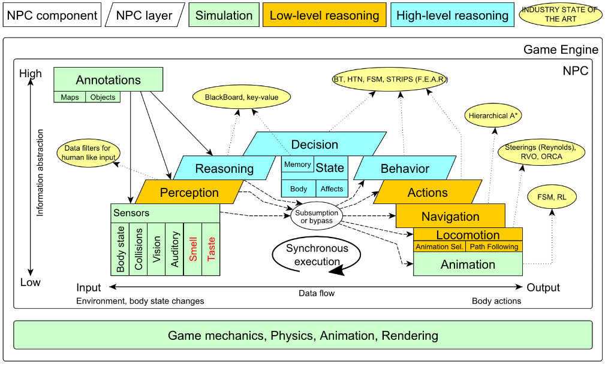
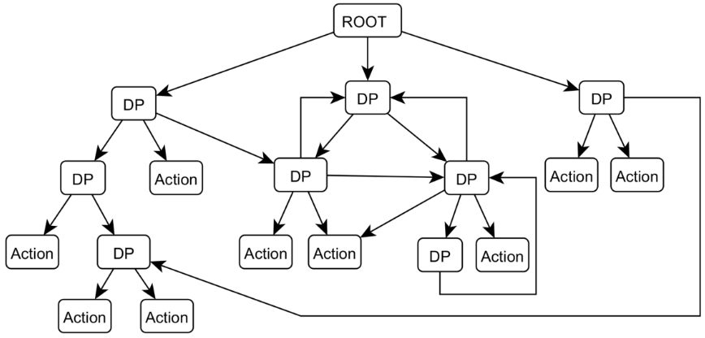
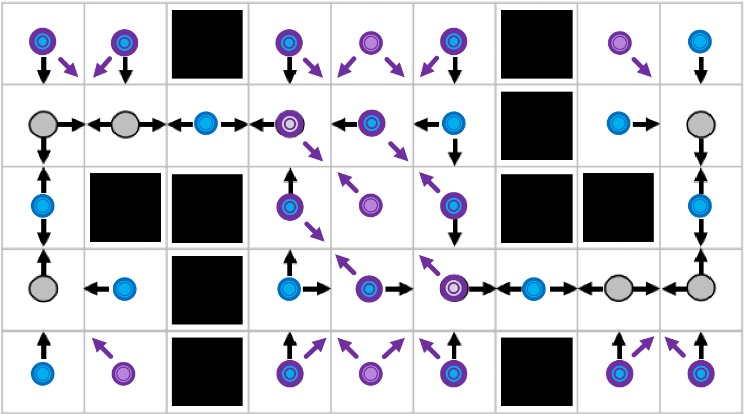
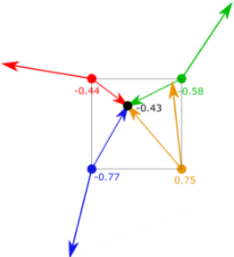

# Umělá inteligence pro počítačové hry

[toc]

## 1. Architektura autonomního agenta

**Agent** je (počítačový) systém schopný *pracovat samostatně* pro svého uživatele.

**Objekt** vs. **agent** - Objekt to dělá *zdarma*, agent, pro peníze nebo protože *chce*. Na agentovi přímo nevoláme *metodu*, ale posíláme *požadavek*, aby něco udělal - vnitřní mechanismus agenta se rozhodne, jestli to udělá a případně kdy a jak. Agentům dáváme *high-level cíle* a měli by být dostatečně inteligentní, aby to provedli.

<u>**Architektura agenta**</u> - Architektura softwarového systému, který je zabudovaný v prostředí a který slouží k výběru akce (umožňuje proces rozhodování). *Konkrétní příklady*:

- **Table-driven** - Má *tabulku indexovanou posloupností vjemů*. Aktuální vjem přidá do posloupnosti a z tabulky *vyčte akci*.
- **Simple-reflex** - Vjem interpretuje na *stav*, dle stavu pak zvolí *pravidlo* (z množiny pravidel) a z pravidla získá další akci.
- **Model-based reflex** - Má *přechodový model*, jak se svět vyvíjí na základě aktuálního stavu a akce, a *senzorický model*, jaký je stav světa na základě vjemu. Nejprve updatuje stav, tím získá aktuální, pak dle něj zvolí pravidlo a z něj akci.
- **Simple problem-solving** - Z vjemu updatuje stav, pak *formuluje cíl* a problém, *prohledáním* získá sekvenci akcí a provede první z nich.
- **Knowledge-based** - Má vnitřní *reprezentaci stavů světa* a také *odvozovací procedury*, dokáže odvodit nové informace a ty použít pro rozhodování o výběru akce. Pro reprezentaci se používá *báze znalostí* v logice (např. výrokové/predikátové).

<u>**(Inteligentní) agent**</u> - Agent je vždy součástí nějakého **prostředí**, je schopný **vnímat** prostředí (pomocí senzorů), provádět v něm **akce** (pomocí akčních prvků prostředí ovlivňuje) a má nějaké **cíle**, které jsou delegované (někdo požádá agenta, aby něco udělal).

<u>**Software agent**</u> - Akademická definice zní, že se jedná o ztělesněnou (embodied) inteligentní autonomní entitu.

- **Embodied** - Má nějaké tělo (nemusí být fyzické, třeba jen prostor v paměti), které se podrobuje zákonům prostředí.
- **Autonomní** - Agent dostane cíl (od nás nebo jiného agenta), pak se sám rozhodne, jestli problém vyřeší a případně jak. Volí si jen podcíle, ne hlavní cíl. Jedná sám a nezávisle.
- **Inteligentní** - Inteligentní entita je něco, co je:
  - *Reaktivní* - Agent vnímá/pozoruje prostředí, je schopný v rozumném čase odpovídat na jeho změny odpovídajícími akcemi (inteligentním způsobem).
  - *Proaktivní* - Agent má své vlastní cíle a aktivně se je snaží splnit. Automaticky začne provádět akce v naději, že ho posunou k cíli blíž. Nečeká na události v prostředí, sám je jejich zdrojem.
  - *Sociální* - Agent je schopný komunikovat (vyjednávat, sdílet ontologie, soutěžit/spolupracovat) s ostatními pro dosažení společného cíle.

> Je těžké dosáhnout rovnováhy mezi reaktivitou a proaktivitou (plánování, orientace na cíl).

<u>**Intelligent Virtual Agent**</u> (*IVA*) je konkrétní typ SW agenta, na kterého klademe *další požadavky*. Je **plně a pohyblivě ztělesněný** (avatar, má animace, pohybuje se a interaguje se světem) v rámci **komplexního virtuálního prostředí** a jedná pod **bounded rationality** (má omezené prostředky (čas, paměť), snaží se je maximálně využít, hledá co nejlepší (ale ne optimální) řešení).


- Dostane vstup ze *senzorů*, zpracovává je (*vytváří nová fakta*), updatuje *Memory* (stav, fakta o prostředí), pak zahájí *action-selection*. *Reasoning* je uvažování o světě, odvozuje, produkuje fakta. *Decision-making* komunikuje s Reasoning, produkuje akce na základě znalostí a *Determination* (stav decision-making, cíle, předpřipravené plány).
- Na IVA se také můžeme dívat jako na kus software, který *napodobuje* lidské nebo zvířecí chování v (typicky) virtuálním prostředí a který má *virtuální tělo*. Rozlišujeme přitom dvě větve:
  - **believable branch** - Snažíme se o věrohodnost, *uvěřitelnost*, např. virtuální lidé v *počítačových hrách*.
  - **plausible branch** - Snažíme se o plausibilní/*přijatelné modelování* skutečných entit (např. zvířat), např. *výpočetní modelování* pro podporu/vyvrácení hypotézy.

<u>**Prostředí**</u> je prostor obklopující agenta, *poskytující nějaký vstup*. Agent ho může *ovlivňovat svými akcemi*. Může mít různé **vlastnosti**, které určují *možné techniky* a také *náročnost návrhu agenta* a jeho akcí:

- **Plně pozorovatelné** - Agent může plně pozorovat úplný stav prostředí skrze své senzory. Má o prostředí úplnou informaci.
  **Částečně pozorovatelné**
- **Epizodické** - Epizody na sobě navzájem nezávisí, jsou uzavřené. Např. kámen-nůžky-papír, hra hned končí.
  **Sekvenční** - Výsledek hry závisí na předchozích akcích, posloupnost akcí je nějak provázaná.
- **Statické** - Prostředí se mění pouze agentovými akcemi. Můžeme přemýšlet neomezeně dlouho.
  **Dynamické** - Prostředí se může měnit i jinak než agentovými akcemi. Může se tedy měnit, zatímco přemýšlíme.
  *Semidynamické* - Prostředí se nemění, ale míra výkonu ano (s časem se třeba zhoršuje).
- **Single-agent** - Agent je v prostředí sám.
  **Multi-agent** - Musíme brát v úvahu také akce ostatních agentů. Pak můžeme rozlišit *kompetitivní* a *kooperativní* multiagentní prostředí.
- **Deterministické** - Každá akce má jen právě jeden výsledek. Víme přesně, co se stane, na základě aktuálního stavu a provedené akce.
  **Stochastické** - Akce mohou mít více možných výsledků. Může to být způsobeno částečnou pozorovatelností nebo i dynamikou. Nevíme přesně, co se stane. Např. FPS, spread při střílení, nepřesné.
  *Strategické* - Jen agenti mění prostředí, ale když ho mění protihráč, nevíme předem, do jakého stavu, musíme pak stav nějak odvodit.
- **Diskrétní** - Prostředí má pevný počet stavů. Vnímá se skrz senzory, takže právě senzory ho často dělají diskrétním.
  **Spojité** - Prostředí nemá pevný počet stavů, jedná se o spojitý prostor. Často spojené s robotikou, control theory apod.
- **Známé** - Víme, jak se chová svět i naše akce, jaký je outcome/reward.
  **Neznámé** - Musíme se naučit outcome/payoff akcí, neznáme je.
- **Turn-based** - Agenti se střídají v akcích.
  **Real-time**/Simultánní - Agenti se rozhodují o akcích simultánně.
- **Noiseless** - Ze senzorů dostáváme přesná data bez šumu.
  **Noisy** - Nepřesné senzory, dostáváme trochu chybné informace, ale blízko správným.

**Prostředí** je trojice $Env = (E,e_0,T)$ (množina stavů prostředí, počáteční stav a přechodová funkce).

- Prostředí může být v jednom z *konečného počtu* diskrétních **stavů**, $E = \{e, e', ...\}$​​. Pokud není skutečně diskrétní, můžeme *zdiskretizovat*. Využívají se různé reprezentace:
  - *Atomická* - Každý stav je separátní blackbox. Používá se pro prohledávání a hraní her.
  - *Faktorová* - Stav je rozdělen do pevně dané množiny atributů, každý má pak nějakou hodnotu. Stav je tedy vektor těchto hodnot. Používá se pro CSP, výrokovou logiku, plánování.
  - *Strukturovaná* - Stav se skládá z množiny objektů s atributy a různými vztahy. Používá se pro reprezentaci znalostí v predikátové logice.

- Agent má *konečnou množinu* **akcí** $A = \{a, a', ...\}$ a je schopný tyto akce provádět. **Agent** je funkce $Ag: R_E \rightarrow A$​ mapující běh (končící stavem prostředí) na akci (agent se rozhoduje, kterou akci zvolí, na základě kompletní historie systému a je deterministický).
- **Běh** agenta v prostředí je *konečná posloupnost* střídajících se stavů prostředí a akcí $r = e_0,a_0,e_1,a_1,...,a_{n-1},e_n$, začíná počátečním stavem prostředí. $R$ je sada všech konečných posloupností na $E$ a $A$.
  - $R_A$ je podmnožina $R$ taková, že všechny posloupnosti *končí akcí* agenta.
  - $R_E$​ jsou všechny posloupnosti *končící stavem*.
  - $R(Ag,Env)$ definujeme jako *všechny možné běhy* daného agenta v prostředí (uvažujeme ale jen běhy, které někdy skončí, tj. už nejsou žádné možné stavy).
- **State transformer function** $T: R_A \rightarrow 2^E$​​ modeluje *vliv agenta na prostředí* (mapuje běh končící akcí na množinu stavů prostředí). Předáváme *kompletní historii* (stav záleží na všech předchozích akcích a stavech, v Markovských řetězcích jen na posledním kroku). Prostředí je *nedeterministické* (proto přiřazujeme množinu možných stavů).
- **Interakce s prostředím**: Prostředí je v *počátečním stavu*, agent na něj reaguje a *volí nějakou akci*, prostředí odpoví *přechodem do některého stavu* (nevíme kterého, prostředí může být nedeterministické), na základě nového stavu agent *zvolí novou akci*, atd.

**Příklady agentů**:

- *Termostat* - Snaží se udržovat teplotu na určité úrovni. Má senzory (vjem chladno/OK), přepínač ovládající topení (akce - on/off) a decision unit (pravidlo, které říká, co kdy dělat), je to tedy agent. Nedeterministické, dynamické prostředí - někdo může otevřít okno, čímž do místnosti vnikne chlad (to je akce, kterou agent nedokáže rozpoznat).
- *Software demon* - Kus SW, který je perzistentní v prostředí - např. kontroluje e-mail a pokud nějaký dorazil, změní ikonu na obrazovce. Prostředím je OS, je komplexnější, agent z něj přijímá vjemy (pomocí signálů a spouštění příkazů), má akce (spustit mailového klienta, změnit ikonku), má rozhodovací algoritmus (co kdy dělat).

<u>**Funkce užitku**</u> $u: E \rightarrow \mathbb{R}$ reprezentuje **kvalitu stavu** vzhledem k cíli agenta (říká agentovi, jak je stav dobrý, jak si vede; objektivní míra úspěchu). Chceme tedy dosáhnout stavů s vysokou utility hodnotou. Říkáme agentovi, co má dělat, ale ne jak (aby neměl vše zadrátované).

- **Užitek běhu** $u: R \rightarrow \mathbb{R}$ říká, jaký byl výkon agenta v konkrétním běhu. Agregujeme užitky stavů běhu - např. *zprůměrování* (agent, kterému se daří dlouhodobě), *minimum* přes stavy v běhu (vždy nad nějakou hranicí), *maximum* (hledá jeden nejlepší stav).
- **Optimální agent** maximalizuje *očekávaný užitek* (tj. střední hodnotu užitku běhu), $Ag_{opt}= \text{argmax}_{Ag \in A} \sum_{r \in R(Ag,Env)} u(r) \cdot P(r|Ag,Env)$​. To nám ale neříká, jak takového optimálního agenta navrhnout a implementovat.

<u>**Intentional stance**</u> - Jak se snažíme rozumět chování systému, když k němu *nemáme dostatek informací* (nemáme schopnost rozumět vnitřním pochodům, nemáme k dispozici physical/design popis, nebo není praktický). Vytvoříme si metafory (tzv. useful illusions). Pak dokážeme predikovat chování. Může se jednat o abstrakci problému. Přiřazujeme vlastnosti jako beliefs, desires a intentions (na tom je založen formální matematický model BDI) neživým věcem.

----

V rámci virtuálního prostředí máme obecně architekturu aplikace složenou ze 3 vrstev:

- *GUI* - Komponenta zodpovědná za zobrazení GUI.
- *Environment* - Komponenta zodpovědná za modelování virtuálního prostředí, udržuje simulaci v běhu. Uvnitř je třeba nějaká reprezentace prostředí (mapa, v ní objekty).
- *Aritificial mind* - Komponenta s kódem řídícím virtuálního agenta (každý agent má svou vlastní).

<u>**Cognitive architecture**</u> pak popisuje bloky, které jsou uvnitř *Artificial mind* komponenty. V nejjednodušším případě je tam *sensor-reaction loop* (senzory, reflexy, efektory). Může to ale být i složitější (přidáme aktuální situaci a uvažování), případně lze přidat i mnoho dalších podmodulů (dlouhodobá paměť, emoce, jazyk):

- *Sensors* - Sbírají informace z prostředí (vidí ID objektů v něm), ty jsou vstupem agenta.
- *Reflexes* - Reprezentují možná chování, ad-hoc rozhodování, co dělat, na základě vjemu ze senzorů.
- *Effectors* - Posílají příkazy zpět do prostředí, co dělat s virtuálním tělem (např. jeden krok vpřed). Výstup agenta, mění stav okolního prostředí.
- *Current situation* - Reprezentuje aktuální situaci (co o ní víme).
- *Reasoning* - K reflexům se navíc může provádět nějaké uvažování.
- *Long-term memory* - Např. v FPS si agent zapamatuje, kde je ammo.


<u>**NPC mind**</u> - Na následujícím obrázku je zakreslena low-level architektura mysli NPC/IVA:



- Dole je prostředí (simulátor ho spouští).
- Vlevo máme vstupy z enginu a prostředí, ty se překládají na výstupy (akce).
- *Sensors* (přečteme novou informaci, co se změnilo od minulého framu), *Perception* (přeložíme low-level info na vyšší úroveň, zkombinujeme), *Reasoning* (přemýšlíme o věcech, uvažujeme), *Decision* (se všemi informacemi děláme rozhodnutí, jaké jsou cíle, podcíle, jaké akce musíme provést), *Behavior* (máme nějaká chování, reusujeme), *Actions* (chování rozděleno do akcí; rozdělí se na menší části (navigace, animace, interakce s objekty)). Vše se opakuje v cyklu.
- *Annotations* - statické informace o prostředí (garantováno, že se nemění), např. geometrie prostředí.
- **Reasoning** zahrnuje bloky *Perception* + *Reasoning* + *Annotations* + *Memory/State/Body/Effects*.
  - *Perception* rychlý (jeden výraz), *Reasoning* (pomalejší, prohledávání, raycasty).

- **Decision-making** pak zahrnuje bloky *Decision* + *Memory/State/Body/Effects* + *Behavior* + *Actions* + *Navigation*.
  - Jaké *cíle* následovat, jaká *chování* vyvolat, jaké *akce* provádět, jak se *navigovat* k lokaci.

- **Action-selection** tvoří bloky *Reasoning* + *Decision* + *Behavior*.

----

<u>**Výpočetní model**</u>, pokud máme real-time prostředí a snažíme se v něm ovládat agenta:

- **Stav prostředí** $E$ - množina všech faktů, které v prostředí platí.
- **Perception** $P$ - funkce $p: E \rightarrow P$ nám posílá podmnožinu stavu prostředí jako fakta, která právě vnímáme o světě.
- **Memory/State** $S$ - agent má svůj vnitřní stav, paměť.
- **Action** $A$ - agent provádí action selection $f: P \times S \rightarrow A \times S$ (na základě vjemu z prostředí a svého stavu vydá na výstup akci a změní svůj stav).
- **Action execution** - $s: A^n \times E \rightarrow E$ simulátor posbírá akce od všech agentů a na základě nich a stavu prostředí vytvoří nový stav/frame (simuluje akce v prostředí).

### Percepce

$Per$ je množina všech vjemů agenta. Obvykle definujeme, že prostředí poskytuje stavy skrz funkci $see: E \rightarrow Per$.

### Mechanismus výběru akcí

**Action selection** řeší problém, co by měl agent dělat v daném okamžiku na základě informace z prostředí (senzory, aktuální vnitřní stav). Agent zvolí jednu z předdefinovaných atomických akcí a provede ji.

- Je to funkce $f: P \times S \rightarrow A \times S$, kde $P$ je množina vjemů, $S$ je množina vnitřních stavů paměti, $A$ je množina možných akcí.

**Action-selection context** je $c \in P \times S$​, agent dostává nějaký vjem a má nějaký stav. V tomto kontextu pak provádíme action-selection pro získání akce a nového stavu.

**Action-selection mechanism** (ASM) je program, který rozeznává nějaký jazyk, ve kterém kódujeme reaktivní plány (více v kapitole [2. Metody pro řízení agentů](#2. Metody pro řízení agentů)), které jsou použity pro implementaci action-selection funkce. ASM a data (reaktivní plány), dohromady tvoří action-selection funkci.

Typické problémy v počítačových hrách:

- Máme jen lokální informace, nevidíme celé prostředí najednou.
- Svět se může měnit nezávisle na agentovi (hráč/uživatel, další virtuální agenti).
- Jsou potřeba rychlá rozhodnutí (real-time aplikace).

----

**Deliberation** - Proces, jak si agent volí akce. Agent má teoreticky nějakou sadu možných akcí, které může provést (ale ne vždy všechny, některé nemusí dávat smysl), měl by si vybrat tu *správnou*, tu nejlepší pro splnění cíle (plánování, reaktivní přístup, ...).

### Paměť

<u>**Pure reactive agent**</u> nezohledňuje kompletní historii prostředí, reaguje jen na *současný stav* prostředí, tedy $Ag: E \rightarrow A$, nic si nepamatuje.

- Pro každého čistě reaktivního agenta existuje funkčně ekvivalentní standardní agent (pamatuje si celou posloupnost stavů prostředí a akcí), naopak to neplatí.
  - Dva agenti $Ag_1$ a $Ag_2$ jsou **funkčně ekvivalentní** vzhledem k nějakému prostředí $Env$ právě tehdy, když mají shodné množiny běhů v daném prostředí, tedy $R(Ag_1,Env) = R(Ag_2,Env)$ (pracují v prostředí stejně).
- Můžeme mít i *komplexní agenty*, kteří jsou jen reaktivní - mohou mít neuronovou síť jako kontrolní mechanismus a pokud je feed-forward, ne recurrent, je to čistě reaktivní agent (žádná paměť, jen reakce na současný stav prostředí).

<u>**Agent with a state**</u> má nějakou *paměť* (jako stav automatu), pak máme nějaký mechanismus, jak si zapamatovat něco o vnitřním stavu (konečný počet stavů, v jednom z nich jsme, pomáhá agentovi v rozhodování o akci). $I$ je množina všech vnitřních stavů agenta, $Per$ je množina všech vjemů agenta. Obvykle definujeme, že prostředí poskytuje stavy skrz funkci $see: E \rightarrow Per$ a my poskytujeme akci funkcí $action: I \rightarrow A$. Agent pak má stav a funkci $next: I \times Per \rightarrow I$, která získává informaci o stavu prostředí a stavu agenta, zpět posílá následující stav (ten ovlivňuje následující akci). Pořadí zpracování je tedy *see-next-action*.

- **Volba akce**: Prostředí posílá svůj stav, funkce *see* generuje nějaký vjem na základě stavu prostředí (může být nějaký preprocessing stavu prostředí), funkce *next* vezme stav agenta a vstup z prostředí, produkuje následující stav agenta, pak máme mechanismus volby akce, funkce *action* bere nový stav a produkuje akci, tu agent provede a tím ovlivní prostředí.
- 
- Každý agent se stavem může být převeden na funkčně ekvivalentního standardního agenta (pamatuje si celou posloupnost stavů a akcí).
- Stavem může být klidně celá *databáze znalostí*.

Bez paměti může nastávat tzv. <u>**Perceptual Aliasing Problem**</u>, kdy máme v různých situacích ten samý vjem a nedokážeme tedy rozpoznat, ve které situaci se nacházíme. Více rozepsáno na konci části [If-then pravidla](#If-then pravidla).

### Psychologické inspirace

Zajímá nás myšlenkový proces člověka. **Kognitivní modelování** je o tom, že chceme dosáhnout inteligence *simulováním lidského myšlení*. Nejprve mu však musíme porozumět, což je samo o sobě těžký problém:

- **Psychologie** - Přístup *shora-dolů*. Pozorujeme z vnějšku, pokládáme otázky, pozorujeme odpovědi, používané kroky, a snažíme se nějak rekonstruovat myšlenkový proces, kroky pak naprogramujeme do počítače.
- **Neurověda** - Přístup *zdola-nahoru*. Různými technikami nahlížíme do mozku, jak probíhají signály. Modelujeme mozek, kopírujeme neurony a doufáme, že ze spojení velkého množství jednoduchých jednotek vzejde inteligence.

**Zpětnovazební učení** je např. inspirováno psychologií, konkrétně behaviorismem. I my lidé dostáváme neustále z okolí zpětnou vazbu. Můžeme si ji uvědomit, což pak může ovlivnit naše chování v budoucnu.

Podobně mozky zvířat interpretují signály jako bolest nebo hlad jako negativní zpětnou vazbu a naopak uspokojení nebo najezení se jako pozitivní zpětnou vazbu. V určitých případech se tak dokáží zvířata naučit dělat ta chování, která optimalizují jejich odměnu.

----

<u>**Emoce**</u> jsou **ohodnocující úsudky** o světě, ostatních lidech, nás samotných, v souvislosti s agentovými cíli a domněnkami. **Motivují a navádí** (udržují nás při životě, motivují nás chovat se určitým způsobem). Mají také **adaptivní funkci** (úzkost pomáhá zvýšit soustředění na konkrétní činnost, radost pomáhá objevovat nové věci a lidi, apod.). To, co vidíme a vnímáme, také může ovlivnit naše emoce.

**Role emocí**:

- *Vnější*: Sociální koordinace a rychlejší komunikace záměru. Pomocí výrazů v obličeji, mluvy, gest, držení těla.
- *Vnitřní*: Motivace, homeostáze, adaptivní chování. Pomocí generování emocí (posuzování), efektů emocí (bias), řízení cílů.

Emoce zvyšují *adaptivní schopnosti* organismů. Filtrují, co je důležité a co ne (např. se musíme rozhodnout rychle, jestli zaútočit, nebo utéct).

Emoce jsou zásadní součástí lidské a zvířecí inteligence. Pomáhají nám *doplnit chybějící informace*, děláme intuitivní rozhodnutí na základě pocitů. Pomáhají nám jednat "racionálně".

Jak ale simulovat emoce v AI? A kdy bychom vůbec emoce měli přidat? Potřebují je roboti? Co vůbec vyjadřování emocí znamená pro počítač?

**Emoce a počítače**: Emoce mohou *zvyšovat uvěřitelnost* virtuálních agentů. Tím se zlepšuje zážitek. Např. virtuální asistenti, chatboti. Také můžeme přidat schopnost analyzovat lidské emoce. Pak se můžeme podle nich přizpůsobovat (*analýza sentimentu*).

**Emoční model ALMA** (A Layered Model of Affect) je založen na teorii **OCC** (Ortony, Clore, Collins), rozšiřuje ji. Tato teorie definuje *sadu proměnných*, které můžeme použít k vyhodnocení událostí v prostředí. Definuje, jak zpracovat proměnné a získat výsledné emoce. Nedefinuje však, jak přesně vyhodnotit události (ukazuje jen obecné myšlenky) a ani to, jak výsledné emoce použít. Pak definuje:

- *Emoce* jako reakce vázané na: události, agenty ("živé" entity) a objekty. (Emoce jsou vždy něčemu přisuzované.)
- *Emoční proměnné*, které se používají pro výpočet výsledných emocí.
- *Koncepty*, které nám pomáhají nastavit proměnné.

| Emoce jako reakce na... | Emoční proměnná  | Koncept           | Příklad           |
| ----------------------- | ---------------- | ----------------- | ----------------- |
| Události                | Desirability     | Cíle              | Chci jít do kina. |
| Agenty a jejich akce    | Praiseworthiness | Standardy         | Nesnáším kouření. |
| Objekty                 | Appealingness    | Osobní preference | Mám rád kávu.     |

<u>**Emoce v praxi**</u>:

- **Počítačové hry**:
  - *Skutečná simulace* - Např. The Sims 4.
  - *Mockup* - Obvyklejší, jen to vypadá, jako by tam byly emoce, ale nesimulujeme je.
- **Detekce emocí**:
  - *Analýza sentimentu* v textu - Dnes obvykle modely strojového učení.
  - *Výrazy obličeje* z obrázků/videa - Problematické, velké variace (kulturní rozdíly, kontext situace), extrémní výrazy jsou vzácné.

----

**Practical reasoning** je inspirován lidskými procesy. Spadá sem také **BDI architektura** (založená na *intentional stance*, kdy přiřazujeme vlastnosti jako beliefs, desires a intentions neživým věcem), která je více popsána v části [Symbolické a konekcionistické reaktivní plánování](#Symbolické a konekcionistické reaktivní plánování).

## 2. Metody pro řízení agentů

Pro AI hráče máme v podstatě stejnou abstrakci jako pro skutečného hráče (player loop, game loop, navzájem si vyměňují informace), liší se jen interface (nepotřebujeme controller, jen 0 a 1).

- AI poslouchá, posuzuje stav hry, dělá rozhodnutí stejně jako člověk, nějak instruuje hru, že v ní chce něco dělat, AI může číst informace přímo ze subsystémů hry.

<u>**Simple reflex agent**</u> - Nesnaží se předvídat, co se stane v budoucnu, akce a rozhodování jsou *založené jen na aktuálním vjemu/stavu*. Agent vidí svět, má nějaká *pravidla* (mohou mít různé implementace), na základě nich nějak zvolí akci, kterou provede jako další. Může mít někdy paměť, která mu pomáhá, ale ne tak, že by si pamatoval celou historii prostředí a učil se, jak se vyvíjí (ukládá si třeba jen kousek svého stavu, třeba co se právě snaží získat).

- *Sensors* - rutiny, které dostávají data z prostředí (jak svět vypadá).
- *Condition-action rules* - podle stavu světa se na základě pravidla vybere další akce.
- *Actuators* - akce, vyvolávání akcí (symbolické a nebo přímé vyvolání metod).

<u>**Goal-driven agent**</u> (*model-based*) - Snaží se *předvídat*, jak bude svět vypadat po provedení určité akce (ví, jak se *svět vyvíjí*, jak ho *akce ovlivní*; dokáže zodpovědět otázku, co se stane, pokud provede konkrétní akci). *Simuluje* ostatní agenty v prostředí (odhaduje, co budou dělat, pak se podívá, co se takovou akcí stane). Sleduje nějaký *cíl* (může přemýšlet, dělat look-ahead, hledat *sekvenci akcí*, kterou dokáže dosáhnout cíle).

- Pomocí *senzorů* vnímá prostředí (uloží si to do paměti jako aktuální stav), pak s využitím znalosti, jak se svět vyvíjí a co dělají jeho akce zjistí, *jak by vypadal stav po provedení určité akce*, pak podle cíle vybírá *akci*, kterou by měl udělat, a pomocí *actuators* ji provede.

<u>**Abstraktní architektury**</u> pro návrh agenta - *reaktivní vs plánování*.

- *Hybridní* je nejúspěšnější.

### Symbolické a konekcionistické reaktivní plánování

<u>**Reaktivní plánování**</u> je kolekce technik pro volbu akce. Odpovídá to *Simple reflex agent*. Místo klasického plánování (výpočtu dlouhého plánu předem) se v každém okamžiku najde jen právě jedna následující akce na základě *aktuálního kontextu* (co agent právě vidí a co si pamatuje). Využívají se přitom **předdefinované reaktivní plány** (reprezentace možných chování; např. if-then pravidla, konečný stavový automat, strom chování, free-flow architektura, ...), neprovádí se *žádné prohledávání*.

- Tyto techniky však řeší *pouze decision-making*, vůbec ne reasoning.

----

Klasický inteligentní systém v AI - **Symbolická reprezentace** prostředí a chování (např. *logickými formulemi*), **syntaktická manipulace** s takovou reprezentací (logická dedukce (striktní sémantická manipulace symbolů podle *axiomů* a *odvozovacích pravidel*), odvozování, *dokazování* vět). Hraní her, plánování založené na dokazování vět.

- **Dedukce** - Odvození nutně pravdivých závěrů za předpokladu, že předpoklady platí. Používá se obecná znalost a pravidla k odvození něčeho specifického, co platí. Např. sylogismy.
- **Indukce** - Jsou-li splněny předpoklady, pak závěr spíše platí, než neplatí. Snažíme se ze specifického případu indukovat něco obecného. Nemusí to být 100% jisté, předpoklady také ne.

----

<u>**Deductive reasoning agent**</u> - Jedna z nejjednodušších architektur, má solidní *matematický základ* (symbolická *reprezentace světa založená na logice*). Jako mechanismus *volby akce* použijeme schopnost *dokazování vět* dedukcí (přemýšlí nad vstupem z prostředí). Agent je ve skutečnosti *theorem prover* (deliberative agent).

$L$ je množina formulí logiky prvního řádu jako reprezentace *znalostí o světě*. $D = 2^L$ je množina všech možných množin formulí (*možné databáze*). Jedná se o *agenta se stavem*, přičemž vnitřním stavem je $DB \in D$ (konkrétní **databáze znalostí** o světě - seznam faktů, formulí). Znalost agenta není kompletní - agent neví vše, databáze je *nekompletní*.

*Deliberation* se provádí prostřednictvím **odvozovacích pravidel** $P$ (production rules; dedukce, derivation rules). $DB \vdash_P f$ znamená, že formule $f$ lze odvodit dedukcí z databáze $DB$ pomocí pravidel $P$​​​.

- Vezme vstup prostředí, chvíli nad tím přemýšlí a pak vrátí akci.

**Funkce agenta**:

- `see`: $E \rightarrow Per$ - Ze stavu prostředí do vjemů (preprocessing stavů prostředí do konstant/hodnot matematické logiky).
- `next`: $D \times Per \rightarrow D$ - Jde z databáze a vjemu, produkuje nový vnitřní stav.
- `action`: $D \rightarrow A$ podle pravidel $P$​ - Vezme databázi (vnitřní stav) a produkuje akci (výběr akce jako dokazování).
  - `for each` $a \in A$ `do`
    	`if` $DB \vdash_P Do(a)$ `then return` $a$          // Dokazatelná akce (lze odvodit)
    `for each` $a \in A$ `do`
    	`if` $DB\,\, !\vdash_P \neg Do(a)$ `then return` $a$    // Konzistentní akce (není v kontradikci)
  - Konečná množina akcí, pro každou predikát $Do(a)$ (spojuje efekt akce na vnější svět s vnitřním efektem na databázi akcí) jako fakt v logice. Máme dokazovač vět jako dedukční mechanismus, zkoušíme pro každou akci, jestli můžeme odvodit $Do(a)$​, případně chceme alespoň konzistentní akci (není v kontradikci s bází znalostí).
  - Funguje ve dvou krocích, protože *databáze je nekompletní* (agent nemá kompletní znalosti).

**Výhody**: Když se něco odvodí, je to 100% pravdivé. Jasná sémantika, které rozumíme.

**Nevýhody**: *Nepraktické* pro skutečný svět. *Náročné* k implementaci (funkce `see` se špatně sestavuje). Dokazování je *časově náročné* (rychle se měnící prostředí se mohlo mezitím změnit).

Některé elementy tohoto přístupu byly použity v jiných architekturách (např. *practical reasoning*, tam vystupují beliefs, desires, intentions).

----

<u>**Theoretical reasoning**</u> vede jen k tomu, co si myslíme o světě. *Matematický svět*, matematické uvažování, může ovlivnit, co si myslíme o světě, je to jen v hlavě, abstrakce světa. Např. **deductive reasoning agent**.

<u>**Practical reasoning**</u> vede k akcím. Zohledňuje to, jak *lidé ve skutečnosti přemýšlejí a rozhodují se*. Přesouváme se od striktního plánování (dokazování) víc **směrem k reaktivitě** (snaha o polidštění plánovacích a rozhodovacích schopností AI, více reaktivní verze deductive reasoning agenta). Např. **BDI**.

- Nejprve je fáze **deliberation**, kdy se rozhodujeme, čeho chceme dosáhnout, *identifikujeme cíle*.
- Pak následuje **mean-ends reasoning**, kdy už známe cíl (výstup deliberation) a *plánujeme*, jak ho dosáhnout.

----

<u>**BDI model**</u> (*Beliefs-Desires-Intentions*) je **practical reasoning** agent (přesouváme se od rigid planning směrem víc k *reaktivitě*). Skládá se ze 3 částí:

- **Beliefs** $B$ (*znalosti agenta, vnitřní stav*) - Reprezentují jen *omezenou znalost* z pohledu agenta, subjektivní, *nemusí být nutně pravdivé*, mohou se v budoucnu změnit. Pomocí $Bel$ značíme všechny možné. Mohou obsahovat *odvozovací pravidla* umožňující forward chaining.
- **Desires** $D$ (*možné cíle, motivace*, může jich být více) - Čeho chceme dosáhnout, jak by měl vypadat cílový stav. Jeden volíme jako skutečný cíl. Jsou *dynamické*, závisí na $B$ (vnitřní stav) a $I$. *Nechceme je měnit příliš často*. Pomocí $Des$ značíme všechny možné.
- **Intentions** $I$​​ (*cíl zvolený z desires*, vede na akce) - Stav světa, kterého *chceme dosáhnout*. Volbou intention *vytvoříme plán* (pomocí *mean-ends reasoning*), jak ho dosáhnout. Zůstává v mysli, dokud ho nedosáhneme, nebo začneme věřit, že ho nelze dosáhnout (*přehodnotíme* a zvolíme jiný), nebo už pro něj zmizí důvody, nebo jsme třeba blíže k jinému. *Změna cíle je drahá* (musíme vytvořit nový plán). Ovlivňují, čemu bude agent věřit v budoucnu, tedy knowledge base. Pomocí $Int$ značíme všechny možné.


Prostředí posílá vstup skrz senzory, nakonec bychom měli *vrátit akci* funkcí `action`, ale výběr je přímo *ovlivněn intentions*.

**Deliberation** (*volba cíle*) probíhá v několika fázích. Nejprve zvolíme *desires*, pak *přefiltrujeme* na *options* a jednu zvolíme jako *intention*, který zkusíme naplnit (pomocí plánování). Občas musíme přehodnotit, zda se stále držet plánu, nebo ne (můžeme zvolit nový intention nebo nové desires).

- **BRF** (Belief Refresh Function) ($BRF: 2^{Bel} \times Per \rightarrow 2^{Bel}$) - *Aktualizuje beliefs* na základě vstupu z prostředí (vjemu) a aktuálních beliefs.
- **Options** ($options: 2^{Bel} \times 2^{Int} \rightarrow 2^{Des}$) - Funkce, která bere beliefs (naši informaci o stavu světa) a na základě nich *vygeneruje nové desires*. Navíc však *zohledňuje také aktuální cíl* (to, co aktuálně děláme, by mělo ovlivnit budoucí plány, i když jsou to jen možnosti).
- **Filter** ($filter: 2^{Bel} \times 2^{Des} \times 2^{Int} \rightarrow 2^{Int}$​) - Převedeme desires na *intentions* na základě aktuálních beliefs (stav světa), desires i intentions (co děláme).

Pak z intentions produkujeme akci do prostředí pomocí funkce $action: I \rightarrow A$. Ve skutečnosti je to ale komplikovanější, protože chceme plán akcí (posloupnost).

**Means-end reasoning** (*planning*) je proces rozhodování, *jak dosáhnout cíle* na základě dostupných prostředků (akcí). Jako vstup máme cíl (intention), aktuální stav prostředí (beliefs) a víme, jaké akce má agent k dispozici. Jako výstup chceme *vytvořit plán* (posloupnost akcí), po jehož vykonání bude *cíl splněn*.

Algoritmus **STRIPS** byl první úspěšná formulace plánů a *plánování*. Jedná se o striktně *logický přístup* (matematická logika prvního řádu). Máme *model světa* (beliefs; množina logických formulí) a pro každou akci popis pomocí 2 částí: *preconditions* (množina, podmínky, za kterých můžeme aplikovat akci) a *effects* (jak popsat, co akce dělá), které jsou 2 druhů, *add* (akce přidává nějaká fakta do beliefs) a *delete* (akce odebírá nějaká fakta z beliefs).

- *Plánovací algoritmus*: Máme popis aktuálního stavu pomocí aktuálních $B$, stejně tak máme popis cílového stavu jako jeho aktuálních $B$. Při vytváření plánu musíme vytvořit takovou posloupnost akcí, kdy akce mohou být za sebou (musí vždy platit preconditions). Na základě aktuálních $B$ určujeme, zda lze akci aplikovat. Díváme se (porovnáme rozdíl $B$ aktuálního a cílového stavu), jestli se po změně způsobené akcí přibližujeme k cíli (rozdíl v $B$​ se zmenší), pokud ne, zkusíme jinou akci.
- Je to hezké, jednoduché, ale *ne moc praktické* (algoritmus často hodně iteruje přes malé detaily).

**Formální definice**:

- **Deskriptor** akce $a$ z množiny akcí $Ac = \{a_1,...,a_n\}$ je trojice $[P_a,D_a,A_a]$, kde každá komponenta je *množina logických formulí* prvního řádu. $P_a$ jsou *preconditions* akce, $D_a$ jsou *delete efekty* po akci $a$, $A_a$ jsou *add efekty* po akci $a$. Pro jednoduchost obsahují množiny jen *groundované atomické formule* (žádné konjunkce, proměnné, ...). Množina $O$​ je pak množina všech deskriptorů všech akcí.
- **Plánovací problém** je trojice $[B_0, O, G]$, kde $B_0$ jsou *počáteční beliefs* agenta, $O$ je *množina deskriptorů* všech akcí ($O = \{[P_a,D_a,A_a]| a \in Ac\}$) a $G$ je množina formulí logiky prvního řádu, které reprezentují *cílový stav*. Hledáme, jak se dostat z $B_0$ do $G$ skrz akce popsané deskriptory v $O$.
- **Plán** $p$ je *posloupnost akcí* $(a_1, ..., a_n)$, $a_i \in Ac$.
  - Plán $p$ pro plánovací problém $[B_0, O, G]$ určuje *posloupnost beliefs* $B_0, B_1,..., B_n$ tak, že $B_i = (B_{i-1} \setminus D_{a_i}) \cup A_{a_i}$, pro $i = 1, ..., n$​ (posloupnosti beliefs po jednotlivých akcích na sebe navazují, následující je původní *bez deletes* a *s adds*).
  - Plán $p$ je **přípustný** (admissible) pro $[B_0,O,G]$ právě tehdy, když $B_{i-1} \models P_{a_i}$, pro každé $i = 1, ..., n$ (z $B_{i-1}$ můžeme vyvodit vyvolání akce, tedy *preconditions* akce $a_i$​ jsou splněny, *nejsou kontradikce* vzhledem k aktuálním beliefs).
  - Plán $p$ je **korektní** pro $[B_0, O, G]$ právě tehdy, když je *přípustný* a $B_n \models G$​​ (*vede nás k cíli*).
- Buď chceme najít *korektní plán*, nebo říct, že *neexistuje*.

Agent má *plánovací funkci* $plan: 2^{Bel} \times 2^{Int} \times 2^{Ac} \rightarrow Plan$​ (převádí intentions na plán, potřebuje k tomu také beliefs a akce), kde $Plan$ je množina všech plánů (na $Ac$). On-line vytváření plánů může být časově náročné - lze implementovat pomocí **knihoven plánů** (máme *předdefinované posloupnosti akcí*, plánování jen hledá v knihovně plán *odpovídající aktuálním beliefs*, jehož efekty odpovídají cíli a aplikuje ho).

**Implementace BDI**: Celý algoritmus pro *deliberation* a *means-end reasoning* (planning) se zahrnutím možnosti pro *reconsidering* a *replanning*.

```pseudocode
B := B0; I := I0; // beliefs a intentions počáteční, desires zatím prázdné
while true do
	v := see(); /*informace z prostředí*/
	B := brf(B,v); D := options(B,I); I := filter(B,D,I); // update všeho
	p = plan(B,I,Ac); // vytvoření plánu pro intentions*/
	while not (empty(p) or succeed(I,B) or impossible(I,B)) do // vykonávání plánu akci po akci
		a := head(p); execute(a); p := tail(p); // odebereme a provedeme 1. akci
		v := see(); B = brf(B,v); // update po vykonání akce
		// oproti čistě plánovacímu agentovi v BDI máme mechanismus pro změnu cílů
		if reconsider(I,B) then D := options(B,I); I:= filter(BDI); // přehodnocení možností
		if not sound(p,I,B) then p = plan(B,I,Ac); // přeplánování
```

- `reconsider(I,B)` se podívá, jestli je pořád v pořádku provádět plán (*mohla se změnit situace*)
- `sound(p,I,B)` říká, zda je plán korektní pro dané intentions a beliefs (*mohl se změnit cíl nebo okolní svět*)

Oproti klasickému plánování přidáváme reconsider a replan proto, abychom zdůraznili, že je v prostředí **více agentů**, nebo se **prostředí může měnit**. Změkčuje se tím plánování na základě situace.

Je to jen *obecné schéma*, klidně můžeme mít velmi reaktivní typ BDI agenta (aktuální intentions pak nemají na vše takový vliv, reagujeme jen na aktuální situaci).

**AgentSpeak** - Objektově orientovaný programovací jazyk (podobný Prologu), založený na logickém programování a BDI architektuře pro (kognitivní) autonomní agenty. **Jason** je jeho interpret.

----

<u>**Procedural reasoning system**</u> (PRS, BDI v praxi) je první *praktická implementace BDI* architektury, používá se i v praxi. Kromě beliefs, desires a intentions má oproti obecnému BDI navíc také **interpreter** (podobný algoritmus jako obecné BDI, updatuje beliefs, vytváří desires, filtruje intentions) a **plánovací komponentu** (předvytvořená *knihovna malých plánů*, domain-specific, obvykle vyrobené lidmi), kterou interpreter používá k dosažení intention. Do agenta opět vstupuje informace ze senzorů a ven vystupuje akce.


**Plány** - Agent má *knihovnu předpřipravených plánů*, které jsou popsány 3 částmi: *goal* (finální stav, který platí po provedení plánu), *body* (posloupnost akcí) a *context* (podmínky, které musí být splněny, aby mohl plán běžet). Interpreter volí plány podle cíle, kterého chce agent dosáhnout, a kontextu daného $B$, $D$ a $I$​​. Tělo plánu *nemusí být jen lineární* posloupnost akcí, může mít složitější formu, např. obsahovat cíle - třeba se pokusit udržet nějaký stav, dokud není nějaká podmínka splněna (keep achieving f until g) nebo dosažení konkrétního stavu (achieve f, achieve f or g). Dává nám to poměrně obecný způsob, jak něco vysvětlit.

**Plánování** - Máme počáteční beliefs (atomy logiky prvního řádu) a první cíl. Interpreter má interně **zásobník intentions** (na začátku je tam první cíl), může obsahovat více cílů, na kterých pracujeme. Bere cíl z vršku a pak v knihovně plánů tento cíl vyhledává. Můžeme mít více plánů, které mají daný cíl mezi svými cíli, ale díváme se také na *kontext*. Musí být konzistentní se situací $B$, $D$, $I$​, takové plány jsou pak *options/desires*. Pak to může vést na vložení nového cíle na zásobník jako podcíl pro vyřešení situace.

- Spustíme algoritmus, který v cyklu bere cíl z vršku zásobníku, prohledává knihovnu, kontroluje kontexty, spouští plány, což může vést na vložení více cílů na zásobník.

**Deliberation** - Deliberation je *volba intention* z desires (funkce filter). Na základě aktuální situace se rozhodujeme, co dělat, jak zvolíme intention vedoucí k cíli.

- V původní verzi PRS byly *meta-plány* (plány o plánech, popisují, jak modifikovat intentions, snaha operovat na sémantické úrovni, ale moc komplexní, napsání dobrých meta-plánů je těžké).
- Nakonec se používá **užitek** (utility), snažíme se vždy spočítat *očekávaný užitek každého plánu* (na základě cíle) a pak ho *maximalizovat*, vybereme tedy plán s největším očekávaným užitkem. Zvolený plán je proveden, to může vést na přidání dalších intentions na zásobník. Pokud plán selže, agent zvolí jiný intention z options a pokračuje.

----

Přesouváme se ještě více *směrem k reaktivitě* (symbolické reprezentace a reasoning mají určité limity). Čistě reaktivní je *reactive agent* - Brooks *subsumption architecture*.

U reaktivního přístupu se klade důraz na 3 věci:

- **Interaction** - Inteligentní chování agenta závisí na jeho *interakcích s prostředím*, ve kterém se nachází. I když jsou interakce jednoduché, jsou velmi důležité.
- **Embodiment** (vtělení/ztělesnění) - Inteligentní chování nejsou jen logické operace v mozku, ale důležitá část toho je založena na *agentovi s tělem* (se senzory, aktuátory, to je důležité pro deliberation). Agent není jen abstraktní matematický konstrukt.
- **Emergence** - Inteligentní chování vzniká interakcemi *(mnoha) jednoduchých chování*. Dostáváme komplexnější inteligentní chování od skupiny agentů, jejichž individuální chování je popsáno velmi jednoduše. *Skrz interakce* více jednoduchých agentů společně dosáhneme tzv. *emergence*.

Máme třeba *swarm robotů* v prostředí. Interagují s prostředím, mezi sebou, musí si být vědomi svých možností (to je to tělo) a programování akcí je obvykle velmi jednoduché.

**Reactive agent** je:

- **Behavioral** - Soustředíme se na *chování agenta*, navrhujeme velmi *jednoduchá chování*, kombinujeme je, třeba máme i mechanismus, jak *vyvíjet a adaptovat* chování.
- **Situated** - Agenti jsou *umístěni v prostředí*, jsou *embodied* (není to jen algoritmus, ale nějaký robot s tělem).
- **Reactive** - Agent převážně (nebo jen) *reaguje na prostředí*. Obvykle nemá žádný složitý rozhodovací proces (deliberation), jen reakce. Důležitá je *dobrá rychlá reakce* na prostředí, ne nějaká komplexní deliberation. Později uvidíme, že to nestačí, potřebujeme nějakou deliberation (to se pak děje v hybridních architekturách).

Rozhodovací mechanismus by měl být opravdu jednoduchý, obvykle proto používáme **sub-symbolickou reprezentaci** (doposud symbolická, logické formule, odvozování), snažíme se udělat reprezentaci mnohem jednodušší:

- Velmi jednoduchá *if-then pravidla* (pokud něco cítí, tak reaguje)
- *Connectionism* - spojené s neuronovými sítěmi.
- Konečné *stavové automaty* (jednoduchý mechanismus pro reprezentaci procesu volby akce).

<u>**Subsumption architektura**</u> - Jedna z nejúspěšnějších **reaktivních** architektur, autorem je Rodney Brooks. Inteligentní chování může být generováno *bez symbolické reprezentace* a bez explicitního abstraktního uvažování. Inteligence je *emergent property of certain complex systems* (komplexní neznamená jeden komplexní agent, ale komplexní systém jednoduchých agentů).

- Agentova inteligence je vlastně jen **množina jednoduchých chování**/pravidel. Každé chování je *goal-oriented* (má cíl, kterého se snaží dosáhnout, je za něj zodpovědné), má jednoduchou strukturu (*if-then*, získá vstup ze senzorů, přemění situaci na akci). Mají *condition part* a *action part*.
- *Konečný automat* - žádná složitá symbolická reprezentace, žádný zdůvodňovací mechanismus.
- Každé chování soupeří s ostatními o převzetí kontroly nad agentem. Každé funguje **paralelně** s ostatními. Můžeme mít pořadí pravidel podle *priority*, pak procházíme hierarchii (**subsumption hierarchy** - uspořádání chování).
- Prostředí poskytuje vstup, subsumption mechanismus pracuje v pořadí pravidel a snaží se aplikovat pravidlo na vstup. Pokud je více pravidel aplikovatelných na aktuální situaci, použijeme to *s nejvyšší prioritou*. Pokud není vybráno žádné pravidlo, neprovede se žádná akce.

<u>**Agent network architecture**</u> - **Reaktivní** architektura, která více připomíná *přístup neuronové sítě* (současně *inspirované PRS*). Místo seznamu pravidel s prioritami máme **graf modulů** připojených k akcím. Agent je množina *competence modulů* (něco jako pravidla), každý modul má *akci*, za kterou je zodpovědný, pak *preconditions*, *postconditions* (podle toho propojování) a *activation threshold* (číslo říkající, jak je modul relevantní pro aktuální situaci, funguje jako priorita). Odpovídající preconditions a postconditions tvoří *orientovanou hranu*, pak i další propojení (např. časové uspořádání).

- **Aplikace pravidla**: Máme nějaký vstup, každé pravidlo je porovnáno, na základě kompatibility se současnou situací máme nějakou *aktivační funkci*. Pak *propagujeme* tuto aktivaci a kontrolujeme ji, *pravidlo s nejvyšší aktivací* vyhrává soutěž, tato akce je vyvolána.
- Nebylo moc praktické, nefungovalo dobře (dnes se nepoužívá), *moc komplexní* na jednoduchý rule-based systém.

**Omezení čistě reaktivní architektury**:

- V případě mnoha pravidel *není jednoduché uspořádat priority*.
- Reaktivní agenti nemají *žádný model světa*, vše získávají z prostředí (musí proto někdy měnit prostředí, např. zanechávat cestou drobečky). Kdybychom si vytvářeli nějaké mapy, bylo by to proti principům reaktivních agentů.
- Reaktivita je spojena s *krátkodobým pohledem na svět*, reagujeme jen na *aktuální lokální situaci*, nedá se pracovat s dlouhodobými cíli a globálními podmínkami.
- *Emergence of behaviours* není dobrý přístup k programování.

----

<u>**Connectionist architecture**</u> je architektura, ve které dáme dovnitř agentovy mysli **neuronovou síť**. Může být *zafixovaná* (jen feed-forward), nijak se neučí, pak je to také *forma reaktivního plánování* (dostaneme vstup, propagujeme ho skrz síť, která vrátí akci). Typicky se to však v dnešních hrách nepoužívá.

Mohla by sem patřit také před chvílí zmíněná **Agent Network Architecture**, která připomíná přístup neuronových sítí.

<u>**Tyrrell's free-flow architecture**</u> je jedním z příkladů, kdy je agentovo chování uložené ve formě **hierarchické konekcionistické sítě**. Máme tedy různě *propojené uzly*. Na začátku je **vstupní vrstva** s vjemy (drivy, vnější vjemy), navíc máme uzly reprezentující **paměť** (ve kterém směru je objekt určitého typu). Tyto uzly jsou pak připojené k uzlům reprezentujícím jednotlivá **chování**, která může zvíře provést. Chování jsou ale komplexní, takže jsou ještě rozdělena na **podchování** (jednotlivé kroky, *atomické akce*). Uzly dostanou *aktivaci*, která se *propaguje* skrz vážená spojení a *aktivuje chování*. Čím víc aktivace chování dostane, tím víc je aktivováno. Vypadá to jako feed-forward neuronová síť, ale neučí se, nemůžeme ji natrénovat.

- Navíc se tam modeluje **inhibition** (pokud spustíme jedno chování, *potlačujeme ostatní*, abychom nepřepínali). 
- Priority jsou implementovány ve formě **penalizací** dvou typů: *temporal penalty* (penalizace za to, že se dostaneme k cíli až později) a *uncertainty penalty* (není jisté, zda se do cíle dostaneme).
- **Výhoda**: Dělá *kompromis* mezi chováními (zvolit smět, který je nejlepší pro kombinaci chování).
- **Nevýhoda**: Velmi *špatně se parametrizuje*, musíme ručně zvolit všechny váhy, penalizace, inhibice. Výpočetně *náročné* (musíme pokaždé vyhodnotit celou síť).


Dalším příkladem je hra <u>**Creatures**</u>, ve které byla použita **neuronová síť** (se zhruba tisícem neuronů) pro ovládání tzv. Nornů. Síť je *třívrstvá*. Nejpve je **Perception** vrstva (pro vjemy, drivy), pak **Concept** (pro naučené situace) a nakonec **Decision** vrstva (jeden neuron pro každou akci, má přiřazený skript pro vyvolání). Jednotlivá spojení mají *přiřazené váhy*, které se mohou *natrénovat* **zpětnovazebním učením** (odměny a tresty od hráče nebo nějak automaticky generované). Není tu ale *žádná paměť*, ani mapa prostředí (jako ve Free-flow architektuře).

Posledním příkladem je umělá inteligence ve hře <u>**Black & White**</u>. Jsou tam Desires (co chceme dělat) a Opinions+Beliefs. Pro každé chování máme **perceptron** (nejjednodušší neuronová síť, jen jeden neuron), který má nějaké *vstupy*. Vstupy jsou *aktivované* do určité míry, aktivace se *přenásobí váhami* a vše se sečte, $\sum w_i x_i$, dostaneme **intenzitu**. Pokud je to nad určitý *threshold*, z Desire se stane Intention. Pak se využije **zpětnovazební učení** k úpravě vah, $w_i \leftarrow w_i + \Delta w_i = w_i + (\eta \cdot (intended\_value - actual\_value)\cdot x_i)$ (kde $\eta$ je learning rate; násobíme $x_i$, abychom měnili jen váhy spojené se vstupem, který přispěl k situaci).

**Nevýhody konekcionistické architektury**: Těžko se parametrizují, nemáme moc kontrolu nad výstupem, je to výpočetně pomalé a výsledné chování nebývá moc komplexní (obvykle máme jen skripty pro různá chování, celá inteligence je jen o výběru skriptů).

### Hybridní přístupy

Hybridní architektury jsou přechodem *od čistě reaktivního agenta víc směrem k plánování*. Čistě reakce totiž nestačí, potřebujeme nějakou *deliberation*.

<u>**Hybridní architektura**</u> - Velmi úspěšné architektury, používají *princip Brooksova subsumption*, ale snazším způsobem umožňujícím **modularitu** (aplikují ho na vyšší úrovni abstrakce). Snaží se *kombinovat více komponent* k vytvoření agenta, který bere z obou světů (reaktivní i deliberative) to nejlepší. Máme proto **reaktivní vrstvy** (pro *okamžité akce* bez složitých výpočtů) a **plánovací vrstvy** (pracují na *symbolické* úrovni, vytvářejí reprezentace, *plány*). Uspořádáváme je tak, aby mohly pracovat společně (reaktivní mají typicky přednost před deliberativními).

<u>**Horizontální hybridní architektura**</u> - Vrstvy pracují **paralelně**, jsou *paralelně připojené* k senzorům (vstup jde do každé vrstvy) a efektorům. Poměrně jednoduché. Potřebujeme tzv. **mediator funkci**, která posbírá informace ze všech vrstev a rozhodne, co bude finální akce. Vrstvy mohou být velmi *heterogenní*.

- **Touring Machines** - Konkrétní příklad, *horizontální třívrstvá* architektura. *Modelling layer* modeluje agenta a prostředí, řeší konflikty, deliberation, nastavuje cíle, posílá cíle plánovací vrstvě (vysoká úroveň abstrakce). *Planning layer* dostává cíle z modelling vrstvy, je zodpovědná za vytvoření PRS plánů z předprogramovaných (chová se proaktivně). *Reactive layer* je zodpovědná za okamžitou reakci, rychlou (např. vyhýbání se překážkám).

<u>**Vertikální hybridní architektura**</u> - Vrstvy jsou umístěné *pod sebou*, **sériově** mezi senzory a efektory.

- *Dvě verze propojení*:
  - **One-pass verze** má přirozené uspořádání vrstev, senzory posílají informaci nejnižší, ta zpracuje informaci a pošle nějakou informaci vyšší vrstvě, ..., *poslední vrstva produkuje akci*. Nižší vrstvy jsou obvykle jednodušší (reaktivní, řeší okamžité úkoly), vyšší se soustředí na splnění cíle (jsou pro přemýšlení, deliberation, dlouhodobé cíle).
  - **Two-pass verze** posílá informaci ze senzoru nejnižší vrstvě, pak data plynou směrem nahoru, *z nejvyšší vrstvy ale zpět dolů*, nakonec z nejnižší vrstvy výstup ven. Pouze nejnižší vrstva interaguje s prostředím. *Nahoru jdou vjemy, dolů akce*. Připomíná to způsob, jak fungují firmy (zvenčí k šéfovi, pak zpět a ven).
- **InteRRaP** - *Dvouprůchodová třívrstvá vertikální* architektura. *Cooperative planning* je nejvyšší, stará se o sociální interakce agentů. *Local planning* řeší úkoly každého agenta. *Behavioral* vrstva je nejnižší, reaktivní. Každá vrstva má vlastní knowledge base na různé úrovni abtrakce.
- **Stanley** - *Autonomní vozidlo*, hybridní architektura, *6 vrstev, vertikální*. *Sensor* (nejnižší, GPS, lasery, lidary), *abstract perception* (vytváří abstraktní představu o tom, co se děje, kde je překážka, že je cesta prázdná, ...), *planning and control* (vytváří plán pro auto, kam má jet, a ovládá ho), *vehicle interface*, *user interface*, *global services* (filesystem, komunikace, hodiny). Každá vrstva běžela na jednom notebooku, byly v kufru auta.

----

Máme 2 soupeřící teorie o tom, *co je vědomí a mysl*:

- <u>**Global Workspace Theory**</u> - *Top-down* přístup, vědomí je meta-processing feature, je to algoritmická záležitost. Mechanismus vědomí se spustí, když ho potřebujeme (když potřebujeme přemýšlet o přemýšlení). Není tu vždy, není to spojitá škála, ale je diskrétní. Můžeme si mysl představit jako *multiagentní systém* (např. BDI), procesy mohou tvořit *koalice*, ty pak *soutěží o naši pozornost*. Vědomí je jako *světelný paprsek*, který svítí na *nejaktivnější koalici tasků*, to vybíráme, na to se soustředíme.
- <u>**Integrated Information Theory**</u> - *Bottom-up* přístup, consciousness je *emergent property* of cooperation and operation of *many neurons* in an orchestrated synchronous way (schopnost dělat meta-kognitivní věci, nejen reagovat na to, co vidíme, ale také uvažovat). Něco jako *přístup neuronových sítí* - mnoho jednoduchých neuronů (processing units), pokud jich máme hodně, může z toho *vyvstat vědomí*. Každý systém by pak měl mít nějakou úroveň vědomí, je to jen otázka komplexnosti systému (vědomí je celé spektrum).

<u>**IDA**</u> (*Intelligent distribution agent*) - Pravděpodobně nejkomplikovanější architektura agenta. Inspirovaná **Global Workspace Theory**, konceptem mysli, teorií vědomí. Javovské *kousky kódu*, které běží, mohou *vytvářet koalice*. Pak vrstvy - **perceptual** (stará se o vstup), **conceptual** (zodpovědná za předzpracování jednoduchých vjemů a vytváření konceptů vyšší úrovně, odpovídá kouskům kódu, předprogramované plány), **goal** (dělá *deliberation*, volí intention z desires, spouští koalice ve formě global workspace). *Komplexní implementace*, různé druhy myslí, mechanismus pro *modelování emocí*, *neuronová síť*. Architektura použita v praxi pro přiřazování námořníků v americkém námořnictvu na loď, ponorku, ...

### If-then pravidla

Jako *action-selection mechanismus* můžeme použít jednoduchá **if-then pravidla** (*production rules*). Pak mluvíme o tzv. <u>**simple reactive planning**</u> (SRP).

Pravidla říkají, že pokud platí nějaká **precondition** (něco z *action-selection kontextu*; bool podmínka *rozdělující kontext na dvě části*), pak má agent provést nějakou **akci**.

Pokud je splněných *více preconditions* (více pravidel je tzv. *firing*), pak musíme nějak zvolit, které z odpovídajících pravidel se provede. Máme pro to různé možnosti:

- **Parallel** - Vyhodnotíme úplně všechny preconditions a *provedeme všechna pravidla*, jejichž precondition je splněná. Akce mezi sebou ale mohou zápasit.
- **Prioritized** - Pravidla seřadíme podle nějaké *pevně dané priority*. Pak provedeme pouze první pravidlo, jehož precondition je splněná.
- **Floating priority** - *Spočítáme priority* všech pravidel na základě action-selection kontextu, pak je seřadíme a provedeme pouze první pravidlo, jehož precondition je splněná.

Budeme se soustředit na *prioritizované if-then plány*. Tedy takové, ve kterých jsou reaktivní pravidla seřazená dle priority, pak jdeme shora dolů a spustíme první chování, jehož podmínka platí.

```pseudocode
# When starts: not home && picking
IF see_obstacle				THEN change_direction
IF basket_full && picking	THEN stop_picking
IF see_mush && picking		THEN pick_up_mush
IF midday && picking		THEN stop_picking
IF home						THEN end
IF picking					THEN move_random
IF not_picking				THEN move_home
```

<u>**Simple hierarchical reactive planning**</u> (SHRP) - Jako efekt pravidla nemusíme mít pouze akci, ale třeba nějaké **podchování**, další *vrstvu if-then* pravidel. Máme tedy hierarchii, **několik vrstev** if-then pravidel zanořených do sebe. Každá další úroveň už začíná v nějaké *podčásti kontextu*, jsou tam nějaké *předpoklady*.

- Chování tak *rozdělujeme hierarchicky* na top-level cíle, podcíle, tasky, atomické akce. Můžeme si pak reaktivní plán představit jako množinu stromů, kde každý kořen odpovídá top-level cíli.

Pro vhodné rozdělení chování můžeme využít **etologický pohled**, který rozlišuje *čtyři kategorie chování*:

- **Appetitive** - *Příprava* na to, co budeme dělat.
- **Taxis** - *Přesouvá* nás k místu, kde to můžeme provést.
- **Consumatory** - To hlavní, co chceme, proč jsme tam. *Naplňujeme tím cíl*.
- **Clean** - Závěrečný *úklid*.

Každé chování je pak *konečný stavový automat* jako na obrázku. Přepínáme mezi danými kategoriemi, dokud nedosáhneme cíle. Pak přepneme do Clean behavior. Při vytváření pravidel chování je pak *rozdělíme do kategorií* a nakonec podle nich i *seřadíme*, abychom měli správné pořadí (cíl první, pak Clean, zbytek za sebou).


**Příklad**: Naším cílem je mít zalitou zahradu. *Appetitive* chování je získání konve, naplnění konve. *Taxis* chování je přesun k suchému záhonu. *Consumatory* chování je samotné zalévání záhonu (vede nás to k cíli). *Clean* chování je vyprázdnění konve, položení konve.

```pseudocode
IF garden_watered && cleaned			THEN COMMIT				 | Goal
IF garden_watered 						THEN subGoal_Clean		 | Clean
IF not_hold_can							THEN subGoal_FindTakeCan | Appetitive
IF can_in_hands && empty				THEN subGoal_FillUpCan	 | Appetitive
IF dry_bed_exists && not_next_to_bed	THEN subGoal_GoToDryBed	 | Taxis
IF next_to_bed && bed_is_dry			THEN atomicWatering		 | Consumatory
```

- *Cílová podmínka má vždy nejvyšší prioritu*. Když už jsme dosáhli cíle, chceme Clean. Appetitive je prerekvizita, musíme splnit nejprve. (Appetitive, Taxis, Consumatory lze i v opačném pořadí, ale pak je třeba přizpůsobit podmínky.)
- *Přechody* mezi fázemi z automatu jsou *implicitně zahrnuté*. Navíc lze přejít z Consumatory rovnou do Appetitive.

Takový plán je *odolný vůči počátečnímu stavu prostředí a náhlým změnám*.

Výhoda fixních priorit je také v tom, že pokud jsme u nějakého pravidla dole, neplatí action-selection kontexty výš. To může *zjednodušit podmínky*.

Také mohou pravidla výš **kdykoliv přerušit** cokoliv, co je dole. $N$ prioritizovaných pravidel automaticky modeluje $\frac{N \cdot (N-1)}{2}$​ přerušení/přepnutí (např. pravidlo 6 může být přerušeno libovolným z předchozích). Nemusíme přerušování explicitně psát.

- Může to mít ale *nepředvídané následky*. Např. zatímco řešíme podchování, může spustit preconditions předchozích pravidel s vyššími prioritami a budeme přerušeni.

----

<u>**Perceptual Aliasing Problem**</u> (PAP) nastává, pokud *stavíme action-selection čistě na vjemech* ($f: P \rightarrow A$) a vůbec *nevyužíváme paměť* (nebo ne dobře). Pak nemusíme být schopni *rozlišit různé kontexty*, vypadají stejně. Proto je třeba použít také stav jako součást action-selection kontextu, bez něj nemáme žádnou historii, co se děje, a neudržujeme si, jaký podcíl následujeme.

- V **SHRP** se ale *manipulace se stavem provádí špatně*. Výhoda **FSM či BT** je, že *udržování stavu* je tam *implicitně zabudované*. Automaticky poznamenávají, že děláme nějaké podchování.

----

Reaktivní techniky **lze kombinovat**. Na jedné úrovni můžeme použít třeba floating priority, na další pak SHRP, další podchování může být třeba pomocí FSM.

Všechny architektury reaktivního plánování mohou být přeloženy do if-then pravidel, jsou ekvivalentní v expresivitě.

### Sekvenční konečný automat

<u>**Konečný stavový automat**</u> (*FSM*, *Finite State Machine*) je další z action-selection mechanismů. Oproti SHRP je **udržování stavu** *implicitně zabudované* (aktuální stav je pak zapamatován jako část agentovy paměti $S$).

Pokud v kódu používáme nějaké boolean proměnné (*belief variables*), pak existuje jen *konečný počet kombinací hodnot*, ve kterých mohou být. Chování tedy můžeme *převést na FSM* se stejným počtem stavů, jako je počet možných kombinací hodnot.

Každý **stav** odpovídá právě jednomu *stavu mysli* a je *spojen s akcí/akcemi*, které provádíme, pokud jsme v daném stavu. Musíme ale také specifikovat, kdy dochází k **přechodu** mezi stavy (za jaké *podmínky*).

<u>**Hierarchical FSM**</u> (*hFSM*) může mít uvnitř každého stavu **více podstavů** nebo pravidel, vzniká tak *hierarchie konečných stavových automatů*. Během vykonávání začínáme nahoře, nejprve zhodnotíme, jestli bychom neměli přejít ven z celé vnější fáze, pokud ne, pak spustíme vnitřní sadu pravidel nebo vnitřní FSM.

- Díky tomu můžeme snadno postupovat dle etologického modelu 4 kategorií chování (přecházíme mezi Appetitive, Taxis, Consumatory a Clean).


Díky hFSM si *nemusíme udržovat proměnné*. Ještě však musíme definici rozšířit, abychom získali něco mocnějšího, co dokáže spustit nějaké *predikáty/metody* (zjistit, jestli jsou true/false).

<u>**Sequential FSM**</u> (*sFSM*) může mít mezi stavy **více přechodů**. Když pak sFSM kontroluje, jestli má přepnout z jednoho stavu do druhého, spouští v podstatě *množinu if-then* pravidel (je potřeba pořadí, ve kterém se mají vyhodnotit).

- Má tedy *konečnou množinu stavů* a jeden z nich jako *počáteční*. Každý stav pak má $T$ *uspořádaný seznam přechodů*, které jsou formálně trojice $(c, s, a)$, kde $c$ je podmínka přechodu (bool), $s$ je stav, do kterého se přechází, a $a$ je `OnTransition` aktivita (libovolný skript). Navíc má každý stav $A$​​ *trojici aktivit* (`OnEnter`, `OnInternal`, `OnExit`).

*Action-selection* v sFSM pak vypadá následovně:

```pseudocode
procedure sFSM-ASM(sFSM):
	foreach (Transition t in sFSM.state.T): // z aktuálního stavu
		if (t.c):
			sFSM.state.OnExit.run()
			t.OnTransition.run()
			t.s.OnEnter.run() // můžeme třeba resetovat zanořený sFSM
			sFSM.state = t.s
			return
	sFSM.state.OnInternal().run() // můžeme třeba zanořit sFMS pro hsFSM
```

> Pozor, že `OnTransition`, `OnEnter`, `OnInternal`, a `OnExit` jsou nějaké aktivity, které proběhnou *v jediném framu*. V případě `OnTransition` se tak *nejedná o transition behaviors* (to může probíhat po více framů).

<u>**Hierarchical sequential FSM**</u> (*hsFSM*) jsou automaty, které se skutečně používají pro IVA. Action-selection pro hsFSM se liší od toho pro sFSM jen v tom, že v `OnInternal` aktivitě můžeme třeba řešit **zanořený sFSM**.

sFSM a hsFSM jsou **výpočtově ekvivalentní**. hsFSM ale umožňují *přehlednější návrh*, *lepší strukturu*, *snáz se udržují*.

Oproti if-then pravidlům lze do FSM *snadno přidat logování* (stavy jsou jasně oddělené, je dobře vidět, co přesně se děje). Obvykle implementujeme FSM pomocí OOP, takže máme zapouzdřený stav, ze kterého můžeme získat informace.

Současně mohou být mnohem efektivnější, pokud chceme zachytit **sekvence** akcí a **alternativy** k akcím (pokud to selže, přepnout do jiného stavu). V if-then pravidlech bychom museli pro to samé využít paměť (zapamatovat si, že jsme něco zkusili a selhali; nová bool proměnná po každé možné selhání, pak spoustu kontrol).

Také umožňují dobře **cyklení chování** (opakovat to samé chování několikrát).

Ve stavových automatech *musíme explicitně specifikovat každý přechod*. Mohou nám však vznikat až skoro úplné grafy.

### Skriptování

Ve <u>**skriptování**</u> *kódujeme chování*/plány přímo v nějakém **programovacím jazyce**. Nejsme přitom omezení jen formálním SHRP, ale můžeme používat *základní typy*, *aritmetické výrazy*, *přiřazení*, *cykly*, *rekurzi*, *metody*, *třídy* apod. Skriptování je tedy *nadmnožina SHRP*.

**Behavior oriented design** (*BOD*) je *metodologie návrhu*, která popisuje, jak lépe strukturovat kód pro řízení komplexních inteligentních agentů. Hlavní myšlenka je *rozložit chování top-down způsobem* na několik menších s jasným cílem. Pak tyto kousky *implementovat, testovat* separátně (revidovat, reiterovat design). A *nakonec kombinovat* do větších chování.

```pseudocode
public void logicBOD() throws PogamutException {
	if (hasGoodLoadedWeapon()) {
		ensureGoodWeaponSelected();
	}
	if (hasAdversary()) {
		shootAdversary();
		if (hasGoodLoadedWeapon()) {
			pursueAdversary();
			return;
		}
	}
	if (hasLowHealth() && knowHealthLocation()) {
		runForHealth();
		return;
	}
	if (canGetNewWeapon()) {
		runForNewWeapon();
		return;
	}
	runRandomly();
}
```

- Pogamut-specific volání jsou *zapouzdřená v metodách*. Zachycujeme action-selection bez low-level implementačních detailů (*znovupoužitelné* jinde).
- Některé metody mají *funkci senzorů* (poskytují informace, z vjemů, paměti nebo nově spočítané), jiné pak *podchování/akcí* (buď další vrstva if-then pravidel, nebo přímo vyvolání akce, nebo manipulace se stavem mysli).

Můžeme snadno *kombinovat prioritizované i paralelní* vyvolání akcí. To se špatně převádí do hsFSM (nejsou dobré pro modelování prioritního seznamu pravidel a paralelních akcí).

Sdílí to však nevýhodu SHRP, že se *špatně reprezentují sekvence a alternativy*.

- Kdybychom se pokusili udělat sekvenci akcí a zavedli *blokující akce*, aby se mohly správně dokončit, pak přijdeme o možnost přepínat (např. na něco s vyšší prioritou).
  - Pokud ale chceme mít interaktivitu a být *reaktivní* na nečekané situace, musíme začít action-selection *pokaždé od začátku*. Po každém framu se odvine zásobník, ztratíme lokální proměnné.
- Museli bychom si *pamatovat stav metod* (kde v sekvenci jsme, v jaké jsme iteraci apod.) v *globálních proměnných* místo lokálních. Reportuje se stav akce (beží, selhala, skončila). Pak nemusíme mít blokující akce. Potřebujeme ale *hodně boiler-plate kódu* a navíc nevíme, kdy přesně resetovat proměnné.

### Stromy chování

<u>**Stromy chování**</u> (*BT*, *Behavior tree*) jsou dalším ASM, který posouvá možnosti zase o něco dál. Využívají se v mnoha současných hrách. Rozlišují se *2 druhy*:

- **Pasivní** - Více *podobné FSM*, ale místo grafu máme *strom* (podobné hierarchii if-then pravidel) a umožňují udržet víc stavu než jen FSM. *Nejsou interaktivní*, není v nich aktivní přepínání mezi podstromy.
- **Aktivní** - Umožňují *aktivní přepínání* mezi podstromy. Dnes se obvykle používají právě ty.

Chování popisujeme jako **strom**. Při vyhodnocení *začneme v kořeni* a pak postupujeme *depth-first* způsobem, shora dolů a zleva doprava. Rozlišujeme přitom *2 typy uzlů*:

- Listy jsou vždy buď **checks** (kontroly, podmínky, senzory; kontrolují stav prostředí) nebo **akce**.
- Vnitřní uzly mají obvykle několik potomků a nejčastěji jsou to **sekvence** nebo **alternativy** (*passive selector*).

Každý uzel *hlásí svému rodiči*, v jakém je stavu - zda uspěl (**SUCCESS**), nebo selhal (**FAILURE**), nebo ještě běží (**RUNNING**). Např. akce (ale i kontroly) mohou vyžadovat několik framů simulace k dokončení, hlásí tedy, že běží a vyhodnocování BT prozatím skončí. Pak v každém framu (nebo na callback) zkoušíme, jestli už skončil.

- **Sekvence**: Pokud v ní něco selže, selže ihned i celá sekvence a propaguje FAILURE výš. Pokud něco uspěje, sekvence se posune na následujícího potomka (pokud žádný není, propaguje SUCCESS).
- **Alternativa**: Pokud cokoliv v alternativě uspěje, uspěje ihned i celá alternativa a propaguje SUCCESS výš. Pokud něco selže, alternativa se posune na následujícího potomka (pokud žádný není, propaguje FAILURE).
- **SUCCESS/FAILURE** se nakonec *propaguje až do kořene*.

Při vyhodnocování si mezi framy *perzistentně ukládáme pointer* na **aktuální uzel**. Nic se tedy neresetuje, příště se *pokračuje tam, kde se skončilo*. Stejně tak si sekvence a alternativy pamatují, kterého potomka spouští.

*Příklad stromu chování* pro projití dveřmi (buď je můžeme otevřít, nebo odemknout, nebo vykopnout):


- Šipky jsou *sekvence*, otazníky jsou *alternativy*. *Kontroly* jsou s otazníkem, *akce* bez.

**Algoritmus** by mohl vypadat zhruba následovně:

```pseudocode
function BT.Evaluate()
	return BT.curr.Evaluate() // z aktuálního uzlu, jako FSM
	
function BTNode.Evaluate()
	child-to-run or result = this.Visit() // výsledek nebo potomek ke spuštění
	if (result) // akce nebo kontrola
		if (result is RUNNING) BT.curr = this // akce běží, budeme pokračovat odsud
		else this.Reset() // reset, aby byla akce použitelná příště
		return result
	else // potomek ke spuštění
		result = child-to-run.Evaluate() // rekurzivní sestup
		if (result is SUCCESS or FAILURE)
			note and restart function // interpretujeme dle typu uzlu, pak restart
		return result // propagujeme RUNNING rodiči
```

- Pokud potomek vrátí SUCCESS nebo FAILURE, interpretujeme to dle typu uzlu (sekvence/alternativa) a pak restartujeme `BTNode.Evaluate`. Uzly mají svou vlastní paměť (v `note` je skryté to, že ji nějak aktualizují dle výsledku).

BT usnadňují práci, protože *nemusíme definovat všechny přechody* mezi podstromy, které jsou propojené jen přes rodiče (podobně jako u if-then pravidel). Ve FSM bychom to museli specifikovat manuálně.

BT jsou *dobře čitelné* a dobře se debugují.

Výhoda BT (oproti FSM) je jejich **modularita**. Snadno můžeme *odříznout podstrom*, obalit ho do jeho vlastního stromu a pak se na něj odkazovat (lze *reusovat*, voláme jako funkci). To je možné díky tomu, že všechny *uzly mají stejnou sémantiku* (vnitřní i list) a *hlásí výsledky rodičům* (rodiče jsou jako volající).

Stromy chování jsou trochu *podobné hFSM* (odkazování se na podchování je podobné vnitřním FSM v hFSM). Na každé podchování se můžeme dívat jako na separátní FSM. Ty jsou pak hierarchicky zanořené do sebe podle vztahu rodič-potomek. U hFSM však musíme každého potomka alternativy nutně obalit jako další hFSM (zanořit se o úroveň dál), u BT lze rozdělit mnoha různými způsoby (jsou tedy *více modulární než hFSM*).

<u>**Pasivní BT**</u> *nejsou interaktivní*, není v nich aktivní přepínání mezi podstromy (jak jsme ho viděli u SHRP nebo Scriptingu). Udržují si **aktuální uzel** a z něj *vždy pokračují*. Sdílí tedy ty samé nevýhody v návrhu jako FSM (nijak se pravidelně nekontroluje, jestli je cesta do aktuálního vrcholu pořád validní).

- Problém je v modelu sémantiky samotných uzlů. Pasivní BT používá **asynchronous action execution model** (jakmile uzel začne, *nelze přerušit*). Každý BT uzel vnitřně funguje jako FSM na obrázku. Uzel může poslat jinému *EXECUTE* signál, aby ho spustil. Rodiči se pak předá FINISHED (*SUCCESS/FAIL*) a ten to nějak interpretuje. Každý uzel je buď *READY* nebo *RUNNING*.


<u>**Aktivní BT**</u> je *jednoduchým rozšířením* pasivního BT tak, že je **interaktivní** a umožňuje tedy *přepínání*. Využívá totiž **terminable action execution model**. Pak je implementován tak, že se začne procházet *vždy od kořene* (ne od aktuálního uzlu), stejně jako v SHRP.

- Máme navíc *TERMINATE* signál, kterým může rodič říct potomkovi, aby skončil. Po jeho obdržení *ihned vše zastavíme* (animace, běžící potomky), resetujeme a přepneme zpět do počátečního stavu. Pak reportujeme rodiči, že jsme byli ukončeni (*TERMINATED*).


**Algoritmus** aktivního BT vypadá zhruba následovně:

```pseudocode
function BT.Evaluate()
	return BT.root.Evaluate() // vždy z kořene
	
function BTNode.Evaluate()
	child-to-run or result = this.Visit() // výsledek nebo potomek ke spuštění
	if (result) // akce nebo kontrola
		if (result is RUNNING) // akce běží, ale neoznačíme jako aktuální
		else this.Reset() // reset, aby byla akce použitelná příště
		return result
	else // potomek ke spuštění
		if (this.running is set and this.running != child-to-run)
			this.running.Terminate() // ukončíme, pokud přepínáme
		result = child-to-run.Evaluate() // rekurzivní sestup
		if (result is RUNNING)
			this.running = child-to-run // poznamenáme, který potomek běží
			return result
		else // potomek uspěl, nebo selhal
			unset this.running
			note and restart function // interpretujeme dle typu uzlu, pak restart
```

Aktivní BT mohou reprezentovat *sekvence*, *alternativy* a stejně tak *přepínání*.

Můžeme zavést další typ vnitřního uzlu, **switch** (*active selector*). Ten má několik potomků a hrany do nich jsou *anotované nějakými podmínkami*. Kdykoliv uzel vyhodnocujeme, kontrolujeme v pořadí zleva doprava (jako priority u SHRP). Pokud podmínka platí, daný potomek se provádí.

- V aktivním BT se *pokaždé vyhodnocuje od kořene*, switch tedy má *možnost přepnout na jinou větev* (v tom případě pošle té doposud běžící TERMINATE signál). 

V BT ale máme buď sekvence (posloupnosti úspěchů) nebo alternativy (posloupnosti neúspěchů). Pokud bychom v FSM kombinovali úspěchy a selhání, špatně se to překládá na BT. V BT nemáme rozlišení pro uzel, který reaguje různě na úspěch a selhání.

Do BT můžeme přidávat tzv. **decorators**. Jedním z příkladů může být "No Fail", který říká, aby se potlačila selhání v celém jeho podstromu (pokud by došlo k selhání, dekorátor pošle dál úspěch).

U skriptování jsme viděli, že se v něm dají snadno vyvolávat paralelní akce. V BT to lze řešit zavedením nového typu vnitřního uzlu, **parallel node**, který provádí všechny své potomky paralelně (ve skutečnosti jen sekvenčně jednoho po druhém ve stejném framu). U skriptování ale můžeme někam dát `return`, takže se nemusí nutně provádět pokaždé všechny paralelní akce. V BT bychom museli pro deaktivování větve udělat nějaký switch a duplikovat podmínku (to škodí modularitě).

### Prostor rozhodování

<u>**Decision space**</u> (*DS*) je *zobecněním* všech předchozích technik reaktivního plánování (if-then pravidla, konečné stavové automaty, stromy chování, skriptování), **společná abstrakce**. Snaží se spojit hsFSM a Scripting. Díky tomu umožňuje jak *přepínání chování* a *prioritizaci chování* od SHRP, tak *sekvence a alternativy* od FSM.

Pokud máme seznam **if-then** pravidel, jedna taková úroveň má nějaký počet *podmínek*, které jsou spojené s podchováními. Pokud podmínka platí, *odkazujeme se* na dané podchování.

Pokud máme **sFSM**, pak má jeden stav interně nějaké *přechodové podmínky*, které jsou spojené se stavy, do kterých přepínáme. Navíc jsou tam nějaké aktivity (`OnInternal`, `OnExit`, `OnTransition`, `OnEnter`), ale ty můžeme vždy spojit do uzlu. Pokud platí nějaká podmínka, *nahradíme aktuální stav* tím dalším. Pokud ne, stav jen *referencuje* vlastní interní aktivitu.


- Máme tedy dvě různé *interpretace spojení* - buď jen reference, nebo nahrazení.

Můžeme to tedy sjednotit tak, že navrhneme obecný **decision point**, který podporuje *oba druhy spojení*. Tzn. máme v plánu nějaký *bod rozhodnutí* a jeho výsledkem může být buď *spuštění jiného* bodu rozhodnutí (předá execution potomkovi), nebo *nahrazení bodu jiným*.


Decision point má vlastní **`SELECT` funkci**, která *rozhoduje o spuštění mezi několika potomky*. Je to podobné tomu, jak jsou modelovány uzly v BT (sekvence, alternativy, přepínání mají také specifickou select funkci).

**Můžeme modelovat**: *if-then-else* pravidla, *switch-case*, *for*, *while*, *sFSM stav*. Pokrýváme tím vše ze Scriptingu a také FSM. Navíc je můžeme libovolně *kombinovat dohromady*. Tak dokážeme modelovat i *paralelismus* (parallel node jako v BT, v sekvenci referencuje všechny potomky) nebo třeba *rekurzi* v rámci jednoho plánu.

Nakonec však musíme ještě upravit execution model těchto bodů rozhodnutí na **switchable action execution model**. Kromě TERMINATE signálu (okamžité/synchronní ukončení) můžeme posílat také *SWITCH* (umožní uzlu, aby odložil své dokončení, provedl cleanup). Signálem se dostane do *Transition stavu*, který může být spojen s *transition behavior* (např. cleanup), může běžet přes několik framů.


Vyhodnocení začíná *pokaždé v nějakém kořeni*. S decision point však nejsme omezeni jen na strom, můžeme mít třeba *zakořeněný DAG* nebo obecně **zakořeněný graf** (umožnit *cykly*).



Nakonec můžeme podobně jako state space (v kapitole [7. Procedurální modelování stavového prostoru](#7. Procedurální modelování stavového prostoru)) definovat <u>**Implicit Decision Space**</u> (*IDS*) jako pětici $(D, O, Options(d), Outcome(d, o), Cost(d, o))$, kde:

- $D$ je *množina všech bodů rozhodnutí*. Zásadní rozdíl oproti state space je, že body rozhodnutí obsahují `Select` funkci, která rozhoduje, kam se pohnout v dalším kroku.
- $O$ je *množina všech možností* rozhodnutí.
- $Options(d): D \rightarrow O^*$ je funkce, která *enumeruje možnosti*, které máme v daném bodě.
- $Outcome(d, o): D \times O \rightarrow D$ je funkce, která poskytuje *výsledek udělání rozhodnutí* pro následování dané možnosti v daném bodě.
- $Cost(d, o): D \times O \rightarrow \mathbb{R}$​​ je *cena spojená se zvažováním*, zda následovat danou možnost v daném bodě (cena reasoningu).

**Problém reaktivního plánování** je pak najít terminální list. Jedná se tedy o určitou *formu prohledávání*, proto se tomu říká plánování. `Select` funkce ale toto prohledávání řídí, takže nepotřebujeme žádné externí prohledávací/plánovací algoritmy.

Také se dá dokázat, že takový IDS dokáže realizovat libovolný výpočet deterministického Turingova stroje. Může tedy popsat libovolný představitelný deterministický výpočet, takže je dostatečně obecný.

### (Srovnání)

**Srovnání** jednotlivých ASM na základě toho, které *decision-making patterny* se v nich *dobře reprezentují*.

| Decision-making patterns                     | SHRP | hsFSM | Scripting |      BT      |  DS  |
| -------------------------------------------- | :--: | :---: | :-------: | :----------: | :--: |
| Priority rules / Switching / Active selector |  X   |       |     X     |      X       |  X   |
| Sequences                                    |      |   X   |           |      X       |  X   |
| Alternatives / Passive selector              |      |   X   |           |      x       |  X   |
| Mixed rules evaluation                       |      |       |     X     |              |  X   |
| Parallel actions                             |      |       |     X     |      x       |  X   |
| Behavior looping                             |      |   X   |           |      X       |  X   |
| Flexible latching                            |      |       |           | Can be added |  X   |
| Transition behaviors                         |      |       |           |              |  X   |

SHRP a Scripting se provádí vždy znovu od začátku, to umožňuje implementovat switching.

Scripting a FSM se navzájem doplňují (co je těžké v jednom, lze ve druhém snadno).

BT téměř sjednocují FSM a Scripting. S určitými triky mohou reprezentovat sekvence a alternativy. Některé FSM se ale těžko vyjadřují pomocí BT, některé kombinace sekvencí a alternativ mohou být lépe vyjádřeny v FSM než v BT. Pro behavior looping můžeme v BT navrhnout uzel, který bude provádět potomka několikrát v cyklu. Nemohou ale podporovat mixed rules evaluation (obvykle používáme jen prioritizaci).

DS zobecňuje ostatní, takže dokáže vyjádřit všechny patterny v tabulce.

> **Mixed rules evaluation** - Vykonat náhodné pravidlo, vykonat všechna pravidla (dobré pro paralelní akce), ...
>
> **Behavior looping** - Provádění podchování v cyklu několikrát.
>
> **Flexible latching** - Rozdělíme *podmínku chování* na *vstupní* a *výstupní*. Díky tomu máme podmínku, pod kterou začneme vykonávat chování, ale v dalších framech už použijeme jinou podmínku, která určí, jestli máme aktuální chování zastavit. Abychom se dostali ke Consumatory chování, stojí nás jen samotné přípravy (Appetitive, Taxis) nějakou energii, kterou bychom zbytečně plýtvali (a museli někdy vynaložit znovu) v případě, že bychom přepnuli na jiné chování ve chvíli, kdy už jsme velmi blízko.
>
> **Transition behavior** - Vyvolání nějakého chování, když přepínáme mezi dvěma jinými. Umožňuje to dělat např. cleanup přes několik framů. Abychom to mohli umožnit, musíme využít *switchable action execution model* (používá se v Decision space).

## 3. Problém hledání cesty

<u>**Navigace**</u> je výsledkem 4 částí. Všechny se prolínají a jejich implementace se ovlivňují navzájem.

- **Action-Selection** - Dává nám *cíle a lokace*, na které chceme dojít.
- **Pathfinding** - Najde *cestu*, vrátí nám seznam bodů na této cestě.
  - V případě skupiny se tato cesta přiřadí všem jednotkám.
- **Path following** - Počítáme následující lokaci za pár framů. Snažíme se lokálně vyřešit kolize, nebo se jim vyhnout.
  - To jsou tzv. *local navigation techniques* nebo *steering behaviors*.
- **Stuck detectors** - Pokud detekujeme, že lokální techniky nefungují, zastavíme jednotku a *přeplánujeme*. To je ale obvykle drahé a ani to nemusí pomoct (pathfinding typicky nebere v úvahu dynamické překážky).

V rámci architektury IVA/NPC mysli je path-finding součástí uvažování o prostředí (neprodukuje akce, jen vrací cestu jako seznam bodů), typicky je však integrovaný jako část navigace.

<u>**Path-finding**</u> je o tom, jak nalézt pro jednoho nebo více IVA (stejných nebo odlišných charakteristik) *dobrou cestu mezi zadaným počátečním a cílovým bodem* v dané ne/úplné abstrakci statického/dynamického ne/známého prostředí.

- **Dobrá cesta** může být ta nejkratší, nejlevnější, nejbezpečnější, nejuvěřitelnější, ...
- **Abstrakce prostředí** může být *úplná/neúplná*, navgraph, tiles, navmesh, hierarchie.
- **Prostředí** může být *neznámé* (belief based), *neúplné* (runtime výpočty), *dynamické* (ovlivňují ho externí akce dané hráčem).
- **Počáteční/cílový bod** může být pozice, uzel grafu, popsaný procedurálně. Počty mohou být 1:1, 1:N, N:1, N:M.
- **Cesta** může být složená ze seznamu buněk, přes které jít, přímých úseček (seznam bodů), křivek.
- Můžeme mít *navigaci pro jednotlivce nebo skupiny* (mohou třeba následovat více různých cest).
- IVAs mohou mít *různé charakteristiky* (rychlost, rozměry, vzduch/země/voda/podzemí, gravitace). Skupina může být *homogenní, nebo heterogenní*.

Zaměříme se především na path-finding pro chodící jedince jednotné charakteristiky, kteří se snaží pohybovat po nejkratší cestě složené z úseček (bodů) mezi dvěma body v ne/známém statickém/dynamickém prostředí s možná neúplnou abstrakcí. Pro různé kontexty se používají různé metody.

Řešení problému hledání cesty má dvě komponenty: **abstrakce prostředí** a **prohledávací algoritmus**.

Hledání cesty je obvykle drahé a pro velké skupiny (např. v RTS hrách) složité. Nastává několik **problémů**:

- Pokud se počítá jen jednou a celá skupina danou cestu následuje. Lepší by bylo využít i *alternativní cesty*, aby se skupina rozdělila a přesunula se tak rychleji. Během přeplánování kvůli zaseknutí se občas mohou najít alternativy, musíme ale dávat pozor, abychom *nepřeplánovávali mockrát*.
- Pro vedoucího skupiny se použije hledání cesty, *ostatní pak následují vedoucího* po své vlastní trase pomocí lokálních navigačních pravidel (local steering techniques). Kombinace lokálních pravidel a problematických prvků prostředí (např. úzké uličky), ale může způsobit *zaseknutí*.
- Může nastat problém, pokud mají jednotky nějaký *collision radius* (což je rozumné) a chtějí jít dvě skupiny proti sobě úzkou uličkou. Pak jedna jednotka blokuje všechny ostatní, ale *pathfinding typicky nepočítá s dynamickými prvky* (jako jsou jednotky) a najde cestu skrz ně.
- Pokud vůdce skupiny projde úzkým prostorem a jednotky ho následují, nemusí být dostatek prostoru pro *udržení formace*. Co pak ale dělat? Nejlepší je asi nedělat nic, prostě zastavit pohyb úplně a nechat hráče, ať to vyřeší.

Typické **požadavky**:

- Časová a prostorová složitost, složitost implementace.
- Požadavky na **předpočítání** - umožní zkrátit čas dokončení algoritmu hledání cesty, ale mohou trvat dlouho (při změně návrhu levelu je třeba přepočítat).
- **Optimalita cesty** - suboptimální by mohly být pořád dostatečně dobré.
- **First move delay** - zahájit pohyb již po pár framech (větší pocit kontroly, immersion). Nemusíme mít dost času pro nalezení nejlepší cesty pro skupinu.
- **Udržet skupinu** pohromadě - Problém s lokálními překážkami a možnostmi lokálních alternativ. Někomu může dávat smysl skupinu rozdělit, někomu ne.
- **Nepřekrývat jednotky**, zatímco se pohybují - Jednotky mají nějaké rozměry, blokují se navzájem, pak je hledání cesty komplikovanější.
- Řešit i **dynamické překážky** cestou.

Problém se relaxuje, pokud to lze. Jsou možná různá **zjednodušení**:

- Pokud svět *rozdělíme do mřížky*, v každé buňce smí být max. 1 jednotka a nemáme žádné jednotky větší než 1 buňka, *lokální kolize vyřešíme prohozením*. Je to ale pomalé a vypadá to nepřirozeně.
- *Nebudeme řešit udržení skupiny*. Každá jednotka se bude navigovat po té samé cestě a nepoužijí se žádné local steering techniques. Pak jdou všichni jakoby v řadě.
- Pokud jednotky několik framů za sebou selhávají v navigaci, prostě je *zastavit*. Ušetří to zdroje, které by byly jinak třeba na přeplánování.
- Pokud nedokážeme vyřešit kolize mezi jednotkami snadno, pak úplně *ignorovat collision radius*. Nemusíme tak řešit složité navigační případy.
- Můžeme dát jednotkám jen *velmi malý collision radius*. Můžeme přidat jednoduchá lokální pravidla (po nárazu se vyhnout - přidat sílu v opačném směru). Působí to nerealisticky (mohou se překrývat, divně zatáčí po nárazu), ale současně se lépe pohybují např. dvě skupiny přímo proti sobě.

### Lokální navigační pravidla

<u>**Lokální navigační pravidla**</u> jsou framework pro řízení *low-level pohybu autonomních agentů* (means of locomotion). Pracuje se **silami**, které se v každém framu upravují. Díky tomu se dají snadno **kombinovat**, jsou výpočetně *levné* (sčítání vektorů) oproti plánování, produkují *smooth paths*, ale někdy je *těžké je parametrizovat*.

- V IVA architektuře se jedná o Locomotion vrstvu.
- Inspirace v přírodě - např. hejno ptáků nebo ryb.

Systém sestává z **několika chování** (*množiny pravidel*), které každé vrací jeden vektor (**steering force**). V každém *updatu* se těchto chování zeptá na vektor reprezentující, *jak by se měl agent pohnout*. Vektory se pak **kombinují** a vytvoří *finální velocity* (buď přímo, nebo jako corrective force pro aktuální velocity).

- Z vektorů můžeme vybrat jen ten nejdůležitější, nebo náhodný, nebo je všechny sečíst (zprůměrovat všechny síly, zprůměrovat všechny nenulové síly, váženě zprůměrovat).
- $v_t = \frac{w_0 \cdot v_{t-1} + \sum_{i \in I} (w_i \cdot s_i)}{w_0 + \sum_{i \in I} w_i}$, kde $v_t$ je velocity v čase $t$, $s_i$ je steering force, $w_i$ je váha odpovídající steering force, $w_0$ je váha původní velocity, $I$ je množina nenulových steering forces ($I = \{ i = 1, ..., n | s_i \neq 0 \}$)

Jsou to **lokální techniky**, tedy *nic neplánují*, nic nepředvídají procedurálně, řeší jen *aktuální velocity*.

- Lze je však *kombinovat s path-planning* (ten může vytvářet vstupy pro path-following steering force, pak můžeme mít pravidlo pro držení se dané cesty).

Pracují s jedním agentem, ale vykazují *emergentní skupinové chování*, která bychom jinak zařídili jen těžko.

**Výhody**:

- Jednoduché a předvídatelné
- Reaktivní chování - efektivní (čas i paměť)
- Díky využití sil je pohyb hladký
- Steering behaviors lze snadno kombinovat, např. flocking + obstacle avoidance.

**Nevýhody**:

- Překážky mohou rozdělit skupinu, není žádný globální lookahead.
- Příliš jednoduché, zasekne se v lokálních pastech (to snižuje uvěřitelnost) - někdy je třeba predikce a plánování na vyšší úrovni
- Je těžké je parametrizovat a debugovat - vytvářejí chaotický systém.

#### Reynoldsovy steeringy

<u>**Steering behaviors**</u> původně vytvořil **Craig Reynolds** kolem roku 1983.

**Movement algorithm**:

```
force = steering.calculate(args)
accel = force / mass
accel = clampLen(accel, maxAccel)
velocity = velocity + accel * timeDelta
velocity = clampLen(velocity, maxVelocity)
position += velocity * timeDelta
speed = velocity.length
look-direction = velocity.normalized
```

`steering` označuje konkrétní *steering behavior*, např. Seek, Flee, Obstacle Avoidance, Path Following apod.

- Nejprve provedeme aktivní steering rules a sečteme je. To nám dá výslednou sílu ovlivňující agenta.
- Agent má nějakou tíhu, takže z ní spočteme zrychlení ($a = \frac{F}{m}$).

*Pro účely animace*: `position` je příští cíl k dosažení, na základě vzdálenosti a rychlosti pak může přepnout mezi animací chůze a běhu nebo použít různou animaci otáčení podle směru pohledu.

<u>**Původní Reynoldsova chování**</u>:

- Jednoduchá chování pro jednotlivce a dvojice:

  - **Seek** - Řídí agenta směrem *ke statickému cíli*.

    - ```
      to_target = target_position - my_position
      desired_velocity = normalize(to_target) * max_speed
      steering = desired_velocity - velocity
      ```
    
  - **Flee** - Řídí agenta směrem *od statického cíle*. Implementačně jen znaménko mínus oproti Seek.

  - **Arrival** - Jako Seek, ale agent *zpomaluje*, jak se blíží *ke statickému cíli* (aby ho nepřestřelil jako v Seek). Definujeme *zpomalovací zónu* pomocí vzdálenosti, to je pak parametrem chování. Mimo zpomalovací zónu se velocity omezuje na `max_speed`, uvnitř se pak lineárně snižuje až k nule.

    - ```
      to_target = target_position - my_position
      distance = length(to_target)
      ramped_speed = max_speed * (distance / slowing_distance)
      clipped_speed = min(ramped_speed, max_speed)
      desired_velocity = to_target * (clipped_speed / distance)
      steering_force = desired_velocity - velocity
      ```
    
  - **Pursue** - Jako Seek, ale *cíl se pohybuje*, je dynamický. Agent *předpovídá* lokaci cíle za několik jednotek času simulace (na základě vzdálenosti a velocity cíle: čím blíž je cíl, tím menší časový interval se používá pro predikci). Pak na dané místo míří pomocí jednoduchého Seek chování.
  
  - **Evade** - Jako Flee, ale *cíl se pohybuje*, je dynamický. Agent *předpovídá* lokaci cíle za několik jednotek času simulace (na základě vzdálenosti a velocity cíle: čím blíž je cíl, tím menší časový interval se používá pro predikci). Pak se pomocí Flee chování řídí pryč od daného místa.
  
  - **Wander** - Typ *náhodného steeringu*, steering direction v následujícím framu je závislý na steering direction v aktuálním framu. V každém tiku se ke směru přidá *náhodný offset*. Je to uvěřitelnější než úplně náhodné steering forces. 

    - *Možná implementace*: Steering force omezíme na povrch koule umístěné kousek před agentem. K předchozí steering force pak přidáme náhodnou odchylku a součet omezíme znovu na povrch koule. Případně můžeme využít Perlin noise.
    
  - **Obstacle Avoidance** - Chceme udržet nějaký *prostor před agentem volný*. Můžeme si to představit jako válec směrem před agenta, má poloměr jako jeho bounding sphere a jak moc směřuje dopředu, je určené rychlostí a obratností agenta. Překážky mimo nepovažujeme za okamžité hrozby. Pro každou překážku se zkontroluje průsečík (s nějakým chytrým rozdělením prostoru pro urychlení). Překážka, která je v daném prostoru a je nejblíž k forward ose je největší hrozba. Steering force je speciální hodnota (např. null nebo nulový vektor), pokud je prostor prázdný, jinak je to *vektor od největší hrozby* (doleva nebo doprava podle toho, na které straně je překážka).
    
    - *Implementace* typicky pomocí *fixních paprsků*. Výsledky všech zkombinujeme do steering force. Každý paprsek má nějakou váhu, ty před agentem větší, do stran menší. Také zohledňujeme vzdálenost překážky, tj. poměr vzdálenosti překážky ku délce paprsku, a normálový vektor překážky.
    - *Problémy*: Úzké překážky se nemusí detekovat nebo se mohou detekovat špatně. Musíme vhodně zvolit délku paprsku. Používá jen lokální informaci.
    - Lze kombinovat s *Containment* - Předpovídá se agentova budoucí pozice a agent je směřován k povolené oblasti.
    
  - **Containment** - Pohyb agenta je *omezen jen na určitou oblast*. Předpovídá se agentova budoucí pozice. Pokud je uvnitř oblasti, není třeba upravovat steering, jinak je agent směřován k této oblasti. Na to lze využít Seek k nějakému vnitřnímu bodu (např. projekce budoucí pozice na hranici oblasti).
    
  - **Path Following** - Agent je řízen k *následování cesty*. Může se od ní *trochu vzdálit*, ale ne moc (určíme, jak daleko). Předpovídá svou budoucí pozici dle velocity, pak ji promítá na cestu a najde tak nejbližší bod na ní. Pokud je vzdálenost mezi předvídaným bodem a bodem na cestě menší než povolená vzdálenost od cesty, nijak svůj směr neupravuje, jinak provede Seek směrem k promítnutému bodu na cestě.
    
    - Je to podobné jako *Containment*, snažíme se udržet v oblasti kolem cesty.
    - Pokud máme agentů víc, lze spojit se *Separation* (řídí agenta směrem od ostatních blízkých agentů).
    
  - **Wall Following** - Agent se řídí *směrem ke zdi* a pak *pokračuje podél ní* v určité vzdálenosti. Předvídá se agentova budoucí pozice, promítá se na nejbližší bod na zdi, z normály zdi se pak získá cílový bod. Využívá se pak *Seek* pro navigaci směrem k cílovému bodu
    
    - *Možná implementace*: Zeď lze detekovat paprsky. Přidáme sílu přitahující agenta ke zdi (čím dál je od zdi, tím větší síla). Naopak máme sílu odpuzující od zdi (čím blíž je agent ke zdi, tím větší).
    
  - **Flow Field Following** - Toto chování řídí pohyb agenta *na základě jeho pozice v prostředí*. Agent řídí svůj pohyb podél lokální tečny flow field. *Flow field* definuje mapování lokace v prostoru na flow vector. *Předpovídá* se budoucí lokace agenta, v ní se vezme hodnota flow field, tj. flow vektor $F$. Vektor je pak požadovaná velocity, takže steering force je pak velocity - F.
    
    - Může se definovat procedurálně nebo v závislosti na datech. Může být statické nebo různé v čase.
  
- Kombinovaná chování a skupiny:

  - **Flocking** - Nejprve najdeme okolní agenty (do určité vzdálenosti), ti tvoří *lokální hejno*. Pak kombinujeme 3 steering rules (každé s určitou váhou):
    - *Separation* - Nepřibližovat se příliš k ostatním (řídí agenta směrem od moc blízkých agentů, nějakým způsobem se zkombinují vektory od všech pryč).
    - *Cohesion* - Preferovat být v centru lokálních agentů (řídí agenta směrem doprostřed okolních agentů, do průměru pozic).
    - *Alignment* - Snažit se pohybovat stejnou rychlostí a ve stejném směru jako okolní agenti (řídí agenta, aby měl stejnou velocity jako je průměrná velocity blízkých agentů).
  - **Leader Following** - Agent je řízen tak, aby *následoval vůdce*. Steering force sestává z *Arrival* (agent míří kousek za vůdce) a *Separation* (aby se předešlo kolizím s ostatními). Pokud se agent ocitne v obdélníku před vůdcem, bude se řídit do strany pryč z cesty vůdce. Lze kombinovat s *formacemi*, kdy definujeme různé relativní pozice jednotek vzhledem k vůdci.
  - **Unaligned Collision Avoidance** - Předpovídají se *potenciální kolize* s ostatními agenty/překážkami (oproti *Separation* se zde nepředpokládá spolupráce). Agent je řízen tak, aby se vyhnul místu potenciální kolize. Na základě velocity ostatních určí, kdy a kde budou k sobě nejblíž. Definuje se *délka lookaheadu*, čím delší, tím dřív se detekuje překážka. Potenciální kolize pak nastává, pokud je nejbližší bod v budoucnosti a uvnitř této vzdálenosti. Ze všech se určí ta nejbližší kolize (*největší hrozba*, ostatní se ignorují). Agent se pak řídí tak, aby se předvídanému místu kolize vyhnul. Může také zrychlit/zpomalit k vyřešení kolize.
  - **Crowd Path Following** - *Path following* společně se *Separation*.
  - **Queueing** (např. ve dveřích) - Kombinuje je *Seek* směrem ke dveřím, *Avoid* pro vyhýbání se zdem, *Separation* pro oddělení agentů a také *brždění*, pokud agent detekuje jiného, který je poblíž, před ním a pohybuje se pomaleji než on sám.
  

#### VO

**Velocity Obstacles** - Využívalo se původně v robotice, kde je ještě větší důraz na spolehlivost vyhýbání se kolizím. Slouží pro vyhýbání se *dynamickým překážkám* (např. ostatním agentům). Pokud ví *agent A* o *agentovi B* (zná jeho pozici a velocity), můžeme pro A detekovat tzv. *Velocity Obstacle*.

**Základní myšlenkou** je vybrat pro agenta $A$ takovou *velocity, která nepovede na kolizi* s agentem $B$. Předpokládáme přitom, že se $B$​ bude pohybovat s *konstantní velocity*. A jelikož se $B$ pohybuje, nestačí použít jen nějakou jednodušší strategii.

Představíme si, jako bychom měli agenta $A$ *v počátku*, a pak se díváme na $B$ *relativně k* $A$. Jediné, co potřebujeme vědět o agentovi $B$​, je jeho aktuální *pozice*, *velocity* a zhruba *tvar*. To vše můžeme zjistit pomocí senzorů.

Máme agenta $A$, který se pohybuje v rovině se svým referenčním bodem umístěným v $p_A$ (např. pozice středu agenta). Pak máme agenta $B$, který je překážkou pohybující se v rovině a má referenční bod v $p_B$.

<u>**Velocity Obstacle**</u> (VO) pro agenta $A$ vzhledem k překážce $B$ je množina všech **velocities** $v_A$ agenta A, které v určitém bodě v čase **povedou ke kolizi** s překážkou $B$ za předpokladu, že se $B$ bude pohybovat s velocity $v_B$ (tj. nezmění svou velocity).

**Minkowského součet** dvou objektů $A$ a $B$ označíme $A \oplus B$ a definujeme ho jako $A \oplus B = \{ \mathbf{a} + \mathbf{b} | a \in \mathbf{a}, \mathbf{b} \in B \}$. Je to jako bychom přidali kolem agenta $B$ prostor vždy do vzdálenosti poloviny agenta $A$. Tak určíme oblast, ve které by došlo ke kolizi.

Jako $-A$ značíme objekt $A$ **převrácený** podle jeho referenčního bodu, tj. $-A = \{-\mathbf{a} | \mathbf{a} \in A\}$​.

Pomocí $\lambda(\mathbf{p}, \mathbf{v})$ pak označíme **paprsek** začínající v $\mathbf{p}$ a jdoucí směrem $\mathbf{v}$, tj. $\lambda(\mathbf{p}, \mathbf{v}) = \{ \mathbf{p} + t \cdot \mathbf{v} | t \geq 0 \}$.

Pokud pak paprsek začínající v $\mathbf{p}_A$ a směřující ve směru $\mathbf{v}_A - \mathbf{v}_B$, tj. relativní velocity $A$ a $B$, protíná Minkowského součet $B$ a $-A$ vycentrovaný v bodě $\mathbf{p}_B$, je **velocity $\mathbf{v}_A$ ve velocity obstacle $B$**.

- Složení velocities $\mathbf{v}_A - \mathbf{v}_B$ udává velocity, se kterou se bude agent $A$ *přibližovat* k agentovi $B$.

**Velocity Obstacle** pro agenta $A$ vzhledem k $B$ pak definujeme jako $VO_{AB}(\mathbf{v}_B) = \{\mathbf{v}_A | \lambda (\mathbf{p}_A, \mathbf{v}_A - \mathbf{v}_B) \cap B \oplus -A \neq \empty \}$. To znamená, že pokud $\mathbf{v}_A \in VO_{AB}(\mathbf{v}_B)$, někdy časem dojde ke kolizi $A$ a $B$. Pokud ale $\mathbf{v}_A \notin VO_{AB}(\mathbf{v}_B)$, pak objekty nebudou nikdy kolidovat. A pokud je $\mathbf{v}_A$ na hranici VO, pak se $A$ někdy časem dotkne $B$.

- Uvažujeme všechny paprsky, které začínají na pozici $A$, směřují ve směru přibližování k $B$ a padnou do agenta $B$ nebo prostoru kolem něj.

Nakonec provedeme translaci z $\mathbf{p}_A$ o aktuální velocity $\mathbf{v}_B$. Geometricky lze velocity obstacle interpretovat jako **kužel** s vrcholem (apexem) ve $\mathbf{v}_B$​ (předpokládáme agenta $A$ umístěného v počátku).


**Inverze velocity obstacle** $VO_{AB}(\mathbf{v}_B)$ je pak prostor možných *collision avoidance velocities* pro $A$.

**Navigace** pak probíhá tak, že v každém plánovacím cyklu agent $A$ přepočítá $VO_{AB}(\mathbf{v}_B)$ pro pohybující se překážky a pak zvolí *velocity mimo*. Pokud je to možné, snaží se zvolit takovou velocity, která ho směřuje *nejvíc k jeho cílové pozici*.

**Vlastnosti**:

- *Symetrie*: $\mathbf{v}_A \in VO_{AB}(\mathbf{v}_B) \Leftrightarrow \mathbf{v}_B \in VO_{BA}(\mathbf{v}_A)$. Pokud agent A vnímá kolizi, vnímá ji i agent B.
- *Invariance translace*: $\mathbf{v}_A \in VO_{AB}(\mathbf{v}_B) \Leftrightarrow \mathbf{v}_A + \mathbf{u} \in VO_{BA}(\mathbf{v}_B + \mathbf{u})$. Pokud oba agenti změní velocities stejným způsobem, nepomůže to vyřešit kolizi.

Velocity Obstacles často produkují **nežádoucí chování** v podobě *oscilovaného pohybu*, pokud máme agenty využivající *symetrickou strategii* pro vyhýbání se kolizím.

- Např. pokud máme dva agenty, kteří mají přesně opačné preferované velocities a směřují přímo naproti sobě. Zvolí tedy velocities mimo VO. V další iteraci však nové velocities nesměřují ke kolizi, takže se agenti vrací ke svému původnímu směru, kterým chtějí. To však vede znovu ke kolizi a musí uhýbat. Takto jejich směrové vektory oscilují.

#### RVO

V RVO *předpokládáme*, že má každý agent *podobnou navigační strategii* a stejnou mírou přispívá k vyřešení vyhýbání se kolizím. Díky tomu můžeme provést úpravu VO, kdy *agenti spolupracují* ve vyřešení konfliktu a *každý řeší polovinu*. Umožňuje to bezpečnou a hladkou navigaci, aniž by mezi sebou museli agenti explicitně komunikovat, a nedochází tím k problému oscilace.

Pokud pak máme dva agenty jdoucí přímo proti sobě, jejich kolize je řešena přirozeným způsobem (na obrázku vlevo je VO, vpravo pak rozšíření RVO).


**Základní myšlenka**: Místo toho, abychom volili novou velocity pro každého agenta z těch, které jsou mimo VO, zvolíme novou velocity jako **průměr** jejich aktuální velocity a velocity mimo VO.

**Velocity obstacles** definujeme následovně (připomeňme navíc, že platí symetrie a invariance translace):
$VO_{AB}(\mathbf{v}_B) = \{\mathbf{v}_A | \lambda (\mathbf{p}_A, \mathbf{v}_A - \mathbf{v}_B) \cap B \oplus -A \neq \empty \}$
$VO_{BA}(\mathbf{v}_A) = \{\mathbf{v}_B | \lambda (\mathbf{p}_B, \mathbf{v}_B - \mathbf{v}_A) \cap A \oplus -B \neq \empty \}$

<u>**Reciprocal Velocity Obstacle**</u> (RVO) je rozšíření VO, které definujeme jako $RVO_{AB}(\mathbf{v}_B, \mathbf{v}_A) = \{ \mathbf{v'}_A | 2 \cdot \mathbf{v'}_A - \mathbf{v}_A \in VO_{AB}(\mathbf{v}_B) \}$. Obsahuje všechny velocities pro agenta $A$, které jsou průměrem aktuální velocity $\mathbf{v}_A$ a velocity uvnitř velocity obstacle $VO_{AB}(\mathbf{v}_B)$​.

- $\mathbf{v}_A' = \frac{\mathbf{v}_A + \mathbf{v}}{2}$, kde $\mathbf{v} \in VO$ (průměr aktuální velocity a velocity z VO), tedy $2 \cdot \mathbf{v}_A' - \mathbf{v}_A = \mathbf{v}$, a proto $2 \cdot \mathbf{v}_A' - \mathbf{v}_A \in VO$

Pro druhého agenta pak $RVO_{BA}(\mathbf{v}_A, \mathbf{v}_B) = \{ \mathbf{v'}_B | 2 \cdot \mathbf{v'}_B - \mathbf{v}_B \in VO_{BA}(\mathbf{v}_A) \}$​.

Geometricky to lze interpretovat jako $VO_{AB}(\mathbf{v}_B)$, který je posunutý tak, že jeho vrchol (apex) leží ve $\frac{\mathbf{v}_A + \mathbf{v}_B}{2}$​ (translace průměrem velocities A a B).


Každý agent bude vnímat velocity obstacle trochu mimo. Pokud se tedy každý bude navigovat k vrcholu $RVO$ (tj. zvolí velocity mimo RVO, která je nejbližší jejich aktuální velocity), nedostanou se do kolize.

**Garance**, které lze dokázat:

- *Collision-free*: Pokud oba agenti zvolí velocities mimo RVOs, pak jsou oba na trase bez kolizí.
  - $\mathbf{v'}_A \notin RVO_{AB}(\mathbf{v}_B, \mathbf{v}_A) \and \mathbf{v'}_B \notin RVO_{BA}(\mathbf{v}_A, \mathbf{v}_B) \Rightarrow \mathbf{v'}_A \notin VO_{AB}(\mathbf{v'}_A) \and \mathbf{v'}_B \notin VO_{BA}(\mathbf{v'}_A)$
- *Same side*: Pokud oba agenti zvolí velocities mimo RVOs, které jsou *nejbližší* jejich aktuální velocity (tj. zvolí velocity z vrcholu), automaticky zvolí tu samou stranu, na kterou uhnou (např. každý na svou pravou stranu, když jdou proti sobě).
  - $\mathbf{v}_A + \mathbf{u} \notin RVO_{AB}(\mathbf{v}_B, \mathbf{v}_A) \Leftrightarrow \mathbf{v}_B - \mathbf{u} \notin RVO_{BA}(\mathbf{v}_A, \mathbf{v}_B)$, kde pomocí $\mathbf{v}_A + \mathbf{u}$ značíme nejbližší velocity pro $A$ mimo RVO, podobně pro $B$.

- *Oscillation-free*: Pokud agenti zvolí *nejbližší* velocity mimo RVO, nebude docházet k oscilaci.
  - $\mathbf{v}_A \in RVO_{AB}(\mathbf{v}_B, \mathbf{v}_A) \Leftrightarrow \mathbf{v}_A \in RVO_{AB}(\mathbf{v}_B - \mathbf{u}, \mathbf{v}_A + \mathbf{u})$. Stará velocity $\mathbf{v}_A$ je v novém RVO, takže se k ní agent $A$ nevrátí.


Pokud máme **více agentů**, vezmeme *sjednocení RVOs*.

Agenti ale *nekomunikují*. Pokud tedy jeden není schopný vyřešit kolizi (např. protože je vedle něj zeď), pravděpodobně do sebe narazí.

- Problém lze zmírnit iterativním výpočtem velocities agentů ještě před tím, než je aplikujeme. Je to ale výpočetně náročné.

#### Context steering

**Steering behaviors** se nehodí pro všechny typy her (jsou to *statistické steering metody*, většinu času vrátí *téměř správný směr*, ale ne vždy). Někde může být velmi důležité vyhýbání se kolizím a konzistentní pohyb, ale k jejich dosažení mohou být **komponenty chování** *příliš velké* a začnou být *úzce svázané*. Pohyb je pak náchylný a těžko se ladí.

- Např. se chceme *pohybovat za cíli* a současně se *vyhýbat překážkám*. Můžeme se ale dostat do situace, kdy je *cíl za překážkou*, takže vyhýbání se říká, ať jdeme od překážky, následování ať jdeme přímo do překážky. Vektory se *vynulují*. Pokud bychom je brali s různou váhou, jen odsuneme problém vynulování na později. Lepší by bylo do následování přidat třeba *raycast* nebo *pathfinding*, abychom odmítli objekt, ke kterému není volná cesta, ale pak je to víc *úzce svázané*, navíc poměrně *drahé* (chování tak není ani malé, ani bezestavové).


- Nehodí se např. pro *Formuli 1*, kde je hráč přímo vedle AI a veškeré nekonzistentní pohyby (vynechané příležitosti pro předjetí, špatné blokování, kolize) jsou tak zjevné.

Získáme vektory na základě *aktuálního stavu* světa a pak se je snažíme *spojit*. Pro spojení ale *nemáme dost informací*. Někdy je důležitý i **kontext** *ve kterém se rozhodnutí dělá*, tedy důvody, proč se chování rozhodlo nejít žádným jiným směrem. Je to problém hlavně u *vyhýbání se kolizím*, kde lze říct jen, kterým směrem se chceme pohybovat, ale ne, kterým nechceme.

Nestačí jen vracet rozhodnutí s nějakými metadaty. Místo toho se můžeme *zeptat chování na kontext*, ve kterém by dělaly rozhodnutí, ale *přeskočit rozhodovací krok*. Pak nějak **zkombinujeme tyto kontexty** a nějaký externí behavior-agnostic processor vytvoří finální rozhodnutí (vědom si všeho).

- Př. *kontextu pro vyhýbání se*: Cítím středně silně, že bychom neměli jít na jih.
- Př. *kontextu pro následování*: Je trochu zajímavé jít na západ a celkem zajímavé jít na jih.
- Framework dostane tyto holistické pohledy (spíš než konečná rozhodnutí) a na základě nich rozhodne, že ideální rozhodnutí je jít na západ.
- Individuální chování se *soustředí jen samy na sebe*, ale přesto je výsledek stejný, jako by chování pro následování vědělo o překážce a proto šlo k jinému cíli. Systém je tak **emergentní**, má konzistentní vyhýbání se překážkám a *malá bezestavová chování*.

<u>**Context steering**</u> jsou **malá bezestavová chování**, která garantují libovolné žádoucí omezení pohybu. S jejich využitím se může výrazně zkrátit kód AI, zatímco *výsledné chování je lepší*.

Pracuje se s **context maps**. Představíme si kružnici kolem entity, na ni pak vše promítáme. Interně je context map **pole** *skalárních hodnot*, kde každý slot reprezentuje **možný směr** (rovnoměrně rozmístěné na kružnici) a hodnota v něm, jak silně se chování cítí ohledně tohoto směru. Počet slotů je pak *rozlišení context mapy*.

- S tímto formátem můžeme snadno korelovat a spojovat různé context mapy, přecházet ze slotů na směry apod.


V každém framu se framework zeptá všech chování na dvě různé context mapy:

- **danger map** - pohled na vše, od čeho se chce chování držet dál
- **interest map** - vše, za čím by se chování chtělo vydat

**Příklad**:

- *Chase behavior* - Chce se *pohybovat za cílem*, preferuje bližší cíle. Zapíšeme tedy všechny cíle do interest map, přičemž vzdálenější budou mít menší intenzitu. Foreach přes všechny cíle, vezmeme vektor přímo proti cíli, převedeme ho na slot v mapě a zapíšeme do tohoto slotu.
  - Můžeme pro jeden cíl zapsat také do více slotů (nejvíc na střed cíle, postupně *falloff k nule*). To zachytí i možnost projít těsně kolem cíle jako zajímavou, i když ne nejlepší.


- *Avoid behavior* - Chce, aby si entita udržela alespoň minimální *vzdálenost od překážek*. Do danger map tedy zakreslíme všechny překážky ve foreach cyklu. Intenzita překážky reprezentuje vzdálenost k překážce (a ignorujeme překážky za minimální vzdáleností).
  - Můžeme opět použít *falloff* kolem překážek. Zde reprezentuje směr, který je potřeba, abychom kolem překážky prošli a nevstoupili znovu do oblasti kolem ní.


**Výstupy** všech chování **zkombinujeme** tak, že porovnáme sloty mezi mapami a *vezmeme maximum*.

- Mohli bychom sloty sečíst nebo zprůměrovat, ale nechceme se jedné překážce vyhnout víc jen proto, že za ní leží nějaká další (musíme se vyhnout už té první, což nás ušetří nebezpečí druhé).
- Kombinací získáme *jedinou dvojici* interest map a danger map.

Následně zpracujeme mapy a z celého sdíleného kontextu sestavíme jednu **výslednou velocity**. Záleží na konkrétní hře, jakým způsobem se toto děje.

- *Příklad*: Projdeme danger map, najdeme v ní *minimální* hodnotu a pak vymaskujeme všechny sloty s hodnotou vyšší než minimální. Výslednou masku vezmeme a aplikujeme na interest map, čímž vynulujeme všechny vymaskované sloty (ty, které představují nebezpečí, nejsou zajímavé). Nakonec z interest mapy zvolíme slot s nejvyšší hodnotou a posuneme se v daném směru. *Rychlost pohybu* je úměrná intenzitě ve slotu (za větším zájmem se pohybujeme rychleji).

S předchozím postupem bychom byli příliš limitováni. Entita by se mohla pohybovat jen jedním ze směrů daných sloty. Můžeme však zachovat nízký počet slotů (pro vyšší rychlost) a přitom mít pohyb ve **spojitém rozsahu**.

- Jakmile zvolíme výsledný slot, můžeme spočítat *gradienty* zájmů kolem a *odhadnout, kde se setkají*. Pak promítneme tento virtuální slot zpět do world space a dostaneme směr, kterým se vydat.


- Můžeme také udělat jednoduše *vážený průměr*.

Lze je použít v *1D i 2D*.

Existují **různá vylepšení** - Často se implementují a udržují snadno, protože pracují *na úrovni context map* ne jednotlivých komponent chování (oproti obyčejnému steering behavior).

- *Post-processing* - Můžeme aplikovat *blurring function* na context mapy, abychom se vyhnuli ostrým spikům. Nebo můžeme *blendovat* poslední context map s aktuální, čímž se vysoké hodnoty začnou objevovat postupně časem, ne okamžitě (pak neoscilujeme mezi dvěma volbami).
- *Optimalizace*
  - Celková složitost záleží na konkrétní implementaci, ale obvykle je to lineární v paměti i procesoru vzhledem k rozlišení context map. Systém dokáže pracovat dobře i s *nižším rozlišením* a můžeme to tak urychlit. Můžeme řešit i *level-of-detail* - pro entity dál od hráče použít menší mapy, pro entity blíž naopak větší mapy.
  - Context mapy jsou vlastně 1D obrázky. Můžeme je optimalizovat technikami z grafického programování. Použít *vector intrinsics* pro zápis a zpracování mapy v blocích.
  - Chování jsou bezestavová a context mapy se snadno kombinují. Můžeme to dělat *vícevláknově* nebo třeba provádět chování a zpracování v *compute shaderu* (je ale třeba profilovat před i po, protože některá chování mohou být tak jednoduchá, že už jen setup by stál víc). Také je možné batchovat chování do jobů nebo strukturovat celý systém data-oriented způsobem.

Context steering se hodí ve hrách, které lze reprezentovat ve dvou dimenzích a kde máme jednotlivé entity, které hráč pozoruje zblízka, a svět se silnými fyzikálními omezeními. V takových hrách se obyčejné steering behaviors mohou rozbít.

- Získáme tak silné garantování pohybu a jednoduchá, bezestavová, oddělená chování.

### Hledání cesty

Projdeme konkrétní algoritmy, kterými můžeme hledat cestu.

Nejzákladnější možností je <u>**náhodná procházka**</u>. Nic *neplánujeme*, prostě jen *jdeme směrem k cíli*. Je to *lokální technika*, extrémně *rychlá*. Funguje dobře v otevřených prostorech (ne v bludišti). Pokud do něčeho narazíme, zkusíme štěstí a lokálně zvolíme jiný krok nebo jinou buňku podle nějaké strategie. Tam se pohneme a uvidíme, jestli to vyřeší zaseknutí.

- Dají se vyzkoušet *3 základní strategie*:

  - **Random walk** - Zcela náhodná strategie. Pokud narazíme, *zvolíme náhodně volnou buňku* kolem. Je nejlevnější, ale *nejméně spolehlivá*. Není moc účinná pro obejití větších překážek. Lze ji trochu vylepšit tak, že náhodně zvolíme stranu a počet kroků, které v daném směru uděláme.

  - **Wall following** - Pokud narazíme, *jdeme podél zdi*, dokud nemůžeme znovu pokračovat směrem k cíli. *Robustnější*, některé situace řeší lépe. Není to úplně spolehlivé, ale poměrně dobré v otevřeném prostoru. Překážky, které jsou jako místnosti (obklopují nás), ale představují problém.

  - **"Robust" wall following** - Vylepšuje předchozí i pro překážky podobné místnostem. Jdeme podél zdi, *dokud nepřejdeme přes úsečku* mezi prvním bodem nárazu a cílem, pak jdeme opět směrem k cíli. Dokáže nás to dostat i *ven z místnosti*, ale výsledné cesty nejsou moc uvěřitelné (mnohem delší než optimální, agenti vypadají hloupě). Tato technika se moc nedoporučuje.

```pseudocode
while not at target
	select next tile or direction that lies towards the target
	if empty
		go
	else
		select different tile or direction according to "strategy"
```

Další možností je použít obecně nějaké <u>**algoritmy pro prohledávání grafů**</u> (jednosměrné). Ty dokáží prohledávat *libovolné grafy* a nespoléhají se na konkrétní abstrakci prostředí. Mnoho abstrakcí navíc dokážeme převést na graf. Myšlenka je začít v **počátečním vrcholu**, pak inkrementálně *přidávat nově objevené* (touched) vrcholy do **open-listu** (také frontier/fringe) a vybírat následující vrchol pro *prozkoumání* (scanning) z open-listu dle nějaké *"strategie"*.

- Mnoho konkrétních grafových algoritmů následuje **společnou šablonu**, liší se jen v *implementaci open-listu*, strategie *výběru vrcholu* a případně *implementaci closed-listu*. Čím sofistikovanější implementace je, tím víc času obvykle zabere jeden krok prohledávání. Snažíme se o **kompromis** mezi *kvalitou* cesty, *optimalitou* cesty, podporou různých *vlastností terénu* (ceny hran), *first move delay*, časem výpočtu, předvýpočty. Nikdy nemůžeme mít vše naráz.

  - ```pseudocode
    make open-list
    push start into open-list
    while open-list not empty // search step (= 1 iteration)
    	extract node from open-list according to "strategy" // node extraction/selection
    	if node is target // node scanning
    		return path to node
    	else
    		expand node by checking its direct neighbours possibly adding them to open-list // node expansion
    		move expanded node to closed-list
    return no-path
    ```

  - **Open-list** obsahuje vrcholy, které algoritmus *objevil*, ale ještě *neprozkoumal* (jsou to kandidáti na prozkoumání). **Closed-list** obsahuje vrcholy, které algoritmus již *prozkoumal* a zkontroloval, že *nejsou cíl*. Pokud je algoritmus optimální, vrcholy z closed-listu se nevrací do open-listu (v každém kroku přidáme jeden vrchol do closed-listu a prohledáváme konečný graf).

  - **Strategie** vybírá *další vrchol* pro prozkoumání. Provádí tzv. *node exctraction/selection*.

  - *Postupuje se v krocích*: Podle strategie se zvolí vrchol z open-listu, zkontroluje se, jestli je to cíl, pokud ne, prozkoumá se tak, že se podívá na sousedy a noví se přidají do open-listu (zbylí se ignorují), nakonec se prozkoumaný vrchol přesune do closed-listu.

  - Pokud už v open-listu nezbývají žádné vrcholy, neexistuje cesta mezi počátkem a cílem.

Konkrétním příkladem může <u>**prohledávání do šířky**</u> (BFS). V něm se jako open-list používá *fronta* a strategie je zvolit *první vrchol z fronty*. Graf se prohledává rovnoměrně *po vrstvách*. Je dobrý pro zjištění, co je v blízkém okolí do určitého počtu hran. Nijak ale *neuvažuje terén*, nepracuje s *žádnými cenami* a prohledává velké množství vrcholů.

Dalším příkladem je <u>**Dijkstrův algoritmus**</u>. Ten využívá pro open-list *prioritní frontu*, vrcholy jsou v ní *seřazené podle* **délky cesty z počátku** do nich. Strategie je pak jednoduše zvolení *prvního vrcholu ve frontě*. Oproti BFS *zohledňuje* **cenu**, takže umí pracovat s *různým terénem*. Podobně jako BFS prohledává vrcholy ve všech směrech (podle vzdálenosti od počátku), nepracuje s cílovým vrcholem. *Nepředpokládá nic o topologii* prostředí (funguje třeba i s teleporty). Prohledává ale pořád *velké množství vrcholů* a je výrazně *pomalejší* než BFS (musí udržovat priority vrcholů ve frontě). Podobně jako BFS se může použít pro prohledání vrcholů kolem určitého bodu až do určité vzdálenosti/ceny.

Posledním jednoduchým příkladem je <u>**best-first search**</u>, ten je zástupcem *informovaného prohledávání* (používá heuristiku). Jako open-list používá opět *prioritní frontu*, ale vrcholy v ní řadí podle *odhadované ceny z nich do cíle* (opačný přístup než Dijkstra). Strategií je pak zvolit *první vrchol ve frontě* (takový, který vypadá nejblíž k cíli). Pracuje tedy *explicitně s cílovým vrcholem*. Vyžaduje nějakou **heuristickou funkci** $h: node \rightarrow \mathbb{R}$, která poskytuje *odhady*. V otevřených prostorech dokáže být velmi efektivní (agresivně expanduje vrcholy, které vypadají nejblíž k cíli). V případě překážek po cestě ale negarantuje optimální cestu. Nijak *neuvažuje terén*.

#### A\*

Algoritmus <u>**A\***</u> jako open-list používá také *prioritní frontu*, vrcholy v ní jsou ale seřazené podle *součtu ceny cesty od počátku do nich a odhadované cesty z nich do cíle* (kombinace Dijkstrova algoritmu a best-first search). Strategie pak vybírá *první vrchol ve frontě* (takový, který vypadá nejslibnější). Vyžaduje tedy **heuristickou funkci** $h: node \rightarrow \mathbb{R}$​. Počítá rychleji než Dijkstrův algoritmus, *expanduje méně vrcholů*. S vhodnou heuristikou garantuje nalezení *nejkratší cesty*. Navíc *uvažuje také terén*.

Vrcholy v **open-list** jsou seřazeny dle $f(x) = g(x) + h(x)$, kde $g(x)$ je cena *nejkratší cesty z počátku*, kterou zatím známe, a $h(x)$ je *odhadovaná cena do cíle* (dle heuristické funkce).

Kdykoliv se dotkneme vrcholu (obvykle několikrát, vede do něj více hran), *spočítáme pro něj 3 hodnoty*: $f(x)$, $g(x)$ a $h(x)$. Hodnota $g(x)$ se tak *může několikrát změnit*, protože můžeme narazit na lepší cestu. Jakmile je vrchol přesunut do close-listu, hodnota $g(x)$ typicky zůstane stejná (reprezentuje *skutečnou cenu* nejkratší cesty z počátku do tohoto vrcholu), předpokládáme-li rozumnou heuristiku.

Aby algoritmus našel **optimální cestu**, heuristika musí splňovat dvě vlastnosti (pak ji nazýváme **feasible**):

- **Přípustná heuristika** - Pokud $h(x) \leq$ skutečná cena cesty do cíle, pak nazýváme heuristiku $h$​ *přípustnou*.
  - *Věta*: Pokud jsou ceny v grafu nezáporné a $h(x)$​ je přípustná, A\* najde optimální (nejkratší dle ceny) cestu v konečném počtu kroků, pokud existuje, nebo skončí.
  - Znamená to, že heuristika *nenadhodnocuje cenu*. Tato vlastnost je *důležitá pro správnost*. Garantuje, že nalezená cesta je *optimální*.
- **Monotónní/konzistentní heuristika** - Pokud pro každou hranu $(a \rightarrow b)$ platí $h(a) \leq cost(a \rightarrow b) + h(b)$, pak heuristiku $h$​ nazýváme *monotónní* nebo *konzistentní*.
  - *Věta*: Pokud jsou ceny v grafu nezáporné a $h(x)$​ je konzistentní, A\* neotevře znovu vrcholy v closed-listu.
  - Znamená to, že heuristika splňuje *trojúhelníkovou nerovnost*. Tato vlastnost je *důležitá pro efektivitu*. Garantuje, že vrcholy v closed-listu nebudou muset být znovu otevřené.
  - Monotónní heuristika je také přípustná, ale naopak to nemusí platit.

**Heuristickou funkci** sice definujeme jako $h(x)$, ale ve skutečnosti je implementována jako $h(x, t)$, kde $t$ je *cílový vrchol*, do kterého hledáme cestu. V závislosti na prostředí a způsobu pohybu můžeme typicky použít některou z následujících feasible funkcí:

- *Manhattanská vzdálenost* (pravidelná mřížka, pohyb do 4 směrů): $h(x, t) = |x_x - t_x| + |x_y - t_y|$
- *Maximová vzdálenost* (pravidelná mřížka, pohyb do 8 směrů): $h(x, t) = max(|x_x - t_x|, |x_y - t_y|)$
- *Euklidovská vzdálenost* (nejkratší vzdálenost dvou bodů, musí být menší nebo rovna skutečné; splňuje trojúhelníkovou nerovnost):
  - 2D: $h(x, t) = \sqrt{(x_x - t_x)^2 + (x_y - t_y)^2}$
  - 3D: $h(x, t) = \sqrt{(x_x - t_x)^2 + (x_y - t_y)^2 + (x_z - t_z)^2}$

Pokud by však mapa obsahovala **teleporty** (deformují topologii prostoru, produkují *singularity*, tj. dva vzdálené body spojené hranou o ceně 0), předchozí funkce by *nebyly feasible*. Pak je třeba použít komplexnější heuristiky, které jsou však *časově náročnější*.

- Pro teleporty $r_1(a_1 \rightarrow b_1), ..., r_n(a_n \rightarrow b_n)$ na mapě potřebujeme následující modifikaci: $h'(x, t) = \min\{ h(x, t), \min_{i = 1..n}(h(x, r_i.a_i) + h(r_i.b_i, t)) \}$.
- Můžeme udělat nějaký *pre-processing* mapy, který by nám řekl, kdy můžeme použít teleport k dosažení nějakého cíle. Více o tom u *goal bounding* techniky.

A\* je v podstatě **zobecnění předchozích** jednoduchých algoritmů. Na základě toho, jak modelujeme funkce $g$ a $h$ ho můžeme *proměnit v jeden z nich*.

- Základní strategie A\* je seřadit vrcholy v open-listu podle $f(x, s, t) = g(s, x) + h(x, t)$, kde $x$ je vrchol v open-listu, $s$ je počáteční vrchol, $t$ je cílový vrchol, $g(s, x)$ je nejkratší doposud známá cesta mezi $s$ a $x$, $h(x, t)$ je odhad ceny cesty mezi $x$ a $t$.
- Pokud vezmeme $g(s, x)$ rovno nejmenšímu počtu hran mezi $s$ a $x$, $h(x, t) = 0$​, dostaneme BFS.
- Pokud vezmeme $h(x, t) = 0$, dostaneme Dijkstrův algoritmus.
- Pokud vezmeme $g(s, x) = 0$​, dostaneme best-first search.

Heuristické funkci můžeme navíc přidělovat **různou váhu** (tato varianta se nazývá **Weighted A\***), $f(x) = g(x) + w \cdot h(x)$, a tím řídit prohledávání víc směrem k optimálnímu A\*, nebo best-first. Pokud A\* narazí do překážky, expanduje spoustu zbytečných vrcholů. Můžeme tedy např. místo $f(x) = g(x) + h(x)$ vzít $f(x) = g(x) + 5 \cdot h(x)$​, čímž máme v podstatě *nepřípustnou heuristiku*, takže *přicházíme o záruku optimální cesty*, ale donutíme tím A\* *rychleji expandovat* slibné vrcholy. Je to lepší v otevřených prostorech, ale i v ne tak otevřených se často vyplatí použít váhu třeba mezi 1,5 a 2.

**Výhody**:

- Počítá *rychleji než Dijkstrův algoritmus*. Najde optimální cestu, pokud existuje a pokud je heuristika přípustná.
- Bere v úvahu *terén*.
- *Jednoduchý* na implementaci.
- Lze různě nastavovat *parametry*.

**Nevýhody**:

- Pokud cesta neexistuje, prohledává úplně celý prostor, než to oznámí. Nevhodné pro *velké prostory*.
- Velký *first move delay* (prohledávání musí nejprve kompletně skončit, abychom věděli, kterým směrem se vydat).
- Neporadí si dobře s *dynamickým prostředím* (při nárazu do neočekávané překážky je třeba spustit celé prohledávání znovu).
- Funguje pouze pro jednotlivce (ne pro heterogenní skupiny), *neuvažuje ostatní agenty*.

> **Dijkstra**: $f(x) = g(x)$
> **Best-first**: $f(x) = h(x)$
> **A\***: $f(x) = g(x) + h(x)$

#### JPS+

**<u>Jump Point Search</u>** (**JPS**) je zrychlením A\* při prohledávání v *pravidelné mřížce s jednotnou cenou* (A\* expanduje zbytečně hodně vrcholů). Dělá **expanzi chytřeji** tak, že počítá **lokální mikroakce**, které pak vezme a použije *A\**. Místo abychom šli jen o jednu buňku dál během expanze, JPS počítá **skoky** (provádí lookahead "skokem" ve všech možných směrech). Pokud prozkoumáváme v jednom směru, můžeme *ignorovat souběžné cesty*, na které se můžeme dostat diagonálně. Snižuje se tak počet celkových expanzí v A\* a je to zhruba *o řád lepší* než A\*. Během standardního A\* se uvažují všechny symetrické cesty (stejně dobré), zde se ale vynechávají.

Předpokládáme *8-way buňky* (můžeme do 8 okolních směrů), kde horizontální/vertikální pohyb stojí $1$ a diagonální $\sqrt{2}$.

Během jedné iterace A\* expandujeme v nejlepším známém směru. V určitých situacích však dochází k neefektivnostem. Jeden příklad se objevuje ve velkých otevřených prostorech. Mezi 2 body může být několik stejně dobrých validních cest (tzv. **symetrických cest**). Všechny cesty *stojí stejně*, rozdíl je jen v *pořadí*, ve kterém se pohybujeme diagonálně nebo horizontálně/vertikálně. Ideálně bychom takovou situaci měli poznat a ignorovat všechny cesty kromě jedné.


A\* jednoduše přidává do open-listu všechny sousední buňky. Mohli bychom ale zkusit dělat lookahead a rovnou *přeskočit některé buňky*. Zkusíme identifikovat situace, kdy dochází k symetriím, a ignorovat určité vrcholy během expanze.

**Horizontální a vertikální lookahead**: Nejprve horizontální a vertikální pohyb. Vycházíme z nějaké buňky a řekněme, že se pohybujeme doprava. Rovnou můžeme vyvodit určité závěry ohledně sousedů.

- *Otevřený prostor*: Buňku, ze které jsme přišli (rodič, za námi), můžeme ignorovat. Buňky diagonálně vzadu považujeme za dosažené z rodiče (je to kratší než jít přes aktuální). Buňky nad a pod mohou být dosažené optimálně z rodiče (skrz aktuální je to $2$, z rodiče $\sqrt{2}$​​). Buňky diagonálně před mohou být dosaženy ze sousedů nad/pod, cesta skrz aktuální stojí stejně, tak řekněme, že přes sousedy je to preferované. Zbývá jen buňka přímo před, u ostatních sousedů předpokládáme dosažení po jiných cestách. Dokud je cesta volná, můžeme skočit o buňku dál a opakovat pozorování, aniž bychom buňku skutečně přidali do open-listu.


- *Překážky*:

  - U vrcholů diagonálně vepředu jsme předpokládali, že libovolná ekvivalentní cesta povede skrz sousedy nad/pod. Překážka nad/pod ale může blokovat cestu. Řekněme, že je nad. V takovém případě se musíme zastavit a kromě vrcholu přímo před námi pozorovat také vrchol diagonálně nad. To je tzv. **forced neighbor** (jsme donuceni ho uvažovat, i když bychom ho jinak ignorovali). Pokud dosáhneme vrcholu s forced neighbour, přestaneme skákat dál daným směrem (doprava) a přidáme aktuální vrchol do open-listu, abychom ho později prozkoumali a expandovali.
  - Navíc pokud je cesta zablokovaná, zatímco skáčeme pořád jedním směrem (doprava), můžeme bezpečně zahodit celý skok. Už jsme předpokládali, že cesty nad a pod jsou řešeny jinými vrcholy a neskončili jsme kvůli diagonálnímu forced neighbor. Staráme se jen o to, co je přímo daným směrem (doprava), takže překážka tam znamená, že není kam jinam jít.

  

**Diagonální lookahead**: Podobné zjednodušující předpoklady využijeme také při pohybu diagonálně. Řekněme, že se pohybujeme nahoru a doprava.

- *Otevřený prostor*: Předpokládáme, že sousedé vlevo a dole mohou být dosaženi optimálně z našeho rodiče přímým horizontálním/vertikálním pohybem. Stejně tak vrcholy vlevo nahoře a vpravo dole mohou být dosaženy efektivněji skrz sousedy vlevo a dole. Zbývají tedy jen tři sousedé, které bychom měli uvažovat - nahoře, vpravo a diagonálně v původním směru pohybu.

  

- *Překážky*: Podobně jako forced neighbors u horizontálního pohybu, pokud je nalevo nebo dole překážka, sousedé diagonálně vlevo nahoře a vpravo dole nemohou být dosaženi jinak než skrz aktuální vrchol. Jsou to tedy **forced neighbors** pro diagonální pohyb.

  

- *Lookahead*: Pokud se pohybujeme diagonálně, musíme tedy zvážit tři sousedy. Dva z nich vyžadují vertikální nebo horizontální pohyb. V tomto směru už víme, jak provést lookahead, můžeme se tedy podívat nejprve tam. Pokud žádný ze směrů nenajde vrchol, který by stál za zvážení, popojdeme o jeden krok diagonálně a celé to zopakujeme. Následující obrázky zachycují příklad několika kroků diagonálního skoku (nejprve zvážíme horizontální a vertikální cesty, pak se pohneme diagonálně, dokud jeden ze směrů nenajde uzel pro zvážení, v tomto případě je to okraj překážky, který má forced neighbor, když skáčeme doprava).

  

  - Nejprve expandujeme horizontálně a vertikálně, oba skoky končí překážkou (nebo okrajem mapy), takže se pohneme diagonálně. Znovu expanze v obou směrech potká překážku, takže se pohneme diagonálně. Pak ještě jednou. Pak skok vertikálně narazí na okraj mapy, ale skok doprava odhalí forced neighbor. V tomto bodě přidáme aktuální vrchol do open-listu a pokračujeme další iterací A\* algoritmu.

Zvážili jsme tedy možnosti, jak *přeskočit většinu sousedů* vrcholu, zatímco cestujeme konkrétním směrem. Také jsme určili pravidla ohledně toho, kdy *můžeme skákat dopředu*. Nyní se to spojí s **A\* algoritmem**. Kdykoliv prozkoumáváme vrchol z open-listu, použijeme jeho rodiče k určení směru pohybu a *přeskočíme do nejdál to půjde*. Pokud najdeme zajímavý vrchol, ignorujeme všechny mezikroky (pomocí zjednodušujících pravidel jsme je přeskočili) a *přidáme daný vrchol do open-listu*.

**Příklad expanze cesty**: Máme vyznačený *cílový bod*. V open-listu máme jediný bod (přidaný dle sekvence na obrázku výš), expandujeme vertikálně, nenajdeme nic, pak horizontálně a najdeme vrchol s *forced neighbour* (vyznačen fialově). Přidáme tento vrchol do open-listu. Nakonec expandujeme diagonálně, ale narazíme na okraj mapy, nenajdeme nic. Pak *prozkoumáme další* nejlepší (v tomto případě jediný) otevřený vrchol. Předtím jsme se pohybovali horizontálně, takže pokračujeme skokem v tomto směru. Máme ale také *forced neighbor*, takže expandujeme i v tomto směru (dle pravidel pro diagonální skok). Pohneme se diagonálně, pak se díváme vertikálně i horizontálně. Nenajdeme nic, takže se pohneme znovu diagonálně. Horizontálně nic, ale vertikálně *vidíme cílový vrchol*, který je tak zajímavý jako vrchol s forced neighbor, přidáme tedy aktuální vrchol do open listu. Nakonec *expandujeme poslední* otevřený vrchol, čímž *dosáhneme cíle*. (Ve skutečnosti bychom ho ještě přidali do open-listu a příště provedli kontrolu, že je to cíl.)


<u>**JPS+**</u> posouvá JPS ještě o krok dál pro **statická prostředí** *v mřížce* tak, že **předpočítává místa skoků** předem. Pro každou buňku spočteme pro každý směr číslo, které nám řekne, jestli je v daném směru *místo skoku* (jump point) a jak daleko, případně jestli je tam *překážka* a jak daleko ($-N$ znamená překážku za N buněk, $0$ znamená překážku a $+N$​ znamená jump point za N buněk). S takovou informací se nemusí dělat lookahead dynamicky během expanze vrcholu. Ve výsledku to v otevřených prostorech může být zhruba o *dva řády rychlejší* než A\*.

Otázka však je, jak *poznat místa skoku*. Rozlišujeme celkem čtyři typy:

- Jako první určíme **primární místa skoku** (*primary jump spots*). To jsou ta, která mají *forced neighbor* (jak je to definováno v JPS). Označíme je a současně zahrneme informaci o směru, pro který je místo skoku vytvořeno (následujeme stejnou logiku jako v JPS lookaheadu).
- Následně přidáme **rovná místa skoku **(*straight jump spots*). To jsou taková místa, ze kterých můžeme *dosáhnout primárních míst skoku* pohybem pouze *vertikálně/horizontálně*. Poznamenáme směr a vzdálenost.
- Pak přidáme **diagonální místa skoku** (*diagonal jump spots*). To jsou taková místa, ze kterých se můžeme *diagonálně* dostat buď *do primárního místa skoku nebo do rovného místa skoku*, který pokračuje *souvisejícím směrem* (než narazí do zdi). Související směr k diagonálnímu přesunu odpovídá JPS diskuzi o symetrických cestách.
- Až *za runtime* pak při prohledávání ještě rozlišujeme dočasná **cílová místa skoku** (*target jump spots*). Vznikají pouze, pokud se pohybujeme *diagonálně*, směr pohybu je *směrem k cílovému vrcholu* a vzdálenost k cílovému vrcholu v řádcích nebo sloupcích je menší nebo rovna vzdálenosti aktuálního vrcholu diagonálně k překážce nebo místu skoku. Pokud je *vzdálenost menší nebo rovna*, je šance, že pak můžeme skočit z cílového místa skoku rovnou do cíle. Během prohledávání se snažíme dosáhnout cíle jen z těchto bodů, nevytváříme nové.

Nakonec jen *převedeme šipky* určující směr *na čísla podle vzdálenosti buněk* v těchto směrech. Pokud tam není žádná šipka, znamená to, že se daným směrem narazí na překážku (uložíme její vzdálenost jako záporné číslo). Pro každou prázdnou buňku potřebujeme uložit 8 floatů.




Během **JPS prohledávání** pak můžeme uvažovat pouze směry s přiřazeným *kladným číslem* (indikátory pro místa skoku) nebo *cílová místa skoku*. Navíc nemusíme kontrolovat všechny směry na základě toho, že máme daný směr, ve kterém přicházíme.

#### Goal bounding

Zůstaneme pořád u **statických prostředí**. S velmi obecnou *optimalizační technikou* nazvanou <u>**goal bounding**</u> v nich můžeme dosáhnout velkého zrychlení. Předpokládá 2D mapy, ale lze rozšířit do libovolné dimenze. Navíc to *není omezené jen na mřížky* (2D mřížka, 3D voxely), ale lze použít snadno i na **navmesh nebo libovolné grafy** známé topologie. *Ořezává prohledávaný prostor* a tak omezuje počet vrcholů, které je třeba zvážit pro nalezení cíle. Základní myšlenka je *neexpandovat hrany, které nemohou ležet na optimální cestě* k cíli (neotevírat vrcholy, které vedou mimo náš cíl). Funguje překvapivě dobře pro prostředí podobná bludištím.

Stejně jako JPS+ vyžaduje **pre-processing** krok, proto musí být *mapa statická*. Spočítáme, kterých oblastí lze dosáhnout optimálně cestováním skrz určité hrany.

**Myšlenka**: Pro každou orientovanou hranu uložíme **bounding box** oblasti, která obsahuje všechny vrcholy, které jsou *součástí všech optimálních cest* vedoucích přes tuto hranu (všechny optimálně dosažitelné vrcholy, pokud začneme tím, že jdeme po dané hraně). Díky *znalosti topologie* prostoru můžeme bounding box snadno spočítat. To pak využijeme pro ořezání hran během expanze.

Goal bounding lze *zaintegrovat do obecné šablony* algoritmu pro prohledávání grafů. Pokud máme goal bounds pro každou hranu v grafu, můžeme snadno **ořezat prohledávaný prostor**. Jen přidáme do fáze expanze *kontrolu*, jestli můžeme dosáhnout cíle zkoumanou hranou (tedy *jestli cíl leží v goal bounds hrany*, kterou zkoumáme). *Goal bounding box kontrola* je navíc rychlá ($\mathcal{O}(1)$).

```pseudocode
make open-list
push start into open-list
while open-list not empty // search step (= 1 iteration)
	extract node from open-list according to "strategy" // node extraction/selection
	if node is target // node scanning
		return path to node
	else
		expand node by checking its direct neighbours, ignoring neighbors whose goal bounding box does NOT contain the target, possibly adding those who do into open-list // node expansion
		move expanded node to closed-list
return no-path
```

**Předvýpočet** je potřeba provést *pro každý vrchol* grafu, dobře se však *paralelizuje*. Probíhá ve *dvou krocích*:

1. *Pro daný vrchol* (ve výsledku pro každý) spustíme *Dijkstrův algoritmus* ve *flood fill módu* (bez cíle). Jak algoritmus expanduje vrcholy, *označíme je hranou* ze startu (první hranou cesty), kterou jsme se do nich dostali. Jelikož Dijkstrův algoritmus expanduje vrcholy podle vzdálenosti od startu, vrcholy *označené stejnou hranou* jsou ty, které jsou *optimálně dosažitelné skrz danou hranu*.
2. Z předchozího kroku jsme získali množiny, ze kterých spočteme bounding boxes. *Pro každou hranu* spočítáme *bounding box* vrcholů označených v předchozím kroku a uložíme.

Goal bounding lze přirovnat k *Floyd-Warshall algoritmu*, jedná se o jeho aproximaci. Floyd-Warshall nám dá matici obsahující všechny nejkratší cesty mezi všemi vrcholy (prostorová složitost $(\#node)^2$). V praxi, pokud máme tisíce nebo desetitisíce vrcholů, není únosné pracovat s tak velkou maticí. Goal bounding oproti tomu vyžaduje jen 4 floaty na hranu pro 2D případ (prostorová složitost $4 \text{ floats} \cdot \#edge$) a dokáže tak výrazně urychlit prohledávání.

#### Obousměrné prohledávání

Obecný způsob, jak *zlepšit výkon* v podstatě libovolného grafového algoritmu, je použití techniky <u>**obousměrného prohledávání**</u>. Prohledáváme tedy z obou stran (**dvě paralelní prohledávání**), z počátku do cíle (*dopředné*) a z cíle do počátku (*zpětné*), dokud se nesetkají. Např. s Dijkstrovým algoritmem se šetří hodně výpočetních prostředků, nemusíme expandovat tolik vrcholů. Implementace však není tak přímočará, musíme *správně specifikovat* **ukončující podmínky**, jinak přijdeme o optimalitu.

**Šablona obousměrné varianty** obecně libovolného prohledávání vypadá následovně:

```pseudocode
F = init forward search
R = init reversed search
while F and R has non-empty open-list
	do search F step
	if F and R met // ukončovací podmínka
		return path
	do search R step
	if F and R met // ukončovací podmínka
		return path
return no-path
```

- Takto vypadá *sekvenční varianta*, kdy se prohledávání střídají. Pokud by však prohledávání nepotřebovala mezi sebou moc komunikovat (stává se jen zřídka), dá se dobře paralelizovat.

Abychom však mohli dobře provádět zpětné prohledávání, musíme mít dobře danou **funkci předchůdce**. Pokud je funkce následníka zadaná pouze implicitně (nějaká funkce, pro stav vrátí některého z jeho následníků nebo množinu následníků), pak je často těžké ji invertovat.

**Ukončovací podmínka**, která nám říká, jestli se *prohledávání setkala*, je různá podle toho, jaký typ jednosměrného prohledávání používáme. Abychom podmínku dokázali vyhodnotit, musíme někdy udělat *práci navíc po každém kroku* prohledávání. Právě tato ukončovací podmínka může představovat *problém pro paralelizaci*.

Výslednou cestu *sestavujeme z částečných cest* z obou prohledávání do nějakého vrcholu X, který už obě prohledávání prozkoumala (setkala se v něm). Cesta je tedy $Start \rightarrow X \rightarrow Target$​. X se typicky spočte během vyhodnocování ukončovací podmínky, nebo se vezme z datových struktur, které musíme udržovat pro vyhodnocení podmínky.

<u>**Obousměrný Dijkstra**</u> - Pokud bychom jako ukončovací kritérium vzali jen to, že se protnou closed-listy obou prohledávání (prozkoumaly stejný vrchol), *nemusíme získat optimální cestu* (může jim pro setkání zbývat jedna dlouhá hrana, zatím se jí oba vyhýbají a zkoušejí kratší hrany, mohou se spojit delší cesty přes kratší hranu místo kratších cest přes delší hranu). Musíme nechat prohledávání ještě pokračovat, dokud není jisté, že lepší cesta nemůže být nalezena.

**Optimální ukončovací kritérium**: Jakmile se prohledávání setkají ve vrcholu $x$ (je v obou closed-listech), spočítáme cestu skrz $x$ a průběžně budeme ukládat délku nejlepší nalezené cesty do proměnné $\mu$. Kdykoliv prohledávání skenuje společný vrchol, zkontrolujeme, jestli se nenašla lepší cesta a případně updatujeme $\mu$. Ukončovací kritérium je pak $top_f + top_r \geq \mu$, kde $top_f$ a $top_r$ jsou délky cest do vrcholů na vršku open-listů jednotlivých prohledávání.

Dijkstrův algoritmus řadí vrcholy podle vzdáleností od počátku, hodnoty $top_f$ a $top_r$ jsou monotónní, je tedy garantováno, že všechny cesty kratší než suma už musely být vyzkoušeny.

<u>**Bidirectional A\***</u> (**BA\***) - A\* řadí vrcholy v open-listu dle $f(x) = g(x) + h(x)$, využívá **heuristickou funkci**. Pro obousměrně prohledávání pomocí A\* musíme odpovědět na dvě otázky - jakou použít *heuristiku pro prohledávání* a jaké bude *ukončovací kritérium*. Podobně jako u Dijkstrova algoritmu nestačí provádět dvě prohledávání nezávisle, nenašli bychom optimální cestu. Začneme původním jednosměrným A\* a jeho (feasible) heuristickou funkcí $h(x)$, *dokážeme si několik pozorování* a pak zformulujeme *ukončovací kritérium pro A\** na základě optimálního kritéria pro Dijkstrův algoritmus. Vyjde nám $top_f + top_r \geq \mu + p_r(target)$, pro pozměněné heuristické funkce $p_f(x) = \frac{1}{2}(h_f(x) - h_r(x)) + \frac{h_r(target)}{2}$ a $p_r(x) = \frac{1}{2}(h_r(x) - h_f(x)) + \frac{h_f(start)}{2}$).

**Pozorování 1**: Ze zadaného ohodnoceného grafu $G$ vytvořme modifikovaný $G'$ tak, že v něm použijeme *(redukovanou) cenu* hran zadefinovanou $cost'(a \rightarrow b) = cost(a \rightarrow b) - h(a) + h(b)$ (upravíme ceny hran v $G$). Pokud je $h(x)$ přípustná a konzistentní, pak je *A\* nad $G$ roven Dijkstrovu algoritmu nad $G'$*​.

- Heuristika je feasible, nová cena nemůže klesnout pod nulu ($h(a) \leq cost(a \rightarrow b) + h(b)$ z konzistence), můžeme spustit Dijkstrův algoritmus. Dijkstrův algoritmus vybírá vrcholy podle $cost'(start \rightarrow x) = cost(start \rightarrow x) - h(start) + h(x)$ (dokázáno v následujícím pozorování 2). A\* vybírá vrcholy podle $cost(start \rightarrow x) + h(x)$. Jelikož $h(start)$​ je konstantní po celou dobu běhu, pořadí expandovaných vrcholů je stejné. Můžeme tedy A\* simulovat pomocí Dijkstrova algoritmu (změnou cen jsme ho donutili chovat se jako A\*).

**Pozorování 2**: Pro daný ohodnocený graf $G$ a graf $G'$ s *redukovanou cenou* hran platí $cost'(x_1 \rightarrow x_n) = cost(x_1 \rightarrow x_n) - h(x_1) + h(x_n)$. (Počítáme s cenami celých cest, nejen hran.)

-  $cost'(x_1 \rightarrow x_n) = \sum_i cost'(x_i \rightarrow x_{i+1}) =$
  $= cost(x_1 \rightarrow x_2) - h(x_1) \underline{+ h(x_2)} + cost(x_2 \rightarrow x_3) \underline{- h(x_2)} + h(x_3) + ... +$
      $+ cost(x_{n-1} \rightarrow x_n) - h(x_{n-1}) + h(x_n) = $
  $= cost(x_1 \rightarrow x_n) - h(x_1) + h(x_n)$
  Expandujeme modifikovanou cenu cesty, prostřední $h$​ se pokrátí a zbydou jen hodnoty pro krajní vrcholy a samotná cena cesty.

**Pozorování 3**: Pro obousměrné prohledávání potřebujeme dvě heuristické funkce $h_f(x)$, $h_r(x)$. Redukované ceny ekvivalentních Dijkstrových prohledávání jsou $cost_f(x_1 \rightarrow x_2) = cost(x_1 \rightarrow x_2) - h_f(x_1) + h_f(x_2)$ a $cost_r(x_1 \rightarrow x_2) = cost(x_1 \rightarrow x_2) - h_r(x_2) + h_r(x_1)$. Tyto hodnoty musí být konzistentní ($cost_f(x_1 \rightarrow x_2) = cost_r(x_1 \rightarrow x_2)$), z toho plyne $h_f(x_1) + h_r(x_1) = h_f(x_2) + h_r(x_2)$. Jelikož to musí platit pro každou hranu $(x_1 \rightarrow x_2)$, pak musí být $h_f(x) + h_r(x)$ *konstantní*.

- Prohledávání převádíme na Dijkstrovo, máme tedy dva modifikované grafy, které používají ceny hran definované jako $cost_f$ a $cost_r$. Pokud má obousměrné A\* prohledávání fungovat, musí fungovat také Dijkstrova prohledávání s těmito cenami. Dopředné prohledávání musí pracovat na stejném grafu jako zpětné (se stejnými cenami hran). Výsledné ceny se tedy musí rovnat, $cost_f(x_1 \rightarrow x_2) = cost_r(x_1 \rightarrow x_2)$. Navíc to musí platit pro každou hranu v grafu. A protože je rovnost tranzitivní, suma $h_f$ a $h_r$​ hodnot musí být konstantní, aby se rovnosti splnily.

> Všimněme si, že redukované ceny ekvivalentních Dijkstrových prohledávání se liší pro dopředné a zpětné prohledávání. Pro dopředné je $cost_f(x_1 \rightarrow x_2) = cost(x_1 \rightarrow x_2) - h_f(x_1) + h_f(x_2)$, ale pro zpětné $cost_r(x_1 \rightarrow x_2) = cost(x_1 \rightarrow x_2) - h_r(x_2) + h_r(x_1)$. U $h_r(x_1)$ a $h_r(x_2)$​ jsou opačná znaménka, protože jdeme *v opačném směru*.

**Pozorování 4**: Dvě libovolné konzistentní heuristické funkce $h_f(x)$ a $h_r(x)$ neprodukují konzistentní redukované ceny hran grafu. Definujeme tedy pro prohledávání následující heuristiky: $p_f(x) = \frac{1}{2}(h_f(x) - h_r(x))$ a $p_r(x) = \frac{1}{2}(h_r(x) - h_f(x)) = -p_f(x)$. Ty už by stačily, ale abychom si zjednodušili důkaz optimality, použijeme trochu odlišné: $p_f(x) = \frac{1}{2}(h_f(x) - h_r(x)) + \frac{h_r(target)}{2}$ a $p_r(x) = \frac{1}{2}(h_r(x) - h_f(x)) + \frac{h_f(start)}{2}$.

- Suma $h_f$ a $h_r$ musí být konstantní, pokud chceme spustit obousměrný A\*. Neplatí to ale pro libovolné konzistentní heuristické funkce. Můžeme použít ty z pozorování. Pro důkaz optimality používáme trochu odlišné, ke kterým jsme přidali konstanty. Suma $p_f(x) + p_r(x)$ tak bude pořád konstantní, ale navíc jsme získali hezkou vlastnost, že jsou rovné 0 v počátku i v cíli ($p_f(target) = 0$ a $p_r(start) = 0$).

**Věta**: Máme A\* prohledávání s přípustnou a konzistentní heuristickou funkcí $h(x)$. Obousměrné A\* prohledávání používající $p_f(x)$ a $p_r(x)$ jako heuristické funkce a ukončovací kritérium $top_f + top_r \geq \mu + p_r(target)$ vždy najde optimální cestu.

- Větu můžeme dokázat na základě předchozích pozorování. Jako $v_f$ a $v_r$ označíme vrcholy na vršku open-listů obou A\* prohledávání. Dle standardního A\* pak $top_f = cost(start \rightarrow v_f) + p_f(v_f)$. Můžeme z obou stran odečíst konstantu, $top_f - p_f(start) = cost(start \rightarrow v_f) - p_f(start) + p_f(v_f)$. Výraz vpravo odpovídá ceně vrchního prvku v Dijkstrově algoritmu nad modifikovaným $G'$ (označíme $top_f'$), tedy $top_f - p_f(start) = top_f'$.
  Podobně máme $top_r = cost(target \rightarrow v_r) + p_r(v_r)$. Odečteme $p_r(target)$ z obou stran, dostaneme $top_r - p_r(target) = cost(target \rightarrow v_r) - p_r(target) + p_r(v_r)$, nakonec $top_r - p_r(target) = top_r'$.
  Obousměrný Dijkstra nad $G'$ skončí, pokud $top_f' + top_r' \geq \mu'$. Obousměrný A\* tak tedy skončí, pokud $top_f - p_f(start) + top_r - p_r(target) \geq \mu'$.
  Z pozorování 2-4 můžeme vyjádřit $\mu'$ v $G'$ pomocí cen cesty v $G$, $\mu' = \mu - p_f(start) + p_f(target)$.
  Z pozorování 4 víme, že $p_f(target) = 0$ (kvůli této hezké vlastnosti jsme si dané funkce zvolili), a $-p_f(start)$ se pokrátí.
  Nakonec tak dostaneme $top_f + top_r \geq \mu + p_r(target)$.

**Nevýhody**:

- Vyhodnocení $p_f(x)$ a $p_r(x)$ vyžaduje výpočet dvou heuristických funkcí. V případě Euklidovských vzdálenosti to znamená dvě odmocniny, což může být drahé.
- Ukončovací kritérium $top_f + top_r \geq \mu + p_r(target)$ čeká na prozkoumání až $p_r(target)$ délky vrcholů, než je obousměrné prohledávání ukončeno. To může být hodně.

<u>**New Bidirectional A\***</u> (**NBA\***) je *rychlejší varianta* BA\*, která řeší oba jeho nedostatky a současně je stále optimální. Hlavní myšlenka je mezi oběma prohledáváními **sdílet hodnoty délky cest** do doposud expandovaných vrcholů a **sdílet množiny vrcholů**, které nebyly doposud uzavřené (stabilizované). Tak může prohledávání vidět, jaký je stav vrcholů v tom druhém. Pomůže nám to k *optimálnější ukončovací podmínce* a navíc nám to umožní použít *původní A\* heuristické funkce* (libovolné feasible) místo $p_f(x)$ a $p_r(x)$ z BA\*. Vše je detailněji popsáno v následující variantě PNBA\*.

<u>**Parallel NBA\***</u> (**PNBA\***) je úprava umožňující **paralelní spouštění** obou prohledávání jen s velmi malou kritickou sekcí a *dvěma concurrent datovými strukturami*.

Nejprve zavedeme značení. Máme dvě prohledávání běžící paralelně, index $_1$ je pro dopředné a index $_2$ pro zpětné. Index $_p$ použijeme, pokud je něco definováno pro oba. **Dopředné prohledávání** běží na *nemodifikovaném grafu* $G$ a snaží se najít nejkratší cestu $s_1 \rightarrow t_1$. **Zpětné prohledávání** běží v grafu $G'$, který vznikne z $G$ *otočením hran*, zatímco ceny zůstávají stejné, a snaží se najít cestu $s_2 \rightarrow t_2$ (respektive $t_1 \rightarrow s_1$). Jako $d_p(x, y)$ označíme **cenu hrany** $(x \rightarrow y)$, platí $d_1(x, y) = d_2(y, x)$, pro orientované grafy hrana $(x \rightarrow y)$ z $G$ nemusí existovat v $G'$. Jako $d_p^*(x, y)$ pak označíme **cenu nejkratší cesty** $(x \rightarrow y)$, která byla doposud nalezená odpovídajícím prohledáváním ($d_1^*$ pro dopředné, $d_2^*$​ pro zpětné).

Prohledávání jsou pořád *založená na A\**, takže pracujeme s *odhadnutou cenou cesty* vedoucí skrz vrchol $x$ do cíle jako $f_p(x) = g_p(x) + h_p(x)$. Konkrétně $g_p(x) = d_p^*(s_p, x)$ je *nejkratší cesta* do $x$, kterou doposud nalezlo prohledávání $p$, a $h_p(x)$ je *heuristický odhad* $d_p^*(x, t_p)$, tedy odhad ceny cesty z $x$ do cíle. Předpokládáme použití **přípustné a konzistentní** heuristiky $h_p(x)$.

**Pozorování**: $g_p(x)$ nastavíme poprvé, když se algoritmus dotkne vrcholu $x$, ale může se měnit, dokud prohledávání $p$ prozkoumává $x$. Jakmile je $x$ prozkoumaný prohledáváním $p$, hodnota $g_p(x)$ je zafixovaná a nemění se (protože $h_p(x)$ je konzistentní, vrcholy z closed-listu se nemusí znovu otevírat).

**Inicializace**: Na začátku nastavíme $f_p(x) = \infty$ a $g_p(x) = \infty$ pro každé $x$. Pak $g_p(s_p) := 0$ a $f_p(s_p) := h_p(s_p)$​. Stejná inicializace jako pro obvyklý A\*.

$M$ je **sdílený pool vrcholů**, ze kterého odebírají obě prohledávání během expanze vrcholu. Tak se zajistí, že žádný vrchol není nikdy vložen do closed listů obou prohledávání. Jsou to jakoby vrcholy mezi prohledáváními, na začátku se *inicializuje všemi vrcholy grafu* $G$​. Implementace musí podporovat concurrent operace.

$L$ jsou **sdílené hodnoty** (float/int) *nejlepšího doposud nalezeného řešení* (tedy cena nejlepší nalezené cesty, v BA\* značeno jako $\mu$). To přispívá jednoduché paralelizaci prohledávání. Inicializuje se na $\infty$.

$F_p$ je *nejnižší hodnota* $f_p$ v open-listu prohledávání $p$ (v BA\* značeno $top_f$, $top_r$). Pokud je $x$ horní vrchol v open-listu prohledávání $p$, pak $F_p = f_p(x)$. Inicializuje se $F_p = f_p(s_p) = h_p(s_p)$.

$finished$ je **sdílená booleovská proměnná**, která se inicializuje jako $false$. Prohledávání, které jako první zjistí, že byla dosažena nejlepší cesta a žádnou lepší nelze získat, ji nastaví na $true$.

Hodnoty $F_p$, $f_p(x)$ a $g_p(x)$ jsou zapisovány pouze jejich odpovídajícím prohledáváním (každé prohledávání si je udržuje samo), ale čteny oběma. Hodnota $L$ je čtena a zapisována oběma prohledáváními. Hodnoty $L$ a $F_p$​ jsou použity v prořezávacím kritériu, aby se zabránilo zbytečné expanzi vrcholů.

Takto vypadá **algoritmus pro dopředné prohledávání** (pro zpětné vypadá identicky, jen jsou prohozené dolní indexy):

```pseudocode
while not finished:
	x := open-list_1.pop() // horní vrchol z open listu, selekce dle A* strategie
	if x in M: // neexpandovat zbytečně vrchol, který už byl expandovaný druhým prohledáváním
		if f_1(x) < L and g_1(x) + (F_2 - h_2(x)) < L: // prořezávací/pruning podmínka
			for all edges (x, y): // téměř standardní A* expanze
				if y in M // ignorujeme již expandované sousedy
				   and g_1(y) > g_1(x) + d_1(x, y): // a našli jsme lepší řešení
					g_1(y) := g_1(x) + d_1(x, y) // standardní A* update souseda y
					f_1(y) := g_1(y) + h_1(y) // standardní A* update souseda y
					open-list_1.insert_or_update(y)
					if g_1(y) + g_2(y) < L // lepší cesta
						lock // test-lock-test mechanismus pro kritickou sekci, výkonnější
							if g_1(y) + g_2(y) < L
								L := g_1(y) + g_2(y) // update sdíleného nejlepšího řešení
		M.remove(x) // vrchol x prozkoumán a expandován/zahozen, už nepotřebujeme zpracovat
	if open-list_1 not empty // update odhadované ceny cesty vedoucí skrz horní prvek open-listu
		F_1 := f_1(top of open-list_1)
	else
		finished := true // žádné další vrcholy
```

Nemáme tam kritickou sekci, takže se může stát, že bude jeden vrchol expandován dvakrát, pokud ho zvolí obě prohledávání naráz. Šance je ale velmi malá a kvůli výkonu je lepší ji nemít.

`if g_1(y) + g_2(y) < L` - Pokud je součet cen doposud nejlepších cest do tohoto vrcholu nalezených oběma prohledáváními lepší než aktuálně nejlepší cena cesty.

Když updatujeme hodnotu horního vrcholu v open-listu, informujeme tím druhé prohledávání, jak daleko jsme se v prohledávání dostali.

**Prořezávací podmínka** umožňuje *ořezat open-list*. Pokud se vyhodnotí na false, *vrchol není expandován*, jen odstraněn ze sdíleného poolu vrcholů. Podmínka je závislá na skutečnosti, že opatrně sledujeme nejlepší známé řešení (kontrolujeme ho, máme kritickou sekci), takže nám nikdy neunikne. $g_p(y)$ se nastavuje pro objevené vrcholy, nejen už expandované.

- `f_1(x) < L`: Nejprve se zkontroluje, jestli je aktuálně odhadnutá cena cesty vedoucí skrz vrchol menší než nejlepší cesta mezi počátkem a cílem. Heuristika je *přípustná* (podceňuje skutečnou cenu), takže $f_p(x) \leq d_p^*(s_p, x) \leq L$. Pokud je tedy $f_1(x) \geq L$ (větší než aktuálně nejlepší známá cesta), nemusíme expandovat $x$​, protože už jsme našli lepší nebo podobné řešení (a lepší už nebude).
- `g_1(x) + F_2 - h_2(x) < L`: Zkontrolujeme, jestli hypotetická nejlepší cesta vedoucí skrz tento vrchol, kterou ještě můžeme najít, může být lepší než aktuálně nejlepší známé řešení. Sčítáme cenu částečné cesty do $x$ v prvním prohledávání, $g_1(x) = d_1^*(s_1, x)$, a jaká nejlepší možná cesta může být ještě nalezená druhým prohledáváním, $F_2 - h_2(x)$. Pokud je to větší nebo rovno $L$ (nejlepší řešení doposud), můžeme přeskočit expanzi $x$ (vrchol bezpečně ořezat).

**Ukončovací kritérium** je tu jednoduché (proto je to *rychlejší než BA\**) - Pokračuje se, dokud jsou nějaké vrcholy v open-listu ke zpracování, jinak končíme. Funguje to ve spojení s prořezávací podmínkou. Jakmile je nalezena nějaká cesta mezi počátkem a cílem, prořezávací podmínka začne účinkovat a *algoritmus přejde do druhé fáze*, kdy nikdy neexpanduje vrchol, skrz který nemůže vést lepší cesta. Jakmile je tedy open-list prázdný, můžeme si být jisti, že jsme našli nejlepší cestu, nebo neexistuje.

NBA\* a PNBA\* expandují zhruba stejný počet vrcholů, oba jsou značně lepší než obyčejný A\*. NBA\* ale oproti PNBA\* běží sekvenčně.

#### (Hierarchické prohledávání)

Pomocí **hierarchického prohledávání** můžeme snížit **first move delay**.

<u>**Partial-Refinement A\***</u> (**PRA\***) - Myšlenka tohoto algoritmu je velmi obecná a lze ji použít pro libovolný graf. Vytvoříme **hierarchii abstrakcí** prostředí dle úrovně abstrakce. Pak nalezneme nejlepší cestu v nejvyšší úrovni hierarchie (nejhrubší abstrakce) a tuto informaci využijeme k prohledávání na následující úrovni (jemnější abstrakce) pro *goal bounding* (ořezává prohledávání). Umožňuje prokládat plánování v jemnějších abstrakcích s prováděním pohybu.

**Úrovně abstrakce**: Pro *obecné grafy* můžeme rekurzivně hledat *kliky* (úplné podgrafy) a jejich připojené sirotky (nevedou z nich dál žádné hrany; obecně stromy) a *kontrahovat* je do jediného vrcholu. Takto iterujeme, dokud nedostaneme "jediný" vrchol.

Není to snadné udělat efektivně v mřížce s pohybem do 4 stran, ale lze to.

Takto vypadá **kostra algoritmu**, je velmi jednoduchá. Ve skutečné implementaci akorát musíme použít *rozumné datové struktury* pro udržení korespondencí (odpovídajících částí) mezi vrcholy sousedních vrstev abstrakce, abychom mohli provést rychlou *goal bounding* kontrolu, když prohledáváme na nižších úrovních abstrakce.

```pseudocode
PRA*(start, goal, k):
	GetAbstractionHierarchy(start, goal)
	s = GetStartLevel(start, goal)
	empty path
	for each level i = s..1:
		path = RefinePath(path, start[i], tail(path)) // postupně upřesňujeme cestu
		truncate path to length k
	return path
	
RefinePath(path, start, goal)
	return AStar(start, goal) subject to nodes in path
```

PRA\* je *velmi rychlý*. Funguje na všech grafech, které se vejdou do paměti. Dokáže *brát v úvahu terén*. Spojení mezi úrovněmi abstrakce mohou obsahovat hinty, jakým směrem se začít pohybovat hned ze začátku. Hned po prvním běhu na nejhrubší úrovni máme *dobrý odhad*, kterým směrem by se měl agent začít pohybovat.

Vyžaduje však **předvýpočet** (který může být poměrně časově náročný), nelze tedy použít pro dynamická prostředí. Navíc může být *složitější na implementaci*.

#### LPA\*

Další skupinou algoritmů jsou algoritmy pro **dynamické prohledávání**. Využívají se v situaci, kdy *prostředí neznáme předem* (víme, v jakém směru je cíl, ale nemáme mapu prostředí) nebo je neúplné nebo příliš abstraktní a *aktualizuje se online* na základě čtení ze senzorů. Musíme nejprve prostředí *prozkoumat ve směru cíle* a pokud narazíme do překážky, zkusit najít jinou zdánlivě nejlepší cestu k cíli.

Tuto doménu nejprve ovládala rodina **D\* algoritmů**, později je však porazil **MPAA\*** (má velmi jednoduchou implementaci).

> **Random walk** algoritmy jsou tomu trochu podobné, ale v dynamických prohledáváních se využívají veškeré informace o prostředí, které jsme doposud zjistili během prozkoumávání.

<u>**Dynamic A\***</u> (**D\***, DA\*) byl původně využit v prototypu Mars Roveru. Máme *neznámé prostředí*, ve kterém se nelze navigovat přes nejlepší cesty. Nemůžeme tedy garantovat nejkratší cestu, ale můžeme garantovat, že to bude *nejkratší ze všech známých*. Začneme s *optimistickou mapou prostředí* (všude je volno), pak se *pohybujeme* prostředím, *skenujeme* ho a na základě toho *přepočítáváme cestu*. Na obrázku vidíme vlevo optimální cestu (spočtenou z úplné mapy) a vpravo cestu nalezenou pomocí D\*.


<u>**Focussed Dynamic A\***</u> (FD\*, FDA\*) je *rychlejší varianta D\**, otevírá/*expanduje mnohem méně uzlů*. Má *jednodušší implementaci*, ale pořád je vcelku složitý. Prohledávání se zaměřuje pomocí **heuristiky**. Využívá se *trik pro minimalizaci přestavby open-listu*. Cesta nalezená pomocí FD\* je trochu jiná, řeší totiž remízy jinak než D\* (v pravidelné mřížce můžeme narážet na remízy, viděli jsme to např. u JPS+, jak to řeší). Na obrázku vidíme vlevo cestu nalezenou D\*, vpravo FD\*.


<u>**Lifelong Planning A\***</u> (**LPA\***) algoritmus je *inkrementální verzí A\**. **Přizpůsobuje se změnám** v grafu, aniž by přepočítával expanze všech dříve expandovaných vrcholů (*nezačíná prohledávání pokaždé znovu od začátku*). Pracuje také s **heuristickou funkcí**, která musí být *nezáporná a konzistentní*.

LPA\* si udržuje vzdálenosti od počátečního vrcholu $s$. *Skutečnou cenu cesty* z $s$ do vrcholu $x$ označíme $g^*(x)$ a *cenu hrany* z vrcholu $x$ do vrcholu $y$ označíme $c(x, y)$. Každému vrcholu $x$ pak přiřazujeme *tři hodnoty*:

- $g(x)$ - **odhad** $g^*(x)$ (ceny nejlepší cesty vedoucí do vrcholu; stejné jako $g$ v A\*)
- $rhs(x) = \{\min_{x' \in Pred(x)} (g(x') + c(x', x))\}$​ - **lookahead hodnota** na základě předchůdců vrcholu (říká se tomu lookahead, ale ve skutečnosti se díváme dozadu), je to minimum ze součtu nejlepší známé cesty do předchůdců a ceny hrany do vrcholu
- $k(x) = \begin{bmatrix} k_1(x) \\ k_2(x) \end{bmatrix} = \begin{bmatrix} \min(g(x), rhs(x)) + h(x, t) \\ \min(g(x), rhs(x)) \end{bmatrix}$ ($t$ je cíl, $h(x, t)$ je heuristický odhad ceny do cíle) - **dvousložkový klíč**, podle kterého řadíme vrcholy v open-listu (nejprve podle $k_1(x)$, pak remízy podle $k_2(x)$​)

Cestu můžeme najít tak, že jdeme z cíle $t$ zpět a **sledujeme nejprudší gradient**. Jdeme přes předchůdce $x'$ s nejmenší hodnotou $g(x') + c(x', x)$, dokud nedorazíme do počátku $s$​.

**Algoritmus** je **lifelong**, nikdy neskončí (jsme v doméně robotiky). Probíhá *v iteracích*, počítá *nejkratší cestu* a pak *čeká na pozorování/upozornění o změnách* ceny hran. Vypadá následovně:

```pseudocode
procedure Main():
	Initialize(); // g(s)=0; rhs(s)=0; vše ostatní nekonečno; s se vloží do open listu (klíč (0;0))
	forever: // hlavní smyčka robota, nikdy nekončí
		ComputeShortestPath(); // zpracováváme open-list, počítáme g(x), rhs(x), dokud není cesta nalezena
							   // pak zrekonstruujeme od cíle zpět
		Wait for changes in edge costs; // robot se pohybuje, skenuje prostředí, čeká se na nová data ze senzorů
		// máme nová data - změna v grafu
		for all directed edges (u, v) with changed edge costs:
			Update the edge cost c(u, v); // updatujeme cenu hran
			UpdateVertex(v); // první kolo updatů vrcholů - přizpůsobení open-listu
							 // rhs(x) se dívá zpět, proto updatujeme v, potenciálně se vloží zpět do open-listu
```

- Pokud zjistíme, že se `rhs` mění (máme nyní *jinou cenu hrany*), změní se pozice koncového vrcholu hrany v open-listu, případně se může dokonce znovu přesunout do open-listu z closed-listu.
- *Další iterace* (běh LPA\*) pak počítá s $g(x)$ a $rhs(x)$ nějak *inicializovanými z předchozího běhu*. Nemusíme tedy přepočítat vše (záleží na počtu změn). Změny mohou být pro cestu irelevantní, můžeme pokračovat pořád s tou samou.

Takto pak vypadají pomocné metody:

```pseudocode
procedure CalculateKey(s):
	return [min(g(s), rhs(s)) + h(s, s_goal); min(g(s), rhs(s))];
	
procedure ComputeShortestPath():
	while (U.TopKey() < CalculateKey(s_goal) || rhs(s_goal) != g(s_goal)):
		u = U.Pop(); // pop z vršku open-listu U
		if (g(u) > rhs(u)): // našli jsme odhad g vyšší než rhs, našla se lepší cesta do u
			g(u) = rhs(u); // updatujeme odhad, to znevaliduje všechny následníky u
			for all s in Succ(u): UpdateVertex(s); // donutíme je přehodnotit jejich rhs
		else: // hlavně pro případ g(u) < rhs(u), tedy že se cesta do u zhoršila
			g(u) = infinity; // změna v grafu zkazila předchozí nejlepší cestu, restartujeme výpočet g
			for all s in (Succ(u) UNION {u}): UpdateVertex(s); // updatujeme u i následníky
			
procedure UpdateVertex(u): // znamená update rhs hodnoty a odebrání/update v open-listu
	if (u != s_start): rhs(u) = min_{s2 in Pred(u)} (g(s2) + c(s2, u));
	if (u in U): U.Remove(u);
	if (g(u) != rhs(u)): U.Insert(u, CalculateKey(u));
```

- `CalculateKey` - Zahrnuje lookahead zpět o 1 krok. $rhs(x)$ může potenciálně obsahovat lepší informace než $g(x)$, protože v něm uvažujeme $g(s')$​ ze všech předchůdců.
- `ComputeShortestPath` - Výpočet nejkratší cesty znamená *updatovat hodnoty vrcholů*: $g(x)$ a $rhs(x)$. Snaží se udělat vrcholy tzv. *lokálně konzistentní* ($g(x) = rhs(x)$), tzn. dostat se do situace, kdy se hodnoty rovnají pro všechny důležité vrcholy podél aktuálně nejlepší známé cesty a nakonec i $g(t) = rhs(t)$ (pro cíl). Pozorování mění $rhs$​ hodnoty, proto je třeba v LPA\* výpočtu pokračovat.
  - Pokud jsme se dostali do situace, kdy $g(t) = rhs(t)$ a každý klíč v open-listu je vyšší, pak jsme dosáhli *lokálně konzistentní cesty* mezi $s$ a $t$​ a další výpočet by nic nezměnil, můžeme tedy skončit.
  - Pokračuje se, dokud máme potenciální kandidáty pro lepší cesty.

Máme **lookahead jen 1 krok**, na začátku nemáme žádné $rhs$ hodnoty inicializované, pak to funguje trochu jako standardní A\*. Zpracovává vrcholy od počátku s použitím $g + h$ hodnoty jako klíče pro setřízení. Další běhy jsou pak vyvolané, až když *updatujeme všechny koncové vrcholy hran*, jejichž ceny se změnily (můžeme je přitom přesouvat sem tam v open-listu). Pokud se to stane, pak to splní podmínku v `ComputeShortestPath` (některá hrana se zlepšila, může být lepší cesta skrz danou hranu; heuristika je nezáporná a přípustná) a pokračujeme ve zpracování.

**Počáteční běh** má tedy *podobný výkon jako A\** (každý vrchol v open-listu je expandován nejvýš dvakrát; pro overconsistent vrcholy $g(x) > rhs(x)$ jen jednou) a **následující běhy** jsou pak *rychlejší*, protože se LPA\* může *napojit na dříve nalezené cesty* (jen některé vrcholy musí být (znovu)expandovány). 

<u>**D\* Lite**</u> algoritmus je *založený na LPA\** a poráží i FD\*. *Mění směr prohledávání*, prohledává *z cíle směrem k počátku* (LPA\* udržuje vzdálenosti od počátku, zatímco D\* Lite si v $g$​ udržuje vzdálenosti do cíle). Navíc se *explicitně pohybuje* směrem k cíli, jakmile je nalezena cesta. Oproti LPA\* je tak do algoritmu zabudovaná přímo akce pro pohyb na další buňku, která vede k cíli. Pak (robot) *pozoruje okolí a kontroluje změny* grafu. Pokud se graf změní, D\* Lite *přepočítá cestu* (podobně jako LPA\*), jinak se znovu pohne.

Je to odlišný přístup k hledání cesty. Složitější než A\*, méně intuitivní, v počátečním běhu expanduje více vrcholů než A\*.

#### MPAA\*

<u>**Multipath Adaptive A\***</u> (**MPAA\***) je jednoduché *rozšíření A\* algoritmu*, které je *rychlejší než D\* Lite* i v případě hodně nepříznivých prostředí, která jsou z počátku neznámá. Jednodušší, intuitivnější a rychlejší než D\* Lite (ve všech případech, jen s výjimkou vyloženě bludišť bez cyklů). Je to jen obyčejný A\*, který si (podobně jako D\*) *zachovává stav open-listu a closed-listu mezi běhy*. Navíc využívá dva triky, které z něj dělají *Mutipath* a *Adaptive* A\*.

**Myšlenka**: Když hledáme cestu pomocí A\*, neurčíme jen $f$ a $g$ funkce, ale také uložíme **mapu rodičů** (pro vrchol *uložíme předchůdce* na nejlepší cestě vedoucí z počátku do daného vrcholu). Při výpočtu cesty pak můžeme stavět také **mapu následníků** (další vrchol na nejlepší cestě do cíle), kterou využijeme v dalších iteracích. Udržujeme si tedy $nexts$, na základě výsledné cesty *updatujeme heuristickou funkci*, pak předefinujeme MPAA\* cílovou podmínku tak, abychom využili $nexts$ k možnosti *skákat směrem k řešení*. Jednotlivé iterace MPAA\* naplňují $nexts$, zachovávají se staré cesty, takže další běh MPAA\* s updatovaným grafem *může trefit tyto staré cesty* (přehodnotí se, jestli pořád platí).

Algoritmus postupně odvodíme. Začneme převodem A\* na Repeated A\* (restartování A\* při změně grafu), pak Adaptive A\* (přizpůsobuje $h$ hodnoty vrcholů) a nakonec samotný Multipath Adaptive A\* (s $nexts$ a dalšími triky). Půjdeme tedy A\*$\rightarrow$RA\*$\rightarrow$AA\*$\rightarrow$MPAA\*.

**Repeated A\*** (RA\*) funguje tak, že *najdeme počáteční cestu* a pak *pohybujeme* agentem, dokud se graf nezmění. Když se změní, *přepočítáme cestu* jednoduše jen *opakovaným použitím A\**. Mezi běhy se *nic nikam neukládá*.

```pseudocode
function GoalCondition(node):
	return node == target
	
procedure BuildPath(node): // rekonstruujeme nejlepší nalezenou cestu
	while node != start:
		next(parent(node)) := node // počítáme informaci o rodičích, ukládá se spolu s f, g, h
		node := parent(node)
		
procedure Main():
	observe, initialize f, g, h, initialize next
	while start != target:
		node := A*(start)
		BuildPath(node)
		while graph not changed along path[start, node]
			start := path.remove_first()
			move agent to start
```

**Adaptive A\*** (AA\*) obsahuje navíc malý *update $h$ hodnot*. Cílíme na lifelong scénář, můžeme *použít closed-list* produkovaný obyčejným A\* k *vylepšení hodnot vrcholů*. Kdykoliv A\* skončí, iterujeme skrz jeho closed-list (obsahuje vrcholy, k nimž máme nejlepší cesty z počátku) a *updatujeme* $h$ pro takové vrcholy jejich *skutečnými hodnotami*, které jsme našli.

```pseudocode
function GoalCondition(node):
	return node == target
	
procedure BuildPath(node): // rekonstruujeme nejlepší nalezenou cestu
	while node != start:
		next(parent(node)) := node // počítáme informaci o rodičích, ukládá se spolu s f, g, h
		node := parent(node)
		
procedure Main():
	observe, initialize f, g, h, initialize next
	while start != target:
		node := A*(start)
		foreach s in closed-list: // předpokládáme feasible heuristiku, upřesníme ji
			h(s) := g(target) + h(target) - g(s)
		BuildPath(node)
		while graph not changed along path[start, node]:
			start := path.remove_first()
			move agent to start
```

*Heuristiku updatujeme* tak, že vyjdeme z ceny nejlepší cesty do cíle (tu známe, protože A\* skončil), přidáme $h$ hodnotu k cíli (měla by být 0) a odečteme cenu nejlepší cesty vedoucí do daného vrcholu. Tato změna zůstává feasible.

**MPAA\*** nakonec ještě zavádí jeden trik, něco jako *skok podél staré cesty*. Implementuje se v rámci kontroly *cílové podmínky* (ověřuje se na ni *každý vrchol odebraný z open-listu*). Kontrolujeme, jestli jsme nenarazili na některou z předchozích cest. Sledujeme ji, dokud jdou *$h$ hodnoty ve stejných krocích jako ceny hran* podél cesty (tedy že je odhad pořád přesný, cena této cesty se nezměnila a můžeme ji použít znovu). Přesně to samé se dělá v AA\* pro nejlepší cestu.

```pseudocode
function GoalCondition(node):
	while next(n) != null and h(n) == h(next(n)) + c(n, next(n)):
		n := next(n)
	return node == target
	
procedure BuildPath(node): // rekonstruujeme nejlepší nalezenou cestu
	while node != start:
		next(parent(node)) := node // počítáme informaci o rodičích, ukládá se spolu s f, g, h
		node := parent(node)
		
procedure Main():
	observe, initialize f, g, h, initialize next
	while start != target:
		node := A*(start)
		foreach s in closed-list: // předpokládáme feasible heuristiku, upřesníme ji
			h(s) := g(target) + h(target) - g(s)
		BuildPath(node)
		while graph not changed along path[start, node]
			start := path.remove_first()
			move agent to start
```

MPAA*je třikrát až čtyřikrát rychlejší než D\* Lite (kromě bludišť bez cyklů, tam je zhruba pětkrát pomalejší).

#### RRT a RRT\*

<u>**Rapidly-exploring random tree**</u> (**RRT**) je technika, kterou lze využít pro hledání cesty ve chvíli, kdy nemáme **žádnou abstrakci** prostředí a spoléháme se jen na **raycasty** (z libovolných pozic prostředí můžeme posílat paprsky). Pracuje přímo s prostředím a sama si **vytváří graf**. Myšlenka je *náhodně vrhat bod*, najít nejbližší existující bod RRT, udělat krok z tohoto bodu směrem k náhodnému bodu a to celé opakovat.

Takto vypadá *algoritmus*, snaží se najít cestu do cíle s určitým $\epsilon$:

```pseudocode
G.init(root: Point)
while path to epsilon-area around target not found // dokud nejsme blízko cíle
	point := random // zvolíme náhodný bod v rámci hranic prostředí
	nearest := G.nearest_vertex(point) // nejbližší existující bod ve stromě
	new_vertex = nearest + (point - nearest).normalized * step // krok daným směrem
	if no obstacle nearest->new_vertex // do ničeho jsme nenarazili
		G.add_edge(nearest, new_vertex) // nový vrchol a nová hrana ve stromě
```

V každém kroku prohledávání vybereme *náhodný bod* v rámci hranic prostředí. Pak najdeme *nejbližší již existující* vrchol ve *stromě*, který postupně budujeme. Uděláme *krok* z existujícího bodu směrem k náhodnému (pevně daná délka kroku). Pokud během kroku do ničeho nenarazíme, *přidáme nový vrchol* do stromu a *vytvoříme novou hranu*.

V poslední části však *zbytečně zahazujeme body*. Jelikož však již kontrolujeme překážky, můžeme RRT jednoduše *vylepšit*. Informaci využijeme k tomu, abychom přidali vrchol do grafu i v tomto případě.

```pseudocode
G.init(root: Point)
while path to epsilon-area around target not found // dokud nejsme blízko cíle
	point := random // zvolíme náhodný bod v rámci hranic prostředí
	nearest := G.nearest_vertex(point) // nejbližší existující bod ve stromě
	new_vertex = nearest + (point - nearest).normalized * step // krok daným směrem
	if no obstacle nearest->new_vertex // do ničeho jsme nenarazili
		G.add_edge(nearest, new_vertex) // nový vrchol a nová hrana ve stromě
	else
		obstacle = find_obstacle nearest->new_vertex
		G.add_edge(nearest, obstacle)
```

Výsledná cesta rozhodně *není optimální*, ale je to cesta (seznam bodů, které můžeme následovat a mezi nimiž nejsou překážky).

<u>**RRT\***</u> je pak *vylepšení RRT*, které se snaží *vylepšit a vyhladit výslednou cestu*. Myšlenka je neustále **přepojovat strom** kolem nového bodu tak, aby byl více optimální. Přepojujeme podle *nejlepší cesty*, kterou můžeme z vrcholů ve stromě vytvořit.

```pseudocode
G.init(root: Point)
while path to epsilon-area around target not found // dokud nejsme blízko cíle
	point := random // zvolíme náhodný bod v rámci hranic prostředí
	nearest := G.nearest_vertex(point) // nejbližší existující bod ve stromě
	new_vertex = nearest + (point - nearest).normalized * step // krok daným směrem
	if no obstacle nearest->new_vertex // do ničeho jsme nenarazili
		min_cost_vertex = find vertex // bod kolem s minimální cenou cesty od počátku
			| from G.vertices_around(new_vertex)
			| with min path cost from root
			| and no obstacle on vertex->new_vertex
		G.add_edge(min_cost_vertex, new_vertex) // nový vrchol a nová hrana ve stromě
		for vertex in G.vertices_around(new_vertex) // přepojíme hrany kolem, pokud to dá lepší cestu
			if obstacle in vertex->new_vertex
				continue
			if path_cost(root, vertex) > path_cost(root, new_vertex) + |vertex, new_vertex|
				G.remove_edge(parent(vertex), vertex)
				G.add_edge(new_vertex, vertex)
```

Místo toho, abychom připojili nový vrchol k nejbližšímu bodu, se *podíváme kolem* a zkontrolujeme, jaký je *nejbližší bod s minimální cenou cesty* od počátku. Pak *přepojíme hrany* kolem nového vrcholu, pokud tím můžeme *vylepšit cenu cesty*.

Může to dávat *lepší výsledné cesty* než RRT. Kdybychom s algoritmem pokračovali, našel by nakonec nejkratší cestu k cíli.


- Vlevo je výsledek RRT, vpravo výsledek RRT\* (stačí méně vrcholů a najde kratší cestu). Body se ale vybírají náhodně, takže záleží na pořadí.

### Reprezentace prostoru (spatial awareness)

<u>**Spatial awareness**</u> je schopnost porozumět, zpracovat a zapamatovat si *prostorové vztahy* mezi objekty, prostorem nebo námi samými. Dívá se, jak zpracováváme prostorové informace. Úzce spojeno s *Perception* a *Reasoning* (přemýšlíme o tom a na základě toho se rozhodujeme).

- *Příklady otázek*: Jaké předměty jsou viditelné? Jak se dostat k nějakému konkrétnímu předmětu? Jaké bezpečné cesty vedou z naší základny do soupeřovy? Apod.

Při uvažování musíme zahrnout různé věci:

- *Fyzické vlastnosti světa* pro bezpečnou navigaci (např. podlahy, zdi, díry, statické překážky).
  - Používáme **abstrakce** pro reprezentaci prostoru a algoritmy pro nalezení/sledování cesty.
- *Objekty, se kterými musíme interagovat* při navigaci prostředím (dveře, brány, žebříky, schody).
  - Takové objekty musí mít **anotace**, využívá se *theory of affordances* (můžeme distribuovat nějaké části IVA inteligence na samotné prostředí).
- *Předměty, které mohou interagovat s prostředím* (rakety, miny, granáty).
  - Potřebujeme nějaký **procedurální forward model** (= představa, jak se objekty chovají v čase, na co reagují) nebo jeho **abstrakci**, také **anotace**.
- *Dynamické objekty a další IVAs*, které jsou ve vztahu s prostředím a ostatními objekty.
  - Musíme se **navigovat** kolem nich (navigační pravidla), **koordinovat** s IVAs.

Pokud máme nějakou složitější mapu, např. v RTS hře, můžeme ji pomocí *Perkinsonova algoritmu* rozdělit do regionů a chokepoints (zúžená místa) mezi nimi. Pak vytvoříme *distance matrix* s předpočítanými vzdálenostmi mezi regiony (jejich barycentry). Tak můžeme mapu omezit, místo obrovské tabulky (matice vzdáleností pro všechny dlaždice mapy) máme několik regionů, chokepoints a graf, jak se mezi nimi navigovat.

- Pak můžeme uvažovat celé skupiny jednotek a celé regiony (přesuny mezi nimi). Díky tomu *menší branching factor*.

#### Geometrie

Pro velká venkovní prostředí (terén) můžeme mít 2D matici výšek (**height map**), kterou lze snadno převést na trojúhelníky, ale neumožňuje reprezentovat jeskyně nebo převisy.

Dala by se také využít reprezentace pomocí **Constructive Solid Geometry** (CSG), kdy je objekt vytvořen z *primitivních tvarů* pomocí *množinových operací* jako sjednocení, průnik, rozdíl.

Celé **prostředí** je složeno z *terénu* (trojúhelníky/heightmap), *zdí* (trojúhelníky/CSG), *objektů* (trojúhelníky/CSG). Ze všeho jsou pak nakonec trojúhelníky (seznam vrcholů a indexů). Reprezentace mapy jen jako *pole trojúhelníků* (tedy zcela **bez abstrakce**) ale *nemusí být efektivní* (trojúhelníků může být hodně; i jednoduchá operace jako nalezení nejbližšího trojúhelníku k nějaké pozici vyžaduje dotazovat se všech).

**Binary space partitioning tree** (BSP tree) je jedna z často používaných technik pro ukládání prostorových dat (jako trojúhelníků). *Rekurzivně dělíme prostor* nadrovinami (např. axis-aligned), dokud neplatí nějaká ukončovací podmínka (např. maximálně jeden bod v oblasti). Vznikne *strom*, kde uzly reprezentují nadroviny (přímky ve 2D, roviny ve 3D) a dělí prostor na dvě části, listy reprezentují oblasti obsahující body. Pak můžeme snadno najít např. *body v okolí*.

**Raycasting** nám umožňuje odpovědět na otázku, jestli *z určitého bodu vidíme nějaký jiný*, nebo *je daným směrem nějaká překážka*. Potřebujeme k tomu informaci o statické geometrii prostředí. Posíláme paprsek, který cestuje skrz jednotlivé oblasti (z BSP stromu můžeme získat sousední oblasti) a kontroluje se, *jestli nekoliduje s trojúhelníky*, které jsou s nimi spojené. Můžeme ho tedy použít v případě, kdy máme přímo geometrii levelu, žádnou abstrakci.

- Je to však jen přímka. Obvykle potřebujeme uvažovat objem (dá se použít tzv. *spherecasting*).
- Nepomůže nijak s hledáním cesty.

Pro **hledání cesty** nemůžeme použít kompletní geometrii levelu ani BSP strom (jen uzavírá trojúhelníky v podprostorech). Je to spoustu primitiv, navigace by byla dost výpočetně náročná a *potřebujeme další informace* (jak jsou trojúhelníky propojené, na kterých se dá pohybovat a s jakými akcemi jsou spojené (pohyb/skok)). Proto se pro účely navigace používají různé **abstrakce**: *navigation graph* (1D technika, používá úsečky), *navigation mesh* (2D technika, obdélníky, konvexní polygony), *voxel navigation* (3D technika, konvexní 3-polytopy).

<u>**Tile-based**</u> - Velmi *jednoduchá abstrakce* založená na *obdélníkových dlaždicích/buňkách*. Snadno se implementuje a snadno se s ní pracuje.

- **Regular tiles** - Prostředí reprezentujeme jako *pravidelnou mřížku buněk* (čtvercových/šestiúhelníkových). Pak jednotlivé buňky ukládáme ve 2D *poli nebo matici* (dobře se s tím pracuje). Velikost buňky určíme dle nejmenší postavy (nejmenšího spritu) ve hře. Přidáme pak další *metainformace* (např. kde se nedá chodit). Na mřížku se pak můžeme dívat jako na *navgraph* (buňky, po kterých se dá chodit, jsou vrcholy, mezi sousedními je hrana). Lze pak použít *libovolný algoritmus hledání cesty*. Tato reprezentace se používá i pro moderní hry, hlavně strategické.
  - Můžeme uvažovat také trochu jiný graf. Místo 4 spojovat *8 sousedních buněk* (tedy i diagonálně). Nebo *propojit středy hran* buněk. Výsledný graf je pak ale větší.
  - Cestu můžeme nakonec *vyhladit* (např. funnel algoritmem) nebo to nechat na steeringu.
- **Quadtree tiles** - Vylepšení, abychom neměli příliš mnoho buněk pro zachycení velké prázdné oblasti. Pokud je v oblasti zeď/překážka, *rozdělíme oblast na čtvrtiny*. Pak opakujeme *rekurzivně*, dokud není celá oblast prázdná, nebo jsme dosáhli nejmenší velikosti buňky. Pro každou oblast poznamenáme, jestli se tam dá chodit, nebo ne. Je to efektivnější reprezentace, cesty jsou nalezené rychleji.
  - Cestu můžeme nakonec *vyhladit* (např. funnel algorimem) nebo to nechat na steeringu.
- **Framed Quadtree** - Varianta, ve které není třeba post-processing pro vyhlazení cesty. Rozdělíme hranice buněk na *velikosti nejmenší* buňky, kterou povolujeme (kolem každé quadtree buňky tak umístíme *rám vrcholů*). Výsledná cesta je velmi blízko té ideální, ale tato abstrakce obsahuje hodně hran.

**Weighted graph** - V praxi má pohyb mezi různými buňkami **různou cenu** (dle terénu - cesty, schody, ...). V abstrakci můžeme toto modelovat pomocí *ohodnoceného grafu*. Každý terén má přiřazenou *cenu za pohyb* v něm. Cenu můžeme přiřadit vrcholům (jednodušší implementace), nebo hranám (umožňuje to různou cenu dle směru pohybu, např. do/ze schodů). V *tile-based* abstrakci je to jednoduché, pokud má každá buňka jeden dominantní znak terénu. Má to pozitivní efekt na uvěřitelnost nalezené cesty (např. se více využijí chodníky/pěšiny). Některé algoritmy hledání cest ale nemusí umět pracovat s různými cenami.

<u>**Navigation graph**</u> (*navgraph*) - Máme **graf navigačních bodů** (body, na kterých může postava stát, hrany mezi nimi). Body jsou umístěné buď *ručně, nebo automatizovaně*. Hrany znamenají, že můžeme mezi body přejít, jsou ale *orientované* (např. můžeme spadnout, ale ne skočit zpátky nahoru). Vrcholům nebo hranám můžeme přidat *informace navíc* (např. že je tam předmět; že se musí skočit).

- Můžeme použít **běžné grafové algoritmy** pro nalezení cesty (pracujeme přímo s body, které pak budeme následovat).
- Výpočetně *rychlá abstrakce*.
- Ztratíme ale hodně sémantické informace (zdi, díry, viditelnost). Abstrakce je poměrně **řídká**, dá se *chodit jen po hranách* (pohyb je mechanický).
- **Automatizované vytvoření**: Extrahujeme kontury, označíme oblasti, na kterých se dá chodit, pomocí flood fill. Pak použijeme *Delaunay triangulation* (with holes), abychom získali trojúhelníky. Odřízneme trojúhelníky mimo oblast, po které se dá chodit. Pak vezmeme *duální graf* (navigační bod ve středu trojúhelníku) nebo použijeme víc bodů (středy hran, vrcholy trojúhelníků, blízko rohů kontury). Pak můžeme k bodům přidat informaci o velikosti vepsané kružnice.
- Abstrakci můžeme více **rozšířit**. Např. každé hraně přidat informaci, jak daleko se od ní lze vzdálit (pokryjeme podlahu obdélníky). Nebo můžeme takovou vzdálenost přiřadit vrcholům (kruhy kolem vrcholů, pak můžeme propojit kruhy), to je poměrně efektivní reprezentace, kdy pokryjeme dost prostoru.


<u>**Navigation mesh**</u> - Vytváříme *abstrakci prostředí* spočítanou z geometrie (jsou na to algoritmy, např. Recast spočítá navmesh z trojúhelníků). Skládáme ho z **konvexních polygonů** (pro snadnou navigaci uvnitř, protože úsečka spojující libovolné dva body leží celá uvnitř), které pokrývají oblasti, na kterých mohou postavy stát bez kolizí (*sdílejí hrany*, vzniká tak **graf**, který je možné *prohledávat*). Hranice polygonů jsou kousek od zdi (nemůžeme stát úplně na hraně mezi podlahou a zdí).

- Při hledání cesty mezi 2 body se *zvolí polygony*, přes které je třeba projít (**pathfinding algoritmus**, třeba A*; pro výpočet vzdáleností můžeme vzít centroid polygonu nebo středy hran), pak se může použít *Funnel algoritmus* k nalezení nejkratší cesty přes polygony. Pohyb pak vypadá přirozeně - *corner/wall hugging* (jde se těsně kolem rohu, chceme nejkratší cestu). Pathfinding je ale pomalejší než s navgraph.
  - **Funnel algoritmus** - Konstruuje cestu tak, že identifikuje *bending points*. Udržuje si aktuální funnel, pak jím pohybuje tím, že se pohybuje po stranách polygonů, přes které musíme přejít. Jakmile je funnel moc úzký nebo se dvě úsečky překřížily, označíme bod zodpovědný za to jako bending point (do něj se dá jít přímo rovně, ale dál už ne). Z něj pak *spustíme funnel algoritmus znovu*.

- Méně primitiv/uzlů než celá geometrie, je to efektivnější (ale větší než navgraph). Jsou tam *levnější raycasty*.
- **Off-mesh links** - Orientované 1D úsečky spojující dva polygony, které *nesdílejí hrany*, ale dá se mezi nimi nějak navigovat (jump, lift, teleport, rocket jumping). Často nesou nějakou *sémantickou informaci* navíc (např. jak takové spojení přejít, jakými akcemi / krátkými reaktivními plány).

<u>**Potential fields**</u> - Prostředí můžeme reprezentovat pomocí **funkce potenciálu**, která mapuje prostor na reálná čísla a specifikuje, *jak snadné/těžké je cestovat* v určitém bodě prostoru. Překážky nás *odpuzují*, cíl nás naopak *přitahuje*. Lze se na to dívat jako na generování sil, je to vlastně *lokální technika* (steering). Může se ale *zaseknout v lokálním optimu*.

- Steering value dokážeme spočítat v libovolném bodě prostoru z *gradientu funkce* (chceme cestovat podél gradientu). Přes navmesh tak umístíme mřížku a samplujeme hodnoty v každé buňce, uložíme do *matice* a dostaneme tzv. **flow field**. Je to užitečné, pokud navigujeme stovky agentů (samplujeme flow field, nemusíme počítat pokaždé znovu).
- Můžeme navíc **předpočítat** (bake) flow field statické části prostředí (stěny, odpuzují). Tím během výpočtu ušetříme za drahé raycasty.

#### Viditelnost

Abstrakce prostředí pro navigaci postrádá informaci o *viditelnosti*. Jeden takový dotaz bychom mohli zodpovědět **raycastem**, ale pokud jich potřebujeme víc, už to není únosné (moc pomalé).

Abychom mohli *rychleji zkontrolovat viditelnost*, můžeme využít abstrakci ve formě tzv. <u>**visibility matrix**</u>. Ta obsahuje již v design time **předpočítanou viditelnost** (pomocí *raycastů*) mezi určitými *zajímavými body* (lokace předmětů, body na častých cestách). Pokryjeme tedy navmesh body a raycasty mezi nimi předpočítáme boolean matici.

Kdykoliv pak chceme zjistit viditelnost mezi 2 body, najdeme *nejbližší samplované body* pomocí BSP a pak se podíváme do matice.

Pokud uložíme řádky matice jako **vektory booleanů**, umožňuje nám to snadno zjišťovat komplikovanější věci:

- Např. čelíme několika nepřátelům. Spočítáme logický OR řádků odpovídajících lokaci nepřátel, pak vezmeme inverzi. Dostaneme množinu bodů, které nevidí ani jeden.
- Např. chceme zaútočit na skupinu nepřátel, ale na jednoho po druhém. Zvolíme si jednoho jako cíl, najdeme body, ze kterých ho vidíme. Pak pomocí OR najdeme body, které vidí ostatní nepřátelé, znegujeme. Pak spojíme přes AND a máme body, ze kterých můžeme střílet na cíl, ale které jsou skryté před ostatními.

## 4. Komunikace a znalosti v multiagentních systémech

<u>**Multiagentní systém**</u> se skládá z agentů, kteří jsou umístěni v prostředí, **komunikují** *mezi sebou* (nejčastěji posíláním zpráv přes počítačovou síť).

**Komunikace a spolupráce v MAS**: Agenti mají **společné slovníky**, které reprezentují *znalosti* (popisují slova a jejich význam podle kontextu), pak máme **standardní zprávy**, navíc máme **komunikační protokoly** vybudované nad standardními zprávami, abychom dokázali předvídat chování během komunikace.

### Ontologie

<u>**Ontologie**</u> jsou explicitní a formální *popis nějaké části reality*. Obvykle obsahují **glossary** (definice konceptů) a **thesaurus** (metaznalosti, definice vztahů mezi koncepty). Ontologie jsou pak druhy *slovníků pro ukládání a výměnu znalostí* o nějaké doméně standardním způsobem. Vypadají trochu jako OOP. Mohou se využít také k *odvozování a uvažování*.
Ontologie by obecně měly popsat, co jsou **třídy** (věci, které mají něco společného), **instance** (objekty, konkrétní příklady), **properties** (třídy mají properties, *has-a*), **relations** (vztahy mezi třídami, např. sublass/*is-a*).

**Strukturální část** (thesaurus, tu často nazýváme ontology) a **fakta** o konkrétních věcech dohromady tvoří **bázi znalostí**.

Ontologie mohou být v praxi úplně odlišného typu, můžeme jít od slabších k silnějším:

- **dictionary** (slovník zvolených termínů, seznam slov, která budeme používat, reference),
- **glossary** (rozšíření slovníku o definice významu pojmů, často v přirozeném jazyce, ale to není stroji čitelné),
- **thesaurus** (nějaké vztahy, obvykle pouze synonyma, antonyma),
-  **informal hierarchies** (nejčastější reprezentace pro ontologickou znalost, hierarchie podtříd, př. Wiki),
-  **formal is-a hierarchy** (subsumpce tříd formálním způsobem, více jako koncept programu, hierarchie definovaná formálně),
- **classes with properties**,
- **value restrictions** (classes with properties s omezeními na hodnoty, př. každý člověk má jen jednu matku),
- **arbitrary logical constraints** (obecná omezení, mohou být velmi komplexní a vést na komplexní rozhodovací algoritmy, velmi obecný popis silného logického systému, libovolná omezení, libovolné hierarchie, libovolné vztahy).

Další rozlišení:

- **Application ontologies** - Nejčastěji používané v praxi. To, co obvykle děláme v OOP a schématech databází. Velmi *zaměřené na aplikaci*, těžko znovupoužitelné.
- **Domain ontologies** - Střední cesta. Nejvíce používané ve výzkumu, v sémantickém webu také nějak použity. Od konkrétní aplikace chceme přejít k *popisu domény*. Př. popsat ontologii pro všechny e-shopy nebo celou matematiku.
- **Upper ontologies** - Ontologie, které se snaží *popsat úplně vše*, snaha poskytnout obecnou slovní zásobu s koncepty, vztahy a se vším k popisu všeho. Mělo by popsat vše jako koncept, pak by mělo být možné z upper ontology odvodit domain ontologies specifikací konkrétních pojmů, tříd a vztahů. Popisuje *obecnou znalost* a základní principy vztahů. Př. Wordnet, GFO (General Formal Ontology).

K popisu ontologií existuje několik různých **jazyků** (formální deklarativní jazyky pro reprezentaci znalostí, obsahují fakta a odvozovací pravidla, často založené na logice prvního řádu nebo deskripční logice):

- **Frames** - První pokus o formální způsob, abychom to mohli využít v počítačích. Předchůdce ontologií. Snažíme se vizualizovat objekty, třídy, hierarchie. Místo třídy máme **Frame**, ten má **Slot** pro kusy informací (property, attribute) a **metody** (jak se dostat k datům). Připomíná to notaci pro schéma databází.

- <u>**XML**</u> - Nejjednodušší tagovací jazyk, popisujeme kousky informací pomocí tagů (tagy jsou slovníky, obsahy jsou objekty (konkrétní hodnoty)). Můžeme popisovat sloty jako atributy tagů. Nebyl vyvinut pro reprezentaci ontologie, ale někdy je tam použit. Čisté XML obvykle nestačí, jen definuje slovníky pojmů pomocí tagů, ale je rozšiřitelné (můžeme definovat vlastní tagy, definovat tím nové pojmy ve slovníku).

  - ```xml
    <catalog>
    	<product typ="CD">
        	<title>7777</title>
            <artist>SRPR</artist>
            <price currency="CZK">250</price>
        </product>
    	<product typ="CD">
        	<title>Dlask</title>
            <artist>SRPR</artist>
            <price currency="CZK">200</price>
        </product>
    </catalog>
    ```

- <u>**RDF**</u> (*Resource Definition Framework*) - Přirozený *následník XML*, standardní nástroj pro reprezentaci znalostí (nejen) pro web. Vždy máme trojici **subject-predicate-object** k reprezentaci kusu znalosti (říká něco o dvou věcech propojených predikátem, např. `FatherOf(Karel, Petr)`). Predikáty/vztahy jsou uživatelem definované. Formálně obvykle psáno pomocí XML syntaxe. Rychlé algoritmy pro parsování, odvozování.

  - ```xml
    <rdf:RDF xmlns:rdf="http://www.w3.org/1999/02/22-rdf-syntax-ns#"
    	xmlns:ns="http://www.example.org/#">
        <ns:Person rdf:about="http://www.example.org/#john">
        	<ns:hasMother rdf:resource="http://www.example.org/#susan"/>
            <ns:hasFather>
            	<rdf:Description rdf:about="http://www.example.org/#richard">
                	<ns:hasBrother rdf:resource="http://www.example.org/#luke"/>
                </rdf:Description>
            </ns:hasFather>
        </ns:Person>
    </rdf:RDF>
    ```

- <u>**Deskripční logika**</u> - Část logiky prvního řádu (někde mezi výrokovou a predikátovou), která je **rozhodnutelná** (tj. existuje konečný algoritmus, který pro každou formuli určí, zda je v dané teorii dokazatelná, nebo ne). Jsou v ní *omezení na predikáty*, aby celá definovaná logika byla stále rozhodnutelná a tedy *použitelná v praxi pro rozhodovací systémy*. Chceme zachovat jednoduchost výrokové, ale být expresivnější, mít predikáty. Dá se použít v ontologiích k definici dalších tříd třeba nebo k pokládání dotazů nad ontologiemi.

  - Zhruba objektové programování. Modelujeme *sémantické koncepty ve světě* pomocí **individuí** (konstanta v matematické logice, objekty), **konceptů** (unární predikát v matematické logice, nějaká třída) a **rolí** (binární predikát v logice prvního řádu, popisuje vztahy, vlastnosti).
    - Př. John, programmer(John), teacher(John, Mary)
  - **Axiom** je logický výraz o rolích a konceptech, rozlišujeme *ABox* (informace o konceptech a rolích mezi nimi) a *TBox* (informace o jedincích, do jaké třídy patří, jaké mají vztahy s jinými jedinci apod.). ABox popisuje obecné vlastnosti, které platí v nějakém světě, TBox potom udává konkrétní jedince (objekty), kteří se v tomto světě vyskytují a jaké jsou vztahy mezi nimi.
  - Celá **rodina logických systémů** podle toho, *která pravidla/axiomy připouštíme* (to určuje sílu a často i složitost odvozování):
    - **AL** (Attributive language) - Nejmenší množina. Máme konstanty, negaci pro atomy (konstanty), negaci pro koncepty (ale jen na pravé straně u existujících konceptů), průnik konceptů $\sqcap$​ (jako konjunkce unárních predikátů) a kvantifikátory (ale s určitými omezeními). Máme individua, koncepty a role a při jejich konstrukci můžeme využít jen omezenou sadu operátorů.
      - Různá rozšíření: **U** - sjednocení konceptů (union), **E** - plný existenční kvantifikátor, **C** - neomezená negace konceptů (complex concept negation), **H** - hierarchie rolí (is-a vztah rolí), **N** - numerická omezení predikátů (můžeme specifikovat maximální počet objektů, které splňují nějaký predikát).
    - **ALU** - AL se sjednocením konceptů.
    - **ALE** - Plný existenční kvantifikátor, neomezený oproti AL.
    - **ALC** - Neomezená negace, lze použít kdekoliv (i na levé straně u konceptu, který definujeme). Používá se v praxi. Někdy se používá **S** jako zkratka za ALC. Ve skutečnosti ekvivalentní druhu modální logiky (K).

- <u>**Modální logika**</u> - Může být použita *pro reprezentaci znalostí a pro reasoning*. Rozšíření predikátové logiky, popisuje necessity a possibility. Máme normální logiku (s logickými spojkami, jako logika prvního řádu s kvantifikátory), navíc přidáváme 2 věci (něco jako kvantifikátory): formule $P$ říká, že $P$ je pravdivé, $\square P$ je **necessity** a říká, že $P$ je nutně pravdivé, $\Diamond P$ je **possibility** a říká, že $P$ může být pravdivé. Můžeme s tím pak pracovat syntakticky, *máme axiomy po dané kvantifikátory*, např. $\square P \rightarrow \Diamond P$ (pokud je něco nutně pravda, pak to také může být pravda) nebo $\square P \rightarrow \square \square P$.

  - **Kripkeho sémantika** - Kripke navíc vytvořil model s rozumnou sémantikou, takže můžeme mluvit i o pravdivosti formulí. Máme více modelů, tzv. *possible worlds* (v různých světech můžeme mít třeba různé přiřazení hodnot atomickým formulím a různé realizace funkcí a relací). Pro nějakou formuli je možné, aby byla pravdivá, pokud najdeme jeden možný svět, ve kterém je pravdivá. Pro nutnost se snažíme prozkoumat všechny možné světy, musí platit ve všech.
  - **Temporální logika** - Speciální případ modální logiky, vyjadřuje čas, možné světy jsou různé snapshoty v různých časech. Nutnost platit znamená platit ve všech možných časech. Možnost platit znamená, že existuje alespoň jeden čas, kdy to platí. Používá se *pro plánování*, kde chceme, aby jednou něco platilo.

- <u>**OWL**</u> (*Web Ontology Language*) - Syntax může být v XML nebo RDF (případně nějaká Lispovská funkcionální notace). Vytváří *několik odlišných vrstev* založených na dobrém formálním základu. Pokus o formální, ale praktický přístup.

  - **OWL 1** (verze 1) - máme *3 vrstvy jazyka*:
    - **OWL-Lite** - velmi jednoduchý, skoro *RDF*, mnoho omezení axiomů pro zachování čitelnosti a rychlého strojového zpracování
    - **OWL-DL** - střední cesta, založený na *description logic*, ale stále kompletní a rozhodnutelný, něco jako SHOIN (S ... ALC, H ... hierarchie rolí, O ... nominals, můžeme enumerovat třídy na základě omezení hodnot, I ... inverse poperties, lze definovat inverzní vlastnosti, N ... numerická omezení), umožňuje třeba vyjádření toho, že 2 třídy jsou disjuntní
    - **OWL-Full** - používá *kompletní logiku prvního řádu*, velmi expresivní, ale konkrétní věta nemusí být rozhodnutelná, nevhodné pro strojové rozhodování
  - **OWL 2** (verze 2) - snaha o víc *prakticky orientovanou* podmnožinu jazyka, opět *3 vrstvy*:
    - **OWL-EL** - polynomiální čas rozhodování, rychlé, důkladně zvolená část matematické logiky, aby byl algoritmus polynomiální
    - **OWL-QL** - skoro jako *SQL*, ale pro bázi znalostí, query language
    - **OWL-RL** - pravidla (speciální forma axiomů), snadno aplikovatelné na kontrolu agentů ve formě pravidel

- <u>**KIF**</u> (*Knowledge Interchange Format*) - Reprezentace znalostí v *logice prvního řádu*.

- **DAML+OIL** (*DARPA Agent Markup Language* + *Ontology Interchange Language*) - Předchůdce OWL, v roce 2006 zanechán.

Na cvičeních jsme používali **Protégé** (editor pro návrh ontologií) a **SPARQL** (jazyk pro pokládání dotazů nad knowledge base).

### Řečové akty

Jednou částí porozumění si je použití *společného slovníku* jako **ontologies**, druhou je **sada předdefinovaných zpráv** s jasným významem (zde mají roli *speech acts*).

Agent nemůže donutit jiného agenta přímo něco dělat nebo změnit jeho vnitřní proměnné, musí **komunikovat**, provést akt komunikace (k výměně informací, k ovlivnění ostatních agentů, aby něco udělali). Ostatní agenti mají své plány, své cíle, je na nich, jak si poradí se všemi informacemi, požadavky a dotazy od kolegů.

<u>**Speech acts**</u> - Části použití jazyka, které mají *povahu akcí*, protože **mění stav světa** podobně jako fyzické akce (př. prohlášení mužem a ženou, vyhlášení války). Speech act má *jasný efekt*, je podobný fyzické akci, mění realitu. Používají se **performative verbs** jako *request*, *inform* a *promise* (jsou speciální, definují druh speech actu). Implementované z původních filozofických myšlenek. Pragmatic language theory studuje, jak je řeč použita k dosažení cílů.

John Searle to rozvinul ve formální systém, popsal speech acts ve *3 kategoriích*:

- **Locutionary acts** - Co bylo skutečně *řečeno*. Př. make me a tea.
- **Illocutionary acts** - Co bylo daným speech actem *myšleno*. *Locution* (co bylo řečeno) + *performative meaning* (query, request, ...). Př. he asked me to make him a tea.
- **Perlocutionary acts** - Co se skutečně *stalo*, co bylo *efektem* speech actu. Pozorování toho, co se v realitě *změnilo*. Př. he made me to make him a tea.

Potřebujeme 2 osoby: **speaker** (mluvčí; aktivní, vyjadřuje druh speech actu, přidává obsah), **hearer** (posluchač).

- Např. mluvčí žádá posluchače o provedení nějaké akce (SPEAKER request HEARER action).
- Pak se mluví o tom, co musí být splněno, aby to byl validní speech act:
  - Oba si musí rozumět, musí rozumět požadavku a akci (standard I/O conditions, že slyší apod.).
  - Potřebujeme **preconditions** pro $S$ (mluvčího), aby něco takového řekl ($S$ musí věřit tomu, že $H$ dokáže udělat požadovanou akci, $H$ musí být schopen to provést, není jasné, že by $H$ provedl akci, kdybychom to nepožadovali).
  - Také se bere v úvahu **honesty** - pokud něco požadujeme, předpokládá se, že to opravdu chceme.

Searle formalizoval speech acts do kategorií, které se používají v lidské komunikaci. Starší dělení na request, advice, statement (informování o něčem), promise, ... Dnes rozlišujeme **5 kategorií speech acts**:

- **Assertives** (Representatives) - o něčem posluchače informujeme.
- **Directives** - požadujeme od posluchače nějakou akci.
- **Comissives** - něco slibujeme.
- **Expressives** - vyjadřujeme nějaký mentální stav, emoce (př. poděkování).
- **Declarations** - deklarací přímo měníme stav (př. válka, sňatek).

Speech act by měl mít **performative verb** (request, query, inform) a **propositional content** (obsah zprávy).

<u>**Planning theory of speech acts**</u> (Cohen a Perrault) - Modelovat *speech acty* jako **plánovací systém**, definovaly se *operátory*, *preconditions*, *postconditions* (aplikoval se **STRIPS** systém na speech acts, definováno pomocí něj). Ještě formálnější, než jak to navrhnul Searle. Sémantika speech actů je definovaná pomocí **precondition-delete-add** přístupu ze STRIPS. Řeč je pak akcemi, které *mohou být plánovány, mohou se promýšlet*. 

**Definice speech actu** - Definujeme *preconditions* dvou druhů, **Cando** a **Want** (tj. co musí platit, abychom to dokázali/chtěli udělat). Pak definujeme *efekt* (co se změní po provedení speech actu). Speech acty pracují s věcmi, kterým *věříme* (ty by měly být použity v definici) - **beliefs** (speaker/hearer něčemu věří), **abilities** (hearer je schopen něco udělat), **wants** (speaker/hearer něco chce). V definici tak použijeme např. *believe*, *want*, *cando*.

Př. **Inform(S,H,F)** - Má speakera, hearera a informaci. 

- *Preconditions*:
  - *Cando*: (S believe F) ==> $S$ tomu musí sám věřit, aby byl schopen to udělat
  - *Want*: (S believe (H want F)) ==> $S$ věří tomu, že $H$ to chce.

- *Effect*: (H believe (S believe F)) ==> $H$ věří, že $S$ věří $F$​

Př. **Request(S,H,A)** - Má speakera, hearera a akci.

- *Preconditions*:
  - *Cando*: ((S believe (H cando A)) & (S believe (H believe (H cando A)))) ==> $S$ věří, že $H$ dokáže akci provést, a současně sám $H$ si musí být jistý, že ví, jak akci provést, a $S$ tomu musí věřit
  - *Want*: (S believe (S want A)) ==> $S$ věří, že danou akci chce

- *Effect*: (H believe (S believe (S want A))) ==> $H$ věří, že $S$ věří, že chce danou akci


### Protokoly, FIPA-ACL

Agenti mají **předdefinované speech acty** (*requests*, *informs*, *promises*), máme **sémantiku** (*preconditions* a *efekty* komunikace), pro *obsah zpráv* (akce, informace) máme **ontologie**. Už jsme blízko komunikaci, kde agenti rozumějí tomu, o čem se baví, jen to musíme všechno spojit.

<u>**Komunikační protokoly**</u> určují, jak si agenti povídají, **jak komunikují** mezi sebou, **co** můžou poslat, **kdy** to můžou poslat, **komu** to můžou poslat, co to **obsahuje**, jak je to **zakódované** apod.

- Standardy vydává **FIPA** (*Foundation for Intelligent Physical Agents*) - specifikuje řadu *protokolů* a také *jazyky*.
- Dva nejdůležitější: **Contract net**, **Blackboard system** (popsané v následující sekci).

**Zpráva** obsahuje *hlavičku* (sender, receiver, reply-to, metadata o obsahu (language, encoding, ontology), performative, id konverzace) a *obsah*.

Ze snah DARPA (výzkum obrany, autonomní vozidla) vznikly *2 jazyky pro komunikaci agentů*:

- **KQML** (*Knowledge Query and Manipulation Language*) vyspěl do ACL (FIPA-ACL, jak ho známe dnes). Používá se jako jazyk pro *vnější komunikaci* (obálka dopisu), obsahuje *illocutionary* část zprávy. Specifikuje např. *performative* (ask-one, ask-all, ...), *content*, *receiver*, *language* (např. Prolog), *ontology*.
- **KIF** (*Knowledge Interchange Format*) se používá jako *vnitřní jazyk*, pro *propositional content* zprávy. Formalismus logiky prvního řádu pro *reprezentaci znalostí, dotazování*. Stále se používá. Má nějaké formalismy pro popis proměnných, jejich hodnot. Snaží se být velmi mocný, ale ne moc čitelný. Lze vyjádřit *vztahy*, *existenční kvantifikátor*, *univerzální kvantifikátor*.

<u>**Agent Communication Languages**</u> (**ACL**) se vyvinuly z *planning theory na speech acts*. Základní **performatives** jsou *inform*, *query*, *request*, *subscribe*, *propose*, *refuse*, *confirm*, *agree*, *cancel*, *failure*, ale je jich mnohem víc.

- **FIPA-ACL** jako zjednodušení KQML. Má *praktickou implementaci* v JADE (Java Agent DEvelopment Framework). Specifikuje *strukturu zpráv* (která pole mohou nebo musí být v každé zprávě). Pole *ontology*, *language* a *encoding* popisují obsah zprávy, *performative*. Jaký performative a kdy může být použit je *specifikováno konkrétním protokolem*.

> **FIPA-SL** je norma specifikující jazyk, kterým agenti komunikují a co mohou vyjádřit. Definuje syntaxi výrazů, které agenti mohou odeslat (logické spojky, kvantifikátory, referenční operátory (iota, any, all)). Jedná se tedy o *jazyk pro obsah zprávy*. Místo SL lze použít omezenější jazyky, SL0 (bez logických spojek), SL1 (výroková logika), SL2 (predikátová a modální logika, ale omezená na rozhodnutelnou).

**Příklady komunikačních protokolů FIPA**:

- **Request protokol** - Iniciátor vyzve účastníka, aby něco udělal, pomocí *REQUEST*. Ten pak odpoví REFUSE, nebo AGREE. Pokud souhlasil, později zašle FAILURE, nebo INFORM-RESULT (případně jen INFORM-DONE).
- **Query protokol** - Účastník je požádán o odpověď na nějaký dotaz pomocí *QUERY*, jinak podobné requestu.
- **Subscribe protokol** - Iniciátor si zprávnou s perfomative *SUBSCRIBE* přihlásí odběr zpráv, kdykoliv se něco stane. Účastník souhlasí, nebo odmítá. 
- **Protokol contract net** - Iniciátor posílá respondentům zprávu *CFP*, obsahuje akci, kterou mají provést. Každý respondent odpoví PROPOSE, popíše podmínky (např. cenu) provedení akce, nebo REFUSE. Iniciátor zvolí respondenty, kteří akci provedou, zašle jim ACCEPT_PROPOSAL, ostatním REJECT_PROPOSAL. (Více popsáno v následující sekci.)
- *Brokering protokol* - Umožňuje agentovi požádat jiného agenta, aby našel agenty, kteří jsou schopni provést nějakou akci.
- *Protokoly pro různé aukce* (anglické, holandské).

Komunikace je jako **posílání dopisů**, zpráva obsahuje *všechny důležité informace* - kdo mluví s kým, co chce speaker od hearera, obsah zprávy je speech act (performative, definováno ACL). Je tak složena ze 3 důležitých částí, které musí správně fungovat dohromady (3 různé úrovně formalismu):

- *ACL část* - posílání zpráv speech actů + informace o adresátovi, odesílateli, timestamp
  - ACL je zodpovědný za řečení toho, kdo komunikuje s kým a jaký druh speech actu to je
- *obsah* zprávy - popsaný v nějakém vnitřním jazyce (např. KIF, Prolog), musí odpovídat ontologii
- *ontologie* (reference na ontologii) - popsaná v nějakém jazyce vyšší úrovně (obvykle OWL), specifikuje slovník, hierarchie konceptů, role, ...

## 5. Distribuované řešení problémů

Agenti jsou inteligentní, autonomní, mají své cíle, rozhodují se za runtime, co budou dělat. *Spolupráce mezi nimi tak jde proti intuici*. Potřebujeme **protokoly**, jak mohou agenti **sdílet informace a úkoly**.

### Kooperace

Agenti se mezi sebou musí *dynamicky domlouvat* o svých cílech a informacích a *synchronizovat se*.

**Coherence** - Jak dobře si systém vede jako celek (ne jako jednotliví agenti samostatně).
**Coordination** - Jak dobře agenti minimalizují overhead akcí spojených se synchronizací apod.

<u>**CDPS**</u> (*Cooperative Distributed Problem Solving*) - První pokus o vytvoření **distribuovaného mechanismu pro řešení problémů**, ale nebyl spojen přímo s agenty. Definice toho, co pro agenty znamená *spolupracovat na řešení* problému. Teorie, kde agenti mají nějaké schopnosti, ale není **žádné soutěžení** a **žádná autonomie** (agenti nemohou nic odmítnout). Když se agent zapíše ke společnému cíli, nazýváme to **benevolence** (žádné konflikty, společné cíle, soustředíme se na to, jak **distribuovat úkol**, jak ho **sdílet**). Agent *pomáhá celému systému*, přispívá k fungování celého systému pro společný cíl, i když to třeba pro agenta není výhodné. *Společný cíl je mnohem důležitější než vlastní cíl* (to je *benevolentní chování*). To ale obecně neplatí, naopak typicky chceme, aby agent maximalizoval svůj očekávaný užitek. Zjednodušil se tím ale design.

> **CDPS** - Agenti bez vlastních cílů, bez maximalizace vlastního očekávaného užitku, benevolence je klíčová. Tak je snazší definovat protokoly, pokud agenti udělají vše, co řekneme.
>
> **PPS** (Parallel Problem Solving) - Soustředí se na paralelní řešení, procesory jsou jednoduché a homogenní.
>
> **MAS** - Agenti jsou autonomní, nesdílí společný cíl. I tak by ale měli spolupracovat, řešíme proč, jak, jak se mohou identifikovat a jak řešit konflikty. Spolupráce je pak víc jako smlouvání - víc o tom, proč by to agent měl dělat, než že by to dělal slepě.

**CDPS přístup** (agenti jsou benevolentní, vše opravdu provádějí):

- **Problem decomposition** - Máme popis problému, snažíme se ho *hierarchicky rekurzivně rozdělit* na podproblémy, ty definujeme. Řešíme, *jak to rozdělit a kdo rozdělení provádí*.
- **Sub-problem solution** - Přiřazujeme agenty k jednotlivým podproblémům, aby je řešili. Agenti u toho typicky *sdílí nějakou informaci* a může být potřeba *synchronizovat jejich akce*.
- **Solution synthesis** - Máme mechanismus, který *skládá řešení podproblémů* zpět na řešení celého problému.

Při identifikaci problému řešíme 2 věci:

- **Task sharing** - Dohoda mezi agenty. Když jsou agenti benevolentní, je to jednoduché, agenti souhlasí, že to udělají, pokud ví jak. Máme nějaký popis, agent kontroluje, jestli dokáže vyřešit úkol, pokud ano, vyřeší ho.
- **Result sharing** - Mechanismus pro sdílení výsledků. Může být reaktivní (čeká se, dokud nebudou k dispozici všechny výsledky, až pak se něco dělá) nebo proaktivní (aktivně se ptá agentů, co je výsledkem).

----

<u>**Contract net (CNET)**</u> - Ve skutečnosti **"call for proposal"** od FIPA-ACL. Řeší *task sharing* simulací mechanismu **smlouvy**. Zabýváme se smlouváním, ne tolik tím, jak přesně je úkol proveden (agent souhlasil, že to udělá, tak to asi někdy udělá). Je to nejběžněji používaný **protokol pro komunikaci**. Pracuje ve *4 fázích*:

1. **Recognition **- Máme agenta, který je zodpovědný za nějaký úkol, který nedokáže sám splnit. Rozpozná, že to *nedokáže sám* a *potřebuje pomoc* jiného agenta.
2. **Announcement **- Call for proposals, broadcastujeme *ohlášení problému* ostatním (specifikace problému - popis, omezení (čas, peníze)).
3. **Bidding** - Ostatní agenti dostanou nabídku smlouvy, rozhodnou se, jestli se chtějí účastnit, jestli jsou schopni vyřešit úkol, jaká jsou jejich kritéria, případně pro nás *vytvoří nabídku*. Nabídka by měla obsahovat nějaké parametry - jestli je schopný splnit deadline, kolik času to bude trvat, kolik to bude stát.
4. **Awarding, Expediting** - Rozhodneme se, kterou nabídku přijmeme, *zvolíme vítěze*, a pak odměníme agenta, který nabídku splní, smlouvou.
   - Je možné to zlepšit pomocí *aukcí* (komplexnější, třeba více kol, zvyšující se cena).

Můžeme se na to dívat jako na **formální protokol** - jazyk FIPA-ACL má CNET protokol spojený s cfp zprávou (*call for proposal*):

- Initiator posílá *call for proposals* broadcastem všem možným účastníkům (obsahuje akci, kterou má respondent provést).
- Až do deadline se účastník může rozhodnout, jestli je schopen úkol splnit, a říct, jestli s tím souhlasí, nebo ne (zpráva *Refuse*, *Proposal* (s detaily návrhu, podmínkami) nebo *Not understood*).
- Initiator posbírá návrhy, odpovídá účastníkům, jestli to přijímá, nebo ne (*Accept Proposal*, *Reject Proposal*).
- Přijatí začnou pracovat na úkolu, nakonec informují o tom, že skončili (*Inform Done*, *Inform -ref* (výsledek práce), *Failure*).


<u>**Blackboard system (BBS)**</u> - Alternativní způsob *task sharingu*. Máme nějakou *společnou strukturu*, která je dostupná všem agentům, **blackboard**. Na ní jsou *oznámení úkolů*, sdílí se tam *výsledky*. Vše je *asynchronní* (třeba 2 tasky najednou na tabuli). Postupně vznikají na tabuli *hierarchie tasků*, když se některý rozdělí. *Experti* (agenti) sledují tabuli, pokud vidí task, který umí vyřešit, napíšou tam řešení, takto to pokračuje, dokud tam není celé řešení. *Ontologický popis* tasků, ontologický popis toho, co jednotliví agenti umí - pak reagují jen na to, co spadá do jejich schopností. Můžeme mít zprávy na *různých úrovních abstrakce*, někteří experti rozumí jedné úrovni, jiní jiné (hierarchie, agenti jsou organizovaní).

**Části**:

- **Blackboard** - Sdílená paměť, formalismus pro *popis tasku*, jednoduchý popis, využívá *ontologie*, hierarchické, organizované.
- **Experts** - *Agenti řešící problém*, musí rozumět alespoň některým zprávám a provádět akce, když jsou zvoleni, reagují na cíle na blackboard.
- **Arbiter** - Organizátor zodpovědný za běh BBS, *řídí přístup k blackboard*, příchozí tasky, může být velmi jednoduchý, ale i komplikovaný.

**Výhody**: *Jednoduché* (agenti nemusí moc vědět o ostatních, ontologie nemusí být komplikovaná), pro *sdílení úkolů i výsledků*.

**Nevýhody**: Agenti musí často *sdílet stejnou architekturu* (aby mohli přistoupit k BB) a BB může být *bottleneck*, pokud probíhá hodně komunikace (lze implementovat v několika hierarchických úrovních).

Existují také *praktické implementace* multiagentních prostředí založené na BBS - odehrává se tam *celá komunikace*, nejen task sharing (na tabuli se zapisují *zprávy* jako příjemce, odesílatel, obsah, agenti dávají odpověď opět na tabuli).

Populární v hrách.

----

**Results sharing** - Sdílíme task, takže *sdílení výsledků* je přirozený důsledek (chceme je sdílet s tím, kdo task zadal). V praktických aplikacích někdy musíme vyřešit případy, jak *důvěryhodné jsou výsledky*. Sdílení výsledků může pomoci v následujících aspektech:

- **Confidence** - Delegujeme problém jinému agentovi, ten přijde s řešením, spoléháme se na agenta. Můžeme říct více nezávislým agentům, aby problém vyřešili, a výsledky porovnat.
- **Completeness** - Každý agent sdílí svůj lokální pohled na problém, aby se vytvořila globální představa o problému. Každý agent může najít třeba jen část informace, k úplnějšímu pohledu potřebujeme více agentů, kteří task plní.
- **Precision** - Pro některé tasky si potřebujeme být jisti, že výsledek je přesný. Sdílení může zlepšit přesnost výsledku. Např. agenti jsou hluboké neuronové sítě, zeptáme se na task více různých architektur neuronových sítí, vytvoříme z nich ensemble.
- **Timely manner** - Zřejmá výhoda distribuovaných přístupů je redukce času potřebného k vyřešení úkolu.

### Interakce agentů

**Interakce agentů**: Agenti si mohou pomáhat, ale také překážet. Agenti ovlivňují prostředí, mohou vytvářet společenství, nepřátele.

**Nejjednodušší případ interakcí**: Interakce *2 agentů*, kteří nejsou benevolentní, ale jsou *racionální* (sobečtí) a *soutěží* mezi sebou.

Máme množinu *možných* **outcomů** $O = \{ o_1, o_2, ... \}$ a pak **utility funkci** $u: O \rightarrow \mathbb{R}$.

**Sobecký agent** má své *vlastní plány*, je *racionální*, maximalizuje svůj očekávaný užitek. V systémech pak mohou vznikat konflikty mezi společným cílem a vlastními cíli každého agenta. Racionální chování každého jednotlivého agenta nemaximalizuje celkový společný užitek systému.

<u>**Rozhodovací proces**</u> modelujeme jako **hru 2 hráčů**, jsou to agenti $i$ a $j$, mají **akce** v prostředí. V **tazích** agenti provádějí akce, *mění tím prostředí* a to na základě toho řekne výsledek (**outcome**), $e: A_i \times A_j \rightarrow O$​. Obvykle outcome reprezentujeme pomocí tabulky.

**Hra v normální formě** - Model, ve kterém si *každý hráč zvolí svou strategii* a pak hrají všichni *zároveň* (ne po sobě). Výsledek závisí na zvolených akcích. Každá hra v normální formě může být reprezentována pomocí **reálné matice** (pro dva hráče jednoduchá tabulka, řádky/sloupce odpovídají akcím hráče 1/2, buňka obsahuje payoff/utility).

Agenti mají nějakou <u>**strategii**</u> $s$, kterou hrají (předepisuje, *jakým způsobem volit akci*):

- **Pure strategies** (čisté, ryzí) - *Deterministické*, vždy jen jedna určitá akce. (V podstatě speciální případ mixed strategy.)
- **Mixed strategies** (smíšené) - Máme akce a pro každou máme *pravděpodobnost*, že zvolíme právě ji. Je to tedy pravděpodobnostní rozdělení nad pure strategies.

<u>**Teorie her**</u> se snaží říct, *jakou strategii by měl agent zvolit* na základě definice hry (definovaná *tabulkou outcomů*). Můžeme pozorovat matici s tím, jak se která strategie vyplatí, podle toho rozhodnout, jakou zvolíme. *Nevíme, co zvolí oponent*, prozkoumáme všechny možnosti, nějak zagregujeme.

- Obvykle zohledňujeme **worst case scenario** - oponent je *racionální agent*, volí nejlepší strategii pro sebe, která je ta nejhorší pro nás. Projdeme všechny strategie, najdeme nejhorší možný výsledek podle akce oponenta, nakonec zvolíme *strategii s nejlepším nejhorším výsledkem*.

Cílem každého hráče je *maximalizovat svůj očekávaný užitek*. **Best response** je strategie, která maximalizuje utility hráče, pokud máme (zafixované) strategie protivníků.

<u>**Dominantní strategie**</u> je taková, která nám poskytuje *nejlepší outcome*. Strategie je dominantní, pokud poskytuje stejný nebo lepší výsledek než libovolná jiná strategie *proti všem strategiím oponenta*. Je bezpečná proti všem možným akcím oponenta.

----

<u>**Social welfare**</u> (*sociální blahobyt*) - Počítáme *celkový výkon celého systému* - sčítáme užitky všech agentů, $\sum O_i$​​. Čím homogennější systém je, tím je to lepší (všichni agenti v jednom týmu, s jedním vlastníkem, řeší jeden úkol).

<u>**Social fairness**</u> (*sociální spravedlnost*) - Podobné social welfare, ale *užitky jednotlivých agentů násobíme*. Social fairness je tak maximalizována, pokud mají všichni agenti stejné (nebo podobné) užitky.

<u>**Tragedy of the commons**</u> - Lidé jsou *sobečtí* a pokud je něco, co není regulováno, není nikým vlastněno, pak to budou lidé *využívat až tak, že to nakonec zničí*. Pokud nikdo nemusí platit za společné zdroje, pak bývají často využívány až do zničení. Existuje jiné řešení, lepší pro všechny, ale racionální agent k němu nemůže dojít. Př. společné kusy země s trávou jako pastviny, rybaření v oceánu, znečištění ovzduší. Může vzniknout *spolupráce ve využívání* těchto zdrojů, *komunity* se starají o společné zdroje, najdou způsob, jak je nespotřebovat. Můžeme zavést nějakou *daň* (např. aukcí), tím explicitně stanovit pravidla.

#### Nashova ekvilibria

**Equilibrium** je *stabilní stav systému*, ve kterém žádný z účastníků nic nezíská, pokud by změnil pouze svou strategii, za předpokladu, že vše ostatní zůstává stejné.

<u>**Nash equilibrium**</u> (**NEQ**) - Dvojice strategií $s_1$ a $s_2$, které jsou ty *nejlepší proti sobě navzájem* (best response). Pokud $i$ hraje $s_1$, pak nejlepší pro $j$ je $s_2$, a současně pokud $j$ hraje $s_2$, pak je pro $i$ nejlepší $s_1$​. Kdybychom zahráli jinou strategii, sníží se náš outcome.

- Tato definice je Nash equilibrium pure strategií. Existují hry, které mají Nash equilibrium v pure strategies (mohou jich mít dokonce víc), ale všechny hry ho nemají.

<u>**Nash theorem**</u> - Každá konečná normal-form game (s konečným počtem hráčů, konečným počtem akcí pro každého hráče, konečným počtem strategií) má *alespoň jedno Nashovo equilibrium* v mixed strategies.

- Důkaz není konstruktivní. Nalezení NEQ má exponenciální složitost, pro $m$ strategií a $n$ agentů musíme prohledávat $m^n$​ možností. Hledání NEQ patří do speciální kategorie složitosti PPAD (třída prohledávacích algoritmů, total search problems).

#### Paretova efektivita

**Multi-objective optimization** - Optimalizace *užitků různých agentů*. Každý agent chce optimalizovat, ale my chceme řešení, které je *optimální pro všechny* agenty společně (optimalizujeme vůči několika kritériím).

<u>**Pareto front**</u> - Hranice reprezentující *optimální řešení* (protože ostatní řešení jsou dominována řešením z Pareto front, které je lepší v alespoň jednom objectivu). Řešení, která jsou *optimální pro všechny*.


Strategie je <u>**Pareto optimální**</u> (*Pareto efektivní*), pokud neexistuje žádná jiná strategie, která by zlepšila výsledek agenta, aniž by zhoršila výsledek druhého (tj. neexistuje *žádný jiný výsledek, který by všichni preferovali*).

- Non-Pareto-optimal řešení může být vylepšeno, aniž by se zhoršil outcome druhého agenta.

Kdykoliv *maximalizujeme více než 1 objective*, pravděpodobně neskončíme jen s jedním optimálním řešením, ale s *celou řadou řešení* (všechna jsou optimální v Paretově smyslu, jiným kritériem pak musíme rozhodnout, které je lepší).

Výsledek hry je <u>**Pareto dominanován**</u> jiným, pokud by všichni preferovali ten jiný. (Pareto dominance a Nash dominance jsou různé.)

#### (Příklady her)

Na základě **specifikace prostředí hry** můžeme získat **různé situace** - *podporující koordinaci nebo soutěž*. Pokud formulujeme hru tak, že je *kooperace vysoce odměněna*, i sobečtí agenti (optimalizující jen vlastní funkci užitku) *mohou chtít spolupracovat*.

<u>**Vlastnosti her**</u>:

- **sequential/simultaneous** - jestli se akce provádějí sekvenčně, nebo současně
  - pro popis sekvenčních her se hodí extensive form (game tree), pro popis simultánních se hodí normal form
- **perfect/imperfect information** - jestli je stav hry plně, nebo částečně pozorovatelný pro hráče
- **zero-sum/non-zero-sum** - jestli se odměny všech hráčů sečtou na 0
- **cooperative/non-cooperative**
- **symmetric/asymmetric**
- determinism - jestli je tam nějaký prvek náhody
- discrete - jestli jsou akce diskrétní, nebo aplikované v real-time

<u>**Vězňovo dilema**</u> - Dva vězni jsou drženi v oddělených místnostech a vyslýcháni. Mohou buď mezi sebou *spolupracovat* (navzájem se krýt), nebo může některý druhého *zradit* (přiznat se, výměnou za mírnější trest). Musí platit $T > R > P > S$, kde $T$ je odměna za zradu, když druhý spolupracuje, $R$ je odměna když oba spolupracují, $P$ je trest za zradu, pokud oba zradí druhého, $S$ je cena za oběť (spolupracovali jsme, druhý nás zradil). Nutkání zradit komplice musí být velké. Odměna za spolupráci by měla být vyšší než trest za zradu, $R > P$, stimuluje se tím spolupráce agentů. Zrada je dominantní strategie pro oba agenty, $T > R$, $P > S$. (Čísla v tabulce značí odměnu,tj. čím menší trest, tím větší odměna.)

| i/j           | Cooperate       | Defect          |
| ------------- | --------------- | --------------- |
| **Cooperate** | (3, 3) = (R, R) | (0, 5) = (S, T) |
| **Defect**    | (5, 0) = (T, S) | (1, 1) = (P, P) |

**NEQ**: DD (Nash dominantní strategie)

**Pareto front**: CC, DC, CD (jsou Pareto optimální, bereme dvojici čísel jako souřadnice)

**Social welfare**: CC (nejvyšší suma)

O **dilema** se jedná proto, že DD je NEQ s dominantními strategiemi, ale Pareto dominuje ho CC, což není pevný bod (oba agenti si mohou polepšit), takže ho agenti racionálně nemohou dosáhnout, chtěli by pryč. Odměny/tresty jsou nastaveny tak, aby se podporovala spolupráce, ale z hlediska teorie her musíme zvolit zradu, která je bezpečná proti všem možným strategiím oponenta.

<u>**Battle of sexes**</u> (*Coordination game*) - Muž a žena se domlouvají, kam půjdou, jestli na zápas v boxu, nebo na balet. Chtějí jít někam společně, ale současně každý preferuje něco jiného.

| M/F        | Ballet | Fight  |
| ---------- | ------ | ------ |
| **Ballet** | (1, 2) | (0, 0) |
| **Fight**  | (0, 0) | (2, 1) |

Definice *podporuje koordinaci* (volbu stejné akce). Pokud vyberou různé akce, mají oba 0. Navržené tak, aby *social welfare odpovídal NEQ*.

**NEQ**: BB a FF v pure strategies

- NEQ v mixed strategies (pak outcome $2/3$ pro oba, ale s pure má jeden $1$ a druhý $2$ - obvykle je hraní mixed strategií lepší, ale zde horší outcome):
  - M: $\frac{1}{3}B + \frac{2}{3}F$
  - F: $\frac{1}{3}F + \frac{2}{3}B$

**Pareto optimal**: BB a FF (jakési rohy)

**Social welfare**: BB a FF

<u>**Kámen, nůžky, papír**</u> - Dva hráči, oba mají stejné akce, utility funkce přiřazuje hodnotu z $\{-1, 0, 1\}$.

|              | Rock    | Paper   | Scissors |
| ------------ | ------- | ------- | -------- |
| **Rock**     | (0, 0)  | (-1, 1) | (1, -1)  |
| **Paper**    | (1, -1) | (0, 0)  | (-1, 1)  |
| **Scissors** | (-1, 1) | (1, -1) | (0, 0)   |

**NEQ v pure strategies**: neexistuje

**NEQ v mixed strategies**: $\frac{1}{3}S + \frac{1}{3}R + \frac{1}{3}P$

<u>**Matching pennies**</u> - Každý hráč zvolí hlava, nebo orel. Podobné kámen-nůžky-papír. Je to *zero-sum* game.

|           | Heads   | Tails   |
| --------- | ------- | ------- |
| **Heads** | (1, -1) | (-1, 1) |
| **Tails** | (-1, 1) | (1, -1) |

<u>**Game of chicken**</u> (*Anti-coordination game*) - Dva řidiči jedou v autě proti sobě. Mohou buď zatočit, nebo pokračovat rovně (a doufat, že uhne ten druhý).

|             | Chicken | Dare   |
| ----------- | ------- | ------ |
| **Chicken** | (5, 5)  | (1, 6) |
| **Dare**    | (6, 1)  | (0, 0) |

- *Podporuje hraní různých strategií*. Outcome za C je špatný, za D naopak dobrý, ale cena za DD je tak velká, že se nikdy nevyplatí.
- **NEQ v pure strategies**: CD a DC
- **Social welfare**: CC

<u>**Iterované vězňovo dilema**</u> - Situace se velmi mění, je šance, že *budeme hrát znovu*. Oponent si bude pamatovat, co jsme udělali minule. Tzv. **shadow of the future**, když přemýšlíme, jestli zradíme, bereme v úvahu, jestli oponenta potkáme znovu a jestli si to bude pamatovat. Pokud je pravděpodobnost opakování hry vysoká, pak můžeme hrát jinou strategii.

- *Pár jednoduchých strategií*: Alway defect, Always cooperate, Random, Tit-for-tat (první kolo cooperate, pak vždy akce, kterou hrál soupeř minule), různé varianty (třeba 2 zrady jako trest).
- Spolupráce byla obvykle dlouhodobě úspěšnější - zvyšuje social welfare, je Pareto optimální. Jediný problém - měli bychom nějak o spolupráci komunikovat s protivníkem, to se děje v podstatě skrz tresty za zrady.

### (Volby)

Můžeme *CFP* (*call for proposals*) řešit pomocí **hlasování**, není pak potřeba master, který vybere vítěze, jen se vybere *nejlepší kandidát*.

Máme $N$ *agentů*, ti mají $M$​ možností volby (**kandidátů**), hlasují, mají nějaké **preference**. Pak posbíráme preference od všech agentů a *agregujeme* je, vznikne tzv. <u>**social welfare**</u> (celkové preference), z něj pak zvolíme jeden výstup, tzv. <u>**social choice**</u> (vítěz voleb; volíme pomocí **volebního schématu**).

*Příklad*: Tři agenti seřadí kandidáty dle preference, $o2>o1>o3$, $o3>o2>o1$, $o2>o3>o1$ (můžeme zakreslit jako graf s orientovanými hranami (multigraf)). *Social welfare* je $o2>o3>o1$ ($o2$ má 3 výhry, $o3$ má 2), *social choice* je $o2$.

Jednotlivé preference agentů se nazývají <u>**ballot**</u>. Typicky ve volbách nejsou kompletní, třeba vybíráme jen jednoho, neděláme celkové pořadí. Pokud ale máme kompletní preference, jsou to tzv. <u>**preference ballot**</u> - každý volič musí udělat *kompletní uspořádání kandidátů*. Jednotlivé ballots jsou pak zkombinovány do **preference schedule**, z něj je pak <u>**hlasovacím schématem**</u> určen vítěz (*social choice*).

<u>**Majority scheme**</u> - Nejjednodušší schéma, každý volič uvede jen *jednu volbu*, pro každého kandidáta spočteme *počet hlasů*, vítězem je ten, kdo má **většinu hlasů** (> 50 %). Hlasování může selhat, nikdo nemá většinu (často se to děje). Funguje dobře pro 2 kandidáty.

<u>**Plurality scheme**</u> - Slabší než majority, ale skoro to samé. Social choice je kandidát s **nejvyšším počtem hlasů**, nemusí mít většinu. S více kandidáty se může stát, že vítěz není preferovanou volbou pro většinu voličů (klidně mohl být u většiny poslední volbou).

- Můžeme dělat **dvoukolový systém** (*plurality* s více kandidáty, 2 nejlepší půjdou do run-off, kde bude *majority*), vítěz prvního kola tak klidně může prohrát ve druhém (pokud ho většina měla na posledním místě). Takto se volí *senátoři a prezidenti*.

**Condorcet paradox** - Existují situace (s pluralitou), kdy bez ohledu na to, jaký výsledek zvolíme, většina voličů bude nespokojená s výsledkem.
Paradox pak může vést k **tactical voting** (neupřímné hlasování) - nevolíme podle svých preferencí, ale volíme tak, abychom hlavně vyřadili toho, koho nechceme. Volíme nejpravděpodobnějšího kandidáta proti prvnímu, kterého nechceme. Vyžaduje to koordinaci.

Ideální protipříklad - máme lineární preference, ale vznikne cyklický social welfare, není žádný vítěz, situace je ideálně rovnoměrná, kandidáti jsou si rovni.

**Condorcet winner** - To je ten kandidát, který *porazí všechny protivníky* ve všech *porovnáních po dvojicích*. Pokud je někdo Condorcet winner, pak by měl být vítězem voleb, aby byly férové - ale to je silná vlastnost.

<u>**Plurality with elimination**</u> (*instant runoff*) - Podobné dvoukolovým volbám s pluralitou, ale kombinuje se dohromady, *využívají se preference z prvního kola*. Uděláme plurality, *eliminujeme nejhoršího* kandidáta (nejméně zvolený jako první volba) a jeho **hlasy redistribuujeme** (předstíráme, že není součástí voleb; dáme hlasy druhým volbám). Takto iterujeme, dokud nemá vítěz většinu. Moc se nepoužívá v praxi.

- **Výhody**: Nemusíme druhé kolo voleb provádět fyzicky. Mělo by se tím eliminovat neupřímné hlasování (taktické hlasování).
- **Nevýhody**: Voliči musí poskytnout *kompletní preference* (uspořádání kandidátů), nejen vítěze.

<u>**Condorcet method**</u> - Porovná *všechny kandidáty po dvojicích* pro skutečně férové volby. Pak bychom měli spoustu kol voleb, vždy s dvojicí kandidátů, nakonec porovnání všech dvojic. Měli bychom veškerou potřebnou informaci, ale $o(n^2)$ kol, to *není praktické*.

<u>**Sequential majority elections**</u> - Varianta plurality, kandidáti hrají *po dvojicích*, jako *turnaj*, vítěz postupuje dál. Má *stromovou strukturu*. Pořadí turnajů ovlivňuje volby. Zjednodušení Condorcetovy metody porovnávání po dvojicích. Používá se *v praxi* - např. Americal Idol.

- **Výhoda**: Dělá porovnání po dvojicích. Jsme si jisti, že vítěz je nejlepší (v daných porovnáních). Poměrně krátké, logaritmický počet porovnání.
- **Nevýhoda**: Pořadí porovnání po dvojicích velmi ovlivňuje volby - ten, kdo je druhý nejlepší, mohl klidně prohrát hned první zápas s úplným vítězem - pak není úplné férové uspořádání viditelné.

<u>**Borda count**</u> - Celá **rodina schémat**. Každý volič poskytne **úplné preference**, kandidáti dostanou *body podle umístění* ($N-1$ za první místo, $N - N = 0$ za poslední), *social welfare* se spočte *sečtením bodů*, kandidát s maximem je *social choice*. Není jednoduché ho prakticky implementovat, ale používá se např. ve Slovinsku, na Islandu.

- Můžeme přiřazovat *jiný počet bodů za různá místa* (např. **exponential Borda**).
- Existuje *několik verzí* (všechny poskytují *Condorcetova vítěze*, pokud existuje):
  - **Black method** - Děla se Condorcetův typ plurality, ale pokud nemáme *Condocetova vítěze*, pak se provede *Borda count*. Spíše teoretický přístup. Nepoužívá se.
  - **Baldwin method** - Začneme Bordou, uděláme *iterativní verzi* podobně jako u plurality. Spočítáme Borda counts, *vyřadíme nejhoršího* a děláme Borda count znovu. Když *dostaneme většinu*, končíme.
  - **Nanson method** - Vylepšení Baldwinovy verze, místo eliminace nejhoršího *eliminujeme všechny*, kteří jsou *pod průměrem Bordy*. Rychlejší eliminace.

<u>**Slater system**</u> - Optimalizace procesu **agregace preferencí**. Zvolí se uspořádání kandidátů, které minimalizuje počet dvojic kandidátů, kde pořadí neodpovídá majoritnímu hlasování mezi těmito 2 kandidáty. Z lineárních uspořádání *vytváříme graf*, šipky ukazují, kdo koho porazil, chceme mít nakonec *acyklický graf*. Slater ranking *minimalizuje počet hran*, které reprezentují *disagreement* (hran, které když otočíme, budeme mít DAG). NP-úplné, jedná se spíše o teoretický přístup.

<u>**Vlastnosti volebních schémat**</u> (navrhnul Arrow):

- **Pareto property** - Pokud *všichni voliči preferují A před B*, pak by výsledkem voleb mělo také být, že *A je lepší než B* (v social welfare). Dost rozumná vlastnost. Pravdivé v majority a Borda count. Nepravdivé v sequential majority (záleží na pořadí).
- **Condorcet winner** - Condorcet winner je takový kandidát, který *poráží všechny protivníky v porovnáních po dvojicích*. Pokud máme Condorcet vítěze, pak by měl být také *celkovým vítězem* voleb. *Silná vlastnost*, často nemáme Condorcet vítěze, nemusí existovat pro víc než 2 kandidáty. Pravdivé pro Borda a sequential majority. Sama majority nestačí.
- **Independence of irrelevant alternatives** (IIA) - Pokud nám v social welfare vyjde, že X je ve volbách lepší než Y, pak by tento výsledek měl *záviset pouze na relativních uspořádáních X a Y* v individuálních hlasováních. Pokud tedy v individuálních preferencích něco změníme (třeba i přidáme nebo odebereme kandidáta), ale relativní uspořádání X a Y zůstane stejné, pak by celkově mělo být X pořád lepší než Y. Neplatí pro majority, sequential majority, ani Borda. Obtížně se ověřuje, typicky zkoušíme odstranit některého kandidáta (posledního třeba), přepočítáváme a kontrolujeme, jestli se tím výsledné pořadí změnilo.
- **Universality** (Unrestricted domain) - Social welfare (výsledek) by měl *záviset na všech hlasech rovnoměrně* (měli bychom zohlednit všechny jednotlivé preference). Současně by měl být *výsledek deterministicky určený*. Velmi důležitá vlastnost. 
- **Dictatorship** - Social welfare je určený jen jedním z voličů (dictator's choice). Jeden z voličů je tzv. dictator, systém bere jeho hlas jako ten, který bude social welfare.
- **Non-dictatorship** - Žádný z voličů není diktátor, který by určoval social outcome voleb.

**Arrow's theorem** - Pro 3 a více kandidátů neexistuje ideální schéma hlasování, které by převedlo individuální preference na úplné a tranzitivní uspořádání a současně vedlo na volbu nejlepšího kandidáta ve smyslu splnění vlastností universality, non-dictatorship, Pareto property a IIA.

- Můžeme přidat i podmínku o Condorcet winner, ale už dané 4 stačí.

**Zjednodušená Arrow's theorem** - Pro volby s víc než 2 kandidáty je *dictatorship* (ve kterém je social outcome zvolen jediným voličem) jediné schéma, které splňuje Pareto property a IIA.

- Podmínka, že se nejedná o dictatorship je tedy důležitá.

Důležité je pro nás *Pareto property* a *IIA* (také *Condorcet winner*), to jsou rozumné podmínky pro hlasovací systém. Měli bychom zvolit systém na základě toho, co chceme (*nemůže být splněno vše*).

### Aukce (alokace zdrojů)

**Alokujeme mezi agenty nějaké zdroje** a potřebujeme mechanismus, jak by se agenti měli domluvit na **férovém způsobu alokace**. K tomu slouží <u>**aukce**</u>, které jsou mechanismem pro prodej zboží, pokud máme více zájemců. Ideálně chceme *alokovat zdroj těm agentům, kteří ho chtějí nejvíc*. Také bychom chtěli, aby byli *všichni spokojení* (prodávající prodal za nejvyšší možnou částku, kupující získal za nejlepší možnou částku, prohrávající kupující aby byl také spokojen, třeba že se to prodalo za pro něj neakceptovatelnou částku).

> **CFP** (call for proposals) je *druh aukcí*, agent vyžaduje nějaký task, ostatní odpovídají, třeba přidávají nějaké podmínky (cena, čas), vyjadřují utility funkci spojenou s taskem, caller se pak rozhodne, kterému agentovi alokuje práci.

**Seller/caller** (*prodávající*) chce *maximalizovat cenu*.
**Buyer/bidder** (*kupující*) chce *minimalizovat cenu*. Má vlastní *utility funkci*, která říká skutečnou hodnotu předmětu, nechce jít přes ni. Zná ji jen on sám.

Probíhají **2 soutěže najednou** - seller vs byuers, buyers vs buyers (něco jako hra, ale agenti neznají utility funkci protivníka).

- **Bayes-Nash equilibrium** - Rozšíření Nashova equilibria pro případ, kdy *agenti neznají utility funkci protivníka*, mají neúplnou informaci a jen *odhadují protivníkovu funkci* pomocí nějaké funkce pravděpodobnosti.

----

**Auction protocol** - Mechanismus, *jak probíhá aukce a jak je vybrán vítěz*. Existuje několik základních, které můžeme kombinovat nebo upravovat. Při definici musíme brát v úvahu několik věcí: kolik kol uděláme, jak kupující říkají informaci o ceně (open-cry (veřejné) nebo sealed-bid (tajné)), jaká cena se nakonec platí (první, druhá).

<u>**First-price sealed bid**</u> - Obálková metoda, jedno kolo (tajně se nabízí jedna cena), vyhrává *nejvyšší nabídka* a přímo ta se platí. Dobré pro prodávajícího. Nijak to ale neodhaduje tržní cenu (je to uzavřené, jen jedno kolo). Nevíme, kolik nabídli ostatní, jen na konci aukce zjistíme, jestli jsme vyhráli, nebo ne. Dominantní strategie je nabídnout o trochu míň než naši utility (pokud vyhrajeme, neplatíme plnou utility, neztrácíme peníze). Ideálně bychom měli dát trochu víc než odhadovanou maximální nabídku protivníků. Více soutěživá, silný hráč může podcenit ostatní, nemusí vyhrát ten s nejvyšší utility.

<u>**Vickrey**</u> - Podobná předchozí (sealed-bid, jedno kolo, vyhrává nejvyšší nabídka), ale *platí se druhá nejvyšší cena*. Nutí kupující nabídnout skutečnou utility, pro to byla aukce navržena. Dominantní strategií je dát přesně utility (pokud vyhrajeme, jsme si jisti, že neplatíme přesně tolik, ale míň, kdybychom dali víc, může být druhá nejvyšší větší než naše utility). Pro prodávajícího trochu horší než základní varianta, získává míň. Moc se nepoužívá v praxi, ale např. pro prodej poštovních známek ano.

- <u>**Vickrey-Clarks-Groves**</u> - Obecná verze Vickreyho aukce pro $k$ stejných předmětů. Každý agent dá nabídku. Prodávající nabídky posbírá a rozdělí zboží mezi $k$ nejvyšších. Platit budou nejvyšší prohrávající nabídku. Dominantní strategie je nabídnout přímo naši utility. Odhalí se tím skutečná hodnota, kterou předmětu agenti přisuzují.

<u>**English**</u> - Více kol, open-cry, first-price, *postupně se zvyšuje cena* (začíná se na nějaké minimální, navyšuje se o epsilon). Kdo zůstane poslední, vyhrává a platí nabídnutou cenu. Dominantní strategie je zvyšovat nabídku, dokud nedojdeme k utility, pak přestaneme. Vidíme, co ostatní agenti nabízejí, máme feedback. Kupující často přestřelí svou utility. Neodhaluje skutečnou utility, pouze dolní odhad (výherce by mohl být ochotný dát i víc). Nepodporuje soutěžení, jeden silný hráč odradí slabší, pak nebude mít kdo navyšovat cenu.

<u>**Dutch**</u> - Více kol, open-cry, first-price, *postupně se snižuje cena*. Prodávající ji mají rádi (kupující často přeplatí), kupující ne. Dominantní strategie je čekat, dokud nebude cena naše utility (nebo trochu míň), pak přijmout. Aukce není dobrá k odhadu tržní ceny (nikdo nic nedělá, pak najednou výhra), současně neodhaluje preference ostatních kupujících. Časté pro kazící se zboží.

----

**Quiet** - Verze English, ale na papíře, bez křičení. CFP.

**Amsterdam** - Podobné voting scheme pro víc kandidátů. Začneme *English* aukcí, když už zbývají jen 2 kupující, přejde se na *Dutch* (třeba s počáteční cenou jako dvojnásobek poslední z English).

**Tsukiji fish market, Tokyo** - Lidé najednou křičí nabídky (jedno kolo, jako sealed-bid, ale open-cry), nejvyšší vyhrává. Konflikt se řeší pomocí kámen-nůžky-papír.

**Combinatorial** - Nabídky na víc předmětů současně. Můžeme chtít zvolit *optimální volbu podmnožin* předmětů. Cena závisí na tom, co volíme s čím. Rysy se mohou objevovat v obchodě (smlouváme o ceně, máme možnost koupit víc (i různých) předmětů za míň).

## 6. Metody pro učení agentů

Multiagentní systémy by měly být **adaptivní**, *agenti by se měli učit* a tím se přizpůsobovat měnícím se podmínkám.

Rozlišujeme **3 typy strojového učení:**

- **Unsupervised learning** - Obvykle *clustering*. Máme data, hledáme strukturu, identifikujeme clustery, vyhodíme reprezentanty.
- **Supervised learning** - Nejběžnější typ učení. Máme vstupy, vytváříme výstupy, snažíme se *naučit nějakou neznámou funkci*, která dělá *mapování* dle training set (příklady vstupů a výstupů). Může se jednat o *klasifikaci* (výstupy jsou kategorie) nebo *regresi* (výstup je číslo). Např. gradient-based metody, neuronové sítě.
- **Reinforcement learning** - Učení z interakcí s prostředím, maximalizace odměny. Hodí se pro multiagentní systémy. V počítačových hrách se používá téměř výhradně to.

### Zpětnovazební učení

<u>**Zpětnovazební učení**</u> (**RL**) je *podmnožina strojového učení*, kde se agent učí chování skrz přístupy *pokus-omyl* na základě **odměn z prostředí**. Agent se v prostředí *nějak chová*, necháme ho *interagovat s prostředím*. Běží v cyklech, v každé iteraci $t$ *pozoruje stav prostředí* $s_t$, na základě pozorování *provede akci* $a_t$ a tím převede prostředí do *nového stavu* $s_{t+1}$. Za provedení akce *dostane od prostředí odměnu* $r_t$​ (nemusí být instantní, ne po každé akci). Na základě toho pak agent **upraví své chování**.

*Příklad: autíčko v ďolíčku* - Autíčko je v ďolíčku, musí se rozhoupat, aby z něj nakonec vyjelo (nemá dostatečně silný motor, aby vyjelo rovnou). Má 3 akce - zabrat doleva, zabrat doprava, nedělat nic. Stavem prostředí je dvojice souřadnic jako rychlost autíčka (doprava kladná, doleva záporná). Na základě stavu se autíčko rozhoduje, jakou akci provede. Snaží se optimalizovat, jak rychle vyjede - to se zařídí tak, že odměna od prostředí je -1 za každý krok a 0 v cíli.

*Prostředí* se obvykle udává jako <u>**Markovský rozhodovací proces**</u> (**MDP**), který *formuluje problém*, který by měl agent vyřešit. Modeluje sekvenční rozhodování pro *plně pozorovatelné, stochastické* prostředí. Jedná se o pětici $(S,A,P,R, \gamma)$, kde $S$ je (konečná) množina **stavů**, $A$ je (konečná) množina **akcí** (případně můžeme nahradit množinami $A_s$ akcí aplikovatelných ve stavu $s$), $P_a(s, s')$ je **přechodová funkce** (pravděpodobnost, že přejdeme do stavu $s'$, pokud ve stavu $s$ provedeme akci $a$; splňuje Markovskou podmínku, závisí pouze na aktuálním stavu a akci, ne na celé historii), $R_a(s, s')$ je **funkce odměn** (okamžitá odměna za přechod mezi stavy konkrétní akcí) a $\gamma \in [0, 1]$ je **discount factor**. Pak *celková odměna*, kterou agent získá, je $\sum_{t = 0}^\infty \gamma^t R_{a_t}(s_t,s_{t+1})$.
Řešením problému je **policy** $\pi: S \times A \rightarrow [0, 1]$, kde $\pi(s, a)$ udává pravděpodobnost provedení akce $a$ ve stavu $s$ (popisuje chování agenta).

Agent interaguje s prostředím v **diskrétním čase**. V každém kroku $t$ získá informace o prostředí, které často obsahují hodnotu užitku $r_t$ (odměnu). Následně provede volbu akce $a_t$ z množiny přípustných akcí. Prostředí se tak dostává do nového stavu $s_{t+1}$​.

**Cílem zpětnovazebního učení** je pak najít strategii $\pi$ takovou, že *maximalizuje celkovou odměnu*, kterou agent získá, pokud bude strategii následovat, tj. $E[\sum_{t = 0}^\infty \gamma^t R_{a_t}(s_t,s_{t+1})]$, kde $a_t = \pi(s_t)$ je akce provedená agentem v kroku $t$ a $0 \leq \gamma \lt 1$ je discount factor (trade-off mezi okamžitou odměnou a budoucími odměnami). Tento diskontní faktor zajišťuje, že je *suma konečná* i pro nekonečné posloupnosti, platí totiž $\sum_{t = 0}^\infty \gamma^t R_{a_t}(s_t,s_{t+1}) \leq \sum_i \gamma^i R_{max} = \frac{R_{max}}{1-\gamma}$​.

> Pokud nám policy dává pravděpodobnost, tj $\pi(s, a)$, ne rovnou jednu akci, pak musíme vyjádřit celkovou odměnu jako střední hodnotu, tj. zhruba $\sum_{t=0}^\infty \gamma^t \sum_{a_t \in A} \pi(s_t, a_t) \cdot \sum_{s_{t+1}} P_{a_t}(s_t, s_{t+1}) \cdot R_{s_t}(s_t, s_{t+1})$.

Pro vyhodnocení kvality policy můžeme použít hodnotu stavu a hodnotu akce.
<u>**Hodnota stavu**</u> (*value funkce*, užitek stavu) $V^\pi(s) : S \rightarrow \mathbb{R}$ značí hodnotu stavu $s$ při použití strategie $\pi$. Dá se definovat jako $V^\pi(s) = E[R] = E[\sum_{t=0}^\infty \gamma^t r_{t+1} | s_0 = s]$, kde $R$ značí celkovou získanou diskontovanou odměnu a $r_t$ značí odměnu obdrženou v čase $t$. Ohodnocuje tedy *očekávaný užitek stavu*, pokud agent následuje konkrétní policy (říká, jak dobrý je stav).
<u>**Hodnota akce**</u> (*Q-funkce*) $Q^\pi(s,a) = E[\sum_{t=0}^\infty \gamma^t r_{t+1} | s_0 = s, a_0 = a]$ je hodnota akce $a$ provedené ve stavu $s$, pokud dále pokračujeme podle strategie $\pi$.
**Vztah mezi nimi** je pak $Q^\pi(s_t,a_t) = E_{s_{t+1} \sim P_a} [R_a(s_t, s_{t+1}) + \gamma V^\pi(s_{t+1})]$ (použijeme akci, za to dostaneme odměnu, a pak vezmeme hodnotu následujícího stavu; střední hodnota přes následující stav) a $V^\pi(s) = E_{a \sim \pi(s)} [Q^\pi (s, a)]$ (střední hodnota přes akce dle policy).

<u>**Optimální policy**</u> $\pi^*$ je taková, která *maximalizuje očekávanou dlouhodobou odměnu*, tj. $V^{\pi^*}(s) = \max_\pi V^\pi(s)$, obdobně $Q^{\pi^*}(s, a) = \max_\pi Q^\pi(s, a)$. Nezávisí na počátečním stavu, ale závisí na nastavení odměn. Optimální strategie tak **vybírá akci**, která *maximalizuje očekávaný užitek* z následujícího stavu do konce běhu, tj. $\pi^*(s) = \arg\max_{a \in A_s} \sum_{s'} P_a(s, s')[R_a(s, s') + \gamma \cdot V(s')]$. Pokud pak máme optimální policy $\pi^*$, chováme se optimálně, pokud vybíráme akci $a$ s nejvyšší hodnotou $Q(s, a)$, tj. $\pi^*(s) = \arg\max_a Q(s, a)$. Stačí tedy znát optimální funkci $Q$.

> Hodnoty stavů pro optimální strategii značíme jako $V^*(s)$ a hodnoty akcí jako $Q^*(s, a)$. Platí $V^*(s) = \max_a Q(s, a)$.

<u>**Bellmanovy rovnice**</u> určují hodnotu rozhodovacího problému v určitém časovém okamžiku dle *počáteční odměny a hodnoty zbývajícího problému*, který vyplývá z počátečních rozhodnutí. Jsou nutnou podmínkou optimality pro strategii $\pi$.
Udávají **užitek stavu** jako $V^\pi(s) = \sum_a \pi(s, a) \sum_{s'} P_a(s, s') [R_a(s, s') + \gamma V^\pi(s')]$. Říkají tedy, že užitky okolních stavů jsou spolu provázané a potřebujeme užitky sousedů, přechodový model a funkci odměn.
**Hodnoty akcí** jsou podobně $Q^\pi(s, a) = \sum_{s'} P_a(s, s') [R_a(s, s') + \gamma \sum_{a'} \pi(s', a') Q^\pi(s', a')]$.

Pro **Bellmanův update** v mnoha metodách se pak používají *Bellmanovy rovnice optimality*, tedy $V^*(s) = \max_{a \in A_s} E[R_a(s, s') + \gamma V^*(s')] = \max_a \sum_{s'} P_a(s, s') \cdot [R_a(s, s') + \gamma V^*(s')]$. Užitek stavu se rovná odměně za provedení akce a očekávanému diskontovanému užitku z dalšího stavu za předpokladu, že agent zvolí *optimální akci*. Nebo také $Q^*(s, a) = E_{s' \sim P_a} [R_a(s, s') + \gamma \max_{a'} Q^*(s', a')] = \sum_{s'} P_a(s, s') .[R_a(s, s') + \gamma \max_{a'} Q^*(s', a')]$.

Můžeme si to představit tak, že se informace o odměnách propaguje z cílových stavů (kde může být známá) do stavů předcházejících. Navíc řeší rozdělení odměny v čase (když ji agent dostane jen při dosažení cíle, takto se rozdělí postupně mezi akce, které k tomuto cíli vedly).

> Rozebereme $V^\pi(s) = \sum_a \pi(s, a) \sum_{s'} P_a(s, s') [R_a(s, s') + \gamma V^\pi(s')]$ na jednotlivé části. Počítáme *očekávanou hodnotu*, proto sčítáme různé možnosti a přenásobujeme pravděpodobností.
>
> $\pi(s, a)$ je *policy*, která vrací pravděpodobnost, že ve stavu $s$ použijeme akci $a$. Pak $\sum_a \pi(s, a)$ znamená, že bereme v úvahu všechny různé akce ze stavu $s$ a jejich pravděpodobnosti.
>
> Podobně $P_a(s, s')$ je *přechodový model*, který určuje pravděpodobnost, že akcí $a$ ze stavu $s$ přejdeme do stavu $s'$. Pomocí $\sum_{s'} P_a(s, s')$ tak vyjadřujeme, že bereme v úvahu všechny možné následující stavy a s jakou pravděpodobností budou.
>
> Nakonec v hranaté závorce máme přímo rozdělení na aktuální odměnu $R_a(s, s')$​​ za přechod a diskontovaný užitek následujícího stavu.

Pokud známe *přechodový model* a *funkci odměn*, tj. máme **kompletní informaci** (kompletní MDP), pak řešíme jen jednoduchý *optimalizační problém*. Dvě základní metody jsou pak *value iteration* a *policy iteration*. Oba algoritmy počítají sekvenci funkcí $V_i$, které konvergují k $V^*$. Jsou však praktické jen pro malé (konečné) MDP.

- <u>**Value iteration**</u> - Iterativní aplikace *Bellmanova updatu*. Začneme s libovolnými užitky stavů (0 nebo odměny) a iterativně je updatujeme z užitků sousedů, dokud se dostatečně nezafixují, $V_{i+1}(s) \leftarrow \max_{a \in A_s} \sum_{s'} P_a(s, s') \cdot [R_a(s, s') + \gamma V_i(s')]$. Výsledkem je deterministická policy $\pi(s) = \arg\max_a \sum_{s'} P_a(s, s')[R_a(s, s') + \gamma V(s')]$.
- <u>**Policy iteration**</u> - Začne s nějakou strategií (pro každý stav vybereme akci náhodně), pak střídá 2 kroky. Prvním je *policy evaluation*, kdy vyhodnotí, jak je daná strategie $\pi_i$ dobrá. Spočítá její užitek $V^{\pi_i}(s)$ iterativně z Bellmanova updatu $V_{i+1}(s) = \sum_{a \in A_s} \pi_i(s, a) \sum_{s'} P_a(s, s') [R_a(s, s') + \gamma V_i(s')]$, dokud se dostatečně neustálí (začne rovnou s hodnotami z předchozí iterace). Druhým krokem je *policy improvement*, kdy spočtený užitek využije k updatu policy (hladově) $\pi_{i+1}(s) \leftarrow \arg\max_{a \in A_s} \sum_{s'} P_a(s, s') [R_a(s, s') + \gamma V^{\pi_i}(s')]$. Algoritmus jistě skončí, protože najde vždy lepší strategii a je jich jen konečně mnoho.

Obvykle ale *přechodový model nemáme*. Model prostředí, který popisuje, jak akce prostředí ovlivňují, ale nepotřebujeme. Agent se ho může učit za běhu. Můžeme vyzkoušet několik vzorků a jejich zprůměrováním hodnoty aproximovat.
Můžeme se učit rovnou $Q$ místo $V$, protože pak pro vyhodnocení policy přechodový model nepotřebujeme, $\pi(s) = \arg\max_a Q^\pi(s, a)$.

Rozlišujeme *dva typy zpětnovazebního učení*:

- <u>**Pasivní učení**</u> - Agent se **učí jen užitky stavů** $V^\pi(s)$ podle **pevně dané strategie** $\pi$. Cílem je určit, jak je strategie dobrá, na základě očekávaného užitku, tedy $V^\pi(s) = E[\sum_{t = 0}^\infty \gamma^t \cdot R(s_t)]$. Nezná ani funkci odměn, ani přechodovou funkci, učí se to *pozorováním*. Provede sadu běhů v prostředí podle strategie, po cestě vnímá aktuální stav a odměnu, učí se z toho funkci užitku (discountovaný reward).
- <u>**Aktivní učení**</u> - Agent nemá předem danou strategii, kromě užitků stavů se tak **učí i strategii**, tedy co má dělat. K tomu potřebuje *prozkoumávat* prostředí. Sám se rozhoduje, jaké akce provede, a tím určuje i strategii.

----

Začneme technikami **pasivního učení**, kdy má agent *pevně danou strategii* a učí se pouze užitky stavů. Nezná ani funkci odměn, ani přechodovou funkci, prochází prostředím dle strategie a *pozoruje*. Používá se pro *plně pozorovatelné* prostředí, ale akce mohou být *nedeterministické*.

<u>**Přímý model**</u> (*Direct utility estimation*) - Užitek stavu je očekávaná celková odměna od tohoto stavu dál (očekávaný *reward-to-go*), to spočítáme přímo z běhů. Pro každý stav spočítáme **průměr jeho ocenění přes všechny iterace**. Problém ale je, že *neuvažujeme závislosti užitků* stavů (ty se řídí *Bellmanovými rovnicemi*). Prohledáváme tak zbytečně velký prostor hypotéz (i takové, které nesplňují Bellmanovy rovnice), tím to pomalu konverguje k optimální strategii.

<u>**Adaptivní dynamické programování**</u> (ADP) - Využívá při učení **Bellmanovy rovnice**, $V^\pi(s) = \sum_{a} \pi(s, a) \sum_{s'} P_a(s, s') [R_a(s, s') + \gamma V^\pi(s')]$ (pevně daná strategie, nevybírá optimální akci ze všech). *Učí se odměny* $R_a(s, s')$ (přímo je pozoruje) i *přechodovou funkci* $P_{a}(s, s')$​ (podle relativních četností z běhů). Agent po každém kroku nastaví správnou odměnu a užitek stavu (pokud je stav nový), přepočítá přechodový model a *z Bellmanovy rovnice spočte a updatuje užitky* (třeba pomocí value iteration, ale výpočetně náročné). Pro update používá všechny následníky a *změnu propaguje*, aby byla udržena konzistence. V každé iteraci se updatují všechny užitky najednou.

<u>**Temporal difference**</u> (TD) - Neučíme se přechodovou funkci, ale přímo *upravujeme užitek stavů* tak, aby byly splněny rekurzivní **Bellmanovy rovnice**. Hodnoty $V$ nejprve nějak inicializujeme, obvykle jako hodnotu odměny. Aktualizaci pak provádíme *po každém kroku* agenta, a to jako $V^\pi(s) \leftarrow V^\pi(s) + \alpha [ (R_a(s, s') + \gamma \cdot V^\pi(s')) - V^\pi(s)]$, kde $R_a(s, s') + \gamma \cdot V^\pi(s')$ je nová cílová hodnota pro $V^\pi(s)$ (kdyby agent vždy přecházel z $s$ do $s'$). Nepoužívá se explicitně přechodový model, ale projevuje se v tom, že kolikrát agent přejde ze stavu $s$ do $s'$, tolikrát dělá update v daném směru). Pro update *používáme jen pozorovaného následníka* (ADP používá všechny následníky). V každé iteraci pak updatujeme užitek pouze pro jeden stav.

- Podobně jako Monte Carlo metody vzorkuje z prostředí a podobně jako dynamické programování updatuje na základě aktuálních odhadů. MC metody ale upravují odhady až na konci, zatímco TD metody přizpůsobují odhady tak, aby odpovídaly pozdějším, přesnějším odhadům.

----

Nyní techniky **aktivního učení**, tj. kdy se agent kromě hodnoty stavů *učí také strategii*, co má dělat. Proto musí *prozkoumávat* prostředí.

Agent může využít hodnoty stavů a akcí k tomu, aby vylepšil svoji strategii. Snaží se *maximalizovat svůj celkový zisk* $R$​​, k tomu se musí naučit vhodnou strategii, která ale zpětně ovlivňuje hodnoty stavů odhadované agentem.

Můžeme rozlišit *dva typy metod*:

- **On-policy metody** - Pro pohyb v prostředí během učení se používá ta samá policy, kterou se agent učí.
- **Off-policy metody** - Rozlišuje se policy, podle které se agent pohybuje (může více prozkoumávat), a policy, kterou se agent učí (pro kterou počítá hodnoty; ideálně ta optimální).

<u>**Active ADP**</u> (*greedy agent*) - Oproti pasivnímu není strategie pevně daná, *update* je pak $V_{i+1}(s) \leftarrow \max_a \sum_{s'} P_a(s, s') \cdot [R_a(s, s') + \gamma V_i(s')]$​. Agent **vybírá vždy nejlepší akci** na základě spočteného užitku. Tak *přechází do stavu, který slibuje největší užitek*. Danou akci provede, *updatuje přechodový model*, **Bellmanovými rovnicemi** spočte užitky a na základě nich *vybere nejlepší akci*. Hodnoty stavů nezná předem, učí se je za běhu, takže vychází jen z nepřesných odhadů, je třeba, aby *prozkoumával prostředí*. Nenaučí se optimální strategii, na začátku byly užitky náhodné, takže i první prováděné akce si vybral zcela náhodně. Když pak našel nějakou cestu do cíle, snaží se dostat zpět na ni.

Je třeba vyvážit **exploraci** (prozkoumávání zlepšující model) a **exploitaci** (výběr nejlepší akce dle modelu).
<u>**Random exploration**</u> - Agent volí akci s *pravděpodobností $1/t$ náhodně* (pravděpodobnost klesá s časem), *jinak volí hladově* tu maximalizující užitek. Nakonec *konverguje k optimální strategii*, ale může to být velmi pomalu. Akce se vybírají náhodně (některé jsme ale vyzkoušeli a víme, že jsou špatné, jiné jsme nevyzkoušeli), lepší je přiřazovat váhy akcím, které agent moc nezkoušel.
<u>**Epsilon-greedy policy**</u>. Následujeme hlavně akce, které mají vyšší existující kvalitu, ale jednou za čas umožníme náhodnou akci. Budeme mít parametr $\epsilon$, s pravděpodobností $(1-\epsilon)$ vybereme nejlepší akci (s nejvyšším $Q(s, a)$) a s pravděpodobností $\epsilon$ vybereme náhodnou akci. Také můžeme chtít víc explorace na začátku, pak spíše víc exploitace (postupně snižujeme $\epsilon$).

Můžeme ale navíc přidat *větší váhu akcím, které agent moc nevyzkoušel*, a současně se vyhýbat akcím, u kterých věří, že vedou k malému užitku. V updatu tak použijeme **explorační funkci** (balanc mezi hladovostí a zvědavostí), která má jako parametry očekávaný užitek a $N(s, a)$ (tj. počet vyzkoušení dané akce $a$ ve stavu $s$). Dostaneme tak optimistický odhad užitku (zpočátku více táhne do vzdálenějších neprozkoumaných oblastí).

<u>**Active temporal difference**</u> - TD aktivní přístup. Nepotřebuje přechodovou tabulku, *update se provede po každém přechodu* z $s$ do $s'$ pomocí $a$. Stejný update jako pasivní, $V_{i+1}(s) \leftarrow V_i(s) + \alpha [ (R_a(s, s') + \gamma \cdot V_i(s')) - V_i(s)]$, mění jeden užitek. Má ale stejný problém se získáním modelu jako aktivní ADP (akce vybírá dle odhadů, ty mohou být suboptimální, neprozkoumává).

<u>**Monte Carlo metody**</u> - Algoritmus napodobující *policy iteration*, který však pro vyhodnocení strategie používá **Monte Carlo metody**, které odhadují **hodnoty funkce $Q^\pi(s, a)$**. Provedeme ve stavu $s$ akci $a$ a potom začneme provádět strategii $\pi$, dokud se nedostaneme do nějakého cíle. Obdrženou odměnu potom zaznamenáme. Spočítáme to pro *všechny možné kombinace stavů a akcí*, a to několikrát, abychom udělali *průměr*. Tak dostaneme *odhad* $Q(s, a)$. Vylepšení strategie uděláme tak, že spočteme novou *(hladovou) strategii* na základě nových hodnot $Q(s, a)$. Strategie tak bude pro stav $s$ vracet akci $a$ s nejvyšší $Q(s, a)$​. Tato metoda však může *konvergovat velmi pomalu* a v jednom běhu upravíme hodnotu pouze pro jednu dvojici stavu a akce. Navíc funguje jen pro epizodické problémy (po každé epizodě začíná nová v náhodném počátečním stavu).

<u>**Q-learning**</u> - Metoda založená na TD, ale místo $V$ se **učíme přímo funkci $Q$** (říká, jak dobrá je daná akce v daném stavu). V pasivním učení nemá smysl, protože akce je daná strategií. Nemusíme znát model prostředí. Začneme s *iniciálním nastavením*, pak s dalšími informacemi z prostředí *odhad zlepšujeme*. Máme **matici $Q$**, s řádky pro stavy a sloupci pro akce, pak pro stav a akci obsahuje *discounted sumu* ($Q(s,a)$ odpovídá tomu, že v $s$ uděláme akci $a$ a pokračujeme dle strategie do konce). Na začátku v ní máme samé nuly. Kdykoliv agent přejde z $s_t$ do $s_{t+1}$ akcí $a_t$ a dostane odměnu $r_t$, *updatujeme matici* $Q(s,a)$ dle **Bellmanovy rovnice** $Q(s_t,a_t) \leftarrow Q(s_t,a_t) + \alpha [(R_{a_t}(s_t, s_{t+1}) + \gamma \cdot \max_{a_{t+1}} Q(s_{t+1},a_{t+1})) - Q(s_t, a_t)]$, přičemž $\alpha$ je **parametr učení** (learning rate) mezi 0 a 1. Jako akci pak provede tu s *největším $Q(s, a)$*, případně $a' = f(Q(s, a), N(s, a))$ (balanc mezi nejlepší akcí podle $Q$ a tou, která nebyla mockrát použitá). Zároveň tak *spouštíme a vylepšujeme policy*. Učí se *optimální strategii*.

- Funguje jen na *diskrétních prostorech s diskrétními akcemi*. Po diskretizaci spojitých ale může být *matice obrovská*, takže se pak algoritmus učí pomalu, nebo vůbec.

<u>**SARSA**</u> (State-action-reward-state-action) - *Podobné Q-learningu*, ale funguje **o 2 kroky zpět**. Používá *skutečnou akci*, kterou agent použil, místo odhadu (učí se tak na základě toho, co se skutečně stalo, ne co by se mohlo stát). Update se provede *až po provedení* $a_{t+1}$, tj. $Q(s_t, a_t) \leftarrow Q(s_t, a_t) + \alpha \cdot [R_{a_t}(s_t, s_{t+1}) + \gamma \cdot Q(s_{t+1}, a_{t+1}) - Q(s_t, a_t)]$, kde akce $a_t$ a $a_{t+1}$​ jsou založené na strategii používané agentem. Učí se *optimální strategii*.

- Pro hladového agenta je to totožné s Q-učením (vždy se volí akce $a'$ maximalizující $Q(s',a')$​), pokud ale použijeme explorační funkci, tak jsou trochu odlišné. Q-učení neřeší aktuální strategii (používá hladovou), funguje dobře i s úplně náhodnou. SARSA je realističtější, učí se Q-funkci pro to, co se opravdu stalo, ne to, co by agent chtěl, aby se stalo (funguje i kdyby byla strategie částečně řízená dalšími agenty a výběr akce je ovlivněn dalšími parametry, nejen maximalizací užitku).

> **Aktivní ADP** používá naučený *přechodový model* přímo ve výpočtech a po každém kroku *updatuje všechny užitky*, díky tomu potřebuje *méně iterací/kroků*, než dokonverguje k optimální strategii.
>
> **Q-učení** i **SARSA** se *neučí přechodový model* (pro výpočty ho nepotřebují), pouze $Q$, jsou založené na TD, *potřebují více kroků* (v každém *updatují jen jeden užitek*).

----

<u>**MARL**</u> (*Multiagent reinforcement learning*) - Zpětnovazební učení můžeme využít i v případech, kdy je **agentů více**. Agenti se **učí současně**. Jsou v *prostředí*, dostávají *odměny*, snaží se *optimalizovat* své akce. Metodou *pokus-omyl* zkouší **odhadnout odměny** v budoucnu. Agenti mohou **spolupracovat**, nebo **soutěžit**. 

Algoritmy jsou často založené na *algoritmech pro jednotlivé agenty* (např. Q-learning). Jedním z jednoduchých způsobů, jak algoritmy pro jednoho agenta zobecnit, je modelovat všechny agenty jako jednoho s $n$-ticí akcí. Můžeme pak použít skoro přímo Q-učení. Složitost problému se tak ale výrazně zvyšuje.

Často používanou metodou je také **self-learning** (self-play), kdy agent předpokládá, že *ostatní agenti se chovají stejně* jako on. Případně můžeme i modelovat chování ostatních agentů. Odměnu od prostředí ale máme stále jen jednu a je otázka, jak ji mezi agenty rozdělit (můžeme např. uvážit, kolik bychom dostali, kdyby konkrétní agent nic nedělal, a rozdíl mu dát jako odměnu).

Možné přístupy:

- **Markov Games approach** - Chtěli bychom najít nějakou *optimální strategii (pro celý systém)*. Můžeme využít různá kritéria, např. *Nashovo equilibrium*, *Pareto optimalita*, *social welfare* nebo *social fairness*.
- **Deep learning approach** - **MADRL**, state of art.

<u>**Markov Game**</u> - *Zobecnění MDP pro $N$ agentů*, každý má svou **reward funkci** $R_i$ a svůj **prostor akcí**. *Společný prostor akcí* je pak součin prostorů jednotlivých agentů. Můžeme to formulovat jako **hru**, každý agent má svou **policy** $\pi$, máme **payoff tabulky** s rewardy pro každého agenta a říkáme *kombinaci akcí*, které agenti provedli. Value function $V_\pi$​ nezávisí jen na policy agenta, ale také na policies ostatních. *Každý agent se snaží chovat co nejlépe*.

-  Policies jsou v **Nashově equilibriu**, pokud jsou nejlepšími odpověďmi na sebe navzájem (žádný agent nemůže zlepšit svůj užitek jednostrannou změnou strategie).
- Pokud jsou policies agentů **Pareto optimální**, pak se všichni agenti chovají nejlépe (změna strategie jednoho vede na horší celkovou strategii, neexistuje žádná jiná množina strategií, která by dávala větší užitek všem agentům současně).

**Problémy MARL** - Pohled očima teorie her pomohl věci formalizovat a identifikovat problém, ale v praxi je několik problémů:

- Prostředí jsou *částečně pozorovatelná*.
- Prostory stavů a akcí mohou být *spojité*.
- Agenti *updatují své policies najednou*, prostředí není stacionární z pohledu jednoho agenta.
  - Rewardy pro agenty nejsou nezávislé, v Markov Game jsou agenti v prostředí společně, rewardy jsou dynamické a závislé na tom, co dělají ostatní agenti.
- Agenti mohou *konvergovat k suboptimálnímu řešení* nebo *oscilovat* mezi více Nashovy equilibrii.
  - Může být více Nashových equilibrií, ale kvůli dynamické povaze, kdy $r$ závisí na sobě navzájem (agenti se učí společně, $r$ se mění podle toho, co dělají ostatní agenti), nemusí být některé equilibrium snadno dosažitelné (*equilibrium shading*).
- Mohou být *velké rozdíly v odhadech* value funkce.

Různá řešení problémů:

- **Value-based** - Silné teoretické základy v *teorii her* (Nash equilibrium, Pareto optimalita), použití standardních přístupů. Např. *Q-learning*.
- **Policy-based** - Policy je *mechanismus pro volbu akce*. Přístupy se snaží naprogramovat action-selection mechanismus tak, že je **parametrizovaný** a hledáme *nejlepší sadu parametrů*. Agent je modelován pomocí *rozhodovací funkce* (třeba založené na neuronových sítích), pak se používá *optimalizace* k výběru nejlepších parametrů mechanismu.

----

<u>**Hluboké zpětnovazební učení**</u> využívá **neuronové sítě**. Ty obvykle nemají problém ani se *spojitými akcemi a stavy*. Kombinace hlubokých neuronových sítí a tradičních přístupů (Q-learning, actor-critic a obecně policy-based learning) udělala velký skok v aplikovatelnosti multiagentního učení. V **policy-based metodách** reprezentujeme policy pomocí neuronové sítě (vstupy jsou stavy, výstupy jsou akce, váhy jsou parametry).

Q-učení neškáluje dobře pro vstupní prostor (state space) a když to použijeme pro takový druh samplování, pak je odchylka výsledku obvykle velká. Hledáme nějakou policy, někdy jen máme smůlu, nepotkáváme ty správné agenty v běhu, i s dobrou policy tak můžeme získat špatný reward od prostředí, proto mají velkou odchylku. Hluboké neuronové sítě s tím pomáhají, dostáváme poměrně *stabilnější výsledky*.

<u>**Policy-based learning**</u> - Místo hodnoty $Q(s,a)$ **optimalizujeme přímo samotnou policy** (mapování stavu na akci). **Parametrizujeme** policy nějakými parametry $\theta$, tj $\pi(\theta)$, a pak hledáme *optimální parametry* $\theta^*$ (optimalizujeme pomocí parametrů) tak, aby policy *maximalizovala celkovou odměnu*. Můžeme použít *neuronové sítě*, ale i jiné mechanismy.

- Na prostor parametrů můžeme použít **gradient descent**. Jsme v nějakém stavu $\theta$, abychom odhadli gradient, musíme vědět, jakou hodnotu nám policy dává v aktuálním stavu, pak udělat nějaký *sampling kolem* (trochu $\theta$ změníme), abychom získali víc informací o možných $\theta$, ty *vyhodnotit* (musíme spustit policy, běžet s policy s novými parametry, nakonec dostaneme nějaký reward) a *použít nejlepší* $\theta$, ty budou sloužit jako odhad gradientu (směr derivace), tam půjdeme (směrem, kde se nejvíc mění hodnota funkce).
- Je to ale drahé, agent běží s policy, někde začne, nějakou dobu běží. Pokud chceme dobrý odhad gradientu, pak bychom museli prozkoumat všechny možnosti a trvalo by to velmi dlouho. Používáme to pro každý update policy. Potřebujeme tedy odhadnout gradient efektivně, co nejrychleji.
- Pro odhadnutí gradientu můžeme použít **reinforce strategy** a *Monte Carlo simulace*. Použijeme jen *pár různých policies*, pak spustíme policy s danými parametry, počkáme na reward. Náhodně některé zvolíme a sledujeme, co se děje. To uděláme párkrát, pak odhadneme gradient.

<u>**DQN**</u> (*Deep Q-learning Network*) - Vkládá *hluboké učení do Q-učení*, tj. chceme pro každý stav $s$ a každou akci $a$ odhadnout, jakou *diskontovanou odměnu* bychom dostali, pokud bychom akci $a$ ve stavu $s$ provedli. *Matici $Q$ aproximujeme pomocí* **hluboké neuronové sítě** (na vstupu sítě je stav, výstupů je tolik, kolik je akcí), která pro každý stav vrací ohodnocení všech akcí (jak dobrá je akce v daném stavu, $Q$). Tuto neuronovou síť pak **trénujeme**. Během tréninku agent provádí akce v prostředí a pamatuje si stavy, akce a získané odměny. Na jejich základě je sestavena *trénovací množina* a síť je trénována tak, aby *minimalizovala rozdíl* mezi $Q(s,a)$ a $R_a(s,s') + \gamma \cdot \max_{a'} Q_k(s',a')$. Ztrátová funkce pro toto trénování je tedy $\mathbb{E}_{s' \sim P_a(s, s')} [(R_a(s, s') + \gamma \max_{a'}Q_{\theta_k}(s', a') - Q_{\theta_k}(s, a))^2]$, kde $\theta$ jsou **váhy sítě**, tedy *parametry neuronové sítě* reprezentující matici $Q$ (funkce $Q$ na nich závisí), $Q_{\theta_k}(s, a)$ je *hodnota odhadovaná sítí*. Stejně jako ve standardním Q-učení uvažujeme strategii, kdy v dalším stavu vybereme **nejlepší akci** podle aktuálního odhadu $Q$.

- Pro výpočet chybové funkce potřebujeme znát stav $s$, vybranou akci $a$, získanou odměnu $R_a(s, s')$ a následující stav $s'$. To vše snadno získáme, pokud necháme agenta provádět akce v prostředí.
- **Experience replay** - Ukládají se čtveřice $(s, a, r, s')$ stavu, akce, získané odměny a následujícího stavu (tzv. *experience buffer*). Při trénování pak může síť *náhodně zvolit* přechod z této paměti, místo aby použila vždy ten nejnedávnější. Tím se snižuje korelace mezi po sobě jdoucími vstupy sítě, což vylepšuje trénink.
- **Network targeting** - Může být problém v tom, že je *stejná síť trénována a zároveň používána* pro výběr akce (měníme chování agenta a odhady $Q$ zároveň). Někdy se používají **dvě sítě**, jedna je pevná a používá se pro výběr akce, druhá je trénovaná, učí se ohodnocení. Po určitém počtu epoch je pevná síť nahrazena trénovanou a trénování pokračuje.

<u>**Actor-critic**</u> - **Actor** je agent *optimalizující policy* (parametrizovaná, $\pi(\theta): S \rightarrow A$, říká, pro jaký stav vzít jakou akci), snaží se optimalizovat svůj rozhodovací mechanismus. **Critic** je pak druhá část algoritmu, která *optimalizuje svůj odhad performance actora* (učí se prostředí a odhaduje agentův výkon). Obvykle se snaží naučit state-action $Q$ funkci a value funkci $V$ (to je jakési objektivní ohodnocení agentova výkonu). $Q: S \times A \rightarrow \sum_t \gamma^t \cdot r_{t+1}$ mapuje stav a akci na *očekávaný dlouhodobý payoff*. $V: S \rightarrow \mathbb{R}$ přiřazuje *očekávanou odměnu pro stav*. Agentů/actorů může být víc. Agenti a kritik se **učí současně** (agenti vylepšují performance, kritik vylepšuje odhady jejich performance, dohromady řeší kompletní problém).

- Funkce reprezentujeme **hlubokými neuronovými sítěmi**. Máme *síť pro policy* $\pi$ s parametrizací, která vybírá prováděné akce (actor), a pak *sítě pro* $Q$ a $V$ (critic).
- Kritik pak počítá **advantage funkci** $A(s, a) = Q(s, a)-V(s)$ (pro konkrétní akci spočítáme její relativní výhodu vzhledem k ostatním akcím). Ze vztahů mezi $V$ a $Q$ se dá advantage spočítat také jako $A(s_t, a_t) = R_a(s_t, s_{t+1}) + \gamma V(s_{t+1}) - V(s_t)$. Nepotřebujeme tak trénovat sítě pro $Q$ i $V$, *stačí jen jedna* pro $V$.

<u>**A3C**</u> (*Asynchronous Advantage Actor-Critic*) - Nahrazuje použití *experience replay* tím, že se hraje **více her najednou**. Kdykoliv z nějaké hry dostane informaci, natrénuje ji do sítě. Tím, že se hraje několik her najednou, mohou být některé na začátku, některé na konci, některé uprostřed, takže dostáváme *nekolerované vstupy*. Aktualizace vah se potom **průměrují** přes aktualizace spočítané ve všech nezávislých hrách. Můžeme si to také představit tak, že máme *více agentů* dělajících update, jsou *distribuovaní*.

### Základní formy učení zvířat

Příkladem jednoduchého učení je **podmiňování**, což je způsob osvojování *nových reakcí*, které jsou vázány na *určité podmínky*. Podstatou je *vytváření spojení* na základě časové shody nebo následnosti.

<u>**Klasické podmiňování**</u> (také *Pavlovo podmiňování*) je takové, kdy **spojujeme dva podněty**, z nichž jeden získává tímto spojením *nový význam*. Máme nějakou **akci** (reakce), která zůstává stejná, *mění se jen podnět*. Máme zvíře, které na určitý **nepodmíněný podnět** provede určitou **nepodmíněnou reakci** (má to nějak zadrátované, např. začne slintat, pokud vidí jídlo). Pak z nepodmíněné reakce uděláme **podmíněnou reakci** na *jiný podnět* (např. světlo, zvuk metronomu).

- **Postup**: Nejprve provedeme *podmíněný podnět*, pak hned *nepodmíněný podnět*, následuje *nepodmíněná reakce* (např. rozsvítíme světlo, dáme jídlo, pak slintání). Sekvenci *provedeme víckrát*, reakce pak začne už při podmíněném podnětu. Když nakonec *odebereme nepodmíněný podnět*, už jen *z podmíněného podnětu dojde k reakci*.

<u>**Operantní podmiňování**</u> je o **spojení určité reakce s jejími důsledky**. Jedná se o učení metodou **pokus-omyl**, učení následkům vlastního reagování. Zvířeti dáváme **odměnu**, pokud provede nějakou konkrétní akci. Tím *zvyšujeme šanci*, že bude akce provedena znovu. Zvíře se *naučí provádět akci očekávajíc odměnu*. Případně může následovat také **trest** (negativní odměna signalizující, že bychom nějakou akci dělat neměli).

> *Zpětnovazební učení* replikuje tento proces in silico.

<u>**Habituation**</u> označuje jev, kdy si *na podnět už natolik zvykneme*, že na něj **přestaneme reagovat** (např. hluk z projektoru na pozadí).
<u>**Sensitization**</u> je potom *opačný jev*, kdy **podnět zvyšuje reakci**. Naučíme se být na konkrétní podnět citlivější a pak *reagujeme přehnaně* (např. jsme za tmy venku v prostředí, které vnímáme jako nebezpečné, pak jsme citlivější na jakýkoliv zvuk, než bychom byli za dne).

- *Př. Aplysia Californica* při dotyku zatahuje žábry. Pokud mu dáme jeden elektrický šok a pak se ho dotkneme, reakce je mnohem větší. Pokud ho ale trénujeme víc, třeba 4 celé dny, čtyřikrát za den, pak je zatažení žaber ještě větší a trvá delší dobu (long-term sensitization).
- Metoda na tom založená pak **testuje paměť**. Změří se reakce zvířete na nějaký podnět nebo událost. Pak se srovná s druhou reakcí o něco později. Pokud se druhá reakce výrazně liší od první, zvíře si o první zkušenosti muselo něco zapamatovat.

<u>**Imprinting**</u> pojednává o tom, že v určitém **kritickém období života** se mláďata dokáží naučit, **jak vypadají jejich rodiče** (matka). Pokud se v tomto období místo matky představí samotný člověk, nahradí ji tak. Mláďata pak za svou matku považují právě daného člověka. 

Předchozí pojmy byly spíše *laboratorní experimenty*. Následující triky se dají použít k **trénování zvířat**:

- <u>**Capturing**</u> - **Odměňujeme spontánní pohyb**. Čekáme, dokud zvíře neprovede konkrétní akci (která **je pro něj přirozená**, nemusíme tedy čekat dlouho) a pak ji *odměníme*.

- <u>**Shaping**</u> - **Motivujeme** zvíře k tomu, aby provedlo *postupně komplexnější chování*, které je typicky *rozdělené ne menší části*, které se *odměňují jednotlivě*. Postupně tvarujeme akci, která **není pro zvíře přirozená**.
  - *Př. učíme holuba se otočit dokola*. Nejprve dáme odměnu na zem, pak *postupně víc doprava*, takže se musí otočit, pak ještě dál. Postupně tak donutíme holuba trochu se otočit doprava. *Rozšiřujeme pohyb*, až se nakonec otočí úplně.

<u>**Příklad**</u>: **Učíme psa dát pac**. Není to něco, co by psi dělali přirozeně často.

- *U operantního podmiňování potřebujeme psa odměnit*. Jídlo nebo pohlazení (sociální interakce) nejsou moc praktické. *Nemůžeme jimi přesně označit akci*, kterou odměňujeme (je tam prodleva, běží k nám pro odměnu). Využijeme tedy **clicker**, který může *okamžitě signalizovat* odměňovanou akci.
- Nejprve **klasické podmiňování**. Naučíme psa *spojit si zvukový efekt clickeru s klasickou odměnou* (jídlo). Provedeme zvuk a pak následuje odměna. To dále využijeme v operantním podmiňování.
- Nyní **shaping**, kdy psa donutíme dělat akci, kterou by normálně nedělal. Trénujeme psa, aby *rozuměl dotyku*. Odměníme ho, když se *packou dotkne naší ruky*. Dotkneme se ho, odměníme clickerem a pak dáme jídlo. Pak se nedotkneme, ale necháme *ruku trochu výš*. Když pes zvedne packu, aby provedl dotyk, odměníme ho. Můžeme dávat ruku *postupně výš*, pes dělá postupně větší pohyb.
- Pak dáme ruku příliš vysoko a použijeme *clicker k signalizaci konce akce*. Necháme psa zvednout pac *do určité výšky* a pak použijeme clicker. Psovi dojde, že není třeba se dotknout, *stačí jen trochu zvednout*.
- Nakonec použijeme znovu **klasické podmiňování**, abychom *spojili pohyb s verbálním povelem*. Nejprve *řekneme povel a pak ukážeme ruku*. Nakonec už *odebereme ruku*, když vznikne asociace mezi verbálním signálem a rukou. Pes pak *vykoná akci jen na základě povelu*.

Podobné triky se dají použít v *trénování virtuálních entit nebo robotů*, pokud je mechanismus pod tím *zpětnovazební učení a párování stimulů*.

## 7. Procedurální modelování stavového prostoru

<u>**State space**</u> je *pětice* $(S, A, Action(s), Result(s, a), Cost(s, a))$:

- $S$ je *množina všech možných* **stavů**, ve kterých může být svět
- $A$ je *množina všech možných* **akcí** (nevztahuje se ke konkrétnímu stavu, ale k celému stavovému prostoru)
- $Action(s): S \rightarrow A^*$ je funkce, která *určuje, které akce je možné provést* v konkrétním stavu (vrátí seznam akcí)
- $Result(s,a): S \times A \rightarrow S$ je funkce, která *vrací stav dosažený provedením akce* $a$ ve stavu $s$ (následující stav na základě stavu a akce)
- $Cost(s,a): S \times A \rightarrow \mathbb{R}$ je **cena** *za provedení akce* $a$ ve stavu $s$​, v mnoha stavových prostorech je konstantní, ale obecně nemusí být (v A* to nejsou jen vzdálenosti od startu, ale také odhady, jak je to daleko k cíli)

<u>**Goal-driven agent**</u> (*model-based*) se snaží **předvídat, jak bude svět vypadat** po provedení určité akce (má **přechodový model**, *ví, jak se svět vyvíjí*, jak ho akce ovlivní; dokáže zodpovědět otázku, co se stane, pokud provede konkrétní akci).

Obecně je *těžké některé části implementovat* - model toho, jak se svět vyvíjí a co dělají akce (prostředí není plně pozorovatelné a je hodně složité, znamenalo by to v podstatě druhý běh hry), přechod z jednoho stavu do druhého pomocí akce, zjišťování, jak vyhrát hru. Chceme obecně nějaký **model hry**, který může hru nějak *simulovat*.

<u>**Game Model Types**</u>:

- **Simplified** - *zjednodušíme model* pro komplexní hry, aby se dal rozumně prohledávat.
- **Forward** - plná *simulace*.
- **Learned** - můžeme se pokusit *naučit model ze vstupů*, které dostáváme.

### Forward model

<u>**Forward model**</u> nám poskytuje informaci o tom, **jak se svět vyvíjí**, pak se náš problém převede jen na *problém navigace* (víme, jak přesně se hra vyvíjí, můžeme **najít cestu skrz prostředí**). *Abstrahujeme stav hry* (dynamická část stavu, ovlivňuje, jak se svět vyvíjí), *oddělíme od hry* (pak jsou game mechanics zvlášť, úplně oddělené od renderingu, vstupu, audia, ...). Do systému vložíme stav, dostaneme následující.

Má *3 důležité funkce* (jejich efektivní implementace je důležitá):

- **Clone** - schopnost *klonovat stav hry* (data stavu uložená buď zvlášť, nebo jako součást forward modelu (pak klonujeme přímo ten)).
- **Actions** - na základě stavu *enumerovat všechny dostupné akce* pro hráče.
- **Advance** - na základě stavu a akce hráče *spočítá další stav hry*.

Řešíme pak jen **problém navigace**.

### Prohledávání

Prohledávání **prostoru stavů** (= všechny *legální pozice*, do kterých se můžeme dostat).

Hru můžeme popsat pomocí <u>**game tree**</u> (*strom hry*). V kořeni je *počáteční stav*. Pak postupně *iterujeme a hrajeme hru*, vrcholu přidáme potomky reprezentující *všechny možné akce*. **Branching factor** je *počet možných akcí*, které můžeme udělat v každém kroku (jak rychle strom roste). **Depth** je *počet akcí*, které obvykle uděláme, *než hra skončí*. Z těchto dvou čísel pak můžeme odhadnout **velikost stromu**.

*Základní algoritmy pro prohledávání prostoru stavů turn-based her*:

- <u>**Minimax algorithm**</u> - Snaží se **minimalizovat protihráčovu maximální odměnu** v každém stavu. Tradiční *rekurzivní* prohledávací přístup pro kombinatorické hry dvou hráčů (sekvenční, nekooperativní). Prohledávání se *obvykle zastaví předčasně* a použije se funkce pro *odhad výsledku hry*, to se *propaguje nahoru* a nakonec *vybereme nejlepší tah*. Tím ale přijdeme o optimalitu.

  - ```pseudocode
    function minimax_search(game, state) returns an action
    	player ← game.to_move(state)
    	value, move ← max_value(game, state)
    	return move
    	
    function max_value(game, state) returns a (utility, move) pair
    	if game.is_terminal(state) then return game.utility(state, player), null
    	v ← -∞
    	foreach a in game.actions(state) do
    		v2, a2 ← min_value(game, game.result(state, a))
    		if v2 > v then
    			v, move ← v2, a
    	return v, move
    	
    function min_value(game, state) returns a (utility, move) pair
    	if game.is_terminal(state) then return game.utility(state, player), null
    	v ← +∞
    	foreach a in game.actions(state) do
    		v2, a2 ← max_value(game, game.result(state, a))
    		if v2 < v then
    			v, move ← v2, a
    	return v, move
    ```

- <u>**Alpha-beta pruning**</u> - Používá se k **prořezávání stromu** při prohledávání. Když víme, že jedna *větev dá nejlépe horší výsledky než jiná nejhůř*, můžeme ji rovnou odříznout. $\alpha$ je hodnota nejlepší volby, kterou jsme doposud našli po cestě pro MAX, $\beta$ je pak hodnota nejlepší volby, kterou jsme doposud našli po cestě pro MIN.

  - ```pseudocode
    function alpha_beta_search(game, state) returns an action
    	player ← game.to_move(state)
    	value, move ← max_value(game, state, -∞, +∞)
    	return move
    	
    function max_value(game, state, alpha, beta) returns a (utility, move) pair
    	if game.is_terminal(state) then return game.utility(state, player), null
    	v ← -∞
    	foreach a in game.actions(state) do
    		v2, a2 ← min_value(game, game.result(state, a), alpha, beta)
    		if v2 > v then
    			v, move ← v2, a
    			alpha ← max(alpha, v)
    		if alpha >= beta then return v, move // cutoff
    	return v, move
    	
    function min_value(game, state, alpha, beta) returns a (utility, move) pair
    	if game.is_terminal(state) then return game.utility(state, player), null
    	v ← +∞
    	foreach a in game.actions(state) do
    		v2, a2 ← max_value(game, game.result(state, a), alpha, beta)
    		if v2 < v then
    			v, move ← v2, a
    			beta ← min(beta, v)
    		if alpha >= beta then return v, move // cutoff
    	return v, move
    ```

**Horizon effect** - V minimaxu i alfa-beta prořezávání se *omezuje hloubka, do které se vyhledává*, to ale může dávat zavádějící *výsledky*. Hned za horizontem může být *významná změna* - třeba nějaká negativní událost, je nevyhnutelná, ale my ji v podstatě *odsouváme na později*, za horizont. Hlavně hladové algoritmy jím trpí.

**Killer move** - Vylepšení alfa-beta prořezávání, souvisí s *uspořádáním tahů*. Pokud *tah způsobil cutoff* v jiné větvi herního stromu ve stejné hloubce, pak je *pravděpodobnější, že způsobí cutoff i v aktuální pozici*. Tah, který byl velmi dobrý v jiné pozici, by mohl být dobrý i v té aktuální. *Nejprve se vyzkouší tento killer move*, až pak jiné (může ke cutoff dojít dříve).

#### A*

<u>**A\***</u> je standardní prohledávací algoritmus (popsaný také v sekci [Hledání cesty](#Hledání cesty)). Používá **forward model**.  Dostává *počáteční stav*, *cílovou podmínku* a *forward model*. Udržuje si *ceny navštívených uzlů* a *seznam otevřených* (tzv. **fringe**; do něj přidá počáteční stav). Otevřené uzly můžeme udržovat v *haldě*, aby se snadno *odebíral ten s nejmenší cenou*.

```pseudocode
procedure A*(start, goal, fwdModel)
	fringe ← {start} // seznam otevřených uzlů
	visitedCosts ← init // ceny navštívených uzlů
	while fringe.size != 0 and !timeout do
		curr ← fringe.popLowestCostState()
		if curr.isSatisfied(goal) then
			return path
        for action : fwdModel.actions(curr) do
        	next ← curr.clone()
        	fwdModel.advance(next, action)  // další stav, o 1 frame dál
        	next.cost ← pathCost(next) + heur(next)
        	if visitedCosts[next] != unknown then
        		if next.cost >= visitedCosts[next] then  // horší cesta, zkusíme jinou akci
        			continue
        	visitedCosts[next] ← next.cost  // vidíme poprvé, nebo lepší cesta
        	fringe.add(next)
    if timeout then
    	return path to the most promising state
    return fail  // path to goal not found
```

Prohledáváme **graf stavů** hry, který se **postupně konstruuje**.

Dokud je něco mezi otevřenými a nedošel čas, tak *odebere stav s nejnižší cenou* (cena cesty do uzlu + **heuristika**, jak daleko je to do cíle). Pokud je to *cílový stav*, vrátí cestu, jinak *iteruje přes všechny akce* dostupné ve stavu.

*Naklonuje aktuální stav* a *převede ho akcí do dalšího*, spočítá jeho cenu. Pokud jsme už stav navštívili s lepší cenou, pokračujeme další iterací. Jinak máme buď *lepší cenu*, nebo jsme stav *navštívili poprvé*, takže *uložíme cenu* mezi navštívené a přidáme nový stav do otevřených.

Pokud nakonec došel čas, vrátíme cestu *k nejslibnějšímu* stavu. Jinak neexistuje cílový stav.

Pokud je **heuristika přípustná a monotónní**, pak najde *optimální řešení*. Hry jsou ale obrovské, chceme raději *agresivnější heuristiku* (která to rychleji prořezává). Můžeme tedy heuristice *dávat větší váhu*, $cost(s) = pathCost(s) + w \cdot h(s)$ pro $w > 1$ (řídíme tím prohledávání víc směrem k best-first search). Heuristika je pak ale *nepřípustná*, takže *přicházíme o záruku optimality*.

Můžeme implementovat tak, že můžeme *pokračovat, kde jsme v předchozím tiku skončili*.

*Výkon A\* závisí na implementaci forward modelu* - chceme prohledat co nejvíc stavů, musí být efektivní.

>  *Rozdíl oproti obvyklému hledání* - Nemáme explicitně daný graf, kde se díváme na sousedy. Místo toho *enumerujeme akce*, které mohou vést do sousedů. Graf je tak *zadaný implicitně*.

#### (Dopředné a zpětné plánování)

Můžeme k *prohledávání* přistoupit také jako k **plánování**. Máme **stavy**, různé **akce** popíšeme jako *trojice* $a = (\text{precond}, \text{p.eff}, \text{n.eff})$ (co musí platit, co se do stavu přidá, co se ze stavu odebere) podmnožin literálů, ze kterých se sestavuje stav. **Přechodová funkce** je pak $\gamma(s,a) = (s - \text{n.eff}(a)) \cup \text{p.eff}(a)$ a $a$ je **aplikovatelná** v $s$, právě když $\text{precond}(a) \subseteq s$ (*platí preconditions*). Můžeme použít také **operátory** $o = (\text{name}, \text{precond}, \text{p.eff}, \text{n.eff})$​ (*parametrizované akce*; akce je plně instanciovaný operátor).

Máme stavy, akce, přechodovou funkci $\gamma: S \times A \rightarrow \mathcal{P}(s)$, pak máme **počáteční stav** $s_0$ a **cílový stav** $g$. Hledáme **posloupnost akcí**, která mezi nimi povede, $g = \gamma(...\gamma(\gamma(s_0,a_1), a_2)...,a_n)$​​.

Plánování ale přichází s řadou **předpokladů a zjednodušení** (*konečné*, *plně pozorovatelné*, *deterministické*, *statické*, jen *jeden cíl*, sekvenční plány, *implicitní čas* (nemodelujeme ho, žádné délky trvání akcí), *offline plánování* (ne real-time, svět se v průběhu nemění)).

<u>**Forward planning**</u> (*dopředné prohledávání*) - Začneme **počátečním stavem** a *prázdným* **plánem**. Pak cyklus, *dokud nesplníme cíl* (pak vrátíme plán). Enumerujeme *možné akce* v daném stavu (projdeme všechny *operátory a instanciujeme*, chceme splnit preconditions). Pokud nemáme akce, selhali jsme. Jinak **zvolíme akci nedeterministicky** (ve skutečnosti *prohledávání*), přejdeme do *dalšího stavu*, akci přidáme do *plánu*, pokračujeme další iterací. Bez heuristiky nevíme, jak hledat $a$, použijeme třeba *BFS nebo IDA* a doufáme, že nějak najdeme cíl.

```pseudocode
Forward-search(O, s0, g) // operátory, počáteční stav, cíl
	s ← s0
	pi ← the empty plan
	loop
		if s satisfies g then return pi
		E ← {a | a is a ground instance of an operator in O,
				and precond(a) is true in s}
		if E is empty then return failure
		nondeterministically choose an action a from E
		s ← gamma(s, a)
		pi ← pi.a
```

<u>**Backward planning**</u> (*zpětné prohledávání*) - Začneme **od cíle** a s *prázdným plánem*, hledáme **pozpátku**. Pak smyčka, *dokud počáteční stav nesplňuje aktuální cíl* (pak vrátíme plán). Jinak vybíráme akce (instanciované operátory) **relevantní pro cíl** (přispívá k cíli a současně efekty nejsou s cílem v konfliktu), ze všech akcí vybíráme *nedeterministicky*, konstruujeme **regression set** (inverzní funkcí $\gamma^{-1}(g,a) = (g - \text{effects(a)}) \cup \text{precond(a)}$), přidáváme akci do *plánu*. Snažíme se dojít do stavu, který je *podmnožinou počátečního stavu*.

- Základní myšlenka ze **STRIPS** plannerem (je o něco komplexnější) - také začínáme od konce.

```pseudocode
Backward-search(O, s0, g)
	pi ← the empty plan
	loop
		if s0 satisfies g then return pi
		A ← {a | a is a ground instance of an operator in O
				and gamma^-1(g, a) is defined}
		if A is empty then return failure
		nondeterministically choose an action a from A
		pi ← a.pi
		g ← gamma^-1(g, a)
```

#### ABCD

Např. v **RTS** oproti alternating hrám (turn-based) mohou hráči *táhnout v libovolném stavu* (a klidně *oba naráz*) a tahy mají nějakou *délku trvání*. To je třeba zohlednit při prohledávání. Musíme **upravit standardní minmax (alfa-beta)** algoritmus, aby počítal se **simultaneous uzly** (tzv. Nash node; hráči mohou hrát ve stejném okamžiku), zahrnoval **durative actions** a fakt, že se hráči **nemusí opravdu střídat**.

<u>**Randomized alpha-beta**</u> (*RAB*) - Předpoklad je, že se jedná o hru **pouze se simultaneous uzly** (prohledávání obsahuje pouze je), pak se *serializují*. Pak **randomizujeme hráče** na *sudých vrstvách*, *liché vrstvy* jsou rezervované k **přepínání hráčů** (pokud náhodně zvolíme bílého hráče, pak se v další vrstvě přepne na černého, a naopak). Díky randomizaci *může hrát stejný hráč dvakrát za sebou*.


<u>**Alternate alpha-beta**</u> (*ALT*) - Žádné předpoklady, **simultaneous uzly mohou být kdekoliv** v průběhu prohledávání. Když narazíme na *simultaneous node*, **střídáme hráče**, kdo jde první. Když narazíme na další, *prohodíme*. Př. v prvním simultaneous node použijeme maxmin, max jde první, pak min, v dalším pak jako prvního pošleme min, až pak max.

<u>**Alpha-beta considering durations**</u> (*ABCD*) - *Standardní alfa-beta*, jen si musíme dát pozor na **simultaneous nodes**. Použije se s **iterative deepening** - spouštíme ABCD *se zvyšující se hloubkou*, dokud nedojde čas (umožňuje **any-time** výsledky). Provádí se **rekurzivně**. Začneme ve stavu, pokud je *konečný* nebo jsme v *maximální hloubce* prohledávání, *ohodnotíme stav* (pomocí **evaluation function**) a vrátíme. *Posuneme se* do bodu, kdy může nějaká jednotka provést akci, a podle **policy** určíme, který *hráč je na tahu* (jsme v simultaneous node). *Iterujeme přes možné tahy* hráče, pokud jsme v simultaneous uzlu a toto ABCD volání nebylo ze simultaneous uzlu, pak pokračujeme *další vrstvou ABCD* (ale *předáme aktuální akce* hráče na tahu $m$ jako argument, takže se příště nedostaneme do této větve). Takto vyřešíme **delayed action effect** - první hráč, který volí akci, ji zvolí, ale neovlivní to stav. Pokud jsme přišli ze simultaneous uzlu (nebo se blížíme maximální hloubce), **aplikujeme akce z předchozího volání** (pokud nějaké jsou), až pak *aplikujeme aktuální akce* (tedy akce druhého hráče) a *rekurzivně voláme*. Zbytek algoritmu je standardní *alfa-beta prořezávání* (upravíme hranice, skončíme, pokud je alfa >= beta).

```pseudocode
procedure ABCD(s, d, m0, alpha, beta) // stav, maximální hloubka, delayed efekty, alpha a beta bounds
	if computationTime.elapsed then return timeout
	else if terminal(s, d) then return eval(s) // max. hloubka / list --> state evaluation function na konci
	toMove ← s.playerToMove(policy) // pokud žádná jednotka nemůže provést akci, posuneme se do bodu, kdy už může
		// pak se určí na základě stavu, který hráč může provést tah (v simultaneous uzlu se použije policy pro určení pořadí)
	while m ← s.nextMove(toMove) do // iterujeme přes možné tahy hráče, ukládáme aktuální sadu tahů
		if s.bothCanMove and m0 = ∅ and d != 1 then // simultaneous uzel a v m0 nic není, pokračujeme další vrstvou ABCD
			v ← ABCD(s, d-1, m, alpha, beta) // předáváme m, příště se nedostaneme do této větve
		else // vyřešíme delayed action effect
			s2 ← copy(s) // klonujeme stav, budeme ho měnit
			if m0 != ∅ then s2.doMove(m0) // aplikujeme akce z m0
			s2.doMove(m) // až pak aktuální akce (tedy akce druhého hráče)
			v ← ABCD(s2, d-1, ∅, alpha, beta)
		if (toMove == MAX) and (v > alpha) then alpha ← v
		if (toMove == MIN) and (v < beta) then beta ← v
		if alpha >= beta then break
	return (toMove == MAX) ? alpha : beta
```

Varianty **state evaluation function** pro *RTS*:

- *Nejjednodušší*: $e(s) = \sum_{u \in U_1} hp(u) - \sum_{u \in U_2} hp(u)$ - jen hitpoint-total differential (statická, explicitní funkce), nebere v úvahu vlastnosti jednotek (damage, cooldown)
- *Zohlednění health points a damage per frame* + předpovědění, která strana má vyšší combat value:
  - $LTD(s) = \sum_{u \in U_1} hp(u) \cdot dpf(u) - \sum_{u \in U_2} hp(u) \cdot dpf(u)$
  - $LTD2(s) = \sum_{u \in U_1} \sqrt{hp(u)} \cdot dpf(u) - \sum_{u \in U_2} \sqrt{hp(u)} \cdot dpf(u)$ - zmírňuje efekt health points, protože se mohou velmi rychle snížit
- *Playouts* (myšlenka využitá v MCTS). Místo vyhodnocení dokončíme hru, v každém bodě rozhodování o jednotce použijeme předvybraný skript pro volbu akce. Hrajeme až do zničení alespoň jedné strany, tím získáme ohodnocení výchozího stavu.

ABCD můžeme použít s **různým nastavením** - *RAB* nebo *ALT*, různé metriky pro *ohodnocení stavů* (LTD, LTD2, NOK-AV Playout).

**Move ordering v ABCD** - Move ordering je *heuristické uspořádání možných tahů* od (pravděpodobně) *nejlepších k nejhorším*, abychom vylepšili alfa-beta prořezávání. ABCD používá iterative deepening, takže move ordering může být vylepšený. Se správným uspořádáním akcí se rychleji najdou lepší stavy. Můžeme si uložit informaci o slibných tazích z předchozích běhů (*ohodnocení z předchozích iterací iterative deepeningu*). Máme pozici $p$, která má být prohledaná v hloubce $d$ - pokud už ale byla prohledaná v hloubce $d' \geq d$, máme už *dostatečně přesnou hodnotu a nemusíme prohledávat*. To můžeme využít k *setřízení akcí* v dalších voláních ABCD, díky tomu poběží rychleji. Pokud žádnou takovou informaci nemáme k dispozici, můžeme použít *skript* k návrhu prvního tahu.

> *Transposition tables* - cache udržující dříve viděné stavy, umožňuje znovu použít výsledky (obzvlášť během iterativního prohlubování).

#### MCTS a UCB a další varianty

<u>**Monte Carlo Tree Search**</u> (**MCTS**) - Bereme **náhodné samply**, **simulujeme** hru a *sestavujeme prohledávací strom* (*inkrementálně* a *asymetricky*). Kontrolujeme *odměny* na konci, pak *upravujeme pravděpodobnosti zvolení akcí*. Takto **odhadujeme kvalitu akcí** v daném stavu, $Q(s, a) = \frac{1}{N(s, a)} \sum_{i = 1}^{N(s, a)} SIM_i(s, a)$, přičemž $N(s, a)$ je počet provedení $a$ ze stavu $s$ a $SIM_i(s,a)$ je výsledek $i$-té simulace začínající provedením akce $a$ ze stavu $s$, pak bereme *průměr*. Odhady se **postupně zpřesňují**, tím se pak *blížíme k optimální policy*, jak hrát. Je garantováno, že **konverguje k minmaxu**.

Hodí se, *pokud je game tree obrovský* (velký branching factor, hluboký strom) a neexistuje *žádná známá spolehlivá heuristika* pro ohodnocení neterminálních stavů (místo toho provádíme spoustu simulací, naakumulujeme odhady akcí do kořene). Lze aplikovat pro *hry s náhodností a částečnou pozorovatelností*, ale i pro deterministické nebo s úplnou informací. Hlavně pro *zero-sum 2-player perfect information deterministic sequential discrete* games (např. Go, šachy).

**Algorithm skeleton** - Iterativně se *staví prohledávací strom*, dokud nedojde nějaký předdefinovaný *rozpočet* (čas, paměť, počet iterací), pak se vrátí *nejlepší akce z kořene*. V každé iteraci se používá *tree policy* k nalezení nejurgentnějšího uzlu (list; balanc exploitace a explorace). Přidá se nový potomek podle zvolené akce. Pak se spouští *simulace* ze zvoleného uzlu (na stav se aplikuje nějaká posloupnost akcí podle *default policy*, třeba náhodně, dokud se nedojde do konečného stavu). *Updatují se statistiky předků* (počet návštěv a průměrná odměna).

```pseudocode
function MCTS(state) returns an action
	tree ← Node(state) // kořen s počátečním stavem
	while is_time_remaining() do // dokud máme čas
		leaf ← select(tree, TreePolicy) // tree policy k nalezení nejurgentnějšího uzlu (explorace vs exploitace)
		child ← expand(leaf, ExpandPolicy) // přidá se nový potomek uzlu dle akce zvolené pomocí expand policy
		result ← simulate(child.state, DefaultPolicy) // simulace dle default policy do konečného stavu, získáme reward
		back_propagate(result, child) // update stromu dle výsledku (počet návštěv předků, průměrná odměna)
	return best_child(tree, BestPolicy).a // vrací se akce vedoucí do nejlepšího potomka kořene
```

*Fáze jedné iterace MCTS*:

- **Selection** - Z kořene rekurzivně aplikujeme *tree policy*, dokud nedojdeme do konečného nebo rozšiřitelného (s nenavštívenými potomky) stavu. Používáme třeba *UCB* (v každém stavu jsme v podstatě v multi-armed bandit position).
- **Expansion** - Do stromu přidáme nový vrchol (případně více) podle zvolené akce pomocí *expand policy* (náhodně nebo akce nějak uspořádat).
- **Simulation** - Z nového vrcholu se spustí kompletní simulace dle *default policy*, aby se získal výsledek (můžeme akce vybírat rovnoměrně náhodně). Nevytváří žádné nové uzly ve stromě.
- **Backpropagation** - Výsledek simulace (výhra/remíza/prohra) se propaguje zpět skrz zvolené vrcholy po cestě (správně dle toho, který hráč v uzlu po cestě hraje) a updatují se jejich statistiky (potřebné třeba pro výpočet UCB).

Nakonec vybereme **nejlepší akci z kořene** (s nejvyšší odměnou, nejnavštívenější, ...).

*Vlastnosti* (a současně rozdíly oproti ABCD):

- **Aheuristic** - Největší výhoda MCTS je, že *nepotřebujeme doménově specifické znalosti* (lze ihned aplikovat na cokoliv, co lze modelovat stromem, nemusíme definovat heuristiku pro ohodnocení stavů).
- **Anytime** - Výsledek hry se propaguje ihned, všechny hodnoty jsou tedy *vždy up-to-date* po každé iteraci, *postupně se zpřesňují*. Algoritmus může *vrátit akci z kořene v libovolný okamžik*.
- **Asymmetric** - *Slibnější vrcholy mají přednost*, strom je tak asymetrický.

Simulace hry až do konce jen náhodnými tahy může být problematická. Pro některé hry (Go) je to jednoduché, pro jiné horší (šachy) a pro jiné ještě horší (RTS combat).

Je to **template algorithm**, spoustu volného prostoru pro experimenty (tree policy, action ordering, action pruning):

- **Tree policy** (*Selection*) - Vybírá vrchol z těch, které jsou *již obsažené ve stromě*.
- **Expand policy** (*Expansion*) - *Vytváří list*. Může volit buď *náhodně* mezi akcemi, nebo podle nějaké *heuristiky* pro uspořádání akcí.
- **Default policy** (*Simulation*) - *Playout* z daného neterminálního stavu. Může být i zcela náhodný výběr akce.
- **Best policy** - Výběr *nejlepšího potomka kořene*. Některé základní možnosti: *max child* (vrchol s nejvyšší odměnou), *robust child* (nejnavštívenější vrchol), *max-robust child* (uzel s nejvyšší odměnou i počtem návštěv; pokud neexistuje, pokračovat v prohledávání, dokud není přijatelný počet návštěv), *secure child* (uzel maximalizující lower confidence bound).

----

<u>**Upper-confidence bounds**</u> (**UCB**) - Počítá hodnotu, která se snaží **vybalancovat exploration a exploitation**. Pro každou akci $a_i$ si držíme *průměr sledovaných hodnot/odměn* $Q(a_i)$ a *počet vyzkoušení* dané akce $n_i$. Také si pamatujeme *celkový počet pokusů* $n$ (odpovídá to počtu návštěv rodiče ve stromě). Na doposud pozorované odměny nastavíme **upper confidence bound**, nevybíráme pak jen dle průměrné hodnoty, ale zohledníme také *one-sided confidence interval*, do kterého s vysokou pravděpodobností spadne skutečná očekávaná odměna.

Nejjednodušší je **UCB1** - $UCB(a_i) = Q(a_i) + c \sqrt{\frac{2 \cdot \ln(n)}{n_i}}$ (spočítáme pro každou akci $a_i$). Má rovnoměrný očekávaný logaritmický nárůst regretu (= očekávaná ztráta, když nevolíme nejlepší akci) na $n$ (nejen asymptoticky). Měli bychom zvolit akci $a_i$, které *maximalizuje* $UCB1(a_i)$. Konverguje k nejlepšímu řešení.
- Nejprve komponenta s **průměrnou sledovanou odměnou** (podporuje *exploitaci*).
- Pak komponenta, kterou se snažíme **odhadnout naši nejistotu** ohledně hodnoty v první komponentě (dává nám variaci, podporuje *exploraci*). Čím víc jiných akcí vyzkoušíme (roste $n$, ale ne $n_i$), tím větší je naše nejistota a měli bychom asi akci zkusit znovu. Na začátku je $+\infty$​, nejprve se prozkoumají všechny akce, pak se přejde k exploitaci.
  - Souvisí s velikostí one-sided confidence intervalu pro průměrnou odměnu.
- **Confidence value** $c$​​ řídí poměr mezi explore/exploit. Pro payoffs z [0;1] může být blízko 1, můžeme začít s $\frac{1}{\sqrt{2}}$.

----

<u>**Upper Confidence for Trees**</u> (**UCT**) - Spojení **stromového prohledávání (MCTS)** s libovolnou **UCB jako tree selection policy**. Kdykoliv vybíráme vrchol v existujícím stromě, modelujeme volbu jako *nezávislý multi-armed bandit problem*. Potomka vybíráme tak, aby *maximalizoval zvolenou UCB funkci*. Když je $n_i = 0$, dává to $UCT$ rovné $\infty$ - doposud nenavštívení potomci mají nejvyšší možnou hodnotu, *každého navštívíme alespoň jednou*. Čím víc navštěvujeme vrchol, tím víc se zvětšuje jmenovatel, což zmenšuje druhou komponentu (ta zajišťuje, že každý vrchol má *nenulovou pravděpodobnost selekce*). Když zvolíme vrchol, který má neprozkoumané potomky, náhodně jednoho vybereme a přidáme do stromu. Pak použijeme default policy, dokud nedojdeme do terminálního stavu (nejjednodušší default policy je rovnoměrné rozdělení). Získanou hodnotu pak propagujeme zpět.

```pseudocode
function UCTSEARCH(s0)
	create root node v0 with state s0
	while within computational budget do
		vl ← TREEPOLICY(v0) // selection + expansion
		∆ ← DEFAULTPOLICY(s(vl))
		BACKUP(vl, ∆)
	return a(BESTCHILD(v0, 0))

function TREEPOLICY(v)
	while v is nonterminal do
		if v not fully expanded then
			return EXPAND(v)
		else
			v ← BESTCHILD(v, Cp)
	return v

function EXPAND(v)
	choose a ∈ untried actions from A(s(v))
	add a new child v2 to v
		with s(v2) = f(s(v), a)
		and a(v2) = a
	return v2
	
function BESTCHILD(v, c)
	return argmax((Q(v2)/N(v2)) + c * sqrt((2 * ln(N(v))) / (N(v2))))
	/*argmax v2 in children of v*/

function DEFAULTPOLICY(s)
	while s is nonterminal do
		choose a ∈ A(s) uniformly at random
		s ← f(s, a)
	return reward for state s
	
function BACKUP(v, ∆)
	while v is not null do
		N(v) ← N(v) + 1
		Q(v) ← Q(v) + ∆(v, p) // přičteme z vektoru odměn složku pro hráče p
		v ← parent of v
```

- Každý vrchol má 4 věci: $s(v)$ (stav), $a(v)$ (vstupní akci), $Q(v)$ (celkovou odměnu ze simulace) a $N(v)$ (počet návštěv).
- $\Delta(v,p)$ označuje komponentu vektoru odměn $\Delta$ odpovídající aktuálnímu hráči $p$ ve vrcholu $v$​.

*Pravděpodobnost selhání* (výběru suboptimální akce) *konverguje k 0* polynomiálně rychle s počtem simulací jdoucím do nekonečna. S dostatkem času a paměti UCT umožňuje MCTS **konvergovat k minimaxovému stromu**, je tedy optimální.

**UCB1** je zřejmou volbou pro výběr vrcholu - *balancuje exploitaci a exploraci*. Nemusí ale být dobrá volba, pokud máme velký počet akcí (velký branching factor). Vyžaduje *nejprve vyzkoušet všechny akce* v daném stavu, ale na to nemusíme mít čas. (Pak se pro selekci hodí jiné strategie, třeba **$\epsilon$-greedy**.)

<u>**Plain UCT**</u> - MCTS s UCB1.

----

<u>**UCT Considering Durations**</u> (**UCTCD**) - MCTS/UCT je formulováno pro sekvenční hry, ale RTS combat je simultánní (obě strany *mohou hrát naráz*, real-time je problém). Musíme vyřešit **simultaneous nodes** - mohou nastat situace, kdy obě strany zvolí akci, potřebujeme vynásobit všechny možné akce, oba hráči vybírají současně, aniž by věděli, co zvolil druhý hráč. Hlavní myšlenka je **neukládat stavy, ale pouze akce**, a neaplikovat akce ve FIRST, ale počkat na SECOND (akce druhého hráče) a teprve pak aplikovat.

Neudržují se klony stavů s uzly, ale máme jen jediný stav hry a **v každém průchodu klonujeme stav** hry a předáváme ho každé iteraci pokaždé znovu. Během průchodu se dělají změny stavu a **nakonec se zahodí** (naklonujeme to znovu).

**Handling simultaneous moves** - Každý uzel je označen jako *FIRST*, *SECOND* nebo *SOLO*, podle toho, jaký typ uzlu to je:

- *SOLO* - Jen *jeden hráč* v tomto uzlu může rozhodnout.
- *FIRST*, *SECOND* - *Simultaneous nodes, ale rozdělené do dvou*, s akcemi dostupnými pro kterého hráče se pracuje.
  - Nesmí se aplikovat *FIRST* akce před rozhodnutím *SECOND* akcí - jejich *efekt musí být nějak pozdržen*.

Generování všech potomků uzlu může být drahé. Měli bychom zakódovat nějaké pořadí akcí a přepočítat ho, když volíme věci.

Přepočítání stavu v každém průchodu může být drahé.

```pseudocode
procedure UCTCD(State s)
	root ← new Node
	for i ← 1 to maxTraversals do // omezujeme maximální počet průchodů
		Traverse(root, Clone(s)) // MCTS iteration, v každém průchodu klonujeme stav hry
		if timeElapsed > timeLimit then break // omezujeme také čas
	return most visited move at root
	
procedure Traverse(Node n, State s) // rekurzivní, obsahuje všechny fáze MCTS
	if n.visits == 0 then // jsme v listu
		UpdateState(n, s, true) // updatujeme stav
		score ← s.eval() // ohodnotíme (playout nebo state evaluation function)
	else
		UpdateState(n, s, false) // updatujeme stav
		if n.isTerminal() then
			score ← s.eval() // terminální stav, vrátíme hodnotu
		else // pokračujeme odsud
			if !n.hasChildren() then
				generateChildren(s, n) // plně expandujeme, zajistíme potomky
			score ← Traverse(SelectNode(n), s) // zvolíme potomka a rekurzivně voláme
	n.visits++ // navýšíme počet návštěv
	n.updateTotalScore(score) // updatujeme skóre dle hráče, který je na tahu
	return score

procedure SelectNode(Node n) // implementuje tree policy (UCB1)
	bestScore ← -∞ // vrací potomka s nejvyšším skóre
	for child c in n.getChildren() do
		if c.visits == 0 then return c
		score ← c.totalScore/c.visits + K * sqrt(log(n.visits) / c.visits)
		if score > bestScore then
			bestScore ← score
			bestNode ← c
	return bestNode
	
procedure UpdateState(Node n, State s, bool leaf) // posouvá (klonovaný) stav
	// typ FIRST a ne uzel (nebudeme začínat simulaci) --> neaplikujeme akce, čekáme, dokud nenarazíme na typ SECOND
	if (n.type != FIRST) or leaf then
		if n.type == SECOND then // SECOND - aplikujeme tahy rodiče (FIRST), pak aktuální (SECOND)
			s.makeMove(n.parent.move) // move v každém uzlu (akce, kterou se do něj dostalo)
		s.makeMove(n.move) // SOLO uzel nebo list - aplikujeme tahy
```

----

MCTS se používá i pro single-player hry, plánování, multi-player hry, real-time hry, hry s nejistotou nebo simultánními tahy (různé varianty pro tyto domény).

- <u>**Multi-player MCTS**</u> - Máme *více hráčů*, každý vrchol může mít *vektor odměn*, při selekci chceme *maximalizovat UCB* hodnotu správné komponenty vektoru. Konverguje k optimal equilibrium strategy (může být mixed strategy).
- <u>**Real-time MCTS**</u> - Hra postupuje dál, i když hráč neprovádí žádné akce, musí být rychlé. Např. videohry (kromě real-time také nejistota, velký branching factor, simultánní tahy). Anytime algoritmy (jako MCTS) jsou vhodné, když je omezený čas na tah. Asymetrie prohledávání může vést k lepšímu prozkoumání prostoru stavů v dostupném čase.

**Pro simultánní tahy**: Každý uzel bude mít *dvourozměrné pole potomků*. Není ale garantováno, že to bude konvergovat k Nashovu equilibriu, měli bychom použít jinou, komplikovanější tree policy než UCB.

----

<u>**Modifikace MCTS**</u> *mění jednu nebo více fází MCTS* (spoustu míst, kde se MCTS může ztratit nebo se může vylepšit). Potýkají se především s následujícími **problémy při aplikaci na moderní hry**:

- **Selection** - **Vysoký branching factor** nebo **přísné časové limity**, nemusíme být schopni vyzkoušet všechny akce. Pak je to *podobné náhodné selekci* - záleží na pořadí, třeba pak máme jen jeden playout jako odhad kvality akce, což nestačí (playout je obvykle také randomizovaný).
- **Expansion** - Podobné selekci, když máme **vysoký branching factor** nebo **přísné limity**. Pak hodně *záleží na pořadí*, ve kterém vybíráme akce, hodně záleží, protože bychom se chtěli dostat k *exploit části poměrně brzy*. Podobné alfa-beta minmax - pokud *najdeme dobrou akci rychle*, pak je alfa-beta pruning velmi efektivní.
- **Simulation** - U dlouhých her (např. RTS combat) **trvá dlouho, než se dojde to terminálního stavu**, to omezuje počet playouts, které můžeme udělat, tím také počet akcí, které budeme schopni prozkoumat. V komplexních hrách může být **těžké dostat se k cílovému stavu jen s použitím náhodných tahů**, simulace může běžet v cyklu, ztratit se.
- **Back-propagation** - Hry **nemusí končit jen výhrou nebo prohrou** (0/1), některé výsledky RTS combatu mohou být lepší než jiné, ale to není vidět, nejsme schopni *rozlišit mezi jednotlivými výsledky*. Může se snadno stát, že vše povede na výsledek 0 (všechny uzly jsou hopeless), pak nebudeme úplně nahoře vědět, jakou akci zvolit, nakonec stejně v podstatě náhodná volba. *Některé situace jsou ale lepší než jiné* - třeba alespoň co nejvíc oslabit protivníka. Lepší mít něco víc než jen 0 a 1.

Většina modifikací může být rozdělena do *4 kategorií*:

- **Action Reduction** - omezení počtu dostupných akcí
- **Early Termination** - ukončení simulační fáze předčasně
- **Tree Reduction** - optimalizace růstu stromu změnou UCT funkce
- **UCT alternatives** - jiné přístupy k selection fázi MCTS

----

**Selection enhancements** - Mnoho vylepšení mění **tree policy**, čímž se mění způsob, jakým MCTS *prozkoumává strom*. Selekce obecně přiřazuje každé akci nějaké *číselné skóre* tak, aby se *balancovala explorace a exploitace*. V mnoha doménách se ukázalo jako přínosné **ovlivnit skóre každé akce** s *využitím znalosti domény*.

<u>**UCB1-Tuned Tree Policy**</u> - *Selection*, *expansion* fáze. Lepší **alternativa k UCB1**. Pracujeme s víc daty než jen s počtem tahů (i s hodnotami pozorovanými z jednotlivých tahů, se **skutečnými pozorovanými odměnami**). Jemnější nastavení upper confidence bounds. Upper confidence bound $\sqrt{\frac{2 \cdot \ln (n)}{n_I}}$ se nahradí za $\sqrt{\frac{\ln (n)}{n_i} \min \{\frac{1}{4}, V_i(n_i)\}}$ (násobíme jiným číslem než 2). Pak $UCB1_{tuned}(a_i) = Q(a_i) + c \sqrt{\frac{\ln (n)}{n_i} \min \{\frac{1}{4}, V_i(n_i)\}}$.

$V_i$ je založeno na *skutečném pozorovaném* **rozptylu odměn** za akci $a_i$. Pro akci se podíváme na rozptyl $\sigma_{a_i}$, k němu opět přidáme *confidence interval*, zbytek jsou jen úpravy:
$V_i(n_i) = \sigma_{a_i} + \sqrt{\frac{2 \cdot \ln (n)}{n_i}} = E[X_i^2] - E[X_i]^2 + \sqrt{\frac{2 \cdot \ln (n)}{n_i}} = \\ = \frac{1}{n_i} \sum_{t=1}^{n_i} X_{i,t}^2 - Q(a_i)^2 + \sqrt{\frac{2 \cdot \ln (n)}{n_i}}$

Důležité pro problémy, kde máme *více pozorování* (to může být obtížné v RTS, ale je to důležité zmínit).

Pracujeme s **odměnami z rozsahu [0,1]**, kdybychom měli pozorování opravdu jako 0 a 1, pak by *největší možný rozptyl byl 1/4* (proto omezené 1/4). Kdybychom změnili rozsah odměn, musíme upravit také tuto část odpovídajícím způsobem.

**Problém**: Regret bounds pro UCB1-tuned *nebyly dokázané* (je to dost matematicky složité). V praxi se ale ukázalo, že to funguje lépe než obyčejné UCB1.

<u>**First Play Urgency**</u> - Nenavštíveným vrcholům se jako skóre nastaví nějaká **fixní hodnota** (hand-picked *problem-dependent constant, místo nekonečna*, ale poměrně velká). Když už máme nějaká pozorování, pak místo konstanty použijeme námi zvolený výraz (třeba UCB). Pro $n_i = 0$ (nenavštívené akce): $FPU(a_i) = x$ (fixní konstanta), pro $n_i > 0$: $FPU(a_i) = UCB(a_i)$. *Problém je zvolení konstanty*, hodně to *ovlivňuje kvalitu výsledků*. Musíme experimentovat, vyzkoušet více hodnot (třeba pomocí *gradient descent* nebo *hill climbingu*). Musí také odpovídat rozsahu UCB hodnot.

Umožňuje to **brzkou exploitation** - když objevíme *slibný tah*, který je nad konstantou $x$, pak začneme používat tuto akci víc, dokud nedokážeme, že to není tak dobré, jak jsme si mysleli (pak začneme zase exploration).

Řeší to problém s nekonečnými hodnotami u nenavštívených vrcholů. Tam jsou si všechny akce na začátku rovné, *každou musíme nejprve jednou zvolit*, pro problémy s **velkými branching faktory** tak jen zřídka dojde k exploitaci hlouběji ve stromě.

<u>**Decisive Moves**</u> - *Selection*, *simulation* fáze. **Decisive move** je takový tah, který *vede okamžitě k výhře*. **Anti-decisive move** je pak takový tah, který *protihráči zabrání*, aby v dalším tahu udělal decisive move. Když volíme mezi akcemi a můžeme provést *look-ahead*.
Pro **decisive move** uděláme *look-ahead o jednu vrstvu dál* a zkusíme, jestli nějaká akce není decisive. Pokud ano, zvolíme pro expanzi ji. *Pokud má kterýkoliv hráč decisive move, pak ať zahraje ten*, jinak se použije *standardní policy*.
Podobně s **anti-desicive moves**, uděláme *look-ahead přes 2 vrstvy*, zkontrolujeme akci a jakou odpověď by mohl dát oponent.
Chceme ukončit simulaci, co nejdřív to jde. Navíc pokud má některý hráč možnost decisive move, pak je dobré s tím počítat.

Může to být **adaptivní** (záviset na fázi hry). Když jsme *blízko konci hry*, hodí se dělat *lookahead pro několik vrstev*.

Vede to MCTS **směrem k minmaxu**: Můžeme se pro některé uzly snažit dělat lookahead, prořežeme tím uzly, bude tam horizont, 2 vrstvy (tolik budeme kontrolovat, jestli tam není výhra).

Ukázalo se, že to opravdu **zlepšilo sílu hráče** i přes *vyšší výpočetní cenu* v hrách Go a Hex (nejsou to RTS hry, ale dá se použít v hrách, kde se snadno zkontrolují výhry).

<u>**Move Groups**</u> - Vychází z *akcí, které jsou* **složené z několika podakcí** (to je případ RTS combatu - volíme *akci pro každou jednotku* zvlášť). V některých hrách se může stát, že je *branching factor obrovský* a ***spoustu tahů je podobných***. MCTS potřebuje *hodně simulací k rozlišení tahů*, které mají velmi korelované očekávané odměny. Move groups můžeme použít ke **snížení branching faktoru**, čímž se *podpoří exploitace* korelovaných akcí. Budeme mít celkem *vyšší počet uzlů*, ale *menší branching factor* a seskupení by nám mělo pomoct **ořezat MCTS strom**. Vytvoří se **rozhodovací vrstva navíc**, ve které jsou všechny možné *akce uspořádané do skupin*. UCB1 se použije k volbě skupiny, ze které se vybere akce.

Př. **hra Amazons** - Hrajeme na větší šachovnici (obvykle 10x10), máme 2 hráče (bílý a černý), hrajeme jen s dámami (tzv. amazon, každý má 4). Když jsme na řadě, nejprve *zvolíme dámu*, pak *kam se pohne*, nakonec *kam vystřelí šíp* (pole se zablokuje). Hraje se, dokud máme k dispozici nějaké akce. Skóre je počet tahů, které má vítěz na výběr poté, co vyhrál. Snažíme se maximalizovat. *Composite action*: zvolíme dámu, zvolíme pole pro tah, zvolíme pole pro střelbu.
- Můžeme kompletně seskupit do jednoho MCTS uzlu (kartézský součin), pak ale velký branching factor na začátku. Před jednou optimální akcí musíme zkusit spoustu suboptimálních. 
- Můžeme *rozdělit celkem na 3 uzly pro celý tah* - nejprve vybíráme dámu, pak už máme vybranou a vybíráme pozici pro pohyb, nakonec už máme posunutou dámu a vybíráme pozici pro střelbu. Stejný počet akcí, ale pracujeme s jinými čísly v UCB selekci. Když zjistíme, že je dobrý nápad zvolit jednu dámu, táhnout s ní, pak exploit tohoto víckrát. Na úrovni volby tahu máme méně soutěžících akcí (*suboptimální tahy se provedou méněkrát*). Když zvolíme optimálně na vyšší úrovni, pak na druhé bude další sada suboptimálních akcí. **Multiplikační konstanta se převedla na sečtení** (když se nespleteme poprvé, ale až podruhé, už exploitujeme od začátku lepší možnosti). Rychleji opustíme špatné možnosti, jako bychom akce seskupili pro UCB.

> Pokud navíc použijeme *transpozice*, umožníme tím, aby byla *informace sdílena* mezi vrcholy navíc, ve kterých se nemění stav.

**<u>Progressive Bias</u>** - Vylepšení *selection*, navazuje na *First Play Urgency* (můžeme ji tím modelovat). Místo přímého použití UCB přidáme **doménově specifickou heuristiku** (*spojujeme heuristiku s UCB*). Pokud pracujeme s hrou, pro kterou máme sound heuristic, byla by škoda ji nevyužít pro vedení prohledávání a změnu odhadů. $PB(a_i) = UCB(a_i) + \alpha (a_i, n_i, n) \cdot h(a_i.s)$, kde $n_i$ je počet zvolení akce, $n$ je celkový počet pokusů, $a_i.s$ je stav, ve kterém aplikujeme $a_i$, $\alpha(a_i, n_i, n)$ je **heuristic discount factor** (ve skutečnosti *konstanta*, ale může být závislá na argumentech) a $h(a_i.s)$ je **heuristická hodnota stavu** (škáluje se podle rozsahu UCB), odhad jak dobrý stav je.

K UCB přičítáme, $\alpha$ je *funkce závislá na počtu zatažení*, v tom se skrývá *"progressive"*. Budeme používat heuristiku víc, když nemáme dostatek informací o dané akci. Když ale bude počet pokusů akce vyšší, pak by měla mít heuristika menší vliv (už máme skutečné odhady stavu). Heuristika se aplikuje během selekce *na každý uzel*. Pro fringe potřebuje být heuristika vyšší, ve vyšších úrovních bychom neměli heuristiku moc používat, protože už máme hodně playouts se kterými pracovat (můžeme se více spolehnout na odhadovanou odměnu).

Pozor na to, že *heuristická funkce* $h$ může být **náročná na výpočet**.

*Další možné implementace*:
- Do vzorečku pro selekci v MCTS se přidá nový člen: $f(n_i) = \frac{H_i}{n_i + 1}$ (vrchol s indexem $i$ byl navštíven $n_i$ krát, hodnota heuristiky $H_i$ pro vrchol s indexem $i$). Čím víckrát byl vrchol navštíven, tím menší vliv má tento člen.
- Čekat, dokud nebude vrchol navštíven nějaký fixní počet, než spočítáme $H_i$​. Výpočet některých heuristických funkcí může trvat dlouho, takže ukládání výsledku a omezení počtu vrcholů, které používají heuristickou funkci, *může vést na zvýšení rychlosti* modifikovaného MCTS algoritmu.

----

<u>**Transposition Tables and DAG**</u> - Vylepšení *selection* a *backpropagation*. MCTS přirozeně staví prohledávací strom, ale v mnoha případech lze **hry reprezentovat jako DAG** (orientovaný, acyklický graf), neboť podobné stavy mohou být dosaženy skrz různé posloupnosti tahů. Kdykoliv se v MCTS stromu objeví *stejná dvojice stav-akce*, říkáme tomu **transpozice**. Prohledávací *strom je typicky mnohem větší než DAG*, v MCTS stromu můžeme mít *několik uzlů, které odpovídají stejnému stavu hry*.

**Myšlenka**: Sledovat takové *uzly, které reprezentují stejný stav* (udržovat **dictionary**, kde se hash stavu uzlu používá jako klíč), pak **sdílet hodnoty** mezi takovými uzly. Udržujeme si DAG místo stromu, čímž se *zmenší prostorová náročnost*. Když dojdeme do nového stavu, podíváme se, jestli už nemáme tento stav někde ve stromě.

**Data ukládáme do hran** - získáváme tak z reprezentace víc informací (hodnota ve vrcholu se dá spočítat váženým průměrem předchůdců). Uzel odpovídá více hranám, nelze ukládat do uzlu.

**Selection** - Když dojdeme do uzlu, kterému dobře nerozumíme (malý počet odhadů), ale někde dole je uzel, kterému rozumíme dobře, nevíme o tom (nevyužijeme informaci, že dole jsou nějaké slibné výsledky, protože jsme to dostatečně krát nepropagovali zpět). Máme nějakou posloupnost uzlů, kterým rozumíme špatně (zvolili jsme je jen párkrát), ale pak dojdeme do uzlu s velkým počtem simulací (rozumíme mu dobře, ale informaci nepropagujeme zpět do cesty, kterou jsme zvolili).

- Navrhneme **"look-ahead" exploit score** - místo použití odhadů, které jsou lokální jen pro akce, se podíváme na *podstrom do určité hloubky* a na všechny odměny tam, pokusíme se přijít s *váženou hodnotou pro odhad akce*. Rekurzivně definované pro hranu $e$ do hloubky $d$: $\mu_0(e) = \mu(e)$, $\mu_d(e) = \frac{\sum_{f \in c(e)} \mu_{d-1}(f) \cdot n(f)}{\sum_{f \in c(e)} n(f)}$, kde $c(e)$​ je množina všech hran vycházejících do potomků. *Rekurzivně enumerujeme menší hloubky a agregujeme odměny akcí*, hodnotíme je podle počtu pokusů.
- Předchozí formulace funguje jen s odhady v listech, *přidáme tedy všechny odměny po celé cestě* v podstromu (bývá to přesnější, ačkoliv komplexnější): $\mu_0(e) = \mu(e)$, $\mu_d(e) = \frac{\mu(e) \cdot n(e) + \sum_{f \in c(e)} \mu_{d-1}(f) \cdot n(f)}{n(e) \sum_{f \in c(e)} n(f)}$ (rekurzivní vážené "exploit" skóre hrany). $n_0(e) = n(e)$, $n_d(e) = n(e) + \sum_{f \in c(e)} n_{d-1}(f)$ (celkový počet simulací pro danou hranu $e$), $p_d(e) = \sum_{f \in b(e)}n_d(f)$ (kde $b(e)$ je množina všech sourozenců + $e$; celkový počet simulací ve vrcholu, kde je $e$ vycházející hrana, až do hloubky $d$​).
- Když řešíme selekci v DAGu, je dobrý nápad *zkontrolovat podstrom místo jediné akce*. Můžeme vytvořit **"look-ahead" UCB value**: $u_{d_1, d_2, d_3}(e) = \mu_{d_1}(e) + c \cdot \sqrt{\frac{\ln (p_{d_2}(e))}{n_{d_3}(e)}}$. Parametrizovaná *3 hyperparametry pro hloubku look-aheadu*. Určí se experimentálně. Pokud vezmeme (0,0,0), dostaneme v podstatě UCB1 (bez look-headu).

**Backpropagation** - Máme *2 základní možnosti*:

- **Update-all** - Propagovat *update po všech cestách zpět* do kořene (akorát zařídit, že každý uzel updatujeme jen jednou, v podstatě reversed BFS). Můžeme tím *přijít o možnost nalézt optimální řešení*.
  - Existuje protipříklad, kdy update-all selže - procházeli bychom jednou cestou, tím by se ale updatovaly také počty pro jinou akci, ačkoliv jsme ji vůbec nevyzkoušeli (zvyšuje se počet pokusů pro obě akce v kořeni), mohli jsme mít ale smůlu a hned ze začátku dostat špatný odhad lepší větve, teď se bude neustále volit ta horší (vypadá lépe), ovlivňuje to odhady obou akcí a zasekli jsme se u té suboptimální.
- **Update-descent** - Updatovat jen po cestě, po které jsme sestoupili.

----

<u>**All Moves As First**</u> (**AMAF**) - Vylepšení *backpropagation*, velmi blízké k history heuristic. Způsob, jak *rychle vybudovat informaci pro první úroveň* uzlů. Umožňuje nám to **rychle odhadnout akce, které jsou v kořeni**, aniž bychom museli spouštět hodně playouts. *Základní myšlenka je updatovat statistiky pro všechny akce zvolené během simulace, **jako by byly první** aplikovanou akcí, pokud narazíme na tah, který je proveditelný i v kořeni. AMAF algoritmus se chová ke všem tahům, které byly odehrané během selekce a simulace, *jako by byly odehrané v předchozím kroku* selekce. Odhad odměny pro akci $a$ ze stavu $s$ se updatuje, kdykoliv se během playout použije $a$ (ačkoliv nebyla akce zvolena z $s$).

Některé implementace si udržují *zvlášť odhad odměny získaný tímto způsobem a obvyklý odhad odměny v UCT algoritmu*. Odhad odměny vygenerovaný AMAF heuristikou se pak označuje jako **AMAF score**.

*Př. Go* - Během playout můžeme provádět tahy, které jsou dostupné i na vrcholku stromu nebo jako sourozenci uzlů, které jsme zvolili během sestupu stromem (selection fáze). Protože známe výsledky playout pro tyto tahy, můžeme updatovat hodnoty těchto uzlů. Když *změníme pořadí tahů v playout, budou tyto tahy validním playoutem* pro tyto uzly (při změně pořadí tahů se nakonec dostaneme do stejného stavu).

*Př.* Hraje bílý a černý, první tah dělá černý, střídají se. Během simulace se zvolí akce C2, A1, B1, A3, C3, vyhrává černý. Když se jako akce pro černého zvolilo C2, mohly se zvolit také akce C3 nebo B1 jako alternativy. Protože tyto akce byly později v simulaci použity, AMAF algoritmus updatuje i jejich statistiky (reward, visit count), jako by se zvolily hned na začátku. Stejně tak pro bílého se zvolila akce A1, ale další možnost mohla být A3, která byla v simulaci použita. AMAF algoritmus updatuje reward/visit pro tento vrchol také (jako by se A3 zvolila hned jako první).

<u>**Permutation AMAF**</u> - Stejný algoritmus jako AMAF, ale updatuje také vrcholy, kterých lze dosáhnout **permutací tahů v simulaci**, která *zachovává dosažený stav*. Např. může být možné permutovat akce odehrané každým hráčem během simulace a dosáhnout identické terminální pozice. Pak tedy mohou být i další listy ve stromě, ze kterých by bylo možné dosáhnout stejné terminální pozice odehráním stejných tahů, ale v jiném pořadí. Permutation AMAF by updatoval i tyto vrcholy.

<u>**$\alpha$-AMAF**</u> - **Blend** standardního UCT skóre pro každý vrchol s AMAF skórem. **Separátně se udržují** odměny a počty návštěv pro každý typ updatu. Celkové skóre akce je pak $\alpha A + (1-\alpha)U$ (U je UCT skóre, A je AMAF skóre).

<u>**Some-First AMAF**</u> - Stejné jako AMAF algoritmus, ale historie, která se používá při updatu vrcholů, se **zařízne po prvních $m$** náhodných tazích v simulaci. Pokud je $m = 0$, pak jsou k updatu vrcholů použity pouze zvolené akce. Pokud je $m$ větší než počet tahů v simulaci, je to ekvivalentní AMAF algoritmu.

<u>**Cutoff AMAF**</u> - AMAF algoritmus se používá pro update statistik **v prvních $k$ simulacích**, pak už se používá jen standardní UCT algoritmus. Nejprve se strom "zahřeje" AMAF daty, která nejsou tak přesná, ale později už se používají přesnější UCT data.

<u>**RAVE**</u> (Rapid Action Value Estimation) - *Podobné $\alpha$-AMAF*, ale použitá hodnota $\alpha$ se v každém vrcholu zvlášť **postupně zmenšuje s každou další návštěvou**. Snaží se to použít hned ze začátku, ale pak postupně ubírá až nakonec přestane úplně (s víc playout už by to kazilo odhady, je to dobré na začátku pro vybudování prvního porozumění). Místo fixní hodnoty $\alpha$ poskytujeme fixní hodnotu $V > 0$, hodnota $\alpha$ pro uzel $n$ je pak po $v(n)$ návštěvách $\max\{0, \frac{V - v(n)}{V}\}$ (parametr $V$​ reprezentuje počet návštěv, které bude vrchol mít předtím, než se RAVE hodnoty přestanou úplně používat). Je to *softer přístup než Cutoff AMAF* - exploitované oblasti stromu budou používat přesnější statistiky více než ty neexploitované.

----

<u>**Score Bounded MCTS**</u> - *Obecné vylepšení*. Pro případ her, které mají **několik různých výsledků** (nejen win/draw/lose) - např. výhry nebo remízy, které končí **různým skóre**. Pro každý vrchol si udržujeme **optimistickou** $opti(n)$ a **pesimistickou** $pess(n)$​ hodnotu pro odměnu, hranici skóre vrcholu z pohledu maximalizačního hráče, také je *propagujeme*. *Optimistická* - nejlepší možný výsledek, kterého může hráč Max dosáhnout. *Pesimistická* - nejhorší možný výsledek. Zvažujeme informaci dostupnou ve stromě a předpokládáme racionální hru obou hráčů. Nepracujeme jen s jedinou odměnou, ale jdeme víc *směrem k alfa-beta ořezávání* (udržujeme si historii výsledků, snažíme se podívat na špatný výsledek a dobrý a pracovat s nimi).

**Optimální skóre** v uzlu $n$ značíme $real(n)$, platí $pess(n) \leq real(n) \leq opti(n)$​. Hranice *konvergují* k odhadovanému skóre pro vrchol s více iteracemi, vrchol se považuje za **vyřešený**, pokud jsou tyto dvě hranice rovné skóre vrcholu.

*Inicializujeme* $pess(n) = minscore$ a $opti(n) = maxscore$​. Předpokládáme, že výsledky hry spadají do intervalu [minscore, maxscore].

Pro *max uzel* počítáme: $pess(n) := \max_{s \in children(n)} pess(n)$ a $opti(n) := \max_{s \in children(n)} opti(n)$.
Pro *min uzel* počítáme: $pess(n) := \min_{s \in children(n)} pess(n)$ a $opti(n) := \min_{s \in children(n)} opti(n)$​.

Hranice skóre jsou také **zpětně propagovány skrz strom**. V terminálních uzlech se hodnoty shodují se skutečnou hodnotou, to se propaguje výš, dokud to přidává uzlu nějakou informaci. Jakmile máme informaci o pess/opti hodnotách vrcholů, můžeme provést **prořezávání** *podobné alfa-beta*. Když odhalíme situaci, kde nemůžeme být lepší než jsou jiné uzly špatné (např. uzel d může být nejlépe 0.5, ale to je nejhorší možnost u c), můžeme *celý uzel ořezat*.

```pseudocode
Propagating pessimistic bounds
procedure prop-pess
arguments node s
if s is not the root node then
	Let n be the parent of s
	Let old_pess := pess(n)
	if old_pess < pess(s) then
		if n is a Max node then
			pess(n) := pess(s)
			prop-pess(n)
		else
			pess(n) := min pess(s2) // over s2 in children(n)
			if old_pess > pess(n) then
				prop-pess(n)
```

```pseudocode
Propagating optimistic bounds
procedure prop-opti
arguments node s
if s is not the root node then
	Let n be the parent of s
	Let old_opti := opti(n)
	if old_opti > opti(s) then
		if n is a Max node then
			opti(n) := max opti(s2) // over s2 in children(n)
			if old_opti > opti(n) then
				prop-opti(n)
		else
			opti(n) := opti(s)
			prop-opti(n)
```

----

**Soft/Hard Pruning of Actions** - Odřezávání suboptimálních tahů z prohledávacího stromu se ukázalo jako silná technika pro minimax, např. alfa-beta prořezávání dává výrazně lepší výsledky pro zero-sum hry dvou hráčů. Podobně prospěšné může být prořezávání i pro MCTS přístupy. **Eliminace zřejmě horších možností** *umožňuje prohledávání soustředit se víc času na lepší možnosti.* Mnoho prořezávacích strategií je *nezávislých na doméně* - může to být tedy obecné zlepšení pro řadu problémů.

Pro použití s MCTS se vyvinuly *2 typy prořezávání tahů* (bez potřeby spolehlivých evaluačních funkcí, které v MCTS nejsou vždy k dispozici):
- **Soft Pruning** - Prořezávání tahů, které mohou být později prohledávány a vybírány (zmírňuje risk, že nejlepší tah předčasně odřízneme a úplně odstraníme z úvah).
- **Hard Pruning** - Prořezávání tahů, které nebudou nikdy prohledávány nebo vybírány.

<u>**Progressive Unpruning/Widening**</u> - **Heuristic soft pruning** technique. Využívá **heuristickou znalost** k *okamžité redukci velikosti stromu*, ale s tím, že všechny tahy budou eventuálně zváženy (s dostatkem času). Podobné First Play Urgency, protože také **vynucuje dřívější exploitaci** a umožňuje stromu jít hlouběji. $N$​ **uzlů odřízneme** na základě *evaluation function* poté, co počet iterací překročí nějaký threshold. Po několika simulacích pak **uzly zase vracíme** a mohou být zvoleny v selekci. Nakonec mohou být navštíveny všechny akce, s dostatkem rozpočtu.

*Lze použít i bez heuristiky*, ale progressive widening bez heuristického uspořádání tahů má jen malý efekt na herní sílu pro některé hry (např. Havannah).

Double progressive widening se dá použít k rozšíření UCT pro continuous stochastic problems. Potomci vrcholů jsou buď znovu navštíveny, přidány nebo samplovány z dříve viděných potomků, v závislosti na počtu návštěv. Pro skutečné komplexní problémy už se neosvědčilo.

<u>**Absolute and Relative Pruning**</u> - Dvě strategie *zachovávající korektnost UCB* algoritmu.

**Absolute pruning** - Prořezává všechny akce z pozice kromě té nejnavštívenější, jakmile je jasné, že žádná jiná akce se nestane více navštívenou.

**Relative pruning** - Používá upper bound na počet návštěv, které akce dostala, aby se detekovalo, kdy nejnavštěvovanější volba zůstane nejnavštěvovanější.

<u>**Pruning with Domain Knowledge**</u> - Pokud máme znalost domény, můžeme **prořezávat akce vedoucí do slabších pozic**. Např. znalost domény související s predikcí protihráčovy strategie pro move pruning ve hře Dead End. Např. znalost domény k prořezávání inferior cells z prohledávání v programu MoHex pro hru Hex (je to výpočetně náročné, takže se znalost domény aplikuje jen na vrcholy, které byly navštívené určitý počet krát).

----

**Simulation enhancements** - Modifikace default policy jsou *typicky* **doménově specifické** a zahrnují heuristickou znalost modelovaného problému. Defaultní simulation policy pro MCTS vybírá *náhodně* mezi dostupnými akcemi - je to *jednoduché*, nevyžaduje to žádnou znalost domény a opakované pokusy pravděpodobně *pokryjí různé oblasti* prohledávaného prostoru. Vylepšení dělají *simulace více realistické* tím, že se do playouts **zahrne nějaká znalost domény**. Znalost může být posbírána buď *offline* (např. z databáze her expertů) nebo *online* (např. skrz self-play a učení). Takovým playout se také říká **heavy playouts**.

<u>**Rule-based**</u> - Můžeme ručně zakódovat **doménově specifickou policy**. Taková rule-based policy by měla být rychlá, aby nezdržovala simulaci.

<u>**History Heuristics**</u> - Předpokládá, že *tah, který je dobrý v jedné pozici, může být dobrý i v jiné*. Informuje o tom volbu akce během *selekce* a lze podobný přístup použít i během *simulace*. Experimentálně bylo zjištěno, že je efektivnější vylepšit simulation policy oproti tree policy.

Může se použít na dvou úrovních:
- **Tree-tree level** - Informace o historii se využívá ke zlepšení výběru akce v MCTS stromě, můžeme použít k *inicializaci odhadu* hodnoty akce pro nové vrcholy (není tolik efektivní) nebo můžeme přidat *history bonus* k bandit score spočítaného během výběru akce (skóre akce se updatuje, kdykoliv je zvolena, nezávisle na hloubce; výrazné zlepšení).
- **Tree-playout level** - Informace o historii se využívá ke zlepšení *simulation policy*.

Ukládají se *globální statistiky navíc* - průměrná odměna za akci $Q(a)$ a počet návštěv $N(a)$. Ty se pak mohou využít různými způsoby:
- $\epsilon$-greedy - Skóre $Q(a)$ se může využít k upravení simulací, místo uniformního rozdělení se s pravděpodobností $\epsilon$ zvolí historicky nejlepší akce (s nejlepším UCB), zatímco s pravděpodobností $1-\epsilon$ se provede defaultní náhodná volba.
- Může se použít *roulette sampling* založené na $Q(a)$ nebo konkrétní distribuci (např. Boltzmann Distribution).

<u>**Last Good Reply**</u> - Lze použít v *selection* a *simulation* kroku. Každý tah ve hře se považuje za **odpověď na předchozí tah**. Odpověď se považuje za *úspěšnou*, pokud hráč, který odpovídal, nakonec zvítězil. *Pro každý tah se ukládá* **poslední úspěšná odpověď**, po dalším výskytu tahu se **opět použije**. Ukládá se pouze jedna odpověď - pozdější úspěšná odpověď tak přepíše tu předchozí.

**LGR-1 policy**: Během simulací bude každý hráč hrát uloženou poslední dobrou odpověď, pokud je to legální tah. Jinak použije default policy.

**LGR-2 policy**: Ukládají se odpovědi na poslední 2 tahy. Pokud není žádný LGR-2 záznam pro poslední 2 tahy, použije se LGR-1.

**LGRF** (Last Good Reply with Forgetting) - Forgetting znamená odstranění uložené odpovědi, pokud tato odpověď během poslední simulace vedla k prohře. LGRF-1, LGRF-2. Ukládání odpovědi na poslední 2 tahy se ukázalo jako prospěšnější, pokud se použilo také zapomínání.

----

**Backpropagation enhancements** - Modifikace zpětné propagace typicky zahrnují **speciální update vrcholu** požadovaný jinými vylepšovacími metodami pro forward planning, některé ale představují vylepšení samy o sobě.

<u>**Weighting Simulation Results**</u> - *Některé simulace jsou důležitější* než jiné, později provedené simulace bývají přesnější než ty dřívější, kratší simulace bývají přesnější než delší. Zavádí se **weighting factor**, když se výsledky simulace propagují zpět. Simulace jsou rozděleny do segmentů a každé je *přiřazena kladná celočíselná váha*. Simulace s váhou $w$ se propaguje zpět, *jako by to bylo $w$ simulací*.

<u>**Decaying Reward**</u> - Hodnota odměny se násobí nějakou konstantou $0 < \gamma \leq 1$​ mezi každým vrcholem. Dřívější/rychlejší výhry tak mají větší váhu než pozdější/pomalejší. (Dalo by se zařadit také jako simulation enhancement.)

----

**MCTS Parallelization** - V klasické variantě MCTS se iterace a jednotlivé fáze v rámci iterace *provádí sekvenčně*. *Každá simulace v MCTS je nezávislá* - algoritmus tak může být dobře **paralelizován** (za daný úsek času se může provést **více simulací**, může se využít dostupnost vícejádrových procesorů). Čím *více statistik* se posbírá, tím **přesnější** *jsou odhady*. Spoustu přístupů k paralelizaci - *zvýšení celkového počtu iterací za sekundu*.

**Problémy**: *Kombinace výsledků* z různých zdrojů v jediném prohledávacím stromě, *synchronizace* různě rychlých vláken po síti. 

*Výsledky paralelní verze nemusí být úplně stejné* jako výsledky sekvenční (jako se požaduje u mnoha algoritmů). Např. vzoreček pro selekci akce nemusí být optimální, ale tím, že provedeme víc selekcí za stejný čas, může být celkový výkon algoritmu lepší.

<u>**Leaf Parallelization**</u> - Nejjednodušší varianta. Máme jeden strom, který se prochází obvyklým způsobem v selection fázi. Když se expanduje nový vrchol, provede se **paralelně několik nezávislých playouts** (simulací) místo jednoho (všechny začínají ve stejném nově přidaném vrcholu). Výsledky všech simulací jsou **agregovány** (např. sečteny, zprůměrovány) a pak se propagují zpět obvyklým způsobem. *Strom neroste rychleji* než v sekvenční variantě, ale *ohodnocení nových uzlů je přesnější*. *Simulace ale mohou trvat různě dlouho*, algoritmus tak musí čekat na tu nejdéle trvající.

<u>**Root Parallelization**</u> (*Multi-tree MCTS*) - Staví se **víc MCTS prohledávacích stromů naráz** (paralelizované v kořeni). Udržuje se několik paralelních procesů, *každý staví svůj nezávislý strom*, jak by to dělal sekvenční algoritmus. V určitém **synchronizačním kroku** (např. těsně před uděláním skutečného (nesimulovaného) rozhodnutí) se *statistiky první úrovně stromu* zagregují z paralelních procesů (informace z první vrstvy každého stromu se používá ke zvolení tahu; typicky se používá **vážená agregace** na základě počtu návštěv). Každé vlákno může běžet po pevně danou dobu a *zastavit v libovolný okamžik*. *Majority voting scheme* dává lepší výsledky než běžný přístup, kdy se zahraje tah s nejvyšším celkovým počtem návštěv napříč stromy. Statistiky tahů z kořene každého stromu se mohou *periodicky sdílet* mezi procesy. Kombinované statistiky vrcholů jsou *přesnější*. *Minimální komunikační overhead*.

<u>**Tree Parallelization**</u> - Simultánní MCTS simulace na **jednom jediném stromě**. Strom je *sdílen*, iterován a expandován několika paralelními procesy (*celá iterace*, nejen playout jako v leaf parallelization). Musí se speciálně ošetřit *přístup ke stromu* z různých vláken (zámky, mutexy - exkluzivní přístup k podstromu prohledávacího stromu, ostatní vlákna musí prozkoumávat ostatní oblasti, dokud není zámek uvolněn).

**Tree Parallelization with Global Mutex** - Používá se *globální zámek v kořeni*, jen jedno vlákno smí vždy přistoupit ke stromu, ostatní mohou dělat simulace z různých listů. Rozumné, *pokud simulace trvají mnohem déle než procházení* nebo updatování stromu, zatímco ostatní provádějí simulace.

**Tree Parallelization with Local Mutexes** - Používá *lokální zámky na vnitřních vrcholech*. Zamykají se a odemykají, kdykoliv vlákno navštíví vrchol.

**Problém** - Každé vlákno bude dost pravděpodobně *procházet strom dost podobně* jako ostatní. Můžeme přiřadit **dočasnou "virtual loss"** vrcholu, když na něj narážíme poprvé během výběru akce, tak budou ostatní vlákna *povzbuzena vybrat jiné vrcholy*, zatímco jasně lepší vrcholy budou stále preferované. Zabráníme tak tomu, aby procesy volily stejný vrchol. Virtual loss se *odstraní okamžitě před backpropagation*, aby se obnovily statistiky.

<u>**UCT-Treesplit**</u> - Provádění jediného MCTS prohledávání efektivně napříč více výpočetními uzly. Umožňuje rovnoměrné rozdělení zátěže (práce a paměť) mezi všechny výpočetní uzly.

> *Paralelizace na GPU* - Dokáže dát dobré výsledky, ale hra by musela být implementovaná na GPU. Programátor nemá kontrolu nad plánováním vláken a CPU/GPU komunikací - riskantní na turnajích, kde se vyžaduje precizní časování.

> *Lock-free parallelization* - Dva kritické momenty v MCTS jsou expanze nového vrcholu a backpropagation. Sdílená selection fáze může být také potenciální race condition (záleží na implementaci). Lze implementovat lock-free - v C++ pomocí multi-threading-aware memory modelu a klíčového slova atomic.

#### PGS

<u>**Portfolio Greedy Search**</u> (**PGS**) - Algoritmus navržený pro situace, kdy máme **velké branching factors**. *Kombinuje skripty a playouts*, zatímco se vyhýbá prohledávání stromu. Použijeme skripty, protože mohou být *vyhodnoceny rychle* a nemusí se tolik prohledávat. Máme **portfolio skriptů** a chceme (hladově) najít **lepší přiřazení** než použití jen jednoho skriptu pro všechny jednotky (můžeme mezi nimi přepínat). Mohlo by být výhodné mít pro jednotky přiřazenou *kombinaci různých skriptů* (podle situace na bojišti).
**Vstup**: *naše jednotky* $U_o$, *jednotky nepřítele* $U_e$, *portfolio skriptů* $P$.
**Cíl**: přiřadit nějaký *skript* $s \in P$ každé jednotce $u \in U_o$​.

**Algoritmus**: Inicializujeme přiřazení *protihráčových jednotek* nějakým *defaultním skriptem* (z portfolia). Pak provedeme *hladovou kontrolu*, který skript, kdybychom jej přiřadili všem našim jednotkám, je *nejlepší odpovědí* na defaultní přiřazení (použijeme playouts). Zkontrolujeme, *jestli to protivník může vylepšit* (hladové prohledávání, který skript přiřazený všem jeho jednotkám je nejlepší odpovědí). Pak *dokud máme budget* (čas), můžeme se *střídavě pokusit vylepšit přiřazení naše i protivníkova* (zkontrolujeme všechny možné změny přiřazení pro jednotlivé jednotky, pak spustíme *state evaluation function nebo playouts*, abychom zjistili, jestli je to lepší).

V podstatě **lokální prohledávání**, ale kombinované se **state evaluation function** (což může být i *playout*).

```pseudocode
Portfolio P // Script Portfolio
Integer I // Improvement Iterations, usually 1
Integer R // Self/Enemy Improvement Responses, usually 0 or 1
Script D // Default Script

procedure PortfolioGreedySearch(State s, player p)
	Script enemy[s.numUnits(opponent(p))].fill(D)	// inicializujeme defaultním skriptem
	Script self[] ← GetSeedPlayer(s, p, enemy)		// best response na defaultní přiřazení
	enemy ← GetSeedPlayer(s, opponent(p), self)		// best response na předchozí
	self = Improve(s, p, self, enemy)				// vylepšíme přiřazení
	for r=1 to R do
		enemy = Improve(s, opponent(p), enemy, self)
		self = Improve(s, p, self, enemy)
	return generateMoves(self)
	
procedure GetSeedPlayer(State s, Player p, Script e[])	// hladové prohledávání
	Script self[s.numUnits(p)]
	bestValue ← -∞
	Script bestScript ← ∅
	for Script c in P do				// procházíme přes skripty
		self.fill(c)					// zkoušíme přiřadit ten samý skript všem jednotkám
		value ← Playout(s, p, self, e)
		if value > bestValue then		// bereme nejlepší
			bestValue ← value
			bestScript ← c
	self.fill(bestScript)
	return self
	
procedure Improve(State s, Player p, Script self[], Script e[]) // hladové
	for i=1 to I do
		for u=1 to self.length do	// pro každou jednotku zvlášť zvažujeme změnu skriptu
			if timeElapsed > timeLimit then return
			bestValue ← -∞
			Script bestScript ← ∅
			for Script c in P do
				self[u] ← c
				value ← Playout(s, p, self, e)
				if value > bestValue then
					bestValue ← value
					bestScript ← c
			self[u] ← bestScript
	return self
```

Děláme **hodně playouts** - v `Improve` velikost portfolia krát počet jednotek pro každé vylepšení. Pro RTS hry může být playout hodně velké (musíme hrát, dokud jedna strana nevyhraje, to *může trvat hodně dlouho*).

ABCD/UCTCD používá ty nejmenší, nejzákladnější akce. Druhý extrém je přiřazování fixních skriptů bez prohledávání. PGS využívá **předpřipravené dobré skripty** a podle situace přiřazuje nějakou kombinaci. I když PCG úplně selže, *vždy přiřadí poměrně chytrý skript* každé jednotce.

**Convergence problem** - PGS má *problém s konvergencí k minmax*. Je snadné zkonstruovat game tree, kde PGS nebude kovergovat k minmax solution (což je to ideální). Nejprve je jako defaultní zvolena nějaká akce. Na ni se najde odpověď. Podle toho se vylepší první hráč. Pak zase druhý. První se pak ale vylepší zase na původní. *Zacyklí se*. Některé větve se úplně vynechají (i když obsahují optimální řešení).


- *Příklad*: V kořeni hraje hráč 1, má 3 akce, pak hraje hráč 2, který má 2 možné akce, potom máme payoffs. Nejprve byla jako defaultní akce p2 zvolena f, p1 proto hraje jako první a. Pak se p2 vylepší na hraní akce e, na tom se vylepší p1 a hraje b. Tím se zase vylepší p2 hraním f... to pak **vede na smyčku**. Úplně se **vynechá větev** c, kde bychom dostali 1 bez ohledu na odpověď p2 - je to *optimální řešení*, které by min-max našel.

#### PGS-II

> Nevím, co přesně se myslí tím PGS-II. Nikde jsme si pod takovým názvem nic neuváděli a nedaří se mi ani nic takového najít. Budu tedy doufat, že je tím myšlený Nested Greedy Search, který je vylepšením PGS.

<u>**Nested Greedy Search**</u> (**NGS**) - Myšlenka NGS je **vylepšit problém PGS s konvergencí**, používá **PCG v hierarchii**.
**Vstup**: v kole $r$, *naše jednotky* $U_i^r$, *nepřátelské jednotky* $U_{-i}^r$, *portfolio skriptů* $P$, *state evaluation function* $\Psi$ (nějaký výraz/výpočet nebo playout).
**Cíl**: přiřadit nějaký *skript* $s \in P$ každé jednotce $u \in U_i^r$.

**Algoritmus**: Nejprve *použijeme defaultní skript* pro přiřazení všem *našim i nepřátelským* jednotkám. Pak, *dokud máme rozpočet*, se *pokusíme vylepšit* naše přiřazení. *Pro každou možnou změnu přiřazení* jednotlivým jednotkám *zkontrolujeme, jestli nemůže nepřítel změnit* přiřazení (to mu rovnou nastavíme). V podstatě improve krok, ale *místo spuštění playout provedeme další greedy search* (místo jednoho playout zkusíme všechny možné odpovědi nepřítele na tuto změnu přiřazení skriptů, zanořujeme greedy search).

```pseudocode
Nested-Greedy Search (NGS)
Require: state s, ready units U_i_r = {u_i_1, ..., u_i_ni}
	and U_-i_r = {u_-i_1, ..., u_-i_n-i} in s,
	set of scripts P, evaluation function Psi, time limit t
Ensure: action a for player i's units
sigma_i ← choose a script from P // defaultní skript pro naše jednotky - třeba náhodně
sigma_-i ← choose a script from P // defaultní skript pro nepřátelské jednotky - třeba náhodně
a_i ← {sigma_i(u_i_1), ..., sigma_i(u_i_ni)} // přiřazení skriptu všem jednotkám
a_-i ← {sigma_-i(u_-i_1), ..., sigma_-i(u_-i_n-i)} // přiřazení skriptu všem jednotkám
while time elapsed is not larger than t do // dokud máme rozpočet, zkoušíme vylepšení
	for k ← 1 to |U_i_r| do // přes každou naši jednotku
		for each sigma in P do // pro každý skript zkusíme zjistit, jestli by nebyl lepší
			a2_i ← a_i; a2_i[k] ← sigma(s, u_i_k) // dočasně zkusíme přiřadit daný skript dané jednotce
			if GS(s, a_-i, a2_i, Sigma) > GS(s, a_-i, a_i, Sigma) then // porovnáme oba skripty
				a_i ← a2_i // přiřazení je lepší, vezmeme ho
		if time elapsed is larger than t then
			return a_i
return a_i

Greedy Search (GS) // jako Improve, ale greedy search místo playout
Require: state s, ready units U_-i_r = {u_-i_1, ..., u_-i_n-i} in s,
	set of scripts P, action vector a_-i for player -i,
	action vector a_i for player i, evaluation function Psi
Ensure: the best action value by player -i in response to action a_i
B ← ∞
for k ← 1 to |U_-i_r| do	// zkusíme všechny možné odpovědi nepřítele na nové přiřazení skriptů
	for each sigma in P do
		a2_-i ← a_-i; a2_-i[k] ← sigma(s, u_-i_k)	// dočasně přiřadíme skript jednotce
		if Psi(T(s, a_i, a2_-i)) < B then			// state evaluation function or playout
			a_-i ← a2_-i; B ← Psi(T(s, a_i, a2_-i))	// rovnou nepříteli nastavíme lepší přiřazení
return B
```

Důležité je, že nezkoušíme všechna možná přiřazení $|P|^n$, ale **děláme to hladově** $|P| \cdot n$​ (počet skriptů v portfoliu krát počet jednotek; je to lokální prohledávání, není to perfektní).

*Problém s konvergencí* PGS (nemůže konvergovat na jednoduchém stromu) *jsme nevyřešili úplně*, jen jsme ho **posunuli o vrstvu dál** (pořád ukončujeme prohledávání na úrovni nepřítele). Může nastat situace, která by nevedla na minmax řešení (ideální řešení).

**Souvislost s Minimax prohledáváním**: Mohli bychom nahradit řádek 5 v GreedySearch spuštěním dalšího greedy search místo volání $\Psi$​, pak bychom to převedli na něco víc jako minmax algoritmus (třeba i s alfa-beta).

> **Srovnání PGS a NGS**:
>
> - *PGS*: Nejprve nastavíme defaultní skript protihráči, pak nejlepší odpověď hráče, následně nejlepší odpověď protihráče, nakonec vylepšíme hráče (mohou být různé skripty pro různé jednotky). Pokud chceme, můžeme ještě střídat vylepšování protihráče a hráče.
> - *NGS*: Nejprve nastavíme defaultní skript hráči, pak defaultní skript protihráči, pak v cyklu vylepšujeme hráče, čímž rovnou vylepšujeme protihráče (v zanořeném greedy search).

#### Prostor skriptů (Kiting, AV, NOK-AV)

Např. v RTS na reaktivní vrstvě (na úrovni jednotek) máme spoustu jednotek, pro každou spoustu akcí (jestli zaútočit, utéct, na co útočit, ...), tím pádem *obrovský branching factor*. Takový prostor nelze prohledávat, **přejdeme proto z action-space do script-space** (místo akcí *prohledáváme skripty*, které pro daný stav vrátí akci; jednotkám nepřiřazujeme elementární akce, ale skripty).

Oproti alternating hrám (turn-based), zde mají tahy nějakou **délku trvání**, hráči mohou táhnout v libovolném stavu (a klidně *oba naráz*). Definujeme, že další *hráč na tahu* je ten, který má jednotku s nejmenším časem, za který může útočit nebo se pohybovat.

<u>**Scripted behaviors**</u> - Místo elementárních akcí **používáme skripty** (jednotkám nepřiřazujeme akce, ale skripty), *omezuje se tím branching factor*. Rychlé, ale není look-ahead. Vyhodnocení skriptu ale není triviální, typicky $\mathcal{O}(n)$ - vždy drawback mezi použitím komplexního skriptu a prací s elementárními akcemi.

**Příklady skriptů** (unit scripted strategies):

- **Random** (RND) - Vybírá legální tah s *uniformním pravděpodobnostním rozdělením*. Jednoduchý, ale hloupý. Často se používá jako strategie, se kterou se porovnává.
- **Attack-Closest** (AC) - Zaútočit na *nejbližší jednotku* (lokální prohledávání pro nalezení nejbližší jednotky), pokud to jde; pokud nabíjí, počkat; pokud není v dosahu, přesunout se na dosah nejbližšímu.
- **Attack-Weakest** (AW) - Jako AC, ale útočí na *nejslabšího v dosahu*.
- **Kiting** (Kit) - Zaútočit na *nejbližší jednotku* (AC), ale pak se *vzdálit od nejbližšího* během nabíjení místo čekání. Lze kombinovat i s AW.
- **Attack-Value** (AV) - Jako AC, ale zaútočit na jednotku *s nejvyšším* $dpf(u)/hp(u)$​​ (eliminovat velké hrozby s málo zdravím).
- No-OverKill (NOK) - Zaútočit na jednotku jen, pokud už nedostává smrtelný damage.
- No-OverKill-Closest (NOK-Closest) - Zaútočit na nejbližší jednotku, pokud už nedostává smrtelný damage.
- **No-OverKill-Attack-Value** (NOK-AV) - Zaútočit na jednotku dle AV, pokud už v tomto tahu nedostává smrtelný damage.
- **Kiting-AV** (Kit-AV) - Hit and run, cíl se volí dle AV (nejvyšší $dpf(u)/hp(u)$​), ale pak hned utéct pryč.
- Kiting-NOK-AV - Kiting, ale cíl se zvolí podle NOK-AV.

#### Efektivní implementace

> Nemám tušení, co přesně by tu mělo být, k čemu by to mělo patřit.

S **efektivní implementací** *forward modelu* (tj. jeho funkcí `Clone`, `Actions` a `Advance`) jsme schopni *prohledávat více stavů*.

## 8. Procedurální generování obsahu

<u>**Procedurální generování obsahu**</u> je *algoritmické vytváření obsahu s omezeným nebo nepřímým vstupem uživatele* (minimálně vytvoření algoritmu). Jedná se o proces využití AI systému pro řízení aspektů hry, které by jinak typicky vytvářel designer. *Pomocí nějakých pravidel popíšeme, jak má vypadat výsledek*.

**Příklady obsahu**: Může se jednat o terén, vegetaci, silnice, města, budovy, vesmírné lodě, zbraně, textury, přírodní materiály a efekty (dřevo, mramor, voda, oheň, rezavění), levely, mapy, questy, postavy, příběhy, pravidla hry, předměty, hudbu apod.

**Důvody** a účely použití mohou být různé:

- **Data compression** - Máme jen *pár vstupních parametrů*, z nich se *vše generuje*. Na médium se vejde více obsahu.
  - *Encounter infinity* - V podstatě nekonečné množství obsahu

- **Economics** - Může být *levnější vygenerovat než navrhnout* stejné množství věcí.
  - *Time efficiency* - Může být rychlejší generovat než navrhovat ručně.
  - *Code reuse* - Jeden generátor se může hodit na více věcí.
  - *More scale/detail* - Ručně se nedá navrhnout každý malý kámen.
- **Variability** - Zažít *pokaždé něco nového* (víc věcí, než si člověk dokáže představit).
  - **Replayability** - Velké množství obsahu, pokaždé jiný zážitek.
  - **Adaptivity** - Dynamické přizpůsobení hráči (reaguje na to, jak hráč hraje).
  - *Modularity* - Generovat části zvlášť, pak spojit, vytvářet víc možností.
  - *Novel game mechanics* - Umožňuje nové mechaniky (např. explorace jako jádro hry).
  - *Unpredictability* - Různorodější, nikdo neví, co čekat (ani tvůrci hry)
  - *Non-human creativity* - Lidská kreativita má určité hranice a biasy, ke kterým se často přiklání.
- *Rules enforcement* - Generujeme podle určitých podmínek (např. vždy dosažitelný cíl).
- *Model reality* - Simulátor fyziky, tektonický tlak, pohyb desek (realističtější).
- *Understand game design* - Musíme počítači vysvětlit úplně přesně, co má dělat, pak tomu lépe rozumíme i my.
- *Fun* - Je zábavné sledovat počítač generovat něco, na co bychom ani nepomysleli.

**Historie**:

- *Volvelle* (17. století) - George Philipp Harsdörffer; generování nových slov otáčením soustředných kružnic s písmeny.
- *Musical dice game* (Musikalisches Wurfelspiel) - Johann Phillipp Kirnberger (1757), C. P. E. Bach (1758), W. A. Mozart (1787)
- *Automated Love Letter Generator* (1952) - Christopher Strachey; do volných bloků v základních větách se vybírala slova.
- *Solo Dungeon Adventures* (1975) - Gary Gygax; procedurálně vygenerovaný dungeon pro jednoho hráče (DnD).
- **Rogue** (1980) - Tradiční RPG, pokaždé se generuje *zcela nový dungeon*, inspiroval celý žánr her (rogue-like).
- **Elite** (1984) - Generují se *celé galaxie*, hráč má obrovský prostor k prozkoumání, aniž by docházela paměť.
  - Oproti moderním hrám bylo ale PCG čistě *deterministické* (fixní seed). Designeři tak měli úplnou kontrolu nad výsledným zážitkem.
  - PCG jako *komprese dat* - dnes už to není hlavním cílem.

- *Civilization* (1991) - 4X strategie (začínáme malí, rozšiřujeme se přes celý svět/vesmír), *PCG mapy* pro replayability.
- *Diablo* (1995) - Zahájilo novou éru rogue-like her. Generování *dungeonů a lootu*.

**Příklady** (populárních) her využívajících PCG (různé přístupy k různým účelům):

- *Tiger Woods PGA Tour* (2006) - SpeedTree pro generování vegetace.
- *Dwarf Fortress* (2006) - Svět, historie, biomy, poezie, nepřátelé, města, ...
- *Spore* (2008) - Svět, animace, hudba.
- *Minecraft* (2011) - Velký 3D svět.
- *No Man's Sky* (2016) - Nekonečný vesmír planet s faunou a florou.
- *Space Engineers* - Česká hra, generování planet.
- *Spelunky* - Generování levelu.
- *Borderlands* - Generování zbraní.
- *Yavalath* a *Pentalath* - Vygenerované deskové hry.
- *Path of Exile* - RPG, dovoluje hráči interagovat s enginem pro PCG (prostřednictvím vytváření map, přidávají se atributy).
- *Galactic Arms Race* - Space shooter, během hraní odhaduje (neuronové sítě, evolvované evolučními algoritmy), jaké zbraně máme rádi, podobné nám pak dávají častěji.
- *.kkrieger* - FPS, moderní ukázka použití PCG pro kompresi (celé pod 100 kB). Vygenerovalo se v podstatě vše, textury, modely, levely, zvuky, hudba.

**Těžké problémy**:

- Puzzles, narratives and other heavily structured content.
- Mixed-initiative generation.
- Modelling player experience.
- Personalized content.
- Avoiding occasional catastrophic failure.
- Converting bad content to good content.
- *Measuring quality*.
  - Můžeme navrhnout metriku obsahu, pak zanášet do grafu. Metriky ale musí být emergent, ne vstupy generátoru. Chceme pokrýt co největší prostor.

**Nevýhody**:

- Máme jen *omezenou kontrolu* nad výsledkem.
- Může to být *až moc náhodné*, musíme pak dělat metodu pokus-omyl.
- Může to být *moc generické, nudné, repetitivní*.
- Některé *parametry nemusí být intuitivní*, je třeba hlubší znalost toho, co se tam děje.
- Top-down přístupům často *chybí nějaký sémantický kontext* (např. se mohou vytvořit zdi skrz okna).


### Klasifikace metod procedurálního generování

Metody můžeme dělit **dle času**:

- **Design-time** - Generuje se *ještě před hraním, přímo ve studiu*, pak se to poupraví, statická verze se vydá s hrou. *Úplná kontrola* nad obsahem, tvůrci přesně ví, co s hrou vydávají.
- **Runtime** - Generuje se, *zatímco hra běží na hráčově stroji*. Je možné generovat tolik obsahu, kolik hráč chce. Neomezuje prostor. Riskantní. Může se přizpůsobovat hráči, např. jeho schopnostem.

>  Použití PCG pro kompresi dat je technicky runtime, ale prakticky design time.

Dále **podle high-level přístupu**:

- **Teleological** - Snaží se *skutečně porozumět procesu v reálném světě*, jak by se obsah vytvářel ve skutečném světě. Obvykle *design-time*.
  - Např. pro generování mraků - musíme rozumět tomu, jak se vypařuje voda, jak se formují mraky, pak *fyzikální simulace* pro provedení přesného procesu.
  - Př. *formování terénu* (eroze, ledovce, apod.), *šíření ohně*, simulace *kapalin*, simulace historie, růst a úbytek fauny a flory. Dwarf Fortress.
- **Ontogenetic** - Jen *pozorujeme, jak vypadá skutečný svět*, a pomocí algoritmů se snažíme získat výsledek, který vypadá podobně. *Runtime a design-time*.
  - Např. pro generování mraků - jen řekneme, že mrak je bílý, hrbolatý objekt na obloze a libovolnou metodou se takové objekty pokusíme vygenerovat.
  - Př. *evoluční algoritmy*, *templating search*, *cellular automata*, *grammar systems* (hlavně L-systémy), *noise functions*, machine learning, Voronoi diagrams, atd.

>  Využití PCG pouze pro kompresi dat patří do ontogenetických. Skutečný svět nevyužívá kompresi dat (s pár výjimkami, třeba DNA). U algoritmů pro kompresi dat se neinspirujeme procesy ze skutečného světa.

Metody můžeme dělit i podle **úrovně kontroly člověkem**:

- **Most direct** - Velký zásah člověkem. *Diskrétní*, kusy budou daleko od sebe. Jistým způsobem *méně variabilní*.
  - Př. *interactive storytelling* - lidé navrhnou části příběhu, necháme hráče rozhodnout jen to, kterou část uslyší jako první.
- **Most indirect** - Vypadá *velmi procedurálně*, jen malý zásah. *Kontinuální*. Více *různorodé*.


> *Borderlands* - vytváření zbraní z částí, které navrhli lidé.
> *Diablo* - podobné jako Borderlands, několik atributů, mají určité rozsahy.
> *Spelunky* - template instancing, šablony pro místnosti, mají v sobě různorodost, kompromis.
> *Rogue* - jen vytváří místnosti a mezi nimi chodby, velmi náhodné.
> *Minecraft* - velký 3D svět generovaný noise funkcemi, mnoho povolených kombinací, terén může vypadat hodně různě.
> *No Man's Sky* - ještě větší svět než v Minecraftu.

Existují i další způsoby dělení (nepopisují ale metody, spíše použití):

- **Necessary** vs **optional** - O tom, co generování dělá a co generuje, jestli je to něco potřebného.
  - Necessary - př. hlavní questy v RPG.
  - Optional - př. vedlejší questy v RPG. Můžeme použít více experimentální metody (nevadí tolik, když jeden ze stovek vedlejších questů nebude hratelný).
- **Stochastic** vs **Deterministic** -  Jediný rozdíl v tom, jestli *zafixujeme seed, nebo je to pokaždé zcela náhodné*, nové. Např. Rogue vs Elite.

----

Existuje *několik hlavních přístupů* PCG, které poskytují různé prostředky ke kontrole do různého rozsahu. Od čistě **bottom-up** přístupů, založených na *simulaci*, které umožňují specifikovat pouze *výchozí stav světa* a *operátory* pro jeho změnu, až k **top-down** přístupům, které jsou *constraint-driven* a umožňují systému splňovat pevně daná omezení (mohou ale být dražší a těžší k debugování).

- **Simulation-based** - Přístupy začínají *výchozím světem* a *množinou operátorů*, které mohou svět měnit. Pak běží simulace po předem danou dobu.
  - *Příklady*: vytváření terénu (pevnina, model klimatu/deště, model eroze). Dwarf Fortress (pevniny, jeskyně, historie světa).
  - *Výhody*: Poskytuje historii obsahu (možnost přehrát). Může běžet v průběhu hraní a reagovat na akce/volby hráče.
  - *Nevýhody*: Žádná kontrola nad výstupem. Může to být pomalé.
- **Constructionist** - Přistup, který spojuje dohromady *předpřipravené stavební bloky* dle algoritmu speciálně navrženého pro danou hru. Typicky ad-hoc, *specializované na konkrétní hru*.
  - *Příklady*: rogue-like místnosti a chodby, platformery.
  - *Výhody*: Velká kontrola nad návrhem stavebních bloků. Velmi lightweight přístup.
  - *Nevýhody*: Obtížně se ovládají. Těžko se z nich získává dobrá rozmanitost. Obtížné k odladění.
- **Grammars** - Nejprve se specifikuje prostor možných obsahů (nebo generativní prostor) pomocí *formální gramatiky*. Interpret pak parsuje a zpracovává pravidla pro vytvoření obsahu.
  - *Příklady*: levely platformeru, nástroje pro rychlý návrh budov, vytváření vizuálního obsahu (shape grammars).
  - *Výhody*: Lepší organizace díky oddělení pravidel gramatiky od sestavení obsahu. Velké množství obsahu velmi rychle.
  - *Nevýhody*: Náchylné k overgeneration (nechtěný obsah při příliš slabých omezeních v pravidlech) nebo undergeneration (příliš omezená schopnost gramatiky). Obtížnost plnění designových omezení. Obtížné debugování systému pravidel (mohou být komplexní).
- **Optimization** - Přístupy založené na *optimalizaci zahrnují prohledávání* (často neomezené) pro nalezení optimální kombinace komponent dle nějaké *vyhodnocovací funkce*. Ve smyčce může být i *člověk* (návrhář vybírá z několika kandidátů nejlepšího). Populárním přístupem jsou *evoluční algoritmy*.
  - *Příklady*: bludiště pomocí evolučních algoritmů, Galactic Arms Race (učí se model preferencí hráče, pak generuje zbraně odpovídajícího stylu).
  - *Výhody*: Užitečné pro soft constraints (vlastnosti obsahu, které jsou žádoucí, ale ne nutné pro funkčnost hry).
  - *Nevýhody*: Velmi citlivé na použitou reprezentaci znalostí a konkrétní implementaci algoritmu. Někdy obtížné zachytit vše důležité v jedné vyhodnocovací funkci. Může být pomalé (bez člověka ve smyčce).
- **Constraint-driven** - Metody založené na *splňování omezujících podmínek*. Deklarativní přístup, kdy specifikujeme hard design constraints a *constraint solver* pak hledá potenciální řešení.
  - *Příklady*: generování interiéru místností pomocí sémantických podmínek (co jsou dané objekty, jaké mezi sebou mají vztahy), geometrie platformer levelů, answer set programming (metoda pro specifikaci problémů v predikátové logice; pro levely puzzle her i real-time strategie).
  - *Výhody*: Umožňuje oddělit specifikaci toho, jak by měl obsah vypadat, od specifikace prohledávacího algoritmu. Dobrý přístup, pokud je třeba splnit mnoho podmínek.
  - *Nevýhody*: Je třeba plně specifikovat podmínky (i ty zřejmé). Může být pomalé pro větší domény.

### Přístupy pro generování

Obecně se dají rozlišit *2 základní přístupy*:

- **Top-down** - Díváme se na nějaký *příklad finálního výsledku*, snažíme se o *kvalitativní popis fenoménu*. Popis jak vytvořit produkt, *aniž bychom přesně rozuměli procesům*. Jedná se o *aproximaci*.
- **Bottom-up** - *Simulace* přírodních procesů (např. eroze).

*Příklady běžných technik*: šum a fraktály, přepisovací systémy (pro vegetaci), Voroného diagramy, celulární automaty, genetické algoritmy (pro variace druhu), diskrétní simulace (např. proces eroze), simulace pomocí virtuálních agentů (např. simulace růstu měst) a další.

#### Terén

<u>**PCG pro terén**</u> - *levné*, *konzistentní* (podobně vypadající v různých částech mapy), *hodně detailů*, funguje dobře i jako *mixed-initiative* (terén vs detaily), i *nekonečné světy*, explorace jako herní mechanika.

*Příklady*: *Minecraft*, *Star Citizen*, *No Man's Sky*.

**Klasifikace druhů generování terénu**:

1. Podle *použitého přístupu*:
   1. **Teleological** - *simulace* formování terénu
   2. **Ontogenetic** - něco, co *vypadá jako terén*, ale bez simulace
2. Podle *časování*:
   1. **Design time**
   2. **Runtime** - musíme opravdu věřit generátoru, že vytváří zajímavé věci
3. Podle *reprezentace* (specifické pro generování terénu):
   1. **Tilemaps** - nejjednodušší, pozici ve 2D mřížce *přiřadíme typ* (vypadá dobře, když v tile texturách vytvoříme overlapy).
   2. **Heightmaps** - body v 2D mřížce mají *přiřazenou výšku*, jednoduché, ale *omezené* (nelze jeskyně, převisy, můžeme ale generovat zvlášť jako objekty nebo použít víc haightmap pro různé vrstvy). Těm se budeme věnovat.
   3. **Voxels** - 3D mřížka hodnot podle *materiálu*, libovolný 3D terén, komplikovanější (hodně dat) a horší pro vizualizaci.
   4. **Meshes**
   5. ...

*Jednoduché přístupy s heightmap*:

- **Fault formation** - Začneme s mřížkou, kde jsou všude 0, pak provedeme jeden *fold* (určíme přímku), *body na jedné straně trochu zvýšíme*. Opakujeme, *zvyšujeme o míň a míň*. Nakonec *filtr* (průměr sousedních) k vyhlazení.

  

- **Hills-adding** - Začneme s rovným terénem, *přidáváme náhodné kopce* (paraboly), dokud jimi nepokryjeme většinu povrchu (už od sebe nejdou rozeznat).

  

- **Particle deposition** - Začneme s heightmap všude s 0, někam *náhodně umístíme particle* (jedna jednotka výšky), pokud může některým směrem *cestovat dolů*, bude cestovat.

  

- **Diamond-quare algorithm** - Začneme s *heightmap nižšího rozlišení* (2x2), zvolíme *4 body v rozích* a nastavíme je na *libovolnou hodnotu* (třeba náhodně). Pak *střídáme 2 kroky a iterujeme*, jak dlouho chceme, s menšími kroky *zmenšujeme náhodně přidávaný šum*:

  1. *Diamond step* - Jdeme po diagonálách a zprůměrujeme výšky v rozích do bodu uprostřed, navíc přidáme malou náhodnou hodnotu, aby to nebylo úplně pravidelné.
  2. *Square step* - Uděláme z toho opět čtvercovou mřížku doplněním bodů, které vzniknou zprůměrováním okolních, navíc přidáme trochu šumu.

  

- **Mid-point displacement** - Diamond-square je jeho vylepšením. Tento nejprve zprůměruje dvojice bodů po okrajích, pak teprve doplní střed. Výsledky jsou *horší*, mají *ostré hrany*.

*Noise přístupy s heightmap* (velmi *levné*; popsané víc v sekci věnované šumovým funkcím):

- **Value noise** + **oktávy**- Zvolíme *náhodné hodnoty*, které jsou v prostoru umístěné *daleko od sebe*, pak mezi nimi *interpolujeme* (např. SmoothStep). Můžeme přidat *oktávy*.
- **Perlin/Simplex noise** + **oktávy**
- **Ridged noise**
- **Domain warping**

*Heightmap přístupy bez šumu*:

- **Celulární automaty** - Naplníme mřížku (2D nebo 3D) *náhodnými hodnotami* a pak aplikujeme nějaký *celulární automat* po *určitý počet kroků*. Jednoduché pravidlo je *majority rule* - buňka přežije, pokud většina bodů v okolí (včetně zvolené) je vyplněná, izolované segmenty vymřou. Může to vytvořit i jeskyně. Časté použití ve 2D.
- **Simulation** - Water nebo wind erosion. *Simulovat kapky deště* (velké kapky), někam dopadnou, odeberou odtamtud nějaký *terén a nesou ho dolů*. Programy bojují s tím, že když je gradient malý nebo 0, nepokračuje tam žádná eroze.
- **Geological simulation** - *Eroze*, *tektonické desky*, ...
- **Agent-based simulation** - Miners nebo mountain shapers, nějak se pohybují, něco dělají.
- **AI a ML** - př. *Generative Adversial Networks*, velmi úspěšné (nejen pro terén). *Uživatel načrtne*, co kde chce (hory/údolí), pak se vygeneruje terén.
- **Grammar-based** - Začneme s tím, že někde máme horu, pak ji přepíšeme na jednotlivé kopce, kopcům přidáme stromy. *Hierarchická gramatika*.

*3D přístupy*:

- **Random walk** - Máme bod, vždy se pohneme v nějakém *náhodně zvoleném směru*. Můžeme použít *Perlin noise*, aby nebyla procházka úplně náhodná, ale více hladká a spořádaná. Vezmeme *agenta* a udržujeme si směr, kterým směřuje. Máme *noise funkci* (mezi -1 a 1, kolem 0) - když bude blízko 0, nezměníme směr, jen pokračujeme v původním směru, pokud blízko 1, odbočíme doleva, když blízko -1, tak doprava. *Šum mapujeme na úhel*. Př. *jeskyně*, ale generuje se dlouho (musíme celé projít). 
- **Perlin worms** - Efektivnější, chytřejší. Vezmeme *noise funkci* a někde ji zařízneme (2D noise, vezmeme hranici pro noise třeba od -0.1 do 0.1). Funguje to pro *jeskyně* - bereme průřez noisem, je to *kontinuální*, vznikají *ostrůvky*. Ve 3D vezmeme *2 noise funkce*, obě ořízneme a vezmeme *průnik* dvou (kdybychom vzali jen treshold 3D noisu, dostaneme něco jako tvar látky).
- **3D noise** - Můžeme nastavit *threshold noisu*, nad kterým bude na daném místě materiál a pod kterým ne. Na základě hodnoty můžeme třeba i *zvolit druh materiálu*. Buď použijeme přímo, nebo můžeme použít algoritmus, který převede šum (3D array) na mesh (realističtější terén, např. marching cubes nebo Dual contouring). Lze *zkombinovat s 2D šumem* (začneme 2D šumem k vytvoření *heightmapy*, pak přidáme trochu *3D šumu pro jeskyně, převisy* a podobné detaily, které nelze mít v heightmap).
  - **3D Worley noise** - Máme *buňky* a cesty mezi nimi, *použijeme hrany buněk*. Může to tvořit dobré jeskyně. Navíc můžeme použít 3D *domain warping* (Perlin noise jako domain warp), vytvoří *realistické hluboké jeskyně*. Prozkoumatelný jeskynní systém.
- **Celulární automaty**
- **Agent-based** (miners)

Můžeme také zavést **biomy** tak, že nejprve *svět rozdělíme do jednotlivých částí* (biomů) a pak *generujeme terén* (a vegetaci) *odlišně pro každý biom*. Omezíme tím počet možností pro terén, ale zvýšíme *large-scale variability*. Pro rozdělení můžeme použít **Voronoi diagram** (definujeme body, rozdělíme prostor na základě vzdálenosti od bodů podle nějaké metriky) nebo **Whittakerův diagram** (reálnější; specifikujeme, které biomy smí být vedle sebe; *2 noise funkce pro vlhkost a teplotu*).

- Nebo naopak *můžeme začít terénem a pak rozdělit na biomy*, do kterých umístíme *různou vegetaci*. Definujeme pravidla třeba na základě výšky, sklonu, vlhkosti apod.

Do terénu pak můžeme např. pomocí **L-systému** vygenerovat *vegetaci, řeky, jeskyně*.

Př. **Terragen** pro terén a **Speedtree** pro vegetaci.

Pro generování map a ostrovů můžeme využít třeba také **Wave Function Collapse** algoritmus (popsaný v sekci [Algoritmus kolapsu vlnové funkce](#Algoritmus kolapsu vlnové funkce)).

#### Vizuální efekty

<u>**Umění**</u> je *vědomé použití* znalostí, dovedností a kreativní představivosti především k vytvoření estetických objektů. Umění ale *nemusí být nutně estetické*. Vědomí je problematické, zatím *nemáme concious computers*.

*Turingův test pro umění* - předložit před lidi 2 malby, mají rozhodnout, která je vytvořená člověkem a která počítačem.

*Dva přístupy*:

- **Top-down** - Umělec má *vizi*, spolupracujeme s nimi nebo přímo oni vytvoří nástroj, který jejich *vizi naplní*.
- **Bottom-up** - Začneme tím, že vybereme *libovolnou PCG techniku* (celulární automaty, gramatiky, noise) a s použitím *chytrých filtrů a úprav* nad technikou generujeme umění.

*Příklady technik*:

- **Noise** - Jen noise a nějaké *chytré triky*. Hodně se používá *domain warping*. Třeba *různým intervalům přiřadíme barvy*.
- **Random walk** - Někde začneme a někam jdeme. Můžeme mít *specifická pravidla* (třeba hodně rovných čar). Můžeme mít *několik náhodných procházek* s různými barvami.
- **Evoluční algoritmy** - Př. generování Mony Lisy z průhledných polygonů.
- **Celulární automaty** - Použije se *obrázek jako seed*, po několika iteracích se na něm vytvoří zajímavý filtr. Mohou vytvářet chaotické nebo přírodně vypadající vzory (podle nastavení).
- **Fraktály** (generované *L-systémy* nebo jinými *gramatikami*) - Vegetace, stromy.
- **Generative Adversial Networks** - Bere hodně obrázků na vstup, generuje obrázky s podobnými rysy.

Můžeme chtít generovat umění třeba proto, že to nedokážeme dobře ručně.

**Art toys** - Jen hraní si s PCG, *hra bez cíle*, není žádný outcome. Nejsou žádná omezení, mohou být *více experimentální než hry*. Oproti art tools (např. Sketchpad) máme menší kontrolu nad tím, co vytváříme, ale současně více síly. Rychlý a empowering zážitek.

- *Jednoduchý způsob vytvoření* - Vezmeme libovolný vstup (můžeme být kreativní - klávesy, video, aktuální cena bitcoinu,...). Zvolíme reprezentaci pro vstup (pixely videa, tahy, čáry, polygony, ...) a v dané reprezentaci aplikujeme nějaké transformace (hodně vhodná je symetrie). Nakonec post-processing (efekty, zvýšení detailů, ...).
- Př. Desolus (atmosférická hra vytvořená neumělcem), Become a great artist in just 10 seconds.

**Procedural effects** - Velmi běžné dělat *efekty procedurálně* (předgenerování umělci může být náročné a nemusí vypadat tak dobře). *Typicky spojené s živly* (oheň, voda, vítr). Často můžeme použít jen *šum a obarvit ho* určitým způsobem. Můžeme generovat *fraktály*. Běžný trik je mít *víc oktáv* a každou pohybovat jinou rychlostí.

- *Spoustu nových metod* (více teleologické, simulace) - fyzikální simulace, simulace tekutin, particles. Simulace bourání budovy, simulace ohně. Často náročné na generování za runtime.
- *Př. exploze* - Začneme koulí a upravíme pomocí náhodného šumu. Třeba pomocí fraktálu rozdělit explozi na několik menších, ty zase na menší.
- *Př. oheň* - Šum, který se pohybuje jen nahoru (noise map, vyšší body obarveny žlutě, nižší červeně, ještě níž nic, pohybujeme šum nahoru, přidáme multiplikativní filtr pro fade out (třeba ve tvaru kapky))
- *Př. voda* - Noise surface pohybující se jedním směrem, pro více detailů můžeme posouvat jednotlivé oktávy šumu různými rychlostmi.
- *Př. vítr* - Zvolíme hlavní směr, kterým bude foukat, pak na jednotlivých místech upravíme noise funkcí (lokální místa s rozdílným směrem), pak ohýbáme/otáčíme věci ve směru větru.
- *Př. mlha* - Noise texture (třeba white noise texture), neposouváme noise, ale posouváme dimension warp.

Pro **procedurálně vytvořené sprity** můžeme použít *celulární automaty*. Necháme automat vytvořit napůl náhodný vzor, pak to *zrcadlíme*, aby to bylo symetrické, nakonec náhodně umístěné oči a pusa (pokud se to někam vejde a ještě to tam není).

#### Hudba

Můžeme nad <u>**skládáním hudby**</u> přemýšlet jako nad *generováním dungeonů* - opening, easy/hard fight sections, preparation for boss fight, boss fight, outro.

Měli bychom začít **tempem** (typicky mezi 50 a 200 BPM).

Nechceme použít všechny tóny - **stupnice** (*major* (2, 2, 1, 2, 2, 2, 1), *natural minor* (2, 1, 2, 2, 1, 2, 2), *major pentatonic* (2, 2, 3, 2, 3)). *Pentatonic je užitečná* v PCG - žádné půltóny, většina přechodů v ní zní dobře. Hodí se třeba pro velmi slabé metody (třeba náhodný šum).

**Melodie** - Nechceme kombinovat náhodné tóny stupnice, ale třeba jen *pár velkých skoků s hodně malými* (třeba i opakovat stejný tón). *Random walk* s pravděpodobnějšími malými kroky. Některé tóny budují napětí (v major stupnici třeba 4. a 7., naopak 1. uvolňuje). Pentatonic odstraňuje 4. a 7. tón, takže odstraňuje napětí.

**Tónina** - Skladby obvykle končí na prvním tónu. Často gravitují k danému tónu/akordu.

Máme tempo, potřebujeme **rytmus**, typicky 2/4, 3/4 nebo 4/4. Big hit (*drum kick*) na první dobu, smaller hit (*snare*) na další doby. Melodie by měla následovat rytmus.

**Akordy** - Stejně jako stupnice popsány *intervaly mezi tóny* (*major* (0, 4, 7), *minor* (0, 3, 7), *major 7th* (0, 4, 7, 11)). Měli bychom používat akordy, které obsahují *tóny ze zvolené stupnice*.

**Harmonizace** - Přidání *akordů k melodii* (melodie a pod ní akordy jako doprovod). Může být provedena spousty způsoby. Můžeme použít akord, ve kterém je horním tónem tón melodie (a experimentovat, dokud to nezní dobře). Nebo můžeme přidat jen jeden tón o oktávu níž.

**Struktura písně** - Oproti terénu bychom v hudbě chtěli, aby se *vzory znatelně opakovaly*. Opakovat vygenerované melodie (třeba s malými obměnami). Chceme *repetice* i v rámci sloky a refrénu. V určitém smyslu *podobné dungeonu*.

- *Nejběžnější struktura*: Intro-Verse-Chorus-Verse-Chorus-Bridge-Chorus. Sloka je klidnější, refrén nese hlavní melodii. Bridge je build-up pro poslední refrén.

*Pauzy* jsou důležité, neměli bychom veškerý prostor zaplnit.

Můžeme experimentovat s *víc nástroji*.

Vždy je dobré držet se rytmu a stupnice (alespoň většinu času).

*Přístupy pro tvorbu hudby*:

- **Náhodné procházky** po stupnici, vyhlazené noisem (přechody mezi náhodnými procházkami). Opakování některých částí.
- **Markovské řetězce** - Každý tón závisí na $n$​ předchozích. Je těžké získat dostatečně velký dataset k nastavení správných pravděpodobností.
- **Celulární automaty** - Některé přirozeně formují repetici, vzory.
- **Neuronové sítě**, třeba GAN.
- **L-systems**

#### Předměty

<u>**Předměty**</u> ve hře jsou často ve formě **lootu**, který *padá z monster po zabití*. Můžeme ale chtít procedurálně generovat třeba i **předměty v obchodě**.

Chceme pokaždé *nové, zajímavé předměty*, rozmanitost. Možnost *opakovaného hraní* hry, přidává to *vzrušení* z nalezení nových předmětů, vytváří to *ekonomiku* (hráči obchodují).

Spoustu věcí se ale může pokazit. Třeba malá šance, že spadne *super silný předmět*, kvůli kterému pak bude většina hry triviální a rozbije to gameplay. Pokud bude *příliš mnoho předmětů*, tak budou hráči většinu času jen číst text, ale chceme, aby šli ven, bojovali, používali kouzla.

**Nejběžnější přístup** - Máme nějaké *základní předměty* (meč, boty, ...) a k nim přidáme *vylepšení* (fire damage, frost damage, speed bonus, ...). Vybíráme z množiny základních předmětů a přidáváme *náhodná vylepšení*. Často se vylepšení mapují na **affixy** v názvu (např. "of Gods", "Burning").

*Musíme dát pozor na 3 věci*:

- **variability** - abychom měli *rozmanitost předmětů*
- **underpowered/nonsensical items** - abychom neměli předměty *s malou sílou*, nebo alespoň ne příliš mnoho, nebo *úplně nesmyslné předměty*
- **power scaling** - abychom dobře *škálovali sílu předmětů* (a celkové hry)

**Large-scale variability** - Pokud máme 2 různé zbraně, přidáme stejná vylepšení, pak už se jeví jako úplně stejné zbraně, není mezi nimi rozdíl, dělají vlastně to samé a zajímají nás jen vylepšení. Je lepší *zakázat některá vylepšení na některých předmětech*. Takto zvýšíme tzv. *large-scale variability*. Můžeme omezit počet generovaných možností tím, že přidáme *themes a omezení*, co může být spárováno s čím, předměty pak *mají větší smysl*.

- *Building-blocks* přístup (předpřipravené části zbraní s rozsahy, jak silné mohou určité bloky být). Př. zbraně v *Borderlands*.

**Reasonably powered items** - Chtěli bychom mít předměty rozumné síly, přesněji *vylepšení rozumné síly*. Když bychom přidali jen +1 damage hodně pokročilému předmětu, nemusí to udělat žádný velký rozdíl, nemění to významně předmět. Změny by měly být smysluplné - třeba *procentuální zlepšení*, nebo *škálované s levelem hráče*.

**Power scaling** - V typickém RPG hráč *navyšuje level*, postupně je silnější, stejně tak bychom chtěli *škálovat i předměty*. Kvůli náhodnosti lootu může hráč najít něco, co se mu bude hodit ještě dlouho. Měli bychom si položit otázku, *jak dlouho bude daný předmět pro hráče užitečný* a smysluplný. Příliš krátké a příliš dlouhé je obojí špatně - jen krátce znamená zase jen čtení dalšího textu k nalezení lepšího, příliš dlouho znamená, že to pro hráče bude dlouho nejlepší loot a loot system by se tak dostatečně nevyužil během celé té doby. *Komplikovaný problém*, liší se také podle druhu hry (MMORPG vs. RPG jen na 10 hodin).

**Vzácnost předmětů** - Záleží na druhu hry a experience, které chceme dosáhnout, jak vzácné mají předměty být a *jaká vzácnost je už až moc* vzácná. Doporučení - *měřit drop rate v počtu hodin*, jak dlouho trvá, než toho dosáhneme. V typickém RPG může být víc než 20 hodin pro získání konkrétního předmětu už moc. V MMO může být vše i úplně jinak, můžeme mít předměty, u kterých ani není pravděpodobné, že by je hráč získal, pak obrovské ceny na aukci.

**Loot tables** - Velmi velké *databáze obsahující informace o lootu*, spoustu parametrů pro každý. Vytvořeno hlavně proto, že neprogramátoři chtějí pracovat na loot systému, tak jim dáme tabulku, kde mohou *nastavovat spoustu parametrů*. Obsah tabulek: pravděpodobnost dropu, jestli může předmět spadnout pro daného bosse jen jednou, nebo ne, lokace, jestli to padne vždy, apod. Můžeme vytvořit i drop kategorie, které se zanořují do sebe - boss má drop kategorii, která obsahuje různé loot předměty s různými možnými vylepšeními.

- Někdy je vhodné přidat tzv. **pity-timer** - alespoň jednou za nějaký čas dát nějaký lepší předmět.

**Player interaction with loot system** - Jen zřídka se o ni pokoušejí. Může mít *mnoho forem*: crafting, modularity (př. Path of Exile, kde můžeme vylepšit, změnit vylepšení, přidat nějaké drahokamy do socketů apod.), předměty nebo efekty na postavu, které zvyšují drop chance nebo raritu.

- *Pokročilejší způsoby*:
  - *Path of Exile* - Systém map, sbíráme je jako předměty, vylepšujeme (modulární), umístíme na oltář, převede se na hratelnou mapu, kterou můžeme prozkoumávat.
  - *Galactic Arms Race* - Loot se přizpůsobuje hráči, snaží se dávat loot podle toho, co máme rádi (kategorie zbraně, kterou používáme nejvíc). Užitečné, pokud je velké množství předmětů a my bychom nevěděli, co zvolit.

#### Bludiště

<u>**Bludiště**</u> jsou jako *zjednodušené dungeony*, ale mají *jiný objective* (v dungeonu chceme poskytnout hezkou zkušenost, v bludišti chceme, *aby se hráč ztratil*). Techniky pro bludiště pak můžeme využít i pro dungeony, ale musíme upravit, jak moc chceme, aby se hráč ztratil.

Bludiště můžeme **reprezentovat jako graf**, jeden vrchol je začátek, jiný je konec.

**Typy bludišť**:

- **Dimensions**: 2D, 3D, 4D, ...
- **Topology**: Na co mapujeme bludiště (obdélník, koule, toroid, teleporty, ...)
- **Tesellation**: Aby byla bludiště určitým způsobem pravidelná.
  - *Orthogonal* (ortogonální mřížka, nejčastější)
  - *Hex*
  - *Triangular*
- **Routing**: Jak vypadají cesty v bludišti.
  - *Perfect maze* - Jen jedna cesta mezi libovolnými dvěma body, všechny buňky jsou dosažitelné.
  - *Braid maze* - Žádné slepé uličky, vždy cykly, každá cesta nás někam dovede (mohou být i komplikovanější než perfektní).

**Atributy bludiště**:

- **Run factor** - Jak moc můžeme v bludišti běhat, kolik je tam *dlouhých rovných cest* a jak dlouhých.
- **River factor** - Jak *dlouhé jsou slepé uličky* (např. méně slepých uliček, ale jsou dlouhé).
- **Elite factor** - Jak velká *část bludiště je pokryta nejkratší cestou* od začátku do konce. Nechceme moc krátkou cestu (je jednodušší najít cestu do cíle, pokud je blízko startu), ale ani moc dlouhou (pak není tolik místa pro slepé uličky a místa, kde se hráč může ztratit).
  - *Unicursal maze* - Bludiště s elite faktorem 1.0 (jen jedna cesta celým bludištěm).

**Objectives**:

- *challenge*, *puzzle*
- *estetické* (třeba hezké opakované vzory)
- *zábavné* k prozkoumání

Přístupy pro **řešení bludiště**:

- *Computer methods*: BFS, DFS, heuristické prohledávání, ...
- *Human methods*: DFS (ale složitější s cykly), wall-following (pro perfektní bludiště, selže s cykly), filling dead-ends (selže s cykly), heuristika (třeba vzdálenost do cíle).
  - Lidé dělají kombinaci exploration a guidance (heuristiky), střídají tyto procesy.
- Přístupy se liší podle toho, jestli *vidíme celé bludiště* (třeba z ptačí perspektivy, jednodušší), nebo se *v něm přímo pohybujeme* (first person, obtížnější).

**Metriky**, které by nás mohly zajímat:

- *Kolik cest povede k cíli* (perfektní bludiště má jen 1, obsahuje maximální počet zdí tak, aby pořád bylo vše přístupné).
- *Délka cesty ze startu do cíle* (ne moc krátká, ne moc dlouhá).
- *Run factor* (jestli algoritmus generuje bludiště s dlouhými rovnými pasážemi).
- *Vzory* (spirály).

Můžeme použít různou **reprezentaci bludiště** (významně ovlivňuje i výslednou podobu):

- *Direct representation* - binary, obsah jako bitmapa, uvažujeme každou pozici každého pixelu, výsledky jsou obvykle hrbolaté, bez přímých čar, nemusí to být to, co chceme.
- *Positive representation* - přidávání překážek do bludiště (začneme s prázdným plátnem, jen zdi kolem, postupně přidáváme zdi), využití pro venkovní mapy.
- *Negative representation* - přidávání chodeb do bludiště (začínáme s celým černým plátnem, všude zdi, postupně hloubíme tunely).

**Dělení algoritmů** pro generování bludišť:

- **Podle reprezentace** (s různou reprezentací vznikají různá bludiště):
  - Wall-adding
  - Passage-carving
  - Bitmapa (nejnáhodnější, nejvíc funky bludiště)
- **Podle typu bludiště**:
  - Budeme mluvit hlavně o generování perfektního bludiště. Post-processingem se pak dá změnit na neperfektní.

**Generování perfect maze**:

- **Kruskalův algoritmus** - Perfektní bludiště má jako *graf strom*, můžeme tedy použít libovolný *algoritmus generující strom v grafu*). Začneme s úplným grafem s náhodnými váhami hran a nalezneme *nejmenší kostru* (Kruskal, Borůvka, Jarník). Kruskalův algoritmus (hladový) je velmi vhodný, bere náhodnou hranu, pokud nevytvoří cyklus, přidá ji ke stromu. Ani nemusíme předem přiřazovat hranám náhodné váhy, stačí jen v každém kroku vzít náhodnou hranu. Výsledkem je bludiště s *velmi krátkými slepými uličkami* (river factor je nízký) a také *malým run faktorem*, ale má hodně slepých uliček, dá se snadno ztratit (hlavně ve first person perspektivě).
- **Backtracking** - Necháme běžet *backtracking nebo DFS*, vždy *náhodným směrem*. Výsledkem je opět perfektní bludiště, ale s mnohem *delšími slepými uličkami*, zato jich bude míň, run faktor je průměrný. *Východ* můžeme umístit třeba na *nejvzdálenější uzel* během backtrackingu.
- **Wilson's algorithm** - Každé perfektní bludiště má stejnou pravděpodobnost, že bude výsledkem. Vybereme *náhodný bod* v bludišti, pak z něj začneme *náhodnou procházku*. Narozdíl od backtrackingu *nezakážeme chodit zpět* (bude to možné a stáhne to oblast zpět). Jakmile se *dotkneme nějaké již vytvořené cesty*, zafixujeme i tu dosavadní a začneme opět z *náhodného bodu*. Může trvat dlouho (ke konci se zrychlí), ale určitě skončí i s velkými příklady.
- *Výhody perfektního bludiště*: Je efektivní, využívá se celý prostor, je tam maximální počet slepých uliček. Jsou tím pádem také těžší k vyřešení.
- *Nevýhody perfektního bludiště*: K vyřešení mohou být použity některé velmi jednoduché techniky (wall-following, dead-end filling), hráči jsou pak znudeni. Smyčky mohou bludiště zesložitit (pokud jsou chytře umístěné). Nemají žádné zkratky, které ale můžeme chtít (třeba u dungeonu). Omezujeme se jen na podmnožinu všech bludišť (kdybychom povolili někdy perfektní a někdy neperfektní, je to rozmanitější).

**Cykly** - Přidáním cyklů můžeme *snížit obtížnost* (více cest do cíle, zkratky), *ale také zvýšit* (mnoho jednoduchých přístupů na nich selže). Generují se však hůř. Jednoduchý způsob je prostě *vygenerovat perfektní bludiště* a pak *odstranit nějaké zdi* (náhodné nebo sousedící se slepou uličkou). Pokud odstraníme dostatek zdí ve slepých uličkách, můžeme dostat braid maze.

**Generování braid maze** - Přidáváme *stěny náhodně*, ale jen ty, které *negenerují dead-end*, a to *maximální možný počet* (jakmile bychom přidali libovolnou jednu další, už by vznikl dead-end). Nakonec musíme skončit s braid maze.

----

Pro generování bludiště můžeme také využít třeba **search-based** přístup. Prohledáváme všechny možné obsahy, bereme z nich vzorky, můžeme prostor nějak omezit. Používá se to za *design-time* (prohledávání běží dlouho). Přístup dělíme do 3 částí:

- **Prohledávací algoritmy** - Jsou *2 základní druhy*:
  - *Constructive* - každý výstup generátoru použijeme
  - *Generate and test* (G&T) - generátor není tak chytrý, negeneruje jen dobrý obsah, doprostřed dáme nějaké ohodnocení (heuristiku), které zahodí špatné příklady a snaží se směřovat víc k dobrému obsahu.
- **Reprezentace obsahu**
- **Evaluační funkce** pro generovaný obsah - *Ohodnocuje obsah* (je potřeba např. v evolučním algoritmu, fitness funkce). Funkce můžeme *klasifikovat následovně*:
  - *Direct* - Jen se podívá na obsah a na výstup dá hodnotu. Nejjednodušší, ale jsme nejdále od vyhodnocování lidmi. Př. ohodnocování terénu podle toho, jak je podobný skutečnému (vybrat nějaké vlastnosti, ty sledovat a porovnávat).
    - *Theory-driven* - Podíváme se na to, co teorie her říká o tom, co je zábavné v našem obsahu.
    - *Data-driven* - Posbíráme spoustu dat od uživatelů, kteří ohodnotili obsah, vytvoříme model a snažíme se extrapolovat z těchto dat k získání evaluace.
  - *Simulation-based* - Snaží se simulovat hráče, který přijde do styku s takovým obsahem. Hodně závislé na umělém hráči, kterého poskytneme. Dva způsoby modelace hráče:
    - *Directly* - Máme k dispozici replays od lidských hráčů a učíme agenty, aby se chovali úplně stejně. Agent ale nemusí správně generalizovat na základě toho, co se naučil.
    - *Indirectly* - Jen změříme nějaké metriky z hraní lidských hráčů (třeba jak rychle jeli, jak blízko zdi, kdy začali zatáčet), pak pozorujeme agenty, jestli jsou u nich metriky zhruba stejné (chceme co nejpodobnější). Mělo by lépe generalizovat.
  - *Interactive* - Použijeme skutečné lidi k ohodnocení obsahu. Př. ukážeme navržený dungeon, generátor poskytne nějaké ukázkové změny, které se můžou provést, aby to třeba bylo zajímavější, člověk pak řekne, které varianty preferuje. Pořád ale potřebujeme dobrý prohledávací algoritmus k vygenerování návrhů.

Příkladem prohledávacího algoritmu jsou **evoluční algoritmy**. Potřebujeme jen *reprezentaci*, způsob, jak reprezentaci změnit a způsob, jak reprezentaci ohodnotit. Máme *skupinu kandidátů*, ohodnotíme je *fitness funkcí*, zvolíme *rodiče* (pravděpodobnosti podle ohodnocení), *křížíme* je (vhodným způsobem podle generovaného obsahu), provedeme *náhodně mutaci*, opakujeme. Konečná podmínka je např. *fixní počet generací*, které chceme projít.

Bludiště se dají generovat také pomocí **Answer Set Programming**. Samplujeme bludiště rovnoměrně ze všech možných. Zavedeme constrainty, že musí být propojené, žádná propojení navíc, jen kostra grafu, kde vrcholy jsou místnosti.

#### Dungeony

<u>**Dungeony**</u> jsou původně *podzemní struktury*, které může hráč prozkoumávat. V dnešní době to však může být *libovolný uzavřený prostor* (budova, hrad). Je to zajímavé místo, obvykle tvořené *místnostmi* (velké, prostorné) a *volitelně chodbami* (úzké, propojují místnosti), jdeme tam bojovat a získat nějakou zajímavou kořist.

*Procedurální dungeony* jsou dnes v mnoha RPG - např. *Rogue*, *Diablo*. Hráči mohou hrát znovu a znovu, pokaždé neočekávané zkušenosti.

Můžeme použít některou z následujících **metod**:

- **Search algorithms**:
  - **Evoluční algoritmy** (s různými kódováními)
  - **Building blocks** - Search-based přístup. Ručně navrhneme dostatečný počet *stavebních kamenů*, ze kterých budeme vytvářet obsah. Jednoduchý způsob, ale ne moc variabilní. I se stovkami bloků budou *pozorovatelné pravidelnosti*, nebude to moc procedurální. Dobrá kombinace lidského a procedurálního přístupu. Př. vytvoříme desítky až stovky místností, ze kterých budeme skládat dungeony.
  - **Hierarchical representation** - *Divide and conquer* přístup, když chceme poměrně velký svět. Rozložíme svět na *podsvěty*, umožňuje to pracovat jen na jedné věci, jednom levelu. V každé podúrovni navíc můžeme použít *jinou metodu*.
  - **Template search** - Kombinace building blocks a hierarchical approach. Používá se v mnoha moderních hrách. Vezmeme *high-level šablonu*, pak se přesuneme na šablonu *o úroveň níž*, pak opět níž. Specifikujeme možné varianty uvnitř bloku (nejsou zafixované, jen šablony, do kterých můžeme umístit další šablony). Je to vlastně *jistá forma gramatiky* (ve 2D prostoru, ne jen slovo). Máme *high-scale variability* (volba šablony) i *low-scale* (instanciace v šabloně). Př. *Spelunky*.
    - Př. začneme dungeonem, ten přepíšeme na kombinaci místností (jejich rozložení), ty pak přepíšeme na nějaké uspořádání takové místnosti, pak jdeme níž na specifika, co tam najdeme (konkrétní předměty, nepřátele).
    - *Výhody*: Dobrá kombinace částí vytvořených člověkem s procedurálním generováním. Pořád máme výhodu bloků. Snáz se testuje a validuje.
    - *Nevýhody*: Generování je pořád limitováno výtvory lidí a tím, co designeři vloží do šablony.
- **Shape/graph grammars** (nebo jejich kombinace)
  - Lze použít **shape grammars** dohromady **s grafem**. Máme *grafovou reprezentaci dungeonu*, pak použijeme shape grammar k *umístění grafu do 2D prostoru* (do 2D mřížky).
- **Cellular automata** (snadno se dá vygenerovat dungeon vypadající jako jeskyně)
- **Answer Set Programming**
- **Wave Function Collapse** - Modelujeme jen malý kousek dungeonu, necháme algoritmus domyslet zbytek. Může generovat osamocené místnosti, několik propojení mezi 2 místnostmi (*nutný post-processing*).

Pro generování dungeonů můžeme využít také přístupy pro **generování bludiště**. Obvykle ale nechceme, aby se hráč úplně ztratil v dungeonu. Nechceme tedy hráče nudit dlouhými slepými uličkami (vysokým river faktorem). Cykly mohou pomoct stejně jako v bludištích, ale vše se jimi komplikuje (složitější generování, někde může být neférová zkratka).

**Kombinace bludiště s místnostmi**:

- Jen místnosti v ortogonální 2D mřížce, žádné chodby. Stačí vygenerovat jako ortogonální bludiště, pak post-processing nebo templating pro každou místnost, aby se do ní přidaly různé elementy.
- **Začneme bludištěm** - Vygenerujeme bludiště, odstraníme některé slepé uličky, tím vznikne místo, převedeme bludiště na vyšší rozlišení (získáme ještě více místa mezi chodbami), pak umístíme místnosti do volného prostoru. Nebo vůbec neřešíme, jaké je bludiště pod tím a prostě přes něj nějak dáme místnosti (pak třeba post-processing, místnosti mohou být umístěny rovnoměrně).
- **Skončíme bludištěm** - Náhodně umístíme místnosti do celého prostoru (třeba využitím subdivision), spustíme algoritmus pro bludiště k vyplnění prostoru mezi místnostmi. Buď můžeme nechat algoritmus bludiště rovnou připojit k místnostem, nebo prohlásíme prostor kolem místností za nedostupný a až po vygenerování bludiště mezi nimi spojíme s místnostmi. Můžeme třeba ještě odstranit slepé uličky.

**Binary division** - Buňku (na začátku celý prostor) rozdělíme na *podbuňky* (podél delší osy, podél kratší osy, nebo náhodně), *rekurzivně* dál. Pak je buď celá buňka místnost a propojíme buňky přímo dveřmi, nebo umístíme menší místnost někam doprostřed buňky a pak umístíme delší chodbu. Chodby můžeme umisťovat *podle stromu místností* (spojit buňky, na které byla rozdělena větší, vznikne kostra jako perfektní bludiště). Můžeme podle stromu třeba přiřadit *téma*.

- Lze přidat *post-processing*, třeba odfiltrovat nejdelší a nejužší místnosti.

**Agent-based methods**:

- **Simple** - Agent vykopává dungeony, jde náhodnou procházkou, s malou pravděpodobností před sebe umístí místnost. Nedává to moc dobré výsledky, hodně překrývajících se místností, slepých uliček.
- **Look-ahead** - Místo náhodné procházky backtracking, místnosti se pak dají umisťovat poměrně hezky (podíváme se, jestli se dá umístit, pokud ne, backtrackujeme).

Jednoduché přístupy *často postrádají kvalitu*, kterou by měl ručně navržený obsah. Navíc tvůrci nemohou kvalitu moc ovlivnit. Mohli bychom chtít generátor nějak ovlivnit (přidat ručně navržené místnosti, přidat povinné checkpointy pro lepší rozložení experience, přidat nějaké hlavolamy se zámky a klíči, plnit nějaká omezení (ne moc krátká nejkratší cesta, klíče ne přímo před místnostmi)).

Př. *Diablo* - RPG, různé algoritmy pro různé oblasti hry, někde binární dělení, tile-based approach (celý svět rozdělen do malých izometrických dlaždic, pracuje se s bitmapovou reprezentací, pak se převede na dlaždice), mnoho předvytvořeného obsahu (malé i velké dlaždice, všechny boss fighty), několik průchodů (až 8 - hrubá geometrie, umístění místností, vylepšení, ...), restart při selhání.

**Mission graph + space layout options** - Pomocí mission grafů lze zahrnout *sofistikovanější omezení* při vytváření dungeonů, vložit více *ručně vytvořených pravidel*. Jedná se o *high-level reprezentaci* herního zážitku, jak hráč prochází levelem (např. prozkoumávat, sebrat klíč, porazit nepřítele, odemknout dveře apod.). Grafy mohou být také *generovány* (graph grammar).

- Problém je *převést pak graf na skutečný obsah*, na fyzický dungeon určité reprezentace (tile-based, bitmap, ...). Existují 4 obecná řešení (žádné z nich ale není jednoduché):
  1. Nejprve vytvořit graf, pak se pokusit nezávisle vytvořit prostor, který ho umožňuje, do kterého graf zapadá.
  2. Nejprve vytvoříme graf a přidáme do něj informaci o struktuře. Uzly a hrany pak říkají, jak má být dungeon strukturován, jak generovat prostor (vrcholy a hrany mají atributy pro takové předpisy).
  3. Můžeme generovat graf a prostor naráz. Máme work-in-progress dungeon, který se postupně přizpůsobuje, jak přidáváme vrcholy do grafu. Lze tak např. přerušit aplikaci pravidla na graf, pokud to není možné provést v prostoru. Může to být obtížné. Pokud to skončí, máme vždy graf v prostoru, který je připraven ke hře.
  4. Nejprve vygenerujeme prostor a pak se pokusíme vygenerovat graf pro takový prostor.
- Př. *Unexplored* - Používá řešení s mission grafem (konkrétně třetí přístup, generuje graf společně s prostorem). Několikakrokový postup - začíná s grafem na vyšší úrovni, který už ale má 2D reprezentaci (bude to finální layout), zvolí se cyklus v grafu, pak se přidávají místnosti a propojení mezi ně, zvětší se rozlišení. Iterativní proces.

**Mission graf s vlastními místnostmi** - Postup vytvořený studentem MFF UK. Použijeme *prohledávání* k vygenerování grafů s ručně navrženými místnostmi. Předem *dáme graf* pro dungeon, generuje k němu dungeon, *snaží se to rozložit v prostoru*. Funguje také s mnoha cykly v grafu, což je obtížné. Používá několik heuristik - pokud graf není příliš komplikovaný, může skončit v rozumném čase. Může být hodně pomalé se špatným rozmístěním grafu a místností nebo s velkým počtem místností. Velmi dobrý algoritmus, pokud chceme možnost ručního návrhu místností a grafu.

*Dungeony vs platformery* - Jen jediný rozdíl, gravitace. V platformeru se musíme akorát vyhnout dlouhým vertikálním cestám, kde se nedá skákat. Jinak můžeme použít podobné přístupy, akorát s trošku omezenějším designem.

**Enemy placement** - Můžeme mít *pevně dané, nebo generovat* (záleží na experience, kterou chceme poskytnout). Musíme dát pozor na obtížnost a enjoyment. Můžeme umisťovat náhodně do dungeonu, třeba *čím dál od začátku, tím náročnější*. Monstra se ale také mohou *přizpůsobovat levelu hráče* (aby v nelineární hře nešel hráč nejdřív někam, kde je to složitější, pak se vrátil k jednoduchému). Můžeme umisťovat *celé skupiny*, působí to přirozeněji. V jedné místnosti bychom měli *udržet téma* (podobné věci). Možné přístupy:

- Nepřátelé jako *součást terénu*, jako featury.
- *Building blocks*.
- *Šablony* - template instantiation, template search.
- *Shape grammars* - mohou dát skupiny nepřátel hezky k sobě.

**Přizpůsobení obtížnosti** - Často předurčené levely nepřátel (dungeon levelu 1 má nepřátele levelu 1), *podle levelu a vybavení hráče* umístit vhodné nepřátele. Můžeme ale třeba *s malou šancí umístit nepřátele vyššího levelu* (za velkou odměnu a střet s nimi jen *volitelný*), jako extra challenge pro dobré hráče. To poskytuje *větší rozmanitost*. Hlavně bychom měli *škálovat obtížnost vzhledem k levelu hráče* (v nelineárních hrách neřídíme, jak bude hráč hrou procházet, i v lineárních hrách ale může jít hráč různě rychle/pomalu).

**Spawning waves** - Vlny nepřátel jsou v typických RPG většinou procedurálně generované (RPG, strategie, tower-defense). Různé možnosti:

- *S časovačem* - Spawneme vlnu, po 2 minutách další. Přednastavený tlak, obtížnost, určuje designer. Možné porovnávat hráče v highscore. Pokud je hráč silný, dlouho čeká, pokud je slabý, je zahlcen.
- *Až po konci první vlny* - Střídá se tlak a uvolnění, ale to nemusíme chtít.
- *Při každém zabití nepřítele* spawnout nějakého dalšího (nebo víc najednou) - Nikdy se nezmenší počet nepřátel na obrazovce, jen se zvyšuje, spojitě se zvyšuje tlak. Může to tak pokračovat, dokud třeba hráč nezabije daný počet nepřátel nebo po danou dobu. Zajímavé i pro silné hráče, dramatické zvýšení obtížnosti pro ně. Pro slabší se nezvyšuje obtížnost tak dramaticky.
- Spawneme nepřátele, když má aktuální vlna *dostatečně nízký hitpoint total* (kompromis mezi druhou a třetí možností). Vždy bude alespoň nějaký počet nepřátel, ne úplné uvolnění. Jednoduchá metoda k *adaptaci obtížnosti podle schopnosti hráče*. Kdykoliv se zdá, že je málo nepřátel, dodat další.
- (Můžeme třeba i hráči přidat *možnost poslat vlnu dříve* (za bonus).)

**Adaptivní AI nepřátel** je jen zřídka v PCG, je obtížné udělat to správně i s manuálně navrženými chováními, procedurálně to může být ještě obtížnější, když je chceme udělat pokaždé jiné. Ve většině her je cílem udělat AI *uvěřitelnou*, *rozumně dobrou*, ale *ne extra chytrou*. I jednoduchými chováními můžeme dosáhnout toho, co chceme. Některé hry ale vytvářejí AI procedurálně: př. *Neverwinter Nights* (procedurální encounters, mírně se také přizpůsobuje chování hráče (pokud používáme pořád tu samou strategii, je to pořád náročnější a náročnější)), *Shadow of War* (nemesis system, kapitáni si nás pamatují, pamatují si, jestli jsme porazili je, nebo oni nás, podle toho reagují, více emerging).

#### (Pravidla her)

<u>**Generování pravidel her**</u> - Př. An Experiment in Automatic Game Design, Endless Runners, ANGELINA. Mají *nejkomplikovanější omezení*, na která můžeme narazit, hráč si musí hru užít, ale to se špatně definuje. *Dají se použít 3 teorie*:

- **Theory of Flow** - Challenge přiměřená skillu. Měření difficulty ale také není snadné.
- **Theory of Fun** - Zábava vychází z učení, hry nám musí dávat něco, co se učíme, něco neočekávaného, na co musíme přijít, z toho vzejde zábava.
- **Three-component model** - Zábava vychází ze 3 částí:
  - *challenge* - jako v theory of flow, správná obtížnost,
  - *fantasy* - setting, aestetics, feeling, immersion,
  - *curiosity* - kolik nových věcí prozkoumáváme, jak neočekávaná dokáže hra být.

*Yavalath* a *Pentalath* - Vygenerované deskové hry.

*ANGELINA* (A Novel Game Evolving Labrat I’ve Named Angelina) - nejpopulárnější experiment, generování pravidel nebo power-upů.

#### (Puzzles)

Procedurálně generované <u>**hlavolamy**</u> zvyšují *replayability*. Třeba chceme mít nekonečnou zásobu hlavolamů, aby je hráči mohli hrát libovolně dlouho a nebyli omezování hrou. Nebo třeba nechceme, aby bylo možné vyhledat řešení, ale *aby na ně hráči opravdu přišli sami*.

Je to *jedna z nejtěžších oblastí* pro procedurální generování, možná dokonce úplně nejtěžší. Je těžké je řešit a ještě těžší je vytvářet. Stojí mnohem více mozkové kapacity hlavolam vytvořit než ho vyřešit.

**Základní přístupy**:

1. **Nedělat to** - Je to náročné, možná by bylo nejlepší to *udělat ručně* (levnější, zabralo by to méně času, garantujeme kvalitu).
2. **Random** - Některé hlavolamy mohou fungovat, pokud je prostě *generujeme náhodně*. Vyžaduje to ale dobré mechaniky hlavolamů. *Negarantuje to řešitelnost*, ale nemusíme se tím tolik zabývat, pokud je to pořád zábavné, nestává se to moc často a hry jsou krátké, aby nebyl hráč ve slepé uličce moc dlouho. Př. *Desktop dungeons* (jen asi 10min hry, náhodný dungeon, monstra v určitém počtu, musíme prozkoumat dungeon, všechny zabít, když máme smůlu, prostě to zkusíme znovu), *Minesweeper* (někdy musíme prostě hádat, kde je a kde není mina), *Solitaire*, *Mahjong*.
3. **Pozadu od vyřešeného** - Pro komplexnější hry, pohybujeme se *pozadu od vyřešeného stavu*, pohyby *náhodně a nebo úmyslně prohledáváme k nějakému vzdálenějšímu stavu* (může generovat náročnější hlavolamy). Nemusí garantovat challenge (hlavolamy mohou být triviální). Hledání nejdelší cesty v grafu je NP-těžké. Př. *Sokoban*, *Lloyd's 15*, *Rubik's cube*.
4. **Sofistikovaně** - Použít něco sofistikovanějšího, třeba *ASP* nebo nějaké *prohledávání* (Monte Carlo tree search, evoluční algoritmy). Může to trvat hodně dlouho.

**Lock and key puzzles** - Můžeme pro ně využít *grafovou gramatiku*. Vygeneruje se graf pro různé posloupnosti úkolů, získávání klíčů, umístění zámků.

### Šumové funkce

<u>**Šumové funkce**</u> se často používají pro *generování terénu*. Jsou *levné*, obvykle *není potřeba nic ukládat* (s využitím nějakého chytrého hashování můžeme spočítat libovolný bod nekonečného prostoru a spočítat hodnotu v něm), výpočet je *poměrně efektivní* (často jen pár násobení a sčítání, dá se snadno implementovat na GPU). Dají se *modifikovat* (spoustu parametrů k nastavení), *omezovat* a *kombinovat*.

<u>**White noise**</u> - *Zcela náhodné hodnoty*, taková heightmap nevypadá moc realisticky, mohou být velké rozdíly mezi sousedními hodnotami. Hodilo by se to *vyhladit*.

<u>**Value noise**</u> - Podobný white noisu, ale zvolíme *méně náhodných hodnot*, které budou v prostoru umístěné *daleko od sebe*. Pak mezi nimi můžeme *interpolovat*. Bilineární interpolací pořád vznikají ostré hrany nahoře a dole. Můžeme použít smooth interpolaci (SmoothStep nebo SmootherStep), zbavíme se tak ostrých hran. Pak můžeme použít oktávy a získat tak dobrou, použitelnou heightmap.

<u>**Gradient noise**</u> - Máme *tabulku náhodných gradientů*, ne hodnot. Pak *interpolujeme* tyto gradienty, podle kterých pak vyplňujeme hodnoty. Vytváří *méně rovných ploch* než value noise. Př. *Perlin noise*.

*Triky a vylepšení*:

- <u>**Octaves**</u> (také tzv. *fractional Brownian motion*) - S jednoduchou noise funkcí můžeme dostat něco jako sinusoidu s velkou amplitudou (moc hladké, žádné detaily) nebo naopak něco hodně malého a hrbolatého (není hladké, ale chybí nějaké větší kopce). Můžeme zkombinovat **několik noise funkcí** s **různými frekvencemi** a **různými aplitudami** (tyto jednotlivé části jsou tzv. *oktávy*, typicky *násobíme frekvenci* a *dělíme aplitudu*). Nakonec dostaneme kombinaci hrbolatého a s většími rozdíly. Lze použít na *libovolný noise* - value noise i jiný.

  - Pro opravdu detailní terén stačí tak 8 nebo 10 oktáv (pohybujeme se exponenciálně k větším detailům).

    

- <u>**Domain warping**</u> - Pozice prostoru, který samplujeme, *posuneme o další noise*, $f(p) = noise(p + noise(p))$. Nejprve přidáme šum k pozici, kterou samplujeme, až pak z toho vezmeme sample. Více to připomíná skutečný svět - ostré hrany, i hladké plochy. Můžeme aplikovat i dvakrát.

- <u>**Ridged noise**</u> - Obvyklé noise funkce generují hladké vrcholky hor, ale v reálu jsou ostré. Můžeme tedy vzít normální noise funkci, *rozříznout vejpůl* na 2 vrstvy a *převrátit* to, co je nad hranicí, dolů (máme šum mezi -1 a 1, vezmeme absolutní hodnotu a pak překlopíme). Ještě je nakonec potřeba *přeškálovat*, protože jsme omezili amplitudu na polovinu.

- <u>**Billow noise**</u> - Podobně jako Ridged noise, ale vezmeme jen *absolutní hodnotu* ze šumu mezi -1 a 1, nepřeklápíme dolů. Př. *kameny* (jen je přidáváme na zem, nic nechceme odečítat), *mraky*.

- <u>**Analytical derivatives**</u> - Value i gradient noise lze spočítat pomocí derivací. Můžeme tak jen s trochou operací navíc vracet nejen hodnotu šumu, ale i *gradient hodnoty* (změnu hodnoty vzhledem k různým směrům). Můžeme to počítat pro každou oktávu a když se přesouváme k menší a menší, můžeme použít derivace ke změně nějakých parametrů *šumu*. Třeba chceme pro větší sešupy menší detaily. Užitečné pro rychlejší výpočet osvětlení a také k modifikaci oktáv nižší úrovně. Př. *prodloužení podél gradientu*, které pak vypadá, jako by byl povrch erodovaný, aniž bychom něco simulovali; vyhlazení svahu.

Vše uvedené funguje i ve 3D pro 3D noise. Můžeme např. použít i oktávy.

**Výhody šumových funkcí**: Jsou *velmi levné*, dají se *hodně ladit* pomocí parametrů, lze je *kombinovat*.

#### Perlin

<u>**Perlin noise**</u> je příkladem *gradient noise*.

Začneme s **tabulkou** (*2D nebo 3D*) **pseudo-náhodných gradientů** (šipky ukazují ve *směru kopců*), pak **interpolujeme gradienty** a podle toho *nastavujeme hodnoty v mřížce* (začneme na 0). Když tedy chceme *hodnotu šumu v konkrétním bodě*, najdeme *nejbližší body mřížky* a gradienty v nich *interpolujeme*.

*V rozích každého políčka máme gradienty* (víme, kde by měly být kopce), pro *náhodný bod uvnitř* pak chceme znát jeho výšku. Nejprve zkonstruujeme *vektory z rohů do bodu*, pro každý roh spočteme *skalární součin dvou vektorů* z něj (jeden je gradient, druhý jde do bodu):

- Pokud mají vektory *podobný směr* ($\lt 90°$), dostaneme kladné číslo
- Pokud jsou *opačné* ($\gt 90°$), dostaneme záporné číslo.
- Pokud *kolmé*, dostaneme 0.

Každý roh má nějaký názor na to, jak by měl být bod vysoko, pak je *interpolujeme* (**blineární interpolací** nebo lépe pomocí **SmoothStep** nebo **SmootherStep**).



*Lepší než value noise*, ale má **nevýhody**. Protože jsme začali s 2D mřížkou, jsou často *viditelné artefakty po osách* (vodorovně a svisle). Lze to však vyřešit *vhodnou velikostí oktáv* (např. první vzít pro větší vzdálenost bodů, než kterou můžeme na mapě vidět).

Může se použít při *generování terénu* třeba pro vytvoření heightmap. Nebo třeba pro výběr náhodného směru pokračování v *náhodné procházce* (aby byla hladká). Nebo pro *vytváření jeskyní* tak, že vezmeme průřez šumem (ve 3D vezmeme průnik dvou). Případně může hodnota šumu určovat, kde bude jaký materiál.

#### Simplex

<u>**Simplex noise**</u> je *vylepšení Perlin noise*. Používá **simplexy místo gridu**. Je *komplikovanější*, nebudeme si ho uvádět. Je *patentován* (existuje ale opensource implementace OpenSimplex).

**Simplex** je určen $n$ body a tvoří ho jejich lineární kombinace. Pro dva body je to úsečka, pro tři trojúhelník, pro čtyři čtyřstěn apod.

- Ve *2D* je simplex **trojúhelník**. Interpolujeme tak jen 3 body místo 4.
- Ve *3D* je simplex **čtyřstěn**. Interpolujeme jen 4 hodnoty.
- Pro 4D a 5D je to ještě lepší, použití Perlin noise by tam bylo zbytečně výkonnostně náročné.

**Výhody**: *Odstraňuje směrové artefakty* (Perlin noise má artefakty ve směru os). Je *výkonnější*, lépe škáluje do vyšších dimenzí (4D, 5D). *Snadno se počítají gradienty* v libovolném bodě. Jednoduchá HW implementace. Dobré jako multioctave verze.

#### Worley

<u>**Worley noise**</u> se někdy označuje také **cellular noise**.

Začne se s **mřížkou náhodných bodů** (*grid jittering*; zvolíme náhodné body ve čtvercové mřížce, v jedné buňce může být i víc bodů), pro každý pixel pak získáme **vzdálenost k $n$ nejbližším** bodům (stačí zkontrolovat *sousední políčka mřížky*), nějak je **zkombinujeme**, nebo můžeme vzít jen jeden $n$-tý. (Ve čtvercové mřížce se po nejbližších bodech stačí dívat v sousedních buňkách té, ve které leží pixel.)

*Př. možných kombinací bodů*:

- Jen *vzdálenost k nejbližšímu*
- *Vzdálenost k druhému nejbližšímu* (zvýrazňuje to hrany mezi jednotlivými body, připomíná Voronoi diagram)
- *Vzdálenost k nejbližšímu mínus vzdálenost k druhému nejbližšímu* (pokud jsou dva body velmi blízko sebe, úplně to vyruší celou buňku, vyřešil by to partial jitter).


Můžeme navíc **oktávovat** (výsledek použitelný jako textury nebo jako divný terén).


**Příklady použití** - *voda*, *kámen*, *biologické buňky*. Samostatně se nepoužívá na terén, ale dá se přimíchat (vytváří hrany, lze zkombinovat třeba s Perlin noise).

**3D Worley noise** se může použít při generování *3D terénu pro jeskyně*. Máme buňky a cesty mezi nimi, použijeme hrany buněk. Navíc můžeme použít 3D Domain warping (Perlin noise jako domain warp), vytvoří realistické hluboké jeskyně. Prozkoumatelný jeskynní systém.

### Celulární automaty

<u>**Celulární automaty**</u> (*Cellular automata*) jsou zobecněním Game of Life (to je jeden konkrétní příklad). Máme **mřížku buněk** (třeba i 3D) a začneme v nějakém stavu (náhodně nebo podle vstupu uživatele). Buňky jsou obvykle ve **2 stavech** (*mrtvé/živé*). V každém kroku počítáme, **kolik sousedů je naživu**, podle toho **změníme stav** buňky.

**Původní pravidlo** bylo *B3/S23* - buňka se **narodí**, pokud má právě *3 sousední naživu*, **přežije**, pokud má *2-3 sousedy naživu*, jinak **zemře**.

Můžeme tak vytvořit *systémy, které se netriviálně opakují*.

Mohou se použít pro *generování terénu* (2D i 3D). Často používané pro **generování jeskyní**. Stačí nám jen *majority rule* (buňka zemře, pokud většina sousedů je mrtvá, oživne, pokud většina sousedů je naživu). Izolované segmenty vymřou.

Je to také **přepisující se systém** (něco jako gramatika/L-systém), můžeme to *zkombinovat* s jinými přepisujícími se systémy (např. existují také graph automata z graph grammars).

Další využití je pro **procedurálně vytvořené sprity** (třeba pro zvířata). Necháme celullar automata vytvořit *napůl náhodný vzor*, pak to *zrcadlíme*, aby to bylo symetrické, *nakonec náhodně umístěné oči a pusa* (pokud se to někam vejde a ještě to tam není).

Nestaráme se o to, abychom vytvořili dlouhotrvající, zajímavý systém, stačí nám jen (white)noise a pár kroků k dobrým výsledkům.

> **Elementární celulární automaty** jsou *nejjednodušší třídou celulárních automatů*. Buňky mají jen *dvě možné hodnoty* (0/1) a následující stav je založen jen na *buňce vlevo, buňce vpravo a aktuálním stavu*. Jsou tedy pouze *1D*. Lze vizualizovat v tabulce tak, že v prvním řádku máme generaci 0 a pak každou další generaci zakreslíme do dalšího řádku.

### L-systémy

<u>**Gramatika**</u> je čtveřice $(V, T, R, S)$, kde $V$ jsou **neterminály** (variables), $T$ jsou **terminály**, $R$ jsou **pravidla** (např. $A \rightarrow aBc$) a $S$ je **počáteční symbol**. Aplikujeme pravidla, jakmile máme už *jen terminály*, jsme hotovi. Dá se dobře použít v *prohledávacích metodách* (náhodně volíme jedno z pravidel, která sedí). Pokud předgenerujeme náhodná čísla, která se pak budou sekvenčně používat v přepisování pravidly, pak můžeme na sekvence čísel použít *evoluční algoritmy*.

- *Př. generování Mario levelů*. Level je něco jako string, vezmeme ho zleva doprava, na začátku je rovinka, pak jsou nějaké překážky, nepřátelé.

<u>**L-systémy**</u> (*Lindenmayer system*) jsou *specifické verze gramatiky*, kde *každý symbol odpovídá nějaké akci*. Neaplikuje se pokaždé jen jedno pravidlo, ale vezmou se všechna, která lze aplikovat, a **aplikují se všechna naráz** (tzv. *parallel rewriting system*). Je to *bezkontextová gramatika*, tj. na levé straně pravidel je jen jeden neterminál. Běh zastavíme po *určitém počtu iterací* (nebo pokud už nezbývají žádné neterminály). Postupně získáváme *řetězce délek Fibonacciho čísel*.

Vhodné pro procedurální generování **vegetace** (stromy, květiny), *sítě řek* (podrozdělování trojúhelníkové sítě podle L-systému), *jeskyně* (stromovitá struktura, nějaký šum navíc). Dá se využít i pro *hudbu*.

**Binary tree L-system** - Trochu *komplikovanější L-systém*, který generuje *binární stromy*. Použijeme něco jako t*urtle graphic* - někde začne, pohybuje se, otáčí se, za sebou nechává stopu.

- ```pseudocode
  Variables: 0 1
  Constants: [ ]
  Start: 0
  Rules:
  	0 --> 1[0]0
  	1 --> 11
  ```

  - `0` je nakreslení finální čáry
  - `1` je nakreslení čáry
  - `[` je push pozice a úhlu, pak zatočení doleva o 45°
  - `]` je pop pozice a úhlu, pak zatočení doprava o 45°

- Příklad:

  - ```pseudocode
    0: 0
    1: 1[0]0
    2: 11[1[0]0]1[0]0						<-- 11 místo 1, 1[0]0 místo obou 0
    3: 1111[11[1[0]0]1[0]0]11[1[0]0]1[0]0
    ...
    ```


**Fractal plant** - L-systém s trochu *odlišnou interpretací* můžeme použít k vygenerování *realističtější vegetace*.

- ```pseudocode
  Variables: X F
  Constants: + - [ ]
  Start: X
  Rules:
  	X --> F+[[X]-X]-F[-FX]+X]
  	F --> FF
  ```

  - `F` je nakreslení čáry
  - `-`/`+` je zatočení doleva/doprava o 25°
  - `[`/`]` je push/pop pozice a úhlu
  - `X` je nedělat nic


**Stochastic L-system** - Přidáme do pravidel *trochu náhody*, abychom negenerovali tak symetrické stromy, uděláme je *realističtější*. Náhodně *upravíme úhly, délky čar*, náhodně vybíráme z nějakých pravidel a náhodně třeba pravidlo nepoužijeme vůbec, i když bychom měli. Jen drobné změny vypadají dobře, velké změny (hodně náhody) už hodně deformují výsledek.

*Lze použít i ve 3D* pro vytváření modelů.

### Grafové a tvarové gramatiky

<u>**Graph grammar**</u> - Gramatika, která **běží na grafu**, protože to jsou *přirozené hezké reprezentace* pro určitý obsah (např. questy popsané grafem). Gramatiky a automaty jsou užitečné, ale řetězcové reprezentaci chybí struktura, kterou bychom mohli potřebovat.

- **Jisté problémy**: Jak *převést graf na obsah*, máme uzly různého stupně. Grafová gramatika se hůře popisuje.
- **Příklad pravidla**: Uzel označený A s hranou do uzlu B --> oba se přeoznačí na A a přidá se další uzel B a do něj hrany z obou A.
  - 
  - *Aplikace pravidla*:
    - 
    - 0 - *Máme graf*, jsou tam vrcholy se značkami A a B
    - 1 - *Najdeme strukturu*, která odpovídá levé straně pravidla, *přidáme dočasné značky* (1 a 2)
    - 2 - *Odstraníme všechny hrany* v namatchované části
    - 3 - *Upravíme/vytvoříme vrcholy* dle pravé strany pravidla
    - 4 - *Upravíme hrany* dle pravé strany pravidla
    - 5 - *Odebereme dočasné značky*, byly použity jen pro aplikaci pravidla

Jen *pár her se hraje skutečně na grafu*. Jinak potřebujeme nějak **překládat z grafu na obsah**. Existují *4 obecné postupy* (žádný není jednoduchý, každý má svá pro a proti; trochu rozepsané i u generování dungeonů):

1. Začít s grafem, pak se kolem toho nezávisle snažit vytvořit prostor tak, aby do něj graf zapadal.
2. V grafu máme vrcholy a hrany, říkají, jak má být prostor generován (např. mohou obsahovat značku pro novou místnost, novou chodbu, podobnou místnost, ...).
3. Generujeme graf a prostor současně (s každou transformací grafu zkoušíme upravit prostor tak, aby odpovídal grafu).
4. Máme prostor, tím začínáme, pak se snažíme aplikovat grafovou gramatiku tak, aby graf zapadal do prostoru.

Příklad použití: **Lock and key puzzles** - vygeneruje se *graf pro různé posloupnosti* úkolů, získávání klíčů, umístění zámků.

K přímému vývoji grafových gramatik se může použít *genetické programování* (podtřída evolučních algoritmů, umožňuje přirozeně vyvinout stromovité vzory).

<u>**Shape grammar**</u> - Další typ gramatiky, **zobecnění L-systému** (*aplikuje pravidla paralelně*), ale pracuje s **tvary**. Jednoduchá definice pravidla - např. kdykoliv vidíme hrany, vytvoříme malý zářez, nebo můžeme základy vytáhnout nahoru a postavit jedno podlaží budovy. Užitečné v architektuře (*generování budov a měst*) a pro *generování dungeonů*.


**Příklad použití**: *City Engine* - nástroj pro *generování měst*. Specifická gramatika pro architekturu - pravidlo jako přidání nového segmentu zdi, přidání okna. Velmi silný nástroj, byl použit i k rekonstrukci velkých měst z top-down reprezentace (např. Pompeii).

Shape grammars mohou být použity k **layoutu mission grafu** (layout levelu). Dají se jimi *generovat věci v mřížce*, lze je tedy použít dohromady s grafem, kdy máme *grafovou reprezentaci dungeonu*, pak použijeme *shape grammar k umístění grafu do 2D prostoru* (do 2D mřížky).

- *Příklad pravidel pro dungeon*:
  - 
  - Máme vrchol říkající, že chceme někde propojení:
    - Jen necháme vrchol zmizet, takže tam není žádné propojení, jen dveře
    - Z propojení vytvoříme nějakou cestu, na konci je opět nějaké propojení někam
    - Z propojení vytvoříme křižovatku, pak 2 další propojení někam

### Answer set programming

Některé druhy obsahů se *generují velmi obtížně*, např. *puzzles*, *strategy maps*, *dungeons*. Chceme totiž **splnit spoustu podmínek** - řešitelnost hlavolamů, spravedlivé zdroje u map, dosažitelné všechny oblasti.

**Možné přístupy, jak se vypořádat s omezeními**:

- *Jít na to nějak chytře* - generovat hlavolamy odzadu, mapy dělat symetrické. Je tam bias, omezujeme prostor řešení.
- *Použít libovolnou metodu PCG a pak validovat* - s obtížnými podmínkami mohou techniky generovat jen málo výsledků splňujících omezení, hodně bychom jich zahazovali. Neefektivní za runtime.
- *Validovat podmínky jen pro building blocks* - když je pak dáme dohromady, předpokládáme, že podmínky jsou splněny pro celý obsah. Nelze splnit omezení, která nelze vyjádřit v rámci building blocks (přesahuje jich víc).
- *Použít přímo CSP*.

<u>**Constraint Satisfaction Problem**</u> (CSP) - Specifikujeme **doménu**, se kterou pracujeme, a jaká jsou tam **omezení**. Pak obecný **solver** (typicky nějaký *heuristický search*) najde řešení. Může to pro nějaké problémy fungovat dobře, pro jiné se může dosáhnout limitů a pro komplexnější problémy je třeba použít specializované algoritmy.

<u>**Answer set programming**</u> (ASP) - **Podoblast CSP** (specifický přístup), populární a užitečné hlavně pro náročné problémy (NP a těžší). Postavené na **teoretické logice**. *Efektivní, silný nástroj*.

**Program** je množina **pravidel** ve tvaru **implikací** $x_0 \leftarrow x_1 \and x_2 \and ... \and x_n.$. Ty mají 2 části, **head** a **body** (části jsou složené z **literálů** (*atom* nebo *negace atomu*)).

- Vypadá *podobně jako Prolog*, ale spouštění programu probíhá úplně jinak (pravidla mohou být *v libovolném pořadí*). Prolog se snaží dokázat dotaz, který mu dáme. ASP se snaží **vygenerovat model** pro náš problém.

Head i body jsou jen volitelné. Pravidlo bez těla je **fakt**, tj. $x_0$., pravidlo bez hlavy je **integrity constraint**, tj. $\bot \leftarrow x_1 \and x_2 \and ... \and x_n$ (defaultní hlava je kontradikce $\bot$, tj. formule, která je vždy nepravdivá).

- Ve **FullASP** můžeme mít *v hlavě disjunkci literálů*. Prázdná disjunkce je definovaná jako $\bot$, proto je prázdná hlava přirozeně $\bot$. *Tělo pravidla je konjunkce*, prázdná konjunkce je true.

**Answer set** je (*v inkluzi*, ne velikostí) *minimální množina literálů, které splňují daný program* (jsou jeho *modelem*). Je to minimální vysvětlení toho, co se děje (*nejjednodušší vysvětlení programu*).

> *Minimální v inkluzi* znamená, že to jsou ty z modelů, které nejsou nadmnožinou žádných jiných.

*Příklad*: "grass is wet", atomy jsou $\text{sprinklers}$ (jsou spuštěné), $\text{raining}$ a $\text{blue}$ (nebe je modré).

- Program má *pravidla*:
  - $\text{sprinklers} \or \text{raining}.$​ - fakt, musíme mít v modelu sprinklers nebo raining, klidně obojí (v hlavě je disjunkce, je to full ASP)
  - $\neg \text{blue} \leftarrow \text{raining}$ - pokud prší, pak není modré nebe (pokud je v modelu raining, musí tam být také negace blue)
- *Možné modely*: $\{\text{sprinklers}, \text{raining}, \neg\text{blue}\}$, $\{ \text{sprinklers}, \neg\text{blue} \}$, $\{ \text{sprinklers} \}$, $\{ \text{raining}, \neg\text{blue} \}$.
- *Answer sets*: $\{ \text{sprinklers} \}$, $\{ \text{raining}, \neg\text{blue} \}$​ (minimální v inkluzi, tj. takové, které *nejsou nadmnožinou žádných jiných*)

V logice jsou *dva druhy negace*, přičemž ASP používá oba:

- **Klasická negace** ($\neg x$, $\neg x \in M$) - negace literálu je součástí modelu, *víme, že literál neplatí*.
- **Defaultní negace** (${\sim}x$, $x \notin M$) - nemáme literál v modelu, *nevíme, že literál platí*.

**Redukt** programu $P$ množinou literálů $M$ ($P/_M$), vznikne tak, že vezmeme pouze *aplikovatelná pravidla* (tj. defaultní negace literálů nesmí být v $M$) a z těchto pravidel vezmeme *pouze pozitivní literály* (negativní hlavy změníme na $\bot$). Dostaneme tak znovu *program*, ale takový, který *neobsahuje žádné defaultní negace* (odstraníme všechny defaultní negace podle množiny literálů).

- Když bereme pouze *aplikovatelná pravidla*, nevezmeme např. ${\sim}y \or z \leftarrow x \and {\sim}y$, pokud máme $y \in M$. A když bereme pouze *pozitivní literály*, např. z ${\sim}y \or z \leftarrow x \and {\sim}y$ pro $M = {x}$ dostaneme $z \leftarrow x$.
- Redukt je důležitý, pokud chceme mít v programu *defaultní negace* (umožňuje formulovat answer set i s nimi).
- Můžeme si to představit tak, že *odhadujeme množinu literálů, které budou pro program dobré*. Chceme zredukovat program pouze na pozitivní literály pomocí znalostní v $M$​. *Získat nejjednodušší vysvětlení* programu.
- Množina literálů $M$ je answer set programu $P$, pokud je to answer set pro program $P/_M$ (tj. $P$ redukovaný množinou $M$).
  - *Hádáme řešení/model programu* $P$, pak zkusíme udělat *redukt*. Pokud je $M$​ answer set pro redukt, pak to byl dobrý odhad, je to množina literálů, které chceme.

*Příklad*: Máme program s jediným pravidlem: $P = { q \leftarrow {\sim}p}$.

- Celkem tedy 2 atomy, podle kterých můžeme dělat redukt:
  - $P/_{\{\}} = \{q\}$ - redukt podle prázdné množiny, pravidlo je aplikovatelné (nevíme, že $p$ je pravda), vezmeme ho bez negativních atomů, výsledkem je fakt
  - $P/_{\{p\}} = \{\}$ - redukt podle $p$, pravidlo není aplikovatelné, dostaneme prázdnou množinu pravidel
  - $P/_{\{q\}} = \{q\}$ - redukt podle $q$, pravidlo je aplikovatelné, stejná redukce jako první
  - $P/_{\{p, q\}} = \{\}$ - redukt podle $p$ i $q$, pravidlo není aplikovatelné, opět prázdná množina
- Pouze $\{q\}$ je answer set (dostali jsme s ním redukt říkající, že $q$ je pravda, odhad tedy je modelem reduktu a žádná menší množina modelem reduktu není).
  - $\{p\}$ je modelem reduktu $\{\}$, ale ne minimální. Stejně tak $\{p,q\}$ pro $\{\}$.
  - $\{\}$ není modelem $\{q\}$ (je to program s jediným faktem říkajícím, že $q$​ je pravda). 

*Další příklad*: Máme program se 2 pravidly: $P = \{ q \leftarrow {\sim}p, \,\, p \}$.

- Můžeme redukovat podle 4 různých množin:
  - $P/_{\{\}} = \{q,p\}$ - nefiltrujeme žádná pravidla, všechna jsou aplikovatelná, jen odstraníme negované literály
  - $P/_{\{p\}} = \{p\}$ - filtrujeme první pravidlo, zůstane jen druhé
  - $P/_{\{q\}} = \{q,p\}$ - nepřefiltruje se žádné pravidlo, žádné pravidlo nemá negativní $q$ jako tělo
  - $P/_{\{p,q\}} = \{p\}$ - odfiltrujeme první pravidlo​
- Jen $\{p\}$ je answer set (minimální model programu).
  - $\{\}$ není modelem programu $\{q,p\}$. $\{q\}$ není modelem programu $\{q,p\}$ (potřebujeme také $p$). $\{p,q\}$ je modelem $\{p\}$, ale ne minimálním.

**AnsProlog** - *Konkrétní jazyk pro ASP*, který používáme. Popisujeme, co v řešení chceme. Jedná se o *predikátovou logiku*.

```pseudocode
x0 :- x1, x2, x3.	// pravidlo
-x					// klasická negace
not x				// defaultní negace

y :- x.		// pravidlo - pokud je tam x, musí tak být také y
x.			// fakt - musí tam být x
:- x, y.	// constraint - nemůže být zároveň x i y

node(0). edge(0,1). color(r). // predikáty

p(1..3). p(1;2;3). // zkratky za p(1). p(2). p(3).

{x,y,z}. // choice rule, zkratka za {x or -x}. {y or -y}. {z or -z}.
		 // answer sety pro všechny kombinace proměnných
1 {x,y,z} 2. // nejméně 1, nejvíce 2

2 {q(X) : p(X)} 2. // conditional literal, přesně 2 q(X) ze všech možných p(X)
				   // pokud máme p(1). p(2). p(3)., můžeme vybrat třeba q(1). a q(3).
{q(X) : p(X)} = 1. // alternativa 1 {q(X) : p(X)} 1

// proměnné v pravidlech - pro každý edge v modelu přidáme connected predikát, v obou směrech
connected(X,Y) :- edge(X,Y).
connected(X,Y) :- edge(Y,X).

// choice jako část pravidla - každému vertexu přiřadí právě 1 barvu
{colored(V,C) : color(C)} = 1 :- vertex(V).
```

Příklad pro barvení grafu:

```pseudocode
vertex(0..2).									// 3 vrcholy
color(r;g;b).									// 3 barvy
edge(0, 1). edge(1, 2). edge(2, 0).				// trojúhelník
{colored(V, C) : color(C)} = 1 :- vertex(V).	// každý vrchol má přiřazenou 1 barvu
:- edge(X, Y), colored(X, C), colored(Y, C).	// 2 sousední vrcholy nesmí mít stejnou barvu
```

**Program** je běžně strukturován do *3 částí* (neodpovídá to ale tomu, jak to pak solver řeší):

1. **generate** - popisuje, jak vytvořit *kandidáta na řešení* (př. popis grafu, 3 vrcholy, 3 hrany, 3 barvy, každý vrchol má barvu, to je kandidát na řešení)
2. **define** (nepovinné) - přidává *pomocná pravidla* pro zjednodušení programu, něco jako knihovna
3. **test** - *integrity constraints* říkající, která kandidátní řešení nejsou validní

Silný nástroj, může pomoct vyřešit těžké problémy, nemusí ale být lepší než specializovaná řešení pro daný problém.

Jednoduché na napsání, jen pár pravidel. Hodně *časově náročné*, kdybychom psali i vlastní solver. Spíše bychom měli využít to, co je k dispozici.

Můžeme se na ně dívat jako na *vylepšené gramatiky s constraints*.

**Použití ASP**:

- *Bludiště* - samplujeme bludiště rovnoměrně ze všech možných, constrainty, že musí být propojené, žádná propojení navíc, jen kostra grafu, kde vrcholy jsou místnosti.
- *Puzzle games*
- *Refraction* - generuje hlavolamy, kde je laser a pomocí komponent se různě dělí, odráží. Dostaneme nějaké části. Garantuje, že hlavolam nelze vyřešit s méně částmi, než kolik jich máme k dispozici (žádné zkratky). 
- *Warzone2100* - pro umístění základen a ropy.
- *Variations Forever* - experimentální použití, pomocí ASP se generují minihry. Zafixováním nebo přidáním constraintů se dá zaměřit na konkrétní část prostoru možných miniher (co chceme, co nechceme).

### Algoritmus kolapsu vlnové funkce

<u>**Wave Function Collapse**</u> (WFC) - Moderní algoritmus, populární. Máme **vstupní obrázek**, docela malý, **chceme podobné, ale větší** (*lokálně podobné vstupu*). Jedná se o *formu CSP*.

**Local similarity**: ($N$ se volí při startu, často 3.)

1. Každý $N\cdot N$ vzor výstupu *musí existovat ve vstupu* (žádné nové vzory).
2. *Pravděpodobnost výskytu* $N \cdot N$​ vzoru ve výstupu musí být *blízko k četnosti vzoru na vstupu* (těžší k dosažení, snažíme se to optimalizovat, ale jen slabá podmínka).

*Existuje ve dvou různých verzích*: Overlap verze a Tile verze.

**Overlap verze** - Na vstupu máme *bitmapu*, z ní vybereme *všechny $N \cdot N$​ vzory* (překrývají se). Sousedit mohou vzory, které mají *podobnou hranu*. Ve výstupu *vybíráme nezaplněné pole* (s nejmenší entropií vzorů, které tam můžeme umístit, *nejvíc omezené*), *náhodně vybereme vzor* (podle vah vzorů ze vstupu), *updatujeme*, co je kam možné umístit (od sousedních políček propagujeme do dalších, udržuje se path-consistency). Často se vyplňuje od krajů toho již vytvořeného, protože tam je nižší entropie.

```pseudocode
Algorithm: Wave function collapse (Overlap)
Data: bitmap B, tile size N, output size W, H

patterns <- all NxN patterns of B, with weights = #occurences in input
constraints <- which patterns neighbors each other in B
output <- array (WxH) of zeros
possible <- array (WxH) of lists, each containing patterns
while not output filled do
	pick uncollapsed x, y, in WxH with minimal entropy of patterns
	output[x,y] <- random (by weights) pattern from possible[x,y]
	update possible by constraints
end
```

**Tile verze** - Podobné overlap verzi. Na vstupu máme ale *rovnou několik tiles a jejich váhy* (místo bitmapy), chceme je *umístit do mřížky* tak, aby *odpovídající hrany* byly u sebe. Neučíme se, které vzory sousedí se kterými a jaké mají váhy, máme je rovnou na vstupu (je možné je definovat i přímo jako pixely na hranicích tile). Místo možných vzorů pracujeme s možnými dlaždicemi. *Vybereme prostor s nejnižší entropií* (nejméně možnostmi), *zvolíme náhodně dlaždici* podle váhy, *propagujeme constraints* napříč obrázkem.

- Může být *přímočaře rozšířené do 3D*.
- Můžeme použít také v *mixed-initiative* - uživatel zvolí konkrétní dlaždice, zbytek se vygeneruje podle toho. (Je to možné i u overlap modelu, ale není to tak přirozené.)

```pseudocode
Algorithm: Wave function collapse (Tiles)
Data: tiles T_1..T_n, weights W_1..W_n, tile placement constraints C, output size W, H

output <- array (WxH), empty
possible <- array (WxH), tiles in each cell
while not output filled do
	pick uncollapsed x, y, in WxH with minimal entropy of possible tiles
	output[x,y] <- random (by weights) tile from possible[x,y]
	update possible by constraints
end
```

**Nevýhoda WFC**: Můžeme *narazit na slepou uličku* (nejsou už žádné možnosti), generování selže. Stává se to ale vzácně. Můžeme to *restartovat*, dokud se to nepovede (vhodné s vysokou šancí úspěchu, třeba 80 %) nebo použít *backtracking* (pokud je generování obtížné, potřebujeme něco silnějšího).

Dává *velmi dobré výsledky*.

**Příklady** použití WFC:

- *Bad North* - generování ostrovů ve 3D, používá backtracking a tiling verzi.
- *Caves of Quad* - rogue-like, overlap model pro generování map (postprocessing pro propojení uzavřených místností).
- *Dead Static Drive* - tiling verze, generování large-scale mapy, nezabývá se detaily, jen výběr dlaždic, pak zvlášť modifikace detailů, aby hra nebyla graficky moc repetitivní.

### Metody smíšené iniciativy

<u>**Mixed-initiative programming**</u> - Člověk i počítač mají výrazný vliv na to, co bude výstupem. *Lidé poskytují za runtime nějaká omezení* (typicky hard constraint (necessity), ne soft (preference)), *počítač s tím pak pracuje* (iniciativa se střídá mezi člověkem a počítačem, jakýsi **dialog**). Důležité je, že to musí být *za runtime*.

**Člověk ovlivňuje proces počítače** - začneme algoritmem a začleníme tam člověka (nebo i naopak, ale to je obtížnější).

*Příklad*: Interactive fitness pro ohodnocení obsahu je mixed-initiative. Počítač poskytuje algoritmus, člověk evaluaci, dobře spolupracují.

*Člověk a počítač nemusí být rovnocenní*:

- **Computer-main methods** - Př. *interactive evaluation* - vše je vygenerované počítačem, *člověk jen řídí generování směrem k preferencím*. Počítač generuje několik příkladů, člověk vybere, co se mu líbí, tím pomáhá. Může se ještě přidat třeba to, že *člověk nastavuje parametry evoluce* (třeba mutation rate).
- **Human-main methods** - *Člověk dělá velkou část práce* (generuje pevninu), *počítač pracuje na detailech* (kde budou útesy, jaké textury, modely, ...). Př. procedural texturing, procedural vegetation (SpeedTree, člověk řekne, kde bude les, počítač umístí), diamond-square algoritmus (dáme počítači heightmap, on to pak převede na vyšší rozlišení), přidávání jen small-scale noisu do ručně vytvořeného terénu.

**Three initiatives** (of dialogue), co musí být v dialogu rozhodnuto:

1. **Task initiative** - kdo rozhodne, o čem bude dialog?
2. **Speaker initiative** - kdo bude kdy mluvit? (musíme mluvit ve správný čas, střídat se)
3. **Outcome initiative** - kdo a kdy rozhoduje, kdy dialog končí a co je výsledkem?

Člověk vždy rozhoduje, co bude generováno (během specifického algoritmu) a také to, kdy to končí. PCG mixed-initiative typicky řeší jen speaker initiative (ostatní je rozhodováno člověkem).

**Nevýhoda**: PCG je těžké k implementaci už i tak, *přidání interakce je ještě obtížnější*. Ještě to není moc prozkoumané.

**Příklady** použití:

- *Variations Forever* - Přidají se omezení podle toho, co nechceme, nebo naopak chceme.
- *Generování neuronové sítě*, která se snaží zvýšit rozlišení toho, co kreslíme. Počítač se snaží odhadnout, co kreslíme, dá několik možností, iteruje se, dokud nedostaneme výsledek který chceme.
- *Tanagra* - Nástroj pro generování levelu platformeru. Beat timeline - člověk může rozdělit beat, přidat ho, s každým beatem se přidá překážka. Člověk ovlivňuje pacing hry, ale počítač generuje přímo překážky.
- *Ropossum* - Generátor levelů pro Cut the Rope. Přidáváme věci do levelu, můžeme zafixovat něco, co chceme, aby tam bylo. Počítač doplní zbytek, něco trochu změní (posune).
- *Sketch-based methods*, kdy načrtneme, kde chceme mít co v terénu (např. hory, jezera, řeky, silnice), pak se podle toho terén vygeneruje.